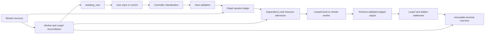
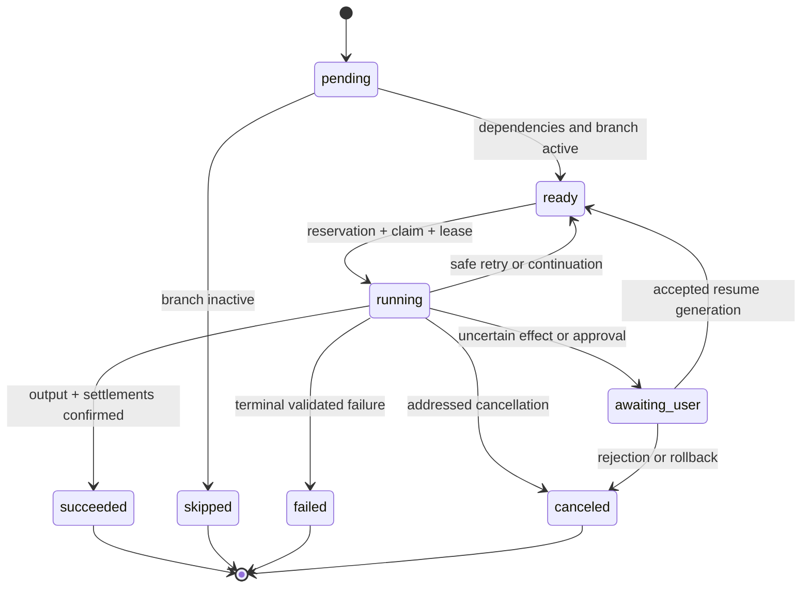

# Agent Note: Graph and LoopX durable project control plane

Status: proposed

English | [中文](2026-08-18-graph-loopx-durable-project-control-plane.zh.md)

## Problem

Session Graph Mode provides immutable revisions, structured branch groups, bounded repair and subgraph policies, stable operation records, numbered retryable settlement attempts, local restart recovery with tagged Worker/workspace/resource/LoopX reconciliation, an eight-operation coordination seam with progress and cancellation, a validated SQLite projection for LoopX event cursors and progress deduplication, authenticated HTTP and local Worker adapters, session-scoped human controls, global role-template editing with session snapshots, child-session cancellation, dual design/execution projections, SQLite model-resource reservations shared across local Host processes, shared Scheduler, resource, Worker, and artifact Provider conformance for ownership, fencing, recovery, cancellation, OOM backoff, and artifact integrity, and attempt-attributed content-addressed artifacts on a shared filesystem. The HTTP Worker path signs bounded requests, persists identity before dispatch, deduplicates starts, uses a durable service epoch to fence superseded process writes, quarantines uncertain jobs after restart, and reconciles exact underlying references. It also exposes authenticated cross-Host Scheduler and Resource operations plus bounded RPC Artifact transfer with durable opaque mappings and end-to-end digest checks. The SQLite Resource Provider can admit against expiring queue and device-memory snapshots from a trusted model runtime or sidecar. Those foundations do not constitute a replicated production control plane: arbitrary external effects still require Provider reconciliation, and object-store-scale transfer, resumable remote processes, fleet-wide enumeration, high-availability authorities, model-server-specific metrics adapters, and remote Worker streaming health remain deployment work. Completing those guarantees independently would create competing identities, terminal states, and recovery rules.

The product needs one architecture in which Graph remains authoritative for deterministic execution and evidence while LoopX remains authoritative for long-lived cross-session and cross-process coordination. Neither system may infer the other's state from display text or silently overwrite a conflicting terminal outcome.

## Proposal

Graph Mode will evolve into a durable project control plane through five related designs:

- [Structured Graph control flow and bounded subgraphs](2026-08-18-structured-graph-control-flow-and-subgraphs.md) owns typed node outputs, branch groups, dynamic expansion, nested subgraphs, automatic review repair, and termination policies.
- [Durable Graph execution recovery and idempotency](2026-08-18-durable-graph-execution-recovery-and-idempotency.md) owns stable work identities, the operation journal, restart recovery, external references, settlement records, idempotent effects, and orphan cleanup.
- [LoopX distributed coordination protocol](2026-08-18-loopx-distributed-coordination-protocol.md) expands coordination into leases, heartbeats, observation, progress, cancellation, settlement, and reconciliation.
- [Graph worker isolation and resource scheduling](2026-08-18-graph-worker-isolation-and-resource-scheduling.md) owns remote workers, isolated workspaces, file ownership, artifact transfer, and live model-resource admission.
- [Human Graph control and revision recovery](2026-08-18-human-graph-control-and-revision-recovery.md) owns `awaiting_user`, approval, rejection, task modification, exact-node resume, model or role overrides, skip, retry, and rollback-as-new-revision.

The existing [global role templates](2026-08-18-global-graph-role-templates.md), [progressive planning checkpoints](2026-08-18-progressive-graph-planning-checkpoints.md), [dual design and execution views](../../implemented/feature/2026-08-18-dual-graph-design-and-execution-views.md), and [user-operated cancellation](2026-08-18-user-operated-graph-cancellation.md) remain direct product requirements. They consume the shared identities and terminal-state rules defined by the five designs instead of creating separate control paths.

This note and its nine linked designs are the approved formal product target. All requirements in that set are mandatory; terms such as later stage or deployment work describe delivery order, not optional scope. The repository permits only `proposed` and `implemented` lifecycle states, so `proposed` here means an approved target that is partly built rather than a claim that every guarantee has shipped. A capability becomes current product behavior only when its owning note moves to `implemented` with the required unit, assembled snapshot, restart, browser, and provider-conformance evidence.

## Product contract

| Product requirement | Owning design | Required durable evidence |
| --- | --- | --- |
| `/graph` activation and controller classification of every later user input | This note and Session Graph Mode | Session configuration snapshot and controller submission |
| New task versus adjustment of the current task | Structured control flow and human revision recovery | Intent, graph id, parent revision, and changed-node set |
| Dependency-aware tasks, conditions, branch groups, dynamic nodes, and nested subgraphs | Structured control flow | Immutable revision, typed output, branch evaluation, and child-run reference |
| Review rejection followed by targeted repair and downstream re-execution | Progressive planning and human revision recovery | Structured issues, replacement revision, invalidation closure, and reused-node source references |
| Role prompt, default model, reasoning selector, team membership, and per-model concurrency | Global role templates | Global template revision plus immutable per-session snapshot |
| Model-aware node sizing, token continuation, and controller replanning after discovery | Progressive planning checkpoints | Planning checkpoint, capability observations, continuation ids, and replacement revision |
| Restart recovery, idempotency, reconciliation, and orphan cleanup | Durable execution recovery | Operation journal, external references, generation fencing, settlement, and cleanup decision |
| LoopX project sharing across agents and processes | Distributed coordination protocol | Work id, claim, lease, heartbeat, progress, cancellation, and reconciliation records |
| Remote workers, isolated workspaces, file ownership, artifact transfer, and OOM-aware scheduling | Worker isolation and resource scheduling | Assignment, reservation, workspace allocation, mutation manifest, artifact manifest, and typed resource outcome |
| User approval, rejection, stop, retry, skip, override, resume, and rollback | Human control and user cancellation | Precisely addressed control operation and resulting generation or revision |
| Horizontal design graph, execution history, node details, effective model, timing, and results | Dual graph views | Projection-only view of the session ledger; UI state is never authority |

The target does not promise general exactly-once execution for arbitrary tools, automatic semantic merges, or a cyclic mutable graph. It promises one accepted terminal result per fenced operation, explicit uncertainty when reconciliation cannot prove an external effect, and immutable revisions for every feedback cycle.

## Formal target baseline

The product is complete only when every row in the product contract is implemented together. A polished graph without durable recovery is a viewer, LoopX calls without fencing are advisory messages, and retry without effect classification can duplicate work; none independently satisfies the target. A release may expose an incomplete stage only when the UI names its actual guarantee and does not present a local or simulated mechanism as distributed authority.

The formal baseline has four non-negotiable invariants. First, one session ledger can reconstruct every model-visible plan, assignment, result, control decision, and terminal conclusion. Second, every asynchronous effect is preceded by durable intent and followed by a numbered settlement or an explicit uncertain outcome. Third, only a current fenced owner may advance a run, node, claim, workspace, reservation, or settlement. Fourth, a revision is immutable and acyclic; feedback changes future execution by creating a revision or generation with an explicit trigger reference.

The baseline distinguishes three deployment levels without weakening semantics. A single-process profile may use in-memory Providers, a local durable profile may use SQLite and shared filesystem Providers, and a distributed profile requires authenticated multi-Host Scheduler, Worker, coordination, artifact, workspace, and resource Providers. All three consume the same domain records and conformance suites. A Provider that cannot supply the required identity, fencing, reconciliation, or security property fails configuration rather than silently downgrading it.

## Authority and state model

The session log is the authoritative Graph ledger. It contains immutable graph revisions, run generations, operation transitions, structured outputs, human decisions, external references, settlement attempts, and reconciliation outcomes. Projections and browser state are derived and may be rebuilt without current global settings or live LoopX access.

LoopX is the authoritative project-coordination ledger for goals, todos, peers, claims, leases, bounded progress, and cross-process observation. A Graph operation retains the exact LoopX references and fencing token it used. Reconciliation compares both ledgers and appends a result to Graph; it never edits historical Graph events or adopts untagged LoopX work.

Graph revisions remain acyclic. Rework, retry, rollback, dynamic expansion, and loop iterations create a new immutable revision or run generation linked to their predecessor. This keeps every result attributable while permitting project-level feedback cycles.

Every logical node execution has a stable identity derived from session, graph, revision, and node. Physical attempts, leases, settlements, and control requests have distinct opaque ids under that identity. A settlement keeps one stable id while appending one-based attempts; failure or conflict may open the next attempt, while confirmation seals the identity. An accepted terminal transition is immutable; later completion, cancellation, lease expiry, or reconciliation can record an observation but cannot revive or replace it.

The durable record model is intentionally explicit:

| Record | Purpose | Identity or ordering rule |
| --- | --- | --- |
| Session configuration snapshot | Frozen roles, prompts, routes, reasoning selectors, limits, and policies | First Graph activation or explicit session change |
| Graph revision | Immutable nodes, edges, schemas, branch groups, checkpoints, subgraphs, and termination policy | Contiguous revision with parent and change set |
| Run generation | One execution interpretation of one revision | Monotonic generation with owner epoch |
| Node attempt | Worker assignment, timing, continuation, structured result, and failure | Ordered attempt under one stable work id |
| Operation journal | Intent, external call stages, references, and reconciliation decisions | Append-only transition under one operation id |
| Settlement | Terminal evidence for an external or internal operation | Stable settlement id with numbered attempts |
| Human control | Precisely addressed approval, rejection, modification, retry, skip, rollback, override, or cancellation | Idempotent control id and expected revision/generation |
| Checkpoint | Durable pause reason, evidence, allowed decisions, and wake state | Stable checkpoint id in one revision/generation |
| Artifact and mutation manifest | Content hashes, sizes, paths, ownership, and integration evidence | Attempt-attributed and content-addressed |
| Resource reservation | Exact route, weight, capacity reason, lease, and expiry | Fenced reservation under the run owner epoch |

## Package topology

The first implementation will extend the existing Graph family instead of creating a privileged runtime outside plugins.

| Package | Role |
| --- | --- |
| `dsh-graph` | Durable ids, schemas, revisions, branch groups, run generations, operation journal, settlements, controls, projection, and validation. |
| `dsh-graph-mode` | Controller policy, submission and control Consumers, deterministic scheduler, checkpoint wakeups, recovery coordinator, and assembled session behavior. |
| `dsh-graph-coordination` | Versioned distributed-coordination Service Definition and conformance suite. |
| `dsh-graph-coordination-loopx` | LoopX Provider implementing claims, leases, progress, cancellation, settlement, observation, reconciliation, and a same-filesystem SQLite event projection. |
| `dsh-graph-worker` | Worker assignment, lifecycle, artifact, cancellation, fencing, and capability Service Definition plus scheduler Consumer. |
| `dsh-graph-worker-local` | Local isolated Worker Provider over existing subagent, filesystem, subprocess, sandbox, and workspace capabilities. |
| `dsh-graph-worker-remote` | Authenticated remote Worker Provider and wire protocol; optional in the Web profile. |
| `dsh-graph-resources` | Resource snapshot and reservation Service Definition, hard-ceiling scheduler Consumer, and provider conformance suite. |
| `dsh-graph-resources-sqlite` | Durable same-filesystem reservation, fencing, OOM backoff, and cross-process recovery Provider. |
| `dsh-client-ui-graph` | Global templates, design/execution views, evidence drawers, resource and settlement status, and precisely addressed human controls. |

Each new capability follows Service Definition, Provider, and Consumer roles. `dsh-graph-mode` remains a plugin Consumer; neither `agent-loop` nor the default session driver becomes Graph-aware.

## End-to-end execution

The Host appends intent before starting an effect, stages and validates output before activating successors, and records required settlements before terminal completion. Recovery repeats reconciliation and settlement operations under stable ids; it does not repeat a worker unless policy and provider evidence establish that doing so is safe.

## Controller and graph semantics

Every human input reaches the controller before work is admitted. The controller returns one of `new`, `revise`, `inspect`, `control`, `clarify`, or `direct`. `new` creates a new graph id. `revise` names the current graph and next contiguous revision, identifies directly changed nodes, and invalidates their complete transitive successor closure. The remaining classifications cannot smuggle in a graph mutation.

The controller is outside the DAG. Analysis and architecture may end at a planning checkpoint that wakes the controller, but no edge points back to a controller node. Review and verification publish a structured `approved`, `rejected`, or `needs-user` decision with issue ownership. Rejection creates a replacement revision containing repair work; it never creates a runtime cycle in the accepted revision.

Conditional edges inspect only schema-validated predecessor JSON. A named branch group combines its members as `all`, `any`, `exactly-one`, or `activated`; the scheduler persists every member result and the group decision before activating or skipping the target. Ambiguity, including two matches in `exactly-one`, is an execution error or human checkpoint according to the revision's termination policy, not a controller guess based on review prose.

Dynamic expansion is a proposal with a bounded node count and stable keys. The Host validates ids, schemas, roles, dependencies, ownership, and termination limits before committing the next immutable revision. A nested subgraph has an explicit input/output mapping, ancestry chain, depth ceiling, and its own run id. Parent successors observe only mapped, validated output.

The controller submits a semantic plan draft, not a storage-ready revision. The draft contains tasks, dependencies, specialized schemas, branch policy, and role assignments. Graph Mode owns an explicit `resolve(draft, sessionSnapshot, providerCapabilities): GraphRevision` step that fills timestamps, ordinary schemas, workspace allocation, retry weights, termination policy, and every other deployment tunable from frozen Host configuration, derives identities, and then validates the complete revision once. Rejection returns one aggregate diagnostic with every invalid field and a compact corrected example. A controller must never discover mandatory non-semantic fields through repeated one-field-at-a-time tool failures.

The deterministic scheduler advances a run through one repeated transaction-like cycle:

1. Fold the ledger, verify the expected revision and generation, acquire or renew exclusive whole-run ownership, and stop without writing after authority is lost.
2. Evaluate predecessor terminal states and persisted branch-group decisions, then mark inactive nodes skipped and derive the stable ready set in topological and FIFO order.
3. Resolve the frozen assignment and acquire workspace, model, role, provider, weighted, and exact-route reservations without exceeding any configured hard ceiling.
4. Persist operation intent, prepare coordination, claim fenced work, and dispatch one Worker assignment containing only declared inputs, capabilities, roots, credentials, deadline, and ids.
5. Heartbeat Scheduler, Worker, resource, and LoopX leases; publish bounded progress while keeping the child session authoritative for complete execution evidence.
6. Stage the Worker result, validate its schema and size, capture artifacts and mutations, and persist the output before activating a successor or writing external success.
7. Settle coordination, artifacts, reservations, and workspace under stable ids; only confirmed required settlements permit the node's accepted terminal transition.
8. Recompute readiness, pause at an eligible planning, review, resource, or human checkpoint, or finish the generation using its declared terminal policy and emit one controller synthesis wakeup.

No-progress detection considers runnable work, live leases, resource waits with future eligibility, pending settlements, active checkpoints, and watch cursors. When none can advance within the configured policy, the run terminates as failed or `awaiting_user`; it never polls forever or asks a model to infer scheduler state.

## Default software-engineering team

The built-in template contains one controller and six workers. It is a starting point, not a hard-coded team: global settings may add, duplicate, reorder, disable, or remove worker roles while preserving one enabled controller and at least one worker.

| Role | Default responsibility | Default parallelism intent |
| --- | --- | --- |
| Controller | Classify input, select checkpoints, submit revisions, and synthesize accepted evidence | One; controller capacity is reserved |
| Analyst | Requirements, constraints, repository facts, risks, and acceptance criteria | Parallel across independent discovery scopes |
| Architect | Component ownership, interfaces, persistence, failure semantics, and integration plan | Normally one per graph revision |
| Engineer | One implementation scope with owned files and focused tests | Limited by exact model and writable-root reservations |
| Reviewer | Correctness, security, lifecycle, and maintainability findings | Parallel only for independent review scopes |
| Verifier | Focused checks, failure diagnosis, and residual risk | Parallel when test resources do not conflict |
| Writer | Authoritative user and developer documentation | Usually after accepted implementation evidence |

The controller first creates the smallest discovery/design graph supported by available evidence. After the architecture checkpoint it sees repository structure, structured worker results, the frozen role/model configuration, known model capacities, resource waits, and artifacts. It then approves the existing executable portion or submits a finer replacement revision. This makes node granularity a controller responsibility while preventing a local model's context or output ceiling from becoming a repeated whole-node retry.

## Execution and recovery state machines

A restart creates a higher owner epoch for a nonterminal run and fences older workers. Recovery folds the session ledger, discovers external references, calls Worker and LoopX reconciliation, and chooses exactly one action: accept an already confirmed terminal outcome, resume an existing live lease, repeat an idempotent operation, complete a pending settlement, or enter `awaiting_user`. An `unknown` external result is never converted into success and never blindly re-executed when the node's effect policy is `manual` or `reconcile`.

The cleanup controller finds Graph-tagged LoopX todos, leases, workspace allocations, reservations, and staged artifacts that no live operation owns. It records `retained`, `settled`, `canceled`, `quarantined`, or `deleted` before mutation. Untagged LoopX work and user files are outside its authority.

## Worker, workspace, and resource model

The scheduler resolves an exact worker provider, role snapshot, model route, reasoning selector, workspace mode, tool policy, credential references, read roots, write roots, artifact requirements, deadlines, and fencing token before dispatch. Local and remote providers implement the same versioned assignment protocol. Remote identity, transport, and artifact validation are deployment concerns; remote workers never receive the whole session log or mutable global settings.

Parallel mutation defaults to an isolated allocation. Shared writable roots require an explicit serialization dependency or exclusive integration node. Successful isolated work produces a path-safe, size-bounded, content-addressed manifest; an integration node applies it under an exclusive lease and exposes merge conflicts as structured output. Cancellation stops future activity but does not claim to undo already published filesystem or external effects.

Static global, role, provider/model, and weighted limits are hard ceilings. Expiring telemetry may reduce eligibility from route health, active requests, queue depth, context/output capacity, available device memory, or recent OOM evidence, but cannot raise a configured limit. Admission durably records its waiting reason and reservation. Capacity rejection, OOM, and `max-tokens` are distinct typed outcomes that can respectively wait/back off, choose a pre-approved alternate route, continue the same child within budget, or create a planning checkpoint; the scheduler never silently changes model or role.

## LoopX protocol and ledger reconciliation

The provider-neutral protocol is `prepare`, `claim`, `heartbeat`, `observe/watch`, `publishProgress`, `settle`, `cancel`, and `reconcile`. `prepare` validates goal and peer bindings without speculative todos. `claim` creates or reuses a Graph-tagged work item and returns a fenced lease. Heartbeats renew only that lease and return its current lease id and fencing token; Graph persists every advanced identity before later control or settlement uses it. Progress is bounded public-safe evidence. Settlement is idempotent under a stable settlement id. Cancellation is requested and observed rather than assumed. Reconciliation compares the two ledgers after restart and records the decision in Graph.

Harness remains authoritative for the graph, model-visible input, worker transcript, structured output, and terminal operation. LoopX remains authoritative for its goal, todo, peer, claim, lease, and shared progress. A display label, todo description, or agent-written sentence is never parsed to infer a branch, completion, or ownership decision.

Reconciliation uses the following closed decision table; Providers may add evidence but not invent another terminal meaning:

| External evidence | Graph evidence | Required decision |
| --- | --- | --- |
| Confirmed terminal with matching work id, epoch, and settlement | Intent or staged result exists | Record confirmation and finish the pending settlement without rerunning the Worker |
| Live lease with matching current owner | Nonterminal operation exists | Resume observation and heartbeat under that exact lease |
| Absent work | Effect is declared idempotent and retry budget remains | Open the next physical attempt under the same logical work identity |
| Absent work | Effect is manual or reconciliation-required | Enter `awaiting_user`; do not infer that the effect did not occur |
| Conflicting owner, fencing token, output hash, or terminal result | Any local nonterminal state | Fence local execution, retain both records, and enter `awaiting_user` or quarantine according to policy |
| Unknown or unreachable | Effect may have escaped the process | Preserve uncertainty and wait for operator or Provider evidence |
| Required settlement failed after validated output | Staged output exists | Retry the same settlement id with a higher attempt number; never rerun accepted work merely to repeat writeback |
| Expired reservation, workspace, or artifact staging reference | No accepted dependent effect | Record cleanup disposition and reacquire or rebuild only through its owning Provider |

## Human control and UI

`awaiting_user` is a durable state with a reason, permissible decisions, and exact target. Every command carries an operation id plus graph, revision, generation, run, and optional node or checkpoint identity. Repeated delivery is idempotent. Retry and resume create a new run generation; changing task meaning or rolling back creates a new graph revision. Accepted upstream changes invalidate every transitive successor, which re-executes in dependency order unless a new revision removes it.

The Graph surface is horizontal and has two synchronized but distinct sections. The design section renders the controller's immutable revision, dependencies, branch groups, subgraphs, checkpoints, and revisions. The execution section renders actual attempts, phases, effective role/model/reasoning selection, worker and workspace, wait reason, timing, progress, outputs, artifacts, settlements, and conflicts. Selecting a node opens its child sessions, tool and model events, continuation sessions, reconciliation evidence, and controls. The settings plugin owns global role templates; the session panel edits only the session snapshot and clearly labels that historical scope.

## Design precedents

The design adopts mechanisms with demonstrated use while keeping Harness ownership explicit. [LangGraph persistence](https://docs.langchain.com/oss/python/langgraph/persistence), [interrupts](https://docs.langchain.com/oss/python/langgraph/interrupts), and [subgraphs](https://docs.langchain.com/oss/python/langgraph/use-subgraphs) support checkpointed state, pending writes, human decisions, immutable forks, and isolated nested invocations. [AutoGen GraphFlow](https://microsoft.github.io/autogen/stable/user-guide/agentchat-user-guide/graph-flow.html) demonstrates explicit sequential, parallel, conditional, and bounded-loop flow rather than relying on free-form agent conversation. [Temporal durable execution](https://docs.temporal.io/) supports recording replayable workflow state while treating external activities as separately retryable effects. [Kubernetes Leases](https://kubernetes.io/docs/concepts/architecture/leases/) support holder identity, renewal time, duration, transitions, and expiry rather than permanent claims.

These precedents do not become runtime dependencies. Graph uses the Harness session ledger because it must reconstruct model-visible state and child evidence; LoopX remains the coordination provider instead of being replaced by a general workflow server.

## History, versioning, and retention

The first Graph activation copies the current global role template into a complete session event. Every graph revision and run generation refers to that session-owned snapshot or an explicit later session change; merely opening global settings never reinterprets history. Child transcripts and artifact manifests retain their stable references even when a remote worker or LoopX is offline.

During the repository's pre-release period, unknown durable Graph versions fail closed, consistent with the repository-wide storage policy. The UI must report the exact unsupported event and still offer raw session-log export instead of presenting an empty graph. Before the first tagged release, the Graph format needs a documented monotonic version, transactional migration or explicit import rejection, backup behavior, and fixture coverage for every supported upgrade. Global-template isolation is permanent; format migration is a separate storage concern.

Retention is policy-driven. Immutable revision, control, operation, and settlement evidence remains exportable. Large child transcripts, workspace allocations, and artifacts may be compacted or deleted only after references are resolved according to policy; compaction retains identities, hashes, terminal evidence, and the fact that detailed material was removed.

## Delivery order and completion gates

The designs will ship in dependency order rather than as one release-sized change.

1. The control-flow gate requires structured outputs, branch-group truth tables, dynamic and nested graph validation, bounded review repair, explicit terminal outcomes, and controller checkpoint replanning.
2. The local-durability gate requires stable identities, operation and settlement journals, crash recovery at every effect stage, safe idempotency decisions, cleanup dispositions, and precisely addressed human controls.
3. The coordination gate requires the versioned eight-operation LoopX conformance suite, leases, heartbeat, ordered observation, progress, cancellation, settlement, restart reconciliation, and stale-owner rejection.
4. The distributed-execution gate requires authenticated remote Workers, isolated workspaces, enforced write ownership, verified artifact transfer, durable resource reservations, telemetry expiry, OOM and rate-limit backoff, and multi-Host run ownership.
5. The product gate requires global-template/session-snapshot isolation, controller synthesis, horizontal Design and Execution views, complete node evidence, child-session navigation and cancellation, every operator action, real-server browser coverage, and operational restart/load evidence.

The visual, template, checkpoint, and cancellation proposals may advance alongside the first stages, but no UI action may claim restart safety or distributed authority before the owning runtime stage is complete.

## Verification matrix

| Tier | Required proof |
| --- | --- |
| Domain | Schema rejection, branch-group truth tables, cycle checks, invalidation closure, revision and generation identity, and terminal-state exclusivity |
| Controller admission | Minimal plan drafts resolve to complete revisions in one tool call; malformed drafts return one aggregate diagnostic and never enter an unbounded correction loop |
| Scheduler | Deterministic readiness, FIFO fairness, hard ceilings, resource waits, continuation, bounded repair, cancellation, and no-progress termination under fake time |
| Recovery | Crash injection after every operation stage, lease expiry and takeover, pending settlement replay, uncertain manual effects, and orphan cleanup |
| Coordination | One provider-neutral conformance suite for all eight operations, repeated delivery, stale fencing, watch disconnect, and LoopX process restart |
| Worker | Local and remote assignment, capability mismatch, workspace isolation, undeclared writes, artifact corruption, cancellation, and worker loss |
| Assembled product | Keyless snapshot through a real profile for new work, revision, branch, repair, checkpoint, restart, and completion synthesis |
| Browser | Real server and model flow showing global templates, horizontal design/execution views, effective model, child details, resource waits, and every human control |
| Operational | Multi-process load with model OOM/rate-limit signals, Host/Worker/LoopX restarts, telemetry expiry, and bounded cleanup without credential or path leakage |

Each acceptance path must include a rejecting case at the parser, durable, worker, process, or wire boundary that owns hostile input. A test that only mutates an in-memory UI store cannot prove a persistent or distributed guarantee.

## Alternatives considered

**Treat Graph as a richer multi-agent chat UI.** This would leave recovery, retries, external effects, and coordination dependent on prompt interpretation. Durable execution requires machine-readable identities and transitions below the conversation presentation.

**Let LoopX become the Graph scheduler.** LoopX owns long-lived coordination, not the authoritative session transcript, model routing, tool execution, or immutable graph revision rules. Moving scheduling there would split model-visible evidence from the runtime that produced it.

**Adopt a general workflow engine as the only ledger.** A workflow engine could supply timers and retries, but it would not automatically preserve Harness session events, child transcripts, role snapshots, model selections, or LoopX project semantics. A future provider may use such an engine beneath the Graph execution seam, but Graph identities and evidence remain the product contract.

**Implement all capabilities in one package and one schema change.** The result would couple UI, persistence, remote execution, and external coordination so tightly that no stage could be tested or deployed independently. The five designs share identities and outcomes while retaining separate capability seams.

## Acceptance criteria

- Every capability in the five linked designs has an owning package or capability seam, durable records, failure behavior, and product-visible acceptance coverage.
- Every requirement in this note and all nine linked designs is treated as mandatory scope; deferred production Providers remain an unmet gate rather than an optional enhancement.
- A project can execute structured branches and bounded repair revisions, restart during any nonterminal phase, reconcile LoopX, and reach one auditable terminal outcome without duplicating an accepted effect.
- A local or remote worker uses the same stable Graph identity, lease fencing, artifact evidence, and model-resource admission rules.
- A user can pause, approve, reject, revise, resume, skip, retry, cancel, or roll back through precisely addressed operations whose results survive replay and export.
- Historical sessions remain independent of later global role-template changes and external control-plane availability.
- The assembled Web application exposes design, execution, checkpoint, settlement, reconciliation, resource, and human-decision evidence without treating display state as authority.

## Risks

This direction adds durable schemas, recovery paths, lease timing, external reconciliation, and several operator actions. An incomplete stage can be more dangerous than an absent feature if the UI implies stronger guarantees than the runtime provides. Exactly-once execution is not generally possible for arbitrary external tools; the design instead requires idempotency keys where supported, durable intent and settlement records, fencing, and explicit uncertain outcomes where reconciliation cannot prove a result. Remote execution also expands credential, workspace, and artifact trust boundaries that must remain opt-in and fail closed.
