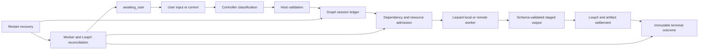
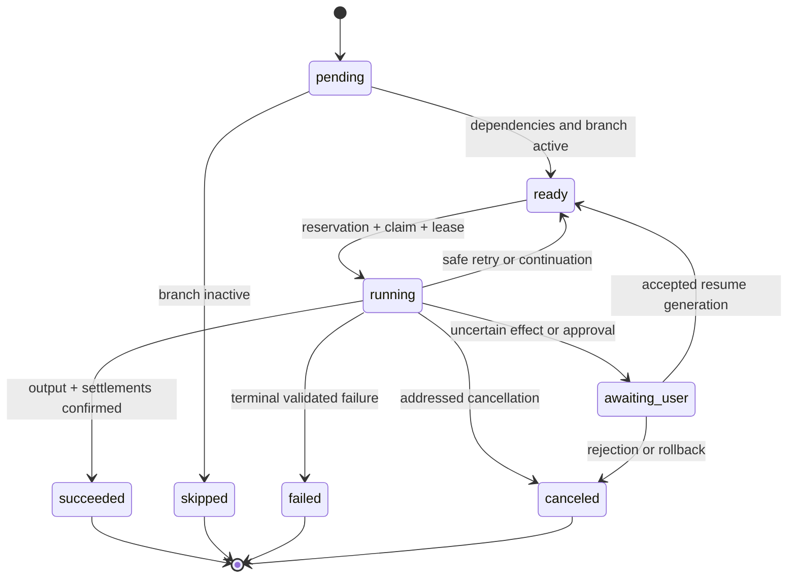

# Agent Note: Graph 与 LoopX 持久化项目控制面

Status: proposed

[English](2026-08-18-graph-loopx-durable-project-control-plane.md) | 中文

## Problem

Session Graph Mode 提供不可变 Revision、结构化分支组、有界返工和子图策略、稳定操作记录、带编号且可重试的 Settlement Attempt、对 Graph 标记的 Worker/工作区/资源/LoopX 引用执行本地重启对账、带进度与取消的八操作协作 Seam、经过验证的 SQLite LoopX 事件 Cursor 与进度去重投影、认证 HTTP 与本地 Worker 适配器、会话级人工控制、带会话快照的全局角色模板编辑、子会话终止、设计/执行双投影视图、本地 Host 进程共享的 SQLite 模型资源预留、覆盖所有权、Fencing、恢复、取消、OOM 退避与制品完整性的共享 Scheduler、资源、Worker 和 Artifact Provider 一致性测试，以及共享文件系统上的带 Attempt 归属内容寻址 Artifact。HTTP Worker 路径对有界请求签名，在分派前持久化身份，对启动去重，使用持久化服务 Epoch 阻止被替代进程继续写入，在重启后隔离不确定作业，并对账精确的底层引用。它还公开认证跨 Host Scheduler、Resource 操作和带持久化不透明映射、端到端摘要校验的有界 RPC Artifact 传输。SQLite Resource Provider 可以依据可信模型运行时或 Sidecar 发布的带过期时间队列与设备显存 Snapshot 执行准入。这些基础不构成复制式生产控制面：任意外部副作用仍需要 Provider 对账，对象存储规模传输、可恢复远程进程、集群级枚举、高可用权威源、模型服务器专用指标适配器和远程 Worker 流式健康信息仍属于部署工作。如果分别补充这些保证，将产生相互竞争的身份、终态和恢复规则。

产品需要一套统一架构：Graph 对确定性执行和证据负责，LoopX 对跨会话、跨进程的长期协作负责。任何一方都不得从展示文本推断另一方状态，也不得静默覆盖冲突的终态。

## Proposal

Graph Mode 将通过五项关联设计演进为持久化项目控制面：

- [结构化 Graph 控制流与有界子图](2026-08-18-structured-graph-control-flow-and-subgraphs.zh.md)负责类型化节点输出、分支组、动态扩展、嵌套子图、自动评审返工和终止策略。
- [Graph 持久执行恢复与幂等](2026-08-18-durable-graph-execution-recovery-and-idempotency.zh.md)负责稳定工作身份、操作日志、重启恢复、外部引用、Settlement 记录、幂等副作用和孤儿清理。
- [LoopX 分布式协作协议](2026-08-18-loopx-distributed-coordination-protocol.zh.md)把协作扩展为租约、心跳、观察、进度、取消、Settlement 和对账。
- [Graph Worker 隔离与资源调度](2026-08-18-graph-worker-isolation-and-resource-scheduling.zh.md)负责远程 Worker、隔离工作区、文件所有权、制品传输和实时模型资源准入。
- [Graph 人工控制与 Revision 恢复](2026-08-18-human-graph-control-and-revision-recovery.zh.md)负责 `awaiting_user`、审批、拒绝、修改任务、精确节点恢复、模型或角色覆盖、跳过、重试以及以新 Revision 表达的回滚。

现有的[全局角色模板](2026-08-18-global-graph-role-templates.zh.md)、[渐进式规划检查点](2026-08-18-progressive-graph-planning-checkpoints.zh.md)、[设计与执行双图](../../implemented/feature/2026-08-18-dual-graph-design-and-execution-views.zh.md)和[用户取消](2026-08-18-user-operated-graph-cancellation.zh.md)仍是直接产品需求。它们使用上述五项设计定义的共享身份和终态规则，而不是建立独立控制路径。

本说明及其链接的九项设计共同构成已经批准的正式产品目标。这套目标中的全部要求均为必选项；“后续阶段”或“部署工作”只表示交付顺序，不表示可选范围。仓库生命周期只允许 `proposed` 与 `implemented`，因此这里的 `proposed` 表示已批准且部分实现的目标，不表示所有保证均已交付。只有在所属说明转为 `implemented`，并具备规定的单元测试、组装快照、重启测试、浏览器测试和 Provider Conformance 证据后，该能力才属于当前产品行为。

## Product contract

| 产品需求 | 所属设计 | 必须持久化的证据 |
| --- | --- | --- |
| 通过 `/graph` 启用，并由主控判定之后每一次用户输入 | 本说明与 Session Graph Mode | 会话配置快照和主控提交 |
| 区分新任务与当前任务调整 | 结构化控制流与人工 Revision 恢复 | Intent、Graph ID、父 Revision 和直接变更节点集合 |
| 依赖任务、条件、分支组、动态节点和嵌套子图 | 结构化控制流 | 不可变 Revision、类型化输出、分支判定和子运行引用 |
| 评审拒绝后定向返工并重新执行全部下游 | 渐进式规划与人工 Revision 恢复 | 结构化 Issue、替换 Revision、失效闭包和节点复用来源 |
| 角色提示词、默认模型、推理选择器、成员数量和每模型并行度 | 全局角色模板 | 全局模板版本和不可变会话快照 |
| 按模型能力拆分节点、Token 延续以及发现阶段后的主控重规划 | 渐进式规划检查点 | 规划检查点、能力观测、延续会话 ID 和替换 Revision |
| 重启恢复、幂等、对账和孤儿清理 | 持久执行恢复 | 操作日志、外部引用、代次 fencing、Settlement 和清理决定 |
| Agent 与进程之间通过 LoopX 共享项目状态 | 分布式协作协议 | Work ID、Claim、租约、Heartbeat、进度、取消和对账记录 |
| 远程 Worker、隔离工作区、文件所有权、制品传输和 OOM 感知调度 | Worker 隔离与资源调度 | Assignment、Reservation、工作区分配、变更清单、制品清单和类型化资源结果 |
| 用户审批、拒绝、停止、重试、跳过、覆盖、恢复和回滚 | 人工控制与用户取消 | 精确寻址的控制操作及其产生的运行代次或 Revision |
| 横向设计图、执行历史、节点明细、实际模型、耗时和结果 | 设计与执行双图 | 仅由会话账本派生的 Projection；UI 状态永远不是权威状态 |

目标不承诺任意工具的通用 exactly-once、自动语义合并或可变循环图。目标承诺每个 fenced 操作只有一个被接受的终态；无法通过对账证明外部副作用时显式记录不确定结果；所有反馈循环都通过不可变 Revision 表达。

## Formal target baseline

只有 Product contract 中的每一项能力共同实现，产品才算完成。美观的任务图如果没有持久恢复，只是查看器；没有 fencing 的 LoopX 调用只是建议性消息；没有副作用分类的重试可能重复执行工作。这些能力单独存在都不满足目标。尚未完成的阶段可以发布，但 UI 必须准确标明实际保证，不能把本地机制或模拟机制表述为分布式权威。

正式基线包含四项不可妥协的不变量。第一，同一份 Session Ledger 可以重建所有模型可见规划、分派、结果、控制决定和终态结论。第二，每个异步副作用之前都有持久 Intent，之后都有带编号的 Settlement 或显式不确定结果。第三，只有持有当前 fencing 身份的 Owner 才能推进 Run、Node、Claim、工作区、Reservation 或 Settlement。第四，Revision 不可变且无环；反馈通过带显式来源的新 Revision 或 Generation 改变后续执行。

基线区分三种部署级别，但不削弱语义。单进程 Profile 可以使用内存 Provider，本地持久 Profile 可以使用 SQLite 与共享文件系统 Provider，分布式 Profile 则必须提供经过认证的多 Host Scheduler、Worker、Coordination、Artifact、Workspace 与 Resource Provider。三种级别使用相同的 Domain Record 和 Conformance Suite。Provider 如果无法提供所需的身份、fencing、对账或安全属性，必须在配置阶段失败，不能静默降级。

## Authority and state model

会话日志是 Graph 权威账本，保存不可变图 Revision、运行代次、操作转换、结构化输出、人工决定、外部引用、Settlement 尝试和对账结果。Projection 和浏览器状态都是派生数据，可以在不读取当前全局设置或实时 LoopX 的情况下重建。

LoopX 是目标、Todo、Peer、Claim、租约、有界进度和跨进程观察的权威项目协作账本。Graph 操作保留其使用的精确 LoopX 引用和 fencing token。对账比较两份账本并向 Graph 追加结果；它不会编辑历史 Graph 事件，也不会接管没有 Graph 标记的 LoopX 工作。

Graph Revision 始终无环。返工、重试、回滚、动态扩展和循环迭代通过新的不可变 Revision 或运行代次表示，并链接其前驱。这样既保持每个结果可归因，也允许项目层反馈循环。

每个逻辑节点执行都有由 Session、Graph、Revision 和 Node 派生的稳定身份。物理 Attempt、租约、Settlement 和控制请求在该身份下使用不同的不透明 ID。一个 Settlement 保持同一稳定 ID 并追加从一开始的编号 Attempt；失败或冲突可以开启下一 Attempt，确认则封存该身份。已接受的终态不可变；之后的完成、取消、租约过期或对账只能记录观察，不能复活或替换该终态。

持久记录模型保持显式：

| 记录 | 用途 | 身份或顺序规则 |
| --- | --- | --- |
| Session 配置快照 | 冻结角色、提示词、路由、推理选择器、限制和策略 | 首次启用 Graph 或显式会话变更 |
| Graph Revision | 不可变节点、边、Schema、分支组、检查点、子图和终止策略 | 带父级与变更集合的连续 Revision |
| Run Generation | 对一个 Revision 的一次执行解释 | 带 Owner Epoch 的单调 Generation |
| Node Attempt | Worker 分派、时间、延续、结构化结果和失败 | 在一个稳定 Work ID 下有序排列 |
| Operation Journal | Intent、外部调用阶段、引用和对账决定 | 在一个 Operation ID 下只追加转换 |
| Settlement | 外部或内部操作的终态证据 | 稳定 Settlement ID 和带编号 Attempt |
| Human Control | 精确寻址的审批、拒绝、修改、重试、跳过、回滚、覆盖或取消 | 幂等 Control ID 与预期 Revision/Generation |
| Checkpoint | 持久暂停原因、证据、允许决定和唤醒状态 | 一个 Revision/Generation 内的稳定 Checkpoint ID |
| Artifact 与 Mutation Manifest | 内容 Hash、大小、路径、所有权和集成证据 | 归属于 Attempt 且内容寻址 |
| Resource Reservation | 精确路由、权重、容量原因、租约和过期时间 | 位于 Run Owner Epoch 下的 fenced Reservation |

## Package topology

第一阶段实现将扩展现有 Graph 家族，而不是在插件之外创建特权运行时。

| 包 | 职责 |
| --- | --- |
| `dsh-graph` | 持久 ID、Schema、Revision、分支组、运行代次、操作日志、Settlement、控制、Projection 和验证。 |
| `dsh-graph-mode` | 主控策略、提交与控制 Consumer、确定性调度器、检查点唤醒、恢复协调器和组装会话行为。 |
| `dsh-graph-coordination` | 版本化分布式协作 Service Definition 与 Conformance Suite。 |
| `dsh-graph-coordination-loopx` | 实现 Claim、租约、进度、取消、Settlement、观察、对账和同一文件系统 SQLite 事件投影的 LoopX Provider。 |
| `dsh-graph-worker` | Worker Assignment、生命周期、制品、取消、fencing 和能力 Service Definition，以及调度 Consumer。 |
| `dsh-graph-worker-local` | 基于现有 Subagent、文件系统、子进程、沙箱和工作区能力的本地隔离 Worker Provider。 |
| `dsh-graph-worker-remote` | 认证远程 Worker Provider 与 Wire 协议；在 Web Profile 中可选。 |
| `dsh-graph-resources` | 资源快照与预留 Service Definition、硬上限调度 Consumer 和 Provider Conformance Suite。 |
| `dsh-graph-resources-sqlite` | 同一文件系统上的持久预留、围栏、OOM 退避和跨进程恢复 Provider。 |
| `dsh-client-ui-graph` | 全局模板、设计/执行双图、证据 Drawer、资源与 Settlement 状态和精确寻址的人工控制。 |

每个新 capability 都遵循 Service Definition、Provider 和 Consumer 角色。`dsh-graph-mode` 仍是插件 Consumer；`agent-loop` 和默认 Session Driver 都不会感知 Graph。

## End-to-end execution

Host 在启动副作用前追加 Intent，在激活后继前暂存并验证输出，并在终态完成前记录必要 Settlement。恢复在稳定 ID 下重复对账和 Settlement 操作；只有策略和 Provider 证据证明安全时才会重新执行 Worker。

## Controller and graph semantics

每条人类输入都必须先到达主控，之后才能准入工作。主控只能返回 `new`、`revise`、`inspect`、`control`、`clarify` 或 `direct`。`new` 创建新的 Graph ID；`revise` 指定当前 Graph 和下一个连续 Revision，标明直接变化节点，并使这些节点的完整传递后继闭包失效。其余分类不得夹带图变更。

主控位于 DAG 之外。分析和架构可以在规划检查点结束并唤醒主控，但不存在指回主控节点的边。评审和验证通过结构化输出发布 `approved`、`rejected` 或 `needs-user`，并标注 Issue 归属。拒绝会产生包含返工任务的替换 Revision，不会在已接受 Revision 中建立运行时循环。

条件边只能读取已通过 Schema 验证的前驱 JSON。命名分支组以 `all`、`any`、`exactly-one` 或 `activated` 合并成员；调度器在激活或跳过目标前持久化每个成员结果和分组决定。歧义（包括 `exactly-one` 中同时匹配两个分支）按 Revision 终止策略进入执行错误或人工检查点，而不是由主控解析评审自然语言来猜测。

动态扩展是一项带最大节点数和稳定 Key 的 Proposal。Host 在提交下一个不可变 Revision 前验证 ID、Schema、角色、依赖、所有权和终止上限。嵌套子图具有显式输入/输出映射、祖先链、深度上限和独立 Run ID；父图后继只能读取经过映射和验证的输出。

主控提交的是语义规划草稿，而不是可以直接持久化的 Revision。草稿包含任务、依赖、专用 Schema、分支策略和角色分派。Graph Mode 拥有显式的 `resolve(draft, sessionSnapshot, providerCapabilities): GraphRevision` 步骤：它从冻结的 Host 配置补齐时间戳、普通 Schema、工作区分配、重试与权重、终止策略以及其他全部部署参数，派生身份，并对完整 Revision 一次性验证。拒绝结果一次返回全部无效字段和紧凑的修正示例。主控绝不能通过工具逐次只报一个字段的失败来发现必填的非语义参数。

确定性调度器通过重复执行以下事务式周期推进 Run：

1. 折叠 Ledger，验证预期 Revision 与 Generation，获取或续期整个 Run 的独占所有权；一旦失去权限，立即停止且不得继续写入。
2. 计算前驱终态和已持久化的分支组决定，把未激活节点标记为 Skipped，并按拓扑顺序和 FIFO 顺序得出稳定 Ready 集合。
3. 解析冻结 Assignment，在不超过任何配置硬上限的前提下获取工作区、模型、角色、Provider、权重和精确路由 Reservation。
4. 持久化 Operation Intent，准备 Coordination、Claim fenced Work，并分发一个只包含声明输入、能力、根目录、Credential Reference、Deadline 和 ID 的 Worker Assignment。
5. 为 Scheduler、Worker、Resource 与 LoopX 租约发送 Heartbeat；发布有界进度，同时仍以 Child Session 作为完整执行证据的权威来源。
6. 暂存 Worker 结果，验证其 Schema 和大小，捕获 Artifact 与 Mutation，并在激活后继或写入外部成功之前持久化输出。
7. 在稳定 ID 下结算 Coordination、Artifact、Reservation 与 Workspace；只有所需 Settlement 都已确认，节点才能进入被接受的终态。
8. 重新计算 Ready，在符合条件的 Planning、Review、Resource 或 Human Checkpoint 暂停，或者按声明的终止策略结束 Generation，并只发送一次主控综合唤醒。

无进展判定会考虑可运行工作、活租约、未来仍可能获得资源的等待、待处理 Settlement、活动 Checkpoint 和 Watch Cursor。如果这些状态在配置策略内都无法推进，Run 必须以 Failed 或 `awaiting_user` 结束；它不能无限轮询，也不能要求模型推断调度器状态。

## Default software-engineering team

内置模板包含一个主控和六个 Worker。它只是起点，不是硬编码团队；全局设置可以增加、复制、排序、禁用或删除 Worker 角色，但必须保留一个启用的主控和至少一个启用的 Worker。

| 角色 | 默认职责 | 默认并行意图 |
| --- | --- | --- |
| Controller | 判定输入、选择检查点、提交 Revision，并综合已接受证据 | 单实例，并为主控预留容量 |
| Analyst | 需求、约束、仓库事实、风险和验收标准 | 独立发现范围可并行 |
| Architect | 组件归属、接口、持久化、失败语义和集成方案 | 每个 Graph Revision 通常一个 |
| Engineer | 实现一个有文件所有权和聚焦测试的范围 | 受精确模型和可写根预留限制 |
| Reviewer | 正确性、安全性、生命周期和可维护性问题 | 只有独立评审范围可以并行 |
| Verifier | 聚焦检查、失败诊断和剩余风险 | 测试资源不冲突时可并行 |
| Writer | 权威用户与开发文档 | 通常在实现证据被接受后执行 |

主控先根据现有证据创建最小发现/设计图。架构检查点之后，主控会看到仓库结构、结构化 Worker 结果、冻结的角色/模型配置、已知模型容量、资源等待和制品，然后批准现有可执行部分或提交粒度更细的替换 Revision。这样节点颗粒度由主控负责，同时避免本地模型的上下文或输出上限反复触发整个节点重跑。

## Execution and recovery state machines

重启会为非终态运行创建更高的 Owner Epoch，并隔离旧 Worker。恢复流程折叠 Session Ledger、发现外部引用，调用 Worker 与 LoopX 对账，然后且只能选择一种动作：接受已确认终态、恢复现有活租约、重复幂等操作、完成待处理 Settlement，或进入 `awaiting_user`。外部结果为 `unknown` 时不得转换为成功；节点 Effect Policy 为 `manual` 或 `reconcile` 时也不得盲目重跑。

清理控制器查找没有活操作持有的 Graph 标记 LoopX Todo、租约、工作区分配、资源预留和暂存制品，并在变更前记录 `retained`、`settled`、`canceled`、`quarantined` 或 `deleted`。没有 Graph 标记的 LoopX 工作和用户文件不属于其权限范围。

## Worker, workspace, and resource model

调度器在分发前解析精确 Worker Provider、角色快照、模型路由、推理选择器、工作区模式、工具策略、凭据引用、读写根、制品要求、Deadline 和 Fencing Token。本地与远程 Provider 实现相同的版本化 Assignment 协议。远程身份、传输和制品验证由部署负责；远程 Worker 不接收完整 Session Log 或可变全局设置。

并行修改默认使用隔离分配。共享可写根必须具有显式串行依赖或独占集成节点。隔离工作成功后产生路径安全、大小有界、内容寻址的 Manifest；集成节点在独占租约下应用它，并把合并冲突发布为结构化输出。取消会停止未来活动，但不会声称撤销已经发布的文件系统或外部副作用。

全局、角色、Provider/Model 和权重限制是静态硬上限。带过期时间的 Telemetry 可以根据路由健康、活动请求、队列深度、上下文/输出容量、可用设备内存或近期 OOM 证据降低可用性，但不能提高配置上限。准入会持久记录等待原因和 Reservation。容量拒绝、OOM 和 `max-tokens` 是不同的类型化结果，可分别进入等待/退避、选择预先批准的备用路由、在预算内延续同一个子会话，或创建规划检查点；调度器绝不会静默切换模型或角色。

## LoopX protocol and ledger reconciliation

Provider 无关协议包含 `prepare`、`claim`、`heartbeat`、`observe/watch`、`publishProgress`、`settle`、`cancel` 和 `reconcile`。`prepare` 在不创建推测性 Todo 的情况下验证 Goal 与 Peer 绑定；`claim` 创建或复用带 Graph 标记的 Work Item，并返回带 fencing 的租约；Heartbeat 只能续期该租约，并返回当前 lease id 与 fencing token；Graph 必须先持久化每次推进的身份，后续控制或结算才能使用它。Progress 仅包含有界公开安全证据；Settlement 在稳定 Settlement ID 下幂等；取消是可请求且可观察的状态，而不是假定完成；重启后由 Reconcile 比较两份账本并把决定记录到 Graph。

Harness 对 Graph、模型可见输入、Worker Transcript、结构化输出和操作终态负责。LoopX 对自身 Goal、Todo、Peer、Claim、租约和共享进度负责。展示标签、Todo 描述或 Agent 自然语言不得被解析为分支、完成或所有权决定。

对账使用以下封闭决策表；Provider 可以增加证据，但不能发明新的终态含义：

| 外部证据 | Graph 证据 | 必须执行的决定 |
| --- | --- | --- |
| Work ID、Epoch 与 Settlement 均匹配的已确认终态 | 已存在 Intent 或 Staged Result | 记录确认并完成待处理 Settlement，不重新运行 Worker |
| 当前 Owner 对应的匹配活租约 | 存在非终态 Operation | 在该精确租约下恢复观察与 Heartbeat |
| 工作不存在 | Effect 已声明幂等且仍有重试预算 | 在相同逻辑 Work Identity 下开启下一物理 Attempt |
| 工作不存在 | Effect 属于 Manual 或必须对账 | 进入 `awaiting_user`；不得据此推断副作用没有发生 |
| Owner、Fencing Token、输出 Hash 或终态冲突 | 任意本地非终态 | 隔离本地执行、保留双方记录，并按策略进入 `awaiting_user` 或 Quarantine |
| Unknown 或无法访问 | Effect 可能已经离开当前进程 | 保留不确定性并等待操作者或 Provider 证据 |
| 输出已验证但所需 Settlement 失败 | 存在 Staged Output | 以更高 Attempt Number 重试同一 Settlement ID；不得仅为重复写回而重新执行已接受工作 |
| Reservation、Workspace 或 Artifact Staging 引用过期 | 不存在已接受的依赖副作用 | 记录清理决定，并且只能通过所属 Provider 重新获取或重建 |

## Human control and UI

`awaiting_user` 是带原因、可选决定和精确目标的持久状态。每个命令携带 Operation ID，以及 Graph、Revision、Generation、Run 和可选 Node/Checkpoint 身份；重复投递必须幂等。重试和恢复创建新 Run Generation；改变任务语义或回滚创建新 Graph Revision。被接受的上游变化使所有传递后继失效；除非新 Revision 删除某后继，否则它们按依赖顺序重新执行。

Graph 页面横向展示两个同步但不同的区域。设计区渲染主控不可变 Revision、依赖、分支组、子图、检查点和版本；执行区渲染实际 Attempt、Phase、有效角色/模型/推理选择、Worker 与工作区、等待原因、耗时、进度、输出、制品、Settlement 和冲突。选择节点后显示其子会话、工具和模型事件、延续会话、对账证据以及控制项。设置插件管理全局角色模板；会话面板只编辑会话快照，并清楚标注历史作用域。

## Design precedents

本方案采用已有成熟实践中的机制，同时保持 Harness 的权威边界。[LangGraph Persistence](https://docs.langchain.com/oss/python/langgraph/persistence)、[Interrupts](https://docs.langchain.com/oss/python/langgraph/interrupts)和[Subgraphs](https://docs.langchain.com/oss/python/langgraph/use-subgraphs)支持检查点状态、Pending Write、人工决定、不可变分叉和隔离的嵌套调用。[AutoGen GraphFlow](https://microsoft.github.io/autogen/stable/user-guide/agentchat-user-guide/graph-flow.html)证明顺序、并行、条件与有界循环应使用显式控制流，而不是依赖自由形式 Agent 对话。[Temporal Durable Execution](https://docs.temporal.io/)支持记录可重放工作流状态，并把外部 Activity 视为独立可重试副作用。[Kubernetes Lease](https://kubernetes.io/docs/concepts/architecture/leases/)支持 Holder Identity、Renew Time、Duration、Transition 和过期机制，而不是永久 Claim。

这些先例不会成为运行时依赖。Graph 使用 Harness Session Ledger，因为它必须重建模型可见状态和子级证据；LoopX 继续作为协作 Provider，而不会被通用 Workflow Server 替代。

## History, versioning, and retention

首次启用 Graph 时会把当前全局角色模板作为完整 Session Event 复制到会话。每个 Graph Revision 和 Run Generation 只引用该会话快照或之后显式提交的会话配置；仅打开或修改全局设置绝不会重新解释历史。即使远程 Worker 或 LoopX 离线，子会话 Transcript 和 Artifact Manifest 仍保留稳定引用。

在仓库预发布阶段，未知的持久 Graph 版本按全仓库存储策略失败关闭。UI 必须报告具体不支持的事件，并继续提供原始 Session Log 导出，而不是显示空图。首次发布 Tag 之前，Graph 格式必须具备有文档的单调版本、事务性迁移或显式导入拒绝、备份行为，以及每个受支持升级路径的 Fixture 覆盖。全局模板隔离是永久规则；格式迁移属于另一项存储职责。

保留策略由配置决定。不可变 Revision、Control、Operation 和 Settlement 证据始终可导出。只有在按策略解析引用后，才可以压缩或删除大型子会话 Transcript、工作区分配和制品；压缩必须保留身份、Hash、终态证据以及详细材料已被移除这一事实。

## Delivery order and completion gates

这些设计按依赖顺序交付，而不是合并为一次超大改动。

1. 控制流 Gate 要求结构化输出、分支组真值表、动态与嵌套图验证、有界评审返工、显式终态以及主控检查点重规划全部完成。
2. 本地持久化 Gate 要求稳定身份、Operation 与 Settlement Journal、每个副作用阶段的崩溃恢复、安全幂等决定、清理处置和精确寻址人工控制全部完成。
3. 协作 Gate 要求版本化八操作 LoopX Conformance Suite、租约、Heartbeat、有序观察、进度、取消、Settlement、重启对账和旧 Owner 拒绝全部完成。
4. 分布式执行 Gate 要求认证远程 Worker、隔离工作区、强制写入所有权、校验制品传输、持久资源预留、Telemetry 过期、OOM/限流退避和多 Host Run 所有权全部完成。
5. 产品 Gate 要求全局模板/会话快照隔离、主控综合、横向 Design/Execution 双图、完整节点证据、子会话导航与取消、全部操作者动作、真实服务器浏览器覆盖和运行级重启/负载证据全部完成。

可视化、模板、检查点和取消提案可以与前两个阶段并行推进，但在所属运行时阶段完成前，任何 UI 操作都不得宣称具备重启安全或分布式权威。

## Verification matrix

| 层级 | 必须证明的行为 |
| --- | --- |
| Domain | Schema 拒绝、分支组真值表、环检测、失效闭包、Revision/Generation 身份和终态互斥 |
| 主控准入 | 最小规划草稿在一次工具调用内解析成完整 Revision；非法草稿一次返回聚合诊断，且不会进入无界修正循环 |
| Scheduler | 使用假时间证明确定性 Ready、FIFO 公平、硬上限、资源等待、延续、有界返工、取消和无进展终止 |
| Recovery | 在每个 Operation Stage 后注入崩溃、租约过期接管、Pending Settlement 重放、不确定 Manual Effect 和孤儿清理 |
| Coordination | 所有八个操作共用 Provider 无关 Conformance Suite，覆盖重复投递、过期 Fencing、Watch 断线和 LoopX 进程重启 |
| Worker | 本地/远程 Assignment、能力不匹配、工作区隔离、未声明写入、制品损坏、取消和 Worker 丢失 |
| Assembled product | 通过真实 Profile 的无 Key Snapshot 覆盖新任务、Revision、分支、返工、检查点、重启和完成综合 |
| Browser | 使用真实服务器和模型流展示全局模板、横向设计/执行双图、实际模型、子级明细、资源等待和全部人工控制 |
| Operational | 多进程负载、模型 OOM/限流信号、Host/Worker/LoopX 重启、Telemetry 过期和无凭据/路径泄漏的有界清理 |

每条验收路径都必须在拥有不可信输入的 Parser、Durable、Worker、Process 或 Wire 边界具备拒绝用例。只修改内存 UI Store 的测试不能证明持久或分布式保证。

## Alternatives considered

**把 Graph 当作更复杂的多 Agent 聊天 UI。** 这会让恢复、重试、外部副作用和协作依赖提示词解释。持久执行需要位于会话展示之下的机器可读身份和转换。

**让 LoopX 成为 Graph 调度器。** LoopX 负责长期协作，不负责权威会话转录、模型路由、工具执行或不可变图 Revision 规则。把调度移入 LoopX 会把模型可见证据与产生证据的运行时分离。

**采用通用工作流引擎作为唯一账本。** 工作流引擎可以提供定时器和重试，但不会自动保留 Harness 会话事件、子代理转录、角色快照、模型选择或 LoopX 项目语义。未来 Provider 可以在 Graph 执行 seam 下使用此类引擎，但 Graph 身份和证据仍是产品契约。

**在一个包和一次 Schema 变更中实现全部能力。** 这会把 UI、持久化、远程执行和外部协作强耦合，导致任何阶段都无法独立测试或部署。五项设计共享身份和终态，同时保留独立 capability seam。

## Acceptance criteria

- 五项子设计中的每项能力都有所属包或 capability seam、持久记录、失败行为和产品可见验收覆盖。
- 本说明及其链接的九项设计中的每项要求都属于必选范围；尚未交付的生产级 Provider 仍是未满足的 Gate，而不是可选增强。
- 一个项目能够执行结构化分支和有界返工 Revision，在任意非终态阶段重启，对账 LoopX，并在不重复已接受副作用的情况下到达唯一可审计终态。
- 本地或远程 Worker 使用相同的稳定 Graph 身份、租约 fencing、制品证据和模型资源准入规则。
- 用户可以通过精确寻址的操作暂停、审批、拒绝、修改、恢复、跳过、重试、取消或回滚，且结果可由 replay 和 export 恢复。
- 历史会话不受后续全局角色模板变化和外部控制面可用性的影响。
- 组装后的 Web 应用展示设计、执行、检查点、Settlement、对账、资源和人工决定证据，不把展示状态当作权威状态。

## Risks

该方向增加持久 Schema、恢复路径、租约时序、外部对账和多种操作者动作。如果 UI 暗示的保证强于运行时，不完整阶段会比没有功能更危险。任意外部工具通常无法实现 exactly-once；设计改为在可支持处使用幂等键、持久化意图与 Settlement 记录、fencing，并在无法证明结果时显式进入不确定终态。远程执行还扩大凭据、工作区和制品的信任边界，必须保持可选并以失败关闭。
