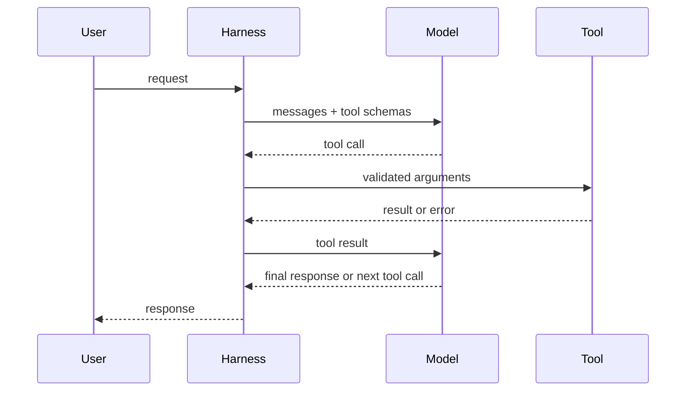
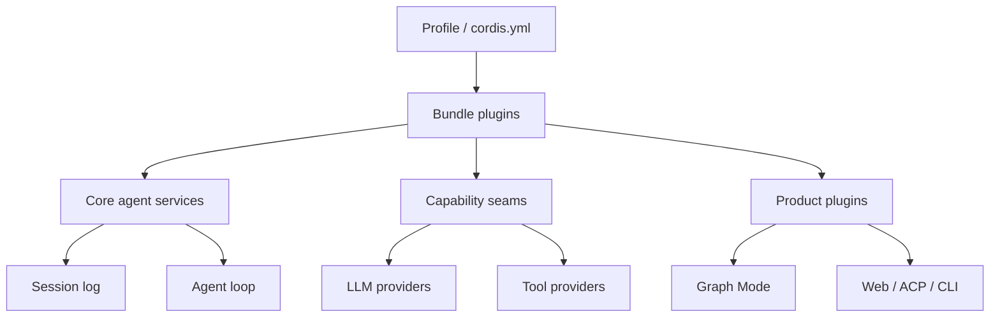
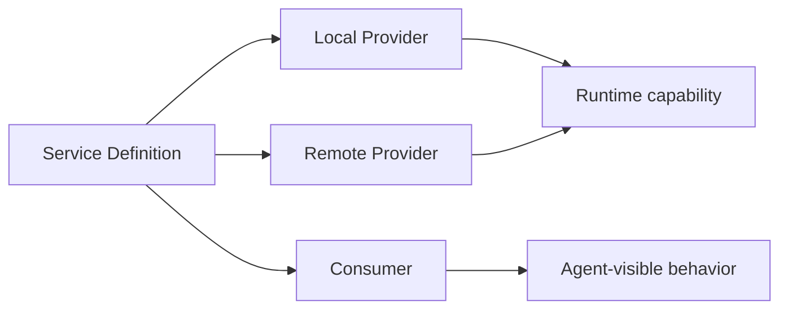
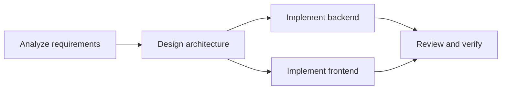
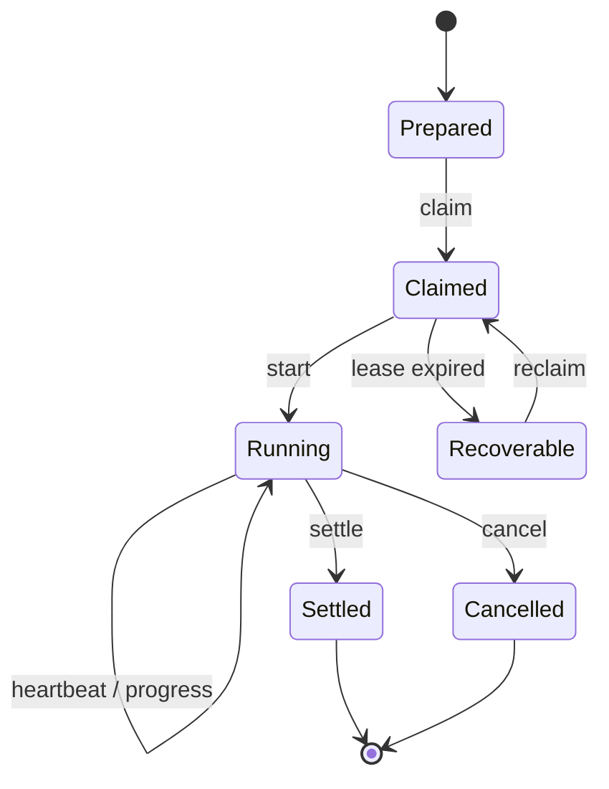
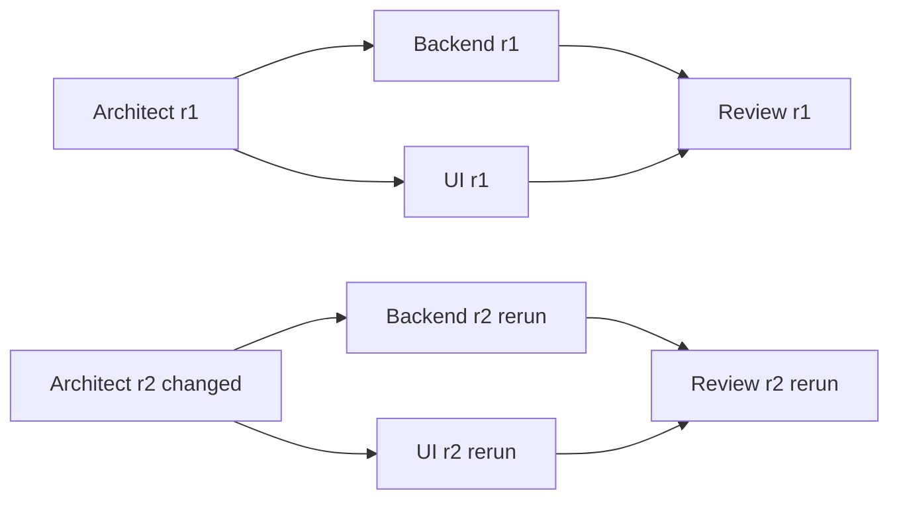
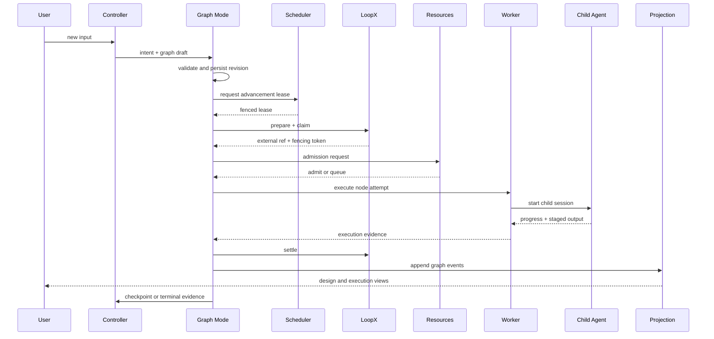

# Agent Engineering from First Principles: DeepSeek Harness, LoopX, and Graph Mode

English | [中文](agent-engineering-tutorial.zh.md)

This tutorial is for readers studying agent development systematically for the first time. After completing it, you should be able to explain the core ideas behind agent loops, tool calls, event logs, plugin lifecycles, multi-agent DAGs, leases, idempotency, and recovery; trace a real request through DeepSeek Harness, Graph Mode, and LoopX; and describe in engineering terms why a reliable agent system is much more than a single LLM call.

You do not need prior knowledge of Cordis, distributed systems, or a complex frontend framework. The tutorial begins with the smallest useful agent and progressively adds plugins, persistence, multi-agent orchestration, and cross-process coordination. Links point to the source code or formal document that owns each deeper fact.

## 1. How to use this tutorial

Treat this tutorial as a short course with source exercises, not as an encyclopedia to consume in one sitting.

1. Read Sections 2 through 4 first to build an overall mental model of agents and the Harness.
2. Read Sections 5 through 9 again with every linked source file open in the repository.
3. Complete the exercises in Section 10 and record the inputs, state transitions, logs, and failure causes.
4. Finally, answer the interview questions in Section 12 aloud. You understand the material when you can explain it without looking at the document.

You do not need to memorize package names. You need to understand the separation of three responsibilities: the LLM performs nondeterministic reasoning, the Harness defines the deterministic limits of one agent execution, and Graph plus LoopX controls multiple tasks and long-lived collaboration state.

| Learning stage | Observable outcome | Suggested time |
| --- | --- | --- |
| Agent foundations | Draw one tool-calling loop | 0.5 day |
| Harness plugins | Locate services, events, logs, and plugin registrations | 1 day |
| Graph + LoopX | Explain DAGs, Revisions, leases, Settlement, and recovery | 1.5 days |
| Exercises and interviews | Demonstrate one run and answer system-design follow-ups | 1 day |

## 2. The minimal mental model of an agent

### 2.1 An agent is not just a chatbot

A conventional chat application usually sends a user message to a model and displays the resulting text. An agent adds goals, tools, state, a loop, and control policies so the model can observe an environment, choose an action, receive its result, and continue working.

Remember an engineered agent with this formula:

```text
Agent = Model + Context + Tools + Loop + State + Policy + Observability
```

These parts answer seven questions: who reasons, what the model sees, what it can do, when execution continues, what has happened, which behavior is allowed, and how engineers prove what the system did.

### 2.2 How one tool call happens

Function Calling does not let a model execute a function directly. The model only produces a structured tool name and arguments; the Harness validates the arguments, executes the real tool, records its result, and returns that result to the model as another message.



Model output is probabilistic, but argument validation, permission checks, timeouts, cancellation, log writes, and tool side effects must be owned by deterministic code. Delegating those responsibilities to prompts creates a system that appears intelligent but cannot be recovered or audited reliably.

### 2.3 The minimal agent loop

The following pseudocode intentionally omits streaming, cancellation, compaction, retries, and security policies, but it captures the core loop of every tool-using agent.

```text
messages = load_session()
while not terminal:
    request = build_request(messages, tool_schemas)
    response = model.generate(request)
    append_to_log(response)
    if response.has_tool_calls:
        for call in response.tool_calls:
            result = execute_tool(call)
            append_to_log(result)
    else:
        terminal = true
```

A real Harness must add at least five capabilities: a replayable session log, controlled tool execution, model and context adaptation, lifecycle events, and explicit state after a process exit or network failure.

### 2.4 Common terms

| Term | Engineering meaning |
| --- | --- |
| Session | A persistent, recoverable conversation history |
| Turn | One round beginning with a user input and ending when the system returns control |
| Step | One model request within a Turn and the tool handling it triggers |
| Tool call | A structured action proposed by the model |
| Agent loop | The loop that drives continued interaction among the model, tools, and state |
| Context | The services, events, and resources available in the current scope |
| Transcript | A projection of user-, model-, and tool-visible events |
| Evidence | Traceable facts supporting a task conclusion, completion state, or recovery decision |

## 3. From an agent prototype to an Agent Harness

A single-file prototype is useful for validating a prompt, but it cannot naturally answer production questions: what state a task is in when the model stops unexpectedly; whether the same tool ran twice; who may cancel execution; why the user saw a particular message; how much code changes when a model provider is replaced; and whether a new tool breaks other sessions.

An Agent Harness is the runtime that owns these engineering responsibilities. It commonly provides model adaptation, tool registration, session persistence, events, configuration, permissions, observability, cancellation, compaction, and extension mechanisms. DeepSeek Harness makes one central choice: all these capabilities are composed as Cordis plugins instead of being embedded in an ever-growing central loop.

This creates two important limits:

- The LLM interprets natural language, proposes plans and candidate actions, and evaluates semantic results.
- The deterministic runtime validates, authorizes, schedules, persists, controls concurrency, transitions state, and recovers execution.

When an interviewer asks, “Why not just write a while loop?”, answer in terms of replaceability, auditability, failure recovery, and concurrency safety. The while loop still exists, but it should not monopolize every product capability.

## 4. DeepSeek Harness architecture

### 4.1 Everything is a Cordis plugin

The [architecture overview](architecture.md) defines DeepSeek Harness as a plugin-based Agent Harness built on Cordis. Model adapters, the tool registry, the session log, the agent loop, the Graph controller, and UI capabilities are all composed through plugins.



A Cordis Context is both a service repository and a scope. Plugins read services through stable keys, gain typed events through declaration merging, and register behavior through reversible effects. Read the [Cordis primer](cordis-primer.md) first, then complete the [Cordis tutorial](cordis-tutorial/index.md).

### 4.2 Five Cordis concepts you must understand

| Concept | Purpose | Common mistake |
| --- | --- | --- |
| Plugin | Installs a set of behaviors or services | Treating a Plugin as a one-time initialization script |
| Context | Provides scoped services and events | Bypassing scope with a global singleton |
| Service | Exposes a capability through a stable key | Making a Consumer depend on a concrete Provider |
| inject | Declares dependencies required for loading | Silently skipping a missing dependency |
| effect / on | Registers a reversible side effect | Registering without a disposer and leaking on reload |

Events have different dispatch semantics. `emit` broadcasts a notification, `waterfall` lets listeners transform a value in sequence, `parallel` awaits listeners concurrently, and `serial` awaits them in order. A waterfall listener that does not call `next()` truncates the remaining chain, so that behavior must be intentional.

### 4.3 Profiles, Bundles, and the plugin tree

Users run a Profile, not a manually instantiated collection of classes. A Profile selects Bundles and overlays through `cordis.yml`; each Bundle installs a plugin tree. The same core packages can therefore be assembled into different CLI, Web, ACP, or test product surfaces.

```sh
pnpm dsh --profile web --dump-config
```

This command is useful for answering, “Why is this feature present or missing?” Inspect the resolved plugin tree first, then check the corresponding services and configuration instead of guessing from the UI.

### 4.4 Core services

| Capability | Context service | Responsibility |
| --- | --- | --- |
| Session | `ctx.sessions` | Append, read, and project authoritative events |
| System prompt | `ctx.systemPrompt` | Compose model-visible system instructions |
| Tools | `ctx.tools` | Register tool arguments, presentation, and execution behavior |
| Agent | `ctx.agents` | Create the agent instance required for each run |
| Agent loop | `ctx.agentLoop` | Drive Turns, Steps, model requests, and tool results |
| LLM | `ctx.llm` | Resolve model selection and execute model requests |

The key extension points of a Turn can be simplified to: claim user input, build the prompt and tool schemas, emit Step events, dispatch the model request, record streaming messages, execute tools, record tool results, and decide whether to continue or stop. The complete event order is maintained by the [architecture overview](architecture.md#turn-flow).

### 4.5 Model-visible must be logged

Anything that enters a model request must be reconstructable from the session log. Otherwise, when a conversation is reopened, a request is retried, an audit is generated, or a failure is reproduced, the system cannot explain why the model made a decision.

Adding model-visible input therefore usually requires more than changing a prompt builder: it also needs a corresponding session event, persistent fields, and projection logic. The session log is authoritative; the chat screen is only one projection of it.

### 4.6 Capability seams

A complete capability seam has three roles: the Service Definition defines stable interfaces and types; a Service Provider connects a local, remote, or third-party implementation; and a Consumer exposes the capability through a tool, prompt, workflow, or product feature.



This separation lets a Consumer remain unaware of whether a command runs locally, in a sandbox, or on a remote Worker. It is also a useful interview example for dependency inversion, testability, and provider replacement.

## 5. How to develop a Harness plugin

### 5.1 Choose the extension type first

Before writing code, decide which extension the requirement needs: use a Service for shared capability; a typed event for lifecycle observation or transformation; a Tool for an action the model can initiate; a session event for model-visible recoverable facts; Config for deployment-specific choices; and a UI plugin for user-facing presentation.

Do not modify the core loop merely because “an if statement could be added to the agent loop.” The [architecture rules](architecture.md) require new behavior to use existing extension points first; consider changing the agent loop only when the foundational execution semantics of every Agent must change.

### 5.2 The Plugin lifecycle pattern

The following pseudocode shows a typical Plugin: it declares dependencies, exposes configurable parameters, and places registration inside a reversible effect. A real implementation must follow repository types and JSDoc rules.

```text
class ExamplePlugin extends Service {
    static inject = ["sessions", "tools"]
    constructor(ctx, config) {
        super(ctx, "example")
        ctx.effect(() => {
            const dispose = ctx.tools.register(create_tool(config))
            return () => dispose()
        })
    }
}
```

Registrations are effects: registration is a side effect and must be reversible when a Context unloads, configuration reloads, or a test cleans up. Prefer `ctx.on()` for event listeners, and a registry's `register()` should return a disposer.

### 5.3 What a package contains

Use the current [package groups](../packages/README.md) and [package constraints](../packages/AGENTS.md) when adding a package. Release members live at `packages/<group>/<name>/` and use ESM, strict TypeScript, workspace dependencies, and explicit exports.

| File or field | Purpose |
| --- | --- |
| `package.json` | Package name, public exports, files, peer/dev dependencies, and publication metadata |
| `src/index.ts` | Main entry point and public exports |
| `src/invariant.ts` | Declares and checks runtime relationships owned by the package |
| `tsconfig.json` | Compiler face and project references to dependency packages |
| `README.md` / `README.zh.md` | Current behavior, configuration, assembly, and ownership |
| `tests` or colocated tests | Success, failure, lifecycle, and cleanup behavior |

The current executable constraints require a release package to be public with `publishConfig.access: public` and repository metadata. They also require `src/invariant.ts`, an `./invariant` export, `lib/invariant.js` in files, `dsh-invariants` as peer/dev dependencies, and a tsconfig project reference. When a cookbook example differs from the gates, follow the [package constraints](../packages/AGENTS.md) and the actual result of `pnpm run constraints`.

### 5.4 Recommended development process

1. Confirm the capability owner and existing extension points in the [architecture overview](architecture.md).
2. Decide whether a complete capability seam is required, and identify the Definition, Provider, and Consumer packages.
3. Define Config, public types, failure semantics, cancellation semantics, and recoverable state before implementing behavior.
4. Use `ctx.effect()`, `ctx.on()`, and disposers to keep installation and teardown symmetric.
5. Validate at the appropriate trust boundary: configuration, JSON, files, queues, Workers, processes, and network inputs require runtime validation.
6. Add focused unit tests; model-visible or user-visible behavior also requires a runnable example and keyless snapshot.
7. Update the package README, relevant architecture documentation, and an Agent Note for a non-trivial change.
8. Run the typecheck, tests, build, hygiene, and documentation gates that match the changed surface.

Your first exercise should not start with Graph. Complete the [Cordis tutorial](cordis-tutorial/index.md), then read [Adding a tool](cookbook/adding-a-tool.md), implement a side-effect-free read-only tool, and enter multi-agent orchestration only after you understand services, events, tools, and the session log.

## 6. Engineering foundations of multi-agent systems

### 6.1 Multiple agents are not multiple chat windows

When several models only exchange natural language, a system cannot reliably prove whether work is complete, whether a message is stale, or where recovery should begin. An engineered multi-agent system needs explicit tasks, dependencies, inputs, outputs, states, resource ownership, and termination conditions.

Graph uses a DAG to express execution dependencies within one Revision. Nodes are tasks, edges are prerequisite relationships, and the Controller interprets user intent into a graph and creates a new version when new evidence appears.



The DAG represents an acyclic plan for the current Revision only. Review rework does not draw an edge back to an earlier node inside the same DAG. Instead, the review result creates a new Revision and reruns the changed node and all its transitive successors. The old version therefore remains auditable.

### 6.2 Why the Controller is outside the graph

The Controller is the entry point for every user input and the author and editor of the graph. If it were an ordinary DAG node, the graph would need to exist before the Controller could run, while creating and editing that graph would require the Controller to run first, producing a responsibility and startup cycle.

The Controller therefore sits outside the DAG. It first classifies the input as a new task, revision, inspection, control, clarification, or direct conversation, and then creates or revises the graph. Its conclusions are still written to the session log and Graph events, so they are traceable without being constrained by the current DAG's dependencies.

### 6.3 Six terms for reliable multi-agent execution

| Term | Problem it solves |
| --- | --- |
| Immutable Revision | Preserve the old plan and evidence after a graph change |
| Stable operation ID | Recognize the same node attempt after a restart |
| Lease and fencing | Prevent multiple Hosts from advancing the same work concurrently |
| Idempotency | Avoid duplicate side effects during retries |
| Settlement | Record the result ultimately accepted for one execution |
| Reconciliation | Recover when local records disagree with external facts |

An LLM may decide which category a review comment belongs to, but state transitions must be driven by schema-validated structured results. Natural-language feedback is evidence; fields such as `decision: pass | revise | reject` are deterministic branch inputs.

## 7. LoopX: the long-lived collaboration control plane

### 7.1 What LoopX is

LoopX is a local-first, persistent control plane for long-running agent work. It manages goals, todos, gates, evidence, quotas, claims, and leases so participants across sessions and processes can share progress and determine what may continue after a process restarts.

LoopX does not replace the Harness. The Harness executes models, tools, and sessions; Graph decides dependencies and state transitions for the current task; LoopX owns long-lived collaboration facts across executions.

| System | Facts it owns | Facts it should not own |
| --- | --- | --- |
| Harness session log | Model messages, tool calls, user interactions, and replayable session events | Cross-project todo leases |
| Graph projection | Graphs, Revisions, node attempts, branches, and control records | Complete child-session transcripts |
| LoopX | Goals, todos, claims, leases, gates, evidence, and quotas | Private prompts and complete model output |
| UI | A visual projection of authoritative state above | Hidden execution state independent of the logs |

This is a two-ledger model: the Harness keeps the model-execution ledger, while LoopX keeps the project-collaboration ledger. Graph relates the two with stable identifiers without copying the same data into two authoritative sources.

### 7.2 The Graph coordination protocol

Graph uses a LoopX Provider through an abstract coordination service rather than directly calling a CLI from Graph Mode. The protocol has nine operations.

| Operation | Semantics |
| --- | --- |
| `prepare` | Create or recover the external work reference for a Graph node |
| `claim` | Acquire execution ownership with a fencing token |
| `heartbeat` | Extend a claim that is still running |
| `observe` | Read current collaboration state |
| `watch` | Wait for a state change instead of polling continuously |
| `publishProgress` | Publish a bounded, public-safe progress summary |
| `settle` | Commit the terminal state, evidence, and final references |
| `cancel` | Request that unfinished work stop |
| `reconcile` | Compare Graph records with external facts |

The stable interface for these methods is owned by [Graph coordination](../packages/graph/graph-coordination/README.md), while the LoopX adapter is owned by the [LoopX Provider](../packages/graph/graph-coordination-loopx/README.md). Graph Mode depends only on the abstract service, so another collaboration backend can replace LoopX later.

### 7.3 The LoopX lifecycle



A claim says the current holder owns execution, a lease says that ownership must be renewed on time, and a fencing token rejects late writes from an expired holder. Heartbeats without fencing can still produce split-brain execution: an old Worker may resume after a pause and submit results after a new Worker has taken over.

### 7.4 Local observation commands

After installing LoopX, begin with the following read-only or guided commands. Use the local `loopx --help` as the authority for exact arguments.

```sh
loopx doctor
loopx status
loopx todo
loopx task-lease
loopx quota should-run
loopx start-goal --guided
```

The exercise is not about memorizing commands. Observe which authoritative fact each operation changes and how Graph node IDs, attempt IDs, and external todo references correspond.

## 8. The complete Graph Mode implementation

### 8.1 Package responsibilities

Graph is a collection of capability seams and product plugins, not one giant package.

| Package | Core responsibility |
| --- | --- |
| [`graph`](../packages/graph/graph/README.md) | Types, schemas, events, projections, Revisions, and invalidation propagation |
| [`graph-mode`](../packages/graph/graph-mode/README.md) | Controller, `/graph`, intent classification, planning, scheduling advancement, and recovery |
| [`graph-coordination`](../packages/graph/graph-coordination/README.md) | Abstract service for persistent collaboration |
| [`graph-coordination-loopx`](../packages/graph/graph-coordination-loopx/README.md) | LoopX Provider and external-reference mapping |
| [`graph-worker`](../packages/graph/graph-worker/README.md) | Local or remote Workers, child sessions, and execution leases |
| [`graph-resources`](../packages/graph/graph-resources/README.md) | Model capacity, concurrency, and resource telemetry |
| [`graph-scheduler`](../packages/graph/graph-scheduler/README.md) | Graph-level scheduling leases and cross-Host advancement ownership |
| [`ui-graph`](../packages/client/ui-graph/README.md) | Design graph, execution graph, evidence details, and human controls |

Artifacts, workspaces, and remote transport also use independent seams. This decomposition lets scheduling, execution, resources, and presentation be replaced independently and keeps Graph Mode from owning every infrastructure state.

### 8.2 Activation and intent classification

Entering `/graph` activates Graph Mode for the current session. Every subsequent user input goes to the Controller first and is classified as `new`, `revise`, `inspect`, `control`, `clarify`, or `direct`.

- `new` creates a new Graph and initial Revision.
- `revise` creates an immutable next Revision from a new requirement or new evidence.
- `inspect` reads only the current design, execution, and evidence.
- `control` requests a controlled cancel, retry, skip, resume, or approval operation.
- `clarify` enters `awaiting_user` when a key decision is missing.
- `direct` preserves ordinary conversation that does not need a graph.

The Controller first emits a semantic draft. Deterministic code then resolves IDs, dependencies, schemas, roles, models, and policy references. Only a validated Graph Revision can enter the scheduler.

### 8.3 Default roles and configuration snapshots

The default software-engineering roles are Controller, Analyst, Architect, Engineer, Reviewer, Verifier, and Writer. A role is not a fixed process node; the Controller selects the necessary roles and number of nodes according to task size.

Each role template contains a responsibility prompt, default model, reasoning effort, and concurrency limit. The model is selected from globally available models in a dropdown, while reasoning effort is free text so different Provider values remain representable.

Global settings are only templates copied when a new Graph is first activated. The Graph then stores a snapshot of roles and policies, so later global-setting changes do not alter historical sessions. A user can explicitly create a new Revision in the current Graph to change a role or model.

### 8.4 Revisions and downstream invalidation

Every graph modification creates a new Revision instead of overwriting the previous one. Suppose the `architect` design changes, and `engineer-backend`, `engineer-ui`, and `reviewer` are its transitive successors. All must rerun in the new Revision; unaffected accepted nodes may be reused with provenance.



Transitive invalidation prevents the error of rerunning only the named node while leaving successors that consumed its old output untouched. A stable operation ID commonly combines the session, graph, revision, node, and attempt so recovery can distinguish reuse, retry, and execution in a new version.

### 8.5 Conditions and branch groups

A node output can declare a `GraphOutputSchema`. Conditional edges read schema-validated fields, while a branch group specifies how candidate edges become active.

| Branch mode | Semantics |
| --- | --- |
| `all` | Activate every matching branch |
| `any` | Activate at least one matching branch, possibly several in parallel |
| `exactly-one` | Require exactly one matching branch and fail otherwise |
| `activated` | Use branches explicitly activated by an upstream control result |

For example, a Reviewer emits both natural-language feedback and `{ decision: "revise", area: "backend" }`. The prose is shown to humans and retained as evidence; deterministic branching reads only the structured fields. The node must not continue silently when a field is missing, an enum value is invalid, or `exactly-one` matches multiple edges.

### 8.6 Planning checkpoints and dynamic subgraphs

The Controller does not need to pretend it knows every implementation detail during the initial plan. After the Analyst and Architect finish, execution can return to the out-of-graph Controller at a planning checkpoint. The Controller uses the real architecture, repository size, target-model capability, and current resource telemetry to create a new Revision whose tasks fit the execution model.

A node can also propose a schema-constrained expansion that creates dynamic nodes or a nested subgraph. Dynamic expansion must obey limits on node count, depth, Revision count, and termination so the model cannot split work indefinitely or create an unbounded review loop.

### 8.7 Concurrency and OOM protection

Resource control is not a prompt problem. Graph Resources maintains capacity and telemetry by model and role; the admission controller checks global, role, and exact-model limits before starting a node; and the scheduler reserves capacity for the Controller so Workers cannot consume every slot and prevent replanning or control commands.

For a local large model, safe concurrency must adapt to VRAM or shared memory, context length, KV cache, quantization, and current load. A configured concurrency value is a maximum, not a utilization target. When resource telemetry is uncertain, the system should queue or request human confirmation instead of optimistically running in parallel and causing OOM.

### 8.8 Workers and operation stages

An admitted node is executed by a Worker. A Worker may be a local process or a remote Host connected through authenticated transport; every node has an isolated child session where the complete prompt, tool calls, streaming output, and errors are retained.

An operation moves through these stable stages: `planned`, `admitted`, `claimed`, `started`, `progress`, `output-staged`, `settlement-pending`, `reconciled`, and `terminal`. These stages separate “the model produced output” from “Graph accepted the result,” resolving ambiguity when a process crashes after external work completes but before the local commit.

### 8.9 Review, repair, and termination

A Reviewer or Verifier should not return only a paragraph of advice. It must produce a schema-validated pass, revise, or reject decision with evidence and affected areas. Graph maps that structured decision to a repair path; the Controller can create a new Revision with changed nodes and a transitive invalidation set.

Every automatic repair path needs a budget: maximum attempts, maximum Revisions, a repeated-failure-signature threshold, and total token or time quota. When the budget is exhausted, execution fails or enters `awaiting_user`; “try once more” cannot be an unlimited strategy.

### 8.10 Human control

The controller page and child-agent details should expose cancel, approve, reject, edit task, resume from a selected node, switch model or role, skip, retry, and roll back Revision through the same control service. The UI does not mutate a projection directly; it submits a control record with an actor, reason, target, and idempotency key.

Cancellation is a coordination protocol, not record deletion. The system prevents new work, sends cancel to the Worker and LoopX, waits for or reconciles the terminal state, and retains logs, artifacts, and Settlement evidence that already exist.

### 8.11 Recovery and the limits of exactly-once

A general system cannot guarantee exactly-once execution for arbitrary external side effects through retries alone. A reliable implementation combines stable operation IDs, idempotent tools, leases, fencing, staged output, a Settlement log, and reconciliation.

After restart, Graph Scheduler first acquires the advancement lease and then compares session events, the Graph projection, LoopX claims, Worker state, and external work references. It reclaims operations proven not to have started; completes Settlement for operations proven finished; and sends operations with unknowable side effects to `awaiting_user` instead of guessing and executing them again.

### 8.12 The graphical interface

Graph UI presents two separate horizontal canvases: the design graph shows the current Revision's nodes, dependencies, conditions, and roles; the execution graph shows every real attempt with status, duration, model, Worker, result, and retry relationships. A mature graph library owns layout, zooming, selection, and edge rendering, while a side evidence drawer displays complete details.

Selecting a node reveals its child session, actual model and reasoning effort, tool calls, progress, artifacts, operation log, Settlement, and LoopX claim. Separating design state from execution records prevents a plan node from merely displaying “success” while hiding how many times it actually ran.

## 9. How one user request crosses the whole system

The following sequence connects the preceding components into one complete request. It is the most important navigation diagram for reading the source.



Read the sequence step by step: the Controller makes semantic decisions; Graph Mode validates and persists a Revision; Scheduler determines which Host may advance it; LoopX coordinates the long-lived claim; Resources decides whether execution may begin now; Worker manages the child session; Graph accepts structured output and settles it; Projection supplies the UI; and at a checkpoint the Controller revises the graph from evidence.

Notice three different kinds of “lock”: the Scheduler lease prevents multiple Hosts from advancing one Graph; the LoopX claim prevents multiple Agents from claiming the same external work; and model-resource admission prevents excessive concurrency on one model. None can replace the other two.

## 10. Five progressive exercises

### Exercise 1: See the plugin tree

The goal is to prove that product behavior comes from composition, not a fixed entry point. Run the resolved-configuration command, search for `agent-loop`, the model Provider, session, Graph, and UI plugins, and record which component provides each service.

```sh
pnpm dsh --profile web --dump-config
```

Completion criterion: you can explain whether removing a plugin eliminates a Definition, Provider, or Consumer, and predict the load-time error.

### Exercise 2: Trace an ordinary tool call

Complete the [Cordis tutorial](cordis-tutorial/index.md), start the local Web Profile, and request a read-only tool operation. Find the user-input event, model tool call, tool result, and final assistant message in order.

Completion criterion: you can distinguish the model proposing a call, the Harness executing the tool, and the UI presenting the result, and you can identify the authoritative record.

### Exercise 3: Create a minimal Graph

Enter `/graph` in a new session and submit a small task that can be split into “analyze → implement → review.” Open the design and execution graphs and compare a logical node with its real attempts.

Completion criterion: you can identify the Controller intent, Graph Revision, role, actual model, child session, and Settlement for each node.

### Exercise 4: Trigger review rework

Give the Reviewer an explicit structured acceptance condition, then intentionally leave one condition unsatisfied. Observe the Reviewer output, conditional branch, new Revision, changed node, and transitive reruns.

Completion criterion: you can prove rework is a new Revision rather than a cycle in the DAG, explain why unaffected nodes can be reused, and locate the reuse evidence.

### Exercise 5: Verify resources and recovery

Set a local model's concurrency limit to 1, create two parallel Engineer nodes, and confirm that one runs while the other queues. Then stop and restart the runtime during a safe test task and observe the lease, claim, reconciliation, and terminal state.

Completion criterion: you can distinguish queued, cancelled, failed, lease-expired, and uncertain-side-effect states, and explain why some cases require `awaiting_user`.

## 11. Debugging method: trace projections back to authoritative facts

Do not inspect only the final error shown in the UI. Narrow the problem in order from assembly to execution.

| Layer | Check first | Typical problem |
| --- | --- | --- |
| Composition | Resolved plugin tree, inject, and Config | Missing Provider, wrong key, or invalid configuration |
| Session | Authoritative events, Turns, Steps, and tool results | Unlogged model input or inconsistent conversation projection |
| Graph | Graph, Revision, node, edge, attempt, and control records | Invalid schema, missing invalidation, or ambiguous branch |
| Coordination | prepare, claim, heartbeat, settle, and reconcile | Expired lease, lost external reference, or late write |
| Execution | Admission, Worker, child session, artifacts, and resource telemetry | OOM, timeout, process exit, or uncommitted artifact |

For the common symptom “the configured model returns to the default,” compare the global role template, the current Graph configuration snapshot, the Revision's model selection, and the model actually resolved by the Worker. A UI-only value with no persistent event is inevitably lost on refresh; a persisted event still has no effect if the Worker reads a different Revision.

When “the model reaches its output-token limit and another Engineer starts,” distinguish output truncation from the node's failure policy. The system should inspect `finish_reason`, preserve partial output, and let the Controller or deterministic policy choose whether to continue the same attempt, create a continuation, or create a smaller-task Revision; it must not unconditionally turn every truncation into a new-node rerun.

## 12. Interview preparation

### 12.1 Frequent questions and answer points

1. **What is an Agent?** An Agent is a goal-driven system composed of a model, context, tools, loop, state, policies, and observability; the model owns only its nondeterministic decisions.
2. **What does an agent loop do?** It builds requests, calls the model, records output, executes tools, returns results to the model, and stops on completion, cancellation, or budget exhaustion.
3. **Is Function Calling safe?** The model only proposes a call; the Harness still needs schema validation, permissions, timeouts, isolation, auditing, and idempotency control.
4. **Why use a plugin architecture?** It composes models, tools, sessions, and product features as replaceable, testable, reversible extensions instead of accumulating every change in the core loop.
5. **How does an event log differ from current database state?** Current state answers “what is true now”; an event log also preserves “how it became true” for replay, audit, and recovery.
6. **Why does a multi-agent system need a DAG?** A DAG makes dependencies and parallel opportunities explicit so the scheduler runs a node only when prerequisites and conditions are satisfied.
7. **How do Graph and LoopX differ?** Graph owns one task's Revisions, nodes, branches, and execution evidence; LoopX owns goals, todos, claims, leases, and gates across sessions and processes.
8. **Why is the Controller outside the DAG?** It exists before the graph and modifies the graph; placing it inside would create a startup and ownership cycle.
9. **How does review rework happen?** The Reviewer emits a structured decision, the Controller creates a new Revision, changes relevant nodes, transitively invalidates successors, and runs the new DAG.
10. **How do leases and fencing differ?** A lease gives time-limited ownership, while a fencing token lets receivers reject late operations from an old holder; a lease alone cannot fully prevent split-brain writes.
11. **How do you implement exactly-once?** Arbitrary side effects generally cannot receive a universal guarantee; stable IDs, idempotent operations, staging, Settlement, and reconciliation provide one provably accepted outcome.
12. **How do you avoid local-model OOM?** Use model-level admission, dynamic resource telemetry, context and KV-cache estimates, queuing, reserved Controller capacity, and adjustable concurrency limits instead of relying on prompts.

### 12.2 A system-design answer framework

If the interview prompt is “Design a multi-agent software-development system,” answer in this order:

1. Define the user goal, success evidence, allowed tools, side effects, and human approval points.
2. Separate semantic and control planes: LLMs plan and review, while deterministic code validates and transitions state.
3. Define Graph, Revision, Node, Attempt, Artifact, Control, and Settlement data models.
4. Define Controller intents, DAG dependencies, structured branches, dynamic expansion, and termination budgets.
5. Define the Scheduler, Worker, workspace, model resources, and cross-Host communication.
6. Define authoritative sources and correlation IDs for the session log and project-control state.
7. Handle timeouts, cancellation, duplicate messages, crash windows, lease expiry, and uncertain side effects.
8. Finish with the observable UI, metrics, audit, security, and test strategy.

This order avoids getting trapped in prompt details at the beginning. Senior Agent roles care more about state ownership, failure semantics, and validating evidence than about role names alone.

### 12.3 A project-introduction template

You can introduce this project in four sentences: DeepSeek Harness is a plugin-based Agent Harness built on Cordis; the core agent loop owns only generic Turn and Step lifecycles, while models, tools, sessions, and product features are assembled through plugins; Graph Mode adds an out-of-loop Controller, immutable Revisions, DAG scheduling, structured branching, and recovery; and the LoopX Provider uses claims, leases, evidence, and Settlement to extend one-session execution into long-lived cross-process collaboration.

Then expand one real failure, such as truncated model output, Reviewer rework, a Worker crash, or local-model OOM. Explain which authoritative state you inspected, how you identified the responsible layer, and which tests and logs proved the fix. Do not describe an unverified design as an implemented production capability.

## 13. Source-reading map

Read in this order to move from stable concepts into Graph's complex control flow.

| Order | Material | Reading goal |
| --- | --- | --- |
| 1 | [Architecture overview](architecture.md) | Build a complete view of the plugin tree, core services, and Turn lifecycle |
| 2 | [Cordis primer](cordis-primer.md) | Understand Context, Service, inject, effect, and event semantics |
| 3 | [Cordis tutorial](cordis-tutorial/index.md) | Assemble a minimal Plugin and capability by hand |
| 4 | [`agent-loop`](../packages/core/agent-loop/src/agent.ts) | Compare the real Turn, Step, model, and tool loop |
| 5 | [`graph` types](../packages/graph/graph/src/types.ts) | Learn the Graph, Revision, Node, Attempt, and Settlement data models |
| 6 | [`graph` projection](../packages/graph/graph/src/index.ts) | Understand how events fold into current state and downstream invalidation |
| 7 | [`graph-mode`](../packages/graph/graph-mode/src/index.ts) | Trace the Controller, scheduling, branches, recovery, and controls |
| 8 | [Graph coordination](../packages/graph/graph-coordination/README.md) | Understand the nine operations of the long-lived collaboration abstraction |
| 9 | [LoopX Provider](../packages/graph/graph-coordination-loopx/README.md) | Understand mapping among Graph IDs and external todos, claims, and evidence |
| 10 | [Graph Worker](../packages/graph/graph-worker/README.md) | Understand child sessions, local and remote execution, and cancellation |
| 11 | [Resources and Scheduler](../packages/graph/graph-resources/README.md) | Understand admission, telemetry, concurrency limits, and advancement leases |
| 12 | [Graph UI](../packages/client/ui-graph/README.md) | Understand how design, execution, and evidence views project authoritative state |
| 13 | [Graph + LoopX integration design](loopx-graph-integration.md) | Connect protocols, recovery, human control, and long-lived project state |
| 14 | [Formal architecture objective](../.agents/notes/proposed/feature/2026-08-18-graph-loopx-durable-project-control-plane.md) | Read the complete goals, non-goals, and phased acceptance criteria |

While reading source, keep asking five questions: who owns this data authoritatively; how is it persisted; who may change it; did the failure happen before or after the write; and what evidence lets the system continue, retry, or wait for a human after restart.

## 14. Graduation checklist

Completing this checklist gives you the knowledge framework needed for junior-to-mid-level Agent engineering interviews.

- Draw a model tool-calling loop on a whiteboard and identify every deterministic control point.
- Trace a Profile to its Bundle, Plugin, Service Provider, and Consumer.
- Explain why model-visible data must be logged and why a projection is not authoritative.
- Design a capability seam with a Definition, Provider, and Consumer.
- Explain Graphs, Revisions, Nodes, Attempts, branch groups, and downstream invalidation.
- Distinguish a Scheduler lease, LoopX claim, and resource admission.
- Explain how stable IDs, idempotency, fencing, Settlement, and reconciliation work together.
- Analyze output truncation, OOM, Worker crashes, duplicate execution, and review rework.
- Use logs, Graph projections, LoopX state, and child-session evidence to locate a failure.
- Honestly distinguish implemented behavior, design objectives, and capabilities that still require validation.

Finish with one 30-minute explanation without notes: spend 5 minutes on the minimal Agent, 10 minutes on the Harness plugin architecture, 10 minutes on Graph + LoopX, and 5 minutes on one failure scenario. You understand the system when the listener can repeat its state ownership and recovery path.
