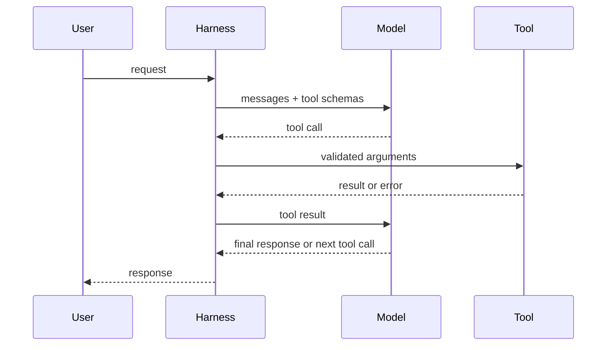
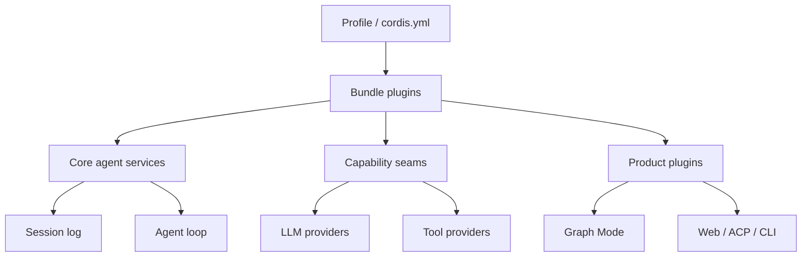
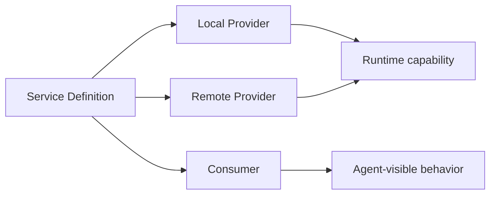
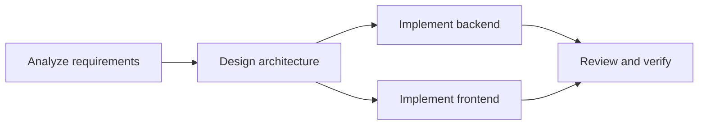
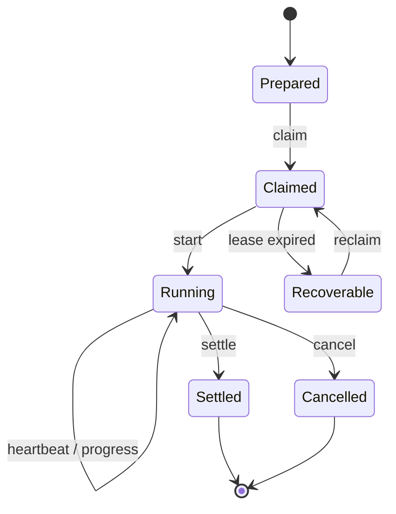
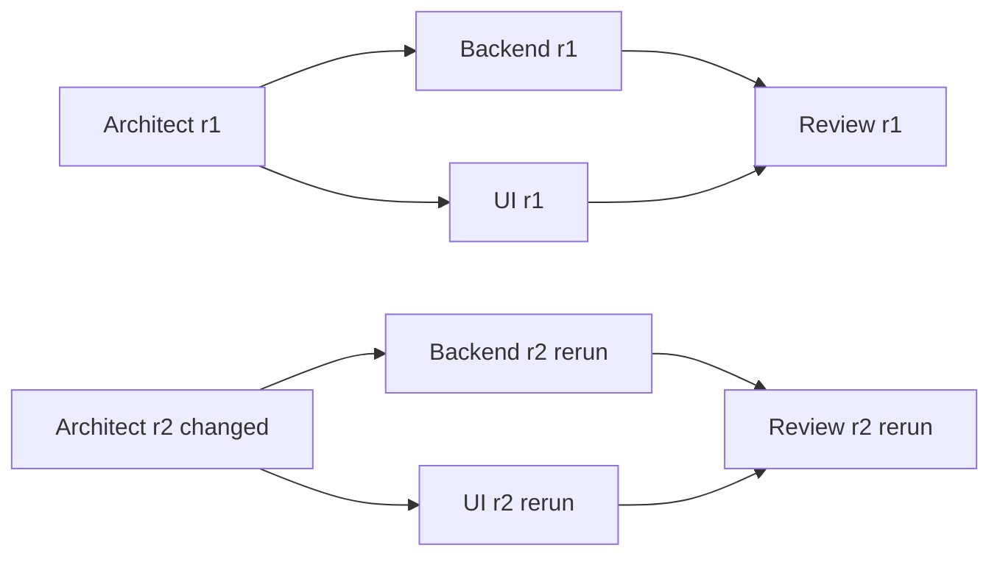
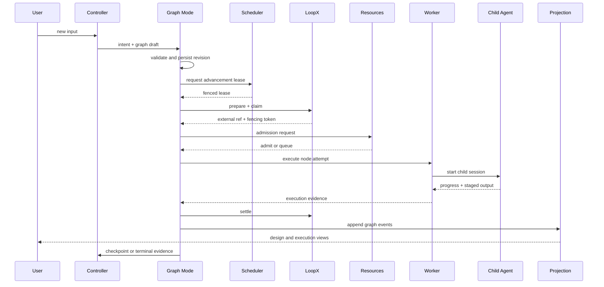

# 从零理解 Agent 工程：DeepSeek Harness、LoopX 与 Graph Mode

[English](agent-engineering-tutorial.md) | 中文

本文面向第一次系统学习 agent（智能体）开发的读者。完成本文后，你应当能够解释 agent loop、工具调用、事件日志、插件生命周期、多 Agent DAG、租约、幂等与恢复等核心概念；能够沿一次真实请求读懂 DeepSeek Harness、Graph Mode 和 LoopX 的协作过程；也能够在面试中用工程语言说明为什么一个可靠的 Agent 系统远不止一次 LLM 调用。

本文不会要求你先掌握 Cordis、分布式系统或复杂前端框架。阅读顺序从最小 agent 开始，逐层增加插件化、持久化、多 Agent 编排和跨进程协作。需要更深细节时，文中的链接会指向拥有该事实的源码或正式文档。

## 1. 如何使用本文

建议把本文当成一门带源码实验的短课，而不是一次读完的百科全书。

1. 第一遍阅读第 2 至 4 节，建立 Agent 与 Harness 的总体心智模型。
2. 第二遍阅读第 5 至 9 节，并在仓库中打开每个链接对应的源码。
3. 按第 10 节完成实验，记录输入、状态变化、日志和失败原因。
4. 最后使用第 12 节的面试题口头复述，不看文档也能讲清楚才算掌握。

你不需要背诵包名。真正需要掌握的是三种职责的分离：LLM 负责不确定性推理，Harness 负责一次 agent 执行的确定性边界，Graph 与 LoopX 负责多任务控制和长期协作状态。

| 学习阶段 | 可观察成果 | 建议时间 |
| --- | --- | --- |
| Agent 基础 | 能画出一次工具调用循环 | 0.5 天 |
| Harness 插件 | 能定位服务、事件、日志和插件注册点 | 1 天 |
| Graph + LoopX | 能解释 DAG、Revision、租约、Settlement 和恢复 | 1.5 天 |
| 实验与面试 | 能演示一次运行并回答系统设计追问 | 1 天 |

## 2. Agent 的最小心智模型

### 2.1 Agent 不等于聊天机器人

普通聊天应用通常把用户消息交给模型，再显示模型文本。Agent 在此基础上增加了目标、工具、状态、循环和控制策略，使模型可以观察环境、选择动作、接收结果并继续推进。

可以用下面的式子记忆一个工程化 Agent：

```text
Agent = Model + Context + Tools + Loop + State + Policy + Observability
```

这些部分分别回答七个问题：谁推理、模型看见什么、能做什么、何时继续、已经发生什么、什么行为被允许、工程师如何证明系统做过什么。

### 2.2 一次工具调用如何发生

Function Calling（函数调用）不是模型直接执行函数。模型只产生结构化的工具名和参数；Harness 验证参数、执行真实工具、记录结果，再把结果作为新消息交给模型。



模型输出具有概率性，但参数验证、权限检查、超时、取消、日志写入和工具副作用必须由确定性代码负责。把这些责任交给提示词，会得到一个看似聪明、但无法可靠恢复和审计的系统。

### 2.3 最小 agent loop

下面的伪代码刻意省略了流式输出、取消、压缩、重试和安全策略，但它表达了所有工具型 Agent 的核心循环。

```text
messages = load_session()
while not terminal:
    request = build_request(messages, tool_schemas)
    response = model.generate(request)
    append_to_log(response)
    if response.has_tool_calls:
        for call in response.tool_calls:
            result = execute_tool(call)
            append_to_log(result)
    else:
        terminal = true
```

真实 Harness 必须补上至少五类能力：可重放的 session log、受控的工具执行、模型与上下文适配、生命周期事件，以及在进程退出或网络失败后的明确状态。

### 2.4 常用术语

| 术语 | 工程含义 |
| --- | --- |
| Session | 一段可持久化、可恢复的会话历史 |
| Turn | 从一条用户输入开始，到系统交还控制为止的一轮 |
| Step | Turn 内的一次模型请求以及由它触发的工具处理 |
| Tool call | 模型提出的结构化动作请求 |
| Agent loop | 驱动模型、工具和状态持续交互的循环 |
| Context | 当前作用域可访问的服务、事件和资源集合 |
| Transcript | 用户、模型、工具等可见事件的投影 |
| Evidence | 支撑任务结论、完成状态或恢复决策的可追溯事实 |

## 3. 从 Agent 原型到 Agent Harness

单文件原型适合验证提示词，但不能自然回答生产系统的关键问题：模型突然中断时任务处于什么状态；同一个工具是否执行了两次；谁有权取消执行；用户为什么看到这条消息；换一个模型提供商要改多少代码；新增工具是否会破坏其他会话。

Agent Harness 是承载这些工程责任的运行时。它通常需要提供模型适配、工具注册、会话持久化、事件系统、配置、权限、观测、取消、压缩和扩展机制。DeepSeek Harness 的核心选择是：这些能力全部由 Cordis plugin 组合，而不是写进一个不断膨胀的中央循环。

这形成两条重要边界：

- LLM 负责解释自然语言、提出计划、生成候选动作和评价语义结果。
- 确定性运行时负责验证、授权、调度、持久化、并发控制、状态迁移和恢复。

面试中如果被问到“为什么不能只写一个 while loop”，可以从可替换性、审计性、失败恢复和并发安全四个方面回答。while loop 仍然存在，但它不应垄断所有产品能力。

## 4. DeepSeek Harness 技术架构

### 4.1 一切都是 Cordis plugin

[架构总览](architecture.zh.md)把 DeepSeek Harness 定义为基于 Cordis 的插件化 Agent Harness。模型适配器、工具注册表、session log、agent loop、Graph 控制器和 UI 能力都通过 plugin 组合。



Cordis 的 Context 既是服务仓库，也是作用域。Plugin 通过稳定键读取服务，通过声明合并获得类型化事件，并通过可撤销 effect 注册行为。建议先阅读 [Cordis 入门](cordis-primer.zh.md)，再完成 [Cordis 教程](cordis-tutorial/index.zh.md)。

### 4.2 五个必须掌握的 Cordis 概念

| 概念 | 作用 | 常见错误 |
| --- | --- | --- |
| Plugin | 安装一组行为或服务 | 把 Plugin 当成只执行一次的初始化脚本 |
| Context | 提供有作用域的服务与事件 | 使用全局单例绕过作用域 |
| Service | 通过稳定键暴露能力 | Consumer 依赖具体 Provider 实现 |
| inject | 声明加载所需依赖 | 缺失依赖时静默跳过 |
| effect / on | 注册可撤销副作用 | 注册后没有 disposer，导致重载泄漏 |

事件有不同调度语义。`emit` 广播通知，`waterfall` 让监听器依次转换值，`parallel` 并发等待监听器，`serial` 顺序等待监听器。waterfall 监听器若不调用 `next()` 会截断后续链路，这是一种需要明确意图的控制行为。

### 4.3 Profile、Bundle 与 Plugin tree

用户运行的是 Profile，而不是一组手工实例化的类。Profile 通过 `cordis.yml` 选择 Bundle 和 overlay；Bundle 再安装一棵 plugin tree。相同的核心包因此可以被 CLI、Web、ACP 或测试装配成不同产品表面。

```sh
pnpm dsh --profile web --dump-config
```

这个命令适合回答“当前功能为什么存在或缺失”。先看解析后的 plugin tree，再检查对应服务和配置，比直接从 UI 猜测更可靠。

### 4.4 核心服务

| 能力 | Context 服务 | 责任 |
| --- | --- | --- |
| Session | `ctx.sessions` | 追加、读取和投影权威事件 |
| System prompt | `ctx.systemPrompt` | 组合模型可见的系统指令 |
| Tools | `ctx.tools` | 注册工具及其参数、展示和执行行为 |
| Agent | `ctx.agents` | 创建每次运行需要的 agent 实例 |
| Agent loop | `ctx.agentLoop` | 驱动 Turn、Step、模型请求和工具结果 |
| LLM | `ctx.llm` | 解析模型选择并执行模型请求 |

一次 Turn 的关键扩展点可以简化为：领取用户输入，构造提示词和工具 schema，发出 Step 事件，派发模型请求，记录流式消息，执行工具，记录工具结果，判断继续或结束。完整事件顺序由[架构总览](architecture.zh.md#turn-flow)维护。

### 4.5 Model-visible 必须 Logged

任何进入模型请求的信息都必须能从 session log 重建。否则重新打开会话、重试请求、生成审计记录或复现故障时，系统无法解释模型为什么做出某个决定。

因此，新增模型可见输入通常不仅是修改 prompt builder，还需要定义对应 session event、持久化字段和投影逻辑。session log 是权威事实，聊天界面只是它的一种 projection（投影）。

### 4.6 Capability seam

一个完整 capability seam 由三种角色组成：Service Definition 定义稳定接口和类型；Service Provider 接入本地、远程或第三方实现；Consumer 把该能力用于工具、提示词、工作流或产品功能。



这种分层使 Consumer 不需要知道命令是在本机、沙箱还是远程 Worker 中执行。它也是面试中解释依赖倒置、可测试性与提供商替换的好例子。

## 5. 如何开发一个 Harness plugin

### 5.1 先判断扩展类型

写代码之前，先决定需求属于哪种扩展：共享能力使用 Service；生命周期观察或转换使用 typed event；模型主动调用的动作使用 Tool；模型可见且需要恢复的事实使用 session event；不同部署环境的选择使用 Config；用户交互展示使用 UI plugin。

不要因为“能在 agent loop 里加一个 if”就修改核心循环。[架构规则](architecture.zh.md)要求新行为优先使用既有扩展点；只有改变所有 Agent 的基础执行语义时，才应考虑修改 agent loop。

### 5.2 Plugin 生命周期模式

下面的伪代码展示一个典型 Plugin：声明依赖、暴露可配置参数，并把注册行为放进可撤销 effect。真实实现应使用仓库中的类型和 JSDoc 规范。

```text
class ExamplePlugin extends Service {
    static inject = ["sessions", "tools"]
    constructor(ctx, config) {
        super(ctx, "example")
        ctx.effect(() => {
            const dispose = ctx.tools.register(create_tool(config))
            return () => dispose()
        })
    }
}
```

Registrations are effects：注册就是副作用，必须能够在 Context 卸载、配置重载或测试清理时撤销。监听事件优先使用 `ctx.on()`，registry 的 `register()` 应返回 disposer。

### 5.3 一个 package 的组成

新 package 应以当前的 [package 分组](../packages/README.zh.md)和[package 约束](../packages/AGENTS.md)为准。发布成员位于 `packages/<group>/<name>/`，使用 ESM、严格 TypeScript、workspace 依赖和显式 exports。

| 文件或字段 | 目的 |
| --- | --- |
| `package.json` | 包名、公开 exports、files、peer/dev dependencies 和发布元数据 |
| `src/index.ts` | 主入口与公开导出 |
| `src/invariant.ts` | 声明并检查该 package 拥有的运行时关系 |
| `tsconfig.json` | compiler face 与依赖 package 的 project references |
| `README.md` / `README.zh.md` | 当前行为、配置、装配与所有权 |
| `tests` 或同目录测试 | 正常、失败、生命周期和清理行为 |

当前可执行约束要求 release package 公开发布并包含 `publishConfig.access: public` 与 repository 元数据，同时要求 `src/invariant.ts`、`./invariant` export、`lib/invariant.js` files、`dsh-invariants` 的 peer/dev 依赖和 tsconfig project reference。若 cookbook 示例与门禁不同，应以 [package 约束](../packages/AGENTS.md)和 `pnpm run constraints` 的实际结果为准。

### 5.4 推荐开发流程

1. 在[架构总览](architecture.zh.md)中确认能力所有者和已有扩展点。
2. 判断是否需要完整 capability seam，并明确 Definition、Provider、Consumer 各自的 package。
3. 定义 Config、公开类型、失败语义、取消语义和可恢复状态，再写实现。
4. 用 `ctx.effect()`、`ctx.on()` 和 disposer 保证安装与卸载对称。
5. 为可信边界选择验证位置：配置、JSON、文件、队列、Worker、进程和网络输入需要运行时验证。
6. 增加 focused unit test；用户可见或模型可见行为同时增加 runnable example 与 keyless snapshot。
7. 更新 package README、必要的架构文档和非平凡变更的 Agent Note。
8. 运行与变更表面匹配的 typecheck、test、build、hygiene 和文档门禁。

第一个练习不应从 Graph 开始。先完成 [Cordis 教程](cordis-tutorial/index.zh.md)，再阅读[添加工具](cookbook/adding-a-tool.zh.md)，亲手实现一个无副作用的只读工具，理解 service、event、tool 与 session log 后再进入多 Agent 编排。

## 6. 多 Agent 系统的工程基础

### 6.1 多 Agent 不等于多个聊天窗口

如果多个模型只是互相发送自然语言，系统很难证明任务是否完成、某条消息是否过期、失败后该从哪里恢复。工程化多 Agent 系统需要显式任务、依赖、输入、输出、状态、资源所有权和终止条件。

Graph 使用 DAG（有向无环图）表达一次 Revision 中的执行依赖。节点是任务，边是前置关系，Controller 负责把用户意图解析成图并在新证据出现时生成下一版图。



DAG 只表达当前 Revision 的无环执行计划。评审返工不是在同一 DAG 中画一条回到前面节点的环，而是由评审结果触发新 Revision，重新执行被修改节点及其传递后继。这样历史版本仍然可审计。

### 6.2 Controller 为什么在图外

Controller 是每次用户输入的入口，也是图的作者和修改者。如果把 Controller 当成普通 DAG 节点，图需要先存在才能运行它，而修改图又需要它先运行，形成职责和启动顺序的循环。

因此 Controller 位于 DAG 之外。它先判断输入属于新任务、修改、查看、控制、澄清还是普通对话，再创建或修订图。Controller 的结论仍需写入 session log 和 Graph 事件，因而可追踪但不受当前 DAG 的依赖约束。

### 6.3 可靠多 Agent 的六个关键词

| 关键词 | 要解决的问题 |
| --- | --- |
| Immutable Revision | 图调整后如何保留旧计划和证据 |
| Stable operation ID | 重启后如何识别同一次节点尝试 |
| Lease and fencing | 多个 Host 如何避免同时推进同一工作 |
| Idempotency | 重试如何避免重复副作用 |
| Settlement | 如何记录一次执行最终接受的结果 |
| Reconciliation | 本地记录与外部事实不一致时如何恢复 |

LLM 可以判断“评审意见属于哪一类”，但状态迁移必须由 schema 验证后的结构化结果驱动。自然语言意见是证据，`decision: pass | revise | reject` 等字段才是确定性分支输入。

## 7. LoopX：长期协作控制面

### 7.1 LoopX 是什么

LoopX 是面向长周期 Agent 工作的本地优先、持久化控制面。它管理 goal、todo、gate、evidence、quota、claim 和 lease，让跨会话、跨进程的参与者共享进度，并在进程重启后继续判断哪些工作可以推进。

LoopX 不替代 Harness。Harness 执行模型、工具和会话；Graph 决定本次任务的依赖与状态迁移；LoopX 负责跨执行者的长期协作事实。

| 系统 | 拥有的事实 | 不应拥有的事实 |
| --- | --- | --- |
| Harness session log | 模型消息、工具调用、用户交互和可重放会话事件 | 跨项目的 todo 租约 |
| Graph projection | Graph、Revision、节点尝试、分支和控制记录 | 完整子会话 transcript |
| LoopX | goal、todo、claim、lease、gate、evidence 与 quota | 私密 prompt 和完整模型输出 |
| UI | 上述权威状态的可视化 projection | 独立于日志的隐藏执行状态 |

这可以称为双账本模型：Harness 保留模型执行账本，LoopX 保留项目协作账本。Graph 通过稳定标识符把两者关联，但不把同一份数据复制成两个权威来源。

### 7.2 Graph coordination 协议

Graph 通过抽象 coordination service 使用 LoopX Provider，而不是在 Graph Mode 中直接调用某个 CLI。协议由九个操作组成。

| 操作 | 语义 |
| --- | --- |
| `prepare` | 为 Graph 节点建立或恢复外部工作引用 |
| `claim` | 获取带 fencing token 的执行权 |
| `heartbeat` | 延长仍在运行的 claim |
| `observe` | 读取当前协作状态 |
| `watch` | 等待状态变化而不是忙轮询 |
| `publishProgress` | 发布有界、可公开的进度摘要 |
| `settle` | 提交终态、证据和最终引用 |
| `cancel` | 请求停止未完成工作 |
| `reconcile` | 将 Graph 记录与外部事实对账 |

这些方法的稳定接口由 [Graph coordination](../packages/graph/graph-coordination/README.zh.md)维护，LoopX 适配由 [LoopX Provider](../packages/graph/graph-coordination-loopx/README.zh.md)维护。Graph Mode 只依赖抽象服务，所以未来可以替换为其他协作后端。

### 7.3 LoopX 生命周期



Claim 表示当前持有者拥有执行权，lease 表示该执行权需要按时续约，fencing token 用于拒绝过期持有者的迟到写入。只有 heartbeat 而没有 fencing 仍可能发生“双主”：旧 Worker 暂停后恢复，并在新 Worker 已接管后继续提交结果。

### 7.4 本地观察命令

安装 LoopX 后，可以从下面的只读或引导命令开始。具体参数以本机 `loopx --help` 为准。

```sh
loopx doctor
loopx status
loopx todo
loopx task-lease
loopx quota should-run
loopx start-goal --guided
```

练习的重点不是记命令，而是观察每个操作改变了哪类权威事实，以及 Graph 的 node ID、attempt ID 和外部 todo 引用如何对应。

## 8. Graph Mode 的完整实现

### 8.1 Package 职责

Graph 是一组 capability seam 和产品 Plugin，而不是一个巨型 package。

| Package | 核心责任 |
| --- | --- |
| [`graph`](../packages/graph/graph/README.zh.md) | 类型、schema、事件、projection、Revision 和失效传播 |
| [`graph-mode`](../packages/graph/graph-mode/README.zh.md) | Controller、`/graph`、意图判定、规划、调度推进和恢复 |
| [`graph-coordination`](../packages/graph/graph-coordination/README.zh.md) | 持久协作的抽象 service |
| [`graph-coordination-loopx`](../packages/graph/graph-coordination-loopx/README.zh.md) | LoopX Provider 与外部引用映射 |
| [`graph-worker`](../packages/graph/graph-worker/README.zh.md) | 本地或远程 Worker、子会话和执行租约 |
| [`graph-resources`](../packages/graph/graph-resources/README.zh.md) | 模型容量、并行度和资源 telemetry |
| [`graph-scheduler`](../packages/graph/graph-scheduler/README.zh.md) | Graph 级调度 lease 与跨 Host 推进权 |
| [`ui-graph`](../packages/client/ui-graph/README.zh.md) | 设计图、执行图、证据明细和人工控制 |

Artifact、workspace 和远程 transport 也各自使用独立 seam。这个拆分让调度、执行、资源和展示可以独立替换，并避免 Graph Mode 同时拥有所有基础设施状态。

### 8.2 激活与意图判定

用户输入 `/graph` 后，当前会话进入 Graph Mode。此后每条新增输入先交给 Controller，并被分类为 `new`、`revise`、`inspect`、`control`、`clarify` 或 `direct`。

- `new` 创建新的 Graph 和初始 Revision。
- `revise` 根据新要求或证据生成不可变的下一 Revision。
- `inspect` 只读取当前设计、执行和证据。
- `control` 触发取消、重试、跳过、恢复或审批等受控动作。
- `clarify` 在缺少关键决策时进入 `awaiting_user`。
- `direct` 保留不需要建图的普通对话能力。

Controller 先输出语义草案，再由确定性代码解析 ID、依赖、schema、角色、模型与策略引用。只有通过验证的 Graph Revision 才能进入调度器。

### 8.3 默认角色与配置快照

默认软件工程角色包括 Controller、Analyst、Architect、Engineer、Reviewer、Verifier 和 Writer。角色不是固定流程节点；Controller 根据任务规模选择需要的角色和节点数量。

每个角色模板包含职责 prompt、默认模型、reasoning effort 和并行限制。模型从全局设置的可用模型中下拉选择，reasoning effort 使用自由文本，以兼容不同 Provider 的取值。

全局设置只作为新 Graph 首次激活时的模板。Graph 创建后会保存角色与策略快照，因此后来修改全局设置不会改变历史会话。用户可以在当前 Graph 中显式创建新 Revision 来调整角色或模型。

### 8.4 Revision 与下游失效

每次图修改都会创建新 Revision，不会覆盖旧 Revision。假设 `architect` 的设计发生变化，`engineer-backend`、`engineer-ui` 和 `reviewer` 都是它的传递后继，那么它们在新 Revision 中必须重新执行；不受影响且已接受的节点可以携带 provenance 复用。



这种传递失效避免“只重跑被点名节点，却遗漏依赖其旧输出的后置节点”。稳定 operation ID 通常组合 session、graph、revision、node 和 attempt，使恢复逻辑能够区分复用、重试和新版本执行。

### 8.5 条件与分支组

节点输出可以声明 `GraphOutputSchema`。条件边读取通过 schema 验证的字段，分支组定义多个候选边应如何激活。

| 分支模式 | 语义 |
| --- | --- |
| `all` | 所有匹配分支都激活 |
| `any` | 至少一个匹配分支激活，可并行多个 |
| `exactly-one` | 必须且只能匹配一个分支，否则失败 |
| `activated` | 使用已经由上游控制结果显式激活的分支 |

例如 Reviewer 同时输出自然语言意见和 `{ decision: "revise", area: "backend" }`。自然语言展示给人并作为证据保留；确定性分支只读取结构化字段。若字段缺失、枚举非法或 `exactly-one` 匹配多个边，节点不能静默继续。

### 8.6 规划检查点与动态子图

Controller 初次规划时不必假装知道所有实现细节。Analyst 和 Architect 完成后，流程可以回到图外 Controller 形成 planning checkpoint。Controller 根据真实架构、仓库规模、目标模型能力和当前资源 telemetry 生成新 Revision，把大任务拆成适合执行模型的粒度。

节点还可以提出受 schema 约束的 expansion proposal，创建动态节点或嵌套子图。动态扩展必须受最大节点数、最大深度、最大 Revision 数和终止策略约束，避免模型无限拆分或评审返工无界循环。

### 8.7 并发与 OOM 防护

资源控制不是提示词问题。Graph Resources 按模型和角色维护容量与 telemetry；admission controller 在启动节点前检查 global、role 和 exact-model 限制；scheduler 为 Controller 保留必要容量，避免所有 Worker 占满后无人能重规划或处理控制命令。

对本地大模型，安全并行度应依据显存或共享内存、上下文长度、KV cache、量化方式和当前负载动态调整。设置中的并行度是上限，不是必须达到的目标。当资源 telemetry 不确定时，系统应选择排队或请求人工确认，而不是乐观并发导致 OOM。

### 8.8 Worker 与操作状态

被准入的节点由 Worker 执行。Worker 可以是本地进程，也可以是通过认证 transport 连接的远程 Host；每个节点拥有独立子会话，完整 prompt、工具调用、流式输出和错误保存在该子会话中。

一次操作经过以下稳定阶段：`planned`、`admitted`、`claimed`、`started`、`progress`、`output-staged`、`settlement-pending`、`reconciled`、`terminal`。这些状态将“模型已经输出”与“结果已经被 Graph 接受”分开，解决进程在外部工作完成但本地提交前崩溃的歧义。

### 8.9 评审、返工与终止

Reviewer 或 Verifier 不应仅返回一段建议。它们需要按 schema 给出通过、修改、拒绝、证据和受影响区域。Graph 根据结构化 decision 创建修订路径；Controller 可以将意见映射为新 Revision 中的修改节点和下游失效集合。

每类自动返工都需要预算：最大 attempt、最大 Revision、相同失败签名阈值、总 token 或时间 quota。预算耗尽后进入失败或 `awaiting_user`，不能把“再试一次”当作无限策略。

### 8.10 人工控制

主控页面和子代理明细都应通过同一 control service 提供取消、审批、拒绝、修改任务、从指定节点恢复、切换模型或角色、跳过、重试和回滚 Revision。UI 不直接篡改 projection，而是提交带操作者、原因、目标和幂等键的 control record。

取消是协作协议，不是删除记录。系统先阻止新工作，向 Worker 和 LoopX 发送 cancel，等待或对账终态，再保留已发生的日志、artifact 和 Settlement 证据。

### 8.11 恢复与 exactly-once 的边界

对任意外部副作用，通用系统无法仅靠重试保证 exactly-once。可靠实现组合稳定操作 ID、幂等工具、lease、fencing、staged output、Settlement log 和 reconciliation。

重启后，Graph Scheduler 先取得推进 lease，再比较 session event、Graph projection、LoopX claim、Worker 状态和外部工作引用。可以证明未开始的操作重新领取；可以证明已完成的操作补做 Settlement；无法证明副作用是否发生的操作进入 `awaiting_user`，而不是猜测并重复执行。

### 8.12 图形界面

Graph UI 横向展示两个独立画布：设计图显示当前 Revision 的节点、依赖、条件和角色；执行图显示每个实际 attempt 的状态、耗时、模型、Worker、结果与重试关系。成熟图形库负责布局、缩放、选择和边渲染，侧边证据抽屉负责展示完整明细。

点击节点后可以查看子会话、实际模型与 reasoning effort、工具调用、进度、artifact、operation log、Settlement 和 LoopX claim。设计状态与执行记录分开，避免“计划节点显示成功，但用户无法知道实际运行了几次”。

## 9. 一条用户请求如何贯穿全系统

下面的时序图把前面的组件串成一次完整请求。它是阅读源码时最重要的导航图。



逐步理解这条链路：Controller 负责语义判断；Graph Mode 验证并持久化 Revision；Scheduler 决定哪个 Host 可以推进；LoopX 协调长期 claim；Resources 决定现在能否启动；Worker 管理子会话和执行；Graph 接受结构化输出并 Settlement；Projection 供 UI 读取；出现检查点时 Controller 再依据证据修订图。

注意三种不同的“锁”：Scheduler lease 防止多个 Host 同时推进同一个 Graph；LoopX claim 防止多个 Agent 同时领取同一外部工作；模型资源 admission 防止同一模型被过量并发。这三者不能互相替代。

## 10. 五个循序实验

### 实验 1：看见 plugin tree

目标是证明产品功能来自组合，而不是来自一个固定入口。运行解析配置命令，搜索 `agent-loop`、模型 Provider、session、Graph 和 UI plugin，记录每个服务由谁提供。

```sh
pnpm dsh --profile web --dump-config
```

完成标准：你能够解释删除某个 plugin 后缺失的是 Definition、Provider 还是 Consumer，并能预测加载期错误。

### 实验 2：追踪一次普通工具调用

先完成 [Cordis 教程](cordis-tutorial/index.zh.md)，再启动本地 Web Profile，发起一个只读工具请求。依次查找用户输入事件、模型工具调用、工具结果和最终 assistant message。

完成标准：你能够区分模型提出工具调用、Harness 执行工具和 UI 展示工具结果这三个步骤，并指出权威记录位于哪里。

### 实验 3：创建最小 Graph

在新会话输入 `/graph`，提交一个可以拆成“分析 → 实现 → 评审”的小任务。打开设计图和执行图，比较逻辑 node 与实际 attempt 的差别。

完成标准：你能够指出 Controller intent、Graph Revision、每个节点的角色、实际模型、子会话和 Settlement。

### 实验 4：制造评审返工

给 Reviewer 一个明确的结构化验收条件，然后故意让实现不满足其中一项。观察 Reviewer 输出、条件分支、新 Revision、被修改节点和传递下游的重新执行。

完成标准：你能够证明返工是新 Revision，而不是 DAG 内的环；能够解释为什么未受影响节点可以复用，以及复用证据存在哪里。

### 实验 5：验证资源与恢复

把某个本地模型的并行上限设为 1，创建两个可并行 Engineer 节点，确认一个执行、一个排队。随后在安全的测试任务中停止并重启运行时，观察 lease、claim、reconcile 和最终状态。

完成标准：你能够区分排队、取消、失败、lease 过期和不确定副作用，并能说明为什么某些情况必须 `awaiting_user`。

## 11. 调试方法：从 projection 追到权威事实

不要只看 UI 上最后一条错误。按照从装配到执行的顺序缩小范围。

| 层级 | 首先检查 | 典型问题 |
| --- | --- | --- |
| Composition | 解析后的 plugin tree、inject 和 Config | Provider 未加载、键名或配置错误 |
| Session | 权威事件、Turn、Step、tool result | 模型可见输入未记录、会话投影不一致 |
| Graph | Graph、Revision、node、edge、attempt 和 control record | schema 无效、下游未失效、分支歧义 |
| Coordination | prepare、claim、heartbeat、settle 和 reconcile | 过期 lease、外部引用丢失、迟到写入 |
| Execution | admission、Worker、子会话、artifact 和资源 telemetry | OOM、超时、进程退出、artifact 未提交 |

常见症状“设置的模型自动变回默认”应先比较全局角色模板、当前 Graph 的配置快照、Revision 中的 model selection 和 Worker 实际解析结果。只有 UI 表单值而没有持久化事件时，刷新后必然丢失；只有事件而 Worker 未读取相同 Revision 时，实际运行仍会使用旧默认。

“模型达到输出 token 上限后又启动一个 Engineer”需要区分模型输出截断和节点失败策略。系统应检测 `finish_reason`、保存已输出内容，并由 Controller 或确定性策略决定继续同一 attempt、创建 continuation，还是把任务拆小后创建新 Revision；不能把任何截断都无条件当作新节点重跑。

## 12. 面试准备

### 12.1 高频问题与回答要点

1. **什么是 Agent？** Agent 是由模型、上下文、工具、循环、状态、策略和观测组成的目标驱动系统；模型只负责其中的不确定性决策。
2. **Agent loop 做什么？** 它构造请求、调用模型、记录输出、执行工具、把结果反馈给模型，并在终止、取消或预算耗尽时结束。
3. **Function Calling 安全吗？** 模型只生成候选调用；Harness 仍需 schema 验证、权限、超时、隔离、审计和幂等控制。
4. **为什么使用 plugin 架构？** 它把模型、工具、会话和产品能力组合为可替换、可测试、可撤销的扩展，避免核心 loop 聚合所有变化。
5. **事件日志与数据库当前状态有什么区别？** 当前状态回答“现在是什么”，事件日志还保留“如何变成这样”，可用于重放、审计和恢复。
6. **多 Agent 为什么需要 DAG？** DAG 显式表达依赖和并行机会，使调度器只在前置完成且条件满足时运行节点。
7. **Graph 与 LoopX 的区别？** Graph 拥有一次任务的 Revision、节点、分支和执行证据；LoopX 拥有跨会话、跨进程的 goal、todo、claim、lease 和 gate。
8. **为什么 Controller 不在 DAG 中？** 它先于图创建并负责修改图；放进图会造成启动和所有权循环。
9. **评审不通过如何返工？** Reviewer 输出结构化 decision，Controller 创建新 Revision，修改相关节点并传递失效所有后继，再按新 DAG 执行。
10. **lease 与 fencing 有什么区别？** lease 表示限时所有权，fencing token 让接收方拒绝旧持有者的迟到操作；只有 lease 不能彻底阻止双主写入。
11. **如何实现 exactly-once？** 对任意副作用通常无法普遍保证；使用稳定 ID、幂等操作、staging、Settlement 和 reconciliation 得到可证明的有效一次结果。
12. **如何避免本地模型 OOM？** 通过模型级 admission、动态资源 telemetry、上下文和 KV cache 估算、排队、Controller 容量保留及可调整并行上限，而不是依赖提示词。

### 12.2 系统设计题回答框架

如果面试题是“设计一个多 Agent 软件开发系统”，按下面顺序回答：

1. 明确用户目标、成功证据、允许的工具、副作用和人工审批点。
2. 分离语义平面与控制平面：LLM 规划和评审，确定性代码验证和迁移状态。
3. 定义 Graph、Revision、Node、Attempt、Artifact、Control 和 Settlement 数据模型。
4. 定义 Controller intent、DAG 依赖、结构化分支、动态扩展和终止预算。
5. 定义 Scheduler、Worker、workspace、模型资源和跨 Host 通信。
6. 定义 session log 与项目控制状态的权威来源及关联 ID。
7. 处理超时、取消、重复消息、崩溃窗口、lease 过期和不确定副作用。
8. 最后说明可观测 UI、指标、审计、安全和测试策略。

这个顺序能避免一开始就陷入 prompt 细节。高级 Agent 岗位更关注状态所有权、失败语义和验证证据，而不只是角色名称。

### 12.3 项目介绍模板

你可以用四句话介绍这个项目：DeepSeek Harness 是基于 Cordis 的插件化 Agent Harness；核心 agent loop 只拥有通用 Turn 和 Step 生命周期，模型、工具、会话和产品能力通过 plugin 装配；Graph Mode 在 loop 外增加 Controller、不可变 Revision、DAG 调度、结构化分支和恢复；LoopX Provider 通过 claim、lease、evidence 和 Settlement 把单会话执行扩展为跨进程的长期协作。

随后选择一个真实故障展开，例如模型输出截断、Reviewer 返工、Worker 崩溃或本地模型 OOM。说明你观察了哪些权威状态、如何定位责任层、修复后用什么测试和日志证明行为。不要把尚未验证的设计描述成已经上线的能力。

## 13. 源码阅读地图

按下面顺序阅读，可以从稳定概念逐渐进入 Graph 的复杂控制流。

| 顺序 | 资料 | 阅读目标 |
| --- | --- | --- |
| 1 | [架构总览](architecture.zh.md) | 建立 plugin tree、核心服务和 Turn 生命周期全景 |
| 2 | [Cordis 入门](cordis-primer.zh.md) | 理解 Context、Service、inject、effect 和事件语义 |
| 3 | [Cordis 教程](cordis-tutorial/index.zh.md) | 亲手装配最小 Plugin 与能力 |
| 4 | [`agent-loop`](../packages/core/agent-loop/src/agent.ts) | 对照真实 Turn、Step、模型与工具循环 |
| 5 | [`graph` types](../packages/graph/graph/src/types.ts) | 掌握 Graph、Revision、Node、Attempt 和 Settlement 数据模型 |
| 6 | [`graph` projection](../packages/graph/graph/src/index.ts) | 理解事件如何折叠为当前状态和下游失效 |
| 7 | [`graph-mode`](../packages/graph/graph-mode/src/index.ts) | 跟踪 Controller、调度、分支、恢复和 control |
| 8 | [Graph coordination](../packages/graph/graph-coordination/README.zh.md) | 理解长期协作抽象的九个操作 |
| 9 | [LoopX Provider](../packages/graph/graph-coordination-loopx/README.zh.md) | 理解 Graph ID 与外部 todo、claim、evidence 的映射 |
| 10 | [Graph Worker](../packages/graph/graph-worker/README.zh.md) | 理解子会话、本地与远程执行及取消 |
| 11 | [Resources 与 Scheduler](../packages/graph/graph-resources/README.zh.md) | 理解 admission、telemetry、并行限制与推进 lease |
| 12 | [Graph UI](../packages/client/ui-graph/README.zh.md) | 理解设计图、执行图和证据抽屉如何投影权威状态 |
| 13 | [Graph + LoopX 集成设计](loopx-graph-integration.zh.md) | 把协议、恢复、人工控制和长期项目状态串起来 |
| 14 | [正式架构目标](../.agents/notes/proposed/feature/2026-08-18-graph-loopx-durable-project-control-plane.zh.md) | 阅读完整目标、非目标和分阶段验收标准 |

阅读源码时始终问五个问题：这份数据的权威所有者是谁；它如何被持久化；谁能改变它；失败发生在写入前还是写入后；重启后系统凭什么决定继续、重试或等待人工。

## 14. 毕业检查清单

完成下面的检查，你已经具备参加初级到中级 Agent 工程岗位面试的知识骨架。

- 能在白板上画出模型工具调用循环，并指出每个确定性控制点。
- 能从 Profile 找到 Bundle、Plugin、Service Provider 和 Consumer。
- 能解释 model-visible 为何必须 logged，以及 projection 为什么不是权威来源。
- 能设计一个包含 Definition、Provider、Consumer 的 capability seam。
- 能解释 Graph、Revision、Node、Attempt、branch group 和下游失效。
- 能区分 Scheduler lease、LoopX claim 和资源 admission。
- 能说明稳定 ID、幂等、fencing、Settlement 与 reconciliation 如何协作。
- 能分析输出截断、OOM、Worker 崩溃、重复执行和评审返工。
- 能使用日志、Graph projection、LoopX 状态和子会话证据定位问题。
- 能诚实区分已经实现、设计目标和仍需验证的能力。

最后，用 30 分钟完成一次不看稿讲解：前 5 分钟讲最小 Agent，接着 10 分钟讲 Harness plugin 架构，再用 10 分钟讲 Graph + LoopX，最后 5 分钟分析一个失败场景。如果听众能复述状态所有权和恢复路径，你就真正掌握了这套系统。
