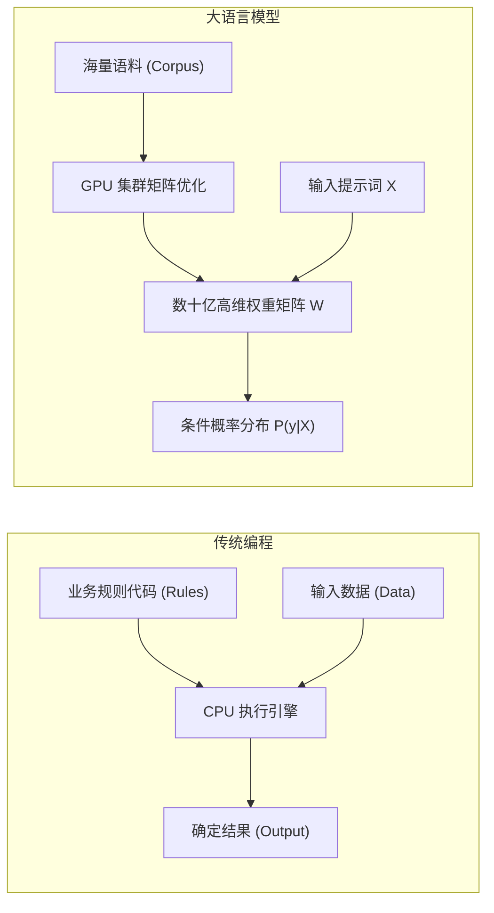
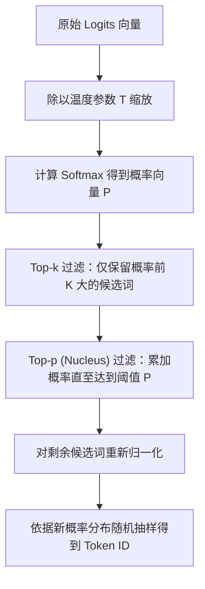
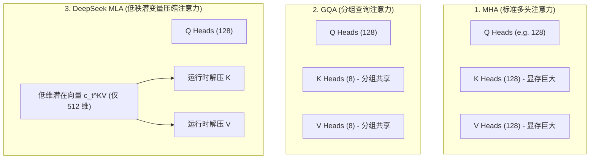
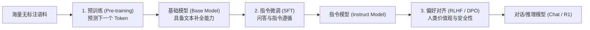
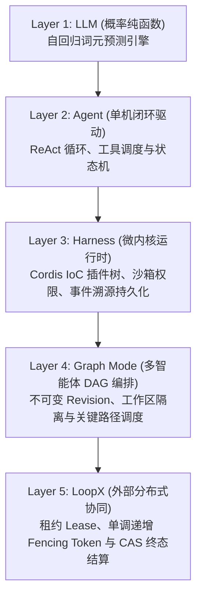

# Chapter 02: Foundations, from LLMs to Agent Systems

English | [中文](02-zero-background-llm-to-agent.zh.md)

This chapter provides the technical foundation for the book. It is intended for software engineers familiar with conventional programming (Java, C++, Go, Rust, Python, or TypeScript) but relatively new to modern AI. It opens the LLM black box in terms of **mathematical formulas, probability distributions, matrix operations, GPU-memory data structures, and operating-system-level system calls**.

---

## 2.1 AI, Machine Learning, Deep Learning, and LLMs

### 2.1.1 A Change in Perspective for Software Engineers
The central difference between conventional software engineering and modern AI is the distinction between **deterministic logic** and **statistical probability mapping**:

| Dimension | Conventional programming | Machine learning / deep learning (ML / DL) | Large language model (LLM) |
|---|---|---|---|
| **Core inputs** | Algorithmic rules in code + structured input data | Large sample datasets + ground-truth labels | Massive unlabeled text corpora (self-supervised pretraining) |
| **Computation** | Deterministic state machines and control-flow graphs (AST/CFG) | Fitting a high-dimensional nonlinear function $y = f(x; W)$ | Autoregressive conditional probability predictor $P(y_t \mid X, y_{<t})$ |
| **Output** | Fully determined data structure or error code | Classification probability or continuous regression value | Joint probability distribution over sequences of discrete tokens |
| **Debugging** | Breakpoints, stepping, unit tests, stack analysis | Loss convergence curves, gradient analysis, ablation studies | Prompt engineering, context management, sampling hyperparameters, and evals |



### 2.1.2 The Mathematics of Autoregressive Generation
Mainstream LLMs such as DeepSeek-V3/R1, GPT-4, and Claude are **autoregressive causal language models**. Given an input token sequence $X = (x_1, x_2, \dots, x_n)$, the joint probability of a generated sequence $Y = (y_1, y_2, \dots, y_T)$ of length $T$ follows the conditional-probability chain rule:

$$P(y_1, y_2, \dots, y_T \mid X) = \prod_{t=1}^T P(y_t \mid X, y_1, y_2, \dots, y_{t-1})$$

At each time step $t$, the model does not generate an entire passage at once. It uses the complete history $(X, y_1, \dots, y_{t-1})$ as context and computes the conditional probability of every candidate token in a vocabulary of size $|V|$ being next:

$$P(y_t = v_k \mid X, y_{<t}) = \text{Softmax}\left(\frac{\mathbf{z}_t}{\tau}\right)_k, \quad v_k \in \mathcal{V}$$

Here $\mathbf{z}_t \in \mathbb{R}^{|\mathcal{V}|}$ is the vector of unnormalized log probabilities (logits) emitted by the model's final layer, and $\tau$ is the sampling temperature.

### 2.1.3 Production-Style Pseudocode: The Autoregressive Generation Loop
For a software engineer, autoregressive inference can be described as a serial `while` loop around a stateless pure function:

```ts ignore-check
interface Tokenizer {
  encode(text: string): number[]
  decode(tokens: number[]): string
}

interface LLMWeights {
  forward(tokenSequence: number[]): Float32Array // 返回当前序列下一个 Token 的 Logits 向量 (大小为 |V|)
}

function autoregressiveGenerate(
  prompt: string,
  tokenizer: Tokenizer,
  model: LLMWeights,
  maxNewTokens: number,
  stopTokenId: number,
  temperature: number = 0.7
): string {
  // 1. 词法分析：文本转为 Token ID 数组
  const inputTokens: number[] = tokenizer.encode(prompt)
  const context: number[] = [...inputTokens]

  for (let step = 0; step < maxNewTokens; step++) {
    // 2. 前向传播：模型根据完整历史上下文计算下一个词元的 Logits
    const logits: Float32Array = model.forward(context)

    // 3. 概率归一化与采样 (Softmax + Temperature)
    const nextTokenId: number = sampleNextToken(logits, temperature)

    // 4. 终止条件检查
    if (nextTokenId === stopTokenId) {
      break
    }

    // 5. 将新生成的 Token 追加回上下文尾部，作为下一步的输入
    context.push(nextTokenId)
  }

  // 6. 逆向解码：将新生成的 Token ID 数组还原为自然语言文本
  const generatedTokens = context.slice(inputTokens.length)
  return tokenizer.decode(generatedTokens)
}
```

### 2.1.4 Why Is the Model a Stateless Pure Function?
A common misconception among engineers new to AI is that "the model remembers what I said during the conversation." **In fact, LLM weights are frozen and read-only during inference**. The model has no persistent internal memory variable that stores the conversation.
* **Why does it appear to remember?** On every request, the host program (harness) reformats the complete event history, including previous exchanges, into a string and includes it in the model's input context.
* **GPU-memory and compute cost**: As the conversation grows, the number of tokens sent with each request grows linearly, while self-attention computation grows quadratically ($\mathcal{O}(L^2)$).

### 2.1.5 The Mathematical Source of Hallucinations
The model can produce confident falsehoods because its training objective is **maximum likelihood estimation**: it learns statistical token co-occurrence in massive text corpora rather than building a database of verified facts.
* It seeks token sequences that are probable and fit human grammatical and semantic patterns smoothly.
* When training data does not cover a question, or the relevant knowledge is uncertain, probability-driven generation can favor a high-probability sequence that is grammatically coherent but factually wrong.
* **Engineering response**: Do not rely on the model's memory alone. Cross-check with external tool calls, retrieval-augmented generation (RAG), and deterministic program sandboxes.

---

## 2.2 Tokens, Tokenizers, Embeddings, and Positional Encoding (RoPE)

### 2.2.1 Tokens and BPE Tokenization
At the lowest level, computers process numbers. A tokenizer must turn text into an array of discrete integer token IDs.


Most current models use **byte-pair encoding (BPE)**. BPE is a lossless subword-compression algorithm built around greedy frequency-based merges:
1. **Initialize**: Put basic characters in the vocabulary (256 single-byte ASCII/UTF-8 values).
2. **Count frequencies**: Traverse the training corpus and count occurrences of adjacent token pairs.
3. **Merge greedily**: Combine the most frequent pair into a new composite token and add it to the vocabulary.
4. **Stop iterating**: Repeat until the vocabulary reaches a preset size (for example, about 129,280 tokens for DeepSeek-V3).

```ts ignore-check
// 模拟 BPE 极简合并过程
class BPETokenizerSimulator {
  private vocab: Map<string, number> = new Map([
    ['h', 1], ['e', 2], ['l', 3], ['o', 4], ['w', 5], ['r', 6], ['d', 7]
  ])
  private nextId = 8

  // 将高频词对 'l' + 'l' 合并为 'll'
  public learnMerge(pair: [string, string]): void {
    const merged = pair[0] + pair[1]
    if (!this.vocab.has(merged)) {
      this.vocab.set(merged, this.nextId++)
    }
  }
}
```

### 2.2.2 Embeddings: From Discrete IDs to a High-Dimensional Semantic Manifold
A token ID is a discrete categorical scalar, unsuitable for direct differentiation and matrix multiplication. An embedding matrix is effectively a lookup table that maps discrete IDs to points in a continuous high-dimensional vector space:

$$\mathbf{E} \in \mathbb{R}^{|\mathcal{V}| \times d_{\text{model}}}$$

For input token ID $i \in \{0, \dots, |\mathcal{V}|-1\}$, its token vector is row $i$ of the embedding matrix:

$$\mathbf{x}_i = \text{Embedding}(i) = \mathbf{E}[i, :] \in \mathbb{R}^{d_{\text{model}}}$$

For example, when $d_{\text{model}} = 4096$, token ID `15496` maps to an array of 4,096 single-precision floating-point values.

### 2.2.3 Rotary Position Embeddings (RoPE)
Self-attention is **permutation invariant**: swapping input-token positions does not change the scalar attention-weight results. Positional information must therefore be injected explicitly.

RoPE uses complex-number multiplication so that absolute positional encoding yields relative-position attention. For a two-dimensional vector $\mathbf{x} = (x_1, x_2)^T$ at position $m$, the rotation is:

$$\mathbf{R}_{\Theta, m}^2 \mathbf{x} = \begin{pmatrix} \cos m\theta & -\sin m\theta \\ \sin m\theta & \cos m\theta \end{pmatrix} \begin{pmatrix} x_1 \\ x_2 \end{pmatrix}$$

For a $d$-dimensional vector, split it into $d/2$ orthogonal two-dimensional subspaces and construct a block-diagonal rotation matrix:

$$\mathbf{R}_{\Theta, m}^d = \text{diag}\left( \mathbf{R}_{\theta_1, m}^2, \mathbf{R}_{\theta_2, m}^2, \dots, \mathbf{R}_{\theta_{d/2}, m}^2 \right), \quad \theta_i = 10000^{-2(i-1)/d}$$

**RoPE's key mathematical advantage**: When query vector $\mathbf{q}_m$ is at position $m$ and key vector $\mathbf{k}_n$ is at position $n$, their dot product depends on relative position:

$$\langle \mathbf{R}_{\Theta, m}^d \mathbf{q}, \mathbf{R}_{\Theta, n}^d \mathbf{k} \rangle = \mathbf{q}^T \left(\mathbf{R}_{\Theta, m}^d\right)^T \mathbf{R}_{\Theta, n}^d \mathbf{k} = \mathbf{q}^T \mathbf{R}_{\Theta, n-m}^d \mathbf{k} = g(\mathbf{q}, \mathbf{k}, m-n)$$

Combined with extrapolation and interpolation techniques such as YaRN, this lets the model generalize naturally to contexts longer than those used in training.

---

## 2.3 Logits, Softmax, and Sampling Strategies (Temperature, Top-p, Top-k)

### 2.3.1 Log Probabilities and Temperature-Scaled Softmax
The model's final forward-pass layer applies a linear transformation to produce an unnormalized real-valued vector $\mathbf{z} \in \mathbb{R}^{|\mathcal{V}|}$ of size $|\mathcal{V}|$ (logits). Softmax maps these values to a valid probability distribution:

$$p_i = \text{Softmax}(\mathbf{z}, \tau)_i = \frac{\exp(z_i / \tau)}{\sum_{j=1}^{|\mathcal{V}|} \exp(z_j / \tau)}$$

Here $\tau > 0$ is the temperature:
* **$\tau \to 0$ (highly deterministic)**: The distribution approaches a one-hot vector. Sampling becomes greedy search, consistently selecting the token with the highest logit.
* **$\tau = 1.0$ (standard distribution)**: The original, unadjusted probability distribution.
* **$\tau > 1.0$ (more random)**: The distribution flattens, making low-probability tokens substantially more likely. This increases creative variety but sharply raises the risk of hallucinations and grammatical disorder.

```
手算对比演示：假设候选词元的 Logits 为 [10.0, 8.0, 2.0]
-------------------------------------------------------------------------------
1. T = 0.5 (强化高频词，高度确定):
   exp(z/0.5) = [exp(20), exp(16), exp(4)] = [4.85e8, 8.88e6, 54.6]
   Softmax 概率: [98.2%, 1.8%, 0.00001%]

2. T = 1.0 (标准输出):
   exp(z/1.0) = [exp(10), exp(8), exp(2)] = [22026.5, 2980.9, 7.4]
   Softmax 概率: [88.0%, 11.9%, 0.03%]

3. T = 2.0 (拉平分布，增强多样性):
   exp(z/2.0) = [exp(5), exp(4), exp(1)] = [148.4, 54.6, 2.7]
   Softmax 概率: [72.1%, 26.5%, 1.3%]
```

### 2.3.2 Sampling Algorithms: Top-k and Top-p (Nucleus Sampling)
To balance variety with logical coherence, modern inference engines often combine Top-k and Top-p truncated sampling:



```ts ignore-check
// 生产级采样算法 TypeScript 实现
export function sampleFromLogits(
  logits: Float32Array,
  temperature: number = 0.7,
  topK: number = 50,
  topP: number = 0.9
): number {
  const n = logits.length
  // 1. 温度缩放
  const scaled = new Float32Array(n)
  for (let i = 0; i < n; i++) scaled[i] = logits[i] / Math.max(temperature, 1e-5)

  // 2. 稳定 Softmax 计算 (减去最大值防止 exp 浮点溢出)
  let maxLogit = -Infinity
  for (let i = 0; i < n; i++) if (scaled[i] > maxLogit) maxLogit = scaled[i]

  const probs = new Float32Array(n)
  let sumExp = 0
  for (let i = 0; i < n; i++) {
    probs[i] = Math.exp(scaled[i] - maxLogit)
    sumExp += probs[i]
  }
  for (let i = 0; i < n; i++) probs[i] /= sumExp

  // 3. 构建索引-概率对并降序排序
  const candidates: { id: number; prob: number }[] = []
  for (let i = 0; i < n; i++) candidates.push({ id: i, prob: probs[i] })
  candidates.sort((a, b) => b.prob - a.prob)

  // 4. Top-K 截断
  const kFiltered = candidates.slice(0, Math.min(topK, candidates.length))

  // 5. Top-P (Nucleus) 截断
  let cumulativeProb = 0
  const finalCandidates: { id: number; prob: number }[] = []
  for (const item of kFiltered) {
    finalCandidates.push(item)
    cumulativeProb += item.prob
    if (cumulativeProb >= topP) break
  }

  // 6. 重新归一化并抽样
  let finalSum = 0
  for (const item of finalCandidates) finalSum += item.prob
  const randomThreshold = Math.random() * finalSum

  let runningSum = 0
  for (const item of finalCandidates) {
    runningSum += item.prob
    if (runningSum >= randomThreshold) return item.id
  }

  return finalCandidates[0].id
}
```

### 2.3.3 Why Does Temperature = 0 Not Guarantee Bit-for-Bit Reproducibility?
An engineer might expect the same input with $T=0$ to yield a bit-for-bit identical output, even from an AI model. In distributed, multi-GPU inference, however:
1. **GPU floating-point addition is not associative**: Under IEEE 754, $(a + b) + c \neq a + (b + c)$. Scheduling differences between thread blocks in parallel reduction can introduce small errors in the low-order bits.
2. **Concurrent mixture-of-experts (MoE) routing can vary**: In large models such as DeepSeek-V3, nanosecond-scale computational differences near the Top-2 expert-gating threshold can route a token to a different GPU expert, causing subsequent tokens to diverge.

---

## 2.4 Transformers, Self-Attention, and DeepSeek MLA

### 2.4.1 Deriving Scaled Dot-Product Self-Attention
Self-attention is fundamentally a **content-addressing mechanism**. For an input sequence, three linear projection matrices produce the query matrix $Q$, key matrix $K$, and value matrix $V$:

$$\mathbf{Q} = \mathbf{X}\mathbf{W}_Q, \quad \mathbf{K} = \mathbf{X}\mathbf{W}_K, \quad \mathbf{V} = \mathbf{X}\mathbf{W}_V$$

The standard scaled dot-product attention equation is:

$$\text{Attention}(\mathbf{Q}, \mathbf{K}, \mathbf{V}) = \text{Softmax}\left(\frac{\mathbf{Q}\mathbf{K}^T}{\sqrt{d_k}} + \mathbf{M}\right)\mathbf{V}$$

* **$\mathbf{Q}\mathbf{K}^T$ (similarity matrix)**: Computes semantic relevance scores between every pair of tokens in the sequence; its dimensions are $[L, L]$.
* **$\sqrt{d_k}$ (scaling factor)**: For large key dimension $d_k$, the dot-product variance rises to $d_k$, pushing Softmax into a saturated-gradient region where gradients are nearly zero. Dividing by $\sqrt{d_k}$ brings the variance back to 1.0.
* **$\mathbf{M}$ (causal lower-triangular mask)**: Ensures that a prediction at position $t$ can attend only to historical tokens at positions $\le t$, never future tokens:

  $$\mathbf{M}_{i,j} = \begin{cases} 0, & i \ge j \\ -\infty, & i < j \end{cases}$$

### 2.4.2 Attention Architectures: MHA $\to$ GQA $\to$ DeepSeek MLA
Attention architectures have evolved substantially to reduce GPU-memory use during long-context inference:



#### DeepSeek MLA's Core Innovation
With conventional multi-head attention (MHA), the KV Cache can occupy more GPU memory than the model weights at long context lengths. DeepSeek introduced **low-rank latent projection and compression**:
* During storage, the engine does not cache complete $K, V$ matrices. It jointly projects and compresses keys and values into a small latent vector $\mathbf{c}_t^{KV} \in \mathbb{R}^{d_c}$ (only 512 dimensions).
* During computation, the GPU reconstructs the needed values in registers using up-projection matrices $\mathbf{W}^{UK}, \mathbf{W}^{UV}$, reducing KV Cache memory use by **more than 80%**.

### 2.4.3 FlashAttention: GPU Compute and the Memory Wall
Naive attention repeatedly reads and writes an $[L, L]$ attention matrix in global high-bandwidth memory (HBM), with $\mathcal{O}(L^2)$ time and memory complexity. **FlashAttention's key advances** are:
1. **Tiling**: Divide the input matrices into small blocks that fit in the GPU's much faster on-chip static RAM (SRAM, roughly 100–200 KB).
2. **Online Softmax**: Update the maximum and partial normalization sum recursively without materializing the entire $[L, L]$ matrix, reducing global HBM accesses from $\mathcal{O}(L^2)$ to $\mathcal{O}(L)$.

---

## 2.5 Model Pretraining, Alignment (SFT / DPO), and Reasoning



### 2.5.1 Pretraining Objective: Self-Supervised Learning Without Labels
Pretraining minimizes negative log-likelihood loss (cross-entropy) over the full corpus:

$$\mathcal{L}_{\text{pretrain}}(\theta) = -\sum_{t=1}^T \log P(y_t \mid y_{<t}; \theta)$$

### 2.5.2 Preference Alignment: From PPO to Direct Preference Optimization (DPO)
Preference alignment helps the model follow human values and safety constraints. Given prompt $x$, a preferred response $y_w$ (winner), and a dispreferred response $y_l$ (loser), DPO avoids the complex reinforcement-learning process of training a reward model in conventional RLHF. Instead, it optimizes policy model $\pi_\theta$ directly with a closed-form objective:

$$\mathcal{L}_{\text{DPO}}(\theta) = -\mathbb{E}_{(x, y_w, y_l)} \left[ \log \sigma \left( \beta \log \frac{\pi_\theta(y_w \mid x)}{\pi_{\text{ref}}(y_w \mid x)} - \beta \log \frac{\pi_\theta(y_l \mid x)}{\pi_{\text{ref}}(y_l \mid x)} \right) \right]$$

Here $\pi_{\text{ref}}$ is a frozen reference model, $\beta$ is the hyperparameter that regulates how far the policy may deviate from it, and $\sigma(z) = \frac{1}{1 + e^{-z}}$ is the sigmoid function.

### 2.5.3 The Advance of Reasoning Models
Reasoning models such as DeepSeek-R1 and OpenAI o1 explicitly generate an extended chain of thought (CoT) before the final answer.
* **`reasoning_content`**: The reasoning process, including independent trial and error, hypothesis testing, reflection, and correction.
* **`content`**: The concise final answer for the user.
* **Engineering treatment**: Store `reasoning_content` separately from `content` when persisting sessions and reconstructing state-machine history, so irrelevant reasoning markers do not contaminate the context for the next tool call.

---

## 2.6 Inference Serving, Context Windows, and KV Cache Memory Accounting

### 2.6.1 The Two Inference Phases: Prefill and Decode
LLM inference has two physically distinct execution phases:

| Dimension | Prefill / TTFT | Decode / TPS |
|---|---|---|
| **Work** | Process all prompt tokens in parallel | Generate output tokens serially and autoregressively |
| **Hardware bottleneck** | **Compute-bound**, with high Tensor Core utilization | **Memory-bandwidth-bound**, with low compute utilization |
| **Optimization focus** | Parallel GEMM operations, FlashAttention, chunked prefill | **KV Cache bandwidth and capacity**, speculative decoding |
| **Metric** | Time to first token (TTFT) | Tokens per second (TPS) |

### 2.6.2 Standard Formula for KV Cache GPU-Memory Use
To avoid recomputing the key and value vectors for every earlier token whenever it generates a new one, the inference engine caches the historical $K, V$ matrices in GPU memory.

For standard multi-head attention (MHA), KV Cache GPU-memory use is calculated as:

$$\text{VRAM}_{\text{KVCache}} = 2 \times L \times B \times S \times N_{\text{kv}} \times H_{\text{dim}} \times \text{bytes\_per\_element}$$

* **$2$**: Cache both the key and value matrices.
* **$L$**: Number of stacked Transformer layers.
* **$B$**: Concurrent batch size.
* **$S$**: Total sequence length (prompt tokens + output tokens).
* **$N_{\text{kv}}$**: Number of key-value attention heads.
* **$H_{\text{dim}}$**: Vector dimension per attention head.
* **$\text{bytes\_per\_element}$**: Bytes per element at the chosen precision (FP16 = 2 bytes, FP8/INT8 = 1 byte, INT4 = 0.5 byte).

### 2.6.3 GPU-Memory Accounting and Hardware Selection Table

The following table compares weight memory and memory use at different concurrency and context lengths across model sizes, including FP16 and INT4 weights:

| Model | Weight memory (FP16) | Weight memory (INT4/AWQ) | KV Cache: one request, 8K context | KV Cache: eight requests, 32K context | Recommended minimum production GPU configuration |
|---|---|---|---|---|---|
| **7B** (32 layers, 32 heads) | 14.0 GB | 3.8 GB | 1.0 GB | 32.0 GB | 1x RTX 4090 (24GB, INT4) or 1x A10 (24GB) |
| **14B** (40 layers, 40 heads) | 28.0 GB | 7.5 GB | 1.6 GB | 51.2 GB | 1x A100 (80GB) or 2x RTX 4090 (24GB) |
| **32B** (64 layers, 40 heads) | 64.0 GB | 17.0 GB | 2.6 GB | 83.2 GB | 1x A100 (80GB) or 4x RTX 4090 (24GB) |
| **70B** (80 layers, 8 GQA heads) | 140.0 GB | 38.0 GB | 1.3 GB | 41.6 GB | 2x A100 (80GB) or 2x H100 (80GB) |
| **DeepSeek-V3 671B** (MoE, 37B active, MLA) | 671.0 GB (FP8 storage) | 180.0 GB (INT4) | **0.8 GB (MLA compression)** | **25.6 GB (MLA compression)** | 8x H100 (80GB) / 8x H800 (80GB) |

---

## 2.7 Message Protocols, System Prompts, and Function Calling

### 2.7.1 Structured Message Arrays
Modern LLM inference services (including OpenAI-compatible APIs) use structured role-based messages:

```json
[
  { "role": "system", "content": "You are a secure code assistant." },
  { "role": "user", "content": "Check the current directory status." },
  {
    "role": "assistant",
    "content": null,
    "tool_calls": [
      {
        "id": "call_987123",
        "type": "function",
        "function": { "name": "shell_exec", "arguments": "{\"command\":\"ls -la\"}" }
      }
    ]
  },
  {
    "role": "tool",
    "tool_call_id": "call_987123",
    "content": "total 32\ndrwxr-xr-x 4 user group 4096 Aug 25 10:00 .\n-rw-r--r-- 1 user group  512 Aug 25 10:00 package.json"
  }
]
```

### 2.7.2 How Function Calling Works
Programmers should understand that **the model never executes your code or makes network requests directly inside the GPU**. Function Calling is a **typed, text-based protocol**:
1. **Schema injection**: The host includes each tool's JSON Schema in the system prompt.
2. **Constrained generation**: When the model decides to call a tool, it generates text matching a designated AST marker (such as `<tool_call>...</tool_call>`) or JSON format.
3. **Host interception and parsing**: The host (harness) intercepts the stream, parses the tool name and JSON arguments, then executes the request in the host operating system's sandbox.
4. **Result insertion**: The host appends the execution result to the messages under the `tool` role and calls the model again.

---

## 2.8 From Chat to Agents, Harness, Graph, and LoopX

To address complex engineering tasks, the system is organized into five abstraction layers, from the bottom up:



| Architecture layer | Conventional software analogy | Core responsibility | Responsibility it must not assume |
|---|---|---|---|
| **LLM** | Probabilistic coprocessor / read-only pure-function API | Receive context tokens, compute a conditional probability distribution, and emit text | Perform physical I/O or persist state at the model layer |
| **Agent** | Process event loop (Event Loop / REPL) | Coordinate model generation and tool execution in a closed loop | Hard-code plugin assembly or a global business singleton |
| **Harness** | Operating-system microkernel / Spring IoC container | Provide plugin dependency injection, security sandboxing, event persistence, and RPC | Intrude directly into the core agent loop to change control flow |
| **Graph** | Distributed task engine (Airflow / Temporal) | Split long, complex tasks into a multi-agent DAG and track revisions | Hard-code multi-agent state in a single agent's memory |
| **LoopX** | Distributed coordination service (etcd / ZooKeeper) | Maintain cross-cluster leases, issue fencing tokens, and settle terminal results through CAS | Directly schedule the internal task graph |

---

## 2.9 First End-to-End Walkthrough: One Request in 15 Steps

Consider a typical request: the user enters `“读取 package.json，将 version 字段修改为 1.0.0”` ("Read package.json and change the version field to 1.0.0"). Follow its data through the system:

1. **Web RPC receipt**: The frontend sends an HTTP RPC request with a unique `rpcId`, inserts an optimistic message into its local Zustand state tree, and renders it.
2. **Host service ingress**: The Host process's `APIService` validates the payload and enqueues the message in the agent's `Inbox` (`next-turn` queue).
3. **State-machine start**: The agent driver claims the message from `Inbox`, appends a `user/message` event to the event log, and emits `turn/start`.
4. **Pre-step interception**: Cordis runs the `agent/pre-step` waterfall; plugins dynamically inject the workspace path and current system state.
5. **Context projection**: The pure `Session.deriveMessages()` function scans the immutable event stream and folds it into the structured message history visible to the model.
6. **Dynamic prompt assembly**: The system-prompt service combines a stable instruction prefix with a dynamic suffix and attaches every tool's JSON Schema.
7. **Streaming request**: `ctx.llm.stream()` sends the structured messages to the DeepSeek API over an HTTP SSE connection.
8. **Streaming-token persistence**: SSE packets arrive incrementally, are parsed into `assistant/chunk` events, and are persisted in real time; the frontend receives the live text over WebSocket.
9. **Tool-call parsing**: At the end of the stream, `BlockAssembler` deserializes token fragments into a structured `tool_call` (calling `fs_read_file`).
10. **Sandbox permission check**: The `tools/pre-execute` waterfall intercepts the call and checks whether the file path lies within an allowed workspace root.
11. **Physical execution in the sandbox**: A provider dispatches a Landlock-sandboxed read; oversized output goes to the Spill Manager.
12. **Record the execution**: A `tool/result` event containing the file content is appended to the immutable log.
13. **Second iteration (Step 2)**: The model is called again with `tool/result` in its history and emits a second `tool_call` (`fs_write_file`).
14. **Write and converge**: The sandbox writes the file; a third model call returns a final text explanation.
15. **Close and flush the transaction**: The agent emits `step/end` and `turn/end`, the persistence coordinator performs `fsync`, and the frontend state tree reconciles the terminal state.

---

## 2.10 Beginner Self-Check Questions with Detailed Answers

### Question 1: Autoregressive Probability
**Question**: Why can an LLM not use information from token $t+1$ while generating token $t$? **Answer**: During training, an autoregressive causal language model applies a lower-triangular causal attention mask that sets attention weights for future positions to $-\infty$. Generation follows the one-way conditional-probability chain $P(Y \mid X) = \prod_{t} P(y_t \mid X, y_{<t})$; the future token does not yet exist and cannot be observed.

### Question 2: Temperature Sampling
**Question**: What does sampling do when temperature is set to 0, and which traditional search algorithm does this resemble? **Answer**: As $\tau \to 0$, the Softmax distribution approaches a Dirac impulse: the highest-probability item approaches 1.0, and all others approach 0. Sampling becomes **greedy search**, selecting $\arg\max_i z_i$ at each step.

### Question 3: The KV Cache Memory Bottleneck
**Question**: In a long conversation, why does GPU-memory use keep rising with each turn even if the model generates only one new token? **Answer**: From $\text{VRAM} \propto 2 \cdot L \cdot S \cdot N_{\text{kv}} \cdot H_{\text{dim}}$, KV Cache memory is directly proportional to total sequence length $S$ (all historical tokens). Each turn's new tokens remain in the key-value cache, consuming available GPU memory linearly.

### Question 4: DeepSeek MLA's Advantage
**Question**: What is DeepSeek MLA's central improvement over conventional MHA for long contexts? **Answer**: MLA uses low-rank matrix factorization to jointly project and compress the key and value vectors of all attention heads into a small latent vector. It caches only that compressed vector in GPU memory and reconstructs values dynamically in on-chip registers, reducing KV Cache memory use by more than 80%.

### Question 5: Prompt Injection and Security Boundaries
**Question**: Why does writing "Never follow a user's prohibited instructions" in a system prompt not create a real security sandbox? **Answer**: In an LLM's self-attention computation, system and user text occupy the same token-vector space; the model cannot physically enforce instruction privilege levels. An attacker can use an adversarial jailbreak prompt (prompt injection). Real security requires an operating-system-level sandbox (such as Linux Landlock or Seatbelt) and interception in the host.

### Question 6: Model-Visible Means Recorded
**Question**: Why does Harness require every piece of context sent to the model to be fully reconstructable from the Session log? **Answer**: If model input includes transient in-memory data that was never persisted, replay after a crash produces a message history different from the actual pre-crash input. That split-brain divergence can derail autoregressive generation and repeat irreversible physical side effects.

### Question 7: The Actual Function Calling Flow
**Question**: Does the operating-system kernel execute the JSON string returned by a model during Function Calling? **Answer**: No. The model emits a text-form JSON string based on statistical probabilities. The host (harness) deserializes it and validates its arguments at the application layer (with Zod/JSON Schema), invokes restricted system calls or local APIs to execute it, then feeds the result back to the model as text.

### Question 8: Distributed Fencing Tokens
**Question**: Why must a worker include a monotonically increasing fencing token when settling a multi-agent task through CAS after a tool runs? **Answer**: Network latency or a garbage-collection pause can let the worker's lease expire after the scheduler has reassigned the task. If that old worker later writes blindly, its late write can overwrite newer state (an ABA split-brain failure). Storage-level CAS atomically rejects a write whose fencing token is older than the current epoch.
