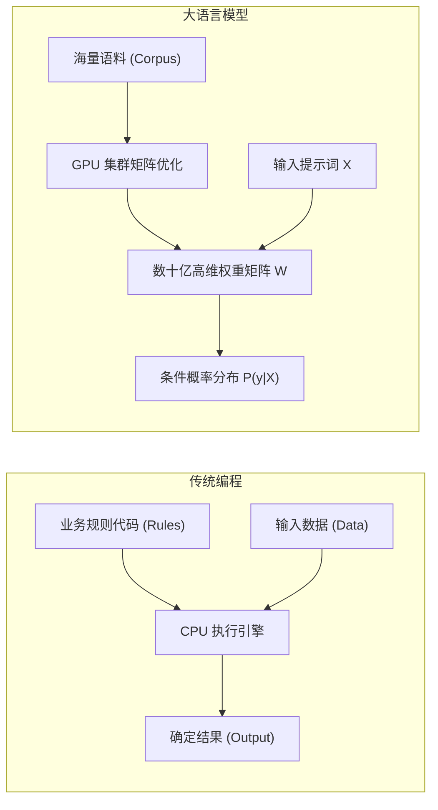
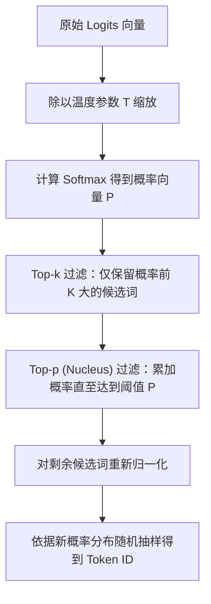
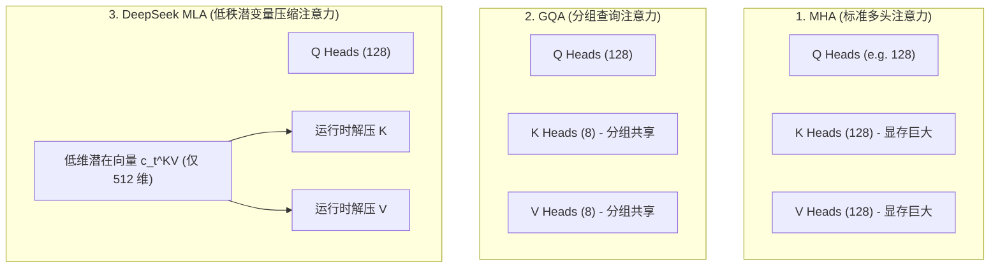
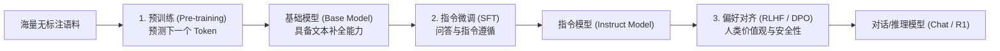
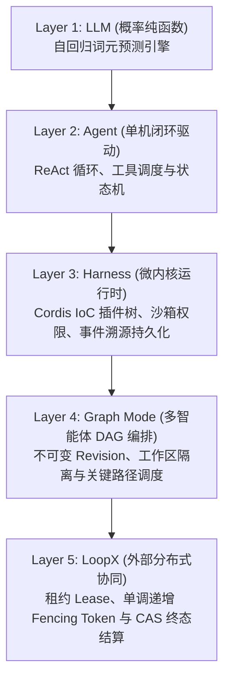

# 第 02 章：零基础预备：从 LLM 到 Agent 系统

[English](02-zero-background-llm-to-agent.md) | 中文

本章是全书的技术基石。针对具备传统编程经验（Java / C++ / Go / Rust / Python / TypeScript）但对现代 AI 相对陌生的软件工程师，本章将大语言模型（LLM）的黑盒彻底拆解为确定性的**数学公式、概率分布、矩阵运算、显存数据结构与操作系统级系统调用**。

---

## 2.1 AI、机器学习、深度学习与大语言模型

### 2.1.1 软件工程师的认知范式转换
传统软件工程与现代人工智能的核心区别在于**确定性逻辑（Deterministic Logic）**与**统计概率映射（Statistical Probability Mapping）**的差异：

| 范式维度 | 传统程序开发 (Traditional Programming) | 机器学习 / 深度学习 (ML / DL) | 大语言模型 (LLM) |
|---|---|---|---|
| **核心要素** | 规则算法代码 + 结构化输入数据 | 大规模样本数据 + 真实标签结果 | 海量无标注文本数据（自监督预训练） |
| **计算本质** | 确定性状态机与控制流图（AST/CFG） | 拟合高维非线性泛函 $y = f(x; W)$ | 自回归条件概率预测器 $P(y_t \mid X, y_{<t})$ |
| **输出形式** | 绝对确定的数据结构或错误码 | 分类概率标量或回归连续值 | 离散词元（Token）序列的联合概率分布 |
| **调试手段** | 断点调试、单步执行、单元测试、堆栈分析 | 损失函数收敛曲线、梯度分析、消融实验 | 提示词工程、上下文管理、采样超参数与 Eval 评测 |



### 2.1.2 自回归概率生成的数学本质
所有主流 LLM（如 DeepSeek-V3/R1、GPT-4、Claude）均为**自回归（Autoregressive）因果语言模型**。给定输入文本词元序列 $X = (x_1, x_2, \dots, x_n)$，模型生成长度为 $T$ 的目标序列 $Y = (y_1, y_2, \dots, y_T)$ 的联合概率分布由条件概率链式法则确定：

$$P(y_1, y_2, \dots, y_T \mid X) = \prod_{t=1}^T P(y_t \mid X, y_1, y_2, \dots, y_{t-1})$$

在每一个时间步 $t$，模型并不一次性生成整段文本，而是以当前的全部历史输入 $(X, y_1, \dots, y_{t-1})$ 为上下文，计算词表（Vocabulary，大小为 $|V|$）中每一个候选词元作为下一个词的条件概率分布：

$$P(y_t = v_k \mid X, y_{<t}) = \text{Softmax}\left(\frac{\mathbf{z}_t}{\tau}\right)_k, \quad v_k \in \mathcal{V}$$

其中 $\mathbf{z}_t \in \mathbb{R}^{|\mathcal{V}|}$ 为模型最后一层输出的未归一化对数概率（Logits），$\tau$ 为采样温度参数。

### 2.1.3 工业级伪代码：自回归生成主循环
从软件工程师角度，自回归推理可以精确描述为一个无状态纯函数的串行 `while` 循环：

```ts ignore-check
interface Tokenizer {
  encode(text: string): number[]
  decode(tokens: number[]): string
}

interface LLMWeights {
  forward(tokenSequence: number[]): Float32Array // 返回当前序列下一个 Token 的 Logits 向量 (大小为 |V|)
}

function autoregressiveGenerate(
  prompt: string,
  tokenizer: Tokenizer,
  model: LLMWeights,
  maxNewTokens: number,
  stopTokenId: number,
  temperature: number = 0.7
): string {
  // 1. 词法分析：文本转为 Token ID 数组
  const inputTokens: number[] = tokenizer.encode(prompt)
  const context: number[] = [...inputTokens]

  for (let step = 0; step < maxNewTokens; step++) {
    // 2. 前向传播：模型根据完整历史上下文计算下一个词元的 Logits
    const logits: Float32Array = model.forward(context)

    // 3. 概率归一化与采样 (Softmax + Temperature)
    const nextTokenId: number = sampleNextToken(logits, temperature)

    // 4. 终止条件检查
    if (nextTokenId === stopTokenId) {
      break
    }

    // 5. 将新生成的 Token 追加回上下文尾部，作为下一步的输入
    context.push(nextTokenId)
  }

  // 6. 逆向解码：将新生成的 Token ID 数组还原为自然语言文本
  const generatedTokens = context.slice(inputTokens.length)
  return tokenizer.decode(generatedTokens)
}
```

### 2.1.4 为什么大模型是无状态纯函数？
传统工程师初学 AI 时最容易产生的误解是：“大模型在对话中会记住我说过的话”。 **真相是：LLM 权重参数在推理期间是完全只读（Read-Only）且冻结的**。模型内部没有任何持久化的内存变量来记录历史对话。
* **为什么感觉有记忆？**：宿主程序（Harness）在每一次发起请求时，将包括历史对话在内的完整事件流重新格式化为字符串，全量打包送入模型的输入上下文。
* **显存与计算开销**：随着对话轮次增加，每次请求发送的 Token 数量线性膨胀，导致自注意力计算量呈二次方增长（$\mathcal{O}(L^2)$）。

### 2.1.5 幻觉（Hallucination）的数学根源
模型之所以会一本正经地“胡说八道”，本质原因在于其训练目标是**极大似然估计（Maximum Likelihood Estimation）**，即学习海量文本中词元与词元之间的统计共现概率，而非构建确定性的事实真值数据库：
* 模型追求的是使生成的 Token 序列在概率分布上最平滑、最符合人类语法和语义模式；
* 当面对训练集未覆盖或知识模糊的问题时，模型在概率驱动下倾向于选择“语法连贯但事实错误”的高概率词元拼接。
* **工程解法**：不能依赖模型自身的记忆，必须通过外部工具（Tool Calling）、检索增强生成（RAG）与确定性程序沙箱进行交叉验证。

---

## 2.2 词元（Token）、分词器（Tokenizer）、向量嵌入（Embedding）与位置编码（RoPE）

### 2.2.1 词元（Token）与 BPE 分词算法
计算机底层只能处理数字。文本必须经过分词器（Tokenizer）转换为离散整数数组（Token IDs）。


目前主流模型采用**字节对编码（Byte-Pair Encoding, BPE）**算法。BPE 是一种基于统计贪心策略的无损子词压缩算法：
1. **初始化**：词表包含基础字符（ASCII/UTF-8 单字节共 256 个）；
2. **统计频率**：遍历训练语料库，统计所有相邻词元对（Token Pair）的出现频率；
3. **贪心合并**：将出现频率最高的词元对合并为一个新的复合词元，并加入词表；
4. **迭代终止**：重复上述过程直到词表大小达到预设阈值（例如 DeepSeek-V3 词表大小约为 129,280）。

```ts ignore-check
// 模拟 BPE 极简合并过程
class BPETokenizerSimulator {
  private vocab: Map<string, number> = new Map([
    ['h', 1], ['e', 2], ['l', 3], ['o', 4], ['w', 5], ['r', 6], ['d', 7]
  ])
  private nextId = 8

  // 将高频词对 'l' + 'l' 合并为 'll'
  public learnMerge(pair: [string, string]): void {
    const merged = pair[0] + pair[1]
    if (!this.vocab.has(merged)) {
      this.vocab.set(merged, this.nextId++)
    }
  }
}
```

### 2.2.2 向量嵌入（Embedding）：从离散 ID 到高维语义流形
Token ID 是离散的类别标量，无法直接进行微积分求导与矩阵乘法。Embedding 矩阵本质上是一个查找表（Lookup Table），将离散 ID 映射为连续高维向量空间中的点：

$$\mathbf{E} \in \mathbb{R}^{|\mathcal{V}| \times d_{\text{model}}}$$

对于输入 Token ID $i \in \{0, \dots, |\mathcal{V}|-1\}$，其词向量即为嵌入矩阵的第 $i$ 行：

$$\mathbf{x}_i = \text{Embedding}(i) = \mathbf{E}[i, :] \in \mathbb{R}^{d_{\text{model}}}$$

例如，在 $d_{\text{model}} = 4096$ 的模型中，Token ID `15496` 将被映射为一个 4096 维的单精度浮点数数组。

### 2.2.3 旋转位置编码（RoPE: Rotary Position Embedding）
自注意力机制具有**排列不变性（Permutation Invariance）**：交换输入词元的顺序不会改变注意力权重的标量结果。因此必须显式注入位置信息。

RoPE 通过复数乘法将绝对位置编码转换为相对位置注意力。对于位于位置 $m$ 的二维向量 $\mathbf{x} = (x_1, x_2)^T$，RoPE 定义其旋转变换为：

$$\mathbf{R}_{\Theta, m}^2 \mathbf{x} = \begin{pmatrix} \cos m\theta & -\sin m\theta \\ \sin m\theta & \cos m\theta \end{pmatrix} \begin{pmatrix} x_1 \\ x_2 \end{pmatrix}$$

对于 $d$ 维向量，将其拆分为 $d/2$ 个正交二维子空间，构造对角块旋转矩阵：

$$\mathbf{R}_{\Theta, m}^d = \text{diag}\left( \mathbf{R}_{\theta_1, m}^2, \mathbf{R}_{\theta_2, m}^2, \dots, \mathbf{R}_{\theta_{d/2}, m}^2 \right), \quad \theta_i = 10000^{-2(i-1)/d}$$

**RoPE 的核心数学优越性**： 当查询向量 $\mathbf{q}_m$ 位于位置 $m$，键向量 $\mathbf{k}_n$ 位于位置 $n$ 时，两者的点积内积具有相对位置不变性：

$$\langle \mathbf{R}_{\Theta, m}^d \mathbf{q}, \mathbf{R}_{\Theta, n}^d \mathbf{k} \rangle = \mathbf{q}^T \left(\mathbf{R}_{\Theta, m}^d\right)^T \mathbf{R}_{\Theta, n}^d \mathbf{k} = \mathbf{q}^T \mathbf{R}_{\Theta, n-m}^d \mathbf{k} = g(\mathbf{q}, \mathbf{k}, m-n)$$

这保证了模型能够自然泛化到训练长度之外的更长上下文（结合 YaRN 等外推插值技术）。

---

## 2.3 Logits、Softmax 与采样策略（Temperature, Top-p, Top-k）

### 2.3.1 对数概率与带温度的 Softmax
模型前向计算的最后一层通过线性变换输出大小为 $|\mathcal{V}|$ 的未归一化实数向量 $\mathbf{z} \in \mathbb{R}^{|\mathcal{V}|}$（Logits）。Softmax 函数将其实数空间映射为合法的概率分布：

$$p_i = \text{Softmax}(\mathbf{z}, \tau)_i = \frac{\exp(z_i / \tau)}{\sum_{j=1}^{|\mathcal{V}|} \exp(z_j / \tau)}$$

其中 $\tau > 0$ 为温度参数（Temperature）：
* **$\tau \to 0$（极度确定）**：概率分布极化为 One-Hot 向量，模型退化为贪心搜索（Greedy Search），始终选择最大 Logit 对应的词元；
* **$\tau = 1.0$（标准分布）**：原始无偏概率分布；
* **$\tau > 1.0$（高度随机）**：拉平概率分布，低概率词元的选中概率显著提升，文本创造力上升但幻觉与语法混乱风险剧增。

```
手算对比演示：假设候选词元的 Logits 为 [10.0, 8.0, 2.0]
-------------------------------------------------------------------------------
1. T = 0.5 (强化高频词，高度确定):
   exp(z/0.5) = [exp(20), exp(16), exp(4)] = [4.85e8, 8.88e6, 54.6]
   Softmax 概率: [98.2%, 1.8%, 0.00001%]

2. T = 1.0 (标准输出):
   exp(z/1.0) = [exp(10), exp(8), exp(2)] = [22026.5, 2980.9, 7.4]
   Softmax 概率: [88.0%, 11.9%, 0.03%]

3. T = 2.0 (拉平分布，增强多样性):
   exp(z/2.0) = [exp(5), exp(4), exp(1)] = [148.4, 54.6, 2.7]
   Softmax 概率: [72.1%, 26.5%, 1.3%]
```

### 2.3.2 采样算法：Top-k 与 Top-p (Nucleus Sampling)
为了平衡生成的多样性与逻辑连贯性，现代推理引擎通常组合使用 Top-k 与 Top-p 截断采样：



```ts ignore-check
// 生产级采样算法 TypeScript 实现
export function sampleFromLogits(
  logits: Float32Array,
  temperature: number = 0.7,
  topK: number = 50,
  topP: number = 0.9
): number {
  const n = logits.length
  // 1. 温度缩放
  const scaled = new Float32Array(n)
  for (let i = 0; i < n; i++) scaled[i] = logits[i] / Math.max(temperature, 1e-5)

  // 2. 稳定 Softmax 计算 (减去最大值防止 exp 浮点溢出)
  let maxLogit = -Infinity
  for (let i = 0; i < n; i++) if (scaled[i] > maxLogit) maxLogit = scaled[i]

  const probs = new Float32Array(n)
  let sumExp = 0
  for (let i = 0; i < n; i++) {
    probs[i] = Math.exp(scaled[i] - maxLogit)
    sumExp += probs[i]
  }
  for (let i = 0; i < n; i++) probs[i] /= sumExp

  // 3. 构建索引-概率对并降序排序
  const candidates: { id: number; prob: number }[] = []
  for (let i = 0; i < n; i++) candidates.push({ id: i, prob: probs[i] })
  candidates.sort((a, b) => b.prob - a.prob)

  // 4. Top-K 截断
  const kFiltered = candidates.slice(0, Math.min(topK, candidates.length))

  // 5. Top-P (Nucleus) 截断
  let cumulativeProb = 0
  const finalCandidates: { id: number; prob: number }[] = []
  for (const item of kFiltered) {
    finalCandidates.push(item)
    cumulativeProb += item.prob
    if (cumulativeProb >= topP) break
  }

  // 6. 重新归一化并抽样
  let finalSum = 0
  for (const item of finalCandidates) finalSum += item.prob
  const randomThreshold = Math.random() * finalSum

  let runningSum = 0
  for (const item of finalCandidates) {
    runningSum += item.prob
    if (runningSum >= randomThreshold) return item.id
  }

  return finalCandidates[0].id
}
```

### 2.3.3 为什么设置 Temperature = 0 也无法保证硬件级 100% 复现？
传统软件工程师期望即使是 AI 模型，在相同输入与 $T=0$ 下也应给出逐位一致的确定性输出。但在多 GPU 并行分布式推理环境中：
1. **GPU 浮点加法非结合律**：IEEE 754 浮点运算满足 $(a + b) + c \neq a + (b + c)$。在并行规约（Parallel Reduction）算子中，线程块（Thread Block）的调度乱序会导致微小的低位浮点截断误差；
2. **MoE（专家混合）路由并发抖动**：在 DeepSeek-V3 等大模型中，Top-2 专家的调度门控权重在临界值发生纳秒级计算微差时，会导致 Token 被分发至不同的 GPU 专家核，最终引发后续所有 Token 的雪崩式分叉。

---

## 2.4 Transformer、自注意力机制与 DeepSeek MLA 架构

### 2.4.1 自注意力（Scaled Dot-Product Attention）的数学推导
自注意力的物理本质是**内容寻址机制（Content-based Addressing）**。对于给定的输入序列，模型通过三个线性映射投影矩阵生成查询矩阵 $Q$、键矩阵 $K$、值矩阵 $V$：

$$\mathbf{Q} = \mathbf{X}\mathbf{W}_Q, \quad \mathbf{K} = \mathbf{X}\mathbf{W}_K, \quad \mathbf{V} = \mathbf{X}\mathbf{W}_V$$

标准缩放点积注意力方程为：

$$\text{Attention}(\mathbf{Q}, \mathbf{K}, \mathbf{V}) = \text{Softmax}\left(\frac{\mathbf{Q}\mathbf{K}^T}{\sqrt{d_k}} + \mathbf{M}\right)\mathbf{V}$$

* **$\mathbf{Q}\mathbf{K}^T$（相似度矩阵）**：计算序列中任意两个词元之间的语义相关性得分，维度为 $[L, L]$；
* **$\sqrt{d_k}$（缩放因子）**：当向量维度 $d_k$ 很大时，内积方差膨胀为 $d_k$，导致 Softmax 进入梯度饱和区（梯度几乎为 0）。除以 $\sqrt{d_k}$ 可将方差拉回 1.0；
* **$\mathbf{M}$（因果下三角掩码 / Causal Mask）**：保证模型在预测第 $t$ 个词时只能看到位置 $\le t$ 的历史词元，禁止偷看未来的词元：

  $$\mathbf{M}_{i,j} = \begin{cases} 0, & i \ge j \\ -\infty, & i < j \end{cases}$$

### 2.4.2 注意力架构演进：MHA $\to$ GQA $\to$ DeepSeek MLA
为了降低长文本推理时的显存消耗，注意力架构经历了三次重大演进：



#### DeepSeek MLA（Multi-head Latent Attention）核心创新
传统 MHA 在长上下文中，KV Cache 显存占用甚至会超过模型权重自身。DeepSeek 创新性地提出了 **低秩潜变量投影压缩机制**：
* 存储时：不缓存完整的 $K, V$ 矩阵，而是将键值联合投影压缩为一个极小的低维潜变量向量 $\mathbf{c}_t^{KV} \in \mathbb{R}^{d_c}$（维度仅 512）；
* 计算时：在 GPU 寄存器中通过上投影矩阵 $\mathbf{W}^{UK}, \mathbf{W}^{UV}$ 实时还原计算，将 KV Cache 的显存占用直接压缩了 **80% 以上**！

### 2.4.3 FlashAttention：GPU 算力与存储墙优化
朴素 Attention 计算需要将 $[L, L]$ 的注意力矩阵频繁读写全局高带宽显存（HBM），时间与显存复杂度均为 $\mathcal{O}(L^2)$。 **FlashAttention 的核心突破**：
1. **分块平铺（Tiling）**：将输入矩阵切分为适应 GPU 内部超高速片上静态随机存取内存（SRAM，容量约 100~200KB）的小分块；
2. **在线 Softmax（Online Softmax）**：无需物化完整的 $[L, L]$ 矩阵，通过递推动态更新最大值与配分函数局部累加和，将全局 HBM 访存次数从 $\mathcal{O}(L^2)$ 降低到 $\mathcal{O}(L)$。

---

## 2.5 模型的预训练、对齐（SFT / DPO）与推理



### 2.5.1 预训练目标：自监督无标签学习
预训练目标是最小化整个语料库上的负对数似然损失（Negative Log-Likelihood Loss，即交叉熵）：

$$\mathcal{L}_{\text{pretrain}}(\theta) = -\sum_{t=1}^T \log P(y_t \mid y_{<t}; \theta)$$

### 2.5.2 偏好对齐：从 PPO 到 DPO（直接偏好优化）
为了让模型遵循人类价值观并具备安全护栏，需要对模型进行偏好对齐。给定提示词 $x$ 以及人类偏好的正例回答 $y_w$（Win）与负例回答 $y_l$（Lose），DPO 绕过了传统 RLHF 训练奖励模型（Reward Model）的复杂强化学习流程，直接利用闭式解析解优化策略模型 $\pi_\theta$：

$$\mathcal{L}_{\text{DPO}}(\theta) = -\mathbb{E}_{(x, y_w, y_l)} \left[ \log \sigma \left( \beta \log \frac{\pi_\theta(y_w \mid x)}{\pi_{\text{ref}}(y_w \mid x)} - \beta \log \frac{\pi_\theta(y_l \mid x)}{\pi_{\text{ref}}(y_l \mid x)} \right) \right]$$

其中 $\pi_{\text{ref}}$ 为冻结的参考基准模型，$\beta$ 为约束策略模型偏离基准模型程度的超参数正则项，$\sigma(z) = \frac{1}{1 + e^{-z}}$ 为 Sigmoid 函数。

### 2.5.3 推理模型（Reasoning Model）的突破
以 DeepSeek-R1、OpenAI o1 为代表的推理模型，在生成最终回答前显式生成长思维链（Chain of Thought, CoT）。
* **`reasoning_content`**：包含自主试错、假设验证、反思与纠错的思考过程；
* **`content`**：给用户的最终精炼结论。
* **工程处理**：在会话持久化与状态机回溯时，`reasoning_content` 与 `content` 必须分离存储，避免无意义的思考标记污染下一次工具调用的上下文。

---

## 2.6 推理服务、上下文窗口与 KV Cache 显存精算模型

### 2.6.1 推理两阶段：Prefill vs Decode
大模型推理在物理执行上分为两个性质完全不同的阶段：

| 特性维度 | 首字预填充阶段 (Prefill / TTFT) | 逐步解码阶段 (Decode / TPS) |
|---|---|---|
| **计算任务** | 并行处理用户输入的全部 Prompt 词元 | 串行自回归逐个生成输出词元 |
| **硬件瓶颈** | **计算密集型（Compute-Bound）**，充分跑满 Tensor Core | **显存带宽密集型（Memory-Bandwidth-Bound）**，算力利用率极低 |
| **优化核心** | 并行 GEMM 算子、FlashAttention、Chunked Prefill | **KV Cache 显存带宽与容量**、Speculative Decoding |
| **衡量指标** | 首字延迟（Time to First Token, TTFT） | 每秒生成词元数（Tokens Per Second, TPS） |

### 2.6.2 KV Cache 显存计算标准公式
为了避免在生成每一个新 Token 时重复计算历史所有词元的 Key 和 Value 向量，推理引擎在显存中缓存历史词元的 $K, V$ 矩阵。

标准多头注意力（MHA）的 KV Cache 显存占用精确计算公式为：

$$\text{VRAM}_{\text{KVCache}} = 2 \times L \times B \times S \times N_{\text{kv}} \times H_{\text{dim}} \times \text{bytes\_per\_element}$$

* **$2$**：分别缓存 Key 矩阵与 Value 矩阵；
* **$L$**：模型 Transformer 堆叠层数（Layers）；
* **$B$**：并发批次大小（Batch Size）；
* **$S$**：总序列长度（Sequence Length = Prompt Tokens + Output Tokens）；
* **$N_{\text{kv}}$**：键值注意力头数（Key-Value Heads）；
* **$H_{\text{dim}}$**：每个注意力头的向量维度（Head Dimension）；
* **$\text{bytes\_per\_element}$**：数据精度字节数（FP16 = 2 Bytes, FP8/INT8 = 1 Byte, INT4 = 0.5 Byte）。

### 2.6.3 工业级显存精算表与硬件选型矩阵

下表展示了不同参数规模模型在权重自身与不同并发/上下文下的真实显存占用（以 FP16/INT4 对比）：

| 模型规格 | 权重显存 (FP16) | 权重显存 (INT4/AWQ) | 单并发 8K 上下文 KV Cache | 8 并发 32K 上下文 KV Cache | 推荐生产级最低 GPU 硬件配置 |
|---|---|---|---|---|---|
| **7B** (32层, 32头) | 14.0 GB | 3.8 GB | 1.0 GB | 32.0 GB | 1x RTX 4090 (24GB, INT4) 或 1x A10 (24GB) |
| **14B** (40层, 40头) | 28.0 GB | 7.5 GB | 1.6 GB | 51.2 GB | 1x A100 (80GB) 或 2x RTX 4090 (24GB) |
| **32B** (64层, 40头) | 64.0 GB | 17.0 GB | 2.6 GB | 83.2 GB | 1x A100 (80GB) 或 4x RTX 4090 (24GB) |
| **70B** (80层, 8头 GQA) | 140.0 GB | 38.0 GB | 1.3 GB | 41.6 GB | 2x A100 (80GB) 或 2x H100 (80GB) |
| **DeepSeek-V3 671B** (MoE, 激活 37B, MLA) | 671.0 GB (FP8 存储) | 180.0 GB (INT4) | **0.8 GB (MLA 压缩)** | **25.6 GB (MLA 压缩)** | 8x H100 (80GB) / 8x H800 (80GB) |

---

## 2.7 消息协议、系统提示词与函数调用（Function Calling）

### 2.7.1 结构化消息数组（Messages Array）
现代大模型推理服务（OpenAI 兼容 API）采用结构化的角色消息契约：

```json
[
  { "role": "system", "content": "You are a secure code assistant." },
  { "role": "user", "content": "Check the current directory status." },
  {
    "role": "assistant",
    "content": null,
    "tool_calls": [
      {
        "id": "call_987123",
        "type": "function",
        "function": { "name": "shell_exec", "arguments": "{\"command\":\"ls -la\"}" }
      }
    ]
  },
  {
    "role": "tool",
    "tool_call_id": "call_987123",
    "content": "total 32\ndrwxr-xr-x 4 user group 4096 Aug 25 10:00 .\n-rw-r--r-- 1 user group  512 Aug 25 10:00 package.json"
  }
]
```

### 2.7.2 函数调用（Function Calling）底层机制
传统程序员需要明确：**模型绝不会在 GPU 内部直接执行你的代码或发起网络请求**。 Function Calling 的本质是一个基于**类型约束的文本协议约定**：
1. **Schema 注入**：宿主程序将工具的 JSON Schema 定义拼接到 System Prompt 中；
2. **语法受约束生成**：模型识别到需要调用工具时，生成符合特定 AST 标记的特殊文本（例如 `<tool_call>...</tool_call>` 或 JSON 格式）；
3. **宿主拦截与解析**：宿主程序（Harness）拦截流式响应，解析出工具名称与 JSON 参数，交由宿主操作系统的沙箱环境执行；
4. **结果回填**：宿主程序将执行结果作为 `tool` 角色消息追加到消息列表中，再次发起模型调用。

---

## 2.8 从聊天到 Agent、Harness、Graph 与 LoopX

为了解决复杂现实工程任务，系统架构自底向上划分为五个严密的抽象层级：



| 架构层级 | 传统软件工程类比 | 核心系统职责 | 严禁跨界行为 |
|---|---|---|---|
| **LLM** | 概率型协处理器 / 只读纯函数 API | 接收上下文 Token 序列，计算条件概率分布并输出文本 | 严禁尝试在模型层执行物理 I/O 或持久化状态 |
| **Agent** | 进程事件循环 (Event Loop / REPL) | 协调模型生成与工具执行的闭环控制流 | 严禁硬编码插件装配或全局业务单例 |
| **Harness** | 操作系统微内核 / Spring IoC 容器 | 提供插件依赖注入、安全沙箱、事件持久化与 RPC | 严禁直接侵入 Agent Loop 核心循环修改控制流 |
| **Graph** | 分布式任务引擎 (Airflow / Temporal) | 将长复杂任务拆解为多 Agent 协作 DAG 并跟踪版本 | 严禁在单个 Agent 内存中硬编码多 Agent 状态 |
| **LoopX** | 分布式协调服务 (etcd / ZooKeeper) | 跨集群租约保活、分派 Fencing Token 与 CAS 终态写回 | 严禁直接介入内部任务图的具体调度逻辑 |

---

## 2.9 第一次端到端推演：一次请求的 15 步流转

以一个典型任务——用户输入：`“读取 package.json，将 version 字段修改为 1.0.0”` 为例，追踪全系统数据流：

1. **Web RPC 接收**：前端发起带唯一 `rpcId` 的 HTTP RPC 请求，向本地 Zustand 状态树推入乐观消息并渲染；
2. **Host 服务接入**：Host 进程 `APIService` 校验报文，将消息推入 Agent 的 `Inbox`（`next-turn` 队列）；
3. **状态机启动**：Agent 驱动器从 `Inbox` 认领消息，向事件日志追加 `user/message` 事件，发射 `turn/start`；
4. **前置切面拦截**：Cordis 执行 `agent/pre-step` 瀑布流，各插件动态注入工作区路径与当前系统状态；
5. **上下文投影**：`Session.deriveMessages()` 纯函数扫描不可变事件流，折叠出当前模型可见的结构化消息历史；
6. **Prompt 动态拼装**：System Prompt 服务合并稳定系统指令前缀与动态后缀，附带所有工具的 JSON Schema；
7. **发起流式请求**：`ctx.llm.stream()` 携带结构化消息向 DeepSeek API 发起 HTTP SSE 连接；
8. **流式 Token 落盘**：SSE 逐块接收数据包，解析出 `assistant/chunk` 并实时落盘，前端通过 WebSocket 收到打字机流；
9. **工具调用解析**：`BlockAssembler` 在流结束时将 Token 片段反序列化为结构化 `tool_call`（调用 `fs_read_file`）；
10. **权限沙箱审查**：`tools/pre-execute` 瀑布流拦截调用，校验文件路径是否在允许的工作区根目录内；
11. **沙箱物理执行**：Provider 派发 Landlock 沙箱读取文件内容，若输出超限则触发 Spill Manager 转储；
12. **记录执行事实**：向不可变日志追加 `tool/result` 事件，包含文件内容；
13. **第二轮迭代（Step 2）**：将 `tool/result` 作为历史输入再次调用模型，模型生成第二个 `tool_call`（`fs_write_file`）；
14. **写入与终态收敛**：沙箱完成文件写操作，第三次调用模型，模型输出最终文本解释；
15. **事务闭合刷盘**：Agent 发射 `step/end` 与 `turn/end`，持久化协调器执行 `fsync`，前端状态树完成终态对账。

---

## 2.10 零基础自测题（附详细标准答案）

### 题目 1：自回归概率
**问**：为什么大语言模型在生成第 $t$ 个词元时，无法利用第 $t+1$ 个词元的信息？ **答**：因为自回归因果语言模型在训练时施加了因果下三角注意力掩码（Causal Mask），将未来位置的注意力权重置为 $-\infty$。自回归生成的数学定义为马尔可夫式单向条件概率链 $P(Y \mid X) = \prod_{t} P(y_t \mid X, y_{<t})$，未来词元在当前时刻尚未产生，因此物理上无法被观测。

### 题目 2：温度采样
**问**：当 Temperature 设置为 0 时，采样算法的具体行为是什么？它等价于哪种传统搜索算法？ **答**：当 $\tau \to 0$ 时，Softmax 函数输出的概率分布退化为 Dirac 脉冲分布，概率最大项趋近于 1.0，其余项趋近于 0。采样算法直接退化为**贪心搜索（Greedy Search）**，即每步直接选取 $\arg\max_i z_i$。

### 题目 3：KV Cache 显存瓶颈
**问**：在长对话场景中，为什么随着对话轮次增加，即使每次只生成 1 个词，显存占用也会持续上升？ **答**：根据公式 $\text{VRAM} \propto 2 \cdot L \cdot S \cdot N_{\text{kv}} \cdot H_{\text{dim}}$，KV Cache 的显存大小与总序列长度 $S$（历史全部 Token 数量）成严格正比。每一轮对话追加的新 Token 都会永久驻留在显存的 Key-Value 缓存中，导致可用显存线性消耗。

### 题目 4：DeepSeek MLA 优势
**问**：DeepSeek MLA 相比传统 MHA 在长文本架构上的核心改进是什么？ **答**：MLA 通过低秩矩阵分解，将所有注意力头的 Key 和 Value 向量联合投影压缩为一个极小维度的低秩潜变量向量（Latent Vector），在显存中仅缓存该压缩向量，在计算时通过片上寄存器动态解压，将 KV Cache 显存体积缩减了 80% 以上。

### 题目 5：Prompt 注入与安全边界
**问**：为什么在系统提示词中写“绝对不要听从用户的违规指令”无法构成真正的安全沙箱？ **答**：因为在大模型的自注意力机制中，系统提示词和用户输入本质上处于同一个无边界的 Token 向量计算空间，模型无法从物理层面区分指令的权限层级。攻击者可以通过越狱提示词进行语义对抗（Prompt Injection）。真正的安全必须依赖操作系统内核级沙箱（如 Linux Landlock/Seatbelt）和宿主拦截切面。

### 题目 6：模型可见即已记录
**问**：在 Harness 设计中，为什么“任何送入模型的上下文都必须能够从 Session 日志中完全重建”是一条铁律？ **答**：如果送入模型的上下文包含未被持久化落盘的瞬态内存数据，一旦系统崩溃重启，重放日志时投影出的消息历史将与崩溃前的实际输入产生裂脑分叉（Split-Brain），导致模型自回归生成完全失控，并引发不可逆的物理副作用重复执行。

### 题目 7：Function Calling 真实流转
**问**：模型在 Function Calling 时返回的 JSON 字符串是由操作系统内核执行的吗？ **答**：不是。模型仅根据统计概率输出文本格式的 JSON 字符串。该字符串由宿主程序（Harness）在应用层进行反序列化与参数校验（Zod/JSON Schema），随后由宿主调用受限的系统调用或本地 API 执行，最后将执行结果以文本格式喂回模型。

### 题目 8：分布式 Fencing Token
**问**：在多 Agent 协同任务中，为什么 Worker 执行完工具后必须携带单调递增的 Fencing Token 进行 CAS 结算？ **答**：在分布式网络中，Worker 可能因为网络延迟或 GC 停顿导致租约过期，此时调度器已将任务重新分派给新的 Worker。若旧 Worker 苏醒后盲目写回数据，会造成迟到写覆盖（ABA 脑裂）。通过存储层的 CAS 校验，若请求中的 Fencing Token 小于当前存储的最新纪元，存储层将原子拒绝该写入。
