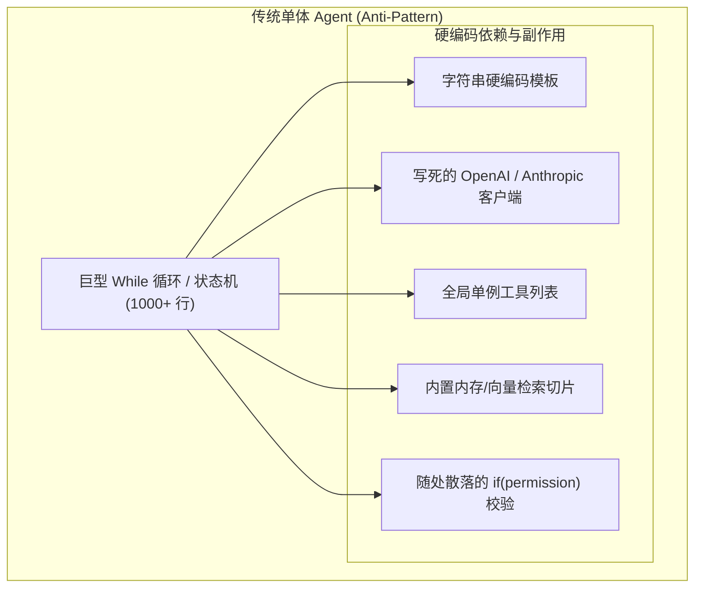
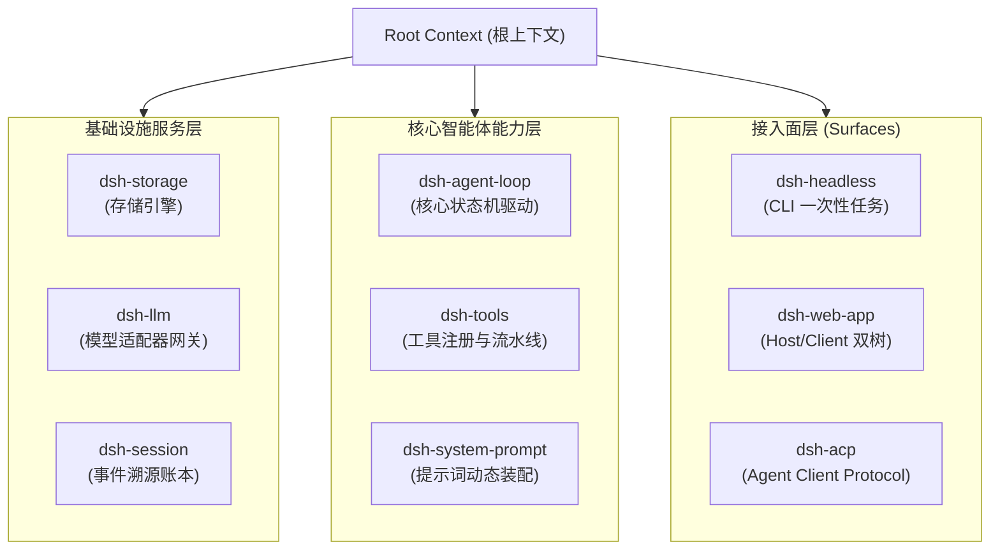
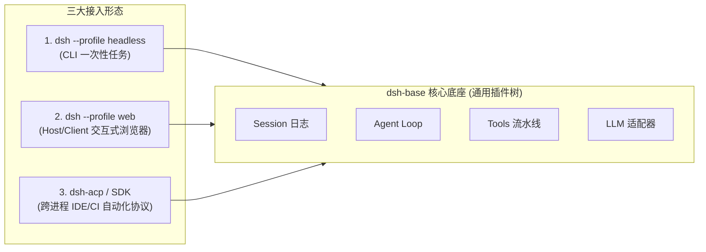
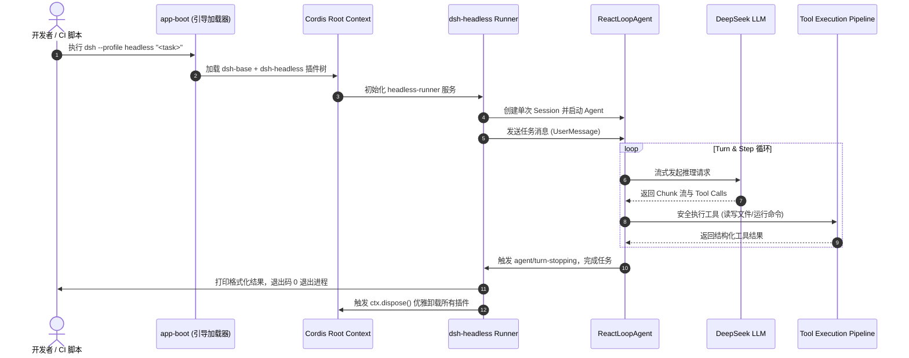
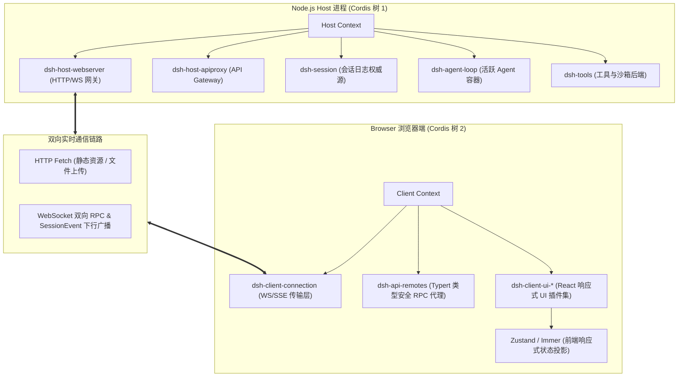
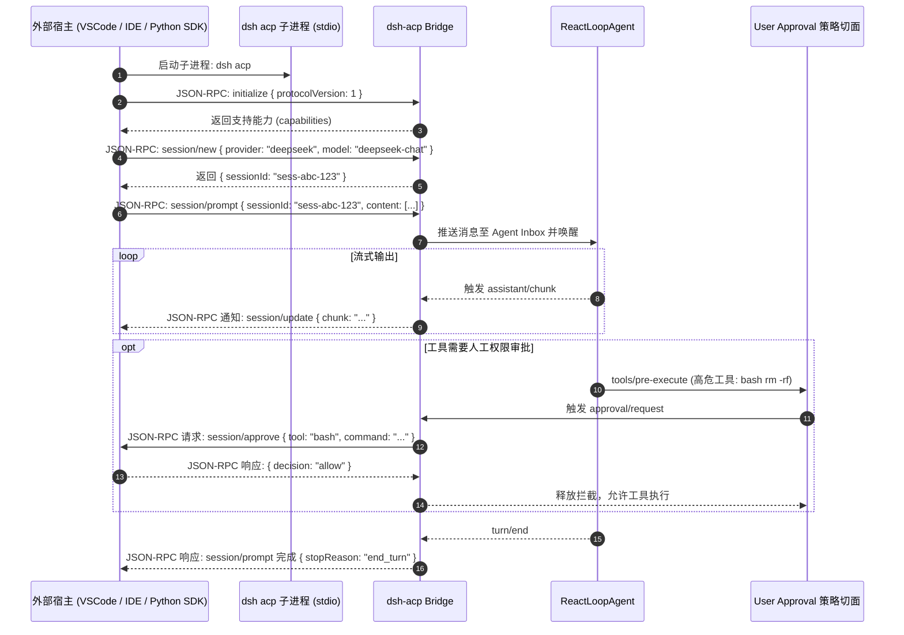
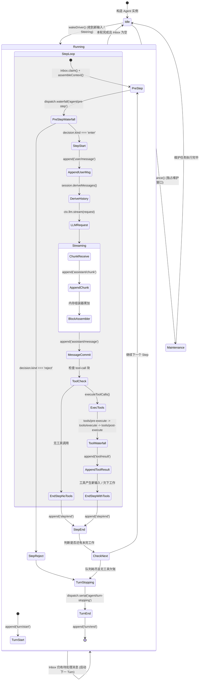
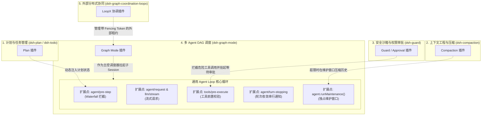
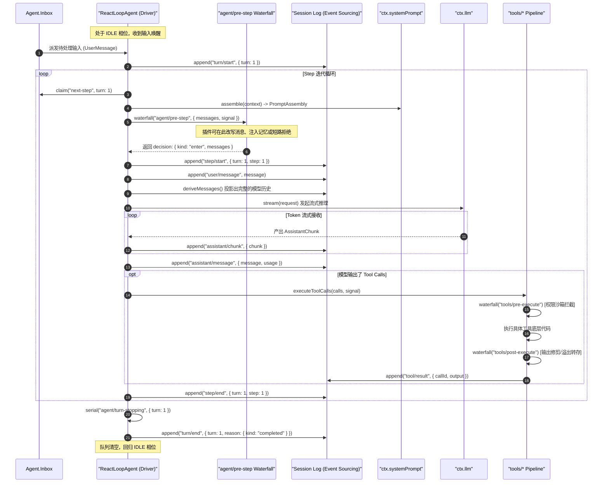

# Chapter 03: What This Project Is: Plugin Architecture and Runtime Topology

English | [中文](03-project-overview.zh.md)

Before examining the source code, establish a high-level understanding of DeepSeek Harness (hereafter **dsh**), its architecture, and its design principles.

Engineers familiar with conventional backend or systems programming—Java Spring, C++ microkernels, Linux VFS, or Kubernetes Operators—often find that the hardest part of a modern AI agent project is not probabilistic inference by the model but the structure of its host framework. In many open-source agent libraries, prompt assembly, network retries, tool execution, permission checks, UI rendering, and session persistence are entangled in one enormous loop or a deep class hierarchy. This big-ball-of-mud architecture is nearly impossible to maintain, test, or extend safely in industrial production.

From the outset, dsh adopts a **fully plugin-based architecture** built on a **microkernel and inversion of control (IoC / dependency injection)**. In dsh, "everything is a plugin" is not a slogan. It is an engineering design with precise mathematical semantics, type constraints, and lifecycle isolation.

---

## 3.1 Why Plugins? Architectural Evolution and a Mental Model for Agent Systems

### 3.1.1 The Monolithic Agent Problem: Anti-Patterns from AutoGPT to LangChain

Early generations of open-source agent frameworks, including early AutoGPT, BabyAGI, and LangChain releases, commonly used a conventional object-oriented monolithic design:



This monolithic design has four serious software-engineering defects:

1. **Tight coupling and state pollution**: All business logic reads and writes one shared global context or large state object. Adding a context compaction strategy or changing permission checks requires edits to the main loop's branches, making regressions likely.
2. **Irreversible side effects**: Tool registrations, event listeners, and scheduled tasks are often installed without a corresponding removal operation. Without automatic disposal, dynamically unloading a module or isolating sessions leaves memory leaks and dangling callbacks.
3. **Capability–transport coupling**: Many agent frameworks tie CLI interaction (`console.log` / `readline`) and web services (Express / FastAPI) to the core agent state machine. The same agent logic then cannot move cleanly into headless automation, desktop IDE plugins using ACP, or distributed workflows.
4. **Difficult testing and observability**: Without consistent dependency injection and event interception points, the agent loop cannot be replayed deterministically and asserted against in milliseconds without starting a real LLM API or file system.

### 3.1.2 Mapping to Systems Programming: Microkernels and IoC Containers

To address these problems, dsh draws on modern operating systems and enterprise IoC containers, mapping agent components to established systems-programming concepts:

| AI / agent concept | Systems-programming analogue | dsh implementation |
| :--- | :--- | :--- |
| **LLM adapter** | Device driver / RPC client | `ctx.llm`: abstract streaming API that hides differences among DeepSeek, OpenAI, and local endpoints |
| **Agent state machine** | CPU scheduler / thread time-slice dispatcher | `packages/core/agent-loop`: minimal loop responsible only for state transitions and turn progression |
| **Tool** | System call / external-device I/O | `ctx.tools`: RPC calls with argument schema validation and sandbox isolation |
| **Permission and security policy** | Operating-system LSM (Linux Security Modules) / eBPF probe | `tools/pre-execute` waterfall interception point supporting read-only, approval, and blocking policies |
| **Context and memory** | VFS cache / virtual-memory page replacement | `ctx.compaction`: lossy or lossless compaction under strict token-budget limits |
| **Session history** | Write-ahead log (WAL) / event-sourced ledger | `ctx.sessions`: append-only persistent event stream that makes everything the model sees fully replayable |
| **Agent framework / host** | Microkernel + IoC dependency-injection container (Spring / Cordis) | Cordis-based hierarchical Context tree with reversible side effects |

### 3.1.3 Cordis Plugin Trees: Microkernel, Dependency Injection, and Scope Topology

dsh is built on **Cordis**. In its model, **no "core kernel code" has absolute privilege**. LLM adapters (`dsh-llm`), the tool registry (`dsh-tools`), session persistence (`dsh-session`), and the agent loop itself (`dsh-agent-loop`) are peer plugins mounted on a Context tree.



#### 1. Declarative Services and Dependency Injection

A plugin can register a service with the global Context by extending `Service`. Other plugins declare dependencies through `inject`; the framework initializes and composes services in topological order:

```typescript
// 服务提供方：声明并挂载服务到 ctx.tools
export class ToolRegistryService extends Service {
  static readonly inject = ['sessions'] // 依赖会话服务

  constructor(ctx: Context) {
    super(ctx, 'tools', true) // 第二个参数为 ctx 上挂载的键名
  }
}

// 消费者插件：声明依赖并使用
export const inject = ['tools', 'llm']
export function apply(ctx: Context) {
  // 当 ctx.tools 和 ctx.llm 就绪后自动执行
  ctx.tools.register({
    name: 'custom_search',
    description: 'Execute a search query',
    schema: SearchParamsSchema,
    execute: async (args, signal) => {
      // 执行安全调用
    },
  })
}
```

#### 2. Disposable Effects and the Disposal Model

In traditional systems, unloading a module cleanly is difficult. Cordis provides `ctx.effect()` and scoped lifecycle tracking. When a plugin unloads or HMR reloads it, the event listeners, RPC routes, file handles, and timers registered in its scope are automatically cleaned up along a disposal stack in **last-in, first-out (LIFO)** order, leaving no dangling closures or dirty state in the host process.

#### 3. Three Event-Dispatch Modes with Explicit Control-Flow Semantics

Cordis defines three event-bus dispatch modes, each with explicit control-flow semantics:

- **Waterfall**: For example, `agent/pre-step` and `tools/pre-execute`. Listeners run in order. Each must explicitly call `next()` to pass control to the next listener. A listener may rewrite inputs in place, short-circuit with a return value, or throw to interrupt the chain.
- **Serial**: For example, `agent/turn-stopping`. Listeners run asynchronously in sequence; the next starts only after the previous promise settles, ordering dependent state changes without a race.
- **Parallel / broadcast**: For example, `session/event` and `agent/status`. All listeners are triggered together without blocking subsequent progress of the core state machine.

---

## 3.2 Three Entry Topologies and Runtime Data Flow

dsh is not confined to one runtime form. Different profiles (assembly presets) and composition bundles provide entry points tailored to different hosts.



### 3.2.1 Entry 1: `dsh --profile headless` (One-Shot CLI Batch Runner)

#### 1. Use Cases and System Limits

The `headless` form is designed for **noninteractive automation scripts, CI/CD quality pipelines, local batch code refactoring, and deterministic benchmarks**. It **starts no HTTP or WebSocket server, loads no browser assets, and mounts no web UI plugins**, enabling millisecond-scale cold starts and minimal memory use (typically under 60 MB resident memory for the whole process).

#### 2. Package Dependencies and Configuration Overlay Patches

The `headless` profile stacks two composition bundles:
1. **Base**: `@deepseek-ai/dsh-base` provides the basic LLM driver, file tools, session persistence, sandbox, and credential management.
2. **Top layer**: `@deepseek-ai/dsh-headless` provides command-line argument parsing and the one-shot task runner.

Its configuration declaration is in `packages/bundle/headless/cordis.patch.yml`:

```yaml
# 在 dsh-base 的基础上叠加 headless 专属配置
- id: hmr
  disabled: true # 批处理无需热重载

- insert:
    - id: code-runtime
      name: '@deepseek-ai/dsh-code-runtime-worker-thread'
    - id: headless-startup
      name: '@deepseek-ai/dsh-headless/startup'
    - id: headless-runner
      name: '@deepseek-ai/dsh-headless'
      inject: [headlessStartup]
      config:
        task: !!js ctx.headlessStartup.task
```

#### 3. End-to-End Execution Sequence and Data Flow

When a user runs `dsh --profile headless "Fix type errors in packages/core"` in a terminal:



### 3.2.2 Entry 2: `dsh --profile web` (Two Host/Client Cordis Trees and an Interactive App)

#### 1. Two-Tree Cordis Architecture

Unlike conventional web architectures that treat the frontend as a static page, the dsh web app uses **two Cordis trees, one for Host and one for Client**:



#### 2. Typert Type-Graph Reflection and the Cross-Process RPC Gateway

On the Host, `@deepseek-ai/dsh-host-apiproxy` uses **Typert** to extract the TypeScript signatures of registered backend services and produce lossless RPC descriptors. On the Client, `@deepseek-ai/dsh-api-remotes` constructs strongly typed proxies dynamically. A frontend call to `ctx.remotes.agents.send(sessionId, message)` sends a JSON-RPC frame over WebSocket while retaining end-to-end compile-time type checking and completion as if calling a local function.

#### 3. State Synchronization: Event-Sourced Frontend Projection

The browser **never owns authoritative business state**. An append-only event stream from the Host drives the UI:
1. Backend activity, such as a user message, model reasoning token, tool start, or tool completion, is appended to the session log as an immutable `SessionEvent`.
2. WebSocket pushes these events to the Client in real time.
3. A frontend UI plugin reducer consumes the events and uses pure Immer updates to incrementally update a local Zustand store, driving localized React rendering within milliseconds.

#### 4. Extensible Frontend UI Slots

Every frontend region is plugin-based as well. For example, a custom tool can have its own visual card by registering a `ConversationNodeDefinition` on the Client:

```typescript
// 注册自定义的工具渲染节点
ctx.uiConversation.registerNode({
  kind: 'tool-presentation:sql-query',
  match: (event) => event.type === 'tool/result' && event.data.tool === 'sql_query',
  Component: SqlQueryTableRenderer, // React 组件
})
```

### 3.2.3 Entry 3: ACP (Agent Client Protocol) Automation and SDK Interprocess Calls

#### 1. Protocol Background and Role

As agents become part of development workflows, they must serve not only people but also third-party hosts, such as **VSCode plugins, JetBrains IDEs, automated code-review machines, and cross-language SDKs (Python/Go)**, that control them directly as headless subprocesses.

To support this, dsh implements the standardized **Agent Client Protocol (ACP)**. It is a cross-language JSON-RPC 2.0 protocol over `stdio`, playing a role for agents similar to that of LSP for code editors:



#### 2. SDK Architecture and Interprocess Communication

At the SDK layer (`packages/sdk/*`), dsh provides layered interprocess-communication abstractions:
- `@deepseek-ai/dsh-sdk-protocol`: A type-only package specifying JSON-RPC messages, request/response schemas, and error-code enumerations.
- `@deepseek-ai/dsh-sdk-server`: The protocol server inside the dsh process; it maps standard protocol operations to calls into the Cordis tree.
- `@deepseek-ai/dsh-sdk-client`: A client for third-party Node.js/TypeScript applications, providing a Promise-based API, heartbeat detection, and automatic reconnection.

#### 3. Cross-Process Backpressure and Cancellation Propagation

When an external client sends a `$/cancel` notification, the ACP bridge immediately calls `agent.cancel({ kind: 'user' })` on the corresponding agent. Its `AbortController` promptly interrupts ongoing HTTP SSE streams and underlying subprocess calls, avoiding wasted computation and dirty file writes.

### 3.2.4 Comparing the Three Entry Points

| Dimension | `dsh --profile headless` | `dsh --profile web` | `dsh acp` / SDK mode |
| :--- | :--- | :--- | :--- |
| **Primary interaction** | Command-line arguments / `stdin` / terminal output | Modern browser GUI | JSON-RPC 2.0 over `stdio` / pipes |
| **Target user/host** | Developer CLI, shell scripts, CI/CD pipelines | Engineers coding interactively | VSCode / JetBrains plugins, automated systems |
| **Network and ports** | **0 ports**, no network listener | Listens on `127.0.0.1:3080` by default (HTTP/WS) | **0 ports**, standard-I/O-only IPC |
| **Cordis topology** | One Host Cordis tree (minimal mode) | **Two Cordis trees** (Host + Client) | One Host Cordis tree + protocol serialization bridge |
| **Lifecycle** | One-shot task; `process.exit(0)` on completion | Resident background process with concurrent session management | Starts and exits with the external parent process |
| **Cold-start time** | $\approx 80\text{ms} \sim 150\text{ms}$ | $\approx 300\text{ms} \sim 600\text{ms}$ | $\approx 100\text{ms} \sim 200\text{ms}$ |
| **Baseline memory** | $\approx 50\text{MB} \sim 70\text{MB}$ | $\approx 120\text{MB} \sim 200\text{MB}$ | $\approx 60\text{MB} \sim 90\text{MB}$ |

---

## 3.3 Core Design Principle: Why the Agent Loop Must Stay General and Small

In many unsuccessful agent projects, developers try to solve everything inside the main `Agent.run()` loop: planning, history pruning, permission prompts, concurrent scheduling, and subagent coordination. The result is a "god function" thousands of lines long with deeply complicated branches.

**The central dsh design rule is that the agent loop stays small and general: it is only a deterministic, state-driven turn/step driver.**



### 3.3.1 Formal Definition of the State-Driven Turn/Step Driver

Formally, the progression of an agent session can be modeled as a discrete-time finite-state machine driven by a state-transition function:

$$\mathcal{M} = \langle \mathcal{S}, \Sigma, \delta, s_0, \mathcal{F} \rangle$$

Where:

- **State set $\mathcal{S}$**: $\mathcal{S} = \{ \text{IDLE}, \text{RUNNING}(\text{turn}, \text{step}), \text{MAINTENANCE} \}$.
- **Input alphabet $\Sigma$**: An Inbox message tuple $\langle m_{\text{user}}, \text{target} \rangle$, where $\text{target} \in \{ \text{next-turn}, \text{next-step} \}$.
- **State-transition function $\delta$**: Driven strictly by the persisted event sequence, with type $\delta: \mathcal{S} \times \Sigma \times \mathcal{E}_{\text{session}} \to \mathcal{S}$.
- **Termination condition**: The state machine converges deterministically to $\text{IDLE}$ if and only if $\text{Inbox}.\text{hasPending} = \text{False}$ and the current step produces no further tool-call requirement.

### 3.3.2 Responsibilities of the Minimal Loop in Source Code

In `packages/core/agent-loop/src/agent.ts`, `ReactLoopAgent` keeps its core logic deliberately limited. It **knows nothing** about specific business-domain concepts:

1. **It does not know what a plan is**: It contains no code to parse Markdown task lists or extract todos.
2. **It does not know what context compaction is**: It contains no token counter or text-summarization prompt.
3. **It does not know what an approval dialog is**: It contains no wait for a dialog or terminal confirmation.
4. **It does not know what a DAG task graph (Graph Mode) is**: It contains no topological sort or DAG node scheduling.
5. **It does not know about LoopX distributed coordination**: It contains no external HTTP heartbeat or lease reporting.

These advanced capabilities are attached around the loop through **Cordis event interception points and Service Providers in capability seams**, without modifying the loop.

### 3.3.3 How Five Core Capabilities Extend the Agent Loop Without Modifying It



#### 1. Plan and Todo Management Through an Event Hook

- **Tool registration**: The `dsh-plan` plugin registers the `plan_create` and `plan_update` tools with `ctx.tools`.
- **State maintenance**: It listens to `session/event` and, when a `tool/result` reflects a plan update, maintains the current session's latest plan tree in memory.
- **Prompt injection**: It listens to the `agent/pre-step` waterfall event and appends structured plan progress to the context slice before the model's next step, making the task goal visible to the model.

#### 2. Context Compaction Through an Event Hook

- **Token-budget measurement**: `dsh-compaction` listens to `agent/pre-step` and estimates the current history length with a BPE token estimator.
- **Maintenance-window trigger**: If history exceeds a hard model-context limit, such as the $80\%$ threshold, the plugin calls `agent.runMaintenance(async (signal) => {...})` at the configured interception point.
- **Exclusive compaction**: During maintenance, the agent state machine remains in the `maintenance` phase and holds new input in the Inbox. The compaction service calls an LLM to summarize earlier turns and appends an immutable `session/compacted` event to the log.
- **Transparent projection**: In later steps, `session.deriveMessages()` uses the compaction marker to render a shorter, pruned history. The main loop does not need to know this happened.

#### 3. Guard and Sandbox Through an Event Hook

- **Pipeline interception**: The `dsh-guard` plugin listens to the `tools/pre-execute` waterfall event.
- **Policy decision**: When the model issues a `bash` command, the policy engine checks whether it touches protected directories, such as `.git` or system configuration.
- **Approval wait**: If human approval is required, the interceptor requests it through the UI and holds the current promise pending. If the user rejects the request, it throws `PermissionDeniedError` or returns a rejection; **the tool's execution function is never called**.

#### 4. Multi-Agent Task Graphs (Graph Mode) Through an Event Hook

- **Session-level orchestration**: As a higher-level capability package, `dsh-graph-mode` lets a controller agent submit an immutable DAG revision through `graph_submit` when its session receives a large, complex engineering task.
- **Reuse of the base loop**: When a node becomes ready, the scheduler starts an independent subagent session for it through `dsh-graph-worker`. Each subagent runs a standard, isolated single-agent loop with its own file sandbox and lifecycle, then returns an artifact manifest to the parent graph.

#### 5. External Distributed Coordination (LoopX) Through an Event Hook

- **Leases and fencing tokens**: When several machines or teams collaborate on one graph task, the `dsh-graph-coordination-loopx` provider participates.
- **Distributed exclusion**: It requests a lease with a strictly increasing epoch or fencing token from the LoopX central service. If an old worker resumes after a network partition, the storage layer rejects any result it attempts to write with its expired token through atomic compare-and-swap (CAS), providing strict linear consistency for distributed execution.

---

## 3.4 Architecture Layers, Message Flow, and Data Layout

### 3.4.1 Five-Layer Architecture Diagram

```
+-----------------------------------------------------------------------------------+
|                        1. 接入与协议层 (Surfaces Layer)                           |
|   dsh-headless (CLI)  |  dsh-web-app (Host/Client)  |  dsh-acp / SDK (JSON-RPC)   |
+-----------------------------------------------------------------------------------+
                                         │ 依赖注入 / RPC
                                         ▼
+-----------------------------------------------------------------------------------+
|                     2. 控制反转与组合层 (Coordination Layer)                       |
|   Cordis Context Root  |  Profile / Bundle Loader  |  YAML Overlay Patch 引擎     |
+-----------------------------------------------------------------------------------+
                                         │ 作用域派生
                                         ▼
+-----------------------------------------------------------------------------------+
|                   3. 核心驱动与领域层 (Core Engine & Seams)                       |
|   Agent Loop (状态机)  |  System Prompt 装配器  |  Tools Pipeline (执行流水线)    |
|   Session Log (事件溯源) |  LLM Gateway (流式适配) |  Scope (按 Agent 隔离上下文)   |
+-----------------------------------------------------------------------------------+
                                         │ 切面拦截 / 能力接入
                                         ▼
+-----------------------------------------------------------------------------------+
|                     4. 扩展与高级能力层 (Capabilities Layer)                      |
|   Compaction (压缩)  |  Guard (沙箱权限)  |  Graph Mode (DAG)  |  LoopX (分布式)  |
+-----------------------------------------------------------------------------------+
                                         │ 系统调用
                                         ▼
+-----------------------------------------------------------------------------------+
|                     5. 基础设施与操作系统层 (Infrastructure)                      |
|   Node.js 运行时 (ESM) | 本地文件系统 / SQLite | 外部 LLM API (DeepSeek/OpenAI)  |
+-----------------------------------------------------------------------------------+
```

### 3.4.2 Core Event Flow and Lifecycle Sequence

The following Mermaid diagram shows how events move between layers during a complete turn lifecycle:



### 3.4.3 Core Data Structures and Message Examples

#### 1. Persisted `assistant/message` Event Structure

All model output is persisted in a standard structure in the append-only log:

```json
{
  "seq": 42,
  "type": "assistant/message",
  "timestamp": 1740472052000,
  "data": {
    "turn": 1,
    "step": 1,
    "message": {
      "role": "assistant",
      "content": [
        {
          "type": "text",
          "text": "正在为您读取项目目录结构以分析架构..."
        },
        {
          "type": "tool-call",
          "id": "call_fs_list_01",
          "name": "fs_list_dir",
          "arguments": {
            "path": "packages/core"
          }
        }
      ],
      "source": {
        "provider": "deepseek",
        "model": "deepseek-coder"
      }
    },
    "usage": {
      "promptTokens": 1280,
      "completionTokens": 96,
      "totalTokens": 1376
    }
  }
}
```

#### 2. ACP JSON-RPC Frame Examples

These are standard messages exchanged by an external client and `dsh acp`:

```json
// 客户端发起 Prompt 请求
{
  "jsonrpc": "2.0",
  "id": "req-001",
  "method": "session/prompt",
  "params": {
    "sessionId": "sess-9b1deb4d-3b7d-4bad-9bdd-2b0d7b3dcb6d",
    "content": [
      {
        "type": "text",
        "text": "请运行测试套件并报告失败项"
      }
    ]
  }
}

// 服务端流式下行通知
{
  "jsonrpc": "2.0",
  "method": "session/update",
  "params": {
    "sessionId": "sess-9b1deb4d-3b7d-4bad-9bdd-2b0d7b3dcb6d",
    "update": {
      "kind": "assistant_chunk",
      "text": "已开始运行测试..."
    }
  }
}
```

---

## 3.5 Production-Oriented Exercise: Write and Mount a Security Audit and Context-Enrichment Plugin

To examine Cordis plugins and event interception in engineering terms, this section implements a complete TypeScript plugin, `AuditAndContextEnhancerPlugin`, with **production-grade robustness**.

### 3.5.1 Requirements

The plugin needs two core capabilities:
1. **Security audit interception**: Intercept tool calls that try to read sensitive configuration files, such as `.env` or `id_rsa`; block them and record an audit warning.
2. **Dynamic context injection**: Before each step, inject current system memory load and Git branch information into the model's context; remove all related state when the plugin unloads.

### 3.5.2 Complete TypeScript Implementation

```typescript
/**
 * @file audit-and-context-enhancer.ts
 * 生产级 Cordis 插件示例：展示服务注入、Waterfall 事件拦截与可撤销副作用
 */

import { Context, Service } from '@deepseek-ai/cordis'
import type { PreStepDecision } from '@deepseek-ai/dsh-agent'
import type { ToolPreExecuteEvent } from '@deepseek-ai/dsh-tools'
import { createUserMessage } from '@deepseek-ai/dsh-llm'
import { execSync } from 'node:child_process'
import * as os from 'node:os'

// 1. 声明插件的名称与依赖项
export const name = 'audit-and-context-enhancer'
export const inject = ['tools', 'systemPrompt']

export interface PluginConfig {
  blockedPatterns: string[]
  injectSystemTelemetry: boolean
}

export const defaultConfig: PluginConfig = {
  blockedPatterns: ['.env', 'id_rsa', 'credentials.json', '.aws/config'],
  injectSystemTelemetry: true,
}

/**
 * 2. 插件主入口函数
 * @param ctx 挂载该插件的 Cordis 上下文作用域
 * @param config 用户传入的配置项
 */
export function apply(ctx: Context, config: PluginConfig = defaultConfig) {
  ctx.logger('audit').info('正在初始化安全审计与上下文增强插件...')

  // ─────────────────────────────────────────────────────────────
  // 特性一：利用 tools/pre-execute 瀑布流拦截敏感文件访问
  // ─────────────────────────────────────────────────────────────
  const unbindToolInterceptor = ctx.on('tools/pre-execute', async (event: ToolPreExecuteEvent, next) => {
    const { toolName, args, signal } = event

    // 检查取消信号
    signal.throwIfAborted()

    // 针对文件读取类工具进行路径安全扫描
    if (toolName === 'fs_read_file' || toolName === 'fs_write_file') {
      const targetPath = String(args['path'] ?? '')
      const isSensitive = config.blockedPatterns.some((pattern) => targetPath.includes(pattern))

      if (isSensitive) {
        ctx.logger('audit').warn(`[安全拦截] 阻断了对敏感路径的访问尝试: ${targetPath}`)

        // 短路返回：不再调用 next()，直接返回拒绝结果，保护敏感资产
        return {
          status: 'rejected',
          error: {
            code: 'SECURITY_AUDIT_BLOCKED',
            message: `安全策略禁止访问敏感路径: ${targetPath}`,
          },
        }
      }
    }

    // 安全检查通过，将控制权移交给流水线中的下一个拦截器或最终执行器
    return await next()
  })

  // ─────────────────────────────────────────────────────────────
  // 特性二：利用 agent/pre-step 瀑布流在 Step 边界注入动态系统上下文
  // ─────────────────────────────────────────────────────────────
  const unbindPreStepInterceptor = ctx.on('agent/pre-step', async (event, next) => {
    const { messages, turn, step, signal } = event
    signal.throwIfAborted()

    if (!config.injectSystemTelemetry) {
      return await next()
    }

    // 采集系统运行指标（内存占用与当前 Git 分支）
    let gitBranch = 'unknown'
    try {
      gitBranch = execSync('git rev-parse --abbrev-ref HEAD', {
        encoding: 'utf-8',
        timeout: 1000,
        stdio: ['ignore', 'pipe', 'ignore'],
      }).trim()
    } catch {
      // 忽略非 Git 仓库环境的异常
    }

    const freeMemMb = Math.round(os.freemem() / (1024 * 1024))
    const totalMemMb = Math.round(os.totalmem() / (1024 * 1024))
    const telemetryNotice = `[系统运行时切面 | Turn ${turn}, Step ${step}] Git 分支: ${gitBranch} | 可用内存: ${freeMemMb}MB / ${totalMemMb}MB`

    const injectedMessage = createUserMessage({
      content: [{ type: 'text', text: telemetryNotice }],
      metadata: { synthesized: true, visibility: 'model-only' },
    })

    // 调用责任链下游，并将我们构造的动态上下文追加至消息队列中
    const baseDecision: PreStepDecision = await next()

    if (baseDecision.kind === 'reject') {
      return baseDecision
    }

    return {
      kind: 'enter',
      messages: [...baseDecision.messages, injectedMessage],
    }
  })

  // ─────────────────────────────────────────────────────────────
  // 特性三：注册可撤销副作用，当插件被卸载时自动清理所有资源
  // ─────────────────────────────────────────────────────────────
  ctx.effect(() => {
    return () => {
      ctx.logger('audit').info('正在卸载插件并清理事件拦截器...')
      unbindToolInterceptor()
      unbindPreStepInterceptor()
    }
  })
}
```

### 3.5.3 Plugin Configuration and YAML Patch Example

To mount this custom plugin in dsh, no core source changes are needed. Add an entry to the profile's `cordis.patch.yml`:

```yaml
# 在用户的 cordis.patch.yml 中挂载自定义安全插件
- insert:
    - id: custom-security-audit
      name: './plugins/audit-and-context-enhancer.ts'
      config:
        blockedPatterns:
          - '.env'
          - 'id_rsa'
          - 'id_ed25519'
          - 'config/master.key'
        injectSystemTelemetry: true
```

Run this at startup:

```bash
dsh --profile web --patch ./cordis.patch.yml
```

The application launcher automatically compiles the plugin, injects its dependencies, and connects its event hooks.

---

## 3.6 Production Pitfalls and Troubleshooting

When building highly concurrent, long-running agent systems with dsh, four production failures caused by poor architecture are particularly common.

### 3.6.1 Failure 1: Omitting `next()` in a Waterfall Event Leaves a Request Hung

#### 1. Symptom

After adding an interceptor for `agent/pre-step` or `tools/pre-execute`, starting an agent task produces no terminal error, the UI remains at `running`, the model request never starts, and the process stops responding after a timeout.

#### 2. Root Cause

Waterfall events use a layered model similar to Koa or Express middleware. If an interceptor branch neither returns an explicit decision nor calls `await next()`, the promise chain remains unresolved and the downstream state machine stays blocked.

#### 3. Diagnosis and Fix

Give every conditional branch of a waterfall listener an explicit outcome:

```typescript
// ❌ 错误示范：分支中遗漏 next() 导致悬挂
ctx.on('tools/pre-execute', async (event, next) => {
  if (event.toolName === 'special_tool') {
    doSomethingSync()
    // 遗漏了 return await next()，导致流水线死锁！
  } else {
    return await next()
  }
})

// ✅ 正确示范：确保全分支决议，并携带 AbortSignal 防御
ctx.on('tools/pre-execute', async (event, next) => {
  event.signal.throwIfAborted()
  if (event.toolName === 'special_tool') {
    await doSomethingAsync(event.signal)
  }
  return await next()
})
```

### 3.6.2 Failure 2: ACP Channel Backpressure Causes an Out-of-Memory Crash

#### 1. Symptom

When the Python SDK calls `dsh acp` in bulk to generate large amounts of code, the Node.js subprocess grows from 80 MB to several gigabytes and eventually crashes with `JavaScript heap out of memory`.

#### 2. Root Cause

A `stdio` pipe has a finite buffer (typically 64 KB by default on Linux). If the external consumer reads too slowly while the agent loop produces tokens quickly, unhandled backpressure on `process.stdout.write` accumulates unsent JSON-RPC messages in Node.js memory.

#### 3. Diagnosis and Fix

The ACP bridge must use a flow-controlled stream wrapper, such as `ndJsonStream`, and explicitly await the `drain` event when a write returns `false`:

```typescript
async function writeFrameWithBackpressure(stream: Writable, frame: string): Promise<void> {
  const canContinue = stream.write(frame + '\n')
  if (!canContinue) {
    // 触发背压保护，等待消费端消费完毕后再继续推流
    await new Promise<void>((resolve) => stream.once('drain', () => resolve()))
  }
}
```

### 3.6.3 Failure 3: Unreleased Plugin Effects Leak Memory and State Across Hot Reloads

#### 1. Symptom

While developing a web plugin with `dsh --profile web`, saving code several times for hot reload causes a tool to run repeatedly; one write-file call, for example, produces four write logs on disk.

#### 2. Root Cause

When a plugin registers a tool or native event handler such as `process.on('SIGINT')` or `setInterval` without declaring a disposer through `ctx.effect()`, the old module's closures remain in memory after Cordis loads the new version. Multiple plugin versions then consume the same event.

#### 3. Diagnosis and Fix

Do not attach global listeners at module scope outside a Context. Bind their lifecycle with `ctx.effect()`:

```typescript
// ✅ 正确示范：利用 ctx.effect 保证热重载时完全清理
export function apply(ctx: Context) {
  const timer = setInterval(() => {
    ctx.logger('heartbeat').debug('Agent tick')
  }, 1000)

  ctx.effect(() => {
    return () => {
      // 模块卸载时必被调用
      clearInterval(timer)
    }
  })
}
```

### 3.6.4 Failure 4: An Async Operation Without an `AbortSignal` Writes After Cancellation

#### 1. Symptom

A user clicks "Stop generating" in the web UI, then immediately asks the agent to modify the same file. Seconds later, a shell command from the cancelled task completes and overwrites the new task's changes.

#### 2. Root Cause

The old task's tool started an asynchronous subprocess with an API such as `child_process.spawn`, but cancellation via `cancel()` did not send that subprocess `SIGKILL`. It kept running as an orphaned process and later caused a file-system write conflict at an unpredictable time.

#### 3. Diagnosis and Fix

Every tool implementation must propagate `signal` down to its operating-system process handle:

```typescript
export async function executeShellCommand(cmd: string, signal: AbortSignal): Promise<string> {
  signal.throwIfAborted()

  return new Promise((resolve, reject) => {
    const proc = spawn('bash', ['-c', cmd], { stdio: 'pipe' })

    const onAbort = () => {
      // 收到取消信号时，立刻向子进程树发送 SIGKILL 终止执行
      proc.kill('SIGKILL')
      reject(signal.reason)
    }

    signal.addEventListener('abort', onAbort, { once: true })

    proc.on('exit', (code) => {
      signal.removeEventListener('abort', onAbort)
      if (code === 0) resolve('Success')
      else reject(new Error(`Exit with code ${code}`))
    })
  })
}
```

---

## 3.7 Summary and Questions

### Key Takeaways

1. **Architecture**: dsh replaces the monolithic agent anti-pattern with a Cordis-based microkernel, dependency injection, and reversible effects: everything is a plugin.
2. **Three runtime topologies**:
   - `headless`: A headless, low-memory, zero-listener, fast batch runner.
   - `web`: Two Host/Client Cordis trees, Typert type-safe RPC, and event-sourced reactive updates.
   - `acp` / SDK: A headless, standard JSON-RPC interprocess protocol for IDE plugins and automation pipelines.
3. **Minimal loop and event hooks**: The agent loop remains a state-driven turn/step driver. Defined event hooks such as `agent/*` and `tools/*` add planning, compaction, permissions, task graphs, and distributed coordination without altering it.

### Questions for Further Study

1. **Architecture**: If you add a plugin for real-time multimodal voice input and output to dsh, should it be a Host or Client service? Which core events should it listen to, and how can it avoid blocking the text-token stream?
2. **Systems analysis**: If 100 concurrent agent sessions trigger context compaction at once, how might they affect system CPU and LLM API rate limits? How could Cordis provide a global `CompactionLimiterService` for resource admission control?
3. **Concurrency safety**: In LoopX distributed coordination, why is a timestamp alone insufficient to make task settlement safe, and why is a monotonically increasing `Fencing Token` required?
