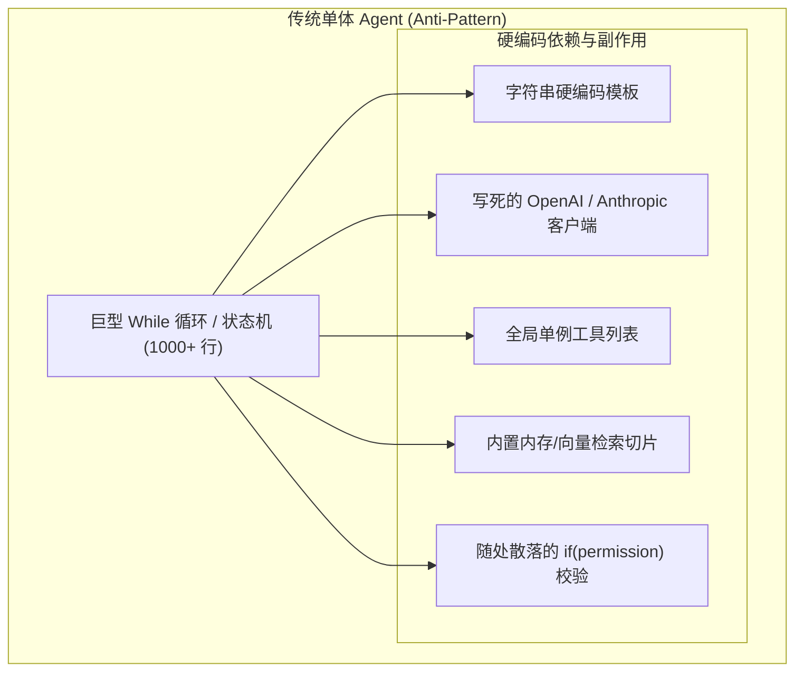
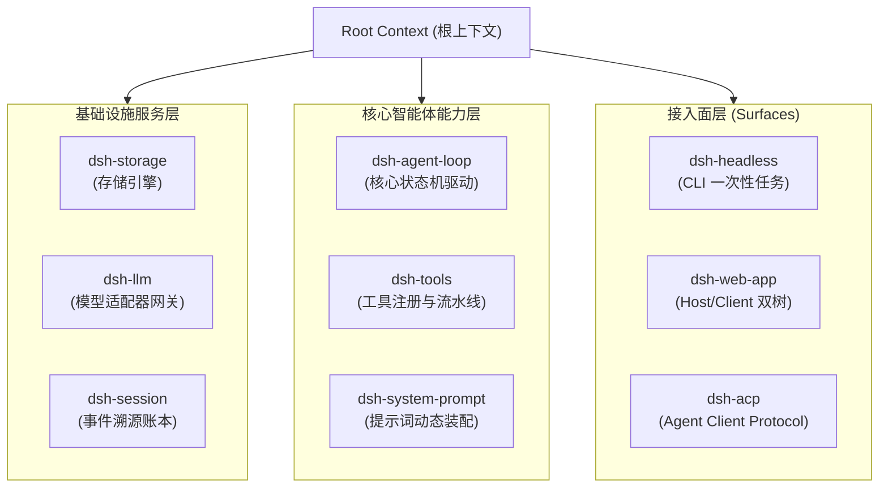
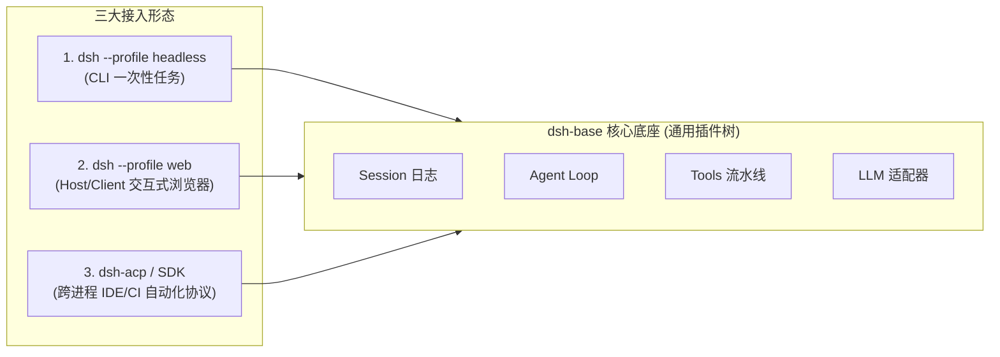
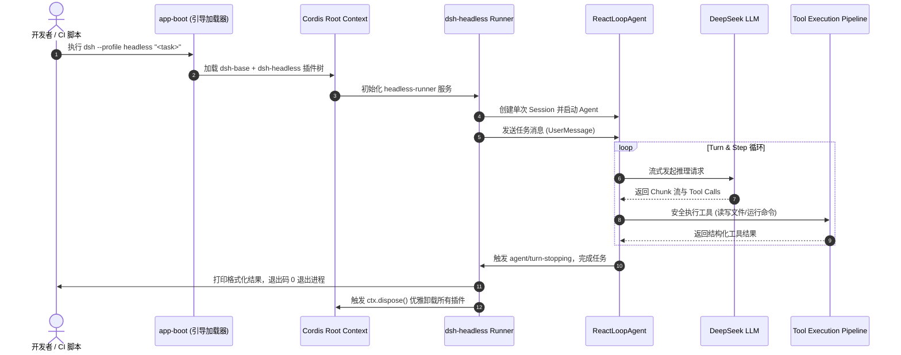
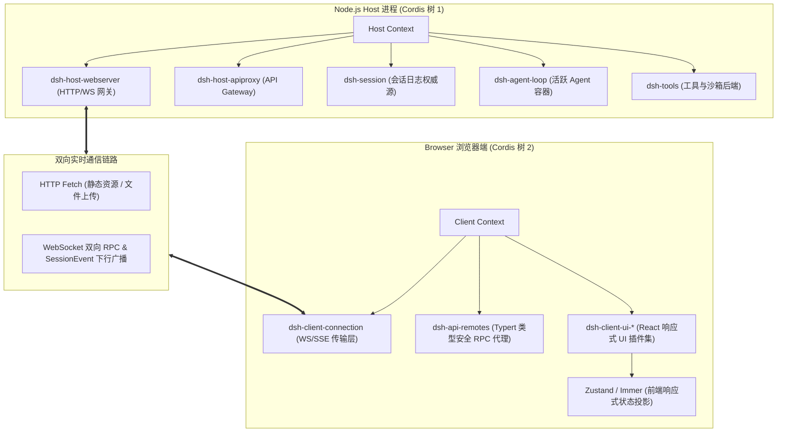
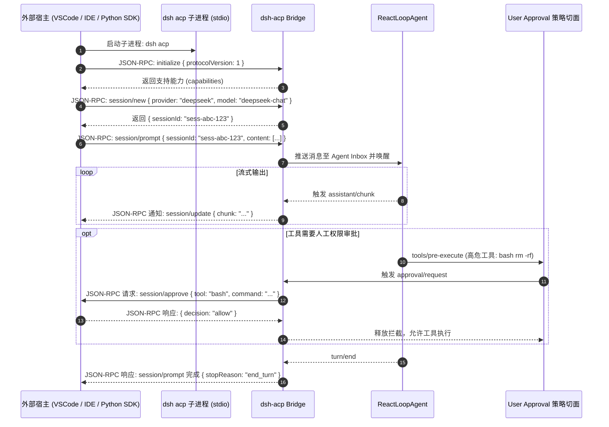
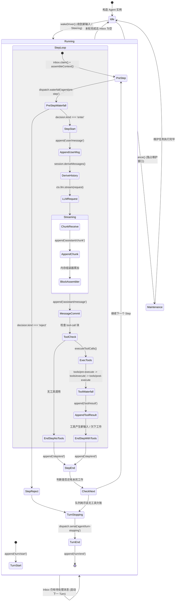
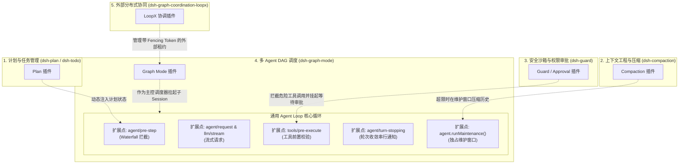
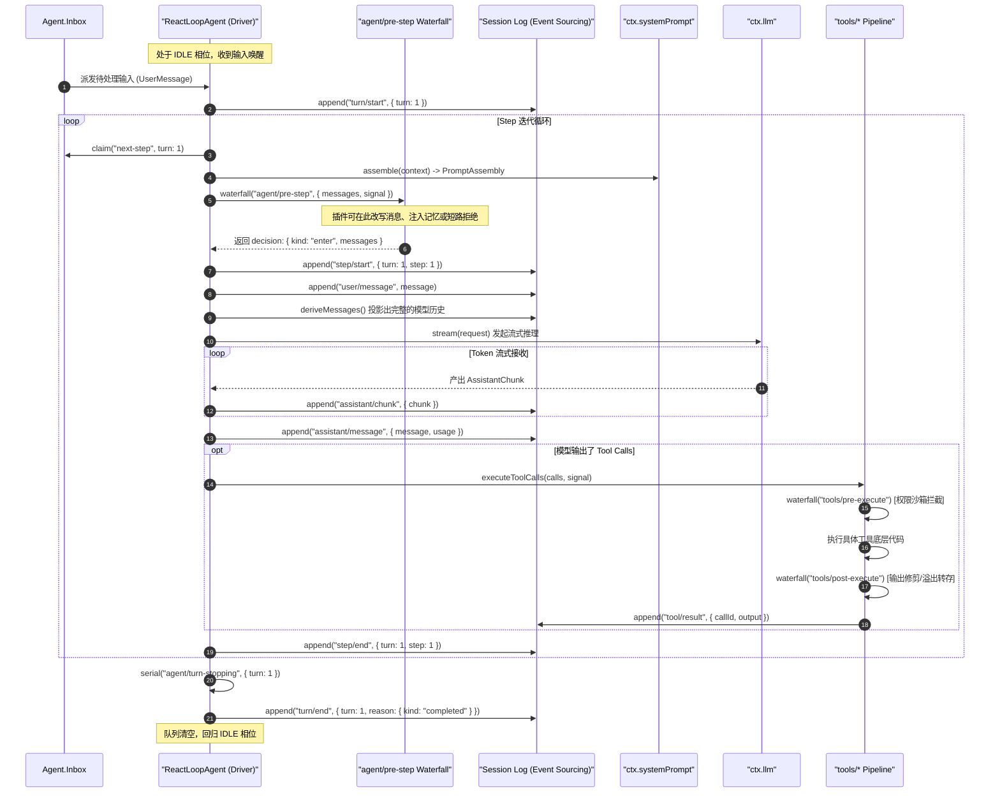

# 第 03 章：项目是什么：插件化架构哲学与运行拓扑

[English](03-project-overview.md) | 中文

在深入阅读具体的系统源码之前，必须首先建立对 DeepSeek Harness（以下简称 **dsh**）的宏观架构认知与核心设计哲学。

对于具备传统后端或系统编程经验（如 Java Spring、C++ 微内核、Linux VFS、Kubernetes Operator）的工程师而言，面对现代 AI Agent 项目时最常见的困惑往往不是大模型本身的概率推断，而是宿主框架代码的混乱——在很多开源 Agent 库中，提示词拼接、网络重试、工具执行、权限校验、UI 渲染和会话持久化紧密交织在一个巨大的循环或深层类继承体系中。这种“大泥球（Big Ball of Mud）”架构在工业级生产环境中几乎无法维护、无法测试，也无法安全扩展。

dsh 从第一行代码开始，便确立了以 **微内核（Microkernel）与控制反转（IoC / Dependency Injection）** 为底座的**全插件化架构**。在 dsh 体系中，“一切皆插件”并非一句抽象的宣传口号，而是一套具有严格数学语义、类型约束与生命周期隔离的工程实现。

---

## 3.1 为什么是插件化？Agent 系统的架构演进与心智模型

### 3.1.1 传统单体 Agent 的困局：从 AutoGPT 到 LangChain 的反模式

回顾第一代与第二代开源 Agent 框架（如早期的 AutoGPT、BabyAGI，以及 LangChain 的早期版本），它们普遍采用了传统的面向对象单体设计：



这种单体设计在软件工程维度存在四大致命缺陷：

1. **紧耦合与状态污染（State Pollution）**：所有业务逻辑直接读写一个共享的全局上下文或巨型状态对象。当需要新增一种上下文压缩策略或修改权限检查逻辑时，开发者必须直接修改主循环的代码分支，极易引发回归缺陷。
2. **副作用不可逆（Irreversible Side-Effects）**：在单体系统中，工具注册、事件监听、定时任务的挂载往往是单向的。当某个功能模块需要动态卸载或在不同会话间隔离时，缺乏自动析构机制，导致内存泄漏与悬挂回调。
3. **能力与传输协议绑定（Transport Coupling）**：很多 Agent 框架将 CLI 交互（`console.log` / `readline`）、Web 服务（Express / FastAPI）与核心 Agent 状态机深度耦合，导致同一个 Agent 逻辑无法无缝迁移到无头自动化（Headless）、桌面 IDE 插件（ACP 协议）或分布式工作流中。
4. **测试与可观测性灾难**：由于缺乏统一的依赖注入与事件切面，无法在不启动真实 LLM API 或真实文件系统的情况下对 Agent Loop 进行确定性、毫秒级的确定性回放与断言测试。

### 3.1.2 传统系统编程视角的映射：微内核与 IoC 容器

为了彻底解决上述困局，dsh 借鉴了现代操作系统与企业级 IoC 容器的设计精髓，将 AI Agent 的各个构件映射为严谨的系统编程概念：

| AI / Agent 领域概念 | 传统系统编程概念 | dsh 架构落地实现 |
| :--- | :--- | :--- |
| **LLM 适配器** | 驱动程序（Device Driver）/ RPC 客户端 | `ctx.llm`：抽象流式契约，屏蔽 DeepSeek/OpenAI/本地端点差异 |
| **Agent 状态机** | CPU 调度器 / 线程时间片轮转泵 | `packages/core/agent-loop`：仅负责状态转移与轮次推进的极简 Loop |
| **Tool（工具）** | 系统调用（Syscall）/ 外部外设 I/O | `ctx.tools`：带有参数 Schema 校验与沙箱隔离的 RPC 调用集合 |
| **权限与安全策略** | 操作系统的 LSM（Linux Security Modules）/ eBPF 探针 | `tools/pre-execute` 瀑布流拦截切面，支持只读/审批/拦截策略 |
| **上下文与记忆** | VFS 缓存 / 虚拟内存页置换算法 | `ctx.compaction`：根据 Token 预算硬约束执行有损/无损压缩 |
| **会话历史** | 预写式日志（WAL）/ 事件溯源账本（Event Sourcing） | `ctx.sessions`：仅追加持久化事件流，严格保证模型所见可完全回放 |
| **Agent 框架 / 宿主** | 微内核 + IoC 依赖注入容器（Spring / Cordis） | 基于 Cordis 的层次化 Context 树与可撤销副作用系统 |

### 3.1.3 Cordis 插件树的本质：微内核 + 依赖注入 + 作用域拓扑

dsh 底层基于 **Cordis** 框架构建。在 Cordis 的世界观中，**不存在拥有绝对特权的“核心内核代码”**。从大模型适配器（`dsh-llm`）、工具注册表（`dsh-tools`）、会话持久化（`dsh-session`），到 Agent 循环本身（`dsh-agent-loop`），全部都是挂载在 Context 上下文树上的对等插件。



#### 1. 声明式服务（Service）与依赖注入（Injection）

一个插件可以通过继承 `Service` 类向全局 Context 注册自身服务。其他插件在声明 `inject` 依赖后，框架将保证按拓扑序完成服务的初始化与装配：

```typescript
// 服务提供方：声明并挂载服务到 ctx.tools
export class ToolRegistryService extends Service {
  static readonly inject = ['sessions'] // 依赖会话服务

  constructor(ctx: Context) {
    super(ctx, 'tools', true) // 第二个参数为 ctx 上挂载的键名
  }
}

// 消费者插件：声明依赖并使用
export const inject = ['tools', 'llm']
export function apply(ctx: Context) {
  // 当 ctx.tools 和 ctx.llm 就绪后自动执行
  ctx.tools.register({
    name: 'custom_search',
    description: 'Execute a search query',
    schema: SearchParamsSchema,
    execute: async (args, signal) => {
      // 执行安全调用
    },
  })
}
```

#### 2. 可撤销副作用（Disposable Effects）与析构模型

在传统系统中，动态卸载一个模块极难处理干净。Cordis 引入了 `ctx.effect()` 与作用域生命周期追踪：当一个插件被卸载（或热重载 HMR）时，该插件在其作用域内注册的所有事件监听器、挂载的 RPC 路由、申请的文件句柄及定时器，都会沿着析构链（Disposal Stack）以 **LIFO（后进先出）** 顺序被严格自动清理，绝不会在宿主进程中留下任何悬挂闭包或脏状态。

#### 3. 三种严密的事件分派代数

Cordis 为事件总线定义了三种具有明确控制流语义的分派机制：

- **Waterfall（瀑布式/责任链事件）**：如 `agent/pre-step`、`tools/pre-execute`。监听器按顺序执行，每个监听器必须显式调用 `next()` 才能将控制权委托给下一层。任何一层都可以就地改写输入参数、短路返回或抛出异常中断执行链。
- **Serial（严格串行事件）**：如 `agent/turn-stopping`。所有监听器依次异步执行，前一个 Promise 决议后才会调用下一个，确保具有前后依赖的状态变更顺序无竞态。
- **Parallel / Broadcast（并行广播事件）**：如 `session/event`、`agent/status`。所有监听器同时被触发，不阻塞核心状态机的后续推进。

---

## 3.2 项目的三大接入拓扑与运行时数据流

dsh 并非局限于单一运行形态的工具，而是通过不同的 Profile（装配预设）与 Bundle（组合包），为不同的宿主环境提供量身定制的入口。



### 3.2.1 入口一：`dsh --profile headless`（一次性 CLI 批处理运行器）

#### 1. 适用场景与系统边界

`headless` 运行形态专为**无界面自动化脚本、CI/CD 质量流水线、本地批量代码重构任务以及确定性 Benchmark 评测**而设计。在该模式下，系统**坚决不启动任何 HTTP / WebSocket 服务器、不加载前端浏览器资源、不挂载 Web UI 插件**，以实现毫秒级的快速冷启动与最小的内存开销（通常整机常驻内存小于 60MB）。

#### 2. 包依赖与配置叠加（Overlay Patch）

`headless` Profile 采用两层组合包叠放机制：
1. **底层**：`@deepseek-ai/dsh-base`（提供基础 LLM 驱动、文件工具、会话持久化、沙箱与凭据管理）。
2. **顶层**：`@deepseek-ai/dsh-headless`（提供命令行参数解析器与一次性任务执行器）。

查看其配置声明文件 `packages/bundle/headless/cordis.patch.yml`：

```yaml
# 在 dsh-base 的基础上叠加 headless 专属配置
- id: hmr
  disabled: true # 批处理无需热重载

- insert:
    - id: code-runtime
      name: '@deepseek-ai/dsh-code-runtime-worker-thread'
    - id: headless-startup
      name: '@deepseek-ai/dsh-headless/startup'
    - id: headless-runner
      name: '@deepseek-ai/dsh-headless'
      inject: [headlessStartup]
      config:
        task: !!js ctx.headlessStartup.task
```

#### 3. 端到端执行时序与数据流

当用户在终端执行 `dsh --profile headless "Fix type errors in packages/core"` 时：



### 3.2.2 入口二：`dsh --profile web`（Host/Client 双 Cordis 树与交互式应用）

#### 1. 双 Cordis 树架构模型

与很多将前端视作纯静态页面的传统 Web 架构不同，dsh 的 Web 应用采用了极其精妙的 **“Host/Client 双 Cordis 树（Dual-Tree Architecture）”**：



#### 2. Typert 类型图反射与跨端 RPC 网关

在 Host 端，`@deepseek-ai/dsh-host-apiproxy` 通过 **Typert** 自动提取后端注册服务的 TypeScript 类型签名，生成无损的 RPC 描述符。在 Client 端，`@deepseek-ai/dsh-api-remotes` 动态构建强类型的代理对象：前端代码调用 `ctx.remotes.agents.send(sessionId, message)` 时，底层自动通过 WebSocket 发送 JSON-RPC 帧，享受如同本地函数调用一般的端到端编译期类型检查与自动补全。

#### 3. 状态同步机制：事件溯源驱动的前端投影

前端浏览器**绝不维护业务事实状态**，所有的界面显示均由 Host 端下发的仅追加事件流驱动：
1. 后端产生任何操作（如用户发送消息、模型产生思考 Token、工具开始执行、执行完毕），都会作为不可变的 `SessionEvent` 追加到会话日志。
2. WebSocket 实时下行将这些事件推送到 Client 端。
3. 前端 UI 插件的 Reducer 接收到事件后，利用 Immer 纯函数增量更新本地 Zustand Store，驱动 React 组件进行毫秒级的局部渲染。

#### 4. 可扩展的前端 UI 插件化插槽

前端界面的每一块区域同样是插件化的。例如，要为自定义工具定制专门的可视化卡片，只需在 Client 端注册一个 `ConversationNodeDefinition`：

```typescript
// 注册自定义的工具渲染节点
ctx.uiConversation.registerNode({
  kind: 'tool-presentation:sql-query',
  match: (event) => event.type === 'tool/result' && event.data.tool === 'sql_query',
  Component: SqlQueryTableRenderer, // React 组件
})
```

### 3.2.3 入口三：ACP (Agent Client Protocol) 自动化协议与 SDK 进程间调用

#### 1. 协议背景与定位

随着 AI Agent 深入研发流程，Agent 不仅需要服务于人类，更需要被第三方宿主（如 **VSCode 插件、JetBrains IDE、自动化代码审查机器、跨语言 SDK（Python/Go）**）以无头子进程的形式直接操控。

为此，dsh 实现了标准化的 **Agent Client Protocol (ACP)**（基于 JSON-RPC 2.0 over `stdio` 的跨语言协议，类似于语言服务器协议 LSP 在代码编辑器中的地位）：



#### 2. SDK 架构与进程间通信

在 SDK 层面（`packages/sdk/*`），dsh 提供了分层清晰的跨进程通信抽象：
- `@deepseek-ai/dsh-sdk-protocol`：纯类型定义包，严格约束 JSON-RPC 报文协议、请求/响应 Schema、错误码枚举。
- `@deepseek-ai/dsh-sdk-server`：驻留在 dsh 进程内的协议服务端，负责将标准协议动作转换为内部 Cordis 树的调用。
- `@deepseek-ai/dsh-sdk-client`：供第三方 Node.js/TypeScript 应用引用的客户端，提供开箱即用的 Promise 化 API、心跳探测与自动重连机制。

#### 3. 跨进程背压与取消传播

当外部客户端发送 `$/cancel` 通知时，ACP Bridge 会立即触发对应 Agent 的 `agent.cancel({ kind: 'user' })`，内部的 `AbortController` 会瞬间中断正在进行中的 HTTP SSE 流式请求与底层子进程调用，防止算力浪费与脏文件写入。

### 3.2.4 三大入口的横向多维对比矩阵

| 对比维度 | `dsh --profile headless` | `dsh --profile web` | `dsh acp` / SDK 模式 |
| :--- | :--- | :--- | :--- |
| **主要交互方式** | 命令行参数 / `stdin` / 终端输出 | 现代浏览器 Web GUI | JSON-RPC 2.0 over `stdio` / 管道 |
| **目标用户/宿主** | 开发者 CLI、Shell 脚本、CI/CD 流水线 | 交互式编码的人类工程师 | VSCode / JetBrains 插件、自动化系统 |
| **网络与端口占用** | **0 端口占用**，无网络监听 | 默认监听 `127.0.0.1:3080` (HTTP/WS) | **0 端口占用**，纯标准输入输出 IPC |
| **Cordis 树拓扑** | 单一 Host Cordis 树（精简模式） | **双 Cordis 树**（Host 树 + Client 树） | 单一 Host Cordis 树 + 协议序列化桥 |
| **生命周期特征** | 一次性任务，任务结束即 `process.exit(0)` | 常驻后台进程，支持多会话并发管理 | 随外部父进程生命周期拉起与退出 |
| **冷启动耗时** | $\approx 80\text{ms} \sim 150\text{ms}$ | $\approx 300\text{ms} \sim 600\text{ms}$ | $\approx 100\text{ms} \sim 200\text{ms}$ |
| **内存基准开销** | $\approx 50\text{MB} \sim 70\text{MB}$ | $\approx 120\text{MB} \sim 200\text{MB}$ | $\approx 60\text{MB} \sim 90\text{MB}$ |

---

## 3.3 核心设计哲学：为什么 Agent Loop 必须保持极度通用与轻量？

在很多失败的 Agent 项目中，开发者往往试图在 `Agent.run()` 的主循环中解决所有问题：计划拆解、历史剪枝、权限询问、并发调度、子代理协同……最终导致主循环变成一个成千上万行、分支极其复杂的“神级函数（God Function）”。

**dsh 的核心设计铁律：Agent Loop 必须保持极度轻量与通用，它仅仅是一个确定性的“状态驱动轮次泵（Turn/Step Pump）”。**



### 3.3.1 状态驱动轮次泵的形式化数学定义

形式化地，一个 Agent 会话的演进可以建模为一个由状态转移函数驱动的离散时间有限状态自动机：

$$\mathcal{M} = \langle \mathcal{S}, \Sigma, \delta, s_0, \mathcal{F} \rangle$$

其中：

- **状态集合 $\mathcal{S}$**：$\mathcal{S} = \{ \text{IDLE}, \text{RUNNING}(\text{turn}, \text{step}), \text{MAINTENANCE} \}$。
- **输入字母表 $\Sigma$**：来自 Inbox 的消息元组 $\langle m_{\text{user}}, \text{target} \rangle$，其中 $\text{target} \in \{ \text{next-turn}, \text{next-step} \}$。
- **状态转移函数 $\delta$**：严格由持久化事件序列驱动，形式为 $\delta: \mathcal{S} \times \Sigma \times \mathcal{E}_{\text{session}} \to \mathcal{S}$。
- **终止判定准则**：当且仅当 $\text{Inbox}.\text{hasPending} = \text{False}$ 且当前 Step 未产生新的工具调用需求时，状态机确定性收敛至 $\text{IDLE}$。

### 3.3.2 极简 Loop 的源码级职责边界

在 `packages/core/agent-loop/src/agent.ts` 中，`ReactLoopAgent` 的核心逻辑极其克制。它**完全不感知**任何具体的业务领域概念：

1. **它不知道什么是“计划（Plan）”**：不包含任何解析 Markdown 任务列表或提取 Todo 的代码。
2. **它不知道什么是“上下文压缩（Compaction）”**：不包含任何 Token 计数器或文本总结提示词。
3. **它不知道什么是“权限弹窗（Approval Dialog）”**：不包含任何弹窗等待或终端确认提示。
4. **它不知道什么是“DAG 任务图（Graph Mode）”**：不包含任何拓扑排序或有向无环图节点调度逻辑。
5. **它不知道什么是“LoopX 分布式协调”**：不包含任何 HTTP 外部心跳或租约上报逻辑。

所有这些高级能力，全部通过 **Cordis 事件切面（Event Aspect）与服务提供方（Capability Seams）** 无侵入地挂载在 Loop 的外围。

### 3.3.3 五大核心能力如何零侵入注入 Agent Loop



#### 1. 计划管理（Plan / Todo）的切面插入

- **工具注册**：`dsh-plan` 插件向 `ctx.tools` 注册 `plan_create`、`plan_update` 工具。
- **状态维护**：监听 `session/event`，当检测到 `tool/result` 属于计划更新时，在内存中维护当前会话的最新计划树。
- **提示词注入**：监听 `agent/pre-step` 瀑布流事件，在模型执行下一步之前，将结构化的当前计划进度自动追加到上下文切片中，模型自然感知任务目标。

#### 2. 上下文压缩（Compaction）的切面插入

- **Token 预算探测**：`dsh-compaction` 监听 `agent/pre-step`，利用 BPE 词元估算器计算当前历史长度。
- **触发维护窗口**：若历史长度超过模型上下文硬约束（如 $80\%$ 阈值），插件在预设拦截点调用 `agent.runMaintenance(async (signal) => {...})`。
- **独占压缩**：在维护窗口内，Agent 状态机锁定为 `maintenance` 相位，任何新输入暂存 Inbox。压缩服务调用底层 LLM 对早期轮次进行摘要总结，生成不可变的 `session/compacted` 会话事件追加到日志。
- **无感投影**：后续步骤中，`session.deriveMessages()` 自动根据压缩标记渲染修剪后的短历史，主循环主体代码对此完全透明。

#### 3. 权限与沙箱（Guard / Sandbox）的切面插入

- **流水线拦截**：`dsh-guard` 插件监听 `tools/pre-execute` 瀑布流事件。
- **策略判定**：当模型发起 `bash` 命令执行时，策略引擎检查命令是否触及保护目录（如 `.git`、系统配置）。
- **审批等待**：若需要人工授权，拦截器向 UI 发起审批请求，并挂起当前 Promise；若用户拒绝，拦截器直接抛出 `PermissionDeniedError` 或返回拒绝结果，**工具的真正执行函数根本不会被调用**。

#### 4. 多 Agent 任务图（Graph Mode）的切面插入

- **会话级编排**：`dsh-graph-mode` 作为一个上层能力包，当主控会话接收到复杂的大型工程任务时，主控 Agent 通过 `graph_submit` 工具生成不可变的 DAG Revision（有向无环图版本）。
- **完全复用基础 Loop**：调度器检测到就绪节点后，通过 `dsh-graph-worker` 接口为每个节点拉起一个独立的 Subagent 会话。每个 Subagent 跑在标准、干净的单 Agent Loop 中，各自拥有独立的文件沙箱与生命周期，执行完毕后将产物 Manifest 返回给主图。

#### 5. 外部分布式协同（LoopX）的切面插入

- **租约与 Fencing Token**：当多台机器或跨团队需要协同同一个 Graph 任务时，`dsh-graph-coordination-loopx` 提供方介入。
- **分布式排他**：它通过向 LoopX 中心服务申请带有严格单调递增代数（Epoch / Fencing Token）的租约。即便旧的 Worker 进程因网络分区假死后复活，由于其携带的 Token 已过期，其向存储层写入的任何结果都会被 CAS（Compare-And-Swap）原子校验判定为无效并拒绝，保证分布式执行的绝对线性一致性。

---

## 3.4 架构分层、消息流转与数据布局

### 3.4.1 系统的五层架构分层图

```
+-----------------------------------------------------------------------------------+
|                        1. 接入与协议层 (Surfaces Layer)                           |
|   dsh-headless (CLI)  |  dsh-web-app (Host/Client)  |  dsh-acp / SDK (JSON-RPC)   |
+-----------------------------------------------------------------------------------+
                                         │ 依赖注入 / RPC
                                         ▼
+-----------------------------------------------------------------------------------+
|                     2. 控制反转与组合层 (Coordination Layer)                       |
|   Cordis Context Root  |  Profile / Bundle Loader  |  YAML Overlay Patch 引擎     |
+-----------------------------------------------------------------------------------+
                                         │ 作用域派生
                                         ▼
+-----------------------------------------------------------------------------------+
|                   3. 核心驱动与领域层 (Core Engine & Seams)                       |
|   Agent Loop (状态机)  |  System Prompt 装配器  |  Tools Pipeline (执行流水线)    |
|   Session Log (事件溯源) |  LLM Gateway (流式适配) |  Scope (按 Agent 隔离上下文)   |
+-----------------------------------------------------------------------------------+
                                         │ 切面拦截 / 能力接入
                                         ▼
+-----------------------------------------------------------------------------------+
|                     4. 扩展与高级能力层 (Capabilities Layer)                      |
|   Compaction (压缩)  |  Guard (沙箱权限)  |  Graph Mode (DAG)  |  LoopX (分布式)  |
+-----------------------------------------------------------------------------------+
                                         │ 系统调用
                                         ▼
+-----------------------------------------------------------------------------------+
|                     5. 基础设施与操作系统层 (Infrastructure)                      |
|   Node.js 运行时 (ESM) | 本地文件系统 / SQLite | 外部 LLM API (DeepSeek/OpenAI)  |
+-----------------------------------------------------------------------------------+
```

### 3.4.2 核心事件流与生命周期时序图

以下 Mermaid 图表展示了一个完整的 Turn 生命周期中，事件如何在各层之间精确流转：



### 3.4.3 核心数据结构与报文格式样例

#### 1. 核心持久化事件：`assistant/message` 结构体

所有的模型输出均以标准结构持久化至仅追加日志中：

```json
{
  "seq": 42,
  "type": "assistant/message",
  "timestamp": 1740472052000,
  "data": {
    "turn": 1,
    "step": 1,
    "message": {
      "role": "assistant",
      "content": [
        {
          "type": "text",
          "text": "正在为您读取项目目录结构以分析架构..."
        },
        {
          "type": "tool-call",
          "id": "call_fs_list_01",
          "name": "fs_list_dir",
          "arguments": {
            "path": "packages/core"
          }
        }
      ],
      "source": {
        "provider": "deepseek",
        "model": "deepseek-coder"
      }
    },
    "usage": {
      "promptTokens": 1280,
      "completionTokens": 96,
      "totalTokens": 1376
    }
  }
}
```

#### 2. ACP 协议通信 JSON-RPC 帧样例

外部客户端与 `dsh acp` 进行交互时的标准报文：

```json
// 客户端发起 Prompt 请求
{
  "jsonrpc": "2.0",
  "id": "req-001",
  "method": "session/prompt",
  "params": {
    "sessionId": "sess-9b1deb4d-3b7d-4bad-9bdd-2b0d7b3dcb6d",
    "content": [
      {
        "type": "text",
        "text": "请运行测试套件并报告失败项"
      }
    ]
  }
}

// 服务端流式下行通知
{
  "jsonrpc": "2.0",
  "method": "session/update",
  "params": {
    "sessionId": "sess-9b1deb4d-3b7d-4bad-9bdd-2b0d7b3dcb6d",
    "update": {
      "kind": "assistant_chunk",
      "text": "已开始运行测试..."
    }
  }
}
```

---

## 3.5 工业级代码实战：编写并挂载一个自定义安全审计与上下文增强插件

为了加深对 Cordis 插件机制与切面拦截的工程理解，本节我们将完整编写一个具备**生产级健壮性**的 TypeScript 插件：`AuditAndContextEnhancerPlugin`。

### 3.5.1 需求设计

该插件需要实现以下两项核心能力：
1. **安全审计切面（Security Audit）**：拦截所有试图读取敏感配置文件（如 `.env`、`id_rsa`）的工具调用，直接阻断并记录审计警告。
2. **上下文动态注入（Context Injection）**：在每一个 Step 执行前，向模型动态注入当前系统的内存负载与 Git 分支信息，且在插件卸载时完全撤销所有状态。

### 3.5.2 完整 TypeScript 源码实现

```typescript
/**
 * @file audit-and-context-enhancer.ts
 * 生产级 Cordis 插件示例：展示服务注入、Waterfall 事件拦截与可撤销副作用
 */

import { Context, Service } from '@deepseek-ai/cordis'
import type { PreStepDecision } from '@deepseek-ai/dsh-agent'
import type { ToolPreExecuteEvent } from '@deepseek-ai/dsh-tools'
import { createUserMessage } from '@deepseek-ai/dsh-llm'
import { execSync } from 'node:child_process'
import * as os from 'node:os'

// 1. 声明插件的名称与依赖项
export const name = 'audit-and-context-enhancer'
export const inject = ['tools', 'systemPrompt']

export interface PluginConfig {
  blockedPatterns: string[]
  injectSystemTelemetry: boolean
}

export const defaultConfig: PluginConfig = {
  blockedPatterns: ['.env', 'id_rsa', 'credentials.json', '.aws/config'],
  injectSystemTelemetry: true,
}

/**
 * 2. 插件主入口函数
 * @param ctx 挂载该插件的 Cordis 上下文作用域
 * @param config 用户传入的配置项
 */
export function apply(ctx: Context, config: PluginConfig = defaultConfig) {
  ctx.logger('audit').info('正在初始化安全审计与上下文增强插件...')

  // ─────────────────────────────────────────────────────────────
  // 特性一：利用 tools/pre-execute 瀑布流拦截敏感文件访问
  // ─────────────────────────────────────────────────────────────
  const unbindToolInterceptor = ctx.on('tools/pre-execute', async (event: ToolPreExecuteEvent, next) => {
    const { toolName, args, signal } = event

    // 检查取消信号
    signal.throwIfAborted()

    // 针对文件读取类工具进行路径安全扫描
    if (toolName === 'fs_read_file' || toolName === 'fs_write_file') {
      const targetPath = String(args['path'] ?? '')
      const isSensitive = config.blockedPatterns.some((pattern) => targetPath.includes(pattern))

      if (isSensitive) {
        ctx.logger('audit').warn(`[安全拦截] 阻断了对敏感路径的访问尝试: ${targetPath}`)

        // 短路返回：不再调用 next()，直接返回拒绝结果，保护敏感资产
        return {
          status: 'rejected',
          error: {
            code: 'SECURITY_AUDIT_BLOCKED',
            message: `安全策略禁止访问敏感路径: ${targetPath}`,
          },
        }
      }
    }

    // 安全检查通过，将控制权移交给流水线中的下一个拦截器或最终执行器
    return await next()
  })

  // ─────────────────────────────────────────────────────────────
  // 特性二：利用 agent/pre-step 瀑布流在 Step 边界注入动态系统上下文
  // ─────────────────────────────────────────────────────────────
  const unbindPreStepInterceptor = ctx.on('agent/pre-step', async (event, next) => {
    const { messages, turn, step, signal } = event
    signal.throwIfAborted()

    if (!config.injectSystemTelemetry) {
      return await next()
    }

    // 采集系统运行指标（内存占用与当前 Git 分支）
    let gitBranch = 'unknown'
    try {
      gitBranch = execSync('git rev-parse --abbrev-ref HEAD', {
        encoding: 'utf-8',
        timeout: 1000,
        stdio: ['ignore', 'pipe', 'ignore'],
      }).trim()
    } catch {
      // 忽略非 Git 仓库环境的异常
    }

    const freeMemMb = Math.round(os.freemem() / (1024 * 1024))
    const totalMemMb = Math.round(os.totalmem() / (1024 * 1024))
    const telemetryNotice = `[系统运行时切面 | Turn ${turn}, Step ${step}] Git 分支: ${gitBranch} | 可用内存: ${freeMemMb}MB / ${totalMemMb}MB`

    const injectedMessage = createUserMessage({
      content: [{ type: 'text', text: telemetryNotice }],
      metadata: { synthesized: true, visibility: 'model-only' },
    })

    // 调用责任链下游，并将我们构造的动态上下文追加至消息队列中
    const baseDecision: PreStepDecision = await next()

    if (baseDecision.kind === 'reject') {
      return baseDecision
    }

    return {
      kind: 'enter',
      messages: [...baseDecision.messages, injectedMessage],
    }
  })

  // ─────────────────────────────────────────────────────────────
  // 特性三：注册可撤销副作用，当插件被卸载时自动清理所有资源
  // ─────────────────────────────────────────────────────────────
  ctx.effect(() => {
    return () => {
      ctx.logger('audit').info('正在卸载插件并清理事件拦截器...')
      unbindToolInterceptor()
      unbindPreStepInterceptor()
    }
  })
}
```

### 3.5.3 插件配置与 YAML Patch 挂载演示

在 dsh 中挂载上述自定义插件极其直观。无需修改任何核心源码，只需在 Profile 的 `cordis.patch.yml` 中添加一行声明：

```yaml
# 在用户的 cordis.patch.yml 中挂载自定义安全插件
- insert:
    - id: custom-security-audit
      name: './plugins/audit-and-context-enhancer.ts'
      config:
        blockedPatterns:
          - '.env'
          - 'id_rsa'
          - 'id_ed25519'
          - 'config/master.key'
        injectSystemTelemetry: true
```

启动时执行：

```bash
dsh --profile web --patch ./cordis.patch.yml
```

系统启动器会自动完成插件代码编译、依赖注入与事件切面织入。

---

## 3.6 生产级避坑指南与典型故障排查

在基于 dsh 开发高并发、长周期的 Agent 系统时，以下四个由架构不当引发的生产级故障最容易踩坑。

### 3.6.1 故障 1：Waterfall 事件忘记调用 `next()` 导致请求永久挂起死锁

#### 1. 现象描述

在为 `agent/pre-step` 或 `tools/pre-execute` 编写拦截器插件后，触发 Agent 任务时终端无任何报错输出，UI 状态卡在 `running`，模型请求从未真正发出，超时后进程无响应。

#### 2. 根因分析

Waterfall 事件采用了类似 Koa / Express 中间件的洋葱模型。如果在拦截器分支中既没有显式返回决策对象，又漏调了 `await next()`，整个 Promise 链将被挂起（Unresolved Promise），直接造成下游状态机永久阻塞。

#### 3. 正确排查与修复方案

在编写所有 Waterfall 监听器时，严格保证所有条件分支都有明确的出口：

```typescript
// ❌ 错误示范：分支中遗漏 next() 导致悬挂
ctx.on('tools/pre-execute', async (event, next) => {
  if (event.toolName === 'special_tool') {
    doSomethingSync()
    // 遗漏了 return await next()，导致流水线死锁！
  } else {
    return await next()
  }
})

// ✅ 正确示范：确保全分支决议，并携带 AbortSignal 防御
ctx.on('tools/pre-execute', async (event, next) => {
  event.signal.throwIfAborted()
  if (event.toolName === 'special_tool') {
    await doSomethingAsync(event.signal)
  }
  return await next()
})
```

### 3.6.2 故障 2：ACP 跨进程通道背压阻塞导致内存暴涨（OOM）

#### 1. 现象描述

在利用 Python SDK 批量调用 `dsh acp` 生成大量长文本代码时，Node.js 子进程内存从 80MB 线性攀升至数 GB，最终触发 `JavaScript heap out of memory` 崩溃。

#### 2. 根因分析

`stdio`（标准输出）管道是有缓冲区大小上限的（Linux 默认通常为 64KB）。如果外部消费端读取速度过慢，而 Agent Loop 的 Token 产生速度极高，未处理背压（Backpressure）的 `process.stdout.write` 会将未发送的 JSON-RPC 消息不断积压在 Node.js 内存缓冲队列中。

#### 3. 正确排查与修复方案

在 ACP 桥接层必须使用带有流量控制的流包装器（如 `ndJsonStream`），并在写入返回 `false` 时显式等待 `drain` 事件：

```typescript
async function writeFrameWithBackpressure(stream: Writable, frame: string): Promise<void> {
  const canContinue = stream.write(frame + '\n')
  if (!canContinue) {
    // 触发背压保护，等待消费端消费完毕后再继续推流
    await new Promise<void>((resolve) => stream.once('drain', () => resolve()))
  }
}
```

### 3.6.3 故障 3：插件副作用未正确撤销引发的热重载内存泄漏与脏状态残留

#### 1. 现象描述

在开发 Web 插件使用 `dsh --profile web` 时，热更新保存代码数次后，发现工具被重复执行了多次（例如调用一次写文件工具，磁盘上触发了 4 次写入日志）。

#### 2. 根因分析

插件在注册工具或监听原生事件（如 `process.on('SIGINT')`、`setInterval`）时，没有使用 `ctx.effect()` 声明析构回调。当 Cordis 重新加载新版本的模块代码时，旧模块的闭包监听器仍然常驻在内存中，造成事件被多个版本的插件并发消费。

#### 3. 正确排查与修复方案

严禁在插件顶层脱离 Context 直接挂载全局监听。必须使用 `ctx.effect()` 绑定生命周期：

```typescript
// ✅ 正确示范：利用 ctx.effect 保证热重载时完全清理
export function apply(ctx: Context) {
  const timer = setInterval(() => {
    ctx.logger('heartbeat').debug('Agent tick')
  }, 1000)

  ctx.effect(() => {
    return () => {
      // 模块卸载时必被调用
      clearInterval(timer)
    }
  })
}
```

### 3.6.4 故障 4：异步操作未绑定 `AbortSignal` 导致的“僵尸工具”并发写冲突

#### 1. 现象描述

用户在 Web 界面点击了“停止生成（Cancel）”，随后立刻输入了新的指令让 Agent 修改同一份文件。然而几秒钟后，前一次被取消的任务所执行的 Shell 命令突然完成，并覆盖了新任务所修改的文件内容。

#### 2. 根因分析

前一次任务的工具执行函数启动了异步子进程（如 `child_process.spawn`），但在 Agent Loop 被 `cancel()` 中断时，该子进程并未收到 `SIGKILL` 信号，沦为了孤立运行的“僵尸进程（Zombie Process）”，最终在不可预测的时刻造成文件系统的并发写冲突。

#### 3. 正确排查与修复方案

在所有工具的底层实现中，必须将 `signal` 深度透传至底层的操作系统进程句柄中：

```typescript
export async function executeShellCommand(cmd: string, signal: AbortSignal): Promise<string> {
  signal.throwIfAborted()

  return new Promise((resolve, reject) => {
    const proc = spawn('bash', ['-c', cmd], { stdio: 'pipe' })

    const onAbort = () => {
      // 收到取消信号时，立刻向子进程树发送 SIGKILL 终止执行
      proc.kill('SIGKILL')
      reject(signal.reason)
    }

    signal.addEventListener('abort', onAbort, { once: true })

    proc.on('exit', (code) => {
      signal.removeEventListener('abort', onAbort)
      if (code === 0) resolve('Success')
      else reject(new Error(`Exit with code ${code}`))
    })
  })
}
```

---

## 3.7 本章小结与思考题

### 本章核心要点回顾

1. **架构哲学**：dsh 彻底摒弃了传统单体 Agent 的大泥球反模式，确立了基于 Cordis 的微内核、依赖注入与可撤销副作用体系，“一切皆插件”。
2. **三大运行拓扑**：
   - `headless`：无头、低内存、零网络端口、极速批处理运行器；
   - `web`：Host/Client 双 Cordis 树架构，结合 Typert 类型安全 RPC 与事件溯源响应式更新；
   - `acp` / SDK：基于标准 JSON-RPC 的无界面跨进程协议，专为 IDE 插件与自动化流水线打造。
3. **极简 Loop 与切面注入**：Agent Loop 坚守“状态驱动轮次泵”的极简边界，计划、压缩、权限、任务图与分布式协同等复杂能力通过 `agent/*`、`tools/*` 等严格定义的事件切面无侵入注入。

### 课后深度思考题

1. **架构思考**：如果让你在 dsh 中新增一个“多模态语音实时输入/输出插件”，你应该将其作为 Host 端服务还是 Client 端服务？它应该监听哪些核心事件，如何避免阻塞底层的文本 Token 流？
2. **系统推导**：在多会话高并发场景下，如果 100 个 Agent 会话同时触发了上下文压缩（Compaction），可能对系统 CPU 与 LLM API 限流造成什么冲击？如何基于 Cordis 扩展一个全局的 `CompactionLimiterService` 来实施资源准入控制？
3. **并发安全**：为什么在分布式协调（LoopX）中，仅凭时间戳（Timestamp）无法保证任务结算的安全性，而必须引入单调递增的 `Fencing Token`？
