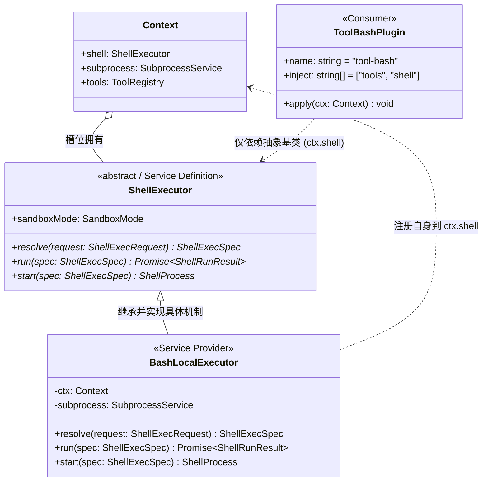
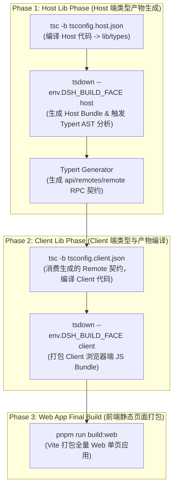

# Chapter 05: Monorepo and Package Boundaries

English | [中文](05-monorepo-boundaries.zh.md)

As large AI agent systems and production harnesses evolve, architectural design faces a fundamental tension between **rapidly changing model interactions** and **highly stable underlying systems infrastructure**. If LLM prompt assembly, tool-schema exposure, operating-system process-tree management, filesystem sandboxes, event-sourced state, and web interaction are all mixed into one monolithic project, even a small business-prompt or tool-protocol change can trigger failures in the underlying system.

This chapter examines the topology of the DeepSeek Harness monorepo and the rationale for its package boundaries from a systems-engineering perspective. It shows how the **Cordis dependency-injection kernel**, the **three-role Service Definition / Service Provider / Consumer decoupling pattern**, the **build pipeline that physically separates TypeScript Host and Client programs**, and the **declarative bundle assembly layer** produce a cohesive, loosely coupled, strongly typed production agent system with interchangeable components.

---

## 5.1 Architectural Mental Model: Monorepo Boundaries Through Systems Programming

To avoid vague buzzwords, we map the DeepSeek Harness monorepo architecture to established concepts in systems software engineering:

```mermaid
flowchart TB
    subgraph "Application Assembly Layer (应用装配面)"
        BundleHeadless["@deepseek-ai/dsh-headless<br/>(CLI 单次执行智能体)"]
        BundleWebApp["@deepseek-ai/dsh-web-app<br/>(全功能 Web GUI 服务)"]
        BundleACP["@deepseek-ai/dsh-acp<br/>(自动化 ACP 服务器)"]
    end

    subgraph "Consumer Plane (面向模型/用户的消费面)"
        ToolBash["@deepseek-ai/dsh-tool-bash<br/>(面向模型的 Bash 工具)"]
        ToolFS["@deepseek-ai/dsh-tool-fs<br/>(面向模型的文件工具)"]
        AgentLoop["@deepseek-ai/dsh-agent-loop<br/>(状态机驱动循环)"]
        ClientUI["@deepseek-ai/dsh-client-*<br/>(Web 响应式组件树)"]
    end

    subgraph "Service Definition Plane (能力契约面 - VFS 抽象)"
        SvcShell["ctx.shell<br/>(ShellExecutor 抽象基类)"]
        SvcFS["ctx.fs<br/>(FilesystemProvider 抽象基类)"]
        SvcLLM["ctx.llm<br/>(LLMAdapterRegistry 服务)"]
        SvcSubprocess["ctx.subprocess<br/>(SubprocessService 抽象基类)"]
        SvcSession["ctx.sessions<br/>(SessionStore 状态总线)"]
    end

    subgraph "Service Provider Plane (底层机制实现面)"
        BashLocal["@deepseek-ai/dsh-bash-local<br/>(本地进程组 + 管道)"]
        BashSandbox["@deepseek-ai/dsh-bash-sandbox<br/>(Landlock/Seatbelt 隔离)"]
        FSLocal["@deepseek-ai/dsh-fs-local<br/>(Node fs 物理落盘)"]
        LLMDeepSeek["@deepseek-ai/dsh-llm-deepseek<br/>(DeepSeek API 协议驱动)"]
        SubprocessLocal["@deepseek-ai/dsh-subprocess-local<br/>(操作系统 Spawn/Kill 治理)"]
    end

    BundleHeadless --> ToolBash
    BundleHeadless --> AgentLoop
    BundleWebApp --> ClientUI
    BundleWebApp --> AgentLoop

    ToolBash --> SvcShell
    ToolFS --> SvcFS
    AgentLoop --> SvcLLM
    AgentLoop --> SvcSession

    BashLocal -. "实现注册" .-> SvcShell
    BashSandbox -. "实现注册" .-> SvcShell
    FSLocal -. "实现注册" .-> SvcFS
    LLMDeepSeek -. "实现注册" .-> SvcLLM
    SubprocessLocal -. "实现注册" .-> SvcSubprocess
    BashLocal --> SvcSubprocess
```



### 5.1.1 Systems-Level Mapping Table

For a systems programmer, each Harness layer has a corresponding concept in computer systems:

| Harness concept | Conventional systems-programming / distributed-architecture analogue | Main responsibility and design constraint |
|---|---|---|
| **Monorepo package** | Operating-system shared library (`.so` / `.dll`) or independent compilation unit | Has explicit exported symbols (`exports`), a single responsibility (SRP), physical file isolation, and a strict dependency tree. |
| **Service Definition** | POSIX system-call interface specification / VFS (virtual filesystem) abstract class | An abstract base class extending Cordis `Service`, owning a global `ctx.<key>` slot and defining immutable virtual method signatures and lifecycle. |
| **Service Provider** | Device driver / concrete filesystem implementation (ext4/btrfs) | Implements underlying mechanisms such as local process spawning, Landlock sandbox isolation, and SQLite transactional reads and writes, then registers itself in the service slot. |
| **Consumer** | User-space application / POSIX libc function wrapper | Exposes Zod-schema tool definitions to a model or data subscriptions to a UI. It depends only on the Definition and does not know the concrete driver. |
| **Cordis Context** | Mach port registry in a microkernel / Spring IoC container | Manages singleton and scoped lifecycles, using `ctx.effect()` for RAII-like automatic disposal and cleanup. |
| **Bundle** | Operating-system distribution assembly manifest (Linux distribution image) | Uses a declarative `cordis.patch.yml` configuration file to assemble concrete Providers and Consumers into an executable instance according to the application topology. |

### 5.1.2 Why Can't a Large Agent Harness Be a Monolithic Script?

Many simple open-source agent prototypes place tool logic, system prompts, and execution code in one directory. In a real production environment, that design creates severe engineering failures:

1. **Different rates of change:** Model-facing system prompts and tool schemas belong to the business layer and can change daily or even hourly. The underlying process-group scheduler (`subprocess`), oversized-output spill handling (`spill`), and event persistence (`session-persistence`) are systems infrastructure that should remain stable for months, with 100% unit-test coverage and concurrency safety. Physical package separation forces a firm boundary between code with different change cycles.
2. **Multiple runtimes and declaration conflicts:** Harness includes the Node.js Host process, browser Client, isolated Worker-thread code runtime, and external subprocesses. If they share one type context, TypeScript's global interface declaration merging can cause catastrophic collisions between service types on `Context`.
3. **Deterministic, keyless snapshot testing:** Tests for the upper-level agent state machine must replay quickly, within milliseconds, without network access or an LLM API key. Physical package boundaries let tests replace `ctx.llm` directly with the static `llm-replay` Provider without invasive changes to the upper-level `agent-loop`.

---

## 5.2 Responsibilities of the Core Package Groups

DeepSeek Harness divides `packages/` into 21 core package groups by domain. Each group follows a common naming convention: directories use `packages/<group>/<pkg>/`, and npm packages use `@deepseek-ai/dsh-<pkg>` (Host/Client components explicitly include a face-specific prefix).

```
packages/
├── core/             # 产品 API 核心脊梁：Agent、Session 实体、Tool 管道与状态机驱动
├── llm/              # LLM 抽象 Seam、模型适配器（DeepSeek/Pi）、重试与 Token 计量
├── fs/               # 文件系统 Seam、物理/沙箱实现与面向模型的文件编辑工具
├── shell/            # 命令行执行 Seam、本地/沙箱 Bash/Pwsh 执行器与面向模型的工具
├── subprocess/       # 底层进程树治理、I/O 截断、SIGTERM 升级为 SIGKILL 的生命周期管理
├── sandbox/          # 操作系统级内核沙箱（Landlock/bwrap/Seatbelt）抽象与安全策略
├── web/              # Web 检索/抓取 Seam、搜索引擎适配器（DeepSeek/Exa/Perplexity）
├── session/          # 会话数据持久化（JSONL/SQLite）、投影折叠（Projection）与遥测
├── storage/          # 非会话通用持久化 Hub、SQLite/JSON KV 存储与领域数据形态
├── subagent/         # 多 Agent 委派 Seam、进程内/外派生（Fork/Spawn）与延续控制
├── jobs/             # 通用后台异步长任务运行时、异步句柄分配与任务治理工具
├── workflow/         # 结构化任务工作流引擎、Worker Thread 隔离与 Ralph 验证工具
├── graph/            # 生产级可持久化多 Agent DAG 任务网、分布式调度与 LoopX 协同
├── host/             # Web GUI 宿主端 BFF 网关、静态资产分发与本地目录选择器
├── client/           # Web GUI 浏览器端响应式状态、UI 插件体系与 Slot 插槽装配
├── api/              # RPC 协议网关（Gateway）与跨端双向通信 Remote 契约（Remotes）
├── typert/           # 运行时类型反射图生成器、Schema 校验与 RPC 桩代码编译
├── bundle/           # 顶级交付形态装配包（base, headless, web-app 等）
├── preset/           # 预设 Agent 配置文件发现与按会话动态挂载
├── boot/             # CLI 命令行入口组装、参数解析与 Cordis 容器启动胶水
└── sdk/              # 进程外通信协议与 TypeScript/JSON-RPC SDK 运行时
```

The following sections describe the underlying responsibilities of all 21 groups in detail:

### 5.2.1 `core/`: The Core Product API

`core/` is central to Harness. It depends on no particular external hardware or vendor driver; it defines the main agent runtime entities and data flows:

- **`agent` (`@deepseek-ai/dsh-agent`):** Defines the `Agent` entity and its runtime service `ctx.agents`. It manages handles for active agent instances, parent-child relationships, initiator-scope propagation, and the creation and disposal of context lifecycles.
- **`agent-loop` (`@deepseek-ai/dsh-agent-loop`):** The sole concrete agent state-machine driver loop. It consumes messages from the `Inbox`, orchestrates Turns and Steps, requests models through `ctx.llm`, parses tool-call ASTs, and executes side effects through the `ctx.tools` pipeline.
- **`session` (`@deepseek-ai/dsh-session`):** Defines the session entity and in-memory state bus `ctx.sessions`. It owns the append-only factual-event ledger (`SessionEvent`), broadcasts the event stream, and serves as the in-memory center of event sourcing.
- **`tools` (`@deepseek-ai/dsh-tools`):** The tool-pipeline registry `ctx.tools`. It maintains the global tool registry and guards execution before and after a tool runs: `tools/pre-execute` (authorization and argument interception), `tools/execute` (timeouts and concurrency), `tools/post-execute` (oversized-result spill and redaction), and `tools/observed` (audit-log writes).
- **`system-prompt` (`@deepseek-ai/dsh-system-prompt`):** The system-prompt assembly service `ctx.systemPrompt`. It collects plugin-registered fragments by priority (stable prefixes, workspace instructions, time context, and dynamic-state suffixes), keeping prompt prefixes stable to maximize LLM KV Cache hits.
- **`scope` (`@deepseek-ai/dsh-scope`):** Maintains private state within an agent session scope to prevent contamination between concurrent agents.
- **`agent-default-model` (`@deepseek-ai/dsh-agent-default-model`):** Manages the default model-selection policy when a session is initialized, with layered overrides from user settings.
- **`agent-tool-presentation` (`@deepseek-ai/dsh-agent-tool-presentation`):** Defines the pure presenter projection used to render tool execution in the client.

### 5.2.2 `llm/`: LLM Abstractions and Adapters

The `llm/` group converts nondeterministic LLM HTTP/SSE protocols into strongly typed streamed data events:

- **`llm` (`@deepseek-ai/dsh-llm`):** The Service Definition package owning the `ctx.llm` registry. It defines the general `LLMAdapter` contract, message structure (`LLMMessage`), stream chunks (`LLMChunk`), and error type (`HarnessError`).
- **`llm-deepseek` (`@deepseek-ai/dsh-llm-deepseek`):** A Service Provider adapter for the official DeepSeek API. It supports the full feature set of DeepSeek-V3 / R1 models, including reasoning-stream parsing (`<think>...</think>`), context-cache indicators, and native Function Calling.
- **`llm-pi-ai` (`@deepseek-ai/dsh-llm-pi-ai`):** A general third-party Service Provider adapter for multiple models.
- **`llm-retry` (`@deepseek-ai/dsh-llm-retry`):** A model-request fault-tolerance plugin. It handles network instability, 429 rate limits, 503 outages, and JSON parsing errors with exponential backoff and jitter.
- **`token-meter` (`@deepseek-ai/dsh-token-meter`):** The precise token-usage metering service `ctx.tokenMeter`. It tracks input, output, and cached tokens per session and supplies real-time usage levels for context-compaction policy.

### 5.2.3 `fs/`: Filesystem Seam, Sandboxed I/O, and Model-Facing Tools

- **`fs` (`@deepseek-ai/dsh-fs`):** The Service Definition package owning `ctx.fs`. It defines the abstract `FilesystemProvider` interface (`readFile`, `writeFile`, `mkdir`, `stat`, `unlink`, and others).
- **`fs-local` (`@deepseek-ai/dsh-fs-local`):** The local Service Provider backed by the Node.js physical filesystem.
- **`fs-sandbox` (`@deepseek-ai/dsh-fs-sandbox`):** A sandboxed filesystem Service Provider. It intercepts all path access, confines it to the workspace root, and protects against `../` traversal and symlink hijacking.
- **`fs-observation-policy` (`@deepseek-ai/dsh-fs-observation-policy`):** Adds observation-based integrity checks through file-operation event enforcement.
- **`tool-fs` (`@deepseek-ai/dsh-tool-fs`):** A model-facing Consumer plugin that registers standard model tools such as `read_file` and `write_to_file` with `ctx.tools`.
- **`tool-fs-search` (`@deepseek-ai/dsh-tool-fs-search`):** Model-facing physical-file search using filename globs and content regexes.
- **`tool-str-replace-editor` (`@deepseek-ai/dsh-tool-str-replace-editor`):** A model-facing precise line/block string-replacement tool (`replace_file_content`). Arguments must identify a unique target code block to prevent unintended edits.

### 5.2.4 `shell/`: Cross-Platform Command Execution, Environment Injection, and Tools

- **`shell` (`@deepseek-ai/dsh-shell`):** The Service Definition package owning `ctx.shell`. It defines the abstract `ShellExecutor` base class and the contracts for foreground `run()` commands and background `start()` processes.
- **`bash-local` (`@deepseek-ai/dsh-bash-local`):** A local POSIX Bash Service Provider. It uses `ctx.subprocess` to create an independent process group and handles timeout escalation, process termination, and merged standard output.
- **`bash-sandbox` (`@deepseek-ai/dsh-bash-sandbox`):** A secure Bash Service Provider using `ctx.sandbox`.
- **`pwsh-local` / `pwsh-sandbox`:** Windows PowerShell execution Service Providers.
- **`shell-env` (`@deepseek-ai/dsh-shell-env`):** The lifecycle-protected environment-variable registration service `ctx.shellEnv`. Plugins can declare `DSH_*` facts scoped to the current effect; for each run, it assembles a clean, immutable child-process environment.
- **`tool-bash` / `tool-pwsh`:** Model-facing Consumer tools. They register the `bash` / `pwsh` tools, support `run_in_background`, and hand background process handles to `ctx.jobs`.

### 5.2.5 `subprocess/`: Process-Tree Management and Lifecycle

- **`subprocess` (`@deepseek-ai/dsh-subprocess`):** The Service Definition package owning `ctx.subprocess`. It abstracts child-process creation, I/O stream capture, and process-group termination.
- **`subprocess-local` (`@deepseek-ai/dsh-subprocess-local`):** A local process-management Service Provider addressing the difficult problem of orphaned and zombie processes:
  - On Linux/macOS, it creates an independent process group with `setsid()` and signals the entire process tree with `kill(-pid, SIGTERM)` on termination.
  - It implements the **SIGTERM $\to$ grace period (for example, 3000ms) $\to$ SIGKILL** termination escalation sequence.
  - It captures `stdout` / `stderr` and automatically spills output beyond the memory threshold to a temporary file through a memory pipe, preventing Node.js Buffer OOM.

### 5.2.6 `sandbox/`: Operating-System Process Isolation and Policy

- **`sandbox` (`@deepseek-ai/dsh-sandbox`):** The Service Definition package owning `ctx.sandbox`. It defines the abstract interface of the operating-system sandbox wrapper.
- **`sandbox-local` (`@deepseek-ai/dsh-sandbox-local`):** A local sandbox Service Provider that negotiates an isolation mechanism for the host operating system:
  - Linux: Prefer the kernel-native **Landlock LSM** through a Node addon, falling back to `bwrap` (Bubblewrap).
  - macOS: Use `sandbox-exec` with a compiled **Seatbelt** profile to restrict filesystem writes.
  - Windows: Use a restricted token and job object.
- **`sandbox-policy` (`@deepseek-ai/dsh-sandbox-policy`):** The unified security-policy service `ctx.sandboxPolicy`. It manages global sandbox modes (`read-only`, `workspace-write`, `danger-full-access`) and allowlisted paths.

### 5.2.7 `web/`: Web Search and Fetch Abstractions

- **`web` (`@deepseek-ai/dsh-web`):** The Service Definition package owning `ctx.web`. It defines the common internet-search (`search`) and page-content fetch (`fetch`) interfaces.
- **`web-search-deepseek` / `web-search-exa` / `web-search-perplexity`:** Service Provider packages for individual search engines.
- **`web-fetch-http` (`@deepseek-ai/dsh-web-fetch-http`):** An HTTP Service Provider that fetches page content and converts HTML to cleaned Markdown.
- **`tool-web` (`@deepseek-ai/dsh-tool-web`):** A model-facing Consumer tool registering `search_web` and `read_url_content`.

### 5.2.8 `session/`: Fact Ledger, Event Sourcing, Persistence, and Projection Cache

- **`session-persistence` (`@deepseek-ai/dsh-session-persistence`):** The Service Definition package owning `ctx.sessionPersistence`. It defines durable storage of the session event stream.
- **`session-persistence-jsonl`:** A lightweight, single-file JSONL Service Provider with line-by-line appends.
- **`session-persistence-sqlite`:** A high-performance SQLite WAL Service Provider supporting ACID transactions and millisecond-scale indexes.
- **`session-projection` (`@deepseek-ai/dsh-session-projection`):** The event-sourced projection service `ctx.sessionProjections`. Domain plugins register fold functions that replay raw events on demand to calculate business state (such as the current Todo list or generated-file inventory).
- **`session-projection-cache` (`@deepseek-ai/dsh-session-projection-cache`):** A projection-snapshot cache. It maintains a watermark checkpoint for folded state, accelerating cold starts: recovery loads the latest checkpoint and replays only subsequent incremental events instead of scanning the entire log.
- **`session-title`:** The session-title auto-generation seam and asynchronous model-summarization Service Provider.
- **`session-telemetry-otel`:** An OpenTelemetry-based Service Provider exporting session metrics and distributed traces.

### 5.2.9 `storage/`: General Non-Session Storage and Domain Data Forms

- **`storage` (`@deepseek-ai/dsh-storage`):** The general storage hub service `ctx.storage`.
- **`storage-json` / `storage-sqlite`:** Service Providers for the underlying physical storage backends.
- **`storage-domain` (`@deepseek-ai/dsh-storage-domain`):** The domain-data service `ctx.storageDomain`. Above opaque KV primitives, it provides strongly typed CRUD and versioned persistence operations for business plugins such as workspace metadata and message-feedback records.

### 5.2.10 `subagent/`: Multi-Agent Delegation and Continuation Control

- **`subagent` (`@deepseek-ai/dsh-subagent`):** The Service Definition package owning `ctx.subagents`. It defines subagent creation, message relay, and lifecycle orchestration.
- **`subagent-spawn-in-process` / `subagent-fork-in-process`:** Lightweight in-process subagent Service Providers, supporting new-context spawning and shared-memory context forking, respectively.
- **`subagent-acp` / `subagent-codex` / `subagent-claude-code`:** Service Provider adapters for external standard-protocol subagents.
- **`subagent-dsh-sdk`:** Calls an independently running agent instance across a process boundary through the Harness SDK.
- **`tool-subagent` / `tool-subagent-control` / `tool-subagent-report`:** Model-facing tools for delegation, long-running-task polling, and reporting.

### 5.2.11 `jobs/`: General Background-Task Runtime

- **`jobs` (`@deepseek-ai/dsh-jobs`):** The Service Definition package owning `ctx.jobs`. It defines the long-running background-task record (`JobRecord`), state machine (`running`, `completed`, `failed`, `killed`), and registration and management interfaces.
- **`jobs-local` (`@deepseek-ai/dsh-jobs-local`):** An in-process background-task manager Service Provider.
- **`tool-jobs` (`@deepseek-ai/dsh-tool-jobs`):** A model-facing Consumer control tool exposing management operations such as `job_status`, `job_kill`, `job_list`, and `job_read`.

### 5.2.12 `workflow/`: Structured Workflow Engine and Worker-Thread Isolation

- **`workflow` (`@deepseek-ai/dsh-workflow`):** The Service Definition package owning `ctx.workflowEngine`.
- **`workflow-worker-thread` (`@deepseek-ai/dsh-workflow-worker-thread`):** An isolated execution engine Service Provider based on Node.js `worker_threads`. It places a memory barrier between model-generated workflow scripts and the main process so infinite loops cannot block the main event loop.
- **`tool-workflow` / `tool-ralph`:** Model-facing tools for workflow execution and single-Round iterative self-correction (Ralph Loop).

### 5.2.13 `graph/`: Multi-Agent DAGs and Distributed Scheduling

- **`graph` / `graph-mode`:** The directed acyclic graph (DAG) controller state machine, supporting topological ordering, parallel node dispatch, and dependency waits for complex engineering tasks.
- **`graph-coordination` / `graph-coordination-loopx`:** The distributed-coordination seam and LoopX external-coordination Service Provider.
- **`graph-artifacts` / `graph-artifacts-fs`:** A seam for node artifact transfer and content-addressed (CAS) data exchange between nodes.
- **`graph-worker` / `graph-worker-local` / `graph-worker-remote`:** Task-node executors with distributed fencing tokens.
- **`graph-resources` / `graph-resources-sqlite`:** Model-concurrency and GPU-memory resource-quota reservation services.
- **`graph-scheduler` / `graph-scheduler-sqlite`:** Whole-graph execution-lease and monotonically increasing token-lock schedulers.

### 5.2.14 `host/`: Web GUI Host BFF Gateway and HTTP Routes

- **`host-webserver` (`@deepseek-ai/dsh-host-webserver`):** The `node:http`-based HTTP route-registration service `ctx.webServer`.
- **`host-apiproxy` (`@deepseek-ai/dsh-host-apiproxy`):** A BFF gateway adapter that bridges the Host Cordis event stream to SSE and converts Client HTTP requests into internal service calls.
- **`host-frontend-static`:** Hosts the built React single-page application (SPA) in production.
- **`host-directory-picker-*`:** Native local operating-system file dialogs or a web-simulated directory picker.

### 5.2.15 `client/`: Browser Reactive State and UI Plugins

- **`client/connection`:** Manages browser WebSocket / SSE connections.
- **`client/runtime`:** An independent browser Cordis container and global state tree.
- **`client/ui-layout` / `ui-conversation` / `ui-tool` / `ui-settings-*`:** Fine-grained React UI plugin packages assembled through the `ui-slots` slot system into a complete Web GUI.

### 5.2.16 `api/`: RPC Gateway and Remote Contracts

- **`api/gateway` (`@deepseek-ai/dsh-api-gateway`):** The Host Typert invocation gateway owning `ctx.typertGateway`. It maps frontend RPC messages to `@Remote` methods on Cordis services.
- **`api/remotes` (`@deepseek-ai/dsh-api-remotes`):** Stores strongly typed Host-to-Client RPC contracts generated by the build system.

### 5.2.17 `typert/`: Type-Graph Generation and Runtime Reflection

- **`typert/registry`:** The runtime type registry `ctx.typert`.
- **`typert/generator`:** Traverses the TypeScript AST at build time, extracts service methods decorated with `@Remote`, and generates Zod-schema validators and type-safe Client proxies.
- **`typert/loader`:** Dynamically loads and validates RPC payloads.

### 5.2.18 `bundle/`: Top-Level Application Assemblies

- **`bundle/base` (`@deepseek-ai/dsh-base`):** The base capability-patch layer shared by all application profiles.
- **`bundle/headless` (`@deepseek-ai/dsh-headless`):** A headless agent profile for one-command terminal execution.
- **`bundle/web-app` (`@deepseek-ai/dsh-web-app`):** The browser application profile with a complete Web GUI and Host services.

### 5.2.19 `preset/`: Mounting Preset Agent Configuration

- **`preset/agent-presets` (`@deepseek-ai/dsh-agent-presets`):** Discovers preset `cordis.yml` files and dynamically mounts them under a session's agent scope when the session is created.

### 5.2.20 `boot/`: Application Bootstrapping and CLI Assembly

- **`boot/cmdline` (`@deepseek-ai/dsh-cmdline`):** Assembles general CLI options such as `--profile`, `--verbose`, and `--port` with Commander.js.
- **`boot/app-boot` (`@deepseek-ai/dsh-app-boot`):** Parses configuration, creates the root Cordis Context, and starts the loader.

### 5.2.21 `sdk/`: Out-of-Process Protocol and Multilanguage SDKs

- **`sdk/protocol`:** Defines the JSON-RPC 2.0 protocol and payload structure for out-of-process Harness communication.
- **`sdk/client`:** A lightweight TypeScript client SDK for external Node.js applications.
- **`sdk/server`:** A service plugin starting a standard JSON-RPC server within Harness.

---

## 5.3 Core Design Pattern: The Service Definition / Provider / Consumer Trio

A central architectural principle of DeepSeek Harness is its consistent use of the three-role **Service Definition**, **Service Provider**, and **Consumer** design pattern.



### 5.3.1 Why an Abstract Class Instead of a TypeScript Interface?

Java/C# developers often use `interface IShellExecutor` to define a contract. In a TypeScript + Cordis runtime, however, **a pure interface is erased during compilation and leaves no trace at JavaScript runtime**.

The Cordis dependency-injection engine requires services to have these runtime properties:
1. **A globally unique symbol and prototype chain:** A service class extends `Service`. When its constructor calls `super(ctx, 'shell')`, Cordis installs an entry in the global registry and establishes lifecycle listeners.
2. **Protection against duplicate registration:** If two Providers attempt to mount at `ctx.shell` simultaneously, the Cordis runtime can throw a precise fatal duplicate-service error from the constructor, avoiding unpredictable behavior caused by silent replacement.
3. **Disposal and lifecycle hooks:** An abstract class can define shared lifecycle methods such as `stop()`. Cordis invokes disposal when a plugin is unloaded or hot-reloaded (HMR), releasing background processes and file descriptors safely.

### 5.3.2 Complete TypeScript Example of the Three-Role Pattern

The core `shell` seam shows how the three roles remain decoupled and invert their dependencies in source code.

#### 1. Service Definition: `packages/shell/shell/src/index.ts`

```typescript
/**
 * @file packages/shell/shell/src/index.ts
 * @description Service Definition：仅定义抽象契约与词汇表，零具体执行逻辑
 */
import { Context, Service } from '@deepseek-ai/cordis'

// 1. 声明合并：告知 TypeScript 编译器 Context 上挂载了 shell 属性
declare module '@deepseek-ai/cordis' {
  interface Context {
    shell: ShellExecutor
  }
}

export interface ShellExecRequest {
  readonly command: string
  readonly cwd?: string
  readonly env?: Readonly<Record<string, string>>
  readonly timeoutMs?: number
  readonly signal?: AbortSignal
}

export interface ShellExecSpec extends ShellExecRequest {
  readonly cwd: string
  readonly timeoutMs: number
  readonly resolvedEnv: Readonly<Record<string, string>>
}

export interface ShellRunResult {
  readonly exitCode: number | null
  readonly signal: NodeJS.Signals | null
  readonly stdout: string
  readonly stderr: string
  readonly durationMs: number
  readonly timedOut: boolean
  readonly aborted: boolean
}

export interface ShellProcess {
  readonly pid: number
  readonly done: Promise<ShellRunResult>
  kill(signal?: NodeJS.Signals): Promise<void>
  readOutput(): Promise<{ stdoutChunk: string; stderrChunk: string }>
}

/**
 * 核心抽象基类：所有 Shell 机制实现必须继承此契约
 */
export abstract class ShellExecutor extends Service {
  constructor(ctx: Context) {
    // 将自身绑定到 Cordis Context 的 'shell' 属性槽位上
    super(ctx, 'shell', true)
  }

  /** 入参归一化与防御性约束补全 */
  abstract resolve(request: ShellExecRequest): ShellExecSpec

  /** 前台同步阻塞式运行，直至退出或超时 */
  abstract run(spec: ShellExecSpec): Promise<ShellRunResult>

  /** 后台异步非阻塞启动，立即返回进程控制句柄 */
  abstract start(spec: ShellExecSpec): ShellProcess
}

export default ShellExecutor
```

#### 2. Service Provider: `packages/shell/bash-local/src/index.ts`

```typescript
/**
 * @file packages/shell/bash-local/src/index.ts
 * @description Service Provider：具体实现本地 Bash 进程组派生与管道治理
 */
import { Context } from '@deepseek-ai/cordis'
import { ShellExecutor, type ShellExecRequest, type ShellExecSpec, type ShellProcess, type ShellRunResult } from '@deepseek-ai/dsh-shell'
import type { SubprocessService } from '@deepseek-ai/dsh-subprocess'

export interface LocalBashConfig {
  readonly defaultTimeoutMs?: number
  readonly maxOutputBytes?: number
  readonly graceKillTimeoutMs?: number
}

export class BashLocalExecutor extends ShellExecutor {
  // 声明该 Provider 强依赖 subprocess 底层进程服务
  static readonly inject = ['subprocess']

  private readonly defaultTimeoutMs: number
  private readonly maxOutputBytes: number
  private readonly graceKillTimeoutMs: number

  constructor(ctx: Context, config: LocalBashConfig = {}) {
    super(ctx)
    this.defaultTimeoutMs = config.defaultTimeoutMs ?? 30_000
    this.maxOutputBytes = config.maxOutputBytes ?? 10 * 1024 * 1024 // 10MB 内存阈值
    this.graceKillTimeoutMs = config.graceKillTimeoutMs ?? 3_000 // 3秒优雅退出宽限
  }

  override resolve(request: ShellExecRequest): ShellExecSpec {
    return {
      command: request.command,
      cwd: request.cwd ?? process.cwd(),
      timeoutMs: Math.max(100, Math.min(request.timeoutMs ?? this.defaultTimeoutMs, 600_000)),
      env: request.env ?? {},
      resolvedEnv: {
        ...process.env,
        ...request.env,
        NO_COLOR: '1',
        TERM: 'dumb',
        PAGER: 'cat',
      },
      signal: request.signal,
    }
  }

  override async run(spec: ShellExecSpec): Promise<ShellRunResult> {
    const startTime = Date.now()
    const subprocessService = this.ctx.get('subprocess') as SubprocessService
    if (!subprocessService) {
      throw new Error('[BashLocalExecutor] 关键依赖 ctx.subprocess 缺失')
    }

    // 1. 通过 subprocess 服务派生独立的进程组 (Process Group)
    const procHandle = await subprocessService.spawn({
      file: '/bin/bash',
      args: ['-c', spec.command],
      cwd: spec.cwd,
      env: spec.resolvedEnv,
      detached: true, // 独立进程组以支持 group kill
    })

    let timedOut = false
    let aborted = false
    let timer: NodeJS.Timeout | null = null

    // 2. 超时防御逻辑
    const timeoutPromise = new Promise<void>((resolve) => {
      timer = setTimeout(() => {
        timedOut = true
        resolve()
      }, spec.timeoutMs)
    })

    // 3. 取消信号监听
    const abortPromise = new Promise<void>((resolve) => {
      if (spec.signal?.aborted) {
        aborted = true
        resolve()
      } else {
        spec.signal?.addEventListener('abort', () => {
          aborted = true
          resolve()
        }, { once: true })
      }
    })

    try {
      const outcome = await Promise.race([
        procHandle.exited,
        timeoutPromise.then(() => 'TIMEOUT' as const),
        abortPromise.then(() => 'ABORTED' as const),
      ])

      if (outcome === 'TIMEOUT' || outcome === 'ABORTED') {
        // 优雅终止升级：SIGTERM -> 宽限等待 -> SIGKILL
        await this.terminateProcessTree(procHandle, this.graceKillTimeoutMs)
      }

      const finalExit = await procHandle.exited
      const output = await procHandle.readAll(this.maxOutputBytes)

      return {
        exitCode: finalExit.exitCode,
        signal: finalExit.signal,
        stdout: output.stdout,
        stderr: output.stderr,
        durationMs: Date.now() - startTime,
        timedOut,
        aborted,
      }
    } finally {
      if (timer) clearTimeout(timer)
    }
  }

  override start(spec: ShellExecSpec): ShellProcess {
    // 后台长进程实现：立即返回封装好的句柄
    const subprocessService = this.ctx.get('subprocess') as SubprocessService
    const procHandle = subprocessService.spawnSyncHandle({
      file: '/bin/bash',
      args: ['-c', spec.command],
      cwd: spec.cwd,
      env: spec.resolvedEnv,
      detached: true,
    })

    return {
      pid: procHandle.pid,
      done: procHandle.exited.then(async (exit) => {
        const out = await procHandle.readAll(this.maxOutputBytes)
        return {
          exitCode: exit.exitCode,
          signal: exit.signal,
          stdout: out.stdout,
          stderr: out.stderr,
          durationMs: 0,
          timedOut: false,
          aborted: false,
        }
      }),
      kill: async (sig = 'SIGTERM') => {
        await procHandle.killGroup(sig)
      },
      readOutput: async () => {
        return procHandle.readChunk()
      },
    }
  }

  private async terminateProcessTree(handle: { killGroup(sig: NodeJS.Signals): Promise<void>; exited: Promise<unknown> }, graceMs: number): Promise<void> {
    await handle.killGroup('SIGTERM')
    const graceTimer = new Promise<boolean>((res) => setTimeout(() => res(false), graceMs))
    const exitOk = await Promise.race([handle.exited.then(() => true), graceTimer])
    if (!exitOk) {
      // 宽限期已过，强杀进程组
      await handle.killGroup('SIGKILL')
    }
  }
}

export default BashLocalExecutor
```

#### 3. Consumer: `packages/shell/tool-bash/src/index.ts`

```typescript
/**
 * @file packages/shell/tool-bash/src/index.ts
 * @description Consumer：面向大模型定义 Tool Schema，依赖 ctx.shell 与 ctx.tools
 */
import { Context } from '@deepseek-ai/cordis'
import { defineTool, type ToolResult } from '@deepseek-ai/dsh-tools'
import type { ShellExecutor } from '@deepseek-ai/dsh-shell'
import type { JobsService } from '@deepseek-ai/dsh-jobs'

export const name = 'tool-bash'
// 声明仅依赖抽象服务名称，完全解耦具体的 bash-local 或 bash-sandbox
export const inject = ['tools', 'shell', 'jobs']

export function apply(ctx: Context): void {
  // 向大模型注册标准工具
  ctx.tools.register(
    defineTool({
      name: 'execute_bash',
      description: '在受控 Shell 环境中执行 Bash 命令。支持前台执行与后台长任务。',
      parameters: {
        type: 'object',
        properties: {
          command: {
            type: 'string',
            description: '待执行的 Bash 脚本命令',
          },
          timeout_ms: {
            type: 'number',
            description: '执行超时时间（毫秒），默认 30000',
          },
          run_in_background: {
            type: 'boolean',
            description: '是否在后台运行长任务（如启动构建服务）',
          },
        },
        required: ['command'],
      },
      execute: async (args: { command: string; timeout_ms?: number; run_in_background?: boolean }, meta): Promise<ToolResult> => {
        const shell = ctx.shell as ShellExecutor
        const spec = shell.resolve({
          command: args.command,
          timeoutMs: args.timeout_ms,
          signal: meta.signal,
        })

        if (args.run_in_background) {
          // 后台任务分支：将进程注册进通用 Jobs 运行时
          const proc = shell.start(spec)
          const jobs = ctx.jobs as JobsService
          const jobId = jobs.registerJob({
            type: 'bash',
            title: `Bash: ${args.command.slice(0, 30)}`,
            handle: proc,
          })

          return {
            content: `命令已转入后台运行。Job ID: [${jobId}]。可调用 job_status 查看输出。`,
            isError: false,
          }
        }

        // 前台同步执行分支
        const result = await shell.run(spec)
        const isError = result.exitCode !== 0 || result.timedOut || result.aborted

        let formattedOutput = ''
        if (result.stdout) formattedOutput += `[stdout]\n${result.stdout}\n`
        if (result.stderr) formattedOutput += `[stderr]\n${result.stderr}\n`
        if (result.timedOut) formattedOutput += `\n[ERROR] 命令执行超时（上限 ${spec.timeoutMs}ms）被强行终止。`
        if (result.aborted) formattedOutput += `\n[ERROR] 命令执行被用户取消。`

        return {
          content: formattedOutput.trim() || `(命令退出，无标准输出，退出码: ${result.exitCode})`,
          isError,
        }
      },
    })
  )
}
```

---

## 5.4 Separating Source and Artifact Planes in the Build Pipeline

In a large TypeScript monorepo, typecheck speed and isolation between programs targeting different runtimes are essential engineering measures. DeepSeek Harness uses a **build pipeline that physically separates the Host and Client programs**.



### 5.4.1 Isolating Host and Client Programs to Prevent Context Collisions

In Cordis, Host services (such as `ctx.subprocess`, `ctx.fs`, and `ctx.sessionPersistence`) and Client services (such as `ctx.ui`, `ctx.connection`, and `ctx.remote`) both augment the global `Context` interface through TypeScript's `declare module '@deepseek-ai/cordis'` declaration merging.

If a single `ts.Program` contains both Host and Client code, TypeScript merges all augmented properties into one `Context` interface. This creates serious type-safety failures:
- Client code may appear able to access Node-native `ctx.fs`, passing development-time typechecks but crashing with `undefined` in the browser.
- Conflicting definitions of a service with the same name can spread TypeScript errors throughout the repository.

Harness addresses this with strict tsconfig organization:

```
tsconfig.json               # Solution Root：仅包含 references，files 为空，不形成 Program
├── tsconfig.base.json      # 共享 CompilerOptions 与源码面 paths 映射（无 include/files）
├── tsconfig.host.json      # Host 聚合 Program：引用所有 packages/host、core、llm 等后端包
└── tsconfig.client.json    # Client 聚合 Program：引用所有 packages/client、ui-* 等前端包
```

### 5.4.2 Physical Separation of the Source Plane (`paths`) and Artifact Plane (`exports`)

Within the monorepo, two distinct module-resolution systems coexist:

#### 1. Source Plane
During local development, Vitest unit tests, and hot reloads, tools such as `tsx` and `vitest` use the `paths` mappings in `tsconfig.base.json` to resolve source files across packages directly:

```json
{
  "compilerOptions": {
    "paths": {
      "@deepseek-ai/dsh-shell": ["./packages/shell/shell/src/index.ts"],
      "@deepseek-ai/dsh-bash-local": ["./packages/shell/bash-local/src/index.ts"],
      "@deepseek-ai/dsh-tool-bash": ["./packages/shell/tool-bash/src/index.ts"],
      "@deepseek-ai/dsh-*": [
        "./packages/core/*/src",
        "./packages/llm/*/src",
        "./packages/shell/*/src",
        "./packages/session/*/src"
      ]
    }
  }
}
```
**Benefit:** When a developer changes an interface in `packages/shell/shell/src/index.ts`, dependent `tool-bash` code sees the type change immediately in Vitest without first running `pnpm build`, reducing the feedback loop to milliseconds.

#### 2. Artifact Plane
When a package is built for publication or imported by an external application, its `package.json` `exports` restrict access and physically hide internal source directories:

```json
{
  "name": "@deepseek-ai/dsh-shell",
  "type": "module",
  "main": "lib/index.js",
  "types": "lib/types/index.d.ts",
  "exports": {
    ".": {
      "types": "./lib/types/index.d.ts",
      "default": "./lib/index.js"
    },
    "./invariant": {
      "types": "./lib/types/invariant.d.ts",
      "default": "./lib/invariant.js"
    },
    "./package.json": "./package.json"
  },
  "files": [
    "lib/index.js",
    "lib/invariant.js",
    "lib/types/**/*.d.ts"
  ]
}
```

```
[外部 Consumer / 产物面]
         │
         ├──> import "@deepseek-ai/dsh-shell" ──> 仅能触达 lib/index.js & lib/types/index.d.ts
         │
         └──x 试图 import "@deepseek-ai/dsh-shell/src/internal.ts" ──> [Node.js ERR_PACKAGE_PATH_NOT_EXPORTED 拦截]
```

The CI checks `publint` and `verify-node-next-types` inspect every package's export declarations and reject private subpaths not explicitly listed in `exports`.

---

## 5.5 Bundle Assembly and Declarative Profiles

In DeepSeek Harness, no business plugin or Service Provider has its own `main()` startup function. Each independent feature package is a component awaiting assembly.

The **bundle** assembles these components into an application profile.

```
                  ┌─────────────────────────────────┐
                  │    @deepseek-ai/dsh-base        │  (基底层：注入会话、持久化、工具管道、LLM)
                  └────────────────┬────────────────┘
                                   │
                ┌──────────────────┴──────────────────┐
                ▼                                     ▼
┌─────────────────────────────────┐ ┌─────────────────────────────────┐
│   @deepseek-ai/dsh-headless     │ │    @deepseek-ai/dsh-web-app     │
│ (CLI Profile 覆盖层：            │ │ (Web Profile 覆盖层：           │
│  - 纯终端 stdio 交互             │ │  - 挂载 HTTP / WebSocket Server│
│  - 启用本地 Worker 代码沙箱)     │ │  - 挂载 API Gateway & Remotes │
│                                 │ │  - 托管 React 前端静态 SingleApp)│
└─────────────────────────────────┘ └─────────────────────────────────┘
```

### 5.5.1 Declarative Patch Assembly (`cordis.patch.yml`)

Harness does not hardcode `ctx.plugin(A); ctx.plugin(B);` in application code. It uses declarative YAML patch composition based on RFC 7396 JSON Merge Patch semantics.

#### 1. Base Bundle: `packages/bundle/base/cordis.patch.yml`

```yaml
# @deepseek-ai/dsh-base 的基础插件装配列表
~plugins:
  # 1. 核心运行时与会话状态
  "@deepseek-ai/dsh-session": {}
  "@deepseek-ai/dsh-session-persistence-sqlite":
    path: "~/.dsh/sessions.db"
  "@deepseek-ai/dsh-agent": {}
  "@deepseek-ai/dsh-agent-loop": {}

  # 2. 系统提示词与工具管道
  "@deepseek-ai/dsh-system-prompt": {}
  "@deepseek-ai/dsh-tools": {}
  "@deepseek-ai/dsh-tool-call-timeout-policy":
    defaultTimeoutMs: 60000

  # 3. 基础能力 Provider
  "@deepseek-ai/dsh-subprocess-local": {}
  "@deepseek-ai/dsh-bash-local": {}
  "@deepseek-ai/dsh-fs-local": {}
  "@deepseek-ai/dsh-llm-deepseek": {}

  # 4. 面向大模型的常用工具集
  "@deepseek-ai/dsh-tool-bash": {}
  "@deepseek-ai/dsh-tool-fs": {}
  "@deepseek-ai/dsh-tool-todo": {}
```

#### 2. Web Application Bundle: `packages/bundle/web-app/cordis.patch.yml`

```yaml
# @deepseek-ai/dsh-web-app：在 dsh-base 基础之上追加 Web 专属能力
~plugins:
  # 引入基底 Bundle
  "@deepseek-ai/dsh-base": {}

  # 挂载 Web 服务基础设施
  "@deepseek-ai/dsh-host-webserver":
    port: 3000
    host: "127.0.0.1"
  "@deepseek-ai/dsh-api-gateway": {}
  "@deepseek-ai/dsh-host-apiproxy": {}
  "@deepseek-ai/dsh-host-frontend-static": {}

  # 挂载 Web 专属 UI 支撑与多会话图谱
  "@deepseek-ai/dsh-graph-mode": {}
  "@deepseek-ai/dsh-message-feedback": {}
```

When `pnpm dsh --profile web-app` runs, the loader loads and merges these YAML patches in dependency order, dynamically constructing the full Cordis plugin tree in memory.

---

## 5.6 Production Failure Cases and Troubleshooting

During development and deployment of a large multipackage system, poorly defined boundaries can cause subtle but severe failures. The following cases describe three failures encountered in production practice, their root causes, and remedies.

### 5.6.1 Failure 1: Context Declaration Collision Causes Widespread Compilation Failure

```
[TS Error TS2320] Interface 'Context' incorrectly extends interface 'Context'.
  Types of property 'remote' are incompatible.
    Type 'HostRemoteGateway' is not assignable to type 'ClientRemoteProxy'.
```

- **Incident:** While building a plugin with both Node Host logic and frontend components, a new contributor imported `@deepseek-ai/dsh-api-gateway` (Host) and `@deepseek-ai/dsh-api-remotes/client` (Client) into one ordinary `tsconfig.json`. Both sides declared `declare module '@deepseek-ai/cordis' { interface Context { remote: ... } }` in their code.
- **Root cause:** TypeScript declaration merging applies globally within a program. A single compilation unit (`ts.Program`) containing both Host and Client augmentations sees incompatible type signatures for the same `ctx.remote` property, causing typechecks across the monorepo to fail.
- **Diagnosis and repair:**
  1. No package may cross the Host / Client boundary. Each must clearly belong to Host (extending `tsconfig.base.json` and registered in `tsconfig.host.json`) or Client (extending `tsconfig.base.client.json` and registered in `tsconfig.client.json`).
  2. Root `tsconfig.json` must retain `files: []` and serve only as an aggregate index; it must not compile everything as one `Program`.

### 5.6.2 Failure 2: Consumer Bypasses the Service Definition, Escaping the Sandbox and Orphaning Processes

- **Incident:** A developer implementing a bulk code-refactoring tool wrote this code directly:
  ```typescript
  // 错误示范：Consumer 直接 import 具体 Provider
  import { BashLocalExecutor } from '@deepseek-ai/dsh-bash-local'

  export function apply(ctx: Context) {
    const executor = new BashLocalExecutor(ctx)
    executor.run(...)
  }
  ```
  Local development tests passed. In the production security cluster, however, switching to the Docker / Landlock sandbox Provider `dsh-bash-sandbox` had no effect on this tool: it still invoked the Host's `BashLocalExecutor`, allowing dangerous commands to run directly on the physical Host outside the sandbox.
- **Root cause:** This violates dependency inversion for a seam. The Consumer bypasses the abstract base class and hardcodes a dependency on a particular Service Provider, disabling Cordis's runtime Provider replacement.
- **Diagnosis and repair:**
  1. Add an AST-based dependency check (`check-workspace-constraints.ts`) that forbids any `tool-*` package from referring in `package.json` or source to Provider-specific package names containing `-local`, `-sandbox`, or `-sqlite`.
  2. Consumers must obtain the instance through `ctx.shell` and guard its interface type at runtime.

### 5.6.3 Failure 3: Cross-Package Build Race Before Typert Remote Contracts Are Written

- **Incident:** In a parallel CI build, `pnpm run build` sometimes reports `TS2307: Cannot find module '@deepseek-ai/dsh-api-remotes/remote'` in a fresh build container.
- **Root cause:** Client `api-remotes` consumes RPC stubs extracted by the Host Typert generator. If the build scheduler starts Host and Client `tsc` compilation in parallel, Client compilation can begin before Host AST extraction and file writes complete, creating a distributed-filesystem race.
- **Diagnosis and repair:** Establish a deterministic two-phase ordering barrier in the root build pipeline:
  ```sh
  # 步骤 1：先完整执行 Host 编译与 Typert 契约生成
  tsc -b tsconfig.host.json
  tsdown --env.DSH_BUILD_FACE host

  # 步骤 2：立下屏障，确认 api/remotes 已落盘，再执行 Client 编译
  tsc -b tsconfig.client.json
  tsdown --env.DSH_BUILD_FACE client
  pnpm run build:web
  ```

---

## 5.7 Review Questions and Hands-On Exercise

### 5.7.1 Review Questions

1. **Graph theory and circular dependencies:** If Service A declares `inject: ['B']` and Service B declares `inject: ['A']` in the Cordis dependency-injection runtime, what happens to Cordis Fiber suspension? How does the TypeScript project-reference topology catch this circular reference?
2. **Memory cost of abstract base classes:** Why not define a separate Service package for every small read-only function? In Node.js V8, how do memory and JIT warm-up costs differ between loading one npm package containing ten classes and one large monolithic package?

### 5.7.2 Hands-On Exercise: Extend a Custom `ctx.metrics` Monitoring Seam

**Objective:** Build a production-grade `metrics` seam from scratch under `packages/` with these three packages:
1. `packages/metrics/metrics` (Service Definition): Define an abstract `MetricsCollector` class with the counter `increment(name: string, tags?: Record<string, string>)` and duration metric `timing(name: string, durationMs: number)`.
2. `packages/metrics/metrics-local` (Service Provider): Maintain metrics in an in-memory sliding window, extend `MetricsCollector`, and register at `ctx.metrics`.
3. `packages/metrics/tool-metrics` (Consumer): Register the model-facing `get_system_metrics` tool, which reads a formatted summary from `ctx.metrics` when invoked.

**Acceptance criteria:**
- Pass `pnpm run typecheck` with strong typing and no `any` annotations.
- Write a unit test in `packages/metrics/metrics-local/tests` that simulates 100 concurrent increments and asserts accurate data without external network access.
- Ensure `tool-metrics` depends only on `packages/metrics/metrics` and has no reference to `metrics-local`.
