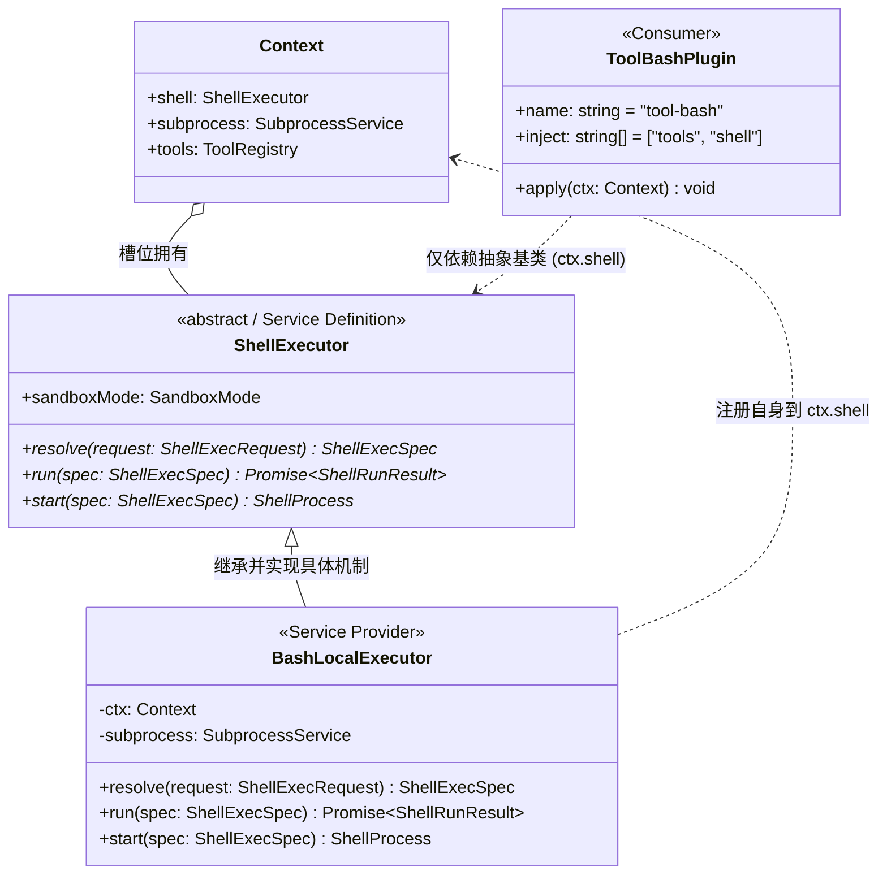
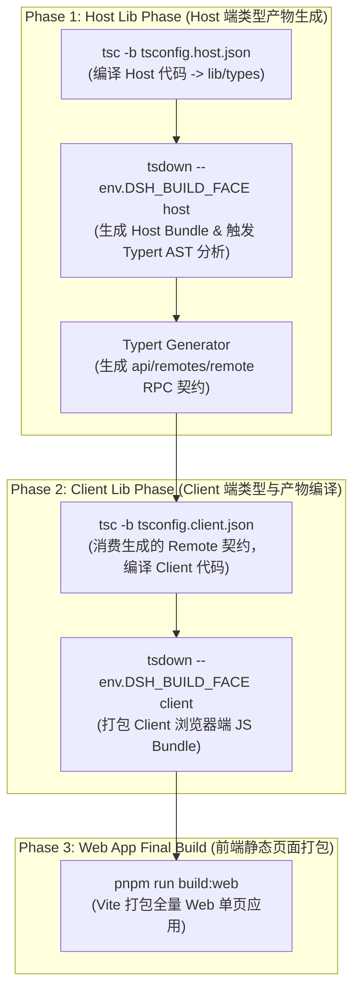

# 第 05 章：Monorepo 与包边界

在大型 AI Agent 系统与生产级 Harness（智能体运行框架）的演进过程中，架构设计面临的核心矛盾在于：**模型认知交互的极端易变性**与**底层系统基础设施的极端稳定性**之间的剧烈冲突。如果将大语言模型（LLM）的 Prompt 组装、Tool Schema 暴露、操作系统进程树治理、文件系统沙箱、状态事件溯源（Event Sourcing）以及 Web 交互界面全部揉杂在一个单体工程中，任何细微的业务提示词调整或工具协议变动，都可能引发系统底层的连带故障。

本章将从现代系统工程的视角，深度解构 DeepSeek Harness 的 Monorepo 拓扑架构与包边界（Package Boundaries）划分哲学。我们将揭示如何借助 **Cordis 依赖注入内核**、**Service Definition / Service Provider / Consumer 三元解耦设计模式**、**TypeScript 双端面（Host / Client）物理隔离构建流水线** 以及 **声明式 Bundle 装配层**，构建出一套高内聚、低耦合、强类型安全且支持无缝热插拔的工业级 Agent 系统骨架。

---

## 5.1 宏观架构心智模型：从系统编程看 Monorepo 边界

为了彻底摆脱空洞的流行语，我们将 DeepSeek Harness 的 Monorepo 架构映射为经典系统级软件工程的核心概念：

```mermaid
flowchart TB
    subgraph "Application Assembly Layer (应用装配面)"
        BundleHeadless["@deepseek-ai/dsh-headless<br/>(CLI 单次执行智能体)"]
        BundleWebApp["@deepseek-ai/dsh-web-app<br/>(全功能 Web GUI 服务)"]
        BundleACP["@deepseek-ai/dsh-acp<br/>(自动化 ACP 服务器)"]
    end

    subgraph "Consumer Plane (面向模型/用户的消费面)"
        ToolBash["@deepseek-ai/dsh-tool-bash<br/>(面向模型的 Bash 工具)"]
        ToolFS["@deepseek-ai/dsh-tool-fs<br/>(面向模型的文件工具)"]
        AgentLoop["@deepseek-ai/dsh-agent-loop<br/>(状态机驱动循环)"]
        ClientUI["@deepseek-ai/dsh-client-*<br/>(Web 响应式组件树)"]
    end

    subgraph "Service Definition Plane (能力契约面 - VFS 抽象)"
        SvcShell["ctx.shell<br/>(ShellExecutor 抽象基类)"]
        SvcFS["ctx.fs<br/>(FilesystemProvider 抽象基类)"]
        SvcLLM["ctx.llm<br/>(LLMAdapterRegistry 服务)"]
        SvcSubprocess["ctx.subprocess<br/>(SubprocessService 抽象基类)"]
        SvcSession["ctx.sessions<br/>(SessionStore 状态总线)"]
    end

    subgraph "Service Provider Plane (底层机制实现面)"
        BashLocal["@deepseek-ai/dsh-bash-local<br/>(本地进程组 + 管道)"]
        BashSandbox["@deepseek-ai/dsh-bash-sandbox<br/>(Landlock/Seatbelt 隔离)"]
        FSLocal["@deepseek-ai/dsh-fs-local<br/>(Node fs 物理落盘)"]
        LLMDeepSeek["@deepseek-ai/dsh-llm-deepseek<br/>(DeepSeek API 协议驱动)"]
        SubprocessLocal["@deepseek-ai/dsh-subprocess-local<br/>(操作系统 Spawn/Kill 治理)"]
    end

    BundleHeadless --> ToolBash
    BundleHeadless --> AgentLoop
    BundleWebApp --> ClientUI
    BundleWebApp --> AgentLoop

    ToolBash --> SvcShell
    ToolFS --> SvcFS
    AgentLoop --> SvcLLM
    AgentLoop --> SvcSession

    BashLocal -. "实现注册" .-> SvcShell
    BashSandbox -. "实现注册" .-> SvcShell
    FSLocal -. "实现注册" .-> SvcFS
    LLMDeepSeek -. "实现注册" .-> SvcLLM
    SubprocessLocal -. "实现注册" .-> SvcSubprocess
    BashLocal --> SvcSubprocess
```



### 5.1.1 系统级映射对照表

在系统程序员眼中，Harness 中的每一层都有其精确的计算机系统对标物：

| Harness 概念 | 传统系统编程 / 分布式架构对标 | 核心职责与设计约束 |
|---|---|---|
| **Monorepo Package** | 操作系统动态链接库（`.so` / `.dll`）或独立编译单元 | 具有明确的导出符号（`exports`）、单一职责原则（SRP）、物理文件隔离与严格的依赖树。 |
| **Service Definition** | POSIX 系统调用接口规范 / VFS（虚拟文件系统）抽象类 | 继承 Cordis `Service` 的抽象基类，拥有全局 `ctx.<key>` 槽位，定义不可变的纯虚函数签名与生命周期。 |
| **Service Provider** | 设备驱动程序（Device Driver）/ 文件系统具体实现（ext4/btrfs） | 实现底层系统机制（如本地进程派生、Landlock 沙箱隔离、SQLite 事务读写），向 Service 槽位注册自身。 |
| **Consumer** | 用户态应用程序 / POSIX libc 函数包装器 | 面向大模型提供 Zod Schema 工具定义，或者面向 UI 提供数据订阅。只依赖 Definition，绝不感知具体 Driver。 |
| **Cordis Context** | 微内核中的 Mach 端口注册表 / Spring IoC 依赖注入容器 | 管理单例与作用域生命周期，基于 `ctx.effect()` 实现类似 RAII 的自动化析构与垃圾清理。 |
| **Bundle** | 操作系统发行版装配清单（Linux Distro Image） | 声明式的 `cordis.patch.yml` 配置文件，按业务拓扑将具体的 Provider 与 Consumer 组装为可执行实例。 |

### 5.1.2 为什么大型 Agent Harness 不能是单体脚本？

在许多简易的开源 Agent 原型中，开发者习惯将工具逻辑、系统提示词与执行代码写在同一个文件夹下。当系统接入真实的生产环境时，这种设计会导致灾难性的工程坍塌：

1. **变更速率的不对称性（Rate-of-Change Mismatch）**：面向大模型的提示词（System Prompt）和工具参数（Tool Schema）属于业务层，其调整频率是以天甚至小时计的；而底层的进程组调度器（`subprocess`）、内存溢出转储（`spill`）与事件持久化（`session-persistence`）属于系统级基础设施，要求数月不改且具备 100% 的单元测试与并发安全性。物理分包强迫架构师在不同变动周期的代码之间设立不可逾越的防御墙。
2. **多执行环境与声明冲突（Multi-Runtime Isolation）**：Harness 同时包含 Node.js 宿主进程（Host）、浏览器渲染端（Client Web）、Worker 线程隔离沙箱（Code Runtime）以及外部进程（Subprocess）。如果共享同一个类型上下文，TypeScript 的全局接口声明合并（Declaration Merging）将导致 `Context` 上的服务类型发生灾难性碰撞（Collision）。
3. **确定性无密钥可回放测试（Keyless Snapshot Testing）**：上层 Agent 状态机测试必须能够在毫秒级内无网络、无大模型 API 密钥地快速回放。物理包边界允许我们在测试时直接将 `ctx.llm` 替换为静态的 `llm-replay` Provider，而无需对上层 `agent-loop` 进行任何侵入式修改。

---

## 5.2 核心包组（Package Groups）职责全景拆解

DeepSeek Harness 在 `packages/` 目录下按业务领域划分了 21 个核心包组。每个包组遵循统一的命名规范：目录为 `packages/<group>/<pkg>/`，npm 包名为 `@deepseek-ai/dsh-<pkg>`（Host/Client 组件则显式带上端面前缀）。

```
packages/
├── core/             # 产品 API 核心脊梁：Agent、Session 实体、Tool 管道与状态机驱动
├── llm/              # LLM 抽象 Seam、模型适配器（DeepSeek/Pi）、重试与 Token 计量
├── fs/               # 文件系统 Seam、物理/沙箱实现与面向模型的文件编辑工具
├── shell/            # 命令行执行 Seam、本地/沙箱 Bash/Pwsh 执行器与面向模型的工具
├── subprocess/       # 底层进程树治理、I/O 截断、SIGTERM 升级为 SIGKILL 的生命周期管理
├── sandbox/          # 操作系统级内核沙箱（Landlock/bwrap/Seatbelt）抽象与安全策略
├── web/              # Web 检索/抓取 Seam、搜索引擎适配器（DeepSeek/Exa/Perplexity）
├── session/          # 会话数据持久化（JSONL/SQLite）、投影折叠（Projection）与遥测
├── storage/          # 非会话通用持久化 Hub、SQLite/JSON KV 存储与领域数据形态
├── subagent/         # 多 Agent 委派 Seam、进程内/外派生（Fork/Spawn）与延续控制
├── jobs/             # 通用后台异步长任务运行时、异步句柄分配与任务治理工具
├── workflow/         # 结构化任务工作流引擎、Worker Thread 隔离与 Ralph 验证工具
├── graph/            # 生产级可持久化多 Agent DAG 任务网、分布式调度与 LoopX 协同
├── host/             # Web GUI 宿主端 BFF 网关、静态资产分发与本地目录选择器
├── client/           # Web GUI 浏览器端响应式状态、UI 插件体系与 Slot 插槽装配
├── api/              # RPC 协议网关（Gateway）与跨端双向通信 Remote 契约（Remotes）
├── typert/           # 运行时类型反射图生成器、Schema 校验与 RPC 桩代码编译
├── bundle/           # 顶级交付形态装配包（base, headless, web-app 等）
├── preset/           # 预设 Agent 配置文件发现与按会话动态挂载
├── boot/             # CLI 命令行入口组装、参数解析与 Cordis 容器启动胶水
└── sdk/              # 进程外通信协议与 TypeScript/JSON-RPC SDK 运行时
```

下面我们将对这 21 个核心包组逐一展开极度详尽的底层职责解构：

### 5.2.1 `core/`：产品 API 核心脊梁

`core/` 是整个 Harness 的心脏，它不依赖任何具体的外部硬件或厂商驱动，仅定义了 Agent 运行时的核心实体与数据流向：

- **`agent` (`@deepseek-ai/dsh-agent`)**：定义了 `Agent` 实体与其运行时服务 `ctx.agents`。负责管理当前活跃的 Agent 实例句柄、父子级联树形关系、发起方作用域（Initiator Scope）传播以及上下文生命周期的创建与销毁。
- **`agent-loop` (`@deepseek-ai/dsh-agent-loop`)**：唯一的具体 Agent 状态机驱动循环。它从 `Inbox` 消费消息，编排 Turn（轮次）与 Step（迭代），调用 `ctx.llm` 请求大模型，解析 Tool Call AST，并通过 `ctx.tools` 管道执行副作用。
- **`session` (`@deepseek-ai/dsh-session`)**：定义了会话实体与内存态状态总线 `ctx.sessions`。拥有仅追加（Append-Only）的事实事件账本（`SessionEvent`），对外广播事件流，是事件溯源（Event Sourcing）的内存中枢。
- **`tools` (`@deepseek-ai/dsh-tools`)**：工具管道注册中心 `ctx.tools`。负责维护全局工具注册表，并在工具执行前后提供严格的管道守卫：`tools/pre-execute`（权限校验与参数拦截）、`tools/execute`（超时与并发控制）、`tools/post-execute`（结果溢出截断与脱敏）以及 `tools/observed`（写入审计日志）。
- **`system-prompt` (`@deepseek-ai/dsh-system-prompt`)**：系统提示词装配中心 `ctx.systemPrompt`。按优先级收集各插件注册的提示词片段（静态前缀、工作区指令、时间上下文、动态状态后缀），保证 Prompt 文本具有最高的前缀稳定性以最大化大模型 KV Cache 命中率。
- **`scope` (`@deepseek-ai/dsh-scope`)**：维护 Agent 会话作用域内的私有状态，防止并发 Agent 之间的数据污染。
- **`agent-default-model` (`@deepseek-ai/dsh-agent-default-model`)**：管理会话初始化的默认模型选择策略，支持通过用户设置（Settings）进行层叠覆盖。
- **`agent-tool-presentation` (`@deepseek-ai/dsh-agent-tool-presentation`)**：定义工具执行在前端渲染时的纯函数展示投影（Presenter）。

### 5.2.2 `llm/`：大语言模型抽象与适配器家族

`llm/` 包组负责将非确定性的大模型 HTTP/SSE 协议转换为强类型的流式数据事件：

- **`llm` (`@deepseek-ai/dsh-llm`)**：Service Definition 包，拥有 `ctx.llm` 注册表。定义了通用的 `LLMAdapter` 抽象契约、消息结构体（`LLMMessage`）、流式分块（`LLMChunk`）与错误类型（`HarnessError`）。
- **`llm-deepseek` (`@deepseek-ai/dsh-llm-deepseek`)**：DeepSeek 官方 API 专用适配器 Provider。支持 DeepSeek-V3 / R1 模型的全功能特性，包括 Reasoning 思考流输出解析（`<think>...</think>`）、上下文缓存指示与原生 Function Calling 协议。
- **`llm-pi-ai` (`@deepseek-ai/dsh-llm-pi-ai`)**：第三方通用多模型统一适配器 Provider。
- **`llm-retry` (`@deepseek-ai/dsh-llm-retry`)**：模型请求故障容错插件。拦截网络抖动、429 速率限制、503 宕机与 JSON 解析异常，执行指数退避（Exponential Backoff with Jitter）重试。
- **`token-meter` (`@deepseek-ai/dsh-token-meter`)**：Token 消耗精确计量服务 `ctx.tokenMeter`。按会话隔离追踪 Input/Output/Cached Token 数量，为上下文压缩策略提供实时水位数据。

### 5.2.3 `fs/`：文件系统 Seam、沙箱化读写与面向模型工具

- **`fs` (`@deepseek-ai/dsh-fs`)**：Service Definition 包，拥有 `ctx.fs`。定义了 `FilesystemProvider` 抽象接口（`readFile`, `writeFile`, `mkdir`, `stat`, `unlink` 等）。
- **`fs-local` (`@deepseek-ai/dsh-fs-local`)**：基于 Node.js 物理文件系统的本地 Provider 实现。
- **`fs-sandbox` (`@deepseek-ai/dsh-fs-sandbox`)**：沙箱化文件系统 Provider。拦截所有路径访问，将其严格限制在工作区根目录（Workspace Root）内，防御 `../` 路径穿越与符号链接劫持攻击。
- **`fs-observation-policy` (`@deepseek-ai/dsh-fs-observation-policy`)**：通过文件操作事件门禁，贡献基于观测状态的完整性检查。
- **`tool-fs` (`@deepseek-ai/dsh-tool-fs`)**：面向大模型的 Consumer 工具插件。向 `ctx.tools` 注册 `read_file`、`write_to_file` 等标准模型工具。
- **`tool-fs-search` (`@deepseek-ai/dsh-tool-fs-search`)**：面向大模型的物理文件检索工具（基于文件名 glob 与内容 regex）。
- **`tool-str-replace-editor` (`@deepseek-ai/dsh-tool-str-replace-editor`)**：面向大模型的精确行/块字符串替换工具（`replace_file_content`），要求入参提供唯一目标代码块以防止误改。

### 5.2.4 `shell/`：跨平台命令行执行、环境注入与工具暴露

- **`shell` (`@deepseek-ai/dsh-shell`)**：Service Definition 包，拥有 `ctx.shell`。定义了 `ShellExecutor` 抽象基类及前台命令 `run()` 与后台进程 `start()` 的契约。
- **`bash-local` (`@deepseek-ai/dsh-bash-local`)**：POSIX Bash 本地执行器 Provider。基于 `ctx.subprocess` 创建独立进程组，接管超时升级杀进程与标准输出合并。
- **`bash-sandbox` (`@deepseek-ai/dsh-bash-sandbox`)**：结合 `ctx.sandbox` 的安全 Bash 执行器 Provider。
- **`pwsh-local` / `pwsh-sandbox`**：面向 Windows 平台的 PowerShell 执行器 Provider 体系。
- **`shell-env` (`@deepseek-ai/dsh-shell-env`)**：受生命周期保护的环境变量注册服务 `ctx.shellEnv`。插件可声明限定于当前 Effect 作用域的 `DSH_*` 事实，每次执行时为子进程组装干净且不可篡改的环境变量集合。
- **`tool-bash` / `tool-pwsh`**：面向模型的 Consumer 工具。注册 `bash` / `pwsh` 工具，支持 `run_in_background` 参数并将后台句柄托管给 `ctx.jobs`。

### 5.2.5 `subprocess/`：底层进程树治理与生命周期

- **`subprocess` (`@deepseek-ai/dsh-subprocess`)**：Service Definition 包，拥有 `ctx.subprocess`。抽象了子进程创建、I/O 流接管与进程组终止接口。
- **`subprocess-local` (`@deepseek-ai/dsh-subprocess-local`)**：本地进程治理 Provider。解决多进程编程中最棘手的"孤儿进程与僵尸进程"问题：
  - 在 Linux/macOS 上通过 `setsid()` 创建独立进程组（Process Group），终止时使用 `kill(-pid, SIGTERM)` 向整个进程树发信号；
  - 严格实现 **SIGTERM $\to$ 宽限期（Grace Period，如 3000ms） $\to$ SIGKILL** 的优雅终止升级梯队；
  - 捕获 `stdout` / `stderr` 流，并在超出内存阈值时自动通过内存管道将数据转储至临时 Spill 文件，防止 Node.js Buffer 发生 OOM。

### 5.2.6 `sandbox/`：操作系统级进程隔离契约与策略中心

- **`sandbox` (`@deepseek-ai/dsh-sandbox`)**：Service Definition 包，拥有 `ctx.sandbox`。定义了操作系统级沙箱包装器的抽象签名。
- **`sandbox-local` (`@deepseek-ai/dsh-sandbox-local`)**：本地沙箱 Provider。根据宿主操作系统自动协商最佳隔离机制：
  - Linux：优先通过 Node-Addon 调用内核原生 **Landlock LSM**，降级方案使用 `bwrap`（Bubblewrap）；
  - macOS：通过 `sandbox-exec` 配合编译出的 **Seatbelt** Profile 限制文件系统写权限；
  - Windows：使用受限令牌（Restricted Token）与作业对象（Job Object）。
- **`sandbox-policy` (`@deepseek-ai/dsh-sandbox-policy`)**：统一安全策略管理服务 `ctx.sandboxPolicy`。集中管理全局沙箱模式（`read-only`, `workspace-write`, `danger-full-access`）与白名单路径。

### 5.2.7 `web/`：Web 检索与网页抓取抽象

- **`web` (`@deepseek-ai/dsh-web`)**：Service Definition 包，拥有 `ctx.web`。定义了统一的互联网搜索（`search`）与页面正文抓取（`fetch`）接口规范。
- **`web-search-deepseek` / `web-search-exa` / `web-search-perplexity`**：各搜索引擎的 Provider 实现包。
- **`web-fetch-http` (`@deepseek-ai/dsh-web-fetch-http`)**：基于 HTTP 协议的页面正文抓取与 HTML 转 Markdown 清洗 Provider。
- **`tool-web` (`@deepseek-ai/dsh-tool-web`)**：面向模型的 Consumer 工具。注册 `search_web` 与 `read_url_content` 工具。

### 5.2.8 `session/`：事实账本、事件溯源、持久化与投影缓存

- **`session-persistence` (`@deepseek-ai/dsh-session-persistence`)**：Service Definition 包，拥有 `ctx.sessionPersistence`。定义会话事件流的持久化存储契约。
- **`session-persistence-jsonl`**：基于单文件 JSONL（单行追加）的轻量级持久化 Provider。
- **`session-persistence-sqlite`**：基于 SQLite WAL 模式的高性能持久化 Provider，支持事务 ACID 保证与毫秒级索引。
- **`session-projection` (`@deepseek-ai/dsh-session-projection`)**：事件溯源投影服务 `ctx.sessionProjections`。允许各领域插件注册自己的 Fold（折叠）函数，从原始事件流中按需动态重放并计算出业务状态（如当前 Todo 列表、生成的代码文件清单）。
- **`session-projection-cache` (`@deepseek-ai/dsh-session-projection-cache`)**：投影快照缓存服务。维护折叠状态的水位线（Watermark Checkpoint），实现冷启动加速：恢复状态时只需加载最近的 Checkpoint + 回放尾部增量事件，杜绝全日志扫描。
- **`session-title`**：会话标题自动生成 Seam 与异步模型总结 Provider。
- **`session-telemetry-otel`**：基于 OpenTelemetry 标准的会话链路指标与分布式 Tracing 导出 Provider。

### 5.2.9 `storage/`：非会话通用存储 Hub 与领域形态驱动

- **`storage` (`@deepseek-ai/dsh-storage`)**：通用存储 Hub 服务 `ctx.storage`。
- **`storage-json` / `storage-sqlite`**：底层物理存储后端 Provider。
- **`storage-domain` (`@deepseek-ai/dsh-storage-domain`)**：领域形态服务 `ctx.storageDomain`。它在底层不透明的 KV 原语之上，为业务插件（如工作区元数据、消息反馈记录）提供强类型的 CRUD 与带版本的持久化操作。

### 5.2.10 `subagent/`：多 Agent 委派与延续控制

- **`subagent` (`@deepseek-ai/dsh-subagent`)**：Service Definition 包，拥有 `ctx.subagents`。定义子智能体创建、消息中继与生命周期编排契约。
- **`subagent-spawn-in-process` / `subagent-fork-in-process`**：进程内轻量级子 Agent Provider，分别支持全新上下文派生与共享内存上下文分叉。
- **`subagent-acp` / `subagent-codex` / `subagent-claude-code`**：外部标准协议 Subagent 适配器 Provider。
- **`subagent-dsh-sdk`**：通过 Harness SDK 跨进程调用独立运行的 Agent 实例。
- **`tool-subagent` / `tool-subagent-control` / `tool-subagent-report`**：面向模型的委派、长任务轮询与汇总工具。

### 5.2.11 `jobs/`：通用后台任务运行时

- **`jobs` (`@deepseek-ai/dsh-jobs`)**：Service Definition 包，拥有 `ctx.jobs`。定义后台长任务的数据结构（`JobRecord`）、状态机（`running`, `completed`, `failed`, `killed`）与注册管理接口。
- **`jobs-local` (`@deepseek-ai/dsh-jobs-local`)**：进程本地后台任务管理器 Provider。
- **`tool-jobs` (`@deepseek-ai/dsh-tool-jobs`)**：面向模型的 Consumer 控制工具，向大模型提供 `job_status`, `job_kill`, `job_list`, `job_read` 等管理能力。

### 5.2.12 `workflow/`：结构化工作流引擎与 Worker Thread 脚本隔离

- **`workflow` (`@deepseek-ai/dsh-workflow`)**：Service Definition 包，拥有 `ctx.workflowEngine`。
- **`workflow-worker-thread` (`@deepseek-ai/dsh-workflow-worker-thread`)**：基于 Node.js `worker_threads` 的隔离执行引擎 Provider。在大模型生成的工作流脚本与主进程之间建立内存防火墙，防止死循环阻塞主事件循环。
- **`tool-workflow` / `tool-ralph`**：面向模型的工作流运行与单轮迭代自我修正（Ralph Loop）工具。

### 5.2.13 `graph/`：多 Agent DAG 任务网与分布式调度

- **`graph` / `graph-mode`**：有向无环图（DAG）主控状态机，支持复杂工程任务的拓扑排序、节点并行分派与依赖等待。
- **`graph-coordination` / `graph-coordination-loopx`**：分布式协调 Seam 与 LoopX 外部协同服务 Provider。
- **`graph-artifacts` / `graph-artifacts-fs`**：节点产物传输与基于内容寻址（CAS）的跨节点数据传递 Seam。
- **`graph-worker` / `graph-worker-local` / `graph-worker-remote`**：带分布式围栏令牌（Fencing Token）的工作节点执行器。
- **`graph-resources` / `graph-resources-sqlite`**：模型并发与显存资源配额预留服务。
- **`graph-scheduler` / `graph-scheduler-sqlite`**：整图执行租约（Lease）与单调递增令牌锁调度器。

### 5.2.14 `host/`：Web GUI 宿主端 BFF 网关与 HTTP 路由

- **`host-webserver` (`@deepseek-ai/dsh-host-webserver`)**：基于 `node:http` 的 HTTP 路由注册服务 `ctx.webServer`。
- **`host-apiproxy` (`@deepseek-ai/dsh-host-apiproxy`)**：BFF 网关适配器，负责将 Host 端的 Cordis 事件流桥接为 SSE，并将 Client 端的 HTTP 请求转换为内部服务调用。
- **`host-frontend-static`**：生产环境下托管打包后的 React 前端静态单页应用（SPA）。
- **`host-directory-picker-*`**：本地操作系统原生文件对话框或 Web 模拟目录选择器。

### 5.2.15 `client/`：Web GUI 浏览器端响应式状态与 UI 插件

- **`client/connection`**：浏览器端 WebSocket / SSE 通信链路管理。
- **`client/runtime`**：浏览器端独立的 Cordis 容器与全局状态树。
- **`client/ui-layout` / `ui-conversation` / `ui-tool` / `ui-settings-*`**：细粒度 React UI 插件包，通过 `ui-slots` 插槽系统动态组合成完整的 Web GUI 界面。

### 5.2.16 `api/`：RPC 协议网关与 Remote 契约

- **`api/gateway` (`@deepseek-ai/dsh-api-gateway`)**：Host 端的 Typert 调用网关，拥有 `ctx.typertGateway`，将前端 RPC 报文映射到具体 Cordis 服务的 `@Remote` 方法上。
- **`api/remotes` (`@deepseek-ai/dsh-api-remotes`)**：存放由构建系统自动生成的 Host-to-Client 跨端强类型 RPC 契约定义。

### 5.2.17 `typert/`：类型图生成器与运行时反射

- **`typert/registry`**：运行时类型注册表 `ctx.typert`。
- **`typert/generator`**：在编译阶段遍历 TypeScript AST，自动提取标有 `@Remote` 装饰器的服务方法，生成 Zod Schema 校验器与 Client 端的类型安全代理。
- **`typert/loader`**：动态加载并校验 RPC 传输 payload。

### 5.2.18 `bundle/`：顶级交付形态装配包

- **`bundle/base` (`@deepseek-ai/dsh-base`)**：所有运行形态共享的基础能力补丁层。
- **`bundle/headless` (`@deepseek-ai/dsh-headless`)**：用于终端命令行一键执行的无头 Agent 交付形态。
- **`bundle/web-app` (`@deepseek-ai/dsh-web-app`)**：包含完整 Web GUI 与 Host 服务的浏览器交付形态。

### 5.2.19 `preset/`：预设 Agent 配置挂载

- **`preset/agent-presets` (`@deepseek-ai/dsh-agent-presets`)**：扫描并在创建会话时将预设的 `cordis.yml` 动态挂载到会话的 Agent 作用域之下。

### 5.2.20 `boot/`：应用引导胶水与命令行组装

- **`boot/cmdline` (`@deepseek-ai/dsh-cmdline`)**：基于 Commander.js 组装通用的 CLI 选项（如 `--profile`, `--verbose`, `--port`）。
- **`boot/app-boot` (`@deepseek-ai/dsh-app-boot`)**：负责解析配置文件、创建根 Cordis Context 并启动 Loader。

### 5.2.21 `sdk/`：进程外协议与多语言 SDK

- **`sdk/protocol`**：定义 Harness 进程外通信的 JSON-RPC 2.0 协议规范与数据载荷结构。
- **`sdk/client`**：供外部 Node.js 应用程序调用的轻量级 TypeScript 客户端 SDK。
- **`sdk/server`**：在 Harness 内部开启标准 JSON-RPC 服务器的服务插件。

---

## 5.3 核心设计模式：Service Definition / Provider / Consumer 三元组

DeepSeek Harness 最具工程美感的架构基石，是其严格贯彻的 **Service Definition（能力定义）**、**Service Provider（能力提供方）** 与 **Consumer（能力消费方）** 经典三元设计模式。



### 5.3.1 为什么必须是抽象类而非 TypeScript Interface？

传统 Java/C# 开发者常常习惯使用 `interface IShellExecutor` 来定义契约。但在现代 TypeScript + Cordis 运行时中，**纯 Interface 会在编译后被完全擦除（Type Erasure），无法在 JavaScript 运行时留下任何痕迹**。

Cordis 依赖注入引擎要求服务必须具备以下运行时物理特性：
1. **全局唯一符号与原型链**：服务类继承自 `Service`，在构造函数执行 `super(ctx, 'shell')` 时，Cordis 会在全局注册表中打桩，并建立生命周期监听。
2. **重复注册冲突防御**：若有两个 Provider 试图同时挂载到 `ctx.shell`，Cordis 运行时能通过构造函数立即抛出精确的致命异常（Duplicate Service Conflict），防止静默覆盖导致的不可预期行为。
3. **析构与生命周期钩子**：抽象类可以拥有通用的生命周期方法（如 `stop()`），当插件被卸载或热重载（HMR）时，Cordis 会自动触发析构，确保后台进程与文件描述符被安全释放。

### 5.3.2 完整三元模式 TypeScript 源码示范

下面以系统的核心 Seam —— `shell` 族系为例，展示三者在源码层面如何做到极致的解耦与依赖倒置。

#### 1. Service Definition 面：`packages/shell/shell/src/index.ts`

```typescript
/**
 * @file packages/shell/shell/src/index.ts
 * @description Service Definition：仅定义抽象契约与词汇表，零具体执行逻辑
 */
import { Context, Service } from '@deepseek-ai/cordis'

// 1. 声明合并：告知 TypeScript 编译器 Context 上挂载了 shell 属性
declare module '@deepseek-ai/cordis' {
  interface Context {
    shell: ShellExecutor
  }
}

export interface ShellExecRequest {
  readonly command: string
  readonly cwd?: string
  readonly env?: Readonly<Record<string, string>>
  readonly timeoutMs?: number
  readonly signal?: AbortSignal
}

export interface ShellExecSpec extends ShellExecRequest {
  readonly cwd: string
  readonly timeoutMs: number
  readonly resolvedEnv: Readonly<Record<string, string>>
}

export interface ShellRunResult {
  readonly exitCode: number | null
  readonly signal: NodeJS.Signals | null
  readonly stdout: string
  readonly stderr: string
  readonly durationMs: number
  readonly timedOut: boolean
  readonly aborted: boolean
}

export interface ShellProcess {
  readonly pid: number
  readonly done: Promise<ShellRunResult>
  kill(signal?: NodeJS.Signals): Promise<void>
  readOutput(): Promise<{ stdoutChunk: string; stderrChunk: string }>
}

/**
 * 核心抽象基类：所有 Shell 机制实现必须继承此契约
 */
export abstract class ShellExecutor extends Service {
  constructor(ctx: Context) {
    // 将自身绑定到 Cordis Context 的 'shell' 属性槽位上
    super(ctx, 'shell', true)
  }

  /** 入参归一化与防御性约束补全 */
  abstract resolve(request: ShellExecRequest): ShellExecSpec

  /** 前台同步阻塞式运行，直至退出或超时 */
  abstract run(spec: ShellExecSpec): Promise<ShellRunResult>

  /** 后台异步非阻塞启动，立即返回进程控制句柄 */
  abstract start(spec: ShellExecSpec): ShellProcess
}

export default ShellExecutor
```

#### 2. Service Provider 面：`packages/shell/bash-local/src/index.ts`

```typescript
/**
 * @file packages/shell/bash-local/src/index.ts
 * @description Service Provider：具体实现本地 Bash 进程组派生与管道治理
 */
import { Context } from '@deepseek-ai/cordis'
import { ShellExecutor, type ShellExecRequest, type ShellExecSpec, type ShellProcess, type ShellRunResult } from '@deepseek-ai/dsh-shell'
import type { SubprocessService } from '@deepseek-ai/dsh-subprocess'

export interface LocalBashConfig {
  readonly defaultTimeoutMs?: number
  readonly maxOutputBytes?: number
  readonly graceKillTimeoutMs?: number
}

export class BashLocalExecutor extends ShellExecutor {
  // 声明该 Provider 强依赖 subprocess 底层进程服务
  static readonly inject = ['subprocess']

  private readonly defaultTimeoutMs: number
  private readonly maxOutputBytes: number
  private readonly graceKillTimeoutMs: number

  constructor(ctx: Context, config: LocalBashConfig = {}) {
    super(ctx)
    this.defaultTimeoutMs = config.defaultTimeoutMs ?? 30_000
    this.maxOutputBytes = config.maxOutputBytes ?? 10 * 1024 * 1024 // 10MB 内存阈值
    this.graceKillTimeoutMs = config.graceKillTimeoutMs ?? 3_000 // 3秒优雅退出宽限
  }

  override resolve(request: ShellExecRequest): ShellExecSpec {
    return {
      command: request.command,
      cwd: request.cwd ?? process.cwd(),
      timeoutMs: Math.max(100, Math.min(request.timeoutMs ?? this.defaultTimeoutMs, 600_000)),
      env: request.env ?? {},
      resolvedEnv: {
        ...process.env,
        ...request.env,
        NO_COLOR: '1',
        TERM: 'dumb',
        PAGER: 'cat',
      },
      signal: request.signal,
    }
  }

  override async run(spec: ShellExecSpec): Promise<ShellRunResult> {
    const startTime = Date.now()
    const subprocessService = this.ctx.get('subprocess') as SubprocessService
    if (!subprocessService) {
      throw new Error('[BashLocalExecutor] 关键依赖 ctx.subprocess 缺失')
    }

    // 1. 通过 subprocess 服务派生独立的进程组 (Process Group)
    const procHandle = await subprocessService.spawn({
      file: '/bin/bash',
      args: ['-c', spec.command],
      cwd: spec.cwd,
      env: spec.resolvedEnv,
      detached: true, // 独立进程组以支持 group kill
    })

    let timedOut = false
    let aborted = false
    let timer: NodeJS.Timeout | null = null

    // 2. 超时防御逻辑
    const timeoutPromise = new Promise<void>((resolve) => {
      timer = setTimeout(() => {
        timedOut = true
        resolve()
      }, spec.timeoutMs)
    })

    // 3. 取消信号监听
    const abortPromise = new Promise<void>((resolve) => {
      if (spec.signal?.aborted) {
        aborted = true
        resolve()
      } else {
        spec.signal?.addEventListener('abort', () => {
          aborted = true
          resolve()
        }, { once: true })
      }
    })

    try {
      const outcome = await Promise.race([
        procHandle.exited,
        timeoutPromise.then(() => 'TIMEOUT' as const),
        abortPromise.then(() => 'ABORTED' as const),
      ])

      if (outcome === 'TIMEOUT' || outcome === 'ABORTED') {
        // 优雅终止升级：SIGTERM -> 宽限等待 -> SIGKILL
        await this.terminateProcessTree(procHandle, this.graceKillTimeoutMs)
      }

      const finalExit = await procHandle.exited
      const output = await procHandle.readAll(this.maxOutputBytes)

      return {
        exitCode: finalExit.exitCode,
        signal: finalExit.signal,
        stdout: output.stdout,
        stderr: output.stderr,
        durationMs: Date.now() - startTime,
        timedOut,
        aborted,
      }
    } finally {
      if (timer) clearTimeout(timer)
    }
  }

  override start(spec: ShellExecSpec): ShellProcess {
    // 后台长进程实现：立即返回封装好的句柄
    const subprocessService = this.ctx.get('subprocess') as SubprocessService
    const procHandle = subprocessService.spawnSyncHandle({
      file: '/bin/bash',
      args: ['-c', spec.command],
      cwd: spec.cwd,
      env: spec.resolvedEnv,
      detached: true,
    })

    return {
      pid: procHandle.pid,
      done: procHandle.exited.then(async (exit) => {
        const out = await procHandle.readAll(this.maxOutputBytes)
        return {
          exitCode: exit.exitCode,
          signal: exit.signal,
          stdout: out.stdout,
          stderr: out.stderr,
          durationMs: 0,
          timedOut: false,
          aborted: false,
        }
      }),
      kill: async (sig = 'SIGTERM') => {
        await procHandle.killGroup(sig)
      },
      readOutput: async () => {
        return procHandle.readChunk()
      },
    }
  }

  private async terminateProcessTree(handle: { killGroup(sig: NodeJS.Signals): Promise<void>; exited: Promise<unknown> }, graceMs: number): Promise<void> {
    await handle.killGroup('SIGTERM')
    const graceTimer = new Promise<boolean>((res) => setTimeout(() => res(false), graceMs))
    const exitOk = await Promise.race([handle.exited.then(() => true), graceTimer])
    if (!exitOk) {
      // 宽限期已过，强杀进程组
      await handle.killGroup('SIGKILL')
    }
  }
}

export default BashLocalExecutor
```

#### 3. Consumer 面：`packages/shell/tool-bash/src/index.ts`

```typescript
/**
 * @file packages/shell/tool-bash/src/index.ts
 * @description Consumer：面向大模型定义 Tool Schema，依赖 ctx.shell 与 ctx.tools
 */
import { Context } from '@deepseek-ai/cordis'
import { defineTool, type ToolResult } from '@deepseek-ai/dsh-tools'
import type { ShellExecutor } from '@deepseek-ai/dsh-shell'
import type { JobsService } from '@deepseek-ai/dsh-jobs'

export const name = 'tool-bash'
// 声明仅依赖抽象服务名称，完全解耦具体的 bash-local 或 bash-sandbox
export const inject = ['tools', 'shell', 'jobs']

export function apply(ctx: Context): void {
  // 向大模型注册标准工具
  ctx.tools.register(
    defineTool({
      name: 'execute_bash',
      description: '在受控 Shell 环境中执行 Bash 命令。支持前台执行与后台长任务。',
      parameters: {
        type: 'object',
        properties: {
          command: {
            type: 'string',
            description: '待执行的 Bash 脚本命令',
          },
          timeout_ms: {
            type: 'number',
            description: '执行超时时间（毫秒），默认 30000',
          },
          run_in_background: {
            type: 'boolean',
            description: '是否在后台运行长任务（如启动构建服务）',
          },
        },
        required: ['command'],
      },
      execute: async (args: { command: string; timeout_ms?: number; run_in_background?: boolean }, meta): Promise<ToolResult> => {
        const shell = ctx.shell as ShellExecutor
        const spec = shell.resolve({
          command: args.command,
          timeoutMs: args.timeout_ms,
          signal: meta.signal,
        })

        if (args.run_in_background) {
          // 后台任务分支：将进程注册进通用 Jobs 运行时
          const proc = shell.start(spec)
          const jobs = ctx.jobs as JobsService
          const jobId = jobs.registerJob({
            type: 'bash',
            title: `Bash: ${args.command.slice(0, 30)}`,
            handle: proc,
          })

          return {
            content: `命令已转入后台运行。Job ID: [${jobId}]。可调用 job_status 查看输出。`,
            isError: false,
          }
        }

        // 前台同步执行分支
        const result = await shell.run(spec)
        const isError = result.exitCode !== 0 || result.timedOut || result.aborted

        let formattedOutput = ''
        if (result.stdout) formattedOutput += `[stdout]\n${result.stdout}\n`
        if (result.stderr) formattedOutput += `[stderr]\n${result.stderr}\n`
        if (result.timedOut) formattedOutput += `\n[ERROR] 命令执行超时（上限 ${spec.timeoutMs}ms）被强行终止。`
        if (result.aborted) formattedOutput += `\n[ERROR] 命令执行被用户取消。`

        return {
          content: formattedOutput.trim() || `(命令退出，无标准输出，退出码: ${result.exitCode})`,
          isError,
        }
      },
    })
  )
}
```

---

## 5.4 源码面与产物面物理隔离与构建流水线

在大规模 TypeScript Monorepo 中，类型检查速度与跨端类型隔离是决定工程生死的核心指标。DeepSeek Harness 设计了一套极其精密的 **双端面（Host / Client）物理隔离构建流水线**。



### 5.4.1 双端聚合 Program 与 Context 碰撞隔离

在 Cordis 架构中，Host 端服务（如 `ctx.subprocess`、`ctx.fs`、`ctx.sessionPersistence`）与 Client 端服务（如 `ctx.ui`、`ctx.connection`、`ctx.remote`）都会使用 TypeScript 的 `declare module '@deepseek-ai/cordis'` 对全局 `Context` 接口进行声明合并。

如果在一个单一的 `ts.Program` 中同时包含 Host 和 Client 代码，TypeScript 编译器会将所有扩展属性强行合并到同一个 `Context` 接口上。这将产生致命的类型安全灾难：
- Client 代码会误以为自己可以直接访问 Node 原生的 `ctx.fs`，导致开发阶段类型检查通过，但在浏览器运行时抛出 `undefined` 崩溃；
- 同名服务的类型定义发生冲突时，TypeScript 报错信息将扩散至整个仓库。

为了从根源上解决此问题，Harness 制定了严苛的 tsconfig 组织原则：

```
tsconfig.json               # Solution Root：仅包含 references，files 为空，不形成 Program
├── tsconfig.base.json      # 共享 CompilerOptions 与源码面 paths 映射（无 include/files）
├── tsconfig.host.json      # Host 聚合 Program：引用所有 packages/host、core、llm 等后端包
└── tsconfig.client.json    # Client 聚合 Program：引用所有 packages/client、ui-* 等前端包
```

### 5.4.2 源码面（`paths`）与产物面（`exports`）的物理隔离

在 monorepo 内部，存在两套完全不同的模块解析世界：

#### 1. 源码面（Source Plane）
在本地开发、单元测试（Vitest）与热重载场景下，工具链（`tsx`、`vitest`）通过 `tsconfig.base.json` 中的 `paths` 映射，直接跨包定位到源文件：

```json
{
  "compilerOptions": {
    "paths": {
      "@deepseek-ai/dsh-shell": ["./packages/shell/shell/src/index.ts"],
      "@deepseek-ai/dsh-bash-local": ["./packages/shell/bash-local/src/index.ts"],
      "@deepseek-ai/dsh-tool-bash": ["./packages/shell/tool-bash/src/index.ts"],
      "@deepseek-ai/dsh-*": [
        "./packages/core/*/src",
        "./packages/llm/*/src",
        "./packages/shell/*/src",
        "./packages/session/*/src"
      ]
    }
  }
}
```
**优势**：开发者修改了 `packages/shell/shell/src/index.ts` 中的接口，依赖它的 `tool-bash` 无需先执行 `pnpm build` 编译，即可立即在 Vitest 中感知到类型变动，反馈循环缩短至毫秒级。

#### 2. 产物面（Artifact Plane）
当包被打包准备发布或被外部应用引用时，必须经过 `package.json` 的 `exports` 强行收敛，对内部源码目录实行物理隐藏：

```json
{
  "name": "@deepseek-ai/dsh-shell",
  "type": "module",
  "main": "lib/index.js",
  "types": "lib/types/index.d.ts",
  "exports": {
    ".": {
      "types": "./lib/types/index.d.ts",
      "default": "./lib/index.js"
    },
    "./invariant": {
      "types": "./lib/types/invariant.d.ts",
      "default": "./lib/invariant.js"
    },
    "./package.json": "./package.json"
  },
  "files": [
    "lib/index.js",
    "lib/invariant.js",
    "lib/types/**/*.d.ts"
  ]
}
```

```
[外部 Consumer / 产物面]
         │
         ├──> import "@deepseek-ai/dsh-shell" ──> 仅能触达 lib/index.js & lib/types/index.d.ts
         │
         └──x 试图 import "@deepseek-ai/dsh-shell/src/internal.ts" ──> [Node.js ERR_PACKAGE_PATH_NOT_EXPORTED 拦截]
```

CI 门禁中的 `publint` 和 `verify-node-next-types` 会严格扫描所有包的导出声明，严禁任何未在 `exports` 中显式声明的私有子路径泄露。

---

## 5.5 Bundle 包装配定位与声明式 Profile

在 DeepSeek Harness 中，没有任何一个业务插件（Plugin）或服务实现（Provider）拥有自己的 `main()` 启动函数。所有的独立功能包都是平等的、待装配的积木块。

**Bundle（组合包）** 的核心使命，就是充当系统交付形态的"终极装配车间"。

```
                  ┌─────────────────────────────────┐
                  │    @deepseek-ai/dsh-base        │  (基底层：注入会话、持久化、工具管道、LLM)
                  └────────────────┬────────────────┘
                                   │
                ┌──────────────────┴──────────────────┐
                ▼                                     ▼
┌─────────────────────────────────┐ ┌─────────────────────────────────┐
│   @deepseek-ai/dsh-headless     │ │    @deepseek-ai/dsh-web-app     │
│ (CLI Profile 覆盖层：            │ │ (Web Profile 覆盖层：           │
│  - 纯终端 stdio 交互             │ │  - 挂载 HTTP / WebSocket Server│
│  - 启用本地 Worker 代码沙箱)     │ │  - 挂载 API Gateway & Remotes │
│                                 │ │  - 托管 React 前端静态 SingleApp)│
└─────────────────────────────────┘ └─────────────────────────────────┘
```

### 5.5.1 声明式补丁装配机制（`cordis.patch.yml`）

Harness 摒弃了在代码中写死 `ctx.plugin(A); ctx.plugin(B);` 的硬编码方式，全面采用基于 RFC 7396 JSON Merge Patch 语义的声明式 YAML 补丁组合体系。

#### 1. 基底装配包：`packages/bundle/base/cordis.patch.yml`

```yaml
# @deepseek-ai/dsh-base 的基础插件装配列表
~plugins:
  # 1. 核心运行时与会话状态
  "@deepseek-ai/dsh-session": {}
  "@deepseek-ai/dsh-session-persistence-sqlite":
    path: "~/.dsh/sessions.db"
  "@deepseek-ai/dsh-agent": {}
  "@deepseek-ai/dsh-agent-loop": {}

  # 2. 系统提示词与工具管道
  "@deepseek-ai/dsh-system-prompt": {}
  "@deepseek-ai/dsh-tools": {}
  "@deepseek-ai/dsh-tool-call-timeout-policy":
    defaultTimeoutMs: 60000

  # 3. 基础能力 Provider
  "@deepseek-ai/dsh-subprocess-local": {}
  "@deepseek-ai/dsh-bash-local": {}
  "@deepseek-ai/dsh-fs-local": {}
  "@deepseek-ai/dsh-llm-deepseek": {}

  # 4. 面向大模型的常用工具集
  "@deepseek-ai/dsh-tool-bash": {}
  "@deepseek-ai/dsh-tool-fs": {}
  "@deepseek-ai/dsh-tool-todo": {}
```

#### 2. Web 交付装配包：`packages/bundle/web-app/cordis.patch.yml`

```yaml
# @deepseek-ai/dsh-web-app：在 dsh-base 基础之上追加 Web 专属能力
~plugins:
  # 引入基底 Bundle
  "@deepseek-ai/dsh-base": {}

  # 挂载 Web 服务基础设施
  "@deepseek-ai/dsh-host-webserver":
    port: 3000
    host: "127.0.0.1"
  "@deepseek-ai/dsh-api-gateway": {}
  "@deepseek-ai/dsh-host-apiproxy": {}
  "@deepseek-ai/dsh-host-frontend-static": {}

  # 挂载 Web 专属 UI 支撑与多会话图谱
  "@deepseek-ai/dsh-graph-mode": {}
  "@deepseek-ai/dsh-message-feedback": {}
```

当执行命令 `pnpm dsh --profile web-app` 时，Loader 会按依赖拓扑依次加载并合并这些 YAML 补丁，在内存中动态构筑出完整的 Cordis 插件树。

---

## 5.6 生产环境真实故障复盘与排查指南

在大型多包系统的开发与部署中，边界划分不当往往会导致隐蔽且破坏力极强的系统故障。以下汇总了团队在生产实践中踩过的三大经典故障及根因修复方案。

### 5.6.1 故障 1：声明合并冲突（Context Declaration Collision）引发的编译雪崩

```
[TS Error TS2320] Interface 'Context' incorrectly extends interface 'Context'.
  Types of property 'remote' are incompatible.
    Type 'HostRemoteGateway' is not assignable to type 'ClientRemoteProxy'.
```

- **故障复盘**：一名新成员在开发某个兼具 Node 宿主逻辑与前端组件的插件时，在一个普通的 `tsconfig.json` 中同时 `import` 了 `@deepseek-ai/dsh-api-gateway`（Host 端）与 `@deepseek-ai/dsh-api-remotes/client`（Client 端）。两边都在各自的代码中执行了 `declare module '@deepseek-ai/cordis' { interface Context { remote: ... } }`。
- **根因分析**：TypeScript 编译器的声明合并机制是全局生效的。当同一个编译单元（`ts.Program`）同时看到 Host 端与 Client 端的类型合并时，发现同名键 `ctx.remote` 被赋予了两种完全不兼容的类型签名，导致整个 monorepo 的类型检查全线崩溃。
- **排查与修复标准**：
  1. 严禁任何单个包跨越 Host / Client 边界。包必须明确归属于 Host（继承 `tsconfig.base.json`，注册入 `tsconfig.host.json`）或 Client（继承 `tsconfig.base.client.json`，注册入 `tsconfig.client.json`）；
  2. 根目录 `tsconfig.json` 必须保持 `files: []`，仅充当聚合索引，严禁将其作为单个 `Program` 进行全量编译。

### 5.6.2 故障 2：Consumer 越界直连 Provider 导致沙箱穿透与进程孤儿化

- **故障复盘**：在实现某个批量代码重构工具时，开发者直接编写了如下代码：
  ```typescript
  // 错误示范：Consumer 直接 import 具体 Provider
  import { BashLocalExecutor } from '@deepseek-ai/dsh-bash-local'

  export function apply(ctx: Context) {
    const executor = new BashLocalExecutor(ctx)
    executor.run(...)
  }
  ```
  在本地开发测试时一切正常；但当系统部署至生产安全集群（切换为 Docker / Landlock 沙箱 Provider `dsh-bash-sandbox`）时，该工具仍然强行调用宿主机上的 `BashLocalExecutor`，导致危险命令直接穿透沙箱在宿主机物理机上执行！
- **根因分析**：违反了 Seam 依赖倒置原则。Consumer 越过抽象基类直接硬编码依赖了特定的 Service Provider，导致 Cordis 运行时的 Provider 替换机制彻底失效。
- **排查与修复标准**：
  1. 引入 AST 依赖静态扫描门禁（`check-workspace-constraints.ts`），禁止任何 `tool-*` 包在 `package.json` 和源码中引用带有 `-local`、`-sandbox`、`-sqlite` 等 Provider 特征的包名；
  2. Consumer 必须严格通过 `ctx.shell` 获取实例，并在运行时对接口类型进行守卫。

### 5.6.3 故障 3：跨包构建竞态（Typert Remote 契约未落盘）导致 CI 假死

- **故障复盘**：在 CI 并行构建脚本中，`pnpm run build` 偶尔在全新的构建容器中报出 `TS2307: Cannot find module '@deepseek-ai/dsh-api-remotes/remote'` 错误。
- **根因分析**：Client 端的 `api-remotes` 需要消费由 Host 端 Typert 生成器提取出来的 RPC 桩文件。如果构建调度器并行触发 Host 和 Client 的 `tsc` 编译，Client 编译开始时，Host 端的 AST 提取与文件写盘尚未完成，产生分布式文件系统竞态条件。
- **排查与修复标准**： 在根构建流水线中建立确定性的两阶段时序屏障：
  ```sh
  # 步骤 1：先完整执行 Host 编译与 Typert 契约生成
  tsc -b tsconfig.host.json
  tsdown --env.DSH_BUILD_FACE host

  # 步骤 2：立下屏障，确认 api/remotes 已落盘，再执行 Client 编译
  tsc -b tsconfig.client.json
  tsdown --env.DSH_BUILD_FACE client
  pnpm run build:web
  ```

---

## 5.7 课后思考与动手实验

### 5.7.1 课后思考题

1. **图论与循环依赖**：在 Cordis 依赖注入运行时中，如果 Service A 声明 `inject: ['B']`，而 Service B 声明 `inject: ['A']`，Cordis 的 Fiber 挂起机制会发生什么？在 TypeScript 的 Project Reference 拓扑中，这种循环引用会被如何拦截？
2. **抽象基类的内存开销**：为什么我们不给每一个微小的只读函数都定义一个单独的 Service Package？在 Node.js V8 引擎中，加载一个包含 10 个类的 npm 包与加载 1 个大单体包相比，内存与 JIT 预热开销有何异同？

### 5.7.2 动手实验：扩展一个自定义的 `ctx.metrics` 监控能力 Seam

**实验目标**：在 `packages/` 目录下从零搭建一套符合工业级规范的 `metrics` Seam，包含以下三个包：
1. `packages/metrics/metrics`（Service Definition）：定义抽象类 `MetricsCollector`，拥有计数器 `increment(name: string, tags?: Record<string, string>)` 与耗时统计 `timing(name: string, durationMs: number)`。
2. `packages/metrics/metrics-local`（Service Provider）：基于内存滑动窗口维护指标数据，继承 `MetricsCollector` 并注册为 `ctx.metrics`。
3. `packages/metrics/tool-metrics`（Consumer）：向大模型注册 `get_system_metrics` 工具，大模型调用后从 `ctx.metrics` 读取格式化摘要。

**验收标准**：
- 通过 `pnpm run typecheck` 强类型检查，无任何 `any` 标注；
- 在 `packages/metrics/metrics-local/tests` 中编写一个无外部网络依赖的单元测试，模拟 100 次并发计数并断言数据准确性；
- 确保 `tool-metrics` 仅依赖 `packages/metrics/metrics`，绝对不包含对 `metrics-local` 的引用。
