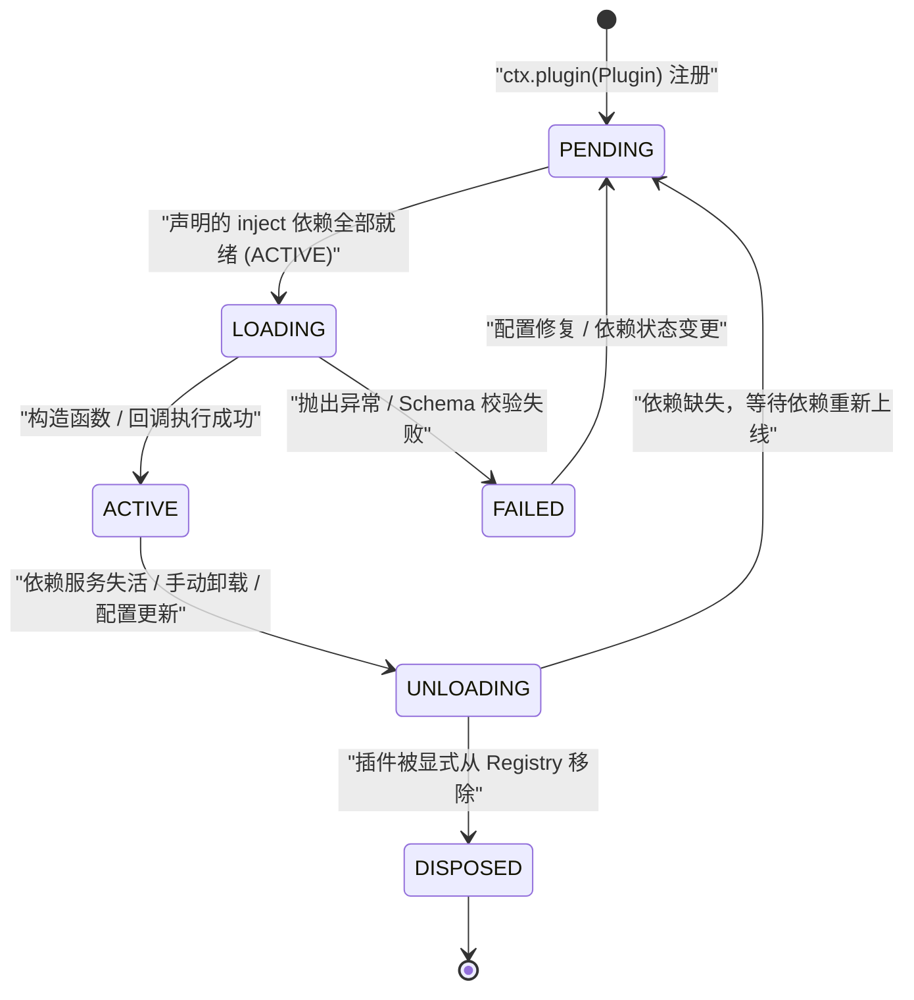
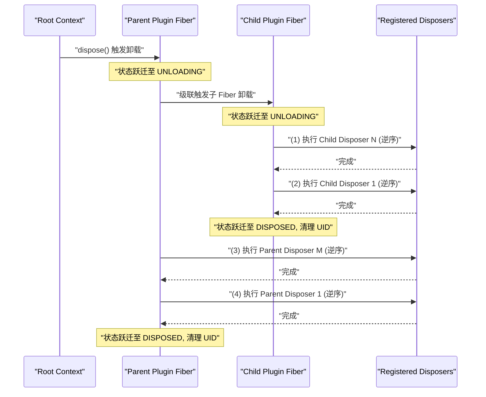
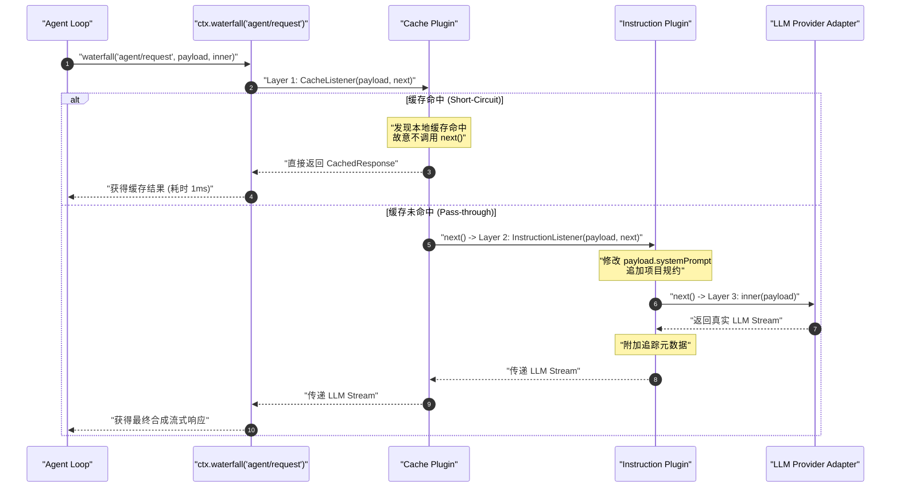

# Chapter 06: Cordis, the Runtime Framework

English | [中文](06-cordis-runtime.zh.md)

This chapter opens the second phase of the DeepSeek Harness technical course. Before examining the agent state-machine loop, prompt assembly, task-graph orchestration, and distributed coordination, we need to understand the microkernel that supports the whole system: **the Cordis runtime**.

Systems engineers familiar with Java, C++, Go, Rust, Python, or modern TypeScript may initially assume that an AI agent harness mainly assembles prompt templates and wraps network requests with Fetch or Axios. A production agent runtime instead faces demanding requirements for dynamism, concurrency, and reliability: hot-swappable model providers; isolated permissions and tools for different task sandboxes; cross-plugin event interception and prompt mutation; leak-free disposal of operating-system processes and asynchronous handles; and service inheritance with hierarchical isolation when spawning multiple agents.

Cordis is a **lightweight inversion-of-control (IoC) and event microkernel framework** designed for this level of dynamic extensibility. This chapter examines its internals through memory layout, proxy interception, prototype inheritance, finite-state machines, LIFO disposal stacks, and function-composition chains, then develops a production-style plugin.

---

## 1. Why Do Agent Systems Need Cordis? An Engineer's Mental Model

Conventional backend and systems development relies on established component containers and lifecycle mechanisms: Spring's `ApplicationContext` in Java, NestJS's modular container in TypeScript, Wire and Dig dependency-graph resolution in Go, Linux kernel namespaces, and systemd service-unit lifecycles. Cordis adapts these established patterns into a JavaScript/TypeScript runtime.

The following comparison maps Cordis concepts to familiar systems-programming concepts:

| Cordis concept | Systems-programming / enterprise-framework analogue | Core responsibility | Memory and runtime behavior |
| :--- | :--- | :--- | :--- |
| **Context** | `ApplicationContext` / Linux mount namespace | Tree-structured dependency-injection container and scoped isolation, with Proxy- and prototype-based service resolution | Zero-copy prototype inheritance (`Object.create`); Context levels share underlying Service instance pointers |
| **Fiber** | `systemd.service` / Erlang OTP `GenServer` | Plugin lifecycle state machine and owner (`PENDING` $\to$ `ACTIVE` $\to$ `UNLOADING`) | Maintains its own disposer stack and dependency epoch signature (epoch hash) |
| **Service** | Spring `@Service` singleton bean / OSGi service | Contract-defined singleton provider transparently attached to `ctx` through property interception | Registration updates dependency resolution; unloading cascades deactivation |
| **Effect & Disposer** | C++ RAII destructor / Go `defer` stack / POSIX `atexit` | Register side effects and release ownership in reverse order | Linked-list management; Fiber unloading executes disposers in strict LIFO order |
| **Waterfall** | ASP.NET Core / Koa onion middleware pipeline | Function-composition chain $f = f_1 \circ f_2 \circ \dots \circ f_n$, continued explicitly by `next()` | Nested-closure iterator supporting middleware short-circuiting (veto) and data mutation |
| **Isolate & Intercept** | Multi-tenant namespace / AOP configuration interceptor | Physical service-scope isolation and hierarchical configuration overrides | Symbol-tagged prototype lookup and nearest-scope configuration merge |

```
                +-------------------------------------------------------------+
                |                       Root Context                          |
                |  ctx.reflect | ctx.registry | ctx.events | ctx.logger       |
                +-------------------------------------------------------------+
                                       |
                   +-------------------+-------------------+
                   | extend()                              | isolate('tools')
                   v                                       v
        +-----------------------+               +-----------------------+
        |   Session Context     |               |   Sandbox Context     |
        | (Prototypal Inherit)  |               | (Isolated ToolRuntime)|
        +-----------------------+               +-----------------------+
                   |                                       |
                   v                                       v
         [Plugin: AgentLoop]                     [Plugin: ShellTool]
         - Fiber State: ACTIVE                   - Fiber State: ACTIVE
         - Effect: LIFO Disposers                - Effect: Child Processes
```

### 1.1 Failure Modes of an Unstructured Architecture

Building an agent harness around global objects or singleton modules rather than a microkernel container creates these failure modes:

1. **Session-level tool and permission contamination**: If the primary agent spawns a read-only subagent but the tool registry is global, that subagent's restricted tools or overridden context can contaminate the primary agent and other concurrent Sessions.
2. **Asynchronous resource and handle leaks**: A tool plugin may create a background timer, child process, or WebSocket connection during a multi-turn conversation. Without centralized lifecycle ownership, an abnormal Session termination or plugin hot reload can leave those handles in memory indefinitely.
3. **Inflexible call paths**: Sensitive-content checks, dynamic prompt injection, token-budget limits, or fallback model routing around a model request become hard-coded `if-else` logic without a waterfall middleware mechanism.

---

## 2. Context and Dependency Injection: Proxies, Prototypes, and Scope Trees

### 2.1 The Context Proxy and Lazy Property Resolution

In Cordis, code accesses installed services through `ctx.serviceName`, such as `ctx.systemPrompt`, `ctx.tools`, or `ctx.sessionStore`. The `Context` class does not statically declare each concrete service property. Instead of repeated global hash-table lookups or reflection scans, Cordis combines a `Proxy` interceptor with its internal `ReflectService` for lazy property resolution with negligible overhead.

When creating a root Context, Cordis instantiates the underlying object and wraps it in a `ProxyHandler`:

```typescript
// vendor/cordis/src/context.ts 核心构造机制
export class Context {
  constructor() {
    this[symbols.isolate] = Object.create(null)
    this[symbols.intercept] = Object.create(null)

    // 实例化代理，所有属性访问均被 ReflectService.handler 拦截
    const self = new Proxy<this>(this, ReflectService.handler)
    this.root = self
    this.fiber = new Fiber(self, {}, Object.create(null), null, () => [])
    this.reflect = new ReflectService(self)
    this.registry = new RegistryService(self)
    this.events = new EventsService(self)
    this.logger = new LoggerService(self)
    return self
  }
}
```

Property reads intercepted by `ReflectService.handler` follow this precedence:

```
                              读取属性 ctx.prop
                                      |
                       +--------------v---------------+
                       | 是否为特殊内部属性/Symbol/_?  |
                       +--------------+---------------+
                                      |
                     是 /            \ 否
                       v              v
            [Reflect.get(target)]   [Reflect.has(target, prop)?]
                                      |
                                     / \ 是
                                 否 /   v
                                   |   [直接返回 target[prop]]
                                   v
                      [查找 ReflectService 属性定义表]
                                   |
                     +-------------+-------------+
                     |                           |
                     v (类型: accessor)          v (类型: service)
             [执行 getter 函数]          [根据 Context 的 isolate 标签]
                                         [从 store 中解析激活的 Impl.value]
```

This mechanism provides three properties:
1. **Type safety without static service coupling**: Application code extends the `Context` interface through TypeScript declaration merging, while the runtime resolves properties dynamically when accessed.
2. **Lifecycle awareness**: If a Service is not ready (`PENDING`) or has been unloaded, reading `ctx.prop` returns `undefined` rather than a stale pointer.
3. **Call tracing**: A Proxy-mediated call can capture the caller's Fiber stack, supplying diagnostic traces for deadlocks or resource leaks.

### 2.2 Prototype Inheritance with `ctx.extend()`

In multi-agent work, concurrent conversations, and task handoffs, repeatedly constructing wholly separate IoC containers adds memory use and startup latency. Cordis uses JavaScript **prototype inheritance** to derive child contexts in $O(1)$ time with almost no additional allocation.

```typescript
extend(meta = {}): this {
  const shadow = Reflect.getOwnPropertyDescriptor(this, symbols.shadow)?.value
  // 通过 Object.create 建立原型链关联，避免昂贵的属性浅拷贝
  const self = Object.create(getTraceable(this, this))
  for (const prop of Reflect.ownKeys(meta)) {
    Object.defineProperty(self, prop, Reflect.getOwnPropertyDescriptor(meta, prop)!)
  }
  if (!shadow) return self
  return Object.assign(Object.create(self), { [symbols.shadow]: shadow })
}
```

Let the root Context be $C_0$ and $k$ successive `extend` calls produce $C_1, C_2, \dots, C_k$. Lookup of property $P$ in $C_k$ follows prototype delegation:

$$\mathcal{L}(C_k, P) = \begin{cases} C_k.P & \text{if } P \in \text{OwnKeys}(C_k) \\ \mathcal{L}(C_{k-1}, P) & \text{if } P \notin \text{OwnKeys}(C_k) \land k > 0 \\ \text{ReflectLookup}(C_0, P) & \text{if } k = 0 \end{cases}$$

Changes to shared services in a parent Context, such as an HTTP client, global event bus, or database pool, become immediately visible to its children. Child-local metadata, such as the current Session ID or Turn cancellation `AbortSignal`, stays in that child and does not contaminate its parent or siblings.

### 2.3 Isolating a Service Scope with `ctx.isolate()`

For sandboxed tool execution or an isolated subagent, a child Context may need its own instance of one service, such as a permission-restricted `tools` service, while retaining global infrastructure like `logger` and `database`. That is the purpose of `ctx.isolate()`.

```typescript
isolate(name: string, label?: symbol) {
  const shadow = Object.create(this[symbols.isolate])
  shadow[name] = label ?? Symbol(name)
  return this.extend({ [symbols.isolate]: shadow })
}
```

Internally, `ctx.isolate(name)` binds the named service to a newly generated unique `Symbol` in the prototype-inherited `symbols.isolate` dictionary.

```
Root Context (isolate: {})
  |-- ctx.tools -> 解析到 GlobalToolsService (Scope: default)
  |
  +-- ctx.isolate('tools') -> Child Context A (isolate: { tools: Symbol(tools_A) })
  |     |-- ctx.tools -> 解析到 RestrictedToolsService (Scope: tools_A)
  |     \-- ctx.logger -> 原型回溯解析到 Root LoggerService
  |
  \-- ctx.isolate('tools') -> Child Context B (isolate: { tools: Symbol(tools_B) })
        \-- ctx.tools -> 解析到 MockToolsService (Scope: tools_B)
```

When `ReflectService` resolves `tools` for a Context, it checks both the service name and the isolation label:

$$\text{Match}(ctx, impl) \iff ctx[\text{symbols.isolate}][\text{name}] \equiv impl.fiber.ctx[\text{symbols.isolate}][\text{name}]$$

Two contexts calling `isolate('tools', sharedSymbol)` with the same `sharedSymbol` join the same isolation scope, allowing controlled sharing across plugins.

### 2.4 Hierarchical Configuration Merge and `ctx.intercept()`

With nested plugin configuration, a parent scope may need to inject or alter settings for plugins in its descendants, such as attaching the same HTTP header or timeout to every LLM call under a subtree. Cordis provides this configuration interception through `ctx.intercept()`.

To resolve its effective configuration, a service collects interception settings along the Context prototype chain and merges them from root to leaf:

$$\mathcal{C}_{\text{final}} = \mathcal{C}_{\text{base}} \oplus \mathcal{C}_{\text{ancestor\_root}} \oplus \dots \oplus \mathcal{C}_{\text{parent}} \oplus \mathcal{C}_{\text{local}} \oplus \mathcal{C}_{\text{head}}$$

```typescript
// vendor/cordis/src/service.ts 中的配置合并算法
[symbols.resolveConfig](base?: T, head?: T): T {
  let intercept = this.ctx[Context.intercept]
  const configs: any[] = []
  // 沿原型链自底向上收集所有覆盖层
  while (this.name in intercept) {
    if (Object.hasOwn(intercept, this.name)) {
      configs.unshift(intercept[this.name])
    }
    intercept = Object.getPrototypeOf(intercept)
  }
  if (base) configs.unshift(base)
  if (head) configs.push(head)

  if (this['Config']?.merge) {
    return this['Config'].merge(...configs)
  } else {
    return Object.assign({}, ...configs)
  }
}
```

---

## 3. The Fiber State Machine and Declarative Service Lifecycle

### 3.1 Fiber State Transitions

In Cordis, a **Fiber** manages the full lifecycle of every loaded plugin or Service instance. Fiber is a finite-state machine (FSM) with six states:



The six states mean:

1. **`PENDING` (0)**: Waiting for dependencies. The plugin is registered, but one or more Services declared through `inject` are absent from the current scope or not `ACTIVE`.
2. **`LOADING` (1)**: Loading. All dependencies are ready, and Cordis is running the plugin class constructor or factory function while collecting registered asynchronous effects.
3. **`ACTIVE` (2)**: Active. Initialization succeeded; the provided Service, if any, is visible, and registered event listeners are active.
4. **`FAILED` (3)**: Failed. Configuration validation (`ValidationError`) or startup threw an uncaught error. Fiber records it in `_error` and raises an alert without crashing the host process.
5. **`UNLOADING` (5)**: Unloading. The Fiber is running its registered `Disposable` functions and awaiting asynchronous resource cleanup.
6. **`DISPOSED` (4)**: Permanently disposed. Fiber is removed from its parent container and registry, its UID becomes `null`, and it cannot be reactivated.

### 3.2 Dependency Injection and Epoch Signatures

When dependencies are hot-swapped, a traditional IoC container can expose a partially updated dependency graph. Cordis tracks dependency versions through an **epoch signature**.

For Fiber $F$, let its injected Services be $\text{Inject}(F) = \{s_1, s_2, \dots, s_m\}$. Its epoch signature is the serialized combination of the provider Fibers' UIDs:

$$\text{Epoch}(F) = \begin{cases} \text{INACTIVE} & \text{if } \exists s \in \text{Inject}(F) \text{ such that } s \notin \text{ActiveStore} \\ \text{UID}(s_1) : \text{UID}(s_2) : \dots : \text{UID}(s_m) & \text{if all dependencies are } \text{ACTIVE} \end{cases}$$

```typescript
// vendor/cordis/src/fiber.ts 依赖刷新算法
_refresh() {
  let epoch: string | boolean = false
  epoch = ''
  for (const name of Object.keys(this.inject)) {
    const impl = this._store[name]
    if (!impl) {
      epoch = INACTIVE // 依赖缺失，标记为未激活
      break
    }
    epoch += ':' + impl.fiber.uid
  }
  this._setEpoch(epoch)
}
```

When an underlying Service is replaced or restarted, its Fiber UID changes, invalidating the `Epoch` signatures of dependent Fibers. Cordis then transitions them automatically:
1. If `oldEpoch !== newEpoch` and `newEpoch === INACTIVE`, `_unload()` performs reverse-order disposal.
2. When the new Service is ready, `_refresh()` computes a new valid `Epoch` and `_reload()` activates the plugin again.

The result is a **dependency-aware, self-recovering graph**.

### 3.3 Declarative and Callable Services

In DeepSeek Harness, a class extending `Service` registers itself for dependency injection:

```typescript
import { Context, Service } from '@deepseek-ai/cordis'

export class SessionStore extends Service {
  // 静态属性声明该 Service 挂载至 ctx 上的名称
  static provide = 'sessionStore'
  // 静态属性声明该 Service 激活所需的先决依赖
  static inject = ['logger', 'database']

  constructor(ctx: Context) {
    // 调用父类构造函数，底层自动触发 ctx.reflect.provide('sessionStore', this)
    super(ctx, 'sessionStore')
  }

  public async getSession(id: string) {
    this.ctx.logger.info(`Fetching session ${id}`)
    return this.ctx.database.find(id)
  }
}
```

Some core Services need object methods and direct function-call syntax, such as `ctx.logger('agent')`. JavaScript functions are objects, so Cordis combines the two through `createCallable` and prototype joining (`joinPrototype`):

```
+-------------------------------------------------------------+
|               Callable Service Instance                     |
|                                                             |
|  [[Call]]: function(name) { ... } -> 触发 [symbols.invoke]   |
|  [[Prototype]]: LoggerService.prototype                     |
|       |                                                     |
|       +--> ctx.logger.info(...)                             |
|       +--> ctx.logger.error(...)                            |
|       \--> Function.prototype (bind, call, apply)           |
+-------------------------------------------------------------+
```

---

## 4. Registering Effects and Cascading Disposal in Reverse Order

Long-running agent systems, such as background agents, automated code-review agents, and continuously evolving agents, routinely load and reload plugins. If a plugin registers global events, starts a `setInterval` timer, creates a child-process sandbox, or opens a network connection without cleaning it up during unloading, **handles leak, memory use grows, and zombie processes accumulate**.

Cordis enforces effect management based on RAII (Resource Acquisition Is Initialization) and resource ownership at the microkernel level.

### 4.1 Disposal Through `ctx.effect()`

In Cordis, lifecycle-bound side effects must be registered with `ctx.effect()`. It accepts a factory that runs synchronously or asynchronously on plugin activation and must return a **`Disposable` cleanup function** or an iterator of `Disposable` values.

```typescript
// 示例：安全注册定时器与外部资源
ctx.effect(() => {
  const timer = setInterval(() => {
    ctx.emit('heartbeat', Date.now())
  }, 1000)

  // 返回的清理闭包即为 Disposer
  return () => {
    clearInterval(timer)
  }
})
```

`ctx.effect()` also supports generators, allowing one block to yield several managed resources:

```typescript
ctx.effect(function* () {
  const worker = spawnWorkerThread()
  yield () => worker.terminate() // 注册第一个析构器

  const connection = openDatabaseConnection()
  yield () => connection.close() // 注册第二个析构器
})
```

### 4.2 Reverse Ownership Order

Why must resources be released in the **reverse order of registration (LIFO, last-in-first-out)**?

#### Mathematical and Logical Argument

Suppose a plugin acquires resources in the sequence $R = \langle r_1, r_2, \dots, r_n \rangle$. Under a dependency partial order $\prec$, if initializing $r_j$ depends on $r_i$ for $i < j$, then:

$$\forall i < j, \quad r_i \prec r_j \implies \text{Lifetime}(r_j) \subseteq \text{Lifetime}(r_i)$$

A later resource $r_j$ often holds a handle to an earlier $r_i$ or relies on its continued validity. For example, $r_1$ is a network socket, $r_2$ an RPC channel built on that socket, and $r_3$ a Session subscriber communicating through the channel.

With FIFO disposal, destroying $r_1$ first leaves $r_2$ and $r_3$ alive. If $r_3$ tries to send a shutdown notice during its own cleanup, the dead underlying connection may cause an uncaught exception, interrupting subsequent cleanup and leaving inconsistent state.

Therefore, **a valid disposal sequence $\mathcal{D}$ is the reverse topological order of creation; for resources registered linearly in one Fiber, it is strict LIFO order**:

$$\mathcal{D}(R) = \langle r_n, r_{n-1}, \dots, r_1 \rangle$$

```
   注册顺序 (Push 到 _disposables):
   +--------------------------------------------------------+
   | (1) 打开 TCP 连接 -> (2) 认证握手 -> (3) 启动订阅监听   |
   +--------------------------------------------------------+
                                                                |
                                                                v
   卸载顺序 (Pop & Await 执行):                                  |
   +--------------------------------------------------------+   |
   | (3) 取消订阅监听 -> (2) 发送关闭包 -> (1) 关闭底层 TCP   | <-+
   +--------------------------------------------------------+
```

### 4.3 Cascading Unload Order and Error Isolation

When a parent plugin or root container is disposed, Cordis cascades cleanup through its descendants:



During cleanup, Cordis uses `composeError` to isolate failures. Even if a disposer throws or its Promise rejects, the engine captures the error and routes it to `ctx.logger.error` **without stopping the remaining disposers**.

---

## 5. Three Event-Dispatch Semantics: Broadcast, Serial, and Waterfall

Cordis's event system connects plugins without tight coupling. Unlike the basic Node.js `EventEmitter`, its event bus combines scope filtering, asynchronous concurrency control, and an onion-style middleware pipeline.

Cordis provides three event-dispatch models:
1. **Broadcast**: `emit` (synchronous and nonblocking) and `parallel` (asynchronous and concurrent).
2. **Serial short-circuit**: `bail` (synchronous) and `serial` (asynchronous).
3. **Waterfall middleware**: `waterfall` (controlled interception and data mutation).

```
                                  事件分发调度模型
                                         |
         +-------------------------------+-------------------------------+
         |                               |                               |
         v                               v                               v
   [ 广播模式 Broadcast ]      [ 串行短路模式 Bail/Serial ]     [ 瀑布流模式 Waterfall ]
   - emit(): 同步广播忽略返回值   - bail(): 同步遇到非空值立即终止  - 洋葱中间件 Pipeline
   - parallel(): Promise.all   - serial(): 异步逐个 await 终止  - 必须显式 next() 向下传递
     并发等待全部完成            - 适用: 鉴权/短路拦截/路由匹配   - 适用: Prompt组装/请求重写
```

### 5.1 Broadcast: `ctx.emit` and `ctx.parallel`

#### 1. `ctx.emit(name, ...args)` (Synchronous Broadcast)
- **Mechanism**: Calls all matching listeners synchronously in registration order and **ignores their return values and returned Promises entirely**.
- **Use cases**: Read-only metrics, audit logging, and state-change notifications that require no waiting or side-effect coordination.
- **Relevant source**:
  ```typescript
  emit(...args: any[]) {
    this.dispatch('emit', args).map(cb => cb(...args))
  }
  ```

#### 2. `ctx.parallel(name, ...args)` (Asynchronous Concurrent Barrier)
- **Mechanism**: Schedules all listeners concurrently with `Promise.allSettled` and waits for each to finish. If any fail, it aggregates the failures in an `AggregateError`.
- **Use cases**: Warming multiple modules concurrently, such as loading several tool schemas or checking independent external dependencies.

### 5.2 Serial Short-Circuit: `ctx.serial` and `ctx.bail`

In a chain of responsibility, the system asks handlers in order until one claims the request by returning a qualifying result.

Cordis uses `isBailed` to decide whether to short-circuit:

$$\text{isBailed}(v) \iff v \nequiv \text{null} \land v \nequiv \text{false} \land v \nequiv \text{undefined}$$

#### Source Implementation

```typescript
// vendor/cordis/src/events.ts
async serial(...args: any[]) {
  for (const cb of this.dispatch('serial', args)) {
    const result = await cb(...args)
    if (isBailed(result)) return result // 捕获到有效返回值，立即短路退出
  }
}
```

- **Execution order**:
  ```
  Listener 1 -> 返回 undefined (继续)
        |
        v
  Listener 2 -> 返回 { status: 'HANDLED' } (Bail 命中!)
        |
        +-- [ 立即返回结果，Listener 3 被跳过不再执行 ]
  ```
- **Typical use**: Tool-permission checks can inspect an administrator allowlist, role policy, and sandbox rules in order, returning as soon as one rule allows or denies the operation.

### 5.3 The `ctx.waterfall` Middleware Model

`waterfall` is Cordis's most expressive dispatch mode and one of the easiest to misuse in DeepSeek Harness. It underpins middleware for agent requests, prompt assembly, and model streaming responses.

#### 1. Why Must a Waterfall Listener Call `next()` Explicitly?

In a conventional event system, listeners receive an event passively. In a `waterfall`, **each listener is around middleware that can intercept the call**.

Let $M_{\text{core}}$ be the default inner operation and $M_1, M_2, \dots, M_k$ the registered listeners. Execution composes those higher-order functions:

$$W = M_1 \circ M_2 \circ \dots \circ M_k \circ M_{\text{core}}$$

```
[ 请求进入 ] --> M_1 (前置处理)
                   |-- 调用 next() --> M_2 (前置处理)
                                         |-- 调用 next() --> M_core (底层执行)
                                         |                      |
                                         |<-- 接收返回结果 ------+
                   |<-- 接收变异结果 -----+
[ 最终输出 ] <------+
```

#### 2. How `waterfall` Advances Through Listeners

Consider the implementation in `vendor/cordis/src/events.ts`:

```typescript
waterfall(...args: any[]) {
  const cbs = this.dispatch('waterfall', args) // 获取经过作用域过滤的监听器队列
  const inner = args.pop()                     // 弹出最后一个参数作为核心回退实现 (inner)
  const next = () => {
    const cb = cbs.shift() ?? inner            // 弹出下一个中间件，若队列耗尽则执行 inner
    return cb(...args)                         // 执行当前层，并将包含最新 next 的 args 传递下去
  }
  args.push(next)                              // 将 next 延续函数重新塞入参数末尾
  return next()                                // 启动洋葱第一层
}
```

#### 3. Short-Circuiting Versus Data Mutation

- **Complete short-circuit**: If a listener returns `customResponse` without calling `next()`, execution stops at that layer. All later middleware and the default inner behavior (`inner`) are skipped. *Typical uses*: a mock test plugin, a local prompt-cache hit, or a security guard returning a warning.

- **Pass-through and post-processing**: A listener modifies arguments before calling `await next()`, then processes and returns the downstream result. *Typical uses*: token accounting, end-to-end OpenTelemetry trace-span timing, and dynamic additions to the system prompt.



---

## 6. Hands-On: Writing a Complete Production-Style Cordis Plugin

We now combine Context, Service, Fiber, effect, and waterfall concepts in a production-style Cordis plugin: `RateLimitedLLMGatewayPlugin`.

### 6.1 Plugin Requirements
1. **Service contract**: Provide a `Service` named `llmGateway` that exposes global request statistics and rate-limit state.
2. **Middleware interception**: Intercept LLM requests through `ctx.waterfall('agent/request')`, applying **sliding-window token-bucket limits** and **error retries**.
3. **Effect management**: Start a periodic background reset timer and register it with `ctx.effect()` so unloading leaves no leak.
4. **Typed configuration**: Define configuration through StandardSchema / Zod and reject invalid values during loading.
5. **Asynchronous cancellation**: Integrate `AbortSignal` so external cancellation can interrupt a request immediately.

### 6.2 Complete TypeScript Implementation

```typescript
import { Context, Service, type Disposable } from '@deepseek-ai/cordis'
import { z } from 'zod'

// 1. 声明合并 (Declaration Merging)，将自定义 Service 与事件注入到 Context 类型图中
declare module '@deepseek-ai/cordis' {
  interface Context {
    llmGateway: RateLimitedLLMGatewayService
  }

  interface Events {
    'llm-gateway/blocked'(agentId: string, retryAfterMs: number): void
    'llm-gateway/metrics'(metrics: GatewayMetrics): void
  }
}

export interface GatewayMetrics {
  totalRequests: number
  throttledRequests: number
  activeTokens: number
}

export interface LLMRequestPayload {
  agentId: string
  model: string
  messages: Array<{ role: string; content: string }>
  signal?: AbortSignal
}

export interface LLMResponsePayload {
  content: string
  usage: { promptTokens: number; completionTokens: number }
}

// 2. 定义强校验 Schema
export const GatewayConfigSchema = z.object({
  maxTokensPerMinute: z.number().int().positive().default(60000),
  maxConcurrent: z.number().int().positive().default(5),
  maxRetries: z.number().int().nonnegative().default(3),
  backoffMs: z.number().int().positive().default(1000),
})

export type GatewayConfig = z.infer<typeof GatewayConfigSchema>

// 3. 实现声明式 Service
export class RateLimitedLLMGatewayService extends Service {
  static provide = 'llmGateway'
  static inject = ['logger']

  private currentTokens = 0
  private concurrentCount = 0
  private totalCount = 0
  private throttledCount = 0

  constructor(ctx: Context, public config: GatewayConfig) {
    super(ctx, 'llmGateway')
  }

  public getMetrics(): GatewayMetrics {
    return {
      totalRequests: this.totalCount,
      throttledRequests: this.throttledCount,
      activeTokens: this.currentTokens,
    }
  }

  public acquireCapacity(estimatedTokens: number): boolean {
    if (
      this.concurrentCount >= this.config.maxConcurrent ||
      this.currentTokens + estimatedTokens > this.config.maxTokensPerMinute
    ) {
      this.throttledCount++
      return false
    }

    this.concurrentCount++
    this.currentTokens += estimatedTokens
    this.totalCount++
    return true
  }

  public releaseCapacity(estimatedTokens: number): void {
    this.concurrentCount = Math.max(0, this.concurrentCount - 1)
  }

  public resetWindow(): void {
    this.currentTokens = 0
  }
}

// 4. 编写插件入口函数
export function RateLimitedLLMGatewayPlugin(ctx: Context, rawConfig: GatewayConfig) {
  // 4.1 校验并归一化配置
  const config = GatewayConfigSchema.parse(rawConfig)
  const logger = ctx.logger('llm-gateway')

  // 4.2 注册并实例化受管 Service
  const gatewayService = new RateLimitedLLMGatewayService(ctx, config)

  // 4.3 注册生命周期副作用 (Effect) - 定时滑动窗口重置
  ctx.effect((): Disposable => {
    logger.info('Starting token bucket sliding window timer (interval: 60s)')
    const timer = setInterval(() => {
      gatewayService.resetWindow()
      ctx.emit('llm-gateway/metrics', gatewayService.getMetrics())
    }, 60000)

    // 返回的 Disposer 函数严格遵循 LIFO 逆序销毁
    return () => {
      logger.info('Disposing token bucket sliding window timer')
      clearInterval(timer)
    }
  })

  // 4.4 注册 Waterfall 中间件拦截 LLM 请求
  ctx.on('internal/update', (newConfig) => {
    logger.info('Dynamic config updated, applying to service')
    gatewayService.config = GatewayConfigSchema.parse(newConfig)
  })

  // 核心拦截点：拦截 agent/request 瀑布流
  ctx.waterfall(
    'agent/request' as any,
    async (
      payload: LLMRequestPayload,
      next: () => Promise<LLMResponsePayload>
    ): Promise<LLMResponsePayload> => {
      const estimatedTokens = payload.messages.reduce(
        (acc, msg) => acc + Math.ceil(msg.content.length / 3),
        0
      )

      let retriesLeft = config.maxRetries
      let delayMs = config.backoffMs

      while (true) {
        // 检查取消信号
        if (payload.signal?.aborted) {
          throw new DOMException('LLM Request Aborted by caller', 'AbortError')
        }

        // 尝试获取令牌配额
        if (!gatewayService.acquireCapacity(estimatedTokens)) {
          logger.warn(`Rate limit exceeded for agent ${payload.agentId}, retrying in ${delayMs}ms`)
          ctx.emit('llm-gateway/blocked', payload.agentId, delayMs)

          if (retriesLeft <= 0) {
            throw new Error(`Rate limit exceeded: quota exhausted for model ${payload.model}`)
          }

          // 异步退避等待，支持 AbortSignal 取消
          await new Promise<void>((resolve, reject) => {
            const timer = setTimeout(() => {
              cleanup()
              resolve()
            }, delayMs)

            const onAbort = () => {
              cleanup()
              clearTimeout(timer)
              reject(new DOMException('Aborted during rate limit backoff', 'AbortError'))
            }

            const cleanup = () => {
              payload.signal?.removeEventListener('abort', onAbort)
            }

            payload.signal?.addEventListener('abort', onAbort)
          })

          retriesLeft--
          delayMs *= 2 // 指数退避
          continue
        }

        // 成功获取配额，向下委托给下一层中间件或核心适配器
        try {
          logger.debug(`Executing agent request for ${payload.agentId} via waterfall next()`)

          // 关键点：显式调用 next() 将控制权交给下层！
          const result = await next()

          logger.debug(`LLM Request succeeded, prompt tokens: ${result.usage.promptTokens}`)
          return result
        } catch (error) {
          logger.error(`Error during LLM downstream execution:`, error)
          throw error
        } finally {
          // 无论成功还是异常，严格归还并发量
          gatewayService.releaseCapacity(estimatedTokens)
        }
      }
    }
  )

  logger.info('RateLimitedLLMGatewayPlugin loaded successfully')
}
```

### 6.3 Unit Tests and Lifecycle Verification (Vitest)

```typescript
import { describe, it, expect, vi } from 'vitest'
import { Context } from '@deepseek-ai/cordis'
import { RateLimitedLLMGatewayPlugin, GatewayConfigSchema } from './plugin.ts'

describe('RateLimitedLLMGatewayPlugin 工业级集成测试', () => {
  it('应当正确注册 Service，并在卸载时触发 Effect 逆序清理', async () => {
    const root = new Context()
    const pluginDisposer = root.plugin(RateLimitedLLMGatewayPlugin, {
      maxTokensPerMinute: 1000,
      maxConcurrent: 1,
      maxRetries: 1,
      backoffMs: 50,
    })

    // 1. 验证 Service 注入与初始状态
    expect(root.llmGateway).toBeDefined()
    expect(root.llmGateway.getMetrics().totalRequests).toBe(0)

    // 2. 模拟触发 agent/request waterfall
    let coreInvoked = false
    const mockRequest = {
      agentId: 'agent-alpha',
      model: 'deepseek-chat',
      messages: [{ role: 'user', content: 'Hello Cordis' }],
    }

    const response = await root.waterfall('agent/request' as any, mockRequest, async () => {
      coreInvoked = true
      return {
        content: 'Response from Mock Core',
        usage: { promptTokens: 10, completionTokens: 20 },
      }
    })

    expect(coreInvoked).toBe(true)
    expect(response.content).toBe('Response from Mock Core')
    expect(root.llmGateway.getMetrics().totalRequests).toBe(1)

    // 3. 验证插件卸载生命周期
    await pluginDisposer()
    expect(root.llmGateway).toBeUndefined() // Service 应当被完全注销
  })
})
```

---

## 7. Common Production Failures: Causes and Diagnosis

In a complex LLM agent platform, Cordis runtime mistakes can produce failures that are difficult to reproduce. The following four common production failures show their underlying causes and diagnostic remedies.

### Failure 1: A Waterfall Omits `next()` and Silently Stops the Call Chain

- **Symptom**: After enabling a context-injection plugin, the agent loop starts without an error or a real LLM network request; the Turn returns `undefined` or an empty object.
- **Underlying cause**: The plugin author treated a `ctx.waterfall` listener like an ordinary `ctx.on` listener, performed a side effect, then exited **without `return next()`**. The chain ends before reaching the inner LLM adapter.
- **Diagnosis and remedy**:
  1. Inspect every `ctx.waterfall` listener and ensure the delegating path calls `return next()` or `return await next()` exactly once.
  2. For an intentional short-circuit, return a complete mock object matching the event's return type and log why the call stopped.

### Failure 2: Asynchronous `ctx.effect()` Disposal Deadlock (Inertia Deadlock)

- **Symptom**: Calling `fiber.dispose()` or hot-reloading a plugin stalls for tens of seconds, then times out or exhausts memory.
- **Underlying cause**: An asynchronous disposer returned by `ctx.effect()` awaits a Promise that never resolves—for example, a child process that cannot exit because its standard-input pipe remains open and has no timeout. Fiber's `inertia` lock remains held, blocking later state transitions.
- **Diagnosis and remedy**:
  ```typescript
  // 错误写法：裸 await 可能永久死锁
  return async () => {
    await externalProcess.exitPromise
  }

  // 正确写法：增加防御性超时保护
  return async () => {
    await Promise.race([
      externalProcess.exitPromise,
      new Promise((_, reject) => setTimeout(() => reject(new Error('Process kill timeout')), 3000)),
    ]).catch(err => ctx.logger.error(err))
    externalProcess.kill('SIGKILL')
  }
  ```

### Failure 3: Prototype-Chain Scope Leak

- **Symptom**: After a subagent runs sandboxed code, the primary agent unexpectedly sees restricted tools or temporary variables injected into the sandbox; alternatively, a concurrent child Session modifies the primary Session's Context.
- **Underlying cause**: Code called `provide()` or modified an own property directly on shared `parentCtx` instead of first creating a private scope with `parentCtx.isolate()` or `parentCtx.extend()`.
- **Diagnosis and remedy**:
  - **Derive through `isolate` or `extend` first. Never register a Session- or task-specific Service on a shared root Context.**

### Failure 4: Circular Dependencies Leave Plugins `PENDING`

- **Symptom**: Plugins A and B are both registered through `ctx.plugin()`, but `ctx.registry` shows each remaining `PENDING` indefinitely, so neither can activate.
- **Underlying cause**: A declares `inject = ['serviceB']`, while B declares `inject = ['serviceA']`. Neither provider can become `ACTIVE` first, leaving both epoch calculations `INACTIVE`.
- **Diagnosis and remedy**:
  - Replace the two-way dependency with a one-way dependency, or make one hard `inject` dependency optional and observe it dynamically through `ctx.get('serviceName')`.

---

## 8. Chapter Summary and What Comes Next

This chapter examined the Cordis microkernel runtime beneath DeepSeek Harness:

1. **Shared container foundation**: Proxy interception and prototype inheritance (`extend`) give Cordis a zero-copy dependency-injection topology with strong isolation (`isolate`) and configuration overrides (`intercept`).
2. **Lifecycle and state machine**: Fiber's six-state machine and epoch signatures provide dependency awareness and automatic recovery.
3. **Strict disposal semantics**: `ctx.effect()` and reverse ownership order establish LIFO disposal of complex resources without leaks.
4. **Flexible event pipeline**: Broadcast (`emit`/`parallel`), short-circuit (`bail`/`serial`), and waterfall (`waterfall`) semantics support middleware for prompt assembly, security controls, token limits, and streaming responses.

The next chapter, **[Chapter 07: Startup, Profiles, and Configuration Overlays](./07-startup-profiles.md)**, examines how DeepSeek Harness assembles production profiles with Cordis, validates them at load time with Schemastery, and applies layered YAML configuration overlays.
