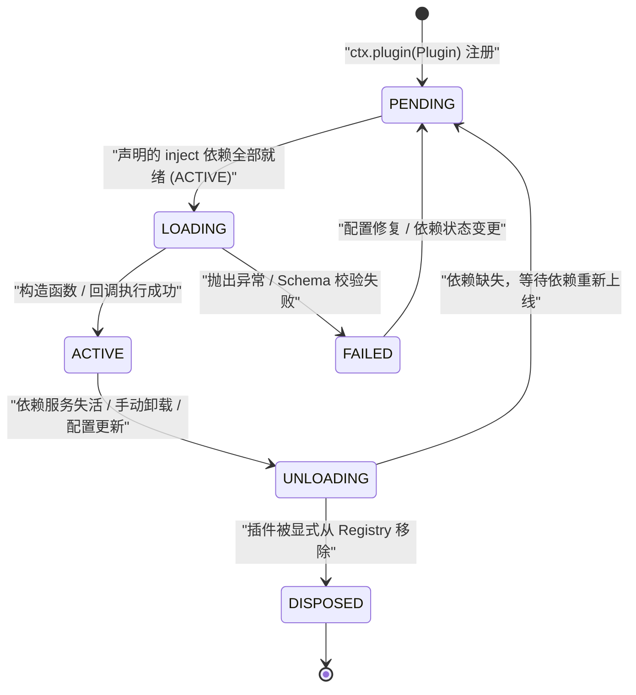
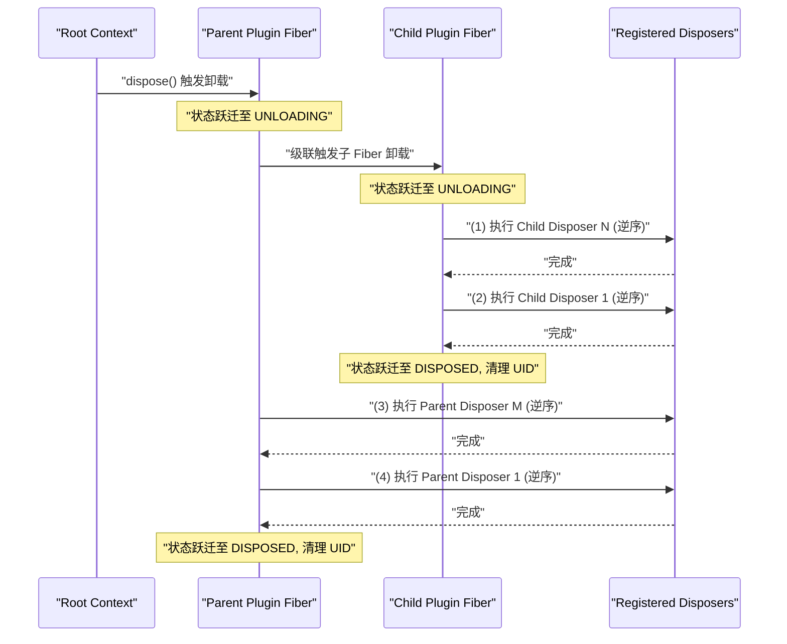
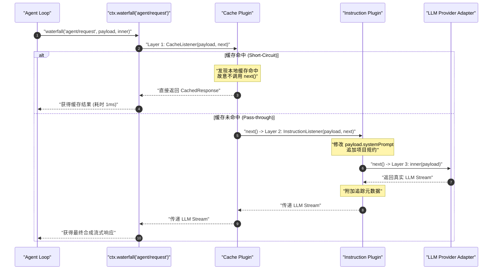

# 第 06 章：Cordis：项目的运行骨架

欢迎进入《DeepSeek Harness 深度技术教程》第二阶段的核心枢纽章节。在深入探讨 Agent 状态机循环、提示词装配、任务图编排与分布式协同之前，我们必须首先拆解支撑整个 DeepSeek Harness 系统运转的微内核底座——**Cordis 运行时**。

对于具备 Java、C++、Go、Rust、Python 或现代 TypeScript 开发经验的系统工程师而言，初次接触 AI 智能体框架时常会产生一种直觉偏差：认为智能体框架的核心工作只是简单的字符串模板拼接（Prompt Template）与网络请求包装（Fetch/Axios）。然而，在工业级 Agent 运行时中，系统面临着极其苛刻的动态性、并发性与可靠性挑战——不同大模型 Provider 的热插拔、不同任务沙箱的权限与工具隔离、跨插件的事件拦截与提示词变异、底层操作系统进程与异步资源句柄的零泄漏释放、以及多 Agent 派生时的服务继承与层级隔离。

Cordis 是一套专为这种极高动态扩展性设计的**轻量级控制反转（IoC / Inversion of Control）与事件微内核框架**。本章将完全摒弃虚浮的概念包装，从系统编程视角（内存布局、代理拦截、原型继承、有限状态机、LIFO 析构栈、函数复合链）深入剖析 Cordis 的内部机理，并带你手写符合工业级规范的生产级插件。

---

## 1. 为什么 Agent 系统需要 Cordis？程序员工程直觉映射

在传统的后端与系统开发中，我们习惯于依赖成熟的组件容器与生命周期管理机制：Spring 框架的 `ApplicationContext`（Java）、NestJS 的模块化容器（TypeScript）、Wire / Dig 的依赖图解析（Go）、以及 Linux 内核的命名空间（Namespace）隔离与 systemd 服务单元生命周期管理。Cordis 则是将这些经典的系统设计模式在 JavaScript/TypeScript 运行时环境中的高度抽象与工业级实现。

为了建立清晰且无歧义的工程心智模型，我们将 Cordis 的核心概念与传统系统编程概念进行严格的对照映射：

| Cordis 概念 | 传统系统编程 / 企业级框架对照 | 核心职责与工程本质 | 显存/内存与运行时行为 |
| :--- | :--- | :--- | :--- |
| **Context (上下文)** | `ApplicationContext` / Linux Mount Namespace | 树状依赖注入容器与作用域隔离域，提供基于 Proxy 与原型链的服务解析 | 零拷贝原型继承（`Object.create`），各级 Context 共享底层 Service 实例指针 |
| **Fiber (纤程单元)** | `systemd.service` / Erlang OTP `GenServer` | 插件运行时的生命周期状态机与所有权宿主（状态：`PENDING` $\to$ `ACTIVE` $\to$ `UNLOADING`） | 维护专属 Disposer 栈与依赖纪元签名（Epoch Hash） |
| **Service (服务)** | Spring `@Service` 单例 Bean / OSGi 服务 | 强契约单例提供者，通过属性拦截透明挂载至 `ctx` | 注册时触发依赖解析图更新，卸载时触发级联失活 |
| **Effect & Disposer** | C++ RAII 析构函数 / Go `defer` 栈 / POSIX `atexit` | 副作用登记与反向所有权释放链（Reverse Ownership Order） | 双向/单向链表维护，在 Fiber 卸载时严格遵循 LIFO 逆序执行 |
| **Waterfall (瀑布流事件)** | ASP.NET Core / Koa 洋葱中间件 Pipeline | 函数复合链路 $f = f_1 \circ f_2 \circ \dots \circ f_n$，显式 `next()` 延续调用 | 嵌套闭包迭代器，支持中间件短路接管（Veto）与数据变异 |
| **Isolate & Intercept** | 多租户命名空间 / AOP 切面动态配置代理 | 服务作用域物理隔离与层级配置继承覆盖 | 基于 Symbol 标签的原型链查找与配置就近合并 |

```
                +-------------------------------------------------------------+
                |                       Root Context                          |
                |  ctx.reflect | ctx.registry | ctx.events | ctx.logger       |
                +-------------------------------------------------------------+
                                       |
                   +-------------------+-------------------+
                   | extend()                              | isolate('tools')
                   v                                       v
        +-----------------------+               +-----------------------+
        |   Session Context     |               |   Sandbox Context     |
        | (Prototypal Inherit)  |               | (Isolated ToolRuntime)|
        +-----------------------+               +-----------------------+
                   |                                       |
                   v                                       v
         [Plugin: AgentLoop]                     [Plugin: ShellTool]
         - Fiber State: ACTIVE                   - Fiber State: ACTIVE
         - Effect: LIFO Disposers                - Effect: Child Processes
```

### 1.1 传统裸写架构的致命缺陷

如果不用微内核容器，采用传统的全局对象或单例模块裸写 Agent 框架，系统会在面临以下场景时迅速崩溃：

1. **会话级工具与权限污染**：当主 Agent 派生出一个只读权限的子 Agent 时，如果工具注册表是全局单例，子 Agent 注册的受限工具或重写的上下文会直接污染主 Agent 和其他并发会话；
2. **异步资源与句柄泄漏**：在多轮对话中，如果一个工具插件创建了后台定时器、开启了子进程或建立了 WebSocket 连接，当会话异常终止或插件被热重载时，缺乏集中的生命周期所有权追踪将导致句柄永久驻留内存；
3. **调用链路不可插拔**：若要在模型请求前后增加敏感词风控、提示词动态注入、Token 预算限流或模型 Fallback 路由，如果缺乏洋葱中间件（Waterfall）机制，代码将退化为充斥着 `if-else` 的意大利面条式硬编码。

---

## 2. Context 与依赖注入架构：代理、原型链与作用域树

### 2.1 上下文代理模式（Proxy Pattern）与延迟属性解析

在 Cordis 中，开发者访问任何已安装的服务均通过 `ctx.serviceName`（例如 `ctx.systemPrompt`、`ctx.tools`、`ctx.sessionStore`）。然而，`Context` 类本身并没有在类定义中静态声明这些具体服务的属性。Cordis 并没有采用性能低下的全局哈希表反复查表或反射扫描，而是通过 `Proxy` 拦截器结合内部反射服务 `ReflectService` 实现了零开销的延迟属性解析。

当创建 Root Context 时，Cordis 会实例化一个底层对象并为其包裹一层 `ProxyHandler`：

```typescript
// vendor/cordis/src/context.ts 核心构造机制
export class Context {
  constructor() {
    this[symbols.isolate] = Object.create(null)
    this[symbols.intercept] = Object.create(null)

    // 实例化代理，所有属性访问均被 ReflectService.handler 拦截
    const self = new Proxy<this>(this, ReflectService.handler)
    this.root = self
    this.fiber = new Fiber(self, {}, Object.create(null), null, () => [])
    this.reflect = new ReflectService(self)
    this.registry = new RegistryService(self)
    this.events = new EventsService(self)
    this.logger = new LoggerService(self)
    return self
  }
}
```

`ReflectService.handler` 的属性读取拦截逻辑严格遵循以下优先级决策树：

```
                              读取属性 ctx.prop
                                      |
                       +--------------v---------------+
                       | 是否为特殊内部属性/Symbol/_?  |
                       +--------------+---------------+
                                      |
                     是 /            \ 否
                       v              v
            [Reflect.get(target)]   [Reflect.has(target, prop)?]
                                      |
                                     / \ 是
                                 否 /   v
                                   |   [直接返回 target[prop]]
                                   v
                      [查找 ReflectService 属性定义表]
                                   |
                     +-------------+-------------+
                     |                           |
                     v (类型: accessor)          v (类型: service)
             [执行 getter 函数]          [根据 Context 的 isolate 标签]
                                         [从 store 中解析激活的 Impl.value]
```

这种机制保证了三大关键特性：
1. **类型安全与契约解耦**：上层业务代码通过 TypeScript 的声明合并（Declaration Merging）扩展 `Context` 接口，而底层运行时只在实际访问时动态寻址；
2. **状态感知**：若某个 Service 尚未就绪（处于 `PENDING` 状态）或已被卸载，通过 `ctx.prop` 读取将直接返回 `undefined`，避免访问到脏指针；
3. **调用追踪**：每一个通过 Proxy 触发的调用，都能精确捕获当前调用者的 Fiber 调用栈，从而为诊断死锁或资源泄露提供完整的诊断追踪能力。

### 2.2 原型链继承模型：`ctx.extend()`

在多 Agent 协同、并发对话以及任务流转中，频繁创建完全隔离的 IoC 容器会带来巨大的内存开销与初始化延迟。Cordis 巧妙利用了 JavaScript 引擎底层的**原型链继承（Prototypal Inheritance）**，实现了 $O(1)$ 时间复杂度与近乎零内存分配的子上下文派生。

```typescript
extend(meta = {}): this {
  const shadow = Reflect.getOwnPropertyDescriptor(this, symbols.shadow)?.value
  // 通过 Object.create 建立原型链关联，避免昂贵的属性浅拷贝
  const self = Object.create(getTraceable(this, this))
  for (const prop of Reflect.ownKeys(meta)) {
    Object.defineProperty(self, prop, Reflect.getOwnPropertyDescriptor(meta, prop)!)
  }
  if (!shadow) return self
  return Object.assign(Object.create(self), { [symbols.shadow]: shadow })
}
```

数学上，设根上下文为 $C_0$，经过连续 $k$ 次 `extend` 派生得到的子上下文序列为 $C_1, C_2, \dots, C_k$。对于任意属性 $P$ 的查找函数 $\mathcal{L}(C_k, P)$，满足原型委托查找方程：

$$\mathcal{L}(C_k, P) = \begin{cases} C_k.P & \text{若 } P \in \text{OwnKeys}(C_k) \\ \mathcal{L}(C_{k-1}, P) & \text{若 } P \notin \text{OwnKeys}(C_k) \land k > 0 \\ \text{ReflectLookup}(C_0, P) & \text{若 } k = 0 \end{cases}$$

这保证了父上下文对公共服务（如底层 HTTP Client、全局事件总线、数据库连接池）的注册修改能够瞬时对所有子上下文可见；而子上下文写入的私有元数据（如当前会话 ID、当前轮次取消令牌 `AbortSignal`）仅作用于自身，绝不污染父上下文与兄弟上下文。

### 2.3 服务作用域隔离：`ctx.isolate()`

在沙箱工具执行或子代理隔离执行时，我们需要子上下文拥有独立的特定服务实例（例如一个受限权限的 `tools` 服务），同时保留其他所有全局基础设施服务（如 `logger`、`database`）。这就是 `ctx.isolate()` 的核心用武之地。

```typescript
isolate(name: string, label?: symbol) {
  const shadow = Object.create(this[symbols.isolate])
  shadow[name] = label ?? Symbol(name)
  return this.extend({ [symbols.isolate]: shadow })
}
```

`ctx.isolate(name)` 的底层实现原理是在原型继承的 `symbols.isolate` 字典中，将指定服务名称绑定到一个新生成的全局唯一 `Symbol`。

```
Root Context (isolate: {})
  |-- ctx.tools -> 解析到 GlobalToolsService (Scope: default)
  |
  +-- ctx.isolate('tools') -> Child Context A (isolate: { tools: Symbol(tools_A) })
  |     |-- ctx.tools -> 解析到 RestrictedToolsService (Scope: tools_A)
  |     \-- ctx.logger -> 原型回溯解析到 Root LoggerService
  |
  \-- ctx.isolate('tools') -> Child Context B (isolate: { tools: Symbol(tools_B) })
        \-- ctx.tools -> 解析到 MockToolsService (Scope: tools_B)
```

当 `ReflectService` 尝试为 `ctx` 解析 `tools` 服务时，它不仅比对服务名称，还会校验：

$$\text{Match}(ctx, impl) \iff ctx[\text{symbols.isolate}][\text{name}] \equiv impl.fiber.ctx[\text{symbols.isolate}][\text{name}]$$

两个调用了 `isolate('tools', sharedSymbol)` 的上下文如果传入了相同的 `sharedSymbol`，则它们会被加入到同一个隔离域中，实现精确的跨插件受控共享。

### 2.4 配置层级合并与拦截：`ctx.intercept()`

在多层嵌套的插件配置体系中，父作用域通常需要对子作用域内的插件配置进行强制注入或切面修改（例如：为某个子树下的所有 LLM 调用统一附加特定 HTTP 请求头或超时阈值）。Cordis 通过 `ctx.intercept()` 提供了配置拦截机制。

当服务解析其实际生效的配置时，会沿着上下文的原型链向上收集所有的拦截配置，并按从根到叶的顺序进行合成：

$$\mathcal{C}_{\text{final}} = \mathcal{C}_{\text{base}} \oplus \mathcal{C}_{\text{ancestor\_root}} \oplus \dots \oplus \mathcal{C}_{\text{parent}} \oplus \mathcal{C}_{\text{local}} \oplus \mathcal{C}_{\text{head}}$$

```typescript
// vendor/cordis/src/service.ts 中的配置合并算法
[symbols.resolveConfig](base?: T, head?: T): T {
  let intercept = this.ctx[Context.intercept]
  const configs: any[] = []
  // 沿原型链自底向上收集所有覆盖层
  while (this.name in intercept) {
    if (Object.hasOwn(intercept, this.name)) {
      configs.unshift(intercept[this.name])
    }
    intercept = Object.getPrototypeOf(intercept)
  }
  if (base) configs.unshift(base)
  if (head) configs.push(head)

  if (this['Config']?.merge) {
    return this['Config'].merge(...configs)
  } else {
    return Object.assign({}, ...configs)
  }
}
```

---

## 3. Fiber 状态机与声明式 Service 生命周期

### 3.1 Fiber 状态转移模型

在 Cordis 中，每一个加载的插件或服务实例都由一个底层的 **Fiber（纤程单元）** 进行全生命周期托管。Fiber 是一个精确的六状态有限状态机（Finite State Machine, FSM）：



六大状态的精确工程语义如下：

1. **`PENDING` (0)**：等待依赖。插件已完成注册，但其通过 `inject` 声明的一个或多个 Service 尚未在当前作用域中提供或未处于 `ACTIVE` 状态；
2. **`LOADING` (1)**：正在加载。所有依赖均已就绪，Cordis 正在执行插件的类构造函数或工厂函数。此时所有注册的异步 Effect 正在被收集；
3. **`ACTIVE` (2)**：就绪激活。插件已成功初始化，其提供的 Service（若有）已对外可见，注册的事件监听器处于活跃监听状态；
4. **`FAILED` (3)**：故障失败。插件在配置校验阶段（`ValidationError`）或启动执行阶段抛出了未捕获异常。Fiber 会将错误记录在 `_error` 字段中并触发告警，但绝不会导致宿主进程崩溃；
5. **`UNLOADING` (5)**：正在析构。触发了卸载流程，当前 Fiber 正在执行内部所有已注册的 `Disposable` 析构函数（等待异步资源清理完毕）；
6. **`DISPOSED` (4)**：彻底销毁。Fiber 已被从父容器与注册表中永久注销，UID 置为 `null`，禁止任何形式的再次激活。

### 3.2 依赖注入与纪元签名（Epoch Hashing）机制

传统 IoC 容器在处理动态热插拔时，极易出现由于底层依赖重载而导致的中间状态拓扑撕裂。Cordis 引入了**纪元签名（Epoch Hash）算法**来追踪依赖版本的演进。

对于任意 Fiber $F$，其依赖的服务集合为 $\text{Inject}(F) = \{s_1, s_2, \dots, s_m\}$。Fiber 的纪元签名定义为所有依赖服务提供者 Fiber UID 的序列化哈希：

$$\text{Epoch}(F) = \begin{cases} \text{INACTIVE} & \text{若 } \exists s \in \text{Inject}(F) \text{ 使得 } s \notin \text{ActiveStore} \\ \text{UID}(s_1) : \text{UID}(s_2) : \dots : \text{UID}(s_m) & \text{若所有依赖均处于 } \text{ACTIVE} \text{ 状态} \end{cases}$$

```typescript
// vendor/cordis/src/fiber.ts 依赖刷新算法
_refresh() {
  let epoch: string | boolean = false
  epoch = ''
  for (const name of Object.keys(this.inject)) {
    const impl = this._store[name]
    if (!impl) {
      epoch = INACTIVE // 依赖缺失，标记为未激活
      break
    }
    epoch += ':' + impl.fiber.uid
  }
  this._setEpoch(epoch)
}
```

当任意底层 Service 被替换或重启时，其 Fiber UID 发生变化，导致依赖它的上层 Fiber 的 `Epoch` 签名失效。Cordis 会自动触发状态转移：
1. 检测到 `oldEpoch !== newEpoch` 且 `newEpoch === INACTIVE` 时，触发 `_unload()` 执行逆序析构；
2. 一旦新 Service 加载完成，`_refresh()` 计算出全新的有效 `Epoch`，触发 `_reload()` 重新执行插件激活。

这实现了真正的**依赖感知自愈（Self-Healing Dependency Graph）**。

### 3.3 声明式 Service 与可调用服务（Callable Service）黑魔法

在 DeepSeek Harness 中，继承 `Service` 的类会自动完成依赖注入的注册：

```typescript
import { Context, Service } from 'cordis'

export class SessionStore extends Service {
  // 静态属性声明该 Service 挂载至 ctx 上的名称
  static provide = 'sessionStore'
  // 静态属性声明该 Service 激活所需的先决依赖
  static inject = ['logger', 'database']

  constructor(ctx: Context) {
    // 调用父类构造函数，底层自动触发 ctx.reflect.provide('sessionStore', this)
    super(ctx, 'sessionStore')
  }

  public async getSession(id: string) {
    this.ctx.logger.info(`Fetching session ${id}`)
    return this.ctx.database.find(id)
  }
}
```

某些核心服务不仅需要具备面向对象的方法，还需要能够像普通函数一样被直接调用（例如 `ctx.logger('agent')`）。在 JavaScript 中，函数也是对象。Cordis 通过 `createCallable` 与原型嫁接技术（`joinPrototype`）融合了两者：

```
+-------------------------------------------------------------+
|               Callable Service Instance                     |
|                                                             |
|  [[Call]]: function(name) { ... } -> 触发 [symbols.invoke]   |
|  [[Prototype]]: LoggerService.prototype                     |
|       |                                                     |
|       +--> ctx.logger.info(...)                             |
|       +--> ctx.logger.error(...)                            |
|       \--> Function.prototype (bind, call, apply)           |
+-------------------------------------------------------------+
```

---

## 4. 副作用注册与反向级联释放模型

在长时间运行的 Agent 系统（如后台守护 Agent、自动化代码审查 Agent、持续演进 Agent）中，插件的动态加载与热重载是标准行为。如果插件在加载时注册了全局事件、启动了后台 `setInterval` 定时器、创建了子进程沙箱或建立了网络连接，而在卸载时没有彻底清理，系统就会迅速发生**句柄泄露、内存爆炸与僵尸进程堆积**。

Cordis 从内核层面强制推行了基于 RAII（Resource Acquisition Is Initialization）与所有权模型（Ownership Model）的副作用管理机制。

### 4.1 `ctx.effect()` 析构模型

在 Cordis 中，任何伴随生命周期的副作用操作必须通过 `ctx.effect()` 登记。`ctx.effect()` 接收一个工厂函数，该函数在插件激活时同步或异步执行，并必须返回一个 **`Disposable` 析构函数**（或 `Disposable` 迭代器）。

```typescript
// 示例：安全注册定时器与外部资源
ctx.effect(() => {
  const timer = setInterval(() => {
    ctx.emit('heartbeat', Date.now())
  }, 1000)

  // 返回的清理闭包即为 Disposer
  return () => {
    clearInterval(timer)
  }
})
```

`ctx.effect()` 还深度支持生成器模式（Generator），允许在单个逻辑块中连续产出多个受控资源：

```typescript
ctx.effect(function* () {
  const worker = spawnWorkerThread()
  yield () => worker.terminate() // 注册第一个析构器

  const connection = openDatabaseConnection()
  yield () => connection.close() // 注册第二个析构器
})
```

### 4.2 反向级联释放定理（Reverse Ownership Order）

为什么资源的释放必须严格按照注册的**逆序（LIFO / Last-In-First-Out）**执行？

#### 数学与逻辑证明：

设一个插件在生命周期内依次创建并占有了资源序列 $R = \langle r_1, r_2, \dots, r_n \rangle$。 在系统的状态依赖偏序关系 $\prec$ 中，如果资源 $r_j$ 的初始化依赖于资源 $r_i$（其中 $i < j$），则存在依赖不变量：

$$\forall i < j, \quad r_i \prec r_j \implies \text{Lifetime}(r_j) \subseteq \text{Lifetime}(r_i)$$

即后创建的资源 $r_j$ 往往持有先创建的资源 $r_i$ 的句柄或建立在其有效性假设之上（例如：$r_1$ 是网络套接字，$r_2$ 是建立在 $r_1$ 之上的 RPC 通道，$r_3$ 是使用 $r_2$ 进行通信的会话订阅者）。

若以正序（FIFO）释放资源：当 $r_1$ 被首先销毁时，$r_2$ 与 $r_3$ 仍然存活，若此时 $r_3$ 尝试在自身的析构逻辑中发送终止通知，将因底层连接 $r_1$ 已死而抛出未捕获异常（Panic），导致后续清理中断，系统进入脏状态。

因此，**合法的析构序列 $\mathcal{D}$ 必须为创建序列的逆拓扑序，对于单 Fiber 线性注册而言，即严格的 LIFO 栈逆序**：

$$\mathcal{D}(R) = \langle r_n, r_{n-1}, \dots, r_1 \rangle$$

```
   注册顺序 (Push 到 _disposables):
   +--------------------------------------------------------+
   | (1) 打开 TCP 连接 -> (2) 认证握手 -> (3) 启动订阅监听   |
   +--------------------------------------------------------+
                                                                |
                                                                v
   卸载顺序 (Pop & Await 执行):                                  |
   +--------------------------------------------------------+   |
   | (3) 取消订阅监听 -> (2) 发送关闭包 -> (1) 关闭底层 TCP   | <-+
   +--------------------------------------------------------+
```

### 4.3 级联卸载时序与异常隔离

当一个父插件或 Root 容器触发销毁时，Cordis 会驱动三维立体的级联释放：



在析构清理执行期间，Cordis 采用 `composeError` 进行了最高级别的防御性容错：即使某个 Disposer 内部发生严重异常或 Promise Reject，引擎会捕获该错误并路由至 `ctx.logger.error`，而**绝不中断其余 Disposer 的继续执行**。

---

## 5. 事件系统三大语义深度解构：广播、串行与瀑布流

事件系统是 Cordis 插件之间松耦合交互的神经中枢。与 Node.js 原始的 `EventEmitter` 不同，Cordis 的事件总线深度融合了作用域过滤、异步并发控制与中间件洋葱管道。

Cordis 提供了三大核心事件分发语义：
1. **广播模式（Broadcast）**：`emit`（同步非阻塞）与 `parallel`（异步全并发）
2. **串行短路模式（Bail / Serial）**：`bail`（同步短路）与 `serial`（异步短路）
3. **瀑布流洋葱模式（Waterfall）**：`waterfall`（可控拦截与数据变异管道）

```
                                  事件分发调度模型
                                         |
         +-------------------------------+-------------------------------+
         |                               |                               |
         v                               v                               v
   [ 广播模式 Broadcast ]      [ 串行短路模式 Bail/Serial ]     [ 瀑布流模式 Waterfall ]
   - emit(): 同步广播忽略返回值   - bail(): 同步遇到非空值立即终止  - 洋葱中间件 Pipeline
   - parallel(): Promise.all   - serial(): 异步逐个 await 终止  - 必须显式 next() 向下传递
     并发等待全部完成            - 适用: 鉴权/短路拦截/路由匹配   - 适用: Prompt组装/请求重写
```

### 5.1 广播模式：`ctx.emit` 与 `ctx.parallel`

#### 1. `ctx.emit(name, ...args)`（同步广播）
- **机制**：按注册顺序同步依次调用所有匹配的监听器，**完全忽略监听器的返回值与返回的 Promise**；
- **适用场景**：只读监控指标埋点、审计日志打印、状态变更通知等无副作用或无需等待的广播操作；
- **源码要点**：
  ```typescript
  emit(...args: any[]) {
    this.dispatch('emit', args).map(cb => cb(...args))
  }
  ```

#### 2. `ctx.parallel(name, ...args)`（异步并发栅栏）
- **机制**：通过 `Promise.allSettled` 并发调度所有监听器，并显式等待所有监听器落地。若存在一个或多个监听器执行失败，聚合所有失败原因并抛出 `AggregateError`；
- **适用场景**：多模块并行预热（如并行加载多个工具的 Schema、并行校验多个外部依赖状态）。

### 5.2 串行短路模式：`ctx.serial` 与 `ctx.bail`

在责任链模式（Chain of Responsibility）中，系统按顺序逐个询问处理器，直到某个处理器声明“已接管该请求”并返回有效结果。

Cordis 使用 `isBailed` 谓词来判断是否短路：

$$\text{isBailed}(v) \iff v \nequiv \text{null} \land v \nequiv \text{false} \land v \nequiv \text{undefined}$$

#### 源码实现剖析：

```typescript
// vendor/cordis/src/events.ts
async serial(...args: any[]) {
  for (const cb of this.dispatch('serial', args)) {
    const result = await cb(...args)
    if (isBailed(result)) return result // 捕获到有效返回值，立即短路退出
  }
}
```

- **执行时序**：
  ```
  Listener 1 -> 返回 undefined (继续)
        |
        v
  Listener 2 -> 返回 { status: 'HANDLED' } (Bail 命中!)
        |
        +-- [ 立即返回结果，Listener 3 被跳过不再执行 ]
  ```
- **典型应用场景**：工具执行权限探针（如依次检查管理员白名单、角色策略、沙箱规则，一旦有一条规则命中拒绝或允许，立即短路返回）。

### 5.3 瀑布流洋葱模型（`ctx.waterfall`）——核心深入

`waterfall` 是 Cordis 中最强大、最硬核，也是在 DeepSeek Harness 开发中最容易被误用的分发模式。它构成了 Agent 请求管道、Prompt 组装以及模型流式响应的中间件骨架。

#### 1. 为什么 waterfall 必须显式调用 `next()`？

在传统的事件监听中，监听器是被动接收者。而在 `waterfall` 中，**每一个监听器都是一个环绕拦截中间件（Around Middleware）**。

在数学上，设核心底层默认逻辑为函数 $M_{\text{core}}$，注册的 $k$ 个监听器分别为 $M_1, M_2, \dots, M_k$。整个 `waterfall` 的执行本质是高阶函数的复合（Function Composition）：

$$W = M_1 \circ M_2 \circ \dots \circ M_k \circ M_{\text{core}}$$

```
[ 请求进入 ] --> M_1 (前置处理)
                   |-- 调用 next() --> M_2 (前置处理)
                                         |-- 调用 next() --> M_core (底层执行)
                                         |                      |
                                         |<-- 接收返回结果 ------+
                   |<-- 接收变异结果 -----+
[ 最终输出 ] <------+
```

#### 2. `waterfall` 源码内部状态转移解析

让我们直接审视 `vendor/cordis/src/events.ts` 中的精妙实现：

```typescript
waterfall(...args: any[]) {
  const cbs = this.dispatch('waterfall', args) // 获取经过作用域过滤的监听器队列
  const inner = args.pop()                     // 弹出最后一个参数作为核心回退实现 (inner)
  const next = () => {
    const cb = cbs.shift() ?? inner            // 弹出下一个中间件，若队列耗尽则执行 inner
    return cb(...args)                         // 执行当前层，并将包含最新 next 的 args 传递下去
  }
  args.push(next)                              // 将 next 延续函数重新塞入参数末尾
  return next()                                // 启动洋葱第一层
}
```

#### 3. 短路接管（Veto / Short-Circuit） vs 数据变异（Data Mutation）

- **完全短路接管（Veto / Short-Circuit）**： 如果某个监听器决定不调用 `next()`，而是直接 `return customResponse`，整个洋葱链将在该层瞬间折返！后续的所有中间件以及最内层的默认行为（`inner`）将被完全跳过。 *典型场景*：Mock 测试插件、本地 Prompt 缓存命中直接返回响应、安全风控模块直接拦截并返回安全警示。

- **透明透传与后置修饰（Mutation & Post-processing）**： 监听器在前置修改参数后调用 `await next()`，获取到下游执行结果后再次进行处理并返回。 *典型场景*：Token 消耗统计、全链路 OpenTelemetry Trace Span 计时、系统提示词动态追加。



---

## 6. 工业级实战：手写一个完整的生产级 Cordis 插件

现在，我们将所学的 Context、Service、Fiber、Effect 与 Waterfall 知识融会贯通，编写一个工业级的 Cordis 插件：`RateLimitedLLMGatewayPlugin`。

### 6.1 插件功能需求说明
1. **服务契约**：提供名为 `llmGateway` 的 `Service`，暴露全局调用统计与限流状态；
2. **中间件拦截**：通过 `ctx.waterfall('agent/request')` 拦截所有大模型调用请求，实现**滑动窗口令牌桶限流**与**错误重试**；
3. **副作用控制**：启动后台定周期重置定时器，通过 `ctx.effect()` 登记确保插件卸载时无泄漏；
4. **强类型配置**：使用 StandardSchema / Zod 定义插件配置，并在配置不合法时拒绝加载；
5. **异步取消**：深度集成 `AbortSignal`，保证外部取消时能立刻中断请求。

### 6.2 完备的 TypeScript 源码实现

```typescript
import { Context, Service, type Disposable } from 'cordis'
import { z } from 'zod'

// 1. 声明合并 (Declaration Merging)，将自定义 Service 与事件注入到 Context 类型图中
declare module 'cordis' {
  interface Context {
    llmGateway: RateLimitedLLMGatewayService
  }

  interface Events {
    'llm-gateway/blocked'(agentId: string, retryAfterMs: number): void
    'llm-gateway/metrics'(metrics: GatewayMetrics): void
  }
}

export interface GatewayMetrics {
  totalRequests: number
  throttledRequests: number
  activeTokens: number
}

export interface LLMRequestPayload {
  agentId: string
  model: string
  messages: Array<{ role: string; content: string }>
  signal?: AbortSignal
}

export interface LLMResponsePayload {
  content: string
  usage: { promptTokens: number; completionTokens: number }
}

// 2. 定义强校验 Schema
export const GatewayConfigSchema = z.object({
  maxTokensPerMinute: z.number().int().positive().default(60000),
  maxConcurrent: z.number().int().positive().default(5),
  maxRetries: z.number().int().nonnegative().default(3),
  backoffMs: z.number().int().positive().default(1000),
})

export type GatewayConfig = z.infer<typeof GatewayConfigSchema>

// 3. 实现声明式 Service
export class RateLimitedLLMGatewayService extends Service {
  static provide = 'llmGateway'
  static inject = ['logger']

  private currentTokens = 0
  private concurrentCount = 0
  private totalCount = 0
  private throttledCount = 0

  constructor(ctx: Context, public config: GatewayConfig) {
    super(ctx, 'llmGateway')
  }

  public getMetrics(): GatewayMetrics {
    return {
      totalRequests: this.totalCount,
      throttledRequests: this.throttledCount,
      activeTokens: this.currentTokens,
    }
  }

  public acquireCapacity(estimatedTokens: number): boolean {
    if (
      this.concurrentCount >= this.config.maxConcurrent ||
      this.currentTokens + estimatedTokens > this.config.maxTokensPerMinute
    ) {
      this.throttledCount++
      return false
    }

    this.concurrentCount++
    this.currentTokens += estimatedTokens
    this.totalCount++
    return true
  }

  public releaseCapacity(estimatedTokens: number): void {
    this.concurrentCount = Math.max(0, this.concurrentCount - 1)
  }

  public resetWindow(): void {
    this.currentTokens = 0
  }
}

// 4. 编写插件入口函数
export function RateLimitedLLMGatewayPlugin(ctx: Context, rawConfig: GatewayConfig) {
  // 4.1 校验并归一化配置
  const config = GatewayConfigSchema.parse(rawConfig)
  const logger = ctx.logger('llm-gateway')

  // 4.2 注册并实例化受管 Service
  const gatewayService = new RateLimitedLLMGatewayService(ctx, config)

  // 4.3 注册生命周期副作用 (Effect) - 定时滑动窗口重置
  ctx.effect((): Disposable => {
    logger.info('Starting token bucket sliding window timer (interval: 60s)')
    const timer = setInterval(() => {
      gatewayService.resetWindow()
      ctx.emit('llm-gateway/metrics', gatewayService.getMetrics())
    }, 60000)

    // 返回的 Disposer 函数严格遵循 LIFO 逆序销毁
    return () => {
      logger.info('Disposing token bucket sliding window timer')
      clearInterval(timer)
    }
  })

  // 4.4 注册 Waterfall 中间件拦截 LLM 请求
  ctx.on('internal/update', (newConfig) => {
    logger.info('Dynamic config updated, applying to service')
    gatewayService.config = GatewayConfigSchema.parse(newConfig)
  })

  // 核心拦截点：拦截 agent/request 瀑布流
  ctx.waterfall(
    'agent/request' as any,
    async (
      payload: LLMRequestPayload,
      next: () => Promise<LLMResponsePayload>
    ): Promise<LLMResponsePayload> => {
      const estimatedTokens = payload.messages.reduce(
        (acc, msg) => acc + Math.ceil(msg.content.length / 3),
        0
      )

      let retriesLeft = config.maxRetries
      let delayMs = config.backoffMs

      while (true) {
        // 检查取消信号
        if (payload.signal?.aborted) {
          throw new DOMException('LLM Request Aborted by caller', 'AbortError')
        }

        // 尝试获取令牌配额
        if (!gatewayService.acquireCapacity(estimatedTokens)) {
          logger.warn(`Rate limit exceeded for agent ${payload.agentId}, retrying in ${delayMs}ms`)
          ctx.emit('llm-gateway/blocked', payload.agentId, delayMs)

          if (retriesLeft <= 0) {
            throw new Error(`Rate limit exceeded: quota exhausted for model ${payload.model}`)
          }

          // 异步退避等待，支持 AbortSignal 取消
          await new Promise<void>((resolve, reject) => {
            const timer = setTimeout(() => {
              cleanup()
              resolve()
            }, delayMs)

            const onAbort = () => {
              cleanup()
              clearTimeout(timer)
              reject(new DOMException('Aborted during rate limit backoff', 'AbortError'))
            }

            const cleanup = () => {
              payload.signal?.removeEventListener('abort', onAbort)
            }

            payload.signal?.addEventListener('abort', onAbort)
          })

          retriesLeft--
          delayMs *= 2 // 指数退避
          continue
        }

        // 成功获取配额，向下委托给下一层中间件或核心适配器
        try {
          logger.debug(`Executing agent request for ${payload.agentId} via waterfall next()`)

          // 关键点：显式调用 next() 将控制权交给下层！
          const result = await next()

          logger.debug(`LLM Request succeeded, prompt tokens: ${result.usage.promptTokens}`)
          return result
        } catch (error) {
          logger.error(`Error during LLM downstream execution:`, error)
          throw error
        } finally {
          // 无论成功还是异常，严格归还并发量
          gatewayService.releaseCapacity(estimatedTokens)
        }
      }
    }
  )

  logger.info('RateLimitedLLMGatewayPlugin loaded successfully')
}
```

### 6.3 单元测试与生命周期验证（Vitest 规范）

```typescript
import { describe, it, expect, vi } from 'vitest'
import { Context } from 'cordis'
import { RateLimitedLLMGatewayPlugin, GatewayConfigSchema } from './plugin.ts'

describe('RateLimitedLLMGatewayPlugin 工业级集成测试', () => {
  it('应当正确注册 Service，并在卸载时触发 Effect 逆序清理', async () => {
    const root = new Context()
    const pluginDisposer = root.plugin(RateLimitedLLMGatewayPlugin, {
      maxTokensPerMinute: 1000,
      maxConcurrent: 1,
      maxRetries: 1,
      backoffMs: 50,
    })

    // 1. 验证 Service 注入与初始状态
    expect(root.llmGateway).toBeDefined()
    expect(root.llmGateway.getMetrics().totalRequests).toBe(0)

    // 2. 模拟触发 agent/request waterfall
    let coreInvoked = false
    const mockRequest = {
      agentId: 'agent-alpha',
      model: 'deepseek-chat',
      messages: [{ role: 'user', content: 'Hello Cordis' }],
    }

    const response = await root.waterfall('agent/request' as any, mockRequest, async () => {
      coreInvoked = true
      return {
        content: 'Response from Mock Core',
        usage: { promptTokens: 10, completionTokens: 20 },
      }
    })

    expect(coreInvoked).toBe(true)
    expect(response.content).toBe('Response from Mock Core')
    expect(root.llmGateway.getMetrics().totalRequests).toBe(1)

    // 3. 验证插件卸载生命周期
    await pluginDisposer()
    expect(root.llmGateway).toBeUndefined() // Service 应当被完全注销
  })
})
```

---

## 7. 生产环境经典故障根因与排查体系

在构建复杂大模型 Agent 平台时，Cordis 运行时的错误往往会导致幽灵般难以复现的异常。以下汇总了生产环境中最高频的四大经典故障及其底层根因与排查手段。

### 故障 1：Waterfall 漏调 `next()` 导致整个调用链静默挂起或短路

- **故障现象**：配置了某个上下文注入插件后，Agent Loop 启动后既不报错也不发起任何真实的大模型网络请求，整个轮次调用返回 `undefined` 或空对象；
- **底层根因**：插件作者在编写 `ctx.waterfall` 监听器时，将其当成了普通事件监听器（`ctx.on`），执行完副作用逻辑后直接退出，**遗漏了 `return next()`**。由于中间件链断裂，内层的核心 LLM Adapter 永远不会被调用；
- **排查与修复标准**：
  1. 检查所有涉及 `ctx.waterfall` 的监听器末尾，确保存在且仅存在一条调用 `return next()`（或 `return await next()`）的分支；
  2. 若故意短路，必须显式返回符合该事件返回类型契约的完整 Mock 对象，并附带审计日志说明为何短路。

### 故障 2：`ctx.effect()` 异步析构死锁（Inertia Deadlock）

- **故障现象**：在调用 `fiber.dispose()` 或热重载插件时，进程卡住长达数十秒，最终抛出超时或内存溢出；
- **底层根因**：某个 `ctx.effect()` 返回的异步 Disposer 内部等待了一个永远无法 resolve 的 Promise（例如等待一个未加超时的子进程退出，而该子进程因标准输入管道未关闭而挂起）。Fiber 的 `inertia` 锁一直处于锁定状态，阻塞了后续状态机的转迁；
- **排查与修复标准**：
  ```typescript
  // 错误写法：裸 await 可能永久死锁
  return async () => {
    await externalProcess.exitPromise
  }

  // 正确写法：增加防御性超时保护
  return async () => {
    await Promise.race([
      externalProcess.exitPromise,
      new Promise((_, reject) => setTimeout(() => reject(new Error('Process kill timeout')), 3000)),
    ]).catch(err => ctx.logger.error(err))
    externalProcess.kill('SIGKILL')
  }
  ```

### 故障 3：原型链与作用域跨边界逃逸（Scope Leak）

- **故障现象**：在 Subagent 执行完沙箱代码后，主 Agent 意外获得了沙箱内部注入的受限工具或临时变量；或者主会话的上下文被并发的子会话串改；
- **底层根因**：直接在父上下文 `parentCtx` 上调用了 `provide()` 或修改了自有属性，而不是先调用 `parentCtx.isolate()` 或 `parentCtx.extend()` 创建私有隔离作用域；
- **排查与修复标准**：
  - 牢记原则：**任何派生操作必须先 `isolate` 或 `extend`，绝不在共享的 Root Context 上注册特定会话/任务专有的 Service！**

### 故障 4：循环依赖导致的 `PENDING` 死锁

- **故障现象**：两个插件 A 和 B 均已通过 `ctx.plugin()` 加载，但在 `ctx.registry` 中观察其状态均无限期停留在 `PENDING`，业务无法激活；
- **底层根因**：插件 A 声明 `inject = ['serviceB']`，而插件 B 声明 `inject = ['serviceA']`。由于没有先导服务能够首先进入 `ACTIVE` 状态，两者的 Epoch 计算永远为 `INACTIVE`；
- **排查与修复标准**：
  - 将双向依赖重构为单向依赖，或者将强依赖（`inject`）降级为可选弱依赖（通过 `ctx.get('serviceName')` 动态感知）。

---

## 8. 本章小结与全书架构演进

在本章中，我们全面剥离了 AI Agent 框架的神秘外衣，深入到了支撑 DeepSeek Harness 运转的微内核基石——Cordis 运行时：

1. **统一容器底座**：通过 Proxy 拦截与原型链继承（`extend`），Cordis 实现了零拷贝、高隔离（`isolate`）、强覆盖（`intercept`）的依赖注入拓扑；
2. **生命周期与状态机**：Fiber 的六状态有限状态机配合 Epoch 纪元签名算法，提供了坚如磐石的依赖感知与自动自愈能力；
3. **严格析构语义**：`ctx.effect()` 与反向所有权释放链（Reverse Ownership Order）在数学上证明并保证了复杂资源的 LIFO 零泄露销毁；
4. **灵活事件管道**：广播（`emit`/`parallel`）、短路（`bail`/`serial`）与瀑布流（`waterfall`）三大语义为大模型提示词拼接、安全风控、令牌限流与流式响应提供了极具表现力的中间件扩展机制。

在下一章中，我们将进入 **[第 07 章：启动、Profile 与配置叠加](./07-startup-profiles.zh.md)**，深入剖析 DeepSeek Harness 如何利用 Cordis 机制装配生产级 Profile、如何通过 Schemastery 进行加载期强校验，以及如何实现多层 YAML 配置的动态叠加（Overlay Patch）。
