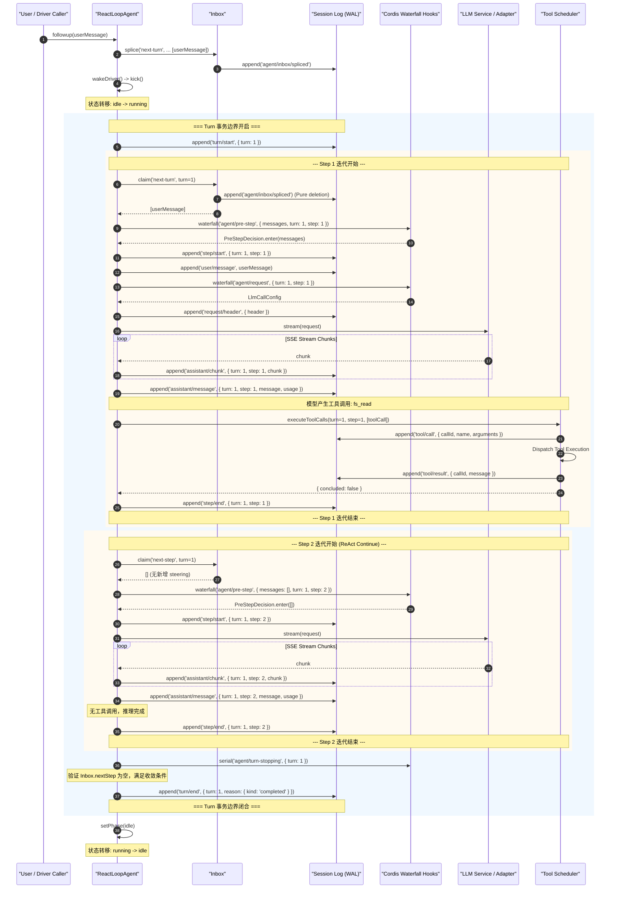

# Chapter 08: Agents, Turns, Steps, and the Inbox

English | [中文](08-agent-turn-step-inbox.zh.md)

Many introductory AI tutorials anthropomorphize the agent as a mysterious black box with “autonomous consciousness and decision-making ability.” For systems architects and production compiler/runtime engineers, that mental model is not useful for rigorous engineering. It offers little help with distributed races, memory leaks, deadlocks, and inconsistent state.

This chapter removes that mystique by modeling the LLM as a **probabilistic read-only pure function** and the agent runtime as a **controlled, event-driven, event-sourced hierarchical asynchronous finite-state machine with transaction boundaries**. It examines the production implementations of `@deepseek-ai/dsh-agent` and `@deepseek-ai/dsh-agent-loop`: memory topology, algebraic state-machine derivation, the two-level Inbox queue, nested Turn and Step lifecycles, microsecond-level cooperative cancellation, and memoized reverse teardown.

---

## 8.1 Engineering Intuition: Systems-Level Mapping of the Agent Runtime

To establish reliable engineering intuition, we first map AI concepts to established terminology from systems programming, operating-system kernels, and distributed transactions.

| AI term | Conventional systems-programming / distributed-architecture analogue | Engineering essence and invariant |
| :--- | :--- | :--- |
| **Agent** | **Hierarchical state-machine driver** | A looping engine that holds runtime context, binds a durable fact ledger, and performs state transitions driven by the input queue. |
| **Agent Loop** | **Reactor / Proactor event loop** | Like Node.js `libuv` or Linux `epoll`, it schedules I/O, initiates model computation, and dispatches callbacks. |
| **Turn** | **Distributed ACID transaction boundary** | One complete user-intent processing cycle, with a strict `turn/start` and `turn/end` ledger-envelope invariant. |
| **Step** | **Micro-iteration of state transitions** | One model request and the tool side effects it initiates, with independent `step/start` and `step/end` fences. |
| **Inbox** | **Two-level MPSC priority task queue** | A multiple-producer, single-consumer queue that separates Turn-level (`next-turn`) and Step-level (`next-step`) input buffers. |
| **Steering** | **Preemptive software interrupt** | Injects a high-priority control instruction during model inference or tool execution; the next safe Step boundary consumes it atomically. |
| **Injection** | **Silent memory mapping / DMA** | Silently adds environment variables, filesystem changes, or background events to the pending buffer without waking the state machine. |
| **Cancellation** | **POSIX-style cooperative signal propagation** | Propagates `AbortSignal` down a hierarchy, paired with a state-machine exit barrier and idempotent cleanup. |
| **Memoized teardown** | **RAII / reverse destructor unwinding** | An idempotent finalizer that releases resources in reverse construction order when the dependency-injection container unloads or fails. |

These mappings show that **agent engineering fundamentally involves concurrency control, state-machine management, transactional log auditing, and isolation of asynchronous side effects**.

---

## 8.2 Formal Modeling and Algebraic State-Machine Derivation

To reason rigorously about the completeness and convergence of an agent state machine, we define an agent instance as a seven-tuple:

$$\mathcal{M} = \langle \mathcal{S}, \mathcal{I}, \mathcal{E}, \mathcal{T}, \delta, \Omega, \mathcal{H} \rangle$$

Its components have the following formal definitions:

1. **State space $\mathcal{S}$:** $$\mathcal{S} = \{ \text{idle}(t), \text{maintenance}(t, \text{job}), \text{running}(t, s, \text{wakeRequested}) \}$$ Here $t \in \mathbb{N}$ is the current Turn number, $s \in \mathbb{N}$ is the current Step number within that Turn, and $\text{wakeRequested} \in \{0, 1\}$ is a Boolean latch.
2. **Input space $\mathcal{I}$:** $$\mathcal{I} = \mathcal{M}_{\text{user}} \times \text{InboxTarget} \times \text{WakeupFlag}$$ Here $\text{InboxTarget} \in \{ \text{next-turn}, \text{next-step} \}$ and $\text{WakeupFlag} \in \{ \text{true}, \text{false} \}$.
3. **Fact-ledger event set $\mathcal{E}$:** $$\mathcal{E} = \{ e_{\text{turn/start}}, e_{\text{turn/end}}, e_{\text{step/start}}, e_{\text{step/end}}, e_{\text{user/msg}}, e_{\text{asst/chunk}}, e_{\text{asst/msg}}, e_{\text{tool/call}}, e_{\text{tool/result}}, \dots \}$$
4. **Tool set $\mathcal{T}$:** $$\mathcal{T} = \{ \tau_1, \tau_2, \dots, \tau_k \}, \quad \tau_i: \text{Args} \to \text{Promise}\langle \text{Result} \rangle$$
5. **State-transition function $\delta$:** $$\delta: \mathcal{S} \times \mathcal{I} \to \mathcal{S} \times 2^{\mathcal{E}}$$
6. **Termination and convergence function $\Omega$:** $$\Omega: \text{AssistantMessage} \times \text{ToolResults} \times \text{InboxState} \to \{ \text{Continue}, \text{Stop}(\text{Reason}) \}$$
7. **Historical-state projection operator $\mathcal{H}$:** $$\mathcal{H}: \mathcal{E}^* \to \text{MessageArray}$$ It deterministically projects the append-only event-log sequence $\mathcal{E}^*$ into the input-message array required by the LLM context window.

```
                                      ┌────────────────────────────────────────────────────────┐
                                      │                                                        │
                                      ▼                                                        │
┌──────────────┐   send(..., wakeup=true)    ┌──────────────────────────────────┐  Turn End    │
│              ├────────────────────────────►│                                  ├──────────────┘
│     IDLE     │                             │             RUNNING              │
│              │◄────────────────────────────┤                                  │
└──────┬───────┘   Driver Quiescence / Done  └──────────────┬───────────────────┘
       │                                                    │
       │ runMaintenance(...)                                │ cancel()
       ▼                                                    ▼
┌──────────────┐                             ┌──────────────────────────────────┐
│              │                             │                                  │
│ MAINTENANCE  ├────────────────────────────►│       CANCELING (Aborting)       │
│              │   Driver Quiescence / Done  │                                  │
└──────────────┘                             └──────────────────────────────────┘
```

### 8.2.1 State-Transition Dynamics and a Worked Example

At time $k$, suppose the system is in state $S_k = \text{running}(t=1, s=1, \text{wakeRequested}=0)$. The LLM has finished streaming the first Step and produced the tool-call request $\text{tool/call}(id=\text{"call\_1"}, \text{"fs\_read"})$.

We can work through the execution of state-transition function $\delta$ by hand:

1. **Step 1 settlement:**
   - Append an event to the ledger: $e_1 = \text{assistant/message}(\text{turn}=1, \text{step}=1, \text{content}=[\text{tool\_call}])$
   - Check termination: $\text{toolCalls.length} = 1 > 0$, so $\Omega$ returns $\text{Continue}$.
   - Dispatch the tool executor: run $\tau_{\text{fs\_read}}$, produce a result, and append: $$e_2 = \text{tool/call}(\text{turn}=1, \text{step}=1, \text{id}=\text{"call\_1"})$$ $$e_3 = \text{tool/result}(\text{turn}=1, \text{step}=1, \text{id}=\text{"call\_1"}, \text{content}=\text{"file\_content\_bytes"})$$
   - Close the Step: append $e_4 = \text{step/end}(\text{turn}=1, \text{step}=1)$.

2. **Step 2 driver and pre-step admission:**
   - Increment the Step number: $s \leftarrow s + 1 = 2$.
   - Check the Inbox: the user has supplied no new input, so $\text{Inbox.nextStep} = \emptyset$.
   - Make the pre-step decision: $\text{decision} = \text{enter}(\text{messages}=\emptyset)$.
   - Open a new Step in the ledger: append $e_5 = \text{step/start}(\text{turn}=1, \text{step}=2)$.

3. **Step 2 model inference and convergence:**
   - The model receives the projected context $\mathcal{H}(e_1, e_2, e_3, e_4, e_5)$ and returns plain text without a tool call.
   - Append to the ledger: $e_6 = \text{assistant/message}(\text{turn}=1, \text{step}=2, \text{content}=[\text{"Answer text"}])$.
   - Close the Step: append $e_7 = \text{step/end}(\text{turn}=1, \text{step}=2)$.
   - Check termination: $\text{toolCalls.length} = 0$ and $\text{Inbox.nextStep} = \emptyset$, so invoke the serial `agent/turn-stopping` hook.
   - No new steering arrives during the hook, so convergence holds: $\text{turnEnds} = \text{completed}$.

4. **Turn 1 closure and return to idle:**
   - Append the closing event: $e_8 = \text{turn/end}(\text{turn}=1, \text{reason}=\text{completed})$.
   - Check $\text{Inbox.hasPending}$: it is empty, so exit the `while(await this.turn())` loop.
   - Transition to $\text{idle}(t=1)$ and emit the `agent/status { status: 'idle' }` event.

---

## 8.3 Core Agent Architecture and the Three-Layer Object Model

The DeepSeek Harness agent system follows domain-driven design (DDD) and inversion-of-control (IoC) principles. Three layers of core contracts organize its objects:

```
┌─────────────────────────────────────────────────────────────────────────────┐
│                             @deepseek-ai/cordis                             │
│                     (Context / Service / Extension IoC)                     │
└──────────────────────────────────────┬──────────────────────────────────────┘
                                       │
                                       ▼
┌─────────────────────────────────────────────────────────────────────────────┐
│                          @deepseek-ai/dsh-agent                             │
│       (Public Service Interface, Registry, Inbox Projection, Types)         │
│  - Agent (Interface)            - Inbox (Projection)                        │
│  - AgentRegistry (ctx.agents)   - AgentFactory (Interface)                  │
└──────────────────────────────────────┬──────────────────────────────────────┘
                                       │
                                       ▼ (Implementation Implements Factory)
┌─────────────────────────────────────────────────────────────────────────────┐
│                        @deepseek-ai/dsh-agent-loop                          │
│                (Concrete Driver, Scheduler, State Machine)                  │
│  - ReactLoopAgent               - AgentLoop (Plugin Service)                │
│  - Tool Calls Scheduler         - Runtime Context Projection                │
└─────────────────────────────────────────────────────────────────────────────┘
```

### 8.3.1 The Abstract `Agent` Interface Contract

The `Agent` interface is defined in `@deepseek-ai/dsh-agent`. It is the only operational handle visible to higher-level components such as the interactive CLI, Web Host RPC gateway, and ACP protocol bridge. It exposes state properties and precisely defined driver operations, not the loop's internal control logic:

```typescript
export interface Agent {
  /** 唯一会话标识，与关联的 Session 严格一致 */
  readonly id: SessionId

  /** 配置选项（模型路由、最大 Token、推理深度等） */
  readonly options: AgentOptions

  /** 持久化事实账本，所有会话历史与事件的单一真实来源 */
  readonly session: Session

  /** 当前 Agent 拥有的持久待处理工作投影 */
  readonly inbox: Inbox

  /** 当前生命周期状态，仅有 'idle' 与 'running' 两种公开状态 */
  readonly status: AgentStatus

  /** 当前 Agent 绑定的隔离 Cordis 上下文作用域 */
  readonly ctx: Context

  /** 取消当前正在进行的活动（支持 keepInbox 选项） */
  cancel(cause: AgentCancelCause, options?: CancelOptions): void

  /** 等待当前所有工作（包括级联重放任务）完全静止 */
  whenIdle(): Promise<void>

  /** 在纯空闲状态下运行非轮次维护任务（如日志压缩、索引构建） */
  runMaintenance<T>(task: (signal: AbortSignal) => Promise<T>): Promise<T>

  /** 底层统一投递原语：路由消息至指定 Inbox 边界并决定是否唤醒驱动器 */
  send(message: UserMessage, target: InboxTarget, wakeup: boolean): void

  /** 预设动词 1：排入下一独立轮次并唤醒（next-turn × wakeup=true） */
  followup(message: UserMessage): void

  /** 预设动词 2：排入当前/下一 Step 边界并唤醒（next-step × wakeup=true） */
  steer(message: UserMessage): void

  /** 预设动词 3：排入下一 Step 边界但静默不唤醒（next-step × wakeup=false） */
  inject(message: UserMessage): void
}
```

### 8.3.2 Why Must `ReactLoopAgent` Remain Package-Internal?

In `@deepseek-ai/dsh-agent-loop`, `ReactLoopAgent` is an unexported concrete class. External callers **cannot directly call `new ReactLoopAgent(...)`**. This prevents architectural errors:

1. **Single-driver claim invariant:** At any physical instant, a durable `Session` **must be held by exactly one driver**. Arbitrary construction would allow multiple drivers to operate on the same `Session` ledger concurrently, causing a split-brain race.
2. **Lifecycle alignment with the dependency-injection container:** Agent initialization derives a Cordis scope, attaches event listeners, and binds dynamic system-prompt assembly. The `AgentFactory` (`agent-loop` plugin) must perform this assembly through the transactional `setupAndPublish` flow and roll it back automatically on failure.

```typescript
// packages/core/agent/src/index.ts
export interface AgentFactory {
  createAgent(ownerCtx: Context, options: CreateAgentOptions): Promise<AgentHandle>
  resume(ownerCtx: Context, options: ResumeAgentOptions): Promise<AgentHandle>
}
```

---

## 8.4 Inbox Queues and Steering

In a complex, multiround interactive AI system, user and external-system inputs do not arrive in a strict alternating sequence. A user may issue another instruction while the model reasons for tens of seconds or multiple large build tools run concurrently.

How can the system accept these concurrent inputs safely? Two simplistic approaches are to discard them (denying service) or forcibly stop and reset the current model call (damaging context and wasting tokens). DeepSeek Harness instead uses an **Inbox projection and merges inputs at safe boundaries**.

```
                  ┌───────────────────────────────────────────────────────────┐
                  │                   User / External Input                   │
                  └─────────────┬───────────────────────────────┬─────────────┘
                                │                               │
                target='next-turn'              target='next-step'
                                │                               │
                                ▼                               ▼
                  ┌───────────────────────────┐   ┌───────────────────────────┐
                  │      Inbox.nextTurn       │   │       Inbox.nextStep      │
                  │ (Queue for Future Turns)  │   │  (Steering / Context DMA) │
                  └─────────────┬─────────────┘   └─────────────┬─────────────┘
                                │                               │
                                │ Turn Boundary Claim           │ Every Step Boundary Claim
                                │ (Claim 1 message)             │ (Drain all messages)
                                ▼                               ▼
                  ┌───────────────────────────────────────────────────────────┐
                  │                     agent/pre-step                        │
                  │           (Waterfall Hook: Validate & Rewrite)            │
                  └─────────────────────────────┬─────────────────────────────┘
                                                │
                                                ▼ PreStepDecision.enter
                  ┌───────────────────────────────────────────────────────────┐
                  │                 session.append('user/message')            │
                  │                   (Durable Model Surface)                 │
                  └───────────────────────────────────────────────────────────┘
```

### 8.4.1 Two-Level Queue and Orthogonal Delivery Matrix

`Inbox` maintains two independent lists of pending messages:

1. The `next-turn` queue holds human prompts that start future independent Turns. It follows a strict **one-send-one-Turn** rule.
2. The `next-step` queue holds steering messages, runtime context injections, and additional prompts from tool execution (`additionalContexts`).

Input operations are defined by the orthogonal Cartesian product of `target` $\times$ `wakeup`:

| Delivery method | Target queue (`target`) | Wakeup flag (`wakeup`) | Typical use and behavior |
| :--- | :--- | :--- | :--- |
| `followup(msg)` | `next-turn` | `true` | A user submits a new independent task. If the agent is idle, start a new Turn immediately; if busy, queue it as the first message of the next Turn after the current Turn fully ends. |
| `steer(msg)` | `next-step` | `true` | **Steering:** A user sees the agent diverge and sends a correction (for example, “Do not edit this file; use approach B”). If idle, start a Turn immediately. If running, merge the message into context at the next pre-step boundary after the current Step ends. |
| `inject(msg)` | `next-step` | `false` | **Silent context injection:** A filesystem watcher observes an external edit, a Cron timer fires, or LSP diagnostics change. Queue the fact but **never wake the model directly**; consume it with the next user request or steering wakeup. |
| `send(msg, 'next-turn', false)` | `next-turn` | `false` | Queue a future Turn without waking the agent, for batch processing or suspended-task orchestration. |

### 8.4.2 Normalized Inbox Splice Projection Under Event Sourcing

In DeepSeek Harness, `Inbox` **is not merely a transient array in memory; it is a dynamic read-model projection of `agent/inbox/spliced` events in the durable event ledger**.

For every queue operation (append, prepend, replace, delete, clear, or claim), the Session must append a normalized `agent/inbox/spliced` event **before** the in-memory array changes:

```typescript
// packages/core/agent-loop/src/inbox.ts
export class Inbox {
  private readonly state: InboxState = { 'next-turn': [], 'next-step': [] }

  constructor(
    private readonly session: Session,
    private readonly notifications: InboxNotifications,
  ) {
    // 从 Session 历史事件中重放构建初始 Inbox 状态
    for (const event of session.events.slice(session.header.seedLength ?? 0)) {
      if (event.type !== 'agent/inbox/spliced') continue
      this.apply(event.data)
    }
  }

  /**
   * 核心认领方法：在 Step 边界原子提取待处理消息
   * @param target - 当前边界是否同时认领一条 queued turn
   * @param turn - 认领这批消息的所属 Turn 编号
   */
  claim(target: InboxTarget, turn: number): UserMessage[] {
    // 1. 无条件清空并认领当前所有的 next-step 消息
    const claimed = this.mutate('next-step', 0, this.nextStep.length, [], false)

    // 2. 如果处于轮次起始边界，且指定了 next-turn，则额外认领且仅认领第一条 next-turn 消息
    if (target === 'next-turn') {
      claimed.push(...this.mutate('next-turn', 0, 1, [], false))
    }

    // 3. 触发实时认领通知（供 UI 响应式移除待处理卡片）
    for (const message of claimed) {
      this.notifications.claimed(message, turn)
    }
    return claimed
  }

  private mutate(
    target: InboxTarget,
    start: number,
    deleteCount: number,
    inserted: UserMessage[],
    discardRemoved: boolean,
  ): UserMessage[] {
    const inbox = this.state[target]
    const actualStart = Math.min(Math.max(start, 0), inbox.length)
    const actualDeleteCount = Math.min(Math.max(deleteCount, 0), inbox.length - actualStart)

    if (actualDeleteCount === 0 && inserted.length === 0) return []

    const outcome = discardRemoved && actualDeleteCount > 0 ? 'canceled' as const : undefined
    const splice = {
      target,
      start: actualStart,
      ...(actualDeleteCount === 0 ? {} : { removedCount: actualDeleteCount }),
      inserted,
      ...(outcome === undefined ? {} : { outcome }),
    }

    this.validate(splice)

    // 先持久化记录事件！
    const event = this.session.append('agent/inbox/spliced', splice)

    // 再修改内存投影！
    const removed = inbox.splice(actualStart, actualDeleteCount, ...event.data.inserted)

    if (discardRemoved) {
      for (const message of removed) this.notifications.discarded(message)
    }
    for (const message of event.data.inserted) {
      this.notifications.inserted(message)
    }
    return removed
  }
}
```

This design means that **even if the process loses power during `claim()`, replaying the event ledger after restart reconstructs the Inbox's pending state deterministically, without losing or consuming messages twice**.

---

## 8.5 Turn and Step Lifecycles and Event Ordering

DeepSeek Harness divides a complete user interaction into two nested lifecycle fences:
- **Turn:** The outer fence opens with `turn/start` and closes with `turn/end`.
- **Step:** The inner fence opens with `step/start` and closes with `step/end`. A Turn can contain $1 \sim N$ Steps until tool calls converge in the ReAct loop.



### 8.5.1 Core Extension Points and Waterfall Pipelines

In the preceding sequence, Cordis extension points let plugins intercept and rewrite important state transitions with strong typing:

1. **`agent/pre-step` (waterfall mode):**
   - Purpose: Decide whether to enter a proposed Step and which messages may enter its model-visible input.
   - Signature: `(payload, next) => Promise<PreStepDecision>`
   - Example: If a security-audit plugin detects an injection attack, it can return `{ kind: 'reject' }`. The state machine then sets `turnEnds` to `{ kind: 'blocked' }` and closes the Turn immediately, without wasting tokens. A context plugin can append dynamically computed system state as a virtual `UserMessage` at the end of the batch.

2. **`agent/request` (waterfall mode):**
   - Purpose: Dynamically rewrite LLM request configuration (`LlmCallConfig`).
   - Signature: `(payload, next) => Promise<LlmCallConfig>`
   - Example: Select a long-context model when context exceeds 32K, or inject an environment-specific `reasoningEffort` or `temperature`.

3. **`agent/request-error` (waterfall mode):**
   - Purpose: Control recovery after model-request network timeouts, rate limits (429), or server failures (5xx).
   - Signature: `(payload, next) => Promise<RequestErrorAction>`
   - Example: A retry interceptor can return `{ kind: 'retry' }`, causing the driver to retry with exponential backoff within the same Step. If every interceptor returns `undefined`, the error becomes a structured `LlmError` and terminates the Turn.

4. **`agent/turn-stopping` (serial mode):**
   - Purpose: Guard the terminal state after the model finishes and no tool calls remain.
   - Mechanism: Listeners run serially in order. If one finds that the task is not actually complete (for example, validation tests failed), it can call `agent.steer(...)` to inject a correction into `next-step`. After all listeners finish, the driver rechecks `Inbox.nextStep`; if new messages are present, it **does not exit and instead starts Step 3**.

---

## 8.6 Concurrent Tool-Call Scheduling: Barriers and Bounded Parallelism

When an LLM emits several tool calls in one Step (such as reading five source files in parallel), `executeToolCalls` schedules them according to each tool's declared `ToolExecutionMode`:

```typescript
// packages/core/agent-loop/src/tool-calls.ts
export async function executeToolCalls(
  ctx: Context,
  turn: number,
  step: number,
  toolCalls: ToolCallBlock[],
  signal: AbortSignal,
  acceptContext: (context: UserMessage) => void,
): Promise<{ concluded: boolean }> {
  const agent = ctx.agents.requireInitiator()
  const { session } = agent

  const planned: PlannedCall[] = toolCalls.map(block => ({
    block,
    exec: {
      callId: block.id,
      name: block.name,
      arguments: parseArguments(block.arguments),
      agent,
      signal,
    },
  }))

  let next = 0
  let concluded = false
  while (next < planned.length) {
    const first = planned[next]!
    const mode = ctx.tools.executionMode(first.exec).kind

    // 如果是并行模式，则切片后续所有并行调用组成并发组；如果是 exclusive 模式，则作为单调用屏障
    const group = mode === 'parallel' ? planned.slice(next) : [first]

    const outcome = await runGroup(
      ctx, turn, step, group, mode, signal, acceptContext,
    )
    next += outcome.consumed
    concluded ||= outcome.concluded

    // 若中途收到取消信号，则对后续未派发的工具合成跳过错误事件，确保账本 call/result 严格配对
    if (outcome.aborted) {
      for (const call of planned.slice(next)) {
        appendSkippedToolCall(session, turn, step, call.block)
      }
      return { concluded }
    }
  }
  return { concluded }
}
```

### 8.6.1 Model-Order Commit Invariant

During parallel tool execution, physical Promise completion order is unpredictable because network I/O varies. However, **the Session fact ledger must persist `tool/result` events in the original order declared by the model**.

`runGroup` maintains a `slots` array and a moving `committed` cursor:
- Even if tool 2 completes in 5ms while tool 1 takes 500ms, the scheduler **never** writes tool 2's result first.
- In the `commitReady()` loop, the scheduler persists results in sequence only when all preceding slots through the `committed` position have settled.
- This invariant removes completion-order nondeterminism from distributed replay, so network timing cannot change the session log's hash or meaning.

---

## 8.7 Cooperative Cancellation and Reverse-Order Teardown

In a production system, the ability to stop a running agent cleanly and without leaks tests the maturity of the architecture.

### 8.7.1 Cancellation Causes and `keepInbox` Semantics

`Agent.cancel(cause, options)` accepts strongly typed cancellation causes:

```typescript
export type AgentCancelCause =
  | { readonly kind: 'user' }                      // 用户主动点击前端停止按钮
  | { readonly kind: 'parent' }                    // 父 Agent 销毁或超时级联中止子 Agent
  | { readonly kind: 'hook'; readonly reason: string } // 扩展插件守卫主动熔断
  | { readonly kind: 'disposed' }                  // 容器卸载、进程退出
```

When `options.keepInbox` is `true` (often when editing a prompt again in the web UI):
- `abort()` stops the current model inference and tool processes.
- `inbox.clear()` **is skipped**. Unstarted queued work remains intact for the next user wakeup, and no cancellation-related queue-discard event is recorded in the ledger.

### 8.7.2 A Cancellation Race: The Cancel-Convergence Wake Latch

An architectural fix on 2026-08-07 addressed a subtle concurrency race (Issue #1838):

**Failure sequence:**
1. The agent is running Turn 1 when the user calls `Agent.cancel(cause, { keepInbox: true })`.
2. `cancel()` invokes the underlying `abortController.abort()` and returns synchronously.
3. **However**, the active driver coroutine does not disappear instantly. It may need milliseconds or hundreds of milliseconds to close the LLM HTTP stream, wait for dispatched tool processes to exit, and write `turn/end` to the ledger.
4. Immediately after `cancel()`, the frontend submits a corrected prompt with `agent.send(newMessage, 'next-turn', true)`.
5. Before the fix, `wakeDriver()` saw `this.phase.kind !== 'idle'` (the driver was still cleaning up in the running phase), assumed that active driver would claim the message, and returned.
6. After completing Turn 1's `finally` cleanup, the exiting driver terminated **without checking or replaying the new message**.
7. **Result:** The new message remained stuck in the `Inbox` while the agent was `idle`, until another external stimulus woke it.

**Engineering solution: the `wakeRequested` latch:**

```typescript
// packages/core/agent-loop/src/agent.ts
private wakeDriver(wakeAfterAbort = false): void {
  if (this.phase.kind !== 'idle') {
    const reason = this.phase.abort.signal.reason as AgentCancelCause | undefined
    // 如果处于 maintenance 或已被 abort 的收敛窗口内，显式记录锁存！
    if (reason?.kind !== 'disposed' && (this.phase.kind === 'maintenance' || wakeAfterAbort)) {
      this.phase.wakeRequested = true
    }
    return
  }

  // 真正启动 Driver
  const driver = Promise.withResolvers<void>()
  this.activityDone = driver.promise
  this.setPhase({
    kind: 'running',
    abort: new AbortController(),
    turn: this.phase.lastTurn,
    step: 0,
    wakeRequested: false,
  })
  this.loopCtx.agents.withInitiator(this, () => this.kick()).then(driver.resolve, driver.reject)
}

private async kick(): Promise<void> {
  try {
    while (await this.turn()) {}
  } catch (_error) {
    // 错误被 Driver 边界严格隔离
  } finally {
    if (this.phase.kind === 'running') {
      const { turn, wakeRequested } = this.phase
      // 状态先安全回到 idle
      this.setPhase({ kind: 'idle', lastTurn: turn })

      // 在收敛边界精准检查并重放唤醒锁存！
      if (wakeRequested && this.inbox.hasPending) {
        this.wakeDriver()
      }
    }
  }
}
```

### 8.7.3 Memoized Reverse Teardown

When an agent must be disposed (for example, after a subagent completes or a Cordis plugin hot-reloads), resources must be released in **reverse topological order**. The `prepare()` function uses `disposing ??=` so concurrent disposal requests (caller signal cancellation, owner Fiber unloading, or global factory shutdown) safely converge on one Promise:

```typescript
// packages/core/agent-loop/src/index.ts
const dispose = (ownerTriggered = false): Promise<void> => (disposing ??= (async () => {
  abort.abort(new Error(`agent "${id}" lifecycle disposed`))
  callerSignal?.removeEventListener('abort', onCallerAbort)
  this.ownership.signal.removeEventListener('abort', onFactoryTeardown)

  try {
    if (machine === undefined) await machineReady.promise
    if (machine !== undefined) {
      // 1. 发送 disposed 取消原因，中止当前正在执行的任何轮次
      machine.cancel({ kind: 'disposed' })
      // 2. 严格等待驱动器收敛到完全静止状态
      await machine.whenIdle()
      // 3. 递归销毁 Agent 局部 Cordis 作用域
      await machine.scope.dispose()
    }
  } finally {
    try {
      // 4. 从全局注册表中安全摘除
      detachAgent?.()
      detachSession?.()
    } finally {
      untrack()
      if (!ownerTriggered) await unfollowOwner()
    }
  }
})())
```

---

## 8.8 Complete Production-Grade TypeScript Implementation

The following complete production-grade TypeScript reference brings together the state machine, Inbox projection, waterfall interception, cooperative cancellation, and durable event writes:

```typescript
import { Context, Service } from '@deepseek-ai/cordis'
import type { Message, LlmCallConfig, ToolCallBlock } from '@deepseek-ai/dsh-llm'
import { LlmError, errorChain, createAssistantMessage } from '@deepseek-ai/dsh-llm'
import type { Session, SessionId, TurnEndReason, UserMessage } from '@deepseek-ai/dsh-session'
import type { Agent, AgentCancelCause, AgentOptions, AgentStatus, CancelOptions, InboxTarget, PreStepDecision } from '@deepseek-ai/dsh-agent'
import { Inbox, agentEvents, assembleContextFor } from '@deepseek-ai/dsh-agent'

type Phase =
  | { kind: 'idle'; lastTurn: number }
  | { kind: 'maintenance'; abort: AbortController; lastTurn: number; wakeRequested: boolean }
  | { kind: 'running'; abort: AbortController; turn: number; step: number; wakeRequested: boolean }

export class ProductionReactLoopAgent implements Agent {
  readonly inbox: Inbox
  private phase: Phase
  private activityDone: Promise<void> = Promise.resolve()
  public readonly ctx: Context
  private readonly dispatch: ReturnType<typeof agentEvents>
  private requestHeaderLogged = false

  constructor(
    private readonly loopCtx: Context,
    public readonly id: SessionId,
    public readonly options: AgentOptions,
    public readonly session: Session,
  ) {
    this.dispatch = agentEvents(loopCtx, this)
    this.inbox = new Inbox(session, {
      inserted: (message) => this.dispatch.emit('agent/inbox/inserted', { message }),
      discarded: (message) => this.dispatch.emit('agent/inbox/discarded', { message }),
      claimed: (message, turn) => this.dispatch.emit('agent/inbox/claimed', { message, turn }),
    })
    const lastTurn = session.events.findLast(e => e.type === 'turn/start')?.data.turn ?? 0
    this.phase = { kind: 'idle', lastTurn }
    this.ctx = loopCtx.extend({ agent: this })
  }

  get status(): AgentStatus {
    return this.phase.kind === 'idle' || this.phase.kind === 'maintenance' ? 'idle' : 'running'
  }

  private setPhase(next: Phase): void {
    const prevStatus = this.status
    this.phase = next
    const curStatus = this.status
    if (curStatus !== prevStatus) {
      this.dispatch.emit('agent/status', { status: curStatus })
    }
  }

  send(message: UserMessage, target: InboxTarget, wakeup: boolean): void {
    const wakingAfterAbort = wakeup && this.phase.kind !== 'idle' && this.phase.abort.signal.aborted
    const resolvedTarget = wakingAfterAbort ? 'next-turn' : target
    this.inbox.splice(resolvedTarget, Infinity, 0, [message])
    if (wakeup) this.wakeDriver(wakingAfterAbort)
  }

  followup(input: UserMessage): void { this.send(input, 'next-turn', true) }
  steer(input: UserMessage): void { this.send(input, 'next-step', true) }
  inject(input: UserMessage): void { this.send(input, 'next-step', false) }

  cancel(cause: AgentCancelCause, options: CancelOptions = {}): void {
    if (!options.keepInbox) {
      this.inbox.clear()
      if (this.phase.kind !== 'idle') this.phase.wakeRequested = false
    }
    if (this.phase.kind !== 'idle') this.phase.abort.abort(cause)
  }

  async whenIdle(): Promise<void> {
    let activity: Promise<void>
    do {
      await (activity = this.activityDone)
    } while (activity !== this.activityDone)
  }

  runMaintenance<T>(job: (signal: AbortSignal) => Promise<T>): Promise<T> {
    if (this.phase.kind !== 'idle') throw new Error(`agent "${this.id}" is not idle`)
    const done = Promise.withResolvers<void>()
    const maintenance: Phase = {
      kind: 'maintenance',
      abort: new AbortController(),
      lastTurn: this.phase.lastTurn,
      wakeRequested: false,
    }
    this.setPhase(maintenance)
    this.activityDone = done.promise
    return (async () => {
      try {
        return await job(maintenance.abort.signal)
      } finally {
        this.setPhase({ kind: 'idle', lastTurn: maintenance.lastTurn })
        if (maintenance.wakeRequested && this.inbox.hasPending) this.wakeDriver()
        done.resolve()
      }
    })()
  }

  private wakeDriver(wakeAfterAbort = false): void {
    if (this.phase.kind !== 'idle') {
      const reason = this.phase.abort.signal.reason as AgentCancelCause | undefined
      if (reason?.kind !== 'disposed' && (this.phase.kind === 'maintenance' || wakeAfterAbort)) {
        this.phase.wakeRequested = true
      }
      return
    }
    const driver = Promise.withResolvers<void>()
    this.activityDone = driver.promise
    this.setPhase({
      kind: 'running',
      abort: new AbortController(),
      turn: this.phase.lastTurn,
      step: 0,
      wakeRequested: false,
    })
    this.loopCtx.agents.withInitiator(this, () => this.kick()).then(driver.resolve, driver.reject)
  }

  private async kick(): Promise<void> {
    try {
      while (await this.turn()) {}
    } catch (_error) {
      // 顶级异常隔离
    } finally {
      if (this.phase.kind === 'running') {
        const { turn, wakeRequested } = this.phase
        this.setPhase({ kind: 'idle', lastTurn: turn })
        if (wakeRequested && this.inbox.hasPending) this.wakeDriver()
      }
    }
  }

  private async turn(): Promise<boolean> {
    if (this.phase.kind !== 'running') return false
    const { signal } = this.phase.abort
    signal.throwIfAborted()

    const turn = this.phase.turn + 1
    this.session.append('turn/start', { turn })
    this.phase.turn = turn
    let turnEnds: TurnEndReason | null = null
    let target: InboxTarget = 'next-turn'

    try {
      while (true) {
        signal.throwIfAborted()
        const step = this.phase.step + 1

        // 1. 原子认领并执行 Pre-step Waterfall
        const claimed = this.inbox.claim(target, turn)
        const decision = await this.dispatch.waterfall(
          'agent/pre-step',
          { messages: claimed, turn, step, signal },
          async (): Promise<PreStepDecision> => ({ kind: 'enter', messages: claimed }),
        )
        signal.throwIfAborted()

        if (decision.kind === 'reject') {
          turnEnds = { kind: 'blocked' }
          return false
        }
        if (turnEnds && decision.messages.length === 0) break
        if (this.phase.step === 0 && decision.messages.length === 0) {
          turnEnds = { kind: 'completed' }
          return false
        }

        // 2. 开启 Step 边界
        this.session.append('step/start', { turn, step })
        this.phase.step = step
        try {
          for (const msg of decision.messages) {
            this.session.append('user/message', msg, { surfaceOp: 'append' })
          }
          const stepEnd = await this.executeStep(turn, step, signal)
          if (turnEnds === null || turnEnds.kind !== 'max-tokens') turnEnds = stepEnd
        } finally {
          this.session.append('step/end', { turn, step })
        }

        signal.throwIfAborted()
        if (turnEnds && this.inbox.nextStep.length === 0) {
          await this.dispatch.serial('agent/turn-stopping', { turn, signal })
          signal.throwIfAborted()
        }
        if (turnEnds && this.inbox.nextStep.length === 0) break
        target = 'next-step'
      }
    } catch (error: unknown) {
      if (signal.aborted) {
        turnEnds = { kind: 'aborted', reason: signal.reason as AgentCancelCause }
        throw error
      }
      turnEnds = {
        kind: 'error',
        error: error instanceof LlmError ? error.failure : { message: errorChain(error), code: 'UNKNOWN' },
      }
      throw error
    } finally {
      this.session.append('turn/end', { turn, reason: turnEnds! })
    }

    if (!this.inbox.hasPending) return false
    this.phase.abort = new AbortController()
    this.phase.wakeRequested = false
    this.phase.step = 0
    return true
  }

  private async executeStep(turn: number, step: number, signal: AbortSignal): Promise<TurnEndReason | null> {
    // 构建模型请求并派发流式调用
    const proposedConfig = await this.dispatch.waterfall(
      'agent/request',
      { turn, step, signal },
      async () => ({ provider: this.options.provider ?? '', model: this.options.model ?? '' }),
    )
    signal.throwIfAborted()

    const stream = this.loopCtx.llm.stream({
      ...proposedConfig,
      messages: this.session.deriveMessages(),
      signal,
    })

    const chunks: string[] = []
    for await (const chunk of stream) {
      signal.throwIfAborted()
      this.session.append('assistant/chunk', { turn, step, chunk })
      if (chunk.type === 'text') chunks.push(chunk.text)
    }

    const assistantMsg = createAssistantMessage({
      content: [{ type: 'text', text: chunks.join('') }],
      source: { provider: proposedConfig.provider, model: proposedConfig.model },
    })
    this.session.append('assistant/message', { turn, step, message: assistantMsg }, { surfaceOp: 'append' })

    const toolCalls = assistantMsg.content.filter((b): b is ToolCallBlock => b.type === 'tool-call')
    if (toolCalls.length === 0) return { kind: 'completed' }

    // 调度工具执行
    const { concluded } = await this.loopCtx.agentLoop.executeToolCalls(
      this.loopCtx, turn, step, toolCalls, signal,
      context => this.inbox.splice('next-step', this.inbox.nextStep.length, 0, [context]),
    )
    return concluded ? { kind: 'completed' } : null
  }
}
```

---

## 8.9 Memory and Data Layout: Message and Event-Stream Examples

### 8.9.1 Normalized `agent/inbox/spliced` Event

When a user sends a steering message through `steer()`, the Session ledger appends an event with the following structure:

```json
{
  "seq": 42,
  "time": 1771920400123,
  "type": "agent/inbox/spliced",
  "data": {
    "target": "next-step",
    "start": 0,
    "inserted": [
      {
        "id": "msg_9f8a7c6b5a4e3d2c",
        "role": "user",
        "content": [
          {
            "type": "text",
            "text": "不要修改 package.json，直接修改 vite.config.ts"
          }
        ],
        "source": {
          "kind": "user"
        }
      }
    ]
  }
}
```

### 8.9.2 Compact Event Stream for a Complete Turn (JSONL Storage View)

The following event sequence represents a complete Turn with a tool call and steering input:

```json
{"seq":101,"time":1771920410000,"type":"turn/start","data":{"turn":1}}
{"seq":102,"time":1771920410005,"type":"agent/inbox/spliced","data":{"target":"next-turn","start":0,"removedCount":1,"inserted":[]}}
{"seq":103,"time":1771920410010,"type":"step/start","data":{"turn":1,"step":1}}
{"seq":104,"time":1771920410015,"type":"user/message","data":{"id":"msg_1","role":"user","content":[{"type":"text","text":"请帮我排查 build 报错"}]},"surfaceOp":"append"}
{"seq":105,"time":1771920410020,"type":"request/header","data":{"header":{"config":{"provider":"deepseek","model":"deepseek-chat"}},"reason":"initial"}}
{"seq":106,"time":1771920411200,"type":"assistant/chunk","data":{"turn":1,"step":1,"chunk":{"type":"thought","text":"我需要先读取 build.log"}}}
{"seq":107,"time":1771920412500,"type":"assistant/message","data":{"turn":1,"step":1,"message":{"id":"msg_2","role":"assistant","content":[{"type":"tool-call","id":"call_1","name":"fs_read","arguments":"{\"path\":\"build.log\"}"}]},"usage":{"inputTokens":1250,"outputTokens":85}},"surfaceOp":"append"}
{"seq":108,"time":1771920412510,"type":"tool/call","data":{"turn":1,"step":1,"callId":"call_1","name":"fs_read","arguments":"{\"path\":\"build.log\"}"}}
{"seq":109,"time":1771920412550,"type":"tool/result","data":{"turn":1,"step":1,"message":{"id":"msg_3","role":"tool","callId":"call_1","content":[{"type":"text","text":"Error: TS2304: Cannot find name 'Foo'"}]}},"surfaceOp":"append"}
{"seq":110,"time":1771920412560,"type":"step/end","data":{"turn":1,"step":1}}
{"seq":111,"time":1771920412565,"type":"step/start","data":{"turn":1,"step":2}}
{"seq":112,"time":1771920413800,"type":"assistant/message","data":{"turn":1,"step":2,"message":{"id":"msg_4","role":"assistant","content":[{"type":"text","text":"报错原因是缺少 Foo 类型声明，建议在 types.d.ts 中补充定义。"}]},"usage":{"inputTokens":1420,"outputTokens":45}},"surfaceOp":"append"}
{"seq":113,"time":1771920413810,"type":"step/end","data":{"turn":1,"step":2}}
{"seq":114,"time":1771920413820,"type":"turn/end","data":{"turn":1,"reason":{"kind":"completed"}}}
```

---

## 8.10 Production Failure Diagnosis

### Failure 1: Failure to Propagate `AbortSignal` Leaks External Processes and Connections

- **Symptom:** After the user clicks Cancel, the UI quickly returns to idle, but server CPU use remains high and a background `pnpm test` or compiler subprocess continues writing heavily to disk.
- **Root cause:** The tool directly called Node.js `child_process.spawn()` but **did not connect `ToolExecutionInput.signal` to the child process's `kill()` handler**.
- **Repair:**
  ```typescript
  // 必须严格监听传入的 signal 并进行进程组清理
  export function executeCommand(args: CommandArgs, signal: AbortSignal): Promise<string> {
    return new Promise((resolve, reject) => {
      const child = spawn(args.command, args.args, { shell: true, detached: true })

      const onAbort = () => {
        // Windows/Linux 跨平台安全杀进程组
        if (child.pid) process.kill(-child.pid, 'SIGKILL')
        reject(signal.reason)
      }
      signal.addEventListener('abort', onAbort, { once: true })

      child.on('close', (code) => {
        signal.removeEventListener('abort', onAbort)
        resolve(`Exited with ${code}`)
      })
    })
  }
  ```

### Failure 2: Unhandled Promise Rejection in a Waterfall Extension Point Hangs a Turn

- **Symptom:** A custom security-audit plugin times out while accessing an external Redis cache in `agent/pre-step`. The agent remains stuck in `running`, unable to accept subsequent messages.
- **Root cause:** The plugin lacks a defensive `try-catch`; `dispatch.waterfall` returns a rejected Promise that bypasses `step/end` and `turn/end` settlement inside `turn()`.
- **Repair:** `ReactLoopAgent.kick()` must use a top-level `try-finally` so any fatal exception still records `{ kind: 'error', error: structuredFailure }` at `turn/end` and always executes `setPhase({ kind: 'idle' })`.

---

## 8.11 Chapter Summary and Exercises

### Summary of Core Concepts

1. **Strict state-machine layering:** An agent is a hierarchical event-driven state machine with three physical phases, `idle`, `maintenance`, and `running`. One-way data flow and an immutable event log decouple its components.
2. **Normalized Inbox projection:** The two-level queue separates `next-turn` (one send per Turn) from `next-step` (steering and context DMA). Every change commits an `agent/inbox/spliced` event before modifying memory.
3. **Turn/Step transaction fences:** The nested closure invariant ensures deterministic distributed replay. Waterfall hooks support admission, dynamic rewriting, and bounded retries.
4. **Cooperative cancellation and wake latching:** The `wakeRequested` latch prevents lost wakeups during cancellation convergence. Memoized reverse teardown prevents memory and handle leaks during cascading container disposal.

---

### Hands-On Exercises

#### Exercise 1: Implement a Steering Rate Limiter
- **Requirement:** Write a Cordis plugin listening to the `agent/pre-step` waterfall hook. If the current Step contains more than three steering messages sent by the user in quick succession, combine the three messages into one summary to prevent prompt growth.

#### Exercise 2: Implement Transaction-Rollback Maintenance with an In-Memory Snapshot
- **Requirement:** Use the `agent.runMaintenance()` API to write a session rollback utility. With the agent completely idle, safely append a `session/repair` marker for the last $K$ Turns of the Session fact ledger and restore the `Inbox` to its pre-rollback state.

#### Exercise 3: Stress-Test Cancellation Races
- **Requirement:** Write a suite with 1,000 concurrent workers alternating frequent `cancel({ keepInbox: true })` and `steer()` calls against an agent loop streaming at 10ms intervals. Verify that extreme concurrency causes neither deadlock nor a `whenIdle()` Promise that never resolves.
