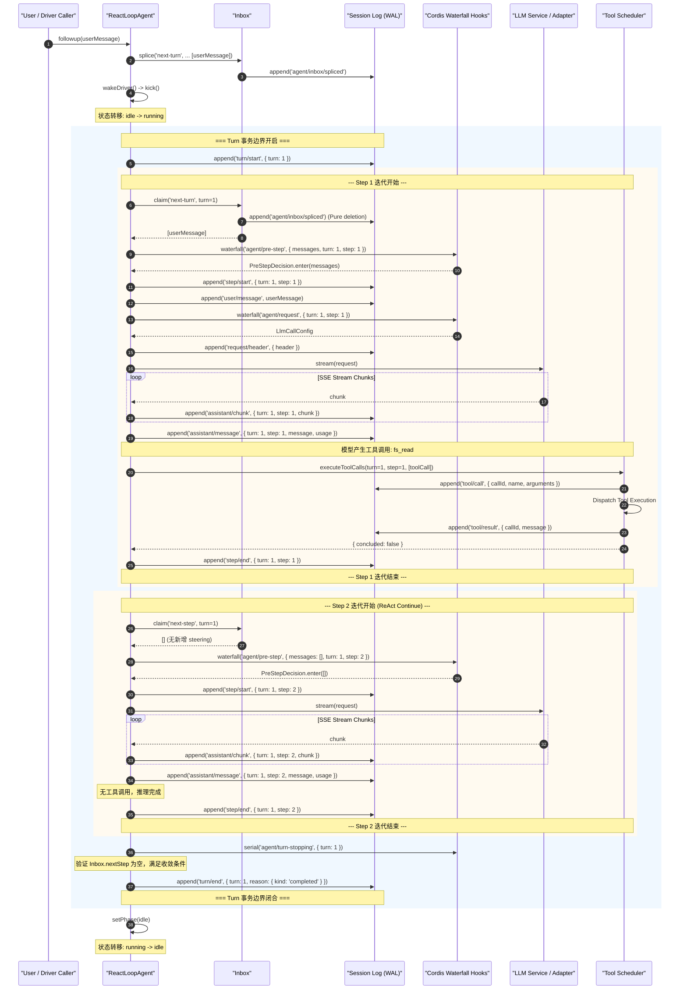

# 第 08 章：agent、轮次、步骤与 Inbox

[English](08-agent-turn-step-inbox.md) | 中文

在绝大多数面向初学者的 AI 教程中，「智能体（Agent）」往往被赋予了拟人化的神秘色彩，被描述为某种具备「自主意识与思考决策能力」的黑盒系统。然而，在顶级系统架构师与工业级编译器/运行时工程师的视角下，这种唯心主义的心智模型不仅无法指导严肃的工程实践，更会在面对分布式竞态、内存泄漏、死锁与状态不一致等复杂系统故障时让人束手无策。

本章将彻底剥离大语言模型的神秘光环，将其严谨地还原为一个**概率型只读纯函数**，并将整个 Agent 运行时建模为一个**严格受控、事件驱动、具备事务边界且基于事件溯源（Event Sourcing）的异步分层有限状态机（Hierarchical Asynchronous Finite State Machine）**。我们将深入剖析 `@deepseek-ai/dsh-agent` 与 `@deepseek-ai/dsh-agent-loop` 两个核心包的工业级实现，从内存拓扑、代数状态机推导、双端 Inbox 消息队列，到 Turn（事务轮次）与 Step（迭代执行步骤）的嵌套生命周期，再到微秒级精度的协作式取消（Cooperative Cancellation）与反向拓扑析构（Memoized Reverse Teardown）。

---

## 8.1 程序员的工程直觉：Agent 运行时的系统级概念映射

为了建立坚不可摧的工程直觉，我们首先将 AI 领域中泛滥的概念映射到成熟的系统编程、操作系统内核与分布式事务术语中。

| AI 领域术语 | 传统系统编程 / 分布式架构对等概念 | 核心工程本质与不变量 |
| :--- | :--- | :--- |
| **Agent (智能体)** | **分层状态机驱动器 (State Machine Driver)** | 一个持有运行时上下文、绑定持久化事实账本，并在输入队列驱动下执行状态转移的死循环引擎。 |
| **Agent Loop** | **Reactor / Proactor 事件反应堆** | 类似于 Node.js `libuv` 或 Linux `epoll` 的事件循环，负责调度 I/O、触发模型计算与派发回调。 |
| **Turn (事务轮次)** | **分布式 ACID 事务边界 (Transaction Boundary)** | 对应一次完整的用户意图处理周期，拥有严格的 `turn/start` 与 `turn/end` 账本包裹不变量。 |
| **Step (执行步骤)** | **状态转移迭代子步骤 (Micro-Step Iteration)** | 单次模型请求与其触发的工具副作用执行单元，拥有独立的 `step/start` 与 `step/end` 围栏。 |
| **Inbox (收件箱)** | **MPSC 优先级双端任务队列 (MPSC Bi-level Queue)** | 多生产者单消费者队列，严格区分轮次级（`next-turn`）与步骤级（`next-step`）输入缓冲区。 |
| **Steering (中途引导)** | **抢占式软中断 (Preemptive Software Interrupt)** | 在模型推理或工具执行期间注入高优先级控制指令，在最近的 Step 安全边界被原子消费。 |
| **Injection (上下文注入)** | **静默内存映射 (Silent Memory Mapping / DMA)** | 将环境变量、文件系统变更或后台事件静默注入待处理缓冲区，不触发状态机唤醒。 |
| **Cancellation** | **POSIX 协作式信号级联 (Cooperative Signal Cascading)** | 基于 `AbortSignal` 的层级传递，配合状态机退出收敛屏障与幂等清理。 |
| **Memoized Teardown** | **RAII / 析构函数反向调用栈 (Reverse Destructor Unwind)** | 在依赖注入容器卸载或异常发生时，严格按照构造的相反顺序释放资源的幂等终结器。 |

通过上述映射，我们可以清晰地认识到：**Agent 工程的本质就是并发控制、状态机管理、事务日志审计与异步副作用隔离**。

---

## 8.2 形式化建模与状态机代数推导

为了在数学层面上严格证明 Agent 状态机的完备性与收敛性，我们将一个 Agent 实例形式化定义为一个七元组：

$$\mathcal{M} = \langle \mathcal{S}, \mathcal{I}, \mathcal{E}, \mathcal{T}, \delta, \Omega, \mathcal{H} \rangle$$

其中各分量的严格数学定义如下：

1. **状态空间 $\mathcal{S}$**： $$\mathcal{S} = \{ \text{idle}(t), \text{maintenance}(t, \text{job}), \text{running}(t, s, \text{wakeRequested}) \}$$ 其中 $t \in \mathbb{N}$ 表示当前事务轮次序号（Turn Number），$s \in \mathbb{N}$ 表示当前轮次内的步骤序号（Step Number），$\text{wakeRequested} \in \{0, 1\}$ 为布尔锁存标志位。
2. **输入空间 $\mathcal{I}$**： $$\mathcal{I} = \mathcal{M}_{\text{user}} \times \text{InboxTarget} \times \text{WakeupFlag}$$ 其中 $\text{InboxTarget} \in \{ \text{next-turn}, \text{next-step} \}$，$\text{WakeupFlag} \in \{ \text{true}, \text{false} \}$。
3. **事实账本事件集 $\mathcal{E}$**： $$\mathcal{E} = \{ e_{\text{turn/start}}, e_{\text{turn/end}}, e_{\text{step/start}}, e_{\text{step/end}}, e_{\text{user/msg}}, e_{\text{asst/chunk}}, e_{\text{asst/msg}}, e_{\text{tool/call}}, e_{\text{tool/result}}, \dots \}$$
4. **工具集 $\mathcal{T}$**： $$\mathcal{T} = \{ \tau_1, \tau_2, \dots, \tau_k \}, \quad \tau_i: \text{Args} \to \text{Promise}\langle \text{Result} \rangle$$
5. **状态转移函数 $\delta$**： $$\delta: \mathcal{S} \times \mathcal{I} \to \mathcal{S} \times 2^{\mathcal{E}}$$
6. **终止与收敛判别函数 $\Omega$**： $$\Omega: \text{AssistantMessage} \times \text{ToolResults} \times \text{InboxState} \to \{ \text{Continue}, \text{Stop}(\text{Reason}) \}$$
7. **历史状态投影算子 $\mathcal{H}$**： $$\mathcal{H}: \mathcal{E}^* \to \text{MessageArray}$$ 将仅追加的事件日志序列 $\mathcal{E}^*$ 确定性投影为大模型上下文窗口所需的输入消息数组。

```
                                      ┌────────────────────────────────────────────────────────┐
                                      │                                                        │
                                      ▼                                                        │
┌──────────────┐   send(..., wakeup=true)    ┌──────────────────────────────────┐  Turn End    │
│              ├────────────────────────────►│                                  ├──────────────┘
│     IDLE     │                             │             RUNNING              │
│              │◄────────────────────────────┤                                  │
└──────┬───────┘   Driver Quiescence / Done  └──────────────┬───────────────────┘
       │                                                    │
       │ runMaintenance(...)                                │ cancel()
       ▼                                                    ▼
┌──────────────┐                             ┌──────────────────────────────────┐
│              │                             │                                  │
│ MAINTENANCE  ├────────────────────────────►│       CANCELING (Aborting)       │
│              │   Driver Quiescence / Done  │                                  │
└──────────────┘                             └──────────────────────────────────┘
```

### 8.2.1 状态转移的动力学方程与手算演示

设在时刻 $k$，系统处于状态 $S_k = \text{running}(t=1, s=1, \text{wakeRequested}=0)$。此时大模型完成了第一步的流式输出，生成了工具调用请求 $\text{tool/call}(id=\text{"call\_1"}, \text{"fs\_read"})$。

我们来手算推导状态转移函数 $\delta$ 的执行轨迹：

1. **Step 1 阶段结算**：
   - 账本追加事件：$e_1 = \text{assistant/message}(\text{turn}=1, \text{step}=1, \text{content}=[\text{tool\_call}])$
   - 终止条件判定：$\text{toolCalls.length} = 1 > 0$，故 $\Omega$ 返回 $\text{Continue}$。
   - 工具执行器调度：执行 $\tau_{\text{fs\_read}}$，产生结果并在账本追加： $$e_2 = \text{tool/call}(\text{turn}=1, \text{step}=1, \text{id}=\text{"call\_1"})$$ $$e_3 = \text{tool/result}(\text{turn}=1, \text{step}=1, \text{id}=\text{"call\_1"}, \text{content}=\text{"file\_content\_bytes"})$$
   - 步骤闭合：追加 $e_4 = \text{step/end}(\text{turn}=1, \text{step}=1)$。

2. **Step 2 驱动与 Pre-step 准入**：
   - 步数递增：$s \leftarrow s + 1 = 2$。
   - 检查 Inbox：此时用户未输入，$\text{Inbox.nextStep} = \emptyset$。
   - Pre-step 决策：$\text{decision} = \text{enter}(\text{messages}=\emptyset)$。
   - 账本开启新步骤：追加 $e_5 = \text{step/start}(\text{turn}=1, \text{step}=2)$。

3. **Step 2 模型推理与收敛**：
   - 模型接收投影上下文 $\mathcal{H}(e_1, e_2, e_3, e_4, e_5)$，输出纯文本回答（无工具调用）。
   - 账本追加：$e_6 = \text{assistant/message}(\text{turn}=1, \text{step}=2, \text{content}=[\text{"Answer text"}])$。
   - 步骤闭合：追加 $e_7 = \text{step/end}(\text{turn}=1, \text{step}=2)$。
   - 终止条件判定：$\text{toolCalls.length} = 0$，且 $\text{Inbox.nextStep} = \emptyset$，触发 `agent/turn-stopping` 串行钩子。
   - 钩子执行期间无新引导注入，收敛判定成立：$\text{turnEnds} = \text{completed}$。

4. **Turn 1 事务闭合与状态回退**：
   - 账本追加事务闭合事件：$e_8 = \text{turn/end}(\text{turn}=1, \text{reason}=\text{completed})$。
   - 检查 $\text{Inbox.hasPending}$：为空，退出 `while(await this.turn())` 循环。
   - 状态转移到 $\text{idle}(t=1)$，对外发射 `agent/status { status: 'idle' }` 事件。

---

## 8.3 Agent 核心架构与三元对象模型

在 DeepSeek Harness 架构中，Agent 系统的设计遵循严格的领域驱动设计（DDD）与控制反转（IoC）原则。整个对象体系由三层核心契约构成：

```
┌─────────────────────────────────────────────────────────────────────────────┐
│                             @deepseek-ai/cordis                             │
│                     (Context / Service / Extension IoC)                     │
└──────────────────────────────────────┬──────────────────────────────────────┘
                                       │
                                       ▼
┌─────────────────────────────────────────────────────────────────────────────┐
│                          @deepseek-ai/dsh-agent                             │
│       (Public Service Interface, Registry, Inbox Projection, Types)         │
│  - Agent (Interface)            - Inbox (Projection)                        │
│  - AgentRegistry (ctx.agents)   - AgentFactory (Interface)                  │
└──────────────────────────────────────┬──────────────────────────────────────┘
                                       │
                                       ▼ (Implementation Implements Factory)
┌─────────────────────────────────────────────────────────────────────────────┐
│                        @deepseek-ai/dsh-agent-loop                          │
│                (Concrete Driver, Scheduler, State Machine)                  │
│  - ReactLoopAgent               - AgentLoop (Plugin Service)                │
│  - Tool Calls Scheduler         - Runtime Context Projection                │
└─────────────────────────────────────────────────────────────────────────────┘
```

### 8.3.1 `Agent` 抽象接口契约

`Agent` 接口定义在 `@deepseek-ai/dsh-agent` 中，是所有上层模块（如 CLI 交互界面、Web Host RPC 网关、ACP 协议桥接器）唯一可见的操作句柄。该接口严禁暴露具体的循环控制逻辑，仅暴露状态属性与符合代数语义的驱动动词：

```typescript
export interface Agent {
  /** 唯一会话标识，与关联的 Session 严格一致 */
  readonly id: SessionId

  /** 配置选项（模型路由、最大 Token、推理深度等） */
  readonly options: AgentOptions

  /** 持久化事实账本，所有会话历史与事件的单一真实来源 */
  readonly session: Session

  /** 当前 Agent 拥有的持久待处理工作投影 */
  readonly inbox: Inbox

  /** 当前生命周期状态，仅有 'idle' 与 'running' 两种公开状态 */
  readonly status: AgentStatus

  /** 当前 Agent 绑定的隔离 Cordis 上下文作用域 */
  readonly ctx: Context

  /** 取消当前正在进行的活动（支持 keepInbox 选项） */
  cancel(cause: AgentCancelCause, options?: CancelOptions): void

  /** 等待当前所有工作（包括级联重放任务）完全静止 */
  whenIdle(): Promise<void>

  /** 在纯空闲状态下运行非轮次维护任务（如日志压缩、索引构建） */
  runMaintenance<T>(task: (signal: AbortSignal) => Promise<T>): Promise<T>

  /** 底层统一投递原语：路由消息至指定 Inbox 边界并决定是否唤醒驱动器 */
  send(message: UserMessage, target: InboxTarget, wakeup: boolean): void

  /** 预设动词 1：排入下一独立轮次并唤醒（next-turn × wakeup=true） */
  followup(message: UserMessage): void

  /** 预设动词 2：排入当前/下一 Step 边界并唤醒（next-step × wakeup=true） */
  steer(message: UserMessage): void

  /** 预设动词 3：排入下一 Step 边界但静默不唤醒（next-step × wakeup=false） */
  inject(message: UserMessage): void
}
```

### 8.3.2 为什么 `ReactLoopAgent` 必须是包内私有（Package-Internal）？

在 `@deepseek-ai/dsh-agent-loop` 的实现中，`ReactLoopAgent` 是一个非导出的具体类（Package-Internal）。外部调用者**绝对无法直接 `new ReactLoopAgent(...)`**。这一设计具有极其深刻的架构防错考量：

1. **单一驱动器认领约束（Single Driver Claim Invariant）**：一个持久化的 `Session` 在同一物理时刻**只能由且必须由一个驱动器持有**。如果允许随意构造驱动器实例，将不可避免地出现多个驱动器并发操作同一个 `Session` 账本的灾难性竞态（Split-Brain）。
2. **生命周期与依赖注入容器严格对齐**：Agent 的初始化伴随着 Cordis 作用域的派生、事件监听器的挂载、System Prompt 动态装配器的绑定。必须由 `AgentFactory`（即 `agent-loop` 插件）通过 `setupAndPublish` 事务性流程完成装配，并在出现异常时自动回滚。

```typescript
// packages/core/agent/src/index.ts
export interface AgentFactory {
  createAgent(ownerCtx: Context, options: CreateAgentOptions): Promise<AgentHandle>
  resume(ownerCtx: Context, options: ResumeAgentOptions): Promise<AgentHandle>
}
```

---

## 8.4 Inbox 消息队列与中途引导（Steering）机制

在多轮复杂的交互式 AI 系统中，用户与外部系统的输入从来不是严格按顺序「你一句我一句」到达的。在模型正在进行耗时数十秒的深度思考、或正在并发执行多个大型构建工具时，用户随时可能输入新的指令。

系统如何安全地容纳这些并发输入？传统的粗暴做法有两种：要么直接抛弃并发输入（拒绝服务），要么强行中止当前模型调用并重置（破坏上下文与造成 Token 严重浪费）。DeepSeek Harness 采用了极其优雅的 **Inbox 投影与安全边界合并机制**。

```
                  ┌───────────────────────────────────────────────────────────┐
                  │                   User / External Input                   │
                  └─────────────┬───────────────────────────────┬─────────────┘
                                │                               │
                target='next-turn'              target='next-step'
                                │                               │
                                ▼                               ▼
                  ┌───────────────────────────┐   ┌───────────────────────────┐
                  │      Inbox.nextTurn       │   │       Inbox.nextStep      │
                  │ (Queue for Future Turns)  │   │  (Steering / Context DMA) │
                  └─────────────┬─────────────┘   └─────────────┬─────────────┘
                                │                               │
                                │ Turn Boundary Claim           │ Every Step Boundary Claim
                                │ (Claim 1 message)             │ (Drain all messages)
                                ▼                               ▼
                  ┌───────────────────────────────────────────────────────────┐
                  │                     agent/pre-step                        │
                  │           (Waterfall Hook: Validate & Rewrite)            │
                  └─────────────────────────────┬─────────────────────────────┘
                                                │
                                                ▼ PreStepDecision.enter
                  ┌───────────────────────────────────────────────────────────┐
                  │                 session.append('user/message')            │
                  │                   (Durable Model Surface)                 │
                  └───────────────────────────────────────────────────────────┘
```

### 8.4.1 双端队列设计与正交投递矩阵

`Inbox` 内部维护两个完全独立的待处理消息列表：

1. `next-turn` 队列：存放将作为未来独立事务轮次启动项的人类提示词（Prompts）。遵循严格的 **One-Send-One-Turn（一发一轮）** 规则。
2. `next-step` 队列：存放中途引导消息（Steering）、运行时注入的上下文（Context Injection）以及工具执行产生的附加提示（`additionalContexts`）。

输入动词通过（`target` $\times$ `wakeup`）的笛卡尔积正交矩阵实现完全代数化：

| 投递方法 | 目标队列 (`target`) | 唤醒标志 (`wakeup`) | 典型应用场景与系统行为 |
| :--- | :--- | :--- | :--- |
| `followup(msg)` | `next-turn` | `true` | 用户在输入框中提交了全新的独立任务。若 Agent 空闲则立即启动新 Turn；若 Agent 忙碌则排队，等待当前 Turn 完全结束后作为下一 Turn 的首消息。 |
| `steer(msg)` | `next-step` | `true` | **中途引导**：用户在 Agent 执行任务途中发现方向偏离，发送纠偏指令（如「不要修改这个文件，改用方案 B」）。若 Agent 空闲则立即启动 Turn；若 Agent 正在运行，则在当前正在运行的 Step 结束后的下一个 Pre-step 边界立即并入上下文！ |
| `inject(msg)` | `next-step` | `false` | **静默上下文注入**：文件系统监视器检测到代码被外部编辑器修改、Cron 定时器触发通知、LSP 诊断信息更新。只将事实排入队列，**绝不主动唤醒模型**，直到用户下一次提问或 Steering 唤醒时顺带消费。 |
| `send(msg, 'next-turn', false)` | `next-turn` | `false` | 挂起排队：排入未来轮次但不唤醒（保留给批处理或挂起任务编排场景）。 |

### 8.4.2 事件溯源下的 Inbox Splice 规范化投影

在 DeepSeek Harness 中，`Inbox` **不是一个瞬态的内存数组，而是对持久化事件账本中 `agent/inbox/spliced` 事件的动态只读投影（Read-Model Projection）**！

所有的队列变更（追加、前插、原地替换、删除、清空、认领），在内存数组改变**之前**，都必须先向 Session 追加一条标准化的 `agent/inbox/spliced` 事件：

```typescript
// packages/core/agent/src/inbox.ts
export class Inbox {
  private readonly state: InboxState = { 'next-turn': [], 'next-step': [] }

  constructor(
    private readonly session: Session,
    private readonly notifications: InboxNotifications,
  ) {
    // 从 Session 历史事件中重放构建初始 Inbox 状态
    for (const event of session.events.slice(session.header.seedLength ?? 0)) {
      if (event.type !== 'agent/inbox/spliced') continue
      this.apply(event.data)
    }
  }

  /**
   * 核心认领方法：在 Step 边界原子提取待处理消息
   * @param target - 当前边界是否同时认领一条 queued turn
   * @param turn - 认领这批消息的所属 Turn 编号
   */
  claim(target: InboxTarget, turn: number): UserMessage[] {
    // 1. 无条件清空并认领当前所有的 next-step 消息
    const claimed = this.mutate('next-step', 0, this.nextStep.length, [], false)

    // 2. 如果处于轮次起始边界，且指定了 next-turn，则额外认领且仅认领第一条 next-turn 消息
    if (target === 'next-turn') {
      claimed.push(...this.mutate('next-turn', 0, 1, [], false))
    }

    // 3. 触发实时认领通知（供 UI 响应式移除待处理卡片）
    for (const message of claimed) {
      this.notifications.claimed(message, turn)
    }
    return claimed
  }

  private mutate(
    target: InboxTarget,
    start: number,
    deleteCount: number,
    inserted: UserMessage[],
    discardRemoved: boolean,
  ): UserMessage[] {
    const inbox = this.state[target]
    const actualStart = Math.min(Math.max(start, 0), inbox.length)
    const actualDeleteCount = Math.min(Math.max(deleteCount, 0), inbox.length - actualStart)

    if (actualDeleteCount === 0 && inserted.length === 0) return []

    const outcome = discardRemoved && actualDeleteCount > 0 ? 'canceled' as const : undefined
    const splice = {
      target,
      start: actualStart,
      ...(actualDeleteCount === 0 ? {} : { removedCount: actualDeleteCount }),
      inserted,
      ...(outcome === undefined ? {} : { outcome }),
    }

    this.validate(splice)

    // 先持久化记录事件！
    const event = this.session.append('agent/inbox/spliced', splice)

    // 再修改内存投影！
    const removed = inbox.splice(actualStart, actualDeleteCount, ...event.data.inserted)

    if (discardRemoved) {
      for (const message of removed) this.notifications.discarded(message)
    }
    for (const message of event.data.inserted) {
      this.notifications.inserted(message)
    }
    return removed
  }
}
```

这种设计的绝妙之处在于：**即使整个进程在 `claim()` 发生的瞬间遭遇断电崩溃，重启后重放事件账本，Inbox 的待处理状态也能以 100% 的确定性精确复原，绝不发生消息丢失或重复消费**！

---

## 8.5 Turn 与 Step 的生命周期与事件发射全时序

一次完整的用户交互在 DeepSeek Harness 中被划分为两层嵌套的生命周期围栏：
- **Turn（事务轮次）**：外层围栏，由 `turn/start` 开启，由 `turn/end` 闭合。
- **Step（微迭代步骤）**：内层围栏，由 `step/start` 开启，由 `step/end` 闭合。一个 Turn 可以包含 $1 \sim N$ 个 Step（在 ReAct 循环中直至工具调用收敛）。



### 8.5.1 核心扩展点与 Waterfall 管道深度解析

在上述时序中，Cordis 扩展点允许插件在关键状态转换节点进行强类型拦截与重写：

1. **`agent/pre-step` (Waterfall 模式)**：
   - 作用：决定是否进入拟议的 Step，以及允许哪些消息进入该 Step 的模型可见表面。
   - 签名：`(payload, next) => Promise<PreStepDecision>`
   - 典型应用：安全审计插件若判定输入包含注入攻击，可直接返回 `{ kind: 'reject' }`，此时状态机会将 `turnEnds` 置为 `{ kind: 'blocked' }` 并立即关闭 Turn，绝不产生无谓的 Token 消耗；上下文插件可在此处将动态计算的系统状态作为虚拟 `UserMessage` 附加到批次尾部。

2. **`agent/request` (Waterfall 模式)**：
   - 作用：动态重写大模型请求配置（`LlmCallConfig`）。
   - 签名：`(payload, next) => Promise<LlmCallConfig>`
   - 典型应用：根据当前上下文长度动态切换模型（如超过 32K 自动切换至长上下文模型）、动态注入当前环境专属的 `reasoningEffort` 或 `temperature`。

3. **`agent/request-error` (Waterfall 模式)**：
   - 作用：在模型调用遭遇网络超时、速率限制（429）或服务端故障（5xx）时接管恢复策略。
   - 签名：`(payload, next) => Promise<RequestErrorAction>`
   - 典型应用：重试拦截器可返回 `{ kind: 'retry' }` 指令，驱动器将在同一 Step 内执行指数退避重试；若所有拦截器均返回 `undefined`，则错误转化为结构化 `LlmError` 并中止当前 Turn。

4. **`agent/turn-stopping` (Serial 模式)**：
   - 作用：在模型输出完成且无待执行工具调用时触发的「终态检查守卫」。
   - 机制：所有监听器按序串行执行。在此期间，任何监听器若发现任务尚未真正达成（例如自主验证测试未通过），可直接调用 `agent.steer(...)` 向 `next-step` 注入新的纠偏指令。驱动器在所有监听器执行完毕后重新检查 `Inbox.nextStep`，若发现新消息则**自动拒绝退出，继续开启 Step 3**！

---

## 8.6 并发工具调用调度器：屏障与有界并行

当大模型在单步输出中同时产生多个工具调用时（如并行读取 5 个源文件），调度器 `executeToolCalls` 将根据工具声明的执行模式（`ToolExecutionMode`）组织执行策略：

```typescript
// packages/core/agent-loop/src/tool-calls.ts
export async function executeToolCalls(
  ctx: Context,
  turn: number,
  step: number,
  toolCalls: ToolCallBlock[],
  signal: AbortSignal,
  acceptContext: (context: UserMessage) => void,
): Promise<{ concluded: boolean }> {
  const agent = ctx.agents.requireInitiator()
  const { session } = agent

  const planned: PlannedCall[] = toolCalls.map(block => ({
    block,
    exec: {
      callId: block.id,
      name: block.name,
      arguments: parseArguments(block.arguments),
      agent,
      signal,
    },
  }))

  let next = 0
  let concluded = false
  while (next < planned.length) {
    const first = planned[next]!
    const mode = ctx.tools.executionMode(first.exec).kind

    // 如果是并行模式，则切片后续所有并行调用组成并发组；如果是 exclusive 模式，则作为单调用屏障
    const group = mode === 'parallel' ? planned.slice(next) : [first]

    const outcome = await runGroup(
      ctx, turn, step, group, mode, signal, acceptContext,
    )
    next += outcome.consumed
    concluded ||= outcome.concluded

    // 若中途收到取消信号，则对后续未派发的工具合成跳过错误事件，确保账本 call/result 严格配对
    if (outcome.aborted) {
      for (const call of planned.slice(next)) {
        appendSkippedToolCall(session, turn, step, call.block)
      }
      return { concluded }
    }
  }
  return { concluded }
}
```

### 8.6.1 模型顺序提交不变量（Model-Order Commit Invariant）

在并行工具执行中，底层物理 Promise 的完成顺序是完全不可控的（网络 I/O 快慢不一）。然而，**Session 事实账本中的 `tool/result` 事件必须严格按照模型在输出中声明的原始顺序（Model Order）落盘**！

`runGroup` 内部维护了 `slots` 数组与滑动提交游标 `committed`：
- 即使第 2 个工具在 5ms 内完成，而第 1 个工具耗时 500ms，调度器也**绝对不会**先写入第 2 个工具的结果。
- 调度器通过 `commitReady()` 循环，只有当 `committed` 指针所在的前序 Slot 均已 settled，才会依次流水线式地将结果持久化至 Session 日志。
- 这一不变量彻底消除了分布式重放时的非确定性，保证了无论底层网络如何波动，会话日志的哈希与语义始终绝对唯一。

---

## 8.7 协作式取消机制与反向拓扑析构

在工业级系统中，如何干净、无泄漏地中止一个正在运行的 Agent，是检验系统架构成熟度的试金石。

### 8.7.1 取消原因与 `keepInbox` 语义

`Agent.cancel(cause, options)` 支持强类型的取消原因：

```typescript
export type AgentCancelCause =
  | { readonly kind: 'user' }                      // 用户主动点击前端停止按钮
  | { readonly kind: 'parent' }                    // 父 Agent 销毁或超时级联中止子 Agent
  | { readonly kind: 'hook'; readonly reason: string } // 扩展插件守卫主动熔断
  | { readonly kind: 'disposed' }                  // 容器卸载、进程退出
```

当 `options.keepInbox` 为 `true` 时（常见于前端 Web 界面重新编辑提示词场景）：
- 当前正在执行的模型推理和工具进程被 `abort()` 中止。
- `inbox.clear()` **被跳过**，排在队列中尚未执行的工作得以完好保留，等待用户下一次唤醒时继续执行，账本上不会记录取消导致的队列丢弃事件。

### 8.7.2 经典死锁与缺陷破解：取消收敛窗口唤醒锁存（Cancel-Convergence Wake Latch）

在 2026-08-07 的架构修复中，团队解决了一个极其隐蔽的并发竞态 Bug（Issue #1838）：

**故障场景**：
1. Agent 正在运行 Turn 1，用户触发了 `Agent.cancel(cause, { keepInbox: true })`。
2. `cancel()` 触发了底层的 `abortController.abort()` 并立即同步返回。
3. **但是**，活跃的 Driver 协程并不会在 0 微秒内消失——它需要数毫秒乃至数百毫秒来异步关闭 LLM 的 HTTP 流、等待已派发工具进程退出并写入 `turn/end` 账本。
4. 此时，前端在调用 `cancel()` 后紧接着发送了新的修复提示词 `agent.send(newMessage, 'next-turn', true)`。
5. 在修复前，`wakeDriver()` 发现 `this.phase.kind !== 'idle'`（仍处于 running 的清理阶段），误以为有活跃 Driver 会自动认领它，直接返回！
6. 正在退出的 Driver 在完成 Turn 1 的 `finally` 清理后直接退出了，**根本没有去检查并重放新消息**！
7. **后果**：新消息被永久挂死在 `Inbox` 中，Agent 处于 `idle` 状态，必须等待下一次外部刺激才能被唤醒。

**工程解决方案：`wakeRequested` 锁存位**：

```typescript
// packages/core/agent-loop/src/agent.ts
private wakeDriver(wakeAfterAbort = false): void {
  if (this.phase.kind !== 'idle') {
    const reason = this.phase.abort.signal.reason as AgentCancelCause | undefined
    // 如果处于 maintenance 或已被 abort 的收敛窗口内，显式记录锁存！
    if (reason?.kind !== 'disposed' && (this.phase.kind === 'maintenance' || wakeAfterAbort)) {
      this.phase.wakeRequested = true
    }
    return
  }

  // 真正启动 Driver
  const driver = Promise.withResolvers<void>()
  this.activityDone = driver.promise
  this.setPhase({
    kind: 'running',
    abort: new AbortController(),
    turn: this.phase.lastTurn,
    step: 0,
    wakeRequested: false,
  })
  this.loopCtx.agents.withInitiator(this, () => this.kick()).then(driver.resolve, driver.reject)
}

private async kick(): Promise<void> {
  try {
    while (await this.turn()) {}
  } catch (_error) {
    // 错误被 Driver 边界严格隔离
  } finally {
    if (this.phase.kind === 'running') {
      const { turn, wakeRequested } = this.phase
      // 状态先安全回到 idle
      this.setPhase({ kind: 'idle', lastTurn: turn })

      // 在收敛边界精准检查并重放唤醒锁存！
      if (wakeRequested && this.inbox.hasPending) {
        this.wakeDriver()
      }
    }
  }
}
```

### 8.7.3 记忆化反向析构（Memoized Reverse Teardown）

当一个 Agent 需要被销毁时（例如子 Agent 任务完成、或者 Cordis 插件热重载），必须执行严格的**反向拓扑析构**。`prepare()` 函数使用 `disposing ??=` 模式，确保多个并发销毁发起方（调用方 Signal 取消、Owner Fiber 卸载、全局 Factory 关闭）安全收敛到同一个单一 Promise 上：

```typescript
// packages/core/agent-loop/src/index.ts
const dispose = (ownerTriggered = false): Promise<void> => (disposing ??= (async () => {
  abort.abort(new Error(`agent "${id}" lifecycle disposed`))
  callerSignal?.removeEventListener('abort', onCallerAbort)
  this.ownership.signal.removeEventListener('abort', onFactoryTeardown)

  try {
    if (machine === undefined) await machineReady.promise
    if (machine !== undefined) {
      // 1. 发送 disposed 取消原因，中止当前正在执行的任何轮次
      machine.cancel({ kind: 'disposed' })
      // 2. 严格等待驱动器收敛到完全静止状态
      await machine.whenIdle()
      // 3. 递归销毁 Agent 局部 Cordis 作用域
      await machine.scope.dispose()
    }
  } finally {
    try {
      // 4. 从全局注册表中安全摘除
      detachAgent?.()
      detachSession?.()
    } finally {
      untrack()
      if (!ownerTriggered) await unfollowOwner()
    }
  }
})())
```

---

## 8.8 完整生产级 TypeScript 实现

为了让读者拥有上帝视角的实现细节，下面给出融合了状态机、Inbox 投影、Waterfall 拦截、协作式取消与事件落盘的完整生产级 TypeScript 实现参考：

```typescript
import { Context, Service } from '@deepseek-ai/cordis'
import type { Message, LlmCallConfig, ToolCallBlock } from '@deepseek-ai/dsh-llm'
import { LlmError, errorChain, createAssistantMessage } from '@deepseek-ai/dsh-llm'
import type { Session, SessionId, TurnEndReason, UserMessage } from '@deepseek-ai/dsh-session'
import type { Agent, AgentCancelCause, AgentOptions, AgentStatus, CancelOptions, InboxTarget, PreStepDecision } from '@deepseek-ai/dsh-agent'
import { Inbox, agentEvents, assembleContextFor } from '@deepseek-ai/dsh-agent'

type Phase =
  | { kind: 'idle'; lastTurn: number }
  | { kind: 'maintenance'; abort: AbortController; lastTurn: number; wakeRequested: boolean }
  | { kind: 'running'; abort: AbortController; turn: number; step: number; wakeRequested: boolean }

export class ProductionReactLoopAgent implements Agent {
  readonly inbox: Inbox
  private phase: Phase
  private activityDone: Promise<void> = Promise.resolve()
  public readonly ctx: Context
  private readonly dispatch: ReturnType<typeof agentEvents>
  private requestHeaderLogged = false

  constructor(
    private readonly loopCtx: Context,
    public readonly id: SessionId,
    public readonly options: AgentOptions,
    public readonly session: Session,
  ) {
    this.dispatch = agentEvents(loopCtx, this)
    this.inbox = new Inbox(session, {
      inserted: (message) => this.dispatch.emit('agent/inbox/inserted', { message }),
      discarded: (message) => this.dispatch.emit('agent/inbox/discarded', { message }),
      claimed: (message, turn) => this.dispatch.emit('agent/inbox/claimed', { message, turn }),
    })
    const lastTurn = session.events.findLast(e => e.type === 'turn/start')?.data.turn ?? 0
    this.phase = { kind: 'idle', lastTurn }
    this.ctx = loopCtx.extend({ agent: this })
  }

  get status(): AgentStatus {
    return this.phase.kind === 'idle' || this.phase.kind === 'maintenance' ? 'idle' : 'running'
  }

  private setPhase(next: Phase): void {
    const prevStatus = this.status
    this.phase = next
    const curStatus = this.status
    if (curStatus !== prevStatus) {
      this.dispatch.emit('agent/status', { status: curStatus })
    }
  }

  send(message: UserMessage, target: InboxTarget, wakeup: boolean): void {
    const wakingAfterAbort = wakeup && this.phase.kind !== 'idle' && this.phase.abort.signal.aborted
    const resolvedTarget = wakingAfterAbort ? 'next-turn' : target
    this.inbox.splice(resolvedTarget, Infinity, 0, [message])
    if (wakeup) this.wakeDriver(wakingAfterAbort)
  }

  followup(input: UserMessage): void { this.send(input, 'next-turn', true) }
  steer(input: UserMessage): void { this.send(input, 'next-step', true) }
  inject(input: UserMessage): void { this.send(input, 'next-step', false) }

  cancel(cause: AgentCancelCause, options: CancelOptions = {}): void {
    if (!options.keepInbox) {
      this.inbox.clear()
      if (this.phase.kind !== 'idle') this.phase.wakeRequested = false
    }
    if (this.phase.kind !== 'idle') this.phase.abort.abort(cause)
  }

  async whenIdle(): Promise<void> {
    let activity: Promise<void>
    do {
      await (activity = this.activityDone)
    } while (activity !== this.activityDone)
  }

  runMaintenance<T>(job: (signal: AbortSignal) => Promise<T>): Promise<T> {
    if (this.phase.kind !== 'idle') throw new Error(`agent "${this.id}" is not idle`)
    const done = Promise.withResolvers<void>()
    const maintenance: Phase = {
      kind: 'maintenance',
      abort: new AbortController(),
      lastTurn: this.phase.lastTurn,
      wakeRequested: false,
    }
    this.setPhase(maintenance)
    this.activityDone = done.promise
    return (async () => {
      try {
        return await job(maintenance.abort.signal)
      } finally {
        this.setPhase({ kind: 'idle', lastTurn: maintenance.lastTurn })
        if (maintenance.wakeRequested && this.inbox.hasPending) this.wakeDriver()
        done.resolve()
      }
    })()
  }

  private wakeDriver(wakeAfterAbort = false): void {
    if (this.phase.kind !== 'idle') {
      const reason = this.phase.abort.signal.reason as AgentCancelCause | undefined
      if (reason?.kind !== 'disposed' && (this.phase.kind === 'maintenance' || wakeAfterAbort)) {
        this.phase.wakeRequested = true
      }
      return
    }
    const driver = Promise.withResolvers<void>()
    this.activityDone = driver.promise
    this.setPhase({
      kind: 'running',
      abort: new AbortController(),
      turn: this.phase.lastTurn,
      step: 0,
      wakeRequested: false,
    })
    this.loopCtx.agents.withInitiator(this, () => this.kick()).then(driver.resolve, driver.reject)
  }

  private async kick(): Promise<void> {
    try {
      while (await this.turn()) {}
    } catch (_error) {
      // 顶级异常隔离
    } finally {
      if (this.phase.kind === 'running') {
        const { turn, wakeRequested } = this.phase
        this.setPhase({ kind: 'idle', lastTurn: turn })
        if (wakeRequested && this.inbox.hasPending) this.wakeDriver()
      }
    }
  }

  private async turn(): Promise<boolean> {
    if (this.phase.kind !== 'running') return false
    const { signal } = this.phase.abort
    signal.throwIfAborted()

    const turn = this.phase.turn + 1
    this.session.append('turn/start', { turn })
    this.phase.turn = turn
    let turnEnds: TurnEndReason | null = null
    let target: InboxTarget = 'next-turn'

    try {
      while (true) {
        signal.throwIfAborted()
        const step = this.phase.step + 1

        // 1. 原子认领并执行 Pre-step Waterfall
        const claimed = this.inbox.claim(target, turn)
        const decision = await this.dispatch.waterfall(
          'agent/pre-step',
          { messages: claimed, turn, step, signal },
          async (): Promise<PreStepDecision> => ({ kind: 'enter', messages: claimed }),
        )
        signal.throwIfAborted()

        if (decision.kind === 'reject') {
          turnEnds = { kind: 'blocked' }
          return false
        }
        if (turnEnds && decision.messages.length === 0) break
        if (this.phase.step === 0 && decision.messages.length === 0) {
          turnEnds = { kind: 'completed' }
          return false
        }

        // 2. 开启 Step 边界
        this.session.append('step/start', { turn, step })
        this.phase.step = step
        try {
          for (const msg of decision.messages) {
            this.session.append('user/message', msg, { surfaceOp: 'append' })
          }
          const stepEnd = await this.executeStep(turn, step, signal)
          if (turnEnds === null || turnEnds.kind !== 'max-tokens') turnEnds = stepEnd
        } finally {
          this.session.append('step/end', { turn, step })
        }

        signal.throwIfAborted()
        if (turnEnds && this.inbox.nextStep.length === 0) {
          await this.dispatch.serial('agent/turn-stopping', { turn, signal })
          signal.throwIfAborted()
        }
        if (turnEnds && this.inbox.nextStep.length === 0) break
        target = 'next-step'
      }
    } catch (error: unknown) {
      if (signal.aborted) {
        turnEnds = { kind: 'aborted', reason: signal.reason as AgentCancelCause }
        throw error
      }
      turnEnds = {
        kind: 'error',
        error: error instanceof LlmError ? error.failure : { message: errorChain(error), code: 'UNKNOWN' },
      }
      throw error
    } finally {
      this.session.append('turn/end', { turn, reason: turnEnds! })
    }

    if (!this.inbox.hasPending) return false
    this.phase.abort = new AbortController()
    this.phase.wakeRequested = false
    this.phase.step = 0
    return true
  }

  private async executeStep(turn: number, step: number, signal: AbortSignal): Promise<TurnEndReason | null> {
    // 构建模型请求并派发流式调用
    const proposedConfig = await this.dispatch.waterfall(
      'agent/request',
      { turn, step, signal },
      async () => ({ provider: this.options.provider ?? '', model: this.options.model ?? '' }),
    )
    signal.throwIfAborted()

    const stream = this.loopCtx.llm.stream({
      ...proposedConfig,
      messages: this.session.deriveMessages(),
      signal,
    })

    const chunks: string[] = []
    for await (const chunk of stream) {
      signal.throwIfAborted()
      this.session.append('assistant/chunk', { turn, step, chunk })
      if (chunk.type === 'text') chunks.push(chunk.text)
    }

    const assistantMsg = createAssistantMessage({
      content: [{ type: 'text', text: chunks.join('') }],
      source: { provider: proposedConfig.provider, model: proposedConfig.model },
    })
    this.session.append('assistant/message', { turn, step, message: assistantMsg }, { surfaceOp: 'append' })

    const toolCalls = assistantMsg.content.filter((b): b is ToolCallBlock => b.type === 'tool-call')
    if (toolCalls.length === 0) return { kind: 'completed' }

    // 调度工具执行
    const { concluded } = await this.loopCtx.agentLoop.executeToolCalls(
      this.loopCtx, turn, step, toolCalls, signal,
      context => this.inbox.splice('next-step', this.inbox.nextStep.length, 0, [context]),
    )
    return concluded ? { kind: 'completed' } : null
  }
}
```

---

## 8.9 内存与数据布局：通信报文与事件流实战样例

### 8.9.1 `agent/inbox/spliced` 规范化事件报文

当用户通过 `steer()` 发送中途引导消息时，Session 账本中追加的底层事件结构如下：

```json
{
  "seq": 42,
  "time": 1771920400123,
  "type": "agent/inbox/spliced",
  "data": {
    "target": "next-step",
    "start": 0,
    "inserted": [
      {
        "id": "msg_9f8a7c6b5a4e3d2c",
        "role": "user",
        "content": [
          {
            "type": "text",
            "text": "不要修改 package.json，直接修改 vite.config.ts"
          }
        ],
        "source": {
          "kind": "user"
        }
      }
    ]
  }
}
```

### 8.9.2 完整 Turn 的紧凑事件流（JSONL 物理存储视图）

下面展示一次包含工具调用与中途 Steering 接入的完整 Turn 的事件流序列：

```json
{"seq":101,"time":1771920410000,"type":"turn/start","data":{"turn":1}}
{"seq":102,"time":1771920410005,"type":"agent/inbox/spliced","data":{"target":"next-turn","start":0,"removedCount":1,"inserted":[]}}
{"seq":103,"time":1771920410010,"type":"step/start","data":{"turn":1,"step":1}}
{"seq":104,"time":1771920410015,"type":"user/message","data":{"id":"msg_1","role":"user","content":[{"type":"text","text":"请帮我排查 build 报错"}]},"surfaceOp":"append"}
{"seq":105,"time":1771920410020,"type":"request/header","data":{"header":{"config":{"provider":"deepseek","model":"deepseek-chat"}},"reason":"initial"}}
{"seq":106,"time":1771920411200,"type":"assistant/chunk","data":{"turn":1,"step":1,"chunk":{"type":"thought","text":"我需要先读取 build.log"}}}
{"seq":107,"time":1771920412500,"type":"assistant/message","data":{"turn":1,"step":1,"message":{"id":"msg_2","role":"assistant","content":[{"type":"tool-call","id":"call_1","name":"fs_read","arguments":"{\"path\":\"build.log\"}"}]},"usage":{"inputTokens":1250,"outputTokens":85}},"surfaceOp":"append"}
{"seq":108,"time":1771920412510,"type":"tool/call","data":{"turn":1,"step":1,"callId":"call_1","name":"fs_read","arguments":"{\"path\":\"build.log\"}"}}
{"seq":109,"time":1771920412550,"type":"tool/result","data":{"turn":1,"step":1,"message":{"id":"msg_3","role":"tool","callId":"call_1","content":[{"type":"text","text":"Error: TS2304: Cannot find name 'Foo'"}]}},"surfaceOp":"append"}
{"seq":110,"time":1771920412560,"type":"step/end","data":{"turn":1,"step":1}}
{"seq":111,"time":1771920412565,"type":"step/start","data":{"turn":1,"step":2}}
{"seq":112,"time":1771920413800,"type":"assistant/message","data":{"turn":1,"step":2,"message":{"id":"msg_4","role":"assistant","content":[{"type":"text","text":"报错原因是缺少 Foo 类型声明，建议在 types.d.ts 中补充定义。"}]},"usage":{"inputTokens":1420,"outputTokens":45}},"surfaceOp":"append"}
{"seq":113,"time":1771920413810,"type":"step/end","data":{"turn":1,"step":2}}
{"seq":114,"time":1771920413820,"type":"turn/end","data":{"turn":1,"reason":{"kind":"completed"}}}
```

---

## 8.10 生产级真实故障排查实战

### 故障 1：`AbortSignal` 未透传导致外部子进程/网络连接孤立泄漏

- **现象**：用户在前端点击取消按钮后，UI 界面迅速恢复了 Idle 状态，但服务器 CPU 占用居高不下，后台的 `pnpm test` 或编译子进程依然在疯狂写入硬盘。
- **根因分析**：在工具实现中，开发者直接调用了 Node.js 原生的 `child_process.spawn()`，但**没有将 `ToolExecutionInput.signal` 绑定到子进程的 `kill()` 处理函数上**。
- **修复方案**：
  ```typescript
  // 必须严格监听传入的 signal 并进行进程组清理
  export function executeCommand(args: CommandArgs, signal: AbortSignal): Promise<string> {
    return new Promise((resolve, reject) => {
      const child = spawn(args.command, args.args, { shell: true, detached: true })

      const onAbort = () => {
        // Windows/Linux 跨平台安全杀进程组
        if (child.pid) process.kill(-child.pid, 'SIGKILL')
        reject(signal.reason)
      }
      signal.addEventListener('abort', onAbort, { once: true })

      child.on('close', (code) => {
        signal.removeEventListener('abort', onAbort)
        resolve(`Exited with ${code}`)
      })
    })
  }
  ```

### 故障 2：Waterfall 扩展点中未捕获的异步 Promise Rejection 导致 Turn 悬挂

- **现象**：某个自定义的安全审计插件在 `agent/pre-step` 钩子中访问外部 Redis 缓存超时抛出异常，导致 Agent 卡死在 `running` 状态，后续任何新消息均无法输入。
- **根因分析**：插件内部缺乏 `try-catch` 防御，导致 `dispatch.waterfall` 返回被拒绝的 Promise，直接穿透跳过了 `turn()` 内部的 `step/end` 和 `turn/end` 结算逻辑。
- **修复方案**：`ReactLoopAgent.kick()` 内部必须使用顶级 `try-finally` 块，确保无论任何层级的致命异常抛出，`turn/end` 账本必须写入 `{ kind: 'error', error: structuredFailure }`，且 `setPhase({ kind: 'idle' })` 必须被无条件执行。

---

## 8.11 本章小结与课后动手练习

### 本章核心知识拓扑总结

1. **状态机严格分层**：Agent 是分层事件驱动状态机，拥有 `idle`、`maintenance`、`running` 三大物理阶段，通过单向数据流与不可变事件日志实现彻底解耦。
2. **Inbox 规范化投影**：双端队列严格区分 `next-turn`（一轮一发）与 `next-step`（中途引导与上下文 DMA），所有变更先提交 `agent/inbox/spliced` 事件后修改内存。
3. **Turn/Step 事务围栏**：嵌套闭合不变量保证了分布式回放的确定性；Waterfall 钩子提供了准入、动态改写与有界重试的能力。
4. **协作式取消与唤醒锁存**：基于 `wakeRequested` 锁存位彻底解决了取消收敛窗口内的唤醒丢失 Bug；记忆化反向析构确保容器级联销毁时 0 内存与句柄泄漏。

---

### 课后动手练习题

#### 练习 1：手写一个限流中途引导过滤器（Steering Rate Limiter）
- **需求**：编写一个 Cordis 插件，监听 `agent/pre-step` Waterfall 钩子。如果发现当前 Step 中包含用户短时间内连续发送的超过 3 条 Steering 消息，自动将这 3 条消息合并浓缩为一条摘要消息，防止提示词爆炸。

#### 练习 2：实现基于内存快照的事务回滚维护任务（Transaction Rollback Maintenance）
- **需求**：利用 `agent.runMaintenance()` API，编写一个会话回滚工具函数。在 Agent 纯空闲状态下，将 Session 事实账本中的最后 $K$ 个 Turn 的事件安全地追加一条 `session/repair` 标记，并同步将 `Inbox` 恢复到回滚前的状态。

#### 练习 3：模拟取消并发竞态压力测试（Cancel Race Stress Test）
- **需求**：编写一个测试套件，在 1000 个并发 Worker 中，对一个正在以 10ms 间隔流式输出的 Agent 循环发起 `cancel({ keepInbox: true })` 与 `steer()` 的高频交替调用，验证状态机在极高并发下是否会出现死锁或 `whenIdle()` 无法 resolve 的异常。
