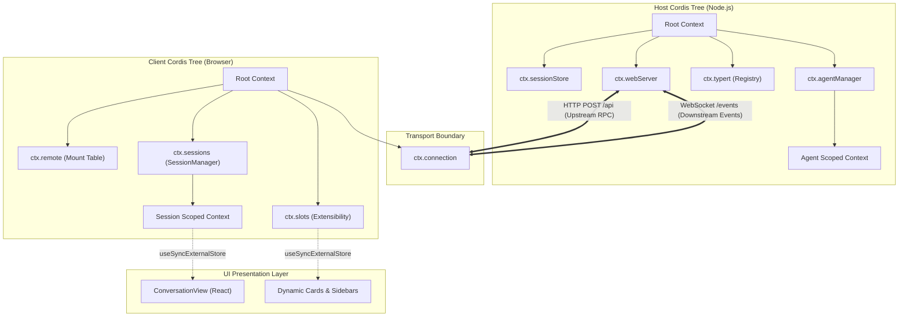

# Chapter 12: Web Host, RPC, and Pluggable UI

English | [中文](12-web-host-rpc-ui.zh.md)

One of the central challenges in building a production enterprise AI agent system is **exposing its privileged core engine—which can access the filesystem, terminal sandbox, kernel isolation, MCP processes, and durable event ledger—to an interactive frontend safely, deterministically, and efficiently, while keeping the browser UI responsive, free of tearing, and extensible through plugins**.

Conventional full-stack web systems often use a monolithic API proxy or share a general RPC framework such as gRPC, tRPC, or full GraphQL across frontend and backend. These approaches have serious shortcomings for agents: the backend manages a complex Cordis dependency-injection tree, agent session state machine, and sandbox isolation, while the frontend receives high-frequency streaming reasoning tokens (tens to hundreds of chunks per second), structured tool-call lifecycle events, and concurrent subagent interactions. UI components must also remain decoupled and dynamically pluggable. Sharing state directly can overload the main rendering thread, contaminate state across sessions, or create remote-code-execution vulnerabilities.

DeepSeek Harness addresses this with **separate Host and Client Cordis trees**, a **strictly typed Typert RPC gateway**, **HTTP and WebSocket channels for four message quadrants**, a **React-independent Zustand and Immer state machine**, and a **managed Chrome DevTools MCP browser-automation subsystem**. This chapter examines the runtime behind that agent UI from its foundations upward.

---

## 1. Mapping Systems Concepts to the Web Host and UI

To give engineers familiar with C, C++, Java, Go, or Rust a systems-level model, the table maps core concepts in an agent Web Host and frontend to established systems and distributed-computing concepts:

| Agent Web Host / UI concept | Systems-programming / distributed analogue | Responsibility and design constraint |
|---|---|---|
| **Separate Cordis trees** | **Client/server microkernel process topology** | The Node.js Host tree manages privileged services; the lightweight browser tree manages UI plugins and rendering projections. Their lifecycles are separate. |
| **Typert RPC gateway** | **Static IDL compiler and RPC stubs/skeletons (CORBA/MIDL/monomorphic stubs)** | Generates type graphs and monomorphic runtime codecs from the TypeScript AST, avoiding dynamic reflection and runtime `Proxy` overhead. |
| **Four-quadrant RPC messages** | **Full-duplex bidirectional frame channel** | Distinguishes client-initiated requests and responses from server-initiated events and interactions; branded `RpcId` values correlate them. |
| **HTTP Bridge (upstream)** | **Backpressure-aware system-call gate** | A memory-bounded adapter between native Node `IncomingMessage`/`ServerResponse` streams and WHATWG `fetch`. |
| **WebSocket downlink** | **Kernel event bus / evdev ring buffer** | Pushes agent session events, reasoning-token streams, and approval-interaction frames without polling. |
| **Zustand / Immer store** | **In-memory immutable snapshot tree / copy-on-write pages** | Separates business state from React and creates deterministic state projections through copy-on-write updates. |
| **`useSyncExternalStore`** | **Lock-free observer / interrupt subscription** | Prevents tearing under concurrent React rendering and uses fine-grained selectors to avoid unnecessary DOM redraws. |
| **Chrome DevTools MCP** | **Managed external device driver over IPC** | Runs an isolated headless-browser subprocess without a shell wrapper and exposes automation through standard tool calls. |

---

## 2. Separate Cordis Trees: Node.js Host and Browser Client

DeepSeek Harness avoids implicitly sharing business-state objects between frontend and backend. The Host and Client each run an independent **Cordis dependency-injection tree**.

```
+-----------------------------------------------------------------------------------------+
|                                NODE.JS HOST PROCESS                                     |
|                                                                                         |
|  +-----------------------------------------------------------------------------------+  |
|  | Context (Root Host Cordis Tree)                                                   |  |
|  |                                                                                   |  |
|  |  +---------------------+   +---------------------+   +-------------------------+  |  |
|  |  | ctx.sessionStore    |   | ctx.agentManager    |   | ctx.sandbox             |  |  |
|  |  +---------------------+   +---------------------+   +-------------------------+  |  |
|  |  +---------------------+   +---------------------+   +-------------------------+  |  |
|  |  | ctx.typertRegistry  |   | ctx.webServer       |   | ctx.connection (Host)   |  |  |
|  |  +---------------------+   +---------------------+   +-------------------------+  |  |
|  +-----------------------------------------------------------------------------------+  |
+-------------------------------------------|---------------------------------------------+
                                            |
                         HTTP (POST /api)   |   WebSocket (/events/*)
                         Upstream RPC Calls |   Downstream Event Streams
                                            |
+-------------------------------------------v---------------------------------------------+
|                                BROWSER CLIENT RUNTIME                                   |
|                                                                                         |
|  +-----------------------------------------------------------------------------------+  |
|  | Context (Root Client Cordis Tree)                                                 |  |
|  |                                                                                   |  |
|  |  +---------------------+   +---------------------+   +-------------------------+  |  |
|  |  | ctx.connection      |   | ctx.remote.*        |   | ctx.sessions            |  |  |
|  |  +---------------------+   +---------------------+   +-------------------------+  |  |
|  |  +---------------------+   +---------------------+   +-------------------------+  |  |
|  |  | ctx.slots (UI Ext)  |   | ctx.views (Cards)   |   | ctx.commands (/slash)   |  |  |
|  |  +---------------------+   +---------------------+   +-------------------------+  |  |
|  +-----------------------------------------------------------------------------------+  |
|                                           |                                             |
|                                           | useSyncExternalStore                        |
|                                           v                                             |
|  +-----------------------------------------------------------------------------------+  |
|  | React UI Layer (Pure Projection Components: MessageList, ToolCard, SideBar)       |  |
|  +-----------------------------------------------------------------------------------+  |
+-----------------------------------------------------------------------------------------+
```

### 2.1 Responsibilities and Lifecycle Topology

The two Cordis trees have distinct responsibilities and communicate through explicit gateways:

1. **Host process tree (privileged domain)**:
   - **Runtime**: Node.js ESM with full access to operating-system system calls.
   - **Responsibilities**: Manages LLM adapter connection pools, Linux Landlock and macOS Seatbelt kernel sandboxes, local filesystem I/O, the SQLite/Zstd event-sourced durable ledger, the background-job scheduler, and the Chrome DevTools MCP subprocess.
   - **Dependency topology**: Registers services exposed by business packages through `@Remote`, maintains type-safe RPC dispatch routes in `TypertRegistry`, and mounts HTTP/WebSocket transport through `WebServer`.

2. **Client plugin tree (unprivileged rendering domain)**:
   - **Runtime**: A browser JavaScript engine such as V8, SpiderMonkey, or JavaScriptCore, with no native Node module dependencies such as `node:fs` or `node:child_process`.
   - **Responsibilities**: Manages the `ConnectionController` connection state machine, `SessionProjection` session state, `SlotsRegistry` UI slots, `ViewRegistry` message cards, and slash-command completion.
   - **Dependency topology**: Mounts generated, strongly typed Remote proxy methods under `ctx.remote.<namespace>` and exposes read-only snapshots and immutable state sources to React containers.



### 2.2 Separate TypeScript Compiler Faces

Harness uses separate compiler faces so Node.js services cannot be accidentally bundled into the browser and browser-only DOM or React dependencies cannot enter the Host process:

```
                +------------------------------------+
                |        Monorepo Root Build         |
                +------------------------------------+
                                   |
                  [Phase 1: Build Lib Host]
                  tsc -b tsconfig.host.json
                  tsdown --env.DSH_BUILD_FACE host
                                   |
                                   +---> 运行 Typert Generator:
                                   |     遍历 Host ts.Program AST
                                   |     生成 lib/typert.host.*
                                   |     生成 lib/typert.remote-client.*
                                   |
                  [Phase 2: Build Lib Client]
                  tsc -b tsconfig.client.json
                  tsdown --env.DSH_BUILD_FACE client
                                   |
                                   +---> 消费 lib/typert.remote-client.*
                                   |     编译 Client 插件
                                   |     输出浏览器 bundle 与 node loader
                                   |
                  [Phase 3: Build Web Application]
                  pnpm --filter @deepseek-ai/dsh-web-frontend run build
```

In this build architecture:
- The root aggregate configuration separates `tsconfig.host.json` and `tsconfig.client.json` into independent TypeScript project-reference graphs.
- With `DSH_BUILD_FACE=host`, the build bundles only Host entry points; the Typert generator emits `typert.host.js` and `typert.remote-client.js`.
- With `DSH_BUILD_FACE=client`, the Client build consumes the static descriptors and codecs from Phase 1 without analyzing TypeScript source again in the frontend.

### 2.3 Pure Projection

The Client Cordis tree follows a **pure-projection architecture**:

- **No React dependency in data objects**: Core packages such as `runtime`, `connection`, and `sessions` contain no `import ... from 'react'`. Their data objects are pure TypeScript state machines or observable snapshot sources.
- **No framework imports in React components**: Business UI components do not directly `import` global singletons or invoke network APIs. Runtime capabilities and session data arrive through props or immutable snapshots subscribed to by `useSyncExternalStore` in a UI container.
- **Dynamic plugin extensions**: Third-party UI plugins register configuration and components with `ctx.slots` or `ctx.views` in the Client Cordis tree. They can add settings cards, message cards, or status indicators without modifying the main application.

### 2.4 Complete Example: Bootstrapping the Client Container and Plugins

The following production-style example initializes the browser Client Cordis container and loads its core plugins:

```ts ignore-check
// packages/client/runtime/src/client/bootstrap.ts
import { Context } from '@deepseek-ai/cordis'
import { createWebConnectionRpc } from '@deepseek-ai/dsh-client-connection/client'
import type { ClientConnectionRpc } from '@deepseek-ai/dsh-client-connection'

export interface ClientBootstrapOptions {
  readonly baseUrl?: string
  readonly onConnectionStateChange?: (state: 'connecting' | 'connected' | 'disconnected') => void
}

export interface ClientAppRuntime {
  readonly ctx: Context
  readonly dispose: () => Promise<void>
}

/**
 * 启动浏览器端 Client Cordis 根容器
 */
export async function bootstrapClientRuntime(options: ClientBootstrapOptions = {}): Promise<ClientAppRuntime> {
  const rootCtx = new Context()

  // 1. 初始化并挂载非 React 传输连接层
  const rpcCaller: ClientConnectionRpc = createWebConnectionRpc()
  rootCtx.provide('connection')
  rootCtx.connection = {
    rpc: rpcCaller,
    status: 'connected',
  }

  // 2. 挂载 Remote 客户端调用网关容器
  rootCtx.provide('remote')
  const mountedNamespaces = new Set<string>()
  rootCtx.remote = {
    $mount(namespace: string, methods: Record<string, Function>) {
      if (mountedNamespaces.has(namespace)) {
        throw new Error(`client-runtime: namespace '${namespace}' already mounted`)
      }
      mountedNamespaces.add(namespace)
      const subService = Object.freeze({ ...methods })
      ;(rootCtx.remote as Record<string, unknown>)[namespace] = subService

      return () => {
        mountedNamespaces.delete(namespace)
        delete (rootCtx.remote as Record<string, unknown>)[namespace]
      }
    },
  }

  // 3. 挂载 UI 扩展插槽与视图注册表
  rootCtx.provide('slots')
  const slotMap = new Map<string, Set<unknown>>()
  rootCtx.slots = {
    register(slotName: string, item: unknown) {
      if (!slotMap.has(slotName)) slotMap.set(slotName, new Set())
      slotMap.get(slotName)!.add(item)
      return () => {
        slotMap.get(slotName)?.delete(item)
      }
    },
    getItems(slotName: string) {
      return Array.from(slotMap.get(slotName) ?? [])
    },
  }

  return {
    ctx: rootCtx,
    dispose: async () => {
      await rootCtx.stop()
      mountedNamespaces.clear()
      slotMap.clear()
    },
  }
}
```

---

## 3. Typert RPC Gateway: From TypeScript Declarations to Type Graphs and Codecs

In a system with many cooperating agent plugins, frontend–backend communication has strict type and security requirements:
1. **No type drift**: If the backend changes a parameter or return type, frontend compilation with `tsc` must fail rather than exposing a missing field in production.
2. **No runtime `Proxy` overhead**: The system avoids intercepting every method call through JavaScript `Proxy`, which impedes V8 inline caches and JIT optimization and complicates property enumeration and reflection debugging.
3. **Precise IDE navigation**: When a frontend engineer Ctrl/Cmd-clicks `ctx.remote.goals.create()`, Go to Definition must reach the Host's `@Remote` source implementation rather than stop at a generated declaration.

Typert (Typed Export & RPC Tooling) is the deterministic RPC gateway designed for these requirements.

### 3.1 Declarative Decorators and Domain-Object Mapping

Backend business services extend `TypertRemoteService` and explicitly expose RPC methods with `@Remote` or `@RemoteScope`:

```ts
// packages/goal/src/service.ts
import { Context } from '@deepseek-ai/cordis'
import type { Agent } from '@deepseek-ai/dsh-agent'
import { TypertRemoteService, Remote, RemoteScope } from '@deepseek-ai/dsh-typert-protocol'

export interface CreateGoalRequest {
  objective: string
  priority: 'low' | 'normal' | 'high'
}

export interface CreateGoalResult {
  accepted: boolean
  goalId?: string
}

export class GoalService extends TypertRemoteService {
  constructor(ctx: Context) {
    super(ctx, 'goals')
  }

  /**
   * 暴露给 Client 的一元 Remote 方法。
   * Host 端签名中的 `agent: Agent` 属于复杂领域对象，不能直接跨网络传输；
   * Typert 将其自动映射为 Wire 层的 `agentId: SessionId` 并在网关层自动解析。
   */
  @Remote('create')
  createForClient(
    agent: Agent,
    request: CreateGoalRequest,
    signal: AbortSignal,
  ): Promise<CreateGoalResult> {
    signal.throwIfAborted()
    return this.create(agent, request)
  }

  @RemoteScope('agent', 'current')
  currentForClient(): CreateGoalResult {
    return { accepted: true }
  }

  private async create(agent: Agent, request: CreateGoalRequest): Promise<CreateGoalResult> {
    return { accepted: request.objective.length > 0, goalId: 'goal-998' }
  }
}
```

#### Mapping Domain Objects to Wire Values with `TypertLookupMap`

On the Host, `Agent`, `Session`, and `Workspace` are complex objects containing methods, state machines, and EventEmitters; they cannot be serialized directly. Typert introduces the `TypertLookupMap` contract:

```
+-------------------+                                       +-------------------+
|  Client Request   |                                       |   Host Dispatch   |
|                   |                                       |                   |
|  Wire Args:       |                                       |   Domain Args:    |
|  {                |    ctx.typert.lookups.resolve()       |   [               |
|    agentId: "a1", | ------------------------------------> |     agentInstance,|
|    request: {...} |                                       |     request,      |
|  }                |                                       |     signal        |
|                   |                                       |   ]               |
+-------------------+                                       +-------------------+
```

When the Host gateway receives a request, a resolver registered in `ctx.typert.lookups` converts `agentId` into a runtime `Agent` instance. If the target agent is cold and dormant, the resolver performs a deduplicated cold restore for concurrent requests. If the agent does not exist or has been disposed, the gateway returns `session-not-found` before entering the business method.

### 3.2 Static Analysis and Declaration Maps

During the build, `@deepseek-ai/dsh-typert-generator` uses the TypeScript compiler API (`ts.Program`) to traverse business-package ASTs and perform strict validation and generation:

1. **Method-signature validation**:
   - Methods must be public, non-static instance methods.
   - Generic methods, destructured parameters, default-valued parameters, and rest parameters are forbidden.
   - A final `signal: AbortSignal` parameter is recognized as a cancellation token and omitted from the network `args` dictionary.

2. **Generated artifacts**: Each business package emits the following into `lib/`, leaving `src/` untouched:
   - `typert.host.js` / `typert.host.d.ts`: Host runtime method descriptors and schema-validation rules.
   - `typert.remote-client.js`: A mountable contribution object with a lightweight runtime codec.
   - `typert.remote-client.d.ts`: Client declarations merged into `TypertRemoteNamespaceMap` and `TypertRemoteScopeMap`.
   - `typert.remote-client.d.ts.map`: A **VLQ-encoded source map** that maps a Client property call to the exact line and column of the decorated `@Remote` Host source, enabling cross-process Go to Definition.

```
Host 源码 (packages/goal/src/service.ts)
  L35: @Remote('create') createForClient(agent: Agent, request: CreateGoalRequest): CreateGoalResult
                                ^
                                | (typert.remote-client.d.ts.map Source Mapping)
                                |
Client 声明 (packages/goal/lib/typert.remote-client.d.ts)
  L12: create(agentId: SessionId, request: CreateGoalRequest, signal?: AbortSignal): Promise<CreateGoalResult>
```

### 3.3 Serialization-Codecs and Performance Accounting

Serialization costs directly affect UI response throughput. Let $S_{\text{raw}}$ be the original JSON byte length in an RPC request, $K$ its parameter-field count, and $C_{\text{val}}(K)$ the schema-validation cost function.

With conventional dynamically reflected RPC, parsing and proxy dispatch cost:

$$T_{\text{dynamic}} = T_{\text{json\_parse}}(S_{\text{raw}}) + T_{\text{proxy\_dispatch}} + T_{\text{reflect\_schema}}(K)$$

Typert instead generates monomorphic validation functions at compile time, allowing V8 to optimize them into machine code. Its cost model is:

$$T_{\text{typert}} = T_{\text{json\_parse}}(S_{\text{raw}}) + \sum_{i=1}^K T_{\text{type\_check}}(k_i)$$

Each monomorphic field check takes $T_{\text{type\_check}} \approx 1.2 \sim 3.5\text{ ns}$; compared with runtime AST validation (typically $\ge 150\text{ ns}$), the stated improvement exceeds two orders of magnitude.

### 3.4 Complete Example: Typert RPC Gateway and Dispatcher

The following production-style Host gateway demonstrates argument validation, lookup resolution, lifecycle binding, and error handling:

```ts ignore-check
// packages/api/gateway/src/typert-gateway.ts
import { Context, Service } from '@deepseek-ai/cordis'
import type { RpcError, RpcResult } from '@deepseek-ai/dsh-host-apiproxy/api'

export interface RemoteMethodDescriptor {
  readonly namespace: string
  readonly method: string
  readonly parameterNames: readonly string[]
  readonly lookupKeys: readonly (string | undefined)[]
  readonly hasSignal: boolean
  readonly validator: (args: Record<string, unknown>) => boolean
  readonly execute: (service: unknown, resolvedArgs: unknown[], signal: AbortSignal) => Promise<unknown>
}

export class TypertGatewayService extends Service {
  private readonly descriptors = new Map<string, RemoteMethodDescriptor>()

  constructor(ctx: Context) {
    super(ctx, 'typertGateway', true)
  }

  /**
   * 注册由构建生成的 Remote 描述符
   */
  public registerDescriptor(descriptor: RemoteMethodDescriptor): () => void {
    const key = `${descriptor.namespace}/${descriptor.method}`
    if (this.descriptors.has(key)) {
      throw new Error(`typert-gateway: duplicate registration for endpoint '${key}'`)
    }
    this.descriptors.set(key, descriptor)
    return () => {
      this.descriptors.delete(key)
    }
  }

  /**
   * 处理上行 RPC 调用
   */
  public async dispatch(
    endpoint: string,
    rawPayload: unknown,
    signal: AbortSignal,
  ): Promise<RpcResult<unknown>> {
    signal.throwIfAborted()

    const descriptor = this.descriptors.get(endpoint)
    if (!descriptor) {
      return {
        ok: false,
        error: {
          code: 'internal',
          message: `typert-gateway: endpoint '${endpoint}' not found`,
          details: {},
        },
      }
    }

    if (typeof rawPayload !== 'object' || rawPayload === null || !('args' in rawPayload)) {
      return {
        ok: false,
        error: {
          code: 'bad-request',
          message: `typert-gateway: payload must contain an 'args' object`,
          details: { issues: [] },
        },
      }
    }

    const args = (rawPayload as { args: Record<string, unknown> }).args
    if (!descriptor.validator(args)) {
      return {
        ok: false,
        error: {
          code: 'bad-request',
          message: `typert-gateway: arguments failed schema validation for '${endpoint}'`,
          details: { issues: [] },
        },
      }
    }

    // 从 Cordis 容器中解析对应的服务单例
    const targetService = (this.ctx as unknown as Record<string, unknown>)[descriptor.namespace]
    if (!targetService) {
      return {
        ok: false,
        error: {
          code: 'internal',
          message: `typert-gateway: backing service '${descriptor.namespace}' unavailable in Cordis context`,
          details: {},
        },
      }
    }

    try {
      const resolvedArgs: unknown[] = []
      for (let i = 0; i < descriptor.parameterNames.length; i++) {
        const paramName = descriptor.parameterNames[i]
        const lookupKey = descriptor.lookupKeys[i]
        const rawValue = args[paramName]

        if (lookupKey !== undefined) {
          // 通过 Lookup 机制解析领域实体对象
          const lookupResolver = (this.ctx as unknown as { typertLookups?: { resolve: (k: string, id: unknown) => Promise<unknown> } }).typertLookups
          if (!lookupResolver) {
            throw new Error(`typert-gateway: lookup provider required for key '${lookupKey}' but not registered`)
          }
          const domainObject = await lookupResolver.resolve(lookupKey, rawValue)
          if (!domainObject) {
            return {
              ok: false,
              error: {
                code: 'session-not-found',
                message: `typert-gateway: entity not found for lookup '${lookupKey}' with id '${String(rawValue)}'`,
                details: { sessionId: String(rawValue) as never },
              },
            }
          }
          resolvedArgs.push(domainObject)
        } else {
          resolvedArgs.push(rawValue)
        }
      }

      const result = await descriptor.execute(targetService, resolvedArgs, signal)
      return { ok: true, value: result }
    } catch (error: unknown) {
      if (signal.aborted) {
        return {
          ok: false,
          error: { code: 'cancelled', message: 'RPC call was aborted by client', details: {} },
        }
      }
      return {
        ok: false,
        error: {
          code: 'internal',
          message: error instanceof Error ? error.message : String(error),
          details: {},
        },
      }
    }
  }
}
```

---

## 4. Transport Channels and the Four-Quadrant RPC Gateway

To balance reliability, throughput, and backpressure on the web, DeepSeek Harness separates physical transport from logical message types and defines a **four-quadrant RPC message model**.

### 4.1 Four Message Quadrants and Branded `RpcId`

Traditional RPC can mix requests and responses in one channel without a strongly typed direction. Harness divides cross-process interactions into four quadrants:

```
                              [Message Origin]
                       Client                  Host
               +-----------------------+-----------------------+
   Request     |    ClientRequest      |    ServerRequest      |
               | (POST /api/<method>)  | (WebSocket Frame /    |
               |                       |  Approvals/Questions) |
[Interaction]  +-----------------------+-----------------------+
   Response    |    ClientResponse     |    ServerResponse     |
               | (POST /api/respond)   | (HTTP Response Body)  |
               |                       |                       |
               +-----------------------+-----------------------+
```

```ts ignore-check
// packages/host/apiproxy/src/api/rpc.ts
import type { Branded } from '@deepseek-ai/dsh-brand'

/** 品牌化 RpcId：零运行时开销，编译期防御 */
export type RpcId = Branded<'rpc-id'>

export function RpcId(id: string): RpcId {
  return id as RpcId
}

/** 1. 客户端发起的调用 */
export interface ClientRequest {
  type: 'client-request'
  rpcId: RpcId
  method: string
  payload: unknown
}

/** 2. 服务端对客户端调用的同步响应 */
export interface ServerResponse {
  type: 'server-response'
  rpcId: RpcId
  result: RpcResult<unknown>
}

/** 3. 服务端主动发起的下行推送或交互请求 */
export interface ServerRequest {
  type: 'server-request'
  rpcId: RpcId
  method: string
  payload: unknown
}

/** 4. 客户端对服务端交互请求的结算响应 */
export interface ClientResponse {
  type: 'client-response'
  rpcId: RpcId
  result: RpcResult<unknown>
}

export type RpcMessage = ClientRequest | ServerResponse | ServerRequest | ClientResponse
```

#### The Branded `RpcId` Echo Invariant

The system enforces these rules:
1. **Originator mints**: The browser creates a `ClientRequest` and mints its `RpcId` from a UUID; the Host creates a `ServerRequest` and mints its `RpcId`.
2. **Responder echoes**: Neither `ServerResponse` nor `ClientResponse` may mint a new `RpcId`. It must echo the corresponding request's `RpcId` unchanged.
3. **Deterministic assertion**: On receipt of an HTTP response, the client checks `if (response.rpcId !== sentRpcId) throw new Error(...)`. This prevents response misassociation when HTTP keep-alive pool reuse or proxy reordering occurs.

### 4.2 HTTP Bridge: A Memory-Bounded Adapter from Node Streams to WHATWG Fetch

On the Host, `packages/client/connection/src/http-bridge.ts` bridges low-level Node.js `node:http` objects to standard WHATWG `fetch` requests.

The bridge includes three important defenses:
- **Resident-memory bound**: `DEFAULT_MAX_REQUEST_BODY_BYTES = 300 * 1024 * 1024` (300 MiB) covers extreme payloads containing several base64-encoded high-resolution images. Larger requests are rejected at the TCP layer with `413 Payload Too Large`, preventing malformed or malicious requests from exhausting Host memory.
- **Correct disconnect detection**: The listener attaches to `res.on('close')`, not `req.on('close')`. In Node 16+, `IncomingMessage` emits `close` when the request body has been read, so listening to `req` would incorrectly abort a normal streaming response as it starts.
- **Streaming backpressure**: When `res.write()` returns `false`, the bridge pauses consumption until `drain` so a slow client cannot grow the Host's output buffer without bound and cause OOM.

```ts
// packages/client/connection/src/http-bridge.ts
import type { IncomingMessage, ServerResponse } from 'node:http'

export const DEFAULT_MAX_REQUEST_BODY_BYTES = 300 * 1024 * 1024

export interface FetchHandler {
  fetch(request: Request): Promise<Response>
}

export async function bridge(
  req: IncomingMessage,
  res: ServerResponse,
  apiHandler: FetchHandler,
  maxRequestBodyBytes = DEFAULT_MAX_REQUEST_BODY_BYTES,
): Promise<void> {
  const abort = new AbortController()

  // 必须监听 res.on('close')，因为 req.on('close') 在 body 读取后立即触发
  res.on('close', () => {
    if (!res.writableEnded) abort.abort()
  })

  const declaredLength = req.headers['content-length']
  if (declaredLength !== undefined && Number(declaredLength) > maxRequestBodyBytes) {
    res.writeHead(413, { connection: 'close' })
    res.end()
    req.destroy()
    return
  }

  const chunks: Buffer[] = []
  let received = 0
  for await (const chunk of req) {
    const buffer = chunk as Buffer
    received += buffer.byteLength
    if (received > maxRequestBodyBytes) {
      res.writeHead(413, { connection: 'close' })
      res.end()
      req.destroy()
      return
    }
    chunks.push(buffer)
  }

  const request = new Request(new URL(req.url ?? '/', 'http://dsh.internal'), {
    method: req.method ?? 'GET',
    headers: Object.fromEntries(
      Object.entries(req.headers).filter(([, v]) => typeof v === 'string') as [string, string][],
    ),
    ...(chunks.length > 0 ? { body: Buffer.concat(chunks) } : {}),
    signal: abort.signal,
  })

  const response = await apiHandler.fetch(request)
  res.writeHead(response.status, Object.fromEntries(response.headers.entries()))

  if (response.body === null) {
    res.end()
    return
  }

  for await (const chunk of response.body) {
    if (!res.write(chunk)) {
      await new Promise<void>((resolve) => {
        const done = (): void => {
          res.off('drain', done)
          res.off('close', done)
          resolve()
        }
        res.once('drain', done)
        res.once('close', done)
      })
    }
  }
  res.end()
}
```

### 4.3 WebSocket Downlink: Two Push Channels

The system maintains two dedicated WebSocket downlinks:
1. `/events/mux`: Multiplexes session events, reasoning chunks, and tool-call execution logs.
2. `/events/host`: Carries global Host events such as workspace changes, configuration updates, and plugin lifecycle events.

Client-to-Host data **never** travels over WebSocket; all upstream calls use HTTP `POST`. This asymmetric **HTTP upstream + WebSocket downstream** design has several advantages:
- Upstream requests retain HTTP status codes, proxy authentication, timeouts, and separate connections, so congestion on one WebSocket does not stall essential RPC calls.
- The downlink has only push semantics. If the Host crashes or the network disconnects, the client connection state machine can reconnect WebSocket independently without changing idempotent RPC retry policy.

```ts ignore-check
// packages/client/connection/src/client/rpc.ts
import { RpcId, type ClientRequest, type ServerResponse } from '@deepseek-ai/dsh-host-apiproxy/api'

export function createWebConnectionRpc(doFetch?: (input: URL, init: RequestInit) => Promise<Response>) {
  const send = doFetch ?? ((input, init) => globalThis.fetch(input, init))

  return {
    async call(channel: string, endpoint: string, payload: unknown, signal?: AbortSignal) {
      const rpcId = RpcId(crypto.randomUUID())
      const message: ClientRequest = {
        type: 'client-request',
        rpcId,
        method: endpoint,
        payload,
      }

      const response = await send(
        new URL(`${channel}/${endpoint}`, window.location.origin),
        {
          method: 'POST',
          headers: { 'content-type': 'application/json' },
          body: JSON.stringify(message),
          ...(signal ? { signal } : {}),
        },
      )

      if (!response.ok) {
        throw new Error(`transport failure for ${channel}/${endpoint}: HTTP ${response.status}`)
      }

      const data = (await response.json()) as ServerResponse
      if (data.rpcId !== rpcId) {
        throw new Error(`rpcId mismatch for ${endpoint}: sent ${rpcId}, got ${data.rpcId}`)
      }

      return data.result
    },
  }
}
```

---

## 5. Client Reactive State: Zustand, Immer, and Localized Redraws

Modern agent frontends face unusual performance and consistency demands. Consider a model streaming reasoning tokens:
- The model yields chunks at high frequency—30 to 100 `yield` operations per second.
- Each `yield` crosses a microtask boundary.
- Putting raw events directly into React Context or a global Redux store repeatedly triggers React reconciliation, virtual-DOM diffs, and layout work. It quickly exhausts the 16.67 ms frame budget and can freeze the browser.

DeepSeek Harness combines **Zustand Vanilla + Immer + `rafBatch` + `useSyncExternalStore`** into a layered, high-throughput state pipeline.

```
+-----------------------------------------------------------------------------------------+
|                                    EVENT STREAM INGESTION                               |
|                                                                                         |
|  WebSocket Chunks (30~100 events/sec)                                                   |
+-------------------------------------------|---------------------------------------------+
                                            |
                                            v
+-----------------------------------------------------------------------------------------+
|                       SESSION RUNTIME & IMMUTABLE STATE MACHINE                         |
|                                                                                         |
|  +-----------------------------------------------------------------------------------+  |
|  | Session.receiveEvent(event)                                                       |  |
|  |   - 更新内部线性事件日志账本                                                      |  |
|  |   - Immer produce() 写时复制生成新 SessionSnapshot                                |  |
|  |   - devFreeze() 在非生产环境下执行对象深度递归冻结                                |  |
|  +-----------------------------------------------------------------------------------+  |
|                                           |                                             |
|                                           | 触发脏标记 (markDirty)                      |
|                                           v                                             |
|  +-----------------------------------------------------------------------------------+  |
|  | rafBatch Notification Scheduler (帧对齐调度器)                                   |  |
|  |   - 抑制微任务连续触发，合并当前 16.67ms 帧内的所有数据变更                      |  |
|  |   - 在 requestAnimationFrame 回调中单次通知订阅者                                 |  |
|  +-----------------------------------------------------------------------------------+  |
+-------------------------------------------|---------------------------------------------+
                                            |
                                            v
+-----------------------------------------------------------------------------------------+
|                                REACT PRESENTATION LAYER                                 |
|                                                                                         |
|  +-----------------------------------------------------------------------------------+  |
|  | useSyncExternalStoreWithSelector(store.subscribe, store.getSnapshot, selector, eq)  |  |
|  |                                                                                   |  |
|  |  +-------------------------------------+   +-----------------------------------+  |  |
|  |  | Component A: MessageList            |   | Component B: SideBar              |  |  |
|  |  | (Selector: s => s.messages)         |   | (Selector: s => s.sessionCount)   |  |  |
|  |  | [shallowEqual -> Trigger Re-render] |   | [shallowEqual -> Bail Out / Skip] |  |  |
|  |  +-------------------------------------+   +-----------------------------------+  |  |
|  +-----------------------------------------------------------------------------------+  |
+-----------------------------------------------------------------------------------------+
```

### 5.1 Frame-Aligned Scheduling and Its Cost Model

Let $N$ token chunks arrive in one frame, where $T_{\text{frame}} = 16.67\text{ ms}$ and $N \in [1, 50]$.

With microtask or immediate scheduling:
- Render count: $R_{\text{sync}} = N$.
- Total time per frame:

$$T_{\text{total}} = \sum_{i=1}^N \left( T_{\text{produce}}(i) + T_{\text{react\_reconcile}}(i) + T_{\text{dom\_commit}}(i) \right)$$

If $N=30$ and one component-tree render takes $1\text{ ms}$, then $T_{\text{total}} \approx 30\text{ ms} > 16.67\text{ ms}$: every frame is missed and the main-thread event loop stalls.

Under Harness's `rafBatch` model:
- The in-memory snapshot undergoes $N$ inexpensive pointer updates ($T_{\text{produce}} \approx 5\ \mu\text{s}$).
- Notifications are coalesced to exactly one per frame: $R_{\text{raf}} = 1$.
- Total frame time becomes:

$$T_{\text{total}} = N \cdot T_{\text{produce}} + 1 \cdot \left( T_{\text{react\_reconcile}} + T_{\text{dom\_commit}} \right) \approx 0.15\text{ ms} + 1.2\text{ ms} = 1.35\text{ ms} \ll 16.67\text{ ms}$$

In this example, main-thread CPU use falls from 100% to under 8%, yielding smooth UI interactions.

### 5.2 State Stores and the Limit of Zustand's Built-In Persist

In `packages/client/runtime/src/client/contract/store.ts`, Harness implements separate `defineStore` and `createSnapshotStore` facilities.

#### Why Not Use Zustand's `persist` Middleware?

In production use, the team encountered a serious issue in Zustand's `persist` middleware:
- Its write path spreads state into an object before serialization: `partialize({ ...get() })`.
- If the store's root state is a JavaScript primitive such as `string`, `number`, or `boolean`, a simple input draft such as `"hello"` is incorrectly spread into `{ 0: 'h', 1: 'e', 2: 'l', 3: 'l', 4: 'o' }` and written to `localStorage`.
- The damage happens before serialization, so custom `merge` or `deserialize` functions cannot repair it.

Harness therefore serializes the entire JSON value itself and handles storage failures without throwing, degrading gracefully in private-browsing mode or when a quota is exceeded.

```ts ignore-check
// packages/client/runtime/src/client/contract/store.ts
import { createStore, type StoreApi } from 'zustand/vanilla'
import { subscribeWithSelector } from 'zustand/middleware'
import { shallow } from 'zustand/shallow'
import { produce } from 'immer'

export interface ObservableSnapshot<T> {
  getSnapshot(): T
  subscribe(fn: () => void): () => void
}

export interface SnapshotStore<T> extends ObservableSnapshot<T> {
  update(mutator: (draft: T) => void): void
  set(next: T): void
}

export function shallowEqual(a: unknown, b: unknown): boolean {
  return shallow(a, b)
}

function rafBatch(notify: () => void): () => void {
  const schedule: (fn: () => void) => void =
    typeof requestAnimationFrame === 'function'
      ? (fn) => { requestAnimationFrame(() => { fn() }) }
      : (fn) => { queueMicrotask(fn) }
  let scheduled = false
  return () => {
    if (scheduled) return
    scheduled = true
    schedule(() => {
      scheduled = false
      notify()
    })
  }
}

function attachPersistence<T>(api: StoreApi<T>, name: string): void {
  if (typeof localStorage === 'undefined') return
  try {
    const raw = localStorage.getItem(name)
    if (raw !== null) {
      api.setState(JSON.parse(raw) as T, true)
    }
  } catch (error) {
    console.error(`snapshot store '${name}' rehydration failed:`, error)
  }
  api.subscribe((state) => {
    try {
      localStorage.setItem(name, JSON.stringify(state))
    } catch (error) {
      console.error(`snapshot store '${name}' persistence failed:`, error)
    }
  })
}

export function createSnapshotStore<T>(
  init: T,
  opts?: { flush?: 'raf' | 'sync'; persist?: { name: string } },
): SnapshotStore<T> {
  const withSelector = subscribeWithSelector(() => init)
  const api: StoreApi<T> = createStore<T>()(withSelector)
  if (opts?.persist) attachPersistence(api, opts.persist.name)

  let subscribe = (fn: () => void) => api.subscribe(fn)
  if (opts?.flush === 'raf') {
    const listeners = new Set<() => void>()
    const flush = rafBatch(() => {
      for (const fn of [...listeners]) fn()
    })
    api.subscribe(flush)
    subscribe = (fn: () => void) => {
      listeners.add(fn)
      return () => { listeners.delete(fn) }
    }
  }

  return {
    getSnapshot: () => api.getState(),
    subscribe: fn => subscribe(fn),
    update: (mutator) => {
      api.setState(produce(api.getState(), (draft) => { mutator(draft as T) }), true)
    },
    set: (next) => {
      api.setState(next, true)
    },
  }
}
```

### 5.3 Local React Redraws with Selectors

At the rendering layer, components connect to snapshot sources through `useSyncExternalStoreWithSelector`:

```tsx
// packages/client/ui-renderer/src/client/hooks.ts
import { useSyncExternalStoreWithSelector } from 'use-sync-external-store/shim/with-selector.js'
import type { ObservableSnapshot } from '@deepseek-ai/dsh-client-runtime/client'
import { shallowEqual } from '@deepseek-ai/dsh-client-runtime/client'

export function useStoreSelector<T, S>(
  store: ObservableSnapshot<T>,
  selector: (state: T) => S,
  isEqual: (a: S, b: S) => boolean = shallowEqual,
): S {
  return useSyncExternalStoreWithSelector(
    store.subscribe,
    store.getSnapshot,
    store.getSnapshot,
    selector,
    isEqual,
  )
}
```

This provides two properties:
1. **No React tearing**: It follows the React 18+ protocol for synchronizing concurrent external data sources.
2. **Precise local redraws**: If `SideBar` selects only `state.activeSessionId`, the many token updates in `MessageList` do not trigger even one `SideBar` virtual-DOM computation.

---

## 6. Browser Automation with Chrome DevTools MCP

A modern web agent must do more than display a UI. It also needs to **operate a real browser, capture rendered-page snapshots, and run end-to-end verification**.

DeepSeek Harness integrates Google's [Chrome DevTools MCP](https://github.com/ChromeDevTools/chrome-devtools-mcp) through the `@deepseek-ai/dsh-browser-chrome-devtools` composition package, with controls for process lifecycle and workspace safety.

### 6.1 Managed and External Modes

The composition package supports two operating modes for automation and developer debugging:

| Dimension | `managed` mode (default) | `external` mode (developer-controlled) |
|---|---|---|
| **Process ownership** | Harness starts and stops its MCP subprocess on demand | The operator independently starts Chrome |
| **Profile storage** | A separate temporary directory is removed when the session ends | An operator-specified debugging data directory |
| **Port and address** | An internal loopback channel is assigned dynamically | Defaults to `http://127.0.0.1:9222` |
| **Startup** | Deferred until the first browser-tool call | Must be ready before Harness starts |
| **Security** | Isolation prevents contaminating the user's everyday browser cookies and passwords | The operator must keep the debugging port inaccessible from the LAN |

#### Chrome 136+ Remote-Debugging Protection

Starting with Chrome 136, Google's stronger security policy **forbids using `--remote-debugging-port` with the default user-data directory**. If debugging is enabled against the user's main Chrome profile, Chrome refuses to bind the port.

Harness therefore provides a standard external-debugging launch command with a separate data directory:

```powershell
# Windows PowerShell 启动外部受控 Chrome 实例
& "$env:PROGRAMFILES\Google\Chrome\Application\chrome.exe" `
  --remote-debugging-port=9222 `
  --remote-debugging-address=127.0.0.1 `
  --user-data-dir="$env:LOCALAPPDATA\dsh\chrome-debug-profile" `
  --no-first-run `
  --no-default-browser-check
```

### 6.2 Concurrent Agents and Tab Isolation with `pageIdRouting`

Concurrent subagents or Graph nodes using the browser must not fight over the same globally active tab.

Harness routes operations to individual pages:
1. **Create an isolated context**: Each concurrent agent first calls `new_page` with a unique `isolatedContext`.
2. **Keep browser state separate**: Chromium gives different `isolatedContext` values separate cookie jars, LocalStorage, and IndexedDB.
3. **Pin `pageId` explicitly**: Every subsequent DOM read, screenshot, click, and navigation passes `pageId` in the tool-call arguments. The MCP client dispatches by that ID rather than racing over a global focused tab.

### 6.3 Safe Workspace-Path Translation

For screenshots and downloads, an agent supplies an output path, for example to `save_screenshot`. Accepting arbitrary absolute paths such as `/etc/passwd` or `C:\Windows\System32`, or traversal such as `../../secrets.key`, would allow arbitrary file writes.

The Harness MCP client adapter therefore applies a strict workspace-path guard:

```ts
// packages/bundle/browser-chrome-devtools/src/path-resolver.ts
import { resolve, normalize, relative, isAbsolute } from 'node:path'

export class WorkspacePathGuard {
  constructor(private readonly sessionWorkspaceRoot: string) {}

  /**
   * 将 Agent 传入的文件路径安全地限定在当前 Session 工作区内
   */
  public resolveSafePath(userProvidedRelativePath: string): string {
    if (isAbsolute(userProvidedRelativePath)) {
      throw new Error(`security: absolute paths are strictly forbidden in browser tools: '${userProvidedRelativePath}'`)
    }

    const normalized = normalize(userProvidedRelativePath)
    const resolvedPath = resolve(this.sessionWorkspaceRoot, normalized)
    const rel = relative(this.sessionWorkspaceRoot, resolvedPath)

    // 检查路径是否逃逸出工作区根目录（例如以 '..' 开头）
    if (rel.startsWith('..') || isAbsolute(rel)) {
      throw new Error(`security: path traversal attempt detected: '${userProvidedRelativePath}'`)
    }

    return resolvedPath
  }
}
```

---

## 7. Production Failures and Diagnosis

Agent Web Hosts and frontends have encountered several subtle systems-level failures. These cases identify symptoms, causes, and defenses.

### Case 1: Proxy Reordering and `rpcId` Mismatch Stall Concurrent Requests

**Symptom**: Under a multi-user concurrency test, creating a session sometimes leaves the frontend loading indefinitely even though the backend created it. The console reports `rpcId mismatch: sent rpc-aaa, got rpc-bbb`.

**Root cause**:
1. A reverse proxy such as Nginx or Envoy sits between the production frontend and Node Host.
2. It uses an HTTP/1.1 connection pool with pipelining. During a network disruption, a request that timed out on the client still executes on the backend, and its response is read by a later POST after pool reuse.
3. Without a correlation check, the client returns the `rpc-bbb` result to the pending `rpc-aaa` promise, mixing business data between calls.

**Remedy**: Add strict correlation assertions and timeout cleanup to `ClientConnectionRpc`. Treat any mismatched `rpcId` as a transport-protocol violation, close the connection, and rebuild it:

```ts ignore-check
// packages/client/connection/src/client/rpc.ts
const full = serverResponseSchema.parse(await response.json())
if (full.rpcId !== rpcId) {
  throw new Error(`rpcId mismatch for ${endpoint}: sent ${rpcId}, got ${full.rpcId}`)
}
```

### Case 2: No Frame Coalescing Freezes the Renderer with 100,000 Reasoning Chunks

**Symptom**: When a deep-reasoning model such as DeepSeek-R1 emits a long reasoning trace, the frontend stops responding. Scrolling fails and Chrome may display “Page Unresponsive.”

**Root cause**: The session receiver schedules a React state update through a microtask for every WebSocket chunk. Hundreds of tokens per second keep the microtask queue occupied so rendering callbacks and style computation cannot run, starving the main thread.

**Remedy**: Use `rafBatch` frame alignment and `Notifier` snapshot caching. Accumulate updates in memory and publish one immutable snapshot notification at the next `requestAnimationFrame`, keeping render work within the display refresh budget.

### Case 3: Zustand's Default Persist Breaks Scalar State and Blanks the Page

**Symptom**: After a user clears an input or enters one character and reloads the page, the console throws `TypeError: Cannot read properties of undefined` and the page goes blank.

**Root cause**: Before writing to `localStorage`, the persistence middleware unconditionally shallow-copies state with `{ ...get() }`. A draft stored as the string `"a"` becomes `{ "0": "a" }`. On the next hydration, components receive an object with numeric keys instead of a `string`, breaking operations such as `.trim()`.

**Remedy**: Replace the spreading middleware with custom persistence that serializes the whole value directly using `JSON.stringify(state)`.

### Case 4: Chrome 136+ Rejects Remote Debugging with the Default User Data Directory

**Symptom**: A developer passes `--chrome-debug` when starting the local Web profile, but the agent cannot connect to the browser: `connect ECONNREFUSED 127.0.0.1:9222`.

**Root cause**: The developer adds `--remote-debugging-port=9222` to a Chrome shortcut used for everyday browsing. Chrome 136+ detects the default user-data directory and silently ignores the debugging-port flag.

**Remedy**: Explicitly set a separate `--user-data-dir` and prepare the environment with a PowerShell or shell launch script.

### Case 5: Unrestricted MCP Output Paths Contaminate Another Session's Workspace

**Symptom**: Two concurrent subagents each save test screenshots in their workspaces, but subagent B overwrites subagent A's file.

**Root cause**: The `mcp__chrome__screenshot` call accepts an absolute or `../../`-containing path, escaping the session workspace.

**Remedy**: Apply `WorkspacePathGuard` normalization and containment checks to every MCP tool argument that writes to disk.

---

## 8. Exercises

Complete these exercises to deepen your understanding of the Web Host, Typert RPC, and pluggable UI:

### Exercise 1: Build a Strongly Typed Full-Stack Remote Metrics Service
Use `@Remote` on the Host to expose `SystemMetricsService`, reporting Node process RSS memory, event-loop latency, and active agent count. Write a Client Cordis plugin that retrieves the data with `ctx.remote.metrics.get()` and converts it into reactive status-bar state through `defineStore`.

### Exercise 2: Add Replay Protection and a Timeout to an RPC Interceptor
In `HostConnectionRpc`, add an interceptor for calls to `/api/credentials/*`. Read the signature header and timestamp; if the timestamp differs by more than 30 seconds or the `rpcId` appeared within the last five minutes, return `{ ok: false, error: { code: 'bad-request', ... } }`.

### Exercise 3: Export PDFs through Chrome DevTools MCP with Sandbox Protection
Extend the `browser-chrome-devtools` composition package with Chrome DevTools Protocol's `Page.printToPDF`. Use `WorkspacePathGuard` to safely export the active tab to `$SESSION_ROOT/artifacts/page.pdf`.
