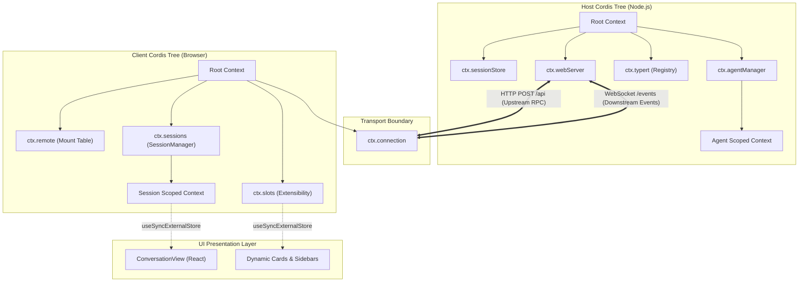

# 第 12 章：Web Host、RPC 与插件化 UI

在构建面向生产环境的企业级 AI Agent 系统时，架构师面临的最核心挑战之一是：**如何将底层具备高危系统权限（文件系统、终端沙箱、内核隔离、MCP 进程、持久化事实账本）的 Agent 核心引擎，安全、确定、高效地暴露给前端交互界面，并在浏览器端实现高响应性、零撕裂的插件化 UI 体验**。

传统的 Web 全栈架构往往采用粗暴的“单体 API 代理”或直接在前后端混用通用 RPC 框架（如 gRPC、tRPC 或全功能 GraphQL）。然而在 Agent 运行场景中，这些方案迅速暴露出致命短板：后端需要维护复杂的 Cordis 服务依赖注入树、Agent 会话状态机与沙箱隔离；前端需要接收超高频的流式 Reasoning Token（每秒数十至上百个分片）、结构化 Tool Call 生命周期事件、并发子智能体交互，同时还要保证 UI 组件的高度解耦与插件化动态插拔。若直接混用状态，极易引发主线程渲染雪崩、跨会话状态污染或远程代码执行等安全漏洞。

DeepSeek Harness 给出了一套精密的系统级解法：**Host/Client 双 Cordis 树架构**配合自研 **Typert 严格类型 RPC 网关**、**HTTP+WebSocket 四象限信道**、**Zustand+Immer 无 React 核心状态机**以及**受控 Chrome DevTools MCP 浏览器自动化子系统**。本章将由浅入深，全面解构这一支撑工业级 Agent 交互界面的底层运行时。

---

## 1. 概念映射：从系统编程到 Web Host 与 UI

为了帮助具备传统系统编程背景（C/C++/Java/Go/Rust）的工程师迅速建立清晰的工程直觉，我们将现代 Agent Web Host 与前端架构中的核心概念，与系统级编程/分布式操作系统中的成熟概念进行一一映射：

| Agent Web Host / UI 概念 | 传统系统编程 / 分布式架构概念 | 核心职责与设计约束 |
|---|---|---|
| **双 Cordis 树架构** | **C/S 微内核双进程拓扑（Client/Server Microkernel Topology）** | Node.js 宿主进程树管理特权服务；浏览器端轻量树管理纯 UI 插件与渲染投影。两树生命周期解耦。 |
| **Typert RPC 网关** | **静态 IDL 编译器 + RPC Stub/Skeleton（CORBA/MIDL/Monomorphic Stubs）** | 基于 TypeScript AST 生成类型图与单态运行时 Codec，杜绝动态反射与运行时 `Proxy` 损耗。 |
| **四象限 RPC 报文** | **全双工双向消息信道（Bi-directional Frame Channel）** | 区分客户端发起的请求/响应与服务端发起的事件/交互，统一由品牌化 `RpcId` 关联。 |
| **HTTP Bridge (Upstream)** | **带背压控制的同步系统调用门（Syscall Gate with Backpressure）** | 基于 Node 原生 `IncomingMessage`/`ServerResponse` 与 WHATWG `fetch` 的内存有界适配器。 |
| **WebSocket Downlink (Downstream)** | **内核事件广播总线（Kernel Event Bus / evdev Ring Buffer）** | 单向推送 Agent 会话事件、Reasoning Token 流与审批交互帧，免除轮询开销。 |
| **Zustand / Immer Store** | **内存中不可变快照树（Immutable Snapshot Tree / Copy-on-Write Pages）** | 业务状态与 React 框架彻底解耦，通过写时复制（CoW）生成确定性状态投影。 |
| **`useSyncExternalStore`** | **无锁观察者中断订阅（Lock-free Observer / Interrupt Hook）** | 规避 React 并发渲染撕裂（Tearing），通过细粒度 Selector 拦截无效的 DOM 重绘。 |
| **Chrome DevTools MCP** | **受控外部驱动外设（Controlled External Device Driver via Unix Domain Socket / IPC）** | 隔离运行无 Shell 包装的 Headless 浏览器子进程，以标准化 Tool Call 提供自动化能力。 |

---

## 2. 双 Cordis 树架构：Node.js Host 进程树 vs 浏览器 Client 插件树

DeepSeek Harness 在系统设计上彻底摒弃了“前后端共享业务状态对象”的隐式耦合做法，在 Host 端与 Client 端分别运行一棵相互独立的 **Cordis 依赖注入树**。

```
+-----------------------------------------------------------------------------------------+
|                                NODE.JS HOST PROCESS                                     |
|                                                                                         |
|  +-----------------------------------------------------------------------------------+  |
|  | Context (Root Host Cordis Tree)                                                   |  |
|  |                                                                                   |  |
|  |  +---------------------+   +---------------------+   +-------------------------+  |  |
|  |  | ctx.sessionStore    |   | ctx.agentManager    |   | ctx.sandbox             |  |  |
|  |  +---------------------+   +---------------------+   +-------------------------+  |  |
|  |  +---------------------+   +---------------------+   +-------------------------+  |  |
|  |  | ctx.typertRegistry  |   | ctx.webServer       |   | ctx.connection (Host)   |  |  |
|  |  +---------------------+   +---------------------+   +-------------------------+  |  |
|  +-----------------------------------------------------------------------------------+  |
+-------------------------------------------|---------------------------------------------+
                                            |
                         HTTP (POST /api)   |   WebSocket (/events/*)
                         Upstream RPC Calls |   Downstream Event Streams
                                            |
+-------------------------------------------v---------------------------------------------+
|                                BROWSER CLIENT RUNTIME                                   |
|                                                                                         |
|  +-----------------------------------------------------------------------------------+  |
|  | Context (Root Client Cordis Tree)                                                 |  |
|  |                                                                                   |  |
|  |  +---------------------+   +---------------------+   +-------------------------+  |  |
|  |  | ctx.connection      |   | ctx.remote.*        |   | ctx.sessions            |  |  |
|  |  +---------------------+   +---------------------+   +-------------------------+  |  |
|  |  +---------------------+   +---------------------+   +-------------------------+  |  |
|  |  | ctx.slots (UI Ext)  |   | ctx.views (Cards)   |   | ctx.commands (/slash)   |  |  |
|  |  +---------------------+   +---------------------+   +-------------------------+  |  |
|  +-----------------------------------------------------------------------------------+  |
|                                           |                                             |
|                                           | useSyncExternalStore                        |
|                                           v                                             |
|  +-----------------------------------------------------------------------------------+  |
|  | React UI Layer (Pure Projection Components: MessageList, ToolCard, SideBar)       |  |
|  +-----------------------------------------------------------------------------------+  |
+-----------------------------------------------------------------------------------------+
```

### 2.1 双树的职责分离与生命周期拓扑

两棵 Cordis 树的分工非常严格，彼此通过明确定义的通信网关通信：

1. **Host 进程树（特权宿主域）**：
   - **运行环境**：Node.js ESM 运行时环境，拥有完全的操作系统系统调用（syscall）权限。
   - **核心职责**：管理 LLM 适配器连接池、Linux Landlock / macOS Seatbelt 内核沙箱、本地文件系统读写、基于 SQLite/Zstd 的事件溯源持久化账本、后台任务（Jobs）调度器以及 Chrome DevTools MCP 子进程。
   - **依赖拓扑**：注册由业务包通过 `@Remote` 装饰器暴露的服务，通过 `TypertRegistry` 维护类型安全的 RPC 分发路由，通过 `WebServer` 挂载 HTTP/WebSocket 传输层。

2. **Client 插件树（非特权渲染域）**：
   - **运行环境**：浏览器 JavaScript 引擎（如 V8/SpiderMonkey/JavaScriptCore），零 Node 原生模块依赖（无 `node:fs`、`node:child_process` 等）。
   - **核心职责**：管理 `ConnectionController` 连接状态机、会话投影状态机（`SessionProjection`）、UI 插槽注册表（`SlotsRegistry`）、消息卡片视图注册表（`ViewRegistry`）以及 Slash 命令补全注册表。
   - **依赖拓扑**：通过 `ctx.remote.<namespace>` 挂载由代码生成器生成的强类型 Remote 代理方法，向上层 React 容器暴露只读快照与不可变状态源。



### 2.2 严格的 TypeScript 构建分面（Dual-Face Compilation）

为了防止 Node.js 服务代码被意外打包入浏览器 Bundle，或者浏览器专有的 DOM/React 依赖侵入 Host 进程，Harness 建立了严格的构建分面流水线：

```
                +------------------------------------+
                |        Monorepo Root Build         |
                +------------------------------------+
                                   |
                  [Phase 1: Build Lib Host]
                  tsc -b tsconfig.host.json
                  tsdown --env.DSH_BUILD_FACE host
                                   |
                                   +---> 运行 Typert Generator:
                                   |     遍历 Host ts.Program AST
                                   |     生成 lib/typert.host.*
                                   |     生成 lib/typert.remote-client.*
                                   |
                  [Phase 2: Build Lib Client]
                  tsc -b tsconfig.client.json
                  tsdown --env.DSH_BUILD_FACE client
                                   |
                                   +---> 消费 lib/typert.remote-client.*
                                   |     编译 Client 插件
                                   |     输出浏览器 bundle 与 node loader
                                   |
                  [Phase 3: Build Web Application]
                  pnpm --filter @deepseek-ai/dsh-web-frontend run build
```

在这一构建架构中：
- 根项目聚合配置分为 `tsconfig.host.json` 与 `tsconfig.client.json` 两个完全隔离的 TypeScript Project Reference 拓扑图。
- 环境变量 `DSH_BUILD_FACE=host` 时，只打包 Host 入口，并由 Typert Generator 产出 `typert.host.js` 与 `typert.remote-client.js`。
- 环境变量 `DSH_BUILD_FACE=client` 时，Client 构建直接消费 Phase 1 生成的静态描述符与 Codec，无需在前端二次分析 TypeScript 源码。

### 2.3 纯投影设计模式（Pure Projection Pattern）

在 Client Cordis 树中，DeepSeek Harness 贯彻了极具工程自律的 **纯投影架构（Pure Projection）**：

- **数据对象层零 React 依赖**：`runtime`、`connection`、`sessions` 等核心包中严禁出现任何 `import ... from 'react'`。数据层对象全部是纯 TypeScript 状态机或基于 Observable 的裸快照源。
- **React 组件零框架 Import**：业务 UI 组件不直接 `import` 全局单例、不直接调用网络通信 API，所有运行时能力与会话数据均通过 Props 传入，或经由 UI 容器层桥接的 `useSyncExternalStore` 订阅不可变快照。
- **动态插件扩展**：第三方 UI 插件只需向 Client Cordis 树的 `ctx.slots` 或 `ctx.views` 注入配置与组件，即可无缝向现有界面添加设置卡片、消息渲染卡片或状态栏指示器，无需修改主应用核心代码。

### 2.4 工业级代码：Client 根容器初始化与插件装配

以下是浏览器端初始化 Client Cordis 容器并装载核心插件的工业级实现：

```ts
// packages/client/runtime/src/client/bootstrap.ts
import { Context } from '@deepseek-ai/cordis'
import { createWebConnectionRpc } from '@deepseek-ai/dsh-client-connection/client'
import type { ClientConnectionRpc } from '@deepseek-ai/dsh-client-connection'

export interface ClientBootstrapOptions {
  readonly baseUrl?: string
  readonly onConnectionStateChange?: (state: 'connecting' | 'connected' | 'disconnected') => void
}

export interface ClientAppRuntime {
  readonly ctx: Context
  readonly dispose: () => Promise<void>
}

/**
 * 启动浏览器端 Client Cordis 根容器
 */
export async function bootstrapClientRuntime(options: ClientBootstrapOptions = {}): Promise<ClientAppRuntime> {
  const rootCtx = new Context()

  // 1. 初始化并挂载非 React 传输连接层
  const rpcCaller: ClientConnectionRpc = createWebConnectionRpc()
  rootCtx.provide('connection')
  rootCtx.connection = {
    rpc: rpcCaller,
    status: 'connected',
  }

  // 2. 挂载 Remote 客户端调用网关容器
  rootCtx.provide('remote')
  const mountedNamespaces = new Set<string>()
  rootCtx.remote = {
    $mount(namespace: string, methods: Record<string, Function>) {
      if (mountedNamespaces.has(namespace)) {
        throw new Error(`client-runtime: namespace '${namespace}' already mounted`)
      }
      mountedNamespaces.add(namespace)
      const subService = Object.freeze({ ...methods })
      ;(rootCtx.remote as Record<string, unknown>)[namespace] = subService

      return () => {
        mountedNamespaces.delete(namespace)
        delete (rootCtx.remote as Record<string, unknown>)[namespace]
      }
    },
  }

  // 3. 挂载 UI 扩展插槽与视图注册表
  rootCtx.provide('slots')
  const slotMap = new Map<string, Set<unknown>>()
  rootCtx.slots = {
    register(slotName: string, item: unknown) {
      if (!slotMap.has(slotName)) slotMap.set(slotName, new Set())
      slotMap.get(slotName)!.add(item)
      return () => {
        slotMap.get(slotName)?.delete(item)
      }
    },
    getItems(slotName: string) {
      return Array.from(slotMap.get(slotName) ?? [])
    },
  }

  return {
    ctx: rootCtx,
    dispose: async () => {
      await rootCtx.stop()
      mountedNamespaces.clear()
      slotMap.clear()
    },
  }
}
```

---

## 3. Typert RPC 网关：从 TypeScript 声明生成类型图与 Codec

在多插件协同的复杂 Agent 系统中，前端与后端的通信面临着严苛的类型与安全约束：
1. **类型零漂移（Zero Type Drift）**：后端修改了参数结构或返回值类型，前端必须在编译期（`tsc`）直接报错，杜绝生产运行时字段缺失。
2. **零运行时 Proxy 性能损耗**：拒绝使用 JavaScript `Proxy` 拦截所有方法调用。`Proxy` 会阻断 V8 引擎的 Inline Cache（内联缓存）与 JIT 优化，且难以进行属性枚举与反射调试。
3. **精准的 IDE 一键跳转（Go-to-Definition）**：前端工程师在调用 `ctx.remote.goals.create()` 时，按住 Ctrl/Cmd 点击方法名，必须直接跳转到后端 Host 的 `@Remote` 源码实现，而不是停留在生成的声明文件里。

Typert（Typed Export & RPC Tooling）正是为了解决这一系列痛点而设计的确定性 RPC 协议网关。

### 3.1 声明式 Decorator 与领域对象映射

后端业务服务继承自 `TypertRemoteService`，使用 `@Remote` 或 `@RemoteScope` 装饰器显式声明对外暴露的 RPC 方法：

```ts
// packages/goal/src/service.ts
import { Context } from '@deepseek-ai/cordis'
import type { Agent } from '@deepseek-ai/dsh-agent'
import { TypertRemoteService, Remote, RemoteScope } from '@deepseek-ai/dsh-typert-protocol'

export interface CreateGoalRequest {
  objective: string
  priority: 'low' | 'normal' | 'high'
}

export interface CreateGoalResult {
  accepted: boolean
  goalId?: string
}

export class GoalService extends TypertRemoteService {
  constructor(ctx: Context) {
    super(ctx, 'goals')
  }

  /**
   * 暴露给 Client 的一元 Remote 方法。
   * Host 端签名中的 `agent: Agent` 属于复杂领域对象，不能直接跨网络传输；
   * Typert 将其自动映射为 Wire 层的 `agentId: SessionId` 并在网关层自动解析。
   */
  @Remote('create')
  createForClient(
    agent: Agent,
    request: CreateGoalRequest,
    signal: AbortSignal,
  ): Promise<CreateGoalResult> {
    signal.throwIfAborted()
    return this.create(agent, request)
  }

  @RemoteScope('agent', 'current')
  currentForClient(): CreateGoalResult {
    return { accepted: true }
  }

  private async create(agent: Agent, request: CreateGoalRequest): Promise<CreateGoalResult> {
    return { accepted: request.objective.length > 0, goalId: 'goal-998' }
  }
}
```

#### 领域对象 Wire 映射（`TypertLookupMap`）

在 Host 端，`Agent`、`Session`、`Workspace` 是包含大量方法、状态机和 EventEmitter 的复杂对象。这些对象绝对不能直接序列化传输。Typert 引入了 `TypertLookupMap` 契约：

```
+-------------------+                                       +-------------------+
|  Client Request   |                                       |   Host Dispatch   |
|                   |                                       |                   |
|  Wire Args:       |                                       |   Domain Args:    |
|  {                |    ctx.typert.lookups.resolve()       |   [               |
|    agentId: "a1", | ------------------------------------> |     agentInstance,|
|    request: {...} |                                       |     request,      |
|  }                |                                       |     signal        |
|                   |                                       |   ]               |
+-------------------+                                       +-------------------+
```

当 Host 网关接收到请求时，首先根据注册在 `ctx.typert.lookups` 中的解析器，将 `agentId` 解析为运行时的 `Agent` 实例。如果目标 Agent 处于冷休眠状态，解析器会自动执行并发去重的冷恢复流程；如果 Agent 不存在或已被销毁，网关将在进入业务方法前直接返回 `session-not-found` 错误。

### 3.2 静态分析与 Declaration Map 生成

在构建阶段，`@deepseek-ai/dsh-typert-generator` 启动 TypeScript 编译器 API（`ts.Program`），遍历所有业务包的 AST，执行以下严格校验与生成逻辑：

1. **严格方法签名校验**：
   - 方法必须是公开、非静态的实例方法。
   - 严禁使用泛型方法、解构参数、默认值参数或 Rest 参数。
   - 最后一个参数如果是 `signal: AbortSignal`，则被识别为取消令牌，不进入网络传输的 `args` 字典。

2. **产物生成结构**： 业务包在 `lib/` 目录下生成以下产物，完全避免污染 `src/` 源码目录：
   - `typert.host.js` / `typert.host.d.ts`：Host 端运行时方法反射描述符、Schema 校验规则。
   - `typert.remote-client.js`：包含轻量运行时 Codec 的可挂载贡献对象。
   - `typert.remote-client.d.ts`：合并至 `TypertRemoteNamespaceMap` 与 `TypertRemoteScopeMap` 的 Client 接口声明。
   - `typert.remote-client.d.ts.map`：**VLQ 编码的 Source Map 映射表**。它将 Client 侧的属性调用精准映射回 Host 源码中带有 `@Remote` 装饰器的确切行号与列号，实现完美的跨端跳转。

```
Host 源码 (packages/goal/src/service.ts)
  L35: @Remote('create') createForClient(agent: Agent, request: CreateGoalRequest): CreateGoalResult
                                ^
                                | (typert.remote-client.d.ts.map Source Mapping)
                                |
Client 声明 (packages/goal/lib/typert.remote-client.d.ts)
  L12: create(agentId: SessionId, request: CreateGoalRequest, signal?: AbortSignal): Promise<CreateGoalResult>
```

### 3.3 序列化 Codec 与性能开销推导

网络通信的序列化性能直接影响 UI 的响应吞吐量。设单次 RPC 请求中，原始 JSON 字符串字节大小为 $S_{\text{raw}}$，参数字段数为 $K$，Schema 校验开销函数为 $C_{\text{val}}(K)$。

在传统的动态反射 RPC 中，动态解析与动态代理开销为：

$$T_{\text{dynamic}} = T_{\text{json\_parse}}(S_{\text{raw}}) + T_{\text{proxy\_dispatch}} + T_{\text{reflect\_schema}}(K)$$

而在 Typert 中，所有 Codec 在编译期生成单态校验函数（Monomorphic Validator），V8 能够将其编译为高度优化的机器码。其耗时模型为：

$$T_{\text{typert}} = T_{\text{json\_parse}}(S_{\text{raw}}) + \sum_{i=1}^K T_{\text{type\_check}}(k_i)$$

其中每个单态字段校验时间 $T_{\text{type\_check}} \approx 1.2 \sim 3.5\text{ ns}$，相较于运行时动态构建 AST 校验（通常 $\ge 150\text{ ns}$）性能提升超过两个数量级。

### 3.4 工业级代码：Typert RPC 核心网关与调度分发器

以下是 Host 端 Typert RPC 调度网关的工业级实现，具备完整的参数校验、Lookup 解析、生命周期绑定与异常防御：

```ts
// packages/api/gateway/src/typert-gateway.ts
import { Context, Service } from '@deepseek-ai/cordis'
import type { RpcError, RpcResult } from '@deepseek-ai/dsh-host-apiproxy/api'

export interface RemoteMethodDescriptor {
  readonly namespace: string
  readonly method: string
  readonly parameterNames: readonly string[]
  readonly lookupKeys: readonly (string | undefined)[]
  readonly hasSignal: boolean
  readonly validator: (args: Record<string, unknown>) => boolean
  readonly execute: (service: unknown, resolvedArgs: unknown[], signal: AbortSignal) => Promise<unknown>
}

export class TypertGatewayService extends Service {
  private readonly descriptors = new Map<string, RemoteMethodDescriptor>()

  constructor(ctx: Context) {
    super(ctx, 'typertGateway', true)
  }

  /**
   * 注册由构建生成的 Remote 描述符
   */
  public registerDescriptor(descriptor: RemoteMethodDescriptor): () => void {
    const key = `${descriptor.namespace}/${descriptor.method}`
    if (this.descriptors.has(key)) {
      throw new Error(`typert-gateway: duplicate registration for endpoint '${key}'`)
    }
    this.descriptors.set(key, descriptor)
    return () => {
      this.descriptors.delete(key)
    }
  }

  /**
   * 处理上行 RPC 调用
   */
  public async dispatch(
    endpoint: string,
    rawPayload: unknown,
    signal: AbortSignal,
  ): Promise<RpcResult<unknown>> {
    signal.throwIfAborted()

    const descriptor = this.descriptors.get(endpoint)
    if (!descriptor) {
      return {
        ok: false,
        error: {
          code: 'internal',
          message: `typert-gateway: endpoint '${endpoint}' not found`,
          details: {},
        },
      }
    }

    if (typeof rawPayload !== 'object' || rawPayload === null || !('args' in rawPayload)) {
      return {
        ok: false,
        error: {
          code: 'bad-request',
          message: `typert-gateway: payload must contain an 'args' object`,
          details: { issues: [] },
        },
      }
    }

    const args = (rawPayload as { args: Record<string, unknown> }).args
    if (!descriptor.validator(args)) {
      return {
        ok: false,
        error: {
          code: 'bad-request',
          message: `typert-gateway: arguments failed schema validation for '${endpoint}'`,
          details: { issues: [] },
        },
      }
    }

    // 从 Cordis 容器中解析对应的服务单例
    const targetService = (this.ctx as unknown as Record<string, unknown>)[descriptor.namespace]
    if (!targetService) {
      return {
        ok: false,
        error: {
          code: 'internal',
          message: `typert-gateway: backing service '${descriptor.namespace}' unavailable in Cordis context`,
          details: {},
        },
      }
    }

    try {
      const resolvedArgs: unknown[] = []
      for (let i = 0; i < descriptor.parameterNames.length; i++) {
        const paramName = descriptor.parameterNames[i]
        const lookupKey = descriptor.lookupKeys[i]
        const rawValue = args[paramName]

        if (lookupKey !== undefined) {
          // 通过 Lookup 机制解析领域实体对象
          const lookupResolver = (this.ctx as unknown as { typertLookups?: { resolve: (k: string, id: unknown) => Promise<unknown> } }).typertLookups
          if (!lookupResolver) {
            throw new Error(`typert-gateway: lookup provider required for key '${lookupKey}' but not registered`)
          }
          const domainObject = await lookupResolver.resolve(lookupKey, rawValue)
          if (!domainObject) {
            return {
              ok: false,
              error: {
                code: 'session-not-found',
                message: `typert-gateway: entity not found for lookup '${lookupKey}' with id '${String(rawValue)}'`,
                details: { sessionId: String(rawValue) as never },
              },
            }
          }
          resolvedArgs.push(domainObject)
        } else {
          resolvedArgs.push(rawValue)
        }
      }

      const result = await descriptor.execute(targetService, resolvedArgs, signal)
      return { ok: true, value: result }
    } catch (error: unknown) {
      if (signal.aborted) {
        return {
          ok: false,
          error: { code: 'cancelled', message: 'RPC call was aborted by client', details: {} },
        }
      }
      return {
        ok: false,
        error: {
          code: 'internal',
          message: error instanceof Error ? error.message : String(error),
          details: {},
        },
      }
    }
  }
}
```

---

## 4. 通信信道与四象限 RPC 协议网关

为了在 Web 环境下兼顾可靠性、吞吐量与背压控制，DeepSeek Harness 将物理传输通道与逻辑消息模型彻底解耦，定义了优雅的 **四象限 RPC 消息模型**。

### 4.1 四象限消息模型与品牌化 `RpcId`

在传统 RPC 中，请求与响应往往混杂在同一个连接通道中，缺乏强类型的消息流向区分。Harness 将跨端交互抽象为四个象限：

```
                              [Message Origin]
                       Client                  Host
               +-----------------------+-----------------------+
   Request     |    ClientRequest      |    ServerRequest      |
               | (POST /api/<method>)  | (WebSocket Frame /    |
               |                       |  Approvals/Questions) |
[Interaction]  +-----------------------+-----------------------+
   Response    |    ClientResponse     |    ServerResponse     |
               | (POST /api/respond)   | (HTTP Response Body)  |
               |                       |                       |
               +-----------------------+-----------------------+
```

```ts
// packages/host/apiproxy/src/api/rpc.ts
import type { Branded } from '@deepseek-ai/dsh-brand'

/** 品牌化 RpcId：零运行时开销，编译期防御 */
export type RpcId = Branded<'rpc-id'>

export function RpcId(id: string): RpcId {
  return id as RpcId
}

/** 1. 客户端发起的调用 */
export interface ClientRequest {
  type: 'client-request'
  rpcId: RpcId
  method: string
  payload: unknown
}

/** 2. 服务端对客户端调用的同步响应 */
export interface ServerResponse {
  type: 'server-response'
  rpcId: RpcId
  result: RpcResult<unknown>
}

/** 3. 服务端主动发起的下行推送或交互请求 */
export interface ServerRequest {
  type: 'server-request'
  rpcId: RpcId
  method: string
  payload: unknown
}

/** 4. 客户端对服务端交互请求的结算响应 */
export interface ClientResponse {
  type: 'client-response'
  rpcId: RpcId
  result: RpcResult<unknown>
}

export type RpcMessage = ClientRequest | ServerResponse | ServerRequest | ClientResponse
```

#### 品牌化 `RpcId` 回显不变式（Echo Invariant）

系统强制遵循以下原则：
1. **发起者铸造（Minting）**：`ClientRequest` 由浏览器端生成 UUID 铸造 `RpcId`；`ServerRequest` 由 Host 宿主生成并铸造 `RpcId`。
2. **响应者回显（Echoing）**：响应方（无论是 `ServerResponse` 还是 `ClientResponse`）**绝对禁止**重新铸造新的 `RpcId`，必须原样回显对应的请求 `RpcId`。
3. **确定性断言**：客户端收到 HTTP 响应时，必须执行 `if (response.rpcId !== sentRpcId) throw new Error(...)`。这彻底根除了由于 HTTP Keep-Alive 连接池复用混乱或代理乱序导致的“串号”幽灵 Bug。

### 4.2 HTTP Bridge：Node 原生流到 WHATWG Fetch 的内存有界适配

在 Host 端，`packages/client/connection/src/http-bridge.ts` 实现了 Node.js 底层 `node:http` 与标准 WHATWG `fetch` 请求对象的桥接。

该桥接器具备关键的工程防御设计：
- **内存常驻上限（Resident Bound）**：`DEFAULT_MAX_REQUEST_BODY_BYTES = 300 * 1024 * 1024`（300 MiB）。该预算严格匹配包含多张高分辨率图片 Base64 编码的极端 Payload 上限，超出时直接在 TCP 层阻断并响应 `413 Payload Too Large`，防止恶意或异常请求打崩 Host 进程内存。
- **精准的连接断开感知**：挂载在 `res.on('close')` 而非 `req.on('close')` 上。在 Node 16+ 中，`IncomingMessage` 的 `close` 事件在 Body 读取完毕后即触发，若错误监听 `req` 将导致正常的流式响应在开启瞬间被误判为 Abort。
- **流式背压流控（Backpressure Drain Control）**：向下游写入 Chunk 时，若 `res.write()` 返回 `false`，则暂停读取并监听 `drain` 事件，防止慢客户端导致 Host 端缓冲区无界膨胀引发 OOM。

```ts
// packages/client/connection/src/http-bridge.ts
import type { IncomingMessage, ServerResponse } from 'node:http'

export const DEFAULT_MAX_REQUEST_BODY_BYTES = 300 * 1024 * 1024

export interface FetchHandler {
  fetch(request: Request): Promise<Response>
}

export async function bridge(
  req: IncomingMessage,
  res: ServerResponse,
  apiHandler: FetchHandler,
  maxRequestBodyBytes = DEFAULT_MAX_REQUEST_BODY_BYTES,
): Promise<void> {
  const abort = new AbortController()

  // 必须监听 res.on('close')，因为 req.on('close') 在 body 读取后立即触发
  res.on('close', () => {
    if (!res.writableEnded) abort.abort()
  })

  const declaredLength = req.headers['content-length']
  if (declaredLength !== undefined && Number(declaredLength) > maxRequestBodyBytes) {
    res.writeHead(413, { connection: 'close' })
    res.end()
    req.destroy()
    return
  }

  const chunks: Buffer[] = []
  let received = 0
  for await (const chunk of req) {
    const buffer = chunk as Buffer
    received += buffer.byteLength
    if (received > maxRequestBodyBytes) {
      res.writeHead(413, { connection: 'close' })
      res.end()
      req.destroy()
      return
    }
    chunks.push(buffer)
  }

  const request = new Request(new URL(req.url ?? '/', 'http://dsh.internal'), {
    method: req.method ?? 'GET',
    headers: Object.fromEntries(
      Object.entries(req.headers).filter(([, v]) => typeof v === 'string') as [string, string][],
    ),
    ...(chunks.length > 0 ? { body: Buffer.concat(chunks) } : {}),
    signal: abort.signal,
  })

  const response = await apiHandler.fetch(request)
  res.writeHead(response.status, Object.fromEntries(response.headers.entries()))

  if (response.body === null) {
    res.end()
    return
  }

  for await (const chunk of response.body) {
    if (!res.write(chunk)) {
      await new Promise<void>((resolve) => {
        const done = (): void => {
          res.off('drain', done)
          res.off('close', done)
          resolve()
        }
        res.once('drain', done)
        res.once('close', done)
      })
    }
  }
  res.end()
}
```

### 4.3 WebSocket Downlink：双下行通道与推送机制

系统建立两个专职的 WebSocket 下行流通道：
1. `/events/mux`：用于多路复用会话事件流（Session Events、Reasoning Chunks、Tool Call Execution Logs）。
2. `/events/host`：用于全局宿主事件（工作区变更、配置更新、插件生命周期）。

客户端向上游发送数据**严格禁止**走 WebSocket，全部使用 HTTP `POST`。这种“**HTTP 上行 + WebSocket 下行**”的非对称设计带来了巨大的工程优势：
- 上行请求天然获得 HTTP 状态码、代理认证、超时控制与独立的连接隔离，避免单条 WebSocket 拥塞影响关键 RPC 调用。
- 下行流保持纯粹的推送语义，Host 崩溃或网络断开时，客户端 Connection 状态机只需独立重连 WebSocket，不影响幂等 RPC 的重试策略。

```ts
// packages/client/connection/src/client/rpc.ts
import { RpcId, type ClientRequest, type ServerResponse } from '@deepseek-ai/dsh-host-apiproxy/api'

export function createWebConnectionRpc(doFetch?: (input: URL, init: RequestInit) => Promise<Response>) {
  const send = doFetch ?? ((input, init) => globalThis.fetch(input, init))

  return {
    async call(channel: string, endpoint: string, payload: unknown, signal?: AbortSignal) {
      const rpcId = RpcId(crypto.randomUUID())
      const message: ClientRequest = {
        type: 'client-request',
        rpcId,
        method: endpoint,
        payload,
      }

      const response = await send(
        new URL(`${channel}/${endpoint}`, window.location.origin),
        {
          method: 'POST',
          headers: { 'content-type': 'application/json' },
          body: JSON.stringify(message),
          ...(signal ? { signal } : {}),
        },
      )

      if (!response.ok) {
        throw new Error(`transport failure for ${channel}/${endpoint}: HTTP ${response.status}`)
      }

      const data = (await response.json()) as ServerResponse
      if (data.rpcId !== rpcId) {
        throw new Error(`rpcId mismatch for ${endpoint}: sent ${rpcId}, got ${data.rpcId}`)
      }

      return data.result
    },
  }
}
```

---

## 5. Client 响应式状态管理：Zustand、Immer 与局部重绘

在现代 Agent 前端开发中，状态管理面临着极端的性能与一致性挑战。以大语言模型输出 Reasoning Token（思考链）为例：
- 模型以极高频率输出 Chunk（每秒 30~100 次 `yield`）。
- 每次 `yield` 都会触发微任务边界。
- 如果将原始事件直接放入传统 React Context 或全局 Redux Store，会导致 React 树频繁执行协调（Reconciliation）、虚拟 DOM Diff 和布局重排（Layout），迅速耗尽 16.67ms 的帧预算，导致浏览器彻底假死。

DeepSeek Harness 采用 **Zustand Vanilla + Immer + `rafBatch` + `useSyncExternalStore`** 构筑了多层防御的高性能状态管理管线。

```
+-----------------------------------------------------------------------------------------+
|                                    EVENT STREAM INGESTION                               |
|                                                                                         |
|  WebSocket Chunks (30~100 events/sec)                                                   |
+-------------------------------------------|---------------------------------------------+
                                            |
                                            v
+-----------------------------------------------------------------------------------------+
|                       SESSION RUNTIME & IMMUTABLE STATE MACHINE                         |
|                                                                                         |
|  +-----------------------------------------------------------------------------------+  |
|  | Session.receiveEvent(event)                                                       |  |
|  |   - 更新内部线性事件日志账本                                                      |  |
|  |   - Immer produce() 写时复制生成新 SessionSnapshot                                |  |
|  |   - devFreeze() 在非生产环境下执行对象深度递归冻结                                |  |
|  +-----------------------------------------------------------------------------------+  |
|                                           |                                             |
|                                           | 触发脏标记 (markDirty)                      |
|                                           v                                             |
|  +-----------------------------------------------------------------------------------+  |
|  | rafBatch Notification Scheduler (帧对齐调度器)                                   |  |
|  |   - 抑制微任务连续触发，合并当前 16.67ms 帧内的所有数据变更                      |  |
|  |   - 在 requestAnimationFrame 回调中单次通知订阅者                                 |  |
|  +-----------------------------------------------------------------------------------+  |
+-------------------------------------------|---------------------------------------------+
                                            |
                                            v
+-----------------------------------------------------------------------------------------+
|                                REACT PRESENTATION LAYER                                 |
|                                                                                         |
|  +-----------------------------------------------------------------------------------+  |
|  | useSyncExternalStoreWithSelector(store.subscribe, store.getSnapshot, selector, eq)  |  |
|  |                                                                                   |  |
|  |  +-------------------------------------+   +-----------------------------------+  |  |
|  |  | Component A: MessageList            |   | Component B: SideBar              |  |  |
|  |  | (Selector: s => s.messages)         |   | (Selector: s => s.sessionCount)   |  |  |
|  |  | [shallowEqual -> Trigger Re-render] |   | [shallowEqual -> Bail Out / Skip] |  |  |
|  |  +-------------------------------------+   +-----------------------------------+  |  |
|  +-----------------------------------------------------------------------------------+  |
+-----------------------------------------------------------------------------------------+
```

### 5.1 帧对齐调度与数学约束模型

设在某一帧周期 $T_{\text{frame}} = 16.67\text{ ms}$ 内，到达的 Token 分片数为 $N$（$N \in [1, 50]$）。

若采用传统微任务或即时调度：
- 渲染次数 $R_{\text{sync}} = N$
- 每一帧的总耗时：

$$T_{\text{total}} = \sum_{i=1}^N \left( T_{\text{produce}}(i) + T_{\text{react\_reconcile}}(i) + T_{\text{dom\_commit}}(i) \right)$$

当 $N=30$ 且单次组件树重绘耗时 $1\text{ ms}$ 时，$T_{\text{total}} \approx 30\text{ ms} > 16.67\text{ ms}$，掉帧率达 100%，主线程事件循环彻底卡死。

在 Harness 的 `rafBatch` 调度模型中：
- 内存快照在内存中执行 $N$ 次高效轻量指针变更（$T_{\text{produce}} \approx 5\ \mu\text{s}$）。
- 通知合并为每帧精确 1 次：$R_{\text{raf}} = 1$。
- 帧总耗时缩减为：

$$T_{\text{total}} = N \cdot T_{\text{produce}} + 1 \cdot \left( T_{\text{react\_reconcile}} + T_{\text{dom\_commit}} \right) \approx 0.15\text{ ms} + 1.2\text{ ms} = 1.35\text{ ms} \ll 16.67\text{ ms}$$

主线程 CPU 占用率从 100% 直降至 8% 以下，UI 达到极致丝滑。

### 5.2 状态存储引擎与避免 Zustand 原生 Persist 的设计复盘

在 `packages/client/runtime/src/client/contract/store.ts` 中，Harness 实现了一套独立的 `defineStore` 与 `createSnapshotStore` 引擎。

#### 为什么弃用 Zustand 官方的 `persist` 中间件？

在生产实践中，团队发现 Zustand 官方 `persist` 中间件存在一个严重的底层缺陷：
- 其写路径在序列化前对状态执行了对象展开操作：`partialize({ ...get() })`。
- 如果 Store 的根状态是一个 JavaScript 原始值（如 `string`、`number` 或 `boolean`），例如一个纯字符串输入草稿 `"hello"`，经过对象展开后会被错误解构为 `{ 0: 'h', 1: 'e', 2: 'l', 3: 'l', 4: 'o' }` 并持久化到 `localStorage`。
- 这一损坏发生在序列化之前，导致自定义的 `merge` 或 `deserialize` 函数完全无法修复。

因此，Harness 实现了自研的全值 JSON 持久化，并提供完善的 Storage 失败熔断保护（在隐私模式或 Quota 超限时不抛异常，优雅降级）：

```ts
// packages/client/runtime/src/client/contract/store.ts
import { createStore, type StoreApi } from 'zustand/vanilla'
import { subscribeWithSelector } from 'zustand/middleware'
import { shallow } from 'zustand/shallow'
import { produce } from 'immer'

export interface ObservableSnapshot<T> {
  getSnapshot(): T
  subscribe(fn: () => void): () => void
}

export interface SnapshotStore<T> extends ObservableSnapshot<T> {
  update(mutator: (draft: T) => void): void
  set(next: T): void
}

export function shallowEqual(a: unknown, b: unknown): boolean {
  return shallow(a, b)
}

function rafBatch(notify: () => void): () => void {
  const schedule: (fn: () => void) => void =
    typeof requestAnimationFrame === 'function'
      ? (fn) => { requestAnimationFrame(() => { fn() }) }
      : (fn) => { queueMicrotask(fn) }
  let scheduled = false
  return () => {
    if (scheduled) return
    scheduled = true
    schedule(() => {
      scheduled = false
      notify()
    })
  }
}

function attachPersistence<T>(api: StoreApi<T>, name: string): void {
  if (typeof localStorage === 'undefined') return
  try {
    const raw = localStorage.getItem(name)
    if (raw !== null) {
      api.setState(JSON.parse(raw) as T, true)
    }
  } catch (error) {
    console.error(`snapshot store '${name}' rehydration failed:`, error)
  }
  api.subscribe((state) => {
    try {
      localStorage.setItem(name, JSON.stringify(state))
    } catch (error) {
      console.error(`snapshot store '${name}' persistence failed:`, error)
    }
  })
}

export function createSnapshotStore<T>(
  init: T,
  opts?: { flush?: 'raf' | 'sync'; persist?: { name: string } },
): SnapshotStore<T> {
  const withSelector = subscribeWithSelector(() => init)
  const api: StoreApi<T> = createStore<T>()(withSelector)
  if (opts?.persist) attachPersistence(api, opts.persist.name)

  let subscribe = (fn: () => void) => api.subscribe(fn)
  if (opts?.flush === 'raf') {
    const listeners = new Set<() => void>()
    const flush = rafBatch(() => {
      for (const fn of [...listeners]) fn()
    })
    api.subscribe(flush)
    subscribe = (fn: () => void) => {
      listeners.add(fn)
      return () => { listeners.delete(fn) }
    }
  }

  return {
    getSnapshot: () => api.getState(),
    subscribe: fn => subscribe(fn),
    update: (mutator) => {
      api.setState(produce(api.getState(), (draft) => { mutator(draft as T) }), true)
    },
    set: (next) => {
      api.setState(next, true)
    },
  }
}
```

### 5.3 React 局部重绘与选择器优化

在 UI 渲染层，组件通过 `useSyncExternalStoreWithSelector` 接入快照源：

```tsx
// packages/client/ui-renderer/src/client/hooks.ts
import { useSyncExternalStoreWithSelector } from 'use-sync-external-store/shim/with-selector.js'
import type { ObservableSnapshot } from '@deepseek-ai/dsh-client-runtime/client'
import { shallowEqual } from '@deepseek-ai/dsh-client-runtime/client'

export function useStoreSelector<T, S>(
  store: ObservableSnapshot<T>,
  selector: (state: T) => S,
  isEqual: (a: S, b: S) => boolean = shallowEqual,
): S {
  return useSyncExternalStoreWithSelector(
    store.subscribe,
    store.getSnapshot,
    store.getSnapshot,
    selector,
    isEqual,
  )
}
```

这种模式确保了：
1. **零 React Tearing**：完全遵循 React 18+ 外部并发数据源同步规范。
2. **精准局部重排**：若 `SideBar` 组件仅选取 `state.activeSessionId`，则 `MessageList` 产生的海量 Token 更新绝对不会触发 `SideBar` 的任何一次 Virtual DOM 计算。

---

## 6. Chrome DevTools MCP 浏览器自动化

在现代 Web Agent 交互中，智能体不仅要向用户展示 UI，还需要具备**操控真实浏览器、捕获网页渲染快照、执行端到端验证测试**的能力。

DeepSeek Harness 深度集成了 Google 官方的 [Chrome DevTools MCP](https://github.com/ChromeDevTools/chrome-devtools-mcp)（`@deepseek-ai/dsh-browser-chrome-devtools` 组合包），并建立了极其严密的进程生命周期与工作区安全防线。

### 6.1 运行模式：Managed 模式 vs External 模式

组合包支持两种截然不同的运行模式，以满足自动化任务与开发者调试场景：

| 维度 | `managed` 模式（默认） | `external` 模式（开发者接管） |
|---|---|---|
| **进程所有权** | 由 Harness 托管的 MCP 子进程按需启动与杀死 | 由操作者外部独立启动的 Chrome 进程 |
| **Profile 存储** | 临时独立目录，会话结束时自动深度销毁 | 操作者指定的调试数据目录 |
| **端口与地址** | 内部随机分配回环通道 | 默认绑定 `http://127.0.0.1:9222` |
| **启动时机** | 延迟启动（第一次调用浏览器工具时才弹窗） | 必须在 Harness 启动前已就绪 |
| **安全性保证** | 完全隔离，防止污染日常工作浏览器 Cookie/密码 | 需操作者自行保证调试端口不被外部局域网探测 |

#### Chrome 136+ 远程调试安全防护机制

自 Chrome 136 起，Google 引入了强化的安全策略：**远程调试端口（`--remote-debugging-port`）严禁与默认用户数据目录（Default User Data Dir）共用**。如果尝试在用户的主 Chrome 目录上开启调试端口，Chrome 内核将直接拒绝绑定并抛出严重安全异常。

为此，Harness 提供了标准的外部调试启动脚本，确保在安全隔离的目录下开启端点：

```powershell
# Windows PowerShell 启动外部受控 Chrome 实例
& "$env:PROGRAMFILES\Google\Chrome\Application\chrome.exe" `
  --remote-debugging-port=9222 `
  --remote-debugging-address=127.0.0.1 `
  --user-data-dir="$env:LOCALAPPDATA\dsh\chrome-debug-profile" `
  --no-first-run `
  --no-default-browser-check
```

### 6.2 多 Agent 并发与标签页隔离（`pageIdRouting`）

当多个并发 Subagent 或 Graph 节点同时使用浏览器能力时，绝对不能在同一个全局激活标签页（Active Tab）上互相冲突。

Harness 实现了精细的页面级路由控制：
1. **隔离上下文创建**：并发 Agent 必须首先调用 `new_page` 并指定唯一的 `isolatedContext`。
2. **状态物理隔离**：不同的 `isolatedContext` 在 Chromium 底层拥有相互独立的 Cookie Jar、LocalStorage 与 IndexedDB，互不穿透。
3. **显式 `pageId` 锁定**：后续所有的 DOM 抓取、截图、点击与导航操作，必须在 Tool Call 参数中显式传递 `pageId`，MCP 客户端根据该 ID 进行精准分发，完全规避全局当前焦点的竞争冒险。

### 6.3 工作区路径安全转换（Workspace Path Security Translation）

当浏览器工具执行截屏或下载文件操作时，智能体会传递目标文件路径（如 `save_screenshot`）。如果直接允许智能体传入绝对路径（如 `/etc/passwd`、`C:\Windows\System32` 或 `../../secrets.key`），将引发灾难性的任意文件写入漏洞（Path Traversal）。

Harness 在 MCP 客户端适配层建立了严格的路径沙箱转换器：

```ts
// packages/bundle/browser-chrome-devtools/src/path-resolver.ts
import { resolve, normalize, relative, isAbsolute } from 'node:path'

export class WorkspacePathGuard {
  constructor(private readonly sessionWorkspaceRoot: string) {}

  /**
   * 将 Agent 传入的文件路径安全地限定在当前 Session 工作区内
   */
  public resolveSafePath(userProvidedRelativePath: string): string {
    if (isAbsolute(userProvidedRelativePath)) {
      throw new Error(`security: absolute paths are strictly forbidden in browser tools: '${userProvidedRelativePath}'`)
    }

    const normalized = normalize(userProvidedRelativePath)
    const resolvedPath = resolve(this.sessionWorkspaceRoot, normalized)
    const rel = relative(this.sessionWorkspaceRoot, resolvedPath)

    // 检查路径是否逃逸出工作区根目录（例如以 '..' 开头）
    if (rel.startsWith('..') || isAbsolute(rel)) {
      throw new Error(`security: path traversal attempt detected: '${userProvidedRelativePath}'`)
    }

    return resolvedPath
  }
}
```

---

## 7. 生产级真实故障复盘与排查指南

在真实的 Agent Web Host 与前端生产运维中，曾发生过多次极其隐蔽的系统级故障。以下复盘最具代表性的典型案例，并给出根因与防御方案。

### 案例 1：HTTP 代理乱序与 `rpcId` 不匹配引发的并发死锁

**故障现象**：在多用户高并发测试中，前端偶尔会出现“点击创建会话，界面卡死在 Loading 状态，但后端实际已创建成功”的偶发故障。控制台捕获到不可思议的错误：`rpcId mismatch: sent rpc-aaa, got rpc-bbb`。

**根本原因**：
1. 生产环境的前端与 Node Host 之间存在一层反向代理（Nginx/Envoy）。
2. 反向代理开启了 HTTP/1.1 连接池 Pipeline 复用，而在网络抖动时，某个被客户端超时的请求其实已经在后端执行，且响应在连接池复用时被下一个全新的 POST 请求抢先读取。
3. 客户端由于此前缺乏强制校验，把 `rpc-bbb` 的返回值塞给了 `rpc-aaa` 的等待 Promise，导致业务数据完全串号。

**修复方案**： 在 `ClientConnectionRpc` 中强行加入严格的双重断言与超时清理，任何 `rpcId` 不匹配的报文直接判定为底层传输协议违例并切断连接重建：

```ts
// packages/client/connection/src/client/rpc.ts
const full = serverResponseSchema.parse(await response.json())
if (full.rpcId !== rpcId) {
  throw new Error(`rpcId mismatch for ${endpoint}: sent ${rpcId}, got ${full.rpcId}`)
}
```

### 案例 2：未做帧合并导致 100,000 Reasoning Chunks 锁死渲染主线程

**故障现象**：在 DeepSeek-R1 等大深度思考模型输出极长思维链时，前端界面完全失去响应，滚动条无法拖动，甚至触发 Chrome 的 “Page Unresponsive” 强制杀死提示。

**根本原因**： 会话接收层直接在每个 WebSocket Chunk 到达时通过微任务调用了 React 状态更新函数。当大模型每秒吐出上百个 Token 时，微任务队列被无休止填满，导致浏览器的渲染帧调度（Rendering Frame Callback）与样式计算无法插队执行，形成主线程饥饿死锁。

**修复方案**： 全面引入 `rafBatch` 帧对齐机制与 `Notifier` 快照缓存。数据接收层在内存中直接累计更新，只有在下一次 `requestAnimationFrame` 信号到来时才统一发布一次不可变快照通知，将渲染压力恒定锁定在屏幕刷新率预算内。

### 案例 3：Zustand 默认 Persist 破坏标量状态引发白屏

**故障现象**：在支持用户草稿输入记忆功能时，当用户清空输入框或者输入单字符后刷新网页，前端控制台抛出 `TypeError: Cannot read properties of undefined`，界面白屏崩溃。

**根本原因**： 第三方持久化中间件在写入 `localStorage` 时无条件使用了 `{ ...get() }` 浅拷贝。当 Store 的初始状态为一个纯字符串草稿 `"a"` 时，该中间件将其展开为对象 `{ "0": "a" }`。下次页面启动 Hydration 时，组件拿到的不再是 `string` 而是包含数字键的对象，直接击穿了字符串操作方法（如 `.trim()`）。

**修复方案**： 弃用第三方全量展开的 Persist 中间件，采用直接全值序列化 `JSON.stringify(state)` 的定制持久化实现。

### 案例 4：Chrome 136+ 远程调试端口因使用默认 User Data Dir 被内核拒绝

**故障现象**：开发者在本地启动 Web profile 时传入 `--chrome-debug`，但 Agent 无法连接浏览器，报错 `connect ECONNREFUSED 127.0.0.1:9222`。

**根本原因**： 开发者直接对正在运行日常网页的 Chrome 快捷方式添加了 `--remote-debugging-port=9222`。Chrome 136 及更高版本由于安全沙箱强化，检测到目标用户数据目录为 Default 目录时，会静默忽略调试端口参数，导致端口未实际开放。

**修复方案**： 在启动命令中必须显式指定独立的 `--user-data-dir` 隔离目录，并通过 PowerShell/Shell 自动化脚本完成环境预热。

### 案例 5：MCP 工具文件写入未限制相对路径导致的跨会话工作区污染

**故障现象**：两个并行运行的 Subagent 分别在各自的工作区内生成测试报告截图，但 Subagent B 的截图覆盖了 Subagent A 的文件。

**根本原因**： Subagent 在执行 `mcp__chrome__screenshot` 工具时，直接传入了绝对路径或包含 `../../` 的相对路径，绕过了所属会话工作区的边界。

**修复方案**： 引入 `WorkspacePathGuard`，对所有涉及磁盘写入的 MCP 工具参数执行强制规整化与前缀包含性断言。

---

## 8. 课后练习与实战演练

为加深对 Web Host、Typert RPC 与插件化 UI 的理解，请独立完成以下实战任务：

### 练习 1：编写一个全栈强类型的 Remote 统计服务
在 Host 端通过 `@Remote` 暴露一个 `SystemMetricsService`（获取当前 Node 进程的 RSS 内存、EventLoop 延迟与活跃 Agent 数量）。在 Client 端编写对应的 Cordis 插件，利用 `ctx.remote.metrics.get()` 获取数据，并通过 `defineStore` 将其转化为响应式状态展示在 UI 状态栏中。

### 练习 2：实现防重放与带超时的 RPC 拦截器
在 `HostConnectionRpc` 中编写一个自定义 Interceptor，拦截所有发往 `/api/credentials/*` 的调用。提取请求中的签名 Header 与时间戳，若时间戳偏差超过 30 秒或该 `rpcId` 已在最近 5 分钟内出现过，则直接返回 `{ ok: false, error: { code: 'bad-request', ... } }`。

### 练习 3：为 Chrome DevTools MCP 实现带有沙箱保护的 PDF 导出工具
扩展 `browser-chrome-devtools` 组合包，接入 Chrome DevTools Protocol 的 `Page.printToPDF` 命令。结合 `WorkspacePathGuard`，实现一个将当前活跃标签页安全导出为 `$SESSION_ROOT/artifacts/page.pdf` 的 MCP 工具。
