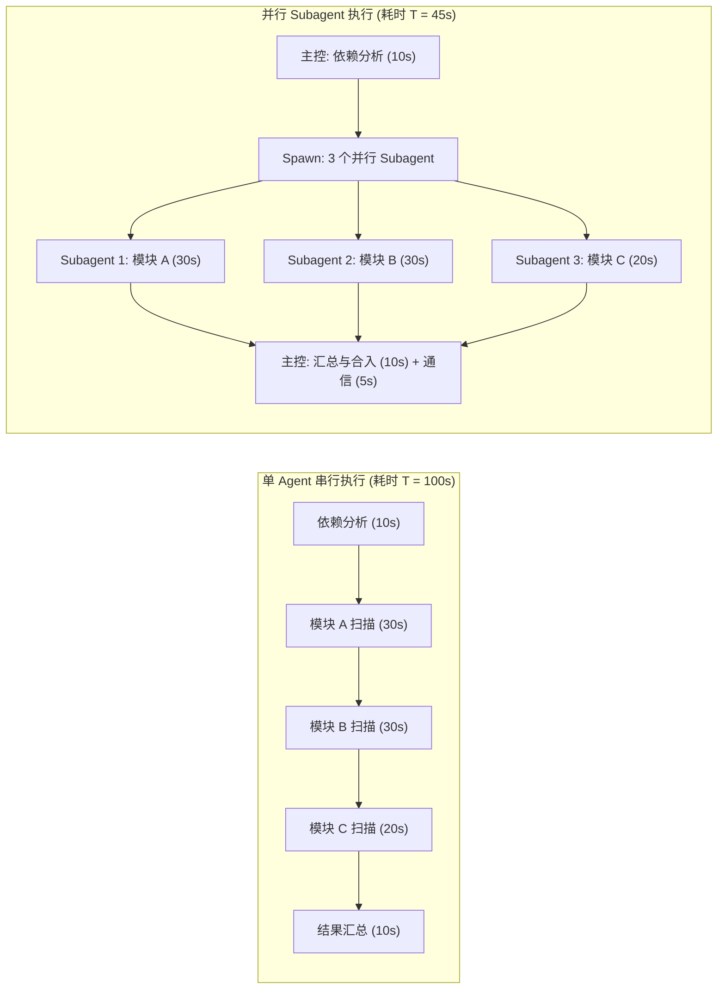
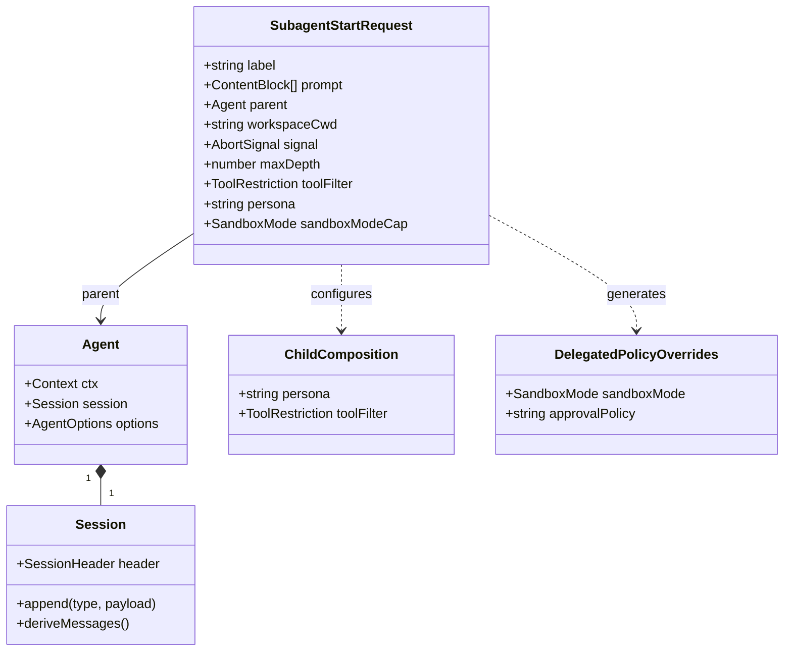
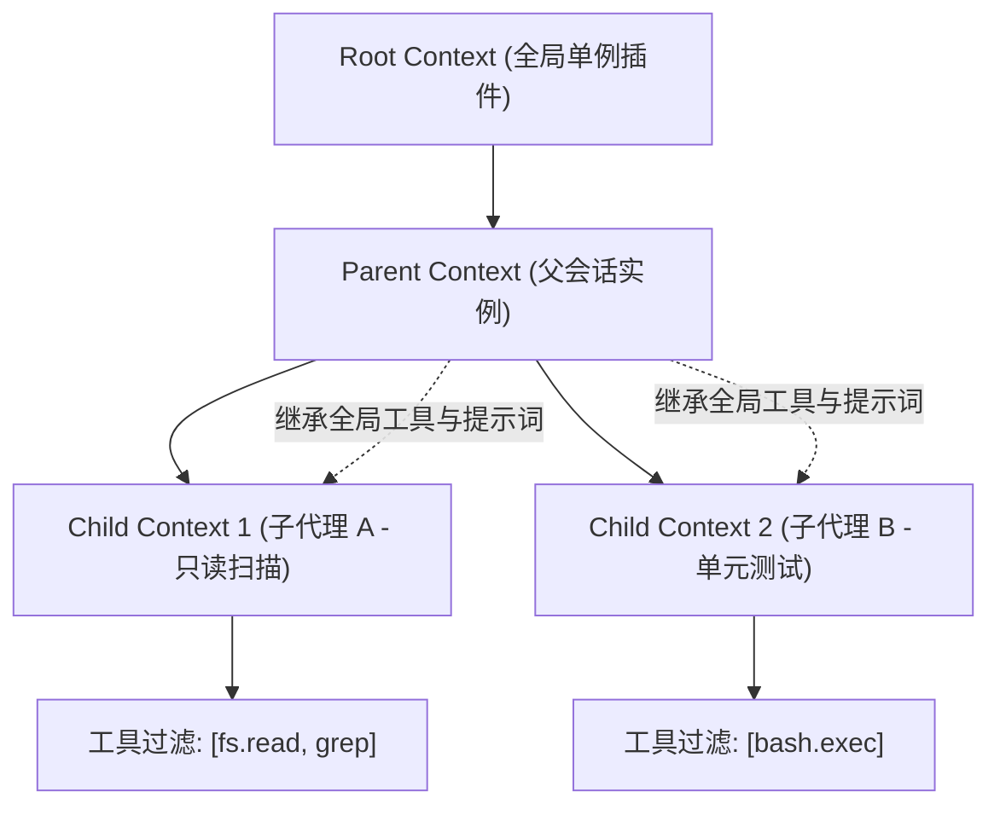
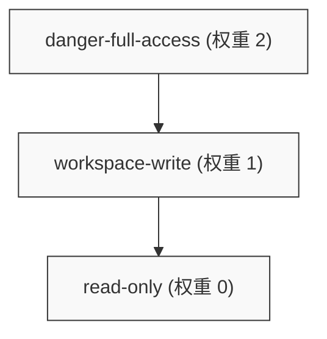
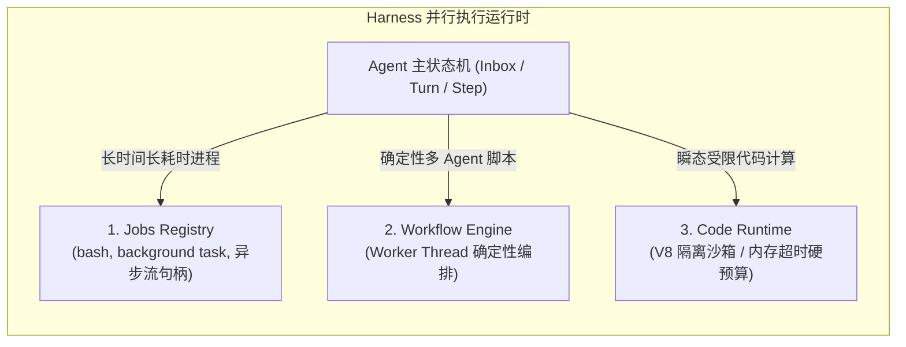
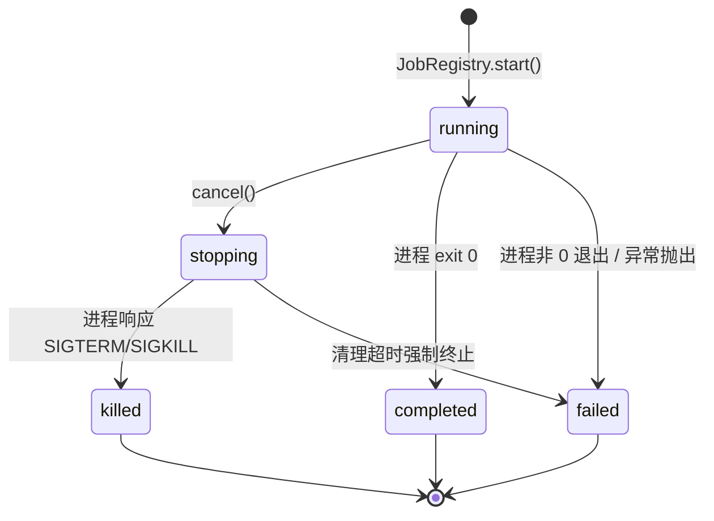
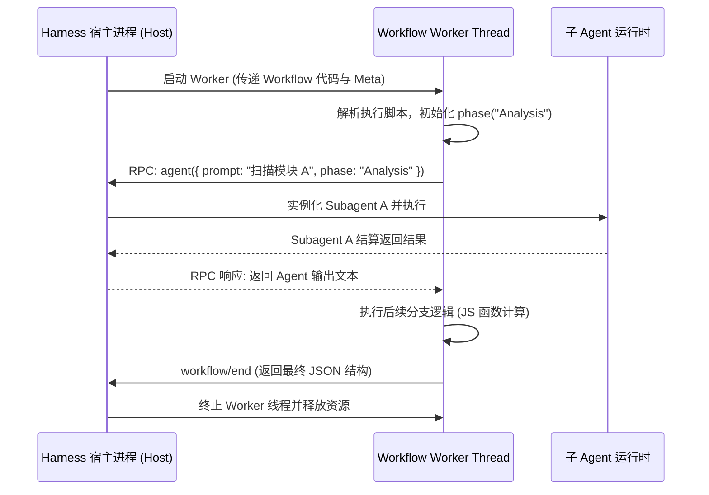
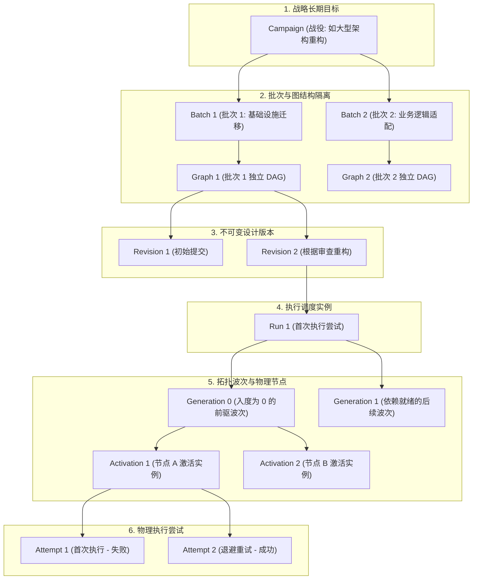

# Chapter 13: From a Single Agent to Parallel Work

English | [中文](13-single-to-parallel-agents.zh.md)

In modern software engineering, a single-threaded system confronting high throughput, large-scale collaboration, and complex multistage goals eventually evolves toward multithreaded, multiprocess, or distributed architecture. AI agent systems follow the same pattern.

Previous chapters examined the runtime of a single agent: a plugin skeleton built on the Cordis dependency-injection container, sessions whose immutable event logs serve as the record of facts, an Inbox-driven autoregressive loop of Turns and Steps, and a constrained tool sandbox. For cross-module refactoring, large-scale repository scans, end-to-end testing, and long-running complex tasks such as major refactoring campaigns, however, **a single agent's linear execution model runs into physical and mathematical limits**: finite context-window tokens, attention dilution, execution time that grows with each step, and a single point of failure without fault isolation.

This chapter examines how DeepSeek Harness moves from a **single agent** to a **parallel multi-agent system**. Using systems-programming concepts—process spawning, privilege attenuation, RPC communication, and worker-thread isolation—alongside mathematical derivations, it covers subagent delegation and spawning, the monotonic privilege rule (`sandboxModeCap`), three background-execution primitives (Jobs, Workflow, and Code Runtime), and the eight-level task identity hierarchy supported by Graph and Campaign.

---

## 1. Systems Intuition and Mathematical Models for Concurrent Collaboration

For a software engineer, moving from one agent to a network of parallel agents resembles moving from a **single-threaded event loop** to a **process pool and a distributed directed-acyclic-graph (DAG) computation engine**.

### 1.1 Parallel Speedup: Deriving Amdahl's and Gustafson's Laws

To assess the benefit of splitting one agent's task across parallel agents, we need a precise mathematical model.

Let $W$ be the total computational work a single agent needs to finish a complex task. Dependency analysis, controller decisions, and final result aggregation must remain serial, so let their fraction be $s \in [0, 1]$. The remaining fraction, $p = 1 - s$, can be delegated to independent subagents.

Suppose the system assigns $N$ independent subagents to execute the parallelizable work concurrently:

Under **Amdahl's law**, the theoretical speedup $S_{\text{latency}}(N)$ for a fixed workload is:

$$S_{\text{latency}}(N) = \frac{T_{\text{serial}}}{T_{\text{parallel}}(N)} = \frac{W}{s W + \frac{(1 - s) W}{N} + T_{\text{coord}}(N)} = \frac{1}{s + \frac{1 - s}{N} + \frac{T_{\text{coord}}(N)}{W}}$$

Here $T_{\text{coord}}(N)$ is the **coordination and communication overhead** of orchestration, context serialization, event dispatch, and result merging between the controller and subagents.

In a distributed agent system, communication overhead commonly grows linearly or log-linearly with the number of subagents $N$: $T_{\text{coord}}(N) = \alpha N + \beta$.

As $N \to \infty$, the serial fraction limits the maximum speedup:

$$\lim_{N \to \infty} S_{\text{latency}}(N) \le \frac{1}{s}$$

If $10\%$ of the task must be strictly serial, such as initial dependency resolution and final code integration, no number of parallel subagents can reduce end-to-end latency by more than a factor of $10$.



**Gustafson's law** offers another view: as compute resources (concurrent subagent slots) grow, an agent system often aims not to finish a fixed task sooner but to **expand the breadth and depth of scanning and reasoning within the same time budget**. For example, it can move from reviewing changed files alone to full AST static analysis and formal verification across 50 microservices.

Let $T$ be the total time for a scalable task and $p_{\text{scaled}}$ the fraction of expanded work handled by subagents:

$$S_{\text{workload}}(N) = \frac{s \cdot T + p_{\text{scaled}} \cdot N \cdot T}{T} = s + p_{\text{scaled}} \cdot N = 1 + (N - 1) \cdot p_{\text{scaled}}$$

Gustafson's law reveals the central value of parallel multi-agent architecture: **it moves past the cognitive limit of a single context window and lets code-verification throughput scale with compute resources.**

### 1.2 Context and Video-Memory Cost Model (KV Cache Partitioning)

At the system level, starting parallel subagents directly affects the model-inference backend's **VRAM footprint and KV Cache hit rate**.

Let the model have $M$ parameters (for example, DeepSeek-V3 671B MoE activates about 37B), $L$ Transformer layers, hidden dimension $H$, $A_{\text{head}}$ attention heads, and key-value dimension $D_{\text{kv}}$ per head.

The KV Cache memory consumed by one token across the layers, assuming FP16/BF16 precision at 2 bytes per element, is:

$$\text{Mem}_{\text{token\_kv}} = 2 \times 2 \times L \times A_{\text{head}} \times D_{\text{kv}} \quad (\text{Bytes})$$

When the controller agent runs serially, the session history grows to length $T_{\text{seq}}$, and its memory consumption is:

$$\text{Mem}_{\text{single\_agent}} = T_{\text{seq}} \times \text{Mem}_{\text{token\_kv}}$$

With subagent delegation and spawning:
1. The controller agent retains a compact controller prompt and task state, keeping its session length low: $T_{\text{parent}} \ll T_{\text{seq}}$.
2. Each subagent has an independent, short-lived ephemeral session with average length $T_{\text{child}}$.
3. If $K$ subagents run concurrently, total memory use is:

$$\text{Mem}_{\text{multi\_agent}} = T_{\text{parent}} \cdot \text{Mem}_{\text{token\_kv}} + \sum_{k=1}^{K} T_{\text{child}}^{(k)} \cdot \text{Mem}_{\text{token\_kv}}$$

More importantly, when subagents share a system-prompt prefix, modern inference engines such as vLLM, SGLang, and DeepSeek inference clusters can use **PagedAttention / RadixAttention prefix-tree caches** to reuse that portion of tokens in physical VRAM at a rate of $100\%$, substantially reducing VRAM-bandwidth demand and time to first token (TTFT) during concurrent inference.

| Dimension | One agent with a long serial context | Parallel delegation to multiple subagents |
| :--- | :--- | :--- |
| **Execution model** | Single-threaded exploration, step by step | Concurrent spawning in a tree or graph |
| **Context management** | Unbounded history growth and attention loss | Physically isolated contexts, discarded when tasks finish |
| **Failure blast radius** | A loop or hallucination at one step can fail the whole task | The controller can catch and retry one subagent's failure |
| **Permission control** | One global permission level makes local attenuation difficult | Fine-grained monotonic attenuation (`sandboxModeCap`) |
| **Prefix-cache reuse** | The prefix changes and loses validity as turns accumulate | Multiple subagents share a static system prompt with a high cache-hit rate |
| **Debugging** | Requires reading a single event stream tens of thousands of lines long | Hierarchical logs with precise parent-child session lineage |

---

## 2. Subagent Delegation and Spawning

In DeepSeek Harness, a subagent is not a stateless RPC created out of nothing. It is a controlled execution entity built through a strict **parent-child lineage chain** and **scoped context**.



### 2.1 In-Process Spawn/Fork versus Remote Heterogeneous Connectors

Harness supports two distinct ways to run subagents:

1. **In-process spawning (spawn / fork)**:
   - **Spawn (fresh materialization)**: In the current Node.js process, instantiate an isolated Cordis child Context and a new Session log for the subagent. It inherits the parent's Preset configuration, but its log begins anew at line 0.
   - **Fork (history-based branching)**: The subagent inherits the parent's configuration and copies the first $M$ historical events from the parent session up to that point as a **lineage seed**. Its autoregressive execution continues from that seeded history without contaminating the parent session.
2. **Remote and out-of-process connectors**:
   - **ACP (Agent Client Protocol)**: Connect to heterogeneous external agent processes, such as Codex, Claude Code, or a Python agent in a separate container, over standard JSON-RPC 2.0 via stdio/WebSocket.
   - **SDK remote client**: Dispatch subtasks to a distributed Worker cluster through REST/WebSocket for cross-machine scheduling.

### 2.2 Depth-Budget Bounds and `resolveChildDepth`

Without a hard mathematical bound on recursive multi-agent spawning—subagent A spawning B, then B spawning C—the model can enter a **recursive fork bomb** that exhausts system resources.

Harness uses a strict **monotonically increasing depth model**. Every session must record `delegationDepth` in its persisted metadata.

The top-level user session has depth:

$$d(\text{Root}) = 0$$

When parent agent $A$ spawns child agent $C$, the child's depth is:

$$d(C) = d(A) + 1$$

The `resolveChildDepth` function checks the bound when spawning a subagent:

$$\text{Assert}\Big(d(C) \in [0, 2^{53} - 1] \land d(C) \le \text{maxDepth}\Big)$$

The implementation guards against JavaScript integer overflow and out-of-range values:

```typescript
import type { Agent } from '@deepseek-ai/dsh-agent'
import { delegationDepthOf } from './depth.ts'

export class SubagentDepthError extends Error {
  constructor(public readonly attemptedDepth: number, public readonly maxDepth: number) {
    super(`subagent depth ${attemptedDepth} exceeds maxDepth ${maxDepth}`)
    this.name = 'SubagentDepthError'
  }
}

/**
 * 从父 agent 解析子代理的委派深度并执行硬性上限校验。
 * 父代理已持久化的 Header 是单调底线，防止冷恢复后深度被篡改重置。
 */
export function resolveChildDepth(parent: Agent, maxDepth: number | undefined): number {
  const childDepth = delegationDepthOf(parent) + 1
  if (!Number.isSafeInteger(childDepth)) {
    throw new RangeError('subagent child depth exceeds the safe-integer range')
  }
  if (maxDepth !== undefined && childDepth > maxDepth) {
    throw new SubagentDepthError(childDepth, maxDepth)
  }
  return childDepth
}
```

### 2.3 Parent-Child Session Metadata (Lineage and Session Meta)

A call to `ctx.agents.create()` must construct complete, traceable persisted metadata for the subagent:

```typescript
export function childSessionMeta(
  parent: Agent,
  childDepth: number,
  lineageSeedLength: number,
  workspaceCwd?: string,
): NonNullable<CreateAgentOptions['meta']> {
  const parentHeader = parent.session.header
  // 必须从父级 LIVE 作用域链而非持久化 Header 中读取 Preset，
  // 因为如果父级在空闲状态下切换了 Preset，LIVE 作用域已经更新，但旧 Header 仍记录旧值。
  const agentPreset = parent.ctx.get('agentPresets')?.composedPreset(parent.ctx)
  const cwd = workspaceCwd ?? parentHeader.cwd
  return {
    ...cwd !== undefined ? { cwd } : {},
    ...agentPreset === undefined ? {} : { agentPreset },
    parentSession: parentHeader.id,
    origin: 'subagent',
    delegationDepth: childDepth,
    ...lineageSeedLength > 0 ? { seedLength: lineageSeedLength } : {},
  }
}
```

This metadata ensures **three core engineering invariants**:
1. **Reproducibility**: Even after a full system crash and restart, replaying the child session log loads the Preset configuration and toolset bound when the subagent was created, rather than replacing them with current global defaults.
2. **Seed-lineage isolation**: `seedLength` identifies exactly which first $K$ events are projections of parent history; subsequent events are side effects produced independently by that subagent.
3. **Workspace inheritance or restriction**: The subagent can inherit the parent's working directory or be explicitly restricted to an isolated child directory, such as a temporary build workspace.

### 2.4 Scope Isolation and Runtime Context Declaration

Subagents running in one process must share host resources with the parent, but their prompts and tool configuration must not contaminate the parent.

The Cordis container isolates them through prototype-chain inheritance: `childCtx = parent.ctx.extend()`. Changes a subagent makes through `childCtx.tools.restrict()` or `childCtx.systemPrompt.section()` apply only to that branch.



When Harness creates a subagent, it also injects a dedicated **runtime context declaration (`subagent:delegation`)** into the system prompt at fixed order `120`, immediately after the sandbox and approval policy declarations:

```typescript
export const SUBAGENT_DELEGATION_CONTEXT
  = 'You are a delegated subagent: your permission scope was fixed when you were started and cannot be '
    + 'widened from inside this session — operations that require approval are rejected automatically. '
    + 'When the task needs access beyond that scope, do not retry the denied operation; state the '
    + 'limitation in your reply so the delegating agent can handle it.'
```

That prompt tells the model: **You are a delegated subagent with locked permissions. The system directly rejects operations requiring interactive approval. If permissions are insufficient, do not retry repeatedly; report the restriction to the parent agent immediately.**

---

## 3. Monotonic Privilege Attenuation

One of the most serious security flaws in distributed and multi-agent systems is **privilege escalation**. If a read-only parent agent can spawn a child with write access or dangerous system-wide access, the system's security boundary collapses.

Harness establishes a formal **monotonic privilege-attenuation** rule.

### 3.1 Deriving the Privilege Lattice

Define sandbox permissions as a totally ordered lattice $(\mathcal{S}, \le)$:

$$\mathcal{S} = \{ \text{read-only}, \text{workspace-write}, \text{danger-full-access} \}$$

Define an authority-weight mapping $\text{Auth}: \mathcal{S} \to \{0, 1, 2\}$:

$$\text{Auth}(\text{read-only}) = 0$$

$$\text{Auth}(\text{workspace-write}) = 1$$

$$\text{Auth}(\text{danger-full-access}) = 2$$

The order is:

$$\text{read-only} \prec \text{workspace-write} \prec \text{danger-full-access}$$

Let $M_{\text{parent}} \in \mathcal{S}$ be the parent's effective permission mode and $\text{Cap} \in \mathcal{S}$ the permission cap declared in the delegation request.

The child's final effective permission $M_{\text{child}}$ must satisfy the **meet operation (greatest lower bound)**:

$$M_{\text{child}} = M_{\text{parent}} \sqcap \text{Cap} = \text{argmin}_{\le} \Big( \text{Auth}(M_{\text{parent}}), \text{Auth}(\text{Cap}) \Big)$$

Thus the subagent's permissions are always the **minimum** of the parent's effective permissions and the requested cap.



### 3.2 Resolving the Sandbox Cap `sandboxModeCap`

In the implementation, `captureDelegatedPolicyOverrides` evaluates the privilege lattice synchronously while creating the subagent:

```typescript
import type { Agent } from '@deepseek-ai/dsh-agent'
import type { SandboxMode } from '@deepseek-ai/dsh-sandbox'

export interface DelegatedPolicyOverrides {
  readonly sandboxMode: SandboxMode | undefined
  readonly approvalPolicy: 'never' | undefined
}

const SANDBOX_MODE_AUTHORITY: Readonly<Record<SandboxMode, number>> = {
  'read-only': 0,
  'workspace-write': 1,
  'danger-full-access': 2,
}

/**
 * 捕获需要注入到子会话中的委派策略。
 * 必须在子代理启动的第一个 await 之前同步调用！
 * 后续父会话如果发生沙箱模式切换，属于父会话的未来，绝对不能反向影响已派生的子代理。
 */
export function captureDelegatedPolicyOverrides(
  parent: Agent,
  sandboxModeCap?: SandboxMode,
): DelegatedPolicyOverrides {
  const sandboxPolicy = parent.ctx.get('sandboxPolicy')
  if (sandboxModeCap !== undefined && sandboxPolicy === undefined) {
    throw new Error('subagent sandboxModeCap requires the sandbox-policy service')
  }

  // 若未指定 Cap，则直接捕获父级的显式覆盖；若指定了 Cap，则解析父级的生效模式并取下确界
  const parentMode = sandboxModeCap === undefined
    ? sandboxPolicy?.overrideOf(parent.session)
    : sandboxPolicy?.resolve({ session: parent.session }).mode

  const sandboxMode = sandboxModeCap === undefined || parentMode === undefined
    ? parentMode
    : SANDBOX_MODE_AUTHORITY[parentMode] <= SANDBOX_MODE_AUTHORITY[sandboxModeCap]
      ? parentMode
      : sandboxModeCap

  return {
    sandboxMode,
    // 关键安全防御：子代理的交互式审批策略永远强制固定为 'never'
    approvalPolicy: parent.ctx.get('approval') === undefined ? undefined : 'never',
  }
}
```

### 3.3 Why Must a Subagent's Approval Policy Be Fixed at `never`?

In an interactive CLI or Web UI, when a top-level agent attempts a high-risk operation such as changing the main configuration file, the system suspends the current Step and displays an approval prompt to the user.

In a parallel multi-agent system, however, subagents run as **unattended background tasks**. If one requests approval:
1. **Deadlock risk**: The frontend UI has no interactive input channel for every short-lived background subagent. That subagent waits forever for a user action that will never arrive.
2. **Implicit privilege-escalation risk**: Allowing a subagent to seek temporary elevation through its parent would break the one-way determinism of parent-child scheduling.

Harness therefore requires **every subagent's `approvalPolicy` to be fixed at `'never'` on startup**. If it calls a tool outside its sandbox permissions, the sandbox middleware **deterministically throws a denial error**, prompting the model to choose an alternative or report the error upward.

### 3.4 Persisting Policy in Event-Sourced Logs (`source: 'delegation'`)

In Harness's event-sourced log, two synthetic events are appended immediately after child-session creation, before the session is published externally:

```typescript
export function appendDelegatedPolicyOverrides(
  childSession: Session,
  overrides: DelegatedPolicyOverrides,
): void {
  if (overrides.sandboxMode !== undefined) {
    childSession.append('sandbox/mode', {
      mode: overrides.sandboxMode,
      source: 'delegation',
    })
  }
  if (overrides.approvalPolicy !== undefined) {
    childSession.append('approval/policy', {
      policy: overrides.approvalPolicy,
      source: 'delegation',
    })
  }
}
```

Writing policy events with `source: 'delegation'` into the subagent's own log makes its **state self-contained**. Even after a cold restart, replaying the child-session event stream reconstructs the sandbox mode and approval rules in force at the time with $100\%$ accuracy, without consulting parent-session history.

---

## 4. Three Background-Execution Primitives: Jobs, Workflow, and Code Runtime

Parallel execution encompasses more than spawning subagents. It also includes code-execution sandboxes, long-running external subprocesses, and deterministic orchestration workflows. Harness defines **three basic task-execution primitives**, each with distinct design, lifecycle, isolation, and communication properties:



### 4.1 Technical Comparison of the Three Primitives

| Dimension | Primitive 1: Jobs | Primitive 2: Workflow | Primitive 3: Code Runtime |
| :--- | :--- | :--- | :--- |
| **Typical scenario** | Background `cargo build`, long-running Web service, asynchronous file monitoring | Batch-refactoring script, multi-file review pipeline, deterministic multistage exploration | Run TypeScript to filter data, calculate values, or transform an AST |
| **Execution host** | Host OS subprocess or asynchronous task handle | Separate Node.js `Worker` thread | Separate V8 `vm.Context` sandbox or isolated worker thread |
| **Control-flow owner** | External OS process runs independently; Harness holds only a control handle | User- or model-authored TypeScript script drives execution | Transient pure function or asynchronous script, destroyed after one call |
| **Internal agent count** | 0 (pure OS task) or one wrapped independent subagent | 1 to $N$ (created dynamically with `await agent()` in the script) | 0 (only exposed Host RPC calls through injected `bindings`) |
| **State machine and lifecycle** | `running` $\to$ `stopping` $\to$ `completed`/`killed`/`failed` | `WorkflowRun`: `completed` / `cancelled` / `error` | Transient execution: `CodeRunResult` with `logs`, `value`, and `error` |
| **Output and buffering** | Incremental cursor reads with `readOutput()` and overflow spill truncation | Event-stream reports (`workflow/agent-start`, `workflow/end`) | One structured result: lossless JSON `value` and a `logs` array |
| **Resource limits** | OS process handle and output-byte limit `outputLimitBytes` | Thread-concurrency slots, timeout, and cancellation propagation | Strict V8 heap limit (for example, 128 MB) and hard execution timeout |

---

### 4.2 Primitive 1: Jobs (General-Purpose Handles for Long-Running Tasks)

Jobs reconcile **long-running, blocking operations**—such as starting builds, running test suites, and starting local services—with the single-threaded agent interaction loop.

#### Data Structures and Lifecycle State Machine

```typescript
export type JobStatus = 'running' | 'stopping' | 'completed' | 'killed' | 'failed'

export interface JobOutcome {
  status: 'completed' | 'killed' | 'failed'
  detail?: string
  output?: string
}

export interface JobHooks {
  cancel(reason?: string): void
  done: Promise<JobOutcome>
  readOutput?(): string
}

export interface JobStart {
  kind: 'bash' | 'subagent' | string
  label: string
  outputLimitBytes?: number
  owner?: Agent
  run(): JobHooks
}
```



#### Session Ownership Fencing and Cascading Disposal

At startup, each Job can bind to its host agent through `owner?: Agent`.
1. **Access fence**: Only the Session that owns a Job (or any session for an unowned public Job) may call `readOutput` or `kill`.
2. **Lifecycle linkage**: When an agent session is unregistered or disposed, Cordis disposal hooks automatically call `cancel()` on all associated Jobs so **zombie processes** do not exhaust system resources.

---

### 4.3 Primitive 2: Workflow (Deterministic Processes in a Worker Thread)

Workflow addresses cases requiring **precise program control flow—loops, conditional branches, and parallel pools—to orchestrate multiple agent calls**.

#### Why Must Workflow Run in a Worker Thread?

If a user- or model-generated Workflow script runs via `eval` in the main event loop, an infinite loop such as `while(true) {}` can block the entire Harness host process, disabling every other agent, the Web UI, and RPC services.

Harness therefore runs Workflow in a separate **Node.js Worker Thread** and communicates with the host through structured messages.



#### Phases and Structured Settlement

Workflow scripts may declare `WorkflowPhase` execution phases, for example:
- `phase: "Discovery"` (discovery: start five read-only agents concurrently to find potential bugs)
- `phase: "Execution"` (execution: start agents with write permission one by one to fix identified problems)
- `phase: "Verification"` (verification: start test agents to verify the fixes)

```typescript
export interface WorkflowResult {
  value: unknown
  stopReason: 'completed' | 'cancelled' | 'error'
  error?: string
  agentsStarted: number
}
```

---

### 4.4 Primitive 3: Code Runtime (Code-Execution Sandbox with Memory and Time Limits)

Code Runtime is a **stateless, transient, high-security pure-computation sandbox** for short JavaScript/TypeScript snippets written and executed by the model.

#### Language-Neutral Binding Namespaces

Code Runtime exposes no arbitrary global objects such as Node.js `process`, `fs`, or `globalThis`. Instead, it injects a strict allowlist of safe asynchronous pure functions through `CodeBindingNamespace`, such as `tools.*` calls exposed inside the sandbox:

```typescript
export interface CodeBindingNamespace {
  global: string
  functions: Record<string, (args: unknown) => Promise<CodeJsonValue>>
  errorClass?: CodeBindingErrorClass
}

export interface CodeRunRequest {
  program: string
  bindings: CodeBindingNamespace[]
  signal?: AbortSignal
}
```

#### Six Failure Categories

To let the upstream agent or model **correct itself** according to the cause of execution failure, Code Runtime defines six mutually orthogonal failure types:

```typescript
export interface CodeRunFailure {
  kind:
    | 'exception'      // 代码语法错误或运行时抛出未捕获异常
    | 'timeout'        // 超出配置的硬性时间预算 (如 5000ms)
    | 'abort'          // 外部 AbortSignal 触发主动取消
    | 'worker-exit'    // 底层沙箱进程因 OOM (超出堆上限) 或非法指令崩溃
    | 'invalid-output' // 返回值无法被无损序列化为 JSON
    | 'output-limit'   // 产生的 log 或输出文本超过字节阈值
  message: string
}
```

---

## 5. The Eight-Level Graph and Campaign Identity Hierarchy

As single-agent and multi-agent collaboration grows from simple parent-child delegation into complex enterprise project refactoring, task topology becomes **large directed acyclic graphs (DAGs)** and **long-running campaigns** spanning days or weeks.

To balance distributed scheduling, immutable versioning, fault isolation, and historical replay, DeepSeek Harness defines an **eight-level identity hierarchy**:

$$\text{Campaign} > \text{Batch} > \text{Graph} > \text{Revision} > \text{Run} > \text{Generation} > \text{Activation} > \text{Attempt}$$



### 5.1 Precise Definitions and Separate Responsibilities at Eight Levels

#### 1. Campaign
- **Responsibility**: Represents the user's overall objective, such as migrating a 500,000-line C++ repository completely to Rust.
- **Immutable prefix and auditable append**: A Campaign contains an ordered sequence of Batches. Initially registered Batches form an immutable prefix. Once all registered Batches have passed acceptance, the system may append newly discovered Batches through an incremental `planRevision` with complete audit evidence, but it must never alter completed historical Batches.

#### 2. Batch
- **Responsibility**: A milestone within the larger Campaign, such as phase 1: migrating and testing core data structures.
- **Isolation from historical node growth**: **Every Batch has an independent Graph instance**. Hundreds of nodes from completed Batches are not copied into the next Batch. Later Batches consume prior results only through lightweight **confirmed settlement evidence**, preventing the DAG from growing without bound over time.

#### 3. Graph
- **Responsibility**: Names the directed acyclic graph (DAG) of task nodes, data dependencies, and resource constraints within the current Batch.

#### 4. Revision
- **Responsibility**: An **immutable design snapshot** of the task graph's topology.
- **Separation of design and execution**: When the controller agent changes the graph—for example, adding or removing nodes or adjusting dependencies—the system never mutates it in place. It derives a new `Revision`, classified as `new_task`, `analysis_refactor`, or `execution_correction`, extending a one-way version lineage.

#### 5. Run
- **Responsibility**: A complete scheduled execution instance of a specific `Revision`.
- **Separate static topology and dynamic execution**: The same `Revision` can have multiple `Run` instances after environmental changes or human intervention.

#### 6. Generation
- **Responsibility**: A concurrent scheduling wave determined by DAG dependency topology.
- **Parallel barrier**: Ready nodes with topological indegree zero belong to one Generation. Nodes in that Generation can run concurrently without locks. Once the whole Generation settles, the system advances to the next.

#### 7. Activation
- **Responsibility**: The logical activation context of a particular DAG node in the current Run.
- **Isolated-workspace binding**: Activation allocates an independent sandbox working directory, resolves inputs passed from upstream, and prepares the execution environment.

#### 8. Attempt
- **Responsibility**: A physical execution entity inside one Activation, including retries and failover.
- **Isolation of transient retries**: If a node fails because of a network fluctuation or temporary model rate limit, the system increments its `Attempt` count within the current Activation and retries with exponential backoff, without resetting the upper-level Generation or Run.

---

## 6. Mathematical Model and VRAM Accounting for Multi-Agent Scheduling

### 6.1 DAG Critical Path and Minimum Completion Time

Let $G = (V, E)$ be a task graph with $V$ nodes and $E$ dependency edges. Let $t(v)$ be the expected execution time of node $v \in V$.

The duration of any topological path $p = (v_1, v_2, \dots, v_k)$ from a start node to an end node is:

$$T(p) = \sum_{i=1}^{k} t(v_i)$$

With **unlimited compute (no concurrency-slot limit)**, the theoretical minimum completion time for the whole Graph equals the length of the **critical path**:

$$T_{\text{CP}} = \max_{p \in \text{Paths}(G)} T(p)$$

In production, the system is constrained by **resource-constrained project scheduling (RCPSP)**: a maximum number of concurrent Workers $C_{\text{max}}$ and a global model token rate in tokens per minute (TPM).

Let $A(\tau) \subseteq V$ be the set of nodes running at time $\tau$. The scheduler must satisfy:

$$|A(\tau)| \le C_{\text{max}}$$

$$\sum_{v \in A(\tau)} \text{TPM}(v) \le \text{TPM}_{\text{budget}}$$

```mermaid
gantt
    title DAG 关键路径与波次调度甘特图
    dateFormat X
    axisFormat %s秒

    section Generation 0 (无前驱)
    节点 A (AST 解析)      :active, a1, 0, 10
    节点 B (依赖树扫描)    :active, a2, 0, 15
    节点 C (配置校验)      :active, a3, 0, 5

    section Generation 1 (依赖就绪)
    节点 D (生成类型定义)  :crit, d1, 15, 35
    节点 E (编写单元测试)  :e1, 15, 25

    section Generation 2 (关键路径汇聚)
    节点 F (整体编译与验证):crit, f1, 35, 50
```



In the diagram above, the critical path is $\text{node B (15s)} \to \text{node D (20s)} \to \text{node F (15s)}$, so the theoretical total is $T_{\text{CP}} = 50\text{s}$. Even if node C finishes in five seconds, the overall process still depends on how quickly B and D finish.

---

## 7. Complete Production-Grade TypeScript Implementation

The following is a complete production-grade implementation of a multi-agent delegation orchestrator and monotonic privilege-attenuation engine. It follows TypeScript 6 discriminated unions and interface-oriented design, with comprehensive boundary-error handling and cascading `AbortSignal` cancellation:

```typescript
/**
 * @file multi-agent-orchestrator.ts
 * @description 工业级多 Agent 委派派生与权限单调递减执行引擎
 */

import { EventEmitter } from 'node:events'

// ============================================================================
// 1. 类型定义与权限格
// ============================================================================

export type SandboxMode = 'read-only' | 'workspace-write' | 'danger-full-access'

export const SANDBOX_AUTHORITY: Readonly<Record<SandboxMode, number>> = {
  'read-only': 0,
  'workspace-write': 1,
  'danger-full-access': 2,
}

export type ApprovalPolicy = 'always' | 'on-change' | 'never'

export interface SessionHeader {
  readonly id: string
  readonly cwd: string
  readonly delegationDepth: number
}

export interface SessionLogEvent {
  readonly id: string
  readonly type: string
  readonly payload: unknown
  readonly timestamp: number
}

export class MockSession {
  private readonly events: SessionLogEvent[] = []

  constructor(
    public readonly header: SessionHeader,
    initialEvents: SessionLogEvent[] = [],
  ) {
    this.events.push(...initialEvents)
  }

  append(type: string, payload: unknown): SessionLogEvent {
    const event: SessionLogEvent = {
      id: `evt-${this.events.length + 1}`,
      type,
      payload,
      timestamp: Date.now(),
    }
    this.events.push(event)
    return event
  }

  getEvents(): readonly SessionLogEvent[] {
    return this.events
  }
}

export interface AgentContext {
  readonly sandboxMode: SandboxMode
  readonly approvalPolicy: ApprovalPolicy
  readonly toolRestrictions?: ReadonlySet<string>
  readonly persona?: string
}

export interface AgentOptions {
  readonly provider?: string
  readonly model?: string
  readonly maxTokens?: number
}

export interface AgentInstance {
  readonly id: string
  readonly session: MockSession
  readonly context: AgentContext
  readonly options: AgentOptions
  readonly signal: AbortSignal
}

export interface SubagentSpawnRequest {
  readonly label: string
  readonly prompt: string
  readonly parent: AgentInstance
  readonly workspaceCwd?: string
  readonly maxDepth?: number
  readonly allowedTools?: string[]
  readonly persona?: string
  readonly sandboxModeCap?: SandboxMode
  readonly signal?: AbortSignal
}

export interface SubagentRunResult {
  readonly childSessionId: string
  readonly status: 'completed' | 'failed' | 'aborted'
  readonly output: string
  readonly error?: string
}

// ============================================================================
// 2. 权限计算与深度校验器
// ============================================================================

export class SubagentSecurityEnforcer {
  /**
   * 严格执行权限单调递减规则：Child = Parent ⊓ Cap
   */
  static resolveEffectivePolicy(
    parent: AgentInstance,
    cap?: SandboxMode,
  ): { sandboxMode: SandboxMode; approvalPolicy: ApprovalPolicy } {
    const parentMode = parent.context.sandboxMode
    let effectiveSandbox: SandboxMode = parentMode

    if (cap !== undefined) {
      effectiveSandbox =
        SANDBOX_AUTHORITY[parentMode] <= SANDBOX_AUTHORITY[cap]
          ? parentMode
          : cap
    }

    return {
      sandboxMode: effectiveSandbox,
      // 子代理审批策略永远固定为 'never'
      approvalPolicy: 'never',
    }
  }

  /**
   * 校验递归深度预算，防止 Fork 炸弹
   */
  static assertDepthBudget(parentDepth: number, maxDepth?: number): number {
    const childDepth = parentDepth + 1
    if (!Number.isSafeInteger(childDepth)) {
      throw new RangeError('Delegation depth exceeded safe integer range')
    }
    if (maxDepth !== undefined && childDepth > maxDepth) {
      throw new Error(`Subagent delegation depth ${childDepth} exceeds configured maxDepth ${maxDepth}`)
    }
    return childDepth
  }
}

// ============================================================================
// 3. 生产级多 Agent 委派协调器
// ============================================================================

export class SubagentOrchestrator extends EventEmitter {
  private activeChildren = new Map<string, AgentInstance>()

  /**
   * 同步物化并异步启动子代理
   */
  async spawnAndExecute(request: SubagentSpawnRequest): Promise<SubagentRunResult> {
    const { parent, sandboxModeCap, maxDepth, signal } = request

    // 1. 深度预算前置校验
    const childDepth = SubagentSecurityEnforcer.assertDepthBudget(
      parent.session.header.delegationDepth,
      maxDepth,
    )

    // 2. 权限单调递减计算 (同步执行，不可被未来父状态污染)
    const policy = SubagentSecurityEnforcer.resolveEffectivePolicy(parent, sandboxModeCap)

    // 3. 创建级联取消信号 (父信号 + 请求专用信号)
    const abortController = new AbortController()
    const onParentAbort = () => abortController.abort(new Error('Parent agent aborted'))
    parent.signal.addEventListener('abort', onParentAbort, { once: true })

    if (signal) {
      signal.addEventListener('abort', () => abortController.abort(new Error('Subagent request aborted')), {
        once: true,
      })
    }

    const childSessionId = `sub-sess-${Date.now()}-${Math.random().toString(36).slice(2, 7)}`
    const childCwd = request.workspaceCwd ?? parent.session.header.cwd

    // 4. 构建子会话账本与元数据
    const childSession = new MockSession({
      id: childSessionId,
      cwd: childCwd,
      delegationDepth: childDepth,
    })

    // 5. 在未发布窗口内追加委派策略事件 (保证事件溯源完整性)
    childSession.append('sandbox/mode', {
      mode: policy.sandboxMode,
      source: 'delegation',
    })
    childSession.append('approval/policy', {
      policy: policy.approvalPolicy,
      source: 'delegation',
    })

    // 6. 实例化子代理作用域
    const childAgent: AgentInstance = {
      id: `agent-${childSessionId}`,
      session: childSession,
      context: {
        sandboxMode: policy.sandboxMode,
        approvalPolicy: policy.approvalPolicy,
        toolRestrictions: request.allowedTools ? new Set(request.allowedTools) : parent.context.toolRestrictions,
        persona: request.persona ?? parent.context.persona,
      },
      options: { ...parent.options },
      signal: abortController.signal,
    }

    this.activeChildren.set(childSessionId, childAgent)
    this.emit('spawn', { childId: childSessionId, parentId: parent.id, depth: childDepth })

    try {
      // 7. 驱动子代理自回归循环
      const output = await this.runChildAgentLoop(childAgent, request.prompt)
      return {
        childSessionId,
        status: 'completed',
        output,
      }
    } catch (err: unknown) {
      if (childAgent.signal.aborted) {
        return {
          childSessionId,
          status: 'aborted',
          output: '',
          error: 'Subagent execution was aborted by signal',
        }
      }
      return {
        childSessionId,
        status: 'failed',
        output: '',
        error: err instanceof Error ? err.message : String(err),
      }
    } finally {
      // 清理监听器与活动句柄
      parent.signal.removeEventListener('abort', onParentAbort)
      this.activeChildren.delete(childSessionId)
      this.emit('settle', { childId: childSessionId })
    }
  }

  /**
   * 模拟子代理的受限自回归状态机
   */
  private async runChildAgentLoop(agent: AgentInstance, prompt: string): Promise<string> {
    // 注入运行时委派约束声明
    agent.session.append('turn/start', { prompt, role: 'user' })

    if (agent.signal.aborted) {
      throw new Error('Aborted before starting loop')
    }

    // 模拟执行：检查工具调用权限
    if (agent.context.toolRestrictions && !agent.context.toolRestrictions.has('fs.read')) {
      // 若受限则安全拦截
    }

    // 模拟大模型推理与工具交互
    await new Promise((resolve, reject) => {
      const timer = setTimeout(resolve, 50)
      agent.signal.addEventListener('abort', () => {
        clearTimeout(timer)
        reject(new Error('Subagent loop aborted during execution'))
      })
    })

    const finalReply = `Analysis completed by subagent at depth ${agent.session.header.delegationDepth} within ${agent.context.sandboxMode} sandbox.`
    agent.session.append('turn/end', { reply: finalReply, role: 'assistant' })

    return finalReply
  }
}
```

---

## 8. Production Incidents and Troubleshooting

Parallel multi-agent systems add complexity exponentially. The following four incidents are typical severe failures under high production concurrency, with their causes and remedies.

### Incident 1: Recursive Subagent Spawning Causes Depth Explosion

- **Symptom**: While reviewing code, a controller agent spawns dozens of subagents. Each considers its task too complex and spawns another level. Within 30 seconds, the system exhausts file descriptors and memory, and the process crashes.
- **Root causes**:
  1. The spawn entry point does not enforce monotonically increasing depth.
  2. The prompt does not explicitly tell the agent that it is a subagent (the `SUBAGENT_DELEGATION_CONTEXT` declaration is missing), so the model still acts as a top-level scheduler.
- **Diagnosis and fix**:
  1. Require `resolveChildDepth` at the entry point and throw `SubagentDepthError` immediately if `depth > maxDepth` (a suggested production default is `maxDepth = 2`).
  2. Inject an unoverridable declaration at `order: 120` at the start of the subagent context: "You have been delegated this task. Do not delegate it again; perform it yourself and report the result."

### Incident 2: A Background Subagent Requests Approval and Hangs Indefinitely

- **Symptom**: The Web UI shows the main task stalled at $40\%$ without an error, and background CPU use is zero. Logs show a subagent suspended while attempting to write a file.
- **Root cause**: The subagent inherited the parent agent's default approval policy (`approvalPolicy: 'always'`). It has no frontend user-interaction WebSocket, so its approval request has no recipient and the promise stays `pending` forever.
- **Diagnosis and fix**:
  1. Strictly enforce **monotonic privilege attenuation**: `captureDelegatedPolicyOverrides` must set the subagent's `approvalPolicy` to `'never'` unconditionally.
  2. When the sandbox detects insufficient permissions, throw `EACCES` directly so the model can observe the failure and adjust its strategy within one Step, instead of waiting indefinitely.

### Incident 3: Worker-Thread OOM Destabilizes the Host and Leaves Orphaned Tasks

- **Symptom**: While the Workflow engine runs a large parallel code-analysis script, the Node.js host process crashes intermittently or leaves many subprocesses unreleased.
- **Root causes**:
  1. The Workflow script allocates an oversized AST object in a Worker Thread, triggering a hard V8 out-of-memory termination.
  2. The host does not observe the Worker's `error` and `exit` events, so it cannot call `cancel()` to clean up already spawned external Jobs.
- **Diagnosis and fix**:
  1. Pass `resourceLimits: { maxOldGenerationSizeMb: 512 }` explicitly when creating a Worker.
  2. In the Worker exit hook, traverse all Jobs it spawned and terminate them in a cascade.

### Incident 4: Campaign History Causes Unbounded Graph-State Growth

- **Symptom**: In a ten-phase task, by phase eight each controller-decision request consumes 128k input tokens. API responses are very slow and repeatedly fail with `Context Window Exceeded`.
- **Root cause**: The entire Campaign lives in one Graph, so hundreds of completed nodes from the first seven phases are serialized in full into the controller prompt.
- **Diagnosis and fix**:
  1. Introduce the **`Campaign > Batch > Graph` isolation hierarchy**.
  2. Give each phase a separate Batch with its own isolated Graph instance. Later Batches consume only the earlier Batches' settlement summaries, reducing context overhead from $O(N)$ to $O(1)$.

---

## 9. Exercises and Engineering Practice

Complete these questions and practical exercises to consolidate your understanding of parallel multi-agent architecture and sandbox security:

1. **Calculation**: In a multi-agent system, the controller's serial coordination fraction is $s = 0.15$. Each subagent uses an average of 4,000 input tokens and 1,000 output tokens, with 200 additional tokens of controller summary per subagent. As concurrent subagents increase from $N = 2$ to $N = 10$, calculate the theoretical speedup $S(N)$ and the growth in total token consumption.
2. **Security design**: If the parent session is in `workspace-write` mode, a tool call requests a `danger-full-access` subagent for system debugging. Explain why the request must be blocked at runtime and write pseudocode for the check.
3. **Architecture analysis**: Why does Harness require registered Batches in a Campaign to form an **immutable prefix**, with only auditable append operations at the end? What does this mean for event replay and distributed consistency?
4. **Implementation**: Extend this chapter's `SubagentOrchestrator` with a bounded task pool and a concurrency limit of 3. When more than three subagents request execution at once, queue the excess and wake them as active subagents settle.
