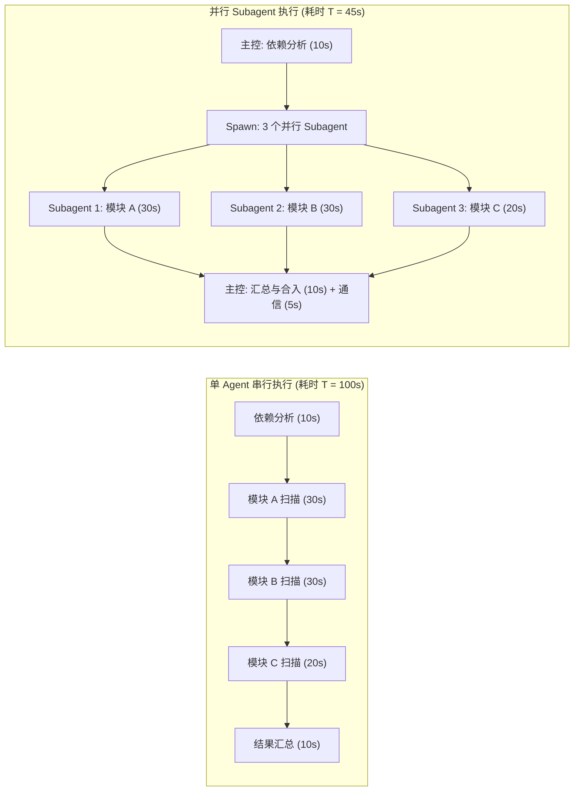
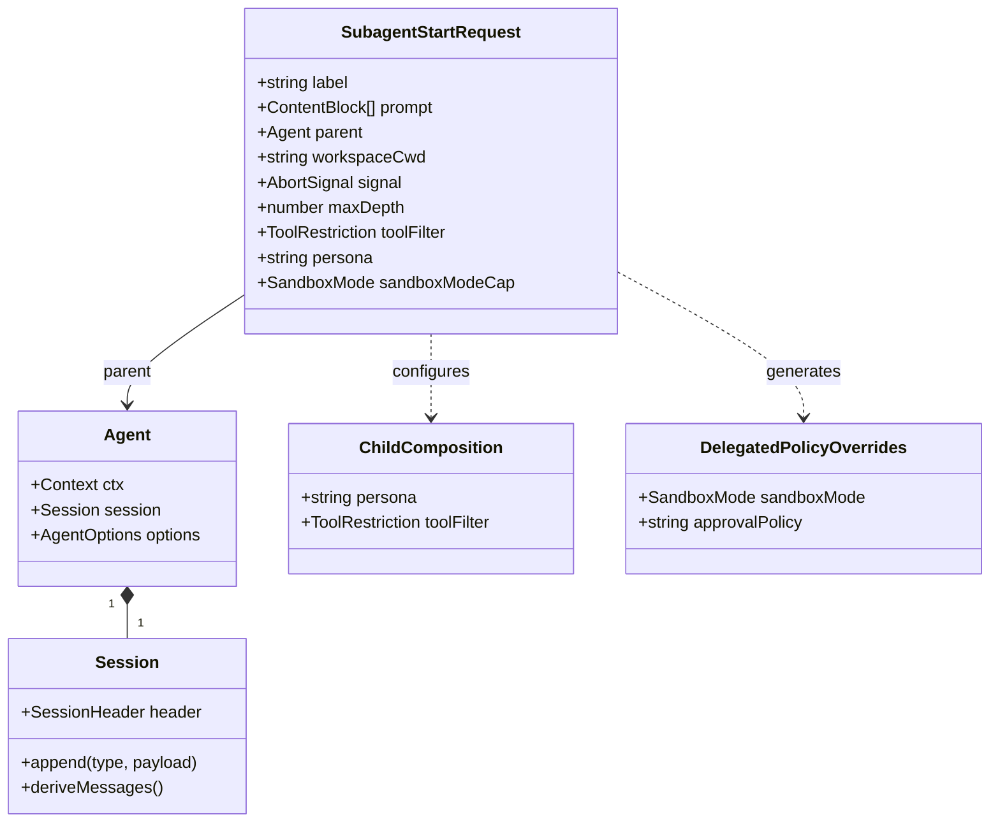
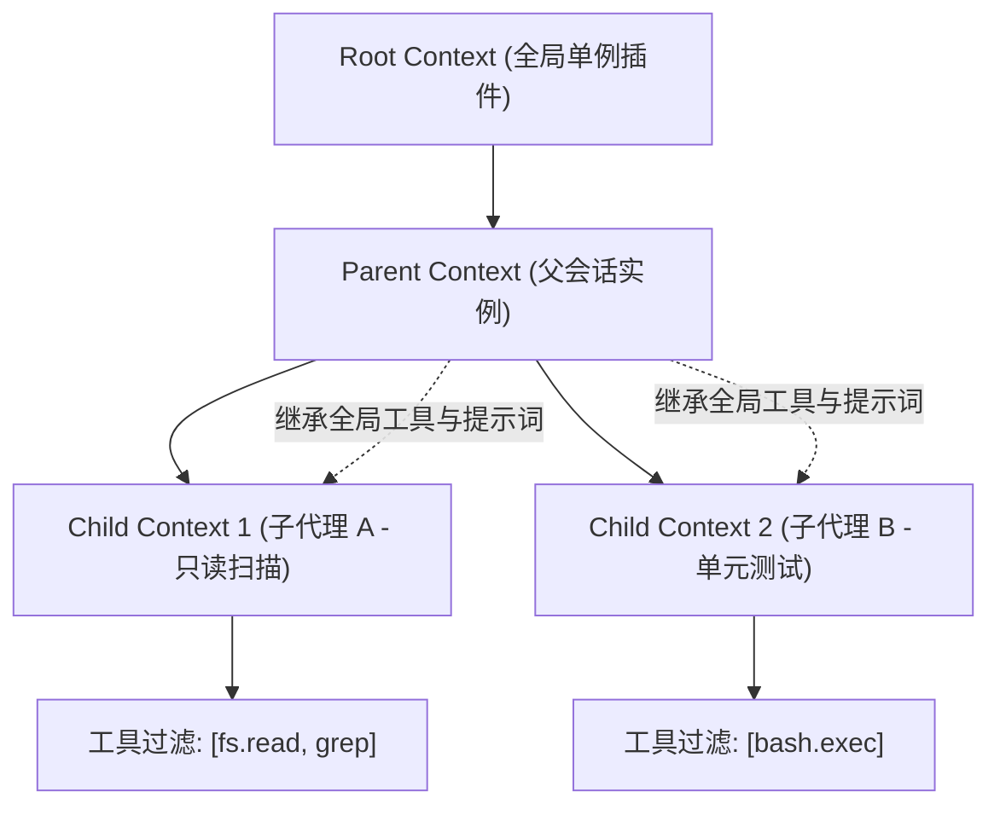
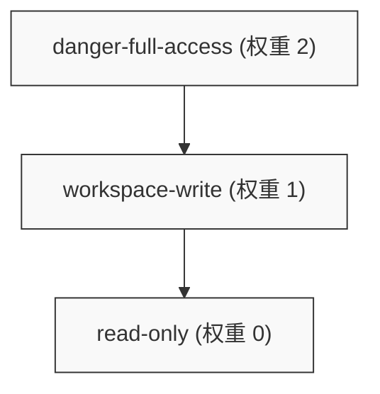
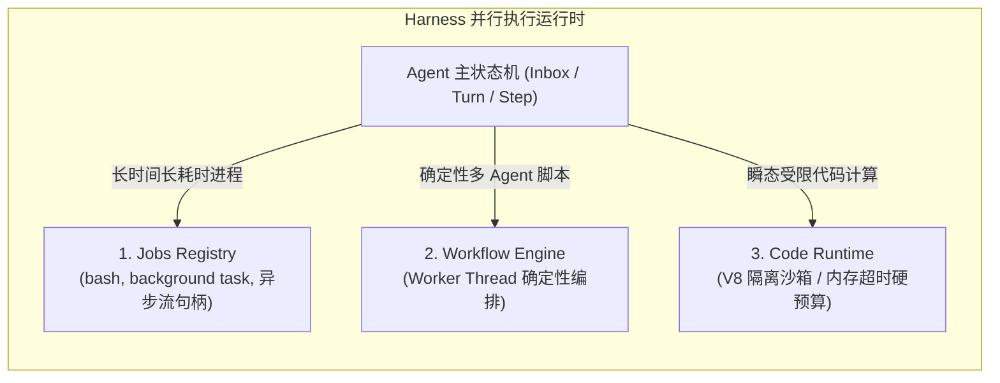
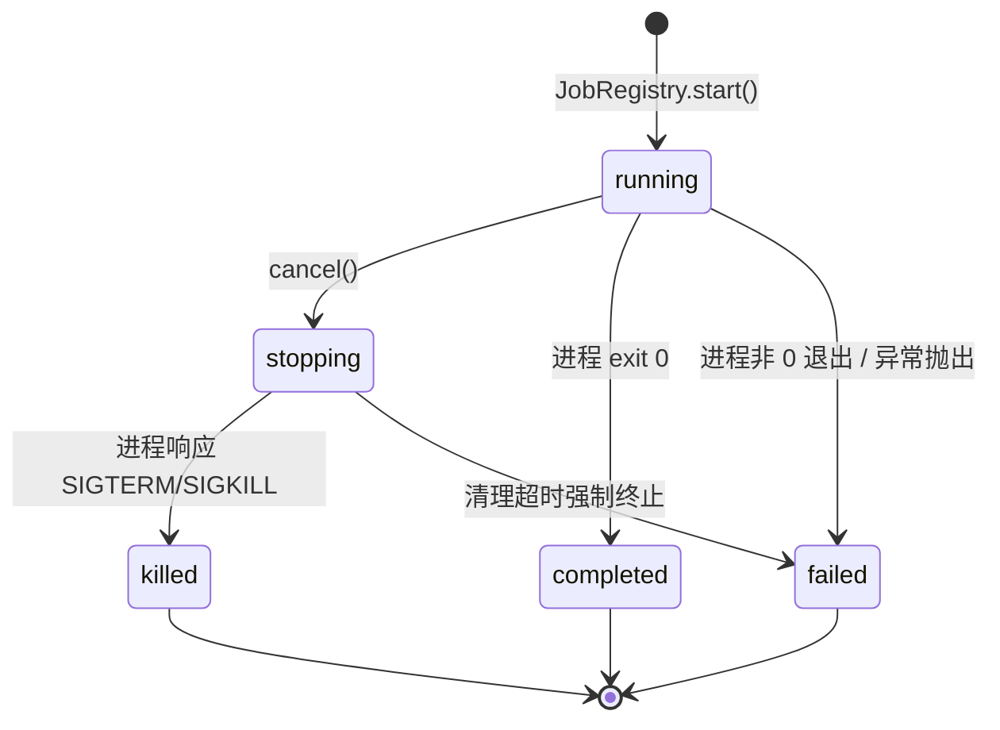
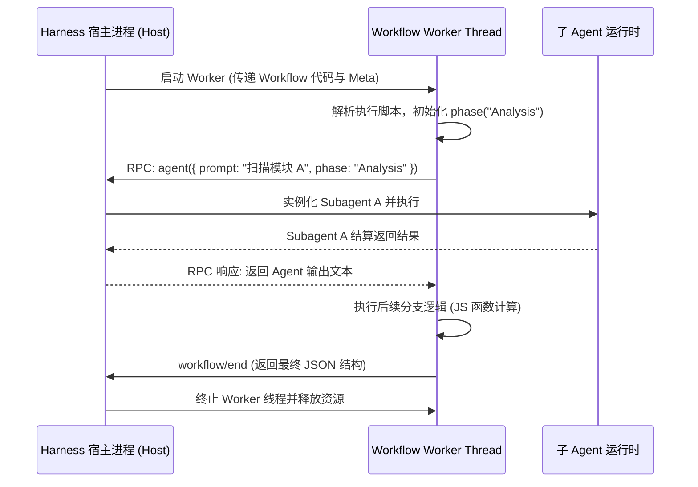
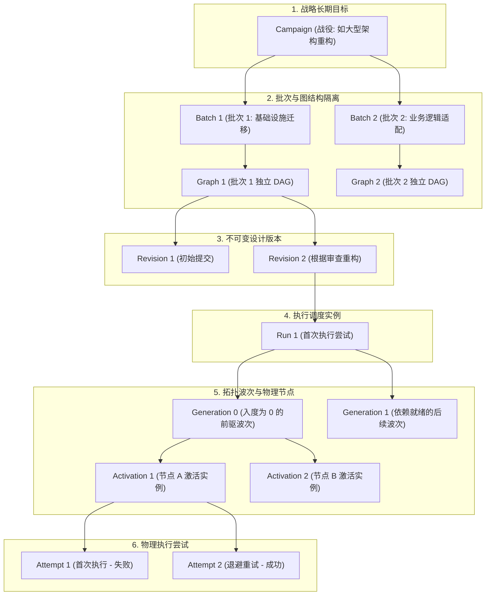

# 第 13 章：从单代理到并行工作

[English](13-single-to-parallel-agents.md) | 中文

在现代软件工程中，任何单线程系统在面对高吞吐、大规模协作和复杂多阶段目标时，都不可避免地需要向多线程、多进程以及分布式架构演进。构建 AI 智能体（Agent）系统亦遵循同样的演进规律。

在前几章中，我们详细剖析了单个 Agent 的核心运行时架构：基于 Cordis 依赖注入容器的插件骨架、以不可变事件日志为事实账本的会话系统、由 Inbox 驱动的单 Turn/Step 自回归状态机循环，以及受限的工具沙箱。然而，当面对跨模块重构、大规模代码库扫描、全链路测试验证以及长期复杂任务（如大型重构战役）时，**单 Agent 的线性串行执行模型将遭遇严格的物理与数学瓶颈**：上下文窗口（Context Window）的 Token 容量上限、注意力衰减（Attention Dilution）、计算耗时随步骤线性叠加，以及缺乏故障隔离机制导致的单点崩溃。

本章将全面解构 DeepSeek Harness 从**单代理（Single Agent）**迈向**并行多代理协作（Parallel Multi-Agent System）**的底层架构实现。我们将用严密的系统编程直觉（进程派生、权限格降级、RPC 通信、工作线程隔离）与数学推导，深入拆解 Subagent 委派派生体系、权限单调递减规则（`sandboxModeCap`）、后台任务三大执行原语（Jobs、Workflow、Code Runtime），以及 Graph 与 Campaign 支撑的八层任务身份层级体系。

---

## 1. 并发协作的系统直觉与数学建模

对于传统软件工程师而言，从单 Agent 切换到并行 Agent 网，等价于从**单线程事件循环（Single Event Loop）**演进到**进程池（Process Pool）与分布式有向无环图计算引擎（DAG Computation Engine）**。

### 1.1 并行化加速比：阿姆达尔定律与古斯塔夫森定律推导

在评估将单 Agent 任务拆分为多 Agent 并行执行的收益时，我们必须建立精确的数学模型。

设单 Agent 完成某项复杂任务的总计算工作量为 $W$。由于依赖分析、主控决策和最终结果汇总必须由主控 Agent 串行执行，设该串行工作量占比为 $s \in [0, 1]$；其余可分解给子代理独立执行的工作量占比为 $p = 1 - s$。

若系统分配了 $N$ 个独立的并行子代理（Subagents）同时执行可并行部分：

根据**阿姆达尔定律（Amdahl's Law）**，固定任务负载下的理论加速比 $S_{\text{latency}}(N)$ 为：

$$S_{\text{latency}}(N) = \frac{T_{\text{serial}}}{T_{\text{parallel}}(N)} = \frac{W}{s W + \frac{(1 - s) W}{N} + T_{\text{coord}}(N)} = \frac{1}{s + \frac{1 - s}{N} + \frac{T_{\text{coord}}(N)}{W}}$$

其中 $T_{\text{coord}}(N)$ 为主控代理与子代理之间的编排、上下文序列化、事件派发与结果合并的**协调通信开销**。

在分布式 Agent 系统中，通信开销通常与子代理数量 $N$ 呈线性或对数线性增长：$T_{\text{coord}}(N) = \alpha N + \beta$。

当 $N \to \infty$ 时，极限加速比受限于串行比例：

$$\lim_{N \to \infty} S_{\text{latency}}(N) \le \frac{1}{s}$$

若任务中有 $10\%$ 的逻辑必须严格串行（例如初始依赖解析与最终代码合入），无论启动多少个并行子代理，系统的端到端延迟降低永远不可能超过 $10$ 倍。



进一步考虑**古斯塔夫森定律（Gustafson's Law）**：当计算资源（子代理并发槽位）增加时，Agent 系统的目标通常不是缩短固定任务的耗时，而是**在相同的时间预算内，扩展扫描与推理的广度与深度**（例如从仅检查改动文件，扩展为对全仓库 50 个微服务进行全量 AST 静态扫描与形式化验证）。

设可伸缩任务的总耗时为 $T$，子代理处理的扩展工作量占比为 $p_{\text{scaled}}$：

$$S_{\text{workload}}(N) = \frac{s \cdot T + p_{\text{scaled}} \cdot N \cdot T}{T} = s + p_{\text{scaled}} \cdot N = 1 + (N - 1) \cdot p_{\text{scaled}}$$

古斯塔夫森定律揭示了多 Agent 并行架构的核心商业价值：**它打破了单上下文窗口的认知瓶颈，实现了代码工程验证吞吐量随算力投入的线性扩展。**

### 1.2 上下文与显存开销模型（KV Cache 分裂）

在系统层级，启动并行子代理直接影响大模型推理后端的**显存占用（VRAM footprint）与 KV Cache 缓存命中率**。

设大语言模型参数量为 $M$（以 DeepSeek-V3 671B MoE 为例，激活参数量约 37B），Transformer 层数为 $L$，隐藏层维度为 $H$，注意力头数为 $A_{\text{head}}$，每个头的键值维度为 $D_{\text{kv}}$。

单个 Token 在单层中生成的 KV Cache 显存消耗（以 FP16/BF16 精度计算，每个元素 2 字节）为：

$$\text{Mem}_{\text{token\_kv}} = 2 \times 2 \times L \times A_{\text{head}} \times D_{\text{kv}} \quad (\text{Bytes})$$

当主控 Agent 串行执行时，会话历史长度 $T_{\text{seq}}$ 持续膨胀，显存消耗为：

$$\text{Mem}_{\text{single\_agent}} = T_{\text{seq}} \times \text{Mem}_{\text{token\_kv}}$$

当采用 Subagent 委派派生架构时：
1. 主控 Agent 维持精简的主控提示词与任务状态，会话长度保持在低位 $T_{\text{parent}} \ll T_{\text{seq}}$。
2. 每个子 Agent 拥有完全独立且生命周期短暂的专属会话（Ephemeral Session），其平均长度为 $T_{\text{child}}$。
3. 若 $K$ 个子 Agent 并行执行，总显存开销为：

$$\text{Mem}_{\text{multi\_agent}} = T_{\text{parent}} \cdot \text{Mem}_{\text{token\_kv}} + \sum_{k=1}^{K} T_{\text{child}}^{(k)} \cdot \text{Mem}_{\text{token\_kv}}$$

更关键的是，子 Agent 共享相同的前缀系统提示词（System Prompt Prefix）时，现代推理引擎（如 vLLM、SGLang、DeepSeek 推理集群）的 **PagedAttention / RadixAttention 前缀树缓存** 可以对这部分 Token 实现 $100\%$ 的物理显存复用，从而大幅度降低并发推理时的显存带宽与首字延迟（TTFT - Time To First Token）。

| 维度 | 单 Agent 长上下文串行 | 多 Subagent 并行委派 |
| :--- | :--- | :--- |
| **执行模型** | 单线程逐步探索 | 树状/图状并发派生 |
| **上下文管理** | 历史无界累积，面临注意力丢失 | 上下文边界物理隔离，任务完成即销毁 |
| **故障爆炸半径** | 某一步骤陷入死循环或幻觉则全盘失败 | 单个子 Agent 失败可被主控捕获并重试 |
| **权限控制** | 全局单一权限，难以对局部操作降权 | 权限细粒度单调递减（`sandboxModeCap`） |
| **前缀缓存复用率** | 随着轮次增加，前缀迅速失效变异 | 多个子 Agent 共享高命中率的静态 System Prompt |
| **调试与排查** | 必须阅读数万行的单一巨大事件流 | 树状分层日志，父子会话具备精确引用谱系 |

---

## 2. Subagent 委派派生体系（Delegation & Spawning）

在 DeepSeek Harness 中，子代理不是凭空产生的无状态 RPC，而是通过严格的**父子继承链（Lineage Chain）**与**作用域上下文（Scoped Context）**动态构建的受控执行实体。



### 2.1 进程内派生（In-Process Spawn/Fork）vs 远程异构连接

Harness 支持两种截然不同的 Subagent 运行时承载方式：

1. **进程内派生（In-Process Spawn / Fork）**：
   - **Spawn（全新物化派生）**：在当前 Node.js 进程中，为子 Agent 实例化一个隔离的 Cordis 子 Context 和全新的 Session 账本。子 Agent 继承父级的 Preset 配置，但日志从第 0 行全新开始记录。
   - **Fork（历史分叉派生）**：子 Agent 不仅继承父级的配置，还将父会话截至当前时刻的前 $M$ 条历史事件作为**种子（Lineage Seed）**直接复制到子会话中。子会话在种子历史的基线之上继续自回归演进，而不会反向污染父会话。
2. **远程与异构连接（Remote / Out-of-Process Connectors）**：
   - **ACP（Agent Client Protocol）**：通过标准 JSON-RPC 2.0 over stdio/WebSocket 连接外部异构代理进程（如 Codex、Claude Code 或运行在独立容器中的 Python Agent）。
   - **SDK Remote Client**：通过 REST/WebSocket 协议将子任务下发至分布式 Worker 集群，跨机器调度执行。

### 2.2 深度预算防爆推导与 `resolveChildDepth`

在多 Agent 递归派生（Subagent A 派生 Subagent B，Subagent B 派生 Subagent C）过程中，若没有硬性数学约束，模型可能陷入**递归无限派生死循环（Fork Bomb）**，导致系统资源耗尽。

Harness 引入了严格的**深度单调递增模型**。每个会话在持久化元数据中均强制记录 `delegationDepth`。

设顶级会话（Top-Level User Session）的深度为：

$$d(\text{Root}) = 0$$

当父代理 $A$ 派生子代理 $C$ 时，子代理的深度计算公式为：

$$d(C) = d(A) + 1$$

系统在派生子代理时，通过 `resolveChildDepth` 函数执行边界检验：

$$\text{Assert}\Big(d(C) \in [0, 2^{53} - 1] \land d(C) \le \text{maxDepth}\Big)$$

源码实现严密防御了 JavaScript 的整型溢出与越界情况：

```typescript
import type { Agent } from '@deepseek-ai/dsh-agent'
import { delegationDepthOf } from './depth.ts'

export class SubagentDepthError extends Error {
  constructor(public readonly attemptedDepth: number, public readonly maxDepth: number) {
    super(`subagent depth ${attemptedDepth} exceeds maxDepth ${maxDepth}`)
    this.name = 'SubagentDepthError'
  }
}

/**
 * 从父 agent 解析子代理的委派深度并执行硬性上限校验。
 * 父代理已持久化的 Header 是单调底线，防止冷恢复后深度被篡改重置。
 */
export function resolveChildDepth(parent: Agent, maxDepth: number | undefined): number {
  const childDepth = delegationDepthOf(parent) + 1
  if (!Number.isSafeInteger(childDepth)) {
    throw new RangeError('subagent child depth exceeds the safe-integer range')
  }
  if (maxDepth !== undefined && childDepth > maxDepth) {
    throw new SubagentDepthError(childDepth, maxDepth)
  }
  return childDepth
}
```

### 2.3 父子会话元数据（Lineage & Session Meta）

当调用 `ctx.agents.create()` 创建子代理时，必须构建具备完备可追溯性的持久化元数据：

```typescript
export function childSessionMeta(
  parent: Agent,
  childDepth: number,
  lineageSeedLength: number,
  workspaceCwd?: string,
): NonNullable<CreateAgentOptions['meta']> {
  const parentHeader = parent.session.header
  // 必须从父级 LIVE 作用域链而非持久化 Header 中读取 Preset，
  // 因为如果父级在空闲状态下切换了 Preset，LIVE 作用域已经更新，但旧 Header 仍记录旧值。
  const agentPreset = parent.ctx.get('agentPresets')?.composedPreset(parent.ctx)
  const cwd = workspaceCwd ?? parentHeader.cwd
  return {
    ...cwd !== undefined ? { cwd } : {},
    ...agentPreset === undefined ? {} : { agentPreset },
    parentSession: parentHeader.id,
    origin: 'subagent',
    delegationDepth: childDepth,
    ...lineageSeedLength > 0 ? { seedLength: lineageSeedLength } : {},
  }
}
```

这一元数据结构保证了**三条核心工程不变量**：
1. **可复现性（Reproducibility）**：即使整个系统崩溃重启，重放子会话日志时能够精准加载子代理创建时所绑定的 Preset 配置与工具集，而不会被系统全局的默认配置覆盖。
2. **种子边界隔离（Seed Lineage Invariant）**：`seedLength` 精确指明前 $K$ 个事件属于父级历史投影，此后的事件完全属于该子代理独立生产的副作用。
3. **工作区继承或收敛（CWD Scoping）**：子代理可以继承父级的工作目录，也可以被显式限制在一个隔离的子目录（如临时构建工作区）。

### 2.4 作用域隔离与运行时上下文声明

在单进程内运行的子代理必须与父代理共享宿主资源，但绝不能让子代理的提示词和工具配置反向污染父级。

Cordis 容器通过原型链继承机制实现隔离：`childCtx = parent.ctx.extend()`。子代理对 `childCtx.tools.restrict()` 或 `childCtx.systemPrompt.section()` 的修改仅在当前分支生效。



Harness 在子代理创建时，还会向其注入专门的**运行时上下文声明（`subagent:delegation`）**，其在系统提示词中的排序权重固定为 `order: 120`（紧随沙箱策略与审批策略声明之后）：

```typescript
export const SUBAGENT_DELEGATION_CONTEXT
  = 'You are a delegated subagent: your permission scope was fixed when you were started and cannot be '
    + 'widened from inside this session — operations that require approval are rejected automatically. '
    + 'When the task needs access beyond that scope, do not retry the denied operation; state the '
    + 'limitation in your reply so the delegating agent can handle it.'
```

该 Prompt 明确告知模型：**你是一个被委派的子代理，权限已被锁定，任何需要交互式审批的操作都会被系统直接拒绝；一旦遇到权限不足，切勿反复重试，应立即将限制原因汇报给父代理。**

---

## 3. 权限单调递减规则（Monotonic Privilege Attenuation）

在分布式与多智能体系统中，最致命的安全漏洞之一是**权限越权提升（Privilege Escalation）**：如果一个只具有只读权限的父 Agent 可以派生出一个具有写权限甚至全系统危险访问权限的子 Agent，整个系统的安全边界将荡然无存。

Harness 确立了形式化的**权限单调递减（Monotonic Privilege Attenuation）**公理。

### 3.1 权限格理论（Privilege Lattice）数学推导

我们将沙箱权限定义为一个全序格（Total Order Lattice） $(\mathcal{S}, \le)$：

$$\mathcal{S} = \{ \text{read-only}, \text{workspace-write}, \text{danger-full-access} \}$$

定义其权威权重映射函数 $\text{Auth}: \mathcal{S} \to \{0, 1, 2\}$：

$$\text{Auth}(\text{read-only}) = 0$$

$$\text{Auth}(\text{workspace-write}) = 1$$

$$\text{Auth}(\text{danger-full-access}) = 2$$

其偏序关系为：

$$\text{read-only} \prec \text{workspace-write} \prec \text{danger-full-access}$$

设父 Agent 的当前有效权限模式为 $M_{\text{parent}} \in \mathcal{S}$，委派请求中声明的权限上限为 $\text{Cap} \in \mathcal{S}$。

则子 Agent 被授予的最终有效权限 $M_{\text{child}}$ 必须满足**交运算（Meet / Greatest Lower Bound）**：

$$M_{\text{child}} = M_{\text{parent}} \sqcap \text{Cap} = \text{argmin}_{\le} \Big( \text{Auth}(M_{\text{parent}}), \text{Auth}(\text{Cap}) \Big)$$

即子代理的权限永远是父代理有效权限与申请上限中的**极小值**。



### 3.2 沙箱上限 `sandboxModeCap` 的求解算法

在代码实现中，`captureDelegatedPolicyOverrides` 负责在创建子代理的同步窗口内执行权限格求值：

```typescript
import type { Agent } from '@deepseek-ai/dsh-agent'
import type { SandboxMode } from '@deepseek-ai/dsh-sandbox'

export interface DelegatedPolicyOverrides {
  readonly sandboxMode: SandboxMode | undefined
  readonly approvalPolicy: 'never' | undefined
}

const SANDBOX_MODE_AUTHORITY: Readonly<Record<SandboxMode, number>> = {
  'read-only': 0,
  'workspace-write': 1,
  'danger-full-access': 2,
}

/**
 * 捕获需要注入到子会话中的委派策略。
 * 必须在子代理启动的第一个 await 之前同步调用！
 * 后续父会话如果发生沙箱模式切换，属于父会话的未来，绝对不能反向影响已派生的子代理。
 */
export function captureDelegatedPolicyOverrides(
  parent: Agent,
  sandboxModeCap?: SandboxMode,
): DelegatedPolicyOverrides {
  const sandboxPolicy = parent.ctx.get('sandboxPolicy')
  if (sandboxModeCap !== undefined && sandboxPolicy === undefined) {
    throw new Error('subagent sandboxModeCap requires the sandbox-policy service')
  }

  // 若未指定 Cap，则直接捕获父级的显式覆盖；若指定了 Cap，则解析父级的生效模式并取下确界
  const parentMode = sandboxModeCap === undefined
    ? sandboxPolicy?.overrideOf(parent.session)
    : sandboxPolicy?.resolve({ session: parent.session }).mode

  const sandboxMode = sandboxModeCap === undefined || parentMode === undefined
    ? parentMode
    : SANDBOX_MODE_AUTHORITY[parentMode] <= SANDBOX_MODE_AUTHORITY[sandboxModeCap]
      ? parentMode
      : sandboxModeCap

  return {
    sandboxMode,
    // 关键安全防御：子代理的交互式审批策略永远强制固定为 'never'
    approvalPolicy: parent.ctx.get('approval') === undefined ? undefined : 'never',
  }
}
```

### 3.3 为什么子代理的审批策略必须强制锁定为 `never`？

在交互式 CLI 或 Web UI 中，当顶层 Agent 尝试执行高风险操作（例如修改主配置文件）时，系统会挂起当前 Step 并向用户展示审批弹窗（Approval Prompt）。

但在多 Agent 并行体系中，子代理运行在**无人值守的后台任务环境**。如果子代理发起审批请求：
1. **死锁风险（Deadlock）**：前端 UI 并没有与后台每个短暂生命周期的子代理建立交互式输入通道。子代理将永久挂起等待一个永远不会到来的用户点击。
2. **隐式越权风险**：如果子代理能通过向父代理请求审批来临时提权（Escalation），将打破父子调度的单向确定性。

因此，Harness 的硬性安全准则是：**所有子代理的 `approvalPolicy` 必须在启动时固定为 `'never'`**。子代理如果调用超出自身沙箱范围的工具，沙箱中间件会**确定性地直接抛出拒绝异常**，促使大模型立即转向备用方案或向上级返回错误信息。

### 3.4 事件溯源中的策略落盘（`source: 'delegation'`）

在 Harness 的事件溯源账本中，子会话创建后，立即在尚未对外发布的事务窗口内追加两条合成事件：

```typescript
export function appendDelegatedPolicyOverrides(
  childSession: Session,
  overrides: DelegatedPolicyOverrides,
): void {
  if (overrides.sandboxMode !== undefined) {
    childSession.append('sandbox/mode', {
      mode: overrides.sandboxMode,
      source: 'delegation',
    })
  }
  if (overrides.approvalPolicy !== undefined) {
    childSession.append('approval/policy', {
      policy: overrides.approvalPolicy,
      source: 'delegation',
    })
  }
}
```

通过将策略作为 `source: 'delegation'` 事件写入子代理自己的日志流，实现了**状态的自包含（Self-Containment）**：即使系统冷重启，从磁盘回放子会话事件流时，系统无需去关联查询父会话历史，即可 $100\%$ 精确重构出子会话当时的沙箱模式与审批规则。

---

## 4. 后台任务三大执行原语：Jobs vs Workflow vs Code Runtime

并行执行不仅仅包含子 Agent 的派生，还涵盖了代码执行沙箱、长时间运行的外部子进程以及确定性的编排工作流。Harness 抽象了**三大底层任务执行原语**，它们在设计哲学、生命周期、隔离级别和通信模式上各司其职：



### 4.1 三大原语全方位技术对比矩阵

| 维度 | 原语 1：Jobs | 原语 2：Workflow | 原语 3：Code Runtime |
| :--- | :--- | :--- | :--- |
| **典型代表场景** | 后台 `cargo build`、长时间运行的 Web 服务、异步文件监控 | 批处理重构脚本、多文件审查流水线、确定性多阶段探索 | 运行一段 TypeScript 代码过滤数据、执行数学计算、执行 AST 转换 |
| **执行载体** | 宿主 OS 子进程（Child Process）或异步任务句柄 | 独立的 Node.js `Worker` 线程（Worker Thread） | 独立的 V8 `vm.Context` 沙箱或隔离工作线程 |
| **控制流主导权** | 外部操作系统进程自发运行，Harness 仅持有控制句柄 | 用户/模型编写的 TypeScript 脚本驱动执行 | 瞬态纯函数或异步脚本，单次调用即销毁 |
| **内部 Agent 数量** | 0 个（纯 OS 任务）或包装 1 个独立子代理 | 1 到 $N$ 个（通过脚本内的 `await agent()` 动态创建） | 0 个（仅通过注入的 `bindings` 调用暴露的 Host RPC） |
| **状态机与生命周期** | `running` $\to$ `stopping` $\to$ `completed`/`killed`/`failed` | `WorkflowRun`: `completed` / `cancelled` / `error` | 瞬态执行：`CodeRunResult` (含 `logs`, `value`, `error`) |
| **输出与缓冲机制** | 支持增量光标读取（`readOutput()`）与溢出 Spill 截断 | 事件流汇报（`workflow/agent-start`, `workflow/end`） | 单次结构化返回（Lossless JSON `value` 与 `logs` 数组） |
| **资源限制机制** | OS 级进程句柄、输出字节上限 `outputLimitBytes` | 线程并发槽限制、超时控制、取消信号传递 | 严格限制 V8 堆内存（如 128MB）、执行硬超时（Timeout） |

---

### 4.2 原语 1：Jobs（通用长任务句柄系统）

Jobs 原语解决了 Agent 系统中**长耗时阻塞操作**（如启动编译、运行测试套件、启动本地服务）与单线程 Agent 交互循环之间的矛盾。

#### 数据结构与生命周期状态机

```typescript
export type JobStatus = 'running' | 'stopping' | 'completed' | 'killed' | 'failed'

export interface JobOutcome {
  status: 'completed' | 'killed' | 'failed'
  detail?: string
  output?: string
}

export interface JobHooks {
  cancel(reason?: string): void
  done: Promise<JobOutcome>
  readOutput?(): string
}

export interface JobStart {
  kind: 'bash' | 'subagent' | string
  label: string
  outputLimitBytes?: number
  owner?: Agent
  run(): JobHooks
}
```



#### 会话所有权栅栏（Session Fencing）与级联析构

每个 Job 在启动时可以通过 `owner?: Agent` 绑定宿主 Agent。
1. **访问栅栏**：只有拥有该 Job 的 Session（或未绑定 Owner 的公共 Job）才有权执行 `readOutput` 或 `kill`。
2. **生命周期联动**：当 Agent 会话被注销或 Dispose 时，Cordis 的析构钩子会自动触发所有关联 Job 的 `cancel()`，防止产生**僵尸进程（Zombie Processes）**耗尽系统资源。

---

### 4.3 原语 2：Workflow（Worker Thread 中的确定性流程）

Workflow 原语用于解决需要**用精确的程序控制流（循环、条件分支、并行并发池）来编排多个 Agent 调用**的场景。

#### 为什么必须在 Worker Thread 中运行 Workflow？

如果直接在主事件循环中 `eval` 运行用户或模型生成的 Workflow 脚本，一旦脚本包含死循环（如 `while(true) {}`），整个 Harness 宿主进程将被彻底卡死，导致所有其他 Agent、Web 界面和 RPC 服务全部瘫痪。

因此，Harness 将 Workflow 放置在独立的 **Node.js Worker Thread** 中执行，并通过结构化消息通道与宿主通信。



#### 阶段划分（Phases）与结构化结算

Workflow 允许在脚本中声明执行阶段（`WorkflowPhase`），例如：
- `phase: "Discovery"`（探索阶段：并发启动 5 个只读 Agent 寻找潜在 bug）
- `phase: "Execution"`（修复阶段：针对发现的问题逐一启动写权限 Agent 进行修复）
- `phase: "Verification"`（验证阶段：启动测试 Agent 验证修复结果）

```typescript
export interface WorkflowResult {
  value: unknown
  stopReason: 'completed' | 'cancelled' | 'error'
  error?: string
  agentsStarted: number
}
```

---

### 4.4 原语 3：Code Runtime（受限内存与超时的代码执行沙箱）

Code Runtime 是一个**无状态、瞬态、高安全级别的纯计算沙箱**，专门用于模型自主编写和执行简短的 JavaScript/TypeScript 代码片段。

#### 语言中立绑定机制（Binding Namespaces）

Code Runtime 拒绝向代码暴露任意的全局对象（如 Node.js 的 `process`、`fs` 或 `globalThis`），而是采用严格白名单注入机制。宿主通过 `CodeBindingNamespace` 向沙箱注入安全的异步纯函数（例如暴露给沙箱调用的 `tools.*`）：

```typescript
export interface CodeBindingNamespace {
  global: string
  functions: Record<string, (args: unknown) => Promise<CodeJsonValue>>
  errorClass?: CodeBindingErrorClass
}

export interface CodeRunRequest {
  program: string
  bindings: CodeBindingNamespace[]
  signal?: AbortSignal
}
```

#### 六大失败分类学（Failure Taxonomy）

为使上层 Agent 或模型能够根据执行失败原因进行精准的**自我纠错（Self-Correction）**，Code Runtime 定义了六种相互正交的失败类型：

```typescript
export interface CodeRunFailure {
  kind:
    | 'exception'      // 代码语法错误或运行时抛出未捕获异常
    | 'timeout'        // 超出配置的硬性时间预算 (如 5000ms)
    | 'abort'          // 外部 AbortSignal 触发主动取消
    | 'worker-exit'    // 底层沙箱进程因 OOM (超出堆上限) 或非法指令崩溃
    | 'invalid-output' // 返回值无法被无损序列化为 JSON
    | 'output-limit'   // 产生的 log 或输出文本超过字节阈值
  message: string
}
```

---

## 5. Graph 与 Campaign 的八层身份层级体系

当单 Agent 和多 Agent 协作从简单的“父子委派”上升到“企业级复杂项目重构”时，任务拓扑将演化为**大规模有向无环图（DAG）**以及跨越数天数周的**长期战役（Campaign）**。

为了在分布式调度、不可变版本控制、故障隔离与历史重放之间达到完美的系统平衡，DeepSeek Harness 确立了业界最为严密的**八层身份层级架构（Identity Hierarchy）**：

$$\text{Campaign} > \text{Batch} > \text{Graph} > \text{Revision} > \text{Run} > \text{Generation} > \text{Activation} > \text{Attempt}$$



### 5.1 八层层级的精确定义与职责解耦

#### 1. Campaign（战役）
- **职责**：代表用户的终极宏观目标（例如“将 50 万行 C++ 代码库全面迁移至 Rust”）。
- **不可变前缀与可审计追加**：Campaign 包含一系列有序的 Batch。初始已登记的 Batch 构成不可变前缀。当所有已登记 Batch 验收完毕后，系统允许通过带有完整审计依据的 `planRevision` 递增追加新发现的 Batch 后缀，而绝不允许篡改历史已完成的 Batch。

#### 2. Batch（批次）
- **职责**：宏观战役中的阶段性里程碑（例如“阶段 1：核心数据结构迁移与测试”）。
- **历史节点膨胀隔离**：**每一个 Batch 拥有完全独立的 Graph 实例**。已完成 Batch 的几百个历史节点不会被复制到下一个 Batch 中，后序 Batch 仅通过轻量级的**已确认结算凭据（Settlement Evidence）**消费前序成果，彻底避免了 DAG 规模随时间无限膨胀。

#### 3. Graph（任务图）
- **职责**：当前 Batch 内部所有任务节点、数据依赖和资源约束的有向无环图（DAG）命名空间。

#### 4. Revision（修订版本）
- **职责**：任务图拓扑的**不可变设计快照**。
- **设计与执行解耦**：当主控 Agent 修改任务图（例如增删节点、调整依赖关系）时，系统绝不会在原图上做原地突变（In-place Mutation），而是派生出一个新的 `Revision`（分类为 `new_task`、`analysis_refactor` 或 `execution_correction`），形成版本谱系单向链。

#### 5. Run（执行尝试）
- **职责**：针对某个具体 `Revision` 发起的一次完整调度执行实例。
- **静态拓扑与动态执行分离**：同一个 `Revision` 可以因为外部环境变化或人工介入而被多次 `Run`。

#### 6. Generation（拓扑代/波次）
- **职责**：根据 DAG 依赖拓扑划分的并发调度波次。
- **并行屏障（Barrier）**：拓扑入度为 0 的就绪节点被划入同一 Generation。同一 Generation 内的所有节点可以完全无锁并行执行；当该 Generation 全部结算完毕后，系统推进至下一 Generation。

#### 7. Activation（节点激活实例）
- **职责**：DAG 中某个特定节点在当前 Run 中的逻辑激活上下文。
- **隔离工作区绑定**：Activation 负责分配独立的沙箱工作目录、解析上游传入的输入参数，并准备执行环境。

#### 8. Attempt（物理重试尝试）
- **职责**：单个 Activation 内部的物理执行实体（含重试与故障转移）。
- **瞬态重试隔离**：若某个节点因网络抖动或模型瞬时限流而失败，系统在当前 Activation 内递增 `Attempt` 计数进行指数退避重试（Exponential Backoff），而无需重置上层的 Generation 或 Run。

---

## 6. 多 Agent 并发调度的数学模型与显存精算

### 6.1 DAG 关键路径与最小完工时间

设一个包含 $V$ 个节点、$E$ 条依赖边的任务图 $G = (V, E)$。每个节点 $v \in V$ 的预期执行耗时为 $t(v)$。

从起始节点到终止节点的任意一条拓扑路径 $p = (v_1, v_2, \dots, v_k)$ 的路径耗时定义为：

$$T(p) = \sum_{i=1}^{k} t(v_i)$$

整个 Graph 在**无限算力（无并发槽限制）**假设下的理论最小完工时间等于**关键路径（Critical Path）**长度：

$$T_{\text{CP}} = \max_{p \in \text{Paths}(G)} T(p)$$

在实际工程部署中，系统受到最大并发 Worker 数量 $C_{\text{max}}$ 以及模型全局 Token 速率（TPM - Tokens Per Minute）的**资源受限项目调度（RCPSP）**约束。

设时刻 $\tau$ 正在执行的节点集合为 $A(\tau) \subseteq V$。调度器必须满足：

$$|A(\tau)| \le C_{\text{max}}$$

$$\sum_{v \in A(\tau)} \text{TPM}(v) \le \text{TPM}_{\text{budget}}$$

```mermaid
gantt
    title DAG 关键路径与波次调度甘特图
    dateFormat X
    axisFormat %s秒

    section Generation 0 (无前驱)
    节点 A (AST 解析)      :active, a1, 0, 10
    节点 B (依赖树扫描)    :active, a2, 0, 15
    节点 C (配置校验)      :active, a3, 0, 5

    section Generation 1 (依赖就绪)
    节点 D (生成类型定义)  :crit, d1, 15, 35
    节点 E (编写单元测试)  :e1, 15, 25

    section Generation 2 (关键路径汇聚)
    节点 F (整体编译与验证):crit, f1, 35, 50
```



在上图中，关键路径为 $\text{节点 B (15s)} \to \text{节点 D (20s)} \to \text{节点 F (15s)}$，理论总耗时 $T_{\text{CP}} = 50\text{s}$。即使节点 C 在 5 秒内完成，整体流程依然受制于节点 B 和 D 的完成速度。

---

## 7. 完整工业级 TypeScript 代码实现

下面给出完整的多 Agent 委派编排器与权限单调递减执行引擎的生产级实现。该实现严格遵循 TypeScript 6 判别联合与面向接口设计，内置完备的边界异常处理与 `AbortSignal` 级联取消传播机制：

```typescript
/**
 * @file multi-agent-orchestrator.ts
 * @description 工业级多 Agent 委派派生与权限单调递减执行引擎
 */

import { EventEmitter } from 'node:events'

// ============================================================================
// 1. 类型定义与权限格
// ============================================================================

export type SandboxMode = 'read-only' | 'workspace-write' | 'danger-full-access'

export const SANDBOX_AUTHORITY: Readonly<Record<SandboxMode, number>> = {
  'read-only': 0,
  'workspace-write': 1,
  'danger-full-access': 2,
}

export type ApprovalPolicy = 'always' | 'on-change' | 'never'

export interface SessionHeader {
  readonly id: string
  readonly cwd: string
  readonly delegationDepth: number
}

export interface SessionLogEvent {
  readonly id: string
  readonly type: string
  readonly payload: unknown
  readonly timestamp: number
}

export class MockSession {
  private readonly events: SessionLogEvent[] = []

  constructor(
    public readonly header: SessionHeader,
    initialEvents: SessionLogEvent[] = [],
  ) {
    this.events.push(...initialEvents)
  }

  append(type: string, payload: unknown): SessionLogEvent {
    const event: SessionLogEvent = {
      id: `evt-${this.events.length + 1}`,
      type,
      payload,
      timestamp: Date.now(),
    }
    this.events.push(event)
    return event
  }

  getEvents(): readonly SessionLogEvent[] {
    return this.events
  }
}

export interface AgentContext {
  readonly sandboxMode: SandboxMode
  readonly approvalPolicy: ApprovalPolicy
  readonly toolRestrictions?: ReadonlySet<string>
  readonly persona?: string
}

export interface AgentOptions {
  readonly provider?: string
  readonly model?: string
  readonly maxTokens?: number
}

export interface AgentInstance {
  readonly id: string
  readonly session: MockSession
  readonly context: AgentContext
  readonly options: AgentOptions
  readonly signal: AbortSignal
}

export interface SubagentSpawnRequest {
  readonly label: string
  readonly prompt: string
  readonly parent: AgentInstance
  readonly workspaceCwd?: string
  readonly maxDepth?: number
  readonly allowedTools?: string[]
  readonly persona?: string
  readonly sandboxModeCap?: SandboxMode
  readonly signal?: AbortSignal
}

export interface SubagentRunResult {
  readonly childSessionId: string
  readonly status: 'completed' | 'failed' | 'aborted'
  readonly output: string
  readonly error?: string
}

// ============================================================================
// 2. 权限计算与深度校验器
// ============================================================================

export class SubagentSecurityEnforcer {
  /**
   * 严格执行权限单调递减规则：Child = Parent ⊓ Cap
   */
  static resolveEffectivePolicy(
    parent: AgentInstance,
    cap?: SandboxMode,
  ): { sandboxMode: SandboxMode; approvalPolicy: ApprovalPolicy } {
    const parentMode = parent.context.sandboxMode
    let effectiveSandbox: SandboxMode = parentMode

    if (cap !== undefined) {
      effectiveSandbox =
        SANDBOX_AUTHORITY[parentMode] <= SANDBOX_AUTHORITY[cap]
          ? parentMode
          : cap
    }

    return {
      sandboxMode: effectiveSandbox,
      // 子代理审批策略永远固定为 'never'
      approvalPolicy: 'never',
    }
  }

  /**
   * 校验递归深度预算，防止 Fork 炸弹
   */
  static assertDepthBudget(parentDepth: number, maxDepth?: number): number {
    const childDepth = parentDepth + 1
    if (!Number.isSafeInteger(childDepth)) {
      throw new RangeError('Delegation depth exceeded safe integer range')
    }
    if (maxDepth !== undefined && childDepth > maxDepth) {
      throw new Error(`Subagent delegation depth ${childDepth} exceeds configured maxDepth ${maxDepth}`)
    }
    return childDepth
  }
}

// ============================================================================
// 3. 生产级多 Agent 委派协调器
// ============================================================================

export class SubagentOrchestrator extends EventEmitter {
  private activeChildren = new Map<string, AgentInstance>()

  /**
   * 同步物化并异步启动子代理
   */
  async spawnAndExecute(request: SubagentSpawnRequest): Promise<SubagentRunResult> {
    const { parent, sandboxModeCap, maxDepth, signal } = request

    // 1. 深度预算前置校验
    const childDepth = SubagentSecurityEnforcer.assertDepthBudget(
      parent.session.header.delegationDepth,
      maxDepth,
    )

    // 2. 权限单调递减计算 (同步执行，不可被未来父状态污染)
    const policy = SubagentSecurityEnforcer.resolveEffectivePolicy(parent, sandboxModeCap)

    // 3. 创建级联取消信号 (父信号 + 请求专用信号)
    const abortController = new AbortController()
    const onParentAbort = () => abortController.abort(new Error('Parent agent aborted'))
    parent.signal.addEventListener('abort', onParentAbort, { once: true })

    if (signal) {
      signal.addEventListener('abort', () => abortController.abort(new Error('Subagent request aborted')), {
        once: true,
      })
    }

    const childSessionId = `sub-sess-${Date.now()}-${Math.random().toString(36).slice(2, 7)}`
    const childCwd = request.workspaceCwd ?? parent.session.header.cwd

    // 4. 构建子会话账本与元数据
    const childSession = new MockSession({
      id: childSessionId,
      cwd: childCwd,
      delegationDepth: childDepth,
    })

    // 5. 在未发布窗口内追加委派策略事件 (保证事件溯源完整性)
    childSession.append('sandbox/mode', {
      mode: policy.sandboxMode,
      source: 'delegation',
    })
    childSession.append('approval/policy', {
      policy: policy.approvalPolicy,
      source: 'delegation',
    })

    // 6. 实例化子代理作用域
    const childAgent: AgentInstance = {
      id: `agent-${childSessionId}`,
      session: childSession,
      context: {
        sandboxMode: policy.sandboxMode,
        approvalPolicy: policy.approvalPolicy,
        toolRestrictions: request.allowedTools ? new Set(request.allowedTools) : parent.context.toolRestrictions,
        persona: request.persona ?? parent.context.persona,
      },
      options: { ...parent.options },
      signal: abortController.signal,
    }

    this.activeChildren.set(childSessionId, childAgent)
    this.emit('spawn', { childId: childSessionId, parentId: parent.id, depth: childDepth })

    try {
      // 7. 驱动子代理自回归循环
      const output = await this.runChildAgentLoop(childAgent, request.prompt)
      return {
        childSessionId,
        status: 'completed',
        output,
      }
    } catch (err: unknown) {
      if (childAgent.signal.aborted) {
        return {
          childSessionId,
          status: 'aborted',
          output: '',
          error: 'Subagent execution was aborted by signal',
        }
      }
      return {
        childSessionId,
        status: 'failed',
        output: '',
        error: err instanceof Error ? err.message : String(err),
      }
    } finally {
      // 清理监听器与活动句柄
      parent.signal.removeEventListener('abort', onParentAbort)
      this.activeChildren.delete(childSessionId)
      this.emit('settle', { childId: childSessionId })
    }
  }

  /**
   * 模拟子代理的受限自回归状态机
   */
  private async runChildAgentLoop(agent: AgentInstance, prompt: string): Promise<string> {
    // 注入运行时委派约束声明
    agent.session.append('turn/start', { prompt, role: 'user' })

    if (agent.signal.aborted) {
      throw new Error('Aborted before starting loop')
    }

    // 模拟执行：检查工具调用权限
    if (agent.context.toolRestrictions && !agent.context.toolRestrictions.has('fs.read')) {
      // 若受限则安全拦截
    }

    // 模拟大模型推理与工具交互
    await new Promise((resolve, reject) => {
      const timer = setTimeout(resolve, 50)
      agent.signal.addEventListener('abort', () => {
        clearTimeout(timer)
        reject(new Error('Subagent loop aborted during execution'))
      })
    })

    const finalReply = `Analysis completed by subagent at depth ${agent.session.header.delegationDepth} within ${agent.context.sandboxMode} sandbox.`
    agent.session.append('turn/end', { reply: finalReply, role: 'assistant' })

    return finalReply
  }
}
```

---

## 8. 真实生产故障复盘与排查指南

在多 Agent 并行系统中，系统复杂度呈指数级上升。以下列举四个在实际高并发生产环境中最为典型的致命故障、根因深度剖析及工业级解决方案。

### 故障 1：子 Agent 递归死循环导致的深度爆炸（Depth Explosion）

- **故障现象**：某主控 Agent 在处理一个代码审查任务时，连续派生了数十个子 Agent；每个子 Agent 又认为任务过于复杂，再次派生下一级子 Agent，最终在 30 秒内耗尽系统文件描述符和内存，进程崩溃。
- **根因剖析**：
  1. 系统未在派生入口处强校验单调递增深度。
  2. 提示词中未显式声明当前 Agent 已经是子代理（缺少 `SUBAGENT_DELEGATION_CONTEXT`），导致大模型依然扮演顶级调度者角色。
- **排查与修复方案**：
  1. 在入口处强制执行 `resolveChildDepth`，一旦 `depth > maxDepth`（生产环境建议默认 `maxDepth = 2`）立即抛出 `SubagentDepthError`。
  2. 强制在子 Agent 的上下文首部注入 `order: 120` 的不可覆盖声明：“你已被委派，禁止二次分发，必须亲自执行并汇报结果”。

### 故障 2：后台子 Agent 触发用户审批导致的永久死锁挂起（Approval Hanging）

- **故障现象**：Web UI 界面显示主任务进度卡在 $40\%$，无任何报错，后台 CPU 占用率为 0。日志显示某个子 Agent 尝试写入文件时进入挂起等待。
- **根因剖析**：子 Agent 继承了父 Agent 的默认审批策略（`approvalPolicy: 'always'`）。当子 Agent 尝试执行写操作时，由于其没有挂载前端用户交互 WebSocket 通道，审批请求被丢入虚空，导致 Promise 永远处于 `pending` 状态。
- **排查与修复方案**：
  1. 严格推行**权限格单调递减准则**，`captureDelegatedPolicyOverrides` 必须无条件将子代理的 `approvalPolicy` 固定为 `'never'`。
  2. 当沙箱检测到权限不足时，直接返回抛出 `EACCES` 错误，让模型在单次 Step 内部感知失败并调整策略，而不是挂起等待。

### 故障 3：Worker 线程 OOM 导致宿主进程不稳定与孤儿任务（Orphaned Task Leak）

- **故障现象**：Workflow 引擎在运行大规模并行代码分析脚本时，Node.js 宿主进程偶发崩溃或产生大量未释放的子进程。
- **根因剖析**：
  1. Workflow 脚本在 Worker Thread 中分配了过大的 AST 语法树对象，触发 V8 引擎硬性 OOM 杀进程。
  2. 宿主进程未能监听 Worker 的 `error` 和 `exit` 事件，导致已经派生出的外部 Job 未能执行 `cancel()` 清理。
- **排查与修复方案**：
  1. 创建 Worker 时显式传递 `resourceLimits: { maxOldGenerationSizeMb: 512 }`。
  2. 在 Worker 退出钩子中，强制遍历其派生的所有 Job ID 并执行级联终止。

### 故障 4：Campaign 阶段节点历史无限累积导致的上下文爆炸（Graph State Explosion）

- **故障现象**：在一个包含 10 个阶段的长任务中，当执行到第 8 阶段时，每次主控决策请求的输入 Token 高达 128k，API 响应极其缓慢且频繁报错 `Context Window Exceeded`。
- **根因剖析**：设计者将整个战役放在了同一个单一 Graph 中，导致前 7 个阶段已完成的数百个节点的历史输出被全量序列化并塞入主控 Prompt。
- **排查与修复方案**：
  1. 坚决引入 **`Campaign > Batch > Graph` 隔离层级**。
  2. 每个阶段作为独立的 Batch，拥有完全隔离的 Graph 实例。后序 Batch 仅消费前序 Batch 的结算摘要（Settlement Summary），将上下文开销从 $O(N)$ 降至 $O(1)$。

---

## 9. 思考题与工程实践

为了巩固对多 Agent 并行架构与沙箱安全机制的理解，请完成以下思考题与实战练习：

1. **数学计算题**：某多 Agent 系统的主控串行协调比例 $s = 0.15$。若每个子 Agent 完成任务平均需要消耗 4000 Input Tokens 和 1000 Output Tokens，通信开销为每个子 Agent 增加 200 Tokens 的主控摘要。当子 Agent 并发数量 $N$ 从 2 增加到 10 时，计算理论加速比 $S(N)$ 以及总 Token 消耗量的增长曲线。
2. **安全设计题**：若父会话处于 `workspace-write` 模式，某工具调用请求派生一个具有 `danger-full-access` 权限的子代理进行系统调试，请证明为什么该请求必须在运行时被强行拦截，并写出拦截逻辑的伪代码。
3. **架构分析题**：为什么 Harness 在设计 Campaign 时，要求已登记的 Batch 构成**不可变前缀（Immutable Prefix）**，且仅允许在尾部以可审计的形式追加？这对事件回放（Replay）和分布式一致性有何深远意义？
4. **动手编码题**：基于本章提供的 `SubagentOrchestrator`，实现一个支持最大并发数限制（Concurrency Limiter = 3）的有界任务池，当超过 3 个子 Agent 同时请求运行时，多余的任务进入等待队列，并在已有子 Agent 结算后自动唤醒执行。
