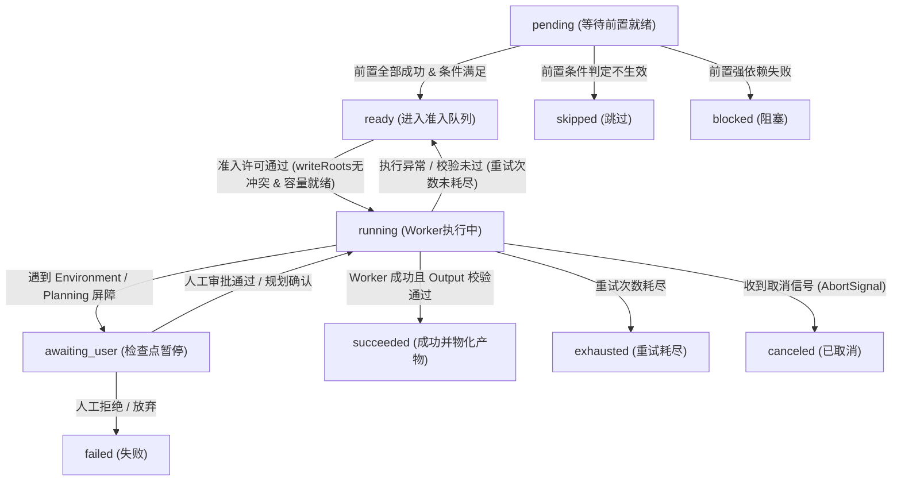

# Chapter 14: Graph Mode Scheduling

English | [中文](14-graph-mode-scheduling.zh.md)

Earlier chapters examined a single agent's state-machine loop, its message Inbox, and isolation of tool-call side effects. For complex modern software-engineering tasks—full-stack refactoring, cross-module architectural changes, automated end-to-end tests, and environment-dependency migrations—a single agent's linear context window quickly reaches limits of attention dilution and context contamination.

To improve the reliability of long-running tasks, DeepSeek Harness introduces **Graph Mode**. It models the software-engineering lifecycle as a directed acyclic graph (DAG), replacing serial reasoning with a distributed multi-agent system that has typed constraints, immutable versioning, concurrent-write isolation, and deterministic admission checks.

This chapter examines the Graph Mode scheduler and its runtime mechanisms. Starting with a three-layer state model, it derives DAG topological ordering and critical-path models, explains Campaign/Batch decomposition for long tasks, examines `writeRoots` write isolation and admission control, and covers approval barriers for privileged `environment` nodes and the controlled DOM acceptance workflow of `browser-tester`.

---

## 1. Software-Engineering Mapping: A Systems-Programming Model of Graph Mode

Engineers familiar with backend systems, compilers, or distributed systems can map Graph Mode concepts to established computer-systems concepts to build an accurate mental model:

| Graph Mode concept | Computer-systems / distributed-architecture analogue | Responsibility and defining properties |
|---|---|---|
| **Semantic Draft** | **AST draft / unresolved IR** | The controller LLM's semantic intent, submitted through a tool call. It includes task objectives and logical dependencies but no physical execution ID. |
| **Immutable Revision** | **Git commit (immutable snapshot)** | A static DAG validated by Harness with typed checks and topological-closure calculation, then assigned a version; read-only after creation. |
| **Graph Run** | **Physical process / Job instance** | One execution lifecycle of an immutable Revision, including physical Attempts and execution logs for its nodes. |
| **Graph Controller** | **Kubernetes control plane / compiler frontend** | A privileged top-level decision state machine that interprets human input, submits or revises graphs, and consolidates delivery evidence. |
| **Worker Subagent** | **Worker Thread / Kubernetes Pod** | A subagent with a restricted sandbox and dedicated system prompt that executes one atomic node and returns structured output. |
| **Campaign & Batch** | **Argo Workflows / multistage pipeline** | Partition long-running engineering goals into ordered, independent graph batches; an immutable prefix and atomic extension (`planExtension`) prevent state explosion. |
| **writeRoots** | **Linux filesystem namespace / fine-grained exclusive lock** | Sets of source-relative directories that nodes declare writable; admission checks for overlap to prevent concurrent file writes. |
| **Admission Control** | **Kubernetes ResourceQuota and scheduler filters** | An admission gate combining dependency readiness, file conflicts, Worker limits, reserved controller capacity, and model-VRAM weights. |
| **Environment Node** | **`sudo` privilege elevation / hardware-initialization driver** | A privileged node for host networking, package installation, or Docker changes; it must pause at a Checkpoint for safe host-side execution. |
| **Browser Tester** | **Puppeteer / Playwright acceptance suite** | A privileged test role for controlled DOM snapshots, multimodal visual assertions, and detection of network and console errors. |

---

## 2. Three Layers of a Task Graph: Semantic Draft $\to$ Immutable Revision $\to$ Run

Many simple agent frameworks represent a task graph as a mutable in-memory object that is repeatedly changed in place. Under network instability, interrupted inference, crash recovery, or human intervention, this makes graph state unpredictable.

DeepSeek Harness follows **functional immutability** and **event sourcing**, separating the task graph lifecycle into three orthogonal layers:

```
+-----------------------------------------------------------------------------------------+
|                                    1. 语义草稿层 (Semantic Draft)                         |
|   Controller LLM 通过 graph_submit(intent, nodes, edges, campaign) 工具生成逻辑计划        |
+--------------------------------------------+--------------------------------------------+
                                             |
                                             v  [Harness 校验、正规化、闭包计算与哈希分配]
+-----------------------------------------------------------------------------------------+
|                                   2. 不可变快照层 (Immutable Revision)                    |
|   GraphRevision { graphId, revision: N, parentRevision: N-1, nodes, edges, termination }  |
|   通过持久化事件 `graph/change` 写入会话账本 (不可篡改、全局幂等、支持跨版本 Diff)            |
+--------------------------------------------+--------------------------------------------+
                                             |
                                             v  [GraphScheduler 获取租约与 Fencing Token]
+-----------------------------------------------------------------------------------------+
|                                    3. 物理运行层 (Graph Run)                              |
|   GraphRun { id: RunId, revision: N, generation: G, nodes: { [NodeId]: GraphNodeRun } } |
|   驱动原子 Attempt 执行、产物物化、Checkpoint 暂停拦截，并通过 `graph/run` 更新最新状态   |
+-----------------------------------------------------------------------------------------+
```

### 2.1 Semantic Draft Protocol

The controller LLM should not handle distributed-systems bookkeeping such as generating global UUIDs, maintaining parent revision numbers or monotonically increasing Generations, computing transitive successor invalidation, or resolving absolute filesystem paths. Its sole responsibility is **domain-level planning**.

When user input arrives, the system prompt requires the Controller to classify it first as `new`, `revise`, `inspect`, `control`, `clarify`, or `direct`. For `new` and `revise`, it submits a semantic draft through the built-in `graph_submit` tool:

```json
{
  "intent": "new",
  "objective": "重构认证模块并引入 JWT 双 Token 刷新机制",
  "nodes": [
    {
      "id": "arch-design",
      "title": "设计 JWT 接口与存储结构",
      "objective": "输出 OpenAPI 规范及 Refresh Token 白名单 Redis 数据结构",
      "kind": "design",
      "roleId": "architect",
      "acceptanceCriteria": [
        "包含 /api/auth/refresh 接口的请求与响应 Schema",
        "定义 Redis 存储键名规则与 TTL 策略"
      ],
      "effectPolicy": "idempotent"
    },
    {
      "id": "core-jwt-impl",
      "title": "实现 Token 生成与验证中间件",
      "objective": "编写基于 jsonwebtoken 的签名、验签与续期逻辑",
      "kind": "implementation",
      "roleId": "engineer",
      "acceptanceCriteria": [
        "通过 src/auth/jwt.service.ts 导出 signToken 与 verifyToken",
        "单元测试覆盖率达到 100%"
      ],
      "workspace": {
        "mode": "isolated-copy",
        "writeRoots": ["src/auth"]
      },
      "effectPolicy": "idempotent"
    },
    {
      "id": "user-route-impl",
      "title": "改造用户路由挂载认证守卫",
      "objective": "在受保护接口上增加 AuthGuard 拦截",
      "kind": "implementation",
      "roleId": "engineer",
      "acceptanceCriteria": [
        "src/routes/user.ts 正确引入并使用 AuthGuard"
      ],
      "workspace": {
        "mode": "isolated-copy",
        "writeRoots": ["src/routes"]
      },
      "effectPolicy": "idempotent"
    },
    {
      "id": "integration-test",
      "title": "端到端集成验证",
      "objective": "启动测试套件验证登录、请求与自动刷新全链路",
      "kind": "verification",
      "roleId": "verifier",
      "acceptanceCriteria": [
        "pnpm test:e2e 全部 Pass"
      ],
      "effectPolicy": "idempotent"
    }
  ],
  "edges": [
    { "from": "arch-design", "to": "core-jwt-impl", "kind": "data" },
    { "from": "arch-design", "to": "user-route-impl", "kind": "data" },
    { "from": "core-jwt-impl", "to": "integration-test", "kind": "control" },
    { "from": "user-route-impl", "to": "integration-test", "kind": "control" }
  ]
}
```

### 2.2 Deriving Immutable Revision Snapshots and Propagating Downstream Invalidation

After receiving a `graph_submit` draft, Harness runs the following pipeline:

1. **Structural validity (strict DAG invariant)**:
   - Check that every `roleId` names an enabled, valid worker role and is not the controller role.
   - Validate node and edge sets. Kahn's topological-sort algorithm ensures the graph is **strictly acyclic**, with no self-loops or duplicate edges, and that every edge endpoint belongs to the node set.
   - Require nonempty `acceptanceCriteria` and an explicit `effectPolicy` for every node.
2. **Continuous Revision numbering and immutable encapsulation**:
   - For the first graph, assign `revision = 1` and `parentRevision = undefined`.
   - For a revision (`intent = revise`), assign `revision = previous.revision + 1` and `parentRevision = previous.revision`.
3. **Transitive downstream invalidation closure**:
   - If a revision changes node $u$'s definition—for example, its objective, incoming edges, or acceptance criteria—or node $u$ failed in the preceding run, all nodes reachable from $u$ (its transitive successor closure $\text{Succ}^*(u)$) have invalid historical artifacts and must re-enter the execution queue in topological order.
   - Only nodes with no dependency path from a changed node and status `succeeded` in the previous revision may reuse their output with a `reusedFrom` marker.

```
       [A: 已成功] (保留复用)
       /          \
      v            v
  [B: 被修改]    [C: 已成功] (保留复用)
      |            |
      v            v
  [D: 传递失效]  [E: 已成功] (保留复用)
      \            /
       v          v
       [F: 传递失效]
```

### 2.3 Physical Execution Layer (Graph Run) and State Projection

An immutable Revision may run multiple times, for example after resuming an interruption, a manual retry, or rerunning with adjusted parameters. A distinct `GraphRunId` identifies each run.

Harness keeps a session log of seven immutable event types and reconstructs global state in real time through a read-only projection fold:

```typescript
export interface GraphProjection {
  readonly config: GraphModeConfig
  readonly currentGraphId?: GraphId
  readonly currentCampaignId?: GraphCampaignId
  readonly graphs: Readonly<Record<GraphId, readonly GraphRevision[]>>
  readonly runs: Readonly<Record<GraphRunId, GraphRun>>
  readonly operations: Readonly<Record<GraphControlOperationId, readonly GraphOperationTransition[]>>
  readonly settlements: Readonly<Record<GraphSettlementId, readonly GraphSettlementRecord[]>>
  readonly submissions: Readonly<Record<GraphSubmissionId, GraphRevisionSubmissionRecord>>
  readonly checkpoints: Readonly<Record<GraphCheckpointId, GraphCheckpoint>>
  readonly controls: Readonly<Record<GraphControlOperationId, GraphControlRecord>>
  readonly campaigns: Readonly<Record<GraphCampaignId, GraphCampaign>>
}
```

Each node in a Run follows this lifecycle state machine:



---

## 3. Mathematical Derivation of DAG Topology, Critical Paths, and Admission Control

For deterministic, high-throughput multi-agent scheduling, Graph Mode uses explicit graph-theory and queueing models.

### 3.1 Calculating Transitive Closure and an Invalidation Matrix by Hand

Let task-graph Revision $G = (V, E)$ be a DAG with nodes $V = \{v_1, v_2, \dots, v_n\}$ and edges $E \subseteq V \times V$.

Use adjacency matrix $A \in \{0, 1\}^{n \times n}$ to represent direct dependencies:

$$A_{ij} = \begin{cases} 1, & \text{if } (v_i, v_j) \in E \text{ (that is, } v_j \text{ depends on } v_i \text{)} \\ 0, & \text{otherwise} \end{cases}$$

Define reachability matrix $R \in \{0, 1\}^{n \times n}$ for the transitive closure:

$$R = \sum_{k=1}^{n-1} A^k \quad (\text{in Boolean algebra, addition is OR } \lor \text{ and multiplication is AND } \land)$$

For a local revision, let $C \subseteq V$ be the directly changed nodes, represented by characteristic vector $x_C \in \{0, 1\}^n$ where $x_{C, i} = 1$ if $v_i \in C$. The characteristic vector $y \in \{0, 1\}^n$ of all invalid nodes $V_{\text{invalid}}$—which must rerun—is:

$$y = x_C \lor (x_C \cdot R)$$

#### Worked Example

Suppose $V = \{v_1, v_2, v_3, v_4, v_5\}$ and $E = \{(v_1, v_2), (v_1, v_3), (v_2, v_4), (v_3, v_4), (v_4, v_5)\}$.

- **Step 1 (construct adjacency matrix $A$)**: $$A = \begin{pmatrix} 0 & 1 & 1 & 0 & 0 \\ 0 & 0 & 0 & 1 & 0 \\ 0 & 0 & 0 & 1 & 0 \\ 0 & 0 & 0 & 0 & 1 \\ 0 & 0 & 0 & 0 & 0 \end{pmatrix}$$

- **Step 2 (calculate $A^2, A^3$)**: $$A^2 = A \cdot A = \begin{pmatrix} 0 & 0 & 0 & 1 & 0 \\ 0 & 0 & 0 & 0 & 1 \\ 0 & 0 & 0 & 0 & 1 \\ 0 & 0 & 0 & 0 & 0 \\ 0 & 0 & 0 & 0 & 0 \end{pmatrix}, \quad A^3 = A^2 \cdot A = \begin{pmatrix} 0 & 0 & 0 & 0 & 1 \\ 0 & 0 & 0 & 0 & 0 \\ 0 & 0 & 0 & 0 & 0 \\ 0 & 0 & 0 & 0 & 0 \\ 0 & 0 & 0 & 0 & 0 \end{pmatrix}$$

- **Step 3 (Boolean sum to obtain $R = A \lor A^2 \lor A^3$)**: $$R = \begin{pmatrix} 0 & 1 & 1 & 1 & 1 \\ 0 & 0 & 0 & 1 & 1 \\ 0 & 0 & 0 & 1 & 1 \\ 0 & 0 & 0 & 0 & 1 \\ 0 & 0 & 0 & 0 & 0 \end{pmatrix}$$

- **Step 4 (derive invalidation)**: If the Controller fixes node $v_3$'s code, then $C = \{v_3\}$ and $x_C = (0, 0, 1, 0, 0)$, giving: $$x_C \cdot R = (0, 0, 1, 0, 0) \cdot \begin{pmatrix} 0 & 1 & 1 & 1 & 1 \\ 0 & 0 & 0 & 1 & 1 \\ 0 & 0 & 0 & 1 & 1 \\ 0 & 0 & 0 & 0 & 1 \\ 0 & 0 & 0 & 0 & 0 \end{pmatrix} = (0, 0, 0, 1, 1)$$

The full invalidation vector is therefore $$y = x_C \lor (x_C \cdot R) = (0, 0, 1, 0, 0) \lor (0, 0, 0, 1, 1) = (0, 0, 1, 1, 1)$$

The invalid nodes are $\{v_3, v_4, v_5\}$. Nodes $\{v_1, v_2\}$ remain valid, and their results and artifacts can safely be reused (`reusedFrom`).

---

### 3.2 Critical Path Method (CPM) and Theoretical Speedup

The physical duration of each node $v_i$ has two parts: LLM reasoning and generation time $t_{\text{llm}}(v_i)$, and tool and sandbox I/O time $t_{\text{tool}}(v_i)$. Its total weight is $w(v_i) = t_{\text{llm}}(v_i) + t_{\text{tool}}(v_i)$.

#### Critical-Path Length

Define critical-path time $T_{\infty}$ as the maximum sum of weights along a path from a source node (indegree 0) to a sink (outdegree 0). It is the minimum completion time with unlimited concurrent Workers:

$$T_{\infty} = \max_{p \in \text{Paths}(G)} \sum_{v \in p} w(v)$$

The serial workload for all tasks is:

$$T_1 = \sum_{v \in V} w(v)$$

If the physical Worker count is limited to $P = \text{globalMaxParallel} - \text{controllerReserve}$ and there are no resource conflicts, Brent's theorem bounds total completion time $T_P$ by:

$$\frac{T_1}{P} \le T_P \le \frac{T_1 - T_{\infty}}{P} + T_{\infty}$$

#### Theoretical Speedup and Parallel Efficiency

$$S(P) = \frac{T_1}{T_P} \ge \frac{T_1}{\frac{T_1 - T_{\infty}}{P} + T_{\infty}} = \frac{P}{1 + (P - 1) \cdot \frac{T_{\infty}}{T_1}}$$

$$\eta(P) = \frac{S(P)}{P} = \frac{1}{1 + (P - 1) \cdot \frac{T_{\infty}}{T_1}}$$

> **Engineering implication**: If a task graph has a long chain of serial dependencies ($\frac{T_{\infty}}{T_1} \to 1$), adding Workers cannot improve throughput and can sharply reduce $\eta(P)$ through model-API rate-limit queues and lock contention. Break up coarse nodes and decouple module read/write dependencies to widen the graph and reduce $\frac{T_{\infty}}{T_1}$.

---

### 3.3 Admission-Control and Queueing Model

Suppose the system serves $M$ model routes. Let the global Worker admission limit be $C_{\text{global}}$, with a maximum concurrency $C_m$ and weighted capacity $W_m$ for each route $m$.

Admission of any ready node $v$ must satisfy all five constraints:

$$\begin{cases} N_{\text{active}} < C_{\text{global}} - \text{controllerReserve} & \text{(global Worker quota)} \\ N_{\text{role}}(r_v) < \text{maxParallel}(r_v) & \text{(role concurrency limit)} \\ N_{\text{model}}(m_v) < C_m & \text{(model-route concurrency limit)} \\ \sum_{u \in \text{Active}(m_v)} \text{weight}(u) + \text{weight}(v) \le W_m & \text{(weighted model VRAM budget)} \\ \forall u \in \text{ActiveMutating}, \quad \text{writeRoots}(v) \cap \text{writeRoots}(u) = \emptyset & \text{(disjoint source-write spaces)} \end{cases}$$

If any constraint fails, node $v$ must remain in the admission queue until an earlier Worker releases the corresponding token. It must not preempt the resource.

---

## 4. Four-Dimensional Node Admission and Concurrent-Write Isolation (`writeRoots`)

One of the worst failures in collaborative multi-agent programming is two Engineer agents editing source files in the same directory concurrently, causing unordered overwrite races or Git conflicts.

Graph Mode requires admission checks for **disjoint source-write roots (`writeRoots`)**.

```
                    Ready 节点进入准入检查
                               |
                               v
               +-------------------------------+
               | 1. 检查前置依赖是否全部进入终态? | ----[否]----> 等待 (Pending)
               +---------------+---------------+
                               | [是]
                               v
               +-------------------------------+
               | 2. 判定条件分支 (Condition)?   | ----[不满足]----> 标记为 Skipped
               +---------------+---------------+
                               | [满足]
                               v
               +-------------------------------+
               | 3. writeRoots 冲突检测:       |
               | 是否与当前所有 Running 节点的   | ----[有交集]----> 排队等待写锁释放
               | writeRoots 发生路径重叠?      |
               +---------------+---------------+
                               | [无冲突]
                               v
               +-------------------------------+
               | 4. 检查全局配额与角色/模型配额: |
               | active < globalMax - reserve? | ----[超额]----> 排队等待容量释放
               +---------------+---------------+
                               | [配额充足]
                               v
               +-------------------------------+
               | 5. 扣减配额、标记 Running 并派发 |
               +-------------------------------+
```

### 4.1 Deriving the Path-Disjointness Algorithm

Let $A = \{a_1, a_2, \dots, a_p\}$ and $B = \{b_1, b_2, \dots, b_q\}$ be sets of normalized source-relative paths. Define prefix-containment operator $\sqsubseteq$:

$$x \sqsubseteq y \iff (x = y) \lor (y \text{ is a subpath prefixed by } x + \text{"/"})$$

Nodes $u$ and $v$ have a write conflict if and only if:

$$\text{Conflict}(u, v) \iff \exists a \in \text{writeRoots}(u), \exists b \in \text{writeRoots}(v), \quad (a \sqsubseteq b \lor b \sqsubseteq a)$$

- If $u$ declares `writeRoots: ["src/auth"]` and $v$ declares `writeRoots: ["src/user"]`, the paths do not overlap and the nodes can run concurrently.
- If $u$ declares `writeRoots: ["src"]` and $v$ declares `writeRoots: ["src/auth"]`, then `src` $\sqsubseteq$ `src/auth`. Admission detects a conflict, so $v$ must wait until $u$ finishes and settles.
- The root declaration `writeRoots: ["."]` exclusively claims the whole workspace and blocks every other mutating node.

---

## 5. Campaign and Batch: Long-Task Decomposition and an Immutable Plan Prefix

Putting all 50 or more nodes of a task spanning dozens of modules and many hours or days into one DAG leads to:
1. **Topological complexity explosion**: A late requirement change triggers large transitive-closure invalidation and reruns substantial completed work.
2. **Context growth**: Huge volumes of historical node information fill the Controller's system prompt beyond the KV Cache reuse budget.
3. **Oversized failure domain**: A single node's definitive failure may leave the whole graph nonterminal.

DeepSeek Harness addresses this with **Campaigns and Batches**.

```
+---------------------------------------------------------------------------------------------------+
|                                      Campaign: 统一业务战役                                         |
|                                                                                                   |
|  [Batch 1: 基础设施搭建]       [Batch 2: 核心业务开发]       [Batch 3: 性能优化与压测] (待展开)           |
|  +--------------------+       +--------------------+       +--------------------+                 |
|  | GraphRevision (v1) | ====> | GraphRevision (v1) | ====> |  (尚未生成 Batch   |                 |
|  | RunId: run-001     |       | RunId: run-002     |       |   Graph 保持占位)   |                 |
|  +--------------------+       +--------------------+       +--------------------+                 |
|            |                           |                                                          |
|            v                           v                                                          |
|     Settlement 摘要             Settlement 摘要                                                    |
|  (紧凑安全的结构化产物)       (紧凑安全的结构化产物)                                               |
+---------------------------------------------------------------------------------------------------+
```

### 5.1 Immutable Plan Prefix and Atomic Extension (`planExtension`)

Campaigns use an **immutable plan prefix**:
1. **Batch registration**: When a Campaign is created, its first draft defines the initial batch list (`batches: [B1, B2, ...]`).
2. **Independent subgraph lifecycles**: Every Batch has an independent `GraphId` and `GraphRevision`. Nodes in different Batches are not shared and have no direct edges between them.
3. **Cross-Batch context isolation and Settlement transfer**: After an earlier Batch completes, Harness materializes its output as a standard `GraphSettlementRecord`, including artifact-inventory hashes, a shared `coordinationSummary`, and key exported data. The Controller for later Batches consumes only that compact Settlement summary, excluding the large underlying subagent transcripts and temporary files.
4. **Discovery of new Batches (audited plan extension)**: If completed Batches reveal new downstream work, the Controller must not modify, remove, or reorder existing Batches. Instead, it atomically appends the new Batch list to the Campaign with `campaign.planExtension`.

---

## 6. Approval Barrier and Safe Host Shell Execution for `environment` Nodes

Software development often requires environment-level operations such as `npm install`, `pip install`, Docker configuration, or binding a host port. Ordinary Worker subagents run in restrictive filesystem sandboxes and neither have authority nor should directly invoke privileged commands that can alter the host.

Graph Mode defines a dedicated `environment` task kind and uses both a **Checkpoint pause barrier** and **safe Host Shell execution** for defense in depth.

```
    Controller 提交 environment 节点
                   |
                   v
    +-----------------------------------------------+
    | 1. 静态安全检查:                               |
    |    - requiredCapabilities 必须在白名单内      |
    |    - 禁止硬编码 Secret 密钥与敏感凭据          |
    |    - sandboxMode: workspace-write / full     |
    +----------------------+------------------------+
                           |
                           v
    +-----------------------------------------------+
    | 2. 调度器到达该节点，触发 Checkpoint 暂停:       |
    |    - 追加 `graph/checkpoint` (kind: environment)|
    |    - 节点状态置为 awaiting_user                |
    |    - 挂起整个 DAG 依赖分支                      |
    +----------------------+------------------------+
                           |
                           v  [向 Web UI / CLI 推送结构化审批卡片]
    +-----------------------------------------------+
    | 3. 人类用户评审确切命令列表 (Exact Commands)     |
    +----------------------+------------------------+
                           |
             +-------------+-------------+
             |                           |
             v [approve-checkpoint]      v [reject-checkpoint]
    +------------------------+  +------------------------+
    | 4. 宿主机特权代执行:     |  | 5. 节点标记为 Failed:  |
    | 由 Host Process 直接    |  | 阻止下游依赖执行,       |
    | 运行命令并捕获 ExitCode  |  | 触发主控重新规划        |
    +------------------------+  +------------------------+
             |
             v
    +-----------------------------------------------+
    | 6. 物化执行日志与哈希，推进节点为 Succeeded     |
    +-----------------------------------------------+
```

### 6.1 Constraints on Safe Host-Side Execution
- **No speculative changes**: An `environment` node must not contain vague exploratory commands. Every command needs an explicit exit-code assertion.
- **Credential isolation**: Commands must not embed plaintext tokens or passwords; they must reference environment variables injected by the host.
- **Recorded rollback command**: A node may declare `rollbackCommand`, but this field is for documentation only. A rollback requires human confirmation and a new, independent `environment` node.

---

## 7. Controlled DOM Acceptance by `browser-tester` and Three UI Views

For frontend and full-stack projects, unit tests alone cannot detect layout shifts, failed route interception, or micro-frontend communication faults. Graph Mode defines a dedicated `browser-tester` role.

### 7.1 Controlled Acceptance Workflow for `browser-tester`
1. **Origin isolation and lifecycle binding**: `browser-tester` starts a dedicated, controlled headless-browser context, restricted to the local origin under test, such as `http://127.0.0.1:3000`.
2. **DOM snapshots and selector-first interaction**: It extracts the accessibility tree and semantic DOM snapshots with `data-testid`, locates controls precisely, and interacts without fragile coordinate guesses.
3. **Visual multimodal assertions**: For roles on a vision-capable model route, it captures timestamped screenshots at key page states to check layout rendering and style regressions.
4. **Console and network audit**: After each critical test step, it checks for uncaught JavaScript console exceptions (`Uncaught Error`) and unexpected 4xx/5xx network requests.

---

### 7.2 Three Client UI Views (Design / Execution / Revisions)

In `@deepseek-ai/dsh-client-ui-graph`, Cytoscape and a reactive state stream give developers three views of graph activity:

```
+---------------------------------------------------------------------------------------------------+
|  [Design View: 设计视图]    |    [Execution View: 实现视图]    |    [Revisions View: 修订视图]     |
|                             |                                  |                                  |
|  * 展示当前 Revision 的拓扑结构 |  * 左侧: 实时 DAG 画布与节点高亮   |  * 纵向泳道展示历史任务与版本演进    |
|  * 检查各节点 Input/Output   |  * 右侧: 节点执行日志与流式 Transcript |  * 标识 derived_from / refactors |
|  * 校验 Edge 依赖与条件表达式 |  * 悬浮卡片: Token/显存实时指标   |  * 提供可视化 Revision Diff 差异对比 |
+---------------------------------------------------------------------------------------------------+
```

1. **Design view**: Shows the Controller's immutable plan as a static topology. Its read-only canvas supports smooth zoom, hierarchical Sugiyama dependency layout, and controlled typography and contrast.
2. **Execution view**: Binds to the active `GraphRun`. Running nodes pulse, while failed nodes highlight error codes and exception stacks. Selecting any node opens an Evidence drawer on the right with the sub-session's standard output, tool-call chain, artifact Manifest, and LoopX Claim lease state.
3. **Revisions view**: Displays graph history as a version-lineage tree. Colored curved edges distinguish plan refactoring (`analysis_refactor`), execution correction (`execution_correction`), and cross-batch dependencies (`depends_on`).

---

## 8. Production-Grade TypeScript Implementation: Graph Mode Scheduler and Admission Engine

The following production-grade TypeScript implementation covers the Graph Mode scheduler and admission controller, including strict types, topological sorting, invalidation-closure calculation, `writeRoots` conflict detection, and cooperative cancellation through `AbortSignal`.

```typescript
/**
 * 生产级 Graph Mode 核心调度器与准入控制引擎
 * @module @deepseek-ai/dsh-graph-mode/engine
 */

import { EventEmitter } from 'node:events'
import { isAbsolute, normalize, relative } from 'node:path'
import type {
  GraphId,
  GraphNodeId,
  GraphRunId,
  GraphRoleId,
  GraphAttemptId,
  GraphRevision,
  GraphNode,
  GraphEdge,
  GraphRun,
  GraphNodeRun,
  GraphNodePhase,
  GraphSchedulerLimits,
  GraphNodeOutput,
  GraphCondition,
} from './types.ts'

// ============================================================================
// 1. 错误体系定义
// ============================================================================

export class GraphSchedulerError extends Error {
  constructor(
    public readonly code: string,
    message: string,
    public readonly context?: Readonly<Record<string, unknown>>
  ) {
    super(`[${code}] ${message}`)
    this.name = 'GraphSchedulerError'
  }
}

// ============================================================================
// 2. 核心调度状态与接口
// ============================================================================

export interface WorkerDispatchContext {
  readonly runId: GraphRunId
  readonly revision: number
  readonly node: GraphNode
  readonly attemptNumber: number
  readonly signal: AbortSignal
}

export interface WorkerExecutionResult {
  readonly status: 'succeeded' | 'failed'
  readonly output?: GraphNodeOutput
  readonly error?: { readonly code: string; readonly message: string }
}

export type WorkerDispatcher = (
  ctx: WorkerDispatchContext
) => Promise<WorkerExecutionResult>

export interface SchedulerEvents {
  'node:ready': (nodeId: GraphNodeId) => void
  'node:running': (nodeId: GraphNodeId, attemptId: GraphAttemptId) => void
  'node:succeeded': (nodeId: GraphNodeId, output: GraphNodeOutput) => void
  'node:failed': (nodeId: GraphNodeId, error: { code: string; message: string }) => void
  'node:skipped': (nodeId: GraphNodeId, reason: string) => void
  'run:complete': (runId: GraphRunId, success: boolean) => void
}

// ============================================================================
// 3. 路径正规化与 writeRoots 冲突判定算法
// ============================================================================

export class PathConflictDetector {
  /**
   * 正规化相对路径，拒绝绝对路径与逃逸路径（..）
   */
  public static normalizeRoot(root: string): string {
    const trimmed = root.trim()
    if (trimmed === '' || trimmed === '.') return '.'
    if (isAbsolute(trimmed)) {
      throw new GraphSchedulerError(
        'INVALID_WRITE_ROOT',
        `Write root must be relative, got absolute: "${trimmed}"`
      )
    }
    const normalized = normalize(trimmed).replace(/^[\\/]+|[\\/]+$/g, '')
    if (normalized.startsWith('..') || normalized.includes('../') || normalized.includes('..\\')) {
      throw new GraphSchedulerError(
        'PATH_TRAVERSAL_DETECTED',
        `Write root escapes workspace boundary: "${trimmed}"`
      )
    }
    return normalized
  }

  /**
   * 判定两个正规化路径集合是否存在包含或重叠冲突
   */
  public static hasConflict(rootsA: readonly string[], rootsB: readonly string[]): boolean {
    for (const rawA of rootsA) {
      const a = this.normalizeRoot(rawA)
      for (const rawB of rootsB) {
        const b = this.normalizeRoot(rawB)
        // 1. 任一方声明了工作区全域根目录 "."
        if (a === '.' || b === '.') return true
        // 2. 路径完全相等
        if (a === b) return true
        // 3. a 是 b 的父目录
        if (b.startsWith(`${a}/`) || b.startsWith(`${a}\\`)) return true
        // 4. b 是 a 的父目录
        if (a.startsWith(`${b}/`) || a.startsWith(`${b}\\`)) return true
      }
    }
    return false
  }
}

// ============================================================================
// 4. DAG 拓扑排序与传递闭包失效引擎
// ============================================================================

export class DagAnalysisEngine {
  /**
   * 校验无环性并返回确定性拓扑排序序列 (Kahn 算法)
   */
  public static topologicalSort(revision: GraphRevision): readonly GraphNodeId[] {
    const inDegree = new Map<GraphNodeId, number>()
    const nodeMap = new Map<GraphNodeId, GraphNode>()
    const adjacency = new Map<GraphNodeId, GraphNodeId[]>()

    for (const node of revision.nodes) {
      inDegree.set(node.id, 0)
      nodeMap.set(node.id, node)
      adjacency.set(node.id, [])
    }

    for (const edge of revision.edges) {
      if (!nodeMap.has(edge.from) || !nodeMap.has(edge.to)) {
        throw new GraphSchedulerError(
          'INVALID_EDGE_ENDPOINT',
          `Edge from "${edge.from}" to "${edge.to}" contains unknown node`
        )
      }
      adjacency.get(edge.from)!.push(edge.to)
      inDegree.set(edge.to, (inDegree.get(edge.to) ?? 0) + 1)
    }

    // 优先按声明顺序入队的无前置节点
    const queue: GraphNodeId[] = revision.nodes
      .map(n => n.id)
      .filter(id => inDegree.get(id) === 0)

    const sorted: GraphNodeId[] = []

    while (queue.length > 0) {
      const current = queue.shift()!
      sorted.push(current)

      for (const successor of adjacency.get(current)!) {
        const remaining = inDegree.get(successor)! - 1
        inDegree.set(successor, remaining)
        if (remaining === 0) {
          queue.push(successor)
        }
      }
    }

    if (sorted.length !== revision.nodes.length) {
      throw new GraphSchedulerError(
        'GRAPH_CYCLE_DETECTED',
        `The task graph revision contains a cycle. Sorted count: ${sorted.length}, Total nodes: ${revision.nodes.length}`
      )
    }

    return Object.freeze(sorted)
  }

  /**
   * 计算指定变更节点集合的传递后继失效闭包 (Transitive Successor Closure)
   */
  public static calculateInvalidationClosure(
    revision: GraphRevision,
    changedNodeIds: readonly GraphNodeId[]
  ): ReadonlySet<GraphNodeId> {
    const nodeIds = new Set(revision.nodes.map(n => n.id))
    for (const id of changedNodeIds) {
      if (!nodeIds.has(id)) {
        throw new GraphSchedulerError(
          'INVALID_CHANGED_NODE',
          `Changed node "${id}" not found in revision`
        )
      }
    }

    const affected = new Set<GraphNodeId>(changedNodeIds)
    let expanded = true

    while (expanded) {
      expanded = false
      for (const edge of revision.edges) {
        if (affected.has(edge.from) && !affected.has(edge.to)) {
          affected.add(edge.to)
          expanded = true
        }
      }
    }

    return Object.freeze(affected)
  }
}

// ============================================================================
// 5. 条件边求值器
// ============================================================================

export class ConditionEvaluator {
  public static evaluate(
    condition: GraphCondition | undefined,
    predecessorOutputs: ReadonlyMap<GraphNodeId, GraphNodeOutput>,
    fromNodeId: GraphNodeId
  ): boolean {
    if (!condition) return true
    const output = predecessorOutputs.get(fromNodeId)
    if (!output || output.data === undefined) return false

    // 沿着路径提取数据值
    let current: unknown = output.data
    for (const key of condition.path) {
      if (current === null || typeof current !== 'object') {
        current = undefined
        break
      }
      current = (current as Record<string, unknown>)[key]
    }

    switch (condition.operator) {
      case 'exists':
        return current !== undefined
      case 'truthy':
        return Boolean(current)
      case 'equals':
        return current === condition.value
      case 'not-equals':
        return current !== condition.value
      default:
        return false
    }
  }
}

// ============================================================================
// 6. 生产级 Graph 调度器核心实现
// ============================================================================

export class GraphScheduler extends EventEmitter {
  private readonly nodeRuns = new Map<GraphNodeId, GraphNodeRun>()
  private readonly activeWorkers = new Set<GraphNodeId>()
  private readonly outputs = new Map<GraphNodeId, GraphNodeOutput>()
  private abortController: AbortController | null = null
  private isProcessing = false

  constructor(
    public readonly revision: GraphRevision,
    public readonly limits: GraphSchedulerLimits,
    private readonly dispatcher: WorkerDispatcher
  ) {
    super()
    this.initializeNodeRuns()
  }

  private initializeNodeRuns(): void {
    for (const node of this.revision.nodes) {
      this.nodeRuns.set(node.id, {
        nodeId: node.id,
        phase: 'pending',
        attempts: [],
        weight: node.weight ?? 1,
      })
    }
  }

  /**
   * 启动调度器主执行循环
   */
  public async execute(signal?: AbortSignal): Promise<boolean> {
    this.abortController = new AbortController()
    if (signal) {
      signal.addEventListener('abort', () => this.abortController?.abort(), { once: true })
    }

    const linkedSignal = this.abortController.signal

    try {
      // 首次推进就绪节点
      this.evaluateDependenciesAndBranches()

      while (!linkedSignal.aborted) {
        // 1. 尝试对 Ready 状态的节点进行准入并分派
        const dispatchedAny = await this.admitAndDispatchReadyNodes(linkedSignal)

        // 2. 检查是否达到终态（全部完成或阻塞）
        if (this.isExecutionComplete()) {
          const success = this.allNodesSucceededOrSkipped()
          this.emit('run:complete', this.revision.graphId as unknown as GraphRunId, success)
          return success
        }

        // 3. 若当前没有活动 Worker 且无任何节点可被分派，则判定陷入死锁或阻塞
        if (this.activeWorkers.size === 0 && !dispatchedAny) {
          this.markPendingNodesBlocked()
          this.emit('run:complete', this.revision.graphId as unknown as GraphRunId, false)
          return false
        }

        // 4. 等待某个 Worker 退出或状态变更唤醒
        await this.waitForWorkerActivity(linkedSignal)
      }

      return false
    } finally {
      this.cleanup()
    }
  }

  /**
   * 评估前置依赖与分支条件，将符合条件的 Pending 节点转移为 Ready 或 Skipped
   */
  private evaluateDependenciesAndBranches(): void {
    const incomingEdges = new Map<GraphNodeId, GraphEdge[]>()
    for (const edge of this.revision.edges) {
      const list = incomingEdges.get(edge.to) ?? []
      list.push(edge)
      incomingEdges.set(edge.to, list)
    }

    for (const node of this.revision.nodes) {
      const state = this.nodeRuns.get(node.id)!
      if (state.phase !== 'pending') continue

      const inEdges = incomingEdges.get(node.id) ?? []
      if (inEdges.length === 0) {
        state.phase = 'ready'
        this.emit('node:ready', node.id)
        continue
      }

      // 检查是否所有入边的前置节点都已进入终态
      let allPredecessorsTerminal = true
      let hasFailedPredecessor = false
      let allConditionalEdgesFalsy = inEdges.length > 0 && inEdges.every(e => e.kind === 'conditional')

      for (const edge of inEdges) {
        const predState = this.nodeRuns.get(edge.from)!
        const isTerminal = ['succeeded', 'failed', 'skipped', 'blocked', 'exhausted', 'canceled'].includes(predState.phase)

        if (!isTerminal) {
          allPredecessorsTerminal = false
          break
        }

        if (predState.phase === 'failed' || predState.phase === 'exhausted' || predState.phase === 'blocked') {
          hasFailedPredecessor = true
        }

        if (edge.kind === 'conditional') {
          const conditionMet = ConditionEvaluator.evaluate(edge.condition, this.outputs, edge.from)
          if (conditionMet) {
            allConditionalEdgesFalsy = false
          }
        }
      }

      if (!allPredecessorsTerminal) continue

      if (hasFailedPredecessor) {
        state.phase = 'blocked'
        continue
      }

      if (allConditionalEdgesFalsy) {
        state.phase = 'skipped'
        this.emit('node:skipped', node.id, 'All incoming conditional branches evaluated to false')
        continue
      }

      state.phase = 'ready'
      this.emit('node:ready', node.id)
    }
  }

  /**
   * 准入控制器：执行四维并发与写冲突检查
   */
  private async admitAndDispatchReadyNodes(signal: AbortSignal): Promise<boolean> {
    if (this.isProcessing) return false
    this.isProcessing = true

    let dispatchedCount = 0

    try {
      const readyNodes = this.revision.nodes.filter(
        node => this.nodeRuns.get(node.id)?.phase === 'ready'
      )

      // 获取当前正在运行的所有节点的 writeRoots 集合
      const activeWriteRootsMap = new Map<GraphNodeId, readonly string[]>()
      for (const activeNodeId of this.activeWorkers) {
        const activeNode = this.revision.nodes.find(n => n.id === activeNodeId)!
        activeWriteRootsMap.set(activeNodeId, activeNode.workspace?.writeRoots ?? ['.'])
      }

      for (const candidate of readyNodes) {
        // 1. 全局容量约束（保留主控容量）
        const maxWorkers = Math.max(1, this.limits.globalMaxParallel - this.limits.controllerReserve)
        if (this.activeWorkers.size >= maxWorkers) break

        // 2. 角色配额约束
        const role = candidate.roleId
        const activeRoleCount = Array.from(this.activeWorkers)
          .map(id => this.revision.nodes.find(n => n.id === id)!)
          .filter(n => n.roleId === role).length

        // 3. writeRoots 冲突检测 (路径无交集断言)
        const candidateWriteRoots = candidate.workspace?.writeRoots ?? ['.']
        let hasConflict = false

        for (const [activeId, runningRoots] of activeWriteRootsMap.entries()) {
          if (PathConflictDetector.hasConflict(candidateWriteRoots, runningRoots)) {
            hasConflict = true
            break
          }
        }

        if (hasConflict) {
          // 路径冲突，跳过本轮准入，等待并发释放
          continue
        }

        // 准入通过，立即占用令牌并派发 Worker
        this.activeWorkers.add(candidate.id)
        activeWriteRootsMap.set(candidate.id, candidateWriteRoots)
        dispatchedCount++

        const state = this.nodeRuns.get(candidate.id)!
        state.phase = 'running'
        const attemptId = `attempt-${Date.now()}-${Math.random().toString(36).slice(2, 7)}` as unknown as GraphAttemptId
        this.emit('node:running', candidate.id, attemptId)

        // 异步派发，不阻塞主调度循环
        this.dispatchWorker(candidate, state.attempts.length + 1, signal).catch(err => {
          this.handleWorkerException(candidate.id, err)
        })
      }

      return dispatchedCount > 0
    } finally {
      this.isProcessing = false
    }
  }

  /**
   * 执行单个 Worker 逻辑并在退出时处理状态转移
   */
  private async dispatchWorker(
    node: GraphNode,
    attemptNumber: number,
    signal: AbortSignal
  ): Promise<void> {
    const nodeState = this.nodeRuns.get(node.id)!

    try {
      const result = await this.dispatcher({
        runId: this.revision.graphId as unknown as GraphRunId,
        revision: this.revision.revision,
        node,
        attemptNumber,
        signal,
      })

      if (result.status === 'succeeded' && result.output) {
        nodeState.phase = 'succeeded'
        this.outputs.set(node.id, result.output)
        this.emit('node:succeeded', node.id, result.output)
      } else {
        const error = result.error ?? { code: 'WORKER_EXECUTION_FAILED', message: 'Unknown worker failure' }
        if (attemptNumber < (node.maxAttempts ?? 3)) {
          // 重试：重置为 ready
          nodeState.phase = 'ready'
        } else {
          nodeState.phase = 'exhausted'
          this.emit('node:failed', node.id, error)
        }
      }
    } catch (error) {
      this.handleWorkerException(node.id, error)
    } finally {
      this.activeWorkers.delete(node.id)
      // 每次 Worker 完成后，重新触发依赖判定与排队节点准入
      this.evaluateDependenciesAndBranches()
      this.emit('worker:settled', node.id)
    }
  }

  private handleWorkerException(nodeId: GraphNodeId, error: unknown): void {
    const state = this.nodeRuns.get(nodeId)!
    state.phase = 'failed'
    const detail = error instanceof Error ? error.message : String(error)
    this.emit('node:failed', nodeId, { code: 'WORKER_CRASH', message: detail })
  }

  private isExecutionComplete(): boolean {
    for (const state of this.nodeRuns.values()) {
      if (['pending', 'ready', 'running'].includes(state.phase)) {
        return false
      }
    }
    return true
  }

  private allNodesSucceededOrSkipped(): boolean {
    for (const state of this.nodeRuns.values()) {
      if (state.phase !== 'succeeded' && state.phase !== 'skipped') {
        return false
      }
    }
    return true
  }

  private markPendingNodesBlocked(): void {
    for (const state of this.nodeRuns.values()) {
      if (state.phase === 'pending' || state.phase === 'ready') {
        state.phase = 'blocked'
      }
    }
  }

  private async waitForWorkerActivity(signal: AbortSignal): Promise<void> {
    if (signal.aborted) return
    await new Promise<void>(resolve => {
      const onActivity = () => {
        cleanup()
        resolve()
      }
      const onAbort = () => {
        cleanup()
        resolve()
      }
      const cleanup = () => {
        this.off('worker:settled', onActivity)
        this.off('node:ready', onActivity)
        signal.removeEventListener('abort', onAbort)
      }
      this.once('worker:settled', onActivity)
      this.once('node:ready', onActivity)
      signal.addEventListener('abort', onAbort, { once: true })
    })
  }

  private cleanup(): void {
    this.activeWorkers.clear()
    this.removeAllListeners()
  }
}
```

---

## 9. Production Incidents and High-Availability Defenses

In production distributed multi-agent graph scheduling, nondeterministic LLM inference and concurrent filesystem operations across processes can cause subtle architectural failures. The following four common incidents illustrate their causes and remedies:

### Incident 1: All Conditional Branches Evaluate False and Block Downstream Nodes

- **Symptom**: In a DAG with conditional branches, an upstream review node rejects the work, so none of the conditional edges to a downstream aggregation node activates. The aggregation node stays `pending` indefinitely and the scheduler deadlocks.
- **Root cause**: A basic scheduler checks only whether any incoming edge activated; it misses the case where all incoming conditional edges are false and the downstream node is logically skipped.
- **Diagnosis and fix**: Apply `allConditionalEdgesFalsy` during dependency evaluation (see `evaluateDependenciesAndBranches` above). If every incoming edge is conditional and every condition evaluates false, transition the node to `phase = 'skipped'` and cascade the skip, releasing downstream nodes from the wait.

---

### Incident 2: Concurrent Writes Corrupt One Source File

- **Symptom**: Two Engineer agents fix different bugs in parallel but have not declared precise `writeRoots` (both default to `["."]`). They read and rewrite `src/index.ts` almost simultaneously; the later writer overwrites the earlier change and the test suite fails with syntax errors.
- **Root cause**: The scheduler's admission layer lacks a mandatory exclusive lock over writable file space.
- **Diagnosis and fix**:
  1. Enforce static admission: concurrent mutating nodes must declare precise `writeRoots`, and `PathConflictDetector.hasConflict()` must reject containment or overlap.
  2. Isolate sandboxes: Give every mutating node its own filesystem copy (`isolated-copy` or `git-worktree`) at the Worker layer, then merge artifacts monotonically when the node settles successfully.

---

### Incident 3: A Late Write from a Slow Worker Overwrites New-Revision Artifacts

- **Symptom**: Mid-run, a user submits Revision 2 through the UI. The scheduler sends an Abort signal to a Worker from Revision 1. That Worker is doing intensive Shell work and does not respond promptly. It completes 30 seconds later and writes stale artifacts back to shared storage, contaminating Revision 2.
- **Root cause**: There is no distributed exclusive-ownership version marker (fencing token).
- **Diagnosis and fix**: Use strictly increasing `ownerEpoch` and `fencingToken` values. Creating Revision 2 increments the scheduling lease token. When a Worker asks to materialize artifacts, storage compares the submitted token with the current lease token. If `request.token < current.token`, it rejects and isolates the late write.

---

### Incident 4: A Privileged Command Escapes and Damages the Host Environment

- **Symptom**: An Engineer agent finds a missing global tool while running tests and independently executes `npm install -g yarn@latest`. It alters the host's global development environment and crashes other parallel host containers.
- **Root cause**: Privileged side effects are not separated from ordinary code implementation by role permissions.
- **Diagnosis and fix**: Apply **privilege centralization**. All global package installations, network privilege changes, and Docker modifications must be encapsulated in `kind: 'environment'` nodes. The ordinary Worker sandbox blocks these operations. The graph must pause at a Checkpoint for explicit user approval in the Web terminal, after which the Harness host process executes them safely.

---

## 10. Summary and Advanced Architecture Questions

### Core Architectural Principles
1. **Functional immutability**: The graph follows three layers—draft $\to$ immutable snapshot $\to$ run instance—with an event-sourced log for fully deterministic replay and audit.
2. **Fine-grained downstream invalidation**: A graph-theory transitive-closure matrix identifies the minimum invalidation set, maximizing reuse of valid historical artifacts (`reusedFrom`) and saving tokens and time.
3. **Four-dimensional admission control**: Global and role quotas, a weighted model-VRAM budget, and `writeRoots` path-disjointness checks prevent concurrent writes and model-API rate overload at scheduling time.
4. **Defense in depth for privileges**: Separate ordinary Worker sandboxes from host approval barriers for `environment` nodes, supporting automated development without exposing host operations to ordinary Workers.

---

### Questions and Hands-On Exercises

1. **Matrix derivation**: For an eight-node microservice-refactoring DAG, calculate adjacency matrix $A$ and reachability matrix $R$ by hand. If node 4 fails, find the smallest set of nodes to rerun in topological order.
2. **Implementation exercise**: Extend the `GraphScheduler` example above to resolve all `branchGroups` modes: `all`, `any`, `exactly-one`, and `activated`.
3. **Concurrency-boundary test**: Design a test with two nodes whose declared paths contain one another, such as `["src/components"]` and `["src/components/Button"]`. Verify when the admission controller blocks and wakes the waiting node.
