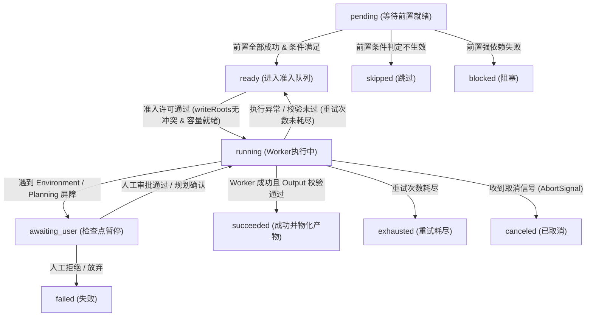

# 第 14 章：Graph Mode 的调度机制

[English](14-graph-mode-scheduling.md) | 中文

在前面章节中，我们深入探讨了单智能体（Single Agent）的底层状态机循环、消息收发收件箱（Inbox）以及工具调用副作用隔离机制。然而，在面对复杂的现代软件工程任务（例如全栈功能重构、跨模块架构演进、自动化端到端测试与环境依赖迁移）时，单 Agent 的线性上下文窗口会迅速遭遇“注意力衰减”与“上下文污染”极限。

为了解决长程任务的工程可靠性问题，DeepSeek Harness 引入了 **Graph Mode（任务图模式）**。Graph Mode 将软件工程生命周期建模为有向无环图（Directed Acyclic Graph, DAG），通过将传统的串行推理转化为具备强类型约束、不可变版本控制、并发写隔离和确定性准入检查的分布式多 Agent 协同系统。

本章将全面解构 Graph Mode 的调度架构与运行时核心机制。我们将从底层的三层状态机抽象出发，详细推导 DAG 拓扑排序与关键路径数学模型，剖析 Campaign/Batch 的长任务拆解范式，揭秘 `writeRoots` 并行写隔离与准入控制算法，并深入讲解 `environment` 特权节点的审批屏障和 `browser-tester` 的受控 DOM 验收流水线。

---

## 1. 软件工程映射：Graph Mode 的系统编程心智模型

对于具备传统后端、编译原理或分布式系统经验的工程师，可以将 Graph Mode 中的核心概念与经典计算机系统概念进行严格的一一映射，从而建立精确的工程直觉：

| Graph Mode 核心概念 | 经典计算机系统 / 分布式架构映射 | 核心职责与本质特征 |
|---|---|---|
| **Semantic Draft** | **AST（抽象语法树）草稿 / 未解析 IR** | 主控 LLM 通过工具调用生成的语义化意图表达，包含任务目标与逻辑依赖，不包含物理执行 ID |
| **Immutable Revision** | **Git Commit（不可变提交快照）** | 经过 Harness 强类型校验、拓扑闭包计算并固化版本的 DAG 静态结构，一旦生成永久只读 |
| **Graph Run** | **Process / Job 物理运行实例** | 某个不可变 Revision 的单次实例化执行生命周期，包含各节点的物理 Attempt 与执行日志 |
| **Graph Controller** | **Kubernetes Controller Plane / 编译器前端** | 运行在顶层的特权决策状态机，负责解析人类输入、提交/修订任务图并综合最终交付证据 |
| **Worker Subagent** | **Worker Thread / K8s Pod 执行单元** | 挂载受限沙箱与专属 System Prompt 的无状态子代理，负责执行单一原子节点并返回结构化输出 |
| **Campaign & Batch** | **Argo Workflows / 多阶段流水线** | 将超长程工程目标划分为有序独立的子图批次，通过不可变前缀与原子扩展（`planExtension`）防止状态爆炸 |
| **writeRoots** | **Linux 文件系统命名空间 / 细粒度行级排他锁** | 节点声明的源码相对写目录集合，准入控制器通过无交集判定算法消除并发文件写冲突 |
| **Admission Control** | **K8s ResourceQuota & 调度器过滤器** | 综合依赖就绪、文件冲突、Worker 上限、Controller 保留容量与模型显存权重的四维拦截门禁 |
| **Environment Node** | **`sudo` 提权命令 / 硬件初始化驱动** | 涉及宿主机网络、包安装或 Docker 变更的特权节点，必须在 Checkpoint 暂停并由宿主安全代执行 |
| **Browser Tester** | **Puppeteer / Playwright 验收测试套件** | 专职运行受控 DOM 树快照提取、多模态视觉断言与网络控制台错误侦测的特权测试角色 |

---

## 2. 任务图的三层抽象架构：语义草稿 $\to$ 不可变 Revision $\to$ Run 运行实例

在许多朴素的 Agent 框架中，任务图通常被设计为内存中随状态演化而不断原地被修改（In-place Mutation）的可变对象。这种设计在面对网络抖动、模型推理中断、崩溃恢复与人工介入时，会导致图状态彻底不可预测。

DeepSeek Harness 严格遵循**函数式不可变性（Functional Immutability）**与**事件溯源（Event Sourcing）**哲学，将任务图的生命周期解耦为三层正交抽象：

```
+-----------------------------------------------------------------------------------------+
|                                    1. 语义草稿层 (Semantic Draft)                         |
|   Controller LLM 通过 graph_submit(intent, nodes, edges, campaign) 工具生成逻辑计划        |
+--------------------------------------------+--------------------------------------------+
                                             |
                                             v  [Harness 校验、正规化、闭包计算与哈希分配]
+-----------------------------------------------------------------------------------------+
|                                   2. 不可变快照层 (Immutable Revision)                    |
|   GraphRevision { graphId, revision: N, parentRevision: N-1, nodes, edges, termination }  |
|   通过持久化事件 `graph/change` 写入会话账本 (不可篡改、全局幂等、支持跨版本 Diff)            |
+--------------------------------------------+--------------------------------------------+
                                             |
                                             v  [GraphScheduler 获取租约与 Fencing Token]
+-----------------------------------------------------------------------------------------+
|                                    3. 物理运行层 (Graph Run)                              |
|   GraphRun { id: RunId, revision: N, generation: G, nodes: { [NodeId]: GraphNodeRun } } |
|   驱动原子 Attempt 执行、产物物化、Checkpoint 暂停拦截，并通过 `graph/run` 更新最新状态   |
+-----------------------------------------------------------------------------------------+
```

### 2.1 语义草稿层（Semantic Draft）协议设计

主控 LLM（Controller）不应该承担底层分布式系统细节（例如生成全局 UUID、维护父修订号、维护单调递增的 Generation、计算传递后继失效列表或解析绝对文件系统路径）。Controller 的唯一职责是进行**领域逻辑规划**。

当用户输入到达时，Controller 通过系统提示词被约束为必须先将输入分类（`new`、`revise`、`inspect`、`control`、`clarify`、`direct`）。对于 `new` 和 `revise`，Controller 调用内置的 `graph_submit` 工具提交语义草稿：

```json
{
  "intent": "new",
  "objective": "重构认证模块并引入 JWT 双 Token 刷新机制",
  "nodes": [
    {
      "id": "arch-design",
      "title": "设计 JWT 接口与存储结构",
      "objective": "输出 OpenAPI 规范及 Refresh Token 白名单 Redis 数据结构",
      "kind": "design",
      "roleId": "architect",
      "acceptanceCriteria": [
        "包含 /api/auth/refresh 接口的请求与响应 Schema",
        "定义 Redis 存储键名规则与 TTL 策略"
      ],
      "effectPolicy": "idempotent"
    },
    {
      "id": "core-jwt-impl",
      "title": "实现 Token 生成与验证中间件",
      "objective": "编写基于 jsonwebtoken 的签名、验签与续期逻辑",
      "kind": "implementation",
      "roleId": "engineer",
      "acceptanceCriteria": [
        "通过 src/auth/jwt.service.ts 导出 signToken 与 verifyToken",
        "单元测试覆盖率达到 100%"
      ],
      "workspace": {
        "mode": "isolated-copy",
        "writeRoots": ["src/auth"]
      },
      "effectPolicy": "idempotent"
    },
    {
      "id": "user-route-impl",
      "title": "改造用户路由挂载认证守卫",
      "objective": "在受保护接口上增加 AuthGuard 拦截",
      "kind": "implementation",
      "roleId": "engineer",
      "acceptanceCriteria": [
        "src/routes/user.ts 正确引入并使用 AuthGuard"
      ],
      "workspace": {
        "mode": "isolated-copy",
        "writeRoots": ["src/routes"]
      },
      "effectPolicy": "idempotent"
    },
    {
      "id": "integration-test",
      "title": "端到端集成验证",
      "objective": "启动测试套件验证登录、请求与自动刷新全链路",
      "kind": "verification",
      "roleId": "verifier",
      "acceptanceCriteria": [
        "pnpm test:e2e 全部 Pass"
      ],
      "effectPolicy": "idempotent"
    }
  ],
  "edges": [
    { "from": "arch-design", "to": "core-jwt-impl", "kind": "data" },
    { "from": "arch-design", "to": "user-route-impl", "kind": "data" },
    { "from": "core-jwt-impl", "to": "integration-test", "kind": "control" },
    { "from": "user-route-impl", "to": "integration-test", "kind": "control" }
  ]
}
```

### 2.2 不可变 Revision 快照派生与失效传播（Downstream Invalidation）

当 Harness 接收到 `graph_submit` 草稿后，执行以下核心流水线：

1. **结构合法性校验（Strict DAG Invariant）**：
   - 校验所有 `roleId` 是否为已启用的合法工作角色，且不能为主控自身角色。
   - 校验节点集合与边集合，使用 Kahn 拓扑排序算法确保**严格无环（Acyclic）**、无自环、无重复边，所有边的端点必须在节点集中存在。
   - 校验 `acceptanceCriteria` 非空，且每个节点都有明确的 `effectPolicy`。
2. **Revision 编号连续性与不可变封装**：
   - 若是首个图，则分配 `revision = 1`，`parentRevision = undefined`；
   - 若是修订（`intent = revise`），则强制分配 `revision = previous.revision + 1`，`parentRevision = previous.revision`。
3. **传递后继闭包计算（Downstream Invalidation Closure）**：
   - 当某次修订修改了节点 $u$ 的定义（例如修改了目标、入边或验收标准），或者前一轮运行中节点 $u$ 失败，则所有以 $u$ 为起点的可达节点（即传递后继闭包 $\text{Succ}^*(u)$）其历史产物全部失效，必须按拓扑序重新加入待执行列表。
   - 只有与被修改节点完全无依赖路径、且在前一版本中已成功（`succeeded`）的节点，其输出才允许被打上 `reusedFrom` 标记直接复用。

```
       [A: 已成功] (保留复用)
       /          \
      v            v
  [B: 被修改]    [C: 已成功] (保留复用)
      |            |
      v            v
  [D: 传递失效]  [E: 已成功] (保留复用)
      \            /
       v          v
       [F: 传递失效]
```

### 2.3 物理运行层（Graph Run）与状态投影

一个不可变 Revision 可以被多次执行（例如遇到中断后恢复、人工重试、或参数微调后的重新运行）。每次运行由独立的 `GraphRunId` 唯一标识。

Harness 维护由 7 类不可变事件组成的会话账本，并通过只读投影（Projection Fold）实时还原全局状态：

```typescript
export interface GraphProjection {
  readonly config: GraphModeConfig
  readonly currentGraphId?: GraphId
  readonly currentCampaignId?: GraphCampaignId
  readonly graphs: Readonly<Record<GraphId, readonly GraphRevision[]>>
  readonly runs: Readonly<Record<GraphRunId, GraphRun>>
  readonly operations: Readonly<Record<GraphControlOperationId, readonly GraphOperationTransition[]>>
  readonly settlements: Readonly<Record<GraphSettlementId, readonly GraphSettlementRecord[]>>
  readonly submissions: Readonly<Record<GraphSubmissionId, GraphRevisionSubmissionRecord>>
  readonly checkpoints: Readonly<Record<GraphCheckpointId, GraphCheckpoint>>
  readonly controls: Readonly<Record<GraphControlOperationId, GraphControlRecord>>
  readonly campaigns: Readonly<Record<GraphCampaignId, GraphCampaign>>
}
```

每个节点在单次 Run 中的生命周期状态机转移如下：



---

## 3. DAG 拓扑、关键路径与准入控制的严密数学推导

为了确保多 Agent 调度的确定性与高吞吐，Graph Mode 在底层建立了严格的图论与排队论数学模型。

### 3.1 传递闭包与失效分析矩阵手算

设任务图 Revision 为有向无环图 $G = (V, E)$，其中节点集合 $V = \{v_1, v_2, \dots, v_n\}$，边集合 $E \subseteq V \times V$。

我们用邻接矩阵 $A \in \{0, 1\}^{n \times n}$ 表示直接依赖关系：

$$A_{ij} = \begin{cases} 1, & \text{若 } (v_i, v_j) \in E \text{（即 } v_j \text{ 依赖 } v_i \text{）} \\ 0, & \text{其他} \end{cases}$$

传递闭包（Transitive Closure）可达性矩阵 $R \in \{0, 1\}^{n \times n}$ 定义为：

$$R = \sum_{k=1}^{n-1} A^k \quad (\text{在布尔代数下，加法为逻辑或 } \lor \text{，乘法为逻辑与 } \land)$$

当发生局部修订，受直接影响的变更节点集合为 $C \subseteq V$（以特征向量 $x_C \in \{0, 1\}^n$ 表示，若 $v_i \in C$ 则 $x_{C, i} = 1$），则全量受影响（必须重新执行）的节点集合 $V_{\text{invalid}}$ 对应的特征向量 $y \in \{0, 1\}^n$ 为：

$$y = x_C \lor (x_C \cdot R)$$

#### 逐步手算演示：

假设有 5 个节点 $V = \{v_1, v_2, v_3, v_4, v_5\}$，依赖边为 $E = \{(v_1, v_2), (v_1, v_3), (v_2, v_4), (v_3, v_4), (v_4, v_5)\}$。

- **步骤 1（构建直接邻接矩阵 $A$）**：$$A = \begin{pmatrix} 0 & 1 & 1 & 0 & 0 \\ 0 & 0 & 0 & 1 & 0 \\ 0 & 0 & 0 & 1 & 0 \\ 0 & 0 & 0 & 0 & 1 \\ 0 & 0 & 0 & 0 & 0 \end{pmatrix}$$

- **步骤 2（计算 $A^2, A^3$）**：$$A^2 = A \cdot A = \begin{pmatrix} 0 & 0 & 0 & 1 & 0 \\ 0 & 0 & 0 & 0 & 1 \\ 0 & 0 & 0 & 0 & 1 \\ 0 & 0 & 0 & 0 & 0 \\ 0 & 0 & 0 & 0 & 0 \end{pmatrix}, \quad A^3 = A^2 \cdot A = \begin{pmatrix} 0 & 0 & 0 & 0 & 1 \\ 0 & 0 & 0 & 0 & 0 \\ 0 & 0 & 0 & 0 & 0 \\ 0 & 0 & 0 & 0 & 0 \\ 0 & 0 & 0 & 0 & 0 \end{pmatrix}$$

- **步骤 3（布尔求和得到可达性矩阵 $R = A \lor A^2 \lor A^3$）**：$$R = \begin{pmatrix} 0 & 1 & 1 & 1 & 1 \\ 0 & 0 & 0 & 1 & 1 \\ 0 & 0 & 0 & 1 & 1 \\ 0 & 0 & 0 & 0 & 1 \\ 0 & 0 & 0 & 0 & 0 \end{pmatrix}$$

- **步骤 4（失效推导）**：若 Controller 修正了节点 $v_3$ 的代码（即 $C = \{v_3\}$，特征向量 $x_C = (0, 0, 1, 0, 0)$），则有：$$x_C \cdot R = (0, 0, 1, 0, 0) \cdot \begin{pmatrix} 0 & 1 & 1 & 1 & 1 \\ 0 & 0 & 0 & 1 & 1 \\ 0 & 0 & 0 & 1 & 1 \\ 0 & 0 & 0 & 0 & 1 \\ 0 & 0 & 0 & 0 & 0 \end{pmatrix} = (0, 0, 0, 1, 1)$$

由此计算全量失效特征向量：$$y = x_C \lor (x_C \cdot R) = (0, 0, 1, 0, 0) \lor (0, 0, 0, 1, 1) = (0, 0, 1, 1, 1)$$

推导结果：失效节点集合为 $\{v_3, v_4, v_5\}$；而 $\{v_1, v_2\}$ 保持有效，其执行结果与产物被安全复用（`reusedFrom`）。

---

### 3.2 关键路径（Critical Path Method, CPM）与加速比理论推导

在多 Agent 任务图中，每个节点 $v_i$ 的物理耗时包含两部分：LLM 思考推理与生成耗时 $t_{\text{llm}}(v_i)$，以及工具调用与沙箱 IO 耗时 $t_{\text{tool}}(v_i)$。设节点总权重为 $w(v_i) = t_{\text{llm}}(v_i) + t_{\text{tool}}(v_i)$。

#### 关键路径长度（Critical Path Length）

定义从源节点（In-degree = 0）到汇节点（Out-degree = 0）的最长路径权重和为关键路径时间 $T_{\infty}$（即无限并发 Worker 下的最短完工时间）：

$$T_{\infty} = \max_{p \in \text{Paths}(G)} \sum_{v \in p} w(v)$$

全部任务的串行总工作量（Workload）为：

$$T_1 = \sum_{v \in V} w(v)$$

在物理 Worker 数量受限为 $P = \text{globalMaxParallel} - \text{controllerReserve}$ 且无资源冲突时，根据 Brent 定理（Brent's Theorem），总完成时间 $T_P$ 满足有界约束：

$$\frac{T_1}{P} \le T_P \le \frac{T_1 - T_{\infty}}{P} + T_{\infty}$$

#### 理论加速比（Speedup）与并行效率（Efficiency）

$$S(P) = \frac{T_1}{T_P} \ge \frac{T_1}{\frac{T_1 - T_{\infty}}{P} + T_{\infty}} = \frac{P}{1 + (P - 1) \cdot \frac{T_{\infty}}{T_1}}$$

$$\eta(P) = \frac{S(P)}{P} = \frac{1}{1 + (P - 1) \cdot \frac{T_{\infty}}{T_1}}$$

> **工程洞察**：当任务图中存在长链路的串行依赖（$\frac{T_{\infty}}{T_1} \to 1$）时，盲目增加 Worker 数量不仅无法提升吞吐，反而会因为模型 API 限流排队和锁竞争导致 $\eta(P)$ 急剧恶化。架构师必须通过拆解大颗粒节点、解耦模块读写依赖，将图结构横向展平以降低 $\frac{T_{\infty}}{T_1}$。

---

### 3.3 准入控制模型与排队论精算

设系统同时接入 $M$ 个模型路由，全局 Worker 准入上限为 $C_{\text{global}}$，每个模型路由 $m$ 的最大并发为 $C_m$、最大权重容量为 $W_m$。

对于任意就绪（Ready）节点 $v$，其准入必须同时满足下列五项判定约束：

$$\begin{cases} N_{\text{active}} < C_{\text{global}} - \text{controllerReserve} & \text{(全局 Worker 配额约束)} \\ N_{\text{role}}(r_v) < \text{maxParallel}(r_v) & \text{(角色专属并发约束)} \\ N_{\text{model}}(m_v) < C_m & \text{(模型路由并发约束)} \\ \sum_{u \in \text{Active}(m_v)} \text{weight}(u) + \text{weight}(v) \le W_m & \text{(模型加权显存预算约束)} \\ \forall u \in \text{ActiveMutating}, \quad \text{writeRoots}(v) \cap \text{writeRoots}(u) = \emptyset & \text{(源码写空间正交约束)} \end{cases}$$

若任一约束不满足，节点 $v$ 必须停留在准入队列中等待前序 Worker 释放对应维度的令牌，严禁抢占。

---

## 4. 四维节点准入控制与并发写隔离机制（`writeRoots`）

在多 Agent 协同编程中，最灾难性的故障莫过于两个并行运行的 Engineer Agent 同时编辑了同一个目录下的源文件，造成无序的代码覆盖（Race Condition Write Overwrite）或 Git 冲突。

Graph Mode 在调度层引入了强制性的**源码写根目录（`writeRoots`）正交性准入算法**。

```
                    Ready 节点进入准入检查
                               |
                               v
               +-------------------------------+
               | 1. 检查前置依赖是否全部进入终态? | ----[否]----> 等待 (Pending)
               +---------------+---------------+
                               | [是]
                               v
               +-------------------------------+
               | 2. 判定条件分支 (Condition)?   | ----[不满足]----> 标记为 Skipped
               +---------------+---------------+
                               | [满足]
                               v
               +-------------------------------+
               | 3. writeRoots 冲突检测:       |
               | 是否与当前所有 Running 节点的   | ----[有交集]----> 排队等待写锁释放
               | writeRoots 发生路径重叠?      |
               +---------------+---------------+
                               | [无冲突]
                               v
               +-------------------------------+
               | 4. 检查全局配额与角色/模型配额: |
               | active < globalMax - reserve? | ----[超额]----> 排队等待容量释放
               +---------------+---------------+
                               | [配额充足]
                               v
               +-------------------------------+
               | 5. 扣减配额、标记 Running 并派发 |
               +-------------------------------+
```

### 4.1 路径正交性判定算法推导

给定两个正规化的源码相对路径集合 $A = \{a_1, a_2, \dots, a_p\}$ 与 $B = \{b_1, b_2, \dots, b_q\}$。定义路径前缀包含算子 $\sqsubseteq$：

$$x \sqsubseteq y \iff (x = y) \lor (y \text{ 是以 } x + \text{"/" 为前缀的子路径})$$

两节点 $u$ 与 $v$ 发生写冲突的充分必要条件是：

$$\text{Conflict}(u, v) \iff \exists a \in \text{writeRoots}(u), \exists b \in \text{writeRoots}(v), \quad (a \sqsubseteq b \lor b \sqsubseteq a)$$

- 若节点 $u$ 声明 `writeRoots: ["src/auth"]`，节点 $v$ 声明 `writeRoots: ["src/user"]`，则判定互不重叠，允许安全并行运行。
- 若节点 $u$ 声明 `writeRoots: ["src"]`，节点 $v$ 声明 `writeRoots: ["src/auth"]`，由于 `src` $\sqsubseteq$ `src/auth`，准入控制器将判定存在冲突，节点 $v$ 必须等待节点 $u$ 完全完成并结算后方可准入。
- 根目录声明 `writeRoots: ["."]` 代表独占整个工作区，将排他性阻塞所有其他变更高阶节点。

---

## 5. Campaign 与 Batch 机制：长任务拆解与不可变计划前缀

当一个大型工程任务需要编写数十个模块、持续数小时甚至数天时，如果将全部 50+ 个节点塞进单张 DAG 图中，会导致：
1. **拓扑复杂度爆炸**：任何后期的需求微调都会触发大规模的传递闭包失效，导致大量本已完成的工作被重跑；
2. **上下文膨胀**：Controller 的 System Prompt 会被海量的历史节点信息撑爆，超出 KV Cache 复用预算；
3. **故障域过大**：单节点彻底失败可能导致整图陷入非终态。

DeepSeek Harness 设计了 **Campaign（战役）与 Batch（批次）** 机制。

```
+---------------------------------------------------------------------------------------------------+
|                                      Campaign: 统一业务战役                                         |
|                                                                                                   |
|  [Batch 1: 基础设施搭建]       [Batch 2: 核心业务开发]       [Batch 3: 性能优化与压测] (待展开)           |
|  +--------------------+       +--------------------+       +--------------------+                 |
|  | GraphRevision (v1) | ====> | GraphRevision (v1) | ====> |  (尚未生成 Batch   |                 |
|  | RunId: run-001     |       | RunId: run-002     |       |   Graph 保持占位)   |                 |
|  +--------------------+       +--------------------+       +--------------------+                 |
|            |                           |                                                          |
|            v                           v                                                          |
|     Settlement 摘要             Settlement 摘要                                                    |
|  (紧凑安全的结构化产物)       (紧凑安全的结构化产物)                                               |
+---------------------------------------------------------------------------------------------------+
```

### 5.1 不可变计划前缀与原子扩展（`planExtension`）

Campaign 采用**不可变计划前缀（Immutable Plan Prefix）**模型：
1. **批次注册**：在创建 Campaign 时，首个草稿定义了初始的批次列表（`batches: [B1, B2, ...]`）。
2. **独立子图生命周期**：每个 Batch 拥有自己完全独立的 `GraphId` 与 `GraphRevision`。不同 Batch 之间的节点互不共享、无直接边连接。
3. **跨 Batch 上下文隔离与 Settlement 传递**：前序 Batch 完成后，Harness 将其输出物化为标准化的 `GraphSettlementRecord`（包含产物清单哈希、公共协调摘要 `coordinationSummary` 与关键导出数据）。后续 Batch 的 Controller 仅消费该 Settlement 紧凑摘要，彻底隔绝底层海量的子会话 Transcript 与中间临时文件。
4. **动态批次发现（Audited Plan Extension）**：如果在执行过程中，已完成的批次揭示出全新的后续工作需求，Controller 严禁修改、删除或重新排序既有的 Batch，而必须通过提交 `campaign.planExtension` 以原子追加的方式向 Campaign 尾部追加全新的 Batch 列表。

---

## 6. `environment` 节点的人工审批屏障与 Host Shell 安全代执行

在软件开发中，经常需要执行环境级操作（如 `npm install`、`pip install`、配置 Docker 容器或绑定主机端口）。普通 Worker 子代理运行在严格隔离的文件沙箱中，无权且绝不应该直接调用破坏宿主机的提权命令。

Graph Mode 设立了专职的 `environment` 任务类型，并通过 **Checkpoint 暂停屏障** 与 **Host Shell 安全代执行** 实现双重安全防御。

```
    Controller 提交 environment 节点
                   |
                   v
    +-----------------------------------------------+
    | 1. 静态安全检查:                               |
    |    - requiredCapabilities 必须在白名单内      |
    |    - 禁止硬编码 Secret 密钥与敏感凭据          |
    |    - sandboxMode: workspace-write / full     |
    +----------------------+------------------------+
                           |
                           v
    +-----------------------------------------------+
    | 2. 调度器到达该节点，触发 Checkpoint 暂停:       |
    |    - 追加 `graph/checkpoint` (kind: environment)|
    |    - 节点状态置为 awaiting_user                |
    |    - 挂起整个 DAG 依赖分支                      |
    +----------------------+------------------------+
                           |
                           v  [向 Web UI / CLI 推送结构化审批卡片]
    +-----------------------------------------------+
    | 3. 人类用户评审确切命令列表 (Exact Commands)     |
    +----------------------+------------------------+
                           |
             +-------------+-------------+
             |                           |
             v [approve-checkpoint]      v [reject-checkpoint]
    +------------------------+  +------------------------+
    | 4. 宿主机特权代执行:     |  | 5. 节点标记为 Failed:  |
    | 由 Host Process 直接    |  | 阻止下游依赖执行,       |
    | 运行命令并捕获 ExitCode  |  | 触发主控重新规划        |
    +------------------------+  +------------------------+
             |
             v
    +-----------------------------------------------+
    | 6. 物化执行日志与哈希，推进节点为 Succeeded     |
    +-----------------------------------------------+
```

### 6.1 安全代执行约束规范
- **禁止投机性变更**：`environment` 节点严禁包含模糊的探索性命令。每一条命令必须具备明确的退出码断言。
- **凭据隔离**：严禁在命令中注入明文 Token 或密码，必须通过宿主注入的环境变量间接引用。
- **回滚命令存证**：节点支持声明 `rollbackCommand`，但该字段仅作文档存证；任何回滚操作必须由人工确认后生成新的独立 `environment` 节点执行。

---

## 7. `browser-tester` 节点的受控 DOM 验收与 UI 三视图架构

对于前端与全栈项目，单纯的单元测试无法捕捉布局错位、路由拦截失效或微前端通信异常。Graph Mode 引入了专职的 `browser-tester` 角色。

### 7.1 `browser-tester` 的受控验收流水线
1. **Origin 隔离与生命周期绑定**：`browser-tester` 启动专属的受控无头浏览器上下文，严格限制访问被测本地 Origin（例如 `http://127.0.0.1:3000`）。
2. **DOM 快照与选择器优先**：通过结构化提取可访问性树（Accessibility Tree）与带有 `data-testid` 的语义化 DOM 快照，精准定位控件并执行交互，避免基于坐标猜测的脆弱点击。
3. **视觉多模态断言**：对于挂载视觉多模态模型（Vision-capable Route）的角色，在关键页面节点捕获带时间戳的屏幕截图（Screenshot），验证渲染布局与样式回归。
4. **控制台与网络静默审计**：在每个关键测试步骤后，自动排查是否有未捕获的 JavaScript Console 异常（`Uncaught Error`）或非预期的 4xx/5xx 网络请求。

---

### 7.2 客户端 UI 三视图架构（Design / Execution / Revisions）

在 `@deepseek-ai/dsh-client-ui-graph` 模块中，前端通过 Cytoscape 图形引擎与响应式状态流，向开发者提供全透明的三视图可观测性：

```
+---------------------------------------------------------------------------------------------------+
|  [Design View: 设计视图]    |    [Execution View: 实现视图]    |    [Revisions View: 修订视图]     |
|                             |                                  |                                  |
|  * 展示当前 Revision 的拓扑结构 |  * 左侧: 实时 DAG 画布与节点高亮   |  * 纵向泳道展示历史任务与版本演进    |
|  * 检查各节点 Input/Output   |  * 右侧: 节点执行日志与流式 Transcript |  * 标识 derived_from / refactors |
|  * 校验 Edge 依赖与条件表达式 |  * 悬浮卡片: Token/显存实时指标   |  * 提供可视化 Revision Diff 差异对比 |
+---------------------------------------------------------------------------------------------------+
```

1. **设计视图（Design View）**：以静态拓扑的形式展现 Controller 规划的不可变结构。只读画布支持平滑缩放、基于分层布局（Hierarchical Sugiyama Layout）自动排布依赖，并严格约束字体与对比度。
2. **实现视图（Execution View）**：与当前活动的 `GraphRun` 绑定。正在执行的节点以脉冲动效渲染，失败节点高亮显示错误码与异常堆栈。点击任意节点即可展开右侧 Evidence 抽屉，实时查看子会话的标准输出、工具调用链、产物 Manifest 与 LoopX Claim 租约状态。
3. **修订视图（Revisions View）**：将任务图的演进历史组织为多版本演进谱系图（Lineage Tree）。利用带颜色的连接曲线清晰区分出“计划重构（`analysis_refactor`）”、“执行修正（`execution_correction`）”与“跨批次依赖（`depends_on`）”。

---

## 8. 生产级 TypeScript 核心实现：Graph Mode 调度器与准入引擎

下面给出 Graph Mode 调度器与准入控制器的完整工业级 TypeScript 实现。代码包含严格的类型定义、拓扑排序、失效闭包计算、`writeRoots` 冲突检测以及基于 `AbortSignal` 的协作式取消控制。

```typescript
/**
 * 生产级 Graph Mode 核心调度器与准入控制引擎
 * @module @deepseek-ai/dsh-graph-mode/engine
 */

import { EventEmitter } from 'node:events'
import { isAbsolute, normalize, relative } from 'node:path'
import type {
  GraphId,
  GraphNodeId,
  GraphRunId,
  GraphRoleId,
  GraphAttemptId,
  GraphRevision,
  GraphNode,
  GraphEdge,
  GraphRun,
  GraphNodeRun,
  GraphNodePhase,
  GraphSchedulerLimits,
  GraphNodeOutput,
  GraphCondition,
} from './types.ts'

// ============================================================================
// 1. 错误体系定义
// ============================================================================

export class GraphSchedulerError extends Error {
  constructor(
    public readonly code: string,
    message: string,
    public readonly context?: Readonly<Record<string, unknown>>
  ) {
    super(`[${code}] ${message}`)
    this.name = 'GraphSchedulerError'
  }
}

// ============================================================================
// 2. 核心调度状态与接口
// ============================================================================

export interface WorkerDispatchContext {
  readonly runId: GraphRunId
  readonly revision: number
  readonly node: GraphNode
  readonly attemptNumber: number
  readonly signal: AbortSignal
}

export interface WorkerExecutionResult {
  readonly status: 'succeeded' | 'failed'
  readonly output?: GraphNodeOutput
  readonly error?: { readonly code: string; readonly message: string }
}

export type WorkerDispatcher = (
  ctx: WorkerDispatchContext
) => Promise<WorkerExecutionResult>

export interface SchedulerEvents {
  'node:ready': (nodeId: GraphNodeId) => void
  'node:running': (nodeId: GraphNodeId, attemptId: GraphAttemptId) => void
  'node:succeeded': (nodeId: GraphNodeId, output: GraphNodeOutput) => void
  'node:failed': (nodeId: GraphNodeId, error: { code: string; message: string }) => void
  'node:skipped': (nodeId: GraphNodeId, reason: string) => void
  'run:complete': (runId: GraphRunId, success: boolean) => void
}

// ============================================================================
// 3. 路径正规化与 writeRoots 冲突判定算法
// ============================================================================

export class PathConflictDetector {
  /**
   * 正规化相对路径，拒绝绝对路径与逃逸路径（..）
   */
  public static normalizeRoot(root: string): string {
    const trimmed = root.trim()
    if (trimmed === '' || trimmed === '.') return '.'
    if (isAbsolute(trimmed)) {
      throw new GraphSchedulerError(
        'INVALID_WRITE_ROOT',
        `Write root must be relative, got absolute: "${trimmed}"`
      )
    }
    const normalized = normalize(trimmed).replace(/^[\\/]+|[\\/]+$/g, '')
    if (normalized.startsWith('..') || normalized.includes('../') || normalized.includes('..\\')) {
      throw new GraphSchedulerError(
        'PATH_TRAVERSAL_DETECTED',
        `Write root escapes workspace boundary: "${trimmed}"`
      )
    }
    return normalized
  }

  /**
   * 判定两个正规化路径集合是否存在包含或重叠冲突
   */
  public static hasConflict(rootsA: readonly string[], rootsB: readonly string[]): boolean {
    for (const rawA of rootsA) {
      const a = this.normalizeRoot(rawA)
      for (const rawB of rootsB) {
        const b = this.normalizeRoot(rawB)
        // 1. 任一方声明了工作区全域根目录 "."
        if (a === '.' || b === '.') return true
        // 2. 路径完全相等
        if (a === b) return true
        // 3. a 是 b 的父目录
        if (b.startsWith(`${a}/`) || b.startsWith(`${a}\\`)) return true
        // 4. b 是 a 的父目录
        if (a.startsWith(`${b}/`) || a.startsWith(`${b}\\`)) return true
      }
    }
    return false
  }
}

// ============================================================================
// 4. DAG 拓扑排序与传递闭包失效引擎
// ============================================================================

export class DagAnalysisEngine {
  /**
   * 校验无环性并返回确定性拓扑排序序列 (Kahn 算法)
   */
  public static topologicalSort(revision: GraphRevision): readonly GraphNodeId[] {
    const inDegree = new Map<GraphNodeId, number>()
    const nodeMap = new Map<GraphNodeId, GraphNode>()
    const adjacency = new Map<GraphNodeId, GraphNodeId[]>()

    for (const node of revision.nodes) {
      inDegree.set(node.id, 0)
      nodeMap.set(node.id, node)
      adjacency.set(node.id, [])
    }

    for (const edge of revision.edges) {
      if (!nodeMap.has(edge.from) || !nodeMap.has(edge.to)) {
        throw new GraphSchedulerError(
          'INVALID_EDGE_ENDPOINT',
          `Edge from "${edge.from}" to "${edge.to}" contains unknown node`
        )
      }
      adjacency.get(edge.from)!.push(edge.to)
      inDegree.set(edge.to, (inDegree.get(edge.to) ?? 0) + 1)
    }

    // 优先按声明顺序入队的无前置节点
    const queue: GraphNodeId[] = revision.nodes
      .map(n => n.id)
      .filter(id => inDegree.get(id) === 0)

    const sorted: GraphNodeId[] = []

    while (queue.length > 0) {
      const current = queue.shift()!
      sorted.push(current)

      for (const successor of adjacency.get(current)!) {
        const remaining = inDegree.get(successor)! - 1
        inDegree.set(successor, remaining)
        if (remaining === 0) {
          queue.push(successor)
        }
      }
    }

    if (sorted.length !== revision.nodes.length) {
      throw new GraphSchedulerError(
        'GRAPH_CYCLE_DETECTED',
        `The task graph revision contains a cycle. Sorted count: ${sorted.length}, Total nodes: ${revision.nodes.length}`
      )
    }

    return Object.freeze(sorted)
  }

  /**
   * 计算指定变更节点集合的传递后继失效闭包 (Transitive Successor Closure)
   */
  public static calculateInvalidationClosure(
    revision: GraphRevision,
    changedNodeIds: readonly GraphNodeId[]
  ): ReadonlySet<GraphNodeId> {
    const nodeIds = new Set(revision.nodes.map(n => n.id))
    for (const id of changedNodeIds) {
      if (!nodeIds.has(id)) {
        throw new GraphSchedulerError(
          'INVALID_CHANGED_NODE',
          `Changed node "${id}" not found in revision`
        )
      }
    }

    const affected = new Set<GraphNodeId>(changedNodeIds)
    let expanded = true

    while (expanded) {
      expanded = false
      for (const edge of revision.edges) {
        if (affected.has(edge.from) && !affected.has(edge.to)) {
          affected.add(edge.to)
          expanded = true
        }
      }
    }

    return Object.freeze(affected)
  }
}

// ============================================================================
// 5. 条件边求值器
// ============================================================================

export class ConditionEvaluator {
  public static evaluate(
    condition: GraphCondition | undefined,
    predecessorOutputs: ReadonlyMap<GraphNodeId, GraphNodeOutput>,
    fromNodeId: GraphNodeId
  ): boolean {
    if (!condition) return true
    const output = predecessorOutputs.get(fromNodeId)
    if (!output || output.data === undefined) return false

    // 沿着路径提取数据值
    let current: unknown = output.data
    for (const key of condition.path) {
      if (current === null || typeof current !== 'object') {
        current = undefined
        break
      }
      current = (current as Record<string, unknown>)[key]
    }

    switch (condition.operator) {
      case 'exists':
        return current !== undefined
      case 'truthy':
        return Boolean(current)
      case 'equals':
        return current === condition.value
      case 'not-equals':
        return current !== condition.value
      default:
        return false
    }
  }
}

// ============================================================================
// 6. 生产级 Graph 调度器核心实现
// ============================================================================

export class GraphScheduler extends EventEmitter {
  private readonly nodeRuns = new Map<GraphNodeId, GraphNodeRun>()
  private readonly activeWorkers = new Set<GraphNodeId>()
  private readonly outputs = new Map<GraphNodeId, GraphNodeOutput>()
  private abortController: AbortController | null = null
  private isProcessing = false

  constructor(
    public readonly revision: GraphRevision,
    public readonly limits: GraphSchedulerLimits,
    private readonly dispatcher: WorkerDispatcher
  ) {
    super()
    this.initializeNodeRuns()
  }

  private initializeNodeRuns(): void {
    for (const node of this.revision.nodes) {
      this.nodeRuns.set(node.id, {
        nodeId: node.id,
        phase: 'pending',
        attempts: [],
        weight: node.weight ?? 1,
      })
    }
  }

  /**
   * 启动调度器主执行循环
   */
  public async execute(signal?: AbortSignal): Promise<boolean> {
    this.abortController = new AbortController()
    if (signal) {
      signal.addEventListener('abort', () => this.abortController?.abort(), { once: true })
    }

    const linkedSignal = this.abortController.signal

    try {
      // 首次推进就绪节点
      this.evaluateDependenciesAndBranches()

      while (!linkedSignal.aborted) {
        // 1. 尝试对 Ready 状态的节点进行准入并分派
        const dispatchedAny = await this.admitAndDispatchReadyNodes(linkedSignal)

        // 2. 检查是否达到终态（全部完成或阻塞）
        if (this.isExecutionComplete()) {
          const success = this.allNodesSucceededOrSkipped()
          this.emit('run:complete', this.revision.graphId as unknown as GraphRunId, success)
          return success
        }

        // 3. 若当前没有活动 Worker 且无任何节点可被分派，则判定陷入死锁或阻塞
        if (this.activeWorkers.size === 0 && !dispatchedAny) {
          this.markPendingNodesBlocked()
          this.emit('run:complete', this.revision.graphId as unknown as GraphRunId, false)
          return false
        }

        // 4. 等待某个 Worker 退出或状态变更唤醒
        await this.waitForWorkerActivity(linkedSignal)
      }

      return false
    } finally {
      this.cleanup()
    }
  }

  /**
   * 评估前置依赖与分支条件，将符合条件的 Pending 节点转移为 Ready 或 Skipped
   */
  private evaluateDependenciesAndBranches(): void {
    const incomingEdges = new Map<GraphNodeId, GraphEdge[]>()
    for (const edge of this.revision.edges) {
      const list = incomingEdges.get(edge.to) ?? []
      list.push(edge)
      incomingEdges.set(edge.to, list)
    }

    for (const node of this.revision.nodes) {
      const state = this.nodeRuns.get(node.id)!
      if (state.phase !== 'pending') continue

      const inEdges = incomingEdges.get(node.id) ?? []
      if (inEdges.length === 0) {
        state.phase = 'ready'
        this.emit('node:ready', node.id)
        continue
      }

      // 检查是否所有入边的前置节点都已进入终态
      let allPredecessorsTerminal = true
      let hasFailedPredecessor = false
      let allConditionalEdgesFalsy = inEdges.length > 0 && inEdges.every(e => e.kind === 'conditional')

      for (const edge of inEdges) {
        const predState = this.nodeRuns.get(edge.from)!
        const isTerminal = ['succeeded', 'failed', 'skipped', 'blocked', 'exhausted', 'canceled'].includes(predState.phase)

        if (!isTerminal) {
          allPredecessorsTerminal = false
          break
        }

        if (predState.phase === 'failed' || predState.phase === 'exhausted' || predState.phase === 'blocked') {
          hasFailedPredecessor = true
        }

        if (edge.kind === 'conditional') {
          const conditionMet = ConditionEvaluator.evaluate(edge.condition, this.outputs, edge.from)
          if (conditionMet) {
            allConditionalEdgesFalsy = false
          }
        }
      }

      if (!allPredecessorsTerminal) continue

      if (hasFailedPredecessor) {
        state.phase = 'blocked'
        continue
      }

      if (allConditionalEdgesFalsy) {
        state.phase = 'skipped'
        this.emit('node:skipped', node.id, 'All incoming conditional branches evaluated to false')
        continue
      }

      state.phase = 'ready'
      this.emit('node:ready', node.id)
    }
  }

  /**
   * 准入控制器：执行四维并发与写冲突检查
   */
  private async admitAndDispatchReadyNodes(signal: AbortSignal): Promise<boolean> {
    if (this.isProcessing) return false
    this.isProcessing = true

    let dispatchedCount = 0

    try {
      const readyNodes = this.revision.nodes.filter(
        node => this.nodeRuns.get(node.id)?.phase === 'ready'
      )

      // 获取当前正在运行的所有节点的 writeRoots 集合
      const activeWriteRootsMap = new Map<GraphNodeId, readonly string[]>()
      for (const activeNodeId of this.activeWorkers) {
        const activeNode = this.revision.nodes.find(n => n.id === activeNodeId)!
        activeWriteRootsMap.set(activeNodeId, activeNode.workspace?.writeRoots ?? ['.'])
      }

      for (const candidate of readyNodes) {
        // 1. 全局容量约束（保留主控容量）
        const maxWorkers = Math.max(1, this.limits.globalMaxParallel - this.limits.controllerReserve)
        if (this.activeWorkers.size >= maxWorkers) break

        // 2. 角色配额约束
        const role = candidate.roleId
        const activeRoleCount = Array.from(this.activeWorkers)
          .map(id => this.revision.nodes.find(n => n.id === id)!)
          .filter(n => n.roleId === role).length

        // 3. writeRoots 冲突检测 (路径无交集断言)
        const candidateWriteRoots = candidate.workspace?.writeRoots ?? ['.']
        let hasConflict = false

        for (const [activeId, runningRoots] of activeWriteRootsMap.entries()) {
          if (PathConflictDetector.hasConflict(candidateWriteRoots, runningRoots)) {
            hasConflict = true
            break
          }
        }

        if (hasConflict) {
          // 路径冲突，跳过本轮准入，等待并发释放
          continue
        }

        // 准入通过，立即占用令牌并派发 Worker
        this.activeWorkers.add(candidate.id)
        activeWriteRootsMap.set(candidate.id, candidateWriteRoots)
        dispatchedCount++

        const state = this.nodeRuns.get(candidate.id)!
        state.phase = 'running'
        const attemptId = `attempt-${Date.now()}-${Math.random().toString(36).slice(2, 7)}` as unknown as GraphAttemptId
        this.emit('node:running', candidate.id, attemptId)

        // 异步派发，不阻塞主调度循环
        this.dispatchWorker(candidate, state.attempts.length + 1, signal).catch(err => {
          this.handleWorkerException(candidate.id, err)
        })
      }

      return dispatchedCount > 0
    } finally {
      this.isProcessing = false
    }
  }

  /**
   * 执行单个 Worker 逻辑并在退出时处理状态转移
   */
  private async dispatchWorker(
    node: GraphNode,
    attemptNumber: number,
    signal: AbortSignal
  ): Promise<void> {
    const nodeState = this.nodeRuns.get(node.id)!

    try {
      const result = await this.dispatcher({
        runId: this.revision.graphId as unknown as GraphRunId,
        revision: this.revision.revision,
        node,
        attemptNumber,
        signal,
      })

      if (result.status === 'succeeded' && result.output) {
        nodeState.phase = 'succeeded'
        this.outputs.set(node.id, result.output)
        this.emit('node:succeeded', node.id, result.output)
      } else {
        const error = result.error ?? { code: 'WORKER_EXECUTION_FAILED', message: 'Unknown worker failure' }
        if (attemptNumber < (node.maxAttempts ?? 3)) {
          // 重试：重置为 ready
          nodeState.phase = 'ready'
        } else {
          nodeState.phase = 'exhausted'
          this.emit('node:failed', node.id, error)
        }
      }
    } catch (error) {
      this.handleWorkerException(node.id, error)
    } finally {
      this.activeWorkers.delete(node.id)
      // 每次 Worker 完成后，重新触发依赖判定与排队节点准入
      this.evaluateDependenciesAndBranches()
      this.emit('worker:settled', node.id)
    }
  }

  private handleWorkerException(nodeId: GraphNodeId, error: unknown): void {
    const state = this.nodeRuns.get(nodeId)!
    state.phase = 'failed'
    const detail = error instanceof Error ? error.message : String(error)
    this.emit('node:failed', nodeId, { code: 'WORKER_CRASH', message: detail })
  }

  private isExecutionComplete(): boolean {
    for (const state of this.nodeRuns.values()) {
      if (['pending', 'ready', 'running'].includes(state.phase)) {
        return false
      }
    }
    return true
  }

  private allNodesSucceededOrSkipped(): boolean {
    for (const state of this.nodeRuns.values()) {
      if (state.phase !== 'succeeded' && state.phase !== 'skipped') {
        return false
      }
    }
    return true
  }

  private markPendingNodesBlocked(): void {
    for (const state of this.nodeRuns.values()) {
      if (state.phase === 'pending' || state.phase === 'ready') {
        state.phase = 'blocked'
      }
    }
  }

  private async waitForWorkerActivity(signal: AbortSignal): Promise<void> {
    if (signal.aborted) return
    await new Promise<void>(resolve => {
      const onActivity = () => {
        cleanup()
        resolve()
      }
      const onAbort = () => {
        cleanup()
        resolve()
      }
      const cleanup = () => {
        this.off('worker:settled', onActivity)
        this.off('node:ready', onActivity)
        signal.removeEventListener('abort', onAbort)
      }
      this.once('worker:settled', onActivity)
      this.once('node:ready', onActivity)
      signal.addEventListener('abort', onAbort, { once: true })
    })
  }

  private cleanup(): void {
    this.activeWorkers.clear()
    this.removeAllListeners()
  }
}
```

---

## 9. 生产环境真实故障复盘与高可用防御指南

在分布式多 Agent 图调度的生产实践中，由于 LLM 推理的非确定性与多进程并发文件操作，极易出现隐蔽的架构级故障。以下是四个高频经典故障的深度剖析与根治方案：

### 故障案例 1：条件分支全部为 False 导致的下游死锁

- **故障现象**：在某个包含条件分支的 DAG 中，前置审核节点给出了拒绝结果，导致所有指向下游聚合节点的条件边均未激活。聚合节点无限期处于 `pending` 状态，调度器发生死锁。
- **根因分析**：朴素的调度器仅检查“是否有激活的前置边”，未考虑“当所有前置条件边均判定为不满足时，该下游节点在逻辑上已被跳过（Skipped）”的边界情况。
- **排查与修复**：在依赖判定阶段引入 `allConditionalEdgesFalsy` 规则（见上述 `evaluateDependenciesAndBranches` 源码）。若某节点的所有入边均为条件边且求值全为 false，则自动触发 `phase = 'skipped'` 级联跳过状态转移，从而解除下游节点的等待。

---

### 故障案例 2：并发写穿透破坏同一源码文件

- **故障现象**：两个并行的 Engineer Agent 分别负责修复不同的 Bug，但由于未精确声明 `writeRoots`（均默认为 `["."]`), 两个 Agent 几乎同时读取并重写了 `src/index.ts`，导致后提交的 Agent 覆盖了先提交者的改动，测试套件发生语法崩塌。
- **根因分析**：未在调度器准入层建立强制性的文件空间排他锁。
- **排查与修复**：
  1. 实施严格的静态准入拦截：并发写节点必须显式声明精确的 `writeRoots`，且通过 `PathConflictDetector.hasConflict()` 严格保证无包含与重叠关系；
  2. 隔离沙箱：在 Worker 层面为每个变更高阶节点挂载独立的文件系统副本（`isolated-copy` 或 `git-worktree`），在节点成功结算时通过 Artifact 物化机制进行单调合并。

---

### 故障案例 3：慢 Worker 迟到写入覆盖新 Revision 产物

- **故障现象**：用户在运行中途通过 UI 提交了 Revision 2。调度器向旧 Revision 1 的 Worker 发送了 Abort 取消信号。然而其中一个底层代码搜索 Worker 正在执行密集的 Shell 操作未能及时响应取消，并在 30 秒后完成了执行，将旧的过时产物写回了共享存储，污染了 Revision 2 的状态。
- **根因分析**：缺少分布式排他所有权版本标记（Fencing Token 缺失）。
- **排查与修复**：引入严格单调递增的 `ownerEpoch` 与 `fencingToken`。当生成 Revision 2 时，调度租约（Lease）的 Token 发生递增。当 Worker 提交物理产物物化请求时，存储层比对请求携带的 Token 与当前租约 Token：若 `request.token < current.token`，直接硬拒绝写回并隔离该迟到写入。

---

### 故障案例 4：特权命令逃逸与不可逆环境破坏

- **故障现象**：某个 Engineer Agent 在尝试运行测试时发现缺少全局工具，私自执行了 `npm install -g yarn@latest`，直接修改了宿主机的全局开发环境，导致宿主其他并行容器崩溃。
- **根因分析**：未对特权副作用与常规代码实现进行角色权限隔离。
- **排查与修复**：实施**特权收归原则**。所有涉及全局包安装、网络提权与 Docker 变更的操作，必须严格封装为 `kind: 'environment'` 节点。此类节点被系统沙箱严格封禁，必须在 Checkpoint 处中断暂停，由用户在 Web 终端显式审批确认后，由 Harness 宿主进程代为安全执行。

---

## 10. 本章小结与系统架构进阶思考

### 核心架构原则总结
1. **函数式不可变性（Functional Immutability）**：任务图遵循“草稿 $\to$ 不可变快照 $\to$ 运行实例”三层状态机，通过事件溯源账本保障 100% 确定性重放与审计。
2. **细粒度失效传播（Downstream Invalidation）**：利用图论传递闭包矩阵精确识别最小失效集，最大化复用历史有效产物（`reusedFrom`），大幅节约 Token 与时间成本。
3. **四维硬核准入（Admission Control）**：通过全局配额、角色配额、模型加权显存预算与 `writeRoots` 路径正交性判定，在调度层面根除了并发写冲突与 API 速率击穿。
4. **纵深特权防御（Defense in Depth）**：区分普通 Worker 沙箱与 `environment` 宿主审批屏障，兼顾了自动化开发的高效与宿主机环境的绝对安全。

---

### 思考题与动手实践

1. **矩阵推导练习**：给定一个包含 8 个节点的微服务重构 DAG，尝试手算写出其邻接矩阵 $A$ 并推导可达性矩阵 $R$。若节点 4 失败，计算拓扑序下的最小重新执行集合。
2. **代码实战**：在上述 `GraphScheduler` 源码的基础上，扩展实现对 `branchGroups`（即 `all` / `any` / `exactly-one` / `activated` 组合分支判定）的完整解析支持。
3. **并发边界测试**：设计一个包含两个具有包含关系路径（如 `["src/components"]` 与 `["src/components/Button"]`）的节点测试用例，验证准入控制器的阻塞与唤醒时序。
