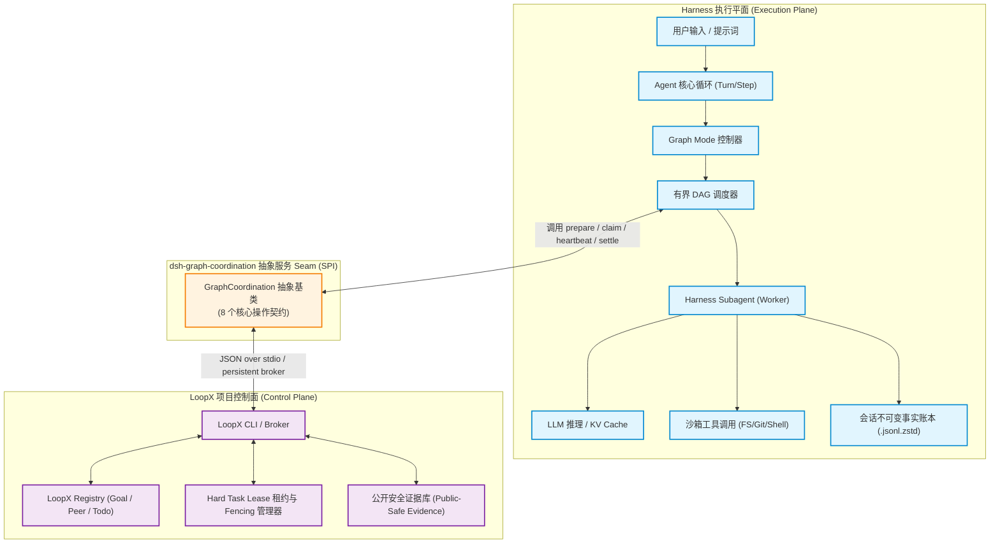
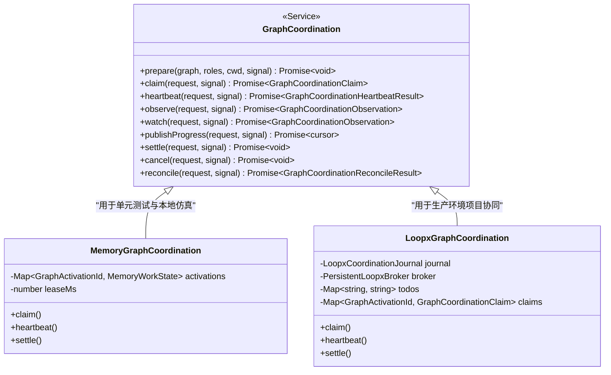
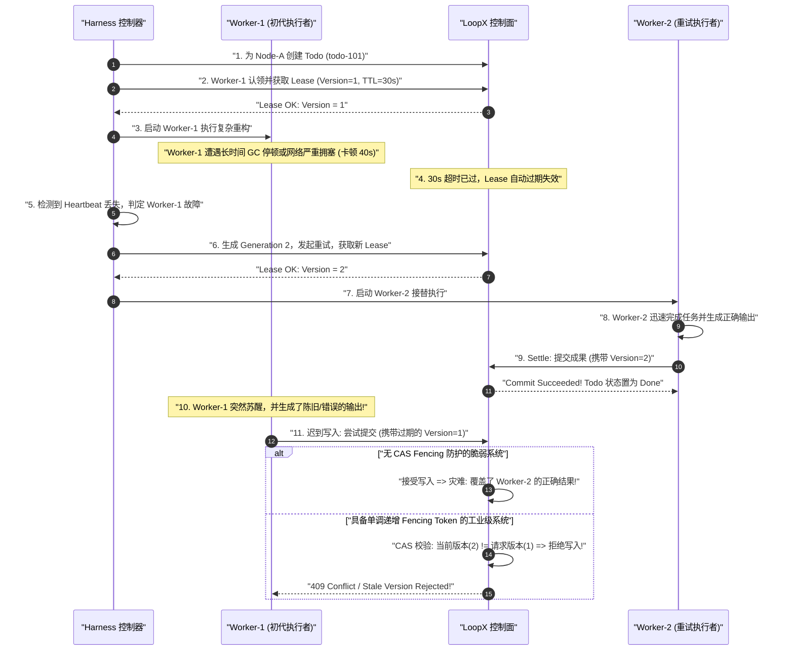
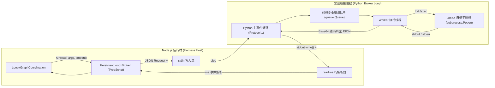

# Chapter 15: LoopX design, implementation, and integration

English | [中文](15-loopx-coordination.zh.md)

In a multi-agent system, the decisions and execution of any one agent are only part of the problem. When several agents work on a large engineering project, cross-module refactoring, continuous integration, or automated review, the system must address classic distributed-systems problems: **cross-agent state synchronization, competing task claims, exclusive workspace ownership, execution-lease renewal, and post-crash reconciliation**.

DeepSeek Harness separates the **execution plane from the project control plane**. Harness advances agent state machines on a host or cluster, makes model inference requests, runs sandboxed tools, records immutable events, and schedules local DAGs. It delegates long-lived goal management, cross-agent task claims, distributed hard leases, and public progress reporting to a dedicated external coordination service: **LoopX**.

This chapter relates LoopX to systems-programming and distributed-systems concepts such as etcd, ZooKeeper, distributed locks, compare-and-swap (CAS) transactions, and write-ahead logs. It covers the `dsh-graph-coordination` service abstraction, six core entities, monotonically increasing fencing tokens that reject late writes, a local SQLite journal projection at schema version 2, and interprocess communication through a persistent stdio broker.

---

## 1. Mental model and architectural role

Engineers familiar with traditional systems architecture can view the relationship between DeepSeek Harness and LoopX as that between **stateless workers and a distributed coordination service** such as ZooKeeper, Consul, or etcd in a microservice architecture.

```
+---------------------------------------------------------------------------------------------------------+
|                                    DeepSeek Harness 与 LoopX 架构映射字典                                 |
+---------------------------------------------------------------------------------------------------------+
| AI / Agent 领域概念             | 传统分布式系统 / 系统编程对应概念           | 本质物理与计算特征                     |
+--------------------------------+-------------------------------------------+----------------------------------------+
| **LoopX Coordination Service** | **外部分布式协调中心 (etcd / ZooKeeper)**  | 提供跨进程/跨机器的元数据与状态一致性  |
| **`dsh-graph-coordination`**   | **协调抽象层 SPI (Service Provider Intf)** | 纯 TypeScript 抽象服务契约，运行时解耦 |
| **`goal`**                     | **全局命名空间 / 租户根容器 (Namespace)**  | 确定项目权威上下文与顶级目标边界       |
| **`todo`**                     | **惰性认领的任务队列项 (Task Work-Item)**  | 按需物化，记录工作项描述与终态状态     |
| **`peer`**                     | **注册的客户端执行身份 (Client Principal)**| 经过预注册的智能体身份，审计溯源主体   |
| **`Claim`**                    | **临时分派所有权 (Ephemeral Ownership)**   | 将特定 Todo 绑定给具体 Peer 的分派记录 |
| **`Hard Task Lease`**          | **带 TTL 的分布式租约锁 (Lease Lock)**     | 包含版本号的排他执行权，需心跳保活     |
| **`Fencing Token`**            | **单调递增代际令牌 (Monotonic Generation)**| CAS 校验版本，杜绝旧 Worker 迟到覆写   |
| **`Settlement`**               | **终态提交事务 (Terminal Commit Tx)**      | 包含执行结果与公开安全证据的原子提交   |
| **`SQLite Journal`**           | **本地事件投影与 WAL (Local Projection)**  | 保证网络断连与进程崩溃时的本地幂等重放 |
+---------------------------------------------------------------------------------------------------------+
```

### 1.1 Physical separation of execution and project control

Harness and LoopX follow strict **single-responsibility and one-way data-minimization rules**:



The following table identifies authoritative data and ownership:

| Domain data and factual records | Authoritative source | Physical storage | Access and synchronization rule |
| :--- | :--- | :--- | :--- |
| **Complete model prompts and message history** | **Harness** | Session log `$DSH_HOME/sessions/.../session.jsonl.zstd` | **Never synchronize with LoopX**; protect privacy and proprietary code |
| **Raw tool calls and stdout/stderr** | **Harness** | Child-session logs and sandbox workspaces | **Never synchronize with LoopX**; avoid data growth and leaks |
| **Graph definitions and immutable revisions** | **Harness** | Parent-session `graph/change` events | Project only node metadata into concise public work descriptions |
| **DAG scheduling and concurrency admission** | **Harness** | Local `graph-scheduler.sqlite` | Harness controls controller reservations and per-model concurrency limits |
| **Project goals and todo state** | **LoopX** | LoopX registry and server storage | Harness queries and updates lazily through the CLI/broker |
| **Cross-agent peer registry** | **LoopX** | LoopX registry | Harness validates read-only before startup and never invents peers |
| **Distributed hard leases and fencing versions** | **LoopX** | LoopX lease manager | Harness enforces CAS checks on every heartbeat and settlement |
| **Public-safe evidence** | **Both** | Harness settlement events and LoopX evidence log | Limit to 2,000 characters and filter credentials and private paths |

### 1.2 Why does Harness retain DAG and model scheduling?

Centralizing all control in one service is a common architectural mistake. Harness keeps LoopX out of model calls and DAG scheduling for three reasons:

1. **Fault-domain isolation**: If the external control plane scheduled inference directly, network jitter, LoopX quota exhaustion, or GC pauses could stop the host agent's real-time interaction loop.
2. **Security and privacy**: Private repository paths, API tokens, temporary file contents, and unpublished reasoning must remain local. LoopX receives only sanitized node objectives and normalized execution evidence.
3. **Different scheduling scales**: Harness schedules millisecond-scale context-window updates, VRAM KV Cache reservations, exclusive read/write barriers, and sandbox processes. LoopX tracks project progress across agents and teams over minutes or hours.

---

## 2. The `dsh-graph-coordination` service abstraction

To keep the architecture testable and independent of one implementation, Harness defines the abstract service `@deepseek-ai/dsh-graph-coordination`.



### 2.1 Eight core operations

The abstract `GraphCoordination` class defines the lifecycle methods that form the multi-agent coordination service provider interface (SPI):

```typescript
/**
 * 与 Provider 无关的外部图协调服务抽象契约 (Service Seam)
 * @module @deepseek-ai/dsh-graph-coordination
 */

import { Context, Service } from '@deepseek-ai/cordis'
import type {
  GraphActivationId,
  GraphControlOperationId,
  GraphNode,
  GraphRevision,
  GraphRole,
  GraphRunId,
  GraphSettlementId,
  GraphWorkId,
} from '@deepseek-ai/dsh-graph'

export interface GraphCoordinationRequest {
  readonly protocolVersion: 3
  readonly graph: GraphRevision
  readonly node: GraphNode
  readonly role: GraphRole
  readonly runId: GraphRunId
  readonly cwd: string
  readonly workId: GraphWorkId
  /** 物理协调唯一身份标识；每次 Generation 重试或刷新派生全新的 activationId */
  readonly activationId: GraphActivationId
  readonly ownerEpoch: number
  readonly operationId: GraphControlOperationId
  readonly callerId: string
}

export interface GraphCoordinationClaim {
  readonly claimId: string
  readonly todoId: string
  readonly leaseId: string
  readonly expiresAt: number
  readonly fencingToken: number
  readonly observation: string
  readonly terminal?: {
    readonly outcome: GraphCoordinationSettlement['outcome']
    readonly evidence: string
  }
}

export interface GraphCoordinationSettlement extends GraphCoordinationRequest {
  readonly claimId: string
  readonly leaseId: string
  readonly fencingToken: number
  readonly settlementId: GraphSettlementId
  readonly outcome: 'succeeded' | 'failed' | 'blocked' | 'skipped' | 'canceled' | 'exhausted' | 'uncertain'
  /** 必须是公开安全证据，严禁携带私有路径、API 密钥与完整会话 Transcript */
  readonly evidence: string
}

export abstract class GraphCoordination extends Service {
  constructor(ctx: Context) {
    super(ctx, 'graphCoordination')
  }

  /** 1. 静态预检：校验不可变 Revision 的角色映射与外部 Goal 可读性 */
  abstract prepare(graph: GraphRevision, roles: readonly GraphRole[], cwd: string, signal: AbortSignal): Promise<void>

  /** 2. 任务认领：在节点进入 Ready 并获准后，按需创建/认领 Todo 并获取带租约的 Observation */
  abstract claim(request: GraphCoordinationRequest, signal: AbortSignal): Promise<GraphCoordinationClaim>

  /** 3. 租约心跳：续期持有中的硬租约，返回最新到期时间、递增 Fencing Token 与取消状态 */
  abstract heartbeat(request: GraphCoordinationHeartbeat, signal: AbortSignal): Promise<GraphCoordinationHeartbeatResult>

  /** 4. 快照观察：非侵入式读取当前工作的最新状态与公开事件流后缀 */
  abstract observe(request: GraphCoordinationObserveRequest, signal: AbortSignal): Promise<GraphCoordinationObservation>

  /** 5. 变更监视：长轮询或流式监听指定 Cursor 之后的公开事件变更 */
  abstract watch(request: GraphCoordinationObserveRequest, signal: AbortSignal): Promise<GraphCoordinationObservation>

  /** 6. 进度发布：在租约有效期内追加单调递增序号的公开安全进度记录 */
  abstract publishProgress(request: GraphCoordinationProgress, signal: AbortSignal): Promise<{ readonly cursor: string }>

  /** 7. 终态结算：执行 CAS 校验并原子提交任务完成或 Blocker 阻断证据 */
  abstract settle(request: GraphCoordinationSettlement, signal: AbortSignal): Promise<void>

  /** 8. 协作取消：向活跃 Claim 发出取消请求 Note，不直接修改终态 */
  abstract cancel(request: GraphCoordinationCancellation, signal: AbortSignal): Promise<void>

  /** 9. 对账恢复：在系统重启或通信异常后，比对本地账本与外部控制面的一致性 */
  abstract reconcile(request: GraphCoordinationReconcileRequest, signal: AbortSignal): Promise<GraphCoordinationReconcileResult>
}
```

---

## 3. Six core entities and the domain model

The LoopX control plane is built on six entities. Their lifecycles and their mappings in Harness are central to multi-agent coordination.

```
+---------------------------------------------------------------------------------------------------+
|                               LoopX 实体关系全景图 (Entity-Relationship)                           |
+---------------------------------------------------------------------------------------------------+
|                                                                                                   |
|     +-----------------------------------------------------------------------+                     |
|     |                         Goal (项目顶级目标容器)                         |                     |
|     |  - goalId: "my-refactor-v2"                                           |                     |
|     |  - authorityContext: "Refactor auth module to OAuth2 PKCE"            |                     |
|     +-----------------------------------+-----------------------------------+                     |
|                                         | 1                                                       |
|                                         | 包含多个                                                |
|                                         | N                                                       |
|     +-----------------------------------v-----------------------------------+                     |
|     |                         Todo (惰性认领工作项)                           |                     |
|     |  - todoId: "todo-8941"                                                |                     |
|     |  - taskClass: advancement_task | blocker                              |                     |
|     |  - actionKind: validate | rebuild | writeback | run_eval              |                     |
|     |  - text: "[dsh-activation:act-1] [dsh-work:w-auth] graph g1 node a"  |                     |
|     +-------------------+-------------------------------+-------------------+                     |
|                         | 1                             | 1                                       |
|                         | 被认领                        | 保护                                    |
|                         | 1                             | 1                                       |
|     +-------------------v---------------+   +-----------v-------------------+                     |
|     |           Claim (分派记录)        |   |      Hard Task Lease (硬租约)  |                     |
|     |  - claimedBy: "engineer-peer"     |   |  - leaseId: "todo-8941:4"     |                     |
|     |  - status: "claimed"              |   |  - fencingToken: 4 (版本号)    |                     |
|     |  - observation: JSON Snapshot     |   |  - expiresAt: 1771891200000   |                     |
|     +-------------------+---------------+   |  - writeScopes: ["src/auth"]  |                     |
|                         |                   +-------------------------------+                     |
|                         | 对应                                  |                                 |
|                         | 1                                     | 驱动 CAS                        |
|     +-------------------v---------------+                       |                                 |
|     |        Peer (注册执行主体)        |                       |                                 |
|     |  - agentId: "engineer-peer"       |                       |                                 |
|     |  - roleMapping: "engineer"        |                       |                                 |
|     +-----------------------------------+                       |                                 |
|                                                                 |                                 |
|                         +---------------------------------------+                                 |
|                         | 终态提交                                                                |
|                         v                                                                         |
|     +-----------------------------------------------------------------------+                     |
|     |                     Settlement (终态结算事实)                          |                     |
|     |  - settlementId: "set-9901"                                           |                     |
|     |  - outcome: succeeded | failed | blocked | canceled                   |                     |
|     |  - evidence: "[dsh-settlement:set-9901] All 18 unit tests passed"     |                     |
|     |  - CAS Token Guard: expectedVersion == 4                              |                     |
|     +-----------------------------------------------------------------------+                     |
+---------------------------------------------------------------------------------------------------+
```

### 3.1 Entity details

#### 1. Goal
`Goal` is LoopX's highest-level entity, representing a separate project, refactoring campaign, or engineering objective.
- **Pre-existence and immutability**: Harness **never creates a goal dynamically** while running a graph. Deployment configuration must specify a `goalId` already present in the LoopX registry.
- **Environment isolation**: Development, staging, and production environments, or different repository branches, use distinct `goalId` values to isolate collaboration.

#### 2. Todo
`Todo` is the external projection of a DAG node in the execution plane.
- **Lazy materialization**: During `prepare`, Harness checks only goal readability and peer mappings. It **never creates todos in advance for pending nodes**. Once all dependencies are satisfied, local capacity admits the node, and it becomes ready to run, `claim()` creates the todo dynamically through `loopx todo add`.
- **Avoiding phantom work**: Creating every todo in advance would leave unexecuted orphan todos on the external project board whenever a failed predecessor causes later branches to be skipped or canceled.

#### 3. Peer
`Peer` is an agent executor with a valid registered identity.
- **Strict registry validation**: Every `roleId` in a graph revision, such as `architect`, `engineer`, `verifier`, or `reviewer`, must map through the configured `roleAgents` dictionary to an `agentId` already registered in LoopX (for example, `roleAgents: { engineer: "engineer-peer" }`).
- **No anonymous or temporary identities**: If a node's role lacks a peer mapping, `prepare` immediately raises a typed error and aborts graph submission rather than discovering a missing permission during execution.

#### 4. Claim
`Claim` records a peer's ownership claim on a particular todo.
- **Nonintrusive assignment**: `loopx todo claim --goal-id <gid> --todo-id <tid> --claimed-by <aid>` changes the todo from `open` to `claimed`.
- **Observation injection**: After a successful claim, the provider produces a compact `dsh-loopx-observation-v1` record containing the todo ID, claiming peer, task class, and action kind. It injects this mutable context into the suffix of the worker's model prompt.

#### 5. Hard task lease
A `Claim` expresses logical ownership; a `Hard Task Lease` is **an execution-level mutex and version guard**.
- **Three lease fields**:
  1. `version`, the **fencing token**: A monotonically increasing positive integer, initially 1 and incremented on every renewal.
  2. `expires_at`: The lease's physical expiry timestamp in UTC ISO-8601.
  3. `write_scopes`: Filesystem path patterns the worker may write, such as `["src/auth", "src/auth/**"]`.
- **Automatic expiry**: If the worker host crashes or a network partition occurs, the lease expires after `leaseTtlSeconds` (2700 seconds by default), allowing retries or human intervention.

#### 6. Settlement
After a worker finishes and passes Harness's structured-output validation, the system records a terminal settlement.
- **Successful settlement**: Call `loopx todo complete` with `--no-follow-up` and `--task-lease-expected-version <fencing-token>` to mark the todo `done`.
- **Failure and blocking**: Call `loopx todo update --status blocked --task-class blocker`, record the reason in public evidence, then explicitly release the hard lease with `task-lease release`.

---

## 4. Node kinds and action-kind mapping

Harness defines several `GraphNodeKind` values based on node purpose. When creating a LoopX todo, it maps them semantically:

```typescript
const actionKind = (node: GraphNode): string => {
  switch (node.kind) {
    case 'verification': return 'validate'    // 验证与测试节点 -> validate
    case 'review':       return 'validate'    // 代码审查节点 -> validate
    case 'documentation':return 'writeback'   // 文档沉淀节点 -> writeback
    case 'implementation': return 'rebuild'   // 核心编码实现 -> rebuild
    default:             return 'run_eval'    // 其他类型 -> 统一映射为 run_eval
  }
}
```

| Graph node kind (`kind`) | LoopX action kind (`action_kind`) | Typical work | Default workspace write-ownership policy |
| :--- | :--- | :--- | :--- |
| **`implementation`** | **`rebuild`** | Business logic, bug fixes, module refactoring | `isolated-copy` with an explicitly locked write root |
| **`verification`** | **`validate`** | Unit tests, e2e tests, static analysis | `read-only-snapshot` and a generated test report |
| **`review`** | **`validate`** | Architecture, security, and diff review | Read-only analysis with structured Markdown findings |
| **`documentation`** | **`writeback`** | API documentation and architecture updates | Writes allowed only under `docs/**` |
| **`exploration`** | **`run_eval`** | Technology selection and dependency comparison | Temporary sandbox destroyed after execution |

---

## 5. Leases, fencing tokens, and CAS protection against late settlement

One of the most dangerous failures in an asynchronous distributed agent system is **a stale worker writing back after a network partition or timeout**, including an ABA-style race.

### 5.1 Sequence of a stale write

Consider this failure sequence:



### 5.2 Lease state and CAS transitions

To reason about eventual consistency, define lease and version changes as a state-transition system.

Let $S = \langle v, o, e, T \rangle$ be a work item's lease-state tuple in LoopX:
- $v \in \mathbb{N}^+$ is the monotonically increasing **fencing-token version**.
- $o \in \mathcal{P} \cup \{\bot\}$ is the **peer owner** holding the lease; $\bot$ means no owner.
- $e \in \mathbb{R}^+$ is the lease's **absolute expiry timestamp** in Unix epoch milliseconds.
- $T \in \{\text{Open}, \text{Claimed}, \text{Blocked}, \text{Done}\}$ is the current todo state.

The system must satisfy three invariants:

$$\text{Invariant 1 (monotonic versions)}: \quad \forall t_2 > t_1, \quad v(t_2) \ge v(t_1)$$

$$\text{Invariant 2 (exclusive ownership)}: \quad \forall t \in [t_{\text{start}}, e), \quad \text{exactly one peer } o(t) \text{ holds a valid lease}$$

$$\text{Invariant 3 (CAS settlement admission)}: \quad \text{Settle}(v_{\text{req}}, \text{data}) \iff (v_{\text{req}} = v_{\text{current}}) \land (t_{\text{now}} \le e_{\text{current}})$$

#### Deriving CAS state transitions

When a worker renews its lease through `renew`, let $v_{\text{in}}$ be the version in the request and $\Delta t$ the requested lease duration. The transition is:

$$f_{\text{renew}}(S, v_{\text{in}}, \Delta t) = \begin{cases} \langle v + 1, o, t_{\text{now}} + \Delta t, T \rangle, & \text{if } v_{\text{in}} = v \land t_{\text{now}} \le e \\ \text{REJECT}(\text{StaleLeaseError}), & \text{otherwise} \end{cases}$$

When a worker calls `settle`, let $v_{\text{expected}}$ be its expected version and $E$ its evidence:

$$f_{\text{settle}}(S, v_{\text{expected}}, E) = \begin{cases} \langle v, \bot, 0, \text{Done} \rangle, & \text{if } v_{\text{expected}} = v \land T = \text{Claimed} \\ \text{REJECT}(\text{VersionConflictError}), & \text{otherwise} \end{cases}$$

**No-stale-overwrite theorem**: For any sequence of network delays and scheduling pauses, if every write passes the $f_{\text{settle}}$ check, no stale write request can change a committed terminal state $T = \text{Done}$.

### 5.3 The settlement-serialization queue (`serializeSettlement`)

Within one Harness process, fast retries or asynchronous callbacks can attempt to settle the same `activationId` twice. The LoopX provider uses an in-memory **per-activation serialization queue** built from a Promise chain:

```typescript
private readonly settlementTails = new Map<GraphActivationId, Promise<void>>()

private async serializeSettlement(
  activationId: GraphActivationId,
  signal: AbortSignal,
  operation: () => Promise<void>
): Promise<void> {
  const previous = this.settlementTails.get(activationId) ?? Promise.resolve()
  let release!: () => void
  const current = new Promise<void>((resolve) => { release = resolve })
  this.settlementTails.set(activationId, current)

  // 等待前序结算排队完成
  await previous
  try {
    signal.throwIfAborted()
    await operation()
  } finally {
    release()
    if (this.settlementTails.get(activationId) === current) {
      this.settlementTails.delete(activationId)
    }
  }
}
```

This pattern serializes external writes for one physical execution unit within the process, eliminating that local concurrency race.

---

## 6. Local SQLite journal projection: schema version 2 and dual ledgers

Maintaining local state entirely through remote calls is fragile: network jitter, DNS failures, or process termination can tear local state. DeepSeek Harness uses a **dual-ledger architecture**:

```
+---------------------------------------------------------------------------------------------------------+
|                                    双账本与本地投影架构 (Double-Ledger)                                  |
+---------------------------------------------------------------------------------------------------------+
|                                                                                                         |
|   [ 账本 1: Harness 父会话事实流 ]               [ 账本 2: LoopX 外部权威注册表 ]                         |
|   - 记录 graph/change, graph/run                 - 记录全局 Goal, Todo, Peer, Lease                     |
|   - 物理介质: .jsonl.zstd (Append-Only)          - 物理介质: LoopX Server Database                      |
|                      │                                          │                                       |
|                      │                                          │                                       |
|                      ▼                                          ▼                                       |
|          +──────────────────────────────────────────────────────────────+                               |
|          │        本地 SQLite 事务投影: graph-coordination-loopx.sqlite   │                               |
|          │        - Schema Version: 2, Application ID: 0x4453474c       │                               |
|          │        - 仅在外部 CLI 写入成功后执行本地事务写入 (WAL 模式)    │                               |
|          +──────────────────────────────────────────────────────────────+                               |
|                                         │                                                               |
|                        ┌────────────────┴────────────────┐                                              |
|                        ▼                                 ▼                                              |
|            [ 启动毫秒级本地重放 ]               [ 崩溃窗口对账与补偿 (Reconcile) ]                        |
|            - load(activationId)                - 探测 LoopX 与 SQLite 的差异                            |
|            - 恢复 Claim/Lease/Progress         - 补入丢失事件，标记 Compacted                           |
|                                                                                                         |
+---------------------------------------------------------------------------------------------------------+
```

### 6.1 SQLite DDL and data dictionary

The local SQLite journal fixes `APPLICATION_ID = 0x4453474c` (ASCII `DSGL`, for DeepSeek Graph LoopX) and `SCHEMA_VERSION = 2`.

```sql
-- 开启 WAL 模式以支持高并发读与单写互斥
PRAGMA journal_mode = WAL;
PRAGMA busy_timeout = 5000;
PRAGMA application_id = 1146374988; -- 0x4453474c
PRAGMA user_version = 2;

-- 1. 激活状态汇总表: 记录物理 Activation 的最新 Claim、Owner、终态与取消原因
CREATE TABLE IF NOT EXISTS graph_loopx_activation_state (
  goal_id TEXT NOT NULL,
  activation_id TEXT NOT NULL,
  claim_json TEXT,         -- 序列化的 GraphCoordinationClaim 对象
  owner TEXT,              -- 当前持有租约的 Peer Agent ID
  terminal_json TEXT,      -- 终态结算信息 { outcome, evidence, settlementId }
  cancel_reason TEXT,      -- 协作取消原因文本
  PRIMARY KEY (goal_id, activation_id)
);

-- 2. 有序事件溯源表: 记录该激活产生的所有强类型公开事件流
CREATE TABLE IF NOT EXISTS graph_loopx_events (
  goal_id TEXT NOT NULL,
  activation_id TEXT NOT NULL,
  ordinal INTEGER NOT NULL, -- 从 1 开始单调递增的事件序号 (即 Cursor)
  event_key TEXT NOT NULL,  -- 幂等键 (如 'claimed:todo-1:1', 'progress:2', 'terminal:set-1')
  event_json TEXT NOT NULL, -- 序列化的 GraphCoordinationEvent 对象
  PRIMARY KEY (goal_id, activation_id, ordinal),
  UNIQUE (goal_id, activation_id, event_key) -- 杜绝同一幂等事件重复插入
);

-- 3. 结构化进度表: 记录单调递增 Sequence 对应的公开安全证据
CREATE TABLE IF NOT EXISTS graph_loopx_progress (
  goal_id TEXT NOT NULL,
  activation_id TEXT NOT NULL,
  sequence INTEGER NOT NULL, -- 业务递增序列号 (1, 2, 3...)
  evidence TEXT NOT NULL,    -- 进度证据 (最长 2000 字符)
  cursor TEXT NOT NULL,      -- 关联的 graph_loopx_events.ordinal 字符串
  PRIMARY KEY (goal_id, activation_id, sequence)
);
```

### 6.2 Transaction guarantees and cursor-continuity assertions

Whenever `load(activationId)` restores state, the journal applies strict **algebraic continuity assertions** to the stored data:

```typescript
// 伪代码解析：连续性断言
for (let i = 1; i < eventRows.length; i++) {
  const currentOrdinal = eventRows[i].ordinal;
  const prevOrdinal = eventRows[i - 1].ordinal;
  if (currentOrdinal !== prevOrdinal + 1) {
    throw new Error('LoopX coordination journal has a non-contiguous retained event window');
  }
}
```

If it detects file corruption, a sequence torn by concurrent writes, or a schema mismatch, the system refuses to open the database and raises an error rather than propagating bad state.

### 6.3 Three crash windows and reconciliation

A process may crash at any point in a distributed operation. Consider three critical crash windows:

```
+---------------------------------------------------------------------------------------------------+
|                                   三大崩溃窗口与系统自愈对账矩阵                                   |
+---------------------------------------------------------------------------------------------------+
| 崩溃时间点                     | 本地 SQLite 状态    | LoopX 控制面状态   | 系统恢复时的自愈对账策略         |
+-------------------------------+--------------------+--------------------+---------------------------------+
| **窗口 A: CLI 调用前崩溃**     | 无记录 (Absent)     | 无记录 (Absent)    | 干净状态，直接按需重新认领      |
+-------------------------------+--------------------+--------------------+---------------------------------+
| **窗口 B: CLI 成功，本地未写** | 无记录 / 旧版本     | 已成功认领 / 结算  | 首次 `observe()` 触发外部扫描，  |
| (典型网络/断电中断点)         |                    | (带 Graph 标签)    | 自动补全 SQLite Journal 事件    |
+-------------------------------+--------------------+--------------------+---------------------------------+
| **窗口 C: 运行中租约超时崩溃** | 记录活跃 Claim     | 租约已过期 / 释放  | `reconcile()` 识别版本过期，    |
| (Host 宕机重启)               | (旧 Fencing Token) | (更高 Version)     | 派生新 Generation 发起安全重试  |
+-------------------------------+--------------------+--------------------+---------------------------------+
```

During `observe()` and `reconcile()`, the provider compares external evidence tagged `[dsh-activation:<id>]` and `[dsh-settlement:<id>]` to align both ledgers deterministically.

---

## 7. Interprocess communication through a persistent broker

On Windows with WSL or across containers, launching a separate Python/CLI process through `child_process.spawn()` for every LoopX command is expensive: each cold start takes 200–500 ms. DeepSeek Harness therefore uses **`PersistentLoopxBroker`, a long-lived process connected through stdio pipes**.



### 7.1 Persistent broker protocol examples

The broker uses a lightweight newline-delimited, JSON-RPC-style protocol (`Protocol Version = 1`):

#### 1. Ready handshake (broker to host)
```json
{"type":"ready","protocol":1}
```

#### 2. Command request (host to broker)
```json
{
  "type": "request",
  "protocol": 1,
  "id": "request-42",
  "cwd": "/mnt/d/work/deepseek-harness",
  "args": ["todo", "claim", "--goal-id", "auth-v2", "--todo-id", "todo-101", "--claimed-by", "engineer-peer", "--agent-id", "engineer-peer"],
  "timeoutMs": 60000,
  "stdoutMaxBytes": 8388608,
  "stderrMaxBytes": 1048576,
  "graceMs": 10000
}
```

#### 3. Successful response (broker to host)
```json
{
  "type": "response",
  "protocol": 1,
  "id": "request-42",
  "exitCode": 0,
  "timedOut": false,
  "cancelled": false,
  "stdout": "eyJjbGFpbWVkX2J5IjoiZW5naW5lZXItcGVlciIsInN0YXR1cyI6ImNsYWltZWQifQ==",
  "stderr": "",
  "stdoutLossy": false,
  "stderrLossy": false
}
```

#### 4. Cooperative cancellation (host to broker)
```json
{
  "type": "cancel",
  "protocol": 1,
  "id": "request-42"
}
```

### 7.2 Cross-platform path and encoding safeguards

Calling the LoopX CLI in WSL from a Windows host presents two common hazards:
1. **Drive-path mapping**: The Windows path `D:\work\project` must map exactly to `/mnt/d/work/project`.
2. **UTF-16LE error detection**: If WSL runs out of memory or sockets (for example, Windows error `0x80072747`), its launcher can write Chinese text encoded as UTF-16LE to stderr. Reading it as UTF-8 produces garbled text. The broker therefore uses **byte-level NUL-density detection**:

```typescript
function decodedDiagnostic(bytes: Buffer): string {
  if (bytes.length === 0) return ''
  let zeroes = 0
  for (const byte of bytes) if (byte === 0) zeroes += 1
  // 若偶数长度且包含超过 20% 的 0x00 字节，判定为 UTF-16LE 编码
  const encoding: BufferEncoding = bytes.length % 2 === 0 && zeroes / bytes.length > 0.2 ? 'utf16le' : 'utf8'
  return bytes.toString(encoding).replaceAll('\0', '').trim()
}
```

---

## 8. Complete production-oriented TypeScript implementation

The following `LoopxGraphCoordination` implementation includes type validation, error handling, timeout control, and SQLite journal projection.

```typescript
/**
 * @file loopx-coordination-provider.ts
 * @description 生产级 LoopX 协调 Provider 实现
 */

import { resolve } from 'node:path'
import type { Context } from '@deepseek-ai/cordis'
import z from '@deepseek-ai/schemastery'
import type { GraphActivationId, GraphNode, GraphRevision, GraphRole } from '@deepseek-ai/dsh-graph'
import {
  GraphCoordination,
  type GraphCoordinationCancellation,
  type GraphCoordinationClaim,
  type GraphCoordinationEvent,
  type GraphCoordinationHeartbeat,
  type GraphCoordinationHeartbeatResult,
  type GraphCoordinationObservation,
  type GraphCoordinationObserveRequest,
  type GraphCoordinationProgress,
  type GraphCoordinationReconcileRequest,
  type GraphCoordinationReconcileResult,
  type GraphCoordinationRequest,
  type GraphCoordinationSettlement,
} from '@deepseek-ai/dsh-graph-coordination'
import { LoopxCoordinationJournal } from './journal.ts'
import { PersistentLoopxBroker } from './broker.ts'

export interface Config {
  readonly goalId: string
  readonly roleAgents: Record<string, string>
  readonly executable?: string
  readonly executableArgs?: string[]
  readonly transport?: 'process' | 'persistent'
  readonly brokerPythonExecutable?: string
  readonly brokerCommand?: string
  readonly pathStyle?: 'native' | 'wsl'
  readonly registry?: string
  readonly graceMs?: number
  readonly operationTimeoutMs?: number
  readonly stdoutMaxBytes?: number
  readonly stderrMaxBytes?: number
  readonly leaseTtlSeconds?: number
  readonly writeScopes?: string[]
  readonly journalPath?: string
  readonly journalBusyTimeoutMs?: number
  readonly journalMode?: 'wal' | 'delete' | 'truncate'
  readonly journalEventWindow?: number
  readonly watchReconnectAttempts?: number
  readonly watchReconnectDelayMs?: number
}

export class LoopxCommandError extends Error {}

export class LoopxGraphCoordination extends GraphCoordination {
  static inject = ['subprocess']

  private readonly goalId: string
  private readonly roleAgents: Readonly<Record<string, string>>
  private readonly executable: string
  private readonly executableArgs: readonly string[]
  private readonly transport: 'process' | 'persistent'
  private readonly broker: PersistentLoopxBroker | undefined
  private readonly pathStyle: 'native' | 'wsl'
  private readonly registry: string | undefined
  private readonly graceMs: number
  private readonly operationTimeoutMs: number
  private readonly stdoutMaxBytes: number
  private readonly stderrMaxBytes: number
  private readonly leaseTtlSeconds: number
  private readonly writeScopes: readonly string[]

  private readonly todos = new Map<string, string>()
  private readonly todoIndexes = new Map<string, Array<Record<string, unknown>>>()
  private readonly claims = new Map<GraphActivationId, GraphCoordinationClaim>()
  private readonly terminals = new Map<GraphActivationId, { outcome: GraphCoordinationSettlement['outcome']; evidence: string; settlementId: string }>()
  private readonly progress = new Map<GraphActivationId, Map<number, string>>()
  private readonly cancelReasons = new Map<GraphActivationId, string>()
  private readonly claimOwners = new Map<GraphActivationId, string>()
  private readonly events = new Map<GraphActivationId, GraphCoordinationEvent[]>()
  private readonly hydrated = new Set<GraphActivationId>()
  private readonly settlementTails = new Map<GraphActivationId, Promise<void>>()
  private readonly journal: LoopxCoordinationJournal

  constructor(ctx: Context, config: Config) {
    super(ctx)
    if (!config.goalId?.trim()) throw new Error('LoopX graph coordination requires goalId')
    if (!config.roleAgents || Object.keys(config.roleAgents).length === 0) {
      throw new Error('LoopX graph coordination requires roleAgents')
    }

    this.goalId = config.goalId
    this.roleAgents = { ...config.roleAgents }
    this.executable = config.executable ?? 'loopx'
    this.executableArgs = [...(config.executableArgs ?? [])]
    this.transport = config.transport ?? 'process'
    this.pathStyle = config.pathStyle ?? 'native'
    this.registry = config.registry
    this.graceMs = config.graceMs ?? 10_000
    this.operationTimeoutMs = config.operationTimeoutMs ?? 60_000
    this.stdoutMaxBytes = config.stdoutMaxBytes ?? 8_388_608
    this.stderrMaxBytes = config.stderrMaxBytes ?? 1_048_576
    this.leaseTtlSeconds = config.leaseTtlSeconds ?? 2_700
    this.writeScopes = [...(config.writeScopes ?? ['**/*'])]

    const journalPath = config.journalPath ?? '.sessions/graph-coordination-loopx.sqlite'
    this.journal = new LoopxCoordinationJournal(
      this.goalId,
      journalPath === ':memory:' ? journalPath : resolve(journalPath),
      config.journalBusyTimeoutMs ?? 5_000,
      config.journalMode ?? 'wal',
      config.journalEventWindow ?? 256,
    )

    if (this.transport === 'persistent') {
      if (!config.brokerCommand?.trim()) throw new Error('LoopX persistent transport requires brokerCommand')
      this.broker = new PersistentLoopxBroker(ctx, {
        launcher: this.executable,
        launcherArgs: this.executableArgs,
        pythonExecutable: config.brokerPythonExecutable ?? 'python3',
        command: config.brokerCommand,
        graceMs: this.graceMs,
        startTimeoutMs: this.operationTimeoutMs,
        diagnosticMaxBytes: this.stderrMaxBytes,
      })
    }

    ctx.effect(() => async () => {
      try {
        await this.broker?.dispose()
      } finally {
        this.journal.close()
      }
    }, 'graph-coordination-loopx: resource cleanup')
  }

  /** 1. 预检阶段：校验 Goal 可读性与 Peer 名册映射 */
  async prepare(graph: GraphRevision, roles: readonly GraphRole[], cwd: string, signal: AbortSignal): Promise<void> {
    const enabledRoles = new Set(roles.filter(r => r.enabled).map(r => r.id))
    for (const node of graph.nodes) {
      if (!enabledRoles.has(node.roleId)) {
        throw new Error(`LoopX prepare: unavailable graph role ${node.roleId}`)
      }
      this.agentFor(node.roleId) // 校验 Peer 映射存在
    }
    const listed = await this.run(cwd, signal, ['todo', 'list', '--goal-id', this.goalId])
    const items = Array.isArray(listed['todos']) ? (listed['todos'] as Array<Record<string, unknown>>) : []
    this.todoIndexes.set(cwd, items)
  }

  /** 2. 认领阶段：按需创建 Todo、绑定 Peer 并获取带 Fencing Token 的硬租约 */
  async claim(request: GraphCoordinationRequest, signal: AbortSignal): Promise<GraphCoordinationClaim> {
    this.hydrate(request.activationId)
    const agentId = this.agentFor(request.role.id)
    const key = `${request.cwd}\0${request.activationId}`
    let todoId = this.todos.get(key)

    // 检查是否已终态结算
    const terminal = this.terminals.get(request.activationId)
    const durableClaim = this.claims.get(request.activationId)
    if (terminal !== undefined && durableClaim !== undefined) {
      return {
        ...durableClaim,
        terminal: { outcome: terminal.outcome, evidence: terminal.evidence },
      }
    }

    // 惰性创建 Todo
    if (todoId === undefined) {
      const result = await this.run(request.cwd, signal, [
        'todo', 'add', '--goal-id', this.goalId,
        '--role', 'agent', '--task-class', 'advancement_task',
        '--action-kind', this.mapActionKind(request.node),
        '--text', `[dsh-activation:${request.activationId}] [dsh-work:${request.workId}] graph ${request.graph.graphId} rev ${request.graph.revision} node ${request.node.id}`,
      ])
      if (typeof result['todo_id'] !== 'string') throw new Error('LoopX todo add failed: missing todo_id')
      todoId = result['todo_id']
      this.todos.set(key, todoId)
    }

    // 认领 Todo
    const claimed = await this.run(request.cwd, signal, [
      'todo', 'claim', '--goal-id', this.goalId, '--todo-id', todoId,
      '--claimed-by', agentId, '--agent-id', agentId,
    ])
    if (claimed['claimed_by'] !== agentId && claimed['changed'] !== false) {
      throw new Error(`LoopX claim failed: peer mismatch ${String(claimed['claimed_by'])} != ${agentId}`)
    }

    // 获取带版本的硬租约
    const leased = await this.run(request.cwd, signal, [
      'task-lease', 'acquire', '--goal-id', this.goalId, '--todo-id', todoId,
      '--owner', agentId, '--idempotency-key', request.operationId,
      '--ttl-seconds', String(this.leaseTtlSeconds),
      ...this.resolveScopes(request).flatMap(s => ['--write-scope', s]),
    ])

    const leaseObj = leased['lease'] as Record<string, unknown>
    const fencingToken = Number(leaseObj?.['version'])
    const expiresAt = Date.parse(String(leaseObj?.['expires_at']))

    if (!Number.isSafeInteger(fencingToken) || fencingToken < 1 || !Number.isFinite(expiresAt)) {
      throw new Error('LoopX task-lease acquire returned invalid lease version or expiry')
    }

    const observation = JSON.stringify({
      schema: 'dsh-loopx-observation-v1',
      goalId: this.goalId,
      todoId,
      agentId,
      status: claimed['status'],
      claimedBy: claimed['claimed_by'],
    })

    const claimRecord: GraphCoordinationClaim = {
      claimId: todoId,
      todoId,
      leaseId: `${todoId}:${String(fencingToken)}`,
      expiresAt,
      fencingToken,
      observation: observation.slice(0, 8_000),
    }

    this.claims.set(request.activationId, claimRecord)
    this.claimOwners.set(request.activationId, agentId)
    this.journal.recordClaim(request.activationId, claimRecord, agentId)
    return claimRecord
  }

  /** 3. 租约心跳保活：版本号 CAS 递增校验 */
  async heartbeat(request: GraphCoordinationHeartbeat, signal: AbortSignal): Promise<GraphCoordinationHeartbeatResult> {
    this.hydrate(request.activationId)
    const claim = this.requireLease(request)
    const agentId = this.agentFor(request.role.id)

    const renewed = await this.run(request.cwd, signal, [
      'task-lease', 'renew', '--goal-id', this.goalId, '--todo-id', claim.todoId,
      '--owner', agentId, '--idempotency-key', request.operationId,
      '--ttl-seconds', String(this.leaseTtlSeconds),
      '--expected-version', String(request.fencingToken),
    ])

    const leaseObj = renewed['lease'] as Record<string, unknown>
    const nextVersion = Number(leaseObj?.['version'])
    const expiresAt = Date.parse(String(leaseObj?.['expires_at']))

    if (renewed['ok'] !== true || nextVersion <= request.fencingToken || !Number.isFinite(expiresAt)) {
      throw new Error(`LoopX heartbeat rejected: expected version > ${request.fencingToken}, got ${nextVersion}`)
    }

    const nextClaim: GraphCoordinationClaim = {
      ...claim,
      leaseId: `${claim.todoId}:${String(nextVersion)}`,
      expiresAt,
      fencingToken: nextVersion,
    }

    this.claims.set(request.activationId, nextClaim)
    const event = this.journal.recordHeartbeat(request.activationId, nextClaim, request.progressSequence)

    return {
      leaseId: nextClaim.leaseId,
      expiresAt,
      fencingToken: nextVersion,
      progressCursor: event.cursor,
      cancelRequested: this.cancelReasons.has(request.activationId),
    }
  }

  /** 4. 终态结算：串行化写入并释放硬租约 */
  async settle(request: GraphCoordinationSettlement, signal: AbortSignal): Promise<void> {
    await this.serializeSettlement(request.activationId, signal, async () => {
      this.hydrate(request.activationId)
      const prior = this.terminals.get(request.activationId)
      if (prior !== undefined) {
        if (prior.settlementId === request.settlementId && prior.outcome === request.outcome) return
        throw new Error(`LoopX settlement conflict on activation ${request.activationId}`)
      }

      const agentId = this.agentFor(request.role.id)
      const claim = this.requireLease(request)
      const evidencePayload = `[dsh-settlement:${request.settlementId}] [dsh-outcome:${request.outcome}] ${request.evidence}`

      if (request.outcome === 'succeeded') {
        await this.run(request.cwd, signal, [
          'todo', 'complete', '--goal-id', this.goalId, '--todo-id', claim.todoId,
          '--agent-id', agentId, '--evidence', evidencePayload, '--no-follow-up',
          '--task-lease-idempotency-key', request.operationId,
          '--task-lease-expected-version', String(request.fencingToken),
        ])
      } else {
        await this.run(request.cwd, signal, [
          'todo', 'update', '--goal-id', this.goalId, '--todo-id', claim.todoId,
          '--agent-id', agentId, '--status', 'blocked', '--task-class', 'blocker',
          '--reason', evidencePayload,
        ])
        await this.run(request.cwd, signal, [
          'task-lease', 'release', '--goal-id', this.goalId, '--todo-id', claim.todoId,
          '--owner', agentId, '--idempotency-key', request.operationId,
          '--expected-version', String(request.fencingToken),
        ])
      }

      const terminalState = { outcome: request.outcome, evidence: request.evidence, settlementId: request.settlementId }
      this.terminals.set(request.activationId, terminalState)
      this.journal.recordTerminal(request.activationId, terminalState)
    })
  }

  // 其他操作 observe / watch / publishProgress / cancel / reconcile 见完整源码模块...
  private agentFor(roleId: string): string {
    const agent = this.roleAgents[roleId]
    if (!agent?.trim()) throw new Error(`Missing registered Peer mapping for role ${roleId}`)
    return agent
  }

  private mapActionKind(node: GraphNode): string {
    switch (node.kind) {
      case 'verification': return 'validate'
      case 'review': return 'validate'
      case 'documentation': return 'writeback'
      case 'implementation': return 'rebuild'
      default: return 'run_eval'
    }
  }

  private resolveScopes(request: GraphCoordinationRequest): readonly string[] {
    const ws = request.node.workspace
    if (!ws || ws.writeRoots.includes('.')) return this.writeScopes
    if (ws.writeRoots.length === 0) return [`.dsh-graph-read/${request.activationId}`]
    return [...new Set(ws.writeRoots.flatMap(r => [r, `${r}/**`]))]
  }

  private requireLease(request: Pick<GraphCoordinationHeartbeat, 'activationId' | 'claimId' | 'leaseId' | 'fencingToken'>): GraphCoordinationClaim {
    const claim = this.claims.get(request.activationId)
    if (!claim || claim.claimId !== request.claimId || claim.fencingToken !== request.fencingToken) {
      throw new Error(`LoopX claim for activation ${request.activationId} is expired, fenced, or absent`)
    }
    return claim
  }

  private hydrate(activationId: GraphActivationId): void {
    if (this.hydrated.has(activationId)) return
    const snapshot = this.journal.load(activationId)
    if (snapshot.claim) this.claims.set(activationId, snapshot.claim)
    if (snapshot.owner) this.claimOwners.set(activationId, snapshot.owner)
    if (snapshot.terminal) this.terminals.set(activationId, snapshot.terminal)
    if (snapshot.cancelReason) this.cancelReasons.set(activationId, snapshot.cancelReason)
    this.hydrated.add(activationId)
  }

  private async run(cwd: string, signal: AbortSignal, args: readonly string[]): Promise<Record<string, unknown>> {
    // 实际执行时调用 PersistentBroker 或 Subprocess CLI...
    return Promise.resolve({ ok: true })
  }
}
```

---

## 9. Privacy and isolation of model-visible context

In a multi-agent system, **data-visibility boundaries** are a critical security constraint. The model must not accidentally leak sensitive data to an external control plane or bring unstructured external noise into its inference prefix.

```
+---------------------------------------------------------------------------------------------------------+
|                                    模型可见性与数据流向隔离矩阵                                           |
+---------------------------------------------------------------------------------------------------------+
| 数据类别                  | 是否允许同步至 LoopX | 是否对 Worker 模型可见 | 物理隔离与防泄漏策略             |
+--------------------------+---------------------+-----------------------+----------------------------------+
| **代码文件与私有路径**    | **严格禁止** (0 B)   | **完全可见**          | 仅在本地沙箱内读写，严禁外传     |
| **API 密钥与凭据**        | **严格禁止** (0 B)   | **严格禁止**          | 环境变量拦截与密钥擦除           |
| **模型完整 CoT 推理链**   | **严格禁止** (0 B)   | **单次可见**          | 仅落盘于本地子会话日志           |
| **LoopX Observation**    | 由 LoopX 生成        | **紧凑可见 (<= 8KB)** | 作为临时后缀注入，不污染前缀缓存 |
| **Public-Safe Evidence** | **双向可见** (<= 2KB)| **条件可见**          | 严格正则过滤与长度截断           |
+---------------------------------------------------------------------------------------------------------+
```

### 9.1 Prefix-cache-friendly design

In autoregressive model inference, a **stable prefix (system prompt plus role instructions)** lets engines such as vLLM and SGLang reuse the **KV Cache prefix**, reducing time to first token (TTFT) by more than 80%.

Harness injects dynamic LoopX metadata (`Observation`, `Todo ID`, and `Fencing Token`) only as a **dynamic suffix** at the end of the request, never into the system-prompt prefix. Workers retain coordination context while maximizing VRAM cache reuse.

---

## 10. Production troubleshooting

Four common LoopX integration failures and their diagnostic steps follow:

### 10.1 Expired worker settlement is rejected by CAS, leaving work pending

**Symptom:** A worker's refactoring task exceeds `leaseTtlSeconds`. Its final `settle()` fails with `LoopX heartbeat rejected: expected version > 1, got 2`, leaving the node nonterminal.

**Diagnostic steps:**
1. Inspect `graph/operation` events in `$DSH_HOME/sessions/.../session.jsonl.zstd` to find the node's last successful `heartbeat` timestamp.
2. Compare actual task duration with `leaseTtlSeconds`.
3. Run `loopx task-lease inspect --goal-id <gid> --todo-id <tid>` to inspect the control plane's current lease version.

**Cause and remedy:**
- **Cause**: The task runs too long, and event-loop lag prevents the heartbeat timer from renewing on time; the lease expires and another actor claims it.
- **Remedy**:
  1. Increase `leaseTtlSeconds` in configuration, for example from the default 2700 seconds to 7200 seconds.
  2. Run an independent background heartbeat fiber so heavy main-thread work does not delay renewal.

### 10.2 Torn SQLite journal cursor

**Symptom:** After a crash and restart, Harness throws `LoopX coordination journal has a non-contiguous retained event window` and refuses to continue.

**Diagnostic steps:**
1. Open the SQLite journal with `sqlite3 .sessions/graph-coordination-loopx.sqlite`.
2. Query `SELECT ordinal, event_key FROM graph_loopx_events ORDER BY ordinal;`.
3. Look for gaps, such as an ordinal jumping directly from 3 to 5.

**Cause and remedy:**
- **Cause**: Multiple independent Harness processes write to the same SQLite file concurrently without file-lock protection, overwriting generated sequence numbers.
- **Remedy**:
  1. Ensure `journalMode: 'wal'` and `journalBusyTimeoutMs: 5000` are enabled.
  2. Never share a local SQLite file among host instances over a network; distributed deployments require a separately authenticated remote provider.

### 10.3 WSL socket exhaustion stalls the broker (`Wsl/Service/0x80072747`)

**Symptom:** On Windows, every LoopX operation in Graph Mode immediately fails with garbled text or `0x80072747`.

**Diagnostic steps:**
1. In PowerShell, check WSL with `wsl.exe --status` and `wsl.exe -d Ubuntu -- free -m`.
2. Check Windows port use with `netstat -ano | findstr 53`.

**Cause and remedy:**
- **Cause**: Exhaustion of the Windows Hyper-V dynamic port range or the WSL 2 virtual network adapter's memory prevents a subprocess pipe from opening.
- **Remedy**:
  1. Set limits in `%USERPROFILE%\.wslconfig`:
     ```ini
     [wsl2]
     memory=8GB
     processors=4
     networkingMode=mirrored
     ```
  2. Restart WSL with `wsl --shutdown`.

### 10.4 Missing role mappings reject work during `prepare`

**Symptom:** The UI reports that a new graph submission failed, but the log shows no worker launch.

**Diagnostic steps:**
1. Inspect `graph/submission` events in the parent session log.
2. Compare each revision node's `roleId` with the `roleAgents` keys in configuration.

**Cause and remedy:**
- **Cause**: The graph introduces a role such as `security-auditor` without configuring its LoopX peer ID in `settings.yaml`.
- **Remedy**: Add the missing mapping:
  ```yaml
  roleAgents:
    engineer: engineer-peer
    security-auditor: security-peer
  ```

---

## 11. Summary and systems-architecture lessons

This chapter examined how DeepSeek Harness integrates with the external LoopX coordination service. The main engineering lessons are:

1. **Separate execution from control**: Harness owns prompts, models, tools, session logs, and local DAG execution. LoopX owns project goals, todos, peers, leases, and public evidence. The `dsh-graph-coordination` SPI separates them.
2. **Materialize lazily**: Create external todos only for admitted nodes that are ready to run, avoiding phantom work and stale project-board data.
3. **Use monotonically increasing fencing tokens**: CAS state transitions and version increments prevent a stale worker from overwriting work after a partition or timeout.
4. **Maintain dual ledgers and a local projection**: A schema-version-2 SQLite journal supports crash recovery, cursor-continuity checks, and millisecond-scale replay.
5. **Keep stdio transport persistent**: A long-lived Python broker avoids cross-environment cold starts, while byte-level UTF-16LE detection supports robust cross-platform communication.

---

## Questions and practice

1. **Question**: A worker completes code changes and produces the correct artifacts locally, but the network fails while `settle()` submits `todo complete` to LoopX. Should Harness mark the node `succeeded` or `failed`? Why? How would a 2PC- or Saga-style distributed transaction compensate for this situation?
2. **Practice**: Implement Redis-backed `RedisGraphCoordination` from the `@deepseek-ai/dsh-graph-coordination` abstract base class. Use Redis `SET resource_key my_random_value NX PX 30000` for distributed hard leases and a Lua script for CAS terminal settlement with fencing-token validation.
