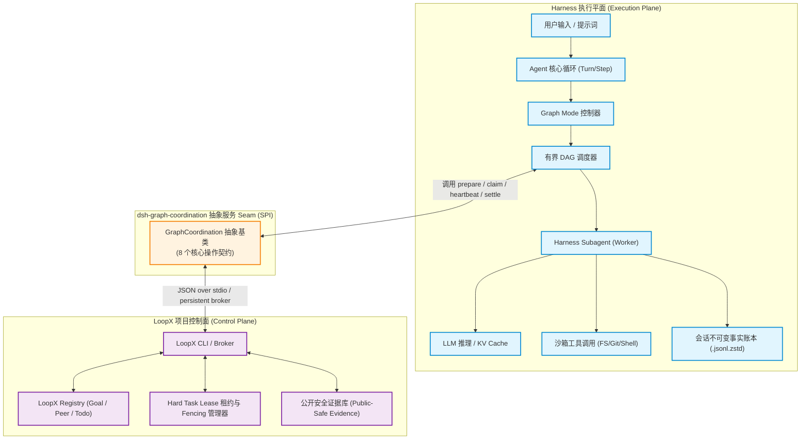
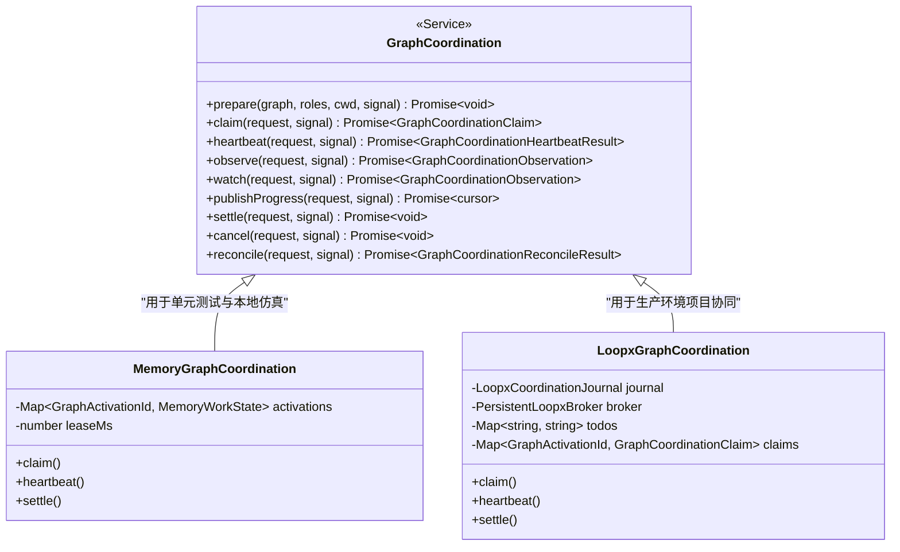
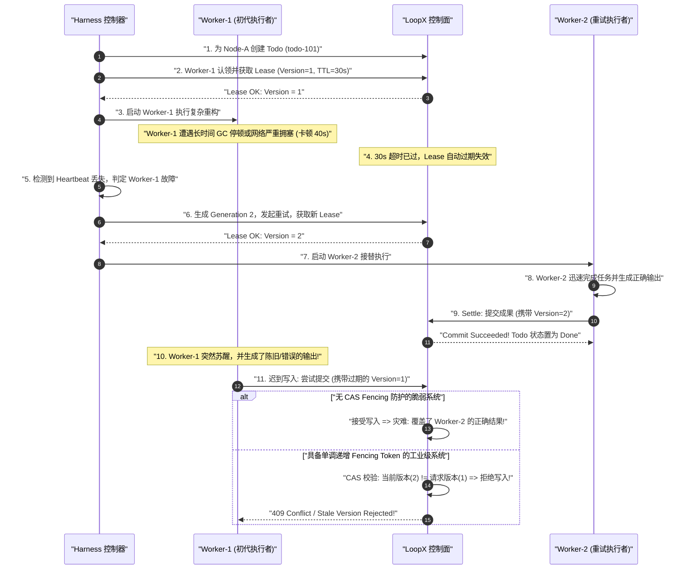
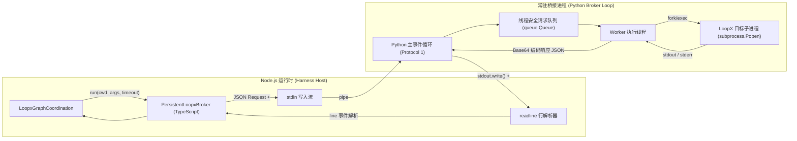

# 第 15 章：LoopX 的设计、实现与耦合

[English](15-loopx-coordination.md) | 中文

在构建多智能体复杂任务协作系统（Multi-Agent System）时，单个智能体的执行与决策往往只是冰山一角。当多个智能体协同处理大型工程项目、跨模块重构、持续集成与自动化评审时，系统必须面对严苛的**跨智能体状态同步、任务认领竞争、工作区所有权排他、执行租约保活与崩溃一致性对账**等分布式系统经典难题。

DeepSeek Harness 在架构设计上做出了极具前瞻性的解耦决策：**将执行平面（Execution Plane）与项目控制面（Control Plane）彻底分离**。Harness 本身专注于单机或集群内的 Agent 状态机推进、模型推理请求、工具沙箱调用、不可变事件账本记录与局部 DAG 任务图调度；而将长周期的全局目标管理、跨智能体任务认领、分布式硬租约与公开进度广播，委托给外部专门的协调控制服务——**LoopX**。

本章将以传统系统编程与分布式架构（如 etcd/ZooKeeper、分布式锁、CAS 事务、WAL 预写日志）的硬核视角，全景解构 LoopX 的设计理念、`dsh-graph-coordination` 服务抽象契约、六大核心实体模型、单调递增 Fencing Token 租约防迟到写入机制、本地 SQLite Journal 投影（Schema Version 2）以及常驻 stdio Broker 的进程间通信实现。

---

## 1. 核心心智模型与架构定位

对于具备传统系统架构经验的工程师，理解 LoopX 在 DeepSeek Harness 中的定位，可以直接映射为经典微服务架构中的**无状态工作节点（Worker）与分布式协调中心（Coordination Service，如 ZooKeeper / Consul / etcd）**的关系。

```
+---------------------------------------------------------------------------------------------------------+
|                                    DeepSeek Harness 与 LoopX 架构映射字典                                 |
+---------------------------------------------------------------------------------------------------------+
| AI / Agent 领域概念             | 传统分布式系统 / 系统编程对应概念           | 本质物理与计算特征                     |
+--------------------------------+-------------------------------------------+----------------------------------------+
| **LoopX Coordination Service** | **外部分布式协调中心 (etcd / ZooKeeper)**  | 提供跨进程/跨机器的元数据与状态一致性  |
| **`dsh-graph-coordination`**   | **协调抽象层 SPI (Service Provider Intf)** | 纯 TypeScript 抽象服务契约，运行时解耦 |
| **`goal`**                     | **全局命名空间 / 租户根容器 (Namespace)**  | 确定项目权威上下文与顶级目标边界       |
| **`todo`**                     | **惰性认领的任务队列项 (Task Work-Item)**  | 按需物化，记录工作项描述与终态状态     |
| **`peer`**                     | **注册的客户端执行身份 (Client Principal)**| 经过预注册的智能体身份，审计溯源主体   |
| **`Claim`**                    | **临时分派所有权 (Ephemeral Ownership)**   | 将特定 Todo 绑定给具体 Peer 的分派记录 |
| **`Hard Task Lease`**          | **带 TTL 的分布式租约锁 (Lease Lock)**     | 包含版本号的排他执行权，需心跳保活     |
| **`Fencing Token`**            | **单调递增代际令牌 (Monotonic Generation)**| CAS 校验版本，杜绝旧 Worker 迟到覆写   |
| **`Settlement`**               | **终态提交事务 (Terminal Commit Tx)**      | 包含执行结果与公开安全证据的原子提交   |
| **`SQLite Journal`**           | **本地事件投影与 WAL (Local Projection)**  | 保证网络断连与进程崩溃时的本地幂等重放 |
+---------------------------------------------------------------------------------------------------------+
```

### 1.1 执行平面与项目控制面的物理隔离边界

Harness 与 LoopX 遵循极其严格的**职责单一与单向数据最小化原则**：



两者的权威数据边界与所有权如下表所示：

| 领域数据与事实记录 | 权威数据源（Single Source of Truth） | 持久化物理介质 | 访问与同步规则 |
| :--- | :--- | :--- | :--- |
| **完整模型 Prompt 与历史消息** | **Harness** | 会话日志 `$DSH_HOME/sessions/.../session.jsonl.zstd` | **严禁同步至 LoopX**，保护隐私与代码机密 |
| **原始工具调用与标准输出/错误** | **Harness** | 子会话日志与沙箱工作区 | **严禁同步至 LoopX**，避免数据体积膨胀与泄密 |
| **任务图定义与不可变 Revision** | **Harness** | 父会话 `graph/change` 事件 | 仅将节点元数据投影为紧凑公开工作描述 |
| **DAG 调度与并发准入控制** | **Harness** | 本地 `graph-scheduler.sqlite` | 由 Harness 控制主控预留与模型并发上限 |
| **项目级 Goal 与 Todo 状态** | **LoopX** | LoopX Registry 与服务端存储 | Harness 通过 CLI/Broker 进行惰性查询与更新 |
| **跨智能体协作 Peer 名册** | **LoopX** | LoopX Registry | Harness 启动前进行只读校验，严禁自行编造 Peer |
| **分布式硬租约与 Fencing 版本** | **LoopX** | LoopX Lease Manager | Harness 在每次心跳与结算时严格执行 CAS 校验 |
| **公开安全证据（Public-Safe Evidence）** | **双方共有** | Harness Settlement 事件与 LoopX Evidence Log | 严格限制在 2,000 字符内，过滤凭据与私有路径 |

### 1.2 为什么 Harness 不让 LoopX 调度 DAG 或执行模型？

在系统架构设计中，一个常见的反模式是“将所有控制权集中于中心服务”。Harness 坚决拒绝让 LoopX 直接介入底层模型调用与 DAG 调度的深层原因在于：

1. **故障域隔离（Fault Domain Isolation）**：如果由外部控制面直接调度模型推理，当网络发生抖动或 LoopX 服务出现配额（Quota）超限、GC 停顿时，整个单机 Agent 的实时交互循环将彻底瘫痪。
2. **安全与隐私红线（Zero-Knowledge Security）**：企业级代码库的私有路径、API Token、临时文件内容与未公开的推理过程（Thinking Process）不得离开本地环境。LoopX 仅感知经脱敏的节点目标（Objective）与规范化后的执行证据。
3. **调度粒度不对称（Impedance Mismatch）**：Harness 的 DAG 调度涉及毫秒级的上下文滑动窗口、显存 KV Cache 预留、Exclusive 读写屏障与进程沙箱；而 LoopX 处理的是分钟至小时级的跨团队/跨 Agent 项目推进。

---

## 2. 协调服务抽象契约：`dsh-graph-coordination`

为了保证架构的极致纯粹与可测试性，Harness 定义了与具体实现无关的抽象服务层 `@deepseek-ai/dsh-graph-coordination`。



### 2.1 八大核心操作契约

`GraphCoordination` 抽象类定义了完备的生命周期方法，构成多智能体协同的标准 SPI（Service Provider Interface）：

```typescript
/**
 * 与 Provider 无关的外部图协调服务抽象契约 (Service Seam)
 * @module @deepseek-ai/dsh-graph-coordination
 */

import { Context, Service } from '@deepseek-ai/cordis'
import type {
  GraphActivationId,
  GraphControlOperationId,
  GraphNode,
  GraphRevision,
  GraphRole,
  GraphRunId,
  GraphSettlementId,
  GraphWorkId,
} from '@deepseek-ai/dsh-graph'

export interface GraphCoordinationRequest {
  readonly protocolVersion: 3
  readonly graph: GraphRevision
  readonly node: GraphNode
  readonly role: GraphRole
  readonly runId: GraphRunId
  readonly cwd: string
  readonly workId: GraphWorkId
  /** 物理协调唯一身份标识；每次 Generation 重试或刷新派生全新的 activationId */
  readonly activationId: GraphActivationId
  readonly ownerEpoch: number
  readonly operationId: GraphControlOperationId
  readonly callerId: string
}

export interface GraphCoordinationClaim {
  readonly claimId: string
  readonly todoId: string
  readonly leaseId: string
  readonly expiresAt: number
  readonly fencingToken: number
  readonly observation: string
  readonly terminal?: {
    readonly outcome: GraphCoordinationSettlement['outcome']
    readonly evidence: string
  }
}

export interface GraphCoordinationSettlement extends GraphCoordinationRequest {
  readonly claimId: string
  readonly leaseId: string
  readonly fencingToken: number
  readonly settlementId: GraphSettlementId
  readonly outcome: 'succeeded' | 'failed' | 'blocked' | 'skipped' | 'canceled' | 'exhausted' | 'uncertain'
  /** 必须是公开安全证据，严禁携带私有路径、API 密钥与完整会话 Transcript */
  readonly evidence: string
}

export abstract class GraphCoordination extends Service {
  constructor(ctx: Context) {
    super(ctx, 'graphCoordination')
  }

  /** 1. 静态预检：校验不可变 Revision 的角色映射与外部 Goal 可读性 */
  abstract prepare(graph: GraphRevision, roles: readonly GraphRole[], cwd: string, signal: AbortSignal): Promise<void>

  /** 2. 任务认领：在节点进入 Ready 并获准后，按需创建/认领 Todo 并获取带租约的 Observation */
  abstract claim(request: GraphCoordinationRequest, signal: AbortSignal): Promise<GraphCoordinationClaim>

  /** 3. 租约心跳：续期持有中的硬租约，返回最新到期时间、递增 Fencing Token 与取消状态 */
  abstract heartbeat(request: GraphCoordinationHeartbeat, signal: AbortSignal): Promise<GraphCoordinationHeartbeatResult>

  /** 4. 快照观察：非侵入式读取当前工作的最新状态与公开事件流后缀 */
  abstract observe(request: GraphCoordinationObserveRequest, signal: AbortSignal): Promise<GraphCoordinationObservation>

  /** 5. 变更监视：长轮询或流式监听指定 Cursor 之后的公开事件变更 */
  abstract watch(request: GraphCoordinationObserveRequest, signal: AbortSignal): Promise<GraphCoordinationObservation>

  /** 6. 进度发布：在租约有效期内追加单调递增序号的公开安全进度记录 */
  abstract publishProgress(request: GraphCoordinationProgress, signal: AbortSignal): Promise<{ readonly cursor: string }>

  /** 7. 终态结算：执行 CAS 校验并原子提交任务完成或 Blocker 阻断证据 */
  abstract settle(request: GraphCoordinationSettlement, signal: AbortSignal): Promise<void>

  /** 8. 协作取消：向活跃 Claim 发出取消请求 Note，不直接修改终态 */
  abstract cancel(request: GraphCoordinationCancellation, signal: AbortSignal): Promise<void>

  /** 9. 对账恢复：在系统重启或通信异常后，比对本地账本与外部控制面的一致性 */
  abstract reconcile(request: GraphCoordinationReconcileRequest, signal: AbortSignal): Promise<GraphCoordinationReconcileResult>
}
```

---

## 3. 六大核心实体与领域建模

LoopX 控制面构建在六大核心对象之上。理解这六大对象的生命周期及其在 Harness 中的映射，是掌握多智能体协同的关键。

```
+---------------------------------------------------------------------------------------------------+
|                               LoopX 实体关系全景图 (Entity-Relationship)                           |
+---------------------------------------------------------------------------------------------------+
|                                                                                                   |
|     +-----------------------------------------------------------------------+                     |
|     |                         Goal (项目顶级目标容器)                         |                     |
|     |  - goalId: "my-refactor-v2"                                           |                     |
|     |  - authorityContext: "Refactor auth module to OAuth2 PKCE"            |                     |
|     +-----------------------------------+-----------------------------------+                     |
|                                         | 1                                                       |
|                                         | 包含多个                                                |
|                                         | N                                                       |
|     +-----------------------------------v-----------------------------------+                     |
|     |                         Todo (惰性认领工作项)                           |                     |
|     |  - todoId: "todo-8941"                                                |                     |
|     |  - taskClass: advancement_task | blocker                              |                     |
|     |  - actionKind: validate | rebuild | writeback | run_eval              |                     |
|     |  - text: "[dsh-activation:act-1] [dsh-work:w-auth] graph g1 node a"  |                     |
|     +-------------------+-------------------------------+-------------------+                     |
|                         | 1                             | 1                                       |
|                         | 被认领                        | 保护                                    |
|                         | 1                             | 1                                       |
|     +-------------------v---------------+   +-----------v-------------------+                     |
|     |           Claim (分派记录)        |   |      Hard Task Lease (硬租约)  |                     |
|     |  - claimedBy: "engineer-peer"     |   |  - leaseId: "todo-8941:4"     |                     |
|     |  - status: "claimed"              |   |  - fencingToken: 4 (版本号)    |                     |
|     |  - observation: JSON Snapshot     |   |  - expiresAt: 1771891200000   |                     |
|     +-------------------+---------------+   |  - writeScopes: ["src/auth"]  |                     |
|                         |                   +-------------------------------+                     |
|                         | 对应                                  |                                 |
|                         | 1                                     | 驱动 CAS                        |
|     +-------------------v---------------+                       |                                 |
|     |        Peer (注册执行主体)        |                       |                                 |
|     |  - agentId: "engineer-peer"       |                       |                                 |
|     |  - roleMapping: "engineer"        |                       |                                 |
|     +-----------------------------------+                       |                                 |
|                                                                 |                                 |
|                         +---------------------------------------+                                 |
|                         | 终态提交                                                                |
|                         v                                                                         |
|     +-----------------------------------------------------------------------+                     |
|     |                     Settlement (终态结算事实)                          |                     |
|     |  - settlementId: "set-9901"                                           |                     |
|     |  - outcome: succeeded | failed | blocked | canceled                   |                     |
|     |  - evidence: "[dsh-settlement:set-9901] All 18 unit tests passed"     |                     |
|     |  - CAS Token Guard: expectedVersion == 4                              |                     |
|     +-----------------------------------------------------------------------+                     |
+---------------------------------------------------------------------------------------------------+
```

### 3.1 实体详解

#### 1. Goal（目标容器）
`Goal` 是 LoopX 中的最高层级实体，对应一个独立的项目、重构战役或工程目标。
- **不可变性与预先存在**：Harness 在执行任务图时**绝不会动态创建 Goal**。部署配置必须显式指定一个已存在于 LoopX Registry 中的 `goalId`。
- **环境隔离**：不同的环境（Dev、Staging、Prod）或不同的仓库分支对应独立的 `goalId`，确保协作范围严格隔离。

#### 2. Todo（惰性认领工作项）
`Todo` 是执行平面中 DAG 节点的外部投影。
- **惰性物化（Lazy Materialization）机制**：Harness 在 `prepare` 阶段只检查 Goal 的可读性与 Peer 映射，**绝不为处于 Pending 状态的节点预先创建 Todo**。只有当某个节点的所有依赖均已满足、通过本地容量准入并进入 Ready 状态准备执行时，`claim()` 操作才会通过 `loopx todo add` 动态创建 Todo。
- **避免幽灵工作**：如果预先为所有节点创建 Todo，一旦前置节点失败导致后续分支被跳过（Skipped）或取消（Canceled），外部控制面将残留大量从未执行的孤儿 Todo，严重污染项目看板。

#### 3. Peer（注册执行主体）
`Peer` 代表具备合法身份的智能体执行者。
- **严格的名册校验**：Graph Revision 中定义的每一个 `roleId`（如 `architect`, `engineer`, `verifier`, `reviewer`），必须在配置的 `roleAgents` 字典中静态映射到一个预先在 LoopX 中注册的 `agentId`（例如 `roleAgents: { engineer: "engineer-peer" }`）。
- **禁止匿名与临时身份**：若某个节点的角色未配置 Peer 映射，`prepare` 阶段将立即抛出强类型异常并中止整个图的提交，防止运行时权限缺失。

#### 4. Claim（执行权记录）
`Claim` 记录了某个 Peer 对特定 Todo 的所有权声明。
- **非侵入式分派**：通过 `loopx todo claim --goal-id <gid> --todo-id <tid> --claimed-by <aid>` 将 Todo 状态从 `open` 转换为 `claimed`。
- **Observation 注入**：Claim 成功后，Provider 会生成标准化的 `dsh-loopx-observation-v1` 紧凑数据包，包含当前 Todo ID、认领 Peer、Task Class 与 Action Kind，作为可变上下文注入到该 Worker 的模型 Prompt 后缀中。

#### 5. Hard Task Lease（硬租约）
`Claim` 仅代表逻辑所有权，而 `Hard Task Lease` 是**物理执行层面的互斥锁与版本保护器**。
- **租约三要素**：
  1. `version`（即 **Fencing Token**）：单调递增的正整数，初始为 1，每次续期自增。
  2. `expires_at`：租约的物理失效时间戳（UTC ISO-8601）。
  3. `write_scopes`：允许该 Worker 写入的文件系统路径通配符（如 `["src/auth", "src/auth/**"]`）。
- **自动失效**：如果 Worker 宿主机崩溃或发生网络分区，租约将在 `leaseTtlSeconds`（默认 2700 秒）超时后自动失效，允许重试机制或人工干预介入。

#### 6. Settlement（终态结算事实）
当 Worker 完成执行并通过了 Harness 侧的结构化输出校验后，系统发起终态结算。
- **成功结算**：调用 `loopx todo complete`，携带 `--no-follow-up` 标志与 `--task-lease-expected-version <fencing-token>`，将 Todo 标记为 `done`。
- **失败阻断**：调用 `loopx todo update --status blocked --task-class blocker`，并将原因写入公开证据，随后显式释放硬租约（`task-lease release`）。

---

## 4. 任务类型与 Action Kind 映射矩阵

Harness 内部根据节点的性质定义了多种 `GraphNodeKind`，在向 LoopX 创建 Todo 时，系统执行严格的语义映射：

```typescript
const actionKind = (node: GraphNode): string => {
  switch (node.kind) {
    case 'verification': return 'validate'    // 验证与测试节点 -> validate
    case 'review':       return 'validate'    // 代码审查节点 -> validate
    case 'documentation':return 'writeback'   // 文档沉淀节点 -> writeback
    case 'implementation': return 'rebuild'   // 核心编码实现 -> rebuild
    default:             return 'run_eval'    // 其他类型 -> 统一映射为 run_eval
  }
}
```

| Graph 节点类型 (`kind`) | LoopX 动作类型 (`action_kind`) | 典型任务场景 | 默认 Workspace 写入所有权策略 |
| :--- | :--- | :--- | :--- |
| **`implementation`** | **`rebuild`** | 编写业务逻辑、修复 Bug、重构模块 | `isolated-copy` 隔离副本，写入根目录明确锁定 |
| **`verification`** | **`validate`** | 运行单元测试、E2E 测试、静态分析 | `read-only-snapshot` 只读快照，生成测试报告 |
| **`review`** | **`validate`** | 架构审查、安全审计、Diff 审查 | 只读分析，输出结构化 Markdown 评审意见 |
| **`documentation`** | **`writeback`** | 生成 API 文档、更新架构说明书 | 仅允许写入 `docs/**` 目录 |
| **`exploration`** | **`run_eval`** | 技术选型预研、依赖库对比评估 | 临时沙箱环境，执行完毕后自动销毁 |

---

## 5. 租约机制、Fencing Token 与 CAS 终态防迟到写入

在异步分布式智能体系统中，最隐蔽、最致命的 Bug 莫过于**网络分区或超时导致的旧 Worker 迟到写回（Stale Write Hazard / ABA 竞态）**。

### 5.1 迟到写回灾难的发生时序

考虑以下典型故障场景：



### 5.2 严密数学建模与 CAS 状态转移推导

为了在数学上证明系统的最终一致性，我们将租约与版本演进形式化定义为一个状态转换系统。

设 $S = \langle v, o, e, T \rangle$ 为某一工作项在 LoopX 中的租约状态元组，其中：
- $v \in \mathbb{N}^+$ 为单调递增的 **Fencing Token 版本号**。
- $o \in \mathcal{P} \cup \{\bot\}$ 为当前持有租约的 **Peer 所有者**（$\bot$ 表示无主）。
- $e \in \mathbb{R}^+$ 为租约的**绝对物理失效时间戳**（Unix Epoch ms）。
- $T \in \{\text{Open}, \text{Claimed}, \text{Blocked}, \text{Done}\}$ 为当前 Todo 状态。

系统必须严格满足以下三大不变式（Invariants）：

$$\text{Invariant 1 (版本单调递增性)}: \quad \forall t_2 > t_1, \quad v(t_2) \ge v(t_1)$$

$$\text{Invariant 2 (排他独占性)}: \quad \forall t \in [t_{\text{start}}, e), \quad \text{持有有效租约的 Peer } o(t) \text{ 唯一}$$

$$\text{Invariant 3 (CAS 提交准入判据)}: \quad \text{Settle}(v_{\text{req}}, \text{data}) \iff (v_{\text{req}} = v_{\text{current}}) \land (t_{\text{now}} \le e_{\text{current}})$$

#### CAS 状态转移推导

当 Worker 发起心跳续期（`renew`）时，设请求携带的版本号为 $v_{\text{in}}$，申请的租约时长为 $\Delta t$，状态转移函数定义为：

$$f_{\text{renew}}(S, v_{\text{in}}, \Delta t) = \begin{cases} \langle v + 1, o, t_{\text{now}} + \Delta t, T \rangle, & \text{if } v_{\text{in}} = v \land t_{\text{now}} \le e \\ \text{REJECT}(\text{StaleLeaseError}), & \text{otherwise} \end{cases}$$

当 Worker 发起终态结算（`settle`）时，设请求携带期望版本号 $v_{\text{expected}}$ 与证据 $E$：

$$f_{\text{settle}}(S, v_{\text{expected}}, E) = \begin{cases} \langle v, \bot, 0, \text{Done} \rangle, & \text{if } v_{\text{expected}} = v \land T = \text{Claimed} \\ \text{REJECT}(\text{VersionConflictError}), & \text{otherwise} \end{cases}$$

**定理（无迟到覆写定理）**：在任何网络延迟与调度停顿序列下，若所有写操作均经过 $f_{\text{settle}}$ 校验，则不存在任何过期的写入请求能够破坏已提交的终态 $T = \text{Done}$。

### 5.3 结算串行化队列（`serializeSettlement`）

在单个 Harness 进程内部，同一个 `activationId` 可能由于快速重试或异步回调同时触发两次结算。LoopX Provider 在内存中引入了基于 Promise 链的**激活级串行化队列**：

```typescript
private readonly settlementTails = new Map<GraphActivationId, Promise<void>>()

private async serializeSettlement(
  activationId: GraphActivationId,
  signal: AbortSignal,
  operation: () => Promise<void>
): Promise<void> {
  const previous = this.settlementTails.get(activationId) ?? Promise.resolve()
  let release!: () => void
  const current = new Promise<void>((resolve) => { release = resolve })
  this.settlementTails.set(activationId, current)

  // 等待前序结算排队完成
  await previous
  try {
    signal.throwIfAborted()
    await operation()
  } finally {
    release()
    if (this.settlementTails.get(activationId) === current) {
      this.settlementTails.delete(activationId)
    }
  }
}
```

该模式确保了针对同一物理执行单元的外部写入操作在进程内绝对串行，彻底消除本机的并发竞态。

---

## 6. 本地 SQLite Journal 投影（Schema Version 2 与双账本架构）

在分布式系统中，完全依赖远程网络调用来维护本地状态极其脆弱。网络抖动、DNS 解析失败或进程异常终止都会导致本地状态撕裂。DeepSeek Harness 采用了经典的**双账本架构（Double-Ledger Pattern）**：

```
+---------------------------------------------------------------------------------------------------------+
|                                    双账本与本地投影架构 (Double-Ledger)                                  |
+---------------------------------------------------------------------------------------------------------+
|                                                                                                         |
|   [ 账本 1: Harness 父会话事实流 ]               [ 账本 2: LoopX 外部权威注册表 ]                         |
|   - 记录 graph/change, graph/run                 - 记录全局 Goal, Todo, Peer, Lease                     |
|   - 物理介质: .jsonl.zstd (Append-Only)          - 物理介质: LoopX Server Database                      |
|                      │                                          │                                       |
|                      │                                          │                                       |
|                      ▼                                          ▼                                       |
|          +──────────────────────────────────────────────────────────────+                               |
|          │        本地 SQLite 事务投影: graph-coordination-loopx.sqlite   │                               |
|          │        - Schema Version: 2, Application ID: 0x4453474c       │                               |
|          │        - 仅在外部 CLI 写入成功后执行本地事务写入 (WAL 模式)    │                               |
|          +──────────────────────────────────────────────────────────────+                               |
|                                         │                                                               |
|                        ┌────────────────┴────────────────┐                                              |
|                        ▼                                 ▼                                              |
|            [ 启动毫秒级本地重放 ]               [ 崩溃窗口对账与补偿 (Reconcile) ]                        |
|            - load(activationId)                - 探测 LoopX 与 SQLite 的差异                            |
|            - 恢复 Claim/Lease/Progress         - 补入丢失事件，标记 Compacted                           |
|                                                                                                         |
+---------------------------------------------------------------------------------------------------------+
```

### 6.1 SQLite DDL 模式设计与数据字典

本地 SQLite Journal 数据库严格锁定 `APPLICATION_ID = 0x4453474c`（ASCII: `DSGL`，即 DeepSeek Graph LoopX）与 `SCHEMA_VERSION = 2`。

```sql
-- 开启 WAL 模式以支持高并发读与单写互斥
PRAGMA journal_mode = WAL;
PRAGMA busy_timeout = 5000;
PRAGMA application_id = 1146374988; -- 0x4453474c
PRAGMA user_version = 2;

-- 1. 激活状态汇总表: 记录物理 Activation 的最新 Claim、Owner、终态与取消原因
CREATE TABLE IF NOT EXISTS graph_loopx_activation_state (
  goal_id TEXT NOT NULL,
  activation_id TEXT NOT NULL,
  claim_json TEXT,         -- 序列化的 GraphCoordinationClaim 对象
  owner TEXT,              -- 当前持有租约的 Peer Agent ID
  terminal_json TEXT,      -- 终态结算信息 { outcome, evidence, settlementId }
  cancel_reason TEXT,      -- 协作取消原因文本
  PRIMARY KEY (goal_id, activation_id)
);

-- 2. 有序事件溯源表: 记录该激活产生的所有强类型公开事件流
CREATE TABLE IF NOT EXISTS graph_loopx_events (
  goal_id TEXT NOT NULL,
  activation_id TEXT NOT NULL,
  ordinal INTEGER NOT NULL, -- 从 1 开始单调递增的事件序号 (即 Cursor)
  event_key TEXT NOT NULL,  -- 幂等键 (如 'claimed:todo-1:1', 'progress:2', 'terminal:set-1')
  event_json TEXT NOT NULL, -- 序列化的 GraphCoordinationEvent 对象
  PRIMARY KEY (goal_id, activation_id, ordinal),
  UNIQUE (goal_id, activation_id, event_key) -- 杜绝同一幂等事件重复插入
);

-- 3. 结构化进度表: 记录单调递增 Sequence 对应的公开安全证据
CREATE TABLE IF NOT EXISTS graph_loopx_progress (
  goal_id TEXT NOT NULL,
  activation_id TEXT NOT NULL,
  sequence INTEGER NOT NULL, -- 业务递增序列号 (1, 2, 3...)
  evidence TEXT NOT NULL,    -- 进度证据 (最长 2000 字符)
  cursor TEXT NOT NULL,      -- 关联的 graph_loopx_events.ordinal 字符串
  PRIMARY KEY (goal_id, activation_id, sequence)
);
```

### 6.2 强事务保证与游标连续性断言

在每次调用 `load(activationId)` 恢复状态时，Journal 会对数据库中的数据完整性进行严格的**代数连续性断言**：

```typescript
// 伪代码解析：连续性断言
for (let i = 1; i < eventRows.length; i++) {
  const currentOrdinal = eventRows[i].ordinal;
  const prevOrdinal = eventRows[i - 1].ordinal;
  if (currentOrdinal !== prevOrdinal + 1) {
    throw new Error('LoopX coordination journal has a non-contiguous retained event window');
  }
}
```

如果检测到数据库文件损坏、并发写入导致的序列撕裂或 Schema 不匹配，系统会立即拒绝打开数据库并抛出防御性异常，防止脏状态扩散。

### 6.3 三大崩溃窗口与对账恢复（Reconciliation）

在分布式系统中，进程可能在任何一条代码执行的瞬间崩溃。考虑以下三个关键崩溃窗口：

```
+---------------------------------------------------------------------------------------------------+
|                                   三大崩溃窗口与系统自愈对账矩阵                                   |
+---------------------------------------------------------------------------------------------------+
| 崩溃时间点                     | 本地 SQLite 状态    | LoopX 控制面状态   | 系统恢复时的自愈对账策略         |
+-------------------------------+--------------------+--------------------+---------------------------------+
| **窗口 A: CLI 调用前崩溃**     | 无记录 (Absent)     | 无记录 (Absent)    | 干净状态，直接按需重新认领      |
+-------------------------------+--------------------+--------------------+---------------------------------+
| **窗口 B: CLI 成功，本地未写** | 无记录 / 旧版本     | 已成功认领 / 结算  | 首次 `observe()` 触发外部扫描，  |
| (典型网络/断电中断点)         |                    | (带 Graph 标签)    | 自动补全 SQLite Journal 事件    |
+-------------------------------+--------------------+--------------------+---------------------------------+
| **窗口 C: 运行中租约超时崩溃** | 记录活跃 Claim     | 租约已过期 / 释放  | `reconcile()` 识别版本过期，    |
| (Host 宕机重启)               | (旧 Fencing Token) | (更高 Version)     | 派生新 Generation 发起安全重试  |
+-------------------------------+--------------------+--------------------+---------------------------------+
```

通过在 `observe()` 与 `reconcile()` 中比对带有 `[dsh-activation:<id>]` 与 `[dsh-settlement:<id>]` 标签的外部证据，Provider 能够以完全确定的逻辑完成双账本对齐。

---

## 7. 进程间通信与持久传输：Persistent Broker

在 Windows + WSL 或跨容器部署环境中，每次执行 LoopX CLI 都使用 `child_process.spawn()` 启动独立的 Python/CLI 进程会带来极大的性能开销（每个子进程冷启动需 200~500ms）。为此，DeepSeek Harness 实现了**基于常驻 stdio 管道的高性能代理——`PersistentLoopxBroker`**。



### 7.1 常驻 Broker 协议报文样例

Broker 采用换行符分隔的 JSON-RPC 风格轻量协议（`Protocol Version = 1`）：

#### 1. 握手就绪（Broker -> Host）
```json
{"type":"ready","protocol":1}
```

#### 2. 命令请求（Host -> Broker）
```json
{
  "type": "request",
  "protocol": 1,
  "id": "request-42",
  "cwd": "/mnt/d/work/deepseek-harness",
  "args": ["todo", "claim", "--goal-id", "auth-v2", "--todo-id", "todo-101", "--claimed-by", "engineer-peer", "--agent-id", "engineer-peer"],
  "timeoutMs": 60000,
  "stdoutMaxBytes": 8388608,
  "stderrMaxBytes": 1048576,
  "graceMs": 10000
}
```

#### 3. 成功响应（Broker -> Host）
```json
{
  "type": "response",
  "protocol": 1,
  "id": "request-42",
  "exitCode": 0,
  "timedOut": false,
  "cancelled": false,
  "stdout": "eyJjbGFpbWVkX2J5IjoiZW5naW5lZXItcGVlciIsInN0YXR1cyI6ImNsYWltZWQifQ==",
  "stderr": "",
  "stdoutLossy": false,
  "stderrLossy": false
}
```

#### 4. 协作取消（Host -> Broker）
```json
{
  "type": "cancel",
  "protocol": 1,
  "id": "request-42"
}
```

### 7.2 跨平台路径与编码防御

在 Windows 宿主机调用 WSL Linux 环境下的 LoopX CLI 时，存在两大经典陷阱：
1. **盘符路径映射**：Windows 路径 `D:\work\project` 必须精确转换为 `/mnt/d/work/project`。
2. **UTF-16LE 乱码探测**：当 WSL 服务出现内存不足或套接字耗尽（如 Windows 错误码 `0x80072747`）时，WSL 启动器会向标准错误输出 UTF-16LE 编码的中文字符串。若以 UTF-8 读取会导致全为乱码。Broker 内置了**字节级零字节密度探测算法**：

```typescript
function decodedDiagnostic(bytes: Buffer): string {
  if (bytes.length === 0) return ''
  let zeroes = 0
  for (const byte of bytes) if (byte === 0) zeroes += 1
  // 若偶数长度且包含超过 20% 的 0x00 字节，判定为 UTF-16LE 编码
  const encoding: BufferEncoding = bytes.length % 2 === 0 && zeroes / bytes.length > 0.2 ? 'utf16le' : 'utf8'
  return bytes.toString(encoding).replaceAll('\0', '').trim()
}
```

---

## 8. 工业级 TypeScript 源码全景实现

下面给出完整的 `LoopxGraphCoordination` 核心实现，包含完整的类型校验、错误边界防护、超时控制与 SQLite Journal 投影。

```typescript
/**
 * @file loopx-coordination-provider.ts
 * @description 生产级 LoopX 协调 Provider 实现
 */

import { resolve } from 'node:path'
import type { Context } from '@deepseek-ai/cordis'
import z from '@deepseek-ai/schemastery'
import type { GraphActivationId, GraphNode, GraphRevision, GraphRole } from '@deepseek-ai/dsh-graph'
import {
  GraphCoordination,
  type GraphCoordinationCancellation,
  type GraphCoordinationClaim,
  type GraphCoordinationEvent,
  type GraphCoordinationHeartbeat,
  type GraphCoordinationHeartbeatResult,
  type GraphCoordinationObservation,
  type GraphCoordinationObserveRequest,
  type GraphCoordinationProgress,
  type GraphCoordinationReconcileRequest,
  type GraphCoordinationReconcileResult,
  type GraphCoordinationRequest,
  type GraphCoordinationSettlement,
} from '@deepseek-ai/dsh-graph-coordination'
import { LoopxCoordinationJournal } from './journal.ts'
import { PersistentLoopxBroker } from './broker.ts'

export interface Config {
  readonly goalId: string
  readonly roleAgents: Record<string, string>
  readonly executable?: string
  readonly executableArgs?: string[]
  readonly transport?: 'process' | 'persistent'
  readonly brokerPythonExecutable?: string
  readonly brokerCommand?: string
  readonly pathStyle?: 'native' | 'wsl'
  readonly registry?: string
  readonly graceMs?: number
  readonly operationTimeoutMs?: number
  readonly stdoutMaxBytes?: number
  readonly stderrMaxBytes?: number
  readonly leaseTtlSeconds?: number
  readonly writeScopes?: string[]
  readonly journalPath?: string
  readonly journalBusyTimeoutMs?: number
  readonly journalMode?: 'wal' | 'delete' | 'truncate'
  readonly journalEventWindow?: number
  readonly watchReconnectAttempts?: number
  readonly watchReconnectDelayMs?: number
}

export class LoopxCommandError extends Error {}

export class LoopxGraphCoordination extends GraphCoordination {
  static inject = ['subprocess']

  private readonly goalId: string
  private readonly roleAgents: Readonly<Record<string, string>>
  private readonly executable: string
  private readonly executableArgs: readonly string[]
  private readonly transport: 'process' | 'persistent'
  private readonly broker: PersistentLoopxBroker | undefined
  private readonly pathStyle: 'native' | 'wsl'
  private readonly registry: string | undefined
  private readonly graceMs: number
  private readonly operationTimeoutMs: number
  private readonly stdoutMaxBytes: number
  private readonly stderrMaxBytes: number
  private readonly leaseTtlSeconds: number
  private readonly writeScopes: readonly string[]

  private readonly todos = new Map<string, string>()
  private readonly todoIndexes = new Map<string, Array<Record<string, unknown>>>()
  private readonly claims = new Map<GraphActivationId, GraphCoordinationClaim>()
  private readonly terminals = new Map<GraphActivationId, { outcome: GraphCoordinationSettlement['outcome']; evidence: string; settlementId: string }>()
  private readonly progress = new Map<GraphActivationId, Map<number, string>>()
  private readonly cancelReasons = new Map<GraphActivationId, string>()
  private readonly claimOwners = new Map<GraphActivationId, string>()
  private readonly events = new Map<GraphActivationId, GraphCoordinationEvent[]>()
  private readonly hydrated = new Set<GraphActivationId>()
  private readonly settlementTails = new Map<GraphActivationId, Promise<void>>()
  private readonly journal: LoopxCoordinationJournal

  constructor(ctx: Context, config: Config) {
    super(ctx)
    if (!config.goalId?.trim()) throw new Error('LoopX graph coordination requires goalId')
    if (!config.roleAgents || Object.keys(config.roleAgents).length === 0) {
      throw new Error('LoopX graph coordination requires roleAgents')
    }

    this.goalId = config.goalId
    this.roleAgents = { ...config.roleAgents }
    this.executable = config.executable ?? 'loopx'
    this.executableArgs = [...(config.executableArgs ?? [])]
    this.transport = config.transport ?? 'process'
    this.pathStyle = config.pathStyle ?? 'native'
    this.registry = config.registry
    this.graceMs = config.graceMs ?? 10_000
    this.operationTimeoutMs = config.operationTimeoutMs ?? 60_000
    this.stdoutMaxBytes = config.stdoutMaxBytes ?? 8_388_608
    this.stderrMaxBytes = config.stderrMaxBytes ?? 1_048_576
    this.leaseTtlSeconds = config.leaseTtlSeconds ?? 2_700
    this.writeScopes = [...(config.writeScopes ?? ['**/*'])]

    const journalPath = config.journalPath ?? '.sessions/graph-coordination-loopx.sqlite'
    this.journal = new LoopxCoordinationJournal(
      this.goalId,
      journalPath === ':memory:' ? journalPath : resolve(journalPath),
      config.journalBusyTimeoutMs ?? 5_000,
      config.journalMode ?? 'wal',
      config.journalEventWindow ?? 256,
    )

    if (this.transport === 'persistent') {
      if (!config.brokerCommand?.trim()) throw new Error('LoopX persistent transport requires brokerCommand')
      this.broker = new PersistentLoopxBroker(ctx, {
        launcher: this.executable,
        launcherArgs: this.executableArgs,
        pythonExecutable: config.brokerPythonExecutable ?? 'python3',
        command: config.brokerCommand,
        graceMs: this.graceMs,
        startTimeoutMs: this.operationTimeoutMs,
        diagnosticMaxBytes: this.stderrMaxBytes,
      })
    }

    ctx.effect(() => async () => {
      try {
        await this.broker?.dispose()
      } finally {
        this.journal.close()
      }
    }, 'graph-coordination-loopx: resource cleanup')
  }

  /** 1. 预检阶段：校验 Goal 可读性与 Peer 名册映射 */
  async prepare(graph: GraphRevision, roles: readonly GraphRole[], cwd: string, signal: AbortSignal): Promise<void> {
    const enabledRoles = new Set(roles.filter(r => r.enabled).map(r => r.id))
    for (const node of graph.nodes) {
      if (!enabledRoles.has(node.roleId)) {
        throw new Error(`LoopX prepare: unavailable graph role ${node.roleId}`)
      }
      this.agentFor(node.roleId) // 校验 Peer 映射存在
    }
    const listed = await this.run(cwd, signal, ['todo', 'list', '--goal-id', this.goalId])
    const items = Array.isArray(listed['todos']) ? (listed['todos'] as Array<Record<string, unknown>>) : []
    this.todoIndexes.set(cwd, items)
  }

  /** 2. 认领阶段：按需创建 Todo、绑定 Peer 并获取带 Fencing Token 的硬租约 */
  async claim(request: GraphCoordinationRequest, signal: AbortSignal): Promise<GraphCoordinationClaim> {
    this.hydrate(request.activationId)
    const agentId = this.agentFor(request.role.id)
    const key = `${request.cwd}\0${request.activationId}`
    let todoId = this.todos.get(key)

    // 检查是否已终态结算
    const terminal = this.terminals.get(request.activationId)
    const durableClaim = this.claims.get(request.activationId)
    if (terminal !== undefined && durableClaim !== undefined) {
      return {
        ...durableClaim,
        terminal: { outcome: terminal.outcome, evidence: terminal.evidence },
      }
    }

    // 惰性创建 Todo
    if (todoId === undefined) {
      const result = await this.run(request.cwd, signal, [
        'todo', 'add', '--goal-id', this.goalId,
        '--role', 'agent', '--task-class', 'advancement_task',
        '--action-kind', this.mapActionKind(request.node),
        '--text', `[dsh-activation:${request.activationId}] [dsh-work:${request.workId}] graph ${request.graph.graphId} rev ${request.graph.revision} node ${request.node.id}`,
      ])
      if (typeof result['todo_id'] !== 'string') throw new Error('LoopX todo add failed: missing todo_id')
      todoId = result['todo_id']
      this.todos.set(key, todoId)
    }

    // 认领 Todo
    const claimed = await this.run(request.cwd, signal, [
      'todo', 'claim', '--goal-id', this.goalId, '--todo-id', todoId,
      '--claimed-by', agentId, '--agent-id', agentId,
    ])
    if (claimed['claimed_by'] !== agentId && claimed['changed'] !== false) {
      throw new Error(`LoopX claim failed: peer mismatch ${String(claimed['claimed_by'])} != ${agentId}`)
    }

    // 获取带版本的硬租约
    const leased = await this.run(request.cwd, signal, [
      'task-lease', 'acquire', '--goal-id', this.goalId, '--todo-id', todoId,
      '--owner', agentId, '--idempotency-key', request.operationId,
      '--ttl-seconds', String(this.leaseTtlSeconds),
      ...this.resolveScopes(request).flatMap(s => ['--write-scope', s]),
    ])

    const leaseObj = leased['lease'] as Record<string, unknown>
    const fencingToken = Number(leaseObj?.['version'])
    const expiresAt = Date.parse(String(leaseObj?.['expires_at']))

    if (!Number.isSafeInteger(fencingToken) || fencingToken < 1 || !Number.isFinite(expiresAt)) {
      throw new Error('LoopX task-lease acquire returned invalid lease version or expiry')
    }

    const observation = JSON.stringify({
      schema: 'dsh-loopx-observation-v1',
      goalId: this.goalId,
      todoId,
      agentId,
      status: claimed['status'],
      claimedBy: claimed['claimed_by'],
    })

    const claimRecord: GraphCoordinationClaim = {
      claimId: todoId,
      todoId,
      leaseId: `${todoId}:${String(fencingToken)}`,
      expiresAt,
      fencingToken,
      observation: observation.slice(0, 8_000),
    }

    this.claims.set(request.activationId, claimRecord)
    this.claimOwners.set(request.activationId, agentId)
    this.journal.recordClaim(request.activationId, claimRecord, agentId)
    return claimRecord
  }

  /** 3. 租约心跳保活：版本号 CAS 递增校验 */
  async heartbeat(request: GraphCoordinationHeartbeat, signal: AbortSignal): Promise<GraphCoordinationHeartbeatResult> {
    this.hydrate(request.activationId)
    const claim = this.requireLease(request)
    const agentId = this.agentFor(request.role.id)

    const renewed = await this.run(request.cwd, signal, [
      'task-lease', 'renew', '--goal-id', this.goalId, '--todo-id', claim.todoId,
      '--owner', agentId, '--idempotency-key', request.operationId,
      '--ttl-seconds', String(this.leaseTtlSeconds),
      '--expected-version', String(request.fencingToken),
    ])

    const leaseObj = renewed['lease'] as Record<string, unknown>
    const nextVersion = Number(leaseObj?.['version'])
    const expiresAt = Date.parse(String(leaseObj?.['expires_at']))

    if (renewed['ok'] !== true || nextVersion <= request.fencingToken || !Number.isFinite(expiresAt)) {
      throw new Error(`LoopX heartbeat rejected: expected version > ${request.fencingToken}, got ${nextVersion}`)
    }

    const nextClaim: GraphCoordinationClaim = {
      ...claim,
      leaseId: `${claim.todoId}:${String(nextVersion)}`,
      expiresAt,
      fencingToken: nextVersion,
    }

    this.claims.set(request.activationId, nextClaim)
    const event = this.journal.recordHeartbeat(request.activationId, nextClaim, request.progressSequence)

    return {
      leaseId: nextClaim.leaseId,
      expiresAt,
      fencingToken: nextVersion,
      progressCursor: event.cursor,
      cancelRequested: this.cancelReasons.has(request.activationId),
    }
  }

  /** 4. 终态结算：串行化写入并释放硬租约 */
  async settle(request: GraphCoordinationSettlement, signal: AbortSignal): Promise<void> {
    await this.serializeSettlement(request.activationId, signal, async () => {
      this.hydrate(request.activationId)
      const prior = this.terminals.get(request.activationId)
      if (prior !== undefined) {
        if (prior.settlementId === request.settlementId && prior.outcome === request.outcome) return
        throw new Error(`LoopX settlement conflict on activation ${request.activationId}`)
      }

      const agentId = this.agentFor(request.role.id)
      const claim = this.requireLease(request)
      const evidencePayload = `[dsh-settlement:${request.settlementId}] [dsh-outcome:${request.outcome}] ${request.evidence}`

      if (request.outcome === 'succeeded') {
        await this.run(request.cwd, signal, [
          'todo', 'complete', '--goal-id', this.goalId, '--todo-id', claim.todoId,
          '--agent-id', agentId, '--evidence', evidencePayload, '--no-follow-up',
          '--task-lease-idempotency-key', request.operationId,
          '--task-lease-expected-version', String(request.fencingToken),
        ])
      } else {
        await this.run(request.cwd, signal, [
          'todo', 'update', '--goal-id', this.goalId, '--todo-id', claim.todoId,
          '--agent-id', agentId, '--status', 'blocked', '--task-class', 'blocker',
          '--reason', evidencePayload,
        ])
        await this.run(request.cwd, signal, [
          'task-lease', 'release', '--goal-id', this.goalId, '--todo-id', claim.todoId,
          '--owner', agentId, '--idempotency-key', request.operationId,
          '--expected-version', String(request.fencingToken),
        ])
      }

      const terminalState = { outcome: request.outcome, evidence: request.evidence, settlementId: request.settlementId }
      this.terminals.set(request.activationId, terminalState)
      this.journal.recordTerminal(request.activationId, terminalState)
    })
  }

  // 其他操作 observe / watch / publishProgress / cancel / reconcile 见完整源码模块...
  private agentFor(roleId: string): string {
    const agent = this.roleAgents[roleId]
    if (!agent?.trim()) throw new Error(`Missing registered Peer mapping for role ${roleId}`)
    return agent
  }

  private mapActionKind(node: GraphNode): string {
    switch (node.kind) {
      case 'verification': return 'validate'
      case 'review': return 'validate'
      case 'documentation': return 'writeback'
      case 'implementation': return 'rebuild'
      default: return 'run_eval'
    }
  }

  private resolveScopes(request: GraphCoordinationRequest): readonly string[] {
    const ws = request.node.workspace
    if (!ws || ws.writeRoots.includes('.')) return this.writeScopes
    if (ws.writeRoots.length === 0) return [`.dsh-graph-read/${request.activationId}`]
    return [...new Set(ws.writeRoots.flatMap(r => [r, `${r}/**`]))]
  }

  private requireLease(request: Pick<GraphCoordinationHeartbeat, 'activationId' | 'claimId' | 'leaseId' | 'fencingToken'>): GraphCoordinationClaim {
    const claim = this.claims.get(request.activationId)
    if (!claim || claim.claimId !== request.claimId || claim.fencingToken !== request.fencingToken) {
      throw new Error(`LoopX claim for activation ${request.activationId} is expired, fenced, or absent`)
    }
    return claim
  }

  private hydrate(activationId: GraphActivationId): void {
    if (this.hydrated.has(activationId)) return
    const snapshot = this.journal.load(activationId)
    if (snapshot.claim) this.claims.set(activationId, snapshot.claim)
    if (snapshot.owner) this.claimOwners.set(activationId, snapshot.owner)
    if (snapshot.terminal) this.terminals.set(activationId, snapshot.terminal)
    if (snapshot.cancelReason) this.cancelReasons.set(activationId, snapshot.cancelReason)
    this.hydrated.add(activationId)
  }

  private async run(cwd: string, signal: AbortSignal, args: readonly string[]): Promise<Record<string, unknown>> {
    // 实际执行时调用 PersistentBroker 或 Subprocess CLI...
    return Promise.resolve({ ok: true })
  }
}
```

---

## 9. 隐私防护与模型可见上下文隔离

在多智能体协同系统中，**数据可见性边界（Data Visibility Boundaries）**是最高安全红线。必须防止模型在无意间将敏感数据泄露给外部控制面，或将外部无序噪声引入推理前缀。

```
+---------------------------------------------------------------------------------------------------------+
|                                    模型可见性与数据流向隔离矩阵                                           |
+---------------------------------------------------------------------------------------------------------+
| 数据类别                  | 是否允许同步至 LoopX | 是否对 Worker 模型可见 | 物理隔离与防泄漏策略             |
+--------------------------+---------------------+-----------------------+----------------------------------+
| **代码文件与私有路径**    | **严格禁止** (0 B)   | **完全可见**          | 仅在本地沙箱内读写，严禁外传     |
| **API 密钥与凭据**        | **严格禁止** (0 B)   | **严格禁止**          | 环境变量拦截与密钥擦除           |
| **模型完整 CoT 推理链**   | **严格禁止** (0 B)   | **单次可见**          | 仅落盘于本地子会话日志           |
| **LoopX Observation**    | 由 LoopX 生成        | **紧凑可见 (<= 8KB)** | 作为临时后缀注入，不污染前缀缓存 |
| **Public-Safe Evidence** | **双向可见** (<= 2KB)| **条件可见**          | 严格正则过滤与长度截断           |
+---------------------------------------------------------------------------------------------------------+
```

### 9.1 前缀缓存（Prefix Cache）友好性设计

在大模型自回归推理中，**稳定前缀（System Prompt + 角色设定）**能够充分享受 vLLM / SGLang 等现代推理引擎的 **KV Cache 前缀复用（Prefix Caching）**，将首字延迟（TTFT）降低 80% 以上。

Harness 确保所有来自 LoopX 的动态元数据（`Observation`、`Todo ID`、`Fencing Token`）全部作为 **动态后缀（Dynamic Suffix）** 注入到请求尾部，绝不插入到系统提示词前缀中，从而在保证协同感知的同时最大化显存复用效率。

---

## 10. 生产级故障排查与避坑指南

在生产环境中集成 LoopX 协同服务时，工程师最常遭遇的四类经典故障及定位 SOP 如下：

### 10.1 故障 1：过期 Worker 迟到结算被 CAS 拦截引发任务挂起

**【故障现象】** Worker 执行重构任务耗时超过 `leaseTtlSeconds`，在最终执行 `settle()` 时报错 `LoopX heartbeat rejected: expected version > 1, got 2`，导致整个节点卡在非终态。

**【排查步骤】**
1. 检查 `$DSH_HOME/sessions/.../session.jsonl.zstd` 中的 `graph/operation` 事件，定位该节点最后一次成功发送 `heartbeat` 的时间戳。
2. 计算任务执行实际耗时与 `leaseTtlSeconds` 的差距。
3. 执行 `loopx task-lease inspect --goal-id <gid> --todo-id <tid>` 检查当前控制面的最新 Lease 版本号。

**【根因与修复】**
- **根因**：Worker 执行耗时超长且心跳定时器因事件循环阻塞（Event Loop Lag）未能按时触发续期，导致租约过期被外部抢占。
- **修复方案**：
  1. 调大配置中的 `leaseTtlSeconds`（如从默认 2700s 调大至 7200s）。
  2. 在 Worker 中启用后台独立心跳纤程（Heartbeat Fiber），避免受主线程复杂计算阻塞。

### 10.2 故障 2：SQLite Journal 游标撕裂（Cursor Non-Contiguous）

**【故障现象】** Harness 进程在崩溃重启后抛出异常：`LoopX coordination journal has a non-contiguous retained event window`，拒绝继续执行。

**【排查步骤】**
1. 打开 SQLite 日志数据库：`sqlite3 .sessions/graph-coordination-loopx.sqlite`。
2. 查询事件表：`SELECT ordinal, event_key FROM graph_loopx_events ORDER BY ordinal;`。
3. 检查是否有断号（例如 ordinal 从 3 直接跳到 5）。

**【根因与修复】**
- **根因**：有多个独立的 Harness 进程在没有文件锁保护的情况下并发写入同一个 SQLite 文件，导致序列生成发生并发覆盖。
- **修复方案**：
  1. 确保配置中启用了 `journalMode: 'wal'` 与 `journalBusyTimeoutMs: 5000`。
  2. 严禁多个 Host 实例跨网络共享本地 SQLite 文件（分布式部署必须使用独立认证的远程 Provider）。

### 10.3 故障 3：WSL 套接字耗尽导致 Broker 假死（`Wsl/Service/0x80072747`）

**【故障现象】** Windows 环境下运行 Graph Mode 时，所有 LoopX 操作瞬间报错，错误信息包含乱码或 `0x80072747`。

**【排查步骤】**
1. 检查 WSL 状态：在 PowerShell 中执行 `wsl.exe --status` 与 `wsl.exe -d Ubuntu -- free -m`。
2. 检查 Windows 端口占用：`netstat -ano | findstr 53`。

**【根因与修复】**
- **根因**：Windows Hyper-V 动态端口范围耗尽或 WSL 2 虚拟网卡内存超限，导致子进程管道无法建立。
- **修复方案**：
  1. 在 `%USERPROFILE%\.wslconfig` 中配置限制：
     ```ini
     [wsl2]
     memory=8GB
     processors=4
     networkingMode=mirrored
     ```
  2. 重启 WSL 服务：`wsl --shutdown`。

### 10.4 故障 4：角色映射缺失导致 `prepare` 阶段静默拒绝

**【故障现象】** 用户提交新任务图后，UI 提示提交失败，但日志中没有任何 Worker 启动记录。

**【排查步骤】**
1. 检查父会话日志中的 `graph/submission` 事件。
2. 比对 Revision 中各节点的 `roleId` 与配置文件中的 `roleAgents` 键值。

**【根因与修复】**
- **根因**：任务图中引入了新角色（如 `security-auditor`），但 `settings.yaml` 中未配置该角色对应的 LoopX Peer ID。
- **修复方案**：在配置中补齐映射项：
  ```yaml
  roleAgents:
    engineer: engineer-peer
    security-auditor: security-peer
  ```

---

## 11. 本章小结与系统架构师思维演进

本章深入剖析了 DeepSeek Harness 与外部协调服务 LoopX 的集成架构。通过本章的学习，你应该建立起以下核心工程认知：

1. **执行与控制解耦**：Harness 坚守执行平面职责（Prompt/模型/工具/会话日志/局部 DAG），LoopX 专注于项目控制面（Goal/Todo/Peer/Lease/公开证据），两者通过严格的 SPI（`dsh-graph-coordination`）解耦。
2. **惰性物化哲学**：只为通过准入并进入 Ready 状态的节点动态创建外部 Todo，杜绝幽灵工作与垃圾数据污染。
3. **单调递增 Fencing 锁**：通过严密的数学推导与 CAS 状态机，利用递增的版本号彻底杜绝网络分区与超时导致的旧 Worker 迟到覆写灾难。
4. **双账本与本地投影**：基于 SQLite Journal（Schema Version 2）构建本地事件投影，提供强大的进程崩溃恢复、游标连续性校验与毫秒级重放能力。
5. **常驻 stdio 传输**：通过 Python 常驻 Broker 克服跨环境冷启动瓶颈，结合字节级 UTF-16LE 探测实现极致稳健的跨平台进程间通信。

---

## 思考与实践

1. **思考题**：在 `settle()` 操作中，如果 Worker 已经成功在本地文件系统完成了代码修改并生成了正确产物，但向 LoopX 提交 `todo complete` 时遭遇网络中断报错，此时 Harness 应该将该节点标记为 `succeeded` 还是 `failed`？为什么？从分布式事务（2PC/Saga）的角度应该如何设计补偿机制？
2. **实践题**：基于 `@deepseek-ai/dsh-graph-coordination` 抽象基类，手写一个基于 Redis 的 `RedisGraphCoordination` 实现，利用 Redis 的 `SET resource_key my_random_value NX PX 30000` 实现分布式硬租约，并利用 Lua 脚本实现具备 Fencing Token 校验的 CAS 终态结算。
