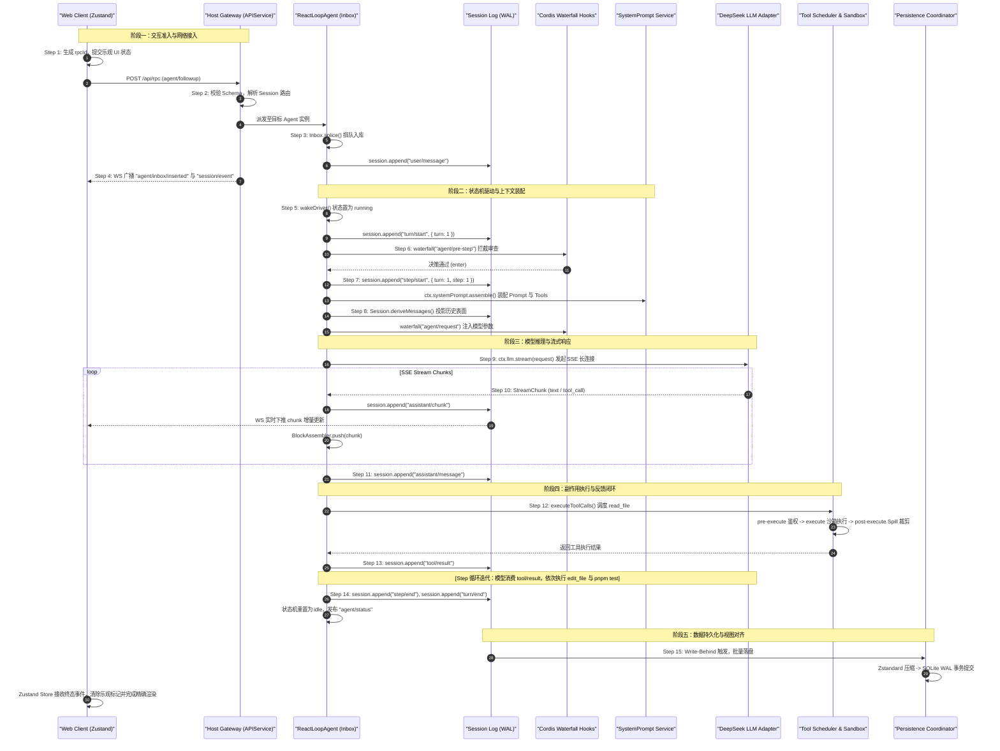

# Chapter 16: An End-to-End Trace of One Request

English | [中文](16-end-to-end-request-trace.zh.md)

In distributed systems and software engineering, tracing one concrete request through its full lifecycle is an effective way to understand a complex system. Regardless of the architecture diagram or abstraction, runtime behavior consists of deterministic **memory-state transitions, network-I/O scheduling, data-structure projections, and system calls**.

To systems engineers, LLM-driven agent systems can appear mysterious or unpredictable. DeepSeek Harness instead places **probabilistic model inference inside a deterministic control system with state machines, atomic transaction boundaries, an event-sourced ledger, and strict sandboxing of side effects**.

This chapter traces a production-style request from end to end: **a web user enters “Read `package.json`, update version validation, and run tests.”** Starting with the browser RPC call, it follows the API gateway, agent state machine, Cordis dependency injection, prompt assembly, DeepSeek streaming inference, tool scheduler, sandbox, persistence coordinator, and incremental UI rendering through **15 architectural steps**.

---

## 1. Scenario and Request Topology

### 1.1 Scenario: A Compound, Multi-Step Task

The example combines **read-only inspection, controlled write side effects, external process execution, and iteration across multiple Steps**:

> **User request**: > `读取 package.json，修改版本校验并运行测试`

The system decomposes this request into three successive execution phases:
1. **Step 1 (read-only inspection)**: The model interprets the request and calls `read_file` to inspect the current workspace's `package.json` contents and dependencies.
2. **Step 2 (state change)**: Based on that file, the model calls `edit_file` to change version-validation logic or script configuration.
3. **Step 3 (process execution and completion)**: The model calls `bash` / `pwsh` to run `pnpm test` in a restricted sandbox, captures terminal output, and produces a final user-facing summary.

### 1.2 Architecture Layers Mapped to Systems Concepts

The table maps the eight subsystems traversed by this request to concepts in systems programming and distributed systems:

| Harness subsystem | Package path | Systems-programming / distributed analogue | Responsibility and design constraint |
| :--- | :--- | :--- | :--- |
| **Client / Web UI** | `packages/client/ui-chat`<br>`packages/client/client-connection` | **GUI client / reactive frontend** | Manages optimistic updates and the local Zustand state tree; handles bidirectional RPC and WebSocket traffic. |
| **API Gateway** | `packages/api/gateway`<br>`packages/api/remotes` | **API gateway / RPC dispatcher** | Validates the wire protocol, routes sessions, authorizes requests, and forwards events in both directions. |
| **Agent Core & Inbox**| `packages/core/agent`<br>`packages/core/agent-loop` | **Actor mailbox / state-machine engine** | Maintains Turn/Step transaction boundaries, consumes queued messages, and drives the ReAct loop. |
| **Cordis Runtime** | `@deepseek-ai/cordis` | **Microkernel IoC container / event bus** | Injects services, disposes lifecycle effects (`ctx.effect`), and runs waterfall interception chains. |
| **Context & Prompt** | `packages/core/system-prompt` | **Dynamic compiler / AST template engine** | Assembles an immutable system prompt, extracts tool JSON Schema, and projects runtime context dynamically. |
| **Session Ledger** | `packages/core/session` | **Write-ahead log (WAL) / ledger** | Keeps an append-only event-sourced record and derives the model-visible surface. |
| **LLM Driver & MLA** | `packages/llm/llm`<br>`packages/llm/llm-openai` | **Probabilistic function / vector-accelerated computation** | Manages SSE transport, block parsing, KV Cache prefix hits, and token budgets. |
| **Tool Sandbox & Spill**| `packages/core/tools`<br>`packages/fs/tool-fs`<br>`packages/spill/spill-policy` | **POSIX system-call interception / overflow buffer** | Schedules bounded concurrency and exclusive barriers, prevents sandbox path escapes, and spills oversized output. |
| **Persistence Coordinator**| `packages/session/session-persistence`<br>`packages/session/session-persistence-sqlite` | **Page cache / asynchronous flush engine** | Coalesces write-behind buffers, compresses Zstandard blocks, and persists SQLite WAL transactions. |

### 1.3 Sequence Diagram of the 15-Step Request Lifecycle

The Mermaid sequence diagram shows the 15 milestones from request entry through final settlement:



---

## 2. Phase One: Interaction Admission and Network Entry (Steps 1–4)

### Step 1: Send an HTTP RPC Request with rpcId and Update the Optimistic UI

When a user presses Enter in the web input, the frontend does not merely wait for the backend. It applies an **optimistic UI** update for immediate feedback.

```
[ 用户点击发送 ]
       │
       ├── 1. 生成客户端唯一标识: rpcId = "rpc-a9f8e712-4b2c"
       ├── 2. 构造乐观用户事件: UserMessage { role: 'user', content: [{ type: 'text', text: '读取 package.json...' }] }
       ├── 3. Zustand Store 本地写入: draftMessages.push({ id: rpcId, status: 'pending', ... })
       └── 4. 网络层派发: HTTP POST /api/rpc (Typert RPC Wire Format)
```

#### Source Files and Methods
- **Source file**: [`packages/client/client-connection/src/connection.ts`](file:///d:/git/deepseek-harness/packages/client/client-connection/src/connection.ts)
- **Main method**: `Connection.callRemote<T>(endpoint: string, params: unknown, options?: CallOptions): Promise<T>`
- **Frontend state**: [`packages/client/ui-chat`](file:///d:/git/deepseek-harness/packages/client/ui-chat) calls `useSessionStore.getState().appendOptimisticUserMessage()`.

#### Example Wire Payload
The frontend sends a JSON-RPC 2.0-compatible Typert RPC request to the Host through HTTP POST:

```json
{
  "jsonrpc": "2.0",
  "id": "rpc-a9f8e712-4b2c",
  "method": "agent/followup",
  "params": {
    "sessionId": "sess-20260825-01j8m4z",
    "message": {
      "role": "user",
      "content": [
        {
          "type": "text",
          "text": "读取 package.json，修改版本校验并运行测试"
        }
      ]
    }
  }
}
```

---

### Step 2: Validate Wire Data in Host APIService and Dispatch to the Agent

The Host API gateway admits the request after three checks:
1. **Wire-data validation**: A runtime schema from `@deepseek-ai/schemastery` strictly deserializes the body and rejects unknown fields or malformed payloads.
2. **Session existence and liveness**: `ctx.agents.get(sessionId)` checks whether the target agent is alive in memory.
3. **Cold resume**: If the session exists in persistent storage but not memory, `inspectApiRemoteSession` restores its context from SQLite/JSONL and instantiates an agent.

```
                    ┌─────────────────────────┐
                    │  HTTP POST /api/rpc     │
                    └────────────┬────────────┘
                                 │
                                 ▼
                    ┌─────────────────────────┐
                    │  TypertGatewayService   │  <-- Schema 强校验 (Schemastery)
                    └────────────┬────────────┘
                                 │
                   [ 目标 Agent 是否在内存中? ]
                                 │
                   ├── 是 ───────┴──────── 否 ──────────┐
                   ▼                                    ▼
       ┌────────────────────────┐           ┌─────────────────────────┐
       │   ctx.agents.get(id)   │           │ inspectApiRemoteSession │
       │   返回活跃 Agent 实例   │           │ 从 SQLite 冷启动加载并挂载│
       └───────────┬────────────┘           └───────────┬─────────────┘
                   │                                    │
                   └─────────────────┬──────────────────┘
                                     ▼
                        ┌─────────────────────────┐
                        │   agent.followup(...)   │
                        └─────────────────────────┘
```

#### Source Files and Methods
- **Source file**: [`packages/api/gateway/src/index.ts`](file:///d:/git/deepseek-harness/packages/api/gateway/src/index.ts)
- **Main class and method**: `TypertGatewayService.invokeRemote(endpoint, params, signal)`
- **Route resolver**: [`packages/api/remotes/src/index.ts`](file:///d:/git/deepseek-harness/packages/api/remotes/src/index.ts) defines `createApiRemoteAgentResolver(ctx)`.

#### Key Implementation

```typescript
// packages/api/gateway/src/index.ts 中的核心分发逻辑片段
export class TypertGatewayService extends Service implements TypertGateway {
  async invokeRemote(request: InvokeRemoteRequest): Promise<unknown> {
    const { endpoint, params, signal } = request
    // 1. 查找注册的 RPC 绑定与编解码器
    const binding = this.resolveBinding(endpoint)
    if (!binding) {
      throw new TypertGatewayError('METHOD_NOT_FOUND', endpoint, `Endpoint ${endpoint} is not registered`)
    }

    // 2. Schemastery 运行时数据校验与解码
    const decodedParams = binding.codec.decode(params)

    // 3. 业务派发至具体的服务或 Agent
    try {
      return await binding.handler(decodedParams, { signal: signal ?? NEVER_ABORTED_SIGNAL })
    } catch (cause: unknown) {
      if (signal?.aborted) {
        throw new RemoteInvocationCancelled(endpoint, cause)
      }
      throw cause
    }
  }
}
```

---

### Step 3: Enqueue the Message in the Agent Inbox and Persist user/message

The agent follows the **actor mailbox model**. External inputs—a regular `followup`, mid-turn `steer`, or implicit `inject`—do not directly interrupt active computation. Instead, each enters the `Inbox` queue as an immutable message.

```
  followup(message)
         │
         ▼
┌───────────────────────────────────────────────────────────┐
│                    ReactLoopAgent                         │
│                                                           │
│  1. this.send(input, 'next-turn', wakeup=true)            │
│  2. this.inbox.splice('next-turn', Infinity, 0, [message])│
│                                                           │
│     ┌──────────────────────────────────────────────────┐  │
│     │               Inbox (Actor 邮箱)                 │  │
│     │  - nextTurn 队列: [ UserMessage("读取 pack...") ] │  │
│     │  - nextStep 队列: [ ... ]                        │  │
│     └──────────────────────────────────────────────────┘  │
│                                                           │
│  3. 触发事件: agent/inbox/inserted                        │
│  4. 调用: this.wakeDriver() -> 唤醒驱动状态机             │
└───────────────────────────────────────────────────────────┘
```

#### Source Files and Methods
- **Source file**: [`packages/core/agent-loop/src/inbox.ts`](file:///d:/git/deepseek-harness/packages/core/agent-loop/src/inbox.ts)
- **Main method**: `Inbox.splice(target: InboxTarget, start: number, deleteCount: number, items: UserMessage[])`
- **Driver control**: [`packages/core/agent-loop/src/agent.ts`](file:///d:/git/deepseek-harness/packages/core/agent-loop/src/agent.ts) defines `ReactLoopAgent.send()` and `ReactLoopAgent.wakeDriver()`.

#### Inbox Data Structure

```typescript
export class Inbox {
  private readonly nextTurnQueue: UserMessage[] = []
  private readonly nextStepQueue: UserMessage[] = []

  splice(target: InboxTarget, start: number, deleteCount: number, items: UserMessage[]): UserMessage[] {
    const queue = target === 'next-turn' ? this.nextTurnQueue : this.nextStepQueue
    const deleted = queue.splice(start, deleteCount, ...items)
    for (const item of items) {
      this.callbacks.inserted(item)
    }
    return deleted
  }

  claim(target: InboxTarget, turn: number): UserMessage[] {
    const queue = target === 'next-turn' ? this.nextTurnQueue : this.nextStepQueue
    const batch = queue.splice(0, queue.length)
    for (const message of batch) {
      this.callbacks.claimed(message, turn)
    }
    return batch
  }
}
```

---

### Step 4: Push an Acknowledgment Event to the Frontend over WebSocket

After the message enters the queue and emits `agent/inbox/inserted`, the Host Event Bridge immediately broadcasts an event over the full-duplex WebSocket connection.

```
[ Host Agent ] ──( 触发 Cordis 事件 )──> [ Event Bridge ] ──( WebSocket Frame )──> [ Web Client ]
                                                                                         │
                                                                                         ▼
                                                                             [ Zustand Store 对账: ]
                                                                             匹配 rpcId，将 optimistic
                                                                             状态转为 confirmed 状态
```

#### Source Files and Methods
- **Source file**: [`packages/api/remotes/src/remote-events.ts`](file:///d:/git/deepseek-harness/packages/api/remotes/src/remote-events.ts)
- **Constant**: `API_REMOTE_FORWARDED_EVENTS`, the allowlist for event forwarding.

#### Example WebSocket Downlink Payload

```json
{
  "type": "event",
  "name": "agent/inbox/inserted",
  "data": {
    "sessionId": "sess-20260825-01j8m4z",
    "message": {
      "role": "user",
      "content": [
        {
          "type": "text",
          "text": "读取 package.json，修改版本校验并运行测试"
        }
      ]
    }
  }
}
```

---

## 3. Phase Two: State-Machine Execution and Context Assembly (Steps 5–8)

### Step 5: Start a Turn in the Agent State Machine and Emit turn/start

`ReactLoopAgent` is the system's central execution engine. After `wakeDriver()`, it transitions from `idle` to `running`, sets `turn = phase.lastTurn + 1`, and appends the first lifecycle event, `turn/start`, to the session log.

```
                   ┌─────────────────────────────┐
                   │    Phase: { kind: 'idle' }  │
                   └──────────────┬──────────────┘
                                  │ wakeDriver()
                                  ▼
                   ┌─────────────────────────────┐
                   │  Phase: { kind: 'running',  │
                   │    turn: 1, step: 0,        │
                   │    abort: AbortController } │
                   └──────────────┬──────────────┘
                                  │
                                  ├── 1. 广播状态: agent/status { status: 'running' }
                                  ├── 2. 持久化事件: session.append('turn/start', { turn: 1 })
                                  └── 3. 进入 ReAct 核心循环: while (await this.turn()) {}
```

#### Source Files and Methods
- **Source file**: [`packages/core/agent-loop/src/agent.ts`](file:///d:/git/deepseek-harness/packages/core/agent-loop/src/agent.ts)
- **Main methods**: `ReactLoopAgent.wakeDriver()` and `ReactLoopAgent.turn()`

#### Algebraic State-Machine Definition
Model the agent lifecycle as a deterministic finite-state machine (FSM): $$\mathcal{M} = \langle \mathcal{S}, \Sigma, \delta, s_0, \mathcal{F} \rangle$$
- **State set $\mathcal{S}$**: $\{\text{IDLE}, \text{RUNNING}, \text{MAINTENANCE}\}$
- **Input alphabet $\Sigma$**: $\{\text{WAKE}(\text{msg}), \text{STEP\_DONE}, \text{TURN\_FINISH}, \text{ABORT}(\text{cause})\}$
- **Transition function $\delta$**: $$\delta(\text{IDLE}, \text{WAKE}) = \text{RUNNING} \quad (\text{create a new } \text{AbortController}, \text{increment } turn)$$ $$\delta(\text{RUNNING}, \text{ABORT}) = \text{IDLE} \quad (\text{invoke } signal.abort(), \text{append } turn/end\{\text{aborted}\})$$

---

### Step 6: Intercept and Rewrite with the agent/pre-step Waterfall

Before each Step, `ReactLoopAgent` claims a pending message from the Inbox (`inbox.claim('next-turn', turn)`) and emits `agent/pre-step` through the Cordis **waterfall**.

Plugins can **inspect, reject, rewrite, append a system prompt, or compact** the current Step's messages according to dependency priority. For example, `compaction-basic` checks the context watermark and prunes history here.

```
           claim() 取出 [ UserMessage ]
                       │
                       ▼
┌───────────────────────────────────────────────────────────┐
│            dispatch.waterfall('agent/pre-step')           │
│                                                           │
│   ┌───────────────────────────────────────────────────┐   │
│   │ 插件 1 (dsh-agent-instructions):                   │   │
│   │ 注入动态约束: <system-reminder>...</system-reminder>│   │
│   └─────────────────────────┬─────────────────────────┘   │
│                             ▼                             │
│   ┌───────────────────────────────────────────────────┐   │
│   │ 插件 2 (dsh-compaction-basic):                     │   │
│   │ 检测 Token 水位，必要时裁剪超长历史                 │   │
│   └─────────────────────────┬─────────────────────────┘   │
│                             ▼                             │
│   ┌───────────────────────────────────────────────────┐   │
│   │ 插件 3 (dsh-guard-policy):                        │   │
│   │ 安全合规审查: 检查是否包含越权指令                  │   │
│   └───────────────────────────────────────────────────┘   │
└──────────────────────────────┬────────────────────────────┘
                               │
               [ 返回 PreStepDecision ]
                               │
               ├── kind: 'reject' ──> 终止轮次，写入 turn/end{blocked}
               └── kind: 'enter'  ──> 进入下一步，提交 messages
```

#### Source Files and Methods
- **Source file**: [`packages/core/agent-loop/src/agent.ts`](file:///d:/git/deepseek-harness/packages/core/agent-loop/src/agent.ts) defines `ReactLoopAgent.preStep()`.
- **Runtime projection**: [`packages/core/agent-loop/src/runtime-context.ts`](file:///d:/git/deepseek-harness/packages/core/agent-loop/src/runtime-context.ts) defines `RuntimeContextProjection.project()`.

#### Decision Structure

```typescript
export type PreStepDecision =
  | { readonly kind: 'reject'; readonly reason?: string }
  | { readonly kind: 'enter'; readonly messages: readonly UserMessage[] }
```

---

### Step 7: Emit step/start and Assemble the System Prompt and Tool Schemas

Once the Step is admitted, the agent performs these atomic operations in order:
1. Append `step/start { turn: 1, step: 1 }` to the ledger.
2. Write the reviewed user message through `session.append('user/message', message, { surfaceOp: 'append' })`.
3. Call `ctx.systemPrompt.assemble()` to compile the three-part system prompt and extract active tool JSON Schema definitions from the global `ToolRegistry`.

```
              ┌─────────────────────────────────────────┐
              │  session.append('step/start')           │
              │  session.append('user/message')         │
              └────────────────────┬────────────────────┘
                                   │
                                   ▼
              ┌─────────────────────────────────────────┐
              │    ctx.systemPrompt.assemble(...)       │
              │                                         │
              │  1. 稳定前缀 (Static Prefix):            │
              │     - System Instructions               │
              │     - Model Persona & Constraints       │
              │                                         │
              │  2. 工具模式声明 (Tool Schemas):        │
              │     - read_file (JSON Schema)           │
              │     - edit_file (JSON Schema)           │
              │     - bash / pwsh (JSON Schema)         │
              │                                         │
              │  3. 动态后缀 (Dynamic Suffix):          │
              │     - Workspace Root Path               │
              │     - Current ISO Timestamp             │
              └─────────────────────────────────────────┘
```

#### Source Files and Methods
- **System-prompt source**: [`packages/core/system-prompt/src/index.ts`](file:///d:/git/deepseek-harness/packages/core/system-prompt/src/index.ts) defines `assembleSystemPrompt()`.
- **Tool-registry source**: [`packages/core/tools/src/index.ts`](file:///d:/git/deepseek-harness/packages/core/tools/src/index.ts) defines `ToolRegistry.exportSchemas()`.

---

### Step 8: Project History with Session.deriveMessages() and Build the LLM Request through agent/request

A model does not directly consume low-level events such as `turn/start`, `assistant/chunk`, or `request/header`. An **event-sourced projection** folds the append-only event ledger into a standard `Message[]` conversation list.

```
[ Session Event Log (WAL) ]
  ├── seq: 100, type: 'turn/start'          ──> (非 Surface 事件，忽略)
  ├── seq: 101, type: 'step/start'          ──> (非 Surface 事件，忽略)
  ├── seq: 102, type: 'user/message'        ──> 投影为: { role: 'user', content: '读取 package.json...' }
  ├── seq: 103, type: 'assistant/chunk'     ──> (中间流式片段，忽略)
  └── seq: 104, type: 'assistant/message'   ──> 投影为: { role: 'assistant', content: [ToolCallBlock] }
                                                           │
                                                           ▼
                                                [ Message[] 对话表面 ]
```

The `agent/request` waterfall then passes the draft through model selection (`model-selection`), which chooses a route such as `deepseek-chat` or `deepseek-reasoner` and parameters such as `temperature: 0.0` and `maxTokens: 8192`. The system records `request/header` and `request/context` and applies `deepFreeze` to the final request object.

#### Source Files and Methods
- **Surface projection**: [`packages/core/session/src/surface.ts`](file:///d:/git/deepseek-harness/packages/core/session/src/surface.ts) defines `deriveEventMessage()` and `Session.deriveMessages()`.
- **Request builder**: [`packages/core/agent-loop/src/agent.ts`](file:///d:/git/deepseek-harness/packages/core/agent-loop/src/agent.ts) defines `ReactLoopAgent.buildRequest()`.

#### Core Folding Algorithm for the Surface Projection

```typescript
// packages/core/session/src/surface.ts 投影逻辑
export function deriveEventMessage(event: SessionEvent): Message | null {
  switch (event.type) {
    case 'user/message':
      return event.data // Verbatim pass-through
    case 'assistant/message':
      // 过滤掉仅用于记录 Token 消耗的空消息
      if (event.data.message.content.length === 0) return null
      return event.data.message
    case 'tool/result':
      return createToolResultMessage(event.data.callId, event.data.result)
    default:
      return null // 忽略生命周期、chunk 及 trace 事件
  }
}
```

---

## 4. Phase Three: Model Inference and Streaming (Steps 9–11)

### Step 9: Start the SSE Stream with ctx.llm.stream()

The system passes the completed, frozen `GenerateOptions` request to `ctx.llm.stream(request)`. The LLM adapter opens an HTTP/2 TLS connection to the DeepSeek API and advertises `Accept: text/event-stream`.

```
[ ReactLoopAgent ] ──> [ LlmAdapter ] ──( HTTP/2 POST /v1/chat/completions )──> [ DeepSeek Cluster ]
                             │                                                          │
                             │ <─────── Server-Sent Events (SSE Stream) ────────────────┘
                             │
                      data: {"choices":[{"delta":{"content":"我将首先读取 package.json..."}}]}
                      data: {"choices":[{"delta":{"tool_calls":[{"function":{"name":"read_file",...}}]}}]}
                      data: [DONE]
```

#### Mathematical Background: Autoregression, Softmax, and MLA Memory

At its core, the model is a conditional-probability function: $$P(Y \mid X) = \prod_{t=1}^T P(y_t \mid X, y_{<t})$$

At each autoregressive step $t$, the final hidden-state vector $\mathbf{h}_t \in \mathbb{R}^{d_{\text{model}}}$ passes through the vocabulary projection matrix $\mathbf{W}_u \in \mathbb{R}^{V \times d_{\text{model}}}$ to produce unnormalized logits: $$\mathbf{z}_t = \mathbf{W}_u \mathbf{h}_t$$

A temperature-scaled Softmax with coefficient $\tau$ gives the output distribution: $$P(y_t = v_i \mid X, y_{<t}) = \frac{\exp(z_{t, i} / \tau)}{\sum_{j=1}^V \exp(z_{t, j} / \tau)}$$

##### KV Cache Memory with DeepSeek-V3 / R1 Multi-Head Latent Attention
Conventional multi-head attention (MHA) needs substantial KV Cache memory for long conversations. Per-token cache demand is: $$\text{Memory}_{\text{MHA}} = 2 \times n_{\text{layers}} \times n_{\text{heads}} \times d_{\text{head}} \times \text{sizeof(precision)}$$

DeepSeek uses **Multi-Head Latent Attention (MLA)** to jointly compress Key and Value into a low-rank latent vector $\mathbf{c}_t^{KV} \in \mathbb{R}^{d_c}$, alongside a decoupled RoPE positional Key $\mathbf{k}_t^R \in \mathbb{R}^{d_R}$:

$$\text{Memory}_{\text{MLA}} = (d_c + d_R) \times n_{\text{layers}} \times \text{sizeof(precision)}$$

For the stated DeepSeek-V3 configuration ($n_{\text{layers}} = 61$, $d_c = 512$, $d_R = 64$, and FP8 precision $\text{sizeof} = 1\text{ Byte}$): $$\text{Memory per Token}_{\text{MLA}} = (512 + 64) \times 61 \times 1\text{ Byte} = 35,136\text{ Bytes} \approx 34.31\text{ KB/Token}$$

Compared with the approximately $320\text{ KB/Token}$ of standard LLaMA-3-70B MHA, MLA gives **9.3-fold memory compression**, supporting a 128K context at substantially lower memory cost.

#### Source Files and Methods
- **Adapter abstraction**: [`packages/llm/llm/src/index.ts`](file:///d:/git/deepseek-harness/packages/llm/llm/src/index.ts)
- **Streaming adapter**: [`packages/llm/llm-openai/src/stream.ts`](file:///d:/git/deepseek-harness/packages/llm/llm-openai/src/stream.ts) defines `openAiStreamAdapter()`.

---

### Step 10: Parse and Persist Each assistant/chunk*

As the DeepSeek inference cluster emits SSE frames token by token, `ReactLoopAgent` consumes each frame in `for await (const chunk of stream)` as a `StreamChunk`:

```
[ SSE Data Frame ] ──> [ streamIterator ] ──> chunk: { text: "我将" }
                                                    │
                                                    ├── 1. session.append('assistant/chunk', { turn: 1, step: 1, chunk })
                                                    │      (分配全局自增序号: seq = 105)
                                                    │
                                                    ├── 2. WebSocket 广播 chunk 给前端 (UI 实时打字机渲染)
                                                    │
                                                    └── 3. assembler.push(chunk) (状态机累加器缓存)
```

#### Source Files and Methods
- **Source file**: [`packages/core/agent-loop/src/agent.ts`](file:///d:/git/deepseek-harness/packages/core/agent-loop/src/agent.ts)
- **Block assembler**: [`packages/llm/llm/src/assembler.ts`](file:///d:/git/deepseek-harness/packages/llm/llm/src/assembler.ts) defines `BlockAssembler`.

---

### Step 11: Assemble assistant/message and Record tool/call

When the model emits a finish marker (`finish_reason: "tool_calls"` or `"stop"`), streaming ends. `BlockAssembler` combines all chunks into a standard `ContentBlock[]` array.

In this example, DeepSeek emits reasoning text and a structured tool-call block:
- **Text block**: `"我将首先读取 package.json 的配置信息。"`
- **Tool-call block**: `read_file` with `{"path": "package.json"}` and unique call ID `"call_01j8m5a"`.

```
                               ┌───────────────────────────┐
                               │       BlockAssembler      │
                               └─────────────┬─────────────┘
                                             │ assembler.blocks()
                                             ▼
                               ┌───────────────────────────┐
                               │     AssistantMessage      │
                               │  - ContentBlock[0]: Text  │
                               │  - ContentBlock[1]: Tool  │
                               └─────────────┬─────────────┘
                                             │
             ┌───────────────────────────────┴───────────────────────────────┐
             ▼                                                               ▼
┌─────────────────────────────────────────┐     ┌─────────────────────────────────────────┐
│ session.append('assistant/message', {   │     │ executeToolCalls(ctx, turn, step, ...)  │
│   turn: 1, step: 1,                     │     │ 进入工具执行管线                        │
│   message,                              │     └─────────────────────────────────────────┘
│   usage: { input: 1250, output: 48 }    │
│ }, { sourceEventSeqs: [105, 106, ...] })│
└─────────────────────────────────────────┘
```

#### Source Files and Methods
- **Source file**: [`packages/core/agent-loop/src/agent.ts`](file:///d:/git/deepseek-harness/packages/core/agent-loop/src/agent.ts)
- **Tool-call preparation**: [`packages/core/agent-loop/src/tool-calls.ts`](file:///d:/git/deepseek-harness/packages/core/agent-loop/src/tool-calls.ts) defines `parseArguments()`.

---

## 5. Phase Four: Side Effects and the Feedback Loop (Steps 12–14)

### Step 12: Tool Pipeline: Pre-Execution Permission, Sandboxed Execution, and Post-Execution Spill

Tool execution is where an agent affects the external world. Harness controls it through a three-stage interception pipeline:

```
[ ToolCallBlock: read_file("package.json") ]
                     │
                     ▼
┌─────────────────────────────────────────────────────────────┐
│ 1. pre-execute (前置拦截 & 权限准入)                         │
│    - FsSandboxController: 校验路径是否逃逸工作区根目录      │
│    - UserApproval: 检查是否需要人工确认授权                  │
└────────────────────┬────────────────────────────────────────┘
                     │
                     ▼
┌─────────────────────────────────────────────────────────────┐
│ 2. execute (受限沙箱执行)                                    │
│    - ctx.fs.readFile("package.json", "utf-8")               │
│    - 读取文件原始数据 (5,420 字节)                           │
└────────────────────┬────────────────────────────────────────┘
                     │
                     ▼
┌─────────────────────────────────────────────────────────────┐
│ 3. post-execute (后置处理 & Spill 溢出截断)                  │
│    - spill-policy: 检查内容大小是否超过 maxInlineBytes (4KB)│
│    - 若超限: 完整内容保存至 ctx.spillStore，返回 Head/Tail  │
│    - 若未超限: 返回完整文本                                 │
└────────────────────┬────────────────────────────────────────┘
                     │
                     ▼
             [ 最终 ToolExecutionResult ]
```

#### Concurrency: Bounded Rolling Pool and Exclusive Barrier
Harness combines two scheduling modes when the model requests several tools at once:
- **`parallel` mode** (for read-only tools such as `read_file` and `glob`): Runs within a rolling pool of capacity `maxParallelToolCalls` (default 8).
- **`exclusive` mode** (for mutating tools such as `edit_file` and terminal commands such as `bash`): Establishes an **execution barrier**. It waits for all in-flight parallel work to drain and then runs alone.

```
模型输出工具调用序列: [ read(A), read(B), edit(C), read(D) ]

时间轴:
T1: [ 并发池: read(A) 与 read(B) 同时启动 ] ──> 完成
                                               │
T2: [ Exclusive 屏障生效: 独占执行 edit(C) ] ──> 完成
                                               │
T3: [ 并发池重新开启: 执行 read(D) ] ─────────> 完成
```

#### Source Files and Methods
- **Tool scheduler**: [`packages/core/agent-loop/src/tool-calls.ts`](file:///d:/git/deepseek-harness/packages/core/agent-loop/src/tool-calls.ts) defines `runGroup()` and `executeToolCalls()`.
- **Filesystem tool**: [`packages/fs/tool-fs/src/read.ts`](file:///d:/git/deepseek-harness/packages/fs/tool-fs/src/read.ts) defines `applyReadTool()`.
- **Spill policy**: [`packages/spill/spill-policy/src/index.ts`](file:///d:/git/deepseek-harness/packages/spill/spill-policy/src/index.ts)

---

### Step 13: Record tool/result and Feed It Back to the Model

After a tool completes, the scheduler calls `appendToolResult` to append `tool/result` and records the related `tool/call` sequence number in `sourceEventSeqs: [callSeq]`.

Because this Turn produced a tool result, `turnEnds` remains `null` and the driver loop iterates. `Session.deriveMessages()` now projects history containing the new `assistant/message` and `tool/result` and builds a fresh LLM request for Steps 2 and 3.

```
                                [ 本次请求的 3 步迭代流转全景 ]

   Step 1 (探测):
     模型输出: read_file("package.json")
     工具执行: 返回 package.json 内容 (含 "version": "1.0.0", "scripts": { "test": "vitest" })
     写入事件: tool/result (call_01j8m5a)
          │
          ▼
   Step 2 (修改):
     历史投影: 包含 Step 1 的文件内容
     模型输出: edit_file("package.json", diff: 修改版本校验规则)
     工具执行: fs.writeFile 原子覆写文件
     写入事件: tool/result (call_01j8m5b)
          │
          ▼
   Step 3 (验证与终态总结):
     历史投影: 包含修改成功确认
     模型输出: bash("pnpm test")
     工具执行: 产生终端输出 "Tests: 12 passed, 12 total"
     写入事件: tool/result (call_01j8m5c)
          │
          ▼
     模型最终响应: "已成功读取 package.json，更新了版本校验逻辑，并通过了全部 12 项单元测试！"
```

#### Source Files and Methods
- **Source file**: [`packages/core/agent-loop/src/tool-calls.ts`](file:///d:/git/deepseek-harness/packages/core/agent-loop/src/tool-calls.ts) defines `appendToolResult()`.

---

### Step 14: Emit the Final Answer and Record step/end and turn/end

After the model receives the successful Step 3 `tool/result`, it generates one final text response. `BlockAssembler` finds no `ToolCallBlock` in that message and marks the Turn complete (`finish.kind === 'completed'`).

`ReactLoopAgent` then closes the Turn in order:
1. Append `step/end { turn: 1, step: 3 }`.
2. Run the serialized `agent/turn-stopping` checkpoint hook.
3. Append `turn/end { turn: 1, reason: { kind: 'completed' } }`.
4. Return the state machine to `idle` and notify observers through `this.dispatch.emit('agent/status', { status: 'idle' })`.

```typescript
// packages/core/agent-loop/src/agent.ts 中的轮次终态结算
private async turn(): Promise<boolean> {
  // ... 执行 steps 循环 ...
  try {
    // 正常收尾
  } finally {
    this.session.append('turn/end', { turn, reason: turnEnds! })
  }
  if (!this.inbox.hasPending) return false // 邮箱为空，结束 ReAct 循环
  return true // 若有积压消息，继续开启下一轮
}
```

---

## 6. Phase Five: Persistence and Frontend View Alignment (Step 15)

### Step 15: Flush the Persistence Coordinator and Update the Frontend Zustand View

#### 6.1 Backend Asynchronous Flush (Write-Behind Engine)

With high-frequency interactions and streaming, calling `session.append()` with a synchronous `fsync` on every event would greatly reduce throughput. Harness uses a **`SessionWriteBehind` buffer controller**:

```
[ session.append(event) ]
            │
            ▼
┌─────────────────────────────────────────────────────────────┐
│                  SessionWriteBehind 队列                     │
│  - pending: [ Event_101, Event_102, ..., Event_150 ]        │
│  - 启动定时器: setTimeout(onDeadline, maxDelayMs = 200ms)    │
└─────────────────────────────┬───────────────────────────────┘
                              │ 定时器到期 或 显式调用 flush()
                              ▼
┌─────────────────────────────────────────────────────────────┐
│                 Persistence Coordinator                     │
│                                                             │
│  1. Zstandard 压缩: 块压缩率约 75%                          │
│  2. SQLite 事务提交 (WAL 模式):                             │
│     BEGIN IMMEDIATE TRANSACTION;                            │
│     INSERT INTO session_events (session_id, seq, payload)   │
│     VALUES (?, ?, ?), (?, ?, ?), ...;                       │
│     COMMIT;                                                 │
└─────────────────────────────────────────────────────────────┘
```

##### Throughput Model: Synchronous fsync versus Batched Write-Behind
Suppose one disk `fsync` takes $T_{\text{fsync}} \approx 5\text{ ms}$ and a Turn emits 100 chunks or events:
- **Synchronous cost**: $T_{\text{sync}} = 100 \times 5\text{ ms} = 500\text{ ms}$, blocking the computation thread.
- **Batched write-behind cost**: With a $T_{\text{batch}} = 200\text{ ms}$ window, 100 events enter one transaction: $$T_{\text{async}} = T_{\text{batch}} + 1 \times T_{\text{fsync}} = 205\text{ ms}$$ Disk I/O operations fall from 100 to one, a stated **nearly 100-fold improvement in I/O efficiency**.

#### 6.2 Frontend Zustand Updates with Selective Re-rendering

After receiving the final `turn/end` and `agent/status { status: 'idle' }`, the frontend's Zustand store uses an immutable Immer update to mark the current session slice complete:
- Remove the initial optimistic message placeholder.
- Align the real global sequence number (`seq`) with the backend ledger.
- Use React 19 selectors to re-render only affected message components for a high-frame-rate UI without flicker.

#### Source Files and Methods
- **Write buffer**: [`packages/session/session-persistence-jsonl`](file:///d:/git/deepseek-harness/packages/session/session-persistence-jsonl) defines `SessionWriteBehind.enqueue()` and `flush()`.
- **Persistence coordinator**: [`packages/session/session-persistence-jsonl`](file:///d:/git/deepseek-harness/packages/session/session-persistence-jsonl)
- **SQLite store**: [`packages/session/session-persistence-sqlite/src/store.ts`](file:///d:/git/deepseek-harness/packages/session/session-persistence-sqlite/src/store.ts)

---

## 7. Production Failures and Defenses

In a complex full-duplex request path, network disruptions, concurrency races, and resource exhaustion can all threaten stability. These four scenarios illustrate failures on this path and the corresponding system-level defenses:

### Failure 1: A Network Disconnect Leaves Tool Work Running and Files Partially Written

#### Symptom
The user closes the tab or loses connectivity during Step 2 (`edit_file`) or Step 3 (`pnpm test`). If cancellation does not propagate fully, the underlying Node.js process continues writing files or consuming compute, leaving **orphan processes and uncontrolled state changes**.

#### Root Cause and Code-Level Defense
`ReactLoopAgent` creates a top-level `AbortController` when a Turn starts. When the gateway detects an RPC/WebSocket disconnect, it propagates `agent.cancel({ kind: 'client-disconnect' })` upstream.

Harness cascades **AbortSignal propagation** through every abstraction layer:

```typescript
// 生产级级联取消防御实现
async function runWithStrictCancellation<T>(
  parentSignal: AbortSignal,
  task: (signal: AbortSignal) => Promise<T>,
): Promise<T> {
  // 检查是否已经取消
  parentSignal.throwIfAborted()

  const controller = new AbortController()
  const onParentAbort = () => controller.abort(parentSignal.reason)
  parentSignal.addEventListener('abort', onParentAbort, { once: true })

  try {
    return await task(controller.signal)
  } finally {
    parentSignal.removeEventListener('abort', onParentAbort)
  }
}
```

---

### Failure 2: Parallel Tools Race and Overwrite a File

#### Symptom
If one Step requests both a modification to `package.json` and a static check of that file, concurrent execution can race, corrupt the file, or read inconsistent data.

#### Root Cause and Remedy
In [`packages/core/agent-loop/src/tool-calls.ts`](file:///d:/git/deepseek-harness/packages/core/agent-loop/src/tool-calls.ts), the `runGroup` scheduler must reassess `executionMode` before each tool starts:

```typescript
// 动态重分类与独占屏障排空机制
while (next < planned.length) {
  const first = planned[next]!
  // 每次启动前重新计算执行模式，防范动态注册变更
  const mode = ctx.tools.executionMode(first.exec).kind
  const group = mode === 'parallel' ? planned.slice(next) : [first]

  const outcome = await runGroup(ctx, turn, step, group, mode, signal, acceptContext)
  next += outcome.consumed
  // 独占任务必须等待前置并发池完全清空 (Drain)
}
```

---

### Failure 3: Large Tool Output Overfills the KV Cache and Breaks Context

#### Symptom
If `pnpm test` fails in Step 3 and prints tens of thousands of stack-trace lines (for example, a 5 MB log), sending the full result to the model can exceed DeepSeek's 128K-token context window and fail the request.

#### Root Cause and Remedy
The `spill-policy` plugin enforces truncation at the `tools/post-execute` waterfall stage:

```typescript
// packages/spill/spill-policy/src/index.ts 核心截断逻辑
if (Buffer.byteLength(rawText, 'utf8') > config.maxInlineBytes) {
  // 1. 将全量数据持久化至 SpillStore 磁盘文件
  const spillRef = await ctx.spillStore.saveText({
    owner: session.id,
    suggestedName: 'test-output.log',
    content: rawText,
  })

  // 2. 构造头尾保留 (Head-Tail) 预览文本
  const { text: previewText, omitted } = preview(rawText, config.maxInlineBytes)

  // 3. 替换模型可见的返回内容，附带检索指引
  return {
    kind: 'replace-content',
    content: [
      {
        type: 'text',
        text: `${previewText}\n\n[NOTICE: Output truncated. Omitted ${omitted.bytes} bytes. Full output saved at ${spillRef.locator}]`,
      },
    ],
  }
}
```

---

### Failure 4: Out-of-Order WebSocket Frames Desynchronize Frontend State

#### Symptom
Under network disruption or heavy concurrent pushes, WebSocket frames may appear out of order at the frontend—for example, `turn/end` before the final `assistant/chunk`—causing missing text or a stuck UI.

#### Root Cause and Reconciliation
Every Harness `SessionEvent` carries a **strictly increasing global `seq`**. The frontend state machine uses a continuity-check buffer:

```typescript
// 前端乱序重排与空洞检测逻辑 (Sequence Buffer)
interface EventReconcilerState {
  lastAppliedSeq: number
  buffer: Map<number, SessionEvent>
}

function applyEventWithReorder(state: EventReconcilerState, incomingEvent: SessionEvent): void {
  if (incomingEvent.seq <= state.lastAppliedSeq) {
    return // 忽略重复或过期数据包
  }

  state.buffer.set(incomingEvent.seq, incomingEvent)

  // 连续应用单调递增事件链
  while (state.buffer.has(state.lastAppliedSeq + 1)) {
    const nextSeq = state.lastAppliedSeq + 1
    const eventToApply = state.buffer.get(nextSeq)!
    state.buffer.delete(nextSeq)

    applyEventToZustandStore(eventToApply)
    state.lastAppliedSeq = nextSeq
  }
}
```

---

## 8. Quick Reference: Technical Details of the 15 Steps

For development, debugging, and architecture review, this table lists the main operation and source location of each Step:

| Step | Phase | Operation and protocol | Source file | Main function / method |
| :--- | :--- | :--- | :--- | :--- |
| **Step 1** | Network entry | Client creates `rpcId` and updates the optimistic UI | `packages/client/client-connection/src/connection.ts` | `Connection.callRemote()` |
| **Step 2** | Gateway dispatch | Validates the wire protocol and routes the session | `packages/api/gateway/src/index.ts` | `TypertGatewayService.invokeRemote()` |
| **Step 3** | Inbox enqueue | Pushes the message into the Inbox | `packages/core/agent-loop/src/inbox.ts` | `Inbox.splice()` |
| **Step 4** | Event broadcast | Pushes an enqueue acknowledgment over WebSocket | `packages/api/remotes/src/remote-events.ts` | `API_REMOTE_FORWARDED_EVENTS` |
| **Step 5** | State-machine activation | Starts the Turn and appends `turn/start` | `packages/core/agent-loop/src/agent.ts` | `ReactLoopAgent.wakeDriver()` |
| **Step 6** | Pre-Step interception | Reviews through the `agent/pre-step` waterfall | `packages/core/agent-loop/src/agent.ts` | `ReactLoopAgent.preStep()` |
| **Step 7** | Prompt assembly | Appends `step/start` and assembles prompts and schemas | `packages/core/system-prompt/src/index.ts` | `assembleSystemPrompt()` |
| **Step 8** | History projection | Folds the event ledger into an immutable request | `packages/core/session/src/surface.ts` | `Session.deriveMessages()` |
| **Step 9** | Model call | Opens an SSE connection and runs MLA inference | `packages/llm/llm-openai/src/stream.ts` | `openAiStreamAdapter()` |
| **Step 10**| Stream consumption | Parses each chunk and appends it to the ledger | `packages/llm/llm/src/assembler.ts` | `BlockAssembler.push()` |
| **Step 11**| Message assembly | Builds `assistant/message` and parses a ToolCall | `packages/core/agent-loop/src/tool-calls.ts` | `parseArguments()` |
| **Step 12**| Tool sandbox | Authorizes, runs in the sandbox, and controls spill | `packages/core/agent-loop/src/tool-calls.ts` | `executeToolCalls()` |
| **Step 13**| Result feedback | Appends `tool/result` and resumes iteration | `packages/core/agent-loop/src/tool-calls.ts` | `appendToolResult()` |
| **Step 14**| Turn settlement | Emits the final answer, appends `turn/end`, and returns to idle | `packages/core/agent-loop/src/agent.ts` | `ReactLoopAgent.turn()` |
| **Step 15**| Asynchronous persistence | Flushes write-behind, Zstd compression, and SQLite WAL | `packages/session/session-persistence-jsonl` | `SessionWriteBehind.flush()` |

---

## 9. Chapter Summary

Using a concrete request to read a file, edit configuration, and run tests, this chapter traced the complete DeepSeek Harness request path.

An effective **agent harness is not merely a wrapper around an LLM API; it is an engineered runtime system**:
1. **Control flow separated from data flow**: Real-time `agent/*` control events drive the state machine and low-latency responses. The durable `session/*` fact stream supports lossless replay and auditing through an append-only event ledger.
2. **Deterministic control around probabilistic inference**: Cordis waterfall hooks, JSON Schema validation, a bounded rolling concurrency pool, and sandbox path isolation constrain model-generated actions.
3. **Systems-level performance**: DeepSeek MLA reduces cache memory; backend write-behind batches disk writes; frontend Zustand selectively renders with increasing `seq`. Together, these choices aim for performance and reliability.

The next chapters examine Harness extension mechanisms, concurrency security boundaries, and production availability.
