# 第 16 章：一次请求的端到端近景

[English](16-end-to-end-request-trace.md) | 中文

在分布式系统与现代软件工程中，理解一个复杂系统的终极途径就是追踪一个具体请求的完整生命周期。无论架构图绘制得多么精妙、概念抽象得多么宏大，系统运行时的本质始终是一连串确定性的**内存状态转移、网络 I/O 调度、数据结构投影与系统调用**。

对于传统的系统工程师而言，大语言模型（LLM）驱动的智能体系统（Agent System）常被笼罩在“玄学”与“不确定性”的迷雾中。然而，在工业级智能体运行时 **DeepSeek Harness** 的设计哲学中，**不确定的大模型推理被严格封装在具备确定性状态机、原子事务边界、事件溯源账本（Event Sourcing）以及严格副作用沙箱的控制骨架之内**。

本章将以显微镜般的精细度，端到端完整解剖一次真实的生产级复杂请求——**Web 用户在交互界面输入：“读取 `package.json`，修改版本校验并运行测试”**。我们将从浏览器发起 RPC 请求开始，贯穿 API Gateway、Agent 驱动状态机、Cordis 依赖注入容器、提示词装配引擎、DeepSeek 流式推理、工具并发调度器、沙箱安全隔离、持久化协调器，直到最终响应落盘并增量渲染到前端 UI，完整走完 **15 个标准架构步骤**。

---

## 1. 业务场景设定与全景调用拓扑

### 1.1 业务场景：一个典型的复合多步任务

我们选择的追踪案例具备高度的代表性，它同时涵盖了**只读探测、写副作用控制、外部系统进程调用以及多轮 Step 迭代**：

> **用户指令**： > `读取 package.json，修改版本校验并运行测试`

该指令在系统内部将被分解为三个连续的执行阶段（Steps）：
1. **Step 1（只读探测）**：模型分析意图，决定调用 `read_file` 工具读取当前工作区 `package.json` 的内容与依赖结构。
2. **Step 2（状态变更）**：模型根据文件内容，决定调用 `edit_file` 工具修改其中的版本校验逻辑或脚本配置。
3. **Step 3（进程执行与终态收敛）**：模型调用 `bash` / `pwsh` 工具在受限沙箱中运行 `pnpm test`，捕获终端输出并生成最终面向用户的自然语言总结。

### 1.2 架构分层映射：系统编程概念对照

为了建立坚实的工程直觉，我们将本次请求流经的 8 大核心子系统映射为传统系统编程与分布式系统的核心概念：

| Harness 子系统 | 对应包路径 | 传统系统编程 / 分布式架构映射 | 核心职责与设计约束 |
| :--- | :--- | :--- | :--- |
| **Client / Web UI** | `packages/web/web-app`<br>`packages/client/client-connection` | **GUI 客户端 / 响应式前端** | 管理乐观更新、维护本地 Zustand 状态树、处理双向 RPC 与 WebSocket |
| **API Gateway** | `packages/api/gateway`<br>`packages/api/remotes` | **API 网关 / RPC Dispatcher** | 校验 Wire 协议、解析 Session 路由、鉴权与双向事件转发 |
| **Agent Core & Inbox**| `packages/core/agent`<br>`packages/core/agent-loop` | **Actor 邮箱 / 状态机引擎** | 维护 Turn/Step 事务边界、消费队列消息、驱动 ReAct 死循环 |
| **Cordis Runtime** | `@deepseek-ai/cordis` | **微内核 IoC 容器 / 事件总线** | 服务依赖注入、生命周期析构（`ctx.effect`）、Waterfall 拦截链 |
| **Context & Prompt** | `packages/context/system-prompt` | **动态编译器 / AST 模板引擎** | 组装不可变系统提示词、提取工具 JSON Schema、动态投影运行时上下文 |
| **Session Ledger** | `packages/core/session` | **Write-Ahead Log (WAL) / 账本** | 纯追加（Append-Only）事件溯源存储，派生模型可见表面（Surface） |
| **LLM Driver & MLA** | `packages/llm/llm`<br>`packages/llm/llm-openai` | **概率纯函数 / 向量加速计算** | 管理 SSE 流式传输、Block 解析、KV Cache 前缀命中与 Token 预算 |
| **Tool Sandbox & Spill**| `packages/core/tools`<br>`packages/fs/tool-fs`<br>`packages/spill/spill-policy` | **POSIX 系统调用拦截 / 溢出缓冲** | 有界并发调度、Exclusive 互斥屏障、沙箱路径越界防御、超长输出 Spill |
| **Persistence Coordinator**| `packages/session/session-persistence`<br>`packages/session/session-persistence-sqlite` | **Page Cache / 异步刷盘引擎** | Write-Behind 缓冲合并、Zstandard 块压缩、SQLite WAL 事务持久化 |

### 1.3 15 步端到端生命周期全景时序图

以下 Mermaid 时序图完整展示了一次请求从触发到最终结算的 15 个关键节点：

```mermaid
sequenceDiagram
  autonumber
  participant Client as "Web Client (Zustand)"
  participant Gateway as "Host Gateway (APIService)"
  participant Agent as "ReactLoopAgent (Inbox)"
  participant Session as "Session Log (WAL)"
  participant Hooks as "Cordis Waterfall Hooks"
  participant Prompt as "SystemPrompt Service"
  participant LLM as "DeepSeek LLM Adapter"
  participant Tools as "Tool Scheduler & Sandbox"
  participant Persistence as "Persistence Coordinator"

  Note over Client,Gateway: 阶段一：交互准入与网络接入
  Client->>Client: Step 1: 生成 rpcId，提交乐观 UI 状态
  Client->>Gateway: POST /api/rpc (agent/followup)
  Gateway->>Gateway: Step 2: 校验 Schema，解析 Session 路由
  Gateway->>Agent: 派发至目标 Agent 实例
  Agent->>Agent: Step 3: Inbox.splice() 排队入库
  Agent->>Session: session.append("user/message")
  Gateway-->>Client: Step 4: WS 广播 "agent/inbox/inserted" 与 "session/event"

  Note over Agent,Prompt: 阶段二：状态机驱动与上下文装配
  Agent->>Agent: Step 5: wakeDriver() 状态置为 running
  Agent->>Session: session.append("turn/start", { turn: 1 })
  Agent->>Hooks: Step 6: waterfall("agent/pre-step") 拦截审查
  Hooks-->>Agent: 决策通过 (enter)
  Agent->>Session: Step 7: session.append("step/start", { turn: 1, step: 1 })
  Agent->>Prompt: ctx.systemPrompt.assemble() 装配 Prompt 与 Tools
  Agent->>Session: Step 8: Session.deriveMessages() 投影历史表面
  Agent->>Hooks: waterfall("agent/request") 注入模型参数

  Note over Agent,LLM: 阶段三：模型推理与流式响应
  Agent->>LLM: Step 9: ctx.llm.stream(request) 发起 SSE 长连接
  loop SSE Stream Chunks
    LLM-->>Agent: Step 10: StreamChunk (text / tool_call)
    Agent->>Session: session.append("assistant/chunk")
    Session-->>Client: WS 实时下推 chunk 增量更新
    Agent->>Agent: BlockAssembler.push(chunk)
  end
  Agent->>Session: Step 11: session.append("assistant/message")

  Note over Agent,Tools: 阶段四：副作用执行与反馈闭环
  Agent->>Tools: Step 12: executeToolCalls() 调度 read_file
  Tools->>Tools: pre-execute 鉴权 -> execute 沙箱执行 -> post-execute Spill 裁剪
  Tools-->>Agent: 返回工具执行结果
  Agent->>Session: Step 13: session.append("tool/result")
  Note over Agent,LLM: [Step 循环迭代：模型消费 tool/result，依次执行 edit_file 与 pnpm test]
  Agent->>Session: Step 14: session.append("step/end"), session.append("turn/end")
  Agent->>Agent: 状态机重置为 idle，发布 "agent/status"

  Note over Session,Persistence: 阶段五：数据持久化与视图对齐
  Session->>Persistence: Step 15: Write-Behind 触发，批量落盘
  Persistence->>Persistence: Zstandard 压缩 -> SQLite WAL 事务提交
  Client->>Client: Zustand Store 接收终态事件，清除乐观标记并完成精确渲染
```



---

## 2. 阶段一：交互准入与网络接入 (Steps 1–4)

### Step 1: 前端发起带 rpcId 的 HTTP RPC 请求并更新乐观 UI

当用户在 Web 界面的输入框中按下回车时，前端并非简单地等待后端返回，而是遵循**乐观 UI（Optimistic UI）**设计范式，以实现零延迟的交互反馈。

```
[ 用户点击发送 ]
       │
       ├── 1. 生成客户端唯一标识: rpcId = "rpc-a9f8e712-4b2c"
       ├── 2. 构造乐观用户事件: UserMessage { role: 'user', content: [{ type: 'text', text: '读取 package.json...' }] }
       ├── 3. Zustand Store 本地写入: draftMessages.push({ id: rpcId, status: 'pending', ... })
       └── 4. 网络层派发: HTTP POST /api/rpc (Typert RPC Wire Format)
```

#### 源码文件与类方法
- **源码文件**：[`packages/client/client-connection/src/connection.ts`](file:///d:/git/deepseek-harness/packages/client/client-connection/src/connection.ts)
- **核心方法**：`Connection.callRemote<T>(endpoint: string, params: unknown, options?: CallOptions): Promise<T>`
- **前端状态管理**：[`packages/web/web-app/src/stores/session-store.ts`](file:///d:/git/deepseek-harness/packages/web/web-app/src/stores/session-store.ts) 中的 `useSessionStore.getState().appendOptimisticUserMessage()`

#### 网络报文样例 (Wire Payload)
前端通过 HTTP POST 向 Host 发起 JSON-RPC 2.0 兼容的 Typert RPC 请求：

```json
{
  "jsonrpc": "2.0",
  "id": "rpc-a9f8e712-4b2c",
  "method": "agent/followup",
  "params": {
    "sessionId": "sess-20260825-01j8m4z",
    "message": {
      "role": "user",
      "content": [
        {
          "type": "text",
          "text": "读取 package.json，修改版本校验并运行测试"
        }
      ]
    }
  }
}
```

---

### Step 2: Host APIService 校验 wire 数据并分发给目标 Agent

Host 进程中的 API Gateway 充当请求准入控制器。它必须在微秒级完成三项核心检查：
1. **Wire 结构强校验**：基于 `@deepseek-ai/schemastery` 定义的运行时类型 Schema，对请求体进行严格反序列化与字段防御，拒绝未知字段与畸形载荷。
2. **Session 存在性与活跃性探测**：通过 `ctx.agents.get(sessionId)` 检查目标 Agent 是否已在内存中存活。
3. **冷启动恢复（Cold Resume）**：若会话不在内存中但存在于持久化存储，则调用 `inspectApiRemoteSession` 从 SQLite/JSONL 恢复会话上下文并实例化 Agent。

```
                    ┌─────────────────────────┐
                    │  HTTP POST /api/rpc     │
                    └────────────┬────────────┘
                                 │
                                 ▼
                    ┌─────────────────────────┐
                    │  TypertGatewayService   │  <-- Schema 强校验 (Schemastery)
                    └────────────┬────────────┘
                                 │
                   [ 目标 Agent 是否在内存中? ]
                                 │
                   ├── 是 ───────┴──────── 否 ──────────┐
                   ▼                                    ▼
       ┌────────────────────────┐           ┌─────────────────────────┐
       │   ctx.agents.get(id)   │           │ inspectApiRemoteSession │
       │   返回活跃 Agent 实例   │           │ 从 SQLite 冷启动加载并挂载│
       └───────────┬────────────┘           └───────────┬─────────────┘
                   │                                    │
                   └─────────────────┬──────────────────┘
                                     ▼
                        ┌─────────────────────────┐
                        │   agent.followup(...)   │
                        └─────────────────────────┘
```

#### 源码文件与类方法
- **源码文件**：[`packages/api/gateway/src/index.ts`](file:///d:/git/deepseek-harness/packages/api/gateway/src/index.ts)
- **核心类与方法**：`TypertGatewayService.invokeRemote(endpoint, params, signal)`
- **路由解析文件**：[`packages/api/remotes/src/agent-lookup.ts`](file:///d:/git/deepseek-harness/packages/api/remotes/src/agent-lookup.ts) 中的 `createApiRemoteAgentResolver(ctx)`

#### 关键实现代码解析

```typescript
// packages/api/gateway/src/index.ts 中的核心分发逻辑片段
export class TypertGatewayService extends Service implements TypertGateway {
  async invokeRemote(request: InvokeRemoteRequest): Promise<unknown> {
    const { endpoint, params, signal } = request
    // 1. 查找注册的 RPC 绑定与编解码器
    const binding = this.resolveBinding(endpoint)
    if (!binding) {
      throw new TypertGatewayError('METHOD_NOT_FOUND', endpoint, `Endpoint ${endpoint} is not registered`)
    }

    // 2. Schemastery 运行时数据校验与解码
    const decodedParams = binding.codec.decode(params)

    // 3. 业务派发至具体的服务或 Agent
    try {
      return await binding.handler(decodedParams, { signal: signal ?? NEVER_ABORTED_SIGNAL })
    } catch (cause: unknown) {
      if (signal?.aborted) {
        throw new RemoteInvocationCancelled(endpoint, cause)
      }
      throw cause
    }
  }
}
```

---

### Step 3: 消息推入 Agent Inbox 并持久化 user/message

Agent 的设计遵循 **Actor 邮箱模型**。所有外部输入（用户的常规提问 `followup`、中途打断引导 `steer`、隐式上下文注入 `inject`）均不会直接打断正在运行的计算，而是作为不可变消息推入 `Inbox` 队列。

```
  followup(message)
         │
         ▼
┌───────────────────────────────────────────────────────────┐
│                    ReactLoopAgent                         │
│                                                           │
│  1. this.send(input, 'next-turn', wakeup=true)            │
│  2. this.inbox.splice('next-turn', Infinity, 0, [message])│
│                                                           │
│     ┌──────────────────────────────────────────────────┐  │
│     │               Inbox (Actor 邮箱)                 │  │
│     │  - nextTurn 队列: [ UserMessage("读取 pack...") ] │  │
│     │  - nextStep 队列: [ ... ]                        │  │
│     └──────────────────────────────────────────────────┘  │
│                                                           │
│  3. 触发事件: agent/inbox/inserted                        │
│  4. 调用: this.wakeDriver() -> 唤醒驱动状态机             │
└───────────────────────────────────────────────────────────┘
```

#### 源码文件与类方法
- **源码文件**：[`packages/core/agent/src/inbox.ts`](file:///d:/git/deepseek-harness/packages/core/agent/src/inbox.ts)
- **核心方法**：`Inbox.splice(target: InboxTarget, start: number, deleteCount: number, items: UserMessage[])`
- **驱动控制文件**：[`packages/core/agent-loop/src/agent.ts`](file:///d:/git/deepseek-harness/packages/core/agent-loop/src/agent.ts) 中的 `ReactLoopAgent.send()` 与 `ReactLoopAgent.wakeDriver()`

#### 数据结构：Inbox 内存布局

```typescript
export class Inbox {
  private readonly nextTurnQueue: UserMessage[] = []
  private readonly nextStepQueue: UserMessage[] = []

  splice(target: InboxTarget, start: number, deleteCount: number, items: UserMessage[]): UserMessage[] {
    const queue = target === 'next-turn' ? this.nextTurnQueue : this.nextStepQueue
    const deleted = queue.splice(start, deleteCount, ...items)
    for (const item of items) {
      this.callbacks.inserted(item)
    }
    return deleted
  }

  claim(target: InboxTarget, turn: number): UserMessage[] {
    const queue = target === 'next-turn' ? this.nextTurnQueue : this.nextStepQueue
    const batch = queue.splice(0, queue.length)
    for (const message of batch) {
      this.callbacks.claimed(message, turn)
    }
    return batch
  }
}
```

---

### Step 4: WebSocket 向前端推送确认事件

当消息成功入队并触发 `agent/inbox/inserted` 事件后，Host 的 Event Bridge 会立即通过双向全双工 WebSocket 连接向客户端推送事件广播。

```
[ Host Agent ] ──( 触发 Cordis 事件 )──> [ Event Bridge ] ──( WebSocket Frame )──> [ Web Client ]
                                                                                         │
                                                                                         ▼
                                                                             [ Zustand Store 对账: ]
                                                                             匹配 rpcId，将 optimistic
                                                                             状态转为 confirmed 状态
```

#### 源码文件与类方法
- **源码文件**：[`packages/api/remotes/src/remote-events.ts`](file:///d:/git/deepseek-harness/packages/api/remotes/src/remote-events.ts)
- **常量配置**：`API_REMOTE_FORWARDED_EVENTS`（白名单事件路由表）

#### WebSocket 下行报文样例

```json
{
  "type": "event",
  "name": "agent/inbox/inserted",
  "data": {
    "sessionId": "sess-20260825-01j8m4z",
    "message": {
      "role": "user",
      "content": [
        {
          "type": "text",
          "text": "读取 package.json，修改版本校验并运行测试"
        }
      ]
    }
  }
}
```

---

## 3. 阶段二：状态机驱动与上下文装配 (Steps 5–8)

### Step 5: Agent 状态机启动 Turn 并发射 turn/start

`ReactLoopAgent` 是整个系统的中枢引擎。在收到 `wakeDriver()` 信号后，它将内部状态机从 `idle` 切换至 `running`，生成新的轮次编号 `turn = phase.lastTurn + 1`，并向事实账本（Session Log）追加第一条生命周期事件：`turn/start`。

```
                   ┌─────────────────────────────┐
                   │    Phase: { kind: 'idle' }  │
                   └──────────────┬──────────────┘
                                  │ wakeDriver()
                                  ▼
                   ┌─────────────────────────────┐
                   │  Phase: { kind: 'running',  │
                   │    turn: 1, step: 0,        │
                   │    abort: AbortController } │
                   └──────────────┬──────────────┘
                                  │
                                  ├── 1. 广播状态: agent/status { status: 'running' }
                                  ├── 2. 持久化事件: session.append('turn/start', { turn: 1 })
                                  └── 3. 进入 ReAct 核心循环: while (await this.turn()) {}
```

#### 源码文件与类方法
- **源码文件**：[`packages/core/agent-loop/src/agent.ts`](file:///d:/git/deepseek-harness/packages/core/agent-loop/src/agent.ts)
- **核心方法**：`ReactLoopAgent.wakeDriver()`、`ReactLoopAgent.turn()`

#### 状态转移数学代数定义
我们将 Agent 的生命周期建模为一个确定的有限状态机（FSM）： $$\mathcal{M} = \langle \mathcal{S}, \Sigma, \delta, s_0, \mathcal{F} \rangle$$
- **状态集合 $\mathcal{S}$**：$\{\text{IDLE}, \text{RUNNING}, \text{MAINTENANCE}\}$
- **输入字母表 $\Sigma$**：$\{\text{WAKE}(\text{msg}), \text{STEP\_DONE}, \text{TURN\_FINISH}, \text{ABORT}(\text{cause})\}$
- **状态转移函数 $\delta$**： $$\delta(\text{IDLE}, \text{WAKE}) = \text{RUNNING} \quad (\text{创建全新 } \text{AbortController}, \text{递增 } turn)$$ $$\delta(\text{RUNNING}, \text{ABORT}) = \text{IDLE} \quad (\text{触发 } signal.abort(), \text{写入 } turn/end\{\text{aborted}\})$$

---

### Step 6: waterfall agent/pre-step 拦截与重写

在每一步（Step）正式开始前，`ReactLoopAgent` 会从 Inbox 中认领待处理消息（`inbox.claim('next-turn', turn)`），并通过 Cordis 的 **Waterfall（瀑布流）机制**发射 `agent/pre-step` 事件。

各插件可以按依赖优先级对当前步骤的消息进行**审查、拒绝、重写、追加系统提示或压缩裁剪**（例如 `compaction-basic` 插件在此处计算上下文水位并执行历史剪枝）。

```
           claim() 取出 [ UserMessage ]
                       │
                       ▼
┌───────────────────────────────────────────────────────────┐
│            dispatch.waterfall('agent/pre-step')           │
│                                                           │
│   ┌───────────────────────────────────────────────────┐   │
│   │ 插件 1 (dsh-agent-instructions):                   │   │
│   │ 注入动态约束: <system-reminder>...</system-reminder>│   │
│   └─────────────────────────┬─────────────────────────┘   │
│                             ▼                             │
│   ┌───────────────────────────────────────────────────┐   │
│   │ 插件 2 (dsh-compaction-basic):                     │   │
│   │ 检测 Token 水位，必要时裁剪超长历史                 │   │
│   └─────────────────────────┬─────────────────────────┘   │
│                             ▼                             │
│   ┌───────────────────────────────────────────────────┐   │
│   │ 插件 3 (dsh-guard-policy):                        │   │
│   │ 安全合规审查: 检查是否包含越权指令                  │   │
│   └───────────────────────────────────────────────────┘   │
└──────────────────────────────┬────────────────────────────┘
                               │
               [ 返回 PreStepDecision ]
                               │
               ├── kind: 'reject' ──> 终止轮次，写入 turn/end{blocked}
               └── kind: 'enter'  ──> 进入下一步，提交 messages
```

#### 源码文件与类方法
- **源码文件**：[`packages/core/agent-loop/src/agent.ts`](file:///d:/git/deepseek-harness/packages/core/agent-loop/src/agent.ts) 中的 `ReactLoopAgent.preStep()`
- **运行时投影文件**：[`packages/core/agent-loop/src/runtime-context.ts`](file:///d:/git/deepseek-harness/packages/core/agent-loop/src/runtime-context.ts) 中的 `RuntimeContextProjection.project()`

#### 决策结构体代码定义

```typescript
export type PreStepDecision =
  | { readonly kind: 'reject'; readonly reason?: string }
  | { readonly kind: 'enter'; readonly messages: readonly UserMessage[] }
```

---

### Step 7: 发射 step/start 并装配 System Prompt 与 Tool Schemas

确认进入步骤后，Agent 依次执行以下原子操作：
1. 向事实账本追加 `step/start { turn: 1, step: 1 }`。
2. 将审查后的用户消息通过 `session.append('user/message', message, { surfaceOp: 'append' })` 写入账本。
3. 调用 `ctx.systemPrompt.assemble()` 编译系统提示词三段式结构，并从全局工具注册表（`ToolRegistry`）中提取当前活跃工具的 JSON Schema 定义。

```
              ┌─────────────────────────────────────────┐
              │  session.append('step/start')           │
              │  session.append('user/message')         │
              └────────────────────┬────────────────────┘
                                   │
                                   ▼
              ┌─────────────────────────────────────────┐
              │    ctx.systemPrompt.assemble(...)       │
              │                                         │
              │  1. 稳定前缀 (Static Prefix):            │
              │     - System Instructions               │
              │     - Model Persona & Constraints       │
              │                                         │
              │  2. 工具模式声明 (Tool Schemas):        │
              │     - read_file (JSON Schema)           │
              │     - edit_file (JSON Schema)           │
              │     - bash / pwsh (JSON Schema)         │
              │                                         │
              │  3. 动态后缀 (Dynamic Suffix):          │
              │     - Workspace Root Path               │
              │     - Current ISO Timestamp             │
              └─────────────────────────────────────────┘
```

#### 源码文件与类方法
- **系统提示词文件**：[`packages/context/system-prompt/src/assemble.ts`](file:///d:/git/deepseek-harness/packages/context/system-prompt/src/assemble.ts) 中的 `assembleSystemPrompt()`
- **工具注册表文件**：[`packages/core/tools/src/registry.ts`](file:///d:/git/deepseek-harness/packages/core/tools/src/registry.ts) 中的 `ToolRegistry.exportSchemas()`

---

### Step 8: Session.deriveMessages() 投影历史并经 agent/request 构造 LLM 请求

大语言模型并不直接理解底层的事件流（`turn/start`、`assistant/chunk`、`request/header` 等）。系统必须通过 **事件溯源投影（Event Sourcing Projection）**，将仅追加（Append-Only）的事件账本纯函数折叠为标准的对话消息列表 `Message[]`。

```
[ Session Event Log (WAL) ]
  ├── seq: 100, type: 'turn/start'          ──> (非 Surface 事件，忽略)
  ├── seq: 101, type: 'step/start'          ──> (非 Surface 事件，忽略)
  ├── seq: 102, type: 'user/message'        ──> 投影为: { role: 'user', content: '读取 package.json...' }
  ├── seq: 103, type: 'assistant/chunk'     ──> (中间流式片段，忽略)
  └── seq: 104, type: 'assistant/message'   ──> 投影为: { role: 'assistant', content: [ToolCallBlock] }
                                                           │
                                                           ▼
                                                [ Message[] 对话表面 ]
```

随后，构造配置通过 `agent/request` Waterfall 钩子，由模型选择策略（`model-selection`）决定具体的模型路由（如 `deepseek-chat` 或 `deepseek-reasoner`）与超参数（`temperature: 0.0`, `maxTokens: 8192`）。系统记录 `request/header` 与 `request/context` 事件，并对最终请求对象执行 `deepFreeze`（对象深度冻结），确保不可变性。

#### 源码文件与类方法
- **表面投影文件**：[`packages/core/session/src/surface.ts`](file:///d:/git/deepseek-harness/packages/core/session/src/surface.ts) 中的 `deriveEventMessage()` 与 `Session.deriveMessages()`
- **请求构建方法**：[`packages/core/agent-loop/src/agent.ts`](file:///d:/git/deepseek-harness/packages/core/agent-loop/src/agent.ts) 中的 `ReactLoopAgent.buildRequest()`

#### 表面投影核心折叠算法

```typescript
// packages/core/session/src/surface.ts 投影逻辑
export function deriveEventMessage(event: SessionEvent): Message | null {
  switch (event.type) {
    case 'user/message':
      return event.data // Verbatim pass-through
    case 'assistant/message':
      // 过滤掉仅用于记录 Token 消耗的空消息
      if (event.data.message.content.length === 0) return null
      return event.data.message
    case 'tool/result':
      return createToolResultMessage(event.data.callId, event.data.result)
    default:
      return null // 忽略生命周期、chunk 及 trace 事件
  }
}
```

---

## 4. 阶段三：模型推理与流式响应 (Steps 9–11)

### Step 9: ctx.llm.stream() 发起 SSE 流式请求

系统将构造完毕并冻结的 `GenerateOptions` 请求对象传递给 `ctx.llm.stream(request)`。底层的 LLM 适配器（Adapter）建立与 DeepSeek API 的 HTTP/2 TLS 长连接，并声明 `Accept: text/event-stream`。

```
[ ReactLoopAgent ] ──> [ LlmAdapter ] ──( HTTP/2 POST /v1/chat/completions )──> [ DeepSeek Cluster ]
                             │                                                          │
                             │ <─────── Server-Sent Events (SSE Stream) ────────────────┘
                             │
                      data: {"choices":[{"delta":{"content":"我将首先读取 package.json..."}}]}
                      data: {"choices":[{"delta":{"tool_calls":[{"function":{"name":"read_file",...}}]}}]}
                      data: [DONE]
```

#### 数学原理：自回归生成、Softmax 极化与 MLA 显存模型

大语言模型的核心是一个条件概率纯函数： $$P(Y \mid X) = \prod_{t=1}^T P(y_t \mid X, y_{<t})$$

在每一个自回归生成步 $t$，模型最后一层的隐藏状态向量 $\mathbf{h}_t \in \mathbb{R}^{d_{\text{model}}}$ 经过词表投影矩阵 $\mathbf{W}_u \in \mathbb{R}^{V \times d_{\text{model}}}$ 得到未归一化的 Logits： $$\mathbf{z}_t = \mathbf{W}_u \mathbf{h}_t$$

通过带温度系数 $\tau$ 的 Softmax 算子计算输出概率分布： $$P(y_t = v_i \mid X, y_{<t}) = \frac{\exp(z_{t, i} / \tau)}{\sum_{j=1}^V \exp(z_{t, j} / \tau)}$$

##### DeepSeek-V3 / R1 的多头潜在注意力（MLA）显存精算
传统的多头注意力（MHA）在长会话下面临巨大的 KV Cache 显存瓶颈。每个 Token 的 KV 缓存需求为： $$\text{Memory}_{\text{MHA}} = 2 \times n_{\text{layers}} \times n_{\text{heads}} \times d_{\text{head}} \times \text{sizeof(precision)}$$

DeepSeek 采用 **Multi-Head Latent Attention (MLA)** 技术，通过低秩联合压缩将 Key-Value 投影至潜在向量 $\mathbf{c}_t^{KV} \in \mathbb{R}^{d_c}$，配合解耦的 RoPE 位置编码 Key $\mathbf{k}_t^R \in \mathbb{R}^{d_R}$：

$$\text{Memory}_{\text{MLA}} = (d_c + d_R) \times n_{\text{layers}} \times \text{sizeof(precision)}$$

以 DeepSeek-V3 标准配置为例（$n_{\text{layers}} = 61$ 层，$d_c = 512$, $d_R = 64$，采用 FP8 量化精度 $\text{sizeof} = 1\text{ Byte}$）： $$\text{Memory per Token}_{\text{MLA}} = (512 + 64) \times 61 \times 1\text{ Byte} = 35,136\text{ Bytes} \approx 34.31\text{ KB/Token}$$

相比于标准 LLaMA-3-70B 的 MHA（约 $320\text{ KB/Token}$），MLA 实现了 **9.3 倍的显存压缩**，使得 DeepSeek 能以极低显存代价支撑 128K 超长上下文！

#### 源码文件与类方法
- **适配器抽象**：[`packages/llm/llm/src/adapter.ts`](file:///d:/git/deepseek-harness/packages/llm/llm/src/adapter.ts)
- **流式适配实现**：[`packages/llm/llm-openai/src/stream.ts`](file:///d:/git/deepseek-harness/packages/llm/llm-openai/src/stream.ts) 中的 `openAiStreamAdapter()`

---

### Step 10: 逐条解析并落盘 assistant/chunk*

随着 DeepSeek 推理集群逐 Token 发送 SSE 数据帧，`ReactLoopAgent` 在 `for await (const chunk of stream)` 循环中实时消费每一个 `StreamChunk`：

```
[ SSE Data Frame ] ──> [ streamIterator ] ──> chunk: { text: "我将" }
                                                    │
                                                    ├── 1. session.append('assistant/chunk', { turn: 1, step: 1, chunk })
                                                    │      (分配全局自增序号: seq = 105)
                                                    │
                                                    ├── 2. WebSocket 广播 chunk 给前端 (UI 实时打字机渲染)
                                                    │
                                                    └── 3. assembler.push(chunk) (状态机累加器缓存)
```

#### 源码文件与类方法
- **源码文件**：[`packages/core/agent-loop/src/agent.ts`](file:///d:/git/deepseek-harness/packages/core/agent-loop/src/agent.ts)
- **块累加器文件**：[`packages/llm/llm/src/assembler.ts`](file:///d:/git/deepseek-harness/packages/llm/llm/src/assembler.ts) 中的 `BlockAssembler`

---

### Step 11: 组装 assistant/message 并记录 tool/call

当模型输出遇到结束符（`finish_reason: "tool_calls"` 或 `"stop"`）时，流式响应结束。`BlockAssembler` 汇总所有 chunk，将其格式化为标准的 `ContentBlock[]` 数组。

在本例中，DeepSeek 输出了一段思考文本以及一个结构化的工具调用块：
- **Text Block**：`"我将首先读取 package.json 的配置信息。"`
- **Tool Call Block**：`read_file`，参数为 `{"path": "package.json"}`，唯一调用 ID 为 `"call_01j8m5a"`。

```
                               ┌───────────────────────────┐
                               │       BlockAssembler      │
                               └─────────────┬─────────────┘
                                             │ assembler.blocks()
                                             ▼
                               ┌───────────────────────────┐
                               │     AssistantMessage      │
                               │  - ContentBlock[0]: Text  │
                               │  - ContentBlock[1]: Tool  │
                               └─────────────┬─────────────┘
                                             │
             ┌───────────────────────────────┴───────────────────────────────┐
             ▼                                                               ▼
┌─────────────────────────────────────────┐     ┌─────────────────────────────────────────┐
│ session.append('assistant/message', {   │     │ executeToolCalls(ctx, turn, step, ...)  │
│   turn: 1, step: 1,                     │     │ 进入工具执行管线                        │
│   message,                              │     └─────────────────────────────────────────┘
│   usage: { input: 1250, output: 48 }    │
│ }, { sourceEventSeqs: [105, 106, ...] })│
└─────────────────────────────────────────┘
```

#### 源码文件与类方法
- **源码文件**：[`packages/core/agent-loop/src/agent.ts`](file:///d:/git/deepseek-harness/packages/core/agent-loop/src/agent.ts)
- **工具调用准备**：[`packages/core/agent-loop/src/tool-calls.ts`](file:///d:/git/deepseek-harness/packages/core/agent-loop/src/tool-calls.ts) 中的 `parseArguments()`

---

## 5. 阶段四：副作用执行与反馈闭环 (Steps 12–14)

### Step 12: 工具流水线（pre-execute 权限 -> execute 沙箱执行 -> post-execute spill）

工具执行是智能体产生物理世界副作用的关键节点。Harness 通过三段式流水线对工具执行实施全面受控拦截：

```
[ ToolCallBlock: read_file("package.json") ]
                     │
                     ▼
┌─────────────────────────────────────────────────────────────┐
│ 1. pre-execute (前置拦截 & 权限准入)                         │
│    - FsSandboxController: 校验路径是否逃逸工作区根目录      │
│    - UserApproval: 检查是否需要人工确认授权                  │
└────────────────────┬────────────────────────────────────────┘
                     │
                     ▼
┌─────────────────────────────────────────────────────────────┐
│ 2. execute (受限沙箱执行)                                    │
│    - ctx.fs.readFile("package.json", "utf-8")               │
│    - 读取文件原始数据 (5,420 字节)                           │
└────────────────────┬────────────────────────────────────────┘
                     │
                     ▼
┌─────────────────────────────────────────────────────────────┐
│ 3. post-execute (后置处理 & Spill 溢出截断)                  │
│    - spill-policy: 检查内容大小是否超过 maxInlineBytes (4KB)│
│    - 若超限: 完整内容保存至 ctx.spillStore，返回 Head/Tail  │
│    - 若未超限: 返回完整文本                                 │
└────────────────────┬────────────────────────────────────────┘
                     │
                     ▼
             [ 最终 ToolExecutionResult ]
```

#### 并发模型：有界滚动池与 Exclusive 互斥屏障
对于模型同时输出的多个工具调用，Harness 采用混合并发调度：
- **`parallel` 模式**（如只读工具 `read_file`、`glob`）：进入容量为 `maxParallelToolCalls`（默认 8）的滚动并发池（Rolling Pool）并行执行。
- **`exclusive` 模式**（如修改工具 `edit_file`、终端命令 `bash`）：建立**执行屏障（Execution Barrier）**，等待当前所有在飞的并发任务排空（Drain）后，以完全独占单线程方式执行。

```
模型输出工具调用序列: [ read(A), read(B), edit(C), read(D) ]

时间轴:
T1: [ 并发池: read(A) 与 read(B) 同时启动 ] ──> 完成
                                               │
T2: [ Exclusive 屏障生效: 独占执行 edit(C) ] ──> 完成
                                               │
T3: [ 并发池重新开启: 执行 read(D) ] ─────────> 完成
```

#### 源码文件与类方法
- **工具调度核心**：[`packages/core/agent-loop/src/tool-calls.ts`](file:///d:/git/deepseek-harness/packages/core/agent-loop/src/tool-calls.ts) 中的 `runGroup()` 与 `executeToolCalls()`
- **文件系统工具**：[`packages/fs/tool-fs/src/read.ts`](file:///d:/git/deepseek-harness/packages/fs/tool-fs/src/read.ts) 中的 `applyReadTool()`
- **溢出截断策略**：[`packages/spill/spill-policy/src/index.ts`](file:///d:/git/deepseek-harness/packages/spill/spill-policy/src/index.ts)

---

### Step 13: 记录 tool/result 并送回模型触发下一步

工具执行完毕后，调度器调用 `appendToolResult` 向事实账本追加 `tool/result` 事件，并显式记录其所关联的 `tool/call` 事件序号（`sourceEventSeqs: [callSeq]`）。

由于当前轮次产生了工具结果，`turnEnds` 保持为 `null`，驱动循环继续迭代。`Session.deriveMessages()` 此时投影出的历史包含了新增的 `assistant/message` 与 `tool/result`，并以此构建全新的 LLM 请求，驱动 Step 2 与 Step 3 的执行。

```
                                [ 本次请求的 3 步迭代流转全景 ]

   Step 1 (探测):
     模型输出: read_file("package.json")
     工具执行: 返回 package.json 内容 (含 "version": "1.0.0", "scripts": { "test": "vitest" })
     写入事件: tool/result (call_01j8m5a)
          │
          ▼
   Step 2 (修改):
     历史投影: 包含 Step 1 的文件内容
     模型输出: edit_file("package.json", diff: 修改版本校验规则)
     工具执行: fs.writeFile 原子覆写文件
     写入事件: tool/result (call_01j8m5b)
          │
          ▼
   Step 3 (验证与终态总结):
     历史投影: 包含修改成功确认
     模型输出: bash("pnpm test")
     工具执行: 产生终端输出 "Tests: 12 passed, 12 total"
     写入事件: tool/result (call_01j8m5c)
          │
          ▼
     模型最终响应: "已成功读取 package.json，更新了版本校验逻辑，并通过了全部 12 项单元测试！"
```

#### 源码文件与类方法
- **源码文件**：[`packages/core/agent-loop/src/tool-calls.ts`](file:///d:/git/deepseek-harness/packages/core/agent-loop/src/tool-calls.ts) 中的 `appendToolResult()`

---

### Step 14: 模型输出最终回答并记录 step/end、turn/end

当模型在 Step 3 接收到测试成功的 `tool/result` 后，进行了最后一次纯文本流式生成。`BlockAssembler` 确认消息中不包含任何 `ToolCallBlock`，判定本轮任务已收敛（`finish.kind === 'completed'`）。

`ReactLoopAgent` 依次执行轮次收尾动作：
1. 追加 `step/end { turn: 1, step: 3 }`。
2. 触发 `agent/turn-stopping` 串行检查点钩子。
3. 追加 `turn/end { turn: 1, reason: { kind: 'completed' } }`。
4. 状态机切换回 `idle`，并通过 `this.dispatch.emit('agent/status', { status: 'idle' })` 通知所有观察者。

```typescript
// packages/core/agent-loop/src/agent.ts 中的轮次终态结算
private async turn(): Promise<boolean> {
  // ... 执行 steps 循环 ...
  try {
    // 正常收尾
  } finally {
    this.session.append('turn/end', { turn, reason: turnEnds! })
  }
  if (!this.inbox.hasPending) return false // 邮箱为空，结束 ReAct 循环
  return true // 若有积压消息，继续开启下一轮
}
```

---

## 6. 阶段五：数据持久化与前端视图对齐 (Step 15)

### Step 15: Persistence Coordinator flush 落盘与前端 Zustand 局部更新

#### 6.1 后端异步刷盘（Write-Behind Engine）

在高频交互与流式生成场景下，每一次 `session.append()` 若直接同步触发磁盘 `fsync`，会导致系统吞吐量严重下降。Harness 引入了 **`SessionWriteBehind` 缓冲控制器**：

```
[ session.append(event) ]
            │
            ▼
┌─────────────────────────────────────────────────────────────┐
│                  SessionWriteBehind 队列                     │
│  - pending: [ Event_101, Event_102, ..., Event_150 ]        │
│  - 启动定时器: setTimeout(onDeadline, maxDelayMs = 200ms)    │
└─────────────────────────────┬───────────────────────────────┘
                              │ 定时器到期 或 显式调用 flush()
                              ▼
┌─────────────────────────────────────────────────────────────┐
│                 Persistence Coordinator                     │
│                                                             │
│  1. Zstandard 压缩: 块压缩率约 75%                          │
│  2. SQLite 事务提交 (WAL 模式):                             │
│     BEGIN IMMEDIATE TRANSACTION;                            │
│     INSERT INTO session_events (session_id, seq, payload)   │
│     VALUES (?, ?, ?), (?, ?, ?), ...;                       │
│     COMMIT;                                                 │
└─────────────────────────────────────────────────────────────┘
```

##### 吞吐量数学推导：同步 fsync vs Write-Behind 批量提交
设单次磁盘 `fsync` 延迟为 $T_{\text{fsync}} \approx 5\text{ ms}$。若一个 Turn 产生 100 个 Chunk/Event：
- **同步写入耗时**：$T_{\text{sync}} = 100 \times 5\text{ ms} = 500\text{ ms}$（严重阻塞计算线程！）。
- **Write-Behind 批量写入耗时**：设定窗口 $T_{\text{batch}} = 200\text{ ms}$，100 个事件在一次事务中写入： $$T_{\text{async}} = T_{\text{batch}} + 1 \times T_{\text{fsync}} = 205\text{ ms}$$ 磁盘 I/O 频次从 100 次骤降至 1 次，**I/O 效率提升近 100 倍**！

#### 6.2 前端 Zustand 响应式精确重渲染

前端客户端接收到最终的 `turn/end` 与 `agent/status { status: 'idle' }` 事件后，Zustand Store 通过 Immer 不可变更新机制将当前会话切片状态标记为完成：
- 清除最初乐观生成的临时消息占位。
- 将真实的全局序号（`seq`）与后端事实账本对齐。
- 基于 React 19 的局部 Selector 仅重渲染受影响的消息组件，实现高帧率、无闪烁的极致 UI 体验。

#### 源码文件与类方法
- **写缓冲控制器**：[`packages/session/session-persistence/src/write-behind.ts`](file:///d:/git/deepseek-harness/packages/session/session-persistence/src/write-behind.ts) 中的 `SessionWriteBehind.enqueue()` 与 `flush()`
- **持久化协调器**：[`packages/session/session-persistence/src/coordinator.ts`](file:///d:/git/deepseek-harness/packages/session/session-persistence/src/coordinator.ts)
- **SQLite 存储实现**：[`packages/session/session-persistence-sqlite/src/store.ts`](file:///d:/git/deepseek-harness/packages/session/session-persistence-sqlite/src/store.ts)

---

## 7. 生产级故障排查与防护指南

在复杂的全双工端到端链路中，任何网络抖动、并发竞态或资源耗尽都会对系统稳定性构成严峻挑战。以下是本请求链路在生产环境中最经典的 4 大故障场景及其系统级修复方案：

### 故障 1：网络中断引发的孤儿工具执行与文件脏写

#### 故障现象
用户在 Step 2（`edit_file` 执行中）或 Step 3（`pnpm test` 运行中）突然关闭浏览器标签页或网络断开。若系统取消信号传递不彻底，底层 Node.js 进程仍将继续执行写文件或消耗计算资源，造成**孤儿进程与不可控的状态污染**。

#### 根因分析与代码级防御
`ReactLoopAgent` 在启动 Turn 时创建了顶级 `AbortController`。当 Gateway 探测到 RPC/WebSocket 连接断开时，立即向上游传递 `agent.cancel({ kind: 'client-disconnect' })`。

Harness 采用**级联 AbortSignal 传递模型**，确保取消信号能够穿透每一层抽象：

```typescript
// 生产级级联取消防御实现
async function runWithStrictCancellation<T>(
  parentSignal: AbortSignal,
  task: (signal: AbortSignal) => Promise<T>,
): Promise<T> {
  // 检查是否已经取消
  parentSignal.throwIfAborted()

  const controller = new AbortController()
  const onParentAbort = () => controller.abort(parentSignal.reason)
  parentSignal.addEventListener('abort', onParentAbort, { once: true })

  try {
    return await task(controller.signal)
  } finally {
    parentSignal.removeEventListener('abort', onParentAbort)
  }
}
```

---

### 故障 2：多工具并行冲突导致的文件写覆盖

#### 故障现象
若模型在同一个 Step 中同时输出了针对同一个文件 `package.json` 的修改指令以及针对该文件的静态检查命令，若两者并发执行，将产生严重的数据竞态（Race Condition）导致文件内容被损坏或读取到脏数据。

#### 根因分析与修复方案
在 [`packages/core/agent-loop/src/tool-calls.ts`](file:///d:/git/deepseek-harness/packages/core/agent-loop/src/tool-calls.ts) 的 `runGroup` 调度器中，必须在每个工具启动前动态重新评估 `executionMode`：

```typescript
// 动态重分类与独占屏障排空机制
while (next < planned.length) {
  const first = planned[next]!
  // 每次启动前重新计算执行模式，防范动态注册变更
  const mode = ctx.tools.executionMode(first.exec).kind
  const group = mode === 'parallel' ? planned.slice(next) : [first]

  const outcome = await runGroup(ctx, turn, step, group, mode, signal, acceptContext)
  next += outcome.consumed
  // 独占任务必须等待前置并发池完全清空 (Drain)
}
```

---

### 故障 3：大文件输出撑爆 KV Cache 导致上下文崩溃

#### 故障现象
在 Step 3 运行 `pnpm test` 时，若测试失败打印了上万行的堆栈追踪信息（如 5MB 的输出日志），直接将该工具结果送回模型将直接超出 DeepSeek 的上下文窗口上限（128K Tokens），导致请求报错崩溃。

#### 根因分析与修复方案
`spill-policy` 插件在 `tools/post-execute` Waterfall 阶段实施强制截断：

```typescript
// packages/spill/spill-policy/src/index.ts 核心截断逻辑
if (Buffer.byteLength(rawText, 'utf8') > config.maxInlineBytes) {
  // 1. 将全量数据持久化至 SpillStore 磁盘文件
  const spillRef = await ctx.spillStore.saveText({
    owner: session.id,
    suggestedName: 'test-output.log',
    content: rawText,
  })

  // 2. 构造头尾保留 (Head-Tail) 预览文本
  const { text: previewText, omitted } = preview(rawText, config.maxInlineBytes)

  // 3. 替换模型可见的返回内容，附带检索指引
  return {
    kind: 'replace-content',
    content: [
      {
        type: 'text',
        text: `${previewText}\n\n[NOTICE: Output truncated. Omitted ${omitted.bytes} bytes. Full output saved at ${spillRef.locator}]`,
      },
    ],
  }
}
```

---

### 故障 4：乱序 WebSocket 数据包导致的前端状态裂脑

#### 故障现象
在网络抖动或高并发推送下，WebSocket 数据包可能乱序到达前端（例如 `turn/end` 先于最后一条 `assistant/chunk` 到达），导致前端 UI 渲染出现文字丢失或状态卡死。

#### 根因分析与对账修复
Harness 的所有 `SessionEvent` 均包含**严格单调递增的全局序号 `seq`**。前端状态机在接收到事件时，采用连续性检查缓冲区：

```typescript
// 前端乱序重排与空洞检测逻辑 (Sequence Buffer)
interface EventReconcilerState {
  lastAppliedSeq: number
  buffer: Map<number, SessionEvent>
}

function applyEventWithReorder(state: EventReconcilerState, incomingEvent: SessionEvent): void {
  if (incomingEvent.seq <= state.lastAppliedSeq) {
    return // 忽略重复或过期数据包
  }

  state.buffer.set(incomingEvent.seq, incomingEvent)

  // 连续应用单调递增事件链
  while (state.buffer.has(state.lastAppliedSeq + 1)) {
    const nextSeq = state.lastAppliedSeq + 1
    const eventToApply = state.buffer.get(nextSeq)!
    state.buffer.delete(nextSeq)

    applyEventToZustandStore(eventToApply)
    state.lastAppliedSeq = nextSeq
  }
}
```

---

## 8. 15 步端到端关键技术清单速查表

为了便于日常开发、调试与架构评审，下表汇总了本次端到端请求全部 15 个步骤的核心技术指标与关键源码定位：

| 步骤序号 | 阶段名称 | 核心操作与协议 | 关键源码文件 | 核心函数 / 方法 |
| :--- | :--- | :--- | :--- | :--- |
| **Step 1** | 网络接入 | 客户端生成 `rpcId`，提交乐观 UI | `packages/client/client-connection/src/connection.ts` | `Connection.callRemote()` |
| **Step 2** | 网关分发 | Wire 协议校验与 Session 路由 | `packages/api/gateway/src/index.ts` | `TypertGatewayService.invokeRemote()` |
| **Step 3** | 邮箱入队 | 消息压入 Inbox 队列 | `packages/core/agent/src/inbox.ts` | `Inbox.splice()` |
| **Step 4** | 实时广播 | WebSocket 向客户端推送入队确认 | `packages/api/remotes/src/remote-events.ts` | `API_REMOTE_FORWARDED_EVENTS` |
| **Step 5** | 状态机激活 | 启动 Turn，写入 `turn/start` | `packages/core/agent-loop/src/agent.ts` | `ReactLoopAgent.wakeDriver()` |
| **Step 6** | 前置拦截 | `agent/pre-step` Waterfall 审查 | `packages/core/agent-loop/src/agent.ts` | `ReactLoopAgent.preStep()` |
| **Step 7** | 提示词装配 | 写入 `step/start`，装配 Prompt 与 Schemas | `packages/context/system-prompt/src/assemble.ts` | `assembleSystemPrompt()` |
| **Step 8** | 历史投影 | 折叠事件账本，构造不可变请求 | `packages/core/session/src/surface.ts` | `Session.deriveMessages()` |
| **Step 9** | 模型调用 | 建立 SSE 长连接，触发 MLA 推理 | `packages/llm/llm-openai/src/stream.ts` | `openAiStreamAdapter()` |
| **Step 10**| 流式消费 | 逐 Chunk 解析并追加至账本 | `packages/llm/llm/src/assembler.ts` | `BlockAssembler.push()` |
| **Step 11**| 消息组装 | 组装 `assistant/message`，解析 ToolCall | `packages/core/agent-loop/src/tool-calls.ts` | `parseArguments()` |
| **Step 12**| 工具沙箱 | 鉴权 -> 沙箱执行 -> Spill 溢出控制 | `packages/core/agent-loop/src/tool-calls.ts` | `executeToolCalls()` |
| **Step 13**| 结果反馈 | 追加 `tool/result`，触发多步迭代 | `packages/core/agent-loop/src/tool-calls.ts` | `appendToolResult()` |
| **Step 14**| 轮次结算 | 输出最终回答，写入 `turn/end`，重置为 idle | `packages/core/agent-loop/src/agent.ts` | `ReactLoopAgent.turn()` |
| **Step 15**| 异步落盘 | Write-Behind 触发，Zstd 压缩与 SQLite WAL | `packages/session/session-persistence/src/write-behind.ts` | `SessionWriteBehind.flush()` |

---

## 9. 本章小结

在本章中，我们通过一次“读取文件、修改配置并运行测试”的真实业务请求，彻底剖析了 DeepSeek Harness 的端到端近景运作机制。

我们看到，**优秀的 Agent 框架绝不是对大模型 API 的简单包装，而是一整套严密、坚固的系统工程体系**：
1. **控制流与数据流分离**：实时控制流（`agent/*`）负责状态机驱动与微秒级响应，持久事实流（`session/*`）通过 Append-Only 事件账本确保会话可无损重放与审计。
2. **确定性驾驭不确定性**：不可预测的大模型概率生成被严格约束在 Cordis Waterfall 拦截链、JSON Schema 强校验、有界并发滚动池与沙箱路径隔离之内。
3. **极致的工程性能**：从 DeepSeek 的 MLA 显存压缩，到服务端的 Write-Behind 异步批量刷盘，再到前端基于单调递增 `seq` 的 Zustand 局部响应式渲染，处处体现了系统级工程师对性能与可靠性的极致追求。

在接下来的章节中，我们将进一步深入探讨 Harness 的扩展机制、并发安全边界与生产级高可用架构。
