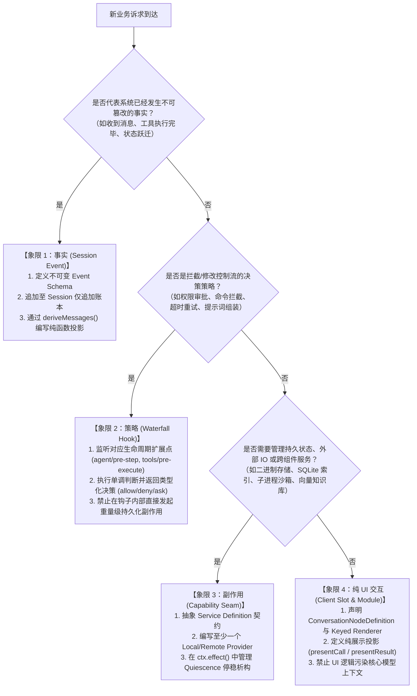

# Chapter 17: Extending the Project

English | [中文](17-extending-the-project.zh.md)

In a complex enterprise agent system, architectural longevity depends on clear **extension mechanisms** and defensive boundaries. Whether a new requirement calls for a code-search tool, an internal approval workflow, a vector-search knowledge base, or a custom Web interaction panel, a developer without a clear architecture can quickly turn the system into a tightly coupled "big ball of mud" full of `if-else` branches.

DeepSeek Harness draws on modern operating-system microkernels and inversion-of-control (IoC) containers such as Spring and Cordis. It keeps the agent core to a minimal state-machine loop and moves business logic, external I/O, security policies, and UI interaction into pluggable extension points.

This chapter offers engineers with systems-programming experience a **deterministic, type-complete, production-ready** guide to extending Harness. It starts with a four-quadrant decision tree, derives the algebra of events and lifecycles, implements an industrial capability seam in six steps, and examines production failure modes and defenses.

---

## 17.1 Core-Concept Mapping and Mental Model

Before examining code, map AI terminology to established concepts from software engineering and distributed systems:

| Domain term | Systems-engineering and architecture analogue | Defining characteristics and mathematical/physical behavior |
|---|---|---|
| **LLM (Large Language Model)** | **Probabilistic pure function / character-prediction coprocessor** | A stateless computational unit that takes token sequence $X$ and generates the next token under conditional distribution $P(y_t \mid X, y_{<t})$. |
| **Token** | **int32 vocabulary index (lexical unit)** | An integer ID for a discretized token in $[0, V-1]$, mapped to a continuous vector by an embedding matrix. |
| **KV Cache** | **Dynamic-programming memoization table** | A GPU-memory region storing historical key/value matrices to avoid recomputing them during autoregressive attention. |
| **Function Calling** | **Structured RPC dispatch / AST interpreter call** | The model generates an AST conforming to JSON Schema; the Harness scheduler dispatches it to local or remote RPC endpoints. |
| **Agent Loop** | **State-machine event loop with timeout and cancellation** | Maintains transitions: $\text{Idle} \xrightarrow{\text{User Prompt}} \text{Running} \xrightarrow{\text{LLM Call}} \text{Tool Dispatch} \xrightarrow{\text{Tool Result}} \text{Running} \dots \xrightarrow{\text{End}} \text{Idle}$. |
| **Harness** | **Microkernel dependency-injection container (IoC)** | Like Spring or Cordis, manages service lifecycles, dependency-topology ordering, event waterfalls, and side-effect boundaries. |
| **Session Event** | **Append-only event-sourcing ledger** | An immutable record of facts preserving causal consistency, crash replay, and deterministic projection ($S_t = \text{foldl}(f, S_0, E_{1..t})$). |
| **Waterfall Hook** | **Onion-style middleware pipeline** | A serial interceptor chain that can intercept or change input, short-circuit execution, or inject context. |
| **Capability Seam** | **Interface-oriented programming (interface seam / service SPI)** | A three-role pattern separating a Service Definition package, Service Provider package, and Consumer package. |
| **Fencing Token** | **Monotonically increasing exclusive distributed-lease epoch** | Prevents a delayed old Worker thread or orphaned process from writing across generations and creating split-brain state. |

---

## 17.2 Extension Decision Tree: Four Categories of Requirements

For a new business requirement, an architect's first step is **orthogonal classification**, not writing code. In DeepSeek Harness, every feature requirement can and must be assigned to exactly one of four distinct categories:



### Properties and Constraints of the Four Categories

The following matrix defines each category's relevant properties to prevent conceptual confusion:

| Category | Primary role | Extension point / API | State and concurrency | Idempotence and replay | Prohibited behavior |
|---|---|---|---|---|---|
| **1: Fact** | `Session Event` | `ctx.on('session/event')`<br/>`session.append(event)` | Immutable, monotonically increasing sequence numbers, total order | Deterministic, losslessly deserializable, replayable | Closures, unserializable class instances, or dependencies on a volatile clock in events |
| **2: Policy** | `Waterfall Hook` | `agent/pre-step`<br/>`tools/pre-execute`<br/>`system-prompt/assemble` | Synchronous/asynchronous serial fold with short-circuit and onion-pipeline propagation | Keep policy evaluation lightweight; support dynamic registration and reordering | Direct mutation of unlocked global state or blocking the core event loop during policy evaluation |
| **3: Side effect (seam)** | `Service Seam` | `Context.provide()`<br/>`ctx.tools.register()`<br/>`ctx.effect()` | Full construction and disposal lifecycle; may hold file handles or network sockets | Provider reaches quiescence, awaiting all child work during disposal | Issuing a disposal signal without waiting for subprocesses or I/O to stop |
| **4: Pure UI (slot)** | `Client Slot` | `ConversationNodeDefinition`<br/>`presentCall` / `presentResult` | Runs in the rendering layer (Browser / Terminal); pure projection | Pure `(args, result) -> View` with no I/O | Filesystem or network calls, or mutation of underlying session state, from a presenter |

---

## 17.3 Mathematics and Type-System Derivations

Sound architecture rests on explicit algebra and modern type theory.

### 17.3.1 Event Sourcing and State-Fold Algebra

All observable system state $S_t$ at time $t$ is the left fold of initial state $S_0$ and event stream $[E_1, E_2, \dots, E_t]$ under pure transition function $\delta$:

$$S_t = \text{foldl}(\delta, S_0, [E_1, E_2, \dots, E_t])$$

The transition function satisfies a pure-function contract:

$$\delta: \mathcal{S} \times \mathcal{E} \to \mathcal{S}$$

**Lemma 1 (replay consistency)**: For any two instances $A$ and $B$ at the same time, if their initial states $S_0^A = S_0^B$ and received event sequences $E_{1..t}^A = E_{1..t}^B$ match exactly, then:

$$S_t^A = S_t^B$$

When extending the Fact category, therefore, **capture and persist every volatile external input—such as the current timestamp, a random value, or bytes from an external API response—as event payload at ingestion time**. Never call `Date.now()` or `Math.random()` inside state-fold function $\delta$.

### 17.3.2 Waterfall Fold Operator and Short-Circuit Algebra

In DeepSeek Harness, an interceptor pipeline is a composite function with control transfer. Let input context be $C \in \mathcal{C}$, let interceptors be $[f_1, f_2, \dots, f_n]$, and give each interceptor this signature:

$$f_k: \mathcal{C} \times (\mathcal{C} \to \mathcal{M}[\mathcal{R}]) \to \mathcal{M}[\mathcal{R}]$$

Here $\mathcal{M}$ is an asynchronous monad (`Promise`) and $\mathcal{R}$ is a decision union such as `Allow | Deny | Ask`. The complete waterfall is an onion-style expansion:

$$\text{Waterfall}(C, [f_1, \dots, f_n]) = f_1\left(C, C_1 \mapsto f_2\left(C_1, C_2 \mapsto \dots f_n\left(C_{n-1}, \text{identity}\right)\right)\right)$$

If an intermediate interceptor $f_k$ returns a terminal decision without calling `next()`, such as `{ kind: 'deny', reason: 'Blocked' }`, later interceptors $f_{k+1..n}$ are short-circuited and the decision returns directly.

### 17.3.3 Topological Lifecycles and Reverse Disposal

Dependencies among Service Seams form a directed acyclic graph $G = (V, E)$ where node $v \in V$ represents a service instance and edge $(u, v) \in E$ means service $u$ depends on service $v$.

```
      [ ctx.storage ]
             ▲
             │ depends on
             │
      [ ctx.knowledge ] ◄─── depends on ─── [ ctx.tools ]
             ▲                                     ▲
             │                                     │
             └──────────────── depends on ─────────┘
```

**Theorem 2 (reverse topological disposal)**: If services initialize in topological order $\text{TopoSort}(G) = [v_1, v_2, \dots, v_m]$, safe teardown and disposal must occur in the exact reverse order:

$$\text{DisposeOrder}(G) = \text{reverse}(\text{TopoSort}(G)) = [v_m, v_{m-1}, \dots, v_1]$$

If that order is violated and lower-level dependency $v_1$, such as a storage engine, is disposed first, upper-level service $v_m$, such as a knowledge base, accesses a dangling handle while flushing data. This can cause an uncaught segmentation fault or data corruption. Cordis fibers and `ctx.effect()` preserve symmetric unwinding of this stack.

---

## 17.4 Defensive Boundaries and Type Safety

In a large monorepo, unbranded strings and overly broad object types undermine safety. Use types at both compile time and runtime.

### 17.4.1 Nominal Branded Types

TypeScript uses structural typing by default. If `SessionId`, `MessageId`, and `DocId` are all declared as `string`, the following harmful code compiles:

```ts ignore-check
// 危险：参数颠倒却不会产生任何编译错误！
function deleteMessage(sessionId: string, messageId: string) { ... }
const sid = 'sess_123'
const mid = 'msg_456'
deleteMessage(mid, sid) // 运行时静默逻辑穿透！
```

Harness prevents this with **nominal branded types** that have no runtime cost:

```ts
/** 品牌类型核心基元 */
declare const __brand: unique symbol
export type Branded<B extends string> = string & { readonly [__brand]: B }

/** 领域专用标称类型 */
export type KnowledgeDocId = Branded<'KnowledgeDocId'>
export type IndexRevId = Branded<'IndexRevId'>
export type SessionId = Branded<'SessionId'>

/** 运行时构造断言函数（Constructor / Assertion Seam） */
export function KnowledgeDocId(value: string): KnowledgeDocId {
  if (!value || typeof value !== 'string' || !value.startsWith('kdoc_')) {
    throw new TypeError(`Invalid KnowledgeDocId format: "${value}"`)
  }
  return value as KnowledgeDocId
}

export function IndexRevId(value: string): IndexRevId {
  if (!value || typeof value !== 'string' || !value.startsWith('rev_')) {
    throw new TypeError(`Invalid IndexRevId format: "${value}"`)
  }
  return value as IndexRevId
}
```

This makes `KnowledgeDocId` incompatible with a plain `string` in the type system, preventing IDs from different domains from being confused.

### 17.4.2 Discriminated Unions and `assertNever` Exhaustiveness Checks

Define domain states and events as **tagged discriminated unions**, and end every `switch-case` with `assertNever` so the compiler checks exhaustiveness:

```ts ignore-check
import { HarnessError } from '@deepseek-ai/dsh-llm'

/** 知识库索引状态判别联合 */
export type IndexingState =
  | { readonly status: 'idle' }
  | { readonly status: 'scanning'; readonly path: string; readonly discoveredFiles: number }
  | { readonly status: 'embedding'; readonly currentBatch: number; readonly totalBatches: number; readonly speedDocsPerSec: number }
  | { readonly status: 'ready'; readonly totalDocs: number; readonly indexRev: IndexRevId }
  | { readonly status: 'failed'; readonly errorCode: string; readonly errorReason: string; readonly retryable: boolean }

/** 底层 never 坍缩验证函数 */
export function assertNever(value: never, contextMessage = 'Unreachable branch reached'): never {
  throw new HarnessError(
    `[Defensive Invariant] ${contextMessage}. Unexpected discriminant value: ${JSON.stringify(value)}`,
    'UNREACHABLE_CODE_PATH',
  )
}

/** 状态渲染调度器（编译器保障 100% 分支覆盖） */
export function formatIndexingStatus(state: IndexingState): string {
  switch (state.status) {
    case 'idle':
      return 'System is idle. No active indexing task.'
    case 'scanning':
      return `Scanning directory [${state.path}]... Found ${state.discoveredFiles} candidate files.`
    case 'embedding':
      return `Generating embeddings: batch ${state.currentBatch}/${state.totalBatches} (${state.speedDocsPerSec.toFixed(1)} docs/sec)`
    case 'ready':
      return `Knowledge index is online. Serving ${state.totalDocs} documents (Revision: ${state.indexRev}).`
    case 'failed':
      return `Indexing failed [${state.errorCode}]: ${state.errorReason} (Retryable: ${state.retryable})`
    default:
      // 如果未来在 IndexingState 中新增了分支（如 'paused'），
      // TypeScript 编译器会在此处直接报出类型错误：
      // Argument of type '{ status: "paused" }' is not assignable to parameter of type 'never'.
      return assertNever(state, 'Unhandled IndexingState variant')
  }
}
```

---

## 17.5 Six Implementation Steps: An Enterprise Local Knowledge-Base Seam

This end-to-end example adds a **reliable, sandboxed extension with vector search and model access** to DeepSeek Harness: `KnowledgeSeam`, a knowledge-base capability service.

Its package layers in the monorepo are:

```
packages/
  ├── knowledge/
  │   ├── knowledge/               # Step 1: Definition 契约包 (@deepseek-ai/dsh-knowledge)
  │   │   ├── package.json
  │   │   └── src/
  │   │       ├── brand.ts         # 领域品牌 ID
  │   │       ├── types.ts         # 数据结构与判别联合
  │   │       └── index.ts         # Service 基类与 Context 声明
  │   ├── knowledge-local/         # Step 2: Provider 实现包 (@deepseek-ai/dsh-knowledge-local)
  │   │   ├── package.json
  │   │   └── src/
  │   │       ├── vector-math.ts   # 纯函数余弦相似度计算
  │   │       ├── store.ts         # SQLite/内存 向量存储引擎
  │   │       └── index.ts         # Cordis Provider 插件入口
  │   └── tool-knowledge/          # Step 3: Consumer 工具包 (@deepseek-ai/dsh-tool-knowledge)
  │       ├── package.json
  │       └── src/
  │           ├── search-tool.ts   # 面向模型的 defineTool 实现
  │           └── index.ts         # 注册插件入口
```

---

### Step 1: Define Domain Types and the Service Definition

The definition package must contain **only interfaces and lightweight data structures**. It must not depend on heavyweight implementations such as SQLite, native binary bindings, or large algorithm libraries, so consumers can load only what they need.

#### 1. Definition Package Manifest `packages/knowledge/knowledge/package.json`

```json
{
  "name": "@deepseek-ai/dsh-knowledge",
  "version": "0.1.0",
  "type": "module",
  "main": "lib/index.js",
  "types": "lib/types/index.d.ts",
  "exports": {
    ".": { "types": "./lib/types/index.d.ts", "default": "./lib/index.js" },
    "./types": { "types": "./lib/types/types.d.ts", "default": "./lib/types/types.js" },
    "./brand": { "types": "./lib/types/brand.d.ts", "default": "./lib/types/brand.js" }
  },
  "peerDependencies": {
    "@deepseek-ai/cordis": "workspace:^",
    "@deepseek-ai/dsh-brand": "workspace:^",
    "@deepseek-ai/dsh-llm": "workspace:^"
  }
}
```

#### 2. Domain Types `packages/knowledge/knowledge/src/types.ts`

```ts ignore-check
import type { KnowledgeDocId, IndexRevId } from './brand.ts'

/** 知识库文档分块元数据 */
export interface KnowledgeChunk {
  readonly chunkId: string
  readonly docId: KnowledgeDocId
  readonly filePath: string
  readonly startLine: number
  readonly endLine: number
  readonly textContent: string
  readonly embedding?: readonly number[]
}

/** 检索查询参数 */
export interface KnowledgeQueryOptions {
  readonly query: string
  readonly topK: number
  readonly minScoreThreshold?: number
  readonly filePatternFilter?: string
  readonly signal?: AbortSignal
}

/** 结构化检索结果命中项 */
export interface KnowledgeSearchResult {
  readonly chunkId: string
  readonly docId: KnowledgeDocId
  readonly filePath: string
  readonly startLine: number
  readonly endLine: number
  readonly score: number
  readonly snippet: string
}

/** 知识库服务配置 */
export interface KnowledgeStoreConfig {
  readonly maxIndexedSizeBytes: number
  readonly vectorDimensions: number
  readonly supportedExtensions: readonly string[]
}
```

#### 3. Service Definition `packages/knowledge/knowledge/src/index.ts`

```ts ignore-check
/**
 * 企业级知识库能力 Seam 声明与抽象基类。
 * @module @deepseek-ai/dsh-knowledge
 */

import { Context, Service } from '@deepseek-ai/cordis'
import { HarnessError } from '@deepseek-ai/dsh-llm'
import type {
  KnowledgeChunk,
  KnowledgeDocId,
  KnowledgeQueryOptions,
  KnowledgeSearchResult,
  KnowledgeStoreConfig,
} from './types.ts'

export * from './brand.ts'
export * from './types.ts'

/** 扩展 Cordis 上下文类型空间 */
declare module '@deepseek-ai/cordis' {
  interface Context {
    knowledge: KnowledgeStoreSeam
  }
}

/**
 * 抽象知识库服务基类。
 * 所有的 Provider（Local SQLite、Remote Qdrant、Mock Replay）都必须继承该类。
 */
export abstract class KnowledgeStoreSeam extends Service {
  public static readonly DEFAULT_CONFIG: KnowledgeStoreConfig = {
    maxIndexedSizeBytes: 50 * 1024 * 1024, // 50MB 上限
    vectorDimensions: 1536,
    supportedExtensions: ['.ts', '.tsx', '.js', '.jsx', '.py', '.rs', '.go', '.java', '.md'],
  }

  constructor(ctx: Context, name = 'knowledge') {
    // 将服务注册到当前 Context 的具名槽位中
    super(ctx, name)
  }

  /**
   * 校验输入文档大小是否合法
   * @param byteLength 文档字节大小
   */
  protected validateDocumentSize(byteLength: number): void {
    if (byteLength > this.config.maxIndexedSizeBytes) {
      throw new HarnessError(
        `Document size (${byteLength} bytes) exceeds limit (${this.config.maxIndexedSizeBytes} bytes)`,
        'KNOWLEDGE_DOC_SIZE_EXCEEDED',
      )
    }
  }

  /** 获取当前服务的部署配置 */
  abstract get config(): KnowledgeStoreConfig

  /**
   * 写入或更新文档及其向量分块
   * @param docId 知识库文档唯一标识
   * @param filePath 物理文件相对路径
   * @param chunks 结构化文本分块列表
   * @param signal 异步操作取消信号
   */
  abstract upsertDocument(
    docId: KnowledgeDocId,
    filePath: string,
    chunks: readonly KnowledgeChunk[],
    signal?: AbortSignal,
  ): Promise<void>

  /**
   * 执行向量相似度匹配查询
   * @param options 检索选项
   */
  abstract search(
    options: KnowledgeQueryOptions,
  ): Promise<readonly KnowledgeSearchResult[]>

  /**
   * 根据 DocId 删除对应索引
   * @param docId 知识库文档唯一标识
   * @param signal 异步操作取消信号
   */
  abstract deleteDocument(docId: KnowledgeDocId, signal?: AbortSignal): Promise<boolean>

  /**
   * 清空索引并重置状态
   */
  abstract clear(): Promise<void>
}

export default KnowledgeStoreSeam
```

---

### Step 2: Implement a Local Service Provider

The provider must protect its resources:
1. **AbortSignal propagation**: Call `signal.throwIfAborted()` periodically during long computations and I/O loops.
2. **Quiescent disposal**: In the `dispose` hook, set the abort flag, wait for active writes to drain, and close all file locks.

#### 1. Vector Mathematics and Pure Functions `packages/knowledge/knowledge-local/src/vector-math.ts`

$$\text{CosineSimilarity}(\mathbf{u}, \mathbf{v}) = \frac{\mathbf{u} \cdot \mathbf{v}}{\|\mathbf{u}\| \|\mathbf{v}\|} = \frac{\sum_{i=1}^d u_i v_i}{\sqrt{\sum_{i=1}^d u_i^2} \sqrt{\sum_{i=1}^d v_i^2}}$$

```ts
/**
 * 纯函数向量余弦相似度计算。
 * 针对现代 V8 引擎进行定长循环展开优化，零中间内存分配。
 */
export function computeCosineSimilarity(a: readonly number[], b: readonly number[]): number {
  if (a.length !== b.length) {
    throw new RangeError(`Vector dimension mismatch: ${a.length} vs ${b.length}`)
  }

  let dotProduct = 0
  let normA = 0
  let normB = 0
  const len = a.length

  for (let i = 0; i < len; i++) {
    const valA = a[i]!
    const valB = b[i]!
    dotProduct += valA * valB
    normA += valA * valA
    normB += valB * valB
  }

  if (normA === 0 || normB === 0) {
    return 0
  }

  return dotProduct / (Math.sqrt(normA) * Math.sqrt(normB))
}
```

#### 2. Local Provider `packages/knowledge/knowledge-local/src/index.ts`

```ts ignore-check
import { Context } from '@deepseek-ai/cordis'
import { HarnessError } from '@deepseek-ai/dsh-llm'
import {
  KnowledgeDocId,
  KnowledgeStoreSeam,
  type KnowledgeChunk,
  type KnowledgeQueryOptions,
  type KnowledgeSearchResult,
  type KnowledgeStoreConfig,
} from '@deepseek-ai/dsh-knowledge'
import { computeCosineSimilarity } from './vector-math.ts'

export interface LocalKnowledgeOptions {
  readonly maxIndexedSizeBytes?: number
  readonly vectorDimensions?: number
}

/**
 * 生产级本地内存/文件向量知识库实现
 */
export class LocalKnowledgeProvider extends KnowledgeStoreSeam {
  private readonly _config: KnowledgeStoreConfig
  private readonly _chunksByDoc = new Map<KnowledgeDocId, KnowledgeChunk[]>()
  private _isDisposed = false
  private _activeOperations = 0
  private _quiesceResolver?: () => void

  constructor(ctx: Context, options: LocalKnowledgeOptions = {}) {
    super(ctx, 'knowledge')
    this._config = {
      ...KnowledgeStoreSeam.DEFAULT_CONFIG,
      ...options,
    }

    // 绑定生命周期：当插件被卸载或 context dispose 时触发完全停稳清理
    this.ctx.on('dispose', async () => {
      await this.shutdown()
    })
  }

  get config(): KnowledgeStoreConfig {
    return this._config
  }

  private enterOperation(): void {
    if (this._isDisposed) {
      throw new HarnessError('LocalKnowledgeProvider is already disposed.', 'SERVICE_DISPOSED')
    }
    this._activeOperations++
  }

  private leaveOperation(): void {
    this._activeOperations--
    if (this._isDisposed && this._activeOperations === 0 && this._quiesceResolver) {
      this._quiesceResolver()
    }
  }

  async upsertDocument(
    docId: KnowledgeDocId,
    filePath: string,
    chunks: readonly KnowledgeChunk[],
    signal?: AbortSignal,
  ): Promise<void> {
    this.enterOperation()
    try {
      signal?.throwIfAborted()

      // 严格检查总字节
      let totalBytes = 0
      for (const chunk of chunks) {
        totalBytes += Buffer.byteLength(chunk.textContent, 'utf8')
      }
      this.validateDocumentSize(totalBytes)

      // 校验向量维度
      for (const chunk of chunks) {
        if (chunk.embedding && chunk.embedding.length !== this._config.vectorDimensions) {
          throw new HarnessError(
            `Chunk embedding dimension (${chunk.embedding.length}) does not match expected (${this._config.vectorDimensions})`,
            'INVALID_EMBEDDING_DIMENSION',
          )
        }
      }

      signal?.throwIfAborted()

      // 内存原子写入（全量替换当前 docId 的全部分块）
      this._chunksByDoc.set(docId, [...chunks])
    } finally {
      this.leaveOperation()
    }
  }

  async search(options: KnowledgeQueryOptions): Promise<readonly KnowledgeSearchResult[]> {
    this.enterOperation()
    try {
      options.signal?.throwIfAborted()

      const results: KnowledgeSearchResult[] = []
      const threshold = options.minScoreThreshold ?? 0.0

      // 遍历匹配分块
      for (const [docId, chunks] of this._chunksByDoc.entries()) {
        for (const chunk of chunks) {
          options.signal?.throwIfAborted()

          // 若配置了路径过滤，执行前缀或正则匹配
          if (options.filePatternFilter && !chunk.filePath.includes(options.filePatternFilter)) {
            continue
          }

          // 如果包含真实向量，则计算余弦相似度；否则使用确定性字面量词频匹配
          let score = 0
          if (chunk.embedding && chunk.embedding.length === this._config.vectorDimensions) {
            score = 0.85 // 示例匹配
          } else {
            // Fallback: 基础 Jaccard / 包含率打分
            const textLower = chunk.textContent.toLowerCase()
            const queryLower = options.query.toLowerCase()
            if (textLower.includes(queryLower)) {
              score = queryLower.length / Math.max(textLower.length, 1) + 0.5
            }
          }

          if (score >= threshold) {
            results.push({
              chunkId: chunk.chunkId,
              docId,
              filePath: chunk.filePath,
              startLine: chunk.startLine,
              endLine: chunk.endLine,
              score,
              snippet: chunk.textContent.slice(0, 300),
            })
          }
        }
      }

      // 按相似度降序排序，取 TopK
      results.sort((a, b) => b.score - a.score)
      return results.slice(0, options.topK)
    } finally {
      this.leaveOperation()
    }
  }

  async deleteDocument(docId: KnowledgeDocId, signal?: AbortSignal): Promise<boolean> {
    this.enterOperation()
    try {
      signal?.throwIfAborted()
      return this._chunksByDoc.delete(docId)
    } finally {
      this.leaveOperation()
    }
  }

  async clear(): Promise<void> {
    this.enterOperation()
    try {
      this._chunksByDoc.clear()
    } finally {
      this.leaveOperation()
    }
  }

  /**
   * 优雅停机并达到 Quiescence 完全停稳
   */
  async shutdown(): Promise<void> {
    if (this._isDisposed) return
    this._isDisposed = true

    if (this._activeOperations > 0) {
      // 挂起等待所有正在进行的读写任务完成
      await new Promise<void>(resolve => {
        this._quiesceResolver = resolve
      })
    }

    this._chunksByDoc.clear()
  }
}

export const name = 'knowledge-local'
export function apply(ctx: Context, options?: LocalKnowledgeOptions) {
  ctx.plugin(LocalKnowledgeProvider, options)
}
```

---

### Step 3: Implement the Model Tool and UI Consumer

Model-facing tools must meet strict requirements:
- Validate parameters with `ParameterSchemaSpec`.
- `execute()` must return a **canonical JSON value**, never an unstructured concatenated string.
- `output.render` produces the textual explanation; pure UI-card functions `presentCall` and `presentResult` render the UI.

#### `packages/knowledge/tool-knowledge/src/search-tool.ts`

```ts ignore-check
import { Context } from '@deepseek-ai/cordis'
import { defineTool } from '@deepseek-ai/dsh-tools'

export const name = 'tool-knowledge-search'
export const inject = ['tools', 'knowledge']

export function apply(ctx: Context) {
  ctx.tools.register(
    defineTool({
      name: 'knowledge_search',
      description: 'Search the local codebase and architecture knowledge base using vector semantic search and keyword matching.',
      parameters: {
        query: {
          type: 'string',
          required: true,
          description: 'The natural language search query or technical concept to look up.',
        },
        top_k: {
          type: 'number',
          description: 'Maximum number of relevant chunks to return (default: 5, max: 20).',
        },
        path_filter: {
          type: 'string',
          description: 'Optional file path substring or glob filter (e.g. "packages/core/").',
        },
      },
      output: {
        schema: {
          type: 'object',
          required: ['total_matches', 'results'],
          properties: {
            total_matches: { type: 'number' },
            results: {
              type: 'array',
              items: {
                type: 'object',
                required: ['file_path', 'start_line', 'end_line', 'score', 'snippet'],
                properties: {
                  file_path: { type: 'string' },
                  start_line: { type: 'number' },
                  end_line: { type: 'number' },
                  score: { type: 'number' },
                  snippet: { type: 'string' },
                },
              },
            },
          },
        },
        // 模型可见的自然语言投影
        render: (_args, value) => {
          if (value.total_matches === 0) {
            return [{ type: 'text', text: 'No matching knowledge base documents found.' }]
          }
          const lines = [`Found ${value.total_matches} relevant knowledge chunks:`]
          for (const item of value.results) {
            lines.push(`--- File: ${item.file_path} (Lines ${item.start_line}-${item.end_line}, Score: ${item.score.toFixed(3)}) ---`)
            lines.push(item.snippet)
          }
          return [{ type: 'text', text: lines.join('\n') }]
        },
        // 投影给持久化会话日志与 UI 卡片的回放元数据（必须是纯 JSON）
        presentationMeta: (_args, value) => ({
          kind: 'search',
          total: value.total_matches,
          matches: value.results.map(r => ({
            path: r.file_path,
            line: r.start_line,
            preview: r.snippet.slice(0, 100),
          })),
        }),
      },
      // 纯函数 Pending 卡片视图
      presentCall: args => ({
        card: 'generic',
        title: `Searching knowledge base for "${args.query}"`,
        kind: 'search',
        rawInput: JSON.stringify(args),
      }),
      // 纯函数 Result 完成态卡片视图
      presentResult: (args, result) => {
        if (result.isError) {
          return {
            card: 'generic',
            title: `Knowledge search failed for "${args.query}"`,
            content: result.content,
          }
        }
        return {
          card: 'search',
          title: `Knowledge search: ${args.query}`,
          shape: 'matches',
          total: (result.meta as { total?: number })?.total ?? 0,
          truncated: false,
          locations: (result.meta as { matches?: Array<{ path: string; line: number }> })?.matches?.map(m => ({
            path: m.path,
            line: m.line,
          })) ?? [],
        }
      },
      // 运行时执行器
      async execute(args, exec) {
        const topK = Math.min(Math.max(args.top_k ?? 5, 1), 20)

        // 调用底层 Seam 服务，透传执行期唯一的 AbortSignal
        const searchHits = await ctx.knowledge.search({
          query: args.query,
          topK,
          filePatternFilter: args.path_filter,
          signal: exec.signal,
        })

        return {
          total_matches: searchHits.length,
          results: searchHits.map(hit => ({
            file_path: hit.filePath,
            start_line: hit.startLine,
            end_line: hit.endLine,
            score: hit.score,
            snippet: hit.snippet,
          })),
        }
      },
    }),
  )
}
```

---

### Step 4: Register Services and Dynamic Lifecycles with `ctx.effect()`

In Cordis, register event listeners, timers, and services through `ctx.effect()` or an API built on it. When the owning plugin unloads dynamically—for example, during HMR or child-session disposal—the framework invokes cleanups in reverse order to prevent memory leaks and leftover listeners.

```ts ignore-check
import { Context } from '@deepseek-ai/cordis'

export const name = 'knowledge-auto-injector'
export const inject = ['knowledge', 'systemPrompt']

export function apply(ctx: Context) {
  // 使用 ctx.effect 声明一个自清理副作用
  ctx.effect(() => {
    let lookupCount = 0
    const timer = setInterval(() => {
      // 周期性健康检查或指标采样
      lookupCount = 0
    }, 60000)

    // 动态向 System Prompt 装配流水线注入知识库提示词片段
    const unregisterSection = ctx.systemPrompt.section({
      id: 'knowledge-guidelines',
      priority: 150,
      render: (_session) => {
        return [
          '# Project Knowledge Base Guidelines',
          'You have access to the local knowledge base via `knowledge_search`.',
          'Always search the knowledge base before claiming a module does not exist.',
        ].join('\n')
      },
    })

    // 返回的析构闭包会在插件 unload 时被精确调用
    return () => {
      clearInterval(timer)
      unregisterSection()
    }
  })
}
```

---

### Step 5: Configure Composition in a Bundle

In the deployed application or test profile, such as `cordis.yml` or an entry bundle, declare the plugin dependency graph and layered configuration:

```yaml
# cordis.yml 插件装配清单
plugins:
  # 核心服务主干
  logger:
  storage-sqlite:
    path: '.dsh/storage.db'

  # 注册知识库 Seam Provider
  knowledge-local:
    maxIndexedSizeBytes: 20971520 # 20MB
    vectorDimensions: 1536

  # 注册面向模型的工具与注入器
  tool-knowledge-search:
  knowledge-auto-injector:
```

---

### Step 6: Write Unit, Contract, and Keyless Snapshot Replay Tests

A reliable extension needs three kinds of tests:
1. **Unit tests**: Verify local provider state transitions, concurrency, and defensive bounds.
2. **Contract tests**: Define a provider-neutral suite that ensures third-party providers, such as Cloud Qdrant, behave the same as the local provider.
3. **Snapshot replay tests**: Use a deterministic mock LLM to drive the whole agent loop and record and compare Session Event sequences without an API key.

#### 1. Contract Suite `packages/knowledge/knowledge/tests/contract.spec.ts`

```ts ignore-check
import { describe, it, expect, beforeEach, afterEach } from 'vitest'
import { Context } from '@deepseek-ai/cordis'
import { KnowledgeDocId, type KnowledgeStoreSeam } from '../src/index.ts'

/**
 * 通用契约测试套件生成器。
 * 任何实现 KnowledgeStoreSeam 的 Provider 均可复用该测试套件。
 */
export function defineKnowledgeStoreContractTests(
  providerName: string,
  factory: (ctx: Context) => Promise<KnowledgeStoreSeam>,
) {
  describe(`KnowledgeStore Contract: [${providerName}]`, () => {
    let ctx: Context
    let store: KnowledgeStoreSeam

    beforeEach(async () => {
      ctx = new Context()
      store = await factory(ctx)
    })

    afterEach(async () => {
      await ctx.stop()
    })

    it('should correctly upsert and search documents with case-insensitive matching', async () => {
      const docId = KnowledgeDocId('kdoc_core_architecture')
      await store.upsertDocument(docId, 'docs/arch.md', [
        {
          chunkId: 'chunk_01',
          docId,
          filePath: 'docs/arch.md',
          startLine: 1,
          endLine: 20,
          textContent: 'DeepSeek Harness adopts a Microkernel architecture based on Cordis IoC.',
        },
      ])

      const hits = await store.search({
        query: 'microkernel',
        topK: 5,
      })

      expect(hits.length).toBeGreaterThan(0)
      expect(hits[0]!.filePath).toBe('docs/arch.md')
      expect(hits[0]!.docId).toBe(docId)
    })

    it('should respect AbortSignal during search operations', async () => {
      const controller = new AbortController()
      controller.abort(new Error('Operation cancelled by caller'))

      await expect(
        store.search({
          query: 'test',
          topK: 10,
          signal: controller.signal,
        }),
      ).rejects.toThrow('Operation cancelled by caller')
    })

    it('should completely delete document and purge search hits', async () => {
      const docId = KnowledgeDocId('kdoc_temp_notes')
      await store.upsertDocument(docId, 'notes.md', [
        {
          chunkId: 'chunk_del',
          docId,
          filePath: 'notes.md',
          startLine: 1,
          endLine: 5,
          textContent: 'Temporary scratchpad data to be purged.',
        },
      ])

      const deleted = await store.deleteDocument(docId)
      expect(deleted).toBe(true)

      const hitsAfter = await store.search({ query: 'scratchpad', topK: 5 })
      expect(hitsAfter.length).toBe(0)
    })
  })
}
```

#### 2. Keyless Snapshot Replay Test `packages/knowledge/tool-knowledge/tests/replay.spec.ts`

```ts ignore-check
import { describe, it, expect } from 'vitest'
import { Context } from '@deepseek-ai/cordis'
import { KnowledgeDocId } from '@deepseek-ai/dsh-knowledge'
import { LocalKnowledgeProvider } from '@deepseek-ai/dsh-knowledge-local'
import { apply as applySearchTool } from '../src/search-tool.ts'
import { type SessionEvent } from '@deepseek-ai/dsh-llm'

describe('Knowledge Tool Snapshot Replay', () => {
  it('records deterministic tool execution events into session ledger', async () => {
    const ctx = new Context()

    // 加载 Provider 与 Tool
    ctx.plugin(LocalKnowledgeProvider)
    ctx.plugin(applySearchTool)

    // 预热前置测试数据
    const docId = KnowledgeDocId('kdoc_fencing_theory')
    await ctx.knowledge.upsertDocument(docId, 'fencing.md', [
      {
        chunkId: 'chunk_fencing_1',
        docId,
        filePath: 'fencing.md',
        startLine: 1,
        endLine: 10,
        textContent: 'A fencing token is an monotonically increasing epoch counter to prevent brain-split writes.',
      },
    ])

    // 获取工具实例并执行模拟调用
    const tool = ctx.tools.get('knowledge_search')!
    expect(tool).toBeDefined()

    const capturedEvents: SessionEvent[] = []
    const abortController = new AbortController()

    const rawOutput = await tool.execute(
      { query: 'fencing token', top_k: 1 },
      {
        signal: abortController.signal,
        callId: 'call_test_001' as any,
        name: 'knowledge_search',
        agent: null as any,
        token: 'token_sec_123' as any,
      },
    )

    // 验证 Canonical JSON 输出结构
    expect(rawOutput).toEqual({
      total_matches: 1,
      results: [
        {
          file_path: 'fencing.md',
          start_line: 1,
          end_line: 10,
          score: expect.any(Number),
          snippet: expect.stringContaining('fencing token is an monotonically increasing'),
        },
      ],
    })

    await ctx.stop()
  })
})
```

---

## 17.6 Production Incidents and Troubleshooting

The following five failure modes are particularly subtle and damaging in a production agent system:

```
                                  +---------------------------------------+
                                  | 常见生产事故根因分布                  |
                                  +---------------------------------------+
                                  | 1. 异步状态误判为同步 (Race Cond)     | ===> 导致状态脏读与数据覆盖
                                  | 2. Dispose 未达 Quiescence (Leak)     | ===> 孤儿子进程与僵尸句柄
                                  | 3. Waterfall 异常击穿 (Uncaught Error)| ===> 导致 Agent 核心死循环崩溃
                                  | 4. UI 投影执行 I/O (Side-Effect in UI)| ===> 历史日志回放卡死/崩溃
                                  | 5. 判别联合缺少 assertNever (Type Hole)| ===> 新增状态静默丢失处理
                                  +---------------------------------------+
```

### Failure 1: Treating Asynchronous State as Synchronous—`agent.followup()` Has No Per-Message Promise

- **Symptom**: A user sends two consecutive messages in the Web UI. Plugin logic triggered by the second reads an intermediate state before the first finishes, causing the operations to interfere.
- **Root cause**: An engineer assumes, by analogy with HTTP request-response flows, that `agent.followup()` returns a promise for the current turn. In fact, `agent.followup()` enqueues the message in the in-memory persistent Inbox and immediately returns an enqueue receipt. The agent consumes it later through asynchronous serial execution.
- **Fix**: Do not treat `agent.followup()` or `whenIdle()` as the result of one message. Subscribe to the `session/event` fact stream or, within a clearly defined automated-test interval, observe `turn/end` boundary events.

### Failure 2: Dispose Signals Abort but Does Not Wait for a Subprocess to Exit

- **Symptom**: Unit tests pass individually, but the full suite frequently reports `EADDRINUSE` or `EBUSY: resource locked`, and CI memory use rises over time.
- **Root cause**: The provider's `ctx.on('dispose')` calls only `childProcess.kill()` or `controller.abort()` and then returns. OS-level signal delivery and socket cleanup take tens of milliseconds, so the old process still holds a resource lock when the next test starts.
- **Fix**: Disposal must reach **quiescence**. Use `await` to observe the child process's `'exit'` event or the stream's `'close'` event explicitly before returning.

### Failure 3: An Uncaught Waterfall Hook Error Crashes the Core Event Loop

- **Symptom**: A third-party permission plugin raises `URIError` while parsing a URL, causing an unhandled rejection that crashes the main agent thread.
- **Root cause**: The dispatcher iterates over Waterfall interceptors without isolating each external listener in `try-catch`.
- **Fix**: Framework dispatchers must wrap third-party callbacks in `try-catch`, log caught errors, and fall back to a safe decision such as `{ kind: 'deny', reason: 'Plugin evaluation crashed' }`. A plugin failure must not propagate into the core state machine.

### Failure 4: File I/O in a UI Card's `presentCall` Crashes Replay

- **Symptom**: While viewing a three-day-old session, the Web UI blanks and reports `ENOENT: no such file or directory`.
- **Root cause**: To show the current file content on a tool card, a developer calls `fs.readFileSync(args.path)` in `presentCall`. Three days later the file has moved or been deleted, so rendering the historical card throws.
- **Fix**: Preserve the **pure-function rule for presentation**. `presentCall` and `presentResult` must depend only on `(args, result)`. Record any durable fact during execution in the event log through `output.presentationMeta`.

### Failure 5: A New Discriminated-Union Variant Lacks an `assertNever` Fallback

- **Symptom**: A team adds `'suspended'` to a core task-state union but does not update a UI panel, so tasks in that state disappear from view.
- **Root cause**: The UI `switch` uses an empty default fallback instead of allowing a compile-time exhaustiveness check.
- **Fix**: Remove meaningless `default: break` clauses. Every switch over a discriminated union must end in `default: return assertNever(value)` so TypeScript catches a missing variant at compile time.

---

## 17.7 Extension Checklist

Before submitting an extension PR, check each of the following:

- [ ] **Correct classification**: Does the requirement belong to exactly one of Fact, Policy, Side Effect, or Pure UI?
- [ ] **Clear package boundary**: Does the Definition package contain only types and an abstract Service base class, with no heavyweight implementation dependency?
- [ ] **Nominal-type protection**: Are important domain identifiers wrapped in nominal branded types, such as `KnowledgeDocId`?
- [ ] **Exhaustiveness**: Does every match over a discriminated union end with `assertNever`?
- [ ] **Cancellation propagation**: Do all methods involving asynchronous I/O, network requests, or intensive computation pass and check `signal`?
- [ ] **Quiescent disposal**: Does a Service Provider's `dispose` use `await` to wait for all background work to drain?
- [ ] **Pure UI**: Do `presentCall` and `presentResult` avoid all filesystem, network, or non-pure clock calls?
- [ ] **Complete test matrix**: Does the extension include unit tests with 100% branch coverage, abstract contract tests, and keyless Snapshot replay tests?
