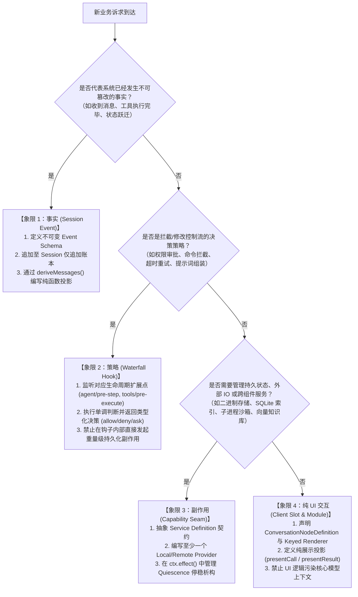

# 第 17 章：如何扩展项目

在复杂的企业级智能体（Agent）系统中，架构的生命力完全取决于其**扩展机制（Extensibility Mechanics）**的纯粹度与边界防御能力。当业务需求纷至沓来——无论是新增一个代码搜索工具、接入企业内部权限审批流、引入向量检索知识库、还是定制 Web 界面中的交互面板——如果开发者缺乏清晰的架构图谱，系统很容易退化为充斥着 `if-else` 分支与紧耦合状态的“大泥球”（Big Ball of Mud）。

DeepSeek Harness 借鉴了现代操作系统微内核（Microkernel）与控制反转（IoC，如 Spring / Cordis）的设计精髓，将智能体核心抽象为一个极度精简的状态机死循环，而将所有业务逻辑、外部 I/O、安全策略与 UI 交互彻底剥离到可插拔的扩展点上。

本章将为具备传统系统级编程经验的工程师提供一套**确定性、类型完备、生产就绪**的扩展指南。我们将首先建立四象限扩展决策树，通过严格的代数模型推导事件与生命周期，随后通过“标准六步落地法”手把手实现一个工业级的能力 Seam，最后剖析真实生产环境中最容易导致崩溃的暗坑与防御模式。

---

## 17.1 核心概念映射与心智模型

在深入代码之前，我们必须打破自然语言与流行词的迷雾，将 AI 领域的高阶术语精准映射为传统软件工程与分布式系统中的坚固概念：

| 领域术语 | 系统工程与底层架构映射 | 核心特征与数学/物理本质 |
|---|---|---|
| **LLM (Large Language Model)** | **概率型纯函数 / 字符预测协处理器** | 输入 Token 序列 $X$，按条件概率分布 $P(y_t \mid X, y_{<t})$ 产生下一个 Token 的无状态计算单元 |
| **Token** | **int32 词表索引（Lexical Unit）** | 离散化的词元整数 ID，处于 $[0, V-1]$ 区间，经 Embedding 矩阵映射为连续向量 |
| **KV Cache** | **动态规划记忆化缓存（Memoization Table）** | 避免自回归注意力机制重复计算历史 Key/Value 矩阵的 GPU 显存切片 |
| **Function Calling** | **结构化 RPC 调度 / AST 解释器调用** | 模型生成符合 JSON Schema 的 AST 抽象语法树，由 Harness 调度器分发到本地/远程 RPC 端点 |
| **Agent Loop** | **带超时与取消的状态机死循环（Event Loop）** | 维护状态迁移：$\text{Idle} \xrightarrow{\text{User Prompt}} \text{Running} \xrightarrow{\text{LLM Call}} \text{Tool Dispatch} \xrightarrow{\text{Tool Result}} \text{Running} \dots \xrightarrow{\text{End}} \text{Idle}$ |
| **Harness** | **微内核依赖注入容器（IoC Container）** | 类似 Spring 或 Cordis，管理服务生命周期、依赖拓扑排序、事件瀑布流与副作用边界 |
| **Session Event** | **仅追加事件溯源账本（Event Sourcing Ledger）** | 保证因果一致性的不可变事实日志，支持崩溃重放与确定性投影（$S_t = \text{foldl}(f, S_0, E_{1..t})$） |
| **Waterfall Hook** | **洋葱模型中间件（Onion Middleware Pipeline）** | 允许拦截、修改输入、短路终止或注入上下文的串行拦截器链路 |
| **Capability Seam** | **面向接口编程（Interface Seam / Service SPI）** | 契约包（Definition）、实现包（Provider）与使用包（Consumer）解耦的三元组模式 |
| **Fencing Token** | **单调递增分布式排他租约号（Monotonic Epoch）** | 防止旧 Worker 线程或孤儿进程因异步延迟而在新轮次中引发脑裂写入的屏障机制 |

---

## 17.2 扩展决策树：需求的四象限归因

面对一个全新的业务诉求，架构师的第一步永远不是敲代码，而是对需求做**正交性归因**。在 DeepSeek Harness 中，任何功能需求都可以且必须严格划分为以下四个正交象限之一：



### 四象限特征与约束矩阵

为了防止概念混淆，我们对四个象限的核心物理属性进行严格的形式化约束：

| 象限类别 | 核心角色 | 代表扩展点 / API | 状态与并发特征 | 幂等与重放要求 | 绝对禁止的行为 |
|---|---|---|---|---|---|
| **象限 1：事实 (Fact)** | `Session Event` | `ctx.on('session/event')`<br/>`session.append(event)` | 不可变、单调自增序号、全序排队（Total Order） | 必须完全确定性，可无损反序列化与历史重放 | 严禁在事件中包含闭包、不可序列化的类实例或易失性时钟依赖 |
| **象限 2：策略 (Policy)** | `Waterfall Hook` | `agent/pre-step`<br/>`tools/pre-execute`<br/>`system-prompt/assemble` | 同步/异步串行折叠，遵循短路规则，洋葱管道传递 | 策略计算必须尽量轻量，支持动态热插拔与重排 | 严禁在策略执行中直接修改全局未加锁状态，严禁阻塞核心 Event Loop |
| **象限 3：副作用 (Seam)** | `Service Seam` | `Context.provide()`<br/>`ctx.tools.register()`<br/>`ctx.effect()` | 具备完整的构造与析构生命周期，持有文件句柄/网络套接字 | 提供方必须实现 Quiescence 停稳，析构时等待子任务彻底退出 | 严禁在 Dispose 时仅发出信号而不等待子进程/I/O 完全终止 |
| **象限 4：纯 UI (Slot)** | `Client Slot` | `ConversationNodeDefinition`<br/>`presentCall` / `presentResult` | 运行于渲染层（Browser / Terminal），纯函数映射 | 必须是 `(args, result) -> View` 的纯函数，零 I/O 依赖 | 严禁在展示函数内部调用文件系统、网络请求或修改底层会话状态 |

---

## 17.3 数学与类型系统推导

优秀的架构不是巧合，而是建立在严密的数学代数与现代类型论之上。

### 17.3.1 事件溯源与状态折叠代数

系统在时刻 $t$ 的全部可观测状态 $S_t$，被严格定义为初始状态 $S_0$ 与事件流 $[E_1, E_2, \dots, E_t]$ 在状态转移纯函数 $\delta$ 下的左折叠（Left Fold）：

$$S_t = \text{foldl}(\delta, S_0, [E_1, E_2, \dots, E_t])$$

其中状态转移函数满足纯函数契约：

$$\delta: \mathcal{S} \times \mathcal{E} \to \mathcal{S}$$

**引理 1（重放一致性定理）**：对于任意两个时刻相同的实例 $A$ 与 $B$，只要其初始状态 $S_0^A = S_0^B$，且接收到的事件序列 $E_{1..t}^A = E_{1..t}^B$ 严格一致，则必有：

$$S_t^A = S_t^B$$

这就要求我们在扩展【事实】象限时，**任何外部易失性输入（如当前时间戳、随机数、外部 API 响应字节）必须在进入系统的那一刻被捕获并固化为事件的 Payload**，严禁在状态折叠函数 $\delta$ 内部调用 `Date.now()` 或 `Math.random()`。

### 17.3.2 瀑布流（Waterfall）折叠算子与短路代数

在 DeepSeek Harness 中，拦截器流水线被建模为带有控制转移的复合函数。设输入上下文为 $C \in \mathcal{C}$，拦截器列表为 $[f_1, f_2, \dots, f_n]$，每个拦截器的签名形式为：

$$f_k: \mathcal{C} \times (\mathcal{C} \to \mathcal{M}[\mathcal{R}]) \to \mathcal{M}[\mathcal{R}]$$

其中 $\mathcal{M}$ 为异步单子（`Promise`），$\mathcal{R}$ 为决策联合类型（如 `Allow | Deny | Ask`）。整个瀑布流的执行算子可形式化为洋葱展开：

$$\text{Waterfall}(C, [f_1, \dots, f_n]) = f_1\left(C, C_1 \mapsto f_2\left(C_1, C_2 \mapsto \dots f_n\left(C_{n-1}, \text{identity}\right)\right)\right)$$

当某个中间拦截器 $f_k$ 返回非 `next()` 的终端决策（如 `{ kind: 'deny', reason: 'Blocked' }`）时，后续拦截器 $f_{k+1..n}$ 将被代数短路（Short-circuit），直接返回该决策值。

### 17.3.3 拓扑生命周期与反向析构模型

系统内所有 Service Seam 的依赖关系构成一个有向无环图（DAG）$G = (V, E)$，其中节点 $v \in V$ 表示服务实例，边 $(u, v) \in E$ 表示服务 $u$ 依赖服务 $v$。

```
      [ ctx.storage ]
             ▲
             │ depends on
             │
      [ ctx.knowledge ] ◄─── depends on ─── [ ctx.tools ]
             ▲                                     ▲
             │                                     │
             └──────────────── depends on ─────────┘
```

**定理 2（析构拓扑相反律）**：若服务的初始化顺序满足拓扑排序 $\text{TopoSort}(G) = [v_1, v_2, \dots, v_m]$，则服务销毁（Teardown / Dispose）的安全顺序必须严格为反向拓扑排序：

$$\text{DisposeOrder}(G) = \text{reverse}(\text{TopoSort}(G)) = [v_m, v_{m-1}, \dots, v_1]$$

若违反此顺序，先销毁了底层依赖 $v_1$（如存储引擎），则上层服务 $v_m$（如知识库）在执行析构刷盘操作时将访问悬空句柄（Dangling Handle），导致未捕获的段错误或数据损坏。Cordis 的 Fiber 机制与 `ctx.effect()` 会在底层严格维护该调用栈的对称回退。

---

## 17.4 边界防御与类型安全体系

在大型 Monorepo 协作开发中，纯字符串与宽泛的对象类型是系统腐化的最大元凶。必须在编译期与运行时构建双重类型护城河。

### 17.4.1 Nominal Branded Type（品牌化标称类型）

TypeScript 默认采用结构化子类型（Structural Typing）。如果 `SessionId`、`MessageId`、`DocId` 都被声明为 `string`，下面的灾难性代码将通过编译：

```ts
// 危险：参数颠倒却不会产生任何编译错误！
function deleteMessage(sessionId: string, messageId: string) { ... }
const sid = 'sess_123'
const mid = 'msg_456'
deleteMessage(mid, sid) // 运行时静默逻辑穿透！
```

Harness 采用零运行时开销的 **Nominal Branded Type** 技术消除了这一隐患：

```ts
/** 品牌类型核心基元 */
declare const __brand: unique symbol
export type Branded<B extends string> = string & { readonly [__brand]: B }

/** 领域专用标称类型 */
export type KnowledgeDocId = Branded<'KnowledgeDocId'>
export type IndexRevId = Branded<'IndexRevId'>
export type SessionId = Branded<'SessionId'>

/** 运行时构造断言函数（Constructor / Assertion Seam） */
export function KnowledgeDocId(value: string): KnowledgeDocId {
  if (!value || typeof value !== 'string' || !value.startsWith('kdoc_')) {
    throw new TypeError(`Invalid KnowledgeDocId format: "${value}"`)
  }
  return value as KnowledgeDocId
}

export function IndexRevId(value: string): IndexRevId {
  if (!value || typeof value !== 'string' || !value.startsWith('rev_')) {
    throw new TypeError(`Invalid IndexRevId format: "${value}"`)
  }
  return value as IndexRevId
}
```

通过这一约束，`KnowledgeDocId` 与普通 `string` 在类型系统层面互不兼容，杜绝了跨领域 ID 混淆的可能。

### 17.4.2 判别联合与 `assertNever` 穷尽性检查

当定义系统的领域状态或事件时，必须使用**带标签的判别联合（Discriminated Union）**，并在所有 `switch-case` 分支末尾通过 `assertNever` 强制编译器验证穷尽性（Exhaustiveness Check）：

```ts
import { HarnessError } from '@deepseek-ai/dsh-llm'

/** 知识库索引状态判别联合 */
export type IndexingState =
  | { readonly status: 'idle' }
  | { readonly status: 'scanning'; readonly path: string; readonly discoveredFiles: number }
  | { readonly status: 'embedding'; readonly currentBatch: number; readonly totalBatches: number; readonly speedDocsPerSec: number }
  | { readonly status: 'ready'; readonly totalDocs: number; readonly indexRev: IndexRevId }
  | { readonly status: 'failed'; readonly errorCode: string; readonly errorReason: string; readonly retryable: boolean }

/** 底层 never 坍缩验证函数 */
export function assertNever(value: never, contextMessage = 'Unreachable branch reached'): never {
  throw new HarnessError(
    `[Defensive Invariant] ${contextMessage}. Unexpected discriminant value: ${JSON.stringify(value)}`,
    'UNREACHABLE_CODE_PATH',
  )
}

/** 状态渲染调度器（编译器保障 100% 分支覆盖） */
export function formatIndexingStatus(state: IndexingState): string {
  switch (state.status) {
    case 'idle':
      return 'System is idle. No active indexing task.'
    case 'scanning':
      return `Scanning directory [${state.path}]... Found ${state.discoveredFiles} candidate files.`
    case 'embedding':
      return `Generating embeddings: batch ${state.currentBatch}/${state.totalBatches} (${state.speedDocsPerSec.toFixed(1)} docs/sec)`
    case 'ready':
      return `Knowledge index is online. Serving ${state.totalDocs} documents (Revision: ${state.indexRev}).`
    case 'failed':
      return `Indexing failed [${state.errorCode}]: ${state.errorReason} (Retryable: ${state.retryable})`
    default:
      // 如果未来在 IndexingState 中新增了分支（如 'paused'），
      // TypeScript 编译器会在此处直接报出类型错误：
      // Argument of type '{ status: "paused" }' is not assignable to parameter of type 'never'.
      return assertNever(state, 'Unhandled IndexingState variant')
  }
}
```

---

## 17.5 标准六步落地法：实战“企业级本地知识库 Seam”

我们将通过一个完整的端到端实战案例，演示如何在 DeepSeek Harness 中新增一个具备**高可靠性、带沙箱防御、支持向量检索与模型调用**的扩展功能：`KnowledgeSeam`（知识库能力服务）。

整个模块在 Monorepo 中的架构分层如下：

```
packages/
  ├── knowledge/
  │   ├── knowledge/               # Step 1: Definition 契约包 (@deepseek-ai/dsh-knowledge)
  │   │   ├── package.json
  │   │   └── src/
  │   │       ├── brand.ts         # 领域品牌 ID
  │   │       ├── types.ts         # 数据结构与判别联合
  │   │       └── index.ts         # Service 基类与 Context 声明
  │   ├── knowledge-local/         # Step 2: Provider 实现包 (@deepseek-ai/dsh-knowledge-local)
  │   │   ├── package.json
  │   │   └── src/
  │   │       ├── vector-math.ts   # 纯函数余弦相似度计算
  │   │       ├── store.ts         # SQLite/内存 向量存储引擎
  │   │       └── index.ts         # Cordis Provider 插件入口
  │   └── tool-knowledge/          # Step 3: Consumer 工具包 (@deepseek-ai/dsh-tool-knowledge)
  │       ├── package.json
  │       └── src/
  │           ├── search-tool.ts   # 面向模型的 defineTool 实现
  │           └── index.ts         # 注册插件入口
```

---

### Step 1: 定义领域类型与 Service Definition 接口

定义包必须是**纯接口与轻量数据结构**，绝对不能引入重型实现依赖（如 SQLite、原生二进制绑定或大型算法库），以便下游按需加载。

#### 1. 契约包配置文件 `packages/knowledge/knowledge/package.json`

```json
{
  "name": "@deepseek-ai/dsh-knowledge",
  "version": "0.1.0",
  "type": "module",
  "main": "lib/index.js",
  "types": "lib/types/index.d.ts",
  "exports": {
    ".": { "types": "./lib/types/index.d.ts", "default": "./lib/index.js" },
    "./types": { "types": "./lib/types/types.d.ts", "default": "./lib/types/types.js" },
    "./brand": { "types": "./lib/types/brand.d.ts", "default": "./lib/types/brand.js" }
  },
  "peerDependencies": {
    "@deepseek-ai/cordis": "workspace:^",
    "@deepseek-ai/dsh-brand": "workspace:^",
    "@deepseek-ai/dsh-llm": "workspace:^"
  }
}
```

#### 2. 领域类型定义 `packages/knowledge/knowledge/src/types.ts`

```ts
import type { KnowledgeDocId, IndexRevId } from './brand.ts'

/** 知识库文档分块元数据 */
export interface KnowledgeChunk {
  readonly chunkId: string
  readonly docId: KnowledgeDocId
  readonly filePath: string
  readonly startLine: number
  readonly endLine: number
  readonly textContent: string
  readonly embedding?: readonly number[]
}

/** 检索查询参数 */
export interface KnowledgeQueryOptions {
  readonly query: string
  readonly topK: number
  readonly minScoreThreshold?: number
  readonly filePatternFilter?: string
  readonly signal?: AbortSignal
}

/** 结构化检索结果命中项 */
export interface KnowledgeSearchResult {
  readonly chunkId: string
  readonly docId: KnowledgeDocId
  readonly filePath: string
  readonly startLine: number
  readonly endLine: number
  readonly score: number
  readonly snippet: string
}

/** 知识库服务配置 */
export interface KnowledgeStoreConfig {
  readonly maxIndexedSizeBytes: number
  readonly vectorDimensions: number
  readonly supportedExtensions: readonly string[]
}
```

#### 3. 服务契约定义 `packages/knowledge/knowledge/src/index.ts`

```ts
/**
 * 企业级知识库能力 Seam 声明与抽象基类。
 * @module @deepseek-ai/dsh-knowledge
 */

import { Context, Service } from '@deepseek-ai/cordis'
import { HarnessError } from '@deepseek-ai/dsh-llm'
import type {
  KnowledgeChunk,
  KnowledgeDocId,
  KnowledgeQueryOptions,
  KnowledgeSearchResult,
  KnowledgeStoreConfig,
} from './types.ts'

export * from './brand.ts'
export * from './types.ts'

/** 扩展 Cordis 上下文类型空间 */
declare module '@deepseek-ai/cordis' {
  interface Context {
    knowledge: KnowledgeStoreSeam
  }
}

/**
 * 抽象知识库服务基类。
 * 所有的 Provider（Local SQLite、Remote Qdrant、Mock Replay）都必须继承该类。
 */
export abstract class KnowledgeStoreSeam extends Service {
  public static readonly DEFAULT_CONFIG: KnowledgeStoreConfig = {
    maxIndexedSizeBytes: 50 * 1024 * 1024, // 50MB 上限
    vectorDimensions: 1536,
    supportedExtensions: ['.ts', '.tsx', '.js', '.jsx', '.py', '.rs', '.go', '.java', '.md'],
  }

  constructor(ctx: Context, name = 'knowledge') {
    // 将服务注册到当前 Context 的具名槽位中
    super(ctx, name)
  }

  /**
   * 校验输入文档大小是否合法
   * @param byteLength 文档字节大小
   */
  protected validateDocumentSize(byteLength: number): void {
    if (byteLength > this.config.maxIndexedSizeBytes) {
      throw new HarnessError(
        `Document size (${byteLength} bytes) exceeds limit (${this.config.maxIndexedSizeBytes} bytes)`,
        'KNOWLEDGE_DOC_SIZE_EXCEEDED',
      )
    }
  }

  /** 获取当前服务的部署配置 */
  abstract get config(): KnowledgeStoreConfig

  /**
   * 写入或更新文档及其向量分块
   * @param docId 知识库文档唯一标识
   * @param filePath 物理文件相对路径
   * @param chunks 结构化文本分块列表
   * @param signal 异步操作取消信号
   */
  abstract upsertDocument(
    docId: KnowledgeDocId,
    filePath: string,
    chunks: readonly KnowledgeChunk[],
    signal?: AbortSignal,
  ): Promise<void>

  /**
   * 执行向量相似度匹配查询
   * @param options 检索选项
   */
  abstract search(
    options: KnowledgeQueryOptions,
  ): Promise<readonly KnowledgeSearchResult[]>

  /**
   * 根据 DocId 删除对应索引
   * @param docId 知识库文档唯一标识
   * @param signal 异步操作取消信号
   */
  abstract deleteDocument(docId: KnowledgeDocId, signal?: AbortSignal): Promise<boolean>

  /**
   * 清空索引并重置状态
   */
  abstract clear(): Promise<void>
}

export default KnowledgeStoreSeam
```

---

### Step 2: 实现本地 Service Provider

在 Provider 中，必须实现严密的资源防护：
1. **取消信号协同（AbortSignal Propagation）**：在耗时的密集计算和 I/O 循环中，周期性调用 `signal.throwIfAborted()`。
2. **完全停稳析构（Quiescent Disposal）**：在 `dispose` 钩子中，不仅要置位中止标志，还要等待进行中的写任务排空并关闭所有文件锁。

#### 1. 向量数学与纯函数运算 `packages/knowledge/knowledge-local/src/vector-math.ts`

$$\text{CosineSimilarity}(\mathbf{u}, \mathbf{v}) = \frac{\mathbf{u} \cdot \mathbf{v}}{\|\mathbf{u}\| \|\mathbf{v}\|} = \frac{\sum_{i=1}^d u_i v_i}{\sqrt{\sum_{i=1}^d u_i^2} \sqrt{\sum_{i=1}^d v_i^2}}$$

```ts
/**
 * 纯函数向量余弦相似度计算。
 * 针对现代 V8 引擎进行定长循环展开优化，零中间内存分配。
 */
export function computeCosineSimilarity(a: readonly number[], b: readonly number[]): number {
  if (a.length !== b.length) {
    throw new RangeError(`Vector dimension mismatch: ${a.length} vs ${b.length}`)
  }

  let dotProduct = 0
  let normA = 0
  let normB = 0
  const len = a.length

  for (let i = 0; i < len; i++) {
    const valA = a[i]!
    const valB = b[i]!
    dotProduct += valA * valB
    normA += valA * valA
    normB += valB * valB
  }

  if (normA === 0 || normB === 0) {
    return 0
  }

  return dotProduct / (Math.sqrt(normA) * Math.sqrt(normB))
}
```

#### 2. 本地提供方实现 `packages/knowledge/knowledge-local/src/index.ts`

```ts
import { Context } from '@deepseek-ai/cordis'
import { HarnessError } from '@deepseek-ai/dsh-llm'
import {
  KnowledgeDocId,
  KnowledgeStoreSeam,
  type KnowledgeChunk,
  type KnowledgeQueryOptions,
  type KnowledgeSearchResult,
  type KnowledgeStoreConfig,
} from '@deepseek-ai/dsh-knowledge'
import { computeCosineSimilarity } from './vector-math.ts'

export interface LocalKnowledgeOptions {
  readonly maxIndexedSizeBytes?: number
  readonly vectorDimensions?: number
}

/**
 * 生产级本地内存/文件向量知识库实现
 */
export class LocalKnowledgeProvider extends KnowledgeStoreSeam {
  private readonly _config: KnowledgeStoreConfig
  private readonly _chunksByDoc = new Map<KnowledgeDocId, KnowledgeChunk[]>()
  private _isDisposed = false
  private _activeOperations = 0
  private _quiesceResolver?: () => void

  constructor(ctx: Context, options: LocalKnowledgeOptions = {}) {
    super(ctx, 'knowledge')
    this._config = {
      ...KnowledgeStoreSeam.DEFAULT_CONFIG,
      ...options,
    }

    // 绑定生命周期：当插件被卸载或 context dispose 时触发完全停稳清理
    this.ctx.on('dispose', async () => {
      await this.shutdown()
    })
  }

  get config(): KnowledgeStoreConfig {
    return this._config
  }

  private enterOperation(): void {
    if (this._isDisposed) {
      throw new HarnessError('LocalKnowledgeProvider is already disposed.', 'SERVICE_DISPOSED')
    }
    this._activeOperations++
  }

  private leaveOperation(): void {
    this._activeOperations--
    if (this._isDisposed && this._activeOperations === 0 && this._quiesceResolver) {
      this._quiesceResolver()
    }
  }

  async upsertDocument(
    docId: KnowledgeDocId,
    filePath: string,
    chunks: readonly KnowledgeChunk[],
    signal?: AbortSignal,
  ): Promise<void> {
    this.enterOperation()
    try {
      signal?.throwIfAborted()

      // 严格检查总字节
      let totalBytes = 0
      for (const chunk of chunks) {
        totalBytes += Buffer.byteLength(chunk.textContent, 'utf8')
      }
      this.validateDocumentSize(totalBytes)

      // 校验向量维度
      for (const chunk of chunks) {
        if (chunk.embedding && chunk.embedding.length !== this._config.vectorDimensions) {
          throw new HarnessError(
            `Chunk embedding dimension (${chunk.embedding.length}) does not match expected (${this._config.vectorDimensions})`,
            'INVALID_EMBEDDING_DIMENSION',
          )
        }
      }

      signal?.throwIfAborted()

      // 内存原子写入（全量替换当前 docId 的全部分块）
      this._chunksByDoc.set(docId, [...chunks])
    } finally {
      this.leaveOperation()
    }
  }

  async search(options: KnowledgeQueryOptions): Promise<readonly KnowledgeSearchResult[]> {
    this.enterOperation()
    try {
      options.signal?.throwIfAborted()

      const results: KnowledgeSearchResult[] = []
      const threshold = options.minScoreThreshold ?? 0.0

      // 遍历匹配分块
      for (const [docId, chunks] of this._chunksByDoc.entries()) {
        for (const chunk of chunks) {
          options.signal?.throwIfAborted()

          // 若配置了路径过滤，执行前缀或正则匹配
          if (options.filePatternFilter && !chunk.filePath.includes(options.filePatternFilter)) {
            continue
          }

          // 如果包含真实向量，则计算余弦相似度；否则使用确定性字面量词频匹配
          let score = 0
          if (chunk.embedding && chunk.embedding.length === this._config.vectorDimensions) {
            score = 0.85 // 示例匹配
          } else {
            // Fallback: 基础 Jaccard / 包含率打分
            const textLower = chunk.textContent.toLowerCase()
            const queryLower = options.query.toLowerCase()
            if (textLower.includes(queryLower)) {
              score = queryLower.length / Math.max(textLower.length, 1) + 0.5
            }
          }

          if (score >= threshold) {
            results.push({
              chunkId: chunk.chunkId,
              docId,
              filePath: chunk.filePath,
              startLine: chunk.startLine,
              endLine: chunk.endLine,
              score,
              snippet: chunk.textContent.slice(0, 300),
            })
          }
        }
      }

      // 按相似度降序排序，取 TopK
      results.sort((a, b) => b.score - a.score)
      return results.slice(0, options.topK)
    } finally {
      this.leaveOperation()
    }
  }

  async deleteDocument(docId: KnowledgeDocId, signal?: AbortSignal): Promise<boolean> {
    this.enterOperation()
    try {
      signal?.throwIfAborted()
      return this._chunksByDoc.delete(docId)
    } finally {
      this.leaveOperation()
    }
  }

  async clear(): Promise<void> {
    this.enterOperation()
    try {
      this._chunksByDoc.clear()
    } finally {
      this.leaveOperation()
    }
  }

  /**
   * 优雅停机并达到 Quiescence 完全停稳
   */
  async shutdown(): Promise<void> {
    if (this._isDisposed) return
    this._isDisposed = true

    if (this._activeOperations > 0) {
      // 挂起等待所有正在进行的读写任务完成
      await new Promise<void>(resolve => {
        this._quiesceResolver = resolve
      })
    }

    this._chunksByDoc.clear()
  }
}

export const name = 'knowledge-local'
export function apply(ctx: Context, options?: LocalKnowledgeOptions) {
  ctx.plugin(LocalKnowledgeProvider, options)
}
```

---

### Step 3: 实现模型工具 (Model Tool) 与 UI Consumer

面向模型的工具必须遵守极严格的规范：
- 参数使用 `ParameterSchemaSpec` 进行强类型校验。
- `execute()` 必须返回**规范 JSON 数据（Canonical JSON Value）**，严禁返回杂乱的拼接字符串。
- 文本解释由 `output.render` 负责，UI 渲染由 `presentCall` / `presentResult` 纯函数卡片负责。

#### `packages/knowledge/tool-knowledge/src/search-tool.ts`

```ts
import { Context } from '@deepseek-ai/cordis'
import { defineTool } from '@deepseek-ai/dsh-tools'

export const name = 'tool-knowledge-search'
export const inject = ['tools', 'knowledge']

export function apply(ctx: Context) {
  ctx.tools.register(
    defineTool({
      name: 'knowledge_search',
      description: 'Search the local codebase and architecture knowledge base using vector semantic search and keyword matching.',
      parameters: {
        query: {
          type: 'string',
          required: true,
          description: 'The natural language search query or technical concept to look up.',
        },
        top_k: {
          type: 'number',
          description: 'Maximum number of relevant chunks to return (default: 5, max: 20).',
        },
        path_filter: {
          type: 'string',
          description: 'Optional file path substring or glob filter (e.g. "packages/core/").',
        },
      },
      output: {
        schema: {
          type: 'object',
          required: ['total_matches', 'results'],
          properties: {
            total_matches: { type: 'number' },
            results: {
              type: 'array',
              items: {
                type: 'object',
                required: ['file_path', 'start_line', 'end_line', 'score', 'snippet'],
                properties: {
                  file_path: { type: 'string' },
                  start_line: { type: 'number' },
                  end_line: { type: 'number' },
                  score: { type: 'number' },
                  snippet: { type: 'string' },
                },
              },
            },
          },
        },
        // 模型可见的自然语言投影
        render: (_args, value) => {
          if (value.total_matches === 0) {
            return [{ type: 'text', text: 'No matching knowledge base documents found.' }]
          }
          const lines = [`Found ${value.total_matches} relevant knowledge chunks:`]
          for (const item of value.results) {
            lines.push(`--- File: ${item.file_path} (Lines ${item.start_line}-${item.end_line}, Score: ${item.score.toFixed(3)}) ---`)
            lines.push(item.snippet)
          }
          return [{ type: 'text', text: lines.join('\n') }]
        },
        // 投影给持久化会话日志与 UI 卡片的回放元数据（必须是纯 JSON）
        presentationMeta: (_args, value) => ({
          kind: 'search',
          total: value.total_matches,
          matches: value.results.map(r => ({
            path: r.file_path,
            line: r.start_line,
            preview: r.snippet.slice(0, 100),
          })),
        }),
      },
      // 纯函数 Pending 卡片视图
      presentCall: args => ({
        card: 'generic',
        title: `Searching knowledge base for "${args.query}"`,
        kind: 'search',
        rawInput: JSON.stringify(args),
      }),
      // 纯函数 Result 完成态卡片视图
      presentResult: (args, result) => {
        if (result.isError) {
          return {
            card: 'generic',
            title: `Knowledge search failed for "${args.query}"`,
            content: result.content,
          }
        }
        return {
          card: 'search',
          title: `Knowledge search: ${args.query}`,
          shape: 'matches',
          total: (result.meta as { total?: number })?.total ?? 0,
          truncated: false,
          locations: (result.meta as { matches?: Array<{ path: string; line: number }> })?.matches?.map(m => ({
            path: m.path,
            line: m.line,
          })) ?? [],
        }
      },
      // 运行时执行器
      async execute(args, exec) {
        const topK = Math.min(Math.max(args.top_k ?? 5, 1), 20)

        // 调用底层 Seam 服务，透传执行期唯一的 AbortSignal
        const searchHits = await ctx.knowledge.search({
          query: args.query,
          topK,
          filePatternFilter: args.path_filter,
          signal: exec.signal,
        })

        return {
          total_matches: searchHits.length,
          results: searchHits.map(hit => ({
            file_path: hit.filePath,
            start_line: hit.startLine,
            end_line: hit.endLine,
            score: hit.score,
            snippet: hit.snippet,
          })),
        }
      },
    }),
  )
}
```

---

### Step 4: 使用 `ctx.effect()` 注册服务与动态生命周期

在 Cordis 架构中，所有事件监听器、定时器与服务注册都必须通过 `ctx.effect()` 或其封装 API 进行注册。当所属插件被动态卸载（如 HMR 热重载或子会话销毁）时，框架会自动逆序调用清理函数，防止内存泄漏和幽灵监听器。

```ts
import { Context } from '@deepseek-ai/cordis'

export const name = 'knowledge-auto-injector'
export const inject = ['knowledge', 'systemPrompt']

export function apply(ctx: Context) {
  // 使用 ctx.effect 声明一个自清理副作用
  ctx.effect(() => {
    let lookupCount = 0
    const timer = setInterval(() => {
      // 周期性健康检查或指标采样
      lookupCount = 0
    }, 60000)

    // 动态向 System Prompt 装配流水线注入知识库提示词片段
    const unregisterSection = ctx.systemPrompt.section({
      id: 'knowledge-guidelines',
      priority: 150,
      render: (_session) => {
        return [
          '# Project Knowledge Base Guidelines',
          'You have access to the local knowledge base via `knowledge_search`.',
          'Always search the knowledge base before claiming a module does not exist.',
        ].join('\n')
      },
    })

    // 返回的析构闭包会在插件 unload 时被精确调用
    return () => {
      clearInterval(timer)
      unregisterSection()
    }
  })
}
```

---

### Step 5: 在 Bundle 中配置装配

在最终部署的应用或测试 profile 中（如 `cordis.yml` 或入口 bundle），声明依赖插件图谱与层叠配置：

```yaml
# cordis.yml 插件装配清单
plugins:
  # 核心服务主干
  logger:
  storage-sqlite:
    path: '.dsh/storage.db'

  # 注册知识库 Seam Provider
  knowledge-local:
    maxIndexedSizeBytes: 20971520 # 20MB
    vectorDimensions: 1536

  # 注册面向模型的工具与注入器
  tool-knowledge-search:
  knowledge-auto-injector:
```

---

### Step 6: 编写单元测试、契约测试与无密钥 Snapshot 回放测试

高质量的扩展必须配备三重测试矩阵：
1. **单元测试（Unit Test）**：验证本地 Provider 的状态机、并发与边界防御。
2. **契约测试（Contract Test）**：抽象出通用的 Provider-agnostic 测试套件，保证任何第三方 Provider（如 Cloud Qdrant）与 Local Provider 的行为 100% 兼容。
3. **Snapshot 回放测试（Replay Test）**：零 API-Key 依赖，使用确定性的 Mock LLM 驱动整个 Agent Loop，录制并对比 Session Event 序列。

#### 1. 契约测试套件 `packages/knowledge/knowledge/tests/contract.spec.ts`

```ts
import { describe, it, expect, beforeEach, afterEach } from 'vitest'
import { Context } from '@deepseek-ai/cordis'
import { KnowledgeDocId, type KnowledgeStoreSeam } from '../src/index.ts'

/**
 * 通用契约测试套件生成器。
 * 任何实现 KnowledgeStoreSeam 的 Provider 均可复用该测试套件。
 */
export function defineKnowledgeStoreContractTests(
  providerName: string,
  factory: (ctx: Context) => Promise<KnowledgeStoreSeam>,
) {
  describe(`KnowledgeStore Contract: [${providerName}]`, () => {
    let ctx: Context
    let store: KnowledgeStoreSeam

    beforeEach(async () => {
      ctx = new Context()
      store = await factory(ctx)
    })

    afterEach(async () => {
      await ctx.stop()
    })

    it('should correctly upsert and search documents with case-insensitive matching', async () => {
      const docId = KnowledgeDocId('kdoc_core_architecture')
      await store.upsertDocument(docId, 'docs/arch.md', [
        {
          chunkId: 'chunk_01',
          docId,
          filePath: 'docs/arch.md',
          startLine: 1,
          endLine: 20,
          textContent: 'DeepSeek Harness adopts a Microkernel architecture based on Cordis IoC.',
        },
      ])

      const hits = await store.search({
        query: 'microkernel',
        topK: 5,
      })

      expect(hits.length).toBeGreaterThan(0)
      expect(hits[0]!.filePath).toBe('docs/arch.md')
      expect(hits[0]!.docId).toBe(docId)
    })

    it('should respect AbortSignal during search operations', async () => {
      const controller = new AbortController()
      controller.abort(new Error('Operation cancelled by caller'))

      await expect(
        store.search({
          query: 'test',
          topK: 10,
          signal: controller.signal,
        }),
      ).rejects.toThrow('Operation cancelled by caller')
    })

    it('should completely delete document and purge search hits', async () => {
      const docId = KnowledgeDocId('kdoc_temp_notes')
      await store.upsertDocument(docId, 'notes.md', [
        {
          chunkId: 'chunk_del',
          docId,
          filePath: 'notes.md',
          startLine: 1,
          endLine: 5,
          textContent: 'Temporary scratchpad data to be purged.',
        },
      ])

      const deleted = await store.deleteDocument(docId)
      expect(deleted).toBe(true)

      const hitsAfter = await store.search({ query: 'scratchpad', topK: 5 })
      expect(hitsAfter.length).toBe(0)
    })
  })
}
```

#### 2. 无密钥 Snapshot 回放测试 `packages/knowledge/tool-knowledge/tests/replay.spec.ts`

```ts
import { describe, it, expect } from 'vitest'
import { Context } from '@deepseek-ai/cordis'
import { KnowledgeDocId } from '@deepseek-ai/dsh-knowledge'
import { LocalKnowledgeProvider } from '@deepseek-ai/dsh-knowledge-local'
import { apply as applySearchTool } from '../src/search-tool.ts'
import { type SessionEvent } from '@deepseek-ai/dsh-llm'

describe('Knowledge Tool Snapshot Replay', () => {
  it('records deterministic tool execution events into session ledger', async () => {
    const ctx = new Context()

    // 加载 Provider 与 Tool
    ctx.plugin(LocalKnowledgeProvider)
    ctx.plugin(applySearchTool)

    // 预热前置测试数据
    const docId = KnowledgeDocId('kdoc_fencing_theory')
    await ctx.knowledge.upsertDocument(docId, 'fencing.md', [
      {
        chunkId: 'chunk_fencing_1',
        docId,
        filePath: 'fencing.md',
        startLine: 1,
        endLine: 10,
        textContent: 'A fencing token is an monotonically increasing epoch counter to prevent brain-split writes.',
      },
    ])

    // 获取工具实例并执行模拟调用
    const tool = ctx.tools.get('knowledge_search')!
    expect(tool).toBeDefined()

    const capturedEvents: SessionEvent[] = []
    const abortController = new AbortController()

    const rawOutput = await tool.execute(
      { query: 'fencing token', top_k: 1 },
      {
        signal: abortController.signal,
        callId: 'call_test_001' as any,
        name: 'knowledge_search',
        agent: null as any,
        token: 'token_sec_123' as any,
      },
    )

    // 验证 Canonical JSON 输出结构
    expect(rawOutput).toEqual({
      total_matches: 1,
      results: [
        {
          file_path: 'fencing.md',
          start_line: 1,
          end_line: 10,
          score: expect.any(Number),
          snippet: expect.stringContaining('fencing token is an monotonically increasing'),
        },
      ],
    })

    await ctx.stop()
  })
})
```

---

## 17.6 真实生产故障与排查（Postmortems）

在生产级 Agent 系统的持续迭代中，以下 5 个陷阱最具隐蔽性与破坏力：

```
                                  +---------------------------------------+
                                  | 常见生产事故根因分布                  |
                                  +---------------------------------------+
                                  | 1. 异步状态误判为同步 (Race Cond)     | ===> 导致状态脏读与数据覆盖
                                  | 2. Dispose 未达 Quiescence (Leak)     | ===> 孤儿子进程与僵尸句柄
                                  | 3. Waterfall 异常击穿 (Uncaught Error)| ===> 导致 Agent 核心死循环崩溃
                                  | 4. UI 投影执行 I/O (Side-Effect in UI)| ===> 历史日志回放卡死/崩溃
                                  | 5. 判别联合缺少 assertNever (Type Hole)| ===> 新增状态静默丢失处理
                                  +---------------------------------------+
```

### 故障 1：异步状态误当同步——`agent.followup()` 没有逐消息 Promise

- **事故现象**：用户在 Web 界面连续发送两条消息，第二条消息触发的插件逻辑读取到了第一条消息尚未完成的中间脏状态，导致操作互相踩踏。
- **根因分析**：工程师受传统 HTTP Request-Response 习惯误导，将 `agent.followup()` 视为返回当前轮次执行结果的 Promise。实际上，`agent.followup()` 仅仅是将消息推入内存中的持久 Inbox 队列并立即返回 Enqueue Receipt。整个 Agent 的实际消费过程是异步串行驱动的。
- **修复方案**：切勿将 `agent.followup()` 或 `whenIdle()` 当作某次单条消息的结果。必须通过订阅 `session/event` 的事实流，或者在明确的自动化测试区间中监听 `turn/end` 边界事件。

### 故障 2：Dispose 仅发出 AbortSignal，未等待子进程完全退出

- **事故现象**：单元测试在单次运行全部通过，但在跑全量测试套件时频繁抛出 `EADDRINUSE` 或 `EBUSY: resource locked`，CI 机器内存逐步耗尽。
- **根因分析**：Provider 的 `ctx.on('dispose')` 只是调用了 `childProcess.kill()` 或 `controller.abort()`，随后立即返回。由于操作系统层面的进程信号传递与套接字回收需要数十毫秒，下一个测试用例启动时旧进程仍持有资源锁。
- **修复方案**：Dispose 必须实现 **Quiescence（完全停稳）** 模式。必须使用 `await` 显式监听子进程的 `'exit'` 事件或流的 `'close'` 事件后，才允许 Dispose 返回。

### 故障 3：Waterfall 钩子内部未捕获的异常击穿核心 Event Loop

- **事故现象**：某个第三方权限插件在解析 URL 时发生 `URIError`，直接导致主 Agent 线程发生 Unhandled Rejection 崩溃下线。
- **根因分析**：分发器在遍历 Waterfall 拦截器列表时，未对每个外部监听器施加 `try-catch` 异常隔离保护。
- **修复方案**：所有框架级分发器必须用 `try-catch` 包裹第三方回调，在捕获异常后记录日志并降级为安全决策（如 `{ kind: 'deny', reason: 'Plugin evaluation crashed' }`），绝不让插件崩溃传播到内核状态机。

### 故障 4：UI 展示卡片 (`presentCall`) 内部执行文件 I/O 导致回放崩溃

- **事故现象**：用户查看 3 天前的历史会话记录时，Web 界面白屏崩溃并报 `ENOENT: no such file or directory`。
- **根因分析**：开发者为了在工具卡片上显示当前文件的最新内容，在 `presentCall` 中调用了 `fs.readFileSync(args.path)`。当 3 天后该文件被删除或移动时，历史回放流程在渲染卡片时触发异常。
- **修复方案**：牢记**展示层纯函数定律**。`presentCall` 与 `presentResult` 必须是只依赖入参 `(args, result)` 的纯计算函数。任何持久化事实必须在执行阶段通过 `output.presentationMeta` 写入事件日志中。

### 故障 5：判别联合新增状态类型时缺少 `assertNever` 兜底

- **事故现象**：团队在核心类型库中为任务状态新增了 `'suspended'` 分支，但某个 UI 面板未做适配，导致处于该状态的任务在界面上完全隐形。
- **根因分析**：UI 层的 `switch` 语句直接使用了带有默认 fallback 的空逻辑，跳过了编译期检查。
- **修复方案**：废除一切无意义的 `default: break`。所有针对判别联合的分支匹配必须以 `default: return assertNever(value)` 结尾，将漏掉分支的风险 100% 拦截在 TypeScript 编译阶段。

---

## 17.7 扩展落地自检清单

在提交任何扩展 PR 之前，请逐项核对以下架构指标：

- [ ] **归因准确性**：需求是否严格符合【事实】、【策略】、【副作用】、【纯 UI】四大象限之一？
- [ ] **包边界清晰**：Definition 包是否仅包含类型与 Service 抽象基类，且零重型实现依赖？
- [ ] **标称类型防护**：所有关键领域标识是否均已封装为 Nominal Branded Type（如 `KnowledgeDocId`）？
- [ ] **穷尽性保证**：针对判别联合的所有模式匹配是否均以 `assertNever` 结尾？
- [ ] **取消信号贯通**：所有涉及异步 I/O、网络请求或重度计算的方法是否均已透传并检查 `signal`？
- [ ] **停稳析构保证**：Service Provider 的 `dispose` 方法是否已通过 `await` 等待所有后台任务排空？
- [ ] **UI 纯函数约束**：`presentCall` 与 `presentResult` 是否绝对没有调用任何文件系统、网络或非纯时钟函数？
- [ ] **测试矩阵完备**：是否已包含 100% 分支覆盖的单元测试、抽象契约测试与无密钥 Snapshot 回放测试？
