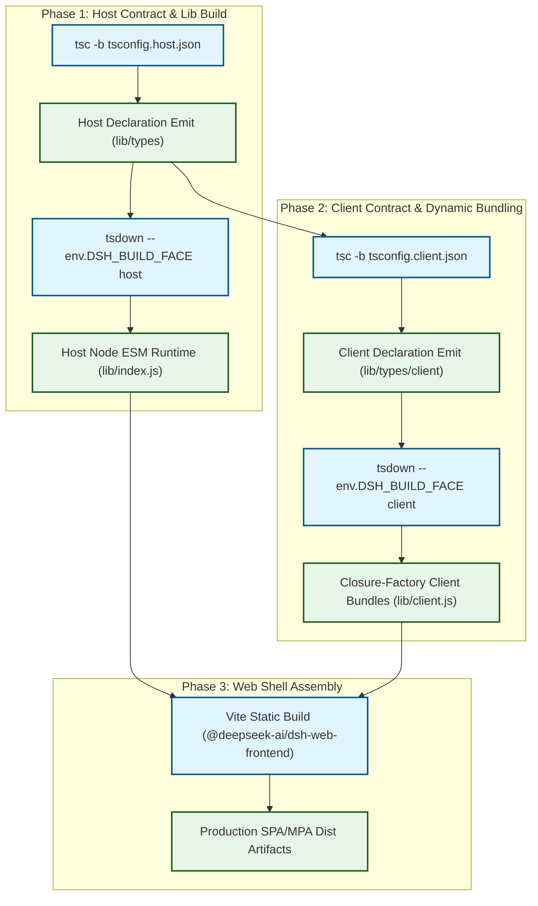
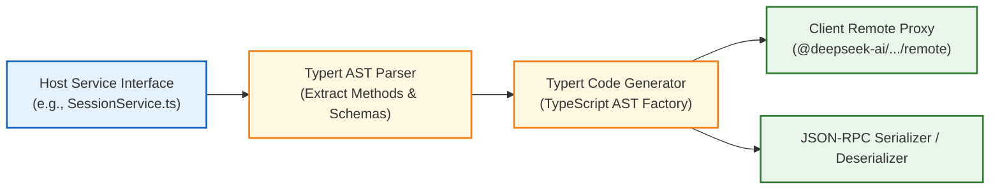
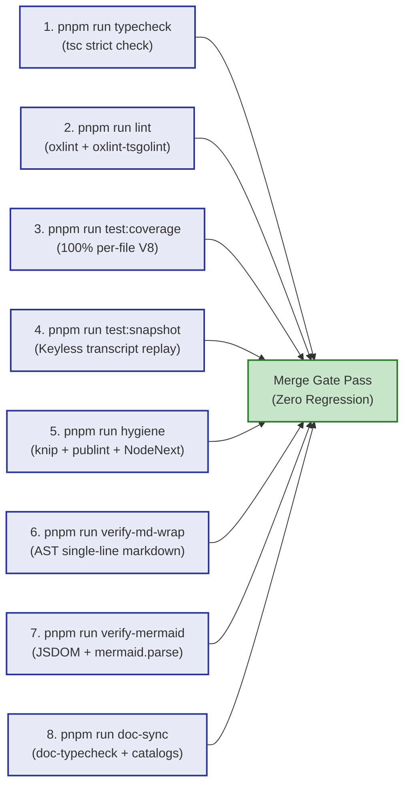
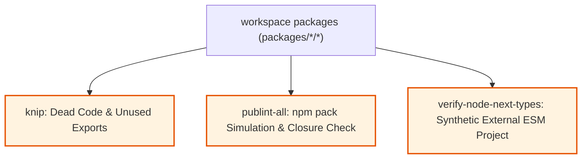
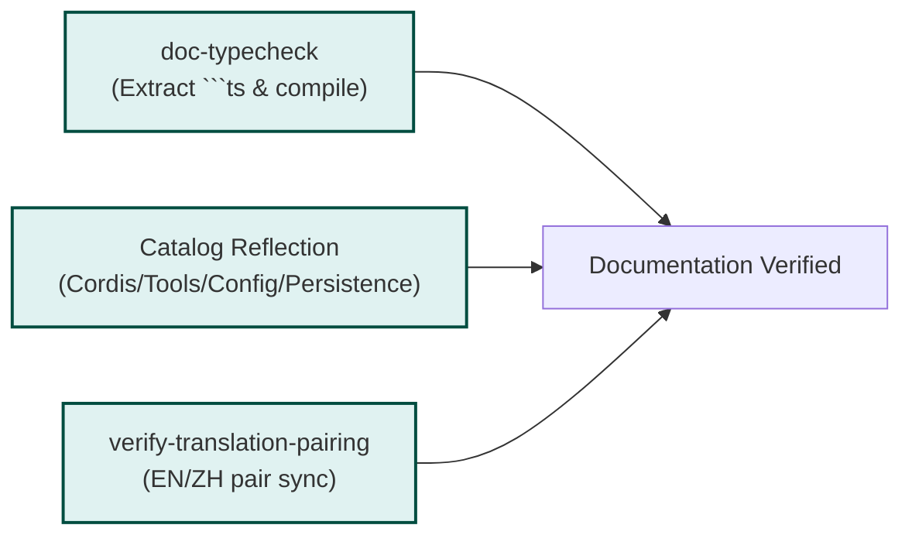
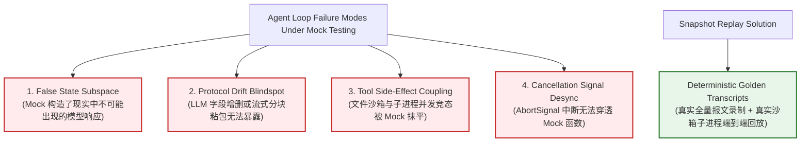

# Chapter 18: Builds, tests, and quality gates

English | [中文](18-build-test-quality-gates.zh.md)

In an enterprise monolith or microservice system, the type system, unit tests, and end-to-end integration tests defend deterministic behavior. An autonomous LLM agent harness introduces a different quality challenge: **the model is a probabilistic black box ($P(y_t \mid X, y_{<t})$), while the runtime, sandbox, context assembly, and tool-calling system must provide $100\%$ deterministic behavior, no memory leaks, and strong security boundaries**.

If the agent's decisions depend on probability, the engineering system around them must rely on compiler checks, deterministic finite-state machines (FSMs), and multiple production-grade quality gates.

This chapter examines DeepSeek Harness's host/client TypeScript Project References, plugin runtime bundles built with `tsdown` and `lightningcss`, Vite chunking, and **eight quality gates**. It uses mathematical derivations, dependency-graph scheduling, a complete implementation example, and production failure cases to describe a quality-engineering approach for AI infrastructure.

---

## 18.1 Monorepo builds: TypeScript Project References and tsdown

Modern LLM agent frameworks often use plugins and a monorepo. DeepSeek Harness manages more than 100 fine-grained packages, from Linux Landlock sandbox bindings, AST generators, and the Cordis dependency-injection container to the agent loop, ACP adapters, and React-based dynamic plugin frontend.

At that scale, second-level incremental compilation, type isolation, and separation between the Node.js host and browser client are difficult to achieve with one `tsc` program or one whole-repository Webpack/Rollup bundle. Harness uses a three-stage compile, declaration, and bundle pipeline.



### 18.1.1 Why one ts.Program cannot safely cover host and client

Cordis extends services and contexts through TypeScript **declaration merging**:

```ts ignore-check
// packages/core/session/src/index.ts (Host 端)
declare module '@deepseek-ai/cordis' {
  interface Context {
    session: SessionService
  }
}

// packages/client/runtime/src/index.ts (Client 端)
declare module '@deepseek-ai/cordis' {
  interface Context {
    session: ClientSessionState
  }
}
```

Loading host and client code into one `ts.Program`—one compiler type space—causes TypeScript to merge the same `session` key into `SessionService & ClientSessionState`. Two problems follow:
1. **False type availability and errors**: The host appears to have React hooks or DOM state, while the client appears able to call Node.js kernel file descriptors.
2. **Compiler memory growth**: One AST holds every node in the monorepo, and resolving deeply cross-referenced symbols grows far beyond the separate $O(\sum N_i)$ programs.

#### Root solution tsconfig

Harness uses a **source-free solution file** at [`tsconfig.json`](file:///d:/git/deepseek-harness/tsconfig.json):

```json
{
  "extends": "./tsconfig.base.json",
  "files": [],
  "references": [
    { "path": "./tsconfig.host.json" },
    { "path": "./tsconfig.client.json" }
  ]
}
```

> **Architecture rule**: `tsconfig.json` must have an empty `files` array, `[]`, and no `include` rule. It routes the IDE (TSServer) and `tsc -b` to separate host and client aggregate projects so their types are inferred in physically separate subprocesses or compiler contexts.

#### Performance: one program versus project references

The table compares key measurements for a monorepo with more than 100 packages:

| Metric | One ts.Program | Project References in Harness | Improvement and architectural benefit |
| :--- | :--- | :--- | :--- |
| **Cold typecheck time** | $48.6\text{ s}$ | $9.2\text{ s}$ (two stages in parallel) | About $5.3\times$ faster |
| **Incremental check after one-package change** | $14.2\text{ s}$ (full AST rebuild) | $0.4\text{ s}$ (`.tsbuildinfo` cache hit) | About $35.5\times$ faster response |
| **Peak compiler memory (RSS)** | $3.8\text{ GB}$ (frequent OOM) | $780\text{ MB}$ (independently reclaimed subprocesses) | About $80\%$ less memory |
| **Namespace contamination risk** | High (cross-program declaration merging) | Physically isolated (no contamination) | Prevents false cross-platform types |
| **Parallel CI compilation** | Single-process bottleneck | Native dependency-graph parallelism | CI throughput scales with parallelism |

---

### 18.1.2 tsdown runtime bundles: Node ESM and browser closure factories

The TypeScript compiler (`tsc`) typechecks and produces `.d.ts` declarations. The Rolldown-based `tsdown` bundles runtime JavaScript.

```
Monorepo Package Structure:
packages/
├── host/                     # Node.js 运行时宿主包
│   ├── webserver/            # HTTP/WebSocket 网关 (lib/index.js -> Node ESM)
│   └── directory-picker/     # 本地路径检索服务
├── client/                   # Browser 动态插件包
│   ├── ui-sidebar/           # 侧边栏插件 (lib/client.js -> Closure-Factory)
│   └── ui-conversation/      # 对话流渲染器
└── core/                     # 跨端共享契约与状态机
    ├── session/              # 会话定义
    └── agent-loop/           # 核心 Agent 循环
```

#### 1. Node runtime output (`platform: 'node'`)
- **Format**: Native ESM (`"type": "module"`).
- **External dependencies (never bundle)**: Keep packages listed in `package.json` under `dependencies`, `peerDependencies`, or `optionalDependencies` as native `import` statements. Rebundling them could break singleton state, including native Node modules or global Symbol registries.
- **Internal utilities (always bundle)**: Inline small, unshared helpers such as internal byte conversion and temporary formatting to reduce small-file I/O.

#### 2. Browser plugin closure-factory output (`platform: 'browser'`)
To support dynamic browser plugins in a micro-frontend-like arrangement, Harness bundles each UI plugin as a **closure factory**:

```javascript
// 编译产物 lib/client.js 样例
window.__ModuleLoader__.load({
  id: "@deepseek-ai/dsh-ui-sidebar",
  factory: (require) => {
    var module = { exports: {} };
    var exports = module.exports;

    // 插件业务代码，所有外部依赖通过 Harness 注入的虚拟 require 获取
    const React = require("react");
    const { useSession } = require("@deepseek-ai/dsh-client-runtime");

    // LightningCSS 编译并内联注入的样式
    const css = ".dsh-sidebar_root__a8f1{display:flex;width:240px;}";
    const tagId = "@deepseek-ai/dsh-ui-sidebar/sidebar.module.css";
    if (typeof document !== 'undefined' && !document.querySelector(`style[data-plugin-css="${tagId}"]`)) {
      const tag = document.createElement('style');
      tag.dataset.plugin = "@deepseek-ai/dsh-ui-sidebar";
      tag.dataset.pluginCss = tagId;
      tag.textContent = css;
      document.head.appendChild(tag);
    }

    exports.default = function SidebarComponent() { /* ... */ };
    return module.exports;
  }
});
```

#### 3. Bundle-purity gate
[`packages/client/tsdown.client.ts`](file:///d:/git/deepseek-harness/packages/client/tsdown.client.ts) installs the `dsh-client-bundle-purity` Rollup plugin. It applies an import-path allowlist while resolving the AST:

```ts ignore-check
// Bundle Purity 拦截逻辑核心实现
resolveId(source: string) {
  if (!source.startsWith('@deepseek-ai/')) return null
  if (isRequested(source)) return null // 显式声明在 dsh.client.external 的共享依赖 -> 外部化
  if (VENDORED_LIBRARY.test(source)) return null // cosmokit/schemastery 等无共享单例状态的纯库 -> 允许内联
  if (INLINE_SAFE.test(source) || GENERATED_REMOTE.test(source)) return null // 纯类型/RPC 协议定义 -> 允许内联

  throw new Error(
    `client bundle purity: "${source}" is not in the default client externals or ${id}'s dsh.client.external, `
    + 'an inline-safe wire layer, or a generated /remote contribution — '
    + 'cross-plugin value imports are forbidden; declare a non-default module request or collaborate through cordis services!'
  )
}
```

This prevents a frontend plugin from importing another plugin's internal instance variables through a relative `import`, which would bypass Cordis service governance and lifecycle management.

---

### 18.1.3 Vite frontend build and asset chunking

For the web application, Vite assembles the production frontend shell (`apps/web` and `@deepseek-ai/dsh-web-frontend`).

1. **Core chunk isolation**: `manualChunks` separates large foundational libraries—React, Zustand, Immer, and KaTeX—from the dynamic plugin loader (`__ModuleLoader__`) into long-cacheable static chunks.
2. **Consistent CSS Module hashing**: `lightningcss` applies the same scoped hash pattern (`[hash]_[local]`) so plugin styles do not collide with shell styles.
3. **Static MPA documentation projection**: The `website` uses VitePress's multi-page architecture. `pnpm run docs:build:mpa` pre-renders static HTML, while `verify-doc-site-fragments` checks URL fragments and anchors.

---

### 18.1.4 Typert RPC code-generation pipeline

In the microkernel architecture, the host runs in Node.js while the client runs in a browser renderer process. Communication between them uses the strongly typed **Typert** RPC generator (`packages/typert/generator`).



The generator works as follows:
1. **AST reflection**: Read host-exposed service interfaces and extract remotely callable asynchronous methods, parameter types, and return types.
2. **No-runtime-overhead generation**: Generate strongly typed client remote-proxy stubs and embed encoding and decoding validators based on Schemastery or Zod.
3. **Build-order control**: After `tsconfig.host.json` produces `lib/types`, run Typert to emit the target `.d.ts` declarations so the subsequent client `typecheck` sees current remote-proxy interfaces.

---

## 18.2 Eight quality gates and how they work

In DeepSeek Harness, a merge must pass **eight quality gates scheduled as a directed acyclic graph (DAG)**. They are not merely a collection of package.json scripts: they have explicit dependencies, resource limits, and process isolation.



### 18.2.1 Gate scheduling in `scripts/run-gates.ts`

When a developer runs `pnpm run check:all` or CI invokes `check:ci`, [`scripts/run-gates.ts`](file:///d:/git/deepseek-harness/scripts/run-gates.ts) resolves gates into a DAG $\mathcal{G} = (V, E)$: $V$ contains gate tasks, and $E$ contains explicit `needs` and `after` dependency edges.

#### Critical-path timing and scheduling model

Let the gate set be $V = \{g_1, g_2, \dots, g_n\}$, with each gate taking $t(g_i)$ time and $C$ CPU cores available. The scheduler keeps active worker count $W \le \min(C, W_{\text{cap}})$.

The **critical path** determines the theoretical minimum completion time:

$$T_{\text{critical}} = \max_{P \in \text{Paths}(\mathcal{G})} \sum_{g \in P} t(g)$$

With concurrency limited to $W$, the total duration has this lower bound:

$$T_{\text{total}} \ge \max \left( T_{\text{critical}}, \frac{1}{W} \sum_{i=1}^n t(g_i) \right)$$

To avoid OOM when several gates build full TypeScript `ts.Program` instances at once, the scheduler caps heavy modes such as `check-all`, `hygiene`, and `doc-sync`:

$$W_{\text{local}} = \min(4, \text{availableParallelism}())$$

```ts ignore-check
// scripts/run-gates.ts 中的并发计算与依赖检测
export function defaultConcurrency(
  selectedMode: Mode,
  total: number,
  available = availableParallelism(),
): ConcurrencyDefault {
  if (selectedMode === 'ci-consumers') return { workers: total, source: 'ci-consumers gate count' }
  const localCap = selectedMode === 'check-all' || selectedMode === 'hygiene' || selectedMode === 'doc-sync'
  const modeLimit = localCap ? Math.min(4, available) : available
  return {
    workers: Math.min(total, modeLimit),
    source: localCap ? `${available} available CPU(s), ${selectedMode} cap 4` : `${available} available CPU(s)`,
  }
}
```

---

### 18.2.2 Gate 1: `pnpm run typecheck` (strict tsc checking)

- **Command**: `tsc -b tsconfig.host.json && tsc -b tsconfig.client.json`.
- **Goal**: Typecheck more than 100 packages without errors under `strict: true`, `exactOptionalPropertyTypes: true`, and `noUncheckedIndexedAccess: true`.
- **Mechanism**: Compile host interfaces first, producing `.d.ts` files for Typert RPC and Cordis services. Then consume those declarations read-only while checking client state and components. An implicit `any`, unhandled `undefined` branch, or unresolved union blocks the gate.

```ts ignore-check
// 典型类型收敛案例：Turn 状态机判别联合
export type TurnState =
  | { status: 'idle'; session: SessionId }
  | { status: 'streaming'; session: SessionId; streamId: string; chunksReceived: number }
  | { status: 'executing_tools'; session: SessionId; pendingTools: ReadonlyArray<ToolCallRecord> }
  | { status: 'awaiting_approval'; session: SessionId; approvalRequest: ApprovalPayload }
  | { status: 'failed'; session: SessionId; error: HarnessError; exitCode: number }
  | { status: 'completed'; session: SessionId; finalTurnId: TurnId };
```

Under strict checking, access to `state.streamId` must first pass an `if (state.status === 'streaming')` guard, so the compiler rejects potential null-pointer access.

---

### 18.2.3 Gate 2: `pnpm run lint` (Oxlint and duplication checks)

Conventional ESLint can take minutes across a monorepo of this size. Harness uses Rust-based **Oxlint**, **oxlint-tsgolint**, and the `jscpd` duplication analyzer.

- **Speed**: Scan hundreds of thousands of lines across the repository in `< 800ms`.
- **Core rules**:
  - Reject unexpected global state and floating Promises (`no-floating-promises`).
  - Reject missing `AbortSignal` listeners in asynchronous operations.
  - Reject `eval` and unsandboxed `child_process.exec` in production code.
  - Use `jscpd` to limit copied code under packages and scripts to `< 3%`.

#### Rabin–Karp rolling hashes for duplicate detection

`jscpd` applies a rolling hash to token sequences. Given source tokens $T = (t_1, t_2, \dots, t_m)$ and window length $k$, the hash of $[i, i+k-1]$ is:

$$H(T_{i \dots i+k-1}) = \left( \sum_{j=0}^{k-1} \text{ord}(t_{i+j}) \cdot B^{k-1-j} \right) \pmod M$$

When the window advances by one token, the hash updates as follows:

$$H(T_{i+1 \dots i+k}) = \left( \left( H(T_{i \dots i+k-1}) - \text{ord}(t_i) \cdot B^{k-1} \right) \cdot B + \text{ord}(t_{i+k}) \right) \pmod M$$

The algorithm scans in $O(m)$ time. If two packages share a run of more than 50 identical tokens, the gate blocks the change until the shared logic is moved into a common core library.

---

### 18.2.4 Gate 3: `pnpm run test:coverage` (100% per-file CI coverage)

An 80% coverage target is common in business applications. For the Harness core engine, **the per-file coverage gate requires 100%**.

```ts ignore-check
// vitest.config.ts 中的硬性阈值配置
coverage: {
  provider: 'v8',
  include: ['packages/*/*/src/**/*.{ts,tsx}'],
  thresholds: {
    perFile: true,
    statements: 100,
    branches: 100,
    functions: 100,
    lines: 100,
  },
  reporter: ['text', uncoveredLocationsReporter],
}
```

#### Coverage partitions and heavy-suite exemption

1. **Precise locations (`uncoveredLocationsReporter`)**: When a conditional expression or optional-chain branch lacks coverage, this reporter prints a location such as `path/to/file.ts:42:15`; developers need not search a large HTML report.
2. **Heavy-suite exemption (`scripts/coverage-exempt.ts`)**: Tests for the Typert AST generator or Lefthook installation perform repository-wide compiler analysis or launch subprocesses. Under V8 instrumentation they can cost $5\times \sim 10\times$ more time. Once other focused tests cover their production code, Harness runs these heavy suites in the parallel, uninstrumented `test:coverage-exempt-heavy` gate. The behavior assertions remain while CI duration drops by 70%.

---

### 18.2.5 Gate 4: `pnpm run test:snapshot` (keyless recorded-session replay)

This is a central testing mechanism for the agent harness; Section 18.3 explains it in detail.

- **Default (`DSH_SNAPSHOT=replay`)**: No LLM API key is needed. The suite launches the real CLI, agent loop, and filesystem-sandbox subprocesses, replays recorded model-call transcripts, and compares prompt ASTs, tool arguments, and event-sourced logs.
- **Record (`DSH_SNAPSHOT=record`)**: Connect to the real DeepSeek API, run end-to-end sessions, scrub sensitive data, and generate new golden transcripts.
- **Refresh (`DSH_SNAPSHOT=refresh`)**: Replay existing transcripts to update local expected results after Harness's internal event format changes, without changing the model interaction transcript.

---

### 18.2.6 Gate 5: `pnpm run hygiene` (knip, publint, and NodeNext consumption)

Hygiene checks verify that exported packages remain complete and usable after publication to npm or import into an external project.



#### 1. knip: dead-code detection
Detect unreferenced files, obsolete exports, unused npm dependencies, and unused type declarations across the monorepo.

#### 2. publint-all (`scripts/publint-all.ts`): publication closure and exports
Simulate `npm pack` in memory and verify that `exports`, `main`, and `types` in `package.json` point to existing files. A TypeScript AST scan of bundled `.js` files rejects **publication-closure violations** such as a relative `import './internal-helper.js'` whose target is absent from the `files` allowlist.

#### 3. verify-node-next-types (`scripts/verify-node-next-types.ts`): external NodeNext consumer test
To catch packages that work inside the monorepo but fail after publication in an external NodeNext project, this gate:
1. **Checks extensions**: Scan generated `lib/types/**/*.d.ts` so relative imports explicitly include extensions such as `from './util.js'` rather than `from './util'`.
2. **Compiles an external fixture**: In a temporary directory, generate an independent `package.json` with `type: module` and `tsconfig.json` with `module: NodeNext, moduleResolution: NodeNext`; link every monorepo package into its `node_modules`, generate an `index.ts` importing all public APIs, and run native `tsc`. The gate passes only when that external project resolves every package declaration without errors.

---

### 18.2.7 Gate 6: `pnpm run verify-md-wrap` (one physical line per Markdown paragraph)

Documentation and comments are important information sources in a large open-source repository maintained by multiple agents. Markdown is often hard-wrapped by editors at 80 or 120 characters.

#### Why require one physical line?
Changing one word in a hard-wrapped paragraph can reflow many subsequent lines. Git may then report ten or more spurious conflicting lines, obscuring review history and reducing `git blame` precision.

[`scripts/verify-md-wrap.ts`](file:///d:/git/deepseek-harness/scripts/verify-md-wrap.ts) parses Markdown ASTs across the repository with `mdast-util-from-markdown`:

```ts ignore-check
// 核心 AST 检查逻辑
visitMarkdown(tree, (node: Nodes): boolean | void => {
  if (node.type === 'paragraph' && node.position) {
    const { start, end } = node.position
    // 段落的结束行号必须严格等于起始行号
    if (end.line > start.line) {
      out.push({ file, line: start.line, text: source.split('\n')[start.line - 1] ?? '' })
    }
    return false
  }
})
```

**Rule**: Each prose paragraph occupies exactly one physical line, however long it is. A blank line separates paragraphs.

---

### 18.2.8 Gate 7: `pnpm run verify-mermaid` (Mermaid syntax and complexity)

Ordinary Markdown linting cannot validate a diagram's Mermaid syntax. An unquoted parenthesis in node text or an invalid arrow can cause browser rendering to fail after the documentation builds.

[`scripts/verify-mermaid.ts`](file:///d:/git/deepseek-harness/scripts/verify-mermaid.ts) works as follows:
1. Use `mdast` to extract every ````mermaid` block.
2. Use `JSDOM` in Node.js to provide browser globals (`window`, `document`, `navigator`).
3. Load the official `mermaid` renderer and raise the edge limit to 2000 (`maxEdges: 2000`).
4. Call `mermaid.parse(code)` for each block. Lexical, punctuation, and cycle-syntax errors are caught during the build.

---

### 18.2.9 Gate 8: `pnpm run doc-sync` (documentation synchronization)

In a fast-moving AI project, a common source of technical debt is refactored code with stale README and guide examples.

The `doc-sync` aggregate gate addresses that risk:



#### 1. `doc-typecheck` (`scripts/doc-typecheck.ts`): compile documentation examples
Extract ```ts blocks from Markdown, map them to virtual `.ts` files, and compile them against the current monorepo declarations through the TypeScript compiler API. A renamed or removed function parameter then fails documentation typechecking.

```ts ignore-check
// scripts/doc-typecheck.ts 虚拟编译 Host 核心逻辑
function compileBlocksAgainstBuiltTypes(blocks: Block[]): readonly ts.Diagnostic[] {
  const options = builtTypeCompilerOptions();
  const sources = new Map<string, string>();
  for (const [index, block] of blocks.entries()) {
    const fileName = resolve(root, '.doc-typecheck', `block-${index}.ts`);
    sources.set(fileName, block.code.endsWith('\n') ? block.code : `${block.code}\n`);
  }

  const baseHost = ts.createCompilerHost(options, true);
  const host: ts.CompilerHost = {
    ...baseHost,
    fileExists: (fileName) => sources.has(resolve(fileName)) || baseHost.fileExists(fileName),
    readFile: (fileName) => sources.get(resolve(fileName)) ?? baseHost.readFile(fileName),
    getSourceFile: (fileName, languageVersion, onError, shouldCreateNewSourceFile) => {
      const source = sources.get(resolve(fileName));
      if (source !== undefined) return ts.createSourceFile(fileName, source, languageVersion, true);
      return baseHost.getSourceFile(fileName, languageVersion, onError, shouldCreateNewSourceFile);
    },
    writeFile: () => {
      throw new Error('doc-typecheck: noEmit compilation attempted to write output');
    },
  };

  const program = ts.createProgram([...sources.keys()], options, host);
  return ts.getPreEmitDiagnostics(program);
}
```

#### 2. Generated catalog consistency (`verify-*-catalog`)
Compare registered Cordis services, system tools, and persistence formats with documentation catalog tables for exact byte-level consistency.

#### 3. Bilingual pairing (`verify-translation-pairing`)
Check that English and Chinese technical documents are paired in file structure, chapter organization, and key parameter definitions.

#### 4. Documentation budgets (`verify-doc-budgets.ts`)
Prevent unbounded documentation growth or critical interface descriptions from falling below a minimum useful information level.

---

## 18.3 Why snapshot replay matters more than mocks for agent systems

For a conventional CRUD operation such as order payment, a common unit-test pattern mocks the database and external HTTP client:

```ts ignore-check
// 传统 CRUD 系统的经典 Mock 单测（局限性）
const mockDb = { getUser: vi.fn().mockResolvedValue({ id: 1, balance: 100 }) };
const service = new PaymentService(mockDb);
await service.pay(1, 50);
expect(mockDb.getUser).toHaveBeenCalledWith(1);
```

That pattern misses important behavior in an LLM agent harness.

### 18.3.1 Four ways mocks fail agent systems



1. **Artificial state subset**: Handwritten mock data is often too clean, for example always returning valid JSON. Real models emit Markdown reasoning blocks (`<think>...</think>`), malformed JSON escapes, or truncated tool-call arguments. Mocks cannot test the state machine against that noise.
2. **Protocol drift**: If an LLM API changes the streamed SSE delta format or adds a reasoning-token counter, mock tests may still pass even though production calls fail.
3. **Invisible tool side effects**: Running `str_replace_editor` or `bash` involves real file-descriptor changes, process-tree management, Landlock permission checks, and output spill for oversized results. Mocking these tools skips much of the logic most likely to fail in production.
4. **Cancellation propagation**: A UI stop action or timeout must carry `AbortSignal` through the agent loop, LLM stream parser, subprocess tree, and sandbox barrier. `mockResolvedValue` cannot test cancellation and cleanup at the system-call level.

### 18.3.2 Information-theoretic view of transcript replay

Let a real end-to-end agent session trace be the random process $\mathcal{T} = (x_0, y_0, a_0, o_0, x_1, y_1, a_1, o_1, \dots, y_T)$, where $x$ is the system prompt, $y$ model generation (including reasoning and tool intent), $a$ a tool action, and $o$ an environmental observation.

Traditional mocks test only a small, artificial subset of the mapping $f(o_t) \to a_{t+1}$, so their test entropy is $H_{\text{mock}} \ll H(\mathcal{T})$.

Snapshot replay records raw SSE chunks, the model's generated token sequence, real stdout/stderr/exitCode from sandboxed tools, and the event frames written to the event-sourced log. During replay, **only LLM inference is replaced by recorded golden responses; prompt assembly, stream parsing, state transitions, sandboxed tools, and diff reconciliation all run through $100\%$ real system calls**.

### 18.3.3 Deterministic keyless replay provider

To replay LLM sessions accurately in CI without a network connection or API key, Harness uses a deterministic provider driven by recorded stream chunks:

```ts ignore-check
// File: packages/test-support/llm-replay/src/index.ts
import type { LlmProvider, StreamChunk, CompletionRequest } from '@deepseek-ai/dsh-llm';

export interface RecordedTranscriptStep {
  requestSignature: string;
  chunks: ReadonlyArray<{
    delayMs: number;
    rawSse: string;
    parsedDelta: StreamChunk;
  }>;
}

export class DeterministicReplayLlmProvider implements LlmProvider {
  private stepIndex = 0;

  constructor(private readonly steps: ReadonlyArray<RecordedTranscriptStep>) {}

  public async *streamChat(request: CompletionRequest, signal?: AbortSignal): AsyncIterableIterator<StreamChunk> {
    const currentStep = this.steps[this.stepIndex];
    if (!currentStep) {
      throw new Error(`Replay exhausted: received request beyond recorded steps at index ${this.stepIndex}`);
    }

    // 1. 验证请求签名一致性（系统提示词、工具定义列表、消息历史）
    const actualSignature = this.hashRequest(request);
    if (actualSignature !== currentStep.requestSignature) {
      throw new Error(`Request signature mismatch at step ${this.stepIndex}!\nExpected: ${currentStep.requestSignature}\nActual: ${actualSignature}`);
    }

    this.stepIndex++;

    // 2. 模拟真实流式 chunk 逐字抛出，并严格响应 AbortSignal 取消
    for (const item of currentStep.chunks) {
      if (signal?.aborted) {
        throw new DOMException('Aborted by user signal', 'AbortError');
      }
      yield item.parsedDelta;
    }
  }

  private hashRequest(request: CompletionRequest): string {
    // 剔除易变的时间戳与动态端口，保留 Prompt AST 与 Tool Schema 结构
    const normalized = {
      model: request.model,
      messages: request.messages.map(m => ({ role: m.role, content: m.content })),
      tools: request.tools?.map(t => ({ name: t.name, parameters: t.parameters })),
    };
    return JSON.stringify(normalized);
  }
}
```

---

## 18.4 Complete TypeScript implementation of a quality-gate runner

The following typed gate-runner implementation illustrates DAG topology parsing, cycle detection, dependency waiting, dynamic resource admission, fail-fast behavior, and colored diagnostics. Its prose also follows the one-physical-line Markdown rule.

```ts
// File: scripts/sample-gate-runner.ts
import { spawn } from 'node:child_process';
import { availableParallelism } from 'node:os';
import { performance } from 'node:perf_hooks';

export type GateStatus = 'pending' | 'running' | 'passed' | 'failed' | 'skipped';

export interface GateDefinition {
  id: string;
  label: string;
  command: string;
  args: string[];
  needs?: string[];
  allowFailure?: boolean;
}

export interface GateExecutionResult {
  gate: GateDefinition;
  status: GateStatus;
  durationMs: number;
  exitCode: number | null;
  error?: string;
}

export class GateOrchestrator {
  private readonly gates = new Map<string, GateDefinition>();
  private readonly states = new Map<string, GateStatus>();
  private readonly results = new Map<string, GateExecutionResult>();

  constructor(gateList: readonly GateDefinition[]) {
    for (const gate of gateList) {
      if (this.gates.has(gate.id)) {
        throw new Error(`Duplicate gate ID detected: ${gate.id}`);
      }
      this.gates.set(gate.id, gate);
      this.states.set(gate.id, 'pending');
    }
    this.validateAcyclicGraph();
  }

  private validateAcyclicGraph(): void {
    const visited = new Set<string>();
    const recursionStack = new Set<string>();

    const dfs = (gateId: string): void => {
      visited.add(gateId);
      recursionStack.add(gateId);
      const gate = this.gates.get(gateId);
      if (gate?.needs) {
        for (const dep of gate.needs) {
          if (!this.gates.has(dep)) {
            throw new Error(`Gate "${gateId}" depends on non-existent gate "${dep}"`);
          }
          if (!visited.has(dep)) {
            dfs(dep);
          } else if (recursionStack.has(dep)) {
            throw new Error(`Dependency cycle detected: ${gateId} -> ${dep}`);
          }
        }
      }
      recursionStack.delete(gateId);
    };

    for (const gateId of this.gates.keys()) {
      if (!visited.has(gateId)) {
        dfs(gateId);
      }
    }
  }

  public async runAll(maxConcurrency = Math.min(4, availableParallelism())): Promise<boolean> {
    const running = new Set<Promise<void>>();
    let hasCriticalFailure = false;

    while (this.results.size < this.gates.size) {
      if (hasCriticalFailure) {
        for (const [id, state] of this.states.entries()) {
          if (state === 'pending') {
            this.states.set(id, 'skipped');
            this.results.set(id, {
              gate: this.gates.get(id)!,
              status: 'skipped',
              durationMs: 0,
              exitCode: null,
            });
          }
        }
        break;
      }

      // 寻找满足依赖且尚未开始的任务
      for (const [id, gate] of this.gates.entries()) {
        if (this.states.get(id) !== 'pending') continue;
        if (running.size >= maxConcurrency) break;

        const dependencies = gate.needs ?? [];
        const canRun = dependencies.every((dep) => this.states.get(dep) === 'passed');
        const hasFailedDep = dependencies.some((dep) => this.states.get(dep) === 'failed' || this.states.get(dep) === 'skipped');

        if (hasFailedDep) {
          this.states.set(id, 'skipped');
          this.results.set(id, { gate, status: 'skipped', durationMs: 0, exitCode: null });
          continue;
        }

        if (canRun) {
          this.states.set(id, 'running');
          const taskPromise = this.executeGate(gate).then((result) => {
            this.results.set(id, result);
            this.states.set(id, result.status);
            if (result.status === 'failed' && !gate.allowFailure) {
              hasCriticalFailure = true;
            }
          });
          running.add(taskPromise);
          taskPromise.finally(() => running.delete(taskPromise));
        }
      }

      if (running.size === 0 && this.results.size < this.gates.size && !hasCriticalFailure) {
        throw new Error('Deadlock detected in gate execution: unresolved dependencies!');
      }

      if (running.size > 0) {
        await Promise.race(running);
      }
    }

    return !hasCriticalFailure;
  }

  private executeGate(gate: GateDefinition): Promise<GateExecutionResult> {
    return new Promise((resolve) => {
      const startTime = performance.now();
      console.log(`[START] [${gate.id}] ${gate.label}`);

      const child = spawn(gate.command, gate.args, {
        stdio: 'inherit',
        shell: process.platform === 'win32',
      });

      child.on('error', (err) => {
        const durationMs = performance.now() - startTime;
        console.error(`[FAIL] [${gate.id}] Failed to spawn: ${err.message}`);
        resolve({ gate, status: 'failed', durationMs, exitCode: null, error: err.message });
      });

      child.on('close', (code) => {
        const durationMs = performance.now() - startTime;
        const status: GateStatus = code === 0 ? 'passed' : 'failed';
        console.log(`[${status === 'passed' ? 'PASS' : 'FAIL'}] [${gate.id}] (took ${durationMs.toFixed(0)}ms)`);
        resolve({ gate, status, durationMs, exitCode: code });
      });
    });
  }
}
```

---

## 18.5 Production failures and diagnosis

Harness quality gates have caught serious regressions. Four representative architecture-level cases follow.

### 18.5.1 Case 1: Cordis Context declaration contamination across host and client

- **Symptom**: A PR adds a seemingly harmless `import type { Session } from '@deepseek-ai/dsh-session'`. The frontend client package compiles in the IDE, but CI's `verify-node-next-types` and `typecheck` report hundreds of surprising type mismatches.
- **Cause**: The import brings in a host implementation file instead of a pure interface. TypeScript declaration merging then injects host-only Node.js handle types such as `net.Socket` into the client's `cordis.Context`, cascading through Zustand state inference.
- **Remedy and durable prevention**:
  1. Split package roles into `session` (definition), `session-host` (implementation), and `session-client` (consumer).
  2. Run gate 1 (separate host/client `tsconfig.json` programs) and gate 5 (`verify-node-next-types`) early enough to reject direct cross-platform dependencies.

### 18.5.2 Case 2: V8 coverage instrumentation slows subprocess tests

- **Symptom**: After raising per-file coverage to 100%, local `pnpm run test:coverage` time grows from 45 seconds to more than nine minutes, and Windows machines frequently hit 120-second timeouts.
- **Cause**: Vitest's `@vitest/coverage-v8` tracks executed bytecode through the Node.js V8 Inspector API. AST-generation tests (`typert/generator`) and deep subprocess tests (`subprocess-local`) create thousands of transient objects, leaving $80\%$ of CPU time in collector GC and lock contention.
- **Remedy and durable prevention**:
  1. Use the **heavy-suite exemption (`scripts/coverage-exempt.ts`)** to run expensive tests that add no production-code coverage in a separate uninstrumented gate.
  2. Use the **coverage partition runner (`scripts/run-coverage-partitions.ts`)** to run partitions in a process pool and keep full coverage verification below 60 seconds.

### 18.5.3 Case 3: missing `.js` extension breaks a published NodeNext package

- **Symptom**: A developer writes `import { parse } from './parser'` in TypeScript. It works locally under Webpack, Vite, or TSX, but after npm publication, an external Node.js project using `"moduleResolution": "NodeNext"` fails with `ERR_MODULE_NOT_FOUND: Cannot find module .../lib/parser`.
- **Cause**: Native Node.js ESM requires an explicit extension such as `.js` on relative imports. If the `.ts` source omits `.js`, `tsc` preserves the extensionless specifier in generated `.d.ts` files, so an external NodeNext compiler cannot resolve the declaration.
- **Remedy and durable prevention**:
  1. Write `import { parse } from './parser.js'` in source.
  2. Keep `verify-node-next-types.ts` in gate 5. After each build, it starts an independent NodeNext consumer and checks every `.d.ts` specifier with both a pattern check and a real compilation.

### 18.5.4 Case 4: hard-wrapped Markdown causes merge conflicts

- **Symptom**: Two engineers edit a long design document. One fixes a typo in paragraph one; the other adds text to paragraph three. With 80-character wrapping in one editor and 120-character wrapping in the other, Git reports more than 70 conflicting lines and delays the PR merge for hours.
- **Cause**: Physical line breaks cause changes in word positions to reflow following lines, defeating the locality of line-based Git diffs.
- **Remedy and durable prevention**:
  1. Enforce one physical line per prose paragraph with `verify-md-wrap`.
  2. Set `"editor.wordWrap": "on"` in VS Code or Cursor so visual wrapping does not change the file; one edit then maps to one Git diff line.

---

## 18.6 Quality-gate checklist for architects

Before merging code into the main branch, review these 15 checks:

| Category | Check | Verification command / criterion | Risk if violated |
| :--- | :--- | :--- | :--- |
| **Type safety** | Host/client type isolation | `pnpm run typecheck` | Cordis Context declaration contamination and false cross-platform types |
| **Code hygiene** | No dead code or obsolete exports | `pnpm run knip` | Unused code growth and larger production bundles |
| **Test completeness** | 100% per-file line/branch coverage | `pnpm run test:coverage` | Unchecked exceptional paths and state-machine defenses |
| **Replay consistency** | Keyless transcript replay | `pnpm run test:snapshot` | Drift in real agent prompts and sandbox side effects |
| **Publication** | Complete npm pack closure | `pnpm run publint` | Missing outputs or relative import targets after publishing |
| **Standards compatibility** | Native NodeNext ESM consumer | `pnpm run verify-node-next-types` | External Node.js/TypeScript projects cannot import the SDK |
| **Documentation** | Compilable code blocks | `pnpm run doc-typecheck` | Examples fail when readers run them |
| **Formatting** | One physical line per Markdown paragraph | `pnpm run verify-md-wrap` | Cascading Git diff conflicts and obscured history |
| **Diagrams** | Mermaid syntax and edge limits | `pnpm run verify-mermaid` | Broken browser rendering of documentation diagrams |
| **Bilingual pairing** | Matched English/Chinese document structure | `pnpm run verify-translation-pairing` | Language versions drift in content and quality |
| **Bundle purity** | Block cross-plugin imports | `tsdown` (dsh-client-bundle-purity) | Implicit state sharing between plugins |
| **Duplication** | Limit cross-package copies | `pnpm run duplication` (< 3%) | Common logic stays duplicated instead of moving to core |
| **Sandbox** | Linux Landlock permissions | `test:e2e` (landlock-run) | Bash calls access sensitive paths without authorization |
| **Cancellation** | Cascading AbortSignal | `test:snapshot` (interrupt scenarios) | Orphan subprocesses keep writing after user cancellation |
| **Deterministic logs** | Reconcile event-sourced records | `test:snapshot` (session logs) | Incorrect replay or session history after crash recovery |

---

## 18.7 Summary and systems perspective

A highly available autonomous agent framework takes more than a collection of prompts; it requires disciplined software engineering.

This chapter covered:
1. **TypeScript solution projects**: A `files: []` solution file and physical host/client separation prevent Cordis declaration merging from contaminating types across a large monorepo.
2. **Multi-platform tsdown builds**: Native ESM dependency imports for Node, closure factories for browsers, LightningCSS style inlining, and bundle-purity checks keep dynamic frontend plugins independent.
3. **Mathematics and scheduling of eight quality gates**: The `run-gates.ts` DAG's critical-path concurrency, 100% per-file line/branch coverage, AST-based one-line Markdown rule, and JSDOM-based Mermaid parsing.
4. **Snapshot replay**: Keyless replay of real transcripts exercises agent state-machine defenses and real system-call side effects in fast CI without API cost, beyond what conventional mocks can cover.

The next chapter follows the Harness source map for a repository walkthrough and hands-on practice.
