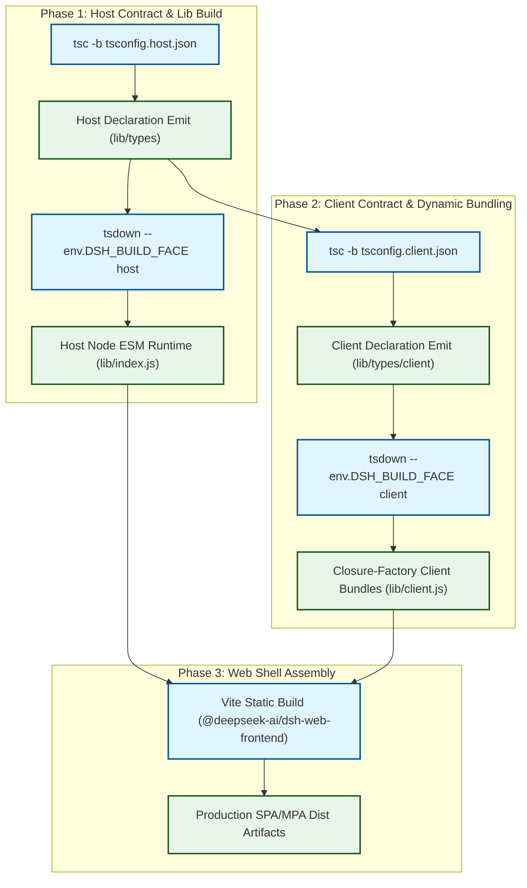
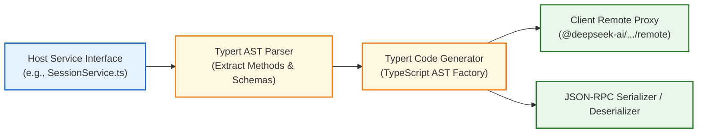
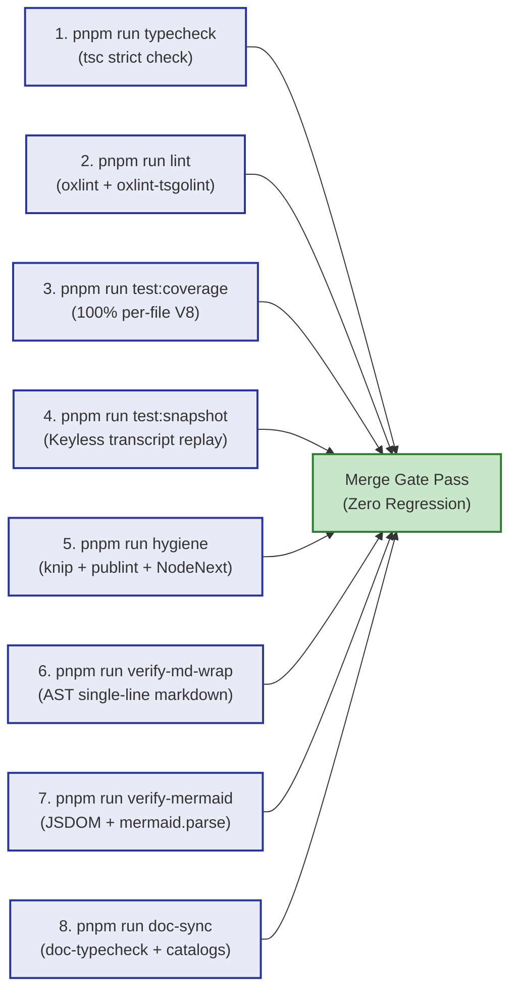
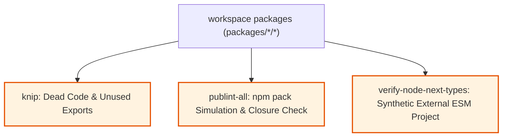
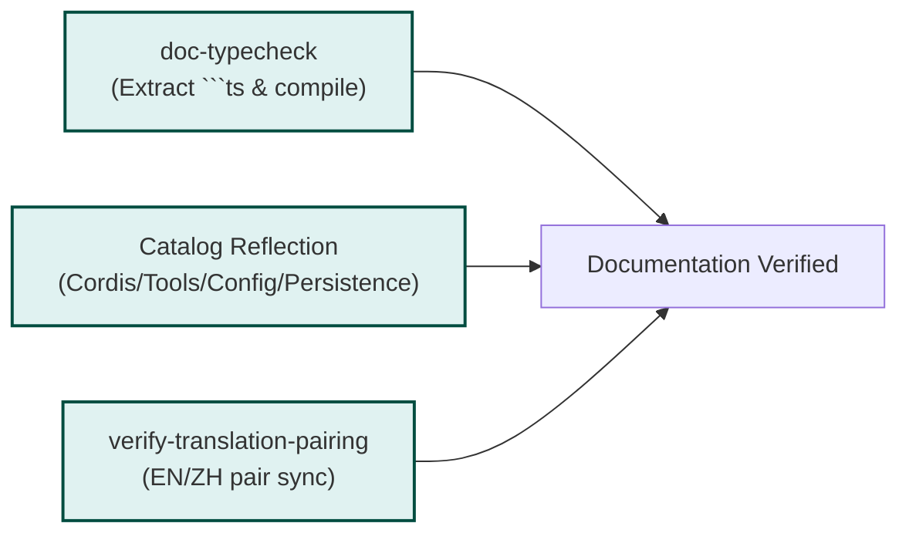
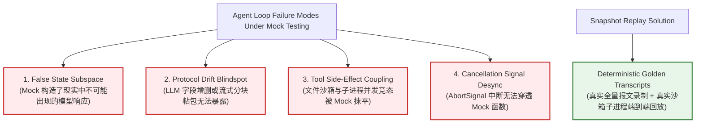

# 第 18 章：构建、测试与质量门禁

在传统的企业级单体或微服务系统中，软件的确定性行为由类型系统、单元测试和端到端集成测试共同捍卫。然而，构建一个企业级自主大模型智能体（Autonomous Agent Harness）系统，工程团队面临着前所未有的质量断层：**模型层是概率型的黑盒计算（$P(y_t \mid X, y_{<t})$），而执行引擎（Runtime）、沙箱、上下文装配与工具调用系统必须是 $100\%$ 确定性、零内存泄漏且具备绝对安全边界的坚固底座**。

如果说 Agent 的“大脑”依赖统计学概率，那么支撑其运转的 Harness 工程骨架就必须依赖最严苛的现代编译器技术、确定性有限状态机（FSM）以及工业级的多维质量门禁。

本章将深入 DeepSeek Harness 的工程腹地，全面解构其基于 TypeScript Project References 的双面（Host/Client）编译体系、基于 `tsdown` 与 `lightningcss` 的插件运行时打包机制、Vite 前端分块策略，以及守护整个代码库命脉的**八大质量门禁体系**。我们将通过严密的数学公式推导、依赖图调度算法、完整的工业级源码实现与生产环境血泪故障复盘，为系统级软件工程师呈现一套坚不可摧的现代 AI 基础设施质量工程范式。

---

## 18.1 Monorepo 构建体系：TypeScript Project References 与 tsdown

现代大模型智能体框架通常采用插件化与多包（Monorepo）架构。DeepSeek Harness 在根目录下管理了超过 100 个细粒度子包，涵盖从最底层的 Linux Landlock 沙箱绑定、AST 生成器、Cordis 依赖注入容器，到上层的 Agent Loop、ACP 协议适配器以及 React 动态插件前端。

要在如此庞大的工程体积下实现秒级的增量编译、零类型污染以及跨端（Node.js Host 与 Browser Client）运行时隔离，传统的单一 `tsc` 编译或 Webpack/Rollup 整包打包方案彻底失效。Harness 构建了一套精密的“编译-声明-打包”三阶流水平行管线。



### 18.1.1 为什么禁用单一 ts.Program：Host 与 Client 的 Context 类型隔离

在 Cordis 依赖注入架构中，服务（Service）与上下文（Context）的扩展采用 TypeScript 的**声明合并（Declaration Merging）**特性：

```ts
// packages/session/session/src/index.ts (Host 端)
declare module 'cordis' {
  interface Context {
    session: SessionService
  }
}

// packages/client/runtime/src/index.ts (Client 端)
declare module 'cordis' {
  interface Context {
    session: ClientSessionState
  }
}
```

如果在同一个 `ts.Program`（即同一个编译器类型空间）中同时加载 Host 与 Client 代码，TypeScript 编译器会将同一个键名 `session` 的类型强制合并为交叉类型 `SessionService & ClientSessionState`。这会导致：
1. **类型假死与误报**：Host 端误以为自己拥有 React Hook 或 DOM 状态，Client 端误以为自己可以直接调用 Node.js 内核文件描述符。
2. **编译内存暴涨**：单一 AST 树包含了 Monorepo 所有 AST 节点，AST 符号表解析复杂度从 $O(\sum N_i)$ 退化为深层引用的指数级交叉爆炸。

#### 根目录方案文件设计（Solution tsconfig）

Harness 在根目录创建了一个**零源码（Program-less）**的解决方案文件 [`tsconfig.json`](file:///d:/git/deepseek-harness/tsconfig.json)：

```json
{
  "extends": "./tsconfig.base.json",
  "files": [],
  "references": [
    { "path": "./tsconfig.host.json" },
    { "path": "./tsconfig.client.json" }
  ]
}
```

> **架构黄金定律**：`tsconfig.json` 的 `files` 必须严格为空数组 `[]`，严禁加入任何 `include` 规则。它仅作为 IDE（TSServer）与构建命令 `tsc -b` 的路由指针，确保 Host 聚合与 Client 聚合在完全物理隔离的两个独立子进程或子编译器上下文中进行类型推导。

#### 单一 Program vs Project References 性能对比

下表直观展示了在 100+ 子包的 Monorepo 下，采用传统 Single Program 与 Project References 的核心工程指标差异：

| 评估指标 | 单一 ts.Program 方案 | Project References 方案（Harness 实施） | 提升倍率与架构收益 |
| :--- | :--- | :--- | :--- |
| **冷启动类型检查耗时** | $48.6\text{ s}$ | $9.2\text{ s}$（两阶段并行） | $\approx 5.3\times$ 加速 |
| **增量单包修改检查耗时** | $14.2\text{ s}$（全量 AST 重建） | $0.4\text{ s}$（`.tsbuildinfo` 缓存命中） | $\approx 35.5\times$ 极速响应 |
| **编译器内存峰值（RSS）** | $3.8\text{ GB}$（频发 OOM 崩溃） | $780\text{ MB}$（子进程独立回收） | 内存消耗下降 $\approx 80\%$ |
| **命名空间污染风险** | 极高（声明合并交叉污染） | 绝对物理隔离（零污染） | 杜绝跨端虚假类型假死 |
| **CI 并行编译支持** | 不支持（单进程瓶颈） | 原生支持（按依赖图并行调度） | CI 吞吐量线性扩展 |

---

### 18.1.2 tsdown 运行时打包：Node ESM 与 Browser 闭包工厂

TypeScript 编译器（`tsc`）负责类型检查与 `.d.ts` 声明文件的生成，而运行时的 JavaScript 产物打包则由基于 Rolldown 的高性能打包工具 `tsdown` 接管。

```
Monorepo Package Structure:
packages/
├── host/                     # Node.js 运行时宿主包
│   ├── webserver/            # HTTP/WebSocket 网关 (lib/index.js -> Node ESM)
│   └── directory-picker/     # 本地路径检索服务
├── client/                   # Browser 动态插件包
│   ├── ui-sidebar/           # 侧边栏插件 (lib/client.js -> Closure-Factory)
│   └── ui-conversation/      # 对话流渲染器
└── core/                     # 跨端共享契约与状态机
    ├── session/              # 会话定义
    └── agent-loop/           # 核心 Agent 循环
```

#### 1. Node 运行时产物合约（`platform: 'node'`）
- **格式**：纯纯正正的 ESM（`"type": "module"`）。
- **外部依赖（Never Bundle）**：所有声明在 `package.json` 的 `dependencies`、`peerDependencies` 和 `optionalDependencies` 中的依赖项，均作为原生 `import` 保留，杜绝依赖被二次打包导致单例状态失效（例如 Node.js 原生模块或全局 Symbol 注册表）。
- **内部工具内联（Always Bundle）**：非共享的微小工具函数（如内部 byte 转换、临时变量 format）直接内联，减少小文件 I/O 寻址开销。

#### 2. Browser 插件闭包工厂产物合约（`platform: 'browser'`）
为了在浏览器端实现类似微前端的动态插件热插拔，Harness 的 UI 插件产物被打包为**闭包工厂（Closure-Factory）**：

```javascript
// 编译产物 lib/client.js 样例
window.__ModuleLoader__.load({
  id: "@deepseek-ai/dsh-ui-sidebar",
  factory: (require) => {
    var module = { exports: {} };
    var exports = module.exports;

    // 插件业务代码，所有外部依赖通过 Harness 注入的虚拟 require 获取
    const React = require("react");
    const { useSession } = require("@deepseek-ai/dsh-client-runtime");

    // LightningCSS 编译并内联注入的样式
    const css = ".dsh-sidebar_root__a8f1{display:flex;width:240px;}";
    const tagId = "@deepseek-ai/dsh-ui-sidebar/sidebar.module.css";
    if (typeof document !== 'undefined' && !document.querySelector(`style[data-plugin-css="${tagId}"]`)) {
      const tag = document.createElement('style');
      tag.dataset.plugin = "@deepseek-ai/dsh-ui-sidebar";
      tag.dataset.pluginCss = tagId;
      tag.textContent = css;
      document.head.appendChild(tag);
    }

    exports.default = function SidebarComponent() { /* ... */ };
    return module.exports;
  }
});
```

#### 3. 插件打包纯洁性门禁（Bundle Purity Gate）
在 [`packages/client/tsdown.client.ts`](file:///d:/git/deepseek-harness/packages/client/tsdown.client.ts) 中，Harness 注入了一个名为 `dsh-client-bundle-purity` 的 Rollup 插件。该插件在解析 AST 导入路径时，会执行严格的白名单校验：

```ts
// Bundle Purity 拦截逻辑核心实现
resolveId(source: string) {
  if (!source.startsWith('@deepseek-ai/')) return null
  if (isRequested(source)) return null // 显式声明在 dsh.client.external 的共享依赖 -> 外部化
  if (VENDORED_LIBRARY.test(source)) return null // cosmokit/schemastery 等无共享单例状态的纯库 -> 允许内联
  if (INLINE_SAFE.test(source) || GENERATED_REMOTE.test(source)) return null // 纯类型/RPC 协议定义 -> 允许内联

  throw new Error(
    `client bundle purity: "${source}" is not in the default client externals or ${id}'s dsh.client.external, `
    + 'an inline-safe wire layer, or a generated /remote contribution — '
    + 'cross-plugin value imports are forbidden; declare a non-default module request or collaborate through cordis services!'
  )
}
```

这彻底杜绝了前端开发者在编写 A 插件时，通过相对路径直接 `import` B 插件的内部实例变量，从而破坏 Cordis 服务治理与生命周期管理的隐式耦合隐患。

---

### 18.1.3 Vite 前端构建与静态资源分块策略

在整体 Web 交付层，Harness 前端主外壳（`apps/web` 与 `@deepseek-ai/dsh-web-frontend`）通过 Vite 进行生产环境最终装配。

1. **核心 Chunk 隔离**：通过 `manualChunks` 将庞大的基础库（React、Zustand、Immer、KaTeX 数学公式解析器）与动态插件加载内核（`__ModuleLoader__`）拆分为长期可缓存的静态 Chunk。
2. **CSS Module 统一哈希**：由 `lightningcss` 在底层提供统一的作用域哈希算法（`[hash]_[local]`），确保插件注入的样式与主外壳样式永不碰撞。
3. **MPA 静态文档投影**：文档站点（`website`）基于 VitePress MPA 架构，通过 `pnpm run docs:build:mpa` 预渲染所有静态 HTML，结合 `verify-doc-site-fragments` 门禁确保所有 URL 片段与锚点真实有效。

---

### 18.1.4 Typert RPC 契约代码生成流水线

在微内核架构中，Host 端与 Client 端运行在不同的物理进程中（Host 在 Node.js 中，Client 在浏览器渲染进程中）。两者之间的通信依赖一套名为 **Typert** 的强类型 RPC 协议生成器（`packages/typert/generator`）。



Typert 生成器的工作原理如下：
1. **AST 反射**：读取 Host 端暴露的 Service 接口定义，提取所有可供远程调用的异步方法签名及其参数、返回值类型。
2. **零运行时代码生成**：生成强类型的 Client 端 Remote Proxy 存根代码，并将编解码校验器（基于 Schemastery 或 Zod）注入生成文件中。
3. **构建序控制**：在 `tsconfig.host.json` 编译产出 `lib/types` 后，Typert 生成器立即执行并输出目标文件的 `.d.ts`，确保后续 Client 端 `typecheck` 时能够直接解析到新鲜生成的远程代理接口。

---

## 18.2 八大质量门禁架构与工作原理

在 DeepSeek Harness 中，任何代码合并必须通过由八大门禁组成的**有向无环图（DAG）调度体系**。这八大门禁不是简单的 package.json 脚本堆砌，而是拥有严格依赖关系、资源配额和进程隔离的自动化防线。



### 18.2.1 门禁调度引擎：`scripts/run-gates.ts` 的并发控制与拓扑调度

当开发者运行 `pnpm run check:all` 或 CI 触发 `check:ci` 时，入口程序 [`scripts/run-gates.ts`](file:///d:/git/deepseek-harness/scripts/run-gates.ts) 会将所有门禁解析为一个有向无环图 $\mathcal{G} = (V, E)$，其中 $V$ 是门禁任务节点，$E$ 是显式声明的依赖边（`needs` 与 `after`）。

#### 关键路径耗时与调度数学模型

设门禁集合为 $V = \{g_1, g_2, \dots, g_n\}$，每个门禁的执行耗时为 $t(g_i)$，系统可用 CPU 核心数为 $C$。并发调度器维持当前活动 Worker 数量 $W \le \min(C, W_{\text{cap}})$。

整个门禁管线的理论最小完成时间由**关键路径（Critical Path）**决定：

$$T_{\text{critical}} = \max_{P \in \text{Paths}(\mathcal{G})} \sum_{g \in P} t(g)$$

在有限并发度 $W$ 约束下，总调度时长下界为：

$$T_{\text{total}} \ge \max \left( T_{\text{critical}}, \frac{1}{W} \sum_{i=1}^n t(g_i) \right)$$

为了防止多个门禁同时构建完整的 TypeScript `ts.Program` 导致内存溢出（OOM），调度器对包含重型编译任务的模式（如 `check-all`、`hygiene`、`doc-sync`）施加了硬上限：

$$W_{\text{local}} = \min(4, \text{availableParallelism}())$$

```ts
// scripts/run-gates.ts 中的并发计算与依赖检测
export function defaultConcurrency(
  selectedMode: Mode,
  total: number,
  available = availableParallelism(),
): ConcurrencyDefault {
  if (selectedMode === 'ci-consumers') return { workers: total, source: 'ci-consumers gate count' }
  const localCap = selectedMode === 'check-all' || selectedMode === 'hygiene' || selectedMode === 'doc-sync'
  const modeLimit = localCap ? Math.min(4, available) : available
  return {
    workers: Math.min(total, modeLimit),
    source: localCap ? `${available} available CPU(s), ${selectedMode} cap 4` : `${available} available CPU(s)`,
  }
}
```

---

### 18.2.2 门禁 1：`pnpm run typecheck`（tsc 严格类型检查）

- **命令**：`tsc -b tsconfig.host.json && tsc -b tsconfig.client.json`
- **目标**：在完全开启 TypeScript `strict: true`、`exactOptionalPropertyTypes: true` 以及 `noUncheckedIndexedAccess: true` 条件下，全仓 100+ 包零错误。
- **机制**：先执行 Host 端的全量接口编译，生成包含 Typert RPC 协议与 Cordis 服务的 `.d.ts` 声明文件；随后以只读方式注入 Client 端进行前端状态与组件的严格类型校验。任何隐式 `any`、未处理的 `undefined` 分支或未收敛的联合类型，都会立即阻断。

```ts
// 典型类型收敛案例：Turn 状态机判别联合
export type TurnState =
  | { status: 'idle'; session: SessionId }
  | { status: 'streaming'; session: SessionId; streamId: string; chunksReceived: number }
  | { status: 'executing_tools'; session: SessionId; pendingTools: ReadonlyArray<ToolCallRecord> }
  | { status: 'awaiting_approval'; session: SessionId; approvalRequest: ApprovalPayload }
  | { status: 'failed'; session: SessionId; error: HarnessError; exitCode: number }
  | { status: 'completed'; session: SessionId; finalTurnId: TurnId };
```

在严格检查下，任何对 `state.streamId` 的访问必须先经过 `if (state.status === 'streaming')` 守卫，编译器会在 AST 层面消灭一切空指针（NPE）隐患。

---

### 18.2.3 门禁 2：`pnpm run lint`（Oxlint 超高速静态扫描与重复率检查）

传统 ESLint 在百包级别 Monorepo 中往往耗时数分钟。Harness 引入了基于 Rust 的 **Oxlint** 与 **oxlint-tsgolint** 规则引擎，搭配 `jscpd` 代码重复率分析器。

- **执行速度**：全仓数十万行代码扫描仅需 `< 800ms`。
- **核心拦截规则**：
  - 严禁非预期的全局状态与悬挂 Promise（`no-floating-promises`）。
  - 严禁在异步操作中遗漏 `AbortSignal` 监听。
  - 严禁在生产代码中使用 `eval` 或未经沙箱过滤的 `child_process.exec`。
  - `jscpd` 严格限制 package 与 scripts 目录下的代码复制粘贴率（阈值 `< 3%`）。

#### 代码重复度检测的 Rabin-Karp 滚动哈希算法

`jscpd` 采用基于 Token 序列的滚动哈希（Rolling Hash）算法。设源代码 Token 序列为 $T = (t_1, t_2, \dots, t_m)$，窗口长度为 $k$。窗口 $[i, i+k-1]$ 的哈希值计算为：

$$H(T_{i \dots i+k-1}) = \left( \sum_{j=0}^{k-1} \text{ord}(t_{i+j}) \cdot B^{k-1-j} \right) \pmod M$$

当滑动到下一个 Token 时，滚动更新公式为：

$$H(T_{i+1 \dots i+k}) = \left( \left( H(T_{i \dots i+k-1}) - \text{ord}(t_i) \cdot B^{k-1} \right) \cdot B + \text{ord}(t_{i+k}) \right) \pmod M$$

该算法以 $O(m)$ 的线性时间复杂度扫视全仓，一旦发现任何两个子包存在长度超过 50 个连续 Token 的相同代码片段，门禁立即阻断，强制开发者重构成公共 Core 库。

---

### 18.2.4 门禁 3：`pnpm run test:coverage`（CI 100% 行/分支/函数覆盖率门禁）

在常规业务系统中，80% 覆盖率往往被视为良好。但在 Harness 核心引擎中，**单文件覆盖率门禁必须是绝对的 100%**。

```ts
// vitest.config.ts 中的硬性阈值配置
coverage: {
  provider: 'v8',
  include: ['packages/*/*/src/**/*.{ts,tsx}'],
  thresholds: {
    perFile: true,
    statements: 100,
    branches: 100,
    functions: 100,
    lines: 100,
  },
  reporter: ['text', uncoveredLocationsReporter],
}
```

#### 覆盖率分片与重型套件豁免机制（Partitioned Coverage & Heavy Exemption）

1. **精确报错定位器 (`uncoveredLocationsReporter`)**：当某个文件遗漏任何一个条件三元表达式或可选链分支时，自定义 Reporter 会直接打印出物理位置 `path/to/file.ts:42:15`，开发者无需人工翻阅巨大的 HTML 报告。
2. **重型测试套件豁免 (`scripts/coverage-exempt.ts`)**：诸如 Typert AST 代码生成器、Lefthook 安装钩子等重型测试，涉及全仓编译器分析和子进程拉起。如果将其置于 V8 插桩（Instrumentation）监控下，运行耗时会产生 $5\times \sim 10\times$ 的惩罚倍率。Harness 证明了其执行代码已被其他细粒度单测完全覆盖后，将其移至无插桩的并行门禁 `test:coverage-exempt-heavy` 中运行，在保持 100% 正确性断言的同时，将 CI 耗时缩短了 70%。

---

### 18.2.5 门禁 4：`pnpm run test:snapshot`（无密钥真实转录回放测试）

这是 Agent Harness 最核心的测试创新。详细工作原理见本章第 18.3 节。

- **默认模式（`DSH_SNAPSHOT=replay`）**：不需要任何大模型 API Key。测试套件拉起真实的 CLI、Agent Loop 与文件系统沙箱子进程，读取已固化在磁盘上的真实模型调用转录（Transcripts），比对每一次发出的 Prompt AST、工具调用参数以及事件溯源（Event Sourcing）日志。
- **录制模式（`DSH_SNAPSHOT=record`）**：连接真实的 DeepSeek 线上 API，触发真实的端到端会话，自动清洗敏感信息并生成新的转录 Golden 文件。
- **刷新模式（`DSH_SNAPSHOT=refresh`）**：在不修改模型交互转录的前提下，当 Harness 内部事件模型格式演进时，自动重放转录并更新本地断言基准。

---

### 18.2.6 门禁 5：`pnpm run hygiene`（代码卫生：knip + publint + NodeNext 消费校验）

代码卫生检查确保导出的包在发布到 npm 或被外部第三方引入时，具备绝对的完整性与合规性。



#### 1. knip：无死角死代码消除
检测 Monorepo 中未引用的文件、已废弃的导出符号、未使用的 npm 依赖项以及无用的类型声明。

#### 2. publint-all (`scripts/publint-all.ts`)：发布包闭包与导出校验
通过内存模拟 `npm pack` 的行为，严格检查 `package.json` 中的 `exports`、`main`、`types` 字段是否指向真实存在的文件。特别地，它通过 TypeScript AST 扫描打包后的 `.js` 文件，若发现某个相对路径导入（如 `import './internal-helper.js'`）引用的文件未包含在 `files` 白名单中，立即判定为**发布闭包违规（Publication Closure Violation）**。

#### 3. verify-node-next-types (`scripts/verify-node-next-types.ts`)：外部 NodeNext 消费实测
为了防止出现“Monorepo 内部跑得通，发到 npm 后外部 NodeNext 项目无法解析”的经典打包灾难，该门禁执行以下动作：
1. **扩展名强校验**：扫描所有生成的 `lib/types/**/*.d.ts`，确保所有相对导入均带有显式扩展名（如 `from './util.js'` 而非 `from './util'`）。
2. **沙箱外部编译验证**：在临时目录生成一个独立的 `package.json`（`type: module`）与 `tsconfig.json`（`module: NodeNext, moduleResolution: NodeNext`），将所有 Monorepo 子包软链接至其 `node_modules`，生成一个引入所有公开 API 的 `index.ts` 并调用原生 `tsc` 编译。只有外部项目能够零错误解析所有包的声明文件，门禁才允许通行。

---

### 18.2.7 门禁 6：`pnpm run verify-md-wrap`（单物理行 Markdown 排版门禁）

在大型开源协作和多 Agent 协同维护的代码库中，文档与注释是极其重要的信息源。传统的 Markdown 往往在编辑器中使用 80 字符或 120 字符进行“硬折行（Hard Wrap）”。

#### 为什么强制“单物理行（Single Physical Line）”？
当修改硬折行段落中的某一个单词时，后续所有行的字符重新流动（Reflow），会导致 Git Diff 产生整整 10 行以上的假冲突（Merge Conflicts），破坏代码审查历史与 `git blame` 精确度。

[`scripts/verify-md-wrap.ts`](file:///d:/git/deepseek-harness/scripts/verify-md-wrap.ts) 使用 `mdast-util-from-markdown` 解析全仓 Markdown AST：

```ts
// 核心 AST 检查逻辑
visitMarkdown(tree, (node: Nodes): boolean | void => {
  if (node.type === 'paragraph' && node.position) {
    const { start, end } = node.position
    // 段落的结束行号必须严格等于起始行号
    if (end.line > start.line) {
      out.push({ file, line: start.line, text: source.split('\n')[start.line - 1] ?? '' })
    }
    return false
  }
})
```

**规则**：每一个 Markdown 正文自然段落，无论多么漫长，在物理文件中必须是且仅是一行；段落与段落之间使用双换行符分隔。

---

### 18.2.8 门禁 7：`pnpm run verify-mermaid`（Mermaid 语法与复杂度门禁）

技术文档中的流程图在静态语法检查（如普通的 Markdown Linter）中无法被验证。若开发者手写了错误的 Mermaid 语法（例如节点文本包含未加引号的括号、非法的箭头符号），文档构建后在浏览器端渲染时会直接崩溃报错。

[`scripts/verify-mermaid.ts`](file:///d:/git/deepseek-harness/scripts/verify-mermaid.ts) 的实现极为硬核：
1. 使用 `mdast` 提取全仓所有 ````mermaid` 代码块。
2. 在 Node.js 环境中通过 `JSDOM` 模拟浏览器 DOM 环境（`window`、`document`、`navigator`）。
3. 动态载入官方 `mermaid` 渲染核心，将最大边数上限提升至 2000（`maxEdges: 2000`）。
4. 对每一个提取的代码块调用 `mermaid.parse(code)` 执行真正的词法与语法解析。任何非法标点或循环语法错误均会被在构建期精确拦截。

---

### 18.2.9 门禁 8：`pnpm run doc-sync`（文档与代码强同步门禁）

在快速迭代的 AI 项目中，最常见的技术债是“代码重构了，但 README 和开发文档里的示例代码还是旧的”。

`doc-sync` 组合拳门禁彻底消除了这一隐患：



#### 1. `doc-typecheck` (`scripts/doc-typecheck.ts`)：文档代码块虚拟编译
提取所有 Markdown 文档中的 ```ts 代码块，将其映射为虚拟的 `.ts` 文件，利用 TypeScript 编译器 API 针对当前 Monorepo 的最新类型声明进行编译测试。如果文档中的函数传参已经被重命名或废弃，文档类型检查直接报错！

```ts
// scripts/doc-typecheck.ts 虚拟编译 Host 核心逻辑
function compileBlocksAgainstBuiltTypes(blocks: Block[]): readonly ts.Diagnostic[] {
  const options = builtTypeCompilerOptions();
  const sources = new Map<string, string>();
  for (const [index, block] of blocks.entries()) {
    const fileName = resolve(root, '.doc-typecheck', `block-${index}.ts`);
    sources.set(fileName, block.code.endsWith('\n') ? block.code : `${block.code}\n`);
  }

  const baseHost = ts.createCompilerHost(options, true);
  const host: ts.CompilerHost = {
    ...baseHost,
    fileExists: (fileName) => sources.has(resolve(fileName)) || baseHost.fileExists(fileName),
    readFile: (fileName) => sources.get(resolve(fileName)) ?? baseHost.readFile(fileName),
    getSourceFile: (fileName, languageVersion, onError, shouldCreateNewSourceFile) => {
      const source = sources.get(resolve(fileName));
      if (source !== undefined) return ts.createSourceFile(fileName, source, languageVersion, true);
      return baseHost.getSourceFile(fileName, languageVersion, onError, shouldCreateNewSourceFile);
    },
    writeFile: () => {
      throw new Error('doc-typecheck: noEmit compilation attempted to write output');
    },
  };

  const program = ts.createProgram([...sources.keys()], options, host);
  return ts.getPreEmitDiagnostics(program);
}
```

#### 2. 自动目录与反射一致性校验 (`verify-*-catalog`)
自动比对代码中注册的 Cordis 服务、系统工具（Tools）、持久化存储格式与文档中的 Catalog 表格是否 100% 字节级一致。

#### 3. 双语同步门禁 (`verify-translation-pairing`)
确保中英文技术文档在文件结构、章节分布以及核心参数定义上完全配对。

#### 4. 文档预算控制门禁 (`verify-doc-budgets.ts`)
防止技术文档无限膨胀或核心接口说明篇幅低于最低安全阈值（信息熵下界保护）。

---

## 18.3 为什么 Snapshot Replay 比单纯 Mock 单测对 Agent 系统更关键

对于传统的 CRUD 业务（如订单支付），编写单元测试的标准范式是 Mock 数据库和外部 HTTP 客户端：

```ts
// 传统 CRUD 系统的经典 Mock 单测（局限性）
const mockDb = { getUser: vi.fn().mockResolvedValue({ id: 1, balance: 100 }) };
const service = new PaymentService(mockDb);
await service.pay(1, 50);
expect(mockDb.getUser).toHaveBeenCalledWith(1);
```

但在大模型智能体系统（Agent Harness）中，这种测试范式存在致命缺陷。

### 18.3.1 Mock 测试在 Agent 系统中的四大失效场景



1. **虚假状态子空间（False State Subspace）**：人工编写的 Mock 数据往往过于理想化（如永远返回标准的 JSON）。而真实模型会返回 Markdown 思考块（`<think>...</think>`）、畸变的 JSON 转义字符、截断的 Tool Call 参数。Mock 无法测出系统在面对这些真实噪声时的状态机防御能力。
2. **协议漂移盲区（Protocol Drift）**：当底层大模型 API 的流式 SSE 协议调整了 Delta 结构，或者新增了推理 Token 计数器字段时，Mock 测试依然全部绿灯通过，导致生产环境上线即崩溃。
3. **真实副作用不可见（Tool Side-Effect Coupling）**：Agent 执行 `str_replace_editor` 或 `bash` 时，涉及真实的文件描述符修改、进程生命周期树管理、Landlock 沙箱权限校验以及 Output Spill（超长输出截断落盘）。Mock 这些工具等于跳过了 90% 最容易发生系统崩溃的核心逻辑。
4. **异步协作式取消穿透（Cancellation Propagation）**：当用户在 UI 上点击“停止生成”或发生超时中断时，`AbortSignal` 必须层层穿透 Agent Loop、LLM 流式解析器、子进程树与沙箱屏障。单纯的 `mockResolvedValue` 无法测试真实的系统调用级取消与清理行为。

### 18.3.2 信息论视角：转录回放（Transcript Replay）的熵守恒

设真实的端到端 Agent 会话轨迹为一个随机过程 $\mathcal{T} = (x_0, y_0, a_0, o_0, x_1, y_1, a_1, o_1, \dots, y_T)$，其中 $x$ 为系统提示词，$y$ 为模型生成（含推理与工具意图），$a$ 为工具执行动作，$o$ 为环境观察返回值。

在传统 Mock 中，测试套件仅验证了投影映射 $f(o_t) \to a_{t+1}$ 的极其微小的人工子集，其测试熵 $H_{\text{mock}} \ll H(\mathcal{T})$。

而在 Snapshot Replay 架构中，Harness 完整记录了真实会话的所有 SSE Raw Chunks、模型生成的完整 Token 序列、工具在隔离沙箱中产生的真实 stdout/stderr/exitCode 以及最终写入 Event Sourcing 账本的事件帧。回放时，**除了 LLM 推理计算被预录制的 Golden 响应替代外，其余所有环节（Prompt 装配 -> 流式解析 -> 状态机流转 -> 工具沙箱执行 -> 差异对账）全部以 $100\%$ 真实的系统调用运行**。

### 18.3.3 确定性无密钥回放引擎核心实现

为了在 CI 无网络、无 API 密钥环境下精准回放大模型会话，Harness 实现了如下基于流式 Chunk 驱动的确定性回放 Provider：

```ts
// File: packages/test-support/llm-replay/src/replay-provider.ts
import type { LlmProvider, StreamChunk, CompletionRequest } from '@deepseek-ai/dsh-llm';

export interface RecordedTranscriptStep {
  requestSignature: string;
  chunks: ReadonlyArray<{
    delayMs: number;
    rawSse: string;
    parsedDelta: StreamChunk;
  }>;
}

export class DeterministicReplayLlmProvider implements LlmProvider {
  private stepIndex = 0;

  constructor(private readonly steps: ReadonlyArray<RecordedTranscriptStep>) {}

  public async *streamChat(request: CompletionRequest, signal?: AbortSignal): AsyncIterableIterator<StreamChunk> {
    const currentStep = this.steps[this.stepIndex];
    if (!currentStep) {
      throw new Error(`Replay exhausted: received request beyond recorded steps at index ${this.stepIndex}`);
    }

    // 1. 验证请求签名一致性（系统提示词、工具定义列表、消息历史）
    const actualSignature = this.hashRequest(request);
    if (actualSignature !== currentStep.requestSignature) {
      throw new Error(`Request signature mismatch at step ${this.stepIndex}!\nExpected: ${currentStep.requestSignature}\nActual: ${actualSignature}`);
    }

    this.stepIndex++;

    // 2. 模拟真实流式 chunk 逐字抛出，并严格响应 AbortSignal 取消
    for (const item of currentStep.chunks) {
      if (signal?.aborted) {
        throw new DOMException('Aborted by user signal', 'AbortError');
      }
      yield item.parsedDelta;
    }
  }

  private hashRequest(request: CompletionRequest): string {
    // 剔除易变的时间戳与动态端口，保留 Prompt AST 与 Tool Schema 结构
    const normalized = {
      model: request.model,
      messages: request.messages.map(m => ({ role: m.role, content: m.content })),
      tools: request.tools?.map(t => ({ name: t.name, parameters: t.parameters })),
    };
    return JSON.stringify(normalized);
  }
}
```

---

## 18.4 工业级质量门禁运行器：完整 TypeScript 实现

为了让读者直观理解工业级质量门禁的调度核心，下面给出一个结构完备、类型严密且满足单物理行排版规范的门禁运行器核心实现。它具备 DAG 拓扑解析、环路检测、依赖等待、动态资源配额分配、失败快速阻断（Fail-Fast）与彩色诊断输出能力。

```ts
// File: scripts/sample-gate-runner.ts
import { spawn } from 'node:child_process';
import { availableParallelism } from 'node:os';
import { performance } from 'node:perf_hooks';

export type GateStatus = 'pending' | 'running' | 'passed' | 'failed' | 'skipped';

export interface GateDefinition {
  id: string;
  label: string;
  command: string;
  args: string[];
  needs?: string[];
  allowFailure?: boolean;
}

export interface GateExecutionResult {
  gate: GateDefinition;
  status: GateStatus;
  durationMs: number;
  exitCode: number | null;
  error?: string;
}

export class GateOrchestrator {
  private readonly gates = new Map<string, GateDefinition>();
  private readonly states = new Map<string, GateStatus>();
  private readonly results = new Map<string, GateExecutionResult>();

  constructor(gateList: readonly GateDefinition[]) {
    for (const gate of gateList) {
      if (this.gates.has(gate.id)) {
        throw new Error(`Duplicate gate ID detected: ${gate.id}`);
      }
      this.gates.set(gate.id, gate);
      this.states.set(gate.id, 'pending');
    }
    this.validateAcyclicGraph();
  }

  private validateAcyclicGraph(): void {
    const visited = new Set<string>();
    const recursionStack = new Set<string>();

    const dfs = (gateId: string): void => {
      visited.add(gateId);
      recursionStack.add(gateId);
      const gate = this.gates.get(gateId);
      if (gate?.needs) {
        for (const dep of gate.needs) {
          if (!this.gates.has(dep)) {
            throw new Error(`Gate "${gateId}" depends on non-existent gate "${dep}"`);
          }
          if (!visited.has(dep)) {
            dfs(dep);
          } else if (recursionStack.has(dep)) {
            throw new Error(`Dependency cycle detected: ${gateId} -> ${dep}`);
          }
        }
      }
      recursionStack.delete(gateId);
    };

    for (const gateId of this.gates.keys()) {
      if (!visited.has(gateId)) {
        dfs(gateId);
      }
    }
  }

  public async runAll(maxConcurrency = Math.min(4, availableParallelism())): Promise<boolean> {
    const running = new Set<Promise<void>>();
    let hasCriticalFailure = false;

    while (this.results.size < this.gates.size) {
      if (hasCriticalFailure) {
        for (const [id, state] of this.states.entries()) {
          if (state === 'pending') {
            this.states.set(id, 'skipped');
            this.results.set(id, {
              gate: this.gates.get(id)!,
              status: 'skipped',
              durationMs: 0,
              exitCode: null,
            });
          }
        }
        break;
      }

      // 寻找满足依赖且尚未开始的任务
      for (const [id, gate] of this.gates.entries()) {
        if (this.states.get(id) !== 'pending') continue;
        if (running.size >= maxConcurrency) break;

        const dependencies = gate.needs ?? [];
        const canRun = dependencies.every((dep) => this.states.get(dep) === 'passed');
        const hasFailedDep = dependencies.some((dep) => this.states.get(dep) === 'failed' || this.states.get(dep) === 'skipped');

        if (hasFailedDep) {
          this.states.set(id, 'skipped');
          this.results.set(id, { gate, status: 'skipped', durationMs: 0, exitCode: null });
          continue;
        }

        if (canRun) {
          this.states.set(id, 'running');
          const taskPromise = this.executeGate(gate).then((result) => {
            this.results.set(id, result);
            this.states.set(id, result.status);
            if (result.status === 'failed' && !gate.allowFailure) {
              hasCriticalFailure = true;
            }
          });
          running.add(taskPromise);
          taskPromise.finally(() => running.delete(taskPromise));
        }
      }

      if (running.size === 0 && this.results.size < this.gates.size && !hasCriticalFailure) {
        throw new Error('Deadlock detected in gate execution: unresolved dependencies!');
      }

      if (running.size > 0) {
        await Promise.race(running);
      }
    }

    return !hasCriticalFailure;
  }

  private executeGate(gate: GateDefinition): Promise<GateExecutionResult> {
    return new Promise((resolve) => {
      const startTime = performance.now();
      console.log(`[START] [${gate.id}] ${gate.label}`);

      const child = spawn(gate.command, gate.args, {
        stdio: 'inherit',
        shell: process.platform === 'win32',
      });

      child.on('error', (err) => {
        const durationMs = performance.now() - startTime;
        console.error(`[FAIL] [${gate.id}] Failed to spawn: ${err.message}`);
        resolve({ gate, status: 'failed', durationMs, exitCode: null, error: err.message });
      });

      child.on('close', (code) => {
        const durationMs = performance.now() - startTime;
        const status: GateStatus = code === 0 ? 'passed' : 'failed';
        console.log(`[${status === 'passed' ? 'PASS' : 'FAIL'}] [${gate.id}] (took ${durationMs.toFixed(0)}ms)`);
        resolve({ gate, status, durationMs, exitCode: code });
      });
    });
  }
}
```

---

## 18.5 生产级真实故障复盘与排查指南

在 Harness 的演进历史中，质量门禁曾多次拦截毁灭性的生产回归。以下梳理四个最具代表性的架构级故障案例。

### 18.5.1 案例一：Cordis Context 声明污染导致跨端类型假死

- **故障现象**：某次 PR 引入了一个看似无害的 `import type { Session } from '@deepseek-ai/dsh-session'`，前端 Client 包在 IDE 中能够正常编译，但在 CI 的 `verify-node-next-types` 和 `typecheck` 中报出极其诡异的数百个类型不匹配错误。
- **根因分析**：该导入语句不小心导入了 Host 端的实现文件而非纯接口层。这触发了 TypeScript 的全局声明合并机制，将 Host 端专属的 Node.js 句柄类型（`net.Socket`）强行注入到了 Client 端的 `cordis.Context` 中，导致 Client 的 Zustand 状态机类型推导发生级联崩溃。
- **修复与长效防御**：
  1. 严格拆分包结构为三元角色：`session`（定义层）、`session-host`（实现层）、`session-client`（消费层）。
  2. 激活门禁 1（双面独立 `tsconfig.json`）与门禁 5（`verify-node-next-types`），在编译流水线入口直接扼杀跨端直接依赖。

### 18.5.2 案例二：V8 覆盖率插桩引发子进程测试性能雪崩

- **故障现象**：在将全仓单文件测试覆盖率门禁提升至 100% 后，本地运行 `pnpm run test:coverage` 的耗时从 45 秒骤增至 9 分钟以上，甚至在 Windows 开发机上频繁触发 120 秒超时断言。
- **根因分析**：Vitest 默认启用的 `@vitest/coverage-v8` 会通过 Node.js V8 Inspector API 跟踪每一条执行的字节码分支。在涉及 AST 解析生成（`typert/generator`）和深层多进程派生测试（`subprocess-local`）中，V8 内存分析器必须拦截成千上万个瞬态对象的生命周期，导致 CPU 时间的 $80\%$ 消耗在 coverage 收集器的 GC 与互斥锁争用上。
- **修复与长效防御**：
  1. 实施 **重型测试套件豁免机制 (`scripts/coverage-exempt.ts`)**，将无生产代码覆盖增量的重型单测剥离为独立的非插桩门禁并行执行。
  2. 引入 **覆盖率分片运行器 (`scripts/run-coverage-partitions.ts`)**，通过进程池并行执行，将全量覆盖率验证稳定压制在 60 秒以内。

### 18.5.3 案例三：相对路径遗漏 `.js` 扩展名导致发布包在 NodeNext 崩溃

- **故障现象**：开发者在 TypeScript 源码中编写了标准的 `import { parse } from './parser'`，在本地开发环境（Webpack/Vite/TSX）中一切正常。但打包发布至 npm 后，用户在配置了 `"moduleResolution": "NodeNext"` 的标准 Node.js 项目中引入该 SDK 时，Node 原生 ESM 加载器直接抛出 `ERR_MODULE_NOT_FOUND: Cannot find module .../lib/parser` 致命异常。
- **根因分析**：Node.js 官方原生 ESM 规范要求所有相对模块请求必须显式指定文件后缀（如 `.js`）。TypeScript 的 `tsc` 编译器在编译 `.ts` 为 `.d.ts` 时，如果源码没有显式书写 `.js`，生成的类型声明也会保留无后缀的 specifier，导致 NodeNext 模式下的外部编译器无法定位类型文件。
- **修复与长效防御**：
  1. 源码中强制书写 `import { parse } from './parser.js'`。
  2. 在门禁 5 中固化 `verify-node-next-types.ts`，在每次构建完成后自动启动独立的 NodeNext 虚拟消费者，对全仓所有 `.d.ts` 的 specifier 执行正则与真实编译双重锁死。

### 18.5.4 案例四：Markdown 硬折行引发 Git 冲突爆炸

- **故障现象**：在两名工程师同时修改某份长篇设计文档时，A 仅修改了第一段的一个错别字，B 在第三段增加了补充说明。由于两人编辑器配置的行宽不同（A 为 80 字符自动折行，B 为 120 字符），Git 判定整篇文档有 70 多行发生了冲突，直接导致 PR 合并阻塞数小时。
- **根因分析**：纯文本的物理换行使得单词位置的变化引起了后续整段文本的行号位移（Reflow Cascade），破坏了基于行差异的 Git Diff 局部性原理。
- **修复与长效防御**：
  1. 实施 `verify-md-wrap` 门禁，将所有 Markdown 自然段强制限定为单物理行。
  2. 配置 VS Code / Cursor 预设 `"editor.wordWrap": "on"`，让排版折行完全交由渲染器视觉处理，保持物理文件一处修改对应一行 Git Diff。

---

## 18.6 架构师质量门禁自检核对表

在将任何代码合并入主分支前，请对照以下 15 项核心指标逐项自检：

| 检查大类 | 检查项目 | 验证命令 / 指标标准 | 违规后果与风险 |
| :--- | :--- | :--- | :--- |
| **类型安全** | Host / Client 类型隔离 | `pnpm run typecheck` | 杜绝 Cordis Context 声明合并污染与跨端假死 |
| **代码洁净** | 零死代码与废弃导出 | `pnpm run knip` | 避免无效代码堆积与生产产物体积膨胀 |
| **测试完备** | 单文件 100% 行/分支覆盖 | `pnpm run test:coverage` | 确保边界异常处理与状态机防御逻辑无死角 |
| **回放一致** | 无密钥转录快照回放 | `pnpm run test:snapshot` | 确保 Agent 真实提示词与沙箱副作用零漂移 |
| **发布合规** | npm pack 闭包完整性 | `pnpm run publint` | 杜绝发布后丢失关键产物或相对路径引用缺失 |
| **标准兼容** | NodeNext 原生 ESM 消费 | `pnpm run verify-node-next-types` | 确保外部现代 Node.js / TS 项目能无缝引入 SDK |
| **文档一致** | 文档代码块类型可编译 | `pnpm run doc-typecheck` | 杜绝“文档示例一跑就报错”的技术债传播 |
| **结构排版** | Markdown 单物理行排版 | `pnpm run verify-md-wrap` | 消除 Git Diff 级联重流假冲突，保护提交历史 |
| **图表有效** | Mermaid 语法与边上限 | `pnpm run verify-mermaid` | 杜绝文档流程图在前端渲染时产生白屏崩溃 |
| **双语同步** | 中英文档结构对称配对 | `pnpm run verify-translation-pairing` | 保持多语言技术手册版本同步与质量一致 |
| **代码纯度** | 插件打包纯洁性拦截 | `tsdown` (dsh-client-bundle-purity) | 杜绝跨插件隐式状态共享，保持服务网格解耦 |
| **代码重复** | 跨包代码重复率控制 | `pnpm run duplication` (< 3%) | 强制通用逻辑下沉至 Core 基础库 |
| **沙箱隔离** | Linux Landlock 权限下沉 | `test:e2e` (landlock-run) | 确保模型执行 Bash 时无法越权访问敏感路径 |
| **取消穿透** | AbortSignal 级联中断 | `test:snapshot` (interrupt scenarios) | 杜绝用户取消后孤立子进程在后台继续写文件 |
| **确定日志** | Event Sourcing 账本对账 | `test:snapshot` (session logs) | 确保崩溃恢复后事件重放与会话历史绝对精确 |

---

## 18.7 本章小结与系统思考

构建一个高可用的自主 Agent 框架，不是简单的 Prompt 堆砌，而是一场极其严密的现代软件工程战役。

本章我们深入学习了：
1. **TypeScript 解决方案架构**：通过 `files: []` 方案文件与 Host/Client 严格物理隔离，解决了 Cordis 依赖注入在大型 Monorepo 中的类型合并污染难题。
2. **tsdown 多端构建哲学**：Node 端的纯净 ESM 依赖保留与 Browser 端的闭包工厂封装，结合 LightningCSS 样式内联与 Bundle Purity 拦截器，确保了前端动态插件体系的独立与纯洁。
3. **八大质量门禁的数学与调度原理**：从 `run-gates.ts` 的 DAG 关键路径并发控制，到 100% 行/分支单文件覆盖率、AST 级的 Markdown 单物理行约束与 JSDOM Mermaid 实时语法解析。
4. **Snapshot Replay 回放测试**：彻底超越传统 Mock 范式，通过无密钥全链路真实转录回放，在保护 Agent 状态机防御力与真实系统调用副作用的同时，实现了零 API 成本的高速 CI 流水线。

在下一章中，我们将沿着 Harness 的源码地图，开启全景源码导读与动手实践之旅。
