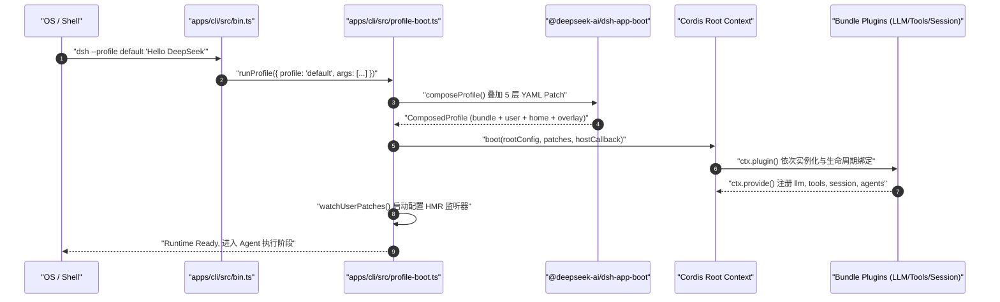
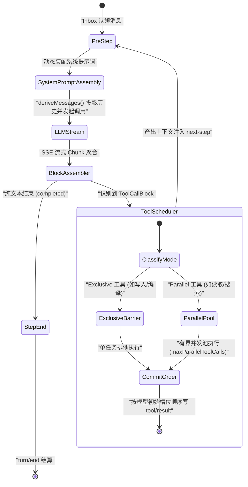
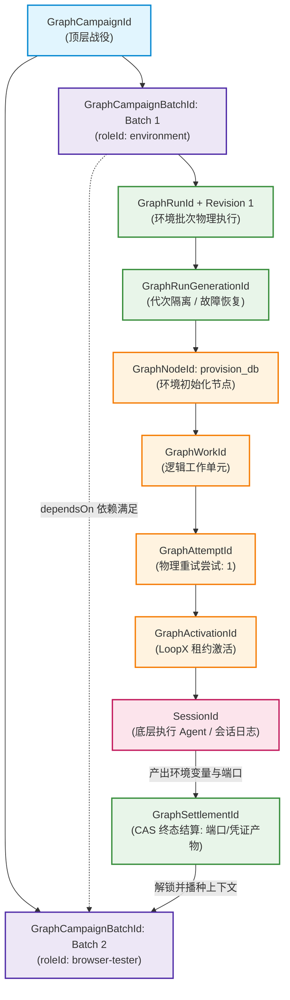

# Chapter 19: A Source-Reading Route and Exercises

English | [中文](19-source-code-tour.zh.md)

This chapter concludes the course's second stage with source study and practical assessment. Earlier chapters covered Harness architecture, dependency injection, the agent loop, event sourcing, multi-agent graph scheduling, and external distributed coordination.

For a software architect with a background in C, C++, Java, Go, Rust, or Python, the next step is to read the implementation and test understanding through engineering exercises. This chapter offers a four-stage route from a single-process entry point to distributed coordination, followed by four production-style exercises.

---

## 1. A Four-Stage Route Through the Source

DeepSeek Harness is a cohesive pnpm-workspace monorepo. To navigate its many packages, follow the execution path in four successive stages:

```
[阶段 1: 启动与装配] ──> [阶段 2: 单 Agent 核心循环] ──> [阶段 3: 持久化与 Web 投影] ──> [阶段 4: 多 Agent 编排与协同]
 (CLI/Profile/Cordis)     (AgentLoop/Session/Tools)     (WriteBehind/Coordinator/RPC)    (Subagent/Graph/LoopX)
```

---

### Stage 1: Bootstrap and Composition

#### 1. Responsibility and Systems Analogy
Bootstrap resembles loading an operating-system kernel through a bootloader or instantiating Spring Framework's `ApplicationContext`. It parses CLI arguments, loads layered environment variables, assembles a Cordis IoC tree from YAML overlay patches, and safely binds SIGINT/SIGTERM process-lifecycle signals.

#### 2. Mathematical Model: Configuration Overlay Algebra
Harness configuration is more than a hash-map overwrite. Its overlays form an associative, monotonically convergent composition. The effective configuration $C_{\text{effective}}$ merges five layers in strict priority order:

$$C_{\text{effective}} = C_{\text{bundle}} \oplus C_{\text{profile}} \oplus C_{\text{home}} \oplus C_{\text{overlay}} \oplus C_{\text{telemetry}}$$

The components are:

- **$C_{\text{bundle}}$, base layer**: Release-supplied plugin configuration such as `packages/bundle/base/cordis.patch.yml`, providing foundational services and infrastructure.
- **$C_{\text{profile}}$, profile layer**: Presets such as `headless`, `default`, or `web-app` that define the default agent-runtime composition.
- **$C_{\text{home}}$, host-global layer**: User-wide host configuration in `$DSH_HOME/cordis.patch.yml`, applied across all profiles on the machine.
- **$C_{\text{overlay}}$, dynamic layer**: Overlay patches explicitly named with `--patch <file>`, merged in CLI argument order.
- **$C_{\text{telemetry}}$, privacy override**: An injected patch driven by `DSH_TELEMETRY_DISABLED`. Under fail-safe semantics, any nonempty value—including `'0'` or `'false'`—disables telemetry.

#### 3. Key Files and Reading Notes

- **`apps/cli/src/bin.ts`**: The physical CLI entry point remains lightweight and avoids large top-level business-package imports. It reads the version dynamically with `readVersion()` and uses `parseDshArgs()` to dispatch `profile`, `plugin`, or `dump-config`. ESM `await import('./profile-boot.ts')` keeps unrelated code out of V8 JIT and memory resources.
- **`apps/cli/src/profile-boot.ts`**: The composition entry point. `runProfile()` handles assembly and fail-safe startup. `prepareProfile()` ensures the profile directory exists and rewrites root `cordis.yml`; `composeEntries()` merges YAML layers into one plugin-entry index; `boot()` starts the root Cordis container; `installFailLoud()` catches unhandled Promise rejections; and `watchUserPatches()` watches user config changes for HMR.
- **`packages/bundle/base/cordis.patch.yml`**: Declares the base plugin topology. Core capabilities including `@deepseek-ai/dsh-agent-loop`, `@deepseek-ai/dsh-llm`, `@deepseek-ai/dsh-tools`, and `@deepseek-ai/dsh-session` mount as declarative plugin entries.

#### 4. Architecture Flow and Call Sequence



---

### Stage 2: The Single-Agent Execution Loop

#### 1. Responsibility and Systems Analogy
The single-agent loop plays a role similar to an operating-system process scheduler or a game engine's main loop. It manages agent states (`idle` $\leftrightarrow$ `running` $\leftrightarrow$ `maintenance`), claims messages from the authoritative `Inbox`, assembles system prompts, streams LLM inference, parses and concurrently executes tool calls, and appends events to the immutable session log.

#### 2. Mathematical Model: Autoregressive Generation and Incremental Event Projection
Model generation can be understood as discrete-time conditional-probability sampling with a Markov-like progression:

$$P(y_1, y_2, \dots, y_T \mid X) = \prod_{t=1}^T P\left(y_t \mid X, y_{<t}\right)$$

Harness does not store message history $M_k$ directly in a mutable array. A pure incremental projection folds it from the immutable event ledger $E_{0..k}$:

$$M_k = \text{deriveMessages}(E_{0..k}) = \text{Fold}\left( \text{surfaceOp}, \emptyset, E_{0..k} \right)$$

The projection folds events as follows:

- **Message append**: On `user/message`, `assistant/message`, or `tool/result`, the `surfaceOp: 'append'` operation adds the structured message to the end of the current list.
- **Causal provenance**: The physical log retains `assistant/chunk` streaming events for live downlink and resumability; those chunks do not individually occupy model context. The final `assistant/message` references them through `sourceEventSeqs: [seq_1, seq_2, ...]`.
- **History compaction**: When compaction shadows historical events, the physical log retains them for deterministic replay, while `deriveMessages()` replaces them in the projection with one structured summary.

#### 3. Key Files and Reading Notes

- **`packages/core/agent-loop/src/agent.ts`**: Contains `ReactLoopAgent` and its ReAct state machine. It maintains `idle`, `running`, and `maintenance` phases. External `followup()`, `steer()`, or `inject()` calls enter the `Inbox` and trigger `wakeDriver()`; `turn()` starts a logical Turn and appends `turn/start`; `preStep()` claims a message from the `Inbox` and assembles the prompt; `step()` consumes tokens from `llm.stream()` while `BlockAssembler` assembles text and tool-call blocks; after streaming, it appends `assistant/message` and delegates side effects to `executeToolCalls()`.
- **`packages/core/agent-loop/src/tool-calls.ts`**: The concurrent tool scheduler. `exclusive` tools create a serial barrier; `parallel` tools run in a rolling pool limited by `maxParallelToolCalls` and maintained with `Promise.race`. Results are committed in their original model slot order through `appendToolResult`. If `signal.aborted`, unstarted calls are cancelled and synthetic skip results are appended through `appendSkippedToolCall`.
- **`packages/core/session/src/surface.ts`** and **`packages/core/session/src/index.ts`**: The incremental event-sourced projection. `Session.deriveMessages()` folds each new surface entry in O(1), so context construction remains constant-time even when the session grows to tens of thousands of events.

#### 4. One Step Through the State Machine



---

### Stage 3: Persistence and Web Projection

#### 1. Responsibility and Systems Analogy
This stage addresses state consistency and frontend–backend decoupling. Persistence resembles database WAL and checkpoints; the Web projection and API proxy resemble CQRS, transforming immutable backend events into a reactive browser state tree.

#### 2. Key Files and Reading Notes

- **`packages/session/session-persistence/src/write-behind.ts`**: `SessionWriteBehind` buffers writes so each small `assistant/chunk` does not incur synchronous disk I/O. A bounded queue coalesces batches using `maxDelayMs` (default 200 ms), while explicit `flush()` is a quiescence barrier at Turn completion, key tool execution, or session export, ensuring in-flight events are physically persisted with `fsync`.
- **`packages/session/session-persistence/src/coordinator.ts`**: The persistence coordinator owns multi-session lifecycles, corruption detection (`SessionPersistenceCorruptionError`), format-version negotiation (`SESSION_FORMAT_VERSION`), and crash recovery.
- **`packages/host/apiproxy/src/api-proxy.ts`** and **`packages/host/apiproxy/src/api/`**: The frontend–backend gateway defines a four-quadrant discriminated union (`ClientRequest`, `ServerResponse`, `ServerRequest`, and `ClientResponse`). Zod validates each API request twice: once for the outer envelope and once for the business payload. A unified `RpcResult` carries closed error codes.
- **`packages/client/runtime/src/`**: The browser Cordis runtime includes `ConversationNodeAssembler`, `SessionRuntime`, and `WorkspaceRuntime`. It subscribes to the Host mux event stream (`session/projection`) and uses Immer/Zustand to maintain an immutable frontend view with incremental rendering rather than full-session refreshes.

---

### Stage 4: Multi-Agent Orchestration and Coordination

#### 1. Responsibility and Systems Analogy
When one agent cannot handle a large engineering task, the system extends to multiple agents. Stage 4 resembles distributed schedulers such as Kubernetes or Ray and lease-based coordination such as ZooKeeper or Raft.

#### 2. Key Files and Reading Notes

- **`packages/subagent/subagent/src/child-agent.ts`**: Creates child agents in constrained execution contexts. A child inherits parent context and configuration but follows monotonic permission reduction: if a parent runs in a restricted sandbox, the child's `sandboxModeCap` cannot be relaxed.
- **`packages/graph/graph/src/types.ts`** and **`packages/graph/graph/src/client.ts`**: The Graph Mode domain types describe a multi-agent DAG: `GraphCampaign` for a multi-batch campaign, `GraphCampaignBatch` for an independent batch with `dependsOn` dependencies, `GraphNode` for a task bound to `roleId`, and `GraphRevision` for an immutable graph version. Topology changes or dynamic subgraph expansion create a new monotonically increasing revision.
- **`packages/graph/graph-coordination-loopx/src/broker.ts`**: The LoopX adapter uses lease-based distributed exclusivity and monotonically increasing fencing tokens to prevent stale workers or network partitions from overwriting accepted work.

---

## 2. Four Hands-On Exercises

These four exercises test the underlying mechanisms. Each includes background, architectural analysis, and a production-style reference answer.

---

### Exercise One: Trace Every Event seq in a Headless Run

#### 1. Objective and Background
Run:
```bash
dsh --profile headless "请计算 123 + 456 并保存到 result.txt"
```
From the execution order, derive the exact `seq`, `type`, and key `data` fields of **every Session Log event** from CLI startup through process exit. Explain the state transitions and persistence timing.

#### 2. Reasoning and Mechanism

- **Startup and session creation**: The CLI selects the `headless` profile, and `runProfile()` loads the bundle plugins. `Session.create()` creates the session and increments `seq` from zero. Initialization appends `request/header` with `reason: 'initial'`, recording the active model, system prompt, and tool schemas; `request/context` records the context-window size.
- **Input and Turn start**: The user command enters the Inbox and triggers `wakeDriver()`. The state changes from `idle` to `running` and publishes `agent/status`. Turn 1 appends `turn/start { turn: 1 }`. In Step 1, `preStep()` claims the message, appends `step/start { turn: 1, step: 1 }`, then appends `user/message`.
- **Streaming and tool dispatch**: The LLM returns an SSE stream and each data block appends `assistant/chunk`. At stream end, `BlockAssembler` assembles a full tool call such as `write_file`, appends `assistant/message`, and correlates the chunk sequence numbers in `sourceEventSeqs`.
- **Tool execution and result**: `executeToolCalls()` records `tool/call` with a `callId`. After the sandbox writes the file, `tool/result` records success and uses `sourceEventSeqs` to link back to the corresponding `tool/call` sequence.
- **Step end and second Step**: Step 1 appends `step/end { turn: 1, step: 1 }`. Because a tool result exists, Step 2 appends `step/start { turn: 1, step: 2 }` and streams more `assistant/chunk` events. The model's final text is `"计算结果 579 已成功写入 result.txt"`; the final `assistant/message` has no tool call. Step 2 appends `step/end { turn: 1, step: 2 }`.
- **Turn completion and persistence**: With no pending Inbox message, the system appends `turn/end { turn: 1, reason: { kind: 'completed' } }` and returns to `idle`. `SessionWriteBehind.flush()` makes all events numbered zero through $N$ durable.

#### 3. Complete Event Sequence and Reference Answer

| Seq | Event type | Boundary | Key payload (`data`) | Provenance (`sourceEventSeqs`) |
| :--- | :--- | :--- | :--- | :--- |
| **0** | `request/header` | Session Init | `{ header: { config: { provider: 'deepseek', model: 'deepseek-chat' }, system: '...', tools: [...] }, reason: 'initial' }` | - |
| **1** | `request/context` | Session Init | `{ provider: 'deepseek', model: 'deepseek-chat', contextWindow: 65536 }` | - |
| **2** | `turn/start` | Turn 1 Start | `{ turn: 1 }` | - |
| **3** | `step/start` | Step 1 Start | `{ turn: 1, step: 1 }` | - |
| **4** | `user/message` | Step 1 Input | `{ role: 'user', content: [{ type: 'text', text: '请计算 123 + 456 并保存到 result.txt' }] }` | - |
| **5** | `assistant/chunk` | LLM Stream | `{ turn: 1, step: 1, chunk: { type: 'tool-call-delta', name: 'write_file', ... } }` | - |
| **6** | `assistant/chunk` | LLM Stream | `{ turn: 1, step: 1, chunk: { type: 'tool-call-delta', arguments: '{"path":"result.txt","content":"579"}' } }` | - |
| **7** | `assistant/message` | Step 1 Output | `{ turn: 1, step: 1, message: { role: 'assistant', content: [{ type: 'tool-call', id: 'call_001', name: 'write_file', arguments: '{"path":"result.txt","content":"579"}' }] } }` | `[5, 6]` |
| **8** | `tool/call` | Tool Dispatch | `{ turn: 1, step: 1, callId: 'call_001', name: 'write_file', arguments: { path: 'result.txt', content: '579' } }` | - |
| **9** | `tool/result` | Tool Settle | `{ turn: 1, step: 1, message: { role: 'user', source: { kind: 'tool', callId: 'call_001' }, content: [{ type: 'tool-result', toolCallId: 'call_001', isError: false, content: [{ type: 'text', text: 'Successfully written 3 bytes.' }] }] } }` | `[8]` |
| **10** | `step/end` | Step 1 End | `{ turn: 1, step: 1 }` | - |
| **11** | `step/start` | Step 2 Start | `{ turn: 1, step: 2 }` | - |
| **12** | `assistant/chunk` | LLM Stream | `{ turn: 1, step: 2, chunk: { type: 'text-delta', text: '计算结果 ' } }` | - |
| **13** | `assistant/chunk` | LLM Stream | `{ turn: 1, step: 2, chunk: { type: 'text-delta', text: '579 已成功写入 result.txt。' } }` | - |
| **14** | `assistant/message` | Step 2 Output | `{ turn: 1, step: 2, message: { role: 'assistant', content: [{ type: 'text', text: '计算结果 579 已成功写入 result.txt。' }] } }` | `[12, 13]` |
| **15** | `step/end` | Step 2 End | `{ turn: 1, step: 2 }` | - |
| **16** | `turn/end` | Turn 1 End | `{ turn: 1, reason: { kind: 'completed' } }` | - |

---

### Exercise Two: Write a Waterfall Listener That Intercepts and Rewrites a Prompt

#### 1. Objective and Background
Enterprise agents need security guardrails and data-loss prevention (DLP). Build an independent Cordis plugin that:
1. Registers on the `'agent/pre-step'` waterfall.
2. Inspects every pending `UserMessage` and redacts sensitive information such as API keys or Chinese national ID numbers with regular expressions.
3. Appends a system safety context (`<security_policy>`) explaining that the model is in audit mode.
4. Handles cooperative `AbortSignal` cancellation and follows Cordis effect cleanup and strong-type inference conventions.

#### 2. Architectural Principle
`ReactLoopAgent.preStep()` dispatches the event as follows:
```typescript
const decision = await this.dispatch.waterfall(
  'agent/pre-step',
  { messages: claimed, turn, step, signal },
  async (): Promise<PreStepDecision> => ({
    kind: 'enter',
    messages: context === undefined ? claimed : [...claimed, context],
  }),
)
```
A waterfall is a responsibility chain similar to Koa or Express middleware. Each listener receives the preceding listener's output (or the fallback value for the first) and returns a modified decision. Returning `{ kind: 'reject' }` rejects the entire Turn before an LLM call.

#### 3. Production-Style TypeScript Reference

```typescript
import { Context, Service } from '@deepseek-ai/cordis'
import type { PreStepDecision, UserMessage } from '@deepseek-ai/dsh-agent'
import { MessageId, freezeMessage } from '@deepseek-ai/dsh-llm'

export interface SensitiveMaskingConfig {
  readonly patterns: readonly { readonly name: string; readonly regex: RegExp; readonly mask: string }[]
  readonly enableAuditGuardrail: boolean
}

const DEFAULT_PATTERNS = [
  { name: 'DeepSeek API Key', regex: /sk-[a-zA-Z0-9]{48}/g, mask: '[MASKED_API_KEY]' },
  { name: 'Chinese ID Card', regex: /\b\d{17}[\dXx]\b/g, mask: '[MASKED_ID_CARD]' },
]

export class PromptSanitizerPlugin {
  static readonly name = 'prompt-sanitizer'

  constructor(ctx: Context, config: Partial<SensitiveMaskingConfig> = {}) {
    const patterns = config.patterns ?? DEFAULT_PATTERNS
    const enableAudit = config.enableAuditGuardrail ?? true

    // 注册到 agent/pre-step 的 waterfall 管道
    ctx.on('agent/pre-step', async ({ messages, turn, step, signal }, next) => {
      // 1. 快速检查取消信号，若已被上游中止则立即响应
      signal.throwIfAborted()

      // 2. 执行流水线上游的其他中间件
      const decision: PreStepDecision = await next()

      // 3. 若上游已经做出了拒绝决策，直接透传
      if (decision.kind === 'reject') {
        return decision
      }

      // 4. 对消息块进行脱敏处理
      const sanitizedMessages: UserMessage[] = decision.messages.map((userMsg) => {
        let modified = false
        const nextContent = userMsg.content.map((block) => {
          if (block.type !== 'text') return block
          let text = block.text
          for (const pattern of patterns) {
            if (pattern.regex.test(text)) {
              text = text.replaceAll(pattern.regex, pattern.mask)
              modified = true
            }
          }
          return modified ? { ...block, text } : block
        })

        if (!modified) return userMsg

        // 创建新消息对象并确保不可变冻结
        return freezeMessage({
          ...userMsg,
          content: nextContent,
        })
      })

      // 5. 动态注入企业安全审计护栏
      if (enableAudit) {
        const auditMessage: UserMessage = freezeMessage({
          id: MessageId(`audit-guardrail-${turn}-${step}`),
          role: 'user',
          content: [{
            type: 'text',
            text: '<security_policy>Notice: This session is monitored by enterprise DLP. Do not reveal masked secrets in tool arguments or final output.</security_policy>',
          }],
        })
        sanitizedMessages.push(auditMessage)
      }

      signal.throwIfAborted()

      return {
        kind: 'enter',
        messages: sanitizedMessages,
      }
    })
  }
}

export default PromptSanitizerPlugin
```

#### 4. Unit Tests and Verification

```typescript
import { Context } from '@deepseek-ai/cordis'
import { describe, it, expect } from 'vitest'
import { PromptSanitizerPlugin } from './prompt-sanitizer.ts'
import { MessageId, freezeMessage } from '@deepseek-ai/dsh-llm'
import type { UserMessage } from '@deepseek-ai/dsh-agent'

describe('PromptSanitizerPlugin Waterfall 拦截器', () => {
  it('应成功拦截敏感 API Key 并追加安全审计上下文', async () => {
    const ctx = new Context()
    ctx.plugin(PromptSanitizerPlugin, { enableAuditGuardrail: true })

    const rawMessage: UserMessage = freezeMessage({
      id: MessageId('msg-001'),
      role: 'user',
      content: [{ type: 'text', text: '请使用 sk-abcdef1234567890abcdef1234567890abcdef1234567890 查询账单' }],
    })

    const controller = new AbortController()

    // 模拟 agent/pre-step 触发
    const result = await ctx.serial('agent/pre-step', {
      messages: [rawMessage],
      turn: 1,
      step: 1,
      signal: controller.signal,
    })

    // 验证结果结构
    expect(result.kind).toBe('enter')
    if (result.kind === 'enter') {
      expect(result.messages).toHaveLength(2)
      // 验证脱敏
      expect(result.messages[0]?.content[0]).toEqual({
        type: 'text',
        text: '请使用 [MASKED_API_KEY] 查询账单',
      })
      // 验证注入
      expect(result.messages[1]?.content[0]?.text).toContain('<security_policy>')
    }
  })
})
```

---

### Exercise Three: Recover a Non-Idempotent File Append Across Three Crash Windows

#### 1. Objective and Background
Database transactions rely on WAL and the ARIES recovery algorithm for ACID guarantees. In an AI agent, model calls can cause external side effects such as appending through `tool-fs` or invoking a payment API, making crash recovery different.

Analyze a non-idempotent `append_file` operation interrupted by power loss or process failure in three windows. Explain how `packages/core/session/src/repair.ts` uses `interruptedTurnClosers` for provider-valid recovery.

#### 2. The Three Crash Windows

```
Step 开始 ──> [LLM 输出 ToolCall] ──> (窗口 A) ──> [记录 tool/call] ──> (窗口 B: 物理磁盘写入中) ──> [物理写入完成] ──> (窗口 C: 未持久化 result) ──> [记录 tool/result] ──> Step 结束
```

##### Window A: Crash After `assistant/message` but Before `tool/call`

- **Physical and logged state**: The Session Log contains `ToolCallBlock(callId: "call_001")` in an `assistant/message`, but no corresponding `tool/call` or `tool/result`. No physical file change occurred.
- **Recovery and reconciliation**: `interruptedTurnClosers` finds `pendingCalls` containing `"call_001"` with `callSeq === undefined` and synthesizes `tool/result` with error code `TOOL_NOT_STARTED`.
- **Model decision**: The next inference clearly knows the tool never began, so it can retry safely because no side effect occurred.

##### Window B: Crash After `tool/call` During the Disk Write

- **Physical and logged state**: The Session Log contains `tool/call(seq: 8, callId: "call_001")`; the filesystem may contain a partially written file or no durable write.
- **Recovery and reconciliation**: `interruptedTurnClosers` finds `callSeq !== undefined` without `tool/result` and synthesizes `tool/result` with `TOOL_OUTCOME_UNKNOWN`.
- **Model decision**: The model is warned not to retry a non-idempotent operation blindly because the outcome is unknown. It first calls `read_file` to inspect the file, then decides whether to complete or roll back the write.

##### Window C: Crash After the Write but Before `tool/result` Is Durable

- **Physical and logged state**: The file was fully appended, but an abrupt `SIGKILL` prevented the in-memory `tool/result` from reaching disk through a `SessionWriteBehind` batch.
- **Recovery and reconciliation**: The log cannot distinguish C from B: both have `tool/call` without `tool/result`. The system safely closes C with `TOOL_OUTCOME_UNKNOWN` as well.
- **Double-write prevention**: Blindly treating C as failure and retrying would append the data twice. The injected `TOOL_OUTCOME_UNKNOWN` status blocks that retry loop and directs the agent to reconcile external state first.

#### 3. Recovery State-Transition Table

| Crash window | Last valid log event | Disk side effect | Synthetic event from `interruptedTurnClosers` | Model-visible code and warning | Correct agent action |
| :--- | :--- | :--- | :--- | :--- | :--- |
| **Window A** | `assistant/message` | **No modification** | `tool/result` (`sourceEventSeqs: []`) | `TOOL_NOT_STARTED` (never began) | Retry `append_file` directly |
| **Window B** | `tool/call` | **Partially modified or damaged** | `tool/result` (`sourceEventSeqs: [callSeq]`) | `TOOL_OUTCOME_UNKNOWN` (unknown) | Use `read_file` first; repair the damaged portion |
| **Window C** | `tool/call` | **Fully written** | `tool/result` (`sourceEventSeqs: [callSeq]`) | `TOOL_OUTCOME_UNKNOWN` (unknown) | Use `read_file` first; skip the write if present |

---

### Exercise Four: Design a Two-Batch Campaign with Environment and Browser Testing

#### 1. Objective and Background
One agent cannot cover the full lifecycle of complex automated system testing. Consider:
- **Batch 1 (environment preparation and backend deployment)**: The `environment` role starts Docker Compose, runs database migrations, starts the backend API, and checks the specified health port.
- **Batch 2 (end-to-end regression testing)**: The `browser-tester` role starts only after Batch 1 settles successfully. It launches headless Chromium, runs Playwright cases, captures screenshots, and reports results.

Use the domain model in `packages/graph/graph/src/types.ts` to define the two-batch `GraphCampaign`, then derive the full ID lineage from the Campaign to the Session.

#### 2. Structured Graph Campaign Data

```typescript
import {
  GraphCampaignId,
  GraphCampaignBatchId,
  GraphId,
  GraphRunId,
  GraphNodeId,
  GraphRoleId,
  type GraphCampaign,
  type GraphNode,
} from '@deepseek-ai/dsh-graph'

export const E2E_CAMPAIGN_FIXTURE: GraphCampaign = {
  version: 1,
  id: GraphCampaignId('campaign_e2e_regression_001'),
  objective: '自动化拉起后端测试环境并执行浏览器端到端回归测试',
  phase: 'running',
  createdAt: 1774425600000,
  updatedAt: 1774425605000,
  activeBatchId: GraphCampaignBatchId('batch_01_env_setup'),
  batches: [
    {
      id: GraphCampaignBatchId('batch_01_env_setup'),
      ordinal: 1,
      title: '部署与环境初始化',
      objective: '启动 PostgreSQL 容器与 Node API 后端，完成 Schema Migration',
      dependsOn: [],
      status: 'running',
      graphId: GraphId('graph_env_provision_v1'),
      executions: [
        {
          graphId: GraphId('graph_env_provision_v1'),
          revision: 1,
          runId: GraphRunId('run_env_001'),
          status: 'running',
          startedAt: 1774425601000,
          settlementIds: [],
        },
      ],
    },
    {
      id: GraphCampaignBatchId('batch_02_browser_test'),
      ordinal: 2,
      title: 'UI 自动化回归测试',
      objective: '运行 Playwright 针对登录、下单等核心路径进行回归测试并保存截图',
      dependsOn: [GraphCampaignBatchId('batch_01_env_setup')],
      status: 'planned',
      executions: [],
    },
  ],
}
```

#### 3. Full Identity-Derivation Hierarchy

Every execution entity in a distributed multi-agent system needs a globally unique, traceable, immutable hierarchical identity:

```
GraphCampaignId ("campaign_e2e_regression_001")
 └── GraphCampaignBatchId ("batch_01_env_setup")
      └── GraphId ("graph_env_provision_v1")
           └── GraphRevision (1)
                └── GraphRunId ("run_env_001")
                     └── GraphRunGenerationId ("gen_run_001_01")
                          └── GraphNodeId ("node_docker_compose_up")
                               └── GraphWorkId ("work_node_docker_001")
                                    └── GraphAttemptId ("attempt_001_01")
                                         └── GraphActivationId ("act_001_01_01")
                                              └── SessionId ("session_graph_act_001_01_01")
```

#### 4. Identity and Distributed-Coordination Lifecycle Diagram



#### 5. Coordination with Leases and Monotonic Fencing Tokens

As Batch 1 hands work to Batch 2, and multiple workers execute concurrently, LoopX uses monotonically increasing fencing tokens to prevent split-brain writes:

- **Lease acquisition**: A worker claiming `GraphNodeId("node_docker_compose_up")` requests a lease from LoopX. LoopX returns `GraphActivationId` and a monotonically increasing `fencingToken = 1042`.
- **Fenced operation**: Every worker request that updates Host or external state explicitly includes `fencingToken: 1042`.
- **Lease expiry and preemption**: If worker 1 pauses for stop-the-world GC and misses heartbeats, LoopX reassigns the lease to worker 2 with `fencingToken = 1043`.
- **Reject stale writes**: When worker 1 resumes and tries to write its completed Batch 1 result, the Host and persistence layer compare $1042 < 1043$ and reject it with `STALE_FENCING_TOKEN`. This ensures Batch 2 consumes one valid, unchanged environment baseline.

---

## 3. Chapter Summary and Further Study

The four-stage source-reading route and four exercises move you from using the framework toward understanding its architecture:
- You can trace a cold start from `apps/cli/src/bin.ts` through Cordis container assembly.
- You can read the key lines of the `ReactLoopAgent` state machine, the concurrency barriers in `tool-calls.ts`, and the event-sourced projection in `deriveMessages()`.
- You understand the engineering and mathematical reasoning behind `write-behind.ts` asynchronous flushes and `repair.ts` crash reconciliation.
- You can use DAG revisions, Campaign batches, and LoopX fencing tokens to orchestrate complex distributed multi-agent work.

This foundation prepares you to modify and extend DeepSeek Harness internals. Subsequent chapters cover advanced plugin development and large-scale production deployment.
