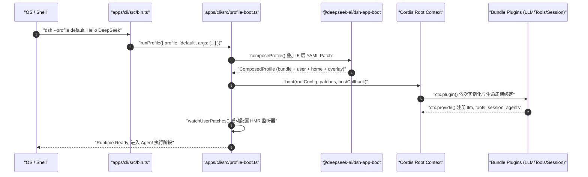
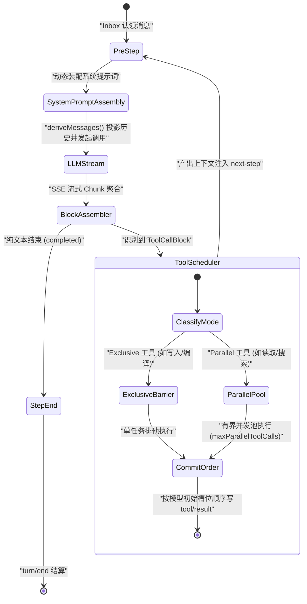
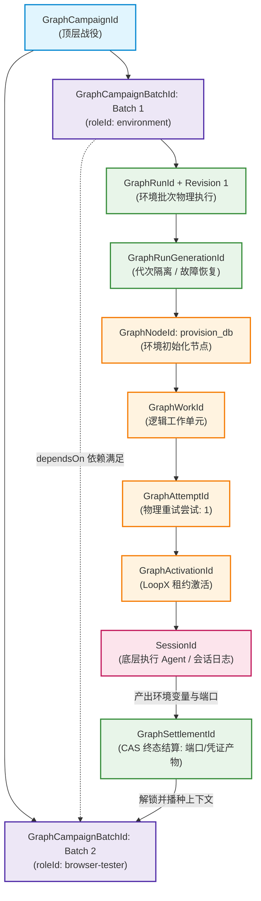

# 第 19 章：源码阅读路线与练习

欢迎来到《DeepSeek Harness 深度技术教程》第二阶段的收官与实战检验章节。在前面的章节中，我们系统性地解构了 Harness 系统的架构哲学、依赖注入体系、Agent 核心循环、事件溯源机制以及多 Agent 图调度与外部分布式协同。

对于一名具备坚实传统工程背景（C/C++/Java/Go/Rust/Python）的软件架构师而言，真正掌握一个复杂系统的唯一途径就是**亲手抚摸其源码脉络并完成严谨的工程练习**。本章将为你绘制一份清晰的“四阶段源码通关路线图”，引导你从单进程入口深入到分布式协同的最深处；随后，我们将通过四个高强度的生产级实战练习，帮助你将理论彻底转化为架构级肌肉记忆。

---

## 1. 四阶段源码通关路线

DeepSeek Harness 采用 pnpm Workspace 组织的高内聚 Monorepo 架构。为了避免陷入上百个 package 的“代码海洋”，我们将其核心运行链路划分为四个层层递进的阶段：

```
[阶段 1: 启动与装配] ──> [阶段 2: 单 Agent 核心循环] ──> [阶段 3: 持久化与 Web 投影] ──> [阶段 4: 多 Agent 编排与协同]
 (CLI/Profile/Cordis)     (AgentLoop/Session/Tools)     (WriteBehind/Coordinator/RPC)    (Subagent/Graph/LoopX)
```

---

### 阶段 1：启动与装配（Bootstrap & Composition）

#### 1. 核心职责与工程映射
启动阶段相当于操作系统内核从引导扇区加载（Bootloader）或 Spring Framework 实例化 `ApplicationContext` 的过程。该阶段负责解析命令行参数、加载分层环境变量、基于 YAML 叠加补丁（Overlay Patches）装配 Cordis IoC 容器树，并完成进程生命周期信号（SIGINT/SIGTERM）的防御性绑定。

#### 2. 核心数学模型：配置叠加代数
Harness 的配置系统不是简单的哈希表覆盖，而是一个满足结合律与单调收敛的叠加代数系统。最终生效配置 $C_{\text{effective}}$ 由五个层级按严格优先级依次合并而成：

$$C_{\text{effective}} = C_{\text{bundle}} \oplus C_{\text{profile}} \oplus C_{\text{home}} \oplus C_{\text{overlay}} \oplus C_{\text{telemetry}}$$

其中各配置分量的数学定义与职责如下：

- **$C_{\text{bundle}}$ 基础层**：随发行版交付的基础插件包配置（如 `packages/bundle/base/cordis.patch.yml`），提供平台底层基础设施与默认服务。
- **$C_{\text{profile}}$ 预设层**：特定 Profile 的预设配置（如 `headless`、`default` 或 `web-app`），定义了 Agent 运行时的默认组装形态。
- **$C_{\text{home}}$ 宿主全局层**：用户宿主全局配置（`$DSH_HOME/cordis.patch.yml`），跨机器所有 Profile 生效。
- **$C_{\text{overlay}}$ 动态覆盖层**：命令行通过 `--patch <file>` 显式指定的动态叠加补丁列表，按参数出现顺序线性合并。
- **$C_{\text{telemetry}}$ 隐私熔断层**：根据环境变量 `DSH_TELEMETRY_DISABLED` 动态注入的隐私禁用补丁（遵循 Fail-Safe 哲学：任何非空字符串，包括 `'0'` 或 `'false'`，均被判定为禁用）。

#### 3. 关键代码文件与深度导读

- **`apps/cli/src/bin.ts`**：CLI 的物理入口。该文件保持极致轻量化，杜绝在顶层静态引入庞大的业务包。通过 `readVersion()` 动态读取版本号，调用 `parseDshArgs()` 进行极速模式分发（`profile`、`plugin`、`dump-config`），并使用原生 ESM 动态导入 `await import('./profile-boot.ts')`，确保无关代码不会污染 V8 的 JIT 优化与内存上下文。
- **`apps/cli/src/profile-boot.ts`**：系统的“装配中枢”。核心函数 `runProfile()` 实现了端到端的装配与安全兜底。调用 `prepareProfile()` 确保 Profile 目录存在并重写根配置文件 `cordis.yml`；调用 `composeEntries()` 将各层 YAML 扁平化合并为唯一的插件条目索引；调用 `boot()` 启动 Cordis 根容器；通过 `installFailLoud()` 捕获未处理的 Promise Rejection；通过 `watchUserPatches()` 监听用户配置文件变更以支持热重载（HMR）。
- **`packages/bundle/base/cordis.patch.yml`**：声明了 Harness 基础运行环境的插件拓扑。所有核心能力（`@deepseek-ai/dsh-agent-loop`、`@deepseek-ai/dsh-llm`、`@deepseek-ai/dsh-tools`、`@deepseek-ai/dsh-session`）均以声明式插件条目的形式挂载。

#### 4. 架构流程与调用时序



---

### 阶段 2：单 Agent 核心循环（Agent Execution Loop）

#### 1. 核心职责与工程映射
单 Agent 循环是 Harness 的心脏，对应操作系统中的进程调度循环（Process Scheduler Loop）或游戏引擎中的 Main Loop。它负责管理 Agent 状态机（`idle` $\leftrightarrow$ `running` $\leftrightarrow$ `maintenance`），从权威收件箱（`Inbox`）认领消息，装配系统提示词，向 LLM 发起流式推理请求，解析并并发执行 Tool Calls，并实时将事件追加到不可变会话日志（Session Log）中。

#### 2. 核心数学模型：自回归生成与增量事件投影
大语言模型的生成本质上是一个离散时间马尔可夫链式条件概率采样过程：

$$P(y_1, y_2, \dots, y_T \mid X) = \prod_{t=1}^T P\left(y_t \mid X, y_{<t}\right)$$

而 Harness 内部的消息历史 $M_k$ 并不直接存储为可变数组，而是通过纯函数增量投影函数从不可变事件账本 $E_{0..k}$ 中折叠而成：

$$M_k = \text{deriveMessages}(E_{0..k}) = \text{Fold}\left( \text{surfaceOp}, \emptyset, E_{0..k} \right)$$

投影函数的具体折叠语义定义如下：

- **消息追加**：当遇到 `user/message`、`assistant/message` 或 `tool/result` 时，根据 `surfaceOp: 'append'` 将结构化消息直接追加至当前列表末尾。
- **因果溯源**：流式传输事件 `assistant/chunk` 仅在物理日志中存储以供实时下行传输和断点续传，不直接占用大模型上下文，而是由最终生成的 `assistant/message` 通过 `sourceEventSeqs: [seq_1, seq_2, ...]` 数组进行显式因果追踪。
- **历史压缩**：当触发会话压缩（Compaction）时，被遮蔽（Shadowed）的历史事件在物理日志中永远保留以供确定性回放，但在 `deriveMessages()` 投影时被单条结构化摘要（Summary）替换。

#### 3. 关键代码文件与深度导读

- **`packages/core/agent-loop/src/agent.ts`**：核心类 `ReactLoopAgent` 的所在。该文件实现了工业级的 ReAct（Reasoning + Acting）状态机循环。维护内部 Phase 状态联合（`idle`、`running`、`maintenance`）；当外部调用 `followup()`、`steer()` 或 `inject()` 时，消息被写入 `Inbox` 并触发 `wakeDriver()`；`turn()` 开启逻辑轮次并追加 `turn/start`；`preStep()` 从 `Inbox` 认领待处理消息并装配系统提示词；`step()` 调用 `llm.stream()` 接收 Token 流，由 `BlockAssembler` 实时聚合文本块与工具调用块；输出结束后追加 `assistant/message`，并委派 `executeToolCalls()` 执行副作用工具。
- **`packages/core/agent-loop/src/tool-calls.ts`**：工具并发调度执行器。它解决了“模型输出的多个 Tool Call 如何安全、高效执行”的核心问题。若工具声明为 `exclusive`，调度器形成串行屏障；若声明为 `parallel`，调度器在 `maxParallelToolCalls` 限制下使用 `Promise.race` 维护滚动任务池；所有结果提交严格按照模型原始槽位顺序提交（`appendToolResult`）；当检测到 `signal.aborted` 时，立即终止未分发的调用并追加合成的跳过错误结果（`appendSkippedToolCall`）。
- **`packages/core/session/src/surface.ts`** 与 **`packages/core/session/src/index.ts`**：事件溯源（Event Sourcing）的增量投影引擎。`Session.deriveMessages()` 负责对每个新到达的 Surface 条目执行 O(1) 增量折叠，保证了即使会话增长到数万事件，上下文构建耗时依然恒定。

#### 4. 单 Step 状态机执行流



---

### 阶段 3：数据持久化与 Web 投影（Persistence & Projections）

#### 1. 核心职责与工程映射
这一阶段解决系统的“状态一致性”与“前后端解耦”问题。数据持久化对应数据库系统的 WAL（Write-Ahead Logging）与 Checkpoint 机制；Web 投影与 API 代理则对应 CQRS（命令查询职责分离）架构，将后端的不可变事件流实时投影为浏览器端响应式状态树。

#### 2. 关键代码文件与深度导读

- **`packages/session/session-persistence/src/write-behind.ts`**：写入后写缓冲控制器 `SessionWriteBehind`。为了避免每次微小的 `assistant/chunk` 都触发同步磁盘 I/O，系统维护了一个有界缓冲队列。采用基于定时器（`maxDelayMs`，默认 200ms）的批次合并策略；提供显式内存屏障 `flush()`：当遇到轮次结束、关键工具执行或会话导出时，强制触发 Quiescence 屏障，确保所有在途事件已物理落盘（`fsync`）。
- **`packages/session/session-persistence/src/coordinator.ts`**：持久化协调器。负责多会话的生命周期接管、损坏检测（`SessionPersistenceCorruptionError`）、日志格式版本协商（`SESSION_FORMAT_VERSION`）以及崩溃恢复（Crash Recovery）。
- **`packages/host/apiproxy/src/api-proxy.ts`** 与 **`packages/host/apiproxy/src/api/`**：前后端通信网关。定义了基于四象限的可辨识联合类型（`ClientRequest`、`ServerResponse`、`ServerRequest`、`ClientResponse`）。所有 API 请求严格通过 Zod Schema 进行两层解析：先校验外层信封（Envelope），再校验业务载荷（Payload），并通过统一的 `RpcResult` 传递封闭错误码。
- **`packages/client/runtime/src/`**：浏览器端 Cordis 运行时。包含 `ConversationNodeAssembler`、`SessionRuntime` 与 `WorkspaceRuntime`。它订阅来自 Host 的 Mux 事件流（`session/projection`），使用 Immer/Zustand 维护不可变的前端视图状态，实现无需刷新全量会话的增量 UI 渲染。

---

### 阶段 4：多 Agent 编排与协同（Multi-Agent & Coordination）

#### 1. 核心职责与工程映射
当单一 Agent 无法胜任超大规模复杂工程任务时，系统演进为分布式多 Agent 系统。阶段 4 对应分布式任务调度（如 Kubernetes Scheduler / Ray）与分布式共识协同（如 ZooKeeper / Raft 租约）。

#### 2. 关键代码文件与深度导读

- **`packages/subagent/subagent/src/child-agent.ts`**：子 Agent 的派生与受限执行容器。子 Agent 继承父会话的上下文与配置，但在安全边界上遵循**权限单调递减原则**（例如父 Agent 运行于受限沙箱模式时，子 Agent 的 `sandboxModeCap` 绝不允许越权放宽）。
- **`packages/graph/graph/src/types.ts`** 与 **`packages/graph/graph/src/client.ts`**：Graph Mode 的领域核心。定义了多 Agent DAG（有向无环图）的完整实体：`GraphCampaign`（多批次顶层战役）、`GraphCampaignBatch`（单个独立批次，包含拓扑依赖 `dependsOn`）、`GraphNode`（具体的任务节点，绑定特定角色 `roleId`）、`GraphRevision`（不可变图版本）。每一次拓扑修改或动态子图展开均生成全新的单调递增版本号。
- **`packages/graph/graph-coordination-loopx/src/broker.ts`**：与外部分布式协同服务 LoopX 对接的代理实现。实现了**基于租约（Lease）的分布式排他锁**与**单调递增 Fencing Token** 机制，杜绝因网络分区或旧 Worker 僵死引发的写覆盖（脑裂）。

---

## 2. 四个动手实战练习

为了检验你对上述源码架构的理解，下面设计了四个直击底层机制的动手练习。每个练习均包含详尽的背景推导、架构分析与工业级参考答案。

---

### 练习一：追踪一次 headless 运行的完整事件 seq 链

#### 1. 练习目标与背景
运行命令：
```bash
dsh --profile headless "请计算 123 + 456 并保存到 result.txt"
```
你需要从底层代码执行时序出发，精准推演从 CLI 启动到进程退出过程中，Session Log 中生成的**每一个事件的精确 `seq` 序号、事件 `type`、核心载荷字段 `data`**，并分析其背后的状态转移与持久化时机。

#### 2. 详细解题思路与机制拆解

- **启动与会话初始化**：CLI 解析 profile 为 `headless`，`runProfile()` 加载 Bundle 插件。`Session.create()` 生成会话实例，`seq` 从 0 开始自增。初始化时追加 `request/header`（`reason: 'initial'`），记录当前生效的 Model、System Prompt 与 Tools Schema；随后追加 `request/context` 记录上下文窗口大小。
- **输入与轮次开启**：用户命令注入 Inbox，触发 `wakeDriver()`。状态机由 `idle` 转为 `running`，发布 `agent/status`。开启第 1 轮：追加 `turn/start { turn: 1 }`。开启第 1 步：`preStep()` 认领消息，追加 `step/start { turn: 1, step: 1 }`，紧接着追加 `user/message`。
- **模型流式生成与工具分发**：调用 LLM 接口，模型返回 SSE 流。每个数据块追加 `assistant/chunk`。流结束，`BlockAssembler` 聚合出完整的 Tool Call（例如调用 `write_file`），追加 `assistant/message`，并通过 `sourceEventSeqs` 显式关联前面的所有 chunk seq。
- **工具执行与结果回填**：进入 `executeToolCalls()`，记录 `tool/call`（分配 `callId`）。沙箱执行写文件操作，成功后记录 `tool/result`，通过 `sourceEventSeqs` 关联对应的 `tool/call` seq。
- **步结束与第二步（生成最终回答）**：第 1 步结束，追加 `step/end { turn: 1, step: 1 }`。发现有新的工具结果，状态机推进到第 2 步：追加 `step/start { turn: 1, step: 2 }`。再次调用 LLM，流式追加 `assistant/chunk`。模型输出最终文本 `"计算结果 579 已成功写入 result.txt"`，追加最终的 `assistant/message`（无 tool call）。第 2 步结束，追加 `step/end { turn: 1, step: 2 }`。
- **轮次收敛与持久化落盘**：Inbox 无待处理消息，触发 `turn/end { turn: 1, reason: { kind: 'completed' } }`。状态机转为 `idle`。`SessionWriteBehind.flush()` 触发，确保内存中 0 到 $N$ 号事件全部物理落盘。

#### 3. 完整的事件 Sequence 账本与参考答案

| Seq | Event Type | 所属边界 | 关键 Payload 数据 (`data`) | 溯源引用 (`sourceEventSeqs`) |
| :--- | :--- | :--- | :--- | :--- |
| **0** | `request/header` | Session Init | `{ header: { config: { provider: 'deepseek', model: 'deepseek-chat' }, system: '...', tools: [...] }, reason: 'initial' }` | - |
| **1** | `request/context` | Session Init | `{ provider: 'deepseek', model: 'deepseek-chat', contextWindow: 65536 }` | - |
| **2** | `turn/start` | Turn 1 Start | `{ turn: 1 }` | - |
| **3** | `step/start` | Step 1 Start | `{ turn: 1, step: 1 }` | - |
| **4** | `user/message` | Step 1 Input | `{ role: 'user', content: [{ type: 'text', text: '请计算 123 + 456 并保存到 result.txt' }] }` | - |
| **5** | `assistant/chunk` | LLM Stream | `{ turn: 1, step: 1, chunk: { type: 'tool-call-delta', name: 'write_file', ... } }` | - |
| **6** | `assistant/chunk` | LLM Stream | `{ turn: 1, step: 1, chunk: { type: 'tool-call-delta', arguments: '{"path":"result.txt","content":"579"}' } }` | - |
| **7** | `assistant/message` | Step 1 Output | `{ turn: 1, step: 1, message: { role: 'assistant', content: [{ type: 'tool-call', id: 'call_001', name: 'write_file', arguments: '{"path":"result.txt","content":"579"}' }] } }` | `[5, 6]` |
| **8** | `tool/call` | Tool Dispatch | `{ turn: 1, step: 1, callId: 'call_001', name: 'write_file', arguments: { path: 'result.txt', content: '579' } }` | - |
| **9** | `tool/result` | Tool Settle | `{ turn: 1, step: 1, message: { role: 'user', source: { kind: 'tool', callId: 'call_001' }, content: [{ type: 'tool-result', toolCallId: 'call_001', isError: false, content: [{ type: 'text', text: 'Successfully written 3 bytes.' }] }] } }` | `[8]` |
| **10** | `step/end` | Step 1 End | `{ turn: 1, step: 1 }` | - |
| **11** | `step/start` | Step 2 Start | `{ turn: 1, step: 2 }` | - |
| **12** | `assistant/chunk` | LLM Stream | `{ turn: 1, step: 2, chunk: { type: 'text-delta', text: '计算结果 ' } }` | - |
| **13** | `assistant/chunk` | LLM Stream | `{ turn: 1, step: 2, chunk: { type: 'text-delta', text: '579 已成功写入 result.txt。' } }` | - |
| **14** | `assistant/message` | Step 2 Output | `{ turn: 1, step: 2, message: { role: 'assistant', content: [{ type: 'text', text: '计算结果 579 已成功写入 result.txt。' }] } }` | `[12, 13]` |
| **15** | `step/end` | Step 2 End | `{ turn: 1, step: 2 }` | - |
| **16** | `turn/end` | Turn 1 End | `{ turn: 1, reason: { kind: 'completed' } }` | - |

---

### 练习二：编写一个拦截并改写提示词的 waterfall 监听器

#### 1. 练习目标与背景
在企业级 Agent 落地场景中，安全合规（Guardrails）与敏感数据脱敏（DLP）是核心刚需。你需要基于 Cordis 插件体系，实现一个独立的插件。该插件能够：
1. 挂载到 `'agent/pre-step'` Waterfall 流水线上。
2. 检查当前步骤待提交的所有 `UserMessage` 内容，使用正则表达式脱敏敏感信息（如 API Key、中国大陆身份证号）。
3. 动态向消息末尾注入一条系统安全上下文（`<security_policy>`），告知模型当前处于审计模式。
4. 正确处理 `AbortSignal` 协作式取消信号，遵循 Cordis 资源自动清理与强类型推导规范。

#### 2. 核心架构原理
在 `ReactLoopAgent.preStep()` 中，事件派发代码如下：
```typescript
const decision = await this.dispatch.waterfall(
  'agent/pre-step',
  { messages: claimed, turn, step, signal },
  async (): Promise<PreStepDecision> => ({
    kind: 'enter',
    messages: context === undefined ? claimed : [...claimed, context],
  }),
)
```
Waterfall 是一个类似 Koa/Express 中间件的责任链管道。每个监听器接收上一个监听器的输出（若为首个则接收 fallback 默认值），并返回修改后的决策对象。若返回 `{ kind: 'reject' }`，整个 Turn 将被直接拒绝，状态机不会发起 LLM 调用。

#### 3. 生产级 TypeScript 参考实现

```typescript
import { Context, Service } from '@deepseek-ai/cordis'
import type { PreStepDecision, UserMessage } from '@deepseek-ai/dsh-agent'
import { MessageId, freezeMessage } from '@deepseek-ai/dsh-llm'

export interface SensitiveMaskingConfig {
  readonly patterns: readonly { readonly name: string; readonly regex: RegExp; readonly mask: string }[]
  readonly enableAuditGuardrail: boolean
}

const DEFAULT_PATTERNS = [
  { name: 'DeepSeek API Key', regex: /sk-[a-zA-Z0-9]{48}/g, mask: '[MASKED_API_KEY]' },
  { name: 'Chinese ID Card', regex: /\b\d{17}[\dXx]\b/g, mask: '[MASKED_ID_CARD]' },
]

export class PromptSanitizerPlugin {
  static readonly name = 'prompt-sanitizer'

  constructor(ctx: Context, config: Partial<SensitiveMaskingConfig> = {}) {
    const patterns = config.patterns ?? DEFAULT_PATTERNS
    const enableAudit = config.enableAuditGuardrail ?? true

    // 注册到 agent/pre-step 的 waterfall 管道
    ctx.on('agent/pre-step', async ({ messages, turn, step, signal }, next) => {
      // 1. 快速检查取消信号，若已被上游中止则立即响应
      signal.throwIfAborted()

      // 2. 执行流水线上游的其他中间件
      const decision: PreStepDecision = await next()

      // 3. 若上游已经做出了拒绝决策，直接透传
      if (decision.kind === 'reject') {
        return decision
      }

      // 4. 对消息块进行脱敏处理
      const sanitizedMessages: UserMessage[] = decision.messages.map((userMsg) => {
        let modified = false
        const nextContent = userMsg.content.map((block) => {
          if (block.type !== 'text') return block
          let text = block.text
          for (const pattern of patterns) {
            if (pattern.regex.test(text)) {
              text = text.replaceAll(pattern.regex, pattern.mask)
              modified = true
            }
          }
          return modified ? { ...block, text } : block
        })

        if (!modified) return userMsg

        // 创建新消息对象并确保不可变冻结
        return freezeMessage({
          ...userMsg,
          content: nextContent,
        })
      })

      // 5. 动态注入企业安全审计护栏
      if (enableAudit) {
        const auditMessage: UserMessage = freezeMessage({
          id: MessageId(`audit-guardrail-${turn}-${step}`),
          role: 'user',
          content: [{
            type: 'text',
            text: '<security_policy>Notice: This session is monitored by enterprise DLP. Do not reveal masked secrets in tool arguments or final output.</security_policy>',
          }],
        })
        sanitizedMessages.push(auditMessage)
      }

      signal.throwIfAborted()

      return {
        kind: 'enter',
        messages: sanitizedMessages,
      }
    })
  }
}

export default PromptSanitizerPlugin
```

#### 4. 单元测试与验证套件

```typescript
import { Context } from '@deepseek-ai/cordis'
import { describe, it, expect } from 'vitest'
import { PromptSanitizerPlugin } from './prompt-sanitizer.ts'
import { MessageId, freezeMessage } from '@deepseek-ai/dsh-llm'
import type { UserMessage } from '@deepseek-ai/dsh-agent'

describe('PromptSanitizerPlugin Waterfall 拦截器', () => {
  it('应成功拦截敏感 API Key 并追加安全审计上下文', async () => {
    const ctx = new Context()
    ctx.plugin(PromptSanitizerPlugin, { enableAuditGuardrail: true })

    const rawMessage: UserMessage = freezeMessage({
      id: MessageId('msg-001'),
      role: 'user',
      content: [{ type: 'text', text: '请使用 sk-abcdef1234567890abcdef1234567890abcdef1234567890 查询账单' }],
    })

    const controller = new AbortController()

    // 模拟 agent/pre-step 触发
    const result = await ctx.serial('agent/pre-step', {
      messages: [rawMessage],
      turn: 1,
      step: 1,
      signal: controller.signal,
    })

    // 验证结果结构
    expect(result.kind).toBe('enter')
    if (result.kind === 'enter') {
      expect(result.messages).toHaveLength(2)
      // 验证脱敏
      expect(result.messages[0]?.content[0]).toEqual({
        type: 'text',
        text: '请使用 [MASKED_API_KEY] 查询账单',
      })
      // 验证注入
      expect(result.messages[1]?.content[0]?.text).toContain('<security_policy>')
    }
  })
})
```

---

### 练习三：分析非幂等写文件工具在三个崩溃窗口的恢复策略

#### 1. 练习目标与背景
在传统的数据库管理系统（DBMS）中，事务的 ACID 保证依赖于 WAL 和 ARIES 崩溃恢复算法。而在 AI Agent 运行时中，由于模型调用可能伴随真实的外部副作用（如通过 `tool-fs` 向磁盘追加日志文件、调用外部 HTTP API 转账），崩溃恢复（Crash Recovery）面临独特的挑战。

考察以下执行非幂等追加写入（`append_file`）的场景，分析在三个不同的硬件断电/进程崩溃窗口下，Harness 如何利用 `packages/core/session/src/repair.ts` 中的 `interruptedTurnClosers` 机制实现 Provider-Valid（大模型 API 合规）的无缝自愈。

#### 2. 三个崩溃窗口的深度解构

```
Step 开始 ──> [LLM 输出 ToolCall] ──> (窗口 A) ──> [记录 tool/call] ──> (窗口 B: 物理磁盘写入中) ──> [物理写入完成] ──> (窗口 C: 未持久化 result) ──> [记录 tool/result] ──> Step 结束
```

##### 崩溃窗口 A：在 `assistant/message` 落地后、但 `tool/call` 未记录前崩溃

- **物理与日志现状**：Session Log 中仅存在包含 `ToolCallBlock(callId: "call_001")` 的 `assistant/message`，但没有任何对应的 `tool/call` 或 `tool/result`。磁盘上未发生任何物理文件修改。
- **恢复与对账算法**：重启加载日志时，`interruptedTurnClosers` 扫描发现 `pendingCalls` 中存在 `"call_001"`，且 `callSeq === undefined`。系统合成一条 `tool/result`，其错误码为 `TOOL_NOT_STARTED`。
- **大模型感知与决策**：模型在下一次推理时明确得知“该工具从未开始执行”，由于操作未发生，模型可以安全地直接重试该工具。

##### 崩溃窗口 B：在 `tool/call` 记录后、物理磁盘写入中途崩溃

- **物理与日志现状**：Session Log 中存在 `tool/call(seq: 8, callId: "call_001")`。此时外部文件系统可能写入了一半损坏的数据，也可能尚未刷盘。
- **恢复与对账算法**：`interruptedTurnClosers` 扫描发现 `callSeq !== undefined`，但缺失 `tool/result`。系统合成一条 `tool/result`，其错误码为 `TOOL_OUTCOME_UNKNOWN`。
- **大模型感知与决策**：模型接收到明确警示：“工具已发出但状态未知，严禁盲目重试非幂等操作”。模型将根据提示词指令，首先调用 `read_file` 探测文件实际内容，根据对账结果决定是补写还是回滚。

##### 崩溃窗口 C：物理磁盘写入已成功、但 `tool/result` 尚未落盘前崩溃

- **物理与日志现状**：磁盘上的文件已经完整追加了数据，但由于进程突发 `SIGKILL`，内存中的 `tool/result` 尚未经过 `SessionWriteBehind` 批次刷盘。
- **恢复与对账算法**：从日志视角看，窗口 C 与窗口 B 无法区分（均表现为有 `tool/call` 但无 `tool/result`），因此同样被安全闭合为 `TOOL_OUTCOME_UNKNOWN`。
- **防止双重写入防御**：若系统盲目判定为失败并让 LLM 自动重试，文件将被重复追加两次（产生脏数据）。Harness 通过强制注入的 `TOOL_OUTCOME_UNKNOWN` 语义屏障，打破了盲目重试循环，驱动 Agent 进入“主动对账（Active Reconcile）”模式。

#### 3. 崩溃恢复对账状态转移表

| 崩溃窗口 | 日志中最后有效事件 | 物理磁盘副作用状态 | `interruptedTurnClosers` 合成事件 | 注入模型的错误码与提示 | Agent 正确恢复行为 |
| :--- | :--- | :--- | :--- | :--- | :--- |
| **窗口 A** | `assistant/message` | **无任何修改** | `tool/result` (`sourceEventSeqs: []`) | `TOOL_NOT_STARTED` (未开始) | 直接重发 `append_file` |
| **窗口 B** | `tool/call` | **部分修改 / 损坏** | `tool/result` (`sourceEventSeqs: [callSeq]`) | `TOOL_OUTCOME_UNKNOWN` (未知) | 先 `read_file` 检查，修复损坏部分 |
| **窗口 C** | `tool/call` | **已完整写入** | `tool/result` (`sourceEventSeqs: [callSeq]`) | `TOOL_OUTCOME_UNKNOWN` (未知) | 先 `read_file` 检查，发现已存在，跳过写入 |

---

### 练习四：设计一个包含 environment 与 browser-tester 的两 Batch Campaign 并画出身份演进图

#### 1. 练习目标与背景
在现代复杂系统自动化测试中，单一的 Agent 无法完成全生命周期任务。一个典型的场景是：
- **Batch 1（环境准备与后端部署）**：由 `environment` 角色负责，拉起 Docker Compose 容器、执行数据库迁移脚本、启动后端 API 并在指定端口就绪健康检查。
- **Batch 2（端到端回归测试）**：由 `browser-tester` 角色负责，必须在 Batch 1 成功结算后启动，启动 Headless Chromium 运行 Playwright 测试用例，截图并上报测试结果。

你需要利用 `packages/graph/graph/src/types.ts` 中的领域模型，设计这个双 Batch 的 `GraphCampaign`，并推导从顶层 Campaign 到最底层 Session 的完整身份标识（ID）演进与派生链条。

#### 2. Graph Campaign 结构化数据定义

```typescript
import {
  GraphCampaignId,
  GraphCampaignBatchId,
  GraphId,
  GraphRunId,
  GraphNodeId,
  GraphRoleId,
  type GraphCampaign,
  type GraphNode,
} from '@deepseek-ai/dsh-graph'

export const E2E_CAMPAIGN_FIXTURE: GraphCampaign = {
  version: 1,
  id: GraphCampaignId('campaign_e2e_regression_001'),
  objective: '自动化拉起后端测试环境并执行浏览器端到端回归测试',
  phase: 'running',
  createdAt: 1774425600000,
  updatedAt: 1774425605000,
  activeBatchId: GraphCampaignBatchId('batch_01_env_setup'),
  batches: [
    {
      id: GraphCampaignBatchId('batch_01_env_setup'),
      ordinal: 1,
      title: '部署与环境初始化',
      objective: '启动 PostgreSQL 容器与 Node API 后端，完成 Schema Migration',
      dependsOn: [],
      status: 'running',
      graphId: GraphId('graph_env_provision_v1'),
      executions: [
        {
          graphId: GraphId('graph_env_provision_v1'),
          revision: 1,
          runId: GraphRunId('run_env_001'),
          status: 'running',
          startedAt: 1774425601000,
          settlementIds: [],
        },
      ],
    },
    {
      id: GraphCampaignBatchId('batch_02_browser_test'),
      ordinal: 2,
      title: 'UI 自动化回归测试',
      objective: '运行 Playwright 针对登录、下单等核心路径进行回归测试并保存截图',
      dependsOn: [GraphCampaignBatchId('batch_01_env_setup')],
      status: 'planned',
      executions: [],
    },
  ],
}
```

#### 3. 完整的身份标识演进派生体系

在分布式多 Agent 系统中，每一个执行实体都必须具备全局唯一、可追溯且不可变的层次化身份标识：

```
GraphCampaignId ("campaign_e2e_regression_001")
 └── GraphCampaignBatchId ("batch_01_env_setup")
      └── GraphId ("graph_env_provision_v1")
           └── GraphRevision (1)
                └── GraphRunId ("run_env_001")
                     └── GraphRunGenerationId ("gen_run_001_01")
                          └── GraphNodeId ("node_docker_compose_up")
                               └── GraphWorkId ("work_node_docker_001")
                                    └── GraphAttemptId ("attempt_001_01")
                                         └── GraphActivationId ("act_001_01_01")
                                              └── SessionId ("session_graph_act_001_01_01")
```

#### 4. 身份演进与分布式协同生命周期图



#### 5. Lease 租约与单调递增 Fencing Token 协同机制

在 Batch 1 向 Batch 2 流转以及多 Worker 并发执行时，分布式协同服务（LoopX）采用单调递增的 Fencing Token 机制防止分布式脑裂：

- **租约获取（Lease Acquisition）**：Worker 节点在认领 `GraphNodeId("node_docker_compose_up")` 时，向 LoopX 申请租约。LoopX 返回 `GraphActivationId` 及单调递增的 `fencingToken = 1042`。
- **带锁操作（Fenced Operation）**：Worker 在向宿主或外部环境提交状态更新时，所有请求必须显式携带 `fencingToken: 1042`。
- **租约过期与抢占（Lease Expiry & Preemption）**：若 Worker 1 发生 GC 停顿（Stop-the-world）导致心跳超时，LoopX 将租约转派给 Worker 2，分配全新的 `fencingToken = 1043`。
- **拒绝迟到写入（Reject Stale Writes）**：当 Worker 1 从 GC 停顿中恢复并尝试写入已经完成的 Batch 1 结果时，宿主与持久化层校验发现 $1042 < 1043$，直接以 `STALE_FENCING_TOKEN` 拒绝其写入，从而绝对保证了 Batch 2 启动时所消费的环境基线是唯一、正确且不可篡改的。

---

## 3. 本章小结与进阶指南

通过本章的四阶段源码通关导读与四个硬核动手实战，你已经完成了从“框架使用者”到“系统架构师”的认知跃迁：
- 你清晰地掌握了从 `apps/cli/src/bin.ts` 到 Cordis 容器装配的完整冷启动机制。
- 你深入了 `ReactLoopAgent` 状态机、`tool-calls.ts` 并发屏障调度与 `deriveMessages()` 事件溯源投影的每一行核心代码。
- 你理解了 `write-behind.ts` 异步刷盘与 `repair.ts` 崩溃自愈对账算法的数学与工程确定性。
- 你掌握了在分布式多 Agent 环境下，利用 DAG Revision、Campaign Batch 与 LoopX Fencing Token 编排工业级复杂工作流的标准范式。

至此，你已经具备了修改、扩展与定制 DeepSeek Harness 底层核心能力的全部理论与实战储备。在接下来的章节中，我们将进一步探索更高级的定制插件开发与生产环境大规模部署运维实践。
