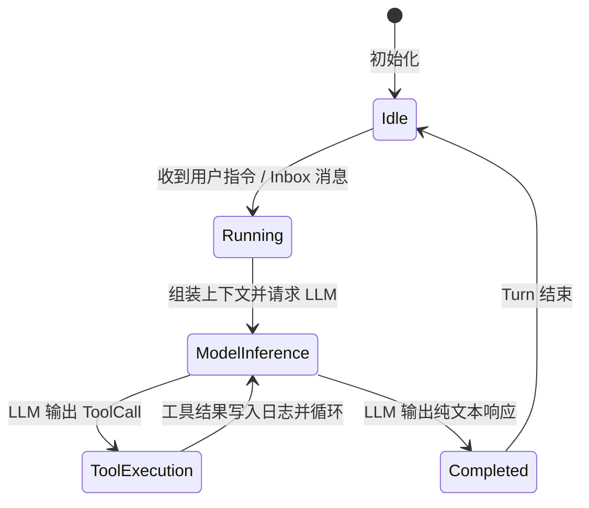
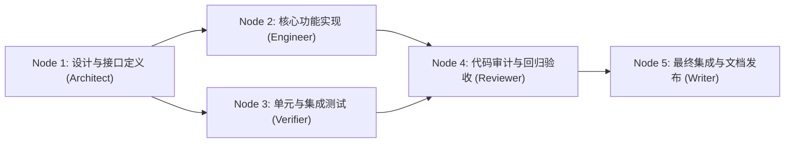

# Chapter 20: Terminology Reference

English | [中文](20-terminology-reference.zh.md)

For engineers with conventional programming backgrounds (C/C++, Java, Go, Rust, Python, TypeScript), the chief obstacle when entering AI and agent engineering is often not a lack of algorithmic knowledge but jargon and overlapping concepts. This chapter provides a rigorous reference to the book's core terms and their underlying system behavior.

Each term is described along four dimensions:
1. **Standard definition**: A mathematical definition, algorithmic principle, or formal state-machine description.
2. **Software-engineering / distributed-systems analogy**: A mapping to an established concept from operating systems, compilers, distributed systems, network protocols, or design patterns.
3. **Location in DeepSeek Harness source**: Relevant modules, core type definitions, and processing functions in the `deepseek-harness` repository.
4. **Common misconceptions and pitfalls**: Frequent production misunderstandings, concurrency races, VRAM leaks, logical deadlocks, and their defenses.

---

## Architecture Map of the Terms

```mermaid
graph TD
  subgraph LLM_Foundations ["第一层：大模型与底层计算 (Foundations)"]
    LLM["LLM (概率型纯函数)"]
    Token["Token (int32 词元)"]
    Embedding["Embedding (稠密向量)"]
    ContextWin["Context Window (Token 环形缓冲区)"]
    KVCache["KV Cache (注意力矩阵记忆化缓存)"]
    MLA["MLA (低秩压缩注意力)"]
    FlashAttn["FlashAttention (SRAM 分块计算)"]
    SwiGLU["SwiGLU (门控非线性单元)"]
    RoPE["RoPE (复数旋转位置编码)"]
    DPO["DPO (偏好损失对齐)"]
  end

  subgraph Runtime_Core ["第二层：Agent 运行时与控制循环 (Runtime Core)"]
    Agent["Agent (状态机循环)"]
    Harness["Harness (IoC 宿主容器)"]
    ReAct["ReAct (思考-行动循环)"]
    FuncCall["Function Calling (AST/RPC 调度)"]
    Turn["Turn (业务交互事务)"]
    Step["Step (单步推理迭代)"]
    Inbox["Inbox (线程安全待办队列)"]
    ConsumedWork["Consumed Work (因果屏障工作集)"]
    SessionEvent["Session Event (追加式事实账本)"]
    Projection["Projection (Fold/Reduce 状态投影)"]
  end

  subgraph DI_Boundaries ["第三层：Cordis 依赖注入与包边界 (Cordis DI)"]
    Plugin["Plugin (功能扩展单元)"]
    Service["Service (IoC 契约接口)"]
    Provider["Provider (服务生产者)"]
    Consumer["Consumer (服务消费者)"]
    Scope["Scope (生命周期隔离域)"]
    Waterfall["Waterfall (瀑布流事件钩子)"]
  end

  subgraph Graph_Orchestration ["第四层：Graph Mode 拓扑编排 (Graph Mode)"]
    GraphMode["Graph Mode (声明式 DAG 引擎)"]
    Campaign["Campaign (长周期战略目标)"]
    Batch["Batch (局部有界 DAG)"]
    Revision["Revision (不可变图版本)"]
    Lineage["Lineage (因果演化血统)"]
    Run["Run (图执行实例)"]
    Generation["Generation (调度代际)"]
    Activation["Activation (协调激活周期)"]
    Attempt["Attempt (物理执行尝试)"]
    EnvCheckpoint["Env Checkpoint (宿主变更审批点)"]
  end

  subgraph Distributed_Coordination ["第五层：LoopX 分布式协同 (Distributed Coordination)"]
    LoopX["LoopX (分布式外部协作总线)"]
    Claim["Claim (任务互斥声明)"]
    Lease["Lease (心跳租约)"]
    FencingToken["Fencing Token (单调递增屏障)"]
    Settlement["Settlement (终态证据结算)"]
  end

  subgraph Facilities ["第六层：安全与基础设施 (Facilities)"]
    Spill["Spill (超长输出分页转储)"]
    Sandbox["Sandbox (Landlock/Seatbelt 隔离)"]
    RAG["RAG (外部索引两阶段检索)"]
    Subagent["Subagent (权限递减子代理)"]
  end

  LLM --> Agent
  KVCache --> ContextWin
  MLA --> KVCache
  Agent --> Turn
  Turn --> Step
  Step --> FuncCall
  SessionEvent --> Projection
  Harness --> Plugin
  Service --> Provider
  Provider --> Consumer
  GraphMode --> Campaign
  Campaign --> Batch
  Batch --> Revision
  Run --> Generation
  Generation --> Activation
  Activation --> Attempt
  LoopX --> Claim
  Claim --> Lease
  Lease --> FencingToken
  FencingToken --> Settlement
```



---

## Part I: AI and LLM Foundations

### 1.1 LLM (Large Language Model)

#### Standard Definition
An LLM is a parameterized generator of conditional probability distributions. Given vocabulary $\mathcal{V}$ and input token sequence $X = (x_1, x_2, \dots, x_n)$, it produces a distribution for the next token $y_t \in \mathcal{V}$, $P(y_t \mid X, y_1, \dots, y_{t-1})$. Autoregressive generation samples one token at a time, giving the joint probability:

$$P(Y \mid X) = \prod_{t=1}^{T} P(y_t \mid X, y_{<t})$$

#### Software-Engineering / Distributed-Systems Analogy
**Stateless probabilistic pure function**.
- Input is a byte sequence (an array of token IDs); output is a high-dimensional floating-point array of vocabulary-sized logits.
- The model itself has no mutable state, external I/O, or long-term memory. Apparent conversational memory depends on the caller resending the full history on each HTTP/RPC request.

#### Where to Find It in DeepSeek Harness
- Interface definitions: `LlmProvider` and `LlmCallConfig` in [`packages/llm/llm/src/types.ts`](file:///d:/git/deepseek-harness/packages/llm/llm/src/types.ts).
- Scheduling: `ReactLoopAgent.prepareStep()` in [`packages/core/agent-loop/src/agent.ts`](file:///d:/git/deepseek-harness/packages/core/agent-loop/src/agent.ts).

#### Common Misconceptions and Pitfalls
- **Misconception**: An LLM has persistent internal state like a process, so each message can contain only the new content.
- **Correction**: The LLM server is stateless for each API request. Without explicitly assembling historical context and checking token limits, it loses prior conversation information. Harness must reconstruct the full prompt array from its event-sourced history.

---

### 1.2 Token

#### Standard Definition
A token is a discrete basic unit of text processing for an LLM, usually represented by an `int32` integer. Lossless tokenization algorithms such as BPE (Byte-Pair Encoding) or SentencePiece map natural-language strings or binary UTF-8 bytes to and from vocabulary indices $i \in [0, |\mathcal{V}| - 1]$.

#### Software-Engineering / Distributed-Systems Analogy
**A token ID emitted by the compiler's lexical-analysis stage**.
- Natural-language tokens resemble enumerated keywords, operators, or identifiers in a programming language.
- DeepSeek-V3 has vocabulary size $|\mathcal{V}| = 129,280$. A Chinese character commonly maps to one or two tokens and an English word to one token.

#### Where to Find It in DeepSeek Harness
- Token budgeting and accounting: `LlmUsage` (`promptTokens`, `completionTokens`, `totalTokens`) in [`packages/llm/llm/src/types.ts`](file:///d:/git/deepseek-harness/packages/llm/llm/src/types.ts).
- Compaction and truncation: [`packages/compaction/compaction/src/index.ts`](file:///d:/git/deepseek-harness/packages/compaction/compaction/src/index.ts).

#### Common Misconceptions and Pitfalls
- **Misconception**: `str.length` estimates the number of tokens.
- **Correction**: Character and token counts diverge for multilingual text, special characters, code indentation, and Markdown tables. One unusual Unicode character may split into three or four byte tokens. Do not use character counts for hard truncation; budget with an accurate tokenizer or provider-reported usage.

---

### 1.3 Embedding

#### Standard Definition
An embedding maps discrete symbols such as tokens, sentences, or documents into continuous, compact, high-dimensional space $\mathbb{R}^d$ through a differentiable projection $f: \mathcal{X} \to \mathbb{R}^d$. Semantic similarity can then be measured by geometric distance or cosine angle in that space:

$$\text{CosineSimilarity}(\mathbf{u}, \mathbf{v}) = \frac{\mathbf{u} \cdot \mathbf{v}}{\|\mathbf{u}\|_2 \|\mathbf{v}\|_2}$$

#### Software-Engineering / Distributed-Systems Analogy
**High-dimensional locality-sensitive hashing**.
- Conventional hashes such as MD5/SHA256 aim for an avalanche effect: one changed input bit yields a very different output. An embedding aims to preserve proximity: semantically similar text has nearby vectors in high-dimensional Euclidean space.

#### Where to Find It in DeepSeek Harness
- Vector-search interface: [`packages/workflow/rag/src/index.ts`](file:///d:/git/deepseek-harness/packages/workflow/rag/src/index.ts).
- Session-reference lookup: [`packages/context/session-reference/src/index.ts`](file:///d:/git/deepseek-harness/packages/context/session-reference/src/index.ts).

#### Common Misconceptions and Pitfalls
- **Misconception**: Cosine similarity above $0.8$ guarantees a strongly relevant and correct code fragment.
- **Correction**: Dense vectors smooth over exact code keywords such as function signatures, variable names, and error codes. A production system needs hybrid BM25 sparse retrieval and dense embeddings with Reciprocal Rank Fusion (RRF), followed by Cross-Encoder reranking.

---

### 1.4 Context Window

#### Standard Definition
The maximum token-sequence length $S_{\max}$ that a Transformer can hold for one self-attention pass, for example 64K or 128K. In theory, attention's time and space costs along the position dimension are $\mathcal{O}(S^2)$. Tokens beyond the window cannot be attended to.

#### Software-Engineering / Distributed-Systems Analogy
**Fixed-size ring buffer or hardware register window**.
- Once input exceeds the window, the caller must evict content through FIFO, lossy summary compaction, or a sliding window; otherwise the API rejects the oversized request (HTTP 400 Bad Request).

#### Where to Find It in DeepSeek Harness
- Budget checking and overflow defense: `requestProposal()` in [`packages/core/agent-loop/src/agent.ts`](file:///d:/git/deepseek-harness/packages/core/agent-loop/src/agent.ts).
- Context trimming: [`packages/compaction/compaction-basic/src/index.ts`](file:///d:/git/deepseek-harness/packages/compaction/compaction-basic/src/index.ts).

#### Common Misconceptions and Pitfalls
- **Misconception**: A 128K context window makes it safe to insert hundreds of complete files at once.
- **Correction**:
  1. **Needle-in-a-haystack effect**: As context grows, attention to the middle can deteriorate ("Lost in the Middle").
  2. **Time to first token (TTFT) degrades sharply**: Very long prefill blocks inference-server compute. Use hierarchical indexes and on-demand loading to reduce prompt size per request.

---

### 1.5 KV Cache

#### Standard Definition
During Transformer autoregressive decoding, the key and value matrices of previously generated tokens remain unchanged. Caching historical $\mathbf{K}_{\le t}, \mathbf{V}_{\le t}$ in VRAM avoids recomputing QKV projections over the whole prefix for every new token, an $\mathcal{O}(S^2)$ cost.

$$M_{\text{KV}} = 2 \times 2 \times L \times n_{\text{heads}} \times d_{\text{head}} \times S \times B \quad (\text{Bytes})$$

Here $L$ is the number of layers, $n_{\text{heads}}$ the attention-head count, $d_{\text{head}}$ the dimension per head, $S$ sequence length, and $B$ batch size. The two factors of 2 represent K and V and the 2 bytes used by FP16/BF16, respectively.

#### Software-Engineering / Distributed-Systems Analogy
**Dynamic-programming memoization table**.
- It trades space for time, reducing computational complexity from $\mathcal{O}(S^2)$ to $\mathcal{O}(S)$.

#### Where to Find It in DeepSeek Harness
- Cache-hit tests and optimization: [`packages/core/agent-loop/tests/request-cache.e2e.ts`](file:///d:/git/deepseek-harness/packages/core/agent-loop/tests/request-cache.e2e.ts).
- System-prompt prefix stability: [`packages/context/agent-instructions/src/index.ts`](file:///d:/git/deepseek-harness/packages/context/agent-instructions/src/index.ts).

#### Common Misconceptions and Pitfalls
- **Misconception**: Injecting a frequently changing timestamp at the beginning of the system prompt, such as `Current Time: 2026-08-25 16:30:00`, is harmless.
- **Correction**: Modern inference engines such as vLLM, SGLang, and the official DeepSeek API rely on **longest-common-prefix matching (prefix caching)** to reuse server-side KV Cache. A changing timestamp invalidates the prefix hash on every request, can drive the cache-hit rate to 0%, increase inference latency five- to tenfold, and double server costs. Put dynamic data at the end of the message stream or fetch it on demand through a tool.

---

### 1.6 MLA (Multi-Head Latent Attention)

#### Standard Definition
A high-performance attention architecture developed by DeepSeek. Low-rank tensor factorization compresses conventional key-value projections into a small latent vector ($c_t^{KV}$), sharply reducing KV Cache VRAM during decoding. A separate RoPE-encoded vector preserves precise positional modeling.

$$\mathbf{c}_t^{KV} = W^{DKV} \mathbf{h}_t \quad (\text{low-rank down-projection}), \quad \mathbf{K}_t^C = \mathbf{c}_t^{KV} W^{UK}, \quad \mathbf{V}_t^C = \mathbf{c}_t^{KV} W^{UV}, \quad \mathbf{K}_t^R = \text{RoPE}(\mathbf{h}_t W^{KR})$$

#### Software-Engineering / Distributed-Systems Analogy
**Dictionary encoding in a column store and zero-copy decompression at computation time**.
- Keep only a highly compressed latent vector in VRAM. Immediately before GPU Tensor Core dot products, kernel fusion multiplies it by the projection matrix to restore full head dimensions.

```
传统 MHA 显存布局 (膨胀):
[Layer 0] -> K: [Head 0 ... Head 127] (128*128 float16) | V: [Head 0 ... Head 127] (128*128 float16) -> 64 KB / token
[Layer 1] -> ...

DeepSeek MLA 显存布局 (极致紧凑):
[Layer 0] -> Compressed Latent c_t: (512 float16) | RoPE Key K_t^R: (64 float16) -> 1.15 KB / token (压缩 93%!)
[Layer 1] -> ...
```

#### Where to Find It in DeepSeek Harness
- Model-adapter layer: [`packages/llm/llm/src/index.ts`](file:///d:/git/deepseek-harness/packages/llm/llm/src/index.ts).

#### Common Misconceptions and Pitfalls
- **Misconception**: MLA is lossy quantization like INT4/INT8 and significantly harms reasoning.
- **Correction**: MLA is a structural innovation trained through low-rank matrix factorization during pretraining. It retains the expressive capacity of standard MHA while reducing inference-time KV Cache VRAM to roughly $1/7 \sim 1/8$ of the original.

---

### 1.7 FlashAttention

#### Standard Definition
FlashAttention is an I/O-aware GPU-kernel optimization for exact attention. By tiling into fast on-chip GPU SRAM, it avoids repeatedly reading and writing the intermediate $S \times S$ attention matrix in slower high-bandwidth memory (HBM), while preserving mathematically exact computation. This reduces HBM I/O complexity from $\mathcal{O}(S^2)$ to $\mathcal{O}(S)$.

#### Software-Engineering / Distributed-Systems Analogy
**CPU cache-line alignment and tiled matrix multiplication (loop tiling / cache blocking)**.
- Keep hot computations in L1/L2 cache (SRAM) rather than repeatedly accessing main memory (HBM/DRAM).

#### Where to Find It in DeepSeek Harness
- Inference-backend abstraction: [`packages/llm/llm-provider/src/index.ts`](file:///d:/git/deepseek-harness/packages/llm/llm-provider/src/index.ts).

#### Common Misconceptions and Pitfalls
- **Misconception**: FlashAttention is approximate and introduces accuracy drift like lossy compression.
- **Correction**: FlashAttention is mathematically equivalent to standard attention; it neither truncates nor approximates through sampling. Online updates to Softmax's local scaling constants remove the need to materialize the full Softmax matrix in VRAM.

---

### 1.8 SwiGLU

#### Standard Definition
A gated feed-forward network variant combining the Swish activation function and the GLU (Gated Linear Unit) gating mechanism:

$$\text{SwiGLU}(x, W, V, W_2) = \left( \text{Swish}(xW) \otimes xV \right) W_2$$

Here $\text{Swish}(z) = z \cdot \sigma(\beta z)$ and $\otimes$ is element-wise multiplication (the Hadamard product).

#### Software-Engineering / Distributed-Systems Analogy
**A hardware transistor gate or dual-check interceptor**.
- $xW$ determines the feature-computation stream; $xV$ acts as a smooth gate that dynamically controls how much information passes.

#### Where to Find It in DeepSeek Harness
- Model-feature definitions: [`packages/llm/llm/src/index.ts`](file:///d:/git/deepseek-harness/packages/llm/llm/src/index.ts).

---

### 1.9 RoPE (Rotary Position Embedding)

#### Standard Definition
A position-encoding method that uses two-dimensional rotations in the complex plane, parameterized by absolute positions, to represent relative positional attention. For a two-dimensional vector $\mathbf{x} = (x_1, x_2)^T \in \mathbb{R}^2$ at position $m$, RoPE applies an orthogonal rotation matrix:

$$\mathbf{R}_{\Theta, m} \mathbf{x} = \begin{pmatrix} \cos m\theta & -\sin m\theta \\ \sin m\theta & \cos m\theta \end{pmatrix} \begin{pmatrix} x_1 \\ x_2 \end{pmatrix}$$

For any inner product $\langle \mathbf{R}_m \mathbf{q}, \mathbf{R}_n \mathbf{k} \rangle$, the result depends only on relative displacement $m - n$.

#### Software-Engineering / Distributed-Systems Analogy
**Complex phasor rotation or relative timestamp-offset encoding**.
- Converts an absolute scalar sequence position into a rotation angle in high-dimensional vector space.

---

### 1.10 DPO (Direct Preference Optimization)

#### Standard Definition
An alignment algorithm that skips reward-model training and PPO reinforcement-learning sampling. It directly optimizes LLM policy parameters $\pi_\theta$ from preference pairs $(y_w \succ y_l \mid x)$ in closed form. Its loss is:

$$\mathcal{L}_{\text{DPO}}(\pi_\theta; \pi_{\text{ref}}) = -\mathbb{E}_{(x, y_w, y_l) \sim \mathcal{D}} \left[ \log \sigma \left( \beta \log \frac{\pi_\theta(y_w \mid x)}{\pi_{\text{ref}}(y_w \mid x)} - \beta \log \frac{\pi_\theta(y_l \mid x)}{\pi_{\text{ref}}(y_l \mid x)} \right) \right]$$

#### Software-Engineering / Distributed-Systems Analogy
**Binary cross-entropy with a reference penalty (contrastive cross-entropy with reference regularization)**.
- Like a comparative A/B-test weight update, it monotonically increases the relative likelihood of human-preferred output $y_w$ and decreases that of disfavored output $y_l$.

---

## Part II: Agent State Machines and the Harness Runtime

### 2.1 Agent

#### Standard Definition
An active computational entity with an LLM decision core, long- and short-term state, a tool-execution environment, and a closed loop for self-reflection. Its core is a deterministic, causally driven loop:

$$\text{State}_{t+1} = \text{Execute}\left(\text{State}_t, \text{LLM}(\text{State}_t)\right)$$



#### Software-Engineering / Distributed-Systems Analogy
**An operating-system event loop or embedded finite-state machine (FSM)**.
- The LLM computes conditions for state transitions.
- A tool is a system call.
- The Harness runtime acts as the kernel manager, scheduling work, assigning resources, and enforcing the security sandbox.

#### Where to Find It in DeepSeek Harness
- Core state-machine interface: `Agent` in [`packages/core/agent/src/types.ts`](file:///d:/git/deepseek-harness/packages/core/agent/src/types.ts).
- Production loop driver: `ReactLoopAgent` in [`packages/core/agent-loop/src/agent.ts`](file:///d:/git/deepseek-harness/packages/core/agent-loop/src/agent.ts).

#### Common Misconceptions and Pitfalls
- **Misconception**: An agent has autonomous "self-awareness" and thinks without any external trigger.
- **Correction**: An agent is an **event-driven passive state machine**. Without a user message in its Inbox, a Cron schedule, or a subagent-completion callback, it remains suspended in `idle` and consumes no compute.

---

### 2.2 Harness

#### Standard Definition
The term comes from wiring harnesses and test fixtures in aerospace and electronics. In software architecture, a harness is the **deterministic host container** around a nondeterministic LLM. It manages lifecycles, dependency injection, event-sourced persistence, tool sandboxing, concurrency, cancellation propagation, and distributed terminal settlement.

#### Software-Engineering / Distributed-Systems Analogy
**Spring Framework, Kubernetes Pod runtime, or Java EE application server**.
- Business logic (prompts and tools) runs inside the controlled container supplied by Harness. Harness centrally manages and intercepts I/O, network requests, and lifecycle hooks.

#### Where to Find It in DeepSeek Harness
- Boot entry point: [`packages/boot/boot/src/index.ts`](file:///d:/git/deepseek-harness/packages/boot/boot/src/index.ts).
- Host core: [`packages/host/src/index.ts`](file:///d:/git/deepseek-harness/packages/host/src/index.ts).

---

### 2.3 ReAct (Reasoning + Acting Decision Loop)

#### Standard Definition
A reasoning-and-action pattern proposed by Yao et al. In one cognitive step, the model alternates between an **explicit reasoning trace (thought / reasoning content)** and a **specific environment action (action / tool call)**, then reasons again after observing feedback.

#### Software-Engineering / Distributed-Systems Analogy
**A closed-loop PID controller in industrial control systems (or the Observe-Orient-Decide-Act / OODA loop)**.

#### Where to Find It in DeepSeek Harness
- Loop implementation: `ReactLoopAgent.runStep()` in [`packages/core/agent-loop/src/agent.ts`](file:///d:/git/deepseek-harness/packages/core/agent-loop/src/agent.ts).

---

### 2.4 Function Calling / Tool Call

#### Standard Definition
While decoding, the LLM uses the supplied JSON Schema to stop generating ordinary prose and instead produce a structured JSON abstract-syntax-tree (AST) fragment containing function `name` and serialized `arguments`. The host runtime parses and safely dispatches it.

#### Software-Engineering / Distributed-Systems Analogy
**Remote-procedure-call (RPC) serialization/deserialization or an operating-system syscall trap**.

#### Where to Find It in DeepSeek Harness
- Tool registration and execution: `executeToolCalls()` in [`packages/core/agent-loop/src/tool-calls.ts`](file:///d:/git/deepseek-harness/packages/core/agent-loop/src/tool-calls.ts).
- Strict schema validation: `assertObjectJsonSchema` in [`packages/core/tools/src/index.ts`](file:///d:/git/deepseek-harness/packages/core/tools/src/index.ts).

#### Common Misconceptions and Pitfalls
- **Misconception**: The LLM itself connects to the operating system, executes Bash commands, or writes files.
- **Correction**: The model generates JSON-formatted text. The Harness container performs side effects such as file writes and network requests. Without input validation, Harness would expose **remote-code-execution (RCE)** and path-traversal vulnerabilities.

---

### 2.5 Turn

#### Standard Definition
The **complete business-transaction boundary** from one explicit user task input until the agent achieves its goal or yields control. A Turn can contain multiple iterations of reasoning and tool calls, each a Step.

```
+-------------------------------------------------------------+
| Turn N (业务事务边界: turn/start -> turn/end)                 |
|  +----------------+  +----------------+  +----------------+ |
|  | Step 1 (Tool)  |  | Step 2 (Tool)  |  | Step 3 (Final) | |
|  +----------------+  +----------------+  +----------------+ |
+-------------------------------------------------------------+
```

#### Software-Engineering / Distributed-Systems Analogy
**A database transaction or HTTP request-response lifecycle**.
- `turn/start` corresponds to `BEGIN TRANSACTION`.
- `turn/end` corresponds to `COMMIT` or `ROLLBACK`.

#### Where to Find It in DeepSeek Harness
- Transaction events: `'turn/start'` and `'turn/end'` in [`packages/core/session/src/index.ts`](file:///d:/git/deepseek-harness/packages/core/session/src/index.ts).
- State-machine control: [`packages/core/agent-loop/src/agent.ts`](file:///d:/git/deepseek-harness/packages/core/agent-loop/src/agent.ts).

---

### 2.6 Step

#### Standard Definition
One **physical atomic iteration** of the agent state machine, containing only:
1. Assemble the current session context.
2. Start one stage of LLM streaming inference.
3. Parse the response and schedule its tool calls, if any.
4. Atomically append the resulting events to the session log.

#### Software-Engineering / Distributed-Systems Analogy
**One CPU instruction cycle (fetch, decode, execute)**.

#### Where to Find It in DeepSeek Harness
- Single-step executor: `ReactLoopAgent.runStep()` in [`packages/core/agent-loop/src/agent.ts`](file:///d:/git/deepseek-harness/packages/core/agent-loop/src/agent.ts).

---

### 2.7 Inbox

#### Standard Definition
A **concurrency-safe mailbox** attached to an agent instance. Messages from external systems—user UI input, scheduled tasks, subagent-completion notices—enter its buffer and are claimed at Step boundaries in strict causal order.

#### Software-Engineering / Distributed-Systems Analogy
**The mailbox in an Erlang/Akka Actor model**.

#### Where to Find It in DeepSeek Harness
- Implementation: `Inbox` in [`packages/core/agent/src/inbox.ts`](file:///d:/git/deepseek-harness/packages/core/agent/src/inbox.ts).
- Events: `'agent/inbox/inserted'`, `'agent/inbox/claimed'`, and `'agent/inbox/discarded'`.

---

### 2.8 Consumed Work

#### Standard Definition
An immutable snapshot of messages that the current Turn deterministically claims and commits to processing despite concurrent arrivals from multiple sources. It establishes a causal barrier for state-machine progress.

#### Software-Engineering / Distributed-Systems Analogy
**A committed Kafka consumer-offset snapshot**.

#### Where to Find It in DeepSeek Harness
- Definition: `ConsumedWork` in [`packages/core/agent/src/consumed-work.ts`](file:///d:/git/deepseek-harness/packages/core/agent/src/consumed-work.ts).

---

### 2.9 Session Event and Event Sourcing

#### Standard Definition
Harness's central persistence model: The single source of truth is not a mutable current-state object but a **strictly monotonically ordered, append-only, immutable stream of typed events**. All state is derived by replaying and folding that stream.

#### Software-Engineering / Distributed-Systems Analogy
**A database write-ahead log (WAL) or a financial transaction audit ledger**.

```
Session Log (Append-Only Event Ledger):
[Event 0: session/created]
    -> [Event 1: turn/start]
        -> [Event 2: message (user)]
            -> [Event 3: step/start]
                -> [Event 4: model/call]
                -> [Event 5: tool/call (bash)]
                -> [Event 6: tool/result (exit 0)]
            -> [Event 7: step/end]
        -> [Event 8: turn/end]
```

#### Where to Find It in DeepSeek Harness
- Event definitions: `SessionEventMap` and `Session` in [`packages/core/session/src/index.ts`](file:///d:/git/deepseek-harness/packages/core/session/src/index.ts).

#### Common Misconceptions and Pitfalls
- **Misconception**: To change how an old message appears, update a historical Event object directly with SQL `UPDATE` or in memory.
- **Correction**: Mutating the event log destroys projection and cache consistency. Append a typed correction event such as `compaction/prune` or `graph/revision` and derive the new view during projection.

---

### 2.10 Projection and `deriveMessages()`

#### Standard Definition
A deterministic pure function:

$$\text{Projection}: \text{List}[\text{SessionEvent}] \to \text{StateView}$$

For LLM interaction, `deriveMessages(events)` folds a flat event stream into a standard `Message[]` array accepted by the OpenAI/DeepSeek API.

#### Software-Engineering / Distributed-Systems Analogy
**A CQRS read-model projection or Redux `reducer(state, action)`**.

#### Where to Find It in DeepSeek Harness
- Derivation: `deriveMessages()` in [`packages/core/session/src/surface.ts`](file:///d:/git/deepseek-harness/packages/core/session/src/surface.ts).
- Runtime-context projection: [`packages/core/agent-loop/src/runtime-context.ts`](file:///d:/git/deepseek-harness/packages/core/agent-loop/src/runtime-context.ts).

---

## Part III: Cordis Plugins, Dependency Injection, and Monorepo Boundaries

### 3.1 Plugin

#### Standard Definition
An independently deployable unit of functionality with its own lifecycle. A plugin declares required and provided Services and registers and releases resources during `apply` and `dispose`.

#### Software-Engineering / Distributed-Systems Analogy
**An OSGi Bundle, Eclipse plugin, or VS Code extension**.

#### Where to Find It in DeepSeek Harness
- Runtime core: [`packages/core/cordis/src/index.ts`](file:///d:/git/deepseek-harness/packages/core/cordis/src/index.ts).

---

### 3.2 Service

#### Standard Definition
An **abstract service contract** identified by a global symbol or unique string in the dependency-injection container. It defines a public API for a system capability, independent of any implementation.

#### Software-Engineering / Distributed-Systems Analogy
**A Java interface such as `public interface StorageService`, or a TypeScript abstract class**.

---

### 3.3 Provider

#### Standard Definition
A concrete plugin implementing a particular Service contract. At container startup, it binds its instance to a Context property for global or local consumption.

#### Software-Engineering / Distributed-Systems Analogy
**A concrete Spring bean annotated with `@Service`**.

#### Where to Find It in DeepSeek Harness
- Scheduler provider example: `MemoryGraphSchedulerProvider` in [`packages/graph/graph-scheduler/src/index.ts`](file:///d:/git/deepseek-harness/packages/graph/graph-scheduler/src/index.ts).

---

### 3.4 Consumer

#### Standard Definition
A plugin or business module that needs a Service without depending on the specific Provider that instantiates it. It accesses the service declaratively through `ctx[serviceName]`.

#### Software-Engineering / Distributed-Systems Analogy
**A Spring consumer class with an `@Autowired` dependency**.

---

### 3.5 Scope and Context

#### Standard Definition
A hierarchical dependency-injection container governing plugin visibility, resource-disposal boundaries, and inheritance. Disposing a parent Scope must recursively dispose listeners, timers, and network handles attached to child Scopes.

#### Software-Engineering / Distributed-Systems Analogy
**A structured-concurrency context tree, or a NestJS/Spring request or session scope**.

#### Where to Find It in DeepSeek Harness
- Core implementation: `createScope` in [`packages/core/scope/src/index.ts`](file:///d:/git/deepseek-harness/packages/core/scope/src/index.ts).

---

### 3.6 Waterfall Event

#### Standard Definition
A synchronous or asynchronous chained event dispatcher that can change its payload in place. Interceptors run in priority order, each receiving the data changed by its predecessor.

#### Software-Engineering / Distributed-Systems Analogy
**Koa/Express onion-style middleware or a Java Servlet Filter chain**.

#### Where to Find It in DeepSeek Harness
- Prompt and context waterfall assembly: [`packages/core/agent/src/dispatch.ts`](file:///d:/git/deepseek-harness/packages/core/agent/src/dispatch.ts).

---

## Part IV: Graph Mode and Task-Orchestration Topology

### 4.1 Graph Mode

#### Standard Definition
A higher-level orchestration mode that decomposes large software-engineering goals into a **directed acyclic graph (DAG)**. A dedicated Controller agent plans the work and assigns topological nodes to specialized roles—Architect, Engineer, Reviewer, Verifier, and others—for parallel or dependency-ordered execution.



#### Software-Engineering / Distributed-Systems Analogy
**Apache Airflow, Kubernetes Argo Workflows, or a Bazel build-dependency graph**.

#### Where to Find It in DeepSeek Harness
- Orchestration engine: [`packages/graph/graph-mode/src/index.ts`](file:///d:/git/deepseek-harness/packages/graph/graph-mode/src/index.ts).
- Domain model and validation: [`packages/graph/graph/src/index.ts`](file:///d:/git/deepseek-harness/packages/graph/graph/src/index.ts).

---

### 4.2 Campaign

#### Standard Definition
A **long-running objective spanning multiple batches** beyond a single bounded DAG. One Campaign coordinates ordered Batches and preserves both the unmodifiable completed prefix and durable acceptance evidence.

#### Software-Engineering / Distributed-Systems Analogy
**An agile Epic or milestone release, or a distributed long-transaction Saga coordinator**.

#### Where to Find It in DeepSeek Harness
- Type definition: `GraphCampaign` in [`packages/graph/graph/src/types.ts`](file:///d:/git/deepseek-harness/packages/graph/graph/src/types.ts).
- Batch transitions: `settleCampaignRun()` in [`packages/graph/graph-mode/src/index.ts`](file:///d:/git/deepseek-harness/packages/graph/graph-mode/src/index.ts).

---

### 4.3 Batch

#### Standard Definition
An **independent execution unit and locally bounded DAG** within a Campaign. Every Batch has its own Graph identity and contains only its own task nodes. After a preceding Batch settles successfully, the next inherits compact evidence summaries rather than its complete node history.

#### Software-Engineering / Distributed-Systems Analogy
**An agile Sprint or a segmented chunk/partition job in batch processing**.

#### Where to Find It in DeepSeek Harness
- Type definition: `GraphCampaignBatchDraft` in [`packages/graph/graph/src/types.ts`](file:///d:/git/deepseek-harness/packages/graph/graph/src/types.ts).

---

### 4.4 Revision

#### Standard Definition
An **immutable snapshot** of Graph topology. Every change to task nodes or refactoring after failure creates a new `GraphRevision` with a monotonically increasing revision number; earlier Revisions remain read-only for audit and replay.

#### Software-Engineering / Distributed-Systems Analogy
**A Git commit object or a Linux-kernel read-copy-update (RCU) snapshot**.

#### Where to Find It in DeepSeek Harness
- Definition: `GraphRevision` in [`packages/graph/graph/src/types.ts`](file:///d:/git/deepseek-harness/packages/graph/graph/src/types.ts).

---

### 4.5 Lineage

#### Standard Definition
Metadata recording why a Revision was created and how it relates to earlier versions. It identifies a new task (`new_task`), analysis refactoring (`analysis_refactor`), or execution correction (`execution_correction`) and records structured changes (`structuralDeltas`).

#### Software-Engineering / Distributed-Systems Analogy
**Database data-lineage tracking or parent-hash and commit-message metadata in a Git commit graph**.

#### Where to Find It in DeepSeek Harness
- Definition: `GraphRevisionLineage` in [`packages/graph/graph/src/types.ts`](file:///d:/git/deepseek-harness/packages/graph/graph/src/types.ts).

---

### 4.6 Run

#### Standard Definition
One **concrete execution instance** of a particular Graph Revision, recording its overall scheduling lifecycle (`pending` $\to$ `running` $\to$ `succeeded` / `failed` / `paused`).

#### Software-Engineering / Distributed-Systems Analogy
**A single triggered CI/CD pipeline run, such as a GitHub Actions workflow run**.

#### Where to Find It in DeepSeek Harness
- Definition: `GraphRun` in [`packages/graph/graph/src/types.ts`](file:///d:/git/deepseek-harness/packages/graph/graph/src/types.ts).

---

### 4.7 Generation

#### Standard Definition
A **scheduling-generation identifier (`GraphRunGenerationId`)** within one Run, advanced after resume, host restart, or fault drift. It increases monotonically whenever scheduling restarts so stale asynchronous operations from earlier generations can be discarded.

#### Software-Engineering / Distributed-Systems Analogy
**A term or epoch number in Raft/Paxos consensus**.

#### Where to Find It in DeepSeek Harness
- Branded type: `GraphRunGenerationId` in [`packages/graph/graph/src/types.ts`](file:///d:/git/deepseek-harness/packages/graph/graph/src/types.ts).

---

### 4.8 Activation

#### Standard Definition
One **external coordination activation lifecycle** when a task node is assigned to a Worker within a specific Generation.

#### Software-Engineering / Distributed-Systems Analogy
**A task-lease activation handle in distributed scheduling**.

---

### 4.9 Attempt

#### Standard Definition
One **physical execution attempt** for a task node. With `maxAttempts = 3`, a nondeterministic environment failure creates a new Attempt ID for another run.

#### Software-Engineering / Distributed-Systems Analogy
**A network-request retry count or a Kubernetes Pod reconstruction attempt**.

#### Where to Find It in DeepSeek Harness
- Type: `GraphAttemptId` in [`packages/graph/graph/src/types.ts`](file:///d:/git/deepseek-harness/packages/graph/graph/src/types.ts).

---

### 4.10 Environment Checkpoint

#### Standard Definition
A safety barrier when Graph execution reaches an irreversible host-environment change, such as installing a global dependency, destroying a Docker container, or changing system-wide networking. The scheduler pauses, persists context, and waits for a human operator's sign-off.

#### Software-Engineering / Distributed-Systems Analogy
**A manual approval gate for production deployment**.

#### Where to Find It in DeepSeek Harness
- Checkpoint types: `GraphCheckpoint` and `GraphEnvironmentPlan` in [`packages/graph/graph/src/types.ts`](file:///d:/git/deepseek-harness/packages/graph/graph/src/types.ts).

---

## Part V: LoopX and Distributed Coordination

### 5.1 LoopX

#### Standard Definition
An **external, independent distributed coordination service and fact-arbitration gateway** in the DeepSeek Harness ecosystem. It provides shared Goal tracking, Todo reconciliation, lease locking, and distributed terminal settlement for agent instances across nodes and machines.

#### Software-Engineering / Distributed-Systems Analogy
**A distributed metadata coordinator such as Apache ZooKeeper, HashiCorp Consul, or etcd**.

---

### 5.2 Claim

#### Standard Definition
A Worker's **exclusive request to claim a Goal or Task** from the coordination service. Only a Worker whose Claim succeeds may execute it.

#### Software-Engineering / Distributed-Systems Analogy
**Distributed lock acquisition, such as Redis `SET key value NX PX 30000`**.

#### Where to Find It in DeepSeek Harness
- Scheduling claim: `acquire()` in [`packages/graph/graph-scheduler/src/index.ts`](file:///d:/git/deepseek-harness/packages/graph/graph-scheduler/src/index.ts).

---

### 5.3 Lease

#### Standard Definition
A credential granting a Worker exclusive task-execution rights during a limited interval $[T_{\text{start}}, T_{\text{expires}}]$. The Worker must renew it with periodic heartbeats before expiry; otherwise another Worker can claim the task.

#### Software-Engineering / Distributed-Systems Analogy
**A DHCP IP-address lease or Google Chubby lease lock**.

#### Where to Find It in DeepSeek Harness
- Lease type: `GraphSchedulerLease` in [`packages/graph/graph-scheduler/src/index.ts`](file:///d:/git/deepseek-harness/packages/graph/graph-scheduler/src/index.ts).

---

### 5.4 Fencing Token

#### Standard Definition
A defense described by Martin Kleppmann in discussions of distributed locks: a **globally, strictly monotonically increasing integer** issued by the server when a client acquires a lease. Every write to shared storage carries the token; storage accepts a write only if its token is strictly greater than the highest previously recorded token, under a compare-and-swap inequality:

$$\text{token}_{\text{incoming}} > \text{token}_{\text{last}}$$

```
[旧 Worker A (因 GC 挂起)] -------- (迟到的写入, Token = 1) -------> [存储层: 当前 Token = 2] -> 拒绝! 409 Conflict
[新 Worker B (租约接管)] -------- (正常写入, Token = 2) -----------> [存储层: 更新成功!]
```

#### Software-Engineering / Distributed-Systems Analogy
**An optimistic-concurrency version or row version, or a CPU memory-bus compare-and-swap barrier**.

#### Where to Find It in DeepSeek Harness
- Token issuance and checking: `lastFencingToken` in [`packages/graph/graph-scheduler/src/index.ts`](file:///d:/git/deepseek-harness/packages/graph/graph-scheduler/src/index.ts).

#### Common Misconceptions and Pitfalls
- **Misconception**: A TTL on a distributed lock prevents all double-write races.
- **Correction**: After a GC pause, network partition, or slow I/O, an old Worker may resume after its lease expires and write stale data, creating split-brain state. The persistence layer must check fencing tokens and reject every write carrying an old one.

---

### 5.5 Settlement

#### Standard Definition
An **irreversible terminal settlement record** submitted to LoopX after a task completes, containing a cryptographic signature, artifact hashes, and execution metadata.

#### Software-Engineering / Distributed-Systems Analogy
**Two-way reconciliation in a banking clearing and settlement system**.

#### Where to Find It in DeepSeek Harness
- Settlement type: `GraphSettlementRecord` in [`packages/graph/graph/src/types.ts`](file:///d:/git/deepseek-harness/packages/graph/graph/src/types.ts).

---

## Part VI: Production Facilities for Isolation, Storage, and Extension

### 6.1 Spill

#### Standard Definition
Injecting a very large tool output—for example, 50 MB of log data from `find /`—directly into model context exhausts the context window. Spill writes the output to a temporary disk file and retains only a **truncated leading summary plus a SHA-256 artifact reference** in context.

#### Software-Engineering / Distributed-Systems Analogy
**Database spill-to-disk or virtual-memory paging and swap**.

#### Where to Find It in DeepSeek Harness
- Spill implementation: [`packages/spill/spill/src/index.ts`](file:///d:/git/deepseek-harness/packages/spill/spill/src/index.ts).

---

### 6.2 Sandbox / Landlock / Seatbelt

#### Standard Definition
Operating-system security mechanisms—Linux Landlock LSM and seccomp-bpf, or macOS Sandbox Seatbelt—enforce **fine-grained least privilege** on agent subprocesses. They constrain readable and writable filesystem paths, prohibit native network-socket creation, and block privileged process spawning.

#### Software-Engineering / Distributed-Systems Analogy
**Linux cgroups and namespaces, or a browser renderer-process sandbox**.

#### Where to Find It in DeepSeek Harness
- Sandbox types and execution: [`packages/sandbox/sandbox/src/index.ts`](file:///d:/git/deepseek-harness/packages/sandbox/sandbox/src/index.ts) and [`packages/sandbox/sandbox-landlock/src/index.ts`](file:///d:/git/deepseek-harness/packages/sandbox/sandbox-landlock/src/index.ts).

---

### 6.3 RAG (Retrieval-Augmented Generation)

#### Standard Definition
A two-stage architecture: before asking an LLM to generate, retrieve relevant document fragments from an external knowledge base using the Query, then include high-quality retrieved facts in the System/User Prompt as reference context. This reduces hallucinations and extends domain knowledge.

$$\text{Context}_{\text{final}} = \text{Prompt}_{\text{system}} \oplus \text{TopK}(\text{Search}(\text{Query}, \mathcal{D})) \oplus \text{Query}$$

#### Software-Engineering / Distributed-Systems Analogy
**A read-through cache fetching from external storage after an L2 cache miss**.

#### Where to Find It in DeepSeek Harness
- Workflow implementation: [`packages/workflow/rag/src/index.ts`](file:///d:/git/deepseek-harness/packages/workflow/rag/src/index.ts).

---

### 6.4 Subagent and `sandboxModeCap`

#### Standard Definition
An independent-lifecycle subagent spawned by a parent agent for a risky or complex subtask. The permissions model enforces **monotonic privilege attenuation**: the child's sandbox cap (`sandboxModeCap`) and toolset may be no broader than the parent's. Privilege escalation is forbidden.

#### Software-Engineering / Distributed-Systems Analogy
**Unix `fork()` plus privilege dropping with `setuid()` or `cap_set_proc()`**.

#### Where to Find It in DeepSeek Harness
- Spawning and attenuation: [`packages/subagent/subagent/src/index.ts`](file:///d:/git/deepseek-harness/packages/subagent/subagent/src/index.ts).

---

## Quick-Reference Table: Core Terms and Systems Analogies

| No. | AI / agent term | Software-engineering / distributed-systems analogue | Core data structure / protocol | Typical use |
| :--- | :--- | :--- | :--- | :--- |
| 1 | **LLM** | Stateless probabilistic pure function | High-dimensional floating-point tensor operations | Causal generation of text and code |
| 2 | **Token** | Lexer output unit (`int32`) | BPE vocabulary map | Billing, metering, and context bounds |
| 3 | **Embedding** | Proximity-preserving semantic hash (`float32[]`) | High-dimensional continuous vector | Vector-similarity search and clustering |
| 4 | **Context Window** | Fixed-size ring buffer | Hard maximum sequence capacity | Memory management and prompt budgets |
| 5 | **KV Cache** | Dynamic-programming memoization cache | High-dimensional VRAM tensor ($M_{\text{KV}}$) | Faster autoregressive decoding |
| 6 | **MLA** | Dictionary compression and columnar zero-copy decompression | Low-rank matrix factors ($c_t^{KV}$) | DeepSeek-V3 VRAM optimization |
| 7 | **FlashAttention** | SRAM tiling and cache-line optimization | GPU tiling / online Softmax | Faster attention operations |
| 8 | **Agent** | Event-driven finite-state machine (FSM) | Closed-loop event loop | Autonomous completion of complex tasks |
| 9 | **Harness** | IoC container / application-server runtime | Dependency-injection tree and interceptor chain | Infrastructure and lifecycle management |
| 10 | **ReAct** | Closed-loop feedback controller (PID loop) | Thought $\to$ Action $\to$ Observation | Single-agent tool interaction |
| 11 | **Function Calling** | Remote procedure call (RPC / syscall) | JSON Schema / AST | Model-directed external side effects |
| 12 | **Turn** | Database transaction | `turn/start` ... `turn/end` | Atomic unit of business interaction |
| 13 | **Step** | CPU instruction cycle (fetch/execute) | `step/start` ... `step/end` | One inference and tool-dispatch step |
| 14 | **Inbox** | Concurrency-safe mailbox | FIFO blocking message queue | Asynchronous message buffering |
| 15 | **Consumed Work** | Consumer-offset commit | Deterministic immutable message set | Causal barrier for state transitions |
| 16 | **Session Event** | Write-ahead log (WAL / event sourcing) | Append-only structured ledger | Crash reconciliation and deterministic replay |
| 17 | **Projection** | CQRS read-model projection | Pure fold/reduce operation | Deriving model-visible prompt messages |
| 18 | **Plugin** | Dynamic component module (OSGi Bundle) | Lifecycle and extension points | Decoupled extension of system capabilities |
| 19 | **Service** | Abstract interface contract | Global Symbol identifying a contract | Dependency inversion and polymorphic substitution |
| 20 | **Provider** | Concrete service implementation (Service Bean) | Concrete class | Injecting storage and scheduling engines |
| 21 | **Consumer** | Dependency-injected user (`@Autowired`) | Declarative Context injection | Business logic calling underlying services |
| 22 | **Scope** | Structured-concurrency scope | Recursive context tree and disposers | Cascading cancellation and leak prevention |
| 23 | **Waterfall** | Onion-style filter chain | Asynchronous interceptor pipeline | Dynamic context assembly and modification |
| 24 | **Graph Mode** | Declarative DAG workflow engine | DAG topological ordering | Multi-role collaboration on large projects |
| 25 | **Campaign** | Long-running cross-batch Epic / Saga | Ordered Batch sequence and terminal evidence | Advancing long-running, cross-version goals |
| 26 | **Batch** | Iterative segmented work (Sprint / Chunk) | Independent bounded local DAG | Staged delivery and isolation |
| 27 | **Revision** | Copy-on-write snapshot (Git commit / RCU) | Immutable topology data | Architectural refactoring and failure correction |
| 28 | **Lineage** | Data lineage / provenance | Typed causal relationship graph | Auditing revision intent and structural differences |
| 29 | **Run** | One pipeline execution | Execution-instance state machine | Physical graph scheduling and tracking |
| 30 | **Generation** | Scheduler term / epoch (Raft) | Monotonically increasing generation number | Discarding stale scheduler work |
| 31 | **Activation** | Exclusive task-lease handle | Temporary unique activation ID | Linking external coordination and execution evidence |
| 32 | **Attempt** | Physical retry count | Bounded retry state machine | Handling transient network and environment faults |
| 33 | **Environment Checkpoint** | Manual approval gate | Suspended state awaiting an external signal | Auditing dangerous host-level changes |
| 34 | **LoopX** | Distributed coordination bus (ZooKeeper/etcd) | Distributed-state gateway | Reconciling cross-node multi-agent work |
| 35 | **Claim** | Exclusive distributed-lock acquisition (`SET NX PX`) | Mutual-exclusion ownership request | Preventing duplicate Worker execution |
| 36 | **Lease** | Heartbeat-renewed TTL lease | Credential with expiry | Releasing failed Workers' ownership automatically |
| 37 | **Fencing Token** | Optimistic-concurrency barrier | Globally increasing integer (CAS check) | Rejecting late split-brain writes after GC pauses |
| 38 | **Settlement** | Two-way clearing and settlement record | Terminal record with hash evidence | Authoritative external-coordination reconciliation |
| 39 | **Spill** | Virtual-memory paging and swap | Disk overflow file with SHA-256 pointer | Protecting context from large logs |
| 40 | **Sandbox** | Kernel-level namespace sandbox (Landlock) | LSM security restrictions | Blocking tool privilege escalation and unauthorized writes |
| 41 | **RAG** | Read-through cache fetching on miss | Sparse/dense two-stage retrieval index | Reducing model factual hallucinations |
| 42 | **Subagent** | Privilege-attenuated child process (`fork + setuid`) | Monotonically restricted permission tree | Isolating risky subtask contexts |

---

## Production-Grade Typed Defenses: Fencing Tokens and Causal Barriers

To show how these terms operate in production code, the following example implements the **core Fencing Token distributed state machine** used to prevent split-brain writes and expired-lease activity in DeepSeek Harness:

```typescript
/**
 * 生产级 Fencing Token 租约校验与状态迁移状态机
 * 严格防范分布式脑裂、GC 延迟写入与旧代际重入
 * @module @deepseek-ai/dsh-graph-scheduler/fencing-guard
 */

import { EventEmitter } from 'node:events'

/** 强类型品牌化 ID 标记 */
export type LeaseId = string & { readonly __brand: unique symbol }
export type GenerationId = string & { readonly __brand: unique symbol }

export interface FencingState {
  readonly sessionId: string
  readonly runId: string
  readonly lastFencingToken: number
  readonly activeGeneration: GenerationId
  readonly activeLease?: {
    readonly id: LeaseId
    readonly ownerId: string
    readonly fencingToken: number
    readonly expiresAt: number
  }
}

export interface SettlementSubmission {
  readonly leaseId: LeaseId
  readonly fencingToken: number
  readonly generationId: GenerationId
  readonly workerId: string
  readonly payload: Record<string, unknown>
}

export class FencingBarrierError extends Error {
  constructor(
    public readonly code: 'STALE_FENCING_TOKEN' | 'LEASE_EXPIRED' | 'GENERATION_MISMATCH',
    message: string,
  ) {
    super(`[FencingBarrierError:${code}] ${message}`)
    this.name = 'FencingBarrierError'
  }
}

export class DurableFencingGuard extends EventEmitter {
  private state: FencingState

  constructor(sessionId: string, runId: string, initialGeneration: GenerationId) {
    super()
    this.state = {
      sessionId,
      runId,
      lastFencingToken: 0,
      activeGeneration: initialGeneration,
    }
  }

  /**
   * 申请或续期分布式租约并派发严格单调递增的 Fencing Token
   */
  public acquireLease(
    ownerId: string,
    generationId: GenerationId,
    leaseDurationMs: number,
    signal?: AbortSignal,
  ): { leaseId: LeaseId; fencingToken: number; expiresAt: number } {
    signal?.throwIfAborted()

    if (generationId !== this.state.activeGeneration) {
      throw new FencingBarrierError(
        'GENERATION_MISMATCH',
        `Cannot acquire lease for stale generation ${generationId}, current is ${this.state.activeGeneration}`,
      )
    }

    const now = Date.now()
    const active = this.state.activeLease

    // 若当前存在有效租约且被其他活体所有者持有，拒绝并发抢占
    if (active !== undefined && active.expiresAt > now && active.ownerId !== ownerId) {
      throw new Error(`Resource is actively leased to owner ${active.ownerId} until ${new Date(active.expiresAt).toISOString()}`)
    }

    // 颁发严格单调递增的 Fencing Token
    const nextToken = this.state.lastFencingToken + 1
    const expiresAt = now + leaseDurationMs
    const leaseId = `lease:${this.state.runId}:${nextToken}` as LeaseId

    this.state = {
      ...this.state,
      lastFencingToken: nextToken,
      activeLease: {
        id: leaseId,
        ownerId,
        fencingToken: nextToken,
        expiresAt,
      },
    }

    this.emit('lease/acquired', { leaseId, ownerId, fencingToken: nextToken, expiresAt })
    return { leaseId, fencingToken: nextToken, expiresAt }
  }

  /**
   * 终态结算写入屏障：执行 CAS 严格不等式校验
   */
  public verifyAndSettle(submission: SettlementSubmission): { success: boolean; settledAt: number } {
    const now = Date.now()
    const { activeLease, activeGeneration, lastFencingToken } = this.state

    // 1. 代际一致性防御
    if (submission.generationId !== activeGeneration) {
      throw new FencingBarrierError(
        'GENERATION_MISMATCH',
        `Settlement rejected: Generation ${submission.generationId} does not match active ${activeGeneration}`,
      )
    }

    // 2. Fencing Token 单调屏障防御 (核心 CAS 不等式)
    if (submission.fencingToken < lastFencingToken) {
      throw new FencingBarrierError(
        'STALE_FENCING_TOKEN',
        `Settlement rejected: Stale token ${submission.fencingToken} is smaller than latest recorded ${lastFencingToken}`,
      )
    }

    // 3. 租约身份与有效期防御
    if (activeLease === undefined || activeLease.id !== submission.leaseId) {
      throw new FencingBarrierError(
        'LEASE_EXPIRED',
        `Settlement rejected: Lease ${submission.leaseId} is no longer active`,
      )
    }

    if (activeLease.expiresAt < now) {
      throw new FencingBarrierError(
        'LEASE_EXPIRED',
        `Settlement rejected: Lease expired at ${activeLease.expiresAt}, current time is ${now}`,
      )
    }

    // 通过所有安全防御，原子关闭租约并沉淀结算事实
    this.state = {
      ...this.state,
      activeLease: undefined, // 终态释放租约
    }

    const settledAt = Date.now()
    this.emit('settlement/committed', {
      leaseId: submission.leaseId,
      fencingToken: submission.fencingToken,
      workerId: submission.workerId,
      payload: submission.payload,
      settledAt,
    })

    return { success: true, settledAt }
  }
}
```

---

## Summary and Next Steps

This chapter aligned and examined more than 40 core terms in modern AI agent systems. By relating nondeterministic AI concepts to deterministic systems-programming models—pure functions, event loops, write-ahead logs, IoC containers, DAG workflows, fencing barriers, and kernel sandboxes—it provides a clear engineering model for reading the `deepseek-harness` source.

After learning these terms and their runtime meaning, continue with:
- **Phase III: Advanced Agent Engineering and Production Practice**. [Chapter 21: Harness Fundamentals and Mental Model](./21-harness-mental-model.md) explains how the five architecture layers interact.
- [Chapter 22: Implementing a Minimal Agent Loop from Scratch](./22-minimal-agent-loop-implementation.md) walks through a small state-machine loop with error isolation and cancellation.
- [Chapter 27: Concurrency, Cancellation, Timeouts, and Fencing](./27-concurrency-cancellation-fencing.md) covers monotonic barriers and cascading cancellation in distributed production systems.
