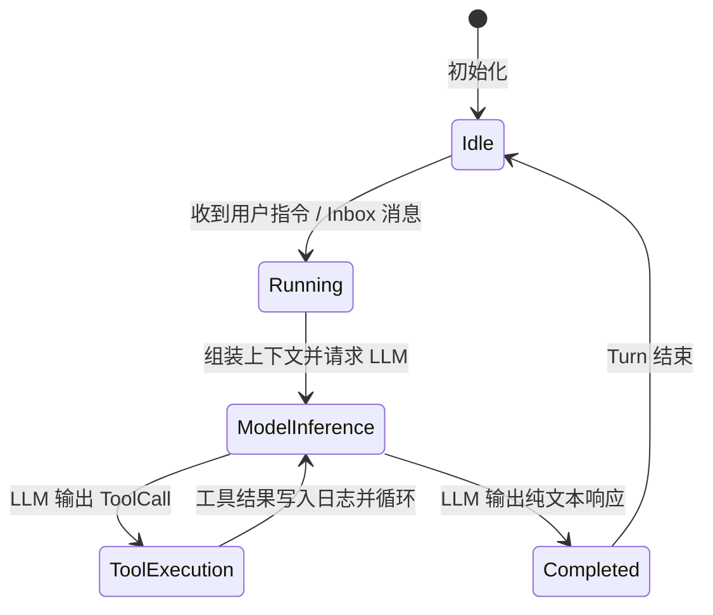
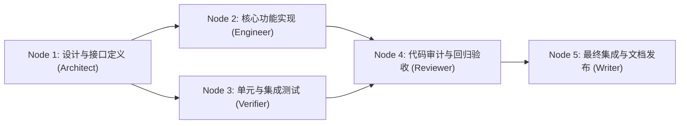

# 第 20 章：术语速查 (Terminology Reference)

[English](20-terminology-reference.md) | 中文

对于具备传统编程背景（C/C++、Java、Go、Rust、Python、TypeScript）的工程师而言，初涉 AI 与 Agent 领域时最大的认知障碍并非缺乏算法理解，而是被大量空洞的流行词（Buzzwords）和概念套娃所迷惑。本章旨在打破这种信息迷雾，为全书核心概念提供一份极度严密、直击底层系统本质的术语速查手册。

每个术语均按照统一的工业级工程标准拆解为四个维度：
1. **【标准定义】**：严格的数学定义、算法原理或状态机形式化描述。
2. **【传统软件工程 / 分布式架构类比】**：映射为操作系统、编译原理、分布式系统、网络协议或设计模式中已有的确定性概念。
3. **【在 DeepSeek Harness 中的具体源码位置】**：指出该机制在 `deepseek-harness` 仓库中的模块路径、核心类型定义与核心处理函数。
4. **【常见错误理解与避坑指南】**：剖析生产环境中最高频的误区、并发竞态、显存泄漏、逻辑死锁等经典事故及根因防御策略。

---

## 术语全景架构关系图

```mermaid
graph TD
  subgraph LLM_Foundations ["第一层：大模型与底层计算 (Foundations)"]
    LLM["LLM (概率型纯函数)"]
    Token["Token (int32 词元)"]
    Embedding["Embedding (稠密向量)"]
    ContextWin["Context Window (Token 环形缓冲区)"]
    KVCache["KV Cache (注意力矩阵记忆化缓存)"]
    MLA["MLA (低秩压缩注意力)"]
    FlashAttn["FlashAttention (SRAM 分块计算)"]
    SwiGLU["SwiGLU (门控非线性单元)"]
    RoPE["RoPE (复数旋转位置编码)"]
    DPO["DPO (偏好损失对齐)"]
  end

  subgraph Runtime_Core ["第二层：Agent 运行时与控制循环 (Runtime Core)"]
    Agent["Agent (状态机循环)"]
    Harness["Harness (IoC 宿主容器)"]
    ReAct["ReAct (思考-行动循环)"]
    FuncCall["Function Calling (AST/RPC 调度)"]
    Turn["Turn (业务交互事务)"]
    Step["Step (单步推理迭代)"]
    Inbox["Inbox (线程安全待办队列)"]
    ConsumedWork["Consumed Work (因果屏障工作集)"]
    SessionEvent["Session Event (追加式事实账本)"]
    Projection["Projection (Fold/Reduce 状态投影)"]
  end

  subgraph DI_Boundaries ["第三层：Cordis 依赖注入与包边界 (Cordis DI)"]
    Plugin["Plugin (功能扩展单元)"]
    Service["Service (IoC 契约接口)"]
    Provider["Provider (服务生产者)"]
    Consumer["Consumer (服务消费者)"]
    Scope["Scope (生命周期隔离域)"]
    Waterfall["Waterfall (瀑布流事件钩子)"]
  end

  subgraph Graph_Orchestration ["第四层：Graph Mode 拓扑编排 (Graph Mode)"]
    GraphMode["Graph Mode (声明式 DAG 引擎)"]
    Campaign["Campaign (长周期战略目标)"]
    Batch["Batch (局部有界 DAG)"]
    Revision["Revision (不可变图版本)"]
    Lineage["Lineage (因果演化血统)"]
    Run["Run (图执行实例)"]
    Generation["Generation (调度代际)"]
    Activation["Activation (协调激活周期)"]
    Attempt["Attempt (物理执行尝试)"]
    EnvCheckpoint["Env Checkpoint (宿主变更审批点)"]
  end

  subgraph Distributed_Coordination ["第五层：LoopX 分布式协同 (Distributed Coordination)"]
    LoopX["LoopX (分布式外部协作总线)"]
    Claim["Claim (任务互斥声明)"]
    Lease["Lease (心跳租约)"]
    FencingToken["Fencing Token (单调递增屏障)"]
    Settlement["Settlement (终态证据结算)"]
  end

  subgraph Facilities ["第六层：安全与基础设施 (Facilities)"]
    Spill["Spill (超长输出分页转储)"]
    Sandbox["Sandbox (Landlock/Seatbelt 隔离)"]
    RAG["RAG (外部索引两阶段检索)"]
    Subagent["Subagent (权限递减子代理)"]
  end

  LLM --> Agent
  KVCache --> ContextWin
  MLA --> KVCache
  Agent --> Turn
  Turn --> Step
  Step --> FuncCall
  SessionEvent --> Projection
  Harness --> Plugin
  Service --> Provider
  Provider --> Consumer
  GraphMode --> Campaign
  Campaign --> Batch
  Batch --> Revision
  Run --> Generation
  Generation --> Activation
  Activation --> Attempt
  LoopX --> Claim
  Claim --> Lease
  Lease --> FencingToken
  FencingToken --> Settlement
```



---

## 第一部分：AI 与大模型底层机理术语 (LLM Core & Foundations)

### 1.1 LLM (Large Language Model，大语言模型)

#### 【标准定义】
大语言模型是参数化条件概率分布生成器。数学上，设词表为 $\mathcal{V}$，给定输入 Token 序列 $X = (x_1, x_2, \dots, x_n)$，LLM 的输出为下一个 Token $y_t \in \mathcal{V}$ 的概率分布 $P(y_t \mid X, y_1, \dots, y_{t-1})$。自回归文本生成即通过逐步采样累乘联合概率：

$$P(Y \mid X) = \prod_{t=1}^{T} P(y_t \mid X, y_{<t})$$

#### 【传统软件工程 / 分布式架构类比】
**无状态的只读概率型纯函数（Stateless Probabilistic Pure Function）**。
- 输入为字节序列（Token ID 数组），输出为词表大小的高维浮点数组（Logits）。
- 本身不具备任何可变状态、外部 I/O 或长期记忆。所谓的“交互记忆”完全依赖调用方在每次 HTTP/RPC 请求时将历史完整日志作为输入重新传入。

#### 【在 DeepSeek Harness 中的具体源码位置】
- 接口契约：[`packages/llm/llm/src/types.ts`](file:///d:/git/deepseek-harness/packages/llm/llm/src/types.ts) 中的 `LlmProvider` 与 `LlmCallConfig`。
- 调度驱动：[`packages/core/agent-loop/src/agent.ts`](file:///d:/git/deepseek-harness/packages/core/agent-loop/src/agent.ts) 的 `ReactLoopAgent.prepareStep()`。

#### 【常见错误理解与避坑指南】
- **误区**：认为大模型具有类似进程的内部常驻状态，每次发消息只需发增量内容。
- **正解**：LLM 服务端对每个 API 请求完全无状态。如果不显式拼接历史 Context 并计算 Token 边界，模型将彻底丢失前文信息。必须通过 Harness 层的 Event Sourcing 机制实时重构完整的提示词数组。

---

### 1.2 Token (词元 / 词法单元)

#### 【标准定义】
Token 是大模型处理文本的离散基本单位（通常为 `int32` 整数）。通过 BPE（Byte-Pair Encoding）或 SentencePiece 等无损分词算法，将自然语言字符串或二进制 UTF-8 字节流双向映射为离散词表索引 $i \in [0, |\mathcal{V}| - 1]$。

#### 【传统软件工程 / 分布式架构类比】
**编译器词法分析阶段（Lexer）输出的 Token ID**。
- 自然语言的 Token 类似于编程语言中的关键字、操作符或标识符枚举值。
- 在 DeepSeek-V3 词表中，$|\mathcal{V}| = 129,280$。一个中文字符通常对应 1~2 个 Token，英文单词对应 1 个 Token。

#### 【在 DeepSeek Harness 中的具体源码位置】
- 词元预算与计算：[`packages/llm/llm/src/types.ts`](file:///d:/git/deepseek-harness/packages/llm/llm/src/types.ts) 中的 `LlmUsage`（`promptTokens`, `completionTokens`, `totalTokens`）。
- 压缩截断：[`packages/compaction/compaction/src/index.ts`](file:///d:/git/deepseek-harness/packages/compaction/compaction/src/index.ts)。

#### 【常见错误理解与避坑指南】
- **误区**：以字符串长度 `str.length` 来等价估算 Token 数量。
- **正解**：字符数与 Token 数在多语言、特殊符号、代码缩进及 Markdown 表格场景下存在巨大差异（1 个特殊 Unicode 字符可能被拆解为 3~4 个 Byte Token）。严禁用字符数做硬截断，必须依赖准确的 Tokenizer 或 Provider 报告的 Usage 进行预算控制。

---

### 1.3 Embedding (向量嵌入)

#### 【标准定义】
Embedding 是将离散的符号（如词元、语句、文档）映射到连续紧致高维流形空间 $\mathbb{R}^d$ 的确定性可微投影函数 $f: \mathcal{X} \to \mathbb{R}^d$。该映射使得语义相似度等价于高维空间中的几何距离或夹角余弦值：

$$\text{CosineSimilarity}(\mathbf{u}, \mathbf{v}) = \frac{\mathbf{u} \cdot \mathbf{v}}{\|\mathbf{u}\|_2 \|\mathbf{v}\|_2}$$

#### 【传统软件工程 / 分布式架构类比】
**高维保距哈希函数（Locality-Sensitive Hashing on Steroids）**。
- 传统哈希（如 MD5/SHA256）追求雪崩效应（输入改变 1 bit 输出彻底不同）；Embedding 追求保距性（语义接近的文本哈希值在高维空间欧氏距离极小）。

#### 【在 DeepSeek Harness 中的具体源码位置】
- 向量检索契约：[`packages/workflow/rag/src/index.ts`](file:///d:/git/deepseek-harness/packages/workflow/rag/src/index.ts)。
- 会话引用查找：[`packages/context/session-reference/src/index.ts`](file:///d:/git/deepseek-harness/packages/context/session-reference/src/index.ts)。

#### 【常见错误理解与避坑指南】
- **误区**：认为只要余弦相似度 $> 0.8$ 就必定是强相关的正确代码段。
- **正解**：稠密向量在精准代码关键字（如函数签名、变量名、错误码）匹配上存在语义平滑缺陷。生产级系统必须采用 BM25（稀疏检索）与 Dense Embedding（稠密检索）的 Reciprocal Rank Fusion (RRF) 混合架构，并经过 Cross-Encoder 重排（Rerank）。

---

### 1.4 Context Window (上下文窗口)

#### 【标准定义】
Transformer 模型单次自注意力（Self-Attention）所能容纳的最大 Token 序列长度限制 $S_{\max}$（如 64K、128K）。注意力计算在位置维度上的时间与空间复杂度在理论上为 $\mathcal{O}(S^2)$。超出此窗口的 Token 无法被注意力机制捕获。

#### 【传统软件工程 / 分布式架构类比】
**定长循环缓冲区（Ring Buffer）或硬件寄存器窗口**。
- 当写入总量超过窗口上限时，必须实施淘汰策略（FIFO、有损摘要压缩或 Sliding Window），否则将直接触发 API 边界溢出异常（HTTP 400 Bad Request）。

#### 【在 DeepSeek Harness 中的具体源码位置】
- 预算校验与溢出防御：[`packages/core/agent-loop/src/agent.ts`](file:///d:/git/deepseek-harness/packages/core/agent-loop/src/agent.ts) 中的 `requestProposal()`。
- 上下文裁剪：[`packages/compaction/compaction-basic/src/index.ts`](file:///d:/git/deepseek-harness/packages/compaction/compaction-basic/src/index.ts)。

#### 【常见错误理解与避坑指南】
- **误区**：盲目依赖 128K 超长上下文，将数百个文件的完整内容一次性塞入。
- **正解**：
  1. **大海捞针（Needle-in-a-Haystack）效应**：上下文越长，模型注意力在中间区域衰减越严重（Lost in the Middle）。
  2. **TTFT（首字延迟）急剧劣化**：超长 Prefill 会阻塞推理服务器计算单元。必须通过分层索引和按需加载降低单次 Prompt 大小。

---

### 1.5 KV Cache (键值缓存)

#### 【标准定义】
在 Transformer 自回归解码阶段（Generation Phase），由于先前已生成的 Token 对应的 Key 和 Value 矩阵保持不变，将这些历史 $\mathbf{K}_{\le t}, \mathbf{V}_{\le t}$ 缓存在显存中，避免每生成一个 Token 都要对历史前文重复进行 $\mathcal{O}(S^2)$ 的 QKV 投影计算。

$$M_{\text{KV}} = 2 \times 2 \times L \times n_{\text{heads}} \times d_{\text{head}} \times S \times B \quad (\text{Bytes})$$

其中 $L$ 为层数，$n_{\text{heads}}$ 为注意力头数，$d_{\text{head}}$ 为头维度，$S$ 为序列长度，$B$ 为 Batch Size，乘数 2 分别代表 K 与 V，以及 FP16/BF16 占用的 2 字节。

#### 【传统软件工程 / 分布式架构类比】
**动态规划中的记忆化搜索缓存（Memoization Table）**。
- 将空间换时间策略发挥到极致，把时间复杂度由 $\mathcal{O}(S^2)$ 降低至 $\mathcal{O}(S)$。

#### 【在 DeepSeek Harness 中的具体源码位置】
- 缓存命中测试与优化策略：[`packages/core/agent-loop/tests/request-cache.e2e.ts`](file:///d:/git/deepseek-harness/packages/core/agent-loop/tests/request-cache.e2e.ts)。
- 系统提示词前缀稳定性规范：[`packages/context/agent-instructions/src/index.ts`](file:///d:/git/deepseek-harness/packages/context/agent-instructions/src/index.ts)。

#### 【常见错误理解与避坑指南】
- **误区**：在 System Prompt 开头注入高频变化的动态时间戳（如 `Current Time: 2026-08-25 16:30:00`）。
- **正解**：现代推理引擎（如 vLLM、SGLang、DeepSeek 官方 API）依赖**最长公共前缀匹配（Prefix Caching）**复用服务端 KV Cache。动态时间戳注入会导致每次请求的前缀哈希彻底失效，KV Cache 命中率跌至 0%，导致推理延迟暴增 5~10 倍且服务端成本翻倍。动态数据必须放置在 Message 尾部或通过专用工具按需拉取。

---

### 1.6 MLA (Multi-Head Latent Attention，多头潜在注意力)

#### 【标准定义】
DeepSeek 独创的高性能注意力架构。通过低秩张量分解（Low-Rank Compression），将传统的 Key-Value 投影压缩为一个极小的潜变量向量（Latent Vector $c_t^{KV}$），在生成解码期大幅削减 KV Cache 显存占用，同时配合解耦的 RoPE 编码向量保持精确的位置建模。

$$\mathbf{c}_t^{KV} = W^{DKV} \mathbf{h}_t \quad (\text{低秩下投影}), \quad \mathbf{K}_t^C = \mathbf{c}_t^{KV} W^{UK}, \quad \mathbf{V}_t^C = \mathbf{c}_t^{KV} W^{UV}, \quad \mathbf{K}_t^R = \text{RoPE}(\mathbf{h}_t W^{KR})$$

#### 【传统软件工程 / 分布式架构类比】
**数据库列存的字典编码与零拷贝解压（Zero-Copy Decompression on Compute）**。
- 在显存（RAM）中仅存放高压缩比的潜变量；在 GPU Tensor Core 计算点积前夕，利用算子融合（Kernel Fusion）实时乘以投影矩阵恢复完整头维度。

```
传统 MHA 显存布局 (膨胀):
[Layer 0] -> K: [Head 0 ... Head 127] (128*128 float16) | V: [Head 0 ... Head 127] (128*128 float16) -> 64 KB / token
[Layer 1] -> ...

DeepSeek MLA 显存布局 (极致紧凑):
[Layer 0] -> Compressed Latent c_t: (512 float16) | RoPE Key K_t^R: (64 float16) -> 1.15 KB / token (压缩 93%!)
[Layer 1] -> ...
```

#### 【在 DeepSeek Harness 中的具体源码位置】
- 模型适配层：[`packages/llm/llm/src/index.ts`](file:///d:/git/deepseek-harness/packages/llm/llm/src/index.ts)。

#### 【常见错误理解与避坑指南】
- **误区**：认为 MLA 是一种有损量化（如 INT4/INT8），会严重损害逻辑推理能力。
- **正解**：MLA 是在模型预训练阶段直接进行矩阵低秩因式分解训练的结构创新，在数学上保持了与标准 MHA 相同的表达容量，但将推理阶段的 KV Cache 显存占用降低至原先的 $1/7 \sim 1/8$。

---

### 1.7 FlashAttention

#### 【标准定义】
一种对标准 Exact Attention 进行 IO 感知（IO-Aware）的底层 GPU 算子优化技术。利用 GPU 高速片上 SRAM（静态随机存取内存）进行分块（Tiling），在保持数学上无损失精度计算的前提下，避免将中间注意力矩阵 $S \times S$ 频繁读写慢速 High Bandwidth Memory (HBM)，将 HBM 读写复杂度从 $\mathcal{O}(S^2)$ 降低至 $\mathcal{O}(S)$。

#### 【传统软件工程 / 分布式架构类比】
**CPU Cache Line 对齐与分块矩阵乘法优化（Loop Tiling / Cache Blocking）**。
- 将热点计算锁在 L1/L2 Cache（SRAM），避免击穿到主存（HBM/DRAM）。

#### 【在 DeepSeek Harness 中的具体源码位置】
- 推理后端抽象：[`packages/llm/llm-provider/src/index.ts`](file:///d:/git/deepseek-harness/packages/llm/llm-provider/src/index.ts)。

#### 【常见错误理解与避坑指南】
- **误区**：FlashAttention 是近似算法，会产生类似有损压缩的精度漂移。
- **正解**：FlashAttention 在数学等价性上完全等于标准 Attention，不存在任何截断或采样近似。其通过 Softmax 局部缩放常数的在线累加更新（Online Softmax），消除了对显存中完整 Softmax 矩阵的持久化依赖。

---

### 1.8 SwiGLU

#### 【标准定义】
门控前馈神经网络（Gated Feed-Forward Network）的一种变体。结合了 Swish 激活函数与 GLU（Gated Linear Unit）门控机制：

$$\text{SwiGLU}(x, W, V, W_2) = \left( \text{Swish}(xW) \otimes xV \right) W_2$$

其中 $\text{Swish}(z) = z \cdot \sigma(\beta z)$，$\otimes$ 为逐元素乘积（Hadamard Product）。

#### 【传统软件工程 / 分布式架构类比】
**硬件晶体管的门控电路（Gating Logic）或双重校验拦截器**。
- $xW$ 决定特征计算流，$xV$ 充当平滑开关，动态决定多少特征量允许通过。

#### 【在 DeepSeek Harness 中的具体源码位置】
- 模型特征定义：[`packages/llm/llm/src/index.ts`](file:///d:/git/deepseek-harness/packages/llm/llm/src/index.ts)。

---

### 1.9 RoPE (Rotary Position Embedding，旋转位置编码)

#### 【标准定义】
通过绝对位置的复数平面二维旋转矩阵乘法，实现相对位置注意力的编码方式。对于处于位置 $m$ 的二维向量 $\mathbf{x} = (x_1, x_2)^T \in \mathbb{R}^2$，RoPE 变换定义为正交旋转矩阵：

$$\mathbf{R}_{\Theta, m} \mathbf{x} = \begin{pmatrix} \cos m\theta & -\sin m\theta \\ \sin m\theta & \cos m\theta \end{pmatrix} \begin{pmatrix} x_1 \\ x_2 \end{pmatrix}$$

对于任意内积 $\langle \mathbf{R}_m \mathbf{q}, \mathbf{R}_n \mathbf{k} \rangle$，其值仅取决于相对位移 $m - n$。

#### 【传统软件工程 / 分布式架构类比】
**复数相量旋转（Phasor Rotation）或相对时间戳偏移量编码**。
- 将序列位置的绝对标量转换为高维向量空间中的旋转角度。

---

### 1.10 DPO (Direct Preference Optimization，直接偏好优化)

#### 【标准定义】
一种跳过奖励模型（Reward Model）训练与 PPO 强化学习采样，直接利用偏好数据对 $(y_w \succ y_l \mid x)$ 闭式优化 LLM 策略参数 $\pi_\theta$ 的对齐算法。其损失函数为：

$$\mathcal{L}_{\text{DPO}}(\pi_\theta; \pi_{\text{ref}}) = -\mathbb{E}_{(x, y_w, y_l) \sim \mathcal{D}} \left[ \log \sigma \left( \beta \log \frac{\pi_\theta(y_w \mid x)}{\pi_{\text{ref}}(y_w \mid x)} - \beta \log \frac{\pi_\theta(y_l \mid x)}{\pi_{\text{ref}}(y_l \mid x)} \right) \right]$$

#### 【传统软件工程 / 分布式架构类比】
**带有基准惩罚项的二分类对数损失（Contrastive Cross-Entropy Loss with Reference Regularization）**。
- 类似于 A/B 测试的对比权重更新，强制模型对人类偏好的输出 $y_w$ 的相对似然度单调递增，对不合规输出 $y_l$ 的相对似然度单调递减。

---

## 第二部分：Agent 状态机与核心运行时 (Agent Runtime & Harness Engine)

### 2.1 Agent (智能体)

#### 【标准定义】
一个以 LLM 为决策内核、拥有长期/短期状态机、工具执行环境（Tool Environment）以及自我反思闭环控制流的主动计算实体。其核心为一个确定性的因果驱动死循环：

$$\text{State}_{t+1} = \text{Execute}\left(\text{State}_t, \text{LLM}(\text{State}_t)\right)$$



#### 【传统软件工程 / 分布式架构类比】
**操作系统事件循环（Event Loop）或嵌入式有限状态机（FSM）**。
- LLM 是状态转移条件计算器；
- Tool 是系统调用（Syscall）；
- Harness 运行时则是内核管理程序，负责调度、分配资源与强制安全沙箱。

#### 【在 DeepSeek Harness 中的具体源码位置】
- 核心状态机接口：[`packages/core/agent/src/types.ts`](file:///d:/git/deepseek-harness/packages/core/agent/src/types.ts) 中的 `Agent` 接口。
- 生产级循环驱动：[`packages/core/agent-loop/src/agent.ts`](file:///d:/git/deepseek-harness/packages/core/agent-loop/src/agent.ts) 的 `ReactLoopAgent` 类。

#### 【常见错误理解与避坑指南】
- **误区**：认为 Agent 具有主动的“自我意识”，会在没有任何外部触发的情况下自动思考。
- **正解**：Agent 本质上是**事件驱动（Event-Driven）的被动状态机**。如果没有 Inbox 队列中的用户输入、Cron 定时任务或 Subagent 回调事件，Agent 将保持绝对静止（`idle` 挂起状态），不会消耗任何计算资源。

---

### 2.2 Harness (测试治具 / 宿主容器)

#### 【标准定义】
源自航空航天与电子工程的线束/治具概念。在软件架构中，Harness 是包裹在非确定性 LLM 外侧的**确定性宿主容器（Deterministic Host Container）**。它负责处理生命周期管理、依赖注入、事件溯源持久化、工具沙箱隔离、并发控制、取消信号传播以及分布式终态结算。

#### 【传统软件工程 / 分布式架构类比】
**Spring Framework / Kubernetes Pod 运行时 / Java EE 应用服务器**。
- 业务代码（Prompt/Tool）运行在 Harness 提供的受控沙箱容器内部，所有的 I/O、网络请求和生命周期钩子均由 Harness 集中托管与拦截。

#### 【在 DeepSeek Harness 中的具体源码位置】
- 引导入口：[`packages/boot/boot/src/index.ts`](file:///d:/git/deepseek-harness/packages/boot/boot/src/index.ts)。
- 宿主核心：[`packages/host/src/index.ts`](file:///d:/git/deepseek-harness/packages/host/src/index.ts)。

---

### 2.3 ReAct (Reasoning + Acting 决策循环)

#### 【标准定义】
由 Yao et al. 提出的协同推理与行动范式。模型在单个认知步骤中交替生成**显式推理轨迹（Thought / Reasoning Content）**与**特定环境动作（Action / Tool Call）**，并在观察到环境反馈（Observation）后进行下一步推理。

#### 【传统软件工程 / 分布式架构类比】
**工业控制系统中的闭环 PID 控制器（Observe-Orient-Decide-Act / OODA 循环）**。

#### 【在 DeepSeek Harness 中的具体源码位置】
- 循环实现：[`packages/core/agent-loop/src/agent.ts`](file:///d:/git/deepseek-harness/packages/core/agent-loop/src/agent.ts) 中的 `ReactLoopAgent.runStep()`。

---

### 2.4 Function Calling / Tool Call (函数调用 / 工具调用)

#### 【标准定义】
LLM 在解码过程中根据提供的 JSON Schema 规范，停止生成普通自然语言，转而生成结构化的 JSON 抽象语法树（AST）片段（包含函数名 `name` 和序列化参数 `arguments`），由宿主运行时解析并安全分发执行。

#### 【传统软件工程 / 分布式架构类比】
**远程过程调用（RPC）序列化与反序列化协议，或操作系统的系统调用中断（Syscall Trap）**。

#### 【在 DeepSeek Harness 中的具体源码位置】
- 工具注册与执行：[`packages/core/agent-loop/src/tool-calls.ts`](file:///d:/git/deepseek-harness/packages/core/agent-loop/src/tool-calls.ts) 的 `executeToolCalls()`。
- Schema 强校验：[`packages/core/tools/src/index.ts`](file:///d:/git/deepseek-harness/packages/core/tools/src/index.ts) 中的 `assertObjectJsonSchema`。

#### 【常见错误理解与避坑指南】
- **误区**：以为大模型本身具有连接操作系统、直接执行 Bash 命令或写文件的能力。
- **正解**：大模型仅仅生成了一串符合 JSON 语法的字符串文本。实际执行文件写入、网络请求等副作用操作的是 Harness 容器。若 Harness 缺乏输入校验，将直接面临**任意命令注入（RCE）**与路径穿越漏洞。

---

### 2.5 Turn (对话轮次)

#### 【标准定义】
用户发起一次明确的任务输入，直到 Agent 完全达成目标或主动移交控制权所经历的**完整业务事务边界（Business Transaction）**。一个 Turn 在时间线上包含多个推理与工具调用的 Step 迭代。

```
+-------------------------------------------------------------+
| Turn N (业务事务边界: turn/start -> turn/end)                 |
|  +----------------+  +----------------+  +----------------+ |
|  | Step 1 (Tool)  |  | Step 2 (Tool)  |  | Step 3 (Final) | |
|  +----------------+  +----------------+  +----------------+ |
+-------------------------------------------------------------+
```

#### 【传统软件工程 / 分布式架构类比】
**数据库事务（Database Transaction）或 HTTP 请求-响应生命周期**。
- `turn/start` 相当于 `BEGIN TRANSACTION`；
- `turn/end` 相当于 `COMMIT` / `ROLLBACK`。

#### 【在 DeepSeek Harness 中的具体源码位置】
- 事务事件：[`packages/core/session/src/index.ts`](file:///d:/git/deepseek-harness/packages/core/session/src/index.ts) 中的 `'turn/start'` 与 `'turn/end'` 事件定义。
- 状态机控制：[`packages/core/agent-loop/src/agent.ts`](file:///d:/git/deepseek-harness/packages/core/agent-loop/src/agent.ts)。

---

### 2.6 Step (推理步骤)

#### 【标准定义】
Agent 状态机内部的**单次物理原子迭代（Single Atomic Iteration）**。包含且仅包含：
1. 组装当前会话上下文；
2. 发起一次单阶段 LLM 流式推理；
3. 解析响应内容并调度执行对应的 Tool Calls（若存在）；
4. 将产生的事件原子追加至会话日志。

#### 【传统软件工程 / 分布式架构类比】
**CPU 的单条指令执行周期（Fetch-Decode-Execute Cycle）**。

#### 【在 DeepSeek Harness 中的具体源码位置】
- 单步执行器：[`packages/core/agent-loop/src/agent.ts`](file:///d:/git/deepseek-harness/packages/core/agent-loop/src/agent.ts) 的 `ReactLoopAgent.runStep()`。

---

### 2.7 Inbox (待办输入队列)

#### 【标准定义】
挂载在 Agent 实例上的**并发安全入队邮箱（Mailbox）**。外部系统（用户 UI 输入、定时任务、子代理完成通知等）投递的所有消息必须先进入 Inbox 缓冲，并在当前 Step 边界以严格的因果一致性被主动消费（Claim）。

#### 【传统软件工程 / 分布式架构类比】
**Erlang / Akka Actor 模型的 Mailbox 消息信箱**。

#### 【在 DeepSeek Harness 中的具体源码位置】
- 实现：[`packages/core/agent/src/inbox.ts`](file:///d:/git/deepseek-harness/packages/core/agent/src/inbox.ts) 的 `Inbox` 类。
- 事件：`'agent/inbox/inserted'`, `'agent/inbox/claimed'`, `'agent/inbox/discarded'`。

---

### 2.8 Consumed Work (已消费工作集)

#### 【标准定义】
在多源并发消息到达的环境下，当前 Turn 确定性锁定并承诺处理的一组不可变消息快照集合。用于建立状态机前进的因果屏障（Causal Barrier）。

#### 【传统软件工程 / 分布式架构类比】
**消息队列消费位点提交（Kafka Consumer Offset Commit Snapshot）**。

#### 【在 DeepSeek Harness 中的具体源码位置】
- 结构定义：[`packages/core/agent/src/consumed-work.ts`](file:///d:/git/deepseek-harness/packages/core/agent/src/consumed-work.ts) 中的 `ConsumedWork`。

---

### 2.9 Session Event & Event Sourcing (会话事件与事件溯源)

#### 【标准定义】
Harness 的核心持久化哲学。系统的唯一事实来源（Single Source of Truth）不是某个可变的“当前状态对象”，而是一个**严格单调递增、仅追加（Append-Only）、不可篡改的类型化事件流（Typed Event Stream）**。任何系统状态均由该事件流从头 Replay 折叠推导而成。

#### 【传统软件工程 / 分布式架构类比】
**数据库的 WAL（Write-Ahead Logging）预写日志或金融交易审计流水账本**。

```
Session Log (Append-Only Event Ledger):
[Event 0: session/created]
    -> [Event 1: turn/start]
        -> [Event 2: message (user)]
            -> [Event 3: step/start]
                -> [Event 4: model/call]
                -> [Event 5: tool/call (bash)]
                -> [Event 6: tool/result (exit 0)]
            -> [Event 7: step/end]
        -> [Event 8: turn/end]
```

#### 【在 DeepSeek Harness 中的具体源码位置】
- 事件契约：[`packages/core/session/src/index.ts`](file:///d:/git/deepseek-harness/packages/core/session/src/index.ts) 中的 `SessionEventMap` 与 `Session` 类。

#### 【常见错误理解与避坑指南】
- **误区**：为了修改某条历史消息的显示内容，直接用 SQL `UPDATE` 或在内存中就地修改历史 Event 对象。
- **正解**：破坏事件日志的不可变性会导致状态投影和缓存一致性彻底崩溃。正确的做法是追加一条类型化的修正事件（如 `compaction/prune` 或 `graph/revision`），在投影期产生新的视图。

---

### 2.10 Projection & `deriveMessages()` (状态投影与消息派生)

#### 【标准定义】
一个确定性的纯函数：

$$\text{Projection}: \text{List}[\text{SessionEvent}] \to \text{StateView}$$

具体在 LLM 交互场景下，`deriveMessages(events)` 将扁平的事件流折叠（Fold / Reduce）为符合 OpenAI/DeepSeek API 格式要求的标准消息数组 `Message[]`。

#### 【传统软件工程 / 分布式架构类比】
**CQRS（命令查询职责分离）架构中的 Read Model 读模型投影，或 Redux 中的 `reducer(state, action)`**。

#### 【在 DeepSeek Harness 中的具体源码位置】
- 派生实现：[`packages/core/session/src/surface.ts`](file:///d:/git/deepseek-harness/packages/core/session/src/surface.ts) 中的 `deriveMessages()`。
- 运行时上下文投影：[`packages/core/agent-loop/src/runtime-context.ts`](file:///d:/git/deepseek-harness/packages/core/agent-loop/src/runtime-context.ts)。

---

## 第三部分：Cordis 插件化与依赖注入架构 (Cordis DI & Monorepo Boundaries)

### 3.1 Plugin (插件)

#### 【标准定义】
具有生命周期自闭包的独立功能扩展单元。一个 Plugin 可以声明自己依赖哪些 Service、对外提供哪些 Service，并在其加载（`apply`）和卸载（`dispose`）时自动完成资源的注册与释放。

#### 【传统软件工程 / 分布式架构类比】
**OSGi Bundle、Eclipse 插件或 VS Code Extension**。

#### 【在 DeepSeek Harness 中的具体源码位置】
- 运行时核心：[`packages/core/cordis/src/index.ts`](file:///d:/git/deepseek-harness/packages/core/cordis/src/index.ts)。

---

### 3.2 Service (服务契约)

#### 【标准定义】
在依赖注入容器中通过全局符号或唯一字符串标识声明的**抽象接口契约（Abstract Service Contract）**。定义了系统能力的公共 API，解耦具体实现。

#### 【传统软件工程 / 分布式架构类比】
**Java 中的 Interface 定义（如 `public interface StorageService`）或 TypeScript 中的抽象类**。

---

### 3.3 Provider (服务提供者)

#### 【标准定义】
实现了特定 Service 契约的具象插件（Concrete Implementation）。在容器启动时将自身实例绑定到 Context 属性上，供全局或局部消费。

#### 【传统软件工程 / 分布式架构类比】
**Spring Framework 中带有 `@Service` 注解的具体实现 Bean**。

#### 【在 DeepSeek Harness 中的具体源码位置】
- 调度器提供者示例：[`packages/graph/graph-scheduler/src/index.ts`](file:///d:/git/deepseek-harness/packages/graph/graph-scheduler/src/index.ts) 中的 `MemoryGraphSchedulerProvider`。

---

### 3.4 Consumer (服务消费者)

#### 【标准定义】
依赖特定 Service 提供的能力，但自身不关心具体由哪个 Provider 实例化的插件或业务模块。通过 `ctx[serviceName]` 声明式访问。

#### 【传统软件工程 / 分布式架构类比】
**Spring 中带有 `@Autowired` 依赖注入的消费类**。

---

### 3.5 Scope & Context (生命周期作用域与依赖注入上下文)

#### 【标准定义】
管理插件可见性、资源销毁边界和层级继承关系的树状依赖注入容器。当父 Scope 销毁时，所有挂载在子 Scope 上的事件监听器、定时器与网络句柄必须被严格递归析构。

#### 【传统软件工程 / 分布式架构类比】
**结构化并发（Structured Concurrency）的上下文树，或 NestJS / Spring 的 Request/Session Scope**。

#### 【在 DeepSeek Harness 中的具体源码位置】
- 核心实现：[`packages/core/scope/src/index.ts`](file:///d:/git/deepseek-harness/packages/core/scope/src/index.ts) 中的 `createScope`。

---

### 3.6 Waterfall Event (瀑布流事件钩子)

#### 【标准定义】
一种链式传递并允许就地修改载荷的同步/异步事件分发机制。多个拦截器按优先级顺序执行，前一个插件修改后的数据作为下一个插件的输入传入。

#### 【传统软件工程 / 分布式架构类比】
**Koa / Express 的洋葱模型中间件（Middleware Pipeline）或 Java Servlet Filter 链**。

#### 【在 DeepSeek Harness 中的具体源码位置】
- 提示词与上下文瀑布流装配：[`packages/core/agent/src/dispatch.ts`](file:///d:/git/deepseek-harness/packages/core/agent/src/dispatch.ts)。

---

## 第四部分：Graph Mode 与任务编排拓扑 (Graph Mode & Orchestration)

### 4.1 Graph Mode (任务图编排模式)

#### 【标准定义】
将复杂的大型软件工程目标解耦为**有向无环图（Directed Acyclic Graph, DAG）**，由专职 Controller Agent 进行语义分解，并将不同拓扑节点分派给异构专业角色（Architect, Engineer, Reviewer, Verifier 等）并行或拓扑序执行的高阶编排模式。



#### 【传统软件工程 / 分布式架构类比】
**Apache Airflow / Kubernetes Argo Workflows / Bazel 构建依赖图**。

#### 【在 DeepSeek Harness 中的具体源码位置】
- 编排引擎：[`packages/graph/graph-mode/src/index.ts`](file:///d:/git/deepseek-harness/packages/graph/graph-mode/src/index.ts)。
- 领域模型与校验：[`packages/graph/graph/src/index.ts`](file:///d:/git/deepseek-harness/packages/graph/graph/src/index.ts)。

---

### 4.2 Campaign (战役 / 跨批次长期演进目标)

#### 【标准定义】
超越单个有限 DAG 边界的**跨批次长期演进目标容器**。一个 Campaign 统筹管理多个有序的 Batch，保证整个长周期工作的前缀不可篡改与已验收证据的持久沉淀。

#### 【传统软件工程 / 分布式架构类比】
**敏捷开发中的 Epic / 里程碑版本（Milestone），或分布式长事务 Saga 协调器**。

#### 【在 DeepSeek Harness 中的具体源码位置】
- 类型契约：[`packages/graph/graph/src/types.ts`](file:///d:/git/deepseek-harness/packages/graph/graph/src/types.ts) 中的 `GraphCampaign`。
- 批次流转：[`packages/graph/graph-mode/src/index.ts`](file:///d:/git/deepseek-harness/packages/graph/graph-mode/src/index.ts) 中的 `settleCampaignRun()`。

---

### 4.3 Batch (批次 / 局部有界 DAG)

#### 【标准定义】
Campaign 内部的一个**独立执行单元与局部有界 DAG**。每个 Batch 拥有独立的 Graph 身份标识，仅包含当前批次内的任务节点。前一个 Batch 终态验收通过后，后继 Batch 仅继承前序的紧凑摘要证据，而非全量历史节点。

#### 【传统软件工程 / 分布式架构类比】
**敏捷迭代 Sprint，或批处理系统中的分段作业（Chunk / Partition Job）**。

#### 【在 DeepSeek Harness 中的具体源码位置】
- 类型定义：[`packages/graph/graph/src/types.ts`](file:///d:/git/deepseek-harness/packages/graph/graph/src/types.ts) 中的 `GraphCampaignBatchDraft`。

---

### 4.4 Revision (图修订版本)

#### 【标准定义】
Graph 拓扑结构的**不可变版本快照（Immutable Version Snapshot）**。每次对任务图节点的增删改或因失败触发重构时，系统均生成一个单调递增的全新 Revision 对象（`GraphRevision`），旧 Revision 保持只读以供审计与回放。

#### 【传统软件工程 / 分布式架构类比】
**Git 中的 Commit 对象，或 Linux 内核中的 RCU（Read-Copy-Update）写时复制快照**。

#### 【在 DeepSeek Harness 中的具体源码位置】
- 契约：[`packages/graph/graph/src/types.ts`](file:///d:/git/deepseek-harness/packages/graph/graph/src/types.ts) 中的 `GraphRevision`。

---

### 4.5 Lineage (修订血统与演化溯源)

#### 【标准定义】
记录 Revision 为何产生及其演化关系的元数据血统。精确标记本次修订属于新任务初始化（`new_task`）、架构重构（`analysis_refactor`）还是执行失败纠偏（`execution_correction`），并记录结构化差异（`structuralDeltas`）。

#### 【传统软件工程 / 分布式架构类比】
**数据库数据血统（Data Lineage）追踪，或 Git Commit Graph 中的 Parent Hash 与 Commit Message 元数据**。

#### 【在 DeepSeek Harness 中的具体源码位置】
- 契约定义：[`packages/graph/graph/src/types.ts`](file:///d:/git/deepseek-harness/packages/graph/graph/src/types.ts) 中的 `GraphRevisionLineage`。

---

### 4.6 Run (执行实例)

#### 【标准定义】
某个特定 Graph Revision 的**单次具象执行会话实例**。记录了当前图的整体调度生命周期状态（`pending` $\to$ `running` $\to$ `succeeded` / `failed` / `paused`）。

#### 【传统软件工程 / 分布式架构类比】
**CI/CD Pipeline 的单次 Trigger 运行实例（如 GitHub Actions Workflow Run）**。

#### 【在 DeepSeek Harness 中的具体源码位置】
- 类型契约：[`packages/graph/graph/src/types.ts`](file:///d:/git/deepseek-harness/packages/graph/graph/src/types.ts) 中的 `GraphRun`。

---

### 4.7 Generation (执行代际)

#### 【标准定义】
在单次 Run 的生命周期内，因暂停恢复（Resume）、宿主进程重启或故障漂移而触发的**调度代际标识（`GraphRunGenerationId`）**。每次重新拉起调度器时代际号单调自增，用于淘汰上一代际残留的失效异步操作。

#### 【传统软件工程 / 分布式架构类比】
**Raft / Paxos 共识协议中的 Term / Epoch 任期编号**。

#### 【在 DeepSeek Harness 中的具体源码位置】
- 品牌化类型：[`packages/graph/graph/src/types.ts`](file:///d:/git/deepseek-harness/packages/graph/graph/src/types.ts) 中的 `GraphRunGenerationId`。

---

### 4.8 Activation (协调激活周期)

#### 【标准定义】
在特定 Generation 内部，某个任务节点被分配给 Worker 执行的一次**外部协调激活生命周期**。

#### 【传统软件工程 / 分布式架构类比】
**分布式任务调度中的 Task Lease Activation 激活句柄**。

---

### 4.9 Attempt (物理执行尝试)

#### 【标准定义】
单个任务节点（Node）在物理层面上进行的**单次重试尝试（Physical Attempt）**。若某个 Node 配置了 `maxAttempts = 3`，当发生非确定性环境故障时，系统会生成新的 Attempt ID 重新执行。

#### 【传统软件工程 / 分布式架构类比】
**网络请求的重试计数（Retry Count）或 Kubernetes Pod 重建 Attempt**。

#### 【在 DeepSeek Harness 中的具体源码位置】
- 类型：[`packages/graph/graph/src/types.ts`](file:///d:/git/deepseek-harness/packages/graph/graph/src/types.ts) 中的 `GraphAttemptId`。

---

### 4.10 Environment Checkpoint (环境变更审批检查点)

#### 【标准定义】
当 Graph 执行过程中遇到不可逆的宿主环境变更动作（如安装全局 Host 依赖、执行 Docker 容器销毁、修改系统级网络配置）时，调度引擎强制暂停执行、持久化上下文并挂起，等待人类运维工程师确认签署（Human-in-the-Loop Sign-off）的安全屏障。

#### 【传统软件工程 / 分布式架构类比】
**生产环境发布的 Manual Approval Gate（人工审批门禁）**。

#### 【在 DeepSeek Harness 中的具体源码位置】
- 检查点定义：[`packages/graph/graph/src/types.ts`](file:///d:/git/deepseek-harness/packages/graph/graph/src/types.ts) 中的 `GraphCheckpoint` 与 `GraphEnvironmentPlan`。

---

## 第五部分：LoopX 与分布式系统协同协议 (LoopX & Distributed Coordination)

### 5.1 LoopX (外部分布式协同总线)

#### 【标准定义】
DeepSeek Harness 体系中的**外部独立分布式协调服务与事实仲裁网关**。为跨节点、跨机器运行的多个 Agent 实例提供统一的 Goal 跟踪、Todo 对账、租约锁定与分布式终态结算能力。

#### 【传统软件工程 / 分布式架构类比】
**Apache ZooKeeper / HashiCorp Consul / etcd 分布式元数据协调器**。

---

### 5.2 Claim (分布式任务声明 / 抢占)

#### 【标准定义】
Worker 节点向协调中心申请独占处理某个 Goal / Task 的**排他性抢占请求（Task Claim）**。只有 Claim 成功的节点才被授予执行权限。

#### 【传统软件工程 / 分布式架构类比】
**分布式锁争抢（Distributed Lock Acquisition），如 Redis `SET key value NX PX 30000`**。

#### 【在 DeepSeek Harness 中的具体源码位置】
- 调度抢占：[`packages/graph/graph-scheduler/src/index.ts`](file:///d:/git/deepseek-harness/packages/graph/graph-scheduler/src/index.ts) 中的 `acquire()`。

---

### 5.3 Lease (分布式租约机制)

#### 【标准定义】
授予 Worker 节点在有限时间窗口 $[T_{\text{start}}, T_{\text{expires}}]$ 内对任务拥有独占执行权的凭证。Worker 必须在租约到期前通过周期性心跳（Heartbeat）进行续租，否则租约自动失效并被其他 Worker 抢占。

#### 【传统软件工程 / 分布式架构类比】
**DHCP 协议的 IP 租约或 Google Chubby 租约锁机制**。

#### 【在 DeepSeek Harness 中的具体源码位置】
- 租约结构：[`packages/graph/graph-scheduler/src/index.ts`](file:///d:/git/deepseek-harness/packages/graph/graph-scheduler/src/index.ts) 中的 `GraphSchedulerLease`。

---

### 5.4 Fencing Token (单调递增防重入屏障令牌)

#### 【标准定义】
Martin Kleppmann 在分布式锁论战中提出的核心防御机制。一个**全局严格单调递增的整型序号（Monotonically Increasing Integer）**。当客户端获取租约时由服务端颁发；每次写入共享存储时必须携带此令牌，存储端仅接受令牌值严格大于历史最大记录的写操作（CAS 不等式校验）：

$$\text{token}_{\text{incoming}} > \text{token}_{\text{last}}$$

```
[旧 Worker A (因 GC 挂起)] -------- (迟到的写入, Token = 1) -------> [存储层: 当前 Token = 2] -> 拒绝! 409 Conflict
[新 Worker B (租约接管)] -------- (正常写入, Token = 2) -----------> [存储层: 更新成功!]
```

#### 【传统软件工程 / 分布式架构类比】
**乐观并发控制版本号（Optimistic Concurrency Version / Row Version），或 CPU 内存总线的 CAS 屏障**。

#### 【在 DeepSeek Harness 中的具体源码位置】
- 令牌生成与校验：[`packages/graph/graph-scheduler/src/index.ts`](file:///d:/git/deepseek-harness/packages/graph/graph-scheduler/src/index.ts) 中的 `lastFencingToken`。

#### 【常见错误理解与避坑指南】
- **误区**：认为只要给分布式锁设置了 TTL 超时时间，就能 100% 避免双写冲突。
- **正解**：由于垃圾回收（GC Pause）、网络分区或慢 I/O，旧 Worker 可能在租约超时后才苏醒并执行写操作，造成灾难性的脑裂写覆盖。必须在持久化层强制校验 Fencing Token，凡是携带旧 Token 的写入一律无条件拒绝。

---

### 5.5 Settlement (终态对账与证据结算)

#### 【标准定义】
任务执行完成后，向 LoopX 外部协调中心提交的**包含加密签名、产物哈希（Artifact Hash）与执行元数据的不可逆终态结算记录（Settlement Record）**。

#### 【传统软件工程 / 分布式架构类比】
**银行清算结算系统（Clearing and Settlement）中的双向对账确认**。

#### 【在 DeepSeek Harness 中的具体源码位置】
- 结算类型：[`packages/graph/graph/src/types.ts`](file:///d:/git/deepseek-harness/packages/graph/graph/src/types.ts) 中的 `GraphSettlementRecord`。

---

## 第六部分：生产级工程设施：隔离、存储与扩展 (Facilities)

### 6.1 Spill (超长输出溢出转储)

#### 【标准定义】
当 Tool 执行产生的输出体积极大（如执行 `find /` 产生 50MB 日志），直接注入上下文会导致 Context Window 瞬间被撑爆。Spill 机制将输出转储至磁盘临时文件，仅在模型上下文中保留**前向截断摘要 + SHA-256 产物索引引用（Artifact Reference）**。

#### 【传统软件工程 / 分布式架构类比】
**数据库内存计算溢出到磁盘（Spill to Disk），或操作系统虚拟内存的分页交换（Paging Swap）**。

#### 【在 DeepSeek Harness 中的具体源码位置】
- 转储机制：[`packages/spill/spill/src/index.ts`](file:///d:/git/deepseek-harness/packages/spill/spill/src/index.ts)。

---

### 6.2 Sandbox / Landlock / Seatbelt (沙箱隔离机制)

#### 【标准定义】
通过操作系统内核级安全机制（Linux 下的 Landlock LSM 与 seccomp-bpf，macOS 下的 Sandbox Seatbelt），对 Agent 子进程实施严格的**最小特权细粒度限制**（限制文件系统只读/只写路径、封禁原生套接字网络创建、禁止派生提权进程）。

#### 【传统软件工程 / 分布式架构类比】
**Linux cgroups + namespaces (容器底层技术)，或 Web 浏览器的 Render 进程沙箱**。

#### 【在 DeepSeek Harness 中的具体源码位置】
- 沙箱定义与执行：[`packages/sandbox/sandbox/src/index.ts`](file:///d:/git/deepseek-harness/packages/sandbox/sandbox/src/index.ts) 与 [`packages/sandbox/sandbox-landlock/src/index.ts`](file:///d:/git/deepseek-harness/packages/sandbox/sandbox-landlock/src/index.ts)。

---

### 6.3 RAG (Retrieval-Augmented Generation，检索增强生成)

#### 【标准定义】
在向 LLM 发起生成请求之前，先根据 Query 从外部知识库中检索（Retrieve）相关文档片段，将检索到的高质量事实注入到 System/User Prompt 中作为参考上下文，从而抑制幻觉并扩展模型领域知识边界的两阶段架构。

$$\text{Context}_{\text{final}} = \text{Prompt}_{\text{system}} \oplus \text{TopK}(\text{Search}(\text{Query}, \mathcal{D})) \oplus \text{Query}$$

#### 【传统软件工程 / 分布式架构类比】
**二级缓存未命中时的外部存储回源查询（Read-Through Cache Pattern）**。

#### 【在 DeepSeek Harness 中的具体源码位置】
- 工作流实现：[`packages/workflow/rag/src/index.ts`](file:///d:/git/deepseek-harness/packages/workflow/rag/src/index.ts)。

---

### 6.4 Subagent & `sandboxModeCap` (子代理派生与权限单调递减)

#### 【标准定义】
主 Agent 在处理高风险或复杂子任务时派生出的独立生命周期子代理（Subagent）。在权限模型上强制执行**权限单调递减准则（Monotonic Privilege Attenuation）**：子代理的沙箱安全级别（`sandboxModeCap`）与工具集合只能等于或严格窄于父代理，绝对禁止权限提权（Privilege Escalation）。

#### 【传统软件工程 / 分布式架构类比】
**Unix 系统的 `fork()` 进程派生与 `setuid()` / `cap_set_proc()` 权限降权弃权**。

#### 【在 DeepSeek Harness 中的具体源码位置】
- 派生与降权逻辑：[`packages/subagent/subagent/src/index.ts`](file:///d:/git/deepseek-harness/packages/subagent/subagent/src/index.ts)。

---

## 核心术语与传统工程映射全局速查表

| 序号 | AI / Agent 术语 | 传统软件工程 / 分布式系统对标 | 核心数据结构 / 协议 | 典型应用场景 |
| :--- | :--- | :--- | :--- | :--- |
| 1 | **LLM** | 无状态概率型纯函数 | 高维浮点张量矩阵运算 | 文本与代码因果生成 |
| 2 | **Token** | 词法分析器输出单元 (`int32`) | BPE 词表映射哈希表 | 计费计量、上下文边界 |
| 3 | **Embedding** | 保距语义哈希 (`float32[]`) | 高维连续流形向量 | 向量相似度检索、聚类 |
| 4 | **Context Window** | 定长环形缓冲区 (Ring Buffer) | 序列最大容量硬截断 | 记忆管理、Prompt 预算 |
| 5 | **KV Cache** | 动态规划记忆化缓存 | 高维显存张量 ($M_{\text{KV}}$) | 自回归生成解码加速 |
| 6 | **MLA** | 字典压缩与列式零拷贝解压 | 低秩矩阵因子 ($c_t^{KV}$) | DeepSeek-V3 显存优化 |
| 7 | **FlashAttention** | SRAM 分块计算与缓存行优化 | GPU Tiling / Online Softmax | 注意力算子计算加速 |
| 8 | **Agent** | 事件驱动有限状态机 (FSM) | 闭环死循环 (Event Loop) | 自主复杂任务达成 |
| 9 | **Harness** | IoC 容器 / 应用服务器运行时 | 依赖注入树 + 拦截器链 | 基础设施托管与生命周期 |
| 10 | **ReAct** | 闭环反馈控制器 (PID Loop) | Thought $\to$ Action $\to$ Obs | 单 Agent 工具链交互 |
| 11 | **Function Calling** | 远程过程调用 (RPC / Syscall) | JSON Schema / AST 语法树 | 模型驱动外部副作用 |
| 12 | **Turn** | 数据库事务 (Transaction) | `turn/start` ... `turn/end` | 业务交互原子单元 |
| 13 | **Step** | CPU 指令周期 (Fetch-Exec) | `step/start` ... `step/end` | 单步推理与工具派发 |
| 14 | **Inbox** | 并发安全信箱 (Mailbox) | FIFO 消息阻塞队列 | 异步消息缓冲与防穿透 |
| 15 | **Consumed Work** | 消息位点确认 (Offset Commit) | 确定性不可变消息集合 | 建立状态转移因果屏障 |
| 16 | **Session Event** | 预写日志 (WAL / Event Sourcing) | Append-Only 结构化账本 | 崩溃对账与确定性回放 |
| 17 | **Projection** | 读模型投影 (CQRS Read Model) | Fold / Reduce 纯函数运算 | 派生模型可见 Prompt 序列 |
| 18 | **Plugin** | 动态组件模块 (OSGi Bundle) | 生命周期闭包与扩展点 | 系统能力横向解耦扩展 |
| 19 | **Service** | 抽象接口契约 (Interface) | 全局 Symbol 契约标识 | 依赖反转与多态替换 |
| 20 | **Provider** | 服务具体实现类 (Service Bean) | 具象类实现 | 注入底层存储与调度引擎 |
| 21 | **Consumer** | 依赖注入消费方 (`@Autowired`) | 声明式 Context 注入属性 | 业务逻辑调用底层服务 |
| 22 | **Scope** | 结构化并发作用域 (Context Tree) | 递归树状引用与析构器 | 级联取消与内存防泄漏 |
| 23 | **Waterfall** | 洋葱模型过滤器链 (Filter Chain) | 异步流水线拦截器 | 上下文动态组装与修改 |
| 24 | **Graph Mode** | 声明式 DAG 工作流引擎 | 有向无环图拓扑排序 | 大型项目多角色分工协作 |
| 25 | **Campaign** | 跨批次长期史诗 (Epic / Saga) | 有序 Batch 链表与终态证据 | 超长跨版本开发目标推进 |
| 26 | **Batch** | 迭代分段作业 (Sprint / Chunk) | 独立局部有界 DAG | 阶段性成果交付与隔离 |
| 27 | **Revision** | 写时复制快照 (Git Commit / RCU) | 不可变拓扑数据结构 | 架构重构与失败拓扑纠偏 |
| 28 | **Lineage** | 数据血统与演化链 (Provenance) | 类型化关系因果图 | 修订意图与结构差异审计 |
| 29 | **Run** | 工作流单次执行 (Pipeline Run) | 执行实例状态机 | 拓扑图物理调度与跟踪 |
| 30 | **Generation** | 调度任期代际 (Raft Term / Epoch) | 单调递增整型代际编号 | 淘汰上一代旧调度残留 |
| 31 | **Activation** | 任务独占租约句柄 (Lease Handle) | 临时激活唯一标识 | 关联外部协同与执行证据 |
| 32 | **Attempt** | 物理重试计数器 (Retry Attempt) | 有限重试状态机 | 应对非确定性网络/环境抖动 |
| 33 | **Env Checkpoint** | 人工审批安全门禁 (Approval Gate) | 挂起等待外部信号恢复 | 宿主级高危变更审计防御 |
| 34 | **LoopX** | 分布式协调总线 (ZooKeeper/etcd) | 分布式状态同步网关 | 跨节点多 Agent 协同对账 |
| 35 | **Claim** | 分布式锁排他争抢 (`SET NX PX`) | 互斥所有权声明请求 | 避免多个 Worker 竞争重复执行 |
| 36 | **Lease** | 周期性心跳租约 (TTL Lease) | 附带过期时间的凭据 | 故障节点自动超时释放所有权 |
| 37 | **Fencing Token** | 乐观并发屏障 (Monotonic Barrier) | 全局递增整型 (CAS 校验) | 彻底解决 GC 暂停与脑裂迟到写入 |
| 38 | **Settlement** | 双向清算结算单 (Clearing Bill) | 包含哈希凭证的终态记账 | 外部协同权威对账关闭 |
| 39 | **Spill** | 虚拟内存分页交换 (Swap Paging) | 磁盘文件溢出 + SHA-256 指针 | 保护上下文窗口免于日志爆炸 |
| 40 | **Sandbox** | 内核级命名空间沙箱 (Landlock) | LSM 安全模块限制策略 | 限制工具提权与未授权文件写入 |
| 41 | **RAG** | 二级缓存回源 (Read-Through Cache) | 稀疏/稠密两阶段索引检索 | 抑制模型事实幻觉 |
| 42 | **Subagent** | 降权子进程派生 (`fork + setuid`) | 权限单调递减树 | 隔离高危子任务执行上下文 |

---

## 生产级类型化防线实战代码：Fencing Token 与因果屏障

为了让读者直观理解上述核心术语在生产级代码中的具体运作，以下给出 DeepSeek Harness 中用于防范分布式脑裂与租约失效的 **Fencing Token 分布式状态机核心实现**：

```typescript
/**
 * 生产级 Fencing Token 租约校验与状态迁移状态机
 * 严格防范分布式脑裂、GC 延迟写入与旧代际重入
 * @module @deepseek-ai/dsh-graph-scheduler/fencing-guard
 */

import { EventEmitter } from 'node:events'

/** 强类型品牌化 ID 标记 */
export type LeaseId = string & { readonly __brand: unique symbol }
export type GenerationId = string & { readonly __brand: unique symbol }

export interface FencingState {
  readonly sessionId: string
  readonly runId: string
  readonly lastFencingToken: number
  readonly activeGeneration: GenerationId
  readonly activeLease?: {
    readonly id: LeaseId
    readonly ownerId: string
    readonly fencingToken: number
    readonly expiresAt: number
  }
}

export interface SettlementSubmission {
  readonly leaseId: LeaseId
  readonly fencingToken: number
  readonly generationId: GenerationId
  readonly workerId: string
  readonly payload: Record<string, unknown>
}

export class FencingBarrierError extends Error {
  constructor(
    public readonly code: 'STALE_FENCING_TOKEN' | 'LEASE_EXPIRED' | 'GENERATION_MISMATCH',
    message: string,
  ) {
    super(`[FencingBarrierError:${code}] ${message}`)
    this.name = 'FencingBarrierError'
  }
}

export class DurableFencingGuard extends EventEmitter {
  private state: FencingState

  constructor(sessionId: string, runId: string, initialGeneration: GenerationId) {
    super()
    this.state = {
      sessionId,
      runId,
      lastFencingToken: 0,
      activeGeneration: initialGeneration,
    }
  }

  /**
   * 申请或续期分布式租约并派发严格单调递增的 Fencing Token
   */
  public acquireLease(
    ownerId: string,
    generationId: GenerationId,
    leaseDurationMs: number,
    signal?: AbortSignal,
  ): { leaseId: LeaseId; fencingToken: number; expiresAt: number } {
    signal?.throwIfAborted()

    if (generationId !== this.state.activeGeneration) {
      throw new FencingBarrierError(
        'GENERATION_MISMATCH',
        `Cannot acquire lease for stale generation ${generationId}, current is ${this.state.activeGeneration}`,
      )
    }

    const now = Date.now()
    const active = this.state.activeLease

    // 若当前存在有效租约且被其他活体所有者持有，拒绝并发抢占
    if (active !== undefined && active.expiresAt > now && active.ownerId !== ownerId) {
      throw new Error(`Resource is actively leased to owner ${active.ownerId} until ${new Date(active.expiresAt).toISOString()}`)
    }

    // 颁发严格单调递增的 Fencing Token
    const nextToken = this.state.lastFencingToken + 1
    const expiresAt = now + leaseDurationMs
    const leaseId = `lease:${this.state.runId}:${nextToken}` as LeaseId

    this.state = {
      ...this.state,
      lastFencingToken: nextToken,
      activeLease: {
        id: leaseId,
        ownerId,
        fencingToken: nextToken,
        expiresAt,
      },
    }

    this.emit('lease/acquired', { leaseId, ownerId, fencingToken: nextToken, expiresAt })
    return { leaseId, fencingToken: nextToken, expiresAt }
  }

  /**
   * 终态结算写入屏障：执行 CAS 严格不等式校验
   */
  public verifyAndSettle(submission: SettlementSubmission): { success: boolean; settledAt: number } {
    const now = Date.now()
    const { activeLease, activeGeneration, lastFencingToken } = this.state

    // 1. 代际一致性防御
    if (submission.generationId !== activeGeneration) {
      throw new FencingBarrierError(
        'GENERATION_MISMATCH',
        `Settlement rejected: Generation ${submission.generationId} does not match active ${activeGeneration}`,
      )
    }

    // 2. Fencing Token 单调屏障防御 (核心 CAS 不等式)
    if (submission.fencingToken < lastFencingToken) {
      throw new FencingBarrierError(
        'STALE_FENCING_TOKEN',
        `Settlement rejected: Stale token ${submission.fencingToken} is smaller than latest recorded ${lastFencingToken}`,
      )
    }

    // 3. 租约身份与有效期防御
    if (activeLease === undefined || activeLease.id !== submission.leaseId) {
      throw new FencingBarrierError(
        'LEASE_EXPIRED',
        `Settlement rejected: Lease ${submission.leaseId} is no longer active`,
      )
    }

    if (activeLease.expiresAt < now) {
      throw new FencingBarrierError(
        'LEASE_EXPIRED',
        `Settlement rejected: Lease expired at ${activeLease.expiresAt}, current time is ${now}`,
      )
    }

    // 通过所有安全防御，原子关闭租约并沉淀结算事实
    this.state = {
      ...this.state,
      activeLease: undefined, // 终态释放租约
    }

    const settledAt = Date.now()
    this.emit('settlement/committed', {
      leaseId: submission.leaseId,
      fencingToken: submission.fencingToken,
      workerId: submission.workerId,
      payload: submission.payload,
      settledAt,
    })

    return { success: true, settledAt }
  }
}
```

---

## 本章总结与后续路线

本章对现代 AI 智能体体系中的 40+ 核心技术术语进行了系统级对齐与深度剖析。通过将非确定性的 AI 概念转化为确定性的传统系统编程模型（纯函数、事件循环、预写日志、IoC 容器、DAG 工作流、Fencing 屏障与内核沙箱），我们为后续深入阅读 `deepseek-harness` 源码构建了坚实、无歧义的工程心智模型。

在掌握了这些核心词汇与运行语义后，建议按如下路线继续进阶：
- 进入 **第三阶段：Agent 工程深化与生产实战**，在 [第 21 章：Harness 基础篇心智模型](./21-harness-mental-model.zh.md) 中学习五层架构全景的运转流水线；
- 在 [第 22 章：从零实现最小 agent loop](./22-minimal-agent-loop-implementation.zh.md) 中亲手实现具备异常隔离与取消语义的极简状态机循环；
- 深入 [第 27 章：并发、取消、超时与 fencing](./27-concurrency-cancellation-fencing.zh.md) 掌握分布式环境下单调屏障与取消级联的生产级实战方案。
