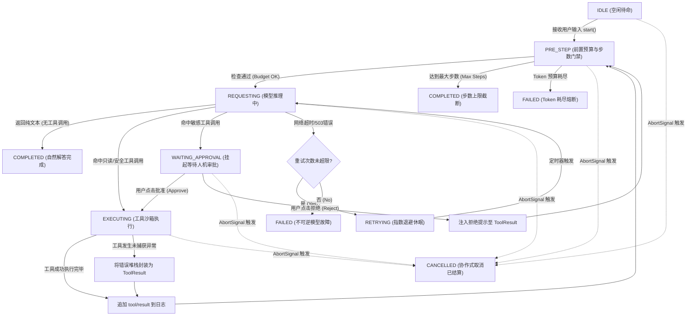

# Chapter 22: Build a minimal agent loop from scratch

English | [中文](22-minimal-agent-loop-implementation.zh.md)

This central chapter of the DeepSeek Harness course's third phase, “Advanced Agent Engineering and Production Practice,” focuses on the **agent loop**. It builds on the probabilistic nature of LLMs, tokenization, KV Cache VRAM use, and the Harness microkernel plugin architecture.

Introductory projects often present an agent loop as fewer than 20 lines of `while (true)` prompt concatenation. In production, that simplistic implementation can deadlock, exhaust VRAM, incur unbounded costs, or fork distributed state when it encounters network jitter, model hallucinations, invalid JSON, concurrent writes, asynchronous cancellation, hung subprocesses, or power loss.

This chapter treats the agent loop as **a strict interaction protocol between an event-driven deterministic finite-state machine (FSM) and a nondeterministic probabilistic coprocessor (the LLM)**. It derives termination and VRAM recurrence models, examines seven stopping conditions, implements a defensive, strongly typed TypeScript agent loop of more than 350 lines, compares three architectures, and uses write-ahead-log (WAL) fault injection to demonstrate crash recovery and reconciliation.

---

## 1. Engineering model: a deterministic state machine and an untrusted coprocessor

In computer architecture, a CPU communicates asynchronously with external devices such as GPUs, disk controllers, and network cards through the system bus. Interrupts, DMA ring buffers, and status registers keep the system stable even when devices are untrusted. Likewise, **an agent loop is a deterministic state-machine driver in the host runtime; it treats the LLM as a high-latency probabilistic coprocessor that may return malformed data**.

```
+---------------------------------------------------------------------------------------------------+
|                                  Agent Loop 系统架构心智模型                                      |
+---------------------------------------------------------------------------------------------------+
|                                                                                                   |
|  [ 宿主确定性世界: Host OS / Node.js Runtime / Event Sourcing Engine ]                            |
|  +---------------------------------------------------------------------------------------------+  |
|  |                                      Agent Loop FSM                                         |  |
|  |  +------------+       +------------+       +------------+       +------------------------+  |  |
|  |  |    IDLE    | ----> | REQUESTING | ----> | EXECUTING  | ----> | COMPLETED / TERMINATED |  |  |
|  |  +------------+       +------------+       +------------+       +------------------------+  |  |
|  |        ^                    |                     |                         ^               |  |
|  |        |                    v                     v                         |               |  |
|  |   [AbortSignal]    [JSON AST Parser]     [Sandbox Runner]             [Event Ledger]        |  |
|  +---------------------------------------------------------------------------------------------+  |
|         |                      |                     |                         ^                  |
|         | RPC Payload          | Typed Args          | Tool Side-Effects       | Append-Only Log  |
|         v                      v                     v                         |                  |
|  +-------------------+  +-----------------+  +-----------------+  +----------------------------+  |
|  | Remote LLM Model  |  | Zod / JSONSchema|  | FS / Bash / Git |  | WAL / SQLite Session Store |  |
|  | (Inference Engine)|  | Validation Gate |  | System Isolator |  | (Durable State)            |  |
|  +-------------------+  +-----------------+  +-----------------+  +----------------------------+  |
|  [ 概率型外部协处理器 ]  [ 语法与类型安全墙 ]  [ 副作用沙箱隔离区 ]  [ 不可变事实账本 ]           |
|                                                                                                   |
+---------------------------------------------------------------------------------------------------+
```

### 1.1 Mapping the agent loop to an OS event loop

The table compares an agent loop with Linux epoll, Node.js libuv, and a conventional interactive REPL:

| Dimension | OS event loop | Interactive terminal (classic REPL) | Production agent loop (dsh agent loop) |
| :--- | :--- | :--- | :--- |
| **Driver** | Hardware interrupts and file-descriptor readiness (`epoll_wait`) | User terminal input (`stdin`) | Historical factual log plus AST generated by the LLM coprocessor |
| **Single-step determinism** | Strictly deterministic compiled instructions | Strictly deterministic parsing | **Probabilistic and nondeterministic**, affected by temperature and top-p sampling |
| **Single-step latency** | Microseconds ($\mu\text{s}$) to milliseconds ($\text{ms}$) | Milliseconds ($\text{ms}$) | **Seconds ($\text{s}$) to tens of seconds**, limited by network and prefill/decode throughput |
| **Memory** | Reused stack, on-demand heap allocation, GC | In-memory variable symbol table | **Monotonically growing context with linear/quadratic cost** and resident KV Cache VRAM |
| **Side effects** | Limited by process permissions and intercepted system calls | Executes in current process user space | **Combined network RPC, filesystem I/O, and shell-process effects** |
| **Termination** | Empty task queue (`uv_run == 0`) | User enters `exit` or EOF | **Multiple conditions**: natural finish, steps, tokens, timeout, cancellation, approval |

### 1.2 Inversion of control: who drives the protocol?

An architectural mistake is to let the model directly control execution. In a production agent, **the host runtime retains control**.

1. **Initiate**: The host prepares the system prompt, message history, and available tools' JSON Schema definitions; serializes them as an HTTP/gRPC request; and calls the LLM API.
2. **Yield**: The host suspends at `await` while starting overall and per-step timers and an `AbortSignal` listener.
3. **Receive a proposal**: The LLM returns text or a specially marked JSON string. Architecturally, this is **only an execution proposal**, never trusted code.
4. **Validate and execute**: The host parses the proposal's AST, checks its Zod schema, authorizes it through the permission sandbox, and checks idempotency. Once valid, it schedules local or remote tools, captures stdout and errors, and emits a standard `ToolResult` event.
5. **Append facts**: The host appends the interaction's `AssistantMessage` and `ToolResult` as immutable events to the session WAL and advances the finite-state machine to the next step.

### 1.3 Mathematical model: autoregression and Markov decision processes

Mathematically, an agent loop can be modeled as a discrete-time Markov decision process (MDP) with a dynamically expanding state space: $\mathcal{M} = \langle \mathcal{S}, \mathcal{A}, \mathcal{P}, \mathcal{R}, \gamma \rangle$.

#### 1.3.1 State transitions and context-growth recurrence

At step $t$, full context state $s_t \in \mathcal{S}$ comprises initial system prompt $X_{\text{sys}}$, initial user input $X_{\text{user}}$, and the accumulated action-observation pairs from earlier iterations:

$$s_t = \left( X_{\text{sys}}, X_{\text{user}}, (a_1, o_1), (a_2, o_2), \dots, (a_{t-1}, o_{t-1}) \right)$$

Given $s_t$, the LLM acts as policy $\pi_\theta(a_t \mid s_t)$ and generates action $a_t \in \mathcal{A}$—a text response or tool-call arguments—through autoregressive token sampling:

$$P(a_t \mid s_t) = \prod_{i=1}^{m_t} P(y_{t,i} \mid s_t, y_{t,<i}; \theta)$$

Here $m_t$ is the number of tokens generated at step $t$, and $y_{t,i}$ is generated token $i$.

The host executor $\mathcal{E}$ receives $a_t$ and produces observation $o_t \in \mathcal{O}$ inside the sandbox: tool output, an error stack, or an environmental state change.

$$o_t = \mathcal{E}(a_t, \text{Env}_t)$$

State-transition function $\mathcal{T}: \mathcal{S} \times \mathcal{A} \times \mathcal{O} \to \mathcal{S}$ deterministically appends formatted actions and observations:

$$s_{t+1} = \mathcal{T}(s_t, a_t, o_t) = s_t \circ \text{FormatAssistant}(a_t) \circ \text{FormatToolResult}(o_t)$$

#### 1.3.2 Quadratic growth in context processing

Let $L_0 = |X_{\text{sys}}| + |X_{\text{user}}|$ be the initial prompt length in tokens. At each step $k$, let $l_{\text{gen}, k}$ be generated action tokens and $l_{\text{obs}, k}$ observation tokens returned by tools. Input context length $L_k$ is:

$$L_k = L_0 + \sum_{j=1}^{k-1} (l_{\text{gen}, j} + l_{\text{obs}, j})$$

Across $N$ steps, cumulative prompt tokens processed during prefill, $C_{\text{prompt}}(N)$, can grow quadratically:

$$C_{\text{prompt}}(N) = \sum_{k=1}^{N} L_k = N \cdot L_0 + \sum_{k=1}^{N} \sum_{j=1}^{k-1} (l_{\text{gen}, j} + l_{\text{obs}, j})$$

If the average action and observation add a constant $\Delta L = l_{\text{gen}} + l_{\text{obs}}$ each step, the expression becomes:

$$C_{\text{prompt}}(N) = N \cdot L_0 + \frac{N(N - 1)}{2} \Delta L = \mathcal{O}(N^2 \cdot \Delta L)$$

#### 1.3.3 Worked example: tokens and VRAM over ten steps

Consider finding and fixing a unit-test bug. Initial context is $L_0 = 2,500 \text{ tokens}$, including the system prompt, tool JSON Schemas, repository tree, and user issue. Each tool result or environmental observation adds $\Delta L = 600 \text{ tokens}$, such as a grep search, 50 file lines, or test output. Each model response generates $l_{\text{gen}} = 180 \text{ tokens}$, and the loop runs $N = 10 \text{ steps}$.

```
Step 1:  Prompt Len = 2,500 tokens                          | Gen = 180 tokens
Step 2:  Prompt Len = 2,500 + 780 = 3,280 tokens            | Gen = 180 tokens
Step 3:  Prompt Len = 2,500 + 780*2 = 4,060 tokens          | Gen = 180 tokens
Step 4:  Prompt Len = 2,500 + 780*3 = 4,840 tokens          | Gen = 180 tokens
Step 5:  Prompt Len = 2,500 + 780*4 = 5,620 tokens          | Gen = 180 tokens
Step 6:  Prompt Len = 2,500 + 780*5 = 6,400 tokens          | Gen = 180 tokens
Step 7:  Prompt Len = 2,500 + 780*6 = 7,180 tokens          | Gen = 180 tokens
Step 8:  Prompt Len = 2,500 + 780*7 = 7,960 tokens          | Gen = 180 tokens
Step 9:  Prompt Len = 2,500 + 780*8 = 8,740 tokens          | Gen = 180 tokens
Step 10: Prompt Len = 2,500 + 780*9 = 9,520 tokens          | Gen = 180 tokens

累计处理 Prompt Tokens:
C_prompt(10) = 10 * 2500 + (10 * 9 / 2) * 780 = 25,000 + 45 * 780 = 25,000 + 35,100 = 60,100 tokens!
累计生成 Completion Tokens:
C_gen(10) = 10 * 180 = 1,800 tokens.
单次任务总计计费 Token 数 = 60,100 + 1,800 = 61,900 tokens.
```

**KV Cache VRAM calculation:** For a self-hosted DeepSeek-V3-style model using MLA, suppose each compressed KV vector uses about 0.57 KB per token. At step 10, one request retains $M_{\text{KV}} = 9,520 \times 0.57 \text{ KB} \approx 5.43 \text{ MB}$ in GPU memory. With 200 concurrent agent tasks, KV Cache alone reaches $200 \times 5.43 \text{ MB} \approx 1.086 \text{ GB}$. At 64k tokens per task, each request uses 36.5 MB and 200 requests use 7.3 GB.

Compute time matters even more: prefill cost grows quadratically with input length without FlashAttention, or linearly with it while still constrained by memory bandwidth. Step 10's time to first token (TTFT) exceeds step 1's by a factor of 3.8. **The loop therefore needs a step limit, token budget, and dynamic context compaction.**

#### 1.3.4 The halting problem and finite-state constraints

Can an agent loop terminate on its own without external intervention? Let $p_{\text{stop}}(s_k)$ be the probability that the model gives a final natural-language answer at step $k$, emitting `stop` with no further tool call. If an ideal convergent policy has positive lower bound $p_{\text{stop}}(s_k) \ge \epsilon > 0$, termination at step $K$ follows a geometric distribution:

$$P(K = k) = p_{\text{stop}}(s_k) \prod_{j=1}^{k-1} (1 - p_{\text{stop}}(s_j))$$

Expected stopping steps are:

$$\mathbb{E}[K] = \sum_{k=1}^{\infty} k \cdot P(K = k) \le \frac{1}{\epsilon}$$

In production, a model may enter a **hallucination loop**: it repeatedly reads a nonexistent config file after the tool reports `ENOENT: no such file`, because it has no recovery strategy. Then $p_{\text{stop}}(s_k) \to 0$ and $\mathbb{E}[K] \to \infty$. The halting problem means the host cannot predict from static analysis alone whether the model will stop within finite steps. **A production agent loop therefore needs an external host watchdog with deterministic step, token-budget, and timeout limits.**

---

## 2. State-machine lifecycle and transition topology

A production agent loop is not a binary running/stopped flag. It is a finite-state machine (FSM) covering normal execution, interruption, approval, and error isolation.

### 2.1 States and transition matrix

First, define the possible states and transitions over the loop's lifecycle:

```
+----------------------------------------------------------------------------------------------------+
|                                   Agent Loop 状态转移矩阵全景                                       |
+-------------------+-----------------------------+-----------------------+--------------------------+
| 当前状态 (State)   | 触发事件 (Trigger Event)    | 目标状态 (Next State) | 伴随动作 / 副作用 (Action) |
+-------------------+-----------------------------+-----------------------+--------------------------+
| IDLE              | start(input, config)        | PRE_STEP              | 初始化上下文、分配 TurnID  |
| PRE_STEP          | check_passed                | REQUESTING            | 组装提示词、扣减预留预算 |
| PRE_STEP          | budget_exhausted            | TERMINATED (FAILED)   | 记录预算耗尽原因、触发清理|
| PRE_STEP          | max_steps_exceeded          | TERMINATED (COMPLETED)| 记录步数截断原因、封板日志|
| REQUESTING        | stream_chunk                | REQUESTING            | 实时推送增量 Chunk 至前端 |
| REQUESTING        | reply_text (no tool_calls)  | TERMINATED (COMPLETED)| 追加最终文本、关闭当前Turn|
| REQUESTING        | reply_tools (safe)          | EXECUTING             | 反序列化 AST、启动沙箱执行|
| REQUESTING        | reply_tools (sensitive)     | WAITING_APPROVAL      | 挂起执行、生成审批任务卡片|
| REQUESTING        | network_transient_error     | RETRYING              | 计算退避时间、启动定时重试|
| REQUESTING        | unrecoverable_model_error   | TERMINATED (FAILED)   | 捕获致命异常、生成错误诊断|
| RETRYING          | retry_timer_expired         | REQUESTING            | 递增重试计数器、重新发起RPC|
| RETRYING          | max_retries_exceeded        | TERMINATED (FAILED)   | 标记网络重试耗尽并告警   |
| WAITING_APPROVAL  | user_approved               | EXECUTING             | 恢复上下文、解除工具阻塞  |
| WAITING_APPROVAL  | user_rejected               | PRE_STEP              | 注入拒绝反馈作为 ToolResult|
| EXECUTING         | all_tools_resolved          | PRE_STEP              | 收集结果、追加事件账本    |
| EXECUTING         | tool_runtime_exception      | PRE_STEP              | 将异常封装为错误文本返回  |
| ANY_ACTIVE_STATE  | abort_signal_triggered      | CANCELLED             | 级联终止子进程、回滚未决态|
+-------------------+-----------------------------+-----------------------+--------------------------+
```

### 2.2 Main state-transition topology

The following diagram shows the main control and approval flows. Node labels containing parentheses or special characters are quoted to satisfy the syntax gate:



### 2.3 Transition invariants and runtime pre/postconditions

Before and after each transition, four invariants preserve consistency under concurrency and distribution:

1. **Monotonicity**: $\forall t_2 > t_1, \text{Step}(t_2) \ge \text{Step}(t_1) \land \text{TokenUsed}(t_2) \ge \text{TokenUsed}(t_1)$. Step and spent-token counters never decrease within one run.
2. **Event pairing**: $\forall \text{Event}(\text{type} = \text{'tool/call'}, \text{id} = X), \exists ! \, \text{Event}(\text{type} = \text{'tool/result'}, \text{id} = X)$. Every dispatched tool call must have exactly one matching result before the current step ends, whether it succeeds, times out, fails, or is rejected by the sandbox.
3. **Terminal cancellation**: $\text{State}(t) = \text{CANCELLED} \implies \forall t' > t, \text{State}(t') = \text{CANCELLED}$. Once the machine reaches `CANCELLED`, later network packets, subprocess I/O, and user input are discarded without further transitions.
4. **Append-only facts**: An event already written to WAL must not be mutated in place. Corrections and state changes append compensating events.

---

## 3. Seven stopping conditions and failure defenses

A robust production agent loop needs several independent stopping checks. Omitting one can leave abnormal execution unbounded.

```
+---------------------------------------------------------------------------------------------------+
|                                  Agent Loop 七重停止条件防御网                                    |
+---------------------------------------------------------------------------------------------------+
|                                                                                                   |
|  [ 1. 自然文本回答 (Natural Stop) ] ----> 模型返回 stop 且无 tool_calls提案 ----> 正常成功结算    |
|  [ 2. 最大步数上限 (Max Steps) ] -------> currentStep >= maxSteps (默认 30) ----> 触发熔断保护    |
|  [ 3. Token 预算耗尽 (Token Budget) ] --> accumulatedTokens >= tokenBudget -----> 触发成本熔断    |
|  [ 4. 物理超时限制 (Wall Clock Timeout) > elapsedMs >= timeoutMs (全局/单步) ---> 强制销毁释放    |
|  [ 5. 协作式取消 (AbortSignal) ] -------> abortSignal.aborted === true ---------> 级联清理退出    |
|  [ 6. 审批挂起与中断 (Approval) ] ------> 敏感权限未获批准 / 等待异步 Webhook -> 挂起持久化保存  |
|  [ 7. 不可逆异常 (Terminal Error) ] ----> 401 鉴权失败 / Context Window 溢出 ---> 立即报错归档    |
|                                                                                                   |
+---------------------------------------------------------------------------------------------------+
```

### 3.1 Condition 1: final natural-language answer

- **Criterion**: The model returns an empty `tool_calls` list, a `finish_reason` of `stop` or `end_turn`, and valid text content.
- **Behavior**: Use the text as the final deliverable, move the state machine to `COMPLETED`, return success to the caller, and write a `turn/end` settlement event.
- **Failure defense**: A truncated or internally failing model may return `""` with no tool calls. The host must reject empty content as an anomalous response and retry or report an error, not mark the turn complete.

### 3.2 Condition 2: maximum step count

- **Criterion**: `this.currentStep >= this.config.maxSteps`.
- **Suggested limits**:
  - Code generation and bug-fixing agents: `maxSteps = 30`.
  - Knowledge retrieval and general Q&A agents: `maxSteps = 10 ~ 15`.
  - Data analysis and multi-chart agents: `maxSteps = 20`.
- **Behavior**: Stop the loop and return `terminationReason: 'max_steps_exceeded'` with intermediate artifacts and execution logs for review.

### 3.3 Condition 3: token-budget exhaustion

- **Criterion**: Track $\text{Tokens}_{\text{used}} = \text{PromptTokens} + \text{CompletionTokens}$ and stop when either:
  1. $\text{Tokens}_{\text{used}} \ge \text{TokenBudget}_{\text{total}}$; or
  2. $\text{TokenBudget}_{\text{total}} - \text{Tokens}_{\text{used}} < \text{Tokens}_{\text{min\_required}}$, so the remainder cannot support minimal prefill and decode, for example fewer than 1000 tokens.
- **Behavior**: Block the next network request and throw `TokenBudgetExhaustedError`, avoiding unexpectedly large charges.

### 3.4 Condition 4: wall-clock timeouts and exponential backoff

- **Two timeout levels**: A global end-to-end limit, such as 15 minutes per task, and per-step limits, such as 120 seconds for inference and 60 seconds for a tool.
- **Exponential-backoff retry**: For transient network failures such as HTTP 429 or 503, use randomized jitter with $t_{\text{sleep}}(i) = \min(t_{\text{max}}, t_{\text{base}} \cdot 2^i) \times (1 + \text{Uniform}(-\alpha, \alpha))$, where $t_{\text{base}} = 1000\text{ms}, t_{\text{max}} = 30000\text{ms}, \alpha = 0.2$.

### 3.5 Condition 5: cooperative user cancellation (AbortSignal)

- **Criterion**: The root context has `AbortSignal.aborted === true`.
- **Mechanism**: **Cancellation must propagate**. The loop must leave `while`, the HTTP request must be aborted through the signal parameter of Node.js `undici` or `fetch`, and tool-spawned subprocesses must be terminated through `child_process` and `SIGKILL`.

### 3.6 Condition 6: suspended human approval

- **Criterion**: A model-generated tool call matches a sensitive security-policy rule, such as file deletion, shell execution, or database update.
- **Behavior**: Move to `WAITING_APPROVAL`; persist a snapshot of execution context and pending `tool_call`; generate a globally unique `approvalTicketId`; suspend execution and notify a human administrator. If approved, call `resume(ticketId, decision)`; if rejected, inject the reason as a `ToolResult` so the model can adjust its approach.

### 3.7 Condition 7: terminal model errors and malformed ASTs

- **Criterion**: A fatal HTTP response (`401 Unauthorized`, `403 Forbidden`, or `404 Model Not Found`); hard context overflow (`context_length_exceeded`) with no automatic compaction plugin; or malformed non-JSON output beyond a configured tolerance, such as three consecutive failures to parse a valid AST.
- **Behavior**: Stop the loop immediately and produce a failure report with error context and diagnostic suggestions.

### 3.8 Combined termination-decision matrix

```typescript
export function evaluateTerminationConditions(
  step: number,
  accumulatedTokens: number,
  config: AgentLoopConfig,
  rootSignal: AbortSignal,
  modelReply?: ModelReply
): { shouldTerminate: boolean; reason: TerminationReason | null } {
  if (rootSignal.aborted) {
    return { shouldTerminate: true, reason: 'user_aborted' };
  }
  if (step > config.maxSteps) {
    return { shouldTerminate: true, reason: 'max_steps_exceeded' };
  }
  if (accumulatedTokens >= config.tokenBudget) {
    return { shouldTerminate: true, reason: 'token_budget_exhausted' };
  }
  if (modelReply) {
    const hasToolCalls = Array.isArray(modelReply.toolCalls) && modelReply.toolCalls.length > 0;
    if (!hasToolCalls && modelReply.finishReason === 'stop') {
      return { shouldTerminate: true, reason: 'natural_stop' };
    }
  }
  return { shouldTerminate: false, reason: null };
}
```

---

## 4. Implement a production-grade TypeScript agent loop

The following is a complete production-oriented TypeScript agent loop without a large external framework dependency.

### 4.1 Core types and interfaces

```typescript
/**
 * 消息角色定义：遵循标准大模型交互规范
 */
export type Role = 'system' | 'user' | 'assistant' | 'tool';

/**
 * 模型输出的工具调用 AST 结构
 */
export interface ToolCall {
  id: string;
  type: 'function';
  function: {
    name: string;
    arguments: string; // 模型输出的未解析原始 JSON 字符串
  };
}

/**
 * 规范化会话历史消息接口
 */
export interface Message {
  role: Role;
  content: string | null;
  name?: string;
  tool_call_id?: string;
  tool_calls?: ToolCall[];
}

/**
 * 工具执行标准输出封装
 */
export interface ToolResult {
  toolCallId: string;
  toolName: string;
  isError: boolean;
  output: string;
  executionDurationMs: number;
}

/**
 * 宿主工具标准接口
 */
export interface Tool<TParams = unknown, TOutput = unknown> {
  name: string;
  description: string;
  parametersJsonSchema: Record<string, unknown>;
  requiresApproval?: boolean;
  execute: (args: TParams, signal: AbortSignal) => Promise<TOutput>;
}

/**
 * 大模型响应实体
 */
export interface ModelReply {
  content: string | null;
  toolCalls?: ToolCall[];
  finishReason: 'stop' | 'tool_calls' | 'length' | 'content_filter' | 'error';
  usage: {
    promptTokens: number;
    completionTokens: number;
    totalTokens: number;
  };
}

/**
 * Agent 运行配置
 */
export interface AgentLoopConfig {
  maxSteps: number;
  tokenBudget: number;
  stepTimeoutMs: number;
  globalTimeoutMs: number;
  systemPrompt: string;
  maxConsecutiveMalformedJson?: number;
}

/**
 * 终止原因枚举
 */
export type TerminationReason =
  | 'natural_stop'
  | 'max_steps_exceeded'
  | 'token_budget_exhausted'
  | 'global_timeout'
  | 'step_timeout'
  | 'user_aborted'
  | 'approval_suspended'
  | 'terminal_error';

/**
 * 终态结算对象
 */
export interface AgentExecutionResult {
  success: boolean;
  finalAnswer: string | null;
  terminationReason: TerminationReason;
  totalSteps: number;
  accumulatedUsage: {
    promptTokens: number;
    completionTokens: number;
    totalTokens: number;
  };
  history: Message[];
  error?: Error;
}

/**
 * 大模型驱动 Provider 接口
 */
export interface LLMProvider {
  chat(
    messages: Message[],
    tools: Tool[],
    signal: AbortSignal
  ): Promise<ModelReply>;
}
```

### 4.2 Complete agent-loop implementation

```typescript
import { EventEmitter } from 'node:events';

/**
 * 工业级 MinimalAgentLoop 状态机引擎
 */
export class MinimalAgentLoop extends EventEmitter {
  private history: Message[] = [];
  private accumulatedTokens = { promptTokens: 0, completionTokens: 0, totalTokens: 0 };
  private currentStep = 0;
  private consecutiveMalformedJsonCount = 0;

  constructor(
    private readonly llm: LLMProvider,
    private readonly tools: Map<string, Tool>,
    private readonly config: AgentLoopConfig
  ) {
    super();
  }

  /**
   * 执行 Agent 主循环
   */
  public async run(
    userInput: string,
    parentSignal?: AbortSignal
  ): Promise<AgentExecutionResult> {
    // 1. 初始化内部状态
    this.currentStep = 0;
    this.history = [];
    this.consecutiveMalformedJsonCount = 0;
    this.accumulatedTokens = { promptTokens: 0, completionTokens: 0, totalTokens: 0 };

    // 2. 组装初始上下文
    this.history.push({ role: 'system', content: this.config.systemPrompt });
    this.history.push({ role: 'user', content: userInput });

    // 3. 构建多级取消控制树
    const globalTimeoutController = new AbortController();
    const globalTimer = setTimeout(() => {
      globalTimeoutController.abort(new Error(`Global timeout of ${this.config.globalTimeoutMs}ms exceeded`));
    }, this.config.globalTimeoutMs);

    const rootController = new AbortController();
    const forwardParentAbort = () => {
      rootController.abort(parentSignal?.reason ?? new Error('User triggered cancellation'));
    };
    const forwardTimeoutAbort = () => {
      rootController.abort(globalTimeoutController.signal.reason);
    };

    parentSignal?.addEventListener('abort', forwardParentAbort, { once: true });
    globalTimeoutController.signal.addEventListener('abort', forwardTimeoutAbort, { once: true });

    try {
      this.emit('status_change', { state: 'RUNNING', step: 0 });

      // 4. 核心状态机死循环 (Finite State Loop)
      while (true) {
        this.currentStep++;

        // ==================== [状态 1: PRE_STEP 前置检查] ====================
        if (rootController.signal.aborted) {
          const isTimeout = globalTimeoutController.signal.aborted;
          return this.finalize(false, null, isTimeout ? 'global_timeout' : 'user_aborted');
        }

        if (this.currentStep > this.config.maxSteps) {
          return this.finalize(false, null, 'max_steps_exceeded');
        }

        if (this.accumulatedTokens.totalTokens >= this.config.tokenBudget) {
          return this.finalize(false, null, 'token_budget_exhausted');
        }

        this.emit('step_start', { step: this.currentStep });

        // ==================== [状态 2: REQUESTING 模型推理] ====================
        const stepTimeoutController = new AbortController();
        const stepTimer = setTimeout(() => {
          stepTimeoutController.abort(new Error(`Step ${this.currentStep} timeout of ${this.config.stepTimeoutMs}ms exceeded`));
        }, this.config.stepTimeoutMs);

        const forwardStepAbort = () => stepTimeoutController.abort(rootController.signal.reason);
        rootController.signal.addEventListener('abort', forwardStepAbort, { once: true });

        let modelReply: ModelReply;
        try {
          const availableTools = Array.from(this.tools.values());
          modelReply = await this.llm.chat(this.history, availableTools, stepTimeoutController.signal);
        } catch (err: unknown) {
          const error = err instanceof Error ? err : new Error(String(err));
          if (rootController.signal.aborted) {
            const isTimeout = globalTimeoutController.signal.aborted;
            return this.finalize(false, null, isTimeout ? 'global_timeout' : 'user_aborted', error);
          }
          if (stepTimeoutController.signal.aborted) {
            return this.finalize(false, null, 'step_timeout', error);
          }
          return this.finalize(false, null, 'terminal_error', error);
        } finally {
          clearTimeout(stepTimer);
          rootController.signal.removeEventListener('abort', forwardStepAbort);
        }

        // 记账与 Token 累加
        this.accumulatedTokens.promptTokens += modelReply.usage.promptTokens;
        this.accumulatedTokens.completionTokens += modelReply.usage.completionTokens;
        this.accumulatedTokens.totalTokens += modelReply.usage.totalTokens;

        // ==================== [状态 3: 分支判定与 AST 校验] ====================
        const hasToolCalls = Array.isArray(modelReply.toolCalls) && modelReply.toolCalls.length > 0;

        // 分支 A: 模型输出自然语言解答，且无工具调用提案
        if (!hasToolCalls) {
          const finalAnswer = modelReply.content ?? '';
          this.history.push({ role: 'assistant', content: finalAnswer });
          this.emit('step_end', { step: this.currentStep, reply: modelReply });
          return this.finalize(true, finalAnswer, 'natural_stop');
        }

        // 分支 B: 模型发起了工具调用提案
        this.history.push({
          role: 'assistant',
          content: modelReply.content,
          tool_calls: modelReply.toolCalls,
        });

        // ==================== [状态 4: EXECUTING 工具执行] ====================
        this.emit('executing_tools', { step: this.currentStep, toolCalls: modelReply.toolCalls });

        const toolResults: ToolResult[] = [];
        for (const call of modelReply.toolCalls!) {
          // 中断检查点：在工具执行间隙检测取消信号
          if (rootController.signal.aborted) {
            return this.finalize(false, null, 'user_aborted');
          }

          const result = await this.executeToolWithGuard(call, rootController.signal);
          toolResults.push(result);

          // 封装为标准 tool 消息追加至历史记录
          this.history.push({
            role: 'tool',
            name: result.toolName,
            tool_call_id: result.toolCallId,
            content: result.output,
          });
        }

        this.emit('step_end', {
          step: this.currentStep,
          reply: modelReply,
          toolResults,
        });
        // 状态机完成单步跃迁，自动循环进入下一轮 PRE_STEP
      }
    } finally {
      // 保证资源彻底析构，释放句柄
      clearTimeout(globalTimer);
      parentSignal?.removeEventListener('abort', forwardParentAbort);
      globalTimeoutController.signal.removeEventListener('abort', forwardTimeoutAbort);
      this.emit('status_change', { state: 'IDLE', step: this.currentStep });
    }
  }

  /**
   * 带边界防御的单工具执行器
   */
  private async executeToolWithGuard(
    call: ToolCall,
    signal: AbortSignal
  ): Promise<ToolResult> {
    const startTime = Date.now();
    const toolName = call.function.name;
    const tool = this.tools.get(toolName);

    // 1. 防御一：未注册工具拦截
    if (!tool) {
      return {
        toolCallId: call.id,
        toolName,
        isError: true,
        output: JSON.stringify({
          error: 'ToolNotFoundException',
          message: `Tool '${toolName}' is not registered in the agent environment. Available tools: ${Array.from(this.tools.keys()).join(', ')}`,
        }),
        executionDurationMs: Date.now() - startTime,
      };
    }

    // 2. 防御二：JSON AST 参数解析与畸变自愈
    let parsedArgs: unknown;
    try {
      const rawJson = call.function.arguments?.trim() || '{}';
      parsedArgs = JSON.parse(rawJson);
      this.consecutiveMalformedJsonCount = 0; // 重置畸变计数
    } catch (parseError: unknown) {
      this.consecutiveMalformedJsonCount++;
      const err = parseError instanceof Error ? parseError : new Error(String(parseError));
      return {
        toolCallId: call.id,
        toolName,
        isError: true,
        output: JSON.stringify({
          error: 'MalformedJsonArgumentsException',
          message: `Failed to parse arguments JSON string for tool '${toolName}'. Ensure strictly valid JSON format.`,
          rawInput: call.function.arguments,
          parserError: err.message,
        }),
        executionDurationMs: Date.now() - startTime,
      };
    }

    // 3. 防御三：沙箱执行与运行时全异常捕获
    try {
      if (signal.aborted) {
        throw new Error('Execution aborted before tool runner started');
      }

      const executionOutput = await tool.execute(parsedArgs, signal);
      const serializedOutput = typeof executionOutput === 'string'
        ? executionOutput
        : JSON.stringify(executionOutput);

      return {
        toolCallId: call.id,
        toolName,
        isError: false,
        output: serializedOutput,
        executionDurationMs: Date.now() - startTime,
      };
    } catch (runtimeError: unknown) {
      const err = runtimeError instanceof Error ? runtimeError : new Error(String(runtimeError));
      return {
        toolCallId: call.id,
        toolName,
        isError: true,
        output: JSON.stringify({
          error: 'ToolExecutionException',
          message: `Tool '${toolName}' encountered an internal runtime exception during execution.`,
          details: err.message,
        }),
        executionDurationMs: Date.now() - startTime,
      };
    }
  }

  /**
   * 构造标准化终态结算响应
   */
  private finalize(
    success: boolean,
    finalAnswer: string | null,
    reason: TerminationReason,
    error?: Error
  ): AgentExecutionResult {
    return {
      success,
      finalAnswer,
      terminationReason: reason,
      totalSteps: this.currentStep,
      accumulatedUsage: { ...this.accumulatedTokens },
      history: [...this.history],
      error,
    };
  }
}
```

### 4.3 Unit tests for seven termination paths and edge cases

The following automated suite exercises all seven termination paths:

```typescript
import { describe, it, expect } from 'vitest';

/**
 * Mock 大模型 Provider 实现
 */
class MockLLMProvider implements LLMProvider {
  private callCount = 0;
  constructor(private readonly responses: Array<(step: number) => ModelReply>) {}

  public async chat(messages: Message[], tools: Tool[], signal: AbortSignal): Promise<ModelReply> {
    if (signal.aborted) throw new Error('Aborted before request');
    const generator = this.responses[this.callCount];
    if (!generator) {
      throw new Error(`MockLLMProvider: No mocked response configured for step index ${this.callCount}`);
    }
    this.callCount++;
    return generator(this.callCount);
  }
}

describe('MinimalAgentLoop 工业级状态机测试套件', () => {
  const defaultConfig: AgentLoopConfig = {
    maxSteps: 5,
    tokenBudget: 10000,
    stepTimeoutMs: 1000,
    globalTimeoutMs: 5000,
    systemPrompt: 'You are a helpful assistant.',
  };

  it('场景 1: 自然文本回答成功结束 (Natural Stop)', async () => {
    const mockLLM = new MockLLMProvider([
      () => ({
        content: 'Hello, World! Task completed successfully.',
        finishReason: 'stop',
        usage: { promptTokens: 100, completionTokens: 20, totalTokens: 120 },
      }),
    ]);

    const loop = new MinimalAgentLoop(mockLLM, new Map(), defaultConfig);
    const result = await loop.run('Say hello');

    expect(result.success).toBe(true);
    expect(result.terminationReason).toBe('natural_stop');
    expect(result.finalAnswer).toBe('Hello, World! Task completed successfully.');
    expect(result.totalSteps).toBe(1);
    expect(result.accumulatedUsage.totalTokens).toBe(120);
  });

  it('场景 2: 工具调用并在第二轮成功自然停止 (Tool Call -> Natural Stop)', async () => {
    const tools = new Map<string, Tool>();
    tools.set('calculator', {
      name: 'calculator',
      description: 'Add two numbers',
      parametersJsonSchema: {},
      execute: async (args: any) => ({ result: args.a + args.b }),
    });

    const mockLLM = new MockLLMProvider([
      () => ({
        content: null,
        toolCalls: [
          {
            id: 'call_123',
            type: 'function',
            function: { name: 'calculator', arguments: JSON.stringify({ a: 10, b: 20 }) },
          },
        ],
        finishReason: 'tool_calls',
        usage: { promptTokens: 150, completionTokens: 30, totalTokens: 180 },
      }),
      () => ({
        content: 'The calculated sum is 30.',
        finishReason: 'stop',
        usage: { promptTokens: 220, completionTokens: 15, totalTokens: 235 },
      }),
    ]);

    const loop = new MinimalAgentLoop(mockLLM, tools, defaultConfig);
    const result = await loop.run('Calculate 10 + 20');

    expect(result.success).toBe(true);
    expect(result.terminationReason).toBe('natural_stop');
    expect(result.finalAnswer).toBe('The calculated sum is 30.');
    expect(result.totalSteps).toBe(2);
    expect(result.history.some((m) => m.role === 'tool' && m.content?.includes('30'))).toBe(true);
  });

  it('场景 3: 达到最大步数上限触发熔断 (Max Steps Exceeded)', async () => {
    // 模拟一个死循环 Agent：模型无限次调用同一个工具
    const tools = new Map<string, Tool>();
    tools.set('noop', {
      name: 'noop',
      description: 'No operation',
      parametersJsonSchema: {},
      execute: async () => 'OK',
    });

    const infiniteMock = new MockLLMProvider(
      Array(10).fill(() => ({
        content: null,
        toolCalls: [{ id: 'call_inf', type: 'function', function: { name: 'noop', arguments: '{}' } }],
        finishReason: 'tool_calls',
        usage: { promptTokens: 100, completionTokens: 10, totalTokens: 110 },
      }))
    );

    const loop = new MinimalAgentLoop(infiniteMock, tools, { ...defaultConfig, maxSteps: 3 });
    const result = await loop.run('Loop forever');

    expect(result.success).toBe(false);
    expect(result.terminationReason).toBe('max_steps_exceeded');
    expect(result.totalSteps).toBe(4); // 第 4 步前置检查拦截
  });

  it('场景 4: 用户主动触发 AbortSignal 协作式取消 (User Abort)', async () => {
    const abortController = new AbortController();
    const mockLLM = new MockLLMProvider([
      () => {
        abortController.abort(new Error('User clicked stop button'));
        return {
          content: null,
          toolCalls: [{ id: 'call_1', type: 'function', function: { name: 'slow_tool', arguments: '{}' } }],
          finishReason: 'tool_calls',
          usage: { promptTokens: 100, completionTokens: 10, totalTokens: 110 },
        };
      },
    ]);

    const loop = new MinimalAgentLoop(mockLLM, new Map(), defaultConfig);
    const result = await loop.run('Cancel me', abortController.signal);

    expect(result.success).toBe(false);
    expect(result.terminationReason).toBe('user_aborted');
  });

  it('场景 5: 参数 JSON 畸变时的优雅自愈防御 (Malformed JSON Recovery)', async () => {
    const tools = new Map<string, Tool>();
    tools.set('echo', {
      name: 'echo',
      description: 'Echo message',
      parametersJsonSchema: {},
      execute: async (args: any) => args.msg,
    });

    const mockLLM = new MockLLMProvider([
      // 第一轮：模型输出畸变的 JSON 字符串（缺失右括号）
      () => ({
        content: null,
        toolCalls: [
          {
            id: 'call_bad_json',
            type: 'function',
            function: { name: 'echo', arguments: '{"msg": "incomplete...' },
          },
        ],
        finishReason: 'tool_calls',
        usage: { promptTokens: 100, completionTokens: 20, totalTokens: 120 },
      }),
      // 第二轮：模型看到错误提示后自我修正，输出合法 JSON
      () => ({
        content: 'Fixed and completed.',
        finishReason: 'stop',
        usage: { promptTokens: 180, completionTokens: 10, totalTokens: 190 },
      }),
    ]);

    const loop = new MinimalAgentLoop(mockLLM, tools, defaultConfig);
    const result = await loop.run('Test malformed JSON');

    expect(result.success).toBe(true);
    expect(result.terminationReason).toBe('natural_stop');
    // 验证历史中记录了 MalformedJsonArgumentsException 错误
    const toolMsg = result.history.find((m) => m.role === 'tool');
    expect(toolMsg?.content).toContain('MalformedJsonArgumentsException');
  });
});
```

---

## 5. Three architectures: ReAct, Plan-and-Execute, and Workflow

An agent system's control-flow topology affects flexibility, accuracy, latency, and API cost.

```
+---------------------------------------------------------------------------------------------------+
|                                  三大 Agent 架构范式拓扑对比                                      |
+---------------------------------------------------------------------------------------------------+
|                                                                                                   |
|  1. ReAct (单步推演):                                                                              |
|     [Thought 1] -> [Action 1] -> [Observation 1] -> [Thought 2] -> [Action 2] -> [Answer]        |
|                                                                                                   |
|  2. Plan-and-Execute (两阶段编排):                                                                |
|     [Planner: 生成 Plan (1..M)] ---> [Executor: 依次执行 Step i] ---> [Replanner: 动态修正]       |
|                                                                                                   |
|  3. Workflow (确定性 DAG 状态机):                                                                  |
|     [Node A (LLM)] ---> [Node B (Tool)] ---> [Condition Router] ---> [Node C (LLM)]              |
|                                                                                                   |
+---------------------------------------------------------------------------------------------------+
```

### 5.1 ReAct: observe, reason, and act one step at a time

- **Mechanism**: Alternate reasoning and acting. At each small step, the model observes the previous tool result, assesses progress, and chooses another tool call or a final answer.
- **Advantages**: It can immediately adjust parameters after a tool error and adapts naturally to dynamic, unknown environments such as filesystem exploration and browser interaction.
- **Disadvantages**: Token consumption can grow as $\mathcal{O}(N^2)$ because every step carries full history. Beyond roughly 15 steps, attention may drift from the original high-level objective into local loops.

### 5.2 Plan-and-Execute: plan globally, execute tasks, replan when needed

- **Mechanism**: Separate planning and execution into two agent roles. A planner takes a complex high-level objective and produces a structured subtask DAG. An executor works through tasks in small independent contexts. A replanner intervenes only when a task fails completely.
- **Advantages**: Strong context isolation lets the system discard large debugging outputs after each task, reducing cumulative token cost and inference latency while preserving a global plan.
- **Disadvantages**: Initial planning must be strong; a fragile or rapidly changing environment can trigger frequent, costly replanning.

### 5.3 Deterministic Workflow/DAG

- **Mechanism**: A human engineer defines the task DAG in code or configuration. The LLM is one computing node for tasks such as classification, extraction, or summarization; deterministic conditions route control flow.
- **Advantages**: Execution is fully deterministic, avoids unnecessary tokens, has low latency, and is testable, auditable, and exactly replayable.
- **Disadvantages**: It cannot autonomously explore unknown problems.

### 5.4 Production architecture: a hierarchical hybrid

Production agent systems such as Harness use a **hierarchical hybrid architecture** to combine the three approaches:

1. **Macro level (Workflow/DAG)**: A deterministic state machine manages broad stages, such as requirements review $\to$ architecture $\to$ implementation $\to$ unit tests $\to$ code review.
2. **Meso level (Plan-and-Execute)**: During implementation, a planner divides a module into file-edit plans.
3. **Micro level (ReAct agent loop)**: For a specific file, the `MinimalAgentLoop` built here uses tools to read, edit, test, recover, and fix syntax.

### 5.5 Comparison table

| Criterion | ReAct | Plan-and-Execute | Workflow/DAG | Production hierarchical hybrid (dsh) |
| :--- | :--- | :--- | :--- | :--- |
| **Token complexity** | $\mathcal{O}(N^2)$ (quadratic growth) | $\mathcal{O}(N)$ (locally linear, isolated) | $\mathcal{O}(1)$ (small fixed cost) | **$\mathcal{O}(K \cdot M)$ (bounded by layers)** |
| **Average end-to-end latency** | High (full prefill each step) | Moderate (concurrent small tasks) | Very low (direct deterministic pipeline) | **Low to moderate (macro parallelism, fast micro iterations)** |
| **Open-ended exploration** | Very strong (dynamic discovery) | Strong (global planning and local execution) | None (predefined paths only) | **Very strong (global and local)** |
| **Hallucination resistance and control** | Weaker (trajectory drift) | Good (plan constrains actions) | Complete (hard code-level constraints) | **Very strong (quality gates and local recovery)** |
| **Implementation complexity** | Simple (one loop) | Moderate (two agents) | Moderate (graph engine) | **High (microkernel IoC and event sourcing)** |

---

## 6. Exercise: inject three crashes and reconcile the WAL

Crash recovery is a high-availability requirement in distributed systems and databases. Agent systems routinely create external side effects—file changes, Git commits, database operations, and Docker containers—so each operation boundary needs disciplined write-ahead logging (WAL).

```
+---------------------------------------------------------------------------------------------------+
|                                  三种致命崩溃窗口与恢复对账拓扑                                    |
+---------------------------------------------------------------------------------------------------+
|                                                                                                   |
|           [ 窗口 1: 请求前崩溃 ]           [ 窗口 2: 执行后崩溃 ]         [ 窗口 3: 记录前崩溃 ]   |
|                    |                                |                              |              |
|                    v                                v                              v              |
|  [User] -> [WAL: UserMsg] -> [LLM Request] -> [Tool Execute] -> [Tool Result] -> [WAL: Done]     |
|                   ▲                                 ▲                              ▲              |
|                   |                                 |                              |              |
|             【安全重试区】                  【幽灵执行/非幂等区】             【分叉/重放冲突区】         |
|             (无外部副作用)                  (文件已修改但无记录)             (结果丢失/引发二次执行)       |
|                                                                                                   |
+---------------------------------------------------------------------------------------------------+
```

### 6.1 Three crash windows

1. **Window 1: crash before the LLM request**: The user prompt is queued in WAL, but the Node.js process dies from host OOM or power loss before sending the model request. No external side effect occurred. On restart, the system scans unfinished turns and safely retries the model request.
2. **Window 2: crash after tool execution**: The model requests `append_file('config.json', payload)`. The file is written, but `kill -9` terminates the host before it logs `tool_executed`. This is **ghost execution**: disk state changed, while the factual log records only that the tool was about to run. Blindly repeating the tool appends the config twice and may corrupt it; ignoring the operation leaves the model without its tool result.
3. **Window 3: crash before logging the tool result**: The tool completed and produced an in-memory result, but disk I/O blocks or crashes as the SQLite/JSONL transaction commits. The temporary result is lost, and the durable log has an in-doubt outcome.

### 6.2 Event-sourced WAL and reconciliation engine

The following `DurableSessionLedger` persists a WAL and reconciles it automatically at startup:

```typescript
import { readFileSync, writeFileSync, existsSync } from 'node:fs';

/**
 * 不可变事件类型定义
 */
export interface SessionEvent {
  seq: number;
  turnId: string;
  type: 'turn_started' | 'llm_requested' | 'tool_call_proposed' | 'tool_executed' | 'turn_completed';
  payload: Record<string, unknown>;
  timestamp: number;
}

/**
 * 生产级 Session WAL 账本管理器
 */
export class DurableSessionLedger {
  private events: SessionEvent[] = [];
  private currentSeq = 0;

  constructor(private readonly walFilePath: string) {
    this.loadFromDisk();
  }

  private loadFromDisk(): void {
    if (existsSync(this.walFilePath)) {
      const content = readFileSync(this.walFilePath, 'utf-8').trim();
      if (content.length > 0) {
        const lines = content.split('\n');
        this.events = lines.filter(Boolean).map((line) => JSON.parse(line));
        this.currentSeq = this.events.length > 0 ? this.events[this.events.length - 1].seq : 0;
      }
    }
  }

  /**
   * 同步仅追加写入 WAL 文件
   */
  public appendEvent(type: SessionEvent['type'], turnId: string, payload: Record<string, unknown>): SessionEvent {
    this.currentSeq++;
    const event: SessionEvent = {
      seq: this.currentSeq,
      turnId,
      type,
      payload,
      timestamp: Date.now(),
    };
    this.events.push(event);
    writeFileSync(this.walFilePath, JSON.stringify(event) + '\n', { flag: 'a' });
    return event;
  }

  public getEvents(): SessionEvent[] {
    return [...this.events];
  }

  /**
   * 崩溃恢复对账算法：扫描未决事务并输出对账决策
   */
  public reconcileOnStartup(): {
    status: 'CLEAN' | 'RECONCILED_WITH_COMPENSATION' | 'RETRY_NEEDED';
    lastTurnId: string | null;
    compensatedToolCalls: string[];
  } {
    if (this.events.length === 0) {
      return { status: 'CLEAN', lastTurnId: null, compensatedToolCalls: [] };
    }

    const lastEvent = this.events[this.events.length - 1];

    // 情况 1: 事务完美闭环
    if (lastEvent.type === 'turn_completed') {
      return { status: 'CLEAN', lastTurnId: lastEvent.turnId, compensatedToolCalls: [] };
    }

    // 情况 2: 崩溃在 tool_call_proposed 之后，缺少 tool_executed 结算事件
    if (lastEvent.type === 'tool_call_proposed') {
      const toolCallId = lastEvent.payload.toolCallId as string;
      const toolName = lastEvent.payload.toolName as string;

      // 写入合成的补偿性错误事件，防止重放时发生非幂等二次执行
      this.appendEvent('tool_executed', lastEvent.turnId, {
        toolCallId,
        toolName,
        isError: true,
        output: JSON.stringify({
          error: 'CrashRecoverySyntheticEvent',
          message: `Host crashed before tool execution result was committed. Synthesized failure event to prevent duplicate execution.`,
        }),
      });

      return {
        status: 'RECONCILED_WITH_COMPENSATION',
        lastTurnId: lastEvent.turnId,
        compensatedToolCalls: [toolCallId],
      };
    }

    // 情况 3: 崩溃在 llm_requested 阶段
    if (lastEvent.type === 'llm_requested') {
      return {
        status: 'RETRY_NEEDED',
        lastTurnId: lastEvent.turnId,
        compensatedToolCalls: [],
      };
    }

    return { status: 'CLEAN', lastTurnId: lastEvent.turnId, compensatedToolCalls: [] };
  }
}
```

### 6.3 Fault-injection test and verification

This automated fault test targets crash window 2:

```typescript
import { describe, it, expect, beforeEach, afterEach } from 'vitest';
import { unlinkSync, existsSync } from 'node:fs';

describe('DurableSessionLedger 崩溃恢复与对账测试', () => {
  const testWalPath = './test_session_recovery.wal.jsonl';

  beforeEach(() => {
    if (existsSync(testWalPath)) unlinkSync(testWalPath);
  });

  afterEach(() => {
    if (existsSync(testWalPath)) unlinkSync(testWalPath);
  });

  it('验证崩溃窗口 2：工具执行后崩溃，重启后自动注入补偿事件对账', () => {
    // 模拟第 1 阶段：系统正常启动并写入用户消息与工具提案
    const session1 = new DurableSessionLedger(testWalPath);
    session1.appendEvent('turn_started', 'turn_001', { input: 'Write config' });
    session1.appendEvent('llm_requested', 'turn_001', {});
    session1.appendEvent('tool_call_proposed', 'turn_001', {
      toolCallId: 'call_abc123',
      toolName: 'write_config',
      args: { key: 'value' },
    });

    // 模拟崩溃：进程在此处被 kill -9 强杀，未写入 tool_executed 与 turn_completed

    // 模拟第 2 阶段：宿主系统重启，加载旧 WAL 文件并执行对账
    const session2 = new DurableSessionLedger(testWalPath);
    const report = session2.reconcileOnStartup();

    expect(report.status).toBe('RECONCILED_WITH_COMPENSATION');
    expect(report.compensatedToolCalls).toContain('call_abc123');

    // 验证账本中已成功追加补偿事件
    const events = session2.getEvents();
    const lastEvent = events[events.length - 1];
    expect(lastEvent.type).toBe('tool_executed');
    expect((lastEvent.payload as any).toolCallId).toBe('call_abc123');
    expect((lastEvent.payload as any).isError).toBe(true);
  });
});
```

---

## 7. Production failure modes and diagnostics

Five serious failure modes recur in large production agent clusters:

### 7.1 Cancellation does not reach child processes and network handles

- **Symptom**: After the user clicks Stop generating, the UI shows cancellation while server CPU stays at 100% and memory keeps growing until the server hangs.
- **Cause**: A TypeScript Promise rejects in memory, but shell subprocesses launched through `child_process.spawn()`—such as `npm build`, `pytest`, or `cargo check`—receive no OS signal and remain as orphan processes.
- **Remedy**: Isolate process groups and listen to `AbortSignal`; send `SIGKILL` to the negative PID to terminate the entire process tree:

```typescript
import { spawn, ChildProcess } from 'node:child_process';

export function spawnGuardedChildProcess(
  command: string,
  args: string[],
  signal: AbortSignal
): Promise<{ stdout: string; stderr: string; exitCode: number }> {
  return new Promise((resolve, reject) => {
    // 关键参数：detached: true 确保子进程成为独立进程组的 Leader
    const child: ChildProcess = spawn(command, args, {
      detached: true,
      shell: true,
    });

    let stdout = '';
    let stderr = '';

    child.stdout?.on('data', (chunk) => { stdout += chunk; });
    child.stderr?.on('data', (chunk) => { stderr += chunk; });

    const onAbort = () => {
      if (child.pid) {
        try {
          // 向负 PID 发送信号，内核会递归杀死该进程组下的所有子孙进程
          process.kill(-child.pid, 'SIGKILL');
        } catch (e) {
          // 忽略进程已退出的 ESRCH 错误
        }
      }
      reject(new Error('Process killed due to AbortSignal'));
    };

    signal.addEventListener('abort', onAbort, { once: true });

    child.on('close', (code) => {
      signal.removeEventListener('abort', onAbort);
      resolve({ stdout, stderr, exitCode: code ?? 0 });
    });

    child.on('error', (err) => {
      signal.removeEventListener('abort', onAbort);
      reject(err);
    });
  });
}
```

### 7.2 Truncated nested JSON causes an unbounded paid retry loop

- **Symptom**: A long generated JSON value reaches the maximum output tokens and stops midway, for example `{"sql": "SELECT * FROM users WHERE id IN (1, 2, 3`. The host parser returns `SyntaxError: Unexpected end of JSON input` as a tool result. The model mistakes this for a syntax problem and emits the same truncated JSON again, spending tokens until the balance is exhausted.
- **Remedy**: Inspect `finish_reason`. If it is `'length'`, the output token limit caused truncation; do not blindly return the parse error to the model. Inject a system instruction telling it that the per-step token limit truncated its output, not to regenerate the entire value, and to split arguments into pages or chunks.

### 7.3 Oversized tool results overwhelm attention and context

- **Symptom**: `read_log_file` or `grep_search` returns 20 MB of text—roughly five million tokens. Appending it directly to history can add tens of dollars to one request and overwhelm model attention, making relevant facts difficult to retrieve.
- **Remedy**: Bound in-memory output and spill excess data to disk:

```typescript
import { writeFileSync, mkdirSync } from 'node:fs';
import { join } from 'node:path';
import { randomUUID } from 'node:crypto';

export function guardToolOutputSize(
  toolName: string,
  rawOutput: string,
  maxInlineChars = 6000,
  spillDir = './.dsh/spill'
): string {
  if (rawOutput.length <= maxInlineChars) {
    return rawOutput;
  }

  mkdirSync(spillDir, { recursive: true });
  const spillId = randomUUID();
  const spillPath = join(spillDir, `${toolName}_${spillId}.log`);
  writeFileSync(spillPath, rawOutput, 'utf-8');

  const preview = rawOutput.slice(0, maxInlineChars);
  const omittedChars = rawOutput.length - maxInlineChars;

  return `${preview}\n\n[SYSTEM WARNING: Tool output exceeded inline character limit. ${omittedChars} characters were omitted and spilled to disk at '${spillPath}'. Use specific line range or regex filter tools to query details.]`;
}
```

### 7.4 Concurrent tools race and execute out of order

- **Scenario**: A model emits `delete_file('db.sqlite')` and `init_database('db.sqlite')` in one step. Running both under `Promise.all` may initialize the database before deletion finishes, leaving it deleted.
- **Remedy**: Add execution barriers based on side effects. Run `READ_ONLY` tools concurrently, but serialize `MUTATION` tools in the model's original order behind an exclusive barrier.

### 7.5 Off-by-one token budgets waste paid output

- **Scenario**: Only 500 tokens remain. A pre-request check passes, but the input uses 490 and the first generated token brings total use to 501. A response interceptor throws `TokenBudgetExhaustedError` and discards already-paid output.
- **Remedy**: Reserve budget ahead of the request. Require $\text{BudgetRemaining} \ge \text{EstimatedInputTokens} + \text{MinCompletionMargin}$, commonly with a 1000-token margin. If it cannot fit, exit before sending and retain the last successful snapshot.

### 7.6 Production metrics and golden signals

Every production agent loop should expose these key metrics through OpenTelemetry or Prometheus:

| Metric | Type | Labels | Operational meaning |
| :--- | :--- | :--- | :--- |
| `agent_loop_duration_seconds` | Histogram | `agent_name`, `termination_reason` | End-to-end duration, slow tasks, and tail latency |
| `agent_step_count_total` | Histogram | `agent_name`, `status` | Step distribution; clustering at `maxSteps` may indicate a loop |
| `agent_tokens_consumed_total` | Counter | `agent_name`, `type` (prompt/completion) | Real-time billing and cost attribution |
| `agent_tool_execution_duration_seconds` | Histogram | `tool_name`, `is_error` | Slow tools and underlying-service instability |
| `agent_malformed_json_total` | Counter | `model_name`, `tool_name` | Drift in model instruction following or prompt-syntax defects |
| `agent_crash_recovery_total` | Counter | `recovery_status` | Host crashes and WAL reconciliation frequency |

---

## 8. Summary and exercises

### 8.1 Architecture recap

```
+---------------------------------------------------------------------------------------------------+
|                                  Agent Loop 核心架构知识图谱                                      |
+---------------------------------------------------------------------------------------------------+
|                                                                                                   |
|  1. 状态机驱动 (FSM Engine)  : IDLE -> PRE_STEP -> REQUESTING -> EXECUTING -> COMPLETED / CANCEL  |
|  2. 七重停止网 (Termination) : 自然停止 / 步数上限 / Token预算 / 双超时 / Abort取消 / 审批 / 报错  |
|  3. 异常即数值 (Error-as-Value): 工具报错与AST畸变封装为结构化数值，促使大模型自我修正            |
|  4. 资源彻底析构 (Lifecycle)  : AbortSignal 级联清理、Process Group 杀整个子进程树、定时器释放    |
|  5. 崩溃对账 (WAL Recovery)   : 事件溯源不可变账本、幽灵执行对账、补偿性合成事件防止重放分叉      |
|                                                                                                   |
+---------------------------------------------------------------------------------------------------+
```

### 8.2 Hands-on exercises

1. **Implement an agent loop with human approval and resumable checkpoints**: Add `requiresApproval: boolean` to `Tool` in Section 4. When a tool call requires approval, serialize context and the pending proposal into a JSON snapshot in SQLite and return `approval_suspended`. Implement static `AgentLoop.resume(snapshotJson, approvalDecision)` to continue execution.
2. **Build an adaptive network retryer with full-jitter exponential backoff**: For provider HTTP 429 and 503 responses, implement a transparent `ResilientLLMProvider` decorator using $t_{\text{sleep}} = \text{random}(0, \min(t_{\text{max}}, t_{\text{base}} \cdot 2^i))$. Test smooth retries under concurrent failures.
3. **Implement spill-to-disk output and a retrieval tool**: Save tool text longer than 8,000 characters to `.dsh/spill/<uuid>.log`; expose `query_spill_log(uuid, regex, offset, limit)` so the model can search long logs by page.
4. **Implement Saga-style reverse compensation**: Define `compensate: (args: TParams) => Promise<void>` for each externally mutating tool, such as `create_file` paired with `delete_file` and `git_commit` with `git_reset`. If user cancellation or a fatal error stops the loop at step $K$, invoke completed tools' compensations in reverse order to restore the environment.
