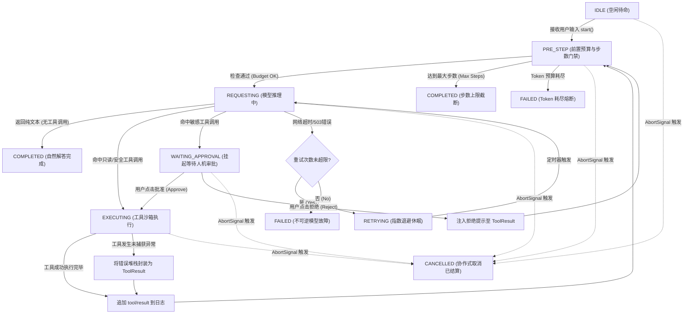

# 第 22 章：从零实现最小 Agent Loop

欢迎进入《DeepSeek Harness 深度技术教程》第三阶段“Agent 工程深化与生产实战”的核心篇章。在掌握了大语言模型概率本质、分词机制、KV Cache 显存模型以及 Harness 微内核插件架构之后，我们将正式聚焦于智能体系统的动力引擎——**Agent Loop（智能体循环）**。

在许多初级开源项目或网络入门教程中，Agent 循环往往被简化为一段不足 20 行的 `while (true)` 提示词拼接脚本。然而在工业级生产环境中，这种粗糙的玩具实现一旦遭遇网络抖动、模型幻觉、非合规 JSON 输出、并发写竞争、异步取消、子进程挂起或服务器异常掉电，便会立刻陷入死锁、显存溢出、无限计费循环甚至分布式状态分叉的灾难。

本章将彻底打破黑盒，以严谨的系统级工程视角，将 Agent Loop 解构为一个**由事件驱动的确定性有限状态机（Deterministic FSM）与非确定性概率协处理器（LLM）之间的强契约交互协议**。我们将推导循环的停机数学模型与显存递推方程，全覆盖剖析七重停止条件，手把手实现 350+ 行类型完备、防御严密的生产级 TypeScript Agent Loop，深度对比三大核心架构范式，并通过 Write-Ahead Log (WAL) 故障注入实验演示崩溃恢复与对账算法。

---

## 1. 核心工程心智模型：确定性状态机与不可信协处理器

在现代计算机体系结构中，CPU 通过系统总线与不可信的外部硬件设备（如 GPU、磁盘控制器、网卡）进行异步通信，依赖严格的中断机制、DMA 环形缓冲区（Ring Buffer）和状态寄存器维护系统稳定性。类似地，**Agent Loop 的本质是一个运行在宿主环境（Host Runtime）中的确定性状态机驱动器，它将大语言模型（LLM）视为一个高延迟、概率型、随时可能输出畸变数据的协处理器**。

```
+---------------------------------------------------------------------------------------------------+
|                                  Agent Loop 系统架构心智模型                                      |
+---------------------------------------------------------------------------------------------------+
|                                                                                                   |
|  [ 宿主确定性世界: Host OS / Node.js Runtime / Event Sourcing Engine ]                            |
|  +---------------------------------------------------------------------------------------------+  |
|  |                                      Agent Loop FSM                                         |  |
|  |  +------------+       +------------+       +------------+       +------------------------+  |  |
|  |  |    IDLE    | ----> | REQUESTING | ----> | EXECUTING  | ----> | COMPLETED / TERMINATED |  |  |
|  |  +------------+       +------------+       +------------+       +------------------------+  |  |
|  |        ^                    |                     |                         ^               |  |
|  |        |                    v                     v                         |               |  |
|  |   [AbortSignal]    [JSON AST Parser]     [Sandbox Runner]             [Event Ledger]        |  |
|  +---------------------------------------------------------------------------------------------+  |
|         |                      |                     |                         ^                  |
|         | RPC Payload          | Typed Args          | Tool Side-Effects       | Append-Only Log  |
|         v                      v                     v                         |                  |
|  +-------------------+  +-----------------+  +-----------------+  +----------------------------+  |
|  | Remote LLM Model  |  | Zod / JSONSchema|  | FS / Bash / Git |  | WAL / SQLite Session Store |  |
|  | (Inference Engine)|  | Validation Gate |  | System Isolator |  | (Durable State)            |  |
|  +-------------------+  +-----------------+  +-----------------+  +----------------------------+  |
|  [ 概率型外部协处理器 ]  [ 语法与类型安全墙 ]  [ 副作用沙箱隔离区 ]  [ 不可变事实账本 ]           |
|                                                                                                   |
+---------------------------------------------------------------------------------------------------+
```

### 1.1 概念映射：Agent Loop 与操作系统事件循环的底层对齐

为了帮助传统系统程序员建立坚实的工程直觉，我们将 Agent Loop 与 Linux Epoll / Node.js Libuv 事件循环及经典交互式 REPL 环境进行全方位对照：

| 架构维度 | 操作系统事件循环 (OS Event Loop) | 交互式终端 (Classic REPL) | 生产级 Agent Loop (dsh Agent Loop) |
| :--- | :--- | :--- | :--- |
| **驱动源泉** | 硬件中断 / 文件描述符就绪事件 (`epoll_wait`) | 用户终端标准输入 (`stdin`) | 历史事实账本 + 外部协处理器 (LLM) 生成的 AST 语法树 |
| **单步确定性** | 严格确定性（执行已编译的机器指令） | 严格确定性（按语法规则解析代码） | **概率型非确定性**（受 Temperature / Top-p 采样调制） |
| **单步延迟** | 微秒级 ($\mu\text{s}$) 至毫秒级 ($\text{ms}$) | 毫秒级 ($\text{ms}$) | **秒级 ($\text{s}$) 至数十秒**（受网络与 Prefill/Decode 算力限制） |
| **内存特征** | 栈内存复用，堆内存按需分配与 GC 自动回收 | 变量符号表常驻内存 | **上下文线性/二次方单调膨胀**，常驻 KV Cache 显存消耗 |
| **副作用范围** | 受进程权限与内核系统调用拦截限制 | 当前进程用户空间内直接执行 | **跨网络 RPC、文件系统 IO、Shell 进程的混合副作用** |
| **停机判定** | 任务队列清空 (`uv_run == 0`) | 用户输入 `exit` 或捕获 EOF | **多维终止条件网格**（自然停止/步数/Token/超时/取消/审批） |

### 1.2 控制反转（IoC）与驱动协议：谁主控？谁是协程？

初学者最容易犯的架构设计错误，是将大模型视为主控程序，让模型直接控制系统执行流。在严密的工业级 Agent 架构中，**控制权必须牢牢掌握在宿主运行时（Host Harness）手中**。

1. **协议发起**：Host 准备上下文数据（System Prompt、历史消息序列、可用工具的 JSON Schema 定义），将其序列化为 HTTP/gRPC 请求，主动调用 LLM API。
2. **协程让出**：Host 进入 `await` 异步挂起状态，同时启动全局超时定时器、单步超时定时器与 `AbortSignal` 监听器。
3. **提案返回**：LLM 计算后返回一段文本或一段特定标记包裹的 JSON 字符串。在架构语义上，这**仅被视为一份“执行提案（Execution Proposal）”**，绝非可信任代码。
4. **强校验与执行**：Host 对提案进行 AST 语法解析、Zod Schema 类型校验、权限沙箱鉴权和幂等性检查。校验通过后，Host 调度本地或远程工具执行，捕获标准输出与异常，将其封装为标准格式的 `ToolResult` 事件。
5. **账本追加**：Host 将本次交互的 `AssistantMessage` 与 `ToolResult` 作为不可变事件追加至 Session WAL 账本中，驱动有限状态机进入下一步（Step）状态转移。

### 1.3 数学建模：自回归预测与马尔可夫决策过程（MDP）

从应用数学的角度，Agent Loop 可以建模为一个带有动态扩展状态空间的离散时间马尔可夫决策过程（Markov Decision Process, MDP），其数学元组为 $\mathcal{M} = \langle \mathcal{S}, \mathcal{A}, \mathcal{P}, \mathcal{R}, \gamma \rangle$。

#### 1.3.1 状态转移与上下文膨胀递推方程

在第 $t$ 个迭代步（Step），系统的完整上下文状态 $s_t \in \mathcal{S}$ 由初始系统提示词 $X_{\text{sys}}$、用户初始输入 $X_{\text{user}}$ 以及历史所有执行轮次的动作与观测元组累加构成：

$$s_t = \left( X_{\text{sys}}, X_{\text{user}}, (a_1, o_1), (a_2, o_2), \dots, (a_{t-1}, o_{t-1}) \right)$$

在状态 $s_t$ 下，大模型作为策略函数 $\pi_\theta(a_t \mid s_t)$ 生成动作 $a_t \in \mathcal{A}$（即文本回复或工具调用参数）。该生成过程是由自回归 Token 采样完成的：

$$P(a_t \mid s_t) = \prod_{i=1}^{m_t} P(y_{t,i} \mid s_t, y_{t,<i}; \theta)$$

其中 $m_t$ 为第 $t$ 步生成的 Token 数量，$y_{t,i}$ 为生成的第 $i$ 个 Token。

宿主环境执行器 $\mathcal{E}$ 接收到动作 $a_t$ 后，在宿主沙箱中产生观测结果 $o_t \in \mathcal{O}$（工具输出文本、错误堆栈或环境状态变更）：

$$o_t = \mathcal{E}(a_t, \text{Env}_t)$$

系统的状态转移函数 $\mathcal{T}: \mathcal{S} \times \mathcal{A} \times \mathcal{O} \to \mathcal{S}$ 是确定性的仅追加连接操作（Append-Only Concatenation）：

$$s_{t+1} = \mathcal{T}(s_t, a_t, o_t) = s_t \circ \text{FormatAssistant}(a_t) \circ \text{FormatToolResult}(o_t)$$

#### 1.3.2 上下文长度与计算复杂度的二次方递推公式

令 $L_0 = |X_{\text{sys}}| + |X_{\text{user}}|$ 为初始提示词 Token 长度。假设在每个步骤 $k$，模型生成的动作 Token 长度为 $l_{\text{gen}, k}$，工具返回的观测 Token 长度为 $l_{\text{obs}, k}$。则第 $k$ 步输入大模型的总上下文长度 $L_k$ 为：

$$L_k = L_0 + \sum_{j=1}^{k-1} (l_{\text{gen}, j} + l_{\text{obs}, j})$$

在 $N$ 步连续迭代中，大模型 Prefill 阶段累计处理的 Prompt Token 总量 $C_{\text{prompt}}(N)$ 呈现二次方爆炸特征：

$$C_{\text{prompt}}(N) = \sum_{k=1}^{N} L_k = N \cdot L_0 + \sum_{k=1}^{N} \sum_{j=1}^{k-1} (l_{\text{gen}, j} + l_{\text{obs}, j})$$

若假设每步生成的调用与观测增量均值恒定为 $\Delta L = l_{\text{gen}} + l_{\text{obs}}$，则公式可精确化简为：

$$C_{\text{prompt}}(N) = N \cdot L_0 + \frac{N(N - 1)}{2} \Delta L = \mathcal{O}(N^2 \cdot \Delta L)$$

#### 1.3.3 手算演示：10 步循环下的 Token 与显存开销精算

我们以一个典型的实际编程任务（定位并修复一个单元测试 Bug）为例进行一步步手算推导。设定初始上下文 $L_0 = 2,500 \text{ tokens}$（包含系统提示词、工具定义 JSON Schema、代码库文件树与用户 Issue 描述）；每次工具调用输出及环境反馈 $\Delta L = 600 \text{ tokens}$（如使用 grep 检索代码、读取文件 50 行、运行测试套件输出）；每次模型生成 $l_{\text{gen}} = 180 \text{ tokens}$；循环执行 $N = 10 \text{ steps}$。

```
Step 1:  Prompt Len = 2,500 tokens                          | Gen = 180 tokens
Step 2:  Prompt Len = 2,500 + 780 = 3,280 tokens            | Gen = 180 tokens
Step 3:  Prompt Len = 2,500 + 780*2 = 4,060 tokens          | Gen = 180 tokens
Step 4:  Prompt Len = 2,500 + 780*3 = 4,840 tokens          | Gen = 180 tokens
Step 5:  Prompt Len = 2,500 + 780*4 = 5,620 tokens          | Gen = 180 tokens
Step 6:  Prompt Len = 2,500 + 780*5 = 6,400 tokens          | Gen = 180 tokens
Step 7:  Prompt Len = 2,500 + 780*6 = 7,180 tokens          | Gen = 180 tokens
Step 8:  Prompt Len = 2,500 + 780*7 = 7,960 tokens          | Gen = 180 tokens
Step 9:  Prompt Len = 2,500 + 780*8 = 8,740 tokens          | Gen = 180 tokens
Step 10: Prompt Len = 2,500 + 780*9 = 9,520 tokens          | Gen = 180 tokens

累计处理 Prompt Tokens:
C_prompt(10) = 10 * 2500 + (10 * 9 / 2) * 780 = 25,000 + 45 * 780 = 25,000 + 35,100 = 60,100 tokens!
累计生成 Completion Tokens:
C_gen(10) = 10 * 180 = 1,800 tokens.
单次任务总计计费 Token 数 = 60,100 + 1,800 = 61,900 tokens.
```

**【KV Cache 显存精算推导】** 在自建模型推理服务中，若使用 DeepSeek-V3 架构（采用 MLA 机制，压缩后每个 Token 的 KV 向量占用字节数约为 0.57 KB）。在第 10 步时，单请求在 GPU 显存中常驻的 KV Cache 消耗为 $M_{\text{KV}} = 9,520 \times 0.57 \text{ KB} \approx 5.43 \text{ MB}$。若服务端同时承载 200 个并发 Agent 任务，仅 KV Cache 显存开销就达到 $200 \times 5.43 \text{ MB} \approx 1.086 \text{ GB}$。当单任务上下文延伸至 64k Tokens 时，单请求显存占用将飙升至 36.5 MB，200 并发将直接占用 7.3 GB 显存。

更关键的是计算时间：由于 Prefill 阶段的计算量与输入序列长度呈平方增长（在无 FlashAttention 优化时）或线性增长（在 FlashAttention 优化下，但仍受限于显存带宽吞吐），第 10 步的首 Token 延迟（TTFT, Time to First Token）将是第 1 步的 3.8 倍以上。**这在数学和硬件底层上证明了：Agent Loop 必须建立前置步数熔断、Token 预算控制和动态上下文压缩机制！**

#### 1.3.4 停机问题（Halting Problem）与有限状态机约束

在无外部干预的情况下，Agent Loop 能否保证自主停机？设模型在第 $k$ 步决定给出最终自然回复（即发出 `stop` 终止标记且不再申请工具调用）的概率为 $p_{\text{stop}}(s_k)$。假设在理想收敛策略下，终止概率存在正下界 $p_{\text{stop}}(s_k) \ge \epsilon > 0$，则循环在第 $K$ 步结束的概率服从几何分布：

$$P(K = k) = p_{\text{stop}}(s_k) \prod_{j=1}^{k-1} (1 - p_{\text{stop}}(s_j))$$

平均停机期望步数为：

$$\mathbb{E}[K] = \sum_{k=1}^{\infty} k \cdot P(K = k) \le \frac{1}{\epsilon}$$

然而，在真实生产环境中，大模型经常遭遇**幻觉死循环（Hallucination Loop）**——例如模型尝试读取一个不存在的配置文件，工具返回 `ENOENT: no such file`，模型因缺乏自愈策略，在下一轮继续以相同的参数重复调用同一工具，此时 $p_{\text{stop}}(s_k) \to 0$，导致期望步数 $\mathbb{E}[K] \to \infty$。根据图灵机停机问题（Halting Problem），宿主系统无法仅通过静态分析预测模型是否会在未来有限步内主动停止。**因此，工业级 Agent Loop 必须通过宿主外部的强制看门狗（Watchdog），施加确定性的物理步数、Token 预算和超时硬约束。**

---

## 2. 状态机全生命周期建模与转移拓扑

生产级 Agent Loop 绝不是简单的二值逻辑，而是一个包含正常执行流、中断流、审批流和异常隔离流的高阶有限状态机（Finite State Machine, FSM）。

### 2.1 状态枚举与状态转移矩阵

我们首先定义 Agent Loop 在完整生命周期中的所有可能状态与转移矩阵：

```
+----------------------------------------------------------------------------------------------------+
|                                   Agent Loop 状态转移矩阵全景                                       |
+-------------------+-----------------------------+-----------------------+--------------------------+
| 当前状态 (State)   | 触发事件 (Trigger Event)    | 目标状态 (Next State) | 伴随动作 / 副作用 (Action) |
+-------------------+-----------------------------+-----------------------+--------------------------+
| IDLE              | start(input, config)        | PRE_STEP              | 初始化上下文、分配 TurnID  |
| PRE_STEP          | check_passed                | REQUESTING            | 组装提示词、扣减预留预算 |
| PRE_STEP          | budget_exhausted            | TERMINATED (FAILED)   | 记录预算耗尽原因、触发清理|
| PRE_STEP          | max_steps_exceeded          | TERMINATED (COMPLETED)| 记录步数截断原因、封板日志|
| REQUESTING        | stream_chunk                | REQUESTING            | 实时推送增量 Chunk 至前端 |
| REQUESTING        | reply_text (no tool_calls)  | TERMINATED (COMPLETED)| 追加最终文本、关闭当前Turn|
| REQUESTING        | reply_tools (safe)          | EXECUTING             | 反序列化 AST、启动沙箱执行|
| REQUESTING        | reply_tools (sensitive)     | WAITING_APPROVAL      | 挂起执行、生成审批任务卡片|
| REQUESTING        | network_transient_error     | RETRYING              | 计算退避时间、启动定时重试|
| REQUESTING        | unrecoverable_model_error   | TERMINATED (FAILED)   | 捕获致命异常、生成错误诊断|
| RETRYING          | retry_timer_expired         | REQUESTING            | 递增重试计数器、重新发起RPC|
| RETRYING          | max_retries_exceeded        | TERMINATED (FAILED)   | 标记网络重试耗尽并告警   |
| WAITING_APPROVAL  | user_approved               | EXECUTING             | 恢复上下文、解除工具阻塞  |
| WAITING_APPROVAL  | user_rejected               | PRE_STEP              | 注入拒绝反馈作为 ToolResult|
| EXECUTING         | all_tools_resolved          | PRE_STEP              | 收集结果、追加事件账本    |
| EXECUTING         | tool_runtime_exception      | PRE_STEP              | 将异常封装为错误文本返回  |
| ANY_ACTIVE_STATE  | abort_signal_triggered      | CANCELLED             | 级联终止子进程、回滚未决态|
+-------------------+-----------------------------+-----------------------+--------------------------+
```

### 2.2 核心状态流转拓扑图

以下为 Agent Loop 的主干控制流与审批拓扑图。所有包含括号或特殊字符的节点均严格使用双引号包裹以满足语法门禁：



### 2.3 状态转移不变量（Invariants）与运行时前置/后置断言

为了保证分布式与并发环境下的数据一致性，状态机在每一次状态跃迁前后必须满足以下四个数学与系统级不变量：

1. **单调性不变量（Monotonicity Invariant）**：$\forall t_2 > t_1, \text{Step}(t_2) \ge \text{Step}(t_1) \land \text{TokenUsed}(t_2) \ge \text{TokenUsed}(t_1)$。步数与已消耗 Token 计数在单次生命周期内严禁逆向回退。
2. **事件配对完整性不变量（Event Pairing Invariant）**：$\forall \text{Event}(\text{type} = \text{'tool/call'}, \text{id} = X), \exists ! \, \text{Event}(\text{type} = \text{'tool/result'}, \text{id} = X)$。每一个发出的工具调用事件，在当前步骤结束前，必须有且仅有一个与之严格配对的结果事件（无论工具执行成功、失败超时还是被沙箱拦截）。
3. **取消状态终局性不变量（Terminal Cancellation Invariant）**：$\text{State}(t) = \text{CANCELLED} \implies \forall t' > t, \text{State}(t') = \text{CANCELLED}$。一旦状态机迁移至 `CANCELLED`，后续到达的任何网络包、子进程 IO 或用户输入必须被立刻丢弃，严禁触发任何后续状态转移。
4. **事实账本不可变性（Append-Only Immutability）**：已写入 WAL 存储的事件记录严禁就地修改（In-Place Mutation）。所有纠错与状态变更必须通过追加新的补偿事件实现。

---

## 3. 七重停止条件全景深度分析与边界防御

一个健壮的生产级 Agent Loop 必须像航空飞控系统一样，构筑立体化的停机判定网。任何单一维度的停机疏漏，都会导致系统在异常情况下失控。

```
+---------------------------------------------------------------------------------------------------+
|                                  Agent Loop 七重停止条件防御网                                    |
+---------------------------------------------------------------------------------------------------+
|                                                                                                   |
|  [ 1. 自然文本回答 (Natural Stop) ] ----> 模型返回 stop 且无 tool_calls提案 ----> 正常成功结算    |
|  [ 2. 最大步数上限 (Max Steps) ] -------> currentStep >= maxSteps (默认 30) ----> 触发熔断保护    |
|  [ 3. Token 预算耗尽 (Token Budget) ] --> accumulatedTokens >= tokenBudget -----> 触发成本熔断    |
|  [ 4. 物理超时限制 (Wall Clock Timeout) > elapsedMs >= timeoutMs (全局/单步) ---> 强制销毁释放    |
|  [ 5. 协作式取消 (AbortSignal) ] -------> abortSignal.aborted === true ---------> 级联清理退出    |
|  [ 6. 审批挂起与中断 (Approval) ] ------> 敏感权限未获批准 / 等待异步 Webhook -> 挂起持久化保存  |
|  [ 7. 不可逆异常 (Terminal Error) ] ----> 401 鉴权失败 / Context Window 溢出 ---> 立即报错归档    |
|                                                                                                   |
+---------------------------------------------------------------------------------------------------+
```

### 3.1 停止条件 1：最终自然文本回答（Natural Finish）

- **判定准则**：大模型返回的 `tool_calls` 列表为空（或长度为 0），且模型的 `finish_reason` 为 `stop` 或 `end_turn`，同时携带有效的文本内容。
- **系统行为**：提取文本回复作为最终交付物，将状态机置为 `COMPLETED`，向调用者返回成功结果，并在事件账本中写入 `turn/end` 结算事件。
- **生产防御陷阱**：某些模型在推理被截断或遭遇内部异常时，可能返回空字符串 `""` 且不带任何工具调用。宿主必须执行非空检查：若内容纯空，应判定为异常空回复（Empty Response Anomaly），触发重试或报错，而非误判为正常完成。

### 3.2 停止条件 2：最大步数上限（Max Steps Hard Ceiling）

- **判定准则**：`this.currentStep >= this.config.maxSteps`。
- **工程经验阈值**：
  - 代码生成与 Bug 修复类 Agent：推荐 `maxSteps = 30`。
  - 知识库检索与通用问答类 Agent：推荐 `maxSteps = 10 ~ 15`。
  - 数据分析与多图表生成类 Agent：推荐 `maxSteps = 20`。
- **系统行为**：终止当前循环，返回 `terminationReason: 'max_steps_exceeded'`。宿主需将前序生成的中间产物与执行日志一并打包返回，供开发者复盘。

### 3.3 停止条件 3：Token 预算硬约束（Token Budget Exhaustion）

- **判定准则**：维护全局消耗计数器 $\text{Tokens}_{\text{used}} = \text{PromptTokens} + \text{CompletionTokens}$。当满足以下任一条件时立即熔断：
  1. $\text{Tokens}_{\text{used}} \ge \text{TokenBudget}_{\text{total}}$。
  2. $\text{TokenBudget}_{\text{total}} - \text{Tokens}_{\text{used}} < \text{Tokens}_{\text{min\_required}}$（剩余可用预算不足以支撑一次最小的单步 Prefill + Decode，例如不足 1000 Tokens）。
- **系统行为**：主动阻断网络请求，避免产生数千美元的意外账单，抛出 `TokenBudgetExhaustedError`。

### 3.4 停止条件 4：物理超时限制（Wall-Clock Timeout with Exponential Backoff）

- **双层超时体系**：全局端到端超时（Global Timeout，例如设定单次任务上限为 15 分钟）与单步操作超时（Step Timeout，例如单次大模型推理限制 120 秒，单次工具执行限制 60 秒）。
- **指数退避重试算法**：针对网络瞬态故障（如 HTTP 429 速率限制、HTTP 503 服务过载），采用带有随机抖动（Full Jitter）的指数退避重试，公式为 $t_{\text{sleep}}(i) = \min(t_{\text{max}}, t_{\text{base}} \cdot 2^i) \times (1 + \text{Uniform}(-\alpha, \alpha))$，其中 $t_{\text{base}} = 1000\text{ms}, t_{\text{max}} = 30000\text{ms}, \alpha = 0.2$。

### 3.5 停止条件 5：用户主动协作式取消（AbortSignal）

- **判定准则**：检测根上下文的 `AbortSignal.aborted === true`。
- **关键机制**：必须保证**取消信号的穿透性（Signal Transparency）**。不仅 Agent Loop 自身要退出 `while` 循环，底层的 HTTP 请求（通过 Node.js `undici` / `fetch` 的 signal 参数）和由工具派生的子进程（通过 `child_process` 的 `SIGKILL` 信号）必须同步销毁。

### 3.6 停止条件 6：人机协同审批挂起（Human-in-the-Loop Approval Suspended）

- **判定准则**：大模型生成的工具调用命中了安全策略中的敏感规则（如文件删除、Shell 执行、数据库更新）。
- **系统行为**：状态机迁移至 `WAITING_APPROVAL`；将当前执行上下文与未决的 `tool_call` 序列化为持久化快照存入数据库，生成全局唯一的 `approvalTicketId`；挂起当前执行流，向人类管理员发送审批请求通知；当管理员审批通过后，通过 `resume(ticketId, decision)` 恢复状态机；若被拒绝，则将人类的拒绝原因作为 `ToolResult` 注入历史，允许模型调整策略。

### 3.7 停止条件 7：模型不可逆报错（Terminal Error & AST Malformation）

- **判定准则**：HTTP 状态码为致命错误（`401 Unauthorized`、`403 Forbidden`、`404 Model Not Found`）；上下文长度硬溢出（`context_length_exceeded`）且系统未配置自动压缩插件；模型连续输出严重畸变的非 JSON 文本超过设定的容错上限（如连续 3 次无法解析出合法 AST）。
- **系统行为**：立即终止循环，生成包含错误上下文与诊断建议的故障报告。

### 3.8 综合停机判定算法矩阵

```typescript
export function evaluateTerminationConditions(
  step: number,
  accumulatedTokens: number,
  config: AgentLoopConfig,
  rootSignal: AbortSignal,
  modelReply?: ModelReply
): { shouldTerminate: boolean; reason: TerminationReason | null } {
  if (rootSignal.aborted) {
    return { shouldTerminate: true, reason: 'user_aborted' };
  }
  if (step > config.maxSteps) {
    return { shouldTerminate: true, reason: 'max_steps_exceeded' };
  }
  if (accumulatedTokens >= config.tokenBudget) {
    return { shouldTerminate: true, reason: 'token_budget_exhausted' };
  }
  if (modelReply) {
    const hasToolCalls = Array.isArray(modelReply.toolCalls) && modelReply.toolCalls.length > 0;
    if (!hasToolCalls && modelReply.finishReason === 'stop') {
      return { shouldTerminate: true, reason: 'natural_stop' };
    }
  }
  return { shouldTerminate: false, reason: null };
}
```

---

## 4. 手把手实现工业级 TypeScript Agent Loop

接下来，我们将编写一个生产级、零外部重型框架依赖的 TypeScript Agent Loop 完整实现。

### 4.1 核心类型系统与接口定义

```typescript
/**
 * 消息角色定义：遵循标准大模型交互规范
 */
export type Role = 'system' | 'user' | 'assistant' | 'tool';

/**
 * 模型输出的工具调用 AST 结构
 */
export interface ToolCall {
  id: string;
  type: 'function';
  function: {
    name: string;
    arguments: string; // 模型输出的未解析原始 JSON 字符串
  };
}

/**
 * 规范化会话历史消息接口
 */
export interface Message {
  role: Role;
  content: string | null;
  name?: string;
  tool_call_id?: string;
  tool_calls?: ToolCall[];
}

/**
 * 工具执行标准输出封装
 */
export interface ToolResult {
  toolCallId: string;
  toolName: string;
  isError: boolean;
  output: string;
  executionDurationMs: number;
}

/**
 * 宿主工具标准接口
 */
export interface Tool<TParams = unknown, TOutput = unknown> {
  name: string;
  description: string;
  parametersJsonSchema: Record<string, unknown>;
  requiresApproval?: boolean;
  execute: (args: TParams, signal: AbortSignal) => Promise<TOutput>;
}

/**
 * 大模型响应实体
 */
export interface ModelReply {
  content: string | null;
  toolCalls?: ToolCall[];
  finishReason: 'stop' | 'tool_calls' | 'length' | 'content_filter' | 'error';
  usage: {
    promptTokens: number;
    completionTokens: number;
    totalTokens: number;
  };
}

/**
 * Agent 运行配置
 */
export interface AgentLoopConfig {
  maxSteps: number;
  tokenBudget: number;
  stepTimeoutMs: number;
  globalTimeoutMs: number;
  systemPrompt: string;
  maxConsecutiveMalformedJson?: number;
}

/**
 * 终止原因枚举
 */
export type TerminationReason =
  | 'natural_stop'
  | 'max_steps_exceeded'
  | 'token_budget_exhausted'
  | 'global_timeout'
  | 'step_timeout'
  | 'user_aborted'
  | 'approval_suspended'
  | 'terminal_error';

/**
 * 终态结算对象
 */
export interface AgentExecutionResult {
  success: boolean;
  finalAnswer: string | null;
  terminationReason: TerminationReason;
  totalSteps: number;
  accumulatedUsage: {
    promptTokens: number;
    completionTokens: number;
    totalTokens: number;
  };
  history: Message[];
  error?: Error;
}

/**
 * 大模型驱动 Provider 接口
 */
export interface LLMProvider {
  chat(
    messages: Message[],
    tools: Tool[],
    signal: AbortSignal
  ): Promise<ModelReply>;
}
```

### 4.2 生产级 Agent Loop 完整源码实现

```typescript
import { EventEmitter } from 'node:events';

/**
 * 工业级 MinimalAgentLoop 状态机引擎
 */
export class MinimalAgentLoop extends EventEmitter {
  private history: Message[] = [];
  private accumulatedTokens = { promptTokens: 0, completionTokens: 0, totalTokens: 0 };
  private currentStep = 0;
  private consecutiveMalformedJsonCount = 0;

  constructor(
    private readonly llm: LLMProvider,
    private readonly tools: Map<string, Tool>,
    private readonly config: AgentLoopConfig
  ) {
    super();
  }

  /**
   * 执行 Agent 主循环
   */
  public async run(
    userInput: string,
    parentSignal?: AbortSignal
  ): Promise<AgentExecutionResult> {
    // 1. 初始化内部状态
    this.currentStep = 0;
    this.history = [];
    this.consecutiveMalformedJsonCount = 0;
    this.accumulatedTokens = { promptTokens: 0, completionTokens: 0, totalTokens: 0 };

    // 2. 组装初始上下文
    this.history.push({ role: 'system', content: this.config.systemPrompt });
    this.history.push({ role: 'user', content: userInput });

    // 3. 构建多级取消控制树
    const globalTimeoutController = new AbortController();
    const globalTimer = setTimeout(() => {
      globalTimeoutController.abort(new Error(`Global timeout of ${this.config.globalTimeoutMs}ms exceeded`));
    }, this.config.globalTimeoutMs);

    const rootController = new AbortController();
    const forwardParentAbort = () => {
      rootController.abort(parentSignal?.reason ?? new Error('User triggered cancellation'));
    };
    const forwardTimeoutAbort = () => {
      rootController.abort(globalTimeoutController.signal.reason);
    };

    parentSignal?.addEventListener('abort', forwardParentAbort, { once: true });
    globalTimeoutController.signal.addEventListener('abort', forwardTimeoutAbort, { once: true });

    try {
      this.emit('status_change', { state: 'RUNNING', step: 0 });

      // 4. 核心状态机死循环 (Finite State Loop)
      while (true) {
        this.currentStep++;

        // ==================== [状态 1: PRE_STEP 前置检查] ====================
        if (rootController.signal.aborted) {
          const isTimeout = globalTimeoutController.signal.aborted;
          return this.finalize(false, null, isTimeout ? 'global_timeout' : 'user_aborted');
        }

        if (this.currentStep > this.config.maxSteps) {
          return this.finalize(false, null, 'max_steps_exceeded');
        }

        if (this.accumulatedTokens.totalTokens >= this.config.tokenBudget) {
          return this.finalize(false, null, 'token_budget_exhausted');
        }

        this.emit('step_start', { step: this.currentStep });

        // ==================== [状态 2: REQUESTING 模型推理] ====================
        const stepTimeoutController = new AbortController();
        const stepTimer = setTimeout(() => {
          stepTimeoutController.abort(new Error(`Step ${this.currentStep} timeout of ${this.config.stepTimeoutMs}ms exceeded`));
        }, this.config.stepTimeoutMs);

        const forwardStepAbort = () => stepTimeoutController.abort(rootController.signal.reason);
        rootController.signal.addEventListener('abort', forwardStepAbort, { once: true });

        let modelReply: ModelReply;
        try {
          const availableTools = Array.from(this.tools.values());
          modelReply = await this.llm.chat(this.history, availableTools, stepTimeoutController.signal);
        } catch (err: unknown) {
          const error = err instanceof Error ? err : new Error(String(err));
          if (rootController.signal.aborted) {
            const isTimeout = globalTimeoutController.signal.aborted;
            return this.finalize(false, null, isTimeout ? 'global_timeout' : 'user_aborted', error);
          }
          if (stepTimeoutController.signal.aborted) {
            return this.finalize(false, null, 'step_timeout', error);
          }
          return this.finalize(false, null, 'terminal_error', error);
        } finally {
          clearTimeout(stepTimer);
          rootController.signal.removeEventListener('abort', forwardStepAbort);
        }

        // 记账与 Token 累加
        this.accumulatedTokens.promptTokens += modelReply.usage.promptTokens;
        this.accumulatedTokens.completionTokens += modelReply.usage.completionTokens;
        this.accumulatedTokens.totalTokens += modelReply.usage.totalTokens;

        // ==================== [状态 3: 分支判定与 AST 校验] ====================
        const hasToolCalls = Array.isArray(modelReply.toolCalls) && modelReply.toolCalls.length > 0;

        // 分支 A: 模型输出自然语言解答，且无工具调用提案
        if (!hasToolCalls) {
          const finalAnswer = modelReply.content ?? '';
          this.history.push({ role: 'assistant', content: finalAnswer });
          this.emit('step_end', { step: this.currentStep, reply: modelReply });
          return this.finalize(true, finalAnswer, 'natural_stop');
        }

        // 分支 B: 模型发起了工具调用提案
        this.history.push({
          role: 'assistant',
          content: modelReply.content,
          tool_calls: modelReply.toolCalls,
        });

        // ==================== [状态 4: EXECUTING 工具执行] ====================
        this.emit('executing_tools', { step: this.currentStep, toolCalls: modelReply.toolCalls });

        const toolResults: ToolResult[] = [];
        for (const call of modelReply.toolCalls!) {
          // 中断检查点：在工具执行间隙检测取消信号
          if (rootController.signal.aborted) {
            return this.finalize(false, null, 'user_aborted');
          }

          const result = await this.executeToolWithGuard(call, rootController.signal);
          toolResults.push(result);

          // 封装为标准 tool 消息追加至历史记录
          this.history.push({
            role: 'tool',
            name: result.toolName,
            tool_call_id: result.toolCallId,
            content: result.output,
          });
        }

        this.emit('step_end', {
          step: this.currentStep,
          reply: modelReply,
          toolResults,
        });
        // 状态机完成单步跃迁，自动循环进入下一轮 PRE_STEP
      }
    } finally {
      // 保证资源彻底析构，释放句柄
      clearTimeout(globalTimer);
      parentSignal?.removeEventListener('abort', forwardParentAbort);
      globalTimeoutController.signal.removeEventListener('abort', forwardTimeoutAbort);
      this.emit('status_change', { state: 'IDLE', step: this.currentStep });
    }
  }

  /**
   * 带边界防御的单工具执行器
   */
  private async executeToolWithGuard(
    call: ToolCall,
    signal: AbortSignal
  ): Promise<ToolResult> {
    const startTime = Date.now();
    const toolName = call.function.name;
    const tool = this.tools.get(toolName);

    // 1. 防御一：未注册工具拦截
    if (!tool) {
      return {
        toolCallId: call.id,
        toolName,
        isError: true,
        output: JSON.stringify({
          error: 'ToolNotFoundException',
          message: `Tool '${toolName}' is not registered in the agent environment. Available tools: ${Array.from(this.tools.keys()).join(', ')}`,
        }),
        executionDurationMs: Date.now() - startTime,
      };
    }

    // 2. 防御二：JSON AST 参数解析与畸变自愈
    let parsedArgs: unknown;
    try {
      const rawJson = call.function.arguments?.trim() || '{}';
      parsedArgs = JSON.parse(rawJson);
      this.consecutiveMalformedJsonCount = 0; // 重置畸变计数
    } catch (parseError: unknown) {
      this.consecutiveMalformedJsonCount++;
      const err = parseError instanceof Error ? parseError : new Error(String(parseError));
      return {
        toolCallId: call.id,
        toolName,
        isError: true,
        output: JSON.stringify({
          error: 'MalformedJsonArgumentsException',
          message: `Failed to parse arguments JSON string for tool '${toolName}'. Ensure strictly valid JSON format.`,
          rawInput: call.function.arguments,
          parserError: err.message,
        }),
        executionDurationMs: Date.now() - startTime,
      };
    }

    // 3. 防御三：沙箱执行与运行时全异常捕获
    try {
      if (signal.aborted) {
        throw new Error('Execution aborted before tool runner started');
      }

      const executionOutput = await tool.execute(parsedArgs, signal);
      const serializedOutput = typeof executionOutput === 'string'
        ? executionOutput
        : JSON.stringify(executionOutput);

      return {
        toolCallId: call.id,
        toolName,
        isError: false,
        output: serializedOutput,
        executionDurationMs: Date.now() - startTime,
      };
    } catch (runtimeError: unknown) {
      const err = runtimeError instanceof Error ? runtimeError : new Error(String(runtimeError));
      return {
        toolCallId: call.id,
        toolName,
        isError: true,
        output: JSON.stringify({
          error: 'ToolExecutionException',
          message: `Tool '${toolName}' encountered an internal runtime exception during execution.`,
          details: err.message,
        }),
        executionDurationMs: Date.now() - startTime,
      };
    }
  }

  /**
   * 构造标准化终态结算响应
   */
  private finalize(
    success: boolean,
    finalAnswer: string | null,
    reason: TerminationReason,
    error?: Error
  ): AgentExecutionResult {
    return {
      success,
      finalAnswer,
      terminationReason: reason,
      totalSteps: this.currentStep,
      accumulatedUsage: { ...this.accumulatedTokens },
      history: [...this.history],
      error,
    };
  }
}
```

### 4.3 单元测试套件：验证 7 种终止路径与边界防护

为了验证上述 Agent Loop 的可靠性，我们编写一个针对 7 种终止路径的完整自动化测试套件：

```typescript
import { describe, it, expect } from 'vitest';

/**
 * Mock 大模型 Provider 实现
 */
class MockLLMProvider implements LLMProvider {
  private callCount = 0;
  constructor(private readonly responses: Array<(step: number) => ModelReply>) {}

  public async chat(messages: Message[], tools: Tool[], signal: AbortSignal): Promise<ModelReply> {
    if (signal.aborted) throw new Error('Aborted before request');
    const generator = this.responses[this.callCount];
    if (!generator) {
      throw new Error(`MockLLMProvider: No mocked response configured for step index ${this.callCount}`);
    }
    this.callCount++;
    return generator(this.callCount);
  }
}

describe('MinimalAgentLoop 工业级状态机测试套件', () => {
  const defaultConfig: AgentLoopConfig = {
    maxSteps: 5,
    tokenBudget: 10000,
    stepTimeoutMs: 1000,
    globalTimeoutMs: 5000,
    systemPrompt: 'You are a helpful assistant.',
  };

  it('场景 1: 自然文本回答成功结束 (Natural Stop)', async () => {
    const mockLLM = new MockLLMProvider([
      () => ({
        content: 'Hello, World! Task completed successfully.',
        finishReason: 'stop',
        usage: { promptTokens: 100, completionTokens: 20, totalTokens: 120 },
      }),
    ]);

    const loop = new MinimalAgentLoop(mockLLM, new Map(), defaultConfig);
    const result = await loop.run('Say hello');

    expect(result.success).toBe(true);
    expect(result.terminationReason).toBe('natural_stop');
    expect(result.finalAnswer).toBe('Hello, World! Task completed successfully.');
    expect(result.totalSteps).toBe(1);
    expect(result.accumulatedUsage.totalTokens).toBe(120);
  });

  it('场景 2: 工具调用并在第二轮成功自然停止 (Tool Call -> Natural Stop)', async () => {
    const tools = new Map<string, Tool>();
    tools.set('calculator', {
      name: 'calculator',
      description: 'Add two numbers',
      parametersJsonSchema: {},
      execute: async (args: any) => ({ result: args.a + args.b }),
    });

    const mockLLM = new MockLLMProvider([
      () => ({
        content: null,
        toolCalls: [
          {
            id: 'call_123',
            type: 'function',
            function: { name: 'calculator', arguments: JSON.stringify({ a: 10, b: 20 }) },
          },
        ],
        finishReason: 'tool_calls',
        usage: { promptTokens: 150, completionTokens: 30, totalTokens: 180 },
      }),
      () => ({
        content: 'The calculated sum is 30.',
        finishReason: 'stop',
        usage: { promptTokens: 220, completionTokens: 15, totalTokens: 235 },
      }),
    ]);

    const loop = new MinimalAgentLoop(mockLLM, tools, defaultConfig);
    const result = await loop.run('Calculate 10 + 20');

    expect(result.success).toBe(true);
    expect(result.terminationReason).toBe('natural_stop');
    expect(result.finalAnswer).toBe('The calculated sum is 30.');
    expect(result.totalSteps).toBe(2);
    expect(result.history.some((m) => m.role === 'tool' && m.content?.includes('30'))).toBe(true);
  });

  it('场景 3: 达到最大步数上限触发熔断 (Max Steps Exceeded)', async () => {
    // 模拟一个死循环 Agent：模型无限次调用同一个工具
    const tools = new Map<string, Tool>();
    tools.set('noop', {
      name: 'noop',
      description: 'No operation',
      parametersJsonSchema: {},
      execute: async () => 'OK',
    });

    const infiniteMock = new MockLLMProvider(
      Array(10).fill(() => ({
        content: null,
        toolCalls: [{ id: 'call_inf', type: 'function', function: { name: 'noop', arguments: '{}' } }],
        finishReason: 'tool_calls',
        usage: { promptTokens: 100, completionTokens: 10, totalTokens: 110 },
      }))
    );

    const loop = new MinimalAgentLoop(infiniteMock, tools, { ...defaultConfig, maxSteps: 3 });
    const result = await loop.run('Loop forever');

    expect(result.success).toBe(false);
    expect(result.terminationReason).toBe('max_steps_exceeded');
    expect(result.totalSteps).toBe(4); // 第 4 步前置检查拦截
  });

  it('场景 4: 用户主动触发 AbortSignal 协作式取消 (User Abort)', async () => {
    const abortController = new AbortController();
    const mockLLM = new MockLLMProvider([
      () => {
        abortController.abort(new Error('User clicked stop button'));
        return {
          content: null,
          toolCalls: [{ id: 'call_1', type: 'function', function: { name: 'slow_tool', arguments: '{}' } }],
          finishReason: 'tool_calls',
          usage: { promptTokens: 100, completionTokens: 10, totalTokens: 110 },
        };
      },
    ]);

    const loop = new MinimalAgentLoop(mockLLM, new Map(), defaultConfig);
    const result = await loop.run('Cancel me', abortController.signal);

    expect(result.success).toBe(false);
    expect(result.terminationReason).toBe('user_aborted');
  });

  it('场景 5: 参数 JSON 畸变时的优雅自愈防御 (Malformed JSON Recovery)', async () => {
    const tools = new Map<string, Tool>();
    tools.set('echo', {
      name: 'echo',
      description: 'Echo message',
      parametersJsonSchema: {},
      execute: async (args: any) => args.msg,
    });

    const mockLLM = new MockLLMProvider([
      // 第一轮：模型输出畸变的 JSON 字符串（缺失右括号）
      () => ({
        content: null,
        toolCalls: [
          {
            id: 'call_bad_json',
            type: 'function',
            function: { name: 'echo', arguments: '{"msg": "incomplete...' },
          },
        ],
        finishReason: 'tool_calls',
        usage: { promptTokens: 100, completionTokens: 20, totalTokens: 120 },
      }),
      // 第二轮：模型看到错误提示后自我修正，输出合法 JSON
      () => ({
        content: 'Fixed and completed.',
        finishReason: 'stop',
        usage: { promptTokens: 180, completionTokens: 10, totalTokens: 190 },
      }),
    ]);

    const loop = new MinimalAgentLoop(mockLLM, tools, defaultConfig);
    const result = await loop.run('Test malformed JSON');

    expect(result.success).toBe(true);
    expect(result.terminationReason).toBe('natural_stop');
    // 验证历史中记录了 MalformedJsonArgumentsException 错误
    const toolMsg = result.history.find((m) => m.role === 'tool');
    expect(toolMsg?.content).toContain('MalformedJsonArgumentsException');
  });
});
```

---

## 5. 三大架构范式深度对比：ReAct vs Plan-and-Execute vs Workflow

在智能体系统架构设计中，控制流的拓扑结构直接决定了系统的灵活性、准确率、延迟与 API 成本。

```
+---------------------------------------------------------------------------------------------------+
|                                  三大 Agent 架构范式拓扑对比                                      |
+---------------------------------------------------------------------------------------------------+
|                                                                                                   |
|  1. ReAct (单步推演):                                                                              |
|     [Thought 1] -> [Action 1] -> [Observation 1] -> [Thought 2] -> [Action 2] -> [Answer]        |
|                                                                                                   |
|  2. Plan-and-Execute (两阶段编排):                                                                |
|     [Planner: 生成 Plan (1..M)] ---> [Executor: 依次执行 Step i] ---> [Replanner: 动态修正]       |
|                                                                                                   |
|  3. Workflow (确定性 DAG 状态机):                                                                  |
|     [Node A (LLM)] ---> [Node B (Tool)] ---> [Condition Router] ---> [Node C (LLM)]              |
|                                                                                                   |
+---------------------------------------------------------------------------------------------------+
```

### 5.1 ReAct 范式：逐步观察-思考-行动

- **运作机制**：交替进行推理（Reasoning）与动作（Acting）。模型在每一个微观步骤观察上一步工具的实际输出，评估当前解决进度，并决定下一步是继续调用工具还是输出最终答复。
- **优点**：即时自愈能力极强，遇到工具报错能立即调整参数；对动态未知环境（如文件系统自由探索、网页自动化交互）具有天然的适应性。
- **缺点**：Token 消耗呈现二次方 $\mathcal{O}(N^2)$ 爆炸，每一次推演都必须携带全量历史；在超过 15 步的长轨迹任务中，模型注意力容易发生“近视”，遗忘最初的高维目标，陷入局部死循环。

### 5.2 Plan-and-Execute 范式：全局规划-拆解执行-动态重规划

- **运作机制**：将认知过程拆分为两个角色完全解耦的 Agent。Planner Agent 接收高维复杂目标，一次性生成结构化的子任务 DAG；Executor Agent 以轻量级的独立上下文逐个执行子任务；Replanner 触发器仅当子任务彻底失败时才介入。
- **优点**：上下文高度隔离，每个子任务执行完可丢弃巨量调试输出，显著降低累积 Token 成本与推理延迟；具备强大的全局宏观把控能力。
- **缺点**：对初始规划能力要求极高；若外部环境极其脆弱易变，频繁触发 Replanner 会导致额外的规划开销。

### 5.3 确定性 Workflow / DAG 范式

- **运作机制**：任务执行的有向无环图由人类工程师在代码或配置文件中预先固化。LLM 仅作为图中的某个计算节点（用于特定自然语言分类、实体提取或总结），控制流路由完全由确定性的代码条件判断驱动。
- **优点**：执行确定性 100%，零多余 Token 浪费，延迟极低，完全可测试、可审计、可精确回放。
- **缺点**：完全缺乏自主探索未知问题的泛化能力。

### 5.4 工业级生产架构：分层混合架构（Hierarchical Hybrid Architecture）

在 Harness 等顶级生产级智能体系统中，业界普遍采用**分层混合架构（Hierarchical Hybrid Architecture）**，融合三大范式的优势：

1. **宏观层（Macro Level - Workflow/DAG）**：使用确定性状态机管理大的生命周期（如需求评审 $\to$ 架构设计 $\to$ 编码实现 $\to$ 单元测试 $\to$ 代码审查）。
2. **中观层（Meso Level - Plan-and-Execute）**：在编码实现阶段，由 Planner 将模块拆分为若干文件修改计划。
3. **微观层（Micro Level - ReAct Agent Loop）**：在修改具体文件时，进入本章实现的 `MinimalAgentLoop`，利用工具进行精细的读取、编辑、测试自愈与语法修复。

### 5.5 全维度雷达对比表

| 评估指标 | ReAct 范式 | Plan-and-Execute 范式 | Workflow / DAG 范式 | 工业级分层混合架构 (dsh 标准) |
| :--- | :--- | :--- | :--- | :--- |
| **Token 复杂度** | $\mathcal{O}(N^2)$ (二次方膨胀) | $\mathcal{O}(N)$ (局部线性解耦) | $\mathcal{O}(1)$ (极小固定消耗) | **$\mathcal{O}(K \cdot M)$ (分层有界可控)** |
| **平均端到端延迟** | 高 (每步全量 Prefill) | 中等 (轻量子任务并发) | 极低 (确定性管道直通) | **低至中等 (宏观并行+微观快迭代)** |
| **开放探索能力** | 极强 (动态探索未知) | 强 (宏观规划+局部落地) | 无 (仅限预定义路径) | **极强 (兼顾全局与细节)** |
| **抗幻觉与可控性** | 较弱 (容易轨迹漂移) | 良好 (计划约束动作) | 完美 (代码级硬约束) | **极高 (门禁拦截+局部自愈)** |
| **工程实现复杂度** | 简单 (单循环驱动) | 中等 (双 Agent 协作) | 中等 (图形引擎管理) | **高 (微内核 IoC + 事件溯源)** |

---

## 6. 动手实验：注入三种崩溃故障与 WAL 对账恢复

在分布式系统与数据库工程中，崩溃恢复（Crash Recovery）是衡量系统是否达到企业级高可用标准的试金石。Agent 系统频繁涉及外部真实世界副作用（文件增删、Git 提交、数据库操作、Docker 容器启动），必须在每一个操作边界建立严密的 Write-Ahead Logging (WAL) 机制。

```
+---------------------------------------------------------------------------------------------------+
|                                  三种致命崩溃窗口与恢复对账拓扑                                    |
+---------------------------------------------------------------------------------------------------+
|                                                                                                   |
|           [ 窗口 1: 请求前崩溃 ]           [ 窗口 2: 执行后崩溃 ]         [ 窗口 3: 记录前崩溃 ]   |
|                    |                                |                              |              |
|                    v                                v                              v              |
|  [User] -> [WAL: UserMsg] -> [LLM Request] -> [Tool Execute] -> [Tool Result] -> [WAL: Done]     |
|                   ▲                                 ▲                              ▲              |
|                   |                                 |                              |              |
|             【安全重试区】                  【幽灵执行/非幂等区】             【分叉/重放冲突区】         |
|             (无外部副作用)                  (文件已修改但无记录)             (结果丢失/引发二次执行)       |
|                                                                                                   |
+---------------------------------------------------------------------------------------------------+
```

### 6.1 三种崩溃窗口的故障模型分析

1. **窗口 1：请求前崩溃（Crash Before LLM Request）**：用户的提示词已写入 WAL 队列，但在宿主向大模型发起网络调用前，Node.js 进程因宿主机 OOM 或断电瞬间终止。外部环境未发生任何副作用改变。系统重启后扫描未完成的 Turn 记录，直接重新发起大模型请求（天然幂等重试）。
2. **窗口 2：执行后崩溃（Crash After Tool Execution）**：模型返回了 `append_file('config.json', payload)` 指令，磁盘文件已经完成写入，但在宿主准备向 WAL 记录 `tool_executed` 事件时，进程被系统 `kill -9` 强杀。形成**幽灵执行（Ghost Execution）**——磁盘状态已被就地修改，但事实账本中仅记录了“准备调用工具”，缺失执行结果。若系统重启后无脑重新执行该 Tool，会导致配置文件被追加两次破坏数据结构；若直接忽略，大模型将缺失该工具的返回结果导致上下文断裂。
3. **窗口 3：结果记录前崩溃（Crash Before Logging Tool Result）**：工具执行完成并在内存中产生了结果对象，但在 SQLite / JSONL 文件事务提交的瞬间发生磁盘 I/O 阻塞或崩溃。内存临时结果丢失，磁盘账本处于半决状态（In-Doubt State）。

### 6.2 基于事件溯源（Event Sourcing）的 WAL 账本与对账引擎

我们编写一个具备持久化 WAL 落盘与启动自动对账能力的 `DurableSessionLedger`：

```typescript
import { readFileSync, writeFileSync, existsSync } from 'node:fs';

/**
 * 不可变事件类型定义
 */
export interface SessionEvent {
  seq: number;
  turnId: string;
  type: 'turn_started' | 'llm_requested' | 'tool_call_proposed' | 'tool_executed' | 'turn_completed';
  payload: Record<string, unknown>;
  timestamp: number;
}

/**
 * 生产级 Session WAL 账本管理器
 */
export class DurableSessionLedger {
  private events: SessionEvent[] = [];
  private currentSeq = 0;

  constructor(private readonly walFilePath: string) {
    this.loadFromDisk();
  }

  private loadFromDisk(): void {
    if (existsSync(this.walFilePath)) {
      const content = readFileSync(this.walFilePath, 'utf-8').trim();
      if (content.length > 0) {
        const lines = content.split('\n');
        this.events = lines.filter(Boolean).map((line) => JSON.parse(line));
        this.currentSeq = this.events.length > 0 ? this.events[this.events.length - 1].seq : 0;
      }
    }
  }

  /**
   * 同步仅追加写入 WAL 文件
   */
  public appendEvent(type: SessionEvent['type'], turnId: string, payload: Record<string, unknown>): SessionEvent {
    this.currentSeq++;
    const event: SessionEvent = {
      seq: this.currentSeq,
      turnId,
      type,
      payload,
      timestamp: Date.now(),
    };
    this.events.push(event);
    writeFileSync(this.walFilePath, JSON.stringify(event) + '\n', { flag: 'a' });
    return event;
  }

  public getEvents(): SessionEvent[] {
    return [...this.events];
  }

  /**
   * 崩溃恢复对账算法：扫描未决事务并输出对账决策
   */
  public reconcileOnStartup(): {
    status: 'CLEAN' | 'RECONCILED_WITH_COMPENSATION' | 'RETRY_NEEDED';
    lastTurnId: string | null;
    compensatedToolCalls: string[];
  } {
    if (this.events.length === 0) {
      return { status: 'CLEAN', lastTurnId: null, compensatedToolCalls: [] };
    }

    const lastEvent = this.events[this.events.length - 1];

    // 情况 1: 事务完美闭环
    if (lastEvent.type === 'turn_completed') {
      return { status: 'CLEAN', lastTurnId: lastEvent.turnId, compensatedToolCalls: [] };
    }

    // 情况 2: 崩溃在 tool_call_proposed 之后，缺少 tool_executed 结算事件
    if (lastEvent.type === 'tool_call_proposed') {
      const toolCallId = lastEvent.payload.toolCallId as string;
      const toolName = lastEvent.payload.toolName as string;

      // 写入合成的补偿性错误事件，防止重放时发生非幂等二次执行
      this.appendEvent('tool_executed', lastEvent.turnId, {
        toolCallId,
        toolName,
        isError: true,
        output: JSON.stringify({
          error: 'CrashRecoverySyntheticEvent',
          message: `Host crashed before tool execution result was committed. Synthesized failure event to prevent duplicate execution.`,
        }),
      });

      return {
        status: 'RECONCILED_WITH_COMPENSATION',
        lastTurnId: lastEvent.turnId,
        compensatedToolCalls: [toolCallId],
      };
    }

    // 情况 3: 崩溃在 llm_requested 阶段
    if (lastEvent.type === 'llm_requested') {
      return {
        status: 'RETRY_NEEDED',
        lastTurnId: lastEvent.turnId,
        compensatedToolCalls: [],
      };
    }

    return { status: 'CLEAN', lastTurnId: lastEvent.turnId, compensatedToolCalls: [] };
  }
}
```

### 6.3 故障注入实验与验证

我们设计一个针对崩溃窗口 2 的自动化故障测试：

```typescript
import { describe, it, expect, beforeEach, afterEach } from 'vitest';
import { unlinkSync, existsSync } from 'node:fs';

describe('DurableSessionLedger 崩溃恢复与对账测试', () => {
  const testWalPath = './test_session_recovery.wal.jsonl';

  beforeEach(() => {
    if (existsSync(testWalPath)) unlinkSync(testWalPath);
  });

  afterEach(() => {
    if (existsSync(testWalPath)) unlinkSync(testWalPath);
  });

  it('验证崩溃窗口 2：工具执行后崩溃，重启后自动注入补偿事件对账', () => {
    // 模拟第 1 阶段：系统正常启动并写入用户消息与工具提案
    const session1 = new DurableSessionLedger(testWalPath);
    session1.appendEvent('turn_started', 'turn_001', { input: 'Write config' });
    session1.appendEvent('llm_requested', 'turn_001', {});
    session1.appendEvent('tool_call_proposed', 'turn_001', {
      toolCallId: 'call_abc123',
      toolName: 'write_config',
      args: { key: 'value' },
    });

    // 模拟崩溃：进程在此处被 kill -9 强杀，未写入 tool_executed 与 turn_completed

    // 模拟第 2 阶段：宿主系统重启，加载旧 WAL 文件并执行对账
    const session2 = new DurableSessionLedger(testWalPath);
    const report = session2.reconcileOnStartup();

    expect(report.status).toBe('RECONCILED_WITH_COMPENSATION');
    expect(report.compensatedToolCalls).toContain('call_abc123');

    // 验证账本中已成功追加补偿事件
    const events = session2.getEvents();
    const lastEvent = events[events.length - 1];
    expect(lastEvent.type).toBe('tool_executed');
    expect((lastEvent.payload as any).toolCallId).toBe('call_abc123');
    expect((lastEvent.payload as any).isError).toBe(true);
  });
});
```

---

## 7. 生产环境高频踩坑指南与排查诊断字典

以下总结了在超大规模智能体集群上线运行期间，最常遭遇的五个高危系统陷阱与深度根治策略：

### 7.1 坑一：取消信号未级联导致孤儿子进程与网络句柄泄漏

- **故障现象**：用户在 Web 界面点击“停止生成”按钮后，前端显示任务已取消，但后端服务器的 CPU 使用率维持 100%，内存持续升高，最终导致服务器卡死。
- **根因分析**：TypeScript 层的 Promise 仅仅在内存中被 reject，但底层由工具通过 `child_process.spawn()` 派生的 Shell 子进程（如 `npm build`、`pytest`、`cargo check`）并未收到任何操作系统信号，脱离了主进程控制变为孤儿进程常驻后台。
- **根治方案**：开启进程组（Process Group）隔离，并侦听 `AbortSignal` 向负 PID 发送 `SIGKILL` 信号销毁整个进程树：

```typescript
import { spawn, ChildProcess } from 'node:child_process';

export function spawnGuardedChildProcess(
  command: string,
  args: string[],
  signal: AbortSignal
): Promise<{ stdout: string; stderr: string; exitCode: number }> {
  return new Promise((resolve, reject) => {
    // 关键参数：detached: true 确保子进程成为独立进程组的 Leader
    const child: ChildProcess = spawn(command, args, {
      detached: true,
      shell: true,
    });

    let stdout = '';
    let stderr = '';

    child.stdout?.on('data', (chunk) => { stdout += chunk; });
    child.stderr?.on('data', (chunk) => { stderr += chunk; });

    const onAbort = () => {
      if (child.pid) {
        try {
          // 向负 PID 发送信号，内核会递归杀死该进程组下的所有子孙进程
          process.kill(-child.pid, 'SIGKILL');
        } catch (e) {
          // 忽略进程已退出的 ESRCH 错误
        }
      }
      reject(new Error('Process killed due to AbortSignal'));
    };

    signal.addEventListener('abort', onAbort, { once: true });

    child.on('close', (code) => {
      signal.removeEventListener('abort', onAbort);
      resolve({ stdout, stderr, exitCode: code ?? 0 });
    });

    child.on('error', (err) => {
      signal.removeEventListener('abort', onAbort);
      reject(err);
    });
  });
}
```

### 7.2 坑二：JSON 递归嵌套截断引发无限计费死循环

- **故障现象**：模型生成的 JSON 字符串由于超长触达了 Max Tokens 限制而被硬截断（例如 `{"sql": "SELECT * FROM users WHERE id IN (1, 2, 3` 突然终止）。宿主 JSON 解析器报错 `SyntaxError: Unexpected end of JSON input` 并将其作为 ToolResult 返回给模型。模型看到报错后误以为是语法格式不对，在下一轮循环中再次生成完全相同且再次被截断的 JSON，导致循环死锁直到扣光所有余额。
- **根治方案**：检查模型的 `finish_reason`，若为 `'length'` 表明是输出 Token 限制导致的截断，绝对不能盲目将错误抛回模型；在 Prompt 拦截器中注入明确的系统级修正指令：“你的输出达到了单步 Token 上限被截断，请勿重新输出全量数据，请将参数拆分为分页或分块格式”。

### 7.3 坑三：工具返回值过长引发注意力灾难与上下文爆炸（Spill-to-Disk 方案）

- **故障现象**：Agent 调用 `read_log_file` 或 `grep_search` 时，工具一次性返回了 20MB 的文本（约 500 万 Tokens）。直接拼入历史消息会导致单次请求费用激增数十美元，并瞬间冲垮大模型的自注意力机制，引发严重的“大海捞针”遗忘现象。
- **根治方案**：有界内存截断与 Spill-to-Disk（磁盘转储）策略：

```typescript
import { writeFileSync, mkdirSync } from 'node:fs';
import { join } from 'node:path';
import { randomUUID } from 'node:crypto';

export function guardToolOutputSize(
  toolName: string,
  rawOutput: string,
  maxInlineChars = 6000,
  spillDir = './.dsh/spill'
): string {
  if (rawOutput.length <= maxInlineChars) {
    return rawOutput;
  }

  mkdirSync(spillDir, { recursive: true });
  const spillId = randomUUID();
  const spillPath = join(spillDir, `${toolName}_${spillId}.log`);
  writeFileSync(spillPath, rawOutput, 'utf-8');

  const preview = rawOutput.slice(0, maxInlineChars);
  const omittedChars = rawOutput.length - maxInlineChars;

  return `${preview}\n\n[SYSTEM WARNING: Tool output exceeded inline character limit. ${omittedChars} characters were omitted and spilled to disk at '${spillPath}'. Use specific line range or regex filter tools to query details.]`;
}
```

### 7.4 坑四：异步并发工具执行时的并发竞态与时序颠倒

- **故障场景**：模型在一个 Step 内同时发出了两个工具调用：`delete_file('db.sqlite')` 与 `init_database('db.sqlite')`。若使用 `Promise.all` 纯并发执行，由于底层文件系统调度延迟，初始化数据库可能先于删除执行完成，最终导致数据库被意外删除。
- **根治方案**：实现基于工具副作用类型的执行屏障（Execution Barrier）。`READ_ONLY` 工具放入并发工作池并行执行；`MUTATION` 工具强制插入互斥屏障，严格按模型发出的自然顺序串行执行。

### 7.5 坑五：Token 预算差一错误与临界死锁（Off-by-One Budget Lock）

- **故障场景**：设定的 Token 预算剩余 500 Tokens，宿主在发起请求时检查通过，但模型实际输入消耗了 490 Tokens，生成的首个 Token 使得总消耗达到 501 Tokens。宿主响应拦截器立即抛出 `TokenBudgetExhaustedError`，直接丢弃了模型已经生成的回答，导致已经花费的费用全部浪费。
- **根治方案**：采用前瞻性预留预算（Lookahead Reservation）。发起请求前，要求可用预算必须满足 $\text{BudgetRemaining} \ge \text{EstimatedInputTokens} + \text{MinCompletionMargin}$（通常预留 1000 Tokens）。若不满足，在发送请求前干净优雅地退出，并保留最后一次成功的快照。

### 7.6 生产级核心监控指标清单（Golden Signals & Prometheus Metrics）

在生产环境中，每一个运行的 Agent Loop 必须通过 OpenTelemetry / Prometheus 暴露以下核心黄金指标：

| 指标名称 (Metric Name) | 类型 (Type) | 标签维度 (Labels) | 业务监控与告警意义 |
| :--- | :--- | :--- | :--- |
| `agent_loop_duration_seconds` | Histogram | `agent_name`, `termination_reason` | 监控端到端执行耗时，识别慢任务与长尾延迟 |
| `agent_step_count_total` | Histogram | `agent_name`, `status` | 监控任务步数分布，步数聚集在 `maxSteps` 说明存在死循环 |
| `agent_tokens_consumed_total` | Counter | `agent_name`, `type` (prompt/completion) | 实时计费与成本归因核算 |
| `agent_tool_execution_duration_seconds` | Histogram | `tool_name`, `is_error` | 识别耗时工具与底层服务抖动 |
| `agent_malformed_json_total` | Counter | `model_name`, `tool_name` | 监控模型指令遵循能力漂移与 Prompt 语法缺陷 |
| `agent_crash_recovery_total` | Counter | `recovery_status` | 监控宿主机异常退出与 WAL 自动对账频率 |

---

## 8. 本章小结与课后实战

### 8.1 核心知识点架构全景

```
+---------------------------------------------------------------------------------------------------+
|                                  Agent Loop 核心架构知识图谱                                      |
+---------------------------------------------------------------------------------------------------+
|                                                                                                   |
|  1. 状态机驱动 (FSM Engine)  : IDLE -> PRE_STEP -> REQUESTING -> EXECUTING -> COMPLETED / CANCEL  |
|  2. 七重停止网 (Termination) : 自然停止 / 步数上限 / Token预算 / 双超时 / Abort取消 / 审批 / 报错  |
|  3. 异常即数值 (Error-as-Value): 工具报错与AST畸变封装为结构化数值，促使大模型自我修正            |
|  4. 资源彻底析构 (Lifecycle)  : AbortSignal 级联清理、Process Group 杀整个子进程树、定时器释放    |
|  5. 崩溃对账 (WAL Recovery)   : 事件溯源不可变账本、幽灵执行对账、补偿性合成事件防止重放分叉      |
|                                                                                                   |
+---------------------------------------------------------------------------------------------------+
```

### 8.2 课后实战动手练习题

1. **【编程实战】实现带人机协同审批挂起与断点恢复（HITL）的 Agent Loop**：在第 4 节代码的基础上，为 `Tool` 接口增加 `requiresApproval: boolean` 字段。当模型生成的工具调用命中该字段时，循环将当前上下文与未决提案序列化为 JSON 快照持久化至 SQLite，并返回状态 `approval_suspended`；实现一个独立的 `AgentLoop.resume(snapshotJson, approvalDecision)` 静态方法，恢复后续状态机执行。
2. **【架构实战】构建具备 Full Jitter 的指数退避自适应网络重试器**：针对大模型 Provider 的 HTTP 429 和 503 报错，基于公式 $t_{\text{sleep}} = \text{random}(0, \min(t_{\text{max}}, t_{\text{base}} \cdot 2^i))$ 实现一个透明的装饰器类 `ResilientLLMProvider`，并编写测试用例验证在高并发抖动下的平滑重试。
3. **【防御实战】编写 Spill-to-Disk 溢出转储与检索协同工具**：实现一个工具输出拦截器，当工具返回文本超过 8,000 字符时自动保存至 `.dsh/spill/<uuid>.log`，并向模型提供一个 `query_spill_log(uuid, regex, offset, limit)` 工具，让模型能够主动对超长日志进行分页检索。
4. **【恢复实战】实现基于 Saga 模式的逆向补偿事务拦截机**：为每个修改外部环境的工具定义一个 `compensate: (args: TParams) => Promise<void>` 逆向回滚函数（例如 `create_file` 对应 `delete_file`，`git_commit` 对应 `git_reset`）。当 Agent Loop 在第 $K$ 步因用户取消或致命异常终止时，自动按倒序逆向执行已完成工具的补偿逻辑，恢复环境纯净。
