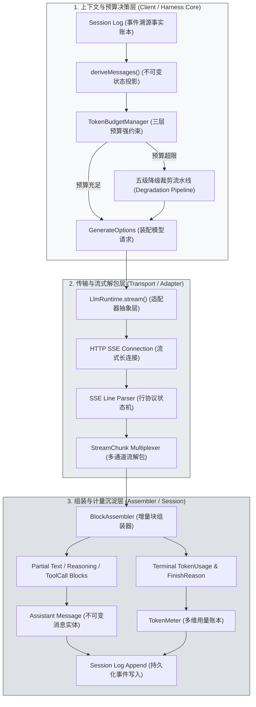
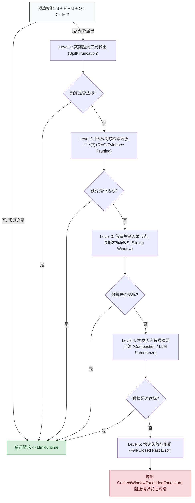
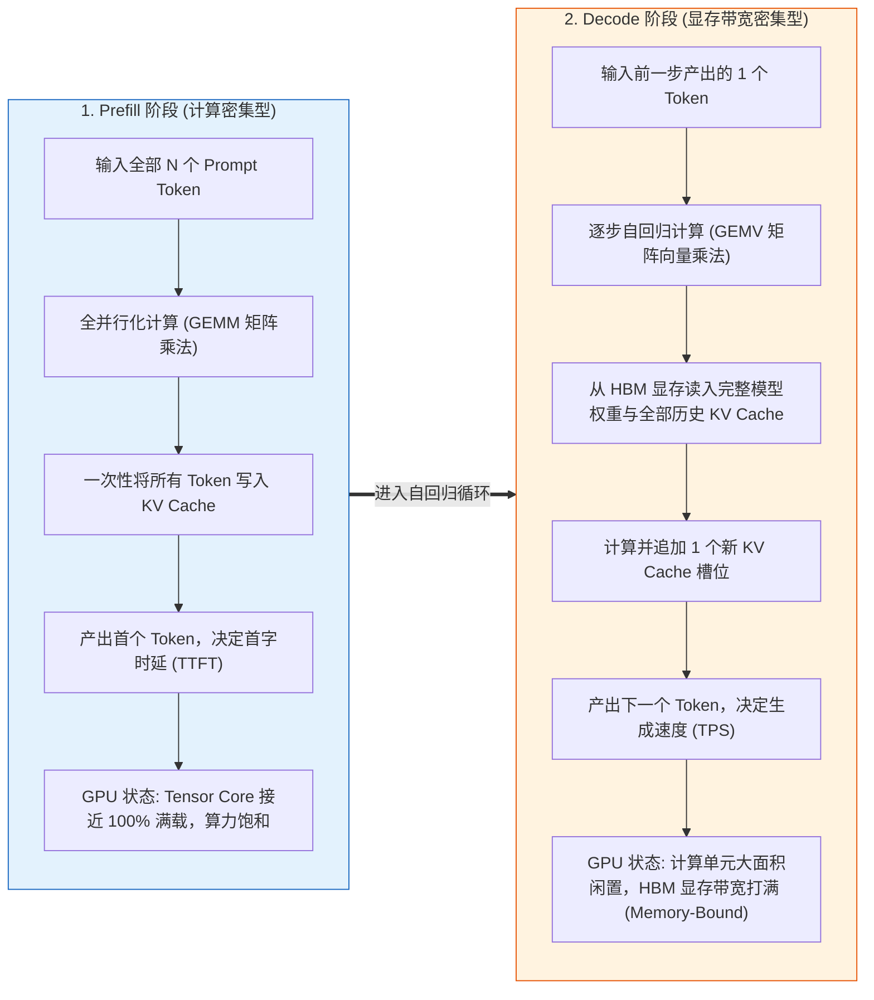
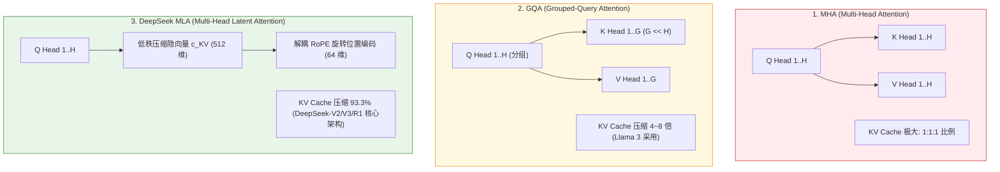
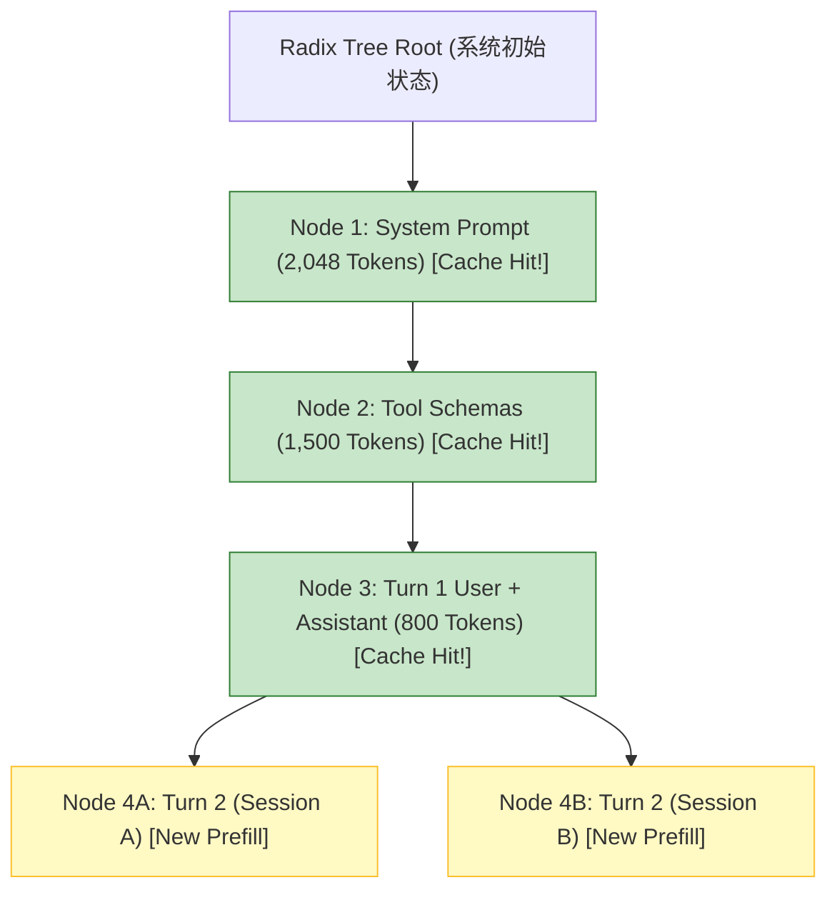
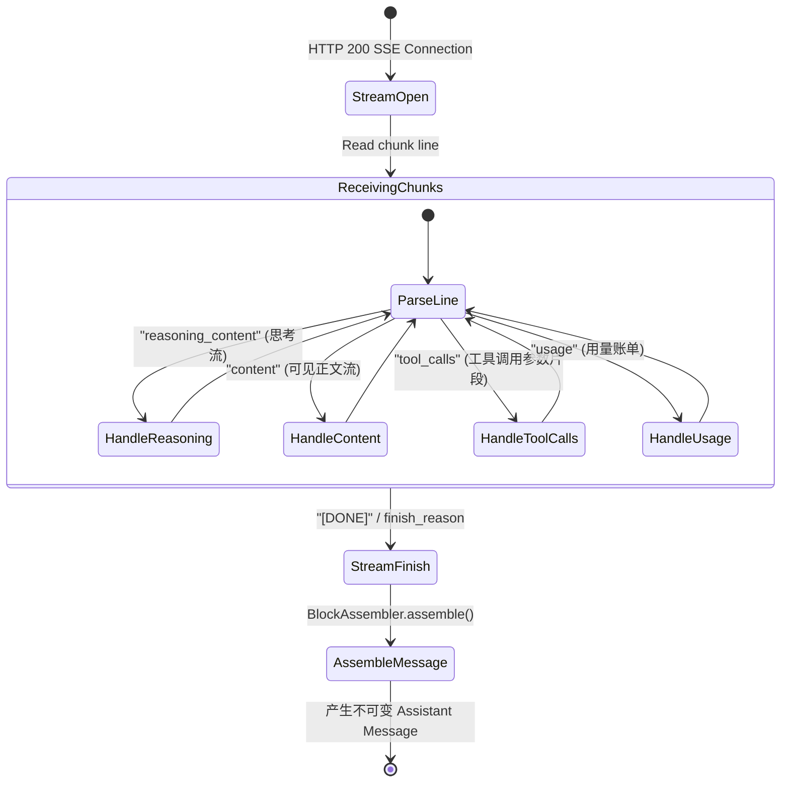
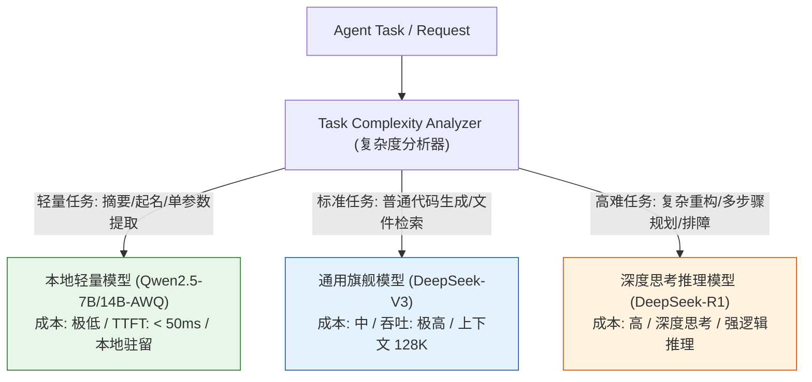
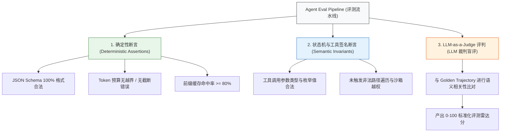

# Chapter 23: Model Requests, Tokens, and KV Cache

English | [中文](23-requests-tokens-kvcache.zh.md)

When building a production agent system, engineers from conventional systems disciplines (C++/Java/Go/Rust/Python/TypeScript) can underestimate LLM calls, treating them as stateless REST/RPC calls that accept and return strings.

In a real production agent runtime, that black-box model leads to system failures: unbounded session history overflows the context window; a prefix-cache miss raises time to first token (TTFT) from tens of milliseconds to seconds; GPU inference service can collapse under VRAM-bandwidth pressure at high concurrency; and truncated streaming chunks can corrupt JSON parsing and trigger retry loops.

This chapter examines the full model-request lifecycle from computer architecture, operating-system memory management, and compiler design. It defines a strict three-layer request-budget inequality, explains compute-bound prefill and bandwidth-bound decode using the Roofline model, derives KV Cache VRAM costs for multi-head attention (MHA) and DeepSeek MLA, and explains radix-tree prefix caching. It also supplies a multi-precision VRAM matrix for models from 7B to 671B parameters, plus production TypeScript examples of a streaming `BlockAssembler`, multidimensional token accounting, dynamic model routing, and a three-layer automated evaluation suite.

---

## 23.1 Learning Goals and Systems-Programming Model

### 23.1.1 Mapping Conventional Systems Concepts to the LLM Runtime

To remove jargon and black-box assumptions, this table maps model-interaction concepts to established systems-engineering, compiler, and operating-system concepts:

| AI / LLM concept | Systems-engineering / OS analogue | Defining behavior and physical resource | Engineering constraint |
| :--- | :--- | :--- | :--- |
| **Token** | Lexical token (`int32` ID) | Fixed-width integer index, usually four bytes, produced by a BPE/Unigram vocabulary | Character-to-token mapping is variable-length (one token $\approx$ 1.5–4 characters). |
| **LLM inference** | Probabilistic pure state-transition function | $f: (S_{\text{context}}) \to P(V)$, side-effect-free matrix computation | No external side effects; each step predicts a distribution over the full vocabulary for the next token. |
| **KV Cache** | Memoization for a dynamic computation graph | VRAM-resident historical key/value tensors of Transformer attention layers | Trades space for time; VRAM use grows linearly or by pages with session length and concurrency. |
| **Prefix Caching** | Shared read-only prefix memory in a radix trie | Page-level VRAM cache of common historical prefix computations across requests | Prefix bytes must match exactly; dynamic changes cause cache misses. |
| **Prefill** | Batch-parallel compile/vector computation (compute-bound) | GEMM matrix multiplication uses GPU Tensor Core throughput | High compute utilization; duration increases linearly or quadratically with input length. |
| **Decode** | Sequential byte-by-byte interpretation (memory-bound) | GEMV matrix-vector multiplication limited by VRAM read bandwidth (GB/s) | Often low compute utilization; throughput depends on bandwidth and concurrent batch size. |
| **Function Calling** | Declarative RPC contract and AST deserialization | JSON Schema-constrained decoding and structured text extraction | The model emits call intent (an AST); the host validates and executes it deterministically. |
| **Token Budget** | Process virtual-address-space quota | Hard capacity $C$; exceeding it forces paging, truncation, or failure | Requires staged degradation, not an uncaught runtime overflow. |
| **SSE Streaming** | Asynchronous pipe/stream | Line-protocol text events pushed in chunks (Server-Sent Events) | Handle partial and coalesced network packets, incremental JSON assembly, and graceful abort. |

### 23.1.2 System Topology and End-to-End Data Flow

In DeepSeek Harness, constructing and sending an LLM request, decoding its stream, assembling blocks, and accounting for tokens are separate pipeline stages rather than logic coupled directly to the business loop. The diagram traces the path from session-history projection to the final Assistant message:



---

## 23.2 Three-Layer Request-Budget Constraint and Capacity Planning

A multitasking OS limits process memory using physical RAM and swap, and may kill a process when memory is exhausted. An LLM-driven agent likewise faces a hard context-window limit. If one request exceeds it, the model server returns HTTP 400 (`context_length_exceeded`), interrupting the current agent Turn.

### 23.2.1 Mathematical Model and Context-Budget Inequality

At discrete time $t$, a complete model request contains the system prompt, historical session messages, current-step environment input and tool results, and an output-token reservation.

Define the **three-layer request-budget constraint**:

$$\begin{aligned} S_{\text{sys}} + H_{\text{hist}} + U_{\text{curr}} + O_{\text{out}} \le C_{\text{limit}} - M_{\text{safety}} \end{aligned}$$

The terms are:
- $S_{\text{sys}} \in \mathbb{N}^+$: Tokens for the system prompt and global tool schemas (static prefix).
- $H_{\text{hist}} \in \mathbb{N}$: Tokens for historical session messages (dynamic history).
- $U_{\text{curr}} \in \mathbb{N}^+$: Current user instruction, environment metadata, and latest tool results (current context).
- $O_{\text{out}} \in \mathbb{N}^+$: Explicit maximum output-token reservation, including reasoning and tool calls.
- $C_{\text{limit}} \in \mathbb{N}^+$: Maximum physical context window of the selected model architecture, such as 64K or 128K.
- $M_{\text{safety}} \in \mathbb{N}^+$: Safety margin for tokenizer estimation error and special control tokens.

#### Properties and Priority of Budget Components

```text
+-------------------------------------------------------------------------------+
| Total Physical Context Window (C_limit = 131,072 Tokens)                      |
+-------------------+-------------------+-------------------+-------------------+
| S_sys (Base)      | H_hist (History)  | U_curr (Current)  | O_out (Output)    |
| ~3,000 Tokens     | Elastic (0~100K)  | ~4,000 Tokens     | Reserved (8,192)  |
| [Priority: HIGHEST| [Priority: LOW]   | [Priority: HIGH]  | [Priority: HIGHEST|
|  IMMUTABLE]       |  EVICTION TARGET  |  CAUSAL ANCHOR    |  PREVENT TRUNC]   |
+-------------------+-------------------+-------------------+-------------------+
                                                            | M_safety (512)    |
                                                            +-------------------+
```

- **Layer 1: Immutable base ($S_{\text{sys}}$ and $O_{\text{out}}$)**: $S_{\text{sys}}$ holds the agent's identity, safety rules, sandbox permission limits, and JSON Schemas for tools. Do not trim it arbitrarily: without tool schemas the model cannot call tools. $O_{\text{out}}$ reserves space for output. If $C_{\text{limit}} - S_{\text{sys}} - H_{\text{hist}} - U_{\text{curr}} < O_{\text{out}}$, generation hits the context ceiling and truncates (`finish_reason = "length"`), possibly leaving incomplete JSON or a malformed tool call that crashes downstream parsing.
- **Layer 2: Immediate causality ($U_{\text{curr}}$)**: The current user instruction or most recent Tool Result is the model's direct basis for its next decision.
- **Layer 3: Elastic history ($H_{\text{hist}}$)**: As agent Turns accumulate, history grows linearly or even superlinearly when it contains large command outputs. It is the primary target for degradation when budgets overflow.

### 23.2.2 Five-Stage Degradation Pipeline

If $S_{\text{sys}} + H_{\text{hist}} + U_{\text{curr}} + O_{\text{out}} > C_{\text{limit}} - M_{\text{safety}}$, the system must neither send a malformed request nor simply fail. It must use a deterministic five-stage degradation pipeline:



#### Technical Details of Each Degradation Stage

- **Level 1 (spill truncation of large tool output)**: Inspect `tool-result` blocks in $U_{\text{curr}}$ and $H_{\text{hist}}$. For text above a per-block threshold such as 4,000 tokens—a `git log` or large file read, for example—remove the middle, retain the first and last 50 lines, and insert `[... truncated 12,450 bytes by harness spill policy ...]`.
- **Level 2 (evidence pruning)**: If external RAG documents or auxiliary code definitions were injected, drop retrieved blocks from lowest relevance upward, retaining the core prompt.
- **Level 3 (recent-causality sliding window)**: Keep the first session Turn (initial user intent) and the most recent $K$ Turns, usually $K \ge 3$. From intervening Turns, remove tool-execution details and retain only call signatures and success/failure status.
- **Level 4 (lossy historical compaction)**: Use a dedicated small, fast model or background task to combine intermediate history into a dense structured `SummaryBlock`, reducing a tens-of-thousands-token conversation to a 500-token state description.
- **Level 5 (fail closed)**: If the first four stages still cannot fit the request—for example, one user input contains 200 KB of code—throw `ContextWindowExceededException` in the client, end the Turn, prevent an invalid network request, and protect the backend model instance.

### 23.2.3 Production-Grade TypeScript Budget Controller

The following is a complete implementation of `TokenBudgetManager` in the DeepSeek Harness architecture, including type derivation, token estimation, and five degradation stages:

```typescript
/**
 * @file token-budget-manager.ts
 * @description 工业级 LLM 请求 Token 预算强约束控制器与多级降级管道
 */

import { ContentBlock, Message, ToolSchema } from '@deepseek-ai/dsh-llm';

export interface TokenBudgetConfig {
  /** 目标模型物理上下文总容量 (Tokens) */
  readonly contextLimit: number;
  /** 预留给模型生成输出的最大 Token 数量 */
  readonly maxOutputTokens: number;
  /** 防估算误差与控制字符的安全冗余边际 (默认 512) */
  readonly safetyMargin: number;
  /** 单个工具输出允许的最大 Token 上限 (超过则触发 Level 1 截断) */
  readonly maxToolResultTokens: number;
}

export interface BudgetAllocation {
  readonly systemTokens: number;
  readonly historyTokens: number;
  readonly currentTokens: number;
  readonly reservedOutputTokens: number;
  readonly totalCalculated: number;
  readonly availableCapacity: number;
  readonly isOverflow: boolean;
}

export class ContextWindowExceededException extends Error {
  constructor(
    public readonly requiredTokens: number,
    public readonly limitTokens: number,
    message: string
  ) {
    super(`[TokenBudget] 上下文预算彻底耗尽: 需求 ${requiredTokens} Tokens, 上限 ${limitTokens} Tokens. 详情: ${message}`);
    this.name = 'ContextWindowExceededException';
  }
}

/**
 * 高性能 Token 快速估算器 (基于中英混合 BPE 启发式加权统计)
 */
export class FastTokenEstimator {
  /**
   * 估算纯文本的 Token 开销
   * 规则: ASCII 字符按 ~3.8 字符/Token 计算; CJK 字符与特殊标点按 ~0.75 字符/Token (即 1 字符 ≈ 1.33 Tokens)
   */
  public static estimateText(text: string): number {
    if (!text || text.length === 0) return 0;

    let asciiCount = 0;
    let nonAsciiCount = 0;

    for (let i = 0; i < text.length; i++) {
      const code = text.charCodeAt(i);
      if (code <= 127) {
        asciiCount++;
      } else {
        nonAsciiCount++;
      }
    }

    const asciiTokens = Math.ceil(asciiCount / 3.8);
    const nonAsciiTokens = Math.ceil(nonAsciiCount * 1.33);
    return Math.max(1, asciiTokens + nonAsciiTokens);
  }

  public static estimateBlock(block: ContentBlock): number {
    switch (block.type) {
      case 'text':
      case 'reasoning':
        return this.estimateText(block.text);
      case 'tool-call':
        return 10 + this.estimateText(block.name) + this.estimateText(block.arguments);
      case 'tool-result': {
        let sum = 5;
        for (const subBlock of block.content) {
          sum += this.estimateBlock(subBlock);
        }
        return sum;
      }
      case 'image':
        return 1024;
      default:
        return 0;
    }
  }

  public static estimateMessage(msg: Message): number {
    let total = 4;
    for (const block of msg.content) {
      total += this.estimateBlock(block);
    }
    return total;
  }

  public static estimateToolSchema(tools?: ToolSchema[]): number {
    if (!tools || tools.length === 0) return 0;
    return this.estimateText(JSON.stringify(tools));
  }
}

/**
 * 生产级 Token 预算控制器
 */
export class TokenBudgetManager {
  private readonly config: TokenBudgetConfig;

  constructor(config: TokenBudgetConfig) {
    if (config.contextLimit <= 0 || config.maxOutputTokens <= 0) {
      throw new Error('上下文上限与最大输出配额必须为正整数');
    }
    if (config.maxOutputTokens + config.safetyMargin >= config.contextLimit) {
      throw new Error('输出配额与安全边际之和不得超过上下文物理上限');
    }
    this.config = { ...config };
  }

  /**
   * 执行预算强约束检查与五级降级裁剪流水线
   */
  public planAndEnforce(
    systemPrompt: string | undefined,
    tools: ToolSchema[] | undefined,
    history: Message[],
    currentMessage: Message
  ): {
    systemPrompt?: string;
    tools?: ToolSchema[];
    history: Message[];
    currentMessage: Message;
    allocation: BudgetAllocation;
  } {
    const safetyLimit = this.config.contextLimit - this.config.safetyMargin;
    const systemTokens = FastTokenEstimator.estimateText(systemPrompt || '') + FastTokenEstimator.estimateToolSchema(tools);
    const reservedOutput = this.config.maxOutputTokens;

    let currentWorkingMsg = structuredClone(currentMessage);
    let workingHistory = structuredClone(history);

    // 初始预算评估
    let allocation = this.calculateAllocation(systemTokens, workingHistory, currentWorkingMsg, reservedOutput);

    if (!allocation.isOverflow) {
      return { systemPrompt, tools, history: workingHistory, currentMessage: currentWorkingMsg, allocation };
    }

    // ==========================================
    // Level 1: 裁剪超大工具输出 (Spill Truncation)
    // ==========================================
    currentWorkingMsg = this.truncateToolResultsInMessage(currentWorkingMsg, this.config.maxToolResultTokens);
    workingHistory = workingHistory.map(msg => this.truncateToolResultsInMessage(msg, this.config.maxToolResultTokens));
    allocation = this.calculateAllocation(systemTokens, workingHistory, currentWorkingMsg, reservedOutput);
    if (!allocation.isOverflow) {
      return { systemPrompt, tools, history: workingHistory, currentMessage: currentWorkingMsg, allocation };
    }

    // ==========================================
    // Level 2: 裁剪历史中的非核心块 (如中间思考流 reasoning 块)
    // ==========================================
    workingHistory = this.stripReasoningBlocksFromHistory(workingHistory);
    allocation = this.calculateAllocation(systemTokens, workingHistory, currentWorkingMsg, reservedOutput);
    if (!allocation.isOverflow) {
      return { systemPrompt, tools, history: workingHistory, currentMessage: currentWorkingMsg, allocation };
    }

    // ==========================================
    // Level 3: 滑动窗口裁剪 (保留首轮意图与最近因果)
    // ==========================================
    workingHistory = this.applySlidingWindow(workingHistory, systemTokens, currentWorkingMsg, reservedOutput, safetyLimit);
    allocation = this.calculateAllocation(systemTokens, workingHistory, currentWorkingMsg, reservedOutput);
    if (!allocation.isOverflow) {
      return { systemPrompt, tools, history: workingHistory, currentMessage: currentWorkingMsg, allocation };
    }

    // ==========================================
    // Level 4: 强行截断当前超长输入 (若当前单条消息极大)
    // ==========================================
    currentWorkingMsg = this.truncateCurrentMessage(currentWorkingMsg, safetyLimit - systemTokens - reservedOutput);
    allocation = this.calculateAllocation(systemTokens, workingHistory, currentWorkingMsg, reservedOutput);
    if (!allocation.isOverflow) {
      return { systemPrompt, tools, history: workingHistory, currentMessage: currentWorkingMsg, allocation };
    }

    // ==========================================
    // Level 5: 熔断与快速失败 (Fail-Closed)
    // ==========================================
    throw new ContextWindowExceededException(
      allocation.totalCalculated,
      this.config.contextLimit,
      `系统配置无法容纳当前会话最小不可变基底 (System=${systemTokens}, Current=${allocation.currentTokens}, Output=${reservedOutput})`
    );
  }

  private calculateAllocation(
    systemTokens: number,
    history: Message[],
    currentMsg: Message,
    reservedOutput: number
  ): BudgetAllocation {
    let historyTokens = 0;
    for (const msg of history) {
      historyTokens += FastTokenEstimator.estimateMessage(msg);
    }
    const currentTokens = FastTokenEstimator.estimateMessage(currentMsg);
    const totalCalculated = systemTokens + historyTokens + currentTokens + reservedOutput;
    const safetyLimit = this.config.contextLimit - this.config.safetyMargin;

    return {
      systemTokens,
      historyTokens,
      currentTokens,
      reservedOutputTokens: reservedOutput,
      totalCalculated,
      availableCapacity: Math.max(0, safetyLimit - totalCalculated),
      isOverflow: totalCalculated > safetyLimit,
    };
  }

  private truncateToolResultsInMessage(msg: Message, maxTokens: number): Message {
    const updatedContent = msg.content.map(block => {
      if (block.type !== 'tool-result') return block;

      const subBlocks = block.content.map(sub => {
        if (sub.type !== 'text') return sub;
        const est = FastTokenEstimator.estimateText(sub.text);
        if (est <= maxTokens) return sub;

        const keepLen = Math.floor(maxTokens * 1.5);
        const head = sub.text.slice(0, keepLen);
        const tail = sub.text.slice(-keepLen);
        const truncatedText = `${head}\n\n[... ⚠️ Harness 自动截断: 原始输出过长 (${sub.text.length} 字节)，已丢弃中间部分 ...]\n\n${tail}`;

        return { type: 'text' as const, text: truncatedText };
      });

      return { ...block, content: subBlocks };
    });

    return { ...msg, content: updatedContent };
  }

  private stripReasoningBlocksFromHistory(history: Message[]): Message[] {
    return history.map(msg => ({
      ...msg,
      content: msg.content.filter(b => b.type !== 'reasoning')
    }));
  }

  private applySlidingWindow(
    history: Message[],
    systemTokens: number,
    currentMsg: Message,
    reservedOutput: number,
    safetyLimit: number
  ): Message[] {
    if (history.length <= 2) return history;

    const initialPrompt = history[0];
    const restHistory = history.slice(1);

    const availableForHistory = safetyLimit - systemTokens - FastTokenEstimator.estimateMessage(currentMsg) - reservedOutput - FastTokenEstimator.estimateMessage(initialPrompt);
    if (availableForHistory <= 0) {
      return [initialPrompt];
    }

    const pruned: Message[] = [];
    let accumulatedTokens = 0;

    for (let i = restHistory.length - 1; i >= 0; i--) {
      const msg = restHistory[i];
      const msgTokens = FastTokenEstimator.estimateMessage(msg);
      if (accumulatedTokens + msgTokens <= availableForHistory) {
        pruned.unshift(msg);
        accumulatedTokens += msgTokens;
      } else {
        break;
      }
    }

    return [initialPrompt, ...pruned];
  }

  private truncateCurrentMessage(msg: Message, maxAllowedTokens: number): Message {
    if (maxAllowedTokens <= 100) return msg;

    const updatedContent = msg.content.map(block => {
      if (block.type === 'text') {
        const est = FastTokenEstimator.estimateText(block.text);
        if (est > maxAllowedTokens) {
          const keepChars = Math.floor(maxAllowedTokens * 2.5);
          return {
            type: 'text' as const,
            text: block.text.slice(0, keepChars) + '\n\n[... 输入被强制截断以满足模型物理上下文限制 ...]'
          };
        }
      }
      return block;
    });

    return { ...msg, content: updatedContent };
  }
}
```

---

## 23.3 Prefill and Decode: From the Roofline Model to Inference Scheduling

A common mistake in high-performance agent infrastructure is treating LLM inference latency as one linear black box. In fact, a complete Transformer autoregressive request has two phases with different hardware behavior: **Prefill (prompt encoding)** and **Decode (token-by-token autoregressive generation)**.

### 23.3.1 Compute-Bound Prefill versus VRAM-Bandwidth-Bound Decode

Understanding each phase's physical bottleneck is necessary for throughput optimization, concurrency planning, and lower time to first token (TTFT):



### 23.3.2 Operational Intensity and the Roofline Model

In computer architecture, the **Roofline model** estimates an algorithm's performance ceiling on a processor. Its principal measure is **operational intensity ($I$)**: floating-point operations (FLOPs) performed for each byte transferred from memory:

$$I = \frac{\text{Total floating-point operations (FLOPs)}}{\text{Total VRAM traffic (Bytes)}} \quad (\text{unit: FLOPs/Byte})$$

Let peak processor throughput be $P_{\text{peak}}$ (TFLOPS) and physical VRAM bandwidth be $B_{\text{mem}}$ (GB/s). The critical operational intensity is $I_{\text{critical}} = \frac{P_{\text{peak}}}{B_{\text{mem}}}$.

- If $I \ge I_{\text{critical}}$, execution is **compute-bound** and can reach $P_{\text{peak}}$.
- If $I < I_{\text{critical}}$, execution is **memory-bandwidth-bound**, with performance ceiling $P = I \times B_{\text{mem}}$.

#### Hardware Comparison: Common NVIDIA Inference GPUs

| GPU | Dense FP16/BF16 throughput ($P_{\text{peak}}$) | HBM / GDDR bandwidth ($B_{\text{mem}}$) | Critical intensity $I_{\text{critical}}$ | Typical deployment |
| :--- | :--- | :--- | :--- | :--- |
| **RTX 4090 (24GB)** | 165 TFLOPS (FP16 Tensor) | 1,008 GB/s (GDDR6X) | **163.7 FLOPs/Byte** | Local single-request debugging / edge inference |
| **NVIDIA A100 (80GB SXM)** | 312 TFLOPS (FP16 Tensor) | 2,039 GB/s (HBM2e) | **153.0 FLOPs/Byte** | Concurrent production service |
| **NVIDIA H100 (80GB SXM)** | 989 TFLOPS (FP16 Tensor) | 3,350 GB/s (HBM3) | **295.2 FLOPs/Byte** | Large production clusters / MoE inference |

#### Deriving Decode Operational Intensity

Consider one Decode step for a standard dense Transformer with $P$ parameters and batch size $B = 1$. It performs $2P$ FLOPs and reads $2P$ bytes of FP16 weights. Thus Decode intensity is:

$$I_{\text{decode}} = \frac{2P \text{ FLOPs}}{2P \text{ Bytes}} = 1.0 \text{ FLOPs/Byte}$$

For NVIDIA A100, $I_{\text{decode}} = 1.0 \ll I_{\text{critical}} (153.0 \text{ FLOPs/Byte})$. At batch size one, an intensity of 1.0 means Tensor Core utilization is below **1%**, while GPU compute cores spend more than 99% of the time waiting on VRAM transfers.

### 23.3.3 End-to-End Latency: Mathematical Models for TTFT and TPS

The two performance metrics most relevant to agent interaction are TTFT and TPS.

#### 1. TTFT Model

For input length $L_{\text{prompt}}$, compute-bound Prefill costs $2 \cdot P \cdot L_{\text{prompt}}$ operations:

$$\text{TTFT} = T_{\text{network}} + \frac{2 \cdot P \cdot L_{\text{prompt}}}{P_{\text{peak}} \cdot \eta_{\text{compute}}} + T_{\text{kv\_alloc}}$$

Here $\eta_{\text{compute}}$ is actual GPU compute utilization, typically 40%–60%.

#### 2. TPS Model

For a model with $P$ parameters quantized at $Q$ bytes per parameter (for example, $Q = 2$ for FP16 or $Q = 0.5$ for INT4), the theoretical maximum single-request generation rate on hardware with bandwidth $B_{\text{mem}}$ is:

$$\text{TPS}_{\text{single}} = \frac{B_{\text{mem}}}{P \cdot Q} \cdot \eta_{\text{bandwidth}}$$

Here $\eta_{\text{bandwidth}}$ is actual VRAM-bus utilization, typically 70%–85%.

#### Worked Example: DeepSeek-V3 Decode TPS on Eight H100 GPUs (671B MoE, 37B Active)

- Model: 671B parameters total, but only 37B activate for each token in the MoE architecture ($P_{\text{active}} = 37 \times 10^9$).
- Precision: FP8, so $Q = 1$ byte per parameter and each step transfers $37 \text{ GB}$ of active weights.
- Bandwidth: Eight H100 SXM GPUs at 3,350 GB/s each, interconnected by NVLink, yield aggregate bandwidth $8 \times 3,350 = 26,800 \text{ GB/s}$. Assume tensor-parallel efficiency $\eta_{\text{bandwidth}} = 0.75$.
- Theoretical single-request rate: $\text{TPS} = \frac{26,800 \times 0.75}{37} \approx \mathbf{543 \text{ Tokens/Second}}$.

### 23.3.4 Server Scheduling: Chunked Prefill and Continuous Batching

In early LLM servers, a long Prefill request could stall other requests already in Decode, creating a decode bubble, lower TPS, and severe jitter. Modern inference engines use two scheduling methods:
- **Continuous Batching (iteration-level scheduling)**: Replace request-level batching with scheduling on each token iteration. Completed requests leave the batch and release VRAM after each Decode step; newly arrived requests fill free slots.
- **Chunked Prefill**: Divide a long prompt, such as 32K tokens, into fixed chunks, such as 512 tokens. On each inference iteration, the scheduler batches one Prefill chunk with several concurrent Decode requests. This maintains Tensor Core use and prevents a long Prefill from blocking Decode for an extended period.

---

## 23.4 KV Cache VRAM Accounting and Prefix Caching

When generating token $t$ autoregressively, Transformer attention computes dot products with key and value vectors for all earlier tokens $1 \sim t-1$. Without saved results, every new token would require recomputing the preceding forward pass at $O(N^2)$ cost. **KV Cache trades VRAM for time by retaining historical key/value matrices in memory, reducing per-step Decode computation to $O(1)$**.

### 23.4.1 Self-Attention Memoization: MHA, MQA, GQA, and MLA

As network depth and context windows grow, KV Cache can consume more VRAM than the model weights. Four architecture stages address this cost:



### 23.4.2 KV Cache VRAM Formulas and Worked Calculations

#### 1. Standard MHA / GQA VRAM Formula

For a model with $n_{\text{layers}}$ layers, $n_{\text{kv\_heads}}$ KV heads per layer, and head dimension $d_{\text{head}}$, at context length $L$, batch size $B$, and $b_{\text{elem}}$ bytes per element:

$$M_{\text{KV\_Cache}} = 2 \times n_{\text{layers}} \times n_{\text{kv\_heads}} \times d_{\text{head}} \times b_{\text{elem}} \times B \times L \quad (\text{Bytes})$$

#### 2. DeepSeek MLA (Multi-Head Latent Attention) VRAM Formula

DeepSeek-V3/R1 uses MLA, storing only low-rank latent vector $c_t^{KV} \in \mathbb{R}^{d_c}$ and separate RoPE position vector $k_t^R \in \mathbb{R}^{d_R}$ in VRAM:

$$M_{\text{KV\_MLA}} = n_{\text{layers}} \times (d_c + d_R) \times b_{\text{elem}} \times B \times L \quad (\text{Bytes})$$

For DeepSeek-V3, $n_{\text{layers}} = 61$, $d_c = 512$, and $d_R = 64$.

#### Worked Comparison: Per-Token KV Cache in Llama-3-70B (GQA) and DeepSeek-V3 (MLA)

- **Llama-3-70B (GQA)**: $M_{\text{token}} = 2 \times 80 \times 8 \times 128 \times 2 \text{ Bytes} = \mathbf{320 \text{ KB / Token}}$. At $L = 128\text{K}$, one request consumes $\mathbf{40.0 \text{ GB}}$ of VRAM.
- **DeepSeek-V3 (MLA)**: $M_{\text{token}} = 61 \times (512 + 64) \times 2 \text{ Bytes} = \mathbf{68.625 \text{ KB / Token}}$. At $L = 128\text{K}$, one request consumes only $\mathbf{8.58 \text{ GB}}$ of VRAM.
- **Conclusion**: MLA **reduces KV Cache VRAM for long contexts by 78.5%**.

### 23.4.3 Prefix Consistency and Radix-Tree / Hash-Trie Caching

Each agent-loop iteration resends prior history to the model. Modern inference services use **Prefix Caching**, typically backed by a VRAM-resident **radix tree**:



For each new request, the inference engine finds the longest shared path in the radix tree:
- **Cached tree nodes**: Reuse KV Cache for matching prefix tokens, **skipping Prefill computation**.
- **Compute only the branch delta**: The GPU prefills only a short newly appended token suffix.
- **Billing benefit**: The DeepSeek API discounts cache-hit input tokens substantially, typically to 10%–20% of ordinary input price, and TTFT can fall from seconds to tens of milliseconds.

### 23.4.4 Prompt Memory Sensitivity: Why Dynamic Timestamps Must Not Lead the System Prompt

The radix-tree matching mechanism explains a critical rule: **never put a dynamic timestamp, random UUID, or session ID at the beginning of the system prompt.**

#### Failure Example: Cache Collapse from a Leading Dynamic Value

Suppose the system prompt begins with `Current Time: 2026-08-25T16:28:25.104Z`.
- **Physical effect**: A millisecond timestamp changes the first ten tokens on every request. The radix tree misses from token zero, invalidating cached computations for tens of thousands of otherwise shared system-prompt and tool-schema tokens. TTFT rises by a factor of 50 and billing by a factor of 10.
- **Prefix-friendly layout**: Order content from immutable base (system role and tool schemas), to moderately changing project structure and history, to frequently changing trailing slots (recent tool output and current date).

---

## 23.5 Local Model Choice and Multi-Precision Quantization VRAM Accounting

Private deployment, compliance, and offline use can require hosting open models such as DeepSeek-R1-Distill, Qwen-2.5, or Llama-3 on private servers. The crucial architecture question is: **How many GPUs, and how much VRAM per GPU, are needed for the required concurrency and context length?**

### 23.5.1 Components of VRAM Use

An LLM inference server's GPU memory is the sum of four components:

$$M_{\text{total\_vram}} = M_{\text{weights}} + M_{\text{kv\_cache}}(B, L) + M_{\text{activations}} + M_{\text{cuda\_overhead}}$$

- **Model weights ($M_{\text{weights}}$)**: Independent of concurrency and context; determined by parameter count and precision: $M_{\text{weights}} = P \times \text{Bytes\_Per\_Param} \times 1.05$.
- **KV Cache ($M_{\text{kv\_cache}}$)**: Grows with maximum concurrency $B$ and allocated context length $L$ per request.
- **Activations and temporary workspace ($M_{\text{activations}}$)**: Scratchpad VRAM for large Prefill matrix multiplications, typically **1.5 GB–4.0 GB**.
- **CUDA runtime and context overhead ($M_{\text{cuda\_overhead}}$)**: Fixed CUDA driver, NCCL buffer, and PyTorch context costs; reserve **0.8 GB–1.5 GB** per GPU.

### 23.5.2 VRAM Matrix for 7B / 14B / 32B / 70B / 671B Models

The following table estimates **physical VRAM requirements** in GB for production model sizes and precisions at different concurrency $B$ and context length $L$:

| Model size and architecture | Precision | Bytes per parameter | Weight VRAM ($M_{\text{weights}}$) | VRAM at $B=1, L=4\text{K}$ | VRAM at $B=8, L=16\text{K}$ | VRAM at $B=32, L=64\text{K}$ | Suggested hardware topology |
| :--- | :--- | :--- | :--- | :--- | :--- | :--- | :--- |
| **7B dense**<br>(for example, Qwen2.5-7B) | FP16<br>INT8<br>INT4 (AWQ) | 2.0 B<br>1.0 B<br>0.5 B | 14.7 GB<br>7.4 GB<br>3.9 GB | 17.5 GB<br>9.8 GB<br>5.8 GB | 28.2 GB<br>18.5 GB<br>13.6 GB | 88.5 GB<br>62.3 GB<br>45.8 GB | 1x RTX 4090 (24G) for INT4/INT8<br>1x A100 (80G) for high-concurrency FP16 |
| **14B dense**<br>(for example, Qwen2.5-14B) | FP16<br>INT8<br>INT4 (AWQ) | 2.0 B<br>1.0 B<br>0.5 B | 29.4 GB<br>14.7 GB<br>7.8 GB | 33.2 GB<br>18.1 GB<br>10.5 GB | 48.6 GB<br>29.8 GB<br>20.1 GB | 128.4 GB<br>85.6 GB<br>62.4 GB | 1x RTX 4090 for INT4<br>2x RTX 4090 or 1x A100 for INT8/FP16 |
| **32B dense**<br>(for example, Qwen2.5-32B) | FP16<br>INT8<br>INT4 (AWQ) | 2.0 B<br>1.0 B<br>0.5 B | 67.2 GB<br>33.6 GB<br>17.8 GB | 73.1 GB<br>38.5 GB<br>21.8 GB | 98.4 GB<br>58.2 GB<br>36.5 GB | 215.0 GB<br>142.0 GB<br>98.6 GB | 1x A100 (80G) for INT8<br>2x A100 / 4x RTX 4090 for FP16 |
| **70B dense**<br>(for example, Llama-3.3-70B) | FP16<br>FP8<br>INT4 (AWQ) | 2.0 B<br>1.0 B<br>0.5 B | 147.0 GB<br>73.5 GB<br>38.8 GB | 155.2 GB<br>80.1 GB<br>43.8 GB | 218.4 GB<br>122.5 GB<br>72.4 GB | 498.0 GB<br>285.0 GB<br>168.0 GB | 2x A100/H100 (80G) for FP8<br>4x A100 (80G) for FP16 |
| **671B MoE**<br>(DeepSeek-V3/R1<br>37B active, MLA) | FP8 (native)<br>INT4 (quantized) | 1.0 B<br>0.5 B | 705.0 GB<br>360.0 GB | 725.0 GB<br>375.0 GB | 768.0 GB<br>410.0 GB | 980.0 GB<br>550.0 GB | **Standard: one node with 8x H800/H100 (80G)** (native FP8 parallelism)<br>Small cluster: 4x A100 80G (INT4) |

### 23.5.3 Quantization Principles and Accuracy Tradeoffs

When VRAM is constrained, quantization maps high-precision floating-point tensors to lower-bit integer or floating-point representations:
- **FP16 / BF16 (lossless baseline)**: IEEE 754 standard 16-bit floating point, preserving full dynamic range and precision with stable computation but high VRAM use.
- **FP8 (E4M3 / E5M2)**: An eight-bit floating-point format natively supported by modern Hopper/Ada architectures. DeepSeek-V3 uses FP8 mixed-precision training and inference, roughly halving weight VRAM and doubling matrix-multiplication throughput with almost **no accuracy loss**.
- **INT8 (SmoothQuant / W8A8)**: Smoothly scale activations and quantize both weights and activations to eight-bit integers, producing high inference throughput with usually less than $0.5\%$ accuracy loss.
- **INT4 (AWQ / GPTQ / GGUF)**: AWQ examines activation distributions and protects the most salient 1% of weights while quantizing the rest to four bits, retaining strong code-generation and reasoning performance.

---

## 23.6 Streaming Parsing, BlockAssembler, and Multidimensional Token Accounting

Production agent runtimes should not wait for a model call's complete synchronous response. To show users the reasoning stream, display generated text in real time, and inspect structured tool-call arguments, they use **Server-Sent Events (SSE)** and a state machine that assembles fragmented chunks into immutable message entities.

### 23.6.1 SSE Protocol and a Multichannel Chunk-Unpacking State Machine

The server's SSE stream usually follows a line protocol. A request to a reasoning model such as DeepSeek-R1 with tool calls can interleave several event types:



#### Example Raw SSE Messages

```http
HTTP/1.1 200 OK
Content-Type: text/event-stream; charset=utf-8
Transfer-Encoding: chunked

data: {"id":"chatcmpl-01","choices":[{"index":0,"delta":{"role":"assistant","reasoning_content":"首先分析"}}]}

data: {"id":"chatcmpl-01","choices":[{"index":0,"delta":{"reasoning_content":"用户的代码上下文..."}}]}

data: {"id":"chatcmpl-01","choices":[{"index":0,"delta":{"content":"我将使用 `read_file` 工具"}}]}

data: {"id":"chatcmpl-01","choices":[{"index":0,"delta":{"tool_calls":[{"index":0,"id":"call_99x","type":"function","function":{"name":"read_file","arguments":"{\"path\":"}}]}}]}

data: {"id":"chatcmpl-01","choices":[{"index":0,"delta":{"tool_calls":[{"index":0,"function":{"arguments":"\"/src/app.ts\"}"}}]}}]}

data: {"id":"chatcmpl-01","choices":[{"index":0,"delta":{},"finish_reason":"tool_calls"}],"usage":{"prompt_tokens":2150,"prompt_cache_hit_tokens":2048,"completion_tokens":85,"completion_tokens_details":{"reasoning_tokens":45}}}

data: [DONE]
```

### 23.6.2 Complete Production `BlockAssembler` and Interleaved-Block Assembly

The following `BlockAssembler` implementation in DeepSeek Harness handles out-of-order streaming data and incremental argument truncation while supporting safe AbortSignal cancellation:

```typescript
/**
 * @file block-assembler.ts
 * @description 工业级流式 Chunk 增量消息组装器
 */

import { ContentBlock, Message, TokenUsage, StreamChunk, FinishReason, CallId } from '@deepseek-ai/dsh-llm';

interface PartialBlock {
  blockType: 'text' | 'reasoning' | 'tool-call' | 'image';
  text: string;
  toolCallId?: CallId;
  toolCallName?: string;
  toolCallArguments: string;
  isComplete: boolean;
}

export class BlockAssembler {
  private readonly partials = new Map<number, PartialBlock>();
  private readonly blockOrder: number[] = [];
  private _usage: TokenUsage | undefined;
  private _finishReason: FinishReason | undefined;
  private _isAborted = false;

  /**
   * 将一个原始 StreamChunk 推入组装状态机
   */
  public push(chunk: StreamChunk): void {
    if (this._isAborted) return;

    switch (chunk.type) {
      case 'block-start': {
        if (!this.partials.has(chunk.index)) {
          this.blockOrder.push(chunk.index);
          this.partials.set(chunk.index, {
            blockType: chunk.blockType as any,
            text: '',
            toolCallArguments: '',
            isComplete: false,
          });
        }
        break;
      }

      case 'text-delta': {
        const partial = this.ensureBlock(chunk.index, 'text');
        if (!partial.isComplete) {
          partial.text += chunk.text;
        }
        break;
      }

      case 'reasoning-delta': {
        const partial = this.ensureBlock(chunk.index, 'reasoning');
        if (!partial.isComplete) {
          partial.text += chunk.text;
        }
        break;
      }

      case 'tool-call-delta': {
        const partial = this.ensureBlock(chunk.index, 'tool-call');
        if (!partial.isComplete) {
          if (chunk.id) partial.toolCallId = chunk.id;
          if (chunk.name) partial.toolCallName = (partial.toolCallName || '') + chunk.name;
          if (chunk.argumentsDelta) partial.toolCallArguments += chunk.argumentsDelta;
        }
        break;
      }

      case 'block-end': {
        const partial = this.partials.get(chunk.index);
        if (partial) {
          partial.isComplete = true;
        }
        break;
      }

      case 'usage': {
        this._usage = { ...chunk.usage };
        break;
      }

      case 'finish': {
        this._finishReason = chunk.reason;
        break;
      }
    }
  }

  /**
   * 标记流已被外部 AbortSignal 中断
   */
  public abort(): void {
    this._isAborted = true;
    this._finishReason = 'aborted';
  }

  /**
   * 获取当前已组装好的所有完整/部分内容块列表
   */
  public getBlocks(): ContentBlock[] {
    const blocks: ContentBlock[] = [];

    for (const index of this.blockOrder) {
      const p = this.partials.get(index);
      if (!p) continue;

      if (p.blockType === 'text') {
        if (p.text.length > 0 || p.isComplete) {
          blocks.push({ type: 'text', text: p.text });
        }
      } else if (p.blockType === 'reasoning') {
        if (p.text.length > 0 || p.isComplete) {
          blocks.push({ type: 'reasoning', text: p.text });
        }
      } else if (p.blockType === 'tool-call') {
        blocks.push({
          type: 'tool-call',
          id: p.toolCallId || (`call_synthetic_${index}` as CallId),
          name: p.toolCallName || 'unknown_tool',
          arguments: p.toolCallArguments,
        });
      }
    }

    return blocks;
  }

  /**
   * 构建最终的不可变 Assistant 消息实体
   */
  public toAssistantMessage(provider: string, model: string): Message {
    return {
      id: `msg_${Date.now()}_${Math.random().toString(36).slice(2, 9)}` as any,
      role: 'assistant',
      content: this.getBlocks(),
      source: {
        kind: 'model',
        provider,
        model,
      } as any,
    };
  }

  public get usage(): TokenUsage | undefined {
    return this._usage;
  }

  public get finishReason(): FinishReason {
    return this._finishReason || 'stop';
  }

  private ensureBlock(index: number, type: 'text' | 'reasoning' | 'tool-call'): PartialBlock {
    let block = this.partials.get(index);
    if (!block) {
      this.blockOrder.push(index);
      block = {
        blockType: type,
        text: '',
        toolCallArguments: '',
        isComplete: false,
      };
      this.partials.set(index, block);
    }
    return block;
  }
}
```

### 23.6.3 Token Accounting by Field

The `usage` payload returned by the official DeepSeek API or a self-hosted inference cluster has several distinct fields. **Do not collapse all tokens into one `total_tokens` figure**; account for each separately:

```typescript
export interface TokenUsage {
  /** 未命中缓存的实际计算输入 Token 数 (Billed Uncached Input) */
  inputTokens: number;
  /** 生成的可见文本 Token 数量 (Visible Output) */
  outputTokens: number;
  /** 命中前缀缓存的输入 Token 数 (Cache Hit Tokens，享受 90% 折扣) */
  cacheReadTokens?: number;
  /** 写入前缀缓存的输入 Token 数 (Cache Creation Tokens) */
  cacheWriteTokens?: number;
  /** 模型生成的内部思考链 Token 数 (Thinking / Reasoning Tokens) */
  reasoningTokens?: number;
}
```

#### Billing and Performance Formulas

$$\begin{aligned} \text{Billable input} &= \text{inputTokens} \times 1.0 + \text{cacheReadTokens} \times 0.1 \\ \text{Total output} &= \text{outputTokens} + \text{reasoningTokens} \\ \text{Prefix cache-hit rate} &= \frac{\text{cacheReadTokens}}{\text{inputTokens} + \text{cacheReadTokens}} \times 100\% \end{aligned}$$

---

## 23.7 Dynamic Model Routing and Automated Evaluation Design

No single model is ideal for every enterprise agent task. Using a 671B reasoning model for session titles, code completion, or parameter extraction wastes time and money; using a small model for complex planning, architecture, or tool composition increases logical errors.

### 23.7.1 Three-Dimensional Routing Matrix: Cost, Complexity, and Latency



### 23.7.2 Production TypeScript Routing Decision (`ModelRouter`)

```typescript
/**
 * @file model-router.ts
 * @description 生产级三维智能动态模型路由分发器
 */

export interface ModelRouteTarget {
  provider: string;
  model: string;
  reasoningEffort?: 'low' | 'medium' | 'high';
  temperature: number;
}

export type TaskPurpose = 'conversation' | 'code-refactor' | 'compaction' | 'session-title' | 'complex-planning';

export interface RouteContext {
  purpose: TaskPurpose;
  estimatedTokens: number;
  requiresReasoning: boolean;
  userExplicitModel?: string;
}

export class ModelRouter {
  public selectRoute(context: RouteContext): ModelRouteTarget {
    // 1. 用户显式指定优先
    if (context.userExplicitModel) {
      return {
        provider: 'deepseek',
        model: context.userExplicitModel,
        temperature: 0.0,
      };
    }

    // 2. 辅助型微小任务 -> 路由至本地轻量小模型
    if (context.purpose === 'session-title' || context.purpose === 'compaction') {
      return {
        provider: 'local-vllm',
        model: 'qwen-2.5-7b-instruct-awq',
        temperature: 0.3,
      };
    }

    // 3. 复杂规划与长程逻辑排错 -> 路由至 DeepSeek-R1 深度思考模型
    if (context.requiresReasoning || context.purpose === 'complex-planning' || context.purpose === 'code-refactor') {
      return {
        provider: 'deepseek',
        model: 'deepseek-reasoner', // DeepSeek-R1
        reasoningEffort: 'high',
        temperature: 0.0,
      };
    }

    // 4. 普通交互对话与日常工具循环 -> 路由至 DeepSeek-V3
    return {
      provider: 'deepseek',
      model: 'deepseek-chat', // DeepSeek-V3
      temperature: 0.5,
    };
  }
}
```

### 23.7.3 Automated Evaluation Pipeline

To assess model-request health and detect prompt degradation, use three layers of automated evaluation:



#### Production Example of an Automated Evaluation Runner

```typescript
/**
 * @file eval-runner.ts
 * @description 工业级 Agent 确定性与语义 Eval 评测套件
 */

import { Message, ToolCallBlock } from '@deepseek-ai/dsh-llm';
import { FastTokenEstimator } from './token-budget-manager.ts';

export interface TestCase {
  id: string;
  description: string;
  inputPrompt: string;
  expectedToolCalls: Array<{ name: string; requiredArgs: string[] }>;
  maxAllowedTokens: number;
}

export interface EvalResult {
  testId: string;
  passed: boolean;
  score: number; // 0 ~ 100
  deterministicChecks: {
    schemaValid: boolean;
    tokenBudgetCompliant: boolean;
    toolCallMatched: boolean;
  };
  details: string;
}

export class AgentEvalRunner {
  public evaluateTurn(testCase: TestCase, assistantMessage: Message, tokenUsage?: { totalTokens: number }): EvalResult {
    const blocks = assistantMessage.content;
    const toolCalls = blocks.filter((b): b is ToolCallBlock => b.type === 'tool-call');

    // 1. 确定性检查: JSON Schema 解析与合法性
    let schemaValid = true;
    for (const tc of toolCalls) {
      try {
        JSON.parse(tc.arguments);
      } catch {
        schemaValid = false;
        break;
      }
    }

    // 2. Token 预算检查
    const actualTokens = tokenUsage?.totalTokens ?? FastTokenEstimator.estimateMessage(assistantMessage);
    const tokenBudgetCompliant = actualTokens <= testCase.maxAllowedTokens;

    // 3. 工具签名匹配检查
    let toolCallMatched = true;
    for (const exp of testCase.expectedToolCalls) {
      const match = toolCalls.find(tc => tc.name === exp.name);
      if (!match) {
        toolCallMatched = false;
        break;
      }
      try {
        const parsed = JSON.parse(match.arguments);
        for (const reqArg of exp.requiredArgs) {
          if (!(reqArg in parsed)) {
            toolCallMatched = false;
            break;
          }
        }
      } catch {
        toolCallMatched = false;
      }
    }

    const passed = schemaValid && tokenBudgetCompliant && toolCallMatched;
    const score = (schemaValid ? 30 : 0) + (tokenBudgetCompliant ? 30 : 0) + (toolCallMatched ? 40 : 0);

    return {
      testId: testCase.id,
      passed,
      score,
      deterministicChecks: {
        schemaValid,
        tokenBudgetCompliant,
        toolCallMatched,
      },
      details: passed ? '所有断言完全通过' : `校验失败: Schema=${schemaValid}, Budget=${tokenBudgetCompliant}, Tools=${toolCallMatched}`,
    };
  }
}
```

---

## 23.8 Production Incidents and Pitfalls

### 23.8.1 Incident 1: A Leading Timestamp Collapses Prefix Caching and Inflates Bills

- **Incident**: A team adds `Date.now().toISOString()` to the first line of the system prompt so the model "knows the current time." After release, the daily API bill rises from an expected \$200 to \$2,400, while the gateway frequently returns 504 upstream timeouts.
- **Root cause**: Because the prompt prefix changes on every call, the DeepSeek API radix-tree cache-hit rate falls from 92% to **zero**. The server recomputes Prefill for tens of thousands of tokens, raising TTFT from 80 ms to 4,500 ms and losing a 90% input-token discount.
- **Fix**: Remove the timestamp from the global system-prompt prefix. Append the current date to each user message instead, at day precision (`YYYY-MM-DD`) rather than milliseconds.

### 23.8.2 Incident 2: A Broken SSE Chunk Corrupts Tool-Call JSON and Triggers a Loop

- **Incident**: The TCP connection drops while streaming tool-call `arguments`. `BlockAssembler` receives incomplete JSON, such as `{"filePath": "/src/inde`, and downstream `JSON.parse()` throws a SyntaxError. The agent misclassifies the transport failure as model-output failure and enters an endless retry-error loop.
- **Root cause**: The assembler exposes incomplete text to the tool executor on stream termination (`finishReason === 'aborted'`) without checking an `isComplete` terminal flag.
- **Fix**: Add an `isComplete` barrier and a fault-tolerant streaming JSON parser to `BlockAssembler`. If the stream breaks and `finishReason !== 'stop'`, do not execute a tool; roll back or throw a clear `StreamInterruptedException`.

### 23.8.3 Incident 3: KV Cache VRAM Oversubscription Causes Inference-Service Collapse

- **Incident**: A self-hosted vLLM node serves a 70B model with `gpu_memory_utilization = 0.95` and 64 concurrent sessions. Several sessions begin long code analyses at 64K context. GPU stalls become frequent, average TPS falls from 80 to 4, and some requests report `Engine out of memory`.
- **Root cause**: KV Cache VRAM is severely oversubscribed. The PagedAttention pool runs out of blocks and swaps some requests' KV Cache to host CPU memory, then back across PCIe for computation. PCIe 4.0 supplies only 32 GB/s against HBM's 2,000 GB/s, causing severe **VRAM thrashing**.
- **Fix**: Reduce maximum concurrency $B$ from 64 to 24 and reserve physical KV blocks using the VRAM formula. Enable Chunked Prefill to smooth transient activation-VRAM demand.

---

## 23.9 Summary and Architecture Checklist

### 23.9.1 Core Architectural Principles

1. **The three-layer budget inequality is a hard limit**: Maintain $S_{\text{sys}} + H_{\text{hist}} + U_{\text{curr}} + O_{\text{out}} \le C_{\text{limit}} - M_{\text{safety}}$. Stages 1–5 turn context management into deterministic memory allocation.
2. **Inference has two physical phases**: Prefill is compute-bound and affects TTFT; Decode is bandwidth-bound and affects TPS. A single Decode stream uses less than 1% of peak compute, so higher aggregate throughput requires concurrent batching.
3. **Prefix consistency is essential**: KV Cache optimization depends on Prefix Caching. Keep leading prompt bytes static and immutable; exclude dynamic random values.
4. **Account for VRAM first**: For local models, budget $M_{\text{weights}} + M_{\text{kv\_cache}} + M_{\text{activations}} + M_{\text{cuda}}$ and calculate capacity before selecting hardware.

### 23.9.2 Production Readiness Checklist

- [ ] **Budget gate**: Does the client enforce `TokenBudgetManager` with degradation stages 1–5?
- [ ] **Prefix alignment**: Is the start of the system prompt free of dynamic timestamps, random IDs, and dynamic user data?
- [ ] **Stable tool schemas**: Is the JSON Schema order for model-visible tools fixed, avoiding prefix-hash changes from unordered Map iteration?
- [ ] **Streaming integrity**: Does `BlockAssembler` handle network disconnects and `AbortSignal` without dispatching partial tool calls?
- [ ] **Detailed usage accounting**: Are `inputTokens`, `cacheReadTokens`, `outputTokens`, and `reasoningTokens` logged separately?
- [ ] **Route separation**: Do auxiliary tasks such as titling and compaction use separate model endpoints from main tasks?
