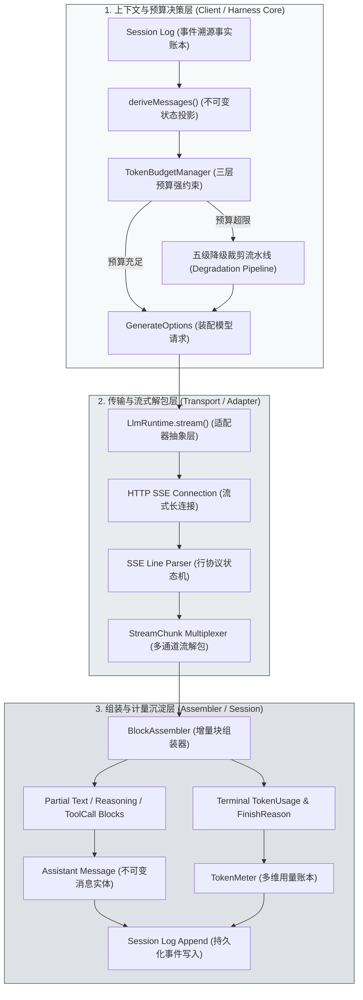
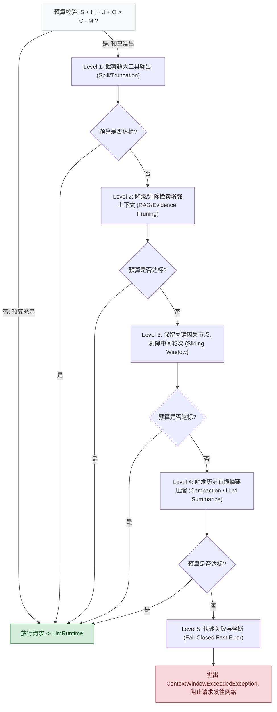
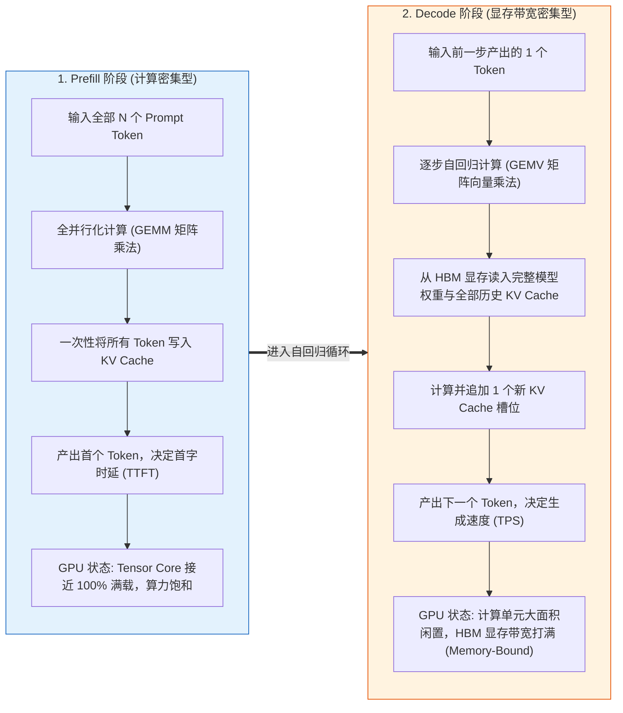
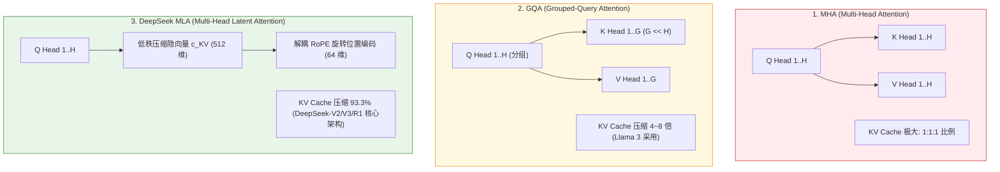
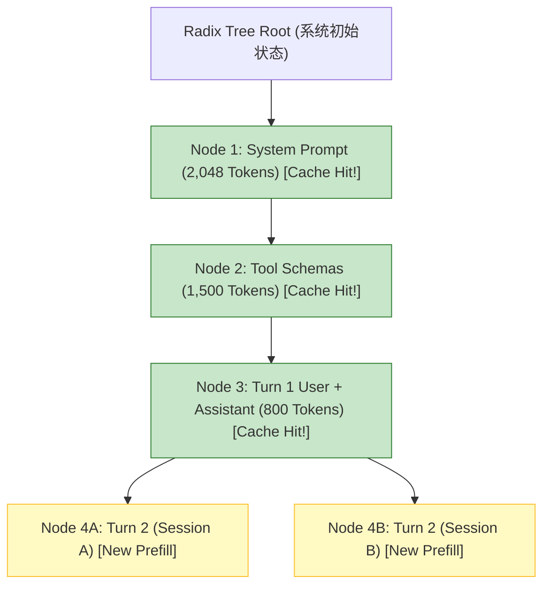
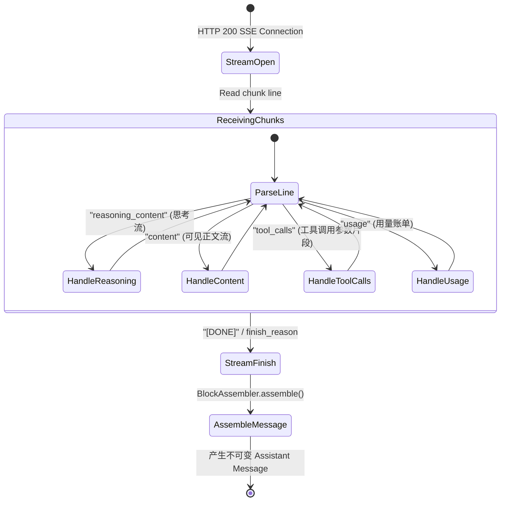
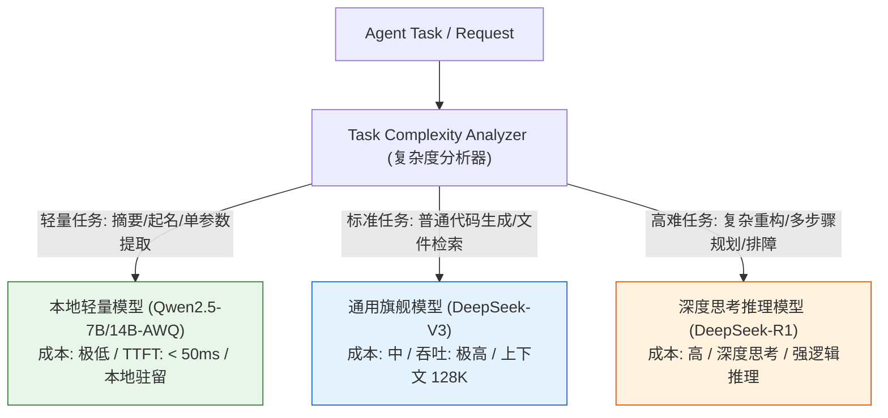
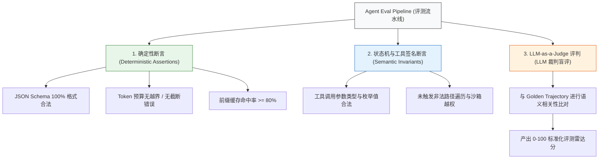

# 第 23 章：模型请求、token 与 KV Cache

[English](23-requests-tokens-kvcache.md) | 中文

在构建工业级智能体（Agent）系统时，许多拥有传统系统工程背景（C++/Java/Go/Rust/Python/TypeScript）的工程师初涉大模型领域时，往往容易产生一种危险的轻视心理，将大语言模型（LLM）调用简单地视为一个接收字符串并返回字符串的远程无状态 REST/RPC API。

然而在真实的生产级 Agent 运行时中，这种黑盒认知会迅速引发严重的系统性工程灾难：会话历史无界膨胀导致的物理上下文溢出（Context Window Overflow）；由于未对齐前缀（Prefix Cache Miss）导致的首字时延（TTFT）从数十毫秒飙升至数秒；高并发场景下因显存带宽耗尽而引发的 GPU 推理服务雪崩；以及因流式 Chunk 截断导致 JSON 语法解析崩溃引发的死循环。

本章将从底层计算体系结构、操作系统内存管理与编译原理的硬核视角，彻底拆解大模型请求的完整生命周期。我们将建立严格的三层请求预算强约束方程，深入剖析计算密集型（Prefill）与显存带宽密集型（Decode）阶段的物理本质与 Roofline 模型，严密推导多头注意力（MHA）与 DeepSeek MLA 架构下的 KV Cache 显存占用与基数树前缀缓存（Prefix Caching）机理，并提供覆盖 7B 到 671B 全尺寸模型的多精度量化显存精算矩阵。最后，我们将通过工业级 TypeScript 代码实现流式解析组装器（`BlockAssembler`）、多维 Token 计量器、动态模型路由策略以及三层自动化 Eval 评测集。

---

## 23.1 本章学习目标与系统编程心智模型

### 23.1.1 概念映射表：从传统系统工程到 LLM 运行时

为了消除 AI 领域的流行语泡沫与黑盒神秘感，本教程将所有模型交互相关的核心概念，映射到传统系统工程、编译器设计与操作系统底层的经典实体中：

| AI / LLM 领域概念 | 传统系统工程 / 操作系统映射 | 核心特征与物理实体 | 关键设计红线与工程约束 |
| :--- | :--- | :--- | :--- |
| **Token** | 词法单元（Lexical Token / `int32` ID） | BPE/Unigram 词表映射后的定长整数编码（通常为 4 字节整数） | 严格单向映射，字符与 Token 之间非定长映射（1 Token $\approx$ 1.5~4 字符） |
| **LLM 推理** | 概率型状态转移纯函数 | $f: (S_{\text{context}}) \to P(V)$，无副作用的矩阵计算 | 无外部副作用，单步仅预测下一个 Token 的全词表概率分布 |
| **KV Cache** | 动态计算图的记忆化缓存（Memoization） | Transformer 注意力层历史 Key/Value 张量的显存常驻结构 | 空间换时间；显存占用随会话长度与并发线性/分块增长 |
| **Prefix Caching** | 基数树前缀只读共享内存（Radix Trie） | 跨请求共享公共历史前缀计算结果的 Page 级显存缓存 | 要求前缀字节流绝对逐字节一致；动态变化会导致缓存击穿 |
| **Prefill 阶段** | 批量并行编译/向量化计算（Compute-Bound） | GEMM 矩阵乘法，充分榨干 GPU Tensor Core 算力 | 算力利用率高，耗时与输入长度的平方或线性正相关 |
| **Decode 阶段** | 逐字节顺序解释执行（Memory-Bound） | GEMV 矩阵向量乘法，受限于显存读取带宽（GB/s） | 算力闲置严重，吞吐量完全受限于显存带宽与并发 Batch 大小 |
| **Function Calling** | 声明式 RPC 契约与 AST 反序列化 | 基于 JSON Schema 的受限语法解码与结构化文本提取 | 模型只产出调用意图（AST），宿主负责确定性校验与执行 |
| **Token Budget** | 进程虚拟地址空间配额（Memory Limit） | 硬性容量上限 $C$，超限将触发强制分页、裁剪或崩溃 | 必须具备多级优雅降级策略，禁止依赖未捕获的运行时溢出 |
| **SSE Streaming** | 异步管道流（Async Pipe / Stream） | 基于行协议的文本事件分块推送机制（Server-Sent Events） | 需处理网络半包、粘包、增量 JSON 拼接与优雅中断（Abort） |

### 23.1.2 本章系统拓扑与全景数据流

在 DeepSeek Harness 架构中，LLM 请求的构造、发送、流式解包、组装和 Token 统计并非直接耦合在业务循环中，而是通过严格的分层管道流动。下图展示了从会话历史投影到最终生成 Assistant 消息的全景数据链路：



---

## 23.2 三层请求预算强约束方程与容量规划

在现代多任务操作系统中，进程分配内存受到物理内存与 Swap 分区的严格限制；当进程虚拟内存耗尽时，内核 OOM Killer 会直接强制终止该进程。在 LLM 驱动的 Agent 系统中，大模型的上下文窗口（Context Window）是一道不可动摇的物理硬上限。任何单次请求如果超出上下文上限，模型服务端将返回不可恢复的 HTTP 400（`context_length_exceeded`），直接造成当前 Agent 轮次（Turn）中断。

### 23.2.1 基础数学模型与上下文预算不等式

在任何一个离散时间步 $t$，发送给大模型的完整 Payload 由系统提示词（System Prompt）、历史会话消息序列（History Messages）、当前步骤环境输入/工具执行结果（User/Tool Context）以及为模型预留的最大输出配额（Reserved Output Tokens）共同构成。

我们定义**三层请求预算强约束方程**如下：

$$\begin{aligned} S_{\text{sys}} + H_{\text{hist}} + U_{\text{curr}} + O_{\text{out}} \le C_{\text{limit}} - M_{\text{safety}} \end{aligned}$$

其中各变量的工程定义为：
- $S_{\text{sys}} \in \mathbb{N}^+$：系统提示词与全局 Tool Schemas 占用的 Token 数量（静态前缀区）。
- $H_{\text{hist}} \in \mathbb{N}$：会话历史消息列表占用的 Token 数量（动态历史区）。
- $U_{\text{curr}} \in \mathbb{N}^+$：当前轮次用户指令、环境元数据及最新工具执行结果（当前上下文）。
- $O_{\text{out}} \in \mathbb{N}^+$：显式分配给模型生成输出的最大配额（Max Output Tokens，含思考与工具调用）。
- $C_{\text{limit}} \in \mathbb{N}^+$：目标模型架构支持的最大物理上下文窗口（如 64K、128K）。
- $M_{\text{safety}} \in \mathbb{N}^+$：系统安全边际（Safety Margin，防 Tokenizer 估算误差与特殊控制字符开销）。

#### 预算各分量的系统工程属性与优先级

```text
+-------------------------------------------------------------------------------+
| Total Physical Context Window (C_limit = 131,072 Tokens)                      |
+-------------------+-------------------+-------------------+-------------------+
| S_sys (Base)      | H_hist (History)  | U_curr (Current)  | O_out (Output)    |
| ~3,000 Tokens     | Elastic (0~100K)  | ~4,000 Tokens     | Reserved (8,192)  |
| [Priority: HIGHEST| [Priority: LOW]   | [Priority: HIGH]  | [Priority: HIGHEST|
|  IMMUTABLE]       |  EVICTION TARGET  |  CAUSAL ANCHOR    |  PREVENT TRUNC]   |
+-------------------+-------------------+-------------------+-------------------+
                                                            | M_safety (512)    |
                                                            +-------------------+
```

- **第一层：不可变基底（Immutable Base）—— $S_{\text{sys}}$ 与 $O_{\text{out}}$**：$S_{\text{sys}}$ 包含核心 Agent 身份、安全准则、沙箱权限边界与工具定义的 JSON Schema。这一部分是 Agent 运行的基石，严禁随意裁剪。若工具 Schema 丢失，模型将丧失调用能力。$O_{\text{out}}$ 是必须为模型留出的输出缓冲区。如果 $C_{\text{limit}} - S_{\text{sys}} - H_{\text{hist}} - U_{\text{curr}} < O_{\text{out}}$，模型将在生成过程中因为撞击上下文天花板而被截断（`finish_reason = "length"`），输出不完整的 JSON 或畸变的工具调用，直接导致下游解析器崩溃。
- **第二层：当前轮次因果链（Immediate Causality）—— $U_{\text{curr}}$**：包含当前用户下达的指令，或者刚执行完毕的 Tool Result。这是模型当前决策的最直接依据。
- **第三层：弹性历史（Elastic History）—— $H_{\text{hist}}$**：随着 Agent 迭代轮次的增加，$H_{\text{hist}}$ 会呈现线性甚至超线性（当包含大量命令输出时）膨胀。$H_{\text{hist}}$ 是预算溢出时的主要治理与降级对象。

### 23.2.2 五级渐进式降级裁剪流水线（Degradation Pipeline）

当系统检测到 $S_{\text{sys}} + H_{\text{hist}} + U_{\text{curr}} + O_{\text{out}} > C_{\text{limit}} - M_{\text{safety}}$ 时，绝对不能直接将畸形请求发送给模型，也不能直接粗暴报错，而是必须执行确定性的五级渐进式降级流水线：



#### 降级层级详细技术规范

- **Level 1（裁剪超大工具输出 - Spill Truncation）**：遍历 $U_{\text{curr}}$ 与 $H_{\text{hist}}$ 中的 `tool-result` 块。对于超过单块阈值（如 4000 Tokens）的文本输出（如 `git log`、超大代码文件读取结果），截断其中间内容，保留头 50 行与尾 50 行，并注入截断标记 `[... truncated 12,450 bytes by harness spill policy ...]`。
- **Level 2（检索证据裁剪 - Evidence Pruning）**：若上下文中注入了外挂知识库（RAG）的检索文档或辅助代码定义，按相关性得分从低到高丢弃检索块，只保留核心 Prompt。
- **Level 3（保留最近因果的滑动窗口 - Sliding Window）**：固定保留会话的第一轮（用户初始意图）与最近 $K$ 轮（通常 $K \ge 3$），将中间轮次的工具执行细节剔除，仅保留工具调用的签名与执行状态（成功/失败）。
- **Level 4（触发历史有损摘要压缩 - Compaction）**：调用专用的小型快速模型或后台微任务，将中间的历史记录聚合为一段致密的结构化摘要（`SummaryBlock`），将原本耗费数万 Token 的对话折叠为 500 Token 的状态描述。
- **Level 5（防御性拒绝服务 - Fail-Closed）**：若经过前四级处理后依然超出安全阈值（例如用户单次输入了 200KB 的超长代码），系统直接在客户端抛出 `ContextWindowExceededException` 异常，终止当前轮次，阻止无效网络请求并保护后端模型实例。

### 23.2.3 生产级 TypeScript 预算控制器实现

以下是 DeepSeek Harness 核心架构中 `TokenBudgetManager` 的完整工业级实现，具备完整的类型推导、Token 估算器与五级降级策略：

```typescript
/**
 * @file token-budget-manager.ts
 * @description 工业级 LLM 请求 Token 预算强约束控制器与多级降级管道
 */

import { ContentBlock, Message, ToolSchema } from '@deepseek-ai/dsh-llm';

export interface TokenBudgetConfig {
  /** 目标模型物理上下文总容量 (Tokens) */
  readonly contextLimit: number;
  /** 预留给模型生成输出的最大 Token 数量 */
  readonly maxOutputTokens: number;
  /** 防估算误差与控制字符的安全冗余边际 (默认 512) */
  readonly safetyMargin: number;
  /** 单个工具输出允许的最大 Token 上限 (超过则触发 Level 1 截断) */
  readonly maxToolResultTokens: number;
}

export interface BudgetAllocation {
  readonly systemTokens: number;
  readonly historyTokens: number;
  readonly currentTokens: number;
  readonly reservedOutputTokens: number;
  readonly totalCalculated: number;
  readonly availableCapacity: number;
  readonly isOverflow: boolean;
}

export class ContextWindowExceededException extends Error {
  constructor(
    public readonly requiredTokens: number,
    public readonly limitTokens: number,
    message: string
  ) {
    super(`[TokenBudget] 上下文预算彻底耗尽: 需求 ${requiredTokens} Tokens, 上限 ${limitTokens} Tokens. 详情: ${message}`);
    this.name = 'ContextWindowExceededException';
  }
}

/**
 * 高性能 Token 快速估算器 (基于中英混合 BPE 启发式加权统计)
 */
export class FastTokenEstimator {
  /**
   * 估算纯文本的 Token 开销
   * 规则: ASCII 字符按 ~3.8 字符/Token 计算; CJK 字符与特殊标点按 ~0.75 字符/Token (即 1 字符 ≈ 1.33 Tokens)
   */
  public static estimateText(text: string): number {
    if (!text || text.length === 0) return 0;

    let asciiCount = 0;
    let nonAsciiCount = 0;

    for (let i = 0; i < text.length; i++) {
      const code = text.charCodeAt(i);
      if (code <= 127) {
        asciiCount++;
      } else {
        nonAsciiCount++;
      }
    }

    const asciiTokens = Math.ceil(asciiCount / 3.8);
    const nonAsciiTokens = Math.ceil(nonAsciiCount * 1.33);
    return Math.max(1, asciiTokens + nonAsciiTokens);
  }

  public static estimateBlock(block: ContentBlock): number {
    switch (block.type) {
      case 'text':
      case 'reasoning':
        return this.estimateText(block.text);
      case 'tool-call':
        return 10 + this.estimateText(block.name) + this.estimateText(block.arguments);
      case 'tool-result': {
        let sum = 5;
        for (const subBlock of block.content) {
          sum += this.estimateBlock(subBlock);
        }
        return sum;
      }
      case 'image':
        return 1024;
      default:
        return 0;
    }
  }

  public static estimateMessage(msg: Message): number {
    let total = 4;
    for (const block of msg.content) {
      total += this.estimateBlock(block);
    }
    return total;
  }

  public static estimateToolSchema(tools?: ToolSchema[]): number {
    if (!tools || tools.length === 0) return 0;
    return this.estimateText(JSON.stringify(tools));
  }
}

/**
 * 生产级 Token 预算控制器
 */
export class TokenBudgetManager {
  private readonly config: TokenBudgetConfig;

  constructor(config: TokenBudgetConfig) {
    if (config.contextLimit <= 0 || config.maxOutputTokens <= 0) {
      throw new Error('上下文上限与最大输出配额必须为正整数');
    }
    if (config.maxOutputTokens + config.safetyMargin >= config.contextLimit) {
      throw new Error('输出配额与安全边际之和不得超过上下文物理上限');
    }
    this.config = { ...config };
  }

  /**
   * 执行预算强约束检查与五级降级裁剪流水线
   */
  public planAndEnforce(
    systemPrompt: string | undefined,
    tools: ToolSchema[] | undefined,
    history: Message[],
    currentMessage: Message
  ): {
    systemPrompt?: string;
    tools?: ToolSchema[];
    history: Message[];
    currentMessage: Message;
    allocation: BudgetAllocation;
  } {
    const safetyLimit = this.config.contextLimit - this.config.safetyMargin;
    const systemTokens = FastTokenEstimator.estimateText(systemPrompt || '') + FastTokenEstimator.estimateToolSchema(tools);
    const reservedOutput = this.config.maxOutputTokens;

    let currentWorkingMsg = structuredClone(currentMessage);
    let workingHistory = structuredClone(history);

    // 初始预算评估
    let allocation = this.calculateAllocation(systemTokens, workingHistory, currentWorkingMsg, reservedOutput);

    if (!allocation.isOverflow) {
      return { systemPrompt, tools, history: workingHistory, currentMessage: currentWorkingMsg, allocation };
    }

    // ==========================================
    // Level 1: 裁剪超大工具输出 (Spill Truncation)
    // ==========================================
    currentWorkingMsg = this.truncateToolResultsInMessage(currentWorkingMsg, this.config.maxToolResultTokens);
    workingHistory = workingHistory.map(msg => this.truncateToolResultsInMessage(msg, this.config.maxToolResultTokens));
    allocation = this.calculateAllocation(systemTokens, workingHistory, currentWorkingMsg, reservedOutput);
    if (!allocation.isOverflow) {
      return { systemPrompt, tools, history: workingHistory, currentMessage: currentWorkingMsg, allocation };
    }

    // ==========================================
    // Level 2: 裁剪历史中的非核心块 (如中间思考流 reasoning 块)
    // ==========================================
    workingHistory = this.stripReasoningBlocksFromHistory(workingHistory);
    allocation = this.calculateAllocation(systemTokens, workingHistory, currentWorkingMsg, reservedOutput);
    if (!allocation.isOverflow) {
      return { systemPrompt, tools, history: workingHistory, currentMessage: currentWorkingMsg, allocation };
    }

    // ==========================================
    // Level 3: 滑动窗口裁剪 (保留首轮意图与最近因果)
    // ==========================================
    workingHistory = this.applySlidingWindow(workingHistory, systemTokens, currentWorkingMsg, reservedOutput, safetyLimit);
    allocation = this.calculateAllocation(systemTokens, workingHistory, currentWorkingMsg, reservedOutput);
    if (!allocation.isOverflow) {
      return { systemPrompt, tools, history: workingHistory, currentMessage: currentWorkingMsg, allocation };
    }

    // ==========================================
    // Level 4: 强行截断当前超长输入 (若当前单条消息极大)
    // ==========================================
    currentWorkingMsg = this.truncateCurrentMessage(currentWorkingMsg, safetyLimit - systemTokens - reservedOutput);
    allocation = this.calculateAllocation(systemTokens, workingHistory, currentWorkingMsg, reservedOutput);
    if (!allocation.isOverflow) {
      return { systemPrompt, tools, history: workingHistory, currentMessage: currentWorkingMsg, allocation };
    }

    // ==========================================
    // Level 5: 熔断与快速失败 (Fail-Closed)
    // ==========================================
    throw new ContextWindowExceededException(
      allocation.totalCalculated,
      this.config.contextLimit,
      `系统配置无法容纳当前会话最小不可变基底 (System=${systemTokens}, Current=${allocation.currentTokens}, Output=${reservedOutput})`
    );
  }

  private calculateAllocation(
    systemTokens: number,
    history: Message[],
    currentMsg: Message,
    reservedOutput: number
  ): BudgetAllocation {
    let historyTokens = 0;
    for (const msg of history) {
      historyTokens += FastTokenEstimator.estimateMessage(msg);
    }
    const currentTokens = FastTokenEstimator.estimateMessage(currentMsg);
    const totalCalculated = systemTokens + historyTokens + currentTokens + reservedOutput;
    const safetyLimit = this.config.contextLimit - this.config.safetyMargin;

    return {
      systemTokens,
      historyTokens,
      currentTokens,
      reservedOutputTokens: reservedOutput,
      totalCalculated,
      availableCapacity: Math.max(0, safetyLimit - totalCalculated),
      isOverflow: totalCalculated > safetyLimit,
    };
  }

  private truncateToolResultsInMessage(msg: Message, maxTokens: number): Message {
    const updatedContent = msg.content.map(block => {
      if (block.type !== 'tool-result') return block;

      const subBlocks = block.content.map(sub => {
        if (sub.type !== 'text') return sub;
        const est = FastTokenEstimator.estimateText(sub.text);
        if (est <= maxTokens) return sub;

        const keepLen = Math.floor(maxTokens * 1.5);
        const head = sub.text.slice(0, keepLen);
        const tail = sub.text.slice(-keepLen);
        const truncatedText = `${head}\n\n[... ⚠️ Harness 自动截断: 原始输出过长 (${sub.text.length} 字节)，已丢弃中间部分 ...]\n\n${tail}`;

        return { type: 'text' as const, text: truncatedText };
      });

      return { ...block, content: subBlocks };
    });

    return { ...msg, content: updatedContent };
  }

  private stripReasoningBlocksFromHistory(history: Message[]): Message[] {
    return history.map(msg => ({
      ...msg,
      content: msg.content.filter(b => b.type !== 'reasoning')
    }));
  }

  private applySlidingWindow(
    history: Message[],
    systemTokens: number,
    currentMsg: Message,
    reservedOutput: number,
    safetyLimit: number
  ): Message[] {
    if (history.length <= 2) return history;

    const initialPrompt = history[0];
    const restHistory = history.slice(1);

    const availableForHistory = safetyLimit - systemTokens - FastTokenEstimator.estimateMessage(currentMsg) - reservedOutput - FastTokenEstimator.estimateMessage(initialPrompt);
    if (availableForHistory <= 0) {
      return [initialPrompt];
    }

    const pruned: Message[] = [];
    let accumulatedTokens = 0;

    for (let i = restHistory.length - 1; i >= 0; i--) {
      const msg = restHistory[i];
      const msgTokens = FastTokenEstimator.estimateMessage(msg);
      if (accumulatedTokens + msgTokens <= availableForHistory) {
        pruned.unshift(msg);
        accumulatedTokens += msgTokens;
      } else {
        break;
      }
    }

    return [initialPrompt, ...pruned];
  }

  private truncateCurrentMessage(msg: Message, maxAllowedTokens: number): Message {
    if (maxAllowedTokens <= 100) return msg;

    const updatedContent = msg.content.map(block => {
      if (block.type === 'text') {
        const est = FastTokenEstimator.estimateText(block.text);
        if (est > maxAllowedTokens) {
          const keepChars = Math.floor(maxAllowedTokens * 2.5);
          return {
            type: 'text' as const,
            text: block.text.slice(0, keepChars) + '\n\n[... 输入被强制截断以满足模型物理上下文限制 ...]'
          };
        }
      }
      return block;
    });

    return { ...msg, content: updatedContent };
  }
}
```

---

## 23.3 Prefill 与 Decode 深度剖析：从 Roofline 模型到推理调度

在编写高性能 Agent 基础设施时，很多工程师常犯的一个错误是将 LLM 推理的耗时简单视为一个线性的黑盒。实际上，Transformer 自回归模型的单次完整请求在底层硬件上被严格划分为完全不同计算特性的两个阶段：**Prefill（预填充 / 提示词编码阶段）**与 **Decode（解码 / 逐 Token 自回归生成阶段）**。

### 23.3.1 计算密集（Prefill）vs 显存带宽密集（Decode）的物理本质

理解这两个阶段的物理瓶颈，是进行吞吐量优化、并发容量规划与降低首字延迟（TTFT）的前提：



### 23.3.2 算力强度（Operational Intensity）与 Roofline 模型推导

在计算机体系结构中，**Roofline 模型**用于评估算法在特定处理器上的性能上限。其核心指标为**算力强度（Operational Intensity, $I$）**，定义为每从内存传输 1 字节（Byte）数据所执行的浮点运算次数（FLOPs）：

$$I = \frac{\text{总浮点运算量 (FLOPs)}}{\text{总显存访问量 (Bytes)}} \quad (\text{单位: FLOPs/Byte})$$

设处理器的峰值算力为 $P_{\text{peak}}$（TFLOPS），显存物理带宽为 $B_{\text{mem}}$（GB/s）。系统的性能拐点临界算力强度为：$I_{\text{critical}} = \frac{P_{\text{peak}}}{B_{\text{mem}}}$。

- 若 $I \ge I_{\text{critical}}$：进入 **Compute-Bound（算力受限区）**，性能达到 $P_{\text{peak}}$。
- 若 $I < I_{\text{critical}}$：进入 **Memory-Bandwidth-Bound（带宽受限区）**，实际性能上限为 $P = I \times B_{\text{mem}}$。

#### 硬件实例参数对比表（NVIDIA 主流推理显卡）

| GPU 型号 | FP16/BF16 稠密算力 ($P_{\text{peak}}$) | HBM / GDDR 显存带宽 ($B_{\text{mem}}$) | 临界算力强度 $I_{\text{critical}}$ | 典型应用定位 |
| :--- | :--- | :--- | :--- | :--- |
| **RTX 4090 (24GB)** | 165 TFLOPS (FP16 Tensor) | 1,008 GB/s (GDDR6X) | **163.7 FLOPs/Byte** | 本地单并发调试 / 边缘推理 |
| **NVIDIA A100 (80GB SXM)** | 312 TFLOPS (FP16 Tensor) | 2,039 GB/s (HBM2e) | **153.0 FLOPs/Byte** | 生产集群并发服务 |
| **NVIDIA H100 (80GB SXM)** | 989 TFLOPS (FP16 Tensor) | 3,350 GB/s (HBM3) | **295.2 FLOPs/Byte** | 超大规模生产集群 / MoE 推理 |

#### Decode 阶段的算力强度严密数学推导

考虑一个标准稠密 Transformer 模型，参数量为 $P$（单位：参数个数），在单批次（Batch Size $B = 1$）下执行一步 Decode：浮点运算量为 $2P$ FLOPs；显存访问量在 FP16 精度下为 $2P$ Bytes。此时 Decode 阶段的算力强度为：

$$I_{\text{decode}} = \frac{2P \text{ FLOPs}}{2P \text{ Bytes}} = 1.0 \text{ FLOPs/Byte}$$

以 NVIDIA A100 为例：$I_{\text{decode}} = 1.0 \ll I_{\text{critical}} (153.0 \text{ FLOPs/Byte})$。在单并发 Decode 时，算力强度仅为 1.0，这意味着 GPU 的 Tensor Core 算力利用率甚至不足 **1%**，超过 99% 的时间 GPU 计算核心都在空转等待显存搬运数据。

### 23.3.3 端到端时延指标：TTFT 与 TPS 的数学建模与手算推导

在 Agent 交互过程中，工程师最关心的两个性能指标是 TTFT 与 TPS。

#### 1. TTFT 数学模型

对于长度为 $L_{\text{prompt}}$ 的输入序列，Prefill 阶段的计算量为 $2 \cdot P \cdot L_{\text{prompt}}$，处于 Compute-Bound 区：

$$\text{TTFT} = T_{\text{network}} + \frac{2 \cdot P \cdot L_{\text{prompt}}}{P_{\text{peak}} \cdot \eta_{\text{compute}}} + T_{\text{kv\_alloc}}$$

其中 $\eta_{\text{compute}}$ 为 GPU 的实际算力利用率（通常在 40%~60% 之间）。

#### 2. TPS 数学模型

对于拥有 $P$ 参数量、采用 $Q$ 字节量化（如 FP16 下 $Q = 2$，INT4 下 $Q = 0.5$）的模型，在显存带宽为 $B_{\text{mem}}$ 的硬件上，单并发理论最大生成速率为：

$$\text{TPS}_{\text{single}} = \frac{B_{\text{mem}}}{P \cdot Q} \cdot \eta_{\text{bandwidth}}$$

其中 $\eta_{\text{bandwidth}}$ 为显存总线实际有效带宽利用率（通常在 70%~85% 之间）。

#### 手算演示：DeepSeek-V3 (671B MoE, 激活 37B) 在 8 卡 H100 节点上的 Decode TPS

- 模型参数：总参数 671B，但采用 MoE 架构，每个 Token 仅激活 37B 参数（$P_{\text{active}} = 37 \times 10^9$）。
- 精度：FP8 量化，每个参数 $Q = 1$ Byte，单步激活权重搬运量为 $37 \text{ GB}$。
- 硬件带宽：8 卡 H100 SXM 集群，单卡带宽 3,350 GB/s，跨卡通过 NVLink 互联，总聚合显存带宽可达 $8 \times 3,350 = 26,800 \text{ GB/s}$。设张量并行有效系数 $\eta_{\text{bandwidth}} = 0.75$。
- 理论单并发 TPS 演算：$\text{TPS} = \frac{26,800 \times 0.75}{37} \approx \mathbf{543 \text{ Tokens/Second}}$。

### 23.3.4 服务端调度创新：Chunked Prefill 与 Continuous Batching

在早期的 LLM 推理服务中，长文本 Prefill 请求的到来会导致正在执行 Decode 的其他请求发生严重的停顿（Decode Bubble），造成 TPS 骤降与严重的抖动。现代推理引擎引入了两大调度机制：
- **Continuous Batching（连续批处理 / 迭代级调度）**：抛弃传统的按请求（Request-Level）批处理，改为按 Token 迭代（Iteration-Level）进行调度。每个 Decode 步结束后，已完成的请求立即移出 Batch 释放显存，新到来的请求随时加入空闲 Slot。
- **Chunked Prefill（分块预填充）**：将一个超长 Prompt（如 32K Tokens）切分为多个固定大小的 Chunk（如 512 Tokens）。在每一次推理迭代中，调度器将一个 512-Token 的 Prefill Chunk 与若干个并发 Decode 请求混合成一个 Batch 进行计算。这样既保证了 GPU Tensor Core 的算力饱和，又消除了超长 Prefill 对 Decode 造成的长时间阻塞。

---

## 23.4 KV Cache 显存精算与前缀缓存（Prefix Caching）

在 Transformer 的自回归生成过程中，计算当前第 $t$ 个 Token 的注意力时，需要与前面所有 $1 \sim t-1$ 个历史 Token 的 Key 和 Value 向量进行点积。如果不保存历史计算结果，每生成一个 Token 就必须对前面所有 Token 重新执行一次前向计算，计算复杂度将高达 $O(N^2)$。**KV Cache 就是以显存空间为代价，将历史 Token 的 Key/Value 矩阵常驻在显存中，使得每一步 Decode 的计算复杂度降低为 $O(1)$**。

### 23.4.1 自注意力机制的记忆化缓存原理（MHA, MQA, GQA 与 MLA）

随着网络深度与上下文窗口的扩大，KV Cache 消耗的显存甚至会迅速超过模型权重本身。为了降低 KV Cache 的显存开销，业界经历了四个架构演进阶段：



### 23.4.2 KV Cache 显存占用数学公式与精确手算

#### 1. 标准 MHA / GQA 显存精算公式

对于拥有 $n_{\text{layers}}$ 层、每层拥有 $n_{\text{kv\_heads}}$ 个 KV 注意力头、每个注意力头维度为 $d_{\text{head}}$ 的模型，当上下文长度为 $L$、批处理大小为 $B$、采用每个元素占用 $b_{\text{elem}}$ 字节的精度时：

$$M_{\text{KV\_Cache}} = 2 \times n_{\text{layers}} \times n_{\text{kv\_heads}} \times d_{\text{head}} \times b_{\text{elem}} \times B \times L \quad (\text{Bytes})$$

#### 2. DeepSeek MLA (Multi-Head Latent Attention) 显存精算公式

DeepSeek-V3 / R1 采用 MLA 机制，在显存中仅存储低秩压缩隐向量 $c_t^{KV} \in \mathbb{R}^{d_c}$ 以及解耦的 RoPE 位置编码向量 $k_t^R \in \mathbb{R}^{d_R}$：

$$M_{\text{KV\_MLA}} = n_{\text{layers}} \times (d_c + d_R) \times b_{\text{elem}} \times B \times L \quad (\text{Bytes})$$

在 DeepSeek-V3 中：$n_{\text{layers}} = 61$，$d_c = 512$，$d_R = 64$。

#### 手算对比：Llama-3-70B (GQA) vs DeepSeek-V3 (MLA) 单 Token KV Cache 开销

- **Llama-3-70B (GQA 架构)**：$M_{\text{token}} = 2 \times 80 \times 8 \times 128 \times 2 \text{ Bytes} = \mathbf{320 \text{ KB / Token}}$。当 $L = 128\text{K}$ 时，单请求显存占用为 $\mathbf{40.0 \text{ GB}}$。
- **DeepSeek-V3 (MLA 架构)**：$M_{\text{token}} = 61 \times (512 + 64) \times 2 \text{ Bytes} = \mathbf{68.625 \text{ KB / Token}}$。当 $L = 128\text{K}$ 时，单请求显存占用仅为 $\mathbf{8.58 \text{ GB}}$。
- **结论**：MLA 架构将长上下文下的 KV Cache 显存开销**直接削减了 78.5%**！

### 23.4.3 前缀一致性与 Radix Tree / Hash Trie 前缀缓存机制

在 Agent 循环中，每一轮迭代都会把上一轮的历史记录重新发送给模型。现代推理服务实现了 **Prefix Caching（前缀缓存）** 技术。其核心数据结构是一个显存中的**基数树（Radix Tree）**：



当新请求到达时，推理引擎沿 Radix Tree 寻找最长公共前缀路径：
- **树节点命中**：已命中的前缀 Token 直接复用显存中的 KV Cache，完全**跳过 Prefill 计算**。
- **仅计算分叉增量**：GPU 仅需对最新产生的一小段增量 Token 执行 Prefill。
- **商业计费优势**：DeepSeek API 对命中缓存的输入 Token 给予大幅折扣（通常仅为普通输入价格的 10%~20%），且 TTFT 从数秒骤降至几十毫秒。

### 23.4.4 提示词工程的内存敏感性：为什么系统提示词开头严禁放动态时间戳

理解了 Radix Tree 的前缀匹配机制后，我们就能从底层体系结构上解释一个极其关键的工程铁律：**为什么系统提示词（System Prompt）开头绝对禁止放置动态时间戳、随机 UUID 或会话 ID！**

#### 灾难案例反思：动态变量置顶的雪崩效应

假设在 System Prompt 的开头写下了如下动态内容：`Current Time: 2026-08-25T16:28:25.104Z`。
- **物理破坏过程**：由于毫秒级时间戳导致前 10 个 Token 每次都不同，Radix Tree 从第 0 个 Token 处直接 Miss，导致后续数万 Token 的公共 System Prompt 与 Tool Schemas 全量缓存失效，TTFT 激增 50 倍，计费激增 10 倍。
- **正确规范（Prefix-Friendly Architecture）**：按照「静态不变基底（系统角色与工具 Schema） $\to$ 中频半静态块（项目结构与历史） $\to$ 尾部高频动态插槽（最新工具输出与当前日期）」的顺序严格排列。

---

## 23.5 本地大模型选型与多精度量化显存精算

在很多企业私有化部署、数据合规或离线场景中，必须在私有服务器上部署开源大模型（如 DeepSeek-R1-Distill、Qwen-2.5、Llama-3 等）。对于传统架构师而言，最关键的问题是：**我需要采购多少张显卡？选用多大显存的 GPU 才能支撑业务的并发与上下文需求？**

### 23.5.1 显存消耗全要素拆解

运行一个 LLM 推理服务时，GPU 显存占用由四个独立部分精确叠加而成：

$$M_{\text{total\_vram}} = M_{\text{weights}} + M_{\text{kv\_cache}}(B, L) + M_{\text{activations}} + M_{\text{cuda\_overhead}}$$

- **模型权重显存（$M_{\text{weights}}$）**：与并发数和上下文无关，仅由参数量与量化精度决定：$M_{\text{weights}} = P \times \text{Bytes\_Per\_Param} \times 1.05$。
- **KV Cache 显存（$M_{\text{kv\_cache}}$）**：与最大并发数 $B$ 和分配给每个请求的最大上下文长度 $L$ 严格正相关。
- **激活值与临时工作区（$M_{\text{activations}}$）**：在 Prefill 阶段进行大矩阵乘法时开辟的临时 Scratchpad 显存，通常需要预留 **1.5 GB ~ 4.0 GB**。
- **CUDA Runtime 与上下文开销（$M_{\text{cuda\_overhead}}$）**：CUDA Driver、NCCL 通信缓冲区与 PyTorch 基础上下文固定开销，每张卡需预留 **0.8 GB ~ 1.5 GB**。

### 23.5.2 7B / 14B / 32B / 70B / 671B 全矩阵显存需求精算表

下表给出了在生产环境中，不同规模模型在不同量化精度下，针对不同并发度（$B$）与上下文长度（$L$）所需的**真实物理显存精算矩阵**（单位：GB）：

| 模型规模与架构 | 精度格式 | 单参数字节 | 纯权重显存 ($M_{\text{weights}}$) | $B=1, L=4\text{K}$ 显存需求 | $B=8, L=16\text{K}$ 显存需求 | $B=32, L=64\text{K}$ 显存需求 | 推荐硬件拓扑 |
| :--- | :--- | :--- | :--- | :--- | :--- | :--- | :--- |
| **7B 稠密模型**<br>(如 Qwen2.5-7B) | FP16<br>INT8<br>INT4 (AWQ) | 2.0 B<br>1.0 B<br>0.5 B | 14.7 GB<br>7.4 GB<br>3.9 GB | 17.5 GB<br>9.8 GB<br>5.8 GB | 28.2 GB<br>18.5 GB<br>13.6 GB | 88.5 GB<br>62.3 GB<br>45.8 GB | 1x RTX 4090 (24G) 跑 INT4/INT8<br>1x A100 (80G) 跑高并发 FP16 |
| **14B 稠密模型**<br>(如 Qwen2.5-14B) | FP16<br>INT8<br>INT4 (AWQ) | 2.0 B<br>1.0 B<br>0.5 B | 29.4 GB<br>14.7 GB<br>7.8 GB | 33.2 GB<br>18.1 GB<br>10.5 GB | 48.6 GB<br>29.8 GB<br>20.1 GB | 128.4 GB<br>85.6 GB<br>62.4 GB | 1x RTX 4090 跑 INT4<br>2x RTX 4090 或 1x A100 跑 INT8/FP16 |
| **32B 稠密模型**<br>(如 Qwen2.5-32B) | FP16<br>INT8<br>INT4 (AWQ) | 2.0 B<br>1.0 B<br>0.5 B | 67.2 GB<br>33.6 GB<br>17.8 GB | 73.1 GB<br>38.5 GB<br>21.8 GB | 98.4 GB<br>58.2 GB<br>36.5 GB | 215.0 GB<br>142.0 GB<br>98.6 GB | 1x A100 (80G) 跑 INT8<br>2x A100 / 4x RTX 4090 跑 FP16 |
| **70B 稠密模型**<br>(如 Llama-3.3-70B) | FP16<br>FP8<br>INT4 (AWQ) | 2.0 B<br>1.0 B<br>0.5 B | 147.0 GB<br>73.5 GB<br>38.8 GB | 155.2 GB<br>80.1 GB<br>43.8 GB | 218.4 GB<br>122.5 GB<br>72.4 GB | 498.0 GB<br>285.0 GB<br>168.0 GB | 2x A100/H100 (80G) 跑 FP8<br>4x A100 (80G) 跑 FP16 |
| **671B MoE**<br>(DeepSeek-V3/R1<br>激活 37B, MLA) | FP8 (原生)<br>INT4 (量化) | 1.0 B<br>0.5 B | 705.0 GB<br>360.0 GB | 725.0 GB<br>375.0 GB | 768.0 GB<br>410.0 GB | 980.0 GB<br>550.0 GB | **标准配置：1 节点 8x H800/H100 (80G)** (FP8 原生并行)<br>小集群：4x A100 80G (INT4) |

### 23.5.3 量化技术原理与精度衰减评估

在显存受限时，量化（Quantization）是将高精度浮点张量映射到底层低比特整数/浮点表示的核心技术：
- **FP16 / BF16（无损基线）**：IEEE 754 标准 16-bit 浮点数，保留完整的动态范围与精度，计算稳定，但显存开销大。
- **FP8（E4M3 / E5M2）**：现代 Hopper/Ada 架构原生支持的 8-bit 浮点。DeepSeek-V3 采用 FP8 进行混合精度训练与推理，在几乎**零精度损失**的前提下，将权重显存减半，矩阵乘法吞吐翻倍。
- **INT8（SmoothQuant / W8A8）**：对激活值进行平滑缩放，将权重和激活均量化为 8 字节整数，推理吞吐极高，精度损失通常 $< 0.5\%$。
- **INT4（AWQ / GPTQ / GGUF）**：AWQ 通过观察激活值分布，保护 1% 的显著权重（Salient Weights）不被严重破坏，其余量化为 4-bit，在代码生成与逻辑推理任务中表现优异。

---

## 23.6 流式响应解析、BlockAssembler 与多维度 Token 计量

在生产级 Agent 运行时中，模型调用绝不能使用同步阻塞的单次返回接口。为了向终端用户呈现即时的思考过程（Thinking/Reasoning 流）、实时展示生成的文本，并精确监控工具调用的结构化参数，必须采用 **Server-Sent Events (SSE)** 流式传输，并通过状态机将碎裂的 Chunk 流组装为不可变的消息实体。

### 23.6.1 SSE 协议与多通道 Chunk 流式解包状态机

服务端返回的 SSE 数据流通常遵循标准的行协议。对于支持思考模型（如 DeepSeek-R1）与工具调用的系统，一个请求的生命周期内会交错出现多种类型的 Event：



#### SSE 原始通信报文示例

```http
HTTP/1.1 200 OK
Content-Type: text/event-stream; charset=utf-8
Transfer-Encoding: chunked

data: {"id":"chatcmpl-01","choices":[{"index":0,"delta":{"role":"assistant","reasoning_content":"首先分析"}}]}

data: {"id":"chatcmpl-01","choices":[{"index":0,"delta":{"reasoning_content":"用户的代码上下文..."}}]}

data: {"id":"chatcmpl-01","choices":[{"index":0,"delta":{"content":"我将使用 `read_file` 工具"}}]}

data: {"id":"chatcmpl-01","choices":[{"index":0,"delta":{"tool_calls":[{"index":0,"id":"call_99x","type":"function","function":{"name":"read_file","arguments":"{\"path\":"}}]}}]}

data: {"id":"chatcmpl-01","choices":[{"index":0,"delta":{"tool_calls":[{"index":0,"function":{"arguments":"\"/src/app.ts\"}"}}]}}]}

data: {"id":"chatcmpl-01","choices":[{"index":0,"delta":{},"finish_reason":"tool_calls"}],"usage":{"prompt_tokens":2150,"prompt_cache_hit_tokens":2048,"completion_tokens":85,"completion_tokens_details":{"reasoning_tokens":45}}}

data: [DONE]
```

### 23.6.2 工业级 `BlockAssembler` 完整源码与交错块拼接

以下是 DeepSeek Harness 中 `BlockAssembler` 的完整实现代码。该类能够抵御流式传输中的乱序、增量参数截断，并支持安全取消（AbortSignal）：

```typescript
/**
 * @file block-assembler.ts
 * @description 工业级流式 Chunk 增量消息组装器
 */

import { ContentBlock, Message, TokenUsage, StreamChunk, FinishReason, CallId } from '@deepseek-ai/dsh-llm';

interface PartialBlock {
  blockType: 'text' | 'reasoning' | 'tool-call' | 'image';
  text: string;
  toolCallId?: CallId;
  toolCallName?: string;
  toolCallArguments: string;
  isComplete: boolean;
}

export class BlockAssembler {
  private readonly partials = new Map<number, PartialBlock>();
  private readonly blockOrder: number[] = [];
  private _usage: TokenUsage | undefined;
  private _finishReason: FinishReason | undefined;
  private _isAborted = false;

  /**
   * 将一个原始 StreamChunk 推入组装状态机
   */
  public push(chunk: StreamChunk): void {
    if (this._isAborted) return;

    switch (chunk.type) {
      case 'block-start': {
        if (!this.partials.has(chunk.index)) {
          this.blockOrder.push(chunk.index);
          this.partials.set(chunk.index, {
            blockType: chunk.blockType as any,
            text: '',
            toolCallArguments: '',
            isComplete: false,
          });
        }
        break;
      }

      case 'text-delta': {
        const partial = this.ensureBlock(chunk.index, 'text');
        if (!partial.isComplete) {
          partial.text += chunk.text;
        }
        break;
      }

      case 'reasoning-delta': {
        const partial = this.ensureBlock(chunk.index, 'reasoning');
        if (!partial.isComplete) {
          partial.text += chunk.text;
        }
        break;
      }

      case 'tool-call-delta': {
        const partial = this.ensureBlock(chunk.index, 'tool-call');
        if (!partial.isComplete) {
          if (chunk.id) partial.toolCallId = chunk.id;
          if (chunk.name) partial.toolCallName = (partial.toolCallName || '') + chunk.name;
          if (chunk.argumentsDelta) partial.toolCallArguments += chunk.argumentsDelta;
        }
        break;
      }

      case 'block-end': {
        const partial = this.partials.get(chunk.index);
        if (partial) {
          partial.isComplete = true;
        }
        break;
      }

      case 'usage': {
        this._usage = { ...chunk.usage };
        break;
      }

      case 'finish': {
        this._finishReason = chunk.reason;
        break;
      }
    }
  }

  /**
   * 标记流已被外部 AbortSignal 中断
   */
  public abort(): void {
    this._isAborted = true;
    this._finishReason = 'aborted';
  }

  /**
   * 获取当前已组装好的所有完整/部分内容块列表
   */
  public getBlocks(): ContentBlock[] {
    const blocks: ContentBlock[] = [];

    for (const index of this.blockOrder) {
      const p = this.partials.get(index);
      if (!p) continue;

      if (p.blockType === 'text') {
        if (p.text.length > 0 || p.isComplete) {
          blocks.push({ type: 'text', text: p.text });
        }
      } else if (p.blockType === 'reasoning') {
        if (p.text.length > 0 || p.isComplete) {
          blocks.push({ type: 'reasoning', text: p.text });
        }
      } else if (p.blockType === 'tool-call') {
        blocks.push({
          type: 'tool-call',
          id: p.toolCallId || (`call_synthetic_${index}` as CallId),
          name: p.toolCallName || 'unknown_tool',
          arguments: p.toolCallArguments,
        });
      }
    }

    return blocks;
  }

  /**
   * 构建最终的不可变 Assistant 消息实体
   */
  public toAssistantMessage(provider: string, model: string): Message {
    return {
      id: `msg_${Date.now()}_${Math.random().toString(36).slice(2, 9)}` as any,
      role: 'assistant',
      content: this.getBlocks(),
      source: {
        kind: 'model',
        provider,
        model,
      } as any,
    };
  }

  public get usage(): TokenUsage | undefined {
    return this._usage;
  }

  public get finishReason(): FinishReason {
    return this._finishReason || 'stop';
  }

  private ensureBlock(index: number, type: 'text' | 'reasoning' | 'tool-call'): PartialBlock {
    let block = this.partials.get(index);
    if (!block) {
      this.blockOrder.push(index);
      block = {
        blockType: type,
        text: '',
        toolCallArguments: '',
        isComplete: false,
      };
      this.partials.set(index, block);
    }
    return block;
  }
}
```

### 23.6.3 多字段 Token 计量体系

在对接 DeepSeek 官方 API 或自建推理集群时，服务端返回的 `usage` 载荷包含了非常丰富的分离字段。**千万不要将所有 Token 混为一个 `total_tokens` 粗暴记录**，必须严格拆解：

```typescript
export interface TokenUsage {
  /** 未命中缓存的实际计算输入 Token 数 (Billed Uncached Input) */
  inputTokens: number;
  /** 生成的可见文本 Token 数量 (Visible Output) */
  outputTokens: number;
  /** 命中前缀缓存的输入 Token 数 (Cache Hit Tokens，享受 90% 折扣) */
  cacheReadTokens?: number;
  /** 写入前缀缓存的输入 Token 数 (Cache Creation Tokens) */
  cacheWriteTokens?: number;
  /** 模型生成的内部思考链 Token 数 (Thinking / Reasoning Tokens) */
  reasoningTokens?: number;
}
```

#### 计费与性能账本公式

$$\begin{aligned} \text{实际计费输入} &= \text{inputTokens} \times 1.0 + \text{cacheReadTokens} \times 0.1 \\ \text{实际总输出} &= \text{outputTokens} + \text{reasoningTokens} \\ \text{前缀缓存命中率} &= \frac{\text{cacheReadTokens}}{\text{inputTokens} + \text{cacheReadTokens}} \times 100\% \end{aligned}$$

---

## 23.7 模型动态路由策略矩阵与自动化 Eval 评测集设计

在实际企业级 Agent 系统中，并不存在“一个模型通吃所有任务”的完美方案。对于简单的会话起名、代码补全或参数提取，使用 671B 的旗舰推理模型会带来巨大的延迟与费用浪费；而对于复杂的任务规划、架构设计与工具组合，小模型极易出现逻辑幻觉。

### 23.7.1 基于成本-复杂度-延迟的三维动态路由矩阵



### 23.7.2 生产级路由决策器（`ModelRouter`）TypeScript 实现

```typescript
/**
 * @file model-router.ts
 * @description 生产级三维智能动态模型路由分发器
 */

export interface ModelRouteTarget {
  provider: string;
  model: string;
  reasoningEffort?: 'low' | 'medium' | 'high';
  temperature: number;
}

export type TaskPurpose = 'conversation' | 'code-refactor' | 'compaction' | 'session-title' | 'complex-planning';

export interface RouteContext {
  purpose: TaskPurpose;
  estimatedTokens: number;
  requiresReasoning: boolean;
  userExplicitModel?: string;
}

export class ModelRouter {
  public selectRoute(context: RouteContext): ModelRouteTarget {
    // 1. 用户显式指定优先
    if (context.userExplicitModel) {
      return {
        provider: 'deepseek',
        model: context.userExplicitModel,
        temperature: 0.0,
      };
    }

    // 2. 辅助型微小任务 -> 路由至本地轻量小模型
    if (context.purpose === 'session-title' || context.purpose === 'compaction') {
      return {
        provider: 'local-vllm',
        model: 'qwen-2.5-7b-instruct-awq',
        temperature: 0.3,
      };
    }

    // 3. 复杂规划与长程逻辑排错 -> 路由至 DeepSeek-R1 深度思考模型
    if (context.requiresReasoning || context.purpose === 'complex-planning' || context.purpose === 'code-refactor') {
      return {
        provider: 'deepseek',
        model: 'deepseek-reasoner', // DeepSeek-R1
        reasoningEffort: 'high',
        temperature: 0.0,
      };
    }

    // 4. 普通交互对话与日常工具循环 -> 路由至 DeepSeek-V3
    return {
      provider: 'deepseek',
      model: 'deepseek-chat', // DeepSeek-V3
      temperature: 0.5,
    };
  }
}
```

### 23.7.3 自动化 Eval 评测流水线设计

评估 Agent 的模型请求是否健康、提示词是否退化，必须建立三层自动评测矩阵：



#### 自动化 Eval Runner 生产级代码示例

```typescript
/**
 * @file eval-runner.ts
 * @description 工业级 Agent 确定性与语义 Eval 评测套件
 */

import { Message, ToolCallBlock } from '@deepseek-ai/dsh-llm';
import { FastTokenEstimator } from './token-budget-manager.ts';

export interface TestCase {
  id: string;
  description: string;
  inputPrompt: string;
  expectedToolCalls: Array<{ name: string; requiredArgs: string[] }>;
  maxAllowedTokens: number;
}

export interface EvalResult {
  testId: string;
  passed: boolean;
  score: number; // 0 ~ 100
  deterministicChecks: {
    schemaValid: boolean;
    tokenBudgetCompliant: boolean;
    toolCallMatched: boolean;
  };
  details: string;
}

export class AgentEvalRunner {
  public evaluateTurn(testCase: TestCase, assistantMessage: Message, tokenUsage?: { totalTokens: number }): EvalResult {
    const blocks = assistantMessage.content;
    const toolCalls = blocks.filter((b): b is ToolCallBlock => b.type === 'tool-call');

    // 1. 确定性检查: JSON Schema 解析与合法性
    let schemaValid = true;
    for (const tc of toolCalls) {
      try {
        JSON.parse(tc.arguments);
      } catch {
        schemaValid = false;
        break;
      }
    }

    // 2. Token 预算检查
    const actualTokens = tokenUsage?.totalTokens ?? FastTokenEstimator.estimateMessage(assistantMessage);
    const tokenBudgetCompliant = actualTokens <= testCase.maxAllowedTokens;

    // 3. 工具签名匹配检查
    let toolCallMatched = true;
    for (const exp of testCase.expectedToolCalls) {
      const match = toolCalls.find(tc => tc.name === exp.name);
      if (!match) {
        toolCallMatched = false;
        break;
      }
      try {
        const parsed = JSON.parse(match.arguments);
        for (const reqArg of exp.requiredArgs) {
          if (!(reqArg in parsed)) {
            toolCallMatched = false;
            break;
          }
        }
      } catch {
        toolCallMatched = false;
      }
    }

    const passed = schemaValid && tokenBudgetCompliant && toolCallMatched;
    const score = (schemaValid ? 30 : 0) + (tokenBudgetCompliant ? 30 : 0) + (toolCallMatched ? 40 : 0);

    return {
      testId: testCase.id,
      passed,
      score,
      deterministicChecks: {
        schemaValid,
        tokenBudgetCompliant,
        toolCallMatched,
      },
      details: passed ? '所有断言完全通过' : `校验失败: Schema=${schemaValid}, Budget=${tokenBudgetCompliant}, Tools=${toolCallMatched}`,
    };
  }
}
```

---

## 23.8 生产级真实故障复盘与避坑指南

### 23.8.1 故障案例一：时间戳注入导致前缀缓存雪崩与万级账单异常

- **故障现场**：某团队在系统提示词第一行加入了 `Date.now().toISOString()` 用于“让模型感知当前时间”。上线后，每日 API 调用账单从预计的 \$200 暴涨至 \$2,400，同时 API 网关频繁触发 504 上游超时。
- **根因分析**：由于每次调用 Prompt 开头都在变化，DeepSeek API 的 Radix Tree 前缀缓存命中率从 92% 直接**跌零**。服务端必须针对数万 Token 重新执行高计算量的 Prefill，导致 TTFT 从 80ms 飙升至 4500ms，Token 输入单价丧失 90% 折扣。
- **修复方案**：将时间戳从全局 System Prompt 头部彻底剥离，统一改在每轮 User Message 的末尾注入当前日期（仅保留天级别 `YYYY-MM-DD`，不再下发毫秒级时间戳）。

### 23.8.2 故障案例二：SSE Chunk 流断裂引发 ToolCall JSON 畸变与死循环

- **故障现场**：客户端在收到模型流式返回的工具调用参数 `arguments` 时，由于网络抖动发生 TCP 闪断。`BlockAssembler` 接收到不完整的 JSON 字符串（如 `{"filePath": "/src/inde`），下游直接调用 `JSON.parse()` 抛出 SyntaxError，Agent 误判为模型输出错误，触发无休止的“重试-报错”死循环。
- **根因分析**：流式组装器未对未完成的块进行 `isComplete` 终态检查，在流异常终止（`finishReason === 'aborted'`）时直接将半截文本暴露给工具执行器。
- **修复方案**：在 `BlockAssembler` 中引入 `isComplete` 屏障与流式 JSON 容错解析库。若流异常断裂且 `finishReason !== 'stop'`，严禁执行工具，直接回滚或抛出明确的 `StreamInterruptedException`。

### 23.8.3 故障案例三：高并发下 KV Cache 显存超卖引发的服务抖动与雪崩

- **故障现场**：自建 vLLM 推理节点部署 70B 模型，配置 `gpu_memory_utilization = 0.95` 并发处理 64 个会话。当多个会话同时执行超长代码分析（上下文达到 64K）时，GPU 出现频繁的卡顿，平均 TPS 从 80 暴跌至 4，部分请求报 `Engine out of memory`。
- **根因分析**：KV Cache 显存发生严重超卖（Oversubscription）。推理引擎的 PagedAttention 显存池耗尽，不得不将部分请求的 KV Cache 块换出（Swap out）到宿主机 CPU 内存，在计算时再通过 PCIe 换入（Swap in）。PCIe 4.0 带宽仅为 32 GB/s（对比 HBM 的 2000 GB/s），引发了严重的**显存颠簸（Thrashing）**。
- **修复方案**：将最大并发数 $B$ 从 64 下调为 24，严格依据显存精算公式预留物理 KV 块；启用 Chunked Prefill 机制，平滑 Prefill 阶段对瞬时激活显存的冲击。

---

## 23.9 本章小结与系统架构自检清单

### 23.9.1 架构核心要点回顾

1. **三层预算方程是红线**：始终坚守 $S_{\text{sys}} + H_{\text{hist}} + U_{\text{curr}} + O_{\text{out}} \le C_{\text{limit}} - M_{\text{safety}}$。通过 Level 1~5 渐进式降级策略，将上下文管理变为确定性的内存分配行为。
2. **两阶段物理认知**：Prefill 是算力受限（Compute-Bound，关注 TTFT），Decode 是显存带宽受限（Memory-Bound，关注 TPS）。单并发 Decode 算力利用率不足 1%，提升系统总吞吐必须依赖并发 Batching。
3. **前缀一致性是生命线**：KV Cache 的核心优化是 Prefix Caching。必须保证 Prompt 前部字节流的绝对静态与不可变性，杜绝任何动态随机变量污染前缀。
4. **显存精算是第一原则**：部署本地模型时，严格按照 $M_{\text{weights}} + M_{\text{kv\_cache}} + M_{\text{activations}} + M_{\text{cuda}}$ 拆解容量，选型前先做纸面手算。

### 23.9.2 生产上线自检清单（Checklist）

- [ ] **预算门禁**：是否在客户端强制部署了 `TokenBudgetManager`，并具备 Level 1~5 降级能力？
- [ ] **前缀对齐**：系统提示词头部是否已彻底清除非静态内容（无动态时间戳、无随机 ID、无动态用户信息）？
- [ ] **工具 Schema 稳定**：注册给模型的工具 JSON Schema 顺序是否严格固定（避免无序 Map 迭代导致前缀哈希变化）？
- [ ] **流式防畸变**：`BlockAssembler` 是否处理了网络异常断开与 `AbortSignal`，防止半截 ToolCall 触发崩溃？
- [ ] **用量精细统计**：系统日志是否独立记录了 `inputTokens`、`cacheReadTokens`、`outputTokens` 与 `reasoningTokens`？
- [ ] **路由分流**：是否将辅助型小任务（如起名、压缩）与主任务拆分至不同的模型端点？
