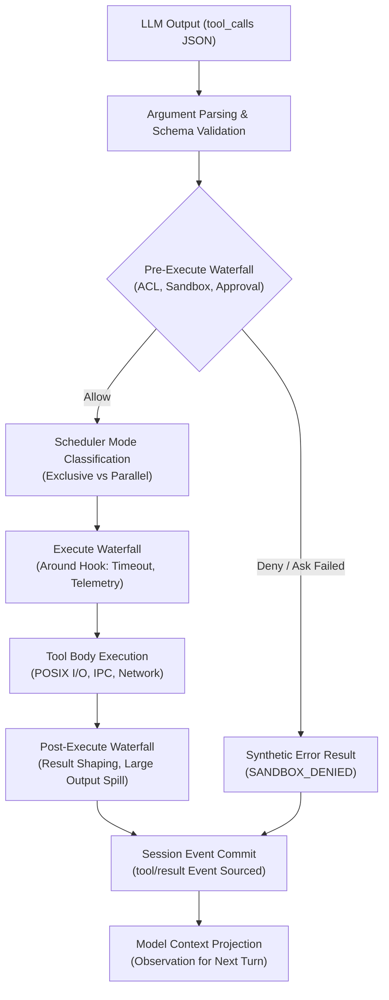
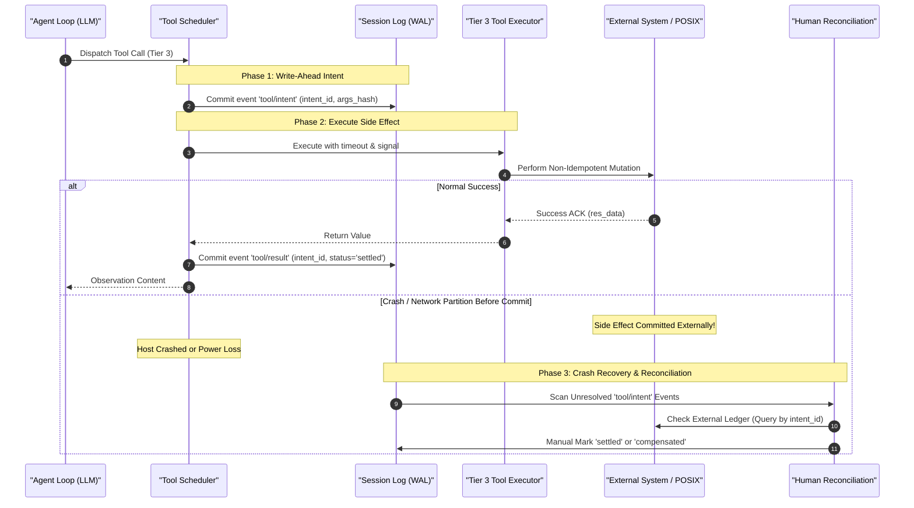
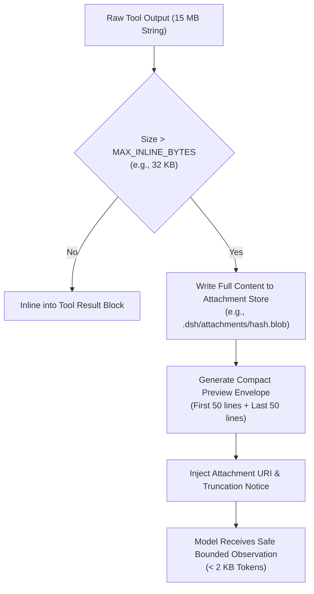

# Chapter 24: Tool Development from Schemas to Side Effects

English | [中文](24-tool-development.zh.md)

An LLM is a probabilistic text generator—autoregressively sampling $P(y_t \mid X, y_{<t})$. It cannot directly perform external I/O or provide trustworthy deterministic computation. **Tool calling** lets an agent move beyond conversation and act on engineering tasks.

For engineers familiar with C, C++, Java, Go, Rust, or TypeScript, tools are not AI magic. They combine **structured RPC dispatch, AST deserialization, and an operating-system-call gateway that can cause side effects**.

This chapter examines the Harness tool architecture: naming, schemas, three effect categories, exclusive barriers, bounded concurrency, and a complete file-metadata inspection tool. The goal is to understand how probabilistic inputs become controlled, durable state changes.

---

## 1. Mental Model: From Model Output to System Calls

Conventional code execution follows a compiler or interpreter. In an agent, model-generated JSON tokens influence control flow. Map tool-system terminology to established computing concepts first.

### 1.1 Systems-Programming Analogies

```
+---------------------------------------------------------------------------------------------------+
|                                 DeepSeek Harness 概念映射对照表                                    |
+------------------------------------+--------------------------------------------------------------+
| AI / Agent 领域术语                | 传统系统编程 / 分布式系统概念                                 |
+------------------------------------+--------------------------------------------------------------+
| Tool / Function                    | 远程过程调用服务（RPC Service / System Call Handler）          |
| Tool Schema (JSON Schema / Zod)    | 接口定义语言（IDL: Protobuf / OpenAPI / Thrift）               |
| Model Tool Call (JSON Chunk)       | 序列化的 RPC 请求报文（JSON-RPC 2.0 Request Payload）          |
| Tool Argument Parser               | 带有严格模式与防御性校验的 AST 反序列化器                     |
| Tool Result                        | RPC 响应报文（Response Payload）与事实账本事件（Event Commit） |
| Tool Side Effect                   | 状态机外变更（POSIX 文件 I/O、网络请求、DB 事务、子进程派生） |
| Tool Scheduler                     | 带独占屏障的有界并发任务池（Barrier Synchronization Pool）     |
| Pre/Execute/Post Pipeline          | AOP 切面 / HTTP 中间件流水线（Middleware Onion Architecture） |
| Tool Intent                        | 预写式日志意图（WAL / Two-Phase Commit Phase 1 Intent）       |
+------------------------------------+--------------------------------------------------------------+
```

A model tool call follows this underlying sequence:
1. **IDL declaration**: Harness supplies tool schemas in the model prompt, analogous to gRPC `.proto` files or OpenAPI descriptions.
2. **Request deserialization**: The model emits `tool_calls` JSON; Harness parses it into an in-memory object.
3. **Security interception and scheduling**: Harness checks sandbox policy, concurrency barriers, and user approval.
4. **Host execution**: It calls POSIX APIs, the Node.js runtime, or the network stack.
5. **Ledger and projection**: It persists the result as an immutable event and returns a formatted observation for the next model inference.

### 1.2 Why Is the Tool Layer the Riskiest Part of an Agent?

In a monolith, trusted local callers provide function arguments. In an agent, arguments come from **untrusted model output**, giving the tool layer a large attack and failure surface:

- **Hallucinated arguments**: The model can invent unsupported enum values, out-of-range numbers, malicious paths such as `/etc/shadow` or `C:\Windows\System32`, or malformed recursive JSON.
- **Concurrent races**: If one model response calls both `delete_file` and `read_file`, absent barriers can cause read-after-write or write-after-read hazards and inconsistent memory state.
- **Retry cascades and ghost writes**: Blind retries of non-idempotent operations such as transfers, charges, emails, or `git push` after a network timeout can duplicate effects or overwrite data.
- **Orphan processes**: If a user cancels in the web UI or with CLI `Ctrl+C` and a tool has not bound `AbortSignal`, a shell command or download can remain running and consume CPU and disk I/O.

### 1.3 Four Stages of the Harness Tool Pipeline

To address these risks, `@deepseek-ai/dsh-tools` provides a four-stage Cordis pipeline using dependency injection and layered event interception:



1. **Pre-execute waterfall**: `tools/pre-execute` checks access-control lists, sandbox paths, security policy, and human approval. A rejection yields a deterministic error record and blocks dispatch.
2. **Execute wrapper**: `tools/execute` attaches cooperative timeout policy, OpenTelemetry tracing, and metrics, then schedules the call in a bounded rolling pool or behind an exclusive barrier.
3. **Post-execute waterfall**: `tools/post-execute` handles results and exceptions, redacts data, and spills oversized output to an attachment referenced by URI.
4. **Result commit**: `tools/result` writes a lossless, `deepFreeze`-frozen JSON result to the Session Log in original model-call order and makes it durable.

---

## 2. Production Tool-Development Rules

A production tool needs more than a documented JavaScript function. It follows rules for names, types, sandbox permissions, errors, and UI presentation.

### 2.1 Tool Names and Semantic Namespaces

Tool names strongly influence model selection during self-attention because their names and descriptions carry the relevant semantic cues.

#### Naming Rules
1. **Use lowercase `snake_case`**: For example, `read_file`, `inspect_file_metadata`, and `execute_command`. Avoid `camelCase`, `kebab-case`, and uppercase names to keep tokenization more consistent across DeepSeek, GPT-4, and Claude.
2. **Use a verb–noun phrase or namespace prefix**:
   - Basic operation: `verb_noun`, such as `list_directory` or `fetch_web_page`.
   - Domain toolset: `domain_verb_noun`, such as `git_commit_changes` or `db_query_table`.
3. **Keep names globally unique**: Do not register duplicate tool names in one agent runtime. In subagent delegation, namespace inherited toolsets to prevent routing ambiguity.

#### Writing a Tool Description
Model decisions depend on precise descriptions. A production description includes:
- **Capability**: State the exact operation: “Inspect POSIX metadata and SHA-256 hash of a specified file path.”
- **Preconditions and anti-patterns**: State when the model must not call it: “DO NOT use this tool for reading file contents; use read_file instead.”
- **Output semantics**: Describe the successful structure and typical use: “Returns size, timestamps, permissions, and hash in a structured JSON envelope.”

### 2.2 Argument-Schema Validation and Bidirectional Type Inference

Raw JSON Schema can drift from TypeScript definitions. DeepSeek Harness uses a typed declarative DSL based on `@deepseek-ai/schemastery` to derive both runtime JSON Schema and strict compile-time TypeScript types from one definition.

#### Schema DSL and Data Structures

```typescript
import type { JsonValue } from '@deepseek-ai/dsh-session'

/** 基础标量约束与注解 */
export interface ValueSchemaAnnotations {
  title?: string
  description?: string
  default?: JsonValue
  examples?: JsonValue
}

/** 字符串类型定义 */
export interface StringValueSchemaSpec extends ValueSchemaAnnotations {
  type: 'string'
  enum?: readonly string[]
  const?: string
}

/** 整数类型定义（包含范围收敛） */
export interface IntegerValueSchemaSpec extends ValueSchemaAnnotations {
  type: 'integer'
  enum?: readonly number[]
  const?: number
}

/** 对象类型定义：强制声明 additionalProperties */
export interface ObjectValueSchemaSpec extends ValueSchemaAnnotations {
  type: 'object'
  properties?: ParameterSchemaSpec
  additionalProperties: boolean
}

/** 工具参数根规格说明 */
export type ParameterPropertySpec = ValueSchemaSpec & { required?: boolean }

export type ParameterSchemaSpec = {
  [key: string]: ParameterPropertySpec
  [key: symbol]: never
}
```

#### Compile-Time Type Inference

Advanced conditional and mapped types extract static argument types without losing information:

```typescript
type Simplify<T> = { [K in keyof T]: T[K] } & {}

type StringKeyOf<S> = Extract<keyof S, string>

type RequiredKeys<S> = {
  [K in StringKeyOf<S>]: S[K] extends { required: true } ? K : never
}[StringKeyOf<S>]

type OptionalKeys<S> = Exclude<StringKeyOf<S>, RequiredKeys<S>>

export type InferValue<S> =
  S extends { type: 'string'; enum: readonly (infer E)[] } ? E :
  S extends { type: 'string' } ? string :
  S extends { type: 'integer'; enum: readonly (infer E)[] } ? E :
  S extends { type: 'integer' } ? number :
  S extends { type: 'boolean' } ? boolean :
  S extends { type: 'object'; properties: infer P extends ParameterSchemaSpec } ? InferArgs<P> :
  S extends { type: 'array'; items: infer I } ? InferValue<I>[] :
  unknown

export type InferArgs<S extends ParameterSchemaSpec> = Simplify<
  & { [K in RequiredKeys<S>]: InferValue<S[K]> }
  & { [K in OptionalKeys<S>]?: InferValue<S[K]> }
>
```

In `execute(args)`, this inference gives `args` accurate completions and type checking, avoiding unsafe assertions such as `as any`.

### 2.3 Execution Modes and Sandbox Permissions

Every Harness tool declares its execution mode and security limits explicitly:

```typescript
export interface ToolSecurityContext {
  /** 是否允许并发执行（只读幂等工具为 true，状态修改与写操作必须为 false） */
  readonly isConcurrencySafe?: (args: unknown) => boolean
  /** 协作式超时时间（毫秒），超时后发出 AbortSignal */
  readonly timeoutMs?: number
  /** 所需沙箱权限等级：'read' | 'write' | 'network' | 'process' */
  readonly requiredPermissions?: readonly string[]
}
```

- **Path containment**: Filesystem tools validate model-supplied relative or absolute paths through `path.resolve` and `path.relative` so the target remains physically within `workspaceRoot`; `../` must not escape the sandbox.
- **Symlink safety**: Resolve symlinks to their final inode with `fs.realpath` so a symlink cannot lead into sensitive Host paths.

### 2.4 Structured Error Codes

A tool must not show the model an opaque raw stack trace such as `TypeError: Cannot read properties of undefined`, which can cause confused retry loops. Harness categorizes errors:

```
+------------------------------------+------------------------------------+---------------------------------------+
| 错误代码 (Error Code)              | HTTP/RPC 映射                      | 语义与模型自愈引导策略                |
+------------------------------------+------------------------------------+---------------------------------------+
| TOOL_ARGS_INVALID                  | 400 Bad Request                    | 参数校验失败，回显 Schema 错误字段     |
| TOOL_PERMISSION_DENIED             | 403 Forbidden                      | 沙箱或权限拦截，提示模型更换路径/降权 |
| TOOL_NOT_FOUND                     | 404 Not Found                      | 目标资源不存在，建议模型先执行检索     |
| TOOL_CONFLICT_STALE_VERSION        | 409 Conflict                       | 状态乐观锁失效，提示模型重新读取最新值 |
| TOOL_ABORTED_BEFORE_DISPATCH       | 499 Client Closed Request          | 用户取消，合成审计日志，不进入重试    |
| TOOL_EXECUTION_FAILED              | 500 Internal Server Error          | 确定性内部异常，附带可修复建议        |
| TOOL_TIMEOUT                       | 504 Gateway Timeout                | 超时中断，提示模型缩小查询范围        |
+------------------------------------+------------------------------------+---------------------------------------+
```

Every model-visible error is wrapped in an envelope that advises recovery:

```xml
<tool_error>
  <code>TOOL_NOT_FOUND</code>
  <message>File 'src/utils/config.ts' does not exist in workspace.</message>
  <remediation>Use 'fs_search' or 'list_directory' to discover valid file paths before retrying.</remediation>
</tool_error>
```

### 2.5 UI Presentation Intent and Immutable Replay

A tool's result is an observation for the model and a visual card for people in the Web/CLI UI. Harness separates **presentation intent** from frontend-framework code: a tool declares render intent as pure data.

```typescript
export interface FileLocation {
  path: string
  line?: number
}

export type ToolCallView =
  | { card: 'generic'; title: string; kind?: 'read' | 'edit' | 'delete' | 'execute' | 'search'; rawInput?: unknown; locations?: FileLocation[] }
  | { card: 'terminal'; title: string; description?: string; cwd?: string }
  | { card: 'diff'; title: string; path: string; oldText: string | null; newText: string }

export type ToolResultView =
  | { card: 'generic'; summary: string; details?: unknown }
  | { card: 'diff'; diffs: Array<{ path: string; oldText: string | null; newText: string }> }
  | { card: 'read'; path: string; offset: number; totalLines: number; lines: Array<{ number: number; text: string }> }
  | { card: 'terminal'; exitCode: number; stdout: string; stderr: string }
```

- **`presentCall(args)`**: Runs while the tool is **pending** or executing. This pure function depends only on arguments and can render a skeleton or highlight the file lines being edited.
- **`presentResult(args, result)`**: Runs when the tool **completes or fails**, returning a diff, code fold, or terminal-output view.
- **Immutable replay**: Because `presentCall` and `presentResult` are pure, a historical session can reproduce its UI cards without rerunning tools during offline load or replay evaluation.

---

## 3. Three Effect Categories and Consistency Guarantees

A side effect is any observable change to the external runtime environment—memory, disk, database, network connection, or hardware—beyond a function's return value.

DeepSeek Harness groups agent tools into three tiers according to their state-transition algebra and idempotency:

```
+---------------------------------------------------------------------------------------------------+
|                                  工具副作用三级分类金字塔                                          |
+------------------------------------+--------------------------------------------------------------+
| 级别与分类                         | 核心特征与并发策略                                           |
+------------------------------------+--------------------------------------------------------------+
| Tier 1: 只读幂等 (Read-Only)       | S_{t+1} = S_t，无环境状态变更；安全并发，可无条件指数退避重试 |
| Tier 2: 状态幂等 (State-Idempotent)| S_{t+1} = S_{final}，多次执行结果一致；CAS 乐观锁校验防覆盖  |
| Tier 3: 非幂等写入 (Non-Idempotent)| S_{t+1} = S_t + ΔS，累加/不可逆变更；预写意图 (WAL) + 人工对账 |
+------------------------------------+--------------------------------------------------------------+
```

### 3.1 Mathematical Model

Let the environment state space be $\mathcal{S}$, arguments be $\mathcal{A}$, and execution be a state-transition operator $$T: \mathcal{S} \times \mathcal{A} \to \mathcal{S} \times \mathcal{R}$$ where $\mathcal{R}$ is the model-visible observation space.

Define two projections:
- State transition: $f(S, a) = \pi_{\mathcal{S}}(T(S, a))$
- Observed output: $g(S, a) = \pi_{\mathcal{R}}(T(S, a))$

#### 1. Tier 1: Read-Only Idempotency
For every state $S \in \mathcal{S}$ and argument $a \in \mathcal{A}$, $$f(S, a) = S$$ and, absent concurrent environmental writes, $$g(S, a) = g(f(S, a), a)$$

**Engineering consequence**: These tools need no exclusive lock, and `isConcurrencySafe(args) \equiv true`. The scheduler can retry safely after network loss or Host contention, for example with exponential backoff $t_{\text{retry}} = 2^k \cdot t_0$.

#### 2. Tier 2: State-Idempotent Writes
The transition satisfies the idempotency law: $$f(f(S, a), a) = f(S, a)$$ For any $k \ge 1$ applications, $$f^{(k)}(S, a) = f(S, a)$$

**Engineering consequence**: Replacing a file with `writeFile(path, content)` or overwriting configuration with `putConfig(key, value)` changes state but does not accumulate effects on retry. Version-hash optimistic concurrency control (OCC) prevents lost updates from concurrent writes: $$S_{\text{new}} = f(S_{\text{current}}, a) \quad \text{iff} \quad \text{Hash}(S_{\text{current}}) = H_{\text{expected}}$$

#### 3. Tier 3: Non-Idempotent Writes
The transition accumulates effects or cannot be reversed: $$f(f(S, a), a) \neq f(S, a)$$ $$f(S, a) \cap S = \emptyset \quad (\text{irreversible external interaction})$$

**Engineering consequence**: Appending with `appendLog(file, text)`, placing an order with `createOrder(amount)`, emailing with `sendEmail(to, body)`, or running `dropDatabase()` can have irreversible effects. If the client misses the acknowledgment after a network disruption at call $t$, do not retry automatically. Persist a write-ahead intent and reconcile in two phases.

---

### 3.2 Production Defenses and Reconciliation by Tier

Harness applies different execution and recovery mechanisms to each effect tier:



#### Write-Ahead Intent Protocol
1. **Persist intent**: Before sending data to a non-idempotent external service, append `tool/intent` to the local Session Log with an `intent_id` (UUIDv4 or snowflake ID), timestamp, argument hash, and retry generation.
2. **Forward the idempotency key**: Include `intent_id` as an `X-Idempotency-Key` header or business key in the external RPC. A supporting external service deduplicates it.
3. **Reconcile unresolved intent**: On crash recovery, find every `tool/intent` without a corresponding `tool/result`, mark it `AWAITING_RECONCILIATION`, and request human verification rather than allowing the model to retry.

---

## 4. Scheduler Concurrency and Ordered Commit

When a model emits several tool calls in one response, safe and efficient scheduling becomes a core runtime concern.

### 4.1 Exclusive Barriers and Bounded Rolling Pools

Harness avoids both global serial execution and unbounded `Promise.all` fan-out, using a **bounded rolling pool with exclusive barriers**:

```typescript
export interface ToolExecutionMode {
  kind: 'exclusive' | 'parallel'
}
```

- **Exclusive barrier**:
  - An `exclusive` call—any non-read-only tool, one without explicit concurrency safety, or one changing global workspace state—forms a barrier.
  - Before it starts, the scheduler waits for every earlier in-flight call to drain and commit.
  - Later tool calls remain pending until the exclusive call completes and commits.
- **Bounded parallel rolling pool**:
  - Consecutive tools declaring `isConcurrencySafe(args) === true`, such as independent file reads or semantic code searches, enter one parallel group.
  - Its sliding window limits concurrency to $N = \text{maxParallelToolCalls}$ (usually 4–8), avoiding exhaustion of file descriptors and network sockets.

### 4.2 Strict Commit in Model-Call Order

Even when parallel work finishes out of order, events in the Session Log and model context commit **in the model's original call-index order**.

#### Why Does Model-Call Order Matter?
1. **Causality and event-sourced determinism**: When the LLM emits `[Call_0, Call_1, Call_2]`, its prompt and attention imply an order. Reordering log entries would change the causal history.
2. **Replay consistency**: Offline replay expects deterministic event indexes. If CPU scheduling or network delay determines commit order, identical prompts can yield different event streams and break regression tests.

```
模型生成的调用队列: [ Call_0 (耗时 500ms), Call_1 (耗时 50ms), Call_2 (耗时 100ms) ]

时间线 (ms)  0ms -------- 50ms -------- 100ms -------------------- 500ms
Call_0      [============ 正在执行 =================================> 完成 ] -> 触发提交 Call_0, 1, 2
Call_1      [== 完成 ==] (挂起等待 Slot 0 提交...)
Call_2      [==== 完成 ====] (挂起等待 Slot 1 提交...)

提交队列:    [ 阻塞 ]                                                   [ 连续提交 Seq 0 -> Seq 1 -> Seq 2 ]
```

#### Sliding-Window Commit Logic
Maintain committed index $C \in \mathbb{N}$, initially $C = 0$, and slots $\text{Slots}[0 \dots M-1]$, initially $\text{UNDEFINED}$. When task $i$ completes, store its result in $\text{Slots}[i]$ and advance: $$\text{while } C < M \text{ and } \text{Slots}[C] \neq \text{UNDEFINED}:$$ $$\quad \text{CommitToLog}(\text{Slots}[C])$$ $$\quad C \leftarrow C + 1$$

A later result cannot advance the committed index until every earlier slot settles. Commit order therefore matches the original indexes.

### 4.3 Cooperative Cancellation and Synthetic Audit Results

When a user calls `AbortController.abort()`, the scheduler handles two cases:
- **In-flight dispatches**: Cascade `signal` to underlying work, stop its I/O, and wait for safe completion or exit.
- **Unstarted dispatches**: To keep model `tool_calls` and later `tool_results` matched one-to-one by count and ID, create a **synthetic skipped-error result** for each skipped call. Otherwise the OpenAI/DeepSeek API rejects the conversation with `Invalid message format: Missing tool_result for call_id`.

```typescript
function appendSkippedToolCall(
  session: Session,
  turn: number,
  step: number,
  block: ToolCallBlock,
): void {
  const callSeq = session.append('tool/call', {
    turn,
    step,
    callId: block.id,
    name: block.name,
    arguments: block.arguments,
  }).seq

  session.append('tool/result', {
    turn,
    step,
    message: {
      callId: block.id,
      content: [{ type: 'text', text: 'Error: tool call aborted before dispatch' }],
      isError: true,
    },
    error: {
      name: 'AbortError',
      code: 'TOOL_ABORTED_BEFORE_DISPATCH',
      message: 'Tool call was skipped because the turn was aborted before dispatch.',
    },
  }, { surfaceOp: 'append', sourceEventSeqs: [callSeq] })
}
```

---

## 5. Exercise: Build a Production File-Metadata Inspection Tool

This exercise applies the preceding rules to implement `inspect_file_metadata`, a production-style file-metadata tool in DeepSeek Harness.

### 5.1 Requirements and Technical Specification

- **Tool name**: `inspect_file_metadata`
- **Capability**: Inspect a file's POSIX size, inode, creation and modification times, octal permissions, MIME type, text line count when applicable, and SHA-256 hash with streaming support for large files.
- **Effect tier**: **Tier 1 (read-only and idempotent)** with `isConcurrencySafe: true`.
- **Security**: Enforce workspace containment; block directory traversal and symlink escape.
- **UI presentation**: Show a file-location card while pending and a structured metadata panel when complete.

### 5.2 Complete Production-Style TypeScript Implementation

File: `packages/fs/tool-fs-inspect/src/inspect.ts`

```typescript
/**
 * Production-grade File Metadata Inspection Tool for DeepSeek Harness.
 * Implements strict schema validation, streaming hash computation, sandbox isolation, and UI presentation intents.
 * @module @deepseek-ai/dsh-tool-fs-inspect
 */

import type { Context } from '@deepseek-ai/cordis'
import { defineTool, type GenericCallView, type GenericResultView, type ToolRunContext } from '@deepseek-ai/dsh-tools'
import * as fs from 'node:fs/promises'
import * as fsSync from 'node:fs'
import * as path from 'node:path'
import * as crypto from 'node:crypto'

/** 工具配置项 */
export interface InspectToolConfig {
  /** 允许哈希计算的最大文件体积（字节），默认 100MB，超过则跳过哈希以保护 I/O */
  maxHashSizeBytes?: number
  /** 单行预览的最大字符数 */
  maxLineLength?: number
}

const DEFAULT_MAX_HASH_SIZE = 100 * 1024 * 1024 // 100 MB

/** 内部错误类定义 */
export class FileInspectError extends Error {
  constructor(
    message: string,
    public readonly code: string,
    public readonly remediation: string,
  ) {
    super(message)
    this.name = 'FileInspectError'
  }
}

/** 流式计算文件 SHA-256 哈希值 */
async function computeFileSha256(filePath: string, signal?: AbortSignal): Promise<string> {
  return new Promise((resolve, reject) => {
    if (signal?.aborted) {
      reject(new FileInspectError('Inspection aborted by caller', 'TOOL_ABORTED', 'Operation was cancelled.'))
      return
    }

    const hash = crypto.createHash('sha256')
    const stream = fsSync.createReadStream(filePath)

    const onAbort = () => {
      stream.destroy()
      reject(new FileInspectError('Inspection aborted during stream', 'TOOL_ABORTED', 'Operation was cancelled.'))
    }

    signal?.addEventListener('abort', onAbort, { once: true })

    stream.on('data', (chunk) => hash.update(chunk))
    stream.on('end', () => {
      signal?.removeEventListener('abort', onAbort)
      resolve(hash.digest('hex'))
    })
    stream.on('error', (err) => {
      signal?.removeEventListener('abort', onAbort)
      reject(new FileInspectError(`I/O error while hashing: ${err.message}`, 'TOOL_EXECUTION_FAILED', 'Check file read permissions.'))
    })
  })
}

/** 探测文件是否为文本文件并统计行数 */
async function inspectTextLines(filePath: string, sizeBytes: number): Promise<{ isText: boolean; lineCount?: number }> {
  if (sizeBytes === 0) {
    return { isText: true, lineCount: 0 }
  }

  // 仅对小于 10MB 的文件进行行数统计，大文件返回未定义
  if (sizeBytes > 10 * 1024 * 1024) {
    return { isText: true }
  }

  try {
    const buffer = Buffer.alloc(Math.min(sizeBytes, 4096))
    const fd = await fs.open(filePath, 'r')
    try {
      await fd.read(buffer, 0, buffer.length, 0)
    } finally {
      await fd.close()
    }

    // 简易探测：如果前 4KB 包含 0x00，判定为二进制
    if (buffer.includes(0)) {
      return { isText: false }
    }

    const content = await fs.readFile(filePath, 'utf-8')
    const lines = content.split('\n').length
    return { isText: true, lineCount: lines }
  } catch {
    return { isText: false }
  }
}

/** 沙箱边界校验器 */
function assertPathWithinWorkspace(targetPath: string, workspaceRoot: string): string {
  const normalizedWorkspace = path.resolve(workspaceRoot)
  const resolvedTarget = path.isAbsolute(targetPath)
    ? path.resolve(targetPath)
    : path.resolve(normalizedWorkspace, targetPath)

  const relative = path.relative(normalizedWorkspace, resolvedTarget)
  if (relative.startsWith('..') || path.isAbsolute(relative)) {
    throw new FileInspectError(
      `Access denied: path '${targetPath}' resolves outside workspace boundary.`,
      'TOOL_PERMISSION_DENIED',
      `Specify a path located inside '${normalizedWorkspace}'.`,
    )
  }

  return resolvedTarget
}

/**
 * 注册 inspect_file_metadata 工具到 Cordis 上下文
 */
export function applyInspectFileMetadataTool(ctx: Context, config: InspectToolConfig = {}): void {
  const maxHashSize = config.maxHashSizeBytes ?? DEFAULT_MAX_HASH_SIZE

  // 1. 注册系统提示词指引
  ctx.systemPrompt?.section({
    name: 'tool:inspect_file_metadata',
    order: 105,
    text: 'Use `inspect_file_metadata` to retrieve POSIX attributes, size, line count, permissions, and SHA-256 hash without loading full content. Ideal for pre-flight file checks.',
  })

  // 2. 注册工具定义
  ctx.tools.register(defineTool({
    name: 'inspect_file_metadata',
    description: 'Inspect detailed metadata, POSIX attributes, line count, and SHA-256 hash of a file within workspace.',

    // 参数 Schema 声明
    parameters: {
      file_path: {
        type: 'string',
        required: true,
        description: 'Relative or absolute path of the target file to inspect.',
      },
      calculate_hash: {
        type: 'boolean',
        required: false,
        description: 'Whether to compute the SHA-256 hash. Defaults to true for files below 100MB.',
      },
    },

    // 输出结构契约定义
    output: {
      schema: {
        type: 'object',
        additionalProperties: false,
        properties: {
          path: { type: 'string', required: true },
          resolvedPath: { type: 'string', required: true },
          exists: { type: 'boolean', required: true },
          fileType: { type: 'string', required: true, enum: ['file', 'directory', 'symlink', 'socket', 'fifo', 'other'] },
          sizeBytes: { type: 'integer', required: true },
          modeOctal: { type: 'string', required: true },
          createdAt: { type: 'string', required: true },
          modifiedAt: { type: 'string', required: true },
          isText: { type: 'boolean', required: true },
          lineCount: { type: 'integer', required: false },
          sha256: { type: 'string', required: false },
        },
      },

      // 模型可见内容渲染器
      render: (_args, value) => {
        const lines: string[] = [
          `<file_metadata path="${value.path}">`,
          `  <type>${value.fileType}</type>`,
          `  <size_bytes>${value.sizeBytes}</size_bytes>`,
          `  <permissions>${value.modeOctal}</permissions>`,
          `  <modified_at>${value.modifiedAt}</modified_at>`,
          `  <is_text>${value.isText}</is_text>`,
        ]
        if (value.lineCount !== undefined) {
          lines.push(`  <line_count>${value.lineCount}</line_count>`)
        }
        if (value.sha256 !== undefined) {
          lines.push(`  <sha256>${value.sha256}</sha256>`)
        }
        lines.push('</file_metadata>')
        return [{ type: 'text', text: lines.join('\n') }]
      },

      // UI 呈现元数据提取
      presentationMeta: (_args, value) => ({
        path: value.path,
        sizeBytes: value.sizeBytes,
        fileType: value.fileType,
        modifiedAt: value.modifiedAt,
        sha256: value.sha256,
      }),
    },

    // 并发安全性声明：只读幂等，安全并发
    isConcurrencySafe: () => true,

    // 超时预算：15 秒
    timeoutMs: 15_000,

    // UI Pending 状态呈现意图
    presentCall: (args): GenericCallView => {
      const parsedPath = typeof args === 'object' && args !== null && 'file_path' in args
        ? String((args as { file_path: unknown }).file_path)
        : 'unknown'
      return {
        card: 'generic',
        title: `Inspecting metadata for ${parsedPath}`,
        kind: 'search',
        rawInput: args,
        locations: [{ path: parsedPath }],
      }
    },

    // UI Completed 状态呈现意图
    presentResult: (args, result): GenericResultView => {
      const parsedPath = typeof args === 'object' && args !== null && 'file_path' in args
        ? String((args as { file_path: unknown }).file_path)
        : 'file'
      if (result.isError) {
        return {
          card: 'generic',
          summary: `Failed to inspect ${parsedPath}`,
          details: result.content,
        }
      }
      return {
        card: 'generic',
        summary: `Metadata inspected successfully for ${parsedPath}`,
        details: result.meta,
      }
    },

    // 核心执行逻辑
    async execute(args: { file_path: string; calculate_hash?: boolean }, exec: ToolRunContext) {
      const workspaceRoot = ctx.get('fs')?.workspaceRoot ?? process.cwd()
      const resolvedPath = assertPathWithinWorkspace(args.file_path, workspaceRoot)

      let stat: fsSync.Stats
      try {
        // 使用 lstat 获取链接自身属性
        stat = await fs.lstat(resolvedPath)
      } catch (err: unknown) {
        const error = err as NodeJS.ErrnoException
        if (error.code === 'ENOENT') {
          throw new FileInspectError(
            `File not found: '${args.file_path}' does not exist.`,
            'TOOL_NOT_FOUND',
            'Verify the path using directory listing before inspecting.',
          )
        }
        throw new FileInspectError(
          `Cannot access path '${args.file_path}': ${error.message}`,
          'TOOL_EXECUTION_FAILED',
          'Check POSIX read permissions on parent directories.',
        )
      }

      // 解析文件类型
      let fileType: 'file' | 'directory' | 'symlink' | 'socket' | 'fifo' | 'other' = 'other'
      if (stat.isFile()) fileType = 'file'
      else if (stat.isDirectory()) fileType = 'directory'
      else if (stat.isSymbolicLink()) fileType = 'symlink'
      else if (stat.isSocket()) fileType = 'socket'
      else if (stat.isFIFO()) fileType = 'fifo'

      // 计算八进制权限位（如 '0644', '0755'）
      const modeOctal = '0' + (stat.mode & 0o777).toString(8)

      // 如果是目录或特殊文件，跳过行数与哈希
      if (fileType !== 'file') {
        return {
          path: args.file_path,
          resolvedPath,
          exists: true,
          fileType,
          sizeBytes: stat.size,
          modeOctal,
          createdAt: stat.birthtime.toISOString(),
          modifiedAt: stat.mtime.toISOString(),
          isText: false,
        }
      }

      // 检查文本属性与行数
      const { isText, lineCount } = await inspectTextLines(resolvedPath, stat.size)

      // 计算哈希（默认开启，超出阈值或显式传 false 则跳过）
      let sha256: string | undefined
      const shouldHash = args.calculate_hash ?? (stat.size <= maxHashSize)
      if (shouldHash && stat.size <= maxHashSize) {
        sha256 = await computeFileSha256(resolvedPath, exec.signal)
      }

      return {
        path: args.file_path,
        resolvedPath,
        exists: true,
        fileType,
        sizeBytes: stat.size,
        modeOctal,
        createdAt: stat.birthtime.toISOString(),
        modifiedAt: stat.mtime.toISOString(),
        isText,
        lineCount,
        sha256,
      }
    },
  }))
}
```

---

### 5.3 Production Unit Tests and Boundary Assertions

File: `packages/fs/tool-fs-inspect/tests/inspect.spec.ts`

```typescript
import { describe, it, expect, beforeEach, afterEach } from 'vitest'
import { Context } from '@deepseek-ai/cordis'
import { applyInspectFileMetadataTool, FileInspectError } from '../src/inspect.ts'
import * as fs from 'node:fs/promises'
import * as path from 'node:path'
import * as os from 'node:os'
import * as crypto from 'node:crypto'

describe('Tool: inspect_file_metadata', () => {
  let ctx: Context
  let tempDir: string

  beforeEach(async () => {
    ctx = new Context()
    tempDir = await fs.mkdtemp(path.join(os.tmpdir(), 'dsh-inspect-test-'))

    // Mock fs service with workspaceRoot
    ctx.provide('fs', {
      workspaceRoot: tempDir,
    })
    ctx.provide('systemPrompt', {
      section: () => {},
    })

    // Mock tools registry service
    const registeredTools = new Map<string, any>()
    ctx.provide('tools', {
      register: (tool: any) => {
        registeredTools.set(tool.name, tool)
      },
      get: (name: string) => registeredTools.get(name),
    })

    applyInspectFileMetadataTool(ctx)
  })

  afterEach(async () => {
    await fs.rm(tempDir, { recursive: true, force: true })
  })

  it('should correctly inspect a standard text file', async () => {
    const tool = ctx.tools.get('inspect_file_metadata')
    expect(tool).toBeDefined()
    expect(tool.isConcurrencySafe({})).toBe(true)

    const testContent = 'Hello World\nLine 2\nLine 3\n'
    const filePath = path.join(tempDir, 'test.txt')
    await fs.writeFile(filePath, testContent, 'utf-8')

    const expectedHash = crypto.createHash('sha256').update(testContent).digest('hex')

    const result = await tool.execute({ file_path: 'test.txt' }, { signal: new AbortController().signal })

    expect(result.exists).toBe(true)
    expect(result.fileType).toBe('file')
    expect(result.sizeBytes).toBe(Buffer.byteLength(testContent))
    expect(result.isText).toBe(true)
    expect(result.lineCount).toBe(4) // 3 newlines -> 4 elements in split
    expect(result.sha256).toBe(expectedHash)
    expect(result.modeOctal).toMatch(/^0[67][0-7][0-7]$/)
  })

  it('should correctly detect binary files and skip line counts', async () => {
    const tool = ctx.tools.get('inspect_file_metadata')
    const binaryBuffer = Buffer.from([0x89, 0x50, 0x4e, 0x47, 0x00, 0x00, 0x00, 0x00])
    const filePath = path.join(tempDir, 'image.png')
    await fs.writeFile(filePath, binaryBuffer)

    const result = await tool.execute({ file_path: 'image.png' }, { signal: new AbortController().signal })

    expect(result.isText).toBe(false)
    expect(result.lineCount).toBeUndefined()
    expect(result.sizeBytes).toBe(8)
  })

  it('should throw TOOL_NOT_FOUND when file does not exist', async () => {
    const tool = ctx.tools.get('inspect_file_metadata')

    await expect(
      tool.execute({ file_path: 'non_existent.txt' }, { signal: new AbortController().signal })
    ).rejects.toThrowError(FileInspectError)

    try {
      await tool.execute({ file_path: 'non_existent.txt' }, { signal: new AbortController().signal })
    } catch (err) {
      const inspectErr = err as FileInspectError
      expect(inspectErr.code).toBe('TOOL_NOT_FOUND')
    }
  })

  it('should enforce sandbox boundaries and block path traversal', async () => {
    const tool = ctx.tools.get('inspect_file_metadata')

    await expect(
      tool.execute({ file_path: '../../etc/passwd' }, { signal: new AbortController().signal })
    ).rejects.toThrowError(FileInspectError)

    try {
      await tool.execute({ file_path: '../../etc/passwd' }, { signal: new AbortController().signal })
    } catch (err) {
      const inspectErr = err as FileInspectError
      expect(inspectErr.code).toBe('TOOL_PERMISSION_DENIED')
      expect(inspectErr.message).toContain('outside workspace boundary')
    }
  })

  it('should respect AbortSignal and cancel long-running operations gracefully', async () => {
    const tool = ctx.tools.get('inspect_file_metadata')
    const controller = new AbortController()
    controller.abort() // Immediately abort

    const filePath = path.join(tempDir, 'aborted.txt')
    await fs.writeFile(filePath, 'Some content', 'utf-8')

    await expect(
      tool.execute({ file_path: 'aborted.txt', calculate_hash: true }, { signal: controller.signal })
    ).rejects.toThrowError(FileInspectError)
  })

  it('should render model-facing XML envelope correctly', () => {
    const tool = ctx.tools.get('inspect_file_metadata')
    const mockValue = {
      path: 'src/main.ts',
      resolvedPath: '/workspace/src/main.ts',
      exists: true,
      fileType: 'file',
      sizeBytes: 1024,
      modeOctal: '0644',
      createdAt: '2026-08-25T10:00:00.000Z',
      modifiedAt: '2026-08-25T11:00:00.000Z',
      isText: true,
      lineCount: 42,
      sha256: 'e3b0c44298fc1c149afbf4c8996fb92427ae41e4649b934ca495991b7852b855',
    }

    const rendered = tool.output.render({}, mockValue)
    expect(rendered).toHaveLength(1)
    expect(rendered[0].type).toBe('text')
    expect(rendered[0].text).toContain('<file_metadata path="src/main.ts">')
    expect(rendered[0].text).toContain('<line_count>42</line_count>')
    expect(rendered[0].text).toContain('<sha256>e3b0c442')
  })
})
```

---

## 6. Production Failures and Troubleshooting

At high concurrency and workloads of tens of thousands of agent tasks, tool systems meet unusual edge cases. These three cases describe failures, causes, and remedies.

### 6.1 Case One: A Non-Idempotent Tool Is Charged Twice after a Timeout

```
[故障现象]
在金融交易与资源计费 Agent 中，模型发起了扣费调用 `charge_account({ user_id: 1001, amount: 50 })`。
由于下游支付网关遭遇 30 秒垃圾回收（GC Pause），HTTP 连接超时。
Agent 调度层根据通用的 HTTP 504 错误触发了自动重试，导致下游网关在 GC 结束后处理了第一笔请求，
随后又处理了重试请求，用户账户被扣款两次（累计扣除 100 元）。
```

#### Root Cause
1. The developer incorrectly classified a charging tool as read-only or idempotent and enabled unconditional global retries.
2. The scheduler did not persist a unique idempotency key before dispatch; the downstream gateway could not recognize the requests as the same business intent.

#### Remedy
- **Classify the effect correctly**: Mark `charge_account` as **Tier 3 (non-idempotent write)**.
- **Bind a write-ahead intent to an idempotency key**:
  ```typescript
  async function executeCharge(args: ChargeArgs, exec: ToolRunContext) {
    // 1. 生成全局唯一 Intent ID
    const intentId = crypto.randomUUID()

    // 2. 写入 WAL 意图日志
    await exec.session.append('tool/intent', {
      intentId,
      tool: 'charge_account',
      args,
      status: 'pending',
    })

    // 3. 携带幂等键请求下游
    const response = await paymentGateway.post('/charge', args, {
      headers: { 'X-Idempotency-Key': intentId },
      signal: exec.signal,
    })

    return response.data
  }
  ```
- **Intercept timeouts**: Never retry a timed-out call in place. Return `AWAITING_RECONCILIATION` for the reconciliation workflow.

---

### 6.2 Case Two: Lost AbortSignal Overwrites a Host File after Cancellation

```
[故障现象]
用户在 Web 终端让 Agent 编写一段耗时 20 秒的大型代码生成任务。在第 5 秒时，用户发现提示词有误，
点击了界面上的 "Stop Generating / Cancel" 按钮。前端显示生成已中止，但在第 20 秒时，
磁盘上的目标代码文件突然被覆写，将用户刚刚手工修改的内容全部冲掉。
```

#### Root Cause
1. The tool body did not pass `exec.signal` to the underlying Node.js `fs.writeFile` call or subprocess.
2. The tool created a detached pending Promise that continued writing after the outer agent loop disposed its context.

#### Remedy
- **Propagate and check the signal end to end**:
  ```typescript
  async function executeWriteFile(args: WriteArgs, exec: ToolRunContext) {
    // 1. 在执行重 I/O 操作前，主动检查取消状态
    exec.signal.throwIfAborted()

    // 2. 将 signal 透传给底层 Node.js API
    const handle = await fs.open(args.path, 'w')
    try {
      exec.signal.throwIfAborted()
      await handle.writeFile(args.content, { signal: exec.signal })
    } finally {
      await handle.close()
    }
  }
  ```
- **Bind to Cordis scope lifecycle**: Register teardown through `ctx.effect()` so disposal of the plugin or scope aborts every related handle.

---

### 6.3 Case Three: Oversized Output Exhausts Model Tokens and Dilutes Attention

```
[故障现象]
模型调用 `execute_command({ command: "cat production.log" })`，该命令瞬间输出了 15MB（约 400 万 Token）的日志文本。
这导致输入超出了大模型的上下文窗口（Context Window），API 请求直接报错 `ContextWindowExceededError`。
即使在 1M 上下文模型中，这也会导致单轮推理费用激增数十美元，并且后续推理因注意力被巨量垃圾日志稀释而产生严重的逻辑幻觉。
```

#### Root Cause
1. The tool lacked a physical hard limit on its result.
2. No secondary spill storage existed.

#### Remedy
DeepSeek Harness uses **two output tiers and a spill policy**:



```typescript
export function spillLargeContent(content: string, maxBytes = 32 * 1024): ContentBlock[] {
  const byteLength = Buffer.byteLength(content, 'utf-8')
  if (byteLength <= maxBytes) {
    return [{ type: 'text', text: content }]
  }

  const lines = content.split('\n')
  const head = lines.slice(0, 50).join('\n')
  const tail = lines.slice(-50).join('\n')
  const omittedCount = lines.length - 100

  const summaryText = `[WARNING: Tool output exceeded ${maxBytes} bytes (${byteLength} bytes total). Truncated ${omittedCount} lines.]\n\n--- BEGIN HEAD (First 50 lines) ---\n${head}\n--- END HEAD ---\n\n... [${omittedCount} lines omitted] ...\n\n--- BEGIN TAIL (Last 50 lines) ---\n${tail}\n--- END TAIL ---`

  return [{ type: 'text', text: summaryText }]
}
```

---

## 7. Tool Readiness Checklist

Before deploying a new tool, complete all ten checks:

```
+---------------------------------------------------------------------------------------------------+
|                                生产级工具就绪审查清单 (Checklist)                                  |
+---+------------------------------------+----------------------------------------------------------+
| # | 审查项                             | 验证标准与合格判定                                       |
+---+------------------------------------+----------------------------------------------------------+
| 1 | 命名与动词一致性                   | 严格使用 snake_case，动宾短语，无跨工具语义冲突          |
| 2 | Description 禁忌明确性             | 包含能力边界、何时严禁使用、推荐替代工具指引             |
| 3 | Schema 严格模式                    | 所有 Object 显式声明 additionalProperties: false         |
| 4 | 静态类型无损推导                   | execute(args) 获得完整静态类型，无 any/as 断言           |
| 5 | 副作用三级定级                     | 准确标记 Tier 1/2/3，写操作必须关闭 isConcurrencySafe    |
| 6 | 沙箱与路径安全                     | 强制执行相对/绝对路径归一化，阻断 ../ 越界与软链接穿透   |
| 7 | 取消信号穿透                       | 异步 I/O 与子进程绑定 exec.signal，支持协作式秒级排空    |
| 8 | 协作式超时预算                     | 显式设置 timeoutMs，防止外部依赖卡死调度器               |
| 9 | 输出体积上限与 Spill               | 对大文本、长数组实施分页与截断，防止 Token 爆炸          |
| 10| UI 呈现纯函数保证                  | presentCall/Result 无副作用，支持离线会话 100% 幂等回放  |
+---+------------------------------------+----------------------------------------------------------+
```

---

## 8. Chapter Summary

This chapter examined the tool-system runtime and effect-control approach in DeepSeek Harness:
1. **Mental model**: Tool calling is model-driven structured RPC deserialization and a POSIX-level system-call gateway.
2. **Production rules**: A declarative schema DSL supports compile-time types and runtime validation; presentation intent is separated so UI history can replay without rerunning tools.
3. **Three effect tiers**: Read-only idempotency (Tier 1), state idempotency (Tier 2), and non-idempotent writes (Tier 3) have different algebraic properties. Write-ahead intent and crash reconciliation handle unknown outcomes.
4. **Scheduler concurrency**: Exclusive barriers and bounded rolling pools preserve model-call commit order and synthesize results for cancelled, unstarted calls.
5. **Implementation practice**: The chapter builds `inspect_file_metadata` with unit tests and reviews three production failure cases.

With tool development and effect governance in place, engineers can connect models to the external world through controlled, secure, performant capabilities.
