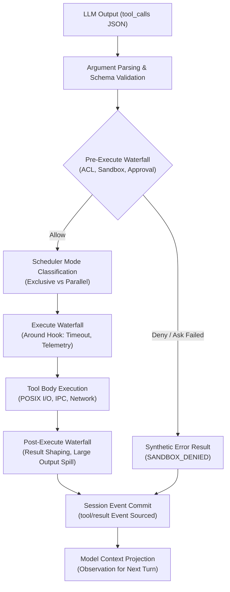
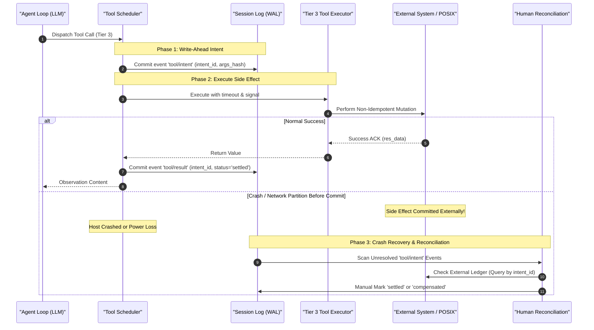
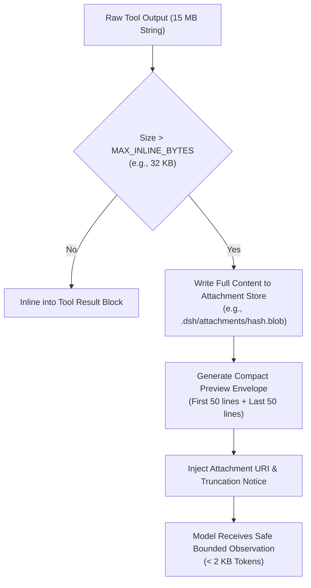

# 第 24 章：工具开发：从 schema 到副作用

在大语言模型（LLM）与智能体（Agent）系统架构中，模型本身只是一个概率型文本生成器（即 $P(y_t \mid X, y_{<t})$ 的自回归采样过程），它既没有直接访问外部物理世界的 I/O 能力，也不具备可信的确定性计算能力。要让智能体从“聊天机器人”跃迁为能够自主解决复杂工程问题的“数字员工”，关键在于**工具调用（Tool Calling / Function Calling）机制**。

对于习惯了传统系统编程（C/C++、Java、Go、Rust、TypeScript）的工程师而言，工具机制绝非简单的“AI 魔法”，其底层本质是**结构化 RPC 调度器、抽象语法树（AST）反序列化器与带副作用的操作系统系统调用（Syscall）网关**。

本章将全面剖析 DeepSeek Harness 的工业级工具系统架构，深入探讨工具命名与 Schema 约束、副作用三级分类法、独占屏障与有界并发调度算法，并通过实战编写一个生产级文件元数据检查工具，揭示从概率输入到确定性状态落盘的完整工程闭环。

---

## 1. 核心心智模型：从大模型输出到系统调用

在传统软件体系中，代码的执行流是确定性编译器或解释器驱动的；而在 Agent 系统中，控制流由大模型生成的 JSON 词法单元（Tokens）驱动。理解工具系统的第一步，是将 AI 术语精准映射为经典的计算机系统概念。

### 1.1 系统编程概念映射

```
+---------------------------------------------------------------------------------------------------+
|                                 DeepSeek Harness 概念映射对照表                                    |
+------------------------------------+--------------------------------------------------------------+
| AI / Agent 领域术语                | 传统系统编程 / 分布式系统概念                                 |
+------------------------------------+--------------------------------------------------------------+
| Tool / Function                    | 远程过程调用服务（RPC Service / System Call Handler）          |
| Tool Schema (JSON Schema / Zod)    | 接口定义语言（IDL: Protobuf / OpenAPI / Thrift）               |
| Model Tool Call (JSON Chunk)       | 序列化的 RPC 请求报文（JSON-RPC 2.0 Request Payload）          |
| Tool Argument Parser               | 带有严格模式与防御性校验的 AST 反序列化器                     |
| Tool Result                        | RPC 响应报文（Response Payload）与事实账本事件（Event Commit） |
| Tool Side Effect                   | 状态机外变更（POSIX 文件 I/O、网络请求、DB 事务、子进程派生） |
| Tool Scheduler                     | 带独占屏障的有界并发任务池（Barrier Synchronization Pool）     |
| Pre/Execute/Post Pipeline          | AOP 切面 / HTTP 中间件流水线（Middleware Onion Architecture） |
| Tool Intent                        | 预写式日志意图（WAL / Two-Phase Commit Phase 1 Intent）       |
+------------------------------------+--------------------------------------------------------------+
```

大模型调用工具的过程，在底层等价于以下流程：
1. **IDL 声明**：Harness 向大模型 Prompt 注入工具的 Schema 定义（等价于 gRPC 的 `.proto` 文件或 OpenAPI 文档）。
2. **请求反序列化**：模型自回归生成 `tool_calls` JSON 文本，Harness 的词法分析器将其解析为内存对象。
3. **安全拦截与调度**：Harness 检查沙箱策略（Sandbox Policy）、并发屏障（Concurrency Barrier）与用户授权（User Approval）。
4. **内核级执行**：调用底层宿主系统的 POSIX API、Node.js 运行时或网络协议栈。
5. **账本记录与投影**：将执行结果作为不可变事件（Event Sourcing）持久化到会话日志，并将格式化内容反馈给模型作为下一轮推理的输入（Observation）。

### 1.2 为什么工具层是 Agent 系统最危险的边界？

在单体软件中，函数参数由受信任的本地调用栈传递；而在 Agent 架构中，工具调用的入参来源于**不可信的大模型生成内容**。这使得工具层成为整个系统架构中攻击面最大、故障率最高的边界：

- **幻觉参数注入（Hallucinated Arguments）**：模型可能臆造出根本不存在的枚举值、超界数字、恶意绝对路径（如 `/etc/shadow` 或 `C:\Windows\System32`）或递归畸形 JSON。
- **并发状态竞态（Race Conditions）**：当模型在单个回复中同时发出多个工具调用（如同时调用 `delete_file` 与 `read_file`）时，若无屏障同步，将导致文件读写竞态（RAW/WAR Hazard）与内存数据不一致。
- **重试雪崩与幽灵写入（Cascading Retries & Ghost Writes）**：当网络出现抖动或超时时，如果非幂等工具（如转账、扣费、发送邮件、`git push`）被盲目重试，将造成灾难性的业务双花或破坏性覆写。
- **孤立进程泄露（Orphaned Processes）**：用户在 Web 端或 CLI 中按下 `Ctrl+C` 取消会话后，若工具底层未正确绑定 `AbortSignal`，宿主系统中的后台 Shell 命令或文件下载进程将沦为僵尸进程，持续消耗 CPU 与磁盘 I/O。

### 1.3 DeepSeek Harness 的四阶段执行流水线

为了应对上述挑战，DeepSeek Harness 在 `@deepseek-ai/dsh-tools` 中构建了基于 Cordis 依赖注入与事件洋葱模型的四阶段执行流水线：



1. **Pre-Execute（事前瀑布流）**：触发 `tools/pre-execute` 事件。用于执行权限访问控制列表（ACL）、沙箱路径校验、安全策略匹配以及人机协同（Human-in-the-loop）审批。若被拦截，直接生成确定性错误凭据，阻断向下分发。
2. **Execute（环绕调度器）**：触发 `tools/execute` 事件。为当前调用注入协作式超时计时器（Timeout Policy）、分布式追踪（OpenTelemetry Tracing）与指标度量，并依据工具声明将任务压入有界滚动池或独占屏障队列。
3. **Post-Execute（事后瀑布流）**：触发 `tools/post-execute` 事件。捕获工具正常返回值或抛出的异常，执行数据脱敏、超长输出溢出截断（Spill Policy，将超大文本转存为 Attachment 文件并替换为 URI 索引）。
4. **Result Commit（账本落盘与广播）**：触发 `tools/result` 事件。将深度冻结（`deepFreeze`）的无损 JSON 结果严格按照模型原始调用序号写入 Session 事实账本，完成终态持久化。

---

## 2. 生产级工具开发规范体系

在工业级 Agent 系统中，编写一个工具绝不是简单地写一个带注释的 JavaScript 函数，而是必须遵循一整套涵盖命名、类型系统、沙箱、错误码和 UI 呈现的严密工程规范。

### 2.1 工具命名与语义空间规范

工具名称是模型决策路由的最高优先级特征。大模型在 Self-Attention 阶段会高度聚焦于工具名称与描述中的语义向量。

#### 命名规范守则
1. **严格使用 `snake_case` 小写下划线**：例如 `read_file`、`inspect_file_metadata`、`execute_command`。严禁使用 `camelCase`、`kebab-case` 或大写字母，确保跨模型（DeepSeek、GPT-4、Claude）的 Tokenizer 分词一致性。
2. **遵循动宾短语（Verb-Noun）或命名空间前缀**：
   - 基础操作：`verb_noun`（如 `list_directory`, `fetch_web_page`）。
   - 领域工具集：`domain_verb_noun`（如 `git_commit_changes`, `db_query_table`）。
3. **全局唯一与防污染**：同一个 Agent 运行时中严禁注册同名工具。在多 Agent 委派（Subagent Delegation）场景下，子智能体继承的工具集必须通过命名空间隔离，防止模型在调用时发生路由混淆。

#### 描述（Description）编写的黄金法则
模型的推理质量直接取决于工具描述的精准度。一个合格的生产级工具描述必须包含以下三要素：
- **能力定义（Capability）**：明确说明该工具的绝对功能（"Inspect POSIX metadata and SHA-256 hash of a specified file path."）。
- **前置条件与禁忌（Preconditions & Anti-patterns）**：明确告知模型何时**严禁**使用（"DO NOT use this tool for reading file contents; use read_file instead."）。
- **返回值语义提示（Output Semantics）**：说明成功返回的数据结构与典型场景（"Returns size, timestamps, permissions, and hash in a structured JSON envelope."）。

### 2.2 参数 Schema 校验与双向类型推导

在 TypeScript 生态中，直接使用裸 JSON Schema 往往导致类型定义与校验逻辑分裂（代码与 Schema 同步漂移）。DeepSeek Harness 采用了类型完备的声明式 DSL（基于 `@deepseek-ai/schemastery`），实现了“一次定义，同时生成运行时 JSON Schema 与编译期严格 TypeScript 类型”。

#### Schema DSL 规范与数据结构

```typescript
import type { JsonValue } from '@deepseek-ai/dsh-session'

/** 基础标量约束与注解 */
export interface ValueSchemaAnnotations {
  title?: string
  description?: string
  default?: JsonValue
  examples?: JsonValue
}

/** 字符串类型定义 */
export interface StringValueSchemaSpec extends ValueSchemaAnnotations {
  type: 'string'
  enum?: readonly string[]
  const?: string
}

/** 整数类型定义（包含范围收敛） */
export interface IntegerValueSchemaSpec extends ValueSchemaAnnotations {
  type: 'integer'
  enum?: readonly number[]
  const?: number
}

/** 对象类型定义：强制声明 additionalProperties */
export interface ObjectValueSchemaSpec extends ValueSchemaAnnotations {
  type: 'object'
  properties?: ParameterSchemaSpec
  additionalProperties: boolean
}

/** 工具参数根规格说明 */
export type ParameterPropertySpec = ValueSchemaSpec & { required?: boolean }

export type ParameterSchemaSpec = {
  [key: string]: ParameterPropertySpec
  [key: symbol]: never
}
```

#### 编译期类型推导器（Type-level Inference）

Harness 通过高级条件类型（Conditional Types）与模板映射，在编译期无损提取参数的静态类型：

```typescript
type Simplify<T> = { [K in keyof T]: T[K] } & {}

type StringKeyOf<S> = Extract<keyof S, string>

type RequiredKeys<S> = {
  [K in StringKeyOf<S>]: S[K] extends { required: true } ? K : never
}[StringKeyOf<S>]

type OptionalKeys<S> = Exclude<StringKeyOf<S>, RequiredKeys<S>>

export type InferValue<S> =
  S extends { type: 'string'; enum: readonly (infer E)[] } ? E :
  S extends { type: 'string' } ? string :
  S extends { type: 'integer'; enum: readonly (infer E)[] } ? E :
  S extends { type: 'integer' } ? number :
  S extends { type: 'boolean' } ? boolean :
  S extends { type: 'object'; properties: infer P extends ParameterSchemaSpec } ? InferArgs<P> :
  S extends { type: 'array'; items: infer I } ? InferValue<I>[] :
  unknown

export type InferArgs<S extends ParameterSchemaSpec> = Simplify<
  & { [K in RequiredKeys<S>]: InferValue<S[K]> }
  & { [K in OptionalKeys<S>]?: InferValue<S[K]> }
>
```

这一类型推导体系确保了工具开发者在编写 `execute(args)` 时，`args` 自动获得 100% 准确的智能提示与类型安全检查，彻底消除 `as any` 等危险类型断言。

### 2.3 执行模式与沙箱权限配置

每个注册到 Harness 的工具都必须显式声明其执行模式与安全边界约束：

```typescript
export interface ToolSecurityContext {
  /** 是否允许并发执行（只读幂等工具为 true，状态修改与写操作必须为 false） */
  readonly isConcurrencySafe?: (args: unknown) => boolean
  /** 协作式超时时间（毫秒），超时后发出 AbortSignal */
  readonly timeoutMs?: number
  /** 所需沙箱权限等级：'read' | 'write' | 'network' | 'process' */
  readonly requiredPermissions?: readonly string[]
}
```

- **路径越界防御（Path Containment）**：文件类工具必须强制校验模型传入的相对或绝对路径，通过 `path.resolve` 与 `path.relative` 双向比对，确保目标文件物理存在于工作区根目录（`workspaceRoot`）内部，严禁通过 `../` 绕出沙箱。
- **符号链接穿透防护（Symlink Resolution Safety）**：必须使用 `fs.realpath` 解析软链接最终指向的真实物理 inode，防止攻击者通过符号链接逃逸到宿主系统敏感目录。

### 2.4 结构化错误码体系

当工具发生异常时，严禁直接抛出不可读的原始堆栈（如 `TypeError: Cannot read properties of undefined`），这会导致大模型理解混乱并陷入死循环重试。DeepSeek Harness 规范了严格的错误码分类：

```
+------------------------------------+------------------------------------+---------------------------------------+
| 错误代码 (Error Code)              | HTTP/RPC 映射                      | 语义与模型自愈引导策略                |
+------------------------------------+------------------------------------+---------------------------------------+
| TOOL_ARGS_INVALID                  | 400 Bad Request                    | 参数校验失败，回显 Schema 错误字段     |
| TOOL_PERMISSION_DENIED             | 403 Forbidden                      | 沙箱或权限拦截，提示模型更换路径/降权 |
| TOOL_NOT_FOUND                     | 404 Not Found                      | 目标资源不存在，建议模型先执行检索     |
| TOOL_CONFLICT_STALE_VERSION        | 409 Conflict                       | 状态乐观锁失效，提示模型重新读取最新值 |
| TOOL_ABORTED_BEFORE_DISPATCH       | 499 Client Closed Request          | 用户取消，合成审计日志，不进入重试    |
| TOOL_EXECUTION_FAILED              | 500 Internal Server Error          | 确定性内部异常，附带可修复建议        |
| TOOL_TIMEOUT                       | 504 Gateway Timeout                | 超时中断，提示模型缩小查询范围        |
+------------------------------------+------------------------------------+---------------------------------------+
```

所有返回给模型的错误均被标准化包裹为自愈建议 Envelope：

```xml
<tool_error>
  <code>TOOL_NOT_FOUND</code>
  <message>File 'src/utils/config.ts' does not exist in workspace.</message>
  <remediation>Use 'fs_search' or 'list_directory' to discover valid file paths before retrying.</remediation>
</tool_error>
```

### 2.5 UI 呈现意图与不可变回放

工具执行不仅为大模型提供 Observation，还需要在 Web/CLI 界面中为人类工程师提供直观的可视化卡片。Harness 提出**呈现意图解耦设计（Presentation Intent Vocabulary）**：工具定义自身不依赖任何前端框架，仅声明纯数据结构的渲染意图。

```typescript
export interface FileLocation {
  path: string
  line?: number
}

export type ToolCallView =
  | { card: 'generic'; title: string; kind?: 'read' | 'edit' | 'delete' | 'execute' | 'search'; rawInput?: unknown; locations?: FileLocation[] }
  | { card: 'terminal'; title: string; description?: string; cwd?: string }
  | { card: 'diff'; title: string; path: string; oldText: string | null; newText: string }

export type ToolResultView =
  | { card: 'generic'; summary: string; details?: unknown }
  | { card: 'diff'; diffs: Array<{ path: string; oldText: string | null; newText: string }> }
  | { card: 'read'; path: string; offset: number; totalLines: number; lines: Array<{ number: number; text: string }> }
  | { card: 'terminal'; exitCode: number; stdout: string; stderr: string }
```

- **`presentCall(args)`**：在工具处于 **Pending（排队或执行中）** 状态时触发，纯函数，仅依赖入参，用于在前端渲染骨架屏或高亮正在编辑的文件行。
- **`presentResult(args, result)`**：在工具处于 **Completed（完成或失败）** 状态时触发，返回 Diff 比对、代码折叠或终端输出视图。
- **不可变回放保证（Replay Guarantee）**：由于 `presentCall` 与 `presentResult` 是纯函数，会话历史在离线加载（Session Replay）或重放评测时，无需重新执行工具代码即可 100% 精确复现当年的 UI 卡片。

---

## 3. 副作用三级分类法与一致性保证

副作用（Side Effect）是指函数在执行过程中，除了返回计算值之外，对外部运行环境（内存、磁盘、数据库、网络连接、物理硬件）造成的任何可观察状态变化。

根据状态转移的代数特性与幂等性保证，DeepSeek Harness 将所有 Agent 工具严格划分为三级：

```
+---------------------------------------------------------------------------------------------------+
|                                  工具副作用三级分类金字塔                                          |
+------------------------------------+--------------------------------------------------------------+
| 级别与分类                         | 核心特征与并发策略                                           |
+------------------------------------+--------------------------------------------------------------+
| Tier 1: 只读幂等 (Read-Only)       | S_{t+1} = S_t，无环境状态变更；安全并发，可无条件指数退避重试 |
| Tier 2: 状态幂等 (State-Idempotent)| S_{t+1} = S_{final}，多次执行结果一致；CAS 乐观锁校验防覆盖  |
| Tier 3: 非幂等写入 (Non-Idempotent)| S_{t+1} = S_t + ΔS，累加/不可逆变更；预写意图 (WAL) + 人工对账 |
+------------------------------------+--------------------------------------------------------------+
```

### 3.1 数学形式化推导

设系统环境状态空间为 $\mathcal{S}$，工具参数空间为 $\mathcal{A}$，工具执行函数为状态转移算子： $$T: \mathcal{S} \times \mathcal{A} \to \mathcal{S} \times \mathcal{R}$$ 其中 $\mathcal{R}$ 为返回给模型的观测结果空间。

定义投影算子：
- 状态转移分量：$f(S, a) = \pi_{\mathcal{S}}(T(S, a))$
- 观测输出分量：$g(S, a) = \pi_{\mathcal{R}}(T(S, a))$

#### 1. 只读幂等（Tier 1）的数学充要条件
对任意初始状态 $S \in \mathcal{S}$ 与任意参数 $a \in \mathcal{A}$，恒有： $$f(S, a) = S$$ 同时观测函数具有确定性（忽略环境并发写入）： $$g(S, a) = g(f(S, a), a)$$

**工程结论**：此类工具在执行管线中不持有任何排他锁，并发安全标志 `isConcurrencySafe(args) \equiv true`。当遇到网络丢包或宿主忙时，调度器可安全启动自动重试策略（如 $t_{\text{retry}} = 2^k \cdot t_0$ 的指数退避）。

#### 2. 状态幂等（Tier 2）的数学充要条件
状态转移算子满足幂等律（Idempotent Law）： $$f(f(S, a), a) = f(S, a)$$ 即对于任意 $k \ge 1$ 次重复应用： $$f^{(k)}(S, a) = f(S, a)$$

**工程结论**：例如全量写入文件 `writeFile(path, content)` 或覆盖配置 `putConfig(key, value)`。尽管它们修改了环境状态，但重复执行不会导致副作用累加。为了防止并发写入导致的幽灵覆盖（Lost Update），必须引入基于版本哈希的乐观并发控制（OCC）： $$S_{\text{new}} = f(S_{\text{current}}, a) \quad \text{iff} \quad \text{Hash}(S_{\text{current}}) = H_{\text{expected}}$$

#### 3. 非幂等写入（Tier 3）的数学特征
状态转移算子具有严格的累加性或不可逆性： $$f(f(S, a), a) \neq f(S, a)$$ $$f(S, a) \cap S = \emptyset \quad (\text{不可逆外部交互})$$

**工程结论**：例如追加日志 `appendLog(file, text)`、提交订单 `createOrder(amount)`、发送邮件 `sendEmail(to, body)` 或执行远程不可逆命令 `dropDatabase()`。若在第 $t$ 次调用时网络中断（Client 未收到 ACK），严禁自动重试，否则必然导致副作用翻倍。必须采用预写操作意图（Write-Ahead Intent）与两阶段对账机制。

---

### 3.2 三级分类的生产级防护与对账架构

针对三类不同副作用工具，Harness 建立了差异化的执行与灾难恢复机制：



#### 预写意图协议（Write-Ahead Intent Protocol）
1. **意图持久化**：在向任何外部非幂等服务发送数据前，调度器必须先向本地会话日志持久化一条 `tool/intent` 事件，记录 `intent_id`（UUIDv4 或雪花 ID）、时间戳、调用参数哈希值与重试代数。
2. **幂等性透传**：将 `intent_id` 作为请求头（如 `X-Idempotency-Key`）或业务唯一键附加在外部 RPC 中。若外部服务支持幂等键，外部服务端将自动去重。
3. **未决崩溃对账（Unresolved Intent Recovery）**：当系统异常崩溃重启时，恢复引擎首先扫描事实账本中所有**有 `tool/intent` 但无对应 `tool/result`** 的悬挂调用，将其置为 `AWAITING_RECONCILIATION` 状态，并通知人工介入核对，严禁模型自行重试。

---

## 4. 调度器并发控制与严格有序提交

当大模型在单轮推理中同时输出多个工具调用（Multi-Tool Calling）时，如何安全高效地调度它们是 Agent 运行时的核心难题。

### 4.1 独占屏障 vs 有界滚动池

Harness 的调度器摒弃了粗暴的全局串行或不加限制的 `Promise.all`，设计了**带独占屏障的有界并发滚动池算法（Bounded Rolling Pool with Exclusive Barrier）**：

```typescript
export interface ToolExecutionMode {
  kind: 'exclusive' | 'parallel'
}
```

- **独占屏障（Exclusive Barrier）**：
  - 当调用被分类为 `exclusive` 时（所有非只读工具、未显式声明并发安全的工具、或涉及工作区全局状态变更的工具），该调用构成一道执行屏障。
  - 调度器必须等待**此前所有已启动的 In-flight 任务全部排空（Drain）**并提交日志后，才能独占启动该任务。
  - 在该独占任务完成并提交前，后续的所有工具调用必须处于挂起状态。
- **并行有界滚动池（Parallel Rolling Pool）**：
  - 当连续多个工具均显式声明 `isConcurrencySafe(args) === true`（如连续读取多个文件、并发进行代码语义检索）时，调度器将其分入同一个并行组。
  - 并行组采用滑动窗口控制最大并发度 $N = \text{maxParallelToolCalls}$（通常为 4~8），防止瞬时耗尽系统文件句柄或网络 Socket 连接池。

### 4.2 严格按模型调用序号有序提交（Strict In-Order Commit）

即使并行池中的任务以乱序（Out-of-Order）完成，调度器也必须保证会话日志与模型上下文中的事件记录**严格按照模型原始生成的调用序号递增提交**。

#### 为什么必须按模型调用序号有序提交？
1. **因果一致性与事件溯源确定性**：LLM 在生成 `[Call_0, Call_1, Call_2]` 时，其 Prompt 上下文与注意力逻辑隐含了先后因果假设。乱序记录会导致会话历史的因果关系破裂。
2. **Replay 回放一致性**：离线测试回放依赖于确定性的事件索引序列。若提交顺序受宿主 CPU 调度或网络延迟影响，多次运行同一 Prompt 将生成完全不同的事件流，导致回归测试失效。

```
模型生成的调用队列: [ Call_0 (耗时 500ms), Call_1 (耗时 50ms), Call_2 (耗时 100ms) ]

时间线 (ms)  0ms -------- 50ms -------- 100ms -------------------- 500ms
Call_0      [============ 正在执行 =================================> 完成 ] -> 触发提交 Call_0, 1, 2
Call_1      [== 完成 ==] (挂起等待 Slot 0 提交...)
Call_2      [==== 完成 ====] (挂起等待 Slot 1 提交...)

提交队列:    [ 阻塞 ]                                                   [ 连续提交 Seq 0 -> Seq 1 -> Seq 2 ]
```

#### 滑动窗口提交算法的数学逻辑
维护已提交指针 $C \in \mathbb{N}$，初始 $C = 0$。维护槽位缓冲区数组 $\text{Slots}[0 \dots M-1]$，初始均为 $\text{UNDEFINED}$。 当任意索引 $i$ 的任务完成时，将结果填入 $\text{Slots}[i]$。随后触发提交循环： $$\text{while } C < M \text{ and } \text{Slots}[C] \neq \text{UNDEFINED}:$$ $$\quad \text{CommitToLog}(\text{Slots}[C])$$ $$\quad C \leftarrow C + 1$$

该算法确保了任何后续完成的结果必须等待其前驱槽位全部落实（Settled）后才能推进指针，从数学上证明了提交序列与原始索引序列同构。

### 4.3 协作式取消与合成审计结果填充

当用户触发 `AbortController.abort()` 时，调度器面临以下严苛约束：
- **正在运行的任务（In-flight Dispatches）**：调度器通过级联传递 `signal` 通知底层工作单元停止 I/O，并等待正在执行的任务安全退出（Drain）。
- **尚未启动的任务（Unstarted Dispatches）**：为了保持大模型 `tool_calls` 与后续 `tool_results` 的数量与 ID 严格一一匹配（否则 OpenAI/DeepSeek API 会直接抛出 `Invalid message format: Missing tool_result for call_id` 协议错误），调度器必须为所有被跳过的调用生成**合成错误结果（Synthetic Skipped Result）**。

```typescript
function appendSkippedToolCall(
  session: Session,
  turn: number,
  step: number,
  block: ToolCallBlock,
): void {
  const callSeq = session.append('tool/call', {
    turn,
    step,
    callId: block.id,
    name: block.name,
    arguments: block.arguments,
  }).seq

  session.append('tool/result', {
    turn,
    step,
    message: {
      callId: block.id,
      content: [{ type: 'text', text: 'Error: tool call aborted before dispatch' }],
      isError: true,
    },
    error: {
      name: 'AbortError',
      code: 'TOOL_ABORTED_BEFORE_DISPATCH',
      message: 'Tool call was skipped because the turn was aborted before dispatch.',
    },
  }, { surfaceOp: 'append', sourceEventSeqs: [callSeq] })
}
```

---

## 5. 实战：开发生产级文件元数据检查工具

本节我们将运用上述全部规范与架构，在 DeepSeek Harness 环境中从零实现一个工业级文件元数据检查工具：`inspect_file_metadata`。

### 5.1 需求定义与技术规格

- **工具名称**：`inspect_file_metadata`
- **功能目标**：深度提取指定文件的 POSIX 属性（文件大小、inode、创建时间、最后修改时间、访问权限 octal 表示）、MIME 类型、文本行数检测（针对文本文件）以及 SHA-256 校验哈希（支持大文件流式计算）。
- **副作用级别**：**Tier 1（只读幂等）**，开启 `isConcurrencySafe: true`。
- **安全约束**：严格工作区沙箱限制，阻断跨目录遍历与符号链接逃逸。
- **UI 呈现**：支持 Pending 态文件定位卡片与 Completed 态结构化元数据面板。

### 5.2 完整工业级 TypeScript 源码实现

文件路径：`packages/fs/tool-fs-inspect/src/inspect.ts`

```typescript
/**
 * Production-grade File Metadata Inspection Tool for DeepSeek Harness.
 * Implements strict schema validation, streaming hash computation, sandbox isolation, and UI presentation intents.
 * @module @deepseek-ai/dsh-tool-fs-inspect
 */

import type { Context } from '@deepseek-ai/cordis'
import { defineTool, type GenericCallView, type GenericResultView, type ToolRunContext } from '@deepseek-ai/dsh-tools'
import * as fs from 'node:fs/promises'
import * as fsSync from 'node:fs'
import * as path from 'node:path'
import * as crypto from 'node:crypto'

/** 工具配置项 */
export interface InspectToolConfig {
  /** 允许哈希计算的最大文件体积（字节），默认 100MB，超过则跳过哈希以保护 I/O */
  maxHashSizeBytes?: number
  /** 单行预览的最大字符数 */
  maxLineLength?: number
}

const DEFAULT_MAX_HASH_SIZE = 100 * 1024 * 1024 // 100 MB

/** 内部错误类定义 */
export class FileInspectError extends Error {
  constructor(
    message: string,
    public readonly code: string,
    public readonly remediation: string,
  ) {
    super(message)
    this.name = 'FileInspectError'
  }
}

/** 流式计算文件 SHA-256 哈希值 */
async function computeFileSha256(filePath: string, signal?: AbortSignal): Promise<string> {
  return new Promise((resolve, reject) => {
    if (signal?.aborted) {
      reject(new FileInspectError('Inspection aborted by caller', 'TOOL_ABORTED', 'Operation was cancelled.'))
      return
    }

    const hash = crypto.createHash('sha256')
    const stream = fsSync.createReadStream(filePath)

    const onAbort = () => {
      stream.destroy()
      reject(new FileInspectError('Inspection aborted during stream', 'TOOL_ABORTED', 'Operation was cancelled.'))
    }

    signal?.addEventListener('abort', onAbort, { once: true })

    stream.on('data', (chunk) => hash.update(chunk))
    stream.on('end', () => {
      signal?.removeEventListener('abort', onAbort)
      resolve(hash.digest('hex'))
    })
    stream.on('error', (err) => {
      signal?.removeEventListener('abort', onAbort)
      reject(new FileInspectError(`I/O error while hashing: ${err.message}`, 'TOOL_EXECUTION_FAILED', 'Check file read permissions.'))
    })
  })
}

/** 探测文件是否为文本文件并统计行数 */
async function inspectTextLines(filePath: string, sizeBytes: number): Promise<{ isText: boolean; lineCount?: number }> {
  if (sizeBytes === 0) {
    return { isText: true, lineCount: 0 }
  }

  // 仅对小于 10MB 的文件进行行数统计，大文件返回未定义
  if (sizeBytes > 10 * 1024 * 1024) {
    return { isText: true }
  }

  try {
    const buffer = Buffer.alloc(Math.min(sizeBytes, 4096))
    const fd = await fs.open(filePath, 'r')
    try {
      await fd.read(buffer, 0, buffer.length, 0)
    } finally {
      await fd.close()
    }

    // 简易探测：如果前 4KB 包含 0x00，判定为二进制
    if (buffer.includes(0)) {
      return { isText: false }
    }

    const content = await fs.readFile(filePath, 'utf-8')
    const lines = content.split('\n').length
    return { isText: true, lineCount: lines }
  } catch {
    return { isText: false }
  }
}

/** 沙箱边界校验器 */
function assertPathWithinWorkspace(targetPath: string, workspaceRoot: string): string {
  const normalizedWorkspace = path.resolve(workspaceRoot)
  const resolvedTarget = path.isAbsolute(targetPath)
    ? path.resolve(targetPath)
    : path.resolve(normalizedWorkspace, targetPath)

  const relative = path.relative(normalizedWorkspace, resolvedTarget)
  if (relative.startsWith('..') || path.isAbsolute(relative)) {
    throw new FileInspectError(
      `Access denied: path '${targetPath}' resolves outside workspace boundary.`,
      'TOOL_PERMISSION_DENIED',
      `Specify a path located inside '${normalizedWorkspace}'.`,
    )
  }

  return resolvedTarget
}

/**
 * 注册 inspect_file_metadata 工具到 Cordis 上下文
 */
export function applyInspectFileMetadataTool(ctx: Context, config: InspectToolConfig = {}): void {
  const maxHashSize = config.maxHashSizeBytes ?? DEFAULT_MAX_HASH_SIZE

  // 1. 注册系统提示词指引
  ctx.systemPrompt?.section({
    name: 'tool:inspect_file_metadata',
    order: 105,
    text: 'Use `inspect_file_metadata` to retrieve POSIX attributes, size, line count, permissions, and SHA-256 hash without loading full content. Ideal for pre-flight file checks.',
  })

  // 2. 注册工具定义
  ctx.tools.register(defineTool({
    name: 'inspect_file_metadata',
    description: 'Inspect detailed metadata, POSIX attributes, line count, and SHA-256 hash of a file within workspace.',

    // 参数 Schema 声明
    parameters: {
      file_path: {
        type: 'string',
        required: true,
        description: 'Relative or absolute path of the target file to inspect.',
      },
      calculate_hash: {
        type: 'boolean',
        required: false,
        description: 'Whether to compute the SHA-256 hash. Defaults to true for files below 100MB.',
      },
    },

    // 输出结构契约定义
    output: {
      schema: {
        type: 'object',
        additionalProperties: false,
        properties: {
          path: { type: 'string', required: true },
          resolvedPath: { type: 'string', required: true },
          exists: { type: 'boolean', required: true },
          fileType: { type: 'string', required: true, enum: ['file', 'directory', 'symlink', 'socket', 'fifo', 'other'] },
          sizeBytes: { type: 'integer', required: true },
          modeOctal: { type: 'string', required: true },
          createdAt: { type: 'string', required: true },
          modifiedAt: { type: 'string', required: true },
          isText: { type: 'boolean', required: true },
          lineCount: { type: 'integer', required: false },
          sha256: { type: 'string', required: false },
        },
      },

      // 模型可见内容渲染器
      render: (_args, value) => {
        const lines: string[] = [
          `<file_metadata path="${value.path}">`,
          `  <type>${value.fileType}</type>`,
          `  <size_bytes>${value.sizeBytes}</size_bytes>`,
          `  <permissions>${value.modeOctal}</permissions>`,
          `  <modified_at>${value.modifiedAt}</modified_at>`,
          `  <is_text>${value.isText}</is_text>`,
        ]
        if (value.lineCount !== undefined) {
          lines.push(`  <line_count>${value.lineCount}</line_count>`)
        }
        if (value.sha256 !== undefined) {
          lines.push(`  <sha256>${value.sha256}</sha256>`)
        }
        lines.push('</file_metadata>')
        return [{ type: 'text', text: lines.join('\n') }]
      },

      // UI 呈现元数据提取
      presentationMeta: (_args, value) => ({
        path: value.path,
        sizeBytes: value.sizeBytes,
        fileType: value.fileType,
        modifiedAt: value.modifiedAt,
        sha256: value.sha256,
      }),
    },

    // 并发安全性声明：只读幂等，安全并发
    isConcurrencySafe: () => true,

    // 超时预算：15 秒
    timeoutMs: 15_000,

    // UI Pending 状态呈现意图
    presentCall: (args): GenericCallView => {
      const parsedPath = typeof args === 'object' && args !== null && 'file_path' in args
        ? String((args as { file_path: unknown }).file_path)
        : 'unknown'
      return {
        card: 'generic',
        title: `Inspecting metadata for ${parsedPath}`,
        kind: 'search',
        rawInput: args,
        locations: [{ path: parsedPath }],
      }
    },

    // UI Completed 状态呈现意图
    presentResult: (args, result): GenericResultView => {
      const parsedPath = typeof args === 'object' && args !== null && 'file_path' in args
        ? String((args as { file_path: unknown }).file_path)
        : 'file'
      if (result.isError) {
        return {
          card: 'generic',
          summary: `Failed to inspect ${parsedPath}`,
          details: result.content,
        }
      }
      return {
        card: 'generic',
        summary: `Metadata inspected successfully for ${parsedPath}`,
        details: result.meta,
      }
    },

    // 核心执行逻辑
    async execute(args: { file_path: string; calculate_hash?: boolean }, exec: ToolRunContext) {
      const workspaceRoot = ctx.get('fs')?.workspaceRoot ?? process.cwd()
      const resolvedPath = assertPathWithinWorkspace(args.file_path, workspaceRoot)

      let stat: fsSync.Stats
      try {
        // 使用 lstat 获取链接自身属性
        stat = await fs.lstat(resolvedPath)
      } catch (err: unknown) {
        const error = err as NodeJS.ErrnoException
        if (error.code === 'ENOENT') {
          throw new FileInspectError(
            `File not found: '${args.file_path}' does not exist.`,
            'TOOL_NOT_FOUND',
            'Verify the path using directory listing before inspecting.',
          )
        }
        throw new FileInspectError(
          `Cannot access path '${args.file_path}': ${error.message}`,
          'TOOL_EXECUTION_FAILED',
          'Check POSIX read permissions on parent directories.',
        )
      }

      // 解析文件类型
      let fileType: 'file' | 'directory' | 'symlink' | 'socket' | 'fifo' | 'other' = 'other'
      if (stat.isFile()) fileType = 'file'
      else if (stat.isDirectory()) fileType = 'directory'
      else if (stat.isSymbolicLink()) fileType = 'symlink'
      else if (stat.isSocket()) fileType = 'socket'
      else if (stat.isFIFO()) fileType = 'fifo'

      // 计算八进制权限位（如 '0644', '0755'）
      const modeOctal = '0' + (stat.mode & 0o777).toString(8)

      // 如果是目录或特殊文件，跳过行数与哈希
      if (fileType !== 'file') {
        return {
          path: args.file_path,
          resolvedPath,
          exists: true,
          fileType,
          sizeBytes: stat.size,
          modeOctal,
          createdAt: stat.birthtime.toISOString(),
          modifiedAt: stat.mtime.toISOString(),
          isText: false,
        }
      }

      // 检查文本属性与行数
      const { isText, lineCount } = await inspectTextLines(resolvedPath, stat.size)

      // 计算哈希（默认开启，超出阈值或显式传 false 则跳过）
      let sha256: string | undefined
      const shouldHash = args.calculate_hash ?? (stat.size <= maxHashSize)
      if (shouldHash && stat.size <= maxHashSize) {
        sha256 = await computeFileSha256(resolvedPath, exec.signal)
      }

      return {
        path: args.file_path,
        resolvedPath,
        exists: true,
        fileType,
        sizeBytes: stat.size,
        modeOctal,
        createdAt: stat.birthtime.toISOString(),
        modifiedAt: stat.mtime.toISOString(),
        isText,
        lineCount,
        sha256,
      }
    },
  }))
}
```

---

### 5.3 生产级单元测试与边界断言

文件路径：`packages/fs/tool-fs-inspect/tests/inspect.spec.ts`

```typescript
import { describe, it, expect, beforeEach, afterEach } from 'vitest'
import { Context } from '@deepseek-ai/cordis'
import { applyInspectFileMetadataTool, FileInspectError } from '../src/inspect.ts'
import * as fs from 'node:fs/promises'
import * as path from 'node:path'
import * as os from 'node:os'
import * as crypto from 'node:crypto'

describe('Tool: inspect_file_metadata', () => {
  let ctx: Context
  let tempDir: string

  beforeEach(async () => {
    ctx = new Context()
    tempDir = await fs.mkdtemp(path.join(os.tmpdir(), 'dsh-inspect-test-'))

    // Mock fs service with workspaceRoot
    ctx.provide('fs', {
      workspaceRoot: tempDir,
    })
    ctx.provide('systemPrompt', {
      section: () => {},
    })

    // Mock tools registry service
    const registeredTools = new Map<string, any>()
    ctx.provide('tools', {
      register: (tool: any) => {
        registeredTools.set(tool.name, tool)
      },
      get: (name: string) => registeredTools.get(name),
    })

    applyInspectFileMetadataTool(ctx)
  })

  afterEach(async () => {
    await fs.rm(tempDir, { recursive: true, force: true })
  })

  it('should correctly inspect a standard text file', async () => {
    const tool = ctx.tools.get('inspect_file_metadata')
    expect(tool).toBeDefined()
    expect(tool.isConcurrencySafe({})).toBe(true)

    const testContent = 'Hello World\nLine 2\nLine 3\n'
    const filePath = path.join(tempDir, 'test.txt')
    await fs.writeFile(filePath, testContent, 'utf-8')

    const expectedHash = crypto.createHash('sha256').update(testContent).digest('hex')

    const result = await tool.execute({ file_path: 'test.txt' }, { signal: new AbortController().signal })

    expect(result.exists).toBe(true)
    expect(result.fileType).toBe('file')
    expect(result.sizeBytes).toBe(Buffer.byteLength(testContent))
    expect(result.isText).toBe(true)
    expect(result.lineCount).toBe(4) // 3 newlines -> 4 elements in split
    expect(result.sha256).toBe(expectedHash)
    expect(result.modeOctal).toMatch(/^0[67][0-7][0-7]$/)
  })

  it('should correctly detect binary files and skip line counts', async () => {
    const tool = ctx.tools.get('inspect_file_metadata')
    const binaryBuffer = Buffer.from([0x89, 0x50, 0x4e, 0x47, 0x00, 0x00, 0x00, 0x00])
    const filePath = path.join(tempDir, 'image.png')
    await fs.writeFile(filePath, binaryBuffer)

    const result = await tool.execute({ file_path: 'image.png' }, { signal: new AbortController().signal })

    expect(result.isText).toBe(false)
    expect(result.lineCount).toBeUndefined()
    expect(result.sizeBytes).toBe(8)
  })

  it('should throw TOOL_NOT_FOUND when file does not exist', async () => {
    const tool = ctx.tools.get('inspect_file_metadata')

    await expect(
      tool.execute({ file_path: 'non_existent.txt' }, { signal: new AbortController().signal })
    ).rejects.toThrowError(FileInspectError)

    try {
      await tool.execute({ file_path: 'non_existent.txt' }, { signal: new AbortController().signal })
    } catch (err) {
      const inspectErr = err as FileInspectError
      expect(inspectErr.code).toBe('TOOL_NOT_FOUND')
    }
  })

  it('should enforce sandbox boundaries and block path traversal', async () => {
    const tool = ctx.tools.get('inspect_file_metadata')

    await expect(
      tool.execute({ file_path: '../../etc/passwd' }, { signal: new AbortController().signal })
    ).rejects.toThrowError(FileInspectError)

    try {
      await tool.execute({ file_path: '../../etc/passwd' }, { signal: new AbortController().signal })
    } catch (err) {
      const inspectErr = err as FileInspectError
      expect(inspectErr.code).toBe('TOOL_PERMISSION_DENIED')
      expect(inspectErr.message).toContain('outside workspace boundary')
    }
  })

  it('should respect AbortSignal and cancel long-running operations gracefully', async () => {
    const tool = ctx.tools.get('inspect_file_metadata')
    const controller = new AbortController()
    controller.abort() // Immediately abort

    const filePath = path.join(tempDir, 'aborted.txt')
    await fs.writeFile(filePath, 'Some content', 'utf-8')

    await expect(
      tool.execute({ file_path: 'aborted.txt', calculate_hash: true }, { signal: controller.signal })
    ).rejects.toThrowError(FileInspectError)
  })

  it('should render model-facing XML envelope correctly', () => {
    const tool = ctx.tools.get('inspect_file_metadata')
    const mockValue = {
      path: 'src/main.ts',
      resolvedPath: '/workspace/src/main.ts',
      exists: true,
      fileType: 'file',
      sizeBytes: 1024,
      modeOctal: '0644',
      createdAt: '2026-08-25T10:00:00.000Z',
      modifiedAt: '2026-08-25T11:00:00.000Z',
      isText: true,
      lineCount: 42,
      sha256: 'e3b0c44298fc1c149afbf4c8996fb92427ae41e4649b934ca495991b7852b855',
    }

    const rendered = tool.output.render({}, mockValue)
    expect(rendered).toHaveLength(1)
    expect(rendered[0].type).toBe('text')
    expect(rendered[0].text).toContain('<file_metadata path="src/main.ts">')
    expect(rendered[0].text).toContain('<line_count>42</line_count>')
    expect(rendered[0].text).toContain('<sha256>e3b0c442')
  })
})
```

---

## 6. 生产环境真实故障复盘与避坑指南

在支撑万级 Agent 任务的高并发生产环境中，工具系统经常面临各种极端边缘场景。以下复盘三个经典故障案例及其根因与解决方案。

### 6.1 故障案例一：非幂等工具在网络超时下的“幽灵双花”（Ghost Execution）

```
[故障现象]
在金融交易与资源计费 Agent 中，模型发起了扣费调用 `charge_account({ user_id: 1001, amount: 50 })`。
由于下游支付网关遭遇 30 秒垃圾回收（GC Pause），HTTP 连接超时。
Agent 调度层根据通用的 HTTP 504 错误触发了自动重试，导致下游网关在 GC 结束后处理了第一笔请求，
随后又处理了重试请求，用户账户被扣款两次（累计扣除 100 元）。
```

#### 根因分析
1. 开发者将扣费工具错误地归类为只读或幂等工具，开启了无条件的全局重试中间件。
2. 调度器在发起请求前未持久化唯一幂等键（Idempotency Key），下游网关无法识别两次请求属于同一个业务意图。

#### 修复与防御方案
- **严格副作用定级**：将 `charge_account` 严格标记为 **Tier 3（非幂等写入）**。
- **预写意图与幂等键绑定**：
  ```typescript
  async function executeCharge(args: ChargeArgs, exec: ToolRunContext) {
    // 1. 生成全局唯一 Intent ID
    const intentId = crypto.randomUUID()

    // 2. 写入 WAL 意图日志
    await exec.session.append('tool/intent', {
      intentId,
      tool: 'charge_account',
      args,
      status: 'pending',
    })

    // 3. 携带幂等键请求下游
    const response = await paymentGateway.post('/charge', args, {
      headers: { 'X-Idempotency-Key': intentId },
      signal: exec.signal,
    })

    return response.data
  }
  ```
- **超时拦截**：若发生网络超时，严禁原地自动重试，必须直接抛出 `AWAITING_RECONCILIATION` 错误，交由对账工作流处理。

---

### 6.2 故障案例二：取消信号（AbortSignal）丢失导致宿主文件被意外覆写

```
[故障现象]
用户在 Web 终端让 Agent 编写一段耗时 20 秒的大型代码生成任务。在第 5 秒时，用户发现提示词有误，
点击了界面上的 "Stop Generating / Cancel" 按钮。前端显示生成已中止，但在第 20 秒时，
磁盘上的目标代码文件突然被覆写，将用户刚刚手工修改的内容全部冲掉。
```

#### 根因分析
1. 工具执行体在调用异步写文件方法时，未将 `exec.signal` 传递给底层 Node.js `fs.writeFile` 或子进程。
2. 工具函数内部创建了孤立的未决 Promise，当外部 Agent Loop 销毁时，该 Promise 脱离了上下文约束继续在后台执行直至落盘。

#### 修复与防御方案
- **全链路 Signal 穿透与检查**：
  ```typescript
  async function executeWriteFile(args: WriteArgs, exec: ToolRunContext) {
    // 1. 在执行重 I/O 操作前，主动检查取消状态
    exec.signal.throwIfAborted()

    // 2. 将 signal 透传给底层 Node.js API
    const handle = await fs.open(args.path, 'w')
    try {
      exec.signal.throwIfAborted()
      await handle.writeFile(args.content, { signal: exec.signal })
    } finally {
      await handle.close()
    }
  }
  ```
- **Cordis 作用域生命周期绑定**：使用 `ctx.effect()` 注册析构钩子，当插件或作用域销毁时强制中止所有关联句柄。

---

### 6.3 故障案例三：超大输出引发的 LLM Token 爆炸与注意力稀释

```
[故障现象]
模型调用 `execute_command({ command: "cat production.log" })`，该命令瞬间输出了 15MB（约 400 万 Token）的日志文本。
这导致输入超出了大模型的上下文窗口（Context Window），API 请求直接报错 `ContextWindowExceededError`。
即使在 1M 上下文模型中，这也会导致单轮推理费用激增数十美元，并且后续推理因注意力被巨量垃圾日志稀释而产生严重的逻辑幻觉。
```

#### 根因分析
1. 工具未对返回值设定物理硬上限（Hard Limit）。
2. 缺乏二级存储溢出截断（Spill Policy）机制。

#### 修复与防御方案
DeepSeek Harness 采用了**双层输出架构与 Spill 截断策略**：



```typescript
export function spillLargeContent(content: string, maxBytes = 32 * 1024): ContentBlock[] {
  const byteLength = Buffer.byteLength(content, 'utf-8')
  if (byteLength <= maxBytes) {
    return [{ type: 'text', text: content }]
  }

  const lines = content.split('\n')
  const head = lines.slice(0, 50).join('\n')
  const tail = lines.slice(-50).join('\n')
  const omittedCount = lines.length - 100

  const summaryText = `[WARNING: Tool output exceeded ${maxBytes} bytes (${byteLength} bytes total). Truncated ${omittedCount} lines.]\n\n--- BEGIN HEAD (First 50 lines) ---\n${head}\n--- END HEAD ---\n\n... [${omittedCount} lines omitted] ...\n\n--- BEGIN TAIL (Last 50 lines) ---\n${tail}\n--- END TAIL ---`

  return [{ type: 'text', text: summaryText }]
}
```

---

## 7. 生产上线审查清单（Tool Readiness Checklist）

在将任何新开发的工具部署到生产环境之前，必须通过以下 10 项严苛审查：

```
+---------------------------------------------------------------------------------------------------+
|                                生产级工具就绪审查清单 (Checklist)                                  |
+---+------------------------------------+----------------------------------------------------------+
| # | 审查项                             | 验证标准与合格判定                                       |
+---+------------------------------------+----------------------------------------------------------+
| 1 | 命名与动词一致性                   | 严格使用 snake_case，动宾短语，无跨工具语义冲突          |
| 2 | Description 禁忌明确性             | 包含能力边界、何时严禁使用、推荐替代工具指引             |
| 3 | Schema 严格模式                    | 所有 Object 显式声明 additionalProperties: false         |
| 4 | 静态类型无损推导                   | execute(args) 获得完整静态类型，无 any/as 断言           |
| 5 | 副作用三级定级                     | 准确标记 Tier 1/2/3，写操作必须关闭 isConcurrencySafe    |
| 6 | 沙箱与路径安全                     | 强制执行相对/绝对路径归一化，阻断 ../ 越界与软链接穿透   |
| 7 | 取消信号穿透                       | 异步 I/O 与子进程绑定 exec.signal，支持协作式秒级排空    |
| 8 | 协作式超时预算                     | 显式设置 timeoutMs，防止外部依赖卡死调度器               |
| 9 | 输出体积上限与 Spill               | 对大文本、长数组实施分页与截断，防止 Token 爆炸          |
| 10| UI 呈现纯函数保证                  | presentCall/Result 无副作用，支持离线会话 100% 幂等回放  |
+---+------------------------------------+----------------------------------------------------------+
```

---

## 8. 本章小结

本章我们系统解构了 DeepSeek Harness 的工具系统内核与副作用控制哲学：
1. **心智模型确立**：工具调用是大模型驱动的结构化 RPC 反序列化与 POSIX 级系统调用网关。
2. **生产级规范**：通过声明式 Schema DSL 实现编译期类型推导与运行期硬校验；通过解耦的呈现意图实现不可变 UI 回放。
3. **副作用三级分类**：从数学形式化上证明了只读幂等（Tier 1）、状态幂等（Tier 2）与非幂等写入（Tier 3）的本质区别，确立了预写意图（WAL）与崩溃对账架构。
4. **调度器并发控制**：深度剖析了独占屏障（Exclusive Barrier）与有界滚动池算法，揭示了严格按模型调用序号有序提交（Strict In-Order Commit）与取消合成填充的底层原理。
5. **工程落地实践**：完整编写了 `inspect_file_metadata` 工具及其单元测试，并系统复盘了三大生产级典型故障。

掌握了工具系统的开发与副作用治理，工程师便拥有了为大模型构筑坚固、安全、高性能物理世界连接器的核心架构能力。
