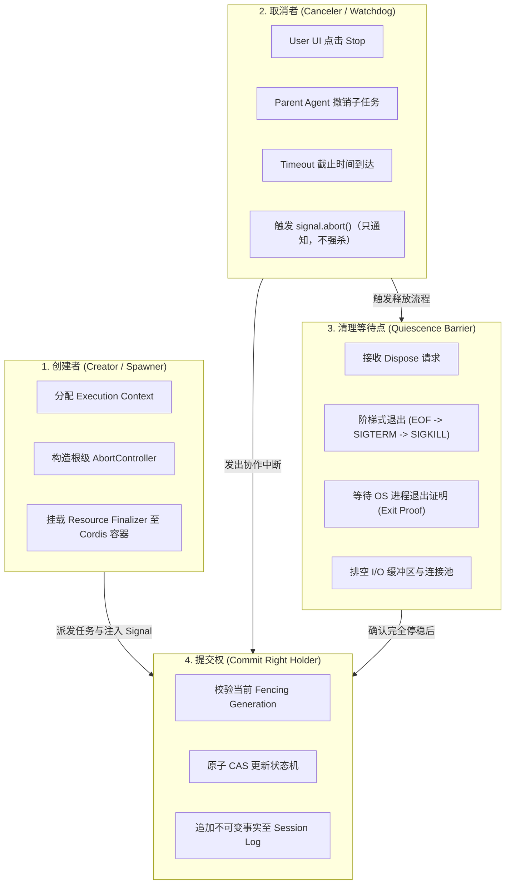
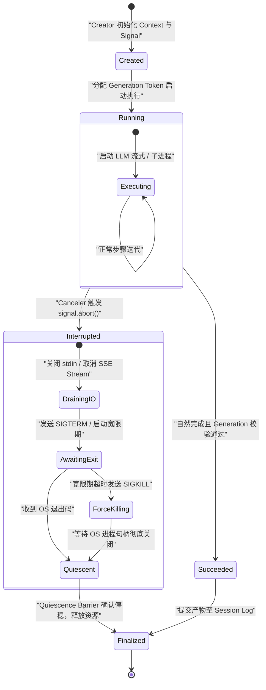
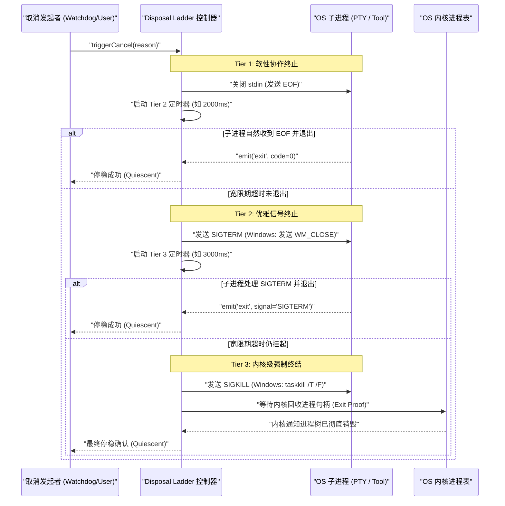
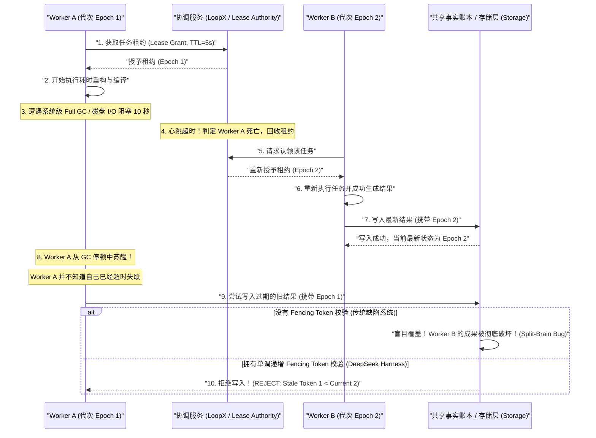

# Chapter 27: Concurrency, Cancellation, Timeouts, and Fencing

English | [中文](27-concurrency-cancellation-fencing.zh.md)

Traditional backend services often model high-concurrency requests as short-lived stateless work: an HTTP request arrives, a thread pool or coroutine scheduler assigns context, several milliseconds or seconds of microservice RPC and database queries follow, and one serialized result returns. If the request times out or the client disconnects, the framework can usually stop the coroutine and rely on the OS TCP stack and runtime garbage collector to reclaim connections and memory.

That model does not fit an AI agent system. A production agent runtime such as DeepSeek Harness with Graph Mode and LoopX has four distinctive properties:

1. **Long-running execution**: One agent Turn can contain several serial or parallel LLM inferences, each lasting 10–120 seconds, and long-running tool side effects such as a five-minute Bash build, cloning a large Git repository, or running Docker container tests.
2. **Substantial irreversible external side effects**: An agent may change host files, write to external databases, call payment or notification gateways, or dispatch distributed Workers. Garbage-collecting an in-memory object cannot undo these actions.
3. **Frequent human interaction and cooperative intervention**: A user can click Stop in the Web UI, change a prompt, inject steering instructions, or spend time approving a high-risk tool call.
4. **Distributed takeover and split-brain risk**: After the controller pauses for GC, loses network access, or fails over after a crash, a new instance may take over unfinished work. A stalled thread or subprocess from the old instance can resume seconds later and write stale data.

This chapter examines concurrency control, cooperative cancellation, timeout independence, and distributed Fencing Tokens in the agent runtime. It relates these concepts to operating systems, compilers, and distributed systems, then uses mathematical reasoning and TypeScript code to build asynchronous control with late-write rejection and reliable quiescence.

---

## 27.1 Mapping Core Concepts to Systems Engineering

The following table relates agent-runtime concurrency concepts to familiar operating-system and distributed-systems concepts:

| Agent-runtime concept | Systems / distributed-engineering analogue | Physical behavior and constraint |
| :--- | :--- | :--- |
| **Agent Turn / Step** | Transaction epoch | A scheduled execution unit with an atomic boundary and causal predecessors, including input claim, model inference, tool effects, and log persistence. |
| **`AbortSignal`** | Cooperative interrupt flag (`sig_atomic_t` / `InterruptedException`) | An in-memory atomic Boolean and event publisher. It is **not** a command that forcibly kills a thread or process; it asks the executor to stop cooperatively. |
| **Quiescence** | RCU grace period / drain fence | The final state of disposal, demonstrating that child OS processes exited, network buffers drained, and pending callbacks cleared. |
| **Fencing Token** | Monotonically increasing generation lock (epoch / generation lease) | A globally or lease-scoped strictly increasing integer $\tau \in \mathbb{N}$ used by storage CAS to reject stale-epoch writes. |
| **CAS Write Verification** | Optimistic compare-and-swap (`CMPXCHG` / OCC) | An atomic storage-write precondition: accept only tokens $\tau \ge \tau_{\text{current}}$ and advance $\tau_{\text{current}} \leftarrow \tau$. |
| **Approval Generation** | Replay-resistant, era-bound capability / nonce | Binds human approval to a precise session epoch so an old approval cannot authorize a different operation after cancellation and restart. |
| **Timeout Orthogonality** | Independent exit-status triple ($\langle\text{Code}, \text{Signal}, \text{TimedOut}\rangle$) | Exit code, termination signal, and timeout flag are independent. A child that catches an interrupt and exits 0 must still be marked as timed out. |

---

## 27.2 Asynchronous Ownership: Four Separate Authorities

Memory leaks, orphaned or zombie processes, and corrupted workspace files often come from **confused responsibilities**: prototypes combine task creation, cancellation, resource recovery, and fact commitment in one function or global object.

DeepSeek Harness uses an **asynchronous ownership model** with four distinct, non-escalating runtime roles:



### 27.2.1 Precise Definition of the Four Authorities

1. **Creator / Spawner**:
   - Responsibility: Initially owns the resource, initializes the dependency Context, creates a unique task ID and root `AbortController`, and registers resource Finalizers in Cordis.
   - Constraint: Holds a handle for the task lifetime but must not arbitrarily change its internal execution variables after it starts.

2. **Commit Right / Head Ownership**:
   - Responsibility: The **only authority that may append events to the Session Log or write final artifacts to durable storage**.
   - Constraint: Exclusive and generation-bound. A commit must present the current `Generation` or `Fencing Token`. Storage drops any output from work that lost the commit right.

3. **Canceler / Interruptor**:
   - Responsibility: An external controller such as a user pressing Stop in the Web UI, a parent agent that no longer needs a child, or a global timeout watchdog.
   - Constraint: **May only request interruption by calling `controller.abort()`**. It **must not** invoke low-level memory release or forcibly terminate cross-process communication. Cleanup and waiting belong to the disposal barrier.

4. **Quiescence Barrier / Drain Fence**:
   - Responsibility: The lifecycle disposer's guard. On cleanup or cancellation, it establishes an asynchronous barrier and coordinates physical resources—subprocesses, stream listeners, file descriptors, and database transactions—until all are **physically quiescent**.
   - Constraint: The runtime must not mark the task terminal or reuse its workspace until the quiescence barrier resolves.

### 27.2.2 Ownership State Machine

The following diagram traces a task from creation and execution through cancellation, quiescence, and release of the commit right:



### 27.2.3 TypeScript Types for Ownership and Authority

Use typed interfaces to separate these four authorities at the implementation level so callers cannot confuse their permissions:

```typescript
/**
 * 任务代次（Generation）标识符，必须随重试与重新认领单调递增
 */
export type Generation = number & { readonly __brand: unique symbol };

export function createGeneration(n: number): Generation {
  if (!Number.isSafeInteger(n) || n < 0) {
    throw new TypeError(`Invalid generation value: ${n}`);
  }
  return n as Generation;
}

/**
 * 1. 创建者权能：负责资源的生命周期配置与句柄管理
 */
export interface TaskSpawner<TInput, TOutput> {
  readonly taskId: string;
  spawn(input: TInput, parentSignal?: AbortSignal): TaskHandle<TOutput>;
}

/**
 * 2. 提交权持有者：必须携带当前代次方可提交事实
 */
export interface CommitGuard<TData> {
  readonly targetId: string;
  readonly generation: Generation;
  commit(data: TData): Promise<{ committed: boolean; currentGeneration: Generation }>;
}

/**
 * 3. 取消者权能：仅暴露只读信号与中断触发器
 */
export interface CancellationHandle {
  readonly signal: AbortSignal;
  requestCancel(reason: 'user' | 'timeout' | 'parent_abort'): void;
}

/**
 * 4. 停稳探测权能：生命周期回收者必须等待 Quiescence Barrier
 */
export interface QuiescenceProbe {
  /**
   * 返回一个 Promise，该 Promise 仅在底层所有物理资源（OS 进程、网络流、锁）完全释放后才 resolve。
   * 绝不能因为超时或异常而提前假装成功。
   */
  whenQuiescent(): Promise<void>;
  readonly isQuiescent: boolean;
}

/**
 * 组合任务句柄：向外暴露的受限外观接口
 */
export interface TaskHandle<TOutput> {
  readonly taskId: string;
  readonly generation: Generation;
  readonly cancellation: CancellationHandle;
  readonly quiescence: QuiescenceProbe;
  readonly result: Promise<TOutput>;
}
```

---

## 27.3 Cooperative Cancellation: From Signal Delivery to Quiescence

Early Java `Thread` APIs included `stop()`, `suspend()`, and `resume()`, which let one thread forcibly stop another. They were later deprecated and prohibited in production use.

Why is forcibly killing asynchronous work dangerous in an agent system? Consider:

1. **Corrupted shared workspace files**: An agent writes 500 KB of refactored code to `package.json` or a core source file and is killed after 120 KB. The disk holds truncated JSON or code, damaging later tool runs and human intervention.
2. **Poisoned mutexes**: Killing work while it holds a SQLite write lock, exclusive file lock (`flock`), or in-memory mutex can leave that lock unreleased and deadlock the host.
3. **Half-open TCP connections and wasted GPU VRAM**: Forcibly killing the local client may leave the remote LLM cluster, such as DeepSeek V3/R1, unaware. Autoregressive generation continues for thousands of tokens, occupying KV Cache VRAM and incurring API charges.

Therefore **production agents must cancel cooperatively**.

### 27.3.1 What `AbortSignal` Does

In Web standards and Node.js, `AbortSignal` carries Boolean state and publishes an event. Its in-memory model resembles a small structure:

```text
+-------------------------------------------------------------+
|                     AbortSignal Memory Layout               |
+-------------------------------------------------------------+
|  aborted: boolean (atomic flag)                            |
|  reason: any (DOMException | Error | CustomReason)          |
|  listeners: Set<(event: Event) => void>                    |
+-------------------------------------------------------------+
```

Calling `AbortController.abort(reason)` performs two synchronous steps:
1. Set `aborted` to `true` and store `reason`.
2. Iterate over and invoke callbacks in `listeners`.

**Key implication**: `AbortSignal` **cannot stop execution by itself**. A CPU-bound tool loop, such as an infinite AST parse, or a blocking C++ extension that ignores `signal` continues even after `abort()`.

### 27.3.2 Three-Tier Escalating Disposal Ladder

DeepSeek Harness uses a **three-tier escalating disposal ladder** to ensure that subprocesses and network I/O reach quiescence within bounded time:



### 27.3.3 Antipattern: Why `Promise.race` Is Dangerous

A beginner agent loop often contains code like this:

```typescript
// ❌ 极度危险的严重反模式！严禁在生产代码中使用！
async function runToolWithTimeout(tool: Tool, args: unknown, timeoutMs: number) {
  const timeoutPromise = new Promise((_, reject) =>
    setTimeout(() => reject(new Error("Timeout")), timeoutMs)
  );

  // 表面上超时抛出了异常，但 tool.execute() 仍在后台默默运行！
  return Promise.race([tool.execute(args), timeoutPromise]);
}
```

**Failure sequence**:
1. The user asks the agent to run a long tool operation, such as a bulk database migration.
2. `runToolWithTimeout` times out after 5000 ms. `Promise.race` rejects, so the outer agent marks the step failed and proceeds.
3. Believing the prior step failed, the agent starts a rollback. Yet **the discarded `tool.execute()` never stopped** and continues writing to the database in the background.
4. The rollback and the background ghost task write concurrently to the same database, corrupting data.

**Rule**: **Never use `Promise.race` to abandon running work. Pass `AbortSignal` down on cancellation or timeout, and explicitly `await` quiescence before proceeding.**

### 27.3.4 Production Cross-Platform Process-Quiescence Controller

The following DeepSeek Harness implementation controls process lifecycles and quiescence, including precise escalation and waiting for Windows process trees and POSIX process groups:

```typescript
import { spawn, ChildProcess } from 'node:child_process';
import { EventEmitter, once } from 'node:events';

export interface ProcessOutcome {
  readonly exitCode: number | null;
  readonly signal: NodeJS.Signals | null;
  readonly timedOut: boolean;
  readonly durationMs: number;
}

export interface ManagedProcessOptions {
  readonly command: string;
  readonly args: readonly string[];
  readonly cwd: string;
  readonly env?: Record<string, string>;
  readonly timeoutMs?: number;
  readonly gracefulGraceMs?: number;
  readonly forceGraceMs?: number;
}

/**
 * 工业级进程生命周期管理器：保障任何情况下均能达到物理停稳 (Quiescence)
 */
export class ManagedProcessLifecycle {
  private child: ChildProcess | null = null;
  private readonly isWindows = process.platform === 'win32';
  private quiescencePromise: Promise<ProcessOutcome> | null = null;
  private timedOut = false;
  private startTime = 0;

  constructor(private readonly options: ManagedProcessOptions) {}

  public async run(externalSignal?: AbortSignal): Promise<ProcessOutcome> {
    if (this.quiescencePromise) {
      return this.quiescencePromise;
    }

    if (externalSignal?.aborted) {
      return {
        exitCode: null,
        signal: 'SIGINT',
        timedOut: false,
        durationMs: 0,
      };
    }

    this.startTime = Date.now();
    this.quiescencePromise = this.executeLifecycle(externalSignal);
    return this.quiescencePromise;
  }

  private async executeLifecycle(externalSignal?: AbortSignal): Promise<ProcessOutcome> {
    const { command, args, cwd, env, timeoutMs = 60_000, gracefulGraceMs = 2_000, forceGraceMs = 3_000 } = this.options;

    // 在 POSIX 上开启 detached 以创建独立进程组，便于整体 kill
    this.child = spawn(command, args, {
      cwd,
      env: { ...process.env, ...env },
      detached: !this.isWindows,
      stdio: ['pipe', 'pipe', 'pipe'],
    });

    const child = this.child;
    let timeoutTimer: NodeJS.Timeout | null = null;
    let isTerminating = false;

    // 1. 设置超时看门狗
    if (timeoutMs > 0 && timeoutMs !== Number.POSITIVE_INFINITY) {
      timeoutTimer = setTimeout(() => {
        this.timedOut = true;
        void this.terminateLadder(gracefulGraceMs, forceGraceMs);
      }, timeoutMs);
      timeoutTimer.unref();
    }

    // 2. 绑定外部取消信号
    const abortHandler = () => {
      void this.terminateLadder(gracefulGraceMs, forceGraceMs);
    };

    if (externalSignal) {
      externalSignal.addEventListener('abort', abortHandler, { once: true });
    }

    try {
      // 3. 等待底层真正的 exit 事件（物理停稳证据）
      const [code, signal] = (await once(child, 'exit')) as [number | null, NodeJS.Signals | null];

      const durationMs = Date.now() - this.startTime;
      return {
        exitCode: code,
        signal,
        timedOut: this.timedOut,
        durationMs,
      };
    } finally {
      if (timeoutTimer) clearTimeout(timeoutTimer);
      if (externalSignal) externalSignal.removeEventListener('abort', abortHandler);
      this.child = null;
    }
  }

  /**
   * 执行三级逐级升级清理阶梯
   */
  public async terminateLadder(gracefulGraceMs = 2_000, forceGraceMs = 3_000): Promise<void> {
    const child = this.child;
    if (!child || child.killed || child.exitCode !== null) {
      return;
    }

    // Tier 1: 尝试关闭 stdin 发送 EOF
    try {
      if (child.stdin && !child.stdin.destroyed) {
        child.stdin.end();
      }
    } catch {
      // 忽略管道关闭错误
    }

    // 等待一小段观察是否能够自行根据 EOF 停稳
    const exitedEarly = await this.waitForExitProof(500);
    if (exitedEarly) return;

    // Tier 2: 发送优雅终止信号 (SIGTERM)
    this.sendSignalToProcessGroup('SIGTERM');

    // 等待优雅停稳宽限期
    const exitedGracefully = await this.waitForExitProof(gracefulGraceMs);
    if (exitedGracefully) return;

    // Tier 3: 发送强制终结信号 (SIGKILL)
    this.sendSignalToProcessGroup('SIGKILL');

    // 强杀后依然必须等待 OS 彻底关闭句柄
    await this.waitForExitProof(forceGraceMs);
  }

  private sendSignalToProcessGroup(signal: NodeJS.Signals): void {
    const child = this.child;
    if (!child || child.pid === undefined) return;

    try {
      if (this.isWindows) {
        // Windows 平台：使用 taskkill 递归销毁进程树
        const flag = signal === 'SIGKILL' ? '/F' : '';
        spawn('taskkill', ['/pid', child.pid.toString(), '/T', flag].filter(Boolean), {
          stdio: 'ignore',
        });
      } else {
        // POSIX 平台：向负 PID 进程组发送信号
        process.kill(-child.pid, signal);
      }
    } catch (error: unknown) {
      // 进程可能已经提前退出，捕获 ESRCH
      const err = error as NodeJS.ErrnoException;
      if (err.code !== 'ESRCH') {
        console.error(`Failed to send ${signal} to pid ${child.pid}:`, err);
      }
    }
  }

  private async waitForExitProof(timeoutMs: number): Promise<boolean> {
    const child = this.child;
    if (!child || child.exitCode !== null || child.signalCode !== null) {
      return true;
    }

    return new Promise((resolve) => {
      let timer: NodeJS.Timeout | null = null;

      const onExit = () => {
        if (timer) clearTimeout(timer);
        resolve(true);
      };

      timer = setTimeout(() => {
        child.removeListener('exit', onExit);
        resolve(false);
      }, timeoutMs);

      child.once('exit', onExit);
    });
  }
}
```

---

## 27.4 Timeout and Cancellation Are Independent: State Separation and Normalized Results

A completed subprocess has several independently observable outcomes. Collapsing them into one Boolean such as `success: boolean` creates hidden errors.

### 27.4.1 The Trap of Exit Code Zero

Consider a recurring production failure:

An agent runs Python test script `run_tests.py`, which handles termination signals for graceful exit:

```python
import signal
import sys
import time

def handle_sigterm(signum, frame):
    print("Received SIGTERM, saving checkpoint and exiting cleanly...")
    # 业务开发者误以为'捕获并清理完毕'应当返回正常退出码
    sys.exit(0)

signal.signal(signal.SIGTERM, handle_sigterm)
# 模拟死循环测试
while True:
    time.sleep(1)
```

**Failure sequence**:
1. Harness sets a ten-second timeout for the tool.
2. After ten seconds, the Harness watchdog sends `SIGTERM` to the child.
3. The Python script catches `SIGTERM`, logs it, and calls `sys.exit(0)`.
4. The OS reports `exitCode = 0` and `signal = null` to the Node.js parent.
5. **Faulty check**: `if (code === 0) { markStepSuccess(); }`.
6. **Consequence**: Harness reports the tests passed. The agent then decides to merge and release code whose tests did not finish.

### 27.4.2 Mathematical Definition of Independent Outcome Fields

To remove this ambiguity, represent process or tool execution with an **orthogonal outcome triple**:

$$\text{ExecutionOutcome} = \langle \mathcal{C}, \mathcal{S}, \mathcal{T} \rangle$$

Its components are:
- $\mathcal{C} \in \mathbb{Z} \cup \{\text{null}\}$: The process exit code returned by the OS kernel.
- $\mathcal{S} \in \text{Signals} \cup \{\text{null}\}$: The POSIX signal that terminated the process, such as `SIGTERM`, `SIGKILL`, or `SIGINT`.
- $\mathcal{T} \in \{\text{true}, \text{false}\}$: Whether the Harness watchdog determined that the operation timed out.

These dimensions are physically independent. Their outcome table is:

| Case | Exit code ($\mathcal{C}$) | Termination signal ($\mathcal{S}$) | Timed out ($\mathcal{T}$) | Actual meaning | Normalized result |
| :--- | :--- | :--- | :--- | :--- | :--- |
| **1** | `0` | `null` | `false` | Child finishes naturally without external intervention | **Success** |
| **2** | `> 0` | `null` | `false` | Child finishes normally but reports a business error | **Failed** |
| **3** | `0` | `null` | `true` | **Critical trap**: Child was stopped after timeout, but its signal handler returned zero | **TimedOut** |
| **4** | `null` | `SIGTERM` | `true` | Child times out and exits after SIGTERM | **TimedOut** |
| **5** | `null` | `SIGKILL` | `true` | Child times out, does not respond, and is killed by the third disposal tier | **TimedOut** |
| **6** | `null` | `SIGTERM` | `false` | User presses Stop to cancel | **Canceled** |
| **7** | `null` | `SIGINT` | `false` | Parent agent revokes a subtask | **Canceled** |

### 27.4.3 Normalized Discriminated Union

Normalize the raw low-level outcome into a TypeScript union with an explicit discriminant:

```typescript
/**
 * 归一化后的终态判别联合类型
 */
export type NormalizedExecutionResult<TData> =
  | { readonly kind: 'completed'; readonly data: TData; readonly durationMs: number }
  | { readonly kind: 'failed'; readonly exitCode: number; readonly stderr: string; readonly durationMs: number }
  | { readonly kind: 'timed_out'; readonly timeoutMs: number; readonly partialOutput: string; readonly durationMs: number }
  | { readonly kind: 'canceled'; readonly reason: 'user' | 'parent'; readonly durationMs: number };

export function normalizeProcessOutcome<TData>(
  raw: ProcessOutcome,
  parseSuccessData: () => TData,
  stdout: string,
  stderr: string,
  timeoutMs: number,
): NormalizedExecutionResult<TData> {
  // 核心防御：只要看门狗判定超时，无论退出码是多少，一律归为 timed_out！
  if (raw.timedOut) {
    return {
      kind: 'timed_out',
      timeoutMs,
      partialOutput: stdout + '\n' + stderr,
      durationMs: raw.durationMs,
    };
  }

  // 检查是否被外部主动取消（非超时）
  if (raw.signal === 'SIGTERM' || raw.signal === 'SIGINT') {
    return {
      kind: 'canceled',
      reason: 'user',
      durationMs: raw.durationMs,
    };
  }

  // 正常业务退出码判定
  if (raw.exitCode === 0) {
    return {
      kind: 'completed',
      data: parseSuccessData(),
      durationMs: raw.durationMs,
    };
  }

  return {
    kind: 'failed',
    exitCode: raw.exitCode ?? -1,
    stderr,
    durationMs: raw.durationMs,
  };
}
```

---

## 27.5 Monotonically Increasing Fencing Tokens and Split-Brain Defense

In distributed agent collaboration, such as Graph Mode with LoopX, Workers may run on separate machines or in containers. A conventional Lease/Heartbeat design alone cannot guarantee concurrency correctness in every case.

### 27.5.1 Classic Split-Brain Sequence (Martin Kleppmann's GC-Pause Example)

The following distributed-execution sequence shows how stale data can overwrite current data without a Fencing Token:



### 27.5.2 Formal Proof of the Fencing-Token Algorithm

To establish linearizable behavior, define the Fencing Token and storage state machine formally:

#### 1. Monotonically Increasing Order
Let the global or per-task-slot generation sequence be $\{\tau_k\}_{k=1}^{\infty}$, strictly increasing:

$$\forall i < j \implies \tau_i < \tau_j \quad (\tau \in \mathbb{N})$$

Each lease grant or takeover atomically generates $\tau_{\text{new}} = \tau_{\text{current}} + 1$.

#### 2. Atomic Storage Compare-and-Swap Condition

Storage retains the highest accepted generation $\mathcal{F}(K) \in \mathbb{N}$ and value $\mathcal{D}(K)$ for key $K$.

When a client submits $\text{Write}(K, \text{Value}, \tau)$, storage performs this atomic compare-and-swap:

$$\text{Apply}(K, \text{Value}, \tau) = \begin{cases} \mathbf{COMMIT} \implies (\mathcal{D}(K) \leftarrow \text{Value}, \mathcal{F}(K) \leftarrow \tau), & \text{if } \tau \ge \mathcal{F}(K) \\ \mathbf{REJECT}(\text{ErrStaleGeneration}) \implies \text{No-Op}, & \text{if } \tau < \mathcal{F}(K) \end{cases}$$

#### 3. Why Lease-Clock Drift Does Not Break Correctness

- Severe client-clock drift or a packet delayed ten minutes in transit can affect how quickly a client *acquires* a lease.
- The final authority over a write is storage. If it atomically checks $\tau \ge \mathcal{F}(K)$, a late stale-generation RPC is rejected at the storage entry point.

### 27.5.3 Binding Human Approval to a Generation

In an agent system with human intervention, Fencing Token reasoning extends to an **Approval Generation ticket**.

#### Failure Scenario: Approval from an Earlier Turn

1. **Turn 1 (Gen 1)**: The agent plans `executeBash("rm -rf /tmp/build_cache")`. Harness pauses for approval and asks the user whether to delete the cache directory.
2. The user is in a meeting and does not respond immediately.
3. Meanwhile, Harness reaches an idle timeout or receives a new user message in another window: "Do not delete it; use another approach."
4. The agent Turn is cancelled and **Turn 2 (Gen 2)** begins. In Turn 2, the agent decides to call `deployProduction()`, which also requires approval.
5. The user returns and clicks Approve on the confirmation dialog still open in the earlier window, believing it applies to the current operation.
6. **Without a Generation-bound approval**: The runtime receives that approval and may mistakenly authorize Turn 2's production deployment.

#### Remedy: Generation-Bound Authorization Ticket

Harness requires every human approval to carry an unforgeable ticket with Generation, node ID, and argument hash:

```typescript
export interface ApprovalTicket {
  readonly ticketId: string;
  readonly sessionId: string;
  readonly generation: Generation;
  readonly actionName: string;
  readonly actionPayloadDigest: string; // SHA-256 哈希
  readonly issuedAt: number;
  readonly expiresAt: number;
}
```

Immediately before tool execution, the runtime atomically checks:

$$\text{CurrentSession.Generation} == \text{Ticket.Generation} \land \text{Hash}(\text{Payload}) == \text{Ticket.ActionPayloadDigest}$$

As soon as the Turn changes, all tickets from the earlier Generation become invalid in memory.

---

## 27.6 Memory Model, Data Layout, and Protocol Events

This section describes the data layout, SQLite tables, and event messages for concurrency and Fencing.

### 27.6.1 SQLite Data Model for the Fencing Ledger

At the persistence layer—for example, LoopX coordination or a local SQLite backend—the Fencing table is:

```sql
-- 任务执行与 Fencing 代次权威状态表
CREATE TABLE IF NOT EXISTS graph_node_execution_ledger (
    node_id TEXT NOT NULL PRIMARY KEY,
    session_id TEXT NOT NULL,
    current_generation INTEGER NOT NULL DEFAULT 1,
    lease_owner_id TEXT,
    lease_expires_at INTEGER,
    execution_status TEXT NOT NULL CHECK(execution_status IN ('idle', 'claimed', 'running', 'settled', 'canceled')),
    staged_output_hash TEXT,
    settled_at INTEGER,
    updated_at INTEGER NOT NULL
);

-- 原子 CAS 认领与代次递增查询
-- 只有当当前状态为非终态且代次匹配时，才允许 Worker 接管并推高 Generation
UPDATE graph_node_execution_ledger
SET current_generation = current_generation + 1,
    lease_owner_id = :new_worker_id,
    lease_expires_at = :new_expires_at,
    execution_status = 'running',
    updated_at = :current_timestamp
WHERE node_id = :node_id
  AND current_generation = :expected_generation
  AND execution_status != 'settled';
```

### 27.6.2 JSON Protocol Events for Concurrency and Cancellation

In DeepSeek Harness `session/event` and `agent/*` protocols, typed events report every concurrency and cancellation state transition:

#### 1. Cancellation Request (`agent/cancel-requested`)
```json
{
  "seq": 1042,
  "type": "agent/cancel-requested",
  "timestamp": 1756110524000,
  "payload": {
    "sessionId": "sess_8f9a2b1c",
    "turnId": "turn_04",
    "generation": 3,
    "cause": "user",
    "activeStepId": "step_12"
  }
}
```

#### 2. Rejection of a Late Write (`fencing/rejected`)
```json
{
  "seq": 1043,
  "type": "fencing/rejected",
  "timestamp": 1756110524150,
  "payload": {
    "nodeId": "node_compile_assets",
    "attemptedWorkerId": "worker_host_01_pid_8821",
    "staleGeneration": 2,
    "authoritativeGeneration": 3,
    "action": "commit_output",
    "reason": "STALE_GENERATION_EPOCH"
  }
}
```

#### 3. Quiescence Confirmation (`quiescence/settled`)
```json
{
  "seq": 1044,
  "type": "quiescence/settled",
  "timestamp": 1756110525200,
  "payload": {
    "resourceId": "proc_bash_subshell_4910",
    "ladderLevelReached": 2,
    "exitCode": null,
    "signal": "SIGTERM",
    "drainedBytes": 45120,
    "cleanQuiescent": true
  }
}
```

### 27.6.3 Resource-Reclamation State Matrix

This table shows the baseline state of physical resources at each task transition:

| Transition | CPU process tree (OS PID) | GPU / KV Cache VRAM | TCP socket / SSE stream | SQLite WAL write lock |
| :--- | :--- | :--- | :--- | :--- |
| **`cancel()` received** | Alive (received EOF / graceful signal) | Send HTTP Abort to inference server | Stop receiving new chunks and close Reader | Mark transaction interrupted; await rollback |
| **Disposal Tier 1** | Alive (child cleaning local state) | Server begins releasing sequence slots | Send TCP RST / FIN | Prepare to roll back uncommitted temporary log |
| **Disposal Tier 2** | Receives `SIGTERM` and is about to exit | Inference cluster releases KV Cache blocks | Physical socket closed (`fd` reclaimed) | Execute `ROLLBACK TRANSACTION` |
| **Quiescent Settled** | **Fully destroyed (PID removed by kernel)** | **All VRAM returned to GPU pool** | **All handles detached** | **Lock released and state returned to `idle`** |

---

## 27.7 Hands-On: A Production Concurrency and Fencing Controller

This section implements a complete production-defensive TypeScript concurrency and Fencing module with these components:

1. **`GenerationAsyncController`**: Advances generations and supports cascading cancellation and a quiescence grace period.
2. **`FencedAtomicStorage<T>`**: Simulates durable atomic storage with generation CAS and late-write rejection.
3. **`HumanApprovalEpochGate`**: Binds human approval to a Generation epoch and SHA-256 argument hash.
4. **End-to-end integration suite**: Replays Worker A pausing, Worker B taking over, rejection of A's late write, and rejection of stale approval.

### 27.7.1 Complete Implementation

```typescript
import { createHash } from 'node:crypto';

// ============================================================================
// 1. 类型定义与代次工厂
// ============================================================================

export type Generation = number & { readonly __brand: unique symbol };

export function toGeneration(n: number): Generation {
  if (!Number.isSafeInteger(n) || n < 1) {
    throw new Error(`Generation must be a positive integer, received: ${n}`);
  }
  return n as Generation;
}

export interface FencedRecord<T> {
  readonly data: T;
  readonly generation: Generation;
  readonly updatedAt: number;
}

export interface ApprovalRequest {
  readonly ticketId: string;
  readonly actionName: string;
  readonly payload: unknown;
  readonly generation: Generation;
  readonly expiresAt: number;
}

export interface ApprovalDecision {
  readonly ticketId: string;
  readonly approved: boolean;
  readonly signedGeneration: Generation;
  readonly payloadDigest: string;
}

// ============================================================================
// 2. Generation 异步控制器 (支持取消、停稳等待与代次递增)
// ============================================================================

export class GenerationAsyncController {
  private currentGen: Generation = toGeneration(1);
  private activeAbortController: AbortController | null = null;
  private activeWorkPromise: Promise<void> | null = null;
  private isSettled = true;

  public get generation(): Generation {
    return this.currentGen;
  }

  public get signal(): AbortSignal {
    if (!this.activeAbortController) {
      this.activeAbortController = new AbortController();
    }
    return this.activeAbortController.signal;
  }

  /**
   * 开启一个全新的代次。如果前一个代次仍在运行，必须先取消并等待其彻底停稳！
   */
  public async advanceGeneration(): Promise<Generation> {
    await this.cancelAndDrain();
    this.currentGen = toGeneration(this.currentGen + 1);
    this.activeAbortController = new AbortController();
    this.isSettled = false;
    return this.currentGen;
  }

  /**
   * 注册当前代次正在执行的主任务 Promise，用于停稳屏障
   */
  public registerWork(work: Promise<void>): void {
    this.activeWorkPromise = work;
    this.isSettled = false;
  }

  /**
   * 协作式取消并等待所有存活资源完全停稳 (Quiescence Barrier)
   */
  public async cancelAndDrain(): Promise<void> {
    if (this.activeAbortController && !this.activeAbortController.signal.aborted) {
      this.activeAbortController.abort(new Error(`Superseded by generation ${this.currentGen + 1}`));
    }

    if (this.activeWorkPromise) {
      try {
        // 必须显式等待底层工作完成或捕获中止
        await this.activeWorkPromise;
      } catch {
        // 吞掉取消导致的预料中异常
      } finally {
        this.activeWorkPromise = null;
      }
    }

    this.isSettled = true;
  }

  public get isQuiescent(): boolean {
    return this.isSettled;
  }
}

// ============================================================================
// 3. 带 CAS Fencing Token 防迟到写入的存储模拟器
// ============================================================================

export class StaleGenerationError extends Error {
  constructor(
    public readonly key: string,
    public readonly attemptedGen: Generation,
    public readonly authoritativeGen: Generation,
  ) {
    super(
      `Write rejected on key '${key}': Attempted generation ${attemptedGen} is stale (Authoritative generation is ${authoritativeGen}).`,
    );
    this.name = 'StaleGenerationError';
  }
}

export class FencedAtomicStorage<T> {
  private readonly store = new Map<string, FencedRecord<T>>();

  /**
   * 带有单调递增 Fencing 校验的 CAS 原子写入
   */
  public async commit(key: string, data: T, proposedGen: Generation): Promise<FencedRecord<T>> {
    const existing = this.store.get(key);

    if (existing) {
      // 核心断言：提议代次必须大于或等于存储层已知代次
      if (proposedGen < existing.generation) {
        throw new StaleGenerationError(key, proposedGen, existing.generation);
      }
    }

    const record: FencedRecord<T> = {
      data,
      generation: proposedGen,
      updatedAt: Date.now(),
    };

    this.store.set(key, record);
    return record;
  }

  public get(key: string): FencedRecord<T> | undefined {
    return this.store.get(key);
  }

  public clear(): void {
    this.store.clear();
  }
}

// ============================================================================
// 4. 绑定 Generation 纪元的人工审批安全网关
// ============================================================================

export class InvalidApprovalError extends Error {
  constructor(reason: string) {
    super(`Approval rejected: ${reason}`);
    this.name = 'InvalidApprovalError';
  }
}

export class HumanApprovalEpochGate {
  private readonly pendingRequests = new Map<string, ApprovalRequest>();

  public static calculateDigest(payload: unknown): string {
    const json = JSON.stringify(payload, Object.keys(payload ?? {}).sort());
    return createHash('sha256').update(json).digest('hex');
  }

  public requestApproval(
    ticketId: string,
    actionName: string,
    payload: unknown,
    currentGen: Generation,
    ttlMs = 30_000,
  ): ApprovalRequest {
    const request: ApprovalRequest = {
      ticketId,
      actionName,
      payload,
      generation: currentGen,
      expiresAt: Date.now() + ttlMs,
    };
    this.pendingRequests.set(ticketId, request);
    return request;
  }

  /**
   * 裁决审批凭证，严格校验纪元与数据一致性
   */
  public verifyAndConsumeDecision(decision: ApprovalDecision, currentSystemGen: Generation): void {
    const request = this.pendingRequests.get(decision.ticketId);

    if (!request) {
      throw new InvalidApprovalError(`Ticket '${decision.ticketId}' not found or already consumed.`);
    }

    if (Date.now() > request.expiresAt) {
      this.pendingRequests.delete(decision.ticketId);
      throw new InvalidApprovalError(`Ticket '${decision.ticketId}' has expired.`);
    }

    // 1. 核心纪元校验：审批时的 Generation 必须与当前系统 Generation 严格相等！
    if (decision.signedGeneration !== currentSystemGen || request.generation !== currentSystemGen) {
      throw new InvalidApprovalError(
        `Stale approval era! Ticket era is Gen ${request.generation}, Decision era is Gen ${decision.signedGeneration}, but current runtime is Gen ${currentSystemGen}.`,
      );
    }

    // 2. 载荷摘要防篡改校验
    const expectedDigest = HumanApprovalEpochGate.calculateDigest(request.payload);
    if (decision.payloadDigest !== expectedDigest) {
      throw new InvalidApprovalError(
        `Payload digest mismatch! Expected ${expectedDigest}, received ${decision.payloadDigest}.`,
      );
    }

    if (!decision.approved) {
      throw new InvalidApprovalError(`User explicitly denied the approval.`);
    }

    // 校验通过，消费掉该凭证，防止重放
    this.pendingRequests.delete(decision.ticketId);
  }
}
```

### 27.7.2 End-to-End Tests and Concurrent-Sequence Exercises

The following tests simulate network delay and GC suspension to reproduce a distributed split-brain sequence and verify Fencing Tokens and epoch-bound approval:

```typescript
async function runConcurrencyFencingDemonstration() {
  console.log('=== 开始并发、取消、超时与 Fencing 综合实战演练 ===\n');

  const storage = new FencedAtomicStorage<{ code: string }>();
  const controller = new GenerationAsyncController();
  const approvalGate = new HumanApprovalEpochGate();
  const fileKey = 'src/index.ts';

  // --------------------------------------------------------------------------
  // 场景 1：Worker A 启动 (Gen 1)，但由于网络慢在后台卡顿
  // --------------------------------------------------------------------------
  const gen1 = controller.generation;
  console.log(`[Step 1] Worker A 启动，认领任务，获得代次: Gen ${gen1}`);

  let workerAFinished = false;
  const workerAPromise = (async () => {
    try {
      console.log('[Worker A] 开始分析代码并生成重构补丁 (预期耗时 300ms)...');
      // 模拟耗时操作，期间监听取消信号
      for (let i = 0; i < 3; i++) {
        await new Promise((r) => setTimeout(r, 100));
        if (controller.signal.aborted) {
          console.log('[Worker A] 检测到取消信号，准备清理并退出...');
          return;
        }
      }
      console.log('[Worker A] 执行完毕，准备向存储层写入数据...');
      await storage.commit(fileKey, { code: 'console.log("From Worker A");' }, gen1);
      workerAFinished = true;
    } catch (err: unknown) {
      const error = err as Error;
      console.error(`[Worker A] 写入失败 (符合预期): ${error.message}`);
    }
  })();

  controller.registerWork(workerAPromise);

  // --------------------------------------------------------------------------
  // 场景 2：协调器判定超时，取消 Gen 1，并将代次推进至 Gen 2 分派给 Worker B
  // --------------------------------------------------------------------------
  await new Promise((r) => setTimeout(r, 150)); // 150ms 时发生超时与接管
  console.log('\n[Step 2] 系统检测到超时/用户指令变更，推进代次至 Gen 2 并接管任务...');

  const gen2 = await controller.advanceGeneration();
  console.log(`[Step 2] 成功停稳旧代次，当前系统代次已推进为: Gen ${gen2}`);

  // --------------------------------------------------------------------------
  // 场景 3：Worker B (Gen 2) 迅速完成并成功写入存储层
  // --------------------------------------------------------------------------
  console.log('\n[Step 3] Worker B 启动执行并向存储层提交...');
  const recordB = await storage.commit(fileKey, { code: 'console.log("From Worker B (Latest)");' }, gen2);
  console.log(`[Step 3] Worker B 写入成功！当前存储内容: '${recordB.data.code}', 版本: Gen ${recordB.generation}`);

  // --------------------------------------------------------------------------
  // 场景 4：模拟迟到写入 —— 假设 Worker A 恢复并强行尝试写回 Gen 1 数据
  // --------------------------------------------------------------------------
  console.log('\n[Step 4] 模拟 Worker A 发生迟到写入 (使用已作废的 Gen 1)...');
  try {
    await storage.commit(fileKey, { code: 'console.log("Stale write from Worker A");' }, gen1);
    console.error('❌ 致命错误：存储层未能拦截旧代次写入！');
  } catch (err: unknown) {
    const error = err as StaleGenerationError;
    console.log(`✅ 防御成功！存储层 CAS 成功拒绝旧代次: ${error.message}`);
  }

  // --------------------------------------------------------------------------
  // 场景 5：人工审批纪元绑定防御 —— 拦截跨代次的陈旧审批请求
  // --------------------------------------------------------------------------
  console.log('\n[Step 5] 演练人工审批与 Generation 纪元绑定...');
  const ticketId = 'appr_deploy_prod_001';
  const dangerousPayload = { action: 'deploy', target: 'production' };

  // 在 Gen 2 发起审批请求
  const req = approvalGate.requestApproval(ticketId, 'deploy', dangerousPayload, gen2);
  console.log(`[Step 5] 在 Gen ${gen2} 下发起高危审批: ${ticketId}`);

  // 此时系统由于外部事件再次发生了代次更替（推进到 Gen 3）
  const gen3 = await controller.advanceGeneration();
  console.log(`[Step 5] 系统发生突发重置，进入新代次: Gen ${gen3}`);

  // 构造一个基于旧 Gen 2 签发的审批决定
  const staleDecision: ApprovalDecision = {
    ticketId,
    approved: true,
    signedGeneration: gen2, // 旧代次签名
    payloadDigest: HumanApprovalEpochGate.calculateDigest(dangerousPayload),
  };

  try {
    console.log('[Step 5] 尝试使用旧 Gen 2 签发的审批单在 Gen 3 下执行授权...');
    approvalGate.verifyAndConsumeDecision(staleDecision, gen3);
    console.error('❌ 致命错误：陈旧审批竟然通过了验证！');
  } catch (err: unknown) {
    const error = err as InvalidApprovalError;
    console.log(`✅ 防御成功！审批网关精准拦截陈旧纪元授权: ${error.message}`);
  }

  console.log('\n=== 并发、取消、超时与 Fencing 综合演练圆满完成 ===');
}

// 执行演练
void runConcurrencyFencingDemonstration();
```

---

## 27.8 Production Incidents and Troubleshooting

Concurrency and cancellation failures in large agent systems can be hard to reproduce and highly destructive. Four representative incidents and their causes and remedies follow.

### 27.8.1 Incident 1: `Promise.race` Returns Early and an Orphan Process Corrupts the Workspace

- **Symptom**: In the Web UI, a user cancels a code-refactoring task and submits a new request. Seconds later, damaged conflicting files appear in the Git repository and break the new task's build.
- **Root cause**: The tool uses `Promise.race([toolPromise, abortPromise])`. The frontend and agent loop return when `abortPromise` fires, but the Node.js child process continues writing to the filesystem and conflicts with the new work.
- **Fix**: Remove the `Promise.race` pattern. Use the three-tier escalating disposal ladder and `await` the child process's `exit` event as proof of exit. Start the next Turn only after quiescence.

### 27.8.2 Incident 2: An Unclosed LLM SSE Stream Exhausts GPU VRAM

- **Symptom**: Many users repeatedly click Stop and retry. GPU VRAM in the vLLM/SGLang inference cluster reaches 100%, then CUDA out-of-memory crashes the cluster.
- **Root cause**: On Stop, the frontend closes only the browser WebSocket. The agent host gateway does not terminate the HTTP connection to the model provider with `signal` (TCP FIN/RST), so inference continues for thousands of tokens and holds KV Cache VRAM.
- **Fix**: In the LLM adapter, pass the session `AbortSignal` to the underlying `fetch()` request (`fetch(url, { signal })`). Close the HTTP stream on cancellation and enable `cancel_on_disconnect` in the inference server.

### 27.8.3 Incident 3: Approval from a Prior Turn Deletes Production Data

- **Symptom**: During a conversation, a user approves an agent operation, but the agent deletes a production cache table rather than the test table the user expected.
- **Root cause**: The agent asks to clean the test environment in Turn 1 and shows an approval dialog. The user instead sends another message, cancelling Turn 1. In Turn 2, the agent asks to clean production. The user clicks the old dialog's Approve button. Approval checks only `ticketId`, not `generation`, so stale approval authorizes the dangerous Turn 2 action.
- **Fix**: Issue approval tickets with `generation`, `actionName`, and `payloadHash`. Before execution, require exact generation equality (`Ticket.Generation === CurrentSession.Generation`). Invalidate pending approvals when the generation changes.

### 27.8.4 Incident 4: Killing Only the Parent on Windows Leaves a Child Holding a Port

- **Symptom**: An agent on Windows starts a test server with `npm run dev`. After timeout cancellation, the next task's server cannot bind the same port and reports `EADDRINUSE: address already in use`.
- **Root cause**: On Windows, `child.kill()` stops only top-level `cmd.exe` or `powershell.exe` by default. The actual listening `node.exe` child detaches and remains running.
- **Fix**: Use `taskkill /pid <PID> /T /F` on Windows, where `/T` recursively stops the process tree. Also wait through the Toolhelp32 API or OS process handles until every descendant exits.

### 27.8.5 Production Troubleshooting Checklist

For agent concurrency and cancellation problems, use this checklist:

```text
[ ] 1. 检查所有的异步工具与子进程是否都显式消费并监听了 exec.signal？
[ ] 2. 检查代码中是否存在任何 Promise.race([work, cancel]) 丢弃未停稳 Promise 的反模式？
[ ] 3. 检查 dispose() 与取消流程是否都实现了 Quiescence Barrier（等待 exit 证明）？
[ ] 4. 检查进程退出码的判断是否与 timedOut 标志进行了正交解耦（防止 exit(0) 掩盖超时）？
[ ] 5. 检查向共享存储或会话账本提交数据时，是否强制携带并校验了单调递增的 Fencing Token / Generation？
[ ] 6. 检查所有人机审批凭证是否强制绑定了当前轮次的 Generation 与参数 SHA-256 哈希？
[ ] 7. 在 Windows 平台上，是否使用了针对整棵进程树的递归销毁策略（taskkill /T）？
```

---

## 27.9 Summary and Exercises

### Core Principles

1. **Asynchronous ownership**: Separate the Creator, Commit Right, Canceler, and Quiescence Barrier. Do not blur authority or leave resources orphaned.
2. **Cooperative cancellation**: `AbortSignal` requests cooperation rather than forcibly killing work. Disposal uses the three-tier ladder (EOF $\to$ `SIGTERM` $\to$ `SIGKILL`) and awaits OS proof of exit to reach physical quiescence.
3. **Timeout independence**: Exit code, termination signal, and timeout flag are independent. A child interrupted by timeout that catches the signal and exits 0 must still be marked as a timeout failure.
4. **Fencing Tokens and CAS**: To prevent split-brain and late writes after GC pauses, storage must check monotonically increasing generations and reject stale writes atomically.
5. **Epoch-bound approval**: Bind human approval to a precise session Generation so approval from a prior Turn cannot authorize a later operation.

---

### Architecture Exercises

1. **Write a process-tree quiescence detector**:
   - Extend `ManagedProcessLifecycle`. On Linux, inspect `/proc/[pid]/task`; on Windows, use `Toolhelp32Snapshot`. After a child exits, scan for its descendants and verify that all orphaned descendants have died.

2. **Design a SQLite-based distributed Fencing lease manager**:
   - Use a real SQLite database with WAL mode and BEGIN IMMEDIATE transactions. Build a coordinator for multiprocess claims on task slots, heartbeat renewal, generation increments, and CAS rejection of late writes.

3. **Simulate SSE disconnect and VRAM release under network instability**:
   - Use Node.js `http` to build a mock streaming LLM server and client. Trigger client `abort()` after the fifth emitted token and check whether the server promptly observes `req.on('close')` and stops generating tokens.
