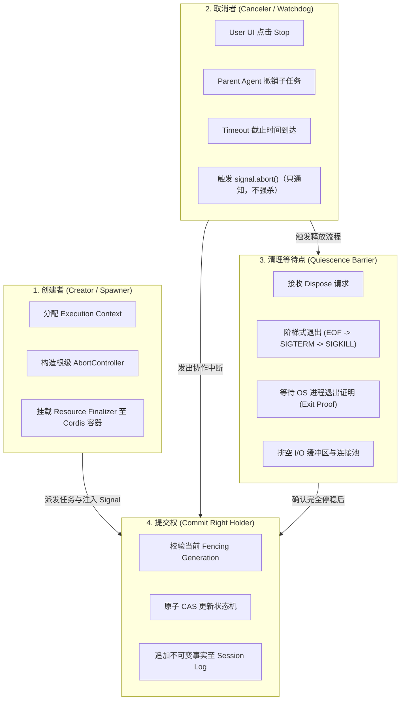
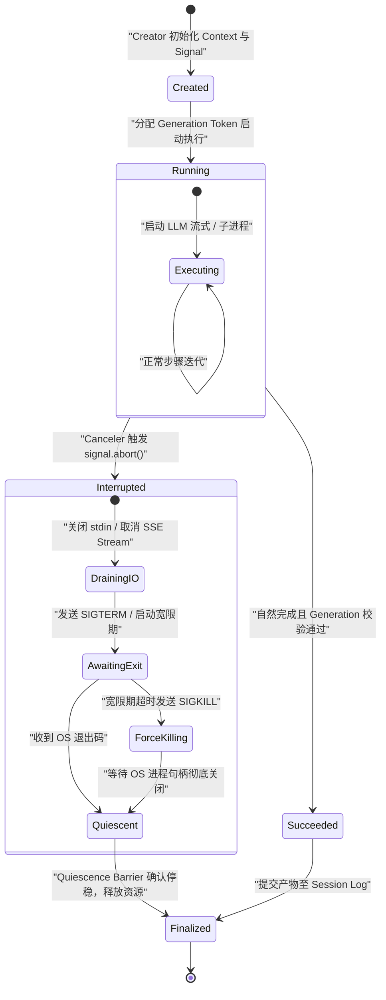
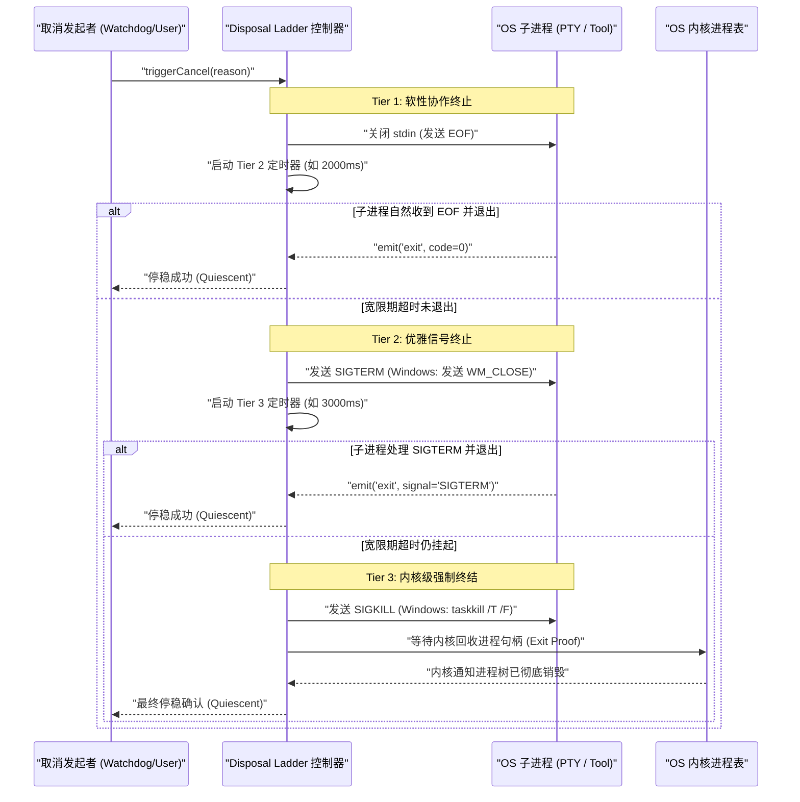
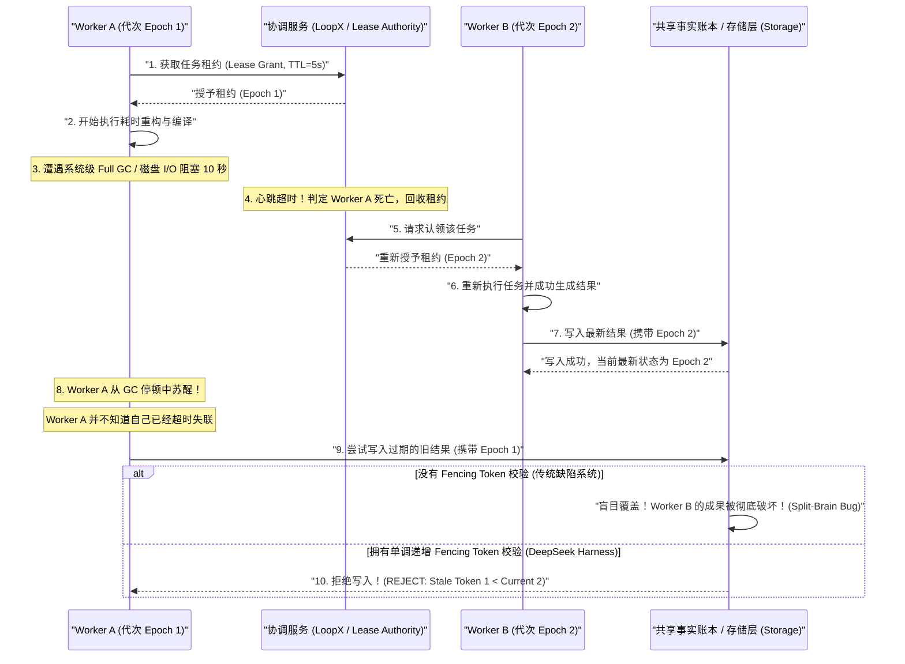

# 第 27 章：并发、取消、超时与 Fencing

[English](27-concurrency-cancellation-fencing.md) | 中文

在传统的后端服务架构中，处理高并发请求的心智模型通常建立在“无状态短生命周期任务”的基础之上：一个 HTTP 请求进入，线程池或协程调度器分配一个上下文，经过若干毫秒或秒级的微服务 RPC / 数据库查询后，将结果一次性序列化并返回客户端。如果请求发生超时或客户端断开连接，服务框架通常只需简单地中止协程，剩下的底层网络连接与内存对象便会由操作系统的 TCP 栈与运行时的垃圾回收器（GC）自动回收。

然而，在 AI 智能体（Agent）系统架构中，这一传统心智模型被彻底打破。一个现代生产级 Agent 系统（如 DeepSeek Harness、Graph Mode 与 LoopX）具备以下四个独特的系统工程特征：

1. **超长生命周期执行**：一次 Agent Turn（轮次）可能包含多次串行/并行的 LLM 推理（单次 10s～120s）以及长耗时的工具副作用（如执行 Bash 编译代码 5 分钟、拉取大型 Git 仓库、运行 Docker 容器测试）。
2. **严重的外部不可逆副作用**：Agent 在执行过程中会对宿主文件系统进行修改、向外部数据库写入数据、调用支付/通知网关，甚至在集群中派发分布式 Worker。这些操作绝不能通过简单的“内存对象垃圾回收”来抹平。
3. **高频的人机交互与协作式干预**：用户随时可能在 Web UI 点击“停止生成（Stop）”、修改提示词、注入中途引导指令（Steering），或者针对某个高风险工具调用进行长时间的人工审批（Human-in-the-Loop Approval）。
4. **分布式多实例接管与脑裂风险**：当主控节点遭遇 GC 停顿、网络抖动或发生崩溃故障转移时，新实例会接管未完成的任务。此时，旧实例中卡住的线程或子进程可能在数秒后“复活”并尝试继续写入数据，造成灾难性的数据踩踏（Split-Brain Data Corruption）。

本章将系统性地拆解 Agent 运行时中的并发控制、协作式取消、超时正交性与分布式 Fencing Token 核心算法。我们将 AI 领域中看似神秘的概念全面映射为传统操作系统、编译器与分布式系统的硬核工程概念，并通过严谨的数学推导与工业级 TypeScript 代码，手把手构建一个高可靠、防迟到写入、具备完整停稳保证的 Agent 异步控制底座。

---

## 27.1 核心概念系统映射表

为了帮助具备传统编程背景的工程师快速建立准确的系统级直觉，下表将 Agent 运行时的并发控制概念与传统操作系统、分布式系统中的经典概念进行深度对照。

| Agent 运行时概念 | 传统系统 / 分布式工程概念 | 底层物理本质与工程约束 |
| :--- | :--- | :--- |
| **Agent Turn / Step** | 事务执行期 (Transaction Epoch) | 一个具备原子边界与因果前序的调度执行单元；包含输入认领、模型推理、工具副作用与日志落盘。 |
| **`AbortSignal`** | 协作式中断标记位 (`sig_atomic_t` / `InterruptedException`) | 内存中的原子布尔状态与事件广播总线；**不是**暴力杀死线程/进程的指令，而是通知执行方“请主动停稳”的协作请求。 |
| **Quiescence (停稳态)** | RCU 宽限期 / 停流屏障 (Grace Period / Drain Fence) | 资源释放（Dispose）的最终状态；证明所有关联的 OS 子进程已退出、网络缓冲区已排空、未完成的回调已清空。 |
| **Fencing Token** | 单调递增代次锁 (Monotonic Epoch / Generation Lease) | 一个全局或租约范围内严格单调递增的整数 $\tau \in \mathbb{N}$；用于在存储层通过 CAS 拒绝旧代次（Stale Epoch）的迟到写入。 |
| **CAS Write Verification** | 乐观并发控制比较并交换 (`CMPXCHG` / OCC) | 存储层写入时的原子前置条件：只有当请求携带的 Token $\tau \ge \tau_{\text{current}}$ 时才允许写入并推进 $\tau_{\text{current}} \leftarrow \tau$。 |
| **Approval Generation** | 防重放授权纪元凭证 (Era-bound Capability / Nonce) | 将人工审批操作与精确的会话纪元绑定；防止在 Agent 取消重启后，陈旧的审批动作意外授权新轮次中的不同操作。 |
| **Timeout Orthogonality** | 退出状态正交三元组 ($\langle\text{Code}, \text{Signal}, \text{TimedOut}\rangle$) | 进程退出码、终止信号与超时标志互相独立；捕获了中断信号并以退出码 0 退出的子进程必须被明确标记为超时失败。 |

---

## 27.2 异步所有权模型：四权分立架构

在复杂的 Agent 运行时中，之所以经常出现内存泄漏、孤儿僵尸进程（Zombie Processes）与工作区文件损坏，根本原因在于**职责混乱**——很多原型系统把“创建任务”、“执行取消”、“回收资源”和“提交事实”混杂在同一个函数或全局对象中。

DeepSeek Harness 确立了严格的**异步所有权模型（Asynchronous Ownership Model）**，将 Agent 的运行时并发控制解耦为四个独立且互不越权的职责角色：



### 27.2.1 四大权能的严格定义

1. **创建者（Creator / Spawner）**：
   - 职责：创建者是资源的初始所有者。它负责初始化依赖上下文（Context）、生成唯一的任务 ID、构造根级 `AbortController`，并将资源的生命周期钩子（Finalizer）注册到 Cordis IoC 容器中。
   - 约束：创建者在任务生命周期内持有句柄引用，但一旦任务启动，创建者不得随意直接篡改任务内部的局部执行变量。

2. **提交权（Commit Right / Head Ownership）**：
   - 职责：提交权是**唯一有权向会话事实账本（Session Log）追加事件或向持久化存储写入最终产物（Artifacts）的权能**。
   - 约束：提交权具有强烈的排他性与代次约束。任何尝试提交结果的操作，必须出示当前有效的 `Generation` 或 `Fencing Token`。失去提交权的任务，其产生的任何输出都会被存储层直接丢弃。

3. **取消者（Canceler / Interruptor）**：
   - 职责：外部控制实体，例如在 Web 端点击“停止”按钮的用户、发现子任务不再需要的父级 Agent、或是全局超时看门狗定时器。
   - 约束：**取消者只拥有发出“中断请求”的权力（即调用 `controller.abort()` 触发信号）**。取消者**严禁越权**直接调用底层的内存释放函数或暴力终止跨进程通信，所有资源的收尾必须交由清理等待点安全执行。

4. **清理等待点（Quiescence Barrier / Drain Fence）**：
   - 职责：生命周期销毁器（Disposer）的核心守门人。当收到清理或取消请求时，它负责建立一个异步等待屏障，协同协调所有受控的物理资源（子进程、流监听器、文件描述符、数据库事务），直到它们全部达到**物理停稳（Quiescent）**状态。
   - 约束：在清理等待点完全 resolve 之前，运行时严禁将该任务的状态标记为终态，更严禁开启复用该工作区的下一轮任务。

### 27.2.2 所有权状态机模型

下图展示了一个任务从创建、执行、收到取消到最终停稳并交还提交权的完整生命周期：



### 27.2.3 所有权与权能的 TypeScript 类型规范

在系统底层，我们必须通过强类型的接口定义将这四种权能明确隔离开来，防止调用方代码混淆权限：

```typescript
/**
 * 任务代次（Generation）标识符，必须随重试与重新认领单调递增
 */
export type Generation = number & { readonly __brand: unique symbol };

export function createGeneration(n: number): Generation {
  if (!Number.isSafeInteger(n) || n < 0) {
    throw new TypeError(`Invalid generation value: ${n}`);
  }
  return n as Generation;
}

/**
 * 1. 创建者权能：负责资源的生命周期配置与句柄管理
 */
export interface TaskSpawner<TInput, TOutput> {
  readonly taskId: string;
  spawn(input: TInput, parentSignal?: AbortSignal): TaskHandle<TOutput>;
}

/**
 * 2. 提交权持有者：必须携带当前代次方可提交事实
 */
export interface CommitGuard<TData> {
  readonly targetId: string;
  readonly generation: Generation;
  commit(data: TData): Promise<{ committed: boolean; currentGeneration: Generation }>;
}

/**
 * 3. 取消者权能：仅暴露只读信号与中断触发器
 */
export interface CancellationHandle {
  readonly signal: AbortSignal;
  requestCancel(reason: 'user' | 'timeout' | 'parent_abort'): void;
}

/**
 * 4. 停稳探测权能：生命周期回收者必须等待 Quiescence Barrier
 */
export interface QuiescenceProbe {
  /**
   * 返回一个 Promise，该 Promise 仅在底层所有物理资源（OS 进程、网络流、锁）完全释放后才 resolve。
   * 绝不能因为超时或异常而提前假装成功。
   */
  whenQuiescent(): Promise<void>;
  readonly isQuiescent: boolean;
}

/**
 * 组合任务句柄：向外暴露的受限外观接口
 */
export interface TaskHandle<TOutput> {
  readonly taskId: string;
  readonly generation: Generation;
  readonly cancellation: CancellationHandle;
  readonly quiescence: QuiescenceProbe;
  readonly result: Promise<TOutput>;
}
```

---

## 27.3 协作式取消深度剖析：从信号传递到完全停稳

在多线程编程发展的早期，Java 语言曾在 `Thread` 类中提供了 `stop()`, `suspend()`, `resume()` 等方法，允许一个线程直接强行杀死另一个线程。然而，这些 API 很快就被官方全面废弃（Deprecated）并被严令禁止在生产中使用。

为什么不能“硬杀死”一个异步任务？我们来看在 Agent 场景下的灾难性后果：

1. **共享工作区文件破坏**：假设 Agent 正在通过工具向 `package.json` 或核心源码写入 500KB 的重构代码，刚写到第 120KB 时被操作系统或外部硬杀。磁盘上留下一个非法的 JSON 截断文件。后续任何工具或人工干预都将面对语法损坏的代码库。
2. **底层互斥锁损坏（Mutex Poisoning）**：如果任务在持有 SQLite 写入锁、文件排他锁（`flock`）或内存 Mutex 时被强杀，该锁永远无法被释放，导致整个宿主进程死锁。
3. **网络半开连接（Half-Open TCP）与 GPU 显存空转**：如果硬杀本地网络客户端，服务端的 LLM 推理集群（如 DeepSeek V3 / R1）根本不知道客户端已经离线。由于自回归生成还在继续，GPU 服务器会继续为该请求计算几千个 Token，白白霸占宝贵的 KV Cache 显存并持续扣除 API 费用。

因此，**生产级 Agent 系统的取消必须是协作式的（Cooperative Cancellation）**。

### 27.3.1 `AbortSignal` 的底层本质

在 Web 标准与 Node.js 运行时中，`AbortSignal` 是一个事件发布者与布尔状态载体。它的内存模型可以抽象为一个轻量级结构体：

```text
+-------------------------------------------------------------+
|                     AbortSignal Memory Layout               |
+-------------------------------------------------------------+
|  aborted: boolean (atomic flag)                            |
|  reason: any (DOMException | Error | CustomReason)          |
|  listeners: Set<(event: Event) => void>                    |
+-------------------------------------------------------------+
```

当外部调用 `AbortController.abort(reason)` 时，运行时依次执行两步原子操作：
1. 将 `aborted` 标记置为 `true`，并存储 `reason`。
2. 同步遍历并执行挂载在 `listeners` 集合中的所有回调函数。

**关键推论**：`AbortSignal` 本身**不具备任何执行力**。如果正在执行的工具函数是一个纯 CPU 计算密集型循环（如死循环解析 AST）或者调用了一个忽略 `signal` 的底层阻塞 C++ 扩展，那么即便调用了 `abort()`，代码依然不会停止运行！

### 27.3.2 三级逐级升级清理阶梯（The Three-Tier Disposal Ladder）

为了确保任何类型的子进程或网络 I/O 都能在可控时间内完全停稳，DeepSeek Harness 设计了标准的**三级逐级升级清理阶梯**：



### 27.3.3 反模式剖析：`Promise.race` 为什么是系统毒药？

在很多初学者的 Agent 循环中，经常能看到类似如下的代码：

```typescript
// ❌ 极度危险的严重反模式！严禁在生产代码中使用！
async function runToolWithTimeout(tool: Tool, args: unknown, timeoutMs: number) {
  const timeoutPromise = new Promise((_, reject) =>
    setTimeout(() => reject(new Error("Timeout")), timeoutMs)
  );

  // 表面上超时抛出了异常，但 tool.execute() 仍在后台默默运行！
  return Promise.race([tool.execute(args), timeoutPromise]);
}
```

**灾难推演**：
1. 用户要求 Agent 执行一个耗时工具（例如对数据库进行批量迁移）。
2. `runToolWithTimeout` 在 5000ms 后超时，`Promise.race` 发生 Reject，外层 Agent 认为该步骤失败，进入下一步。
3. Agent 以为前一步失败，开始执行回滚脚本；然而，**被丢弃的 `tool.execute()` 根本没有停下来**，它依然在后台连接数据库并持续写入！
4. 回滚脚本与后台幽灵任务（Ghost Task）在同一个数据库中产生并发写冲突，导致严重的数据脏乱。

**铁律**：**切勿使用 `Promise.race` 丢弃正在运行的任务。所有的取消与超时必须向下传递 `AbortSignal`，并且必须显式 `await` 该任务达到停稳状态。**

### 27.3.4 工业级跨平台进程停稳控制器实现

下面给出 DeepSeek Harness 生产级别的进程生命周期与停稳控制器实现，支持 Windows 进程树与 POSIX 进程组的精准升级强杀与停稳等待：

```typescript
import { spawn, ChildProcess } from 'node:child_process';
import { EventEmitter, once } from 'node:events';

export interface ProcessOutcome {
  readonly exitCode: number | null;
  readonly signal: NodeJS.Signals | null;
  readonly timedOut: boolean;
  readonly durationMs: number;
}

export interface ManagedProcessOptions {
  readonly command: string;
  readonly args: readonly string[];
  readonly cwd: string;
  readonly env?: Record<string, string>;
  readonly timeoutMs?: number;
  readonly gracefulGraceMs?: number;
  readonly forceGraceMs?: number;
}

/**
 * 工业级进程生命周期管理器：保障任何情况下均能达到物理停稳 (Quiescence)
 */
export class ManagedProcessLifecycle {
  private child: ChildProcess | null = null;
  private readonly isWindows = process.platform === 'win32';
  private quiescencePromise: Promise<ProcessOutcome> | null = null;
  private timedOut = false;
  private startTime = 0;

  constructor(private readonly options: ManagedProcessOptions) {}

  public async run(externalSignal?: AbortSignal): Promise<ProcessOutcome> {
    if (this.quiescencePromise) {
      return this.quiescencePromise;
    }

    if (externalSignal?.aborted) {
      return {
        exitCode: null,
        signal: 'SIGINT',
        timedOut: false,
        durationMs: 0,
      };
    }

    this.startTime = Date.now();
    this.quiescencePromise = this.executeLifecycle(externalSignal);
    return this.quiescencePromise;
  }

  private async executeLifecycle(externalSignal?: AbortSignal): Promise<ProcessOutcome> {
    const { command, args, cwd, env, timeoutMs = 60_000, gracefulGraceMs = 2_000, forceGraceMs = 3_000 } = this.options;

    // 在 POSIX 上开启 detached 以创建独立进程组，便于整体 kill
    this.child = spawn(command, args, {
      cwd,
      env: { ...process.env, ...env },
      detached: !this.isWindows,
      stdio: ['pipe', 'pipe', 'pipe'],
    });

    const child = this.child;
    let timeoutTimer: NodeJS.Timeout | null = null;
    let isTerminating = false;

    // 1. 设置超时看门狗
    if (timeoutMs > 0 && timeoutMs !== Number.POSITIVE_INFINITY) {
      timeoutTimer = setTimeout(() => {
        this.timedOut = true;
        void this.terminateLadder(gracefulGraceMs, forceGraceMs);
      }, timeoutMs);
      timeoutTimer.unref();
    }

    // 2. 绑定外部取消信号
    const abortHandler = () => {
      void this.terminateLadder(gracefulGraceMs, forceGraceMs);
    };

    if (externalSignal) {
      externalSignal.addEventListener('abort', abortHandler, { once: true });
    }

    try {
      // 3. 等待底层真正的 exit 事件（物理停稳证据）
      const [code, signal] = (await once(child, 'exit')) as [number | null, NodeJS.Signals | null];

      const durationMs = Date.now() - this.startTime;
      return {
        exitCode: code,
        signal,
        timedOut: this.timedOut,
        durationMs,
      };
    } finally {
      if (timeoutTimer) clearTimeout(timeoutTimer);
      if (externalSignal) externalSignal.removeEventListener('abort', abortHandler);
      this.child = null;
    }
  }

  /**
   * 执行三级逐级升级清理阶梯
   */
  public async terminateLadder(gracefulGraceMs = 2_000, forceGraceMs = 3_000): Promise<void> {
    const child = this.child;
    if (!child || child.killed || child.exitCode !== null) {
      return;
    }

    // Tier 1: 尝试关闭 stdin 发送 EOF
    try {
      if (child.stdin && !child.stdin.destroyed) {
        child.stdin.end();
      }
    } catch {
      // 忽略管道关闭错误
    }

    // 等待一小段观察是否能够自行根据 EOF 停稳
    const exitedEarly = await this.waitForExitProof(500);
    if (exitedEarly) return;

    // Tier 2: 发送优雅终止信号 (SIGTERM)
    this.sendSignalToProcessGroup('SIGTERM');

    // 等待优雅停稳宽限期
    const exitedGracefully = await this.waitForExitProof(gracefulGraceMs);
    if (exitedGracefully) return;

    // Tier 3: 发送强制终结信号 (SIGKILL)
    this.sendSignalToProcessGroup('SIGKILL');

    // 强杀后依然必须等待 OS 彻底关闭句柄
    await this.waitForExitProof(forceGraceMs);
  }

  private sendSignalToProcessGroup(signal: NodeJS.Signals): void {
    const child = this.child;
    if (!child || child.pid === undefined) return;

    try {
      if (this.isWindows) {
        // Windows 平台：使用 taskkill 递归销毁进程树
        const flag = signal === 'SIGKILL' ? '/F' : '';
        spawn('taskkill', ['/pid', child.pid.toString(), '/T', flag].filter(Boolean), {
          stdio: 'ignore',
        });
      } else {
        // POSIX 平台：向负 PID 进程组发送信号
        process.kill(-child.pid, signal);
      }
    } catch (error: unknown) {
      // 进程可能已经提前退出，捕获 ESRCH
      const err = error as NodeJS.ErrnoException;
      if (err.code !== 'ESRCH') {
        console.error(`Failed to send ${signal} to pid ${child.pid}:`, err);
      }
    }
  }

  private async waitForExitProof(timeoutMs: number): Promise<boolean> {
    const child = this.child;
    if (!child || child.exitCode !== null || child.signalCode !== null) {
      return true;
    }

    return new Promise((resolve) => {
      let timer: NodeJS.Timeout | null = null;

      const onExit = () => {
        if (timer) clearTimeout(timer);
        resolve(true);
      };

      timer = setTimeout(() => {
        child.removeListener('exit', onExit);
        resolve(false);
      }, timeoutMs);

      child.once('exit', onExit);
    });
  }
}
```

---

## 27.4 超时与取消的正交性：状态解耦与规范化契约

在系统工程中，“一个子进程执行完毕”包含多个独立观察维度。如果将这些维度强行压缩为一个布尔值（如 `success: boolean`），必然会导致严重的隐性 Bug。

### 27.4.1 退出码 0 的致命陷阱

我们来看一个在生产环境中反复发生的经典事故：

假设 Agent 调用了一个 Python 测试脚本 `run_tests.py`。该脚本中包含了优雅退出的信号捕获逻辑：

```python
import signal
import sys
import time

def handle_sigterm(signum, frame):
    print("Received SIGTERM, saving checkpoint and exiting cleanly...")
    # 业务开发者误以为'捕获并清理完毕'应当返回正常退出码
    sys.exit(0)

signal.signal(signal.SIGTERM, handle_sigterm)
# 模拟死循环测试
while True:
    time.sleep(1)
```

**故障传播链**：
1. Harness 设定该工具的超时时间为 10 秒。
2. 10 秒到达，Harness 看门狗向子进程发送 `SIGTERM`。
3. Python 脚本捕获了 `SIGTERM`，打印日志并执行 `sys.exit(0)`。
4. 操作系统向 Node.js 父进程报告：`exitCode = 0`, `signal = null`。
5. **缺陷代码的判断逻辑**：`if (code === 0) { markStepSuccess(); }`。
6. **灾难发生**：Harness 判定“测试通过！”，Agent 模型在下一步决定将尚未完成测试的代码直接合并并发布上线！

### 27.4.2 正交性三元组数学定义

为了从数学上消除这一歧义，我们形式化地将进程或工具的执行结果定义为一个**正交三元组（Orthogonal Outcome Tuple）**：

$$\text{ExecutionOutcome} = \langle \mathcal{C}, \mathcal{S}, \mathcal{T} \rangle$$

其中：
- $\mathcal{C} \in \mathbb{Z} \cup \{\text{null}\}$：操作系统内核返回的进程退出码（Exit Code）。
- $\mathcal{S} \in \text{Signals} \cup \{\text{null}\}$：致使进程终止的 POSIX 信号（如 `SIGTERM`, `SIGKILL`, `SIGINT`）。
- $\mathcal{T} \in \{\text{true}, \text{false}\}$：Harness 运行时看门狗是否触发了超时判定。

这三个维度在物理上是完全正交的，其状态判别真值表如下：

| Case | 退出码 ($\mathcal{C}$) | 终止信号 ($\mathcal{S}$) | 超时标志 ($\mathcal{T}$) | 真实系统语义 | 最终归一化判定 |
| :--- | :--- | :--- | :--- | :--- | :--- |
| **1** | `0` | `null` | `false` | 子进程自然运行结束，未受任何外部干扰 | **成功 (Success)** |
| **2** | `> 0` | `null` | `false` | 子进程正常运行完毕，但业务逻辑报错 | **业务失败 (Failed)** |
| **3** | `0` | `null` | `true` | **致命陷阱**：进程超时被终止，但信号捕获器返回了 0 | **超时失败 (TimedOut)** |
| **4** | `null` | `SIGTERM` | `true` | 进程超时，并在收到 SIGTERM 后退出 | **超时失败 (TimedOut)** |
| **5** | `null` | `SIGKILL` | `true` | 进程超时且无响应，被三级梯子强杀 | **超时失败 (TimedOut)** |
| **6** | `null` | `SIGTERM` | `false` | 用户主动点击 Stop 按钮触发的取消 | **主动取消 (Canceled)** |
| **7** | `null` | `SIGINT` | `false` | 父级 Agent 主动撤销子任务 | **主动取消 (Canceled)** |

### 27.4.3 规范化判别联合类型（Discriminated Union）

根据上述正交模型，系统必须将原始的底层状态归一化为具有明确鉴别字段的 TypeScript 类型：

```typescript
/**
 * 归一化后的终态判别联合类型
 */
export type NormalizedExecutionResult<TData> =
  | { readonly kind: 'completed'; readonly data: TData; readonly durationMs: number }
  | { readonly kind: 'failed'; readonly exitCode: number; readonly stderr: string; readonly durationMs: number }
  | { readonly kind: 'timed_out'; readonly timeoutMs: number; readonly partialOutput: string; readonly durationMs: number }
  | { readonly kind: 'canceled'; readonly reason: 'user' | 'parent'; readonly durationMs: number };

export function normalizeProcessOutcome<TData>(
  raw: ProcessOutcome,
  parseSuccessData: () => TData,
  stdout: string,
  stderr: string,
  timeoutMs: number,
): NormalizedExecutionResult<TData> {
  // 核心防御：只要看门狗判定超时，无论退出码是多少，一律归为 timed_out！
  if (raw.timedOut) {
    return {
      kind: 'timed_out',
      timeoutMs,
      partialOutput: stdout + '\n' + stderr,
      durationMs: raw.durationMs,
    };
  }

  // 检查是否被外部主动取消（非超时）
  if (raw.signal === 'SIGTERM' || raw.signal === 'SIGINT') {
    return {
      kind: 'canceled',
      reason: 'user',
      durationMs: raw.durationMs,
    };
  }

  // 正常业务退出码判定
  if (raw.exitCode === 0) {
    return {
      kind: 'completed',
      data: parseSuccessData(),
      durationMs: raw.durationMs,
    };
  }

  return {
    kind: 'failed',
    exitCode: raw.exitCode ?? -1,
    stderr,
    durationMs: raw.durationMs,
  };
}
```

---

## 27.5 单调递增 Fencing Token 核心算法与分布式脑裂防御

在分布式 Agent 协同环境（如 Graph Mode 搭配 LoopX 协同服务）中，多个 Worker 可能运行在不同的物理机或容器中。传统的基于租约（Lease / Heartbeat）的设计在极端场景下无法单独保证并发正确性。

### 27.5.1 经典分布式脑裂场景（Martin Kleppmann GC Pause）

我们通过一个标准的分布式执行时序图，展示在没有 Fencing Token 时发生的灾难性数据覆盖：



### 27.5.2 Fencing Token 算法的数学形式化证明

为了从理论上保证系统的强一致性（Linearizability），我们形式化定义 Fencing Token 与存储层状态机：

#### 1. 单调递增偏序公理
设全局或每个任务槽位的代次发生器为序列 $\{\tau_k\}_{k=1}^{\infty}$，满足严格单调递增性质：

$$\forall i < j \implies \tau_i < \tau_j \quad (\tau \in \mathbb{N})$$

每次租约授予或接管事件发生时，发生器原子生成 $\tau_{\text{new}} = \tau_{\text{current}} + 1$。

#### 2. 存储层原子 CAS 断言方程

存储层维护键 $K$ 的当前已确认最高代次 $\mathcal{F}(K) \in \mathbb{N}$ 以及数据 $\mathcal{D}(K)$。

当任一客户端尝试提交写操作 $\text{Write}(K, \text{Value}, \tau)$ 时，存储层执行如下原子比较并交换（Compare-And-Swap）操作：

$$\text{Apply}(K, \text{Value}, \tau) = \begin{cases} \mathbf{COMMIT} \implies (\mathcal{D}(K) \leftarrow \text{Value}, \mathcal{F}(K) \leftarrow \tau), & \text{if } \tau \ge \mathcal{F}(K) \\ \mathbf{REJECT}(\text{ErrStaleGeneration}) \implies \text{No-Op}, & \text{if } \tau < \mathcal{F}(K) \end{cases}$$

#### 3. 为什么租约时钟漂移不会破坏正确性？

- 即使客户端的时钟发生严重漂移、网络包在中间路由器被延迟 10 分钟，这些外部异常只会影响客户端*获取*租约的速度。
- 最终写入的唯一仲裁点在存储层（Storage）。只要存储层严格执行 $\tau \ge \mathcal{F}(K)$ 的原子 CAS 检查，任何旧代次的迟到网络报文（Stale RPC）都会在存储层入口被当场击毙！

### 27.5.3 人工审批与 Generation 纪元绑定

在支持 Human-in-the-Loop（人工介入）的 Agent 架构中，Fencing Token 的思想进一步延伸为 **Approval Generation 凭证机制**。

#### 生产漏洞场景：跨轮次陈旧审批

1. **Turn 1 (Gen 1)**：Agent 决定调用工具 `executeBash("rm -rf /tmp/build_cache")`。由于是高风险操作，Harness 暂停执行，并在前端向用户弹出一个审批确认框：“是否允许删除缓存目录？”。
2. 用户正在开会，没有立即点击。
3. 此时，Harness 触发了会话空闲超时或用户在另一个窗口发送了新消息：“不要删了，我们换个方案”。
4. Agent 轮次被取消，并开启了 **Turn 2 (Gen 2)**。在 Turn 2 中，Agent 决定向线上执行 `deployProduction()`，同样需要审批。
5. 此时用户回到电脑前，看到了上一个窗口遗留的“确认”弹窗，误以为是当前操作并点击了“批准”。
6. **如果审批没有绑定 Generation**：该批准请求会被提交给运行时，意外放行了 Turn 2 的生产发布动作！

#### 解决方案：纪元绑定授权凭证

Harness 要求所有人机交互审批必须签发携带 Generation、节点 ID 与参数哈希的不可伪造凭证：

```typescript
export interface ApprovalTicket {
  readonly ticketId: string;
  readonly sessionId: string;
  readonly generation: Generation;
  readonly actionName: string;
  readonly actionPayloadDigest: string; // SHA-256 哈希
  readonly issuedAt: number;
  readonly expiresAt: number;
}
```

在执行工具之前，运行时原子校验：

$$\text{CurrentSession.Generation} == \text{Ticket.Generation} \land \text{Hash}(\text{Payload}) == \text{Ticket.ActionPayloadDigest}$$

一旦轮次发生更替，旧 Generation 的审批票据瞬间全部在内存中自动失效。

---

## 27.6 内存模型、数据布局与协议事件流

为了让系统架构师对并发与 Fencing 的底层运行机制有清晰的全局认识，本节给出相关的数据布局、SQLite 表结构设计与核心事件报文。

### 27.6.1 Fencing 账本的 SQLite 数据模型

在持久化存储层（如 LoopX 协调服务或本地 SQLite 存储后端），用于 Fencing 校验的表结构设计如下：

```sql
-- 任务执行与 Fencing 代次权威状态表
CREATE TABLE IF NOT EXISTS graph_node_execution_ledger (
    node_id TEXT NOT NULL PRIMARY KEY,
    session_id TEXT NOT NULL,
    current_generation INTEGER NOT NULL DEFAULT 1,
    lease_owner_id TEXT,
    lease_expires_at INTEGER,
    execution_status TEXT NOT NULL CHECK(execution_status IN ('idle', 'claimed', 'running', 'settled', 'canceled')),
    staged_output_hash TEXT,
    settled_at INTEGER,
    updated_at INTEGER NOT NULL
);

-- 原子 CAS 认领与代次递增查询
-- 只有当当前状态为非终态且代次匹配时，才允许 Worker 接管并推高 Generation
UPDATE graph_node_execution_ledger
SET current_generation = current_generation + 1,
    lease_owner_id = :new_worker_id,
    lease_expires_at = :new_expires_at,
    execution_status = 'running',
    updated_at = :current_timestamp
WHERE node_id = :node_id
  AND current_generation = :expected_generation
  AND execution_status != 'settled';
```

### 27.6.2 并发与取消核心事件 JSON 报文规范

在 DeepSeek Harness 的 `session/event` 与 `agent/*` 通信协议中，所有并发与取消状态变迁都会作为强类型事件广播：

#### 1. 取消请求事件 (`agent/cancel-requested`)
```json
{
  "seq": 1042,
  "type": "agent/cancel-requested",
  "timestamp": 1756110524000,
  "payload": {
    "sessionId": "sess_8f9a2b1c",
    "turnId": "turn_04",
    "generation": 3,
    "cause": "user",
    "activeStepId": "step_12"
  }
}
```

#### 2. Fencing 拒绝迟到写入事件 (`fencing/rejected`)
```json
{
  "seq": 1043,
  "type": "fencing/rejected",
  "timestamp": 1756110524150,
  "payload": {
    "nodeId": "node_compile_assets",
    "attemptedWorkerId": "worker_host_01_pid_8821",
    "staleGeneration": 2,
    "authoritativeGeneration": 3,
    "action": "commit_output",
    "reason": "STALE_GENERATION_EPOCH"
  }
}
```

#### 3. 停稳确认事件 (`quiescence/settled`)
```json
{
  "seq": 1044,
  "type": "quiescence/settled",
  "timestamp": 1756110525200,
  "payload": {
    "resourceId": "proc_bash_subshell_4910",
    "ladderLevelReached": 2,
    "exitCode": null,
    "signal": "SIGTERM",
    "drainedBytes": 45120,
    "cleanQuiescent": true
  }
}
```

### 27.6.3 资源回收状态矩阵对比表

下表给出了 Agent 任务在不同状态转换阶段，各底层物理资源的回收状态基线：

| 转换阶段 | CPU 进程树 (OS PID) | GPU / KV Cache 显存 | TCP Socket / SSE 流 | SQLite WAL 写锁 |
| :--- | :--- | :--- | :--- | :--- |
| **收到 `cancel()`** | 存活 (收到 EOF / 优雅信号) | 向推理服务端发送 HTTP Abort | 停止接收新 Chunk，关闭 Reader | 标记当前事务中断，等待 Rollback |
| **Disposal Tier 1** | 存活 (子进程正在清理局部状态) | 服务端开始释放序列槽位 | 发送 TCP RST / FIN 包 | 准备回滚未提交的临时日志 |
| **Disposal Tier 2** | 接收 `SIGTERM`，即将退出 | 推理集群彻底释放 KV Cache 块 | 物理套接字已关闭 (`fd` 回收) | 执行 `ROLLBACK TRANSACTION` |
| **Quiescent Settled** | **已彻底销毁 (内核已注销 PID)** | **显存全部归还显卡池** | **所有句柄已解除绑定** | **锁完全释放，状态归还 `idle`** |

---

## 27.7 动手实战：完整工业级并发与 Fencing 控制器

在本节中，我们将编写一套完整的、具备生产级防御能力的 TypeScript 并发与 Fencing 控制模块。该实战包含三个核心组件：

1. **`GenerationAsyncController`**：支持代次自增、级联取消与停稳宽限期守卫的异步控制器。
2. **`FencedAtomicStorage<T>`**：支持 CAS 代次检查、防迟到写入的原子持久化存储模拟器。
3. **`HumanApprovalEpochGate`**：绑定 Generation 纪元与 SHA-256 参数哈希的人工审批网关。
4. **端到端集成验证套件**：模拟 Worker A 停顿、Worker B 接管、Worker A 迟到写入被拒绝以及陈旧审批拦截的完整运行轨迹。

### 27.7.1 完整源码实现

```typescript
import { createHash } from 'node:crypto';

// ============================================================================
// 1. 类型定义与代次工厂
// ============================================================================

export type Generation = number & { readonly __brand: unique symbol };

export function toGeneration(n: number): Generation {
  if (!Number.isSafeInteger(n) || n < 1) {
    throw new Error(`Generation must be a positive integer, received: ${n}`);
  }
  return n as Generation;
}

export interface FencedRecord<T> {
  readonly data: T;
  readonly generation: Generation;
  readonly updatedAt: number;
}

export interface ApprovalRequest {
  readonly ticketId: string;
  readonly actionName: string;
  readonly payload: unknown;
  readonly generation: Generation;
  readonly expiresAt: number;
}

export interface ApprovalDecision {
  readonly ticketId: string;
  readonly approved: boolean;
  readonly signedGeneration: Generation;
  readonly payloadDigest: string;
}

// ============================================================================
// 2. Generation 异步控制器 (支持取消、停稳等待与代次递增)
// ============================================================================

export class GenerationAsyncController {
  private currentGen: Generation = toGeneration(1);
  private activeAbortController: AbortController | null = null;
  private activeWorkPromise: Promise<void> | null = null;
  private isSettled = true;

  public get generation(): Generation {
    return this.currentGen;
  }

  public get signal(): AbortSignal {
    if (!this.activeAbortController) {
      this.activeAbortController = new AbortController();
    }
    return this.activeAbortController.signal;
  }

  /**
   * 开启一个全新的代次。如果前一个代次仍在运行，必须先取消并等待其彻底停稳！
   */
  public async advanceGeneration(): Promise<Generation> {
    await this.cancelAndDrain();
    this.currentGen = toGeneration(this.currentGen + 1);
    this.activeAbortController = new AbortController();
    this.isSettled = false;
    return this.currentGen;
  }

  /**
   * 注册当前代次正在执行的主任务 Promise，用于停稳屏障
   */
  public registerWork(work: Promise<void>): void {
    this.activeWorkPromise = work;
    this.isSettled = false;
  }

  /**
   * 协作式取消并等待所有存活资源完全停稳 (Quiescence Barrier)
   */
  public async cancelAndDrain(): Promise<void> {
    if (this.activeAbortController && !this.activeAbortController.signal.aborted) {
      this.activeAbortController.abort(new Error(`Superseded by generation ${this.currentGen + 1}`));
    }

    if (this.activeWorkPromise) {
      try {
        // 必须显式等待底层工作完成或捕获中止
        await this.activeWorkPromise;
      } catch {
        // 吞掉取消导致的预料中异常
      } finally {
        this.activeWorkPromise = null;
      }
    }

    this.isSettled = true;
  }

  public get isQuiescent(): boolean {
    return this.isSettled;
  }
}

// ============================================================================
// 3. 带 CAS Fencing Token 防迟到写入的存储模拟器
// ============================================================================

export class StaleGenerationError extends Error {
  constructor(
    public readonly key: string,
    public readonly attemptedGen: Generation,
    public readonly authoritativeGen: Generation,
  ) {
    super(
      `Write rejected on key '${key}': Attempted generation ${attemptedGen} is stale (Authoritative generation is ${authoritativeGen}).`,
    );
    this.name = 'StaleGenerationError';
  }
}

export class FencedAtomicStorage<T> {
  private readonly store = new Map<string, FencedRecord<T>>();

  /**
   * 带有单调递增 Fencing 校验的 CAS 原子写入
   */
  public async commit(key: string, data: T, proposedGen: Generation): Promise<FencedRecord<T>> {
    const existing = this.store.get(key);

    if (existing) {
      // 核心断言：提议代次必须大于或等于存储层已知代次
      if (proposedGen < existing.generation) {
        throw new StaleGenerationError(key, proposedGen, existing.generation);
      }
    }

    const record: FencedRecord<T> = {
      data,
      generation: proposedGen,
      updatedAt: Date.now(),
    };

    this.store.set(key, record);
    return record;
  }

  public get(key: string): FencedRecord<T> | undefined {
    return this.store.get(key);
  }

  public clear(): void {
    this.store.clear();
  }
}

// ============================================================================
// 4. 绑定 Generation 纪元的人工审批安全网关
// ============================================================================

export class InvalidApprovalError extends Error {
  constructor(reason: string) {
    super(`Approval rejected: ${reason}`);
    this.name = 'InvalidApprovalError';
  }
}

export class HumanApprovalEpochGate {
  private readonly pendingRequests = new Map<string, ApprovalRequest>();

  public static calculateDigest(payload: unknown): string {
    const json = JSON.stringify(payload, Object.keys(payload ?? {}).sort());
    return createHash('sha256').update(json).digest('hex');
  }

  public requestApproval(
    ticketId: string,
    actionName: string,
    payload: unknown,
    currentGen: Generation,
    ttlMs = 30_000,
  ): ApprovalRequest {
    const request: ApprovalRequest = {
      ticketId,
      actionName,
      payload,
      generation: currentGen,
      expiresAt: Date.now() + ttlMs,
    };
    this.pendingRequests.set(ticketId, request);
    return request;
  }

  /**
   * 裁决审批凭证，严格校验纪元与数据一致性
   */
  public verifyAndConsumeDecision(decision: ApprovalDecision, currentSystemGen: Generation): void {
    const request = this.pendingRequests.get(decision.ticketId);

    if (!request) {
      throw new InvalidApprovalError(`Ticket '${decision.ticketId}' not found or already consumed.`);
    }

    if (Date.now() > request.expiresAt) {
      this.pendingRequests.delete(decision.ticketId);
      throw new InvalidApprovalError(`Ticket '${decision.ticketId}' has expired.`);
    }

    // 1. 核心纪元校验：审批时的 Generation 必须与当前系统 Generation 严格相等！
    if (decision.signedGeneration !== currentSystemGen || request.generation !== currentSystemGen) {
      throw new InvalidApprovalError(
        `Stale approval era! Ticket era is Gen ${request.generation}, Decision era is Gen ${decision.signedGeneration}, but current runtime is Gen ${currentSystemGen}.`,
      );
    }

    // 2. 载荷摘要防篡改校验
    const expectedDigest = HumanApprovalEpochGate.calculateDigest(request.payload);
    if (decision.payloadDigest !== expectedDigest) {
      throw new InvalidApprovalError(
        `Payload digest mismatch! Expected ${expectedDigest}, received ${decision.payloadDigest}.`,
      );
    }

    if (!decision.approved) {
      throw new InvalidApprovalError(`User explicitly denied the approval.`);
    }

    // 校验通过，消费掉该凭证，防止重放
    this.pendingRequests.delete(decision.ticketId);
  }
}
```

### 27.7.2 端到端集成测试与并发时序演练

以下测试代码通过模拟高延迟网络与 GC 挂起，精确重现了分布式脑裂场景，并验证了 Fencing Token 与纪元门禁的防御能力：

```typescript
async function runConcurrencyFencingDemonstration() {
  console.log('=== 开始并发、取消、超时与 Fencing 综合实战演练 ===\n');

  const storage = new FencedAtomicStorage<{ code: string }>();
  const controller = new GenerationAsyncController();
  const approvalGate = new HumanApprovalEpochGate();
  const fileKey = 'src/index.ts';

  // --------------------------------------------------------------------------
  // 场景 1：Worker A 启动 (Gen 1)，但由于网络慢在后台卡顿
  // --------------------------------------------------------------------------
  const gen1 = controller.generation;
  console.log(`[Step 1] Worker A 启动，认领任务，获得代次: Gen ${gen1}`);

  let workerAFinished = false;
  const workerAPromise = (async () => {
    try {
      console.log('[Worker A] 开始分析代码并生成重构补丁 (预期耗时 300ms)...');
      // 模拟耗时操作，期间监听取消信号
      for (let i = 0; i < 3; i++) {
        await new Promise((r) => setTimeout(r, 100));
        if (controller.signal.aborted) {
          console.log('[Worker A] 检测到取消信号，准备清理并退出...');
          return;
        }
      }
      console.log('[Worker A] 执行完毕，准备向存储层写入数据...');
      await storage.commit(fileKey, { code: 'console.log("From Worker A");' }, gen1);
      workerAFinished = true;
    } catch (err: unknown) {
      const error = err as Error;
      console.error(`[Worker A] 写入失败 (符合预期): ${error.message}`);
    }
  })();

  controller.registerWork(workerAPromise);

  // --------------------------------------------------------------------------
  // 场景 2：协调器判定超时，取消 Gen 1，并将代次推进至 Gen 2 分派给 Worker B
  // --------------------------------------------------------------------------
  await new Promise((r) => setTimeout(r, 150)); // 150ms 时发生超时与接管
  console.log('\n[Step 2] 系统检测到超时/用户指令变更，推进代次至 Gen 2 并接管任务...');

  const gen2 = await controller.advanceGeneration();
  console.log(`[Step 2] 成功停稳旧代次，当前系统代次已推进为: Gen ${gen2}`);

  // --------------------------------------------------------------------------
  // 场景 3：Worker B (Gen 2) 迅速完成并成功写入存储层
  // --------------------------------------------------------------------------
  console.log('\n[Step 3] Worker B 启动执行并向存储层提交...');
  const recordB = await storage.commit(fileKey, { code: 'console.log("From Worker B (Latest)");' }, gen2);
  console.log(`[Step 3] Worker B 写入成功！当前存储内容: '${recordB.data.code}', 版本: Gen ${recordB.generation}`);

  // --------------------------------------------------------------------------
  // 场景 4：模拟迟到写入 —— 假设 Worker A 恢复并强行尝试写回 Gen 1 数据
  // --------------------------------------------------------------------------
  console.log('\n[Step 4] 模拟 Worker A 发生迟到写入 (使用已作废的 Gen 1)...');
  try {
    await storage.commit(fileKey, { code: 'console.log("Stale write from Worker A");' }, gen1);
    console.error('❌ 致命错误：存储层未能拦截旧代次写入！');
  } catch (err: unknown) {
    const error = err as StaleGenerationError;
    console.log(`✅ 防御成功！存储层 CAS 成功拒绝旧代次: ${error.message}`);
  }

  // --------------------------------------------------------------------------
  // 场景 5：人工审批纪元绑定防御 —— 拦截跨代次的陈旧审批请求
  // --------------------------------------------------------------------------
  console.log('\n[Step 5] 演练人工审批与 Generation 纪元绑定...');
  const ticketId = 'appr_deploy_prod_001';
  const dangerousPayload = { action: 'deploy', target: 'production' };

  // 在 Gen 2 发起审批请求
  const req = approvalGate.requestApproval(ticketId, 'deploy', dangerousPayload, gen2);
  console.log(`[Step 5] 在 Gen ${gen2} 下发起高危审批: ${ticketId}`);

  // 此时系统由于外部事件再次发生了代次更替（推进到 Gen 3）
  const gen3 = await controller.advanceGeneration();
  console.log(`[Step 5] 系统发生突发重置，进入新代次: Gen ${gen3}`);

  // 构造一个基于旧 Gen 2 签发的审批决定
  const staleDecision: ApprovalDecision = {
    ticketId,
    approved: true,
    signedGeneration: gen2, // 旧代次签名
    payloadDigest: HumanApprovalEpochGate.calculateDigest(dangerousPayload),
  };

  try {
    console.log('[Step 5] 尝试使用旧 Gen 2 签发的审批单在 Gen 3 下执行授权...');
    approvalGate.verifyAndConsumeDecision(staleDecision, gen3);
    console.error('❌ 致命错误：陈旧审批竟然通过了验证！');
  } catch (err: unknown) {
    const error = err as InvalidApprovalError;
    console.log(`✅ 防御成功！审批网关精准拦截陈旧纪元授权: ${error.message}`);
  }

  console.log('\n=== 并发、取消、超时与 Fencing 综合演练圆满完成 ===');
}

// 执行演练
void runConcurrencyFencingDemonstration();
```

---

## 27.8 生产经典故障复盘与排查指南

在大型 Agent 系统的工业落地过程中，并发与取消相关的 Bug 往往极难复现且破坏力巨大。以下梳理了四个最典型的生产故障案例及其根因与解决方案。

### 27.8.1 故障案例一：`Promise.race` 快速返回导致孤儿进程写脏工作区

- **故障现象**：在 Web 界面中，用户取消了代码重构任务并重新下发了新需求。然而几秒钟后，Git 仓库突然多出了一堆损坏的冲突文件，导致新一轮任务构建失败。
- **根因分析**：底层工具调用采用了 `Promise.race([toolPromise, abortPromise])`。前端和 Agent 循环虽然在 `abortPromise` 触发后立即返回，但底层的 Node.js 子进程依然在操作系统后台对文件系统进行物理写操作，与新任务产生了严重的写冲突。
- **修复方案**：全面废除 `Promise.race` 模式。实现三级逐级升级清理阶梯（Tier 1～3），必须 `await` 接收到子进程的 `exit` 事件（退出证明），确保达到停稳状态（Quiescent）后，才允许开启下一个轮次。

### 27.8.2 故障案例二：未断开 LLM SSE 网络流导致 GPU 显存耗尽（OOM）

- **故障现象**：当大量用户频繁点击“停止生成”并立即重试时，模型推理集群（vLLM / SGLang）的 GPU 显存迅速飙升至 100%，随后触发 CUDA Out of Memory 导致集群崩溃。
- **根因分析**：前端在点击停止时，仅销毁了浏览器端的 WebSocket，而 Agent 宿主网关没有向模型推理提供方发出带有 `signal` 的 HTTP 连接断开（TCP FIN/RST）。推理引擎认为客户端仍在等待，继续在 GPU 上自回归生成数千个 Token，白白霸占显存中的 KV Cache 资源。
- **修复方案**：在 LLM 适配器层，将会话的 `AbortSignal` 显式注入底层的 `fetch()` 请求（`fetch(url, { signal })`）。当收到取消时，客户端主动关闭 HTTP 流式连接。同时在上游推理框架中开启 `cancel_on_disconnect` 选项。

### 27.8.3 故障案例三：跨 Turn 审批因未校验 Generation 导致误删生产环境

- **故障现象**：在多轮对话中，用户批准了 Agent 的操作，结果 Agent 删除了生产环境的缓存表，而不是用户预期的测试表。
- **根因分析**：第一轮中 Agent 提议清理测试环境，弹出了审批框。用户未操作，直接在输入框发送新消息导致第一轮取消并进入第二轮。第二轮中 Agent 提议清理生产环境。用户此时点击了第一轮遗留下来的确认按钮。由于审批逻辑只校验了 `ticketId` 而没有校验 `generation`，陈旧的审批直接放行了第二轮的高危操作。
- **修复方案**：在审批票据中强制签发 `generation`、`actionName` 与 `payloadHash`。在执行动作前，进行两代次严格相等校验（`Ticket.Generation === CurrentSession.Generation`）。代次更替时，所有挂起的旧审批就地作废。

### 27.8.4 故障案例四：Windows 平台只杀父进程漏掉子进程树导致端口占用

- **故障现象**：在 Windows 宿主上运行 Agent 执行 `npm run dev` 启动测试服务器。任务超时取消后，下一次任务尝试启动同一端口时报错 `EADDRINUSE: address already in use`。
- **根因分析**：在 Windows 上，`child.kill()` 默认仅向顶层 `cmd.exe` 或 `powershell.exe` 发送终止指令，而子进程（如实际监听端口的 `node.exe`）会被脱钩并成为孤儿进程继续运行在后台。
- **修复方案**：在 Windows 上使用 `taskkill /pid <PID> /T /F`（`/T` 代表递归杀死整棵进程树），并配合 Toolhelp32 API / OS 进程句柄等待，确保整棵进程树中的所有进程彻底消亡。

### 27.8.5 生产排查 Checklist

在排查 Agent 并发与取消相关的问题时，建议遵循以下标准检查清单：

```text
[ ] 1. 检查所有的异步工具与子进程是否都显式消费并监听了 exec.signal？
[ ] 2. 检查代码中是否存在任何 Promise.race([work, cancel]) 丢弃未停稳 Promise 的反模式？
[ ] 3. 检查 dispose() 与取消流程是否都实现了 Quiescence Barrier（等待 exit 证明）？
[ ] 4. 检查进程退出码的判断是否与 timedOut 标志进行了正交解耦（防止 exit(0) 掩盖超时）？
[ ] 5. 检查向共享存储或会话账本提交数据时，是否强制携带并校验了单调递增的 Fencing Token / Generation？
[ ] 6. 检查所有人机审批凭证是否强制绑定了当前轮次的 Generation 与参数 SHA-256 哈希？
[ ] 7. 在 Windows 平台上，是否使用了针对整棵进程树的递归销毁策略（taskkill /T）？
```

---

## 27.9 本章总结与课后练习

### 本章核心要点回顾

1. **异步所有权模型**：牢记创建者（Creator）、提交权（Commit Right）、取消者（Canceler）与清理等待点（Quiescence Barrier）的四权分立，杜绝职责越权与资源孤儿。
2. **协作式取消**：`AbortSignal` 是协作通知而非暴力强杀。真正的生命周期销毁必须通过三级清理阶梯（EOF $\to$ `SIGTERM` $\to$ `SIGKILL`）并等待操作系统内核的退出证明，达到绝对的物理停稳（Quiescence）。
3. **超时正交性定理**：进程的退出码（ExitCode）、终止信号（Signal）与超时状态（TimedOut）三者相互独立。被中断且捕获信号以 0 退出的子进程必须被明确标记为超时失败。
4. **Fencing Token 与 CAS**：解决分布式脑裂与 GC 挂起后迟到写入的唯一银弹是在存储层实施单调递增代次校验与原子 CAS 拒绝。
5. **审批纪元绑定**：将人工审批与精确的会话 Generation 绑定，从根本上杜绝跨轮次陈旧审批导致的误操作。

---

### 课后架构实战练习

1. **编写一个进程树停稳探测器**：
   - 扩展本章的 `ManagedProcessLifecycle`，在 Linux 平台上利用 `/proc/[pid]/task` 或在 Windows 上利用 `Toolhelp32Snapshot`，编写一个能够在子进程退出后，深度扫描并确认其派生的所有子孙孤儿进程均已死亡的探针。

2. **设计一个基于 SQLite 的分布式 Fencing 租约管理器**：
   - 使用真实的 SQLite 数据库（利用其 WAL 模式与 BEGIN IMMEDIATE 事务），实现一个支持多进程争抢任务槽位、心跳续租、代次递增与 CAS 防迟到写入的协调器。

3. **模拟高并发网络抖动下的 SSE 流断开与显存回收**：
   - 使用 Node.js `http` 模块编写一个模拟的 LLM 流式服务端与客户端。模拟在第 5 个 Token 吐出时客户端突然触发 `abort()`，验证服务端是否能立刻捕获 `req.on('close')` 并停止后续的 Token 生成循环。
