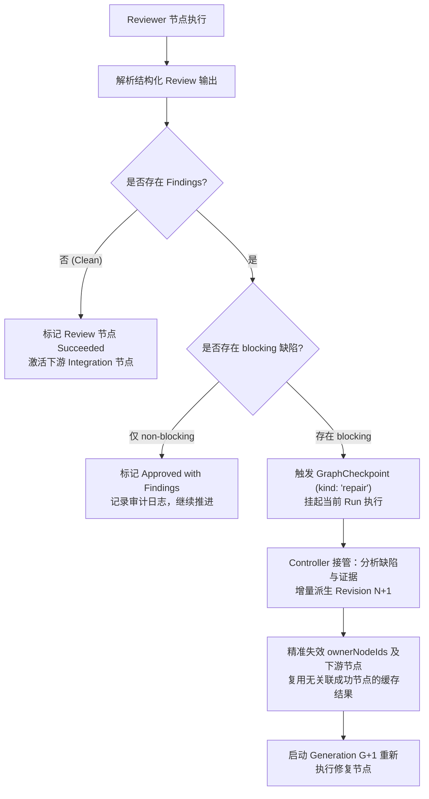
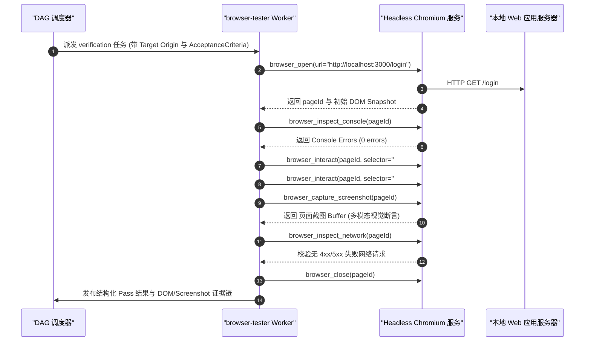

# Chapter 29: Multi-Agent Orchestration and Task-Graph Design

English | [中文](29-multi-agent-orchestration-dag.zh.md)

In a single-agent architecture, one LLM instance runs inside a looping state machine (`while(true)`). It repeatedly receives input, appends facts to the session ledger, samples autoregressive outputs, schedules tool calls, and observes the environment. As software-engineering tasks grow in complexity, code volume, file count, and verification demands, a single agent encounters physical limits: context-window exhaustion, diluted attention, accumulated errors across long chains, and low single-threaded throughput.

Modern agent systems address these limits with **multi-agent orchestration and task graphs**. In DeepSeek Harness, a task graph is neither an ad hoc prompt chain nor an unordered worker pool. It is a **directed acyclic graph (DAG) scheduler** with mathematical constraints, typed obligations, state-machine execution, immutable revisions, and distributed-consistency safeguards.

This chapter approaches the multi-agent DAG from a systems-programming perspective. It covers design principles, critical-path scheduling (CPM), non-overlapping workspace write roots, Campaign and Batch organization, and the execution responsibilities of four specialized node kinds: `environment`, `implementation`, `integration`, and `browser-tester`.

---

## 1. Why Multi-Agent Work Is More Than Parallelism: Serial Agents Versus DAG Orchestration

In traditional concurrent programming, a worker-thread pool or multiple processes can increase throughput for independent computations. In LLM-driven software engineering, however, **naive parallelism can cause system-wide failures**.

```
+---------------------------------------------------------------------------------------------------+
|                                 单 Agent 串行 vs 多 Agent DAG 拓扑流对比                          |
+---------------------------------------------------------------------------------------------------+
| 1. 单 Agent 串行架构 (单线程巨石死循环，上下文单调递增):                                           |
|    [Task A] ---> [Task B] ---> [Task C] ---> [Task D] ---> [Task E]                              |
|    (Context: 8k) (Context: 32k)(Context: 64k)(Context: 96k)(Context: 128k OOM / Attention Drift) |
+---------------------------------------------------------------------------------------------------+
| 2. 朴素并行 (无状态隔离，竞态冲突严重):                                                           |
|                 +---> [Worker 1: 改 src/auth.ts] ----+                                            |
|    [Scatter] --+---> [Worker 2: 改 src/auth.ts] ----+---> [Gather / 覆写破坏 / ABA 灾难]         |
|                 +---> [Worker 3: 安装全局依赖] -------+                                            |
+---------------------------------------------------------------------------------------------------+
| 3. 多 Agent DAG 编排 (拓扑隔离、显式数据流、Disjoint writeRoots、关键路径并行):                    |
|                 +---> [Node B: 后端实现 (writeRoots: "src/server")] --+                          |
|    [Node A: 架构设计]                                                   +---> [Node D: 集成合并]  |
|                 +---> [Node C: 前端实现 (writeRoots: "src/client")] --+       |                  |
|                                                                                v                  |
|                                                                    [Node E: 浏览器端到端测试]     |
+---------------------------------------------------------------------------------------------------+
```

### 1.1 Systems-Programming Analogy: From One Event Loop to a Distributed Task Graph

The following table relates AI orchestration concepts to established computer-systems concepts:

| Multi-agent DAG concept | Traditional systems or software-engineering concept | Execution model | Failure mode and defense |
| :--- | :--- | :--- | :--- |
| **Serial single-agent loop** | **Monolithic single-threaded process** | All state shares one stack and memory space; context grows monotonically | Context overflow, forgotten intermediate facts, cascading hallucinations |
| **Naive parallelism (Scatter-Gather)** | **Unsynchronized concurrent writes** | Workers write to the same filesystem without ownership boundaries | Dirty writes, ABA overwrites, broken dependencies |
| **Task-graph node** | **Compiler translation unit** | A computational unit with explicit inputs, output schema, execution budget, and isolated workspace | Timeouts, invalid output schema, escaped side effects |
| **Directed edge** | **Makefile / Ninja dependency rule** | Declares data and control dependencies as a partial order | Cycles, dangling references, false dependencies |
| **Write roots (`writeRoots`)** | **Page-table isolation / mount namespace** | The relative paths a worker is allowed to write | Unauthorized writes, concurrent conflicts, directory traversal |
| **Controller** | **Distributed scheduling coordinator** | Classifies intent, creates a minimal immutable DAG, dispatches work, and reconciles outcomes | Split-brain control, oversized controller prompts, invented schedules |
| **Immutable revision** | **Git commit snapshot (Git Commit Tree / Merkle DAG)** | Each graph-topology change produces a new immutable, globally increasing revision | In-place mutation breaks replay and source-event links |
| **Campaign / Batch** | **Multi-stage transaction** | Divides a long goal into independent batches with an immutable prefix and extensible tail | Cross-batch context explosion and ghost historical nodes |

### 1.2 Physical Limits of a Serial Agent and Three Failure Barriers

Even with a powerful underlying model, a single agent tackling a long engineering task eventually encounters three physical limits:

#### 1.2.1 Context Growth and Linear KV Cache Consumption

Autoregressive generation depends on prior tokens. When one agent performs many tasks, all previous tool outputs—including `grep` output, large files, and compiler errors—remain in its context ledger.

Using the KV Cache memory-consumption formula from Chapters 02 and 23:

$$M_{\text{KV}} = 2 \times n_{\text{layers}} \times n_{\text{heads}} \times d_{\text{head}} \times L \times B \times \text{sizeof}(\text{dtype}) \quad (\text{Bytes})$$

For a representative dense 70B model ($n_{\text{layers}}=80, n_{\text{heads}}=64, d_{\text{head}}=128$, FP16 at two bytes), increasing the single-request context length $L$ from $8\text{k}$ to $128\text{k}$ raises KV Cache usage from $2\text{ GB}$ to $32\text{ GB}$.

With per-token commercial billing, the input-token cost of successive steps can grow as an arithmetic-series sum, or $\mathcal{O}(N^2)$:

$$\text{Total Input Cost} \propto \sum_{i=1}^{N} (L_0 + i \cdot \Delta L) = N \cdot L_0 + \frac{N(N+1)}{2} \Delta L$$

#### 1.2.2 Attention Dilution and Lost-in-the-Middle Effects

Standard Transformer softmax attention is normalized globally:

$$\alpha_{ij} = \frac{\exp(q_i k_j^T / \sqrt{d_k})}{\sum_{m=1}^L \exp(q_i k_m^T / \sqrt{d_k})}$$

As context length $L$ grows, the denominator $\sum_{m=1}^L \exp(q_i k_m^T / \sqrt{d_k})$ increases, potentially reducing the weight $\alpha_{ij}$ assigned to an important system constraint or early architectural decision.

Retrieval accuracy for information in the middle of a long sequence often follows a U-shaped curve: the model can lose track of middle content. By Step 25, a single agent may violate an interface agreement established at Step 1.

#### 1.2.3 Cascading Error Amplification

Suppose the probability that an agent introduces a logical defect or misuses a tool in one step is $p_{\text{error}} \in (0, 1)$. For a serial chain of $N$ steps, the probability of remaining entirely defect-free is:

$$P_{\text{success}} = \prod_{i=1}^N (1 - p_{\text{error}}^{(i)}) \approx (1 - p_{\text{error}})^N$$

If $p_{\text{error}} = 0.05$—a 95% per-step success rate—and $N = 30$:

$$P_{\text{success}} = (1 - 0.05)^{30} \approx 0.2146 \quad (21.46\%)$$

An incorrect assumption, faulty code change, or hallucinated result from an early step enters the context ledger as an apparent fact for later steps, allowing errors and loops to reinforce themselves.

### 1.3 Engineering Failures of Naive Scatter-Gather Parallelism

To reduce serial latency, a beginner may simply spawn five subagents to write code simultaneously. Without orchestration, this approach quickly encounters:

1. **Shared-workspace dirty writes**: Worker A refactors `src/auth.ts` while Worker B adds OAuth support to `src/auth.ts`. Neither knows about the other; the later write overwrites the earlier one or leaves invalid syntax.
2. **ABA state overwrites**: Worker A changes version $V_1$ into $V_2$. Worker B diagnoses a defect against $V_1$ and writes a rollback $V_1'$, erasing Worker A's fix.
3. **Broken implicit dependencies**: Worker 1 changes a database migration while Worker 2 implements business logic against the old schema. Tests pass separately but the integrated system crashes.

### 1.4 When to Use a Multi-Agent DAG: Costs and Trade-Offs

A multi-agent DAG is not a universal solution. Architects must account for its fixed orchestration costs and weigh them against potential gains.

By Amdahl's law, maximum theoretical speedup is limited by the serial fraction $s$ and coordination cost $\text{Overhead}(N)$:

$$S(N) = \frac{1}{s + \frac{1 - s}{N} + \text{Overhead}(N)}$$

In an agent system, $\text{Overhead}(N)$ includes controller intent classification, DAG validation, sub-session forking, workspace isolation, and cross-branch integration.

```
+---------------------------------------------------------------------------------------------------+
|                                 单 Agent vs 多 Agent DAG 决策矩阵                                  |
+---------------------------------------------------------------------------------------------------+
| 决策维度                     | 单 Agent 串行架构                  | 多 Agent DAG 编排架构           |
+-----------------------------+------------------------------------+--------------------------------+
| 适用任务规模                | 小型改动 (1-3 个文件, < 100 行改动) | 中大型特性、跨模块重构、端到端研发|
| 任务执行时间                | 1 ~ 5 分钟                         | 15 ~ 120 分钟                  |
| 拓扑结构                    | 单线性状态转移                     | 有向无环图 (DAG), 支持分支与汇聚|
| 上下文隔离度                | 零隔离 (单会话全量共享)            | 强隔离 (每个 Node 独立子会话)   |
| 并发安全机制                | 无并发 (串行单线程)                | 声明式 writeRoots 互斥校验     |
| 故障恢复粒度                | 全盘回滚或从断点盲目重试           | 局部节点重试 / 增量 Revision 修复|
| 调度系统开销 (Overhead)     | 接近 0 ms                          | 500 ms ~ 3000 ms (拓扑调度与对账)|
| 总体 Token 消耗倍率         | 基准 $1.0\times$                   | $1.3\times \sim 2.5\times$ (包含隔离与审查)|
+---------------------------------------------------------------------------------------------------+
```

---

## 2. Task-Graph Design: Obligations, Isolation, and Testability

DeepSeek Harness treats each task-graph node as a small unit of work with complete obligations, explicit resource scope, and a verifiable result.

```
+---------------------------------------------------------------------------------------------------+
|                                  GraphNode 核心契约与工作区隔离模型                               |
+---------------------------------------------------------------------------------------------------+
|  GraphNode: "node-backend-impl"                                                                   |
|  +---------------------------------------------------------------------------------------------+  |
|  | Role: "engineer" | Kind: "implementation" | EffectPolicy: "idempotent"                       |  |
|  | AcceptanceCriteria: [                                                                       |  |
|  |   "1. POST /api/v1/auth/login 单元测试 100% 通过",                                            |  |
|  |   "2. pnpm --filter @backend/auth test 退出码为 0",                                           |  |
|  |   "3. 密码哈希采用 Argon2id，严禁明文落库"                                                     |  |
|  | ]                                                                                           |  |
|  | WorkspacePolicy:                                                                            |  |
|  |   Mode: "git-worktree"                                                                      |  |
|  |   ReadRoots:  ["packages/backend", "packages/types"]                                        |  |
|  |   WriteRoots: ["packages/backend/src/auth", "packages/backend/tests/auth"]  <-- 互斥锁定     |  |
|  | OutputSchema: ObjectJsonSchema { required: ["summary", "artifacts", "data"] }               |  |
|  +---------------------------------------------------------------------------------------------+  |
+---------------------------------------------------------------------------------------------------+
```

### 2.1 Node Artifacts and Content-Addressed Manifests

A completed node must produce more than an ambiguous natural-language summary. In Harness, each node produces a typed [`GraphNodeOutput`](file:///d:/git/deepseek-harness/packages/graph/graph/src/types.ts#L558-L565) and a content-addressed [`GraphAttemptArtifactManifest`](file:///d:/git/deepseek-harness/packages/graph/graph/src/types.ts#L568-L590).

The manifest records every file changed by the attempt in its isolated workspace and the file's SHA-256 checksum:

```json
{
  "id": "manifest-att-7a8f9c",
  "algorithm": "sha256",
  "provider": "graph-worker-local",
  "workId": "work-backend-auth",
  "operationId": "op-4482",
  "attemptId": "att-001",
  "runId": "run-9921",
  "generationId": "gen-1",
  "ownerEpoch": 3,
  "fencingToken": 1048,
  "createdAt": 1771920100000,
  "totalBytes": 14280,
  "entries": [
    {
      "path": "packages/backend/src/auth/service.ts",
      "sha256": "e3b0c44298fc1c149afbf4c8996fb92427ae41e4649b934ca495991b7852b855",
      "baseSha256": "4b227777d4dd1fc61c6f884f48641d02b4d121d3fd328cb08b5531fcacdabf8a",
      "size": 8420,
      "mode": 420,
      "kind": "file"
    },
    {
      "path": "packages/backend/tests/auth/service.spec.ts",
      "sha256": "ca978112ca1bbdcafac231b39a23dc4da786eff8147c4e72b9807785afee48bb",
      "baseSha256": null,
      "size": 5860,
      "mode": 420,
      "kind": "file"
    }
  ],
  "providerReference": "worktree:/tmp/dsh-worktrees/att-001"
}
```

A content-addressed manifest provides three engineering safeguards:
1. **Integrity verification**: Before merging code, a downstream integration node can compare each file's current hash with its manifest hash to detect out-of-band changes.
2. **Three-way merging against a base SHA-256**: Preserving `baseSha256` lets an integration node detect whether another concurrent change caused drift while the worker was running.
3. **Immutable audit trail**: The session log records compact manifest metadata while actual file content resides in content-addressed storage (CAS), reducing ledger size.

### 2.2 Measurable Acceptance Criteria

Natural-language coding agents can report completion too optimistically—for example, claiming to have fixed all concurrency deadlocks. Harness requires **measurable `acceptanceCriteria`** on every task-graph node.

Acceptance criteria should specify:
- **Executable assertions**: Name a concrete test command, static check, or HTTP request, such as requiring `pnpm test:auth` to exit with code 0.
- **Deterministic scope**: Define files that may be changed and core modules that must not be touched.
- **Persisted evidence**: Require complete test stdout/stderr and exit codes with the artifact.

### 2.3 Non-Overlapping Relative Write Roots (`writeRoots`) and Workspace Isolation

To run multiple `implementation` nodes safely in parallel, the task-graph validator enforces spatial exclusion.

#### 2.3.1 Detecting Path-Prefix Overlap

Let $P_1$ and $P_2$ be normalized relative paths. They overlap if either of the following holds:

$$\text{Overlap}(P_1, P_2) \iff (P_1 = \text{“.”}) \lor (P_2 = \text{“.”}) \lor (P_1 = P_2) \lor (P_1 \text{ is prefix of } P_2) \lor (P_2 \text{ is prefix of } P_1)$$

The TypeScript implementation is:

```typescript
const overlap = (left: string, right: string): boolean =>
  left === '.' ||
  right === '.' ||
  left === right ||
  left.startsWith(`${right}/`) ||
  right.startsWith(`${left}/`)
```

#### 2.3.2 Topological Reachability and the Concurrent-Conflict Rule

For a DAG $G = (V, E)$, let $\text{Reaches}(u, v)$ mean there is a directed path from node $u$ to node $v$.

**Concurrent-admission rule**: For any distinct nodes $u, v \in V$ with nonempty write roots, if $\neg \text{Reaches}(u, v) \land \neg \text{Reaches}(v, u)$—the graph imposes no order between them and they might run concurrently—then their write-root sets $W(u)$ and $W(v)$ must be disjoint:

$$\forall r_1 \in W(u), \forall r_2 \in W(v), \quad \neg \text{Overlap}(r_1, r_2)$$

If this rule is violated, the graph validator rejects `graph_submit` with `GRAPH_WORKSPACE_OWNERSHIP`:

```typescript
// 摘自 packages/graph/graph/src/index.ts 的核心校验逻辑
const reaches = (from: GraphNodeId, to: GraphNodeId, seen = new Set<GraphNodeId>()): boolean => {
  if (from === to) return true
  if (seen.has(from)) return false
  seen.add(from)
  return (successors.get(from) ?? []).some(next => reaches(next, to, seen))
}

const owned = [...nodes.values()].filter(node => node.workspace !== undefined && node.workspace.writeRoots.length > 0)
for (let leftIndex = 0; leftIndex < owned.length; leftIndex++) {
  const left = owned[leftIndex]!
  for (let rightIndex = leftIndex + 1; rightIndex < owned.length; rightIndex++) {
    const right = owned[rightIndex]!
    // 若两者之间存在前后先后依赖关系，则串行执行，允许复用同一工作区
    if (reaches(left.id, right.id) || reaches(right.id, left.id)) continue

    // 否则两者可能并发执行，必须保证 writeRoots 绝对正交
    const conflicts = (left.workspace?.writeRoots ?? []).some(leftRoot =>
      (right.workspace?.writeRoots ?? []).some(rightRoot => overlap(leftRoot, rightRoot))
    )
    if (conflicts) {
      fail('GRAPH_WORKSPACE_OWNERSHIP', `concurrent nodes ${JSON.stringify(left.id)} and ${JSON.stringify(right.id)} declare overlapping write roots`)
    }
  }
}
```

### 2.4 Structured Review Nodes and the Repair State Machine

A review node guards software quality. In a multi-agent DAG, the `review` role must produce a structured list of [`GraphReviewIssue`](file:///d:/git/deepseek-harness/packages/graph/graph/src/types.ts#L523-L530) records rather than generic praise.



Each issue identifies responsible nodes through `ownerNodeIds` and includes a concrete error log or source-line reference:

```typescript
export interface GraphReviewIssue {
  readonly id: string
  readonly severity: 'blocking' | 'non-blocking'
  readonly summary: string
  readonly evidence: readonly string[]
  readonly ownerNodeIds: readonly GraphNodeId[]
}
```

A `blocking` issue creates a `repair` [`GraphCheckpoint`](file:///d:/git/deepseek-harness/packages/graph/graph/src/types.ts#L532-L550) and pauses execution. The Controller then reads the issue evidence and creates a new repair-subgraph Revision only for affected `ownerNodeIds`; unaffected results are reused, reducing repair work.

---

## 3. Critical-Path Scheduling (CPM) and Duration Formulas

How much can parallel agents accelerate a graph, and what is its theoretical minimum duration? This section derives both with a formal model.

```
+---------------------------------------------------------------------------------------------------+
|                                 复杂软件工程 DAG 关键路径与松弛时间计算图                          |
+---------------------------------------------------------------------------------------------------+
|                                                                                                   |
|                 +---> [B: 数据库模型设计 (T=15m, Slack=0)]* ------+                               |
|                 |     ES=10, EF=25, LS=10, LF=25                  |                               |
|                 |                                                 v                               |
|  [A: 架构分析]  +---> [C: 后端 API 实现 (T=40m, Slack=0)]* ------> [F: 跨模块集成 (T=20m, Slack=0)]*  |
|  (T=10m, Slack=0)*   ES=25, EF=65, LS=25, LF=65                  | ES=65, EF=85, LS=65, LF=85     |
|  ES=0, EF=10    |                                                 |       |                       |
|  LS=0, LF=10    +---> [D: 前端组件开发 (T=25m, Slack=30)] -------+       v                       |
|                 |     ES=10, EF=35, LS=40, LF=65                  |  [G: 浏览器端到端测试]        |
|                 |                                                 |  (T=15m, Slack=0)*            |
|                 +---> [E: 接口文档编写 (T=10m, Slack=45)] --------+  ES=85, EF=100                |
|                       ES=10, EF=20, LS=55, LF=65                     LS=85, LF=100                |
|                                                                                                   |
|  * 标注为关键路径节点 (Critical Path): A -> B -> C -> F -> G                                       |
|  关键路径总耗时 T_cp = 10 + 15 + 40 + 20 + 15 = 100 分钟                                           |
+---------------------------------------------------------------------------------------------------+
```

### 3.1 Deriving the Critical Path Method (CPM)

Let the task graph be a DAG $G = (V, E)$, where $V = \{v_1, v_2, \dots, v_n\}$ and each $v_i$ has an observed or estimated duration $T(v_i) \ge 0$. An edge $(u, v) \in E$ means $u$ directly precedes $v$.

#### 3.1.1 Earliest Start (ES) and Earliest Finish (EF)

Starting at zero-indegree source nodes, calculate forward in topological order:

$$ES(v) = \begin{cases} 0, & \text{if } \text{Predecessors}(v) = \emptyset \\ \max_{u \in \text{Predecessors}(v)} EF(u), & \text{otherwise} \end{cases}$$

$$EF(v) = ES(v) + T(v)$$

The theoretical earliest graph completion time $T_{\text{makespan}}$ is the largest earliest-finish time among terminal nodes:

$$T_{\text{makespan}} = \max_{v \in V} EF(v)$$

#### 3.1.2 Latest Finish (LF) and Latest Start (LS)

Starting at zero-outdegree terminal nodes, calculate backward in reverse topological order:

$$LF(u) = \begin{cases} T_{\text{makespan}}, & \text{if } \text{Successors}(u) = \emptyset \\ \min_{v \in \text{Successors}(u)} LS(v), & \text{otherwise} \end{cases}$$

$$LS(u) = LF(u) - T(u)$$

#### 3.1.3 Total Slack (Float) and Critical-Path Membership

A node's total slack $Slack(u)$ is how long its start may be delayed without delaying completion of the entire graph:

$$Slack(u) = LS(u) - ES(u) = LF(u) - EF(u)$$

**Critical-path criterion**: Connected paths composed of nodes with $Slack(u) = 0$ form the critical path. A delay on that path delays graph completion by the same amount.

### 3.2 End-to-End Task-Graph Duration

In production, total graph duration includes more than model inference time. Runtime scheduling and distributed-coordination costs also matter:

$$T_{\text{total}} = \sum_{k \in \text{CriticalPath}} T_k + T_{\text{overhead}}$$

The framework overhead $T_{\text{overhead}}$ comprises six measured components:

$$T_{\text{overhead}} = \sum_{i \in V} \left( t_{\text{sched\_tick}}^{(i)} + t_{\text{admit\_lease}}^{(i)} + t_{\text{session\_fork}}^{(i)} + t_{\text{fs\_isolate}}^{(i)} + t_{\text{artifact\_hash}}^{(i)} + t_{\text{settle\_barrier}}^{(i)} \right)$$

1. $t_{\text{sched\_tick}}$: Scheduler polling and ready-node scanning (typically $\approx 5 \sim 20\text{ ms}$).
2. $t_{\text{admit\_lease}}$: SQLite admission-lock contention and model-concurrency token acquisition (typically $\approx 10 \sim 50\text{ ms}$).
3. $t_{\text{session\_fork}}$: Sub-session creation, system-prompt injection, and predecessor-context trimming (typically $\approx 50 \sim 150\text{ ms}$).
4. $t_{\text{fs\_isolate}}$: Git worktree creation, sandbox mounting, or directory-snapshot initialization (typically $\approx 100 \sim 500\text{ ms}$).
5. $t_{\text{artifact\_hash}}$: I/O for computing SHA-256 hashes of generated files at node completion (typically $\approx 50 \sim 300\text{ ms}$).
6. $t_{\text{settle\_barrier}}$: Network and disk latency for external settlement, such as LoopX todo synchronization and session-log flush (typically $\approx 50 \sim 200\text{ ms}$).

### 3.3 Worked Seven-Node Engineering Graph

The following table calculates the seven nodes in the ASCII diagram above:

| Node ID ($v_i$) | Task and role | Duration $T_i$ | Predecessors | $ES$ | $EF$ | $LS$ | $LF$ | $Slack$ | Critical path? |
| :--- | :--- | :--- | :--- | :--- | :--- | :--- | :--- | :--- | :--- |
| **A** | Requirements analysis and architecture (`architect`) | $10\text{ min}$ | None | 0 | 10 | 0 | 10 | **0** | **Yes (critical)** |
| **B** | Database model and migration (`engineer`) | $15\text{ min}$ | A | 10 | 25 | 10 | 25 | **0** | **Yes (critical)** |
| **C** | Core backend API (`engineer`) | $40\text{ min}$ | B | 25 | 65 | 25 | 65 | **0** | **Yes (critical)** |
| **D** | Frontend components (`engineer`) | $25\text{ min}$ | A | 10 | 35 | 40 | 65 | **30** | No |
| **E** | API documentation (`writer`) | $10\text{ min}$ | A | 10 | 20 | 55 | 65 | **45** | No |
| **F** | Cross-module integration (`engineer`) | $20\text{ min}$ | C, D, E | 65 | 85 | 65 | 85 | **0** | **Yes (critical)** |
| **G** | End-to-end browser test (`browser-tester`) | $15\text{ min}$ | F | 85 | 100 | 85 | 100 | **0** | **Yes (critical)** |

**Critical-path results**:
- Critical path: $\text{A} \to \text{B} \to \text{C} \to \text{F} \to \text{G}$.
- Model execution on that path: $T_{\text{CPM}} = 10 + 15 + 40 + 20 + 15 = 100\text{ min}$.
- Serial execution of every node: $T_{\text{serial}} = 10 + 15 + 40 + 25 + 10 + 20 + 15 = 135\text{ min}$.
- Parallel DAG speedup: $S = \frac{T_{\text{serial}}}{T_{\text{CPM}}} = \frac{135}{100} = 1.35\times$.
- Node D has $30\text{ min}$ of slack: frontend work could finish 30 minutes later without delaying overall delivery.

### 3.4 Resource Admission and Deadlock Prevention

If many nodes are ready at once, unbounded parallel launches can exhaust local-model VRAM, hit API rate limits, or create **controller starvation**.

```
+---------------------------------------------------------------------------------------------------+
|                              资源准入控制器与控制器预留令牌隔离机制                                |
+---------------------------------------------------------------------------------------------------+
|  全局并发上限: globalMaxParallel = 8                                                              |
|  控制器预留令牌: controllerReserve = 1 (任何时候 Worker 最多只能抢占 7 个并发槽位)                 |
|                                                                                                   |
|  [Worker 申请队列] ------------------------> [准入检查网关]                                      |
|                                                     |                                             |
|  [Controller 申请] ------------------------> [绿色特权通道 (直通保留槽)]                         |
|                                                     |                                             |
|                                                     v                                             |
|  +---------------------------------------------------------------------------------------------+  |
|  | 当前运行中槽位分配:                                                                         |  |
|  | [Slot 1: Worker] [Slot 2: Worker] [Slot 3: Worker] [Slot 4: Worker]                        |  |
|  | [Slot 5: Worker] [Slot 6: Worker] [Slot 7: Worker] | [Slot 8: Controller 特权保留槽]        |  |
|  +---------------------------------------------------------------------------------------------+  |
|                                                         ^                                         |
|                                                         | 避免死锁的关键:                         |
|                                                         | 当 7 个 Worker 全部卡在 Checkpoint 时,   |
|                                                         | Controller 仍有可用槽位执行子图修复规划!   |
+---------------------------------------------------------------------------------------------------+
```

Harness uses three admission-control levels:
1. **Global concurrency and controller reservation (`controllerReserve`)**: In [`GraphSchedulerLimits`](file:///d:/git/deepseek-harness/packages/graph/graph/src/types.ts#L182-L187), configure `globalMaxParallel: 8` and `controllerReserve: 1`. Ordinary workers can occupy at most $8 - 1 = 7$ slots, leaving one for the Controller. This avoids a deadlock in which all workers await a checkpoint decision but the Controller cannot start.
2. **Per-model throttling and VRAM weights (`GraphModelLimit`)**: Configure separate `maxParallel` and `maxWeight` values for expensive models, such as 70B or vision models, to prevent GPU OOM.
3. **Monotonic fencing tokens**: Each dispatched attempt receives an increasing token. Storage checks that token when a worker settles or writes, rejecting stale writes from timed-out attempts.

---

## 4. Campaign and Batch Organization: Avoid Copying All Historical Nodes

When planning a multi-stage project—for example, refactoring authentication, billing, and data export—developers sometimes make a serious design mistake: **copying every completed node from one stage into the next stage's graph**.

```
+---------------------------------------------------------------------------------------------------+
|                         历史节点全量复制反模式 vs Campaign/Batch 批次演进                          |
+---------------------------------------------------------------------------------------------------+
| 1. 错误反模式：历史节点全量复制 (The Copy-All Anti-Pattern)                                        |
|    Batch 1 Graph: [A (Done)] -> [B (Done)]                                                        |
|    Batch 2 Graph: [A (Done)] -> [B (Done)] -> [C (Done)] -> [D (Done)]                            |
|    Batch 3 Graph: [A (Done)] -> [B (Done)] -> [C (Done)] -> [D (Done)] -> [E (Run)] -> [F (Run)] |
|    => 灾难：DAG 节点数随批次线性暴增，Prompt 溢出，每次重放校验 O(N^2) 耗时，幽灵节点污染注意力!     |
+---------------------------------------------------------------------------------------------------+
| 2. 正确架构：Campaign 与 Batch 二级拓扑演进 (Immutable Prefix + Evidence Passing)                  |
|    Campaign: [Batch 1 (Approved)] ===> [Batch 2 (Approved)] ===> [Batch 3 (Active)]               |
|                                                                         |                         |
|    Batch 3 独立任务图:                                                  v                         |
|    [Settlement Evidence 1 & 2] (轻量级哈希/摘要引用) ---> [Node E: 实现] ---> [Node F: 验收]        |
|    => 优势：每个 Batch 拥有独立的轻量级 DAG，上下文绝对隔离，前缀不可变，尾部支持 planExtension 扩展!|
+---------------------------------------------------------------------------------------------------+
```

### 4.1 Four Costs of Copying Historical Nodes

1. **Controller prompt explosion**: As completed nodes accumulate, their JSON descriptions can consume tens of thousands of tokens and displace useful reasoning context.
2. **Lost focus and ghost dependencies**: While planning new nodes, a model may add false edges to dozens of completed nodes, causing invalid dependencies or a deadlock.
3. **Worsening topology-validation cost**: DAG cycle checks cost $\mathcal{O}(V + E)$, while `writeRoots` overlap checks cost $\mathcal{O}(V^2)$. Copying history increases $V$ and can make each validation expensive.
4. **State drift and broken replay**: Accidental edits to historical-node metadata in a new graph can conflict with recorded events, violating event-sourcing consistency.

### 4.2 Two-Level Campaign and Batch Topology

DeepSeek Harness defines [`GraphCampaign`](file:///d:/git/deepseek-harness/packages/graph/graph/src/types.ts#L497-L509) and [`GraphCampaignBatch`](file:///d:/git/deepseek-harness/packages/graph/graph/src/types.ts#L464-L482):

```typescript
export interface GraphCampaignBatch {
  readonly id: GraphCampaignBatchId
  readonly ordinal: number
  readonly title: string
  readonly objective: string
  readonly dependsOn: readonly GraphCampaignBatchId[]
  readonly status: 'planned' | 'running' | 'approved' | 'approved_with_findings' | 'rejected' | 'needs_user' | 'blocked'
  readonly graphId?: GraphId
  readonly executions: readonly {
    readonly graphId: GraphId
    readonly revision: number
    readonly runId: GraphRunId
    readonly status: 'running' | 'succeeded' | 'failed' | 'canceled' | 'exhausted' | 'awaiting_user'
    readonly startedAt: number
    readonly completedAt?: number
    readonly settlementIds: readonly GraphSettlementId[]
    readonly summary?: string
  }[]
}

export interface GraphCampaign {
  readonly version: 1
  readonly id: GraphCampaignId
  readonly objective: string
  readonly createdAt: number
  readonly updatedAt: number
  readonly phase: 'planned' | 'running' | 'awaiting_user' | 'succeeded' | 'failed' | 'canceled'
  readonly batches: readonly GraphCampaignBatch[]
  readonly activeBatchId?: GraphCampaignBatchId
  readonly planRevision?: number
  readonly planExtensions?: readonly GraphCampaignPlanExtension[]
}
```

### 4.3 Immutable Plan Prefix and Dynamic Tail Extension (`planExtension`)

Earlier batches can invalidate plans for later ones—for example, a database-optimization batch might reveal that the real bottleneck is network I/O.

Harness applies two rules:
- **Immutable prefix**: Historical batches that are `approved` or `running` cannot be edited, deleted, or reordered in place.
- **Dynamic tail append (`planExtension`)**: To change batches that have not begun, a model or user registers a new suffix through [`GraphCampaignPlanExtension`](file:///d:/git/deepseek-harness/packages/graph/graph/src/types.ts#L485-L493), preserving an auditable append-only history.

```typescript
export interface GraphCampaignPlanExtension {
  readonly revision: number
  readonly createdAt: number
  readonly reason: string
  readonly addedBatchIds: readonly GraphCampaignBatchId[]
  readonly sourceBatchId?: GraphCampaignBatchId
  readonly sourceRunId?: GraphRunId
  readonly settlementIds: readonly GraphSettlementId[]
}
```

### 4.4 Passing Evidence References

When a subsequent batch begins, the Controller receives **settlement evidence IDs (`settlementIds`) and a public, safe coordination summary (`coordinationSummary`)**, not hundreds of earlier raw messages. Each independent Batch graph contains only its current three to eight nodes, keeping its working context small.

---

## 5. Specialized Node Roles and Responsibilities

DeepSeek Harness assigns distinct engineering work to specialized nodes. Privileged environment changes, code implementation, and end-to-end testing should not be mixed into one node.

```
+---------------------------------------------------------------------------------------------------+
|                                 四类特化节点分工与流转拓扑                                         |
+---------------------------------------------------------------------------------------------------+
|                                                                                                   |
|  [1. environment 节点] ---> (人工安全审批 Checkpoint) ---> [2. implementation 节点 (并行 Worker)] |
|  (主机/特权变更隔离)                                       | (受限沙箱, 独立 writeRoots)          |
|                                                            +------------------+                   |
|                                                                               |                   |
|                                                                               v                   |
|  [4. browser-tester 节点] <--- [代码 Review 节点] <------------- [3. integration 节点]           |
|  (Web 真实交互验收)            (架构与质量门禁)                  (3-Way Merge 与漂移消解)         |
|                                                                                                   |
+---------------------------------------------------------------------------------------------------+
```

### 5.1 `environment` Nodes: Isolate Host Changes and Privileges

A coding agent (`engineer`) runs in a restricted sandbox and **must not gain direct permission to run `sudo apt install`, change global environment variables, or start host Docker containers**.

If a project lacks a required toolchain or system dependency, a dedicated `environment` node first prepares a declarative plan:

```typescript
export interface GraphEnvironmentPlan {
  readonly requiredCapabilities: readonly ('network' | 'host-package-install' | 'docker')[]
  readonly sandboxMode: 'workspace-write' | 'danger-full-access'
  readonly operations: readonly {
    readonly id: string
    readonly description: string
    readonly command: string
    readonly rollbackCommand?: string
  }[]
}
```

**Mandatory approval**:
- An `environment` node sets `effectPolicy` to `manual`.
- Before execution, the scheduler creates a `kind: 'environment'` [`GraphCheckpoint`](file:///d:/git/deepseek-harness/packages/graph/graph/src/types.ts#L538), pauses the flow, and presents precise commands and rollback instructions to a human engineer.
- Only after explicit human authorization does the Host executor run the commands. The model worker never directly uses a privileged shell.

### 5.2 `implementation` Nodes: Produce Code in a Restricted Sandbox

An `implementation` node produces code and must meet these planning criteria:
- **Work size**: About 10–30 minutes of focused human engineering effort; avoid monolithic nodes exceeding an hour.
- **Single responsibility**: One cohesive module or feature change per node.
- **Orthogonal write roots**: Declare specific `writeRoots`; do not use `.` for the whole workspace without need.
- **Verifiable artifacts**: Finish with a manifest tied to a clear Git diff and unit-test logs.

### 5.3 `integration` Nodes: Merge Branches and Resolve Drift

When parallel `implementation` nodes finish changes in separate `git-worktree` directories, an `integration` node brings them together.

The standard `integration` procedure:
1. **Collect manifests**: Read every upstream `GraphAttemptArtifactManifest`.
2. **Detect three-way merge conflicts**: For each changed file, compare `baseSha256`, the main branch's current HEAD SHA-256, and the worker's `sha256`.
3. **Identify source drift**: If another process changed the file while the worker ran—the current main-branch hash differs from `baseSha256`—the `integration` node reports a merge conflict to the Controller and triggers replanning. Never overwrite it by force.
4. **Build and test the integrated result**: Run the full build and cross-module tests in the merged workspace.

### 5.4 `browser-tester` Nodes: Verify Real End-to-End Web Flows

Passing unit tests does not prove that users can operate a web UI. A CSS `z-index` overlay may make a button unclickable, or asynchronous request ordering may leave a blank page.



Rules for a `browser-tester` node:
- **One page lifecycle per worker**: Retain the `pageId` it created. Do not close or alter another worker's page.
- **Snapshots and element IDs**: Prefer semantic DOM snapshots and element references for clicking and typing; avoid brittle absolute screen coordinates.
- **Multimodal screenshot assertions**: On a vision-capable model path, capture screenshots of important rendered states and inspect the layout.
- **Check passive failures**: After critical interactions, inspect console logs and network requests. An uncaught JavaScript error or HTTP 500 fails acceptance even if the page appears normal.
- **No destructive actions**: Do not write to production or uncontrolled external sites, and do not enter real passwords or private keys.

---

## 6. TypeScript Implementation: A DAG Orchestration Engine

The following TypeScript implementation illustrates a typed multi-agent DAG scheduler with validation and failure handling.

```typescript
/**
 * 生产级多 Agent DAG 任务图调度引擎与关键路径分析器
 * @module dsh-graph-orchestrator
 */

import { z } from 'zod'

// ==========================================
// 1. 核心强类型定义与 Branded IDs
// ==========================================

export type GraphId = string & { readonly __brand: 'GraphId' }
export type GraphNodeId = string & { readonly __brand: 'GraphNodeId' }
export type GraphRoleId = string & { readonly __brand: 'GraphRoleId' }
export type GraphRunId = string & { readonly __brand: 'GraphRunId' }

export const GraphId = (id: string): GraphId => id as GraphId
export const GraphNodeId = (id: string): GraphNodeId => id as GraphNodeId
export const GraphRoleId = (id: string): GraphRoleId => id as GraphRoleId
export const GraphRunId = (id: string): GraphRunId => id as GraphRunId

export type TaskKind =
  | 'analysis'
  | 'design'
  | 'environment'
  | 'implementation'
  | 'review'
  | 'integration'
  | 'browser-tester'
  | 'verification'

export type NodePhase =
  | 'pending'
  | 'ready'
  | 'running'
  | 'succeeded'
  | 'failed'
  | 'blocked'
  | 'skipped'

export type EffectPolicy = 'idempotent' | 'reconcile' | 'manual'

export interface WorkspacePolicy {
  readonly mode: 'read-only-snapshot' | 'isolated-copy' | 'git-worktree' | 'sandbox-mount'
  readonly readRoots: readonly string[]
  readonly writeRoots: readonly string[]
}

export interface NodeDefinition {
  readonly id: GraphNodeId
  readonly title: string
  readonly roleId: GraphRoleId
  readonly kind: TaskKind
  readonly estimatedDurationMs: number
  readonly acceptanceCriteria: readonly string[]
  readonly workspace: WorkspacePolicy
  readonly effectPolicy: EffectPolicy
  readonly maxAttempts: number
}

export interface GraphEdge {
  readonly from: GraphNodeId
  readonly to: GraphNodeId
}

export interface GraphTopology {
  readonly graphId: GraphId
  readonly revision: number
  readonly nodes: readonly NodeDefinition[]
  readonly edges: readonly GraphEdge[]
}

export interface SchedulerLimits {
  readonly globalMaxParallel: number
  readonly controllerReserve: number
}

export interface NodeExecutionState {
  readonly nodeId: GraphNodeId
  phase: NodePhase
  attempts: number
  startedAt?: number
  finishedAt?: number
  actualDurationMs?: number
  output?: {
    summary: string
    artifacts: readonly string[]
    data?: Record<string, unknown>
  }
  error?: { code: string; message: string }
}

export interface CPMNodeMetrics {
  readonly nodeId: GraphNodeId
  readonly durationMs: number
  readonly earlyStartMs: number
  readonly earlyFinishMs: number
  readonly lateStartMs: number
  readonly lateFinishMs: number
  readonly slackMs: number
  readonly isCritical: boolean
}

// ==========================================
// 2. 拓扑校验器与互斥 writeRoots 检查器
// ==========================================

export class GraphValidationError extends Error {
  constructor(public readonly code: string, message: string) {
    super(message)
    this.name = 'GraphValidationError'
  }
}

export class GraphTopologyValidator {
  /**
   * 判定两个相对路径是否重叠
   */
  public static isPathOverlap(left: string, right: string): boolean {
    const l = left.trim()
    const r = right.trim()
    if (l === '.' || r === '.') return true
    if (l === r) return true
    if (l.startsWith(`${r}/`)) return true
    if (r.startsWith(`${l}/`)) return true
    return false
  }

  /**
   * 严格校验 DAG 拓扑合法性、有向无环性与并发写入根互斥
   */
  public static validate(graph: GraphTopology): void {
    const nodeMap = new Map<GraphNodeId, NodeDefinition>()
    for (const node of graph.nodes) {
      if (nodeMap.has(node.id)) {
        throw new GraphValidationError('GRAPH_DUPLICATE_NODE', `Duplicate node id: ${node.id}`)
      }
      nodeMap.set(node.id, node)
    }

    // 构建邻接表
    const adjacency = new Map<GraphNodeId, GraphNodeId[]>()
    const inDegree = new Map<GraphNodeId, number>()
    for (const node of graph.nodes) {
      adjacency.set(node.id, [])
      inDegree.set(node.id, 0)
    }

    for (const edge of graph.edges) {
      if (!nodeMap.has(edge.from) || !nodeMap.has(edge.to)) {
        throw new GraphValidationError(
          'GRAPH_INVALID_EDGE',
          `Edge references unknown node: ${edge.from} -> ${edge.to}`
        )
      }
      if (edge.from === edge.to) {
        throw new GraphValidationError('GRAPH_SELF_CYCLE', `Self-loop detected on node ${edge.from}`)
      }
      adjacency.get(edge.from)!.push(edge.to)
      inDegree.set(edge.to, inDegree.get(edge.to)! + 1)
    }

    // Kahn 算法拓扑排序检测环路
    const queue: GraphNodeId[] = []
    for (const [id, deg] of inDegree.entries()) {
      if (deg === 0) queue.push(id)
    }

    let visitedCount = 0
    while (queue.length > 0) {
      const curr = queue.shift()!
      visitedCount++
      for (const next of adjacency.get(curr)!) {
        const nextDeg = inDegree.get(next)! - 1
        inDegree.set(next, nextDeg)
        if (nextDeg === 0) queue.push(next)
      }
    }

    if (visitedCount !== graph.nodes.length) {
      throw new GraphValidationError('GRAPH_CYCLE_DETECTED', 'Cycle detected in task graph topology')
    }

    // 拓扑可达性分析
    const reaches = (from: GraphNodeId, to: GraphNodeId, seen = new Set<GraphNodeId>()): boolean => {
      if (from === to) return true
      if (seen.has(from)) return false
      seen.add(from)
      return (adjacency.get(from) ?? []).some(next => reaches(next, to, seen))
    }

    // 校验并发节点的 writeRoots 互斥
    const mutatingNodes = graph.nodes.filter(n => n.workspace.writeRoots.length > 0)
    for (let i = 0; i < mutatingNodes.length; i++) {
      const left = mutatingNodes[i]!
      for (let j = i + 1; j < mutatingNodes.length; j++) {
        const right = mutatingNodes[j]!
        // 若存在前后依赖顺序，则串行调度，允许复用
        if (reaches(left.id, right.id) || reaches(right.id, left.id)) continue

        // 若两者在拓扑上互不可达，则可能并发运行，必须确保 writeRoots 绝对正交
        for (const lRoot of left.workspace.writeRoots) {
          for (const rRoot of right.workspace.writeRoots) {
            if (this.isPathOverlap(lRoot, rRoot)) {
              throw new GraphValidationError(
                'GRAPH_WORKSPACE_OWNERSHIP',
                `Concurrent nodes ${left.id} and ${right.id} declare overlapping writeRoots: "${lRoot}" vs "${rRoot}"`
              )
            }
          }
        }
      }
    }
  }
}

// ==========================================
// 3. 关键路径分析器（CPM Engine）
// ==========================================

export class CriticalPathAnalyzer {
  public static calculate(graph: GraphTopology): {
    makespanMs: number
    criticalPath: readonly GraphNodeId[]
    metrics: ReadonlyMap<GraphNodeId, CPMNodeMetrics>
  } {
    GraphTopologyValidator.validate(graph)

    const nodeMap = new Map<GraphNodeId, NodeDefinition>(graph.nodes.map(n => [n.id, n]))
    const predecessors = new Map<GraphNodeId, GraphNodeId[]>()
    const successors = new Map<GraphNodeId, GraphNodeId[]>()

    for (const node of graph.nodes) {
      predecessors.set(node.id, [])
      successors.set(node.id, [])
    }
    for (const edge of graph.edges) {
      predecessors.get(edge.to)!.push(edge.from)
      successors.get(edge.from)!.push(edge.to)
    }

    // 拓扑排序计算拓扑序列
    const inDeg = new Map<GraphNodeId, number>(
      graph.nodes.map(n => [n.id, predecessors.get(n.id)!.length])
    )
    const topoOrder: GraphNodeId[] = []
    const q: GraphNodeId[] = graph.nodes.filter(n => inDeg.get(n.id) === 0).map(n => n.id)

    while (q.length > 0) {
      const u = q.shift()!
      topoOrder.push(u)
      for (const v of successors.get(u)!) {
        const d = inDeg.get(v)! - 1
        inDeg.set(v, d)
        if (d === 0) q.push(v)
      }
    }

    // 1. 正向递推 Early Start / Early Finish
    const es = new Map<GraphNodeId, number>()
    const ef = new Map<GraphNodeId, number>()

    for (const u of topoOrder) {
      const preds = predecessors.get(u)!
      const earlyStart = preds.length === 0 ? 0 : Math.max(...preds.map(p => ef.get(p)!))
      const duration = nodeMap.get(u)!.estimatedDurationMs
      es.set(u, earlyStart)
      ef.set(u, earlyStart + duration)
    }

    const makespanMs = Math.max(...topoOrder.map(u => ef.get(u)!), 0)

    // 2. 反向递推 Late Start / Late Finish
    const ls = new Map<GraphNodeId, number>()
    const lf = new Map<GraphNodeId, number>()

    for (let i = topoOrder.length - 1; i >= 0; i--) {
      const u = topoOrder[i]!
      const succs = successors.get(u)!
      const lateFinish = succs.length === 0 ? makespanMs : Math.min(...succs.map(s => ls.get(s)!))
      const duration = nodeMap.get(u)!.estimatedDurationMs
      lf.set(u, lateFinish)
      ls.set(u, lateFinish - duration)
    }

    // 3. 计算 Slack 与构建关键路径
    const metrics = new Map<GraphNodeId, CPMNodeMetrics>()
    const criticalNodes = new Set<GraphNodeId>()

    for (const u of topoOrder) {
      const earlyStart = es.get(u)!
      const earlyFinish = ef.get(u)!
      const lateStart = ls.get(u)!
      const lateFinish = lf.get(u)!
      const duration = nodeMap.get(u)!.estimatedDurationMs
      const slack = lateStart - earlyStart
      const isCritical = Math.abs(slack) < 1e-6 // 浮点容差

      if (isCritical) {
        criticalNodes.add(u)
      }

      metrics.set(u, {
        nodeId: u,
        durationMs: duration,
        earlyStartMs: earlyStart,
        earlyFinishMs: earlyFinish,
        lateStartMs: lateStart,
        lateFinishMs: lateFinish,
        slackMs: slack,
        isCritical,
      })
    }

    return {
      makespanMs,
      criticalPath: topoOrder.filter(u => criticalNodes.has(u)),
      metrics,
    }
  }
}

// ==========================================
// 4. 生产级有界并发 DAG 调度器
// ==========================================

export interface WorkerExecutionResult {
  readonly success: boolean
  readonly summary: string
  readonly artifacts: readonly string[]
  readonly data?: Record<string, unknown>
  readonly error?: { code: string; message: string }
}

export type WorkerRunner = (
  node: NodeDefinition,
  fencingToken: number,
  signal: AbortSignal
) => Promise<WorkerExecutionResult>

export class GraphDagScheduler {
  private readonly states = new Map<GraphNodeId, NodeExecutionState>()
  private runningWorkers = 0
  private currentFencingToken = 0
  private isAborted = false

  constructor(
    private readonly graph: GraphTopology,
    private readonly limits: SchedulerLimits,
    private readonly runner: WorkerRunner
  ) {
    GraphTopologyValidator.validate(this.graph)
    for (const node of this.graph.nodes) {
      this.states.set(node.id, {
        nodeId: node.id,
        phase: 'pending',
        attempts: 0,
      })
    }
  }

  /**
   * 执行完整的任务图生命周期
   */
  public async execute(signal: AbortSignal): Promise<ReadonlyMap<GraphNodeId, NodeExecutionState>> {
    return new Promise((resolve, reject) => {
      const checkAbort = () => {
        if (signal.aborted && !this.isAborted) {
          this.isAborted = true
          for (const state of this.states.values()) {
            if (state.phase === 'running' || state.phase === 'ready' || state.phase === 'pending') {
              state.phase = 'failed'
              state.error = { code: 'SCHEDULER_ABORTED', message: 'Execution aborted by external signal' }
            }
          }
          reject(new Error('Scheduler execution aborted'))
        }
      }

      signal.addEventListener('abort', checkAbort, { once: true })

      const predecessors = new Map<GraphNodeId, GraphNodeId[]>()
      for (const node of this.graph.nodes) predecessors.set(node.id, [])
      for (const edge of this.graph.edges) predecessors.get(edge.to)!.push(edge.from)

      const dispatchLoop = () => {
        if (this.isAborted) return

        let allCompleted = true
        let hasActiveWork = false

        for (const node of this.graph.nodes) {
          const state = this.states.get(node.id)!

          if (state.phase === 'succeeded' || state.phase === 'skipped') {
            continue
          }

          if (state.phase === 'failed') {
            // 节点失败导致所有后序节点直接置为 blocked
            this.propagateBlock(node.id)
            continue
          }

          if (state.phase === 'blocked') {
            continue
          }

          allCompleted = false

          if (state.phase === 'running') {
            hasActiveWork = true
            continue
          }

          // 检查前驱依赖是否全部成功
          const preds = predecessors.get(node.id)!
          const allPredsSucceeded = preds.every(pId => this.states.get(pId)!.phase === 'succeeded')
          const anyPredFailedOrBlocked = preds.some(pId => {
            const pPhase = this.states.get(pId)!.phase
            return pPhase === 'failed' || pPhase === 'blocked'
          })

          if (anyPredFailedOrBlocked) {
            state.phase = 'blocked'
            state.error = {
              code: 'PREDECESSOR_FAILED',
              message: 'One or more predecessor nodes failed or blocked',
            }
            continue
          }

          if (allPredsSucceeded && state.phase === 'pending') {
            state.phase = 'ready'
          }

          // 准入控制：检查最大 Worker 并发上限（必须扣除 controllerReserve）
          const effectiveWorkerLimit = Math.max(1, this.limits.globalMaxParallel - this.limits.controllerReserve)
          if (state.phase === 'ready' && this.runningWorkers < effectiveWorkerLimit) {
            hasActiveWork = true
            this.launchNode(node, state, signal, dispatchLoop)
          }
        }

        if (allCompleted || (!hasActiveWork && this.runningWorkers === 0)) {
          resolve(this.states)
        }
      }

      // 启动初次扫描
      dispatchLoop()
    })
  }

  private launchNode(
    node: NodeDefinition,
    state: NodeExecutionState,
    parentSignal: AbortSignal,
    onStepComplete: () => void
  ): void {
    this.runningWorkers++
    state.phase = 'running'
    state.attempts++
    state.startedAt = Date.now()

    const fencingToken = ++this.currentFencingToken
    const abortController = new AbortController()
    const onParentAbort = () => abortController.abort()
    parentSignal.addEventListener('abort', onParentAbort, { once: true })

    // 异步启动 Worker
    void (async () => {
      try {
        const result = await this.runner(node, fencingToken, abortController.signal)
        state.finishedAt = Date.now()
        state.actualDurationMs = state.finishedAt - (state.startedAt ?? state.finishedAt)

        if (result.success) {
          state.phase = 'succeeded'
          state.output = {
            summary: result.summary,
            artifacts: result.artifacts,
            data: result.data,
          }
        } else {
          if (state.attempts < node.maxAttempts) {
            // 支持局部重试
            state.phase = 'ready'
          } else {
            state.phase = 'failed'
            state.error = result.error ?? { code: 'EXECUTION_FAILED', message: result.summary }
          }
        }
      } catch (err: unknown) {
        state.finishedAt = Date.now()
        state.phase = 'failed'
        state.error = {
          code: 'UNHANDLED_EXCEPTION',
          message: err instanceof Error ? err.message : String(err),
        }
      } finally {
        parentSignal.removeEventListener('abort', onParentAbort)
        this.runningWorkers--
        onStepComplete()
      }
    })()
  }

  private propagateBlock(failedNodeId: GraphNodeId): void {
    const successors = new Map<GraphNodeId, GraphNodeId[]>()
    for (const node of this.graph.nodes) successors.set(node.id, [])
    for (const edge of this.graph.edges) successors.get(edge.from)!.push(edge.to)

    const queue = [...(successors.get(failedNodeId) ?? [])]
    while (queue.length > 0) {
      const nextId = queue.shift()!
      const state = this.states.get(nextId)!
      if (state.phase === 'pending' || state.phase === 'ready') {
        state.phase = 'blocked'
        state.error = { code: 'CASCADE_BLOCKED', message: `Blocked due to failure of ancestor ${failedNodeId}` }
        queue.push(...(successors.get(nextId) ?? []))
      }
    }
  }
}
```

---

## 7. Five Production Failure Cases and Root-Cause Analyses

Distributed asynchrony, filesystem side effects, and probabilistic sampling interact in agent schedulers. These five failure cases illustrate operational risks and remedies.

### 7.1 Case One: Overlapping Worker Write Roots Overwrite Code and Produce a Dirty Git Commit

```
+---------------------------------------------------------------------------------------------------+
| 故障回放: Worker A 与 Worker B 声明重叠 writeRoots 并发修改同一文件                               |
+---------------------------------------------------------------------------------------------------+
|  00:00:00 [Scheduler] 启动 Node A (writeRoots: ["packages/backend"])                              |
|  00:00:00 [Scheduler] 启动 Node B (writeRoots: ["packages/backend/src/auth"])                     |
|  00:00:15 [Worker A] 将 packages/backend/src/auth/token.ts 重构为 JWT + Ed25519 签名               |
|  00:00:18 [Worker B] 将 packages/backend/src/auth/token.ts 篡改为旧版 HMAC-SHA256 逻辑           |
|  00:00:20 [Worker A] 单元测试通过，输出 Manifest A                                                 |
|  00:00:22 [Worker B] 单元测试通过，输出 Manifest B，直接覆写磁盘!                                  |
|  00:00:25 [Integration Node] 运行全量测试 -> 报 Ed25519 接口丢失异常，排查耗时 4 小时!             |
+---------------------------------------------------------------------------------------------------+
```

- **Cause**: Admission checked only string equality (`leftRoot === rightRoot`), not path-prefix containment. A parent directory and child directory were incorrectly treated as conflict-free.
- **Remedy**: Use the `isPathOverlap` and topological-reachability checks described in Section 2.5. Never run nodes concurrently when their paths have a prefix relationship.

### 7.2 Case Two: Copying All Historical Nodes Overflows the Controller Prompt

- **Cause**: During a multi-batch refactor, the Controller copied all 25 nodes from Batch 1 into Batch 2. The Batch 2 prompt reached 120k tokens, causing middle-content loss. New nodes received invalid edges to historical nodes, producing a cycle.
- **Remedy**: Replace full copying with the Campaign/Batch topology. Pass only public, safe summaries through `settlementIds` and keep a new Batch graph below ten nodes.

### 7.3 Case Three: Worker Exit Leaves a Lease Locked and Downstream Work Blocked

- **Cause**: The host OOM killer sent `SIGKILL` to a worker container. Its `finally` cleanup did not run, so the SQLite scheduler lease remained held; ready downstream nodes waited 30 minutes.
- **Remedy**: Use a heartbeat lease. Each worker updates its lease timestamp every 15 seconds. After 45 seconds without a heartbeat, the scheduler reclaims the lease, marks the attempt failed, and starts recovery.

### 7.4 Case Four: An Environment Node Bypasses Approval and Breaks Host glibc

- **Cause**: An `environment` node meant to install a Python analytics package generated `apt-get install -y libc6-dev` and attempted to run it silently, damaging the host C runtime.
- **Remedy**: Require every `environment` node to pause at a `kind: 'environment'` human-approval checkpoint. Keep `sandboxMode` at `workspace-write` and prohibit destructive system upgrades outside the project root.

### 7.5 Case Five: Leaked Browser-Tester Pages Leave Zombie Chromium Processes

- **Cause**: A `browser-tester` node timed out with an uncaught exception before calling `browser_close`. After 20 runs, 20 Chromium processes remained and exhausted GPU memory.
- **Remedy**: Register a resource-cleanup hook with `ctx.effect()` in Cordis. Bind each browser page to the attempt lifecycle so the container destroys its handle whether the worker finishes normally or fails.

---

## 8. Chapter Summary and Architecture Checklist

This chapter examined the implementation of multi-agent orchestration and Graph Mode in DeepSeek Harness. It moved from the limits of one agent through CPM duration calculations, declarative `writeRoots` isolation, Campaign/Batch organization, and collaboration among specialized roles.

### 8.1 Task-Graph Maturity Checklist

Before deploying a multi-agent task graph, verify:

- [ ] **Acyclic topology**: Does graph submission run Kahn topological sorting and self-loop detection?
- [ ] **Disjoint write scopes**: Do unordered nodes pass `writeRoots` prefix-overlap exclusion?
- [ ] **Critical-path visibility**: Can the system calculate $ES/EF/LS/LF$ and slack?
- [ ] **Controller capacity**: Does the global concurrency pool reserve a separate Controller slot (`controllerReserve \ge 1`)?
- [ ] **Batch isolation**: Are completed nodes kept out of subsequent batches, with `planExtension` used for incremental planning?
- [ ] **Human approval of privileged changes**: Are `environment` commands gated by a mandatory human checkpoint?
- [ ] **End-to-end web assertions**: Does `browser-tester` inspect console errors and failed network requests?
- [ ] **Distributed fencing**: Do worker writes and settlement carry a monotonically increasing fencing token?
