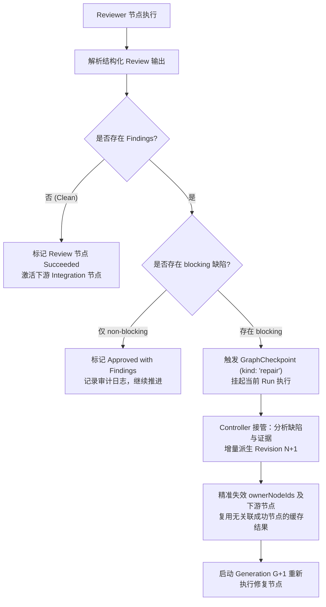
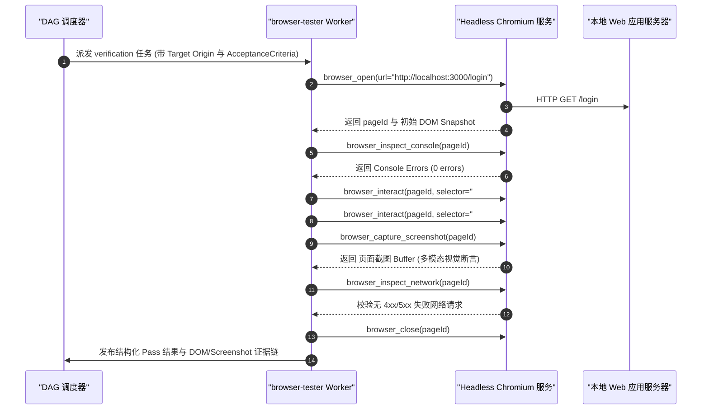

# 第 29 章：多 agent 编排与任务图设计

[English](29-multi-agent-orchestration-dag.md) | 中文

在单智能体（Single Agent）架构中，系统依赖一个处于无限循环状态机（`while(true)`）中的 LLM 实例，通过不断接收输入、追加会话事实账本、发起自回归概率采样、调度工具调用并观察环境反馈来解决工程问题。然而，当软件工程任务的复杂度、代码量、涉及文件数与验证流程跨越某个物理临界点时，单 Agent 必然遭遇严重的上下文窗口耗尽、注意力稀释、长链累积误差雪崩以及单线程执行效率低下等物理瓶颈。

为了解决这一系统级矛盾，现代工业级 Agent 框架引入了**多 Agent 编排与任务图设计（Multi-Agent Graph Orchestration）**。在 DeepSeek Harness 的架构体系中，任务图不是随意拼凑的 Prompt 链，也不是无序并发的线程池，而是一个具备严格数学约束、强类型契约、状态机驱动、不可变版本控制（Immutable Revisions）与分布式一致性保障的**有向无环图（Directed Acyclic Graph, DAG）调度引擎**。

本章将从传统系统编程视角出发，彻底解构多 Agent DAG 任务网的核心设计哲学、关键路径调度算法（Critical Path Method, CPM）、互不重叠的工作区写入根隔离、Campaign 与 Batch 战役架构演进，以及 `environment`、`implementation`、`integration` 与 `browser-tester` 四大特化节点的协作契约与生产级避坑指南。

---

## 1. 为什么多 Agent 不是简单的并行？串行单 Agent vs 多 Agent DAG 编排

在传统并发编程中，提高吞吐量最直观的方式是启动多线程（Worker Thread Pool）或多进程并行处理独立的计算任务。然而，在大语言模型驱动的软件工程任务中，**“朴素并行”往往直接导致系统级灾难**。

```
+---------------------------------------------------------------------------------------------------+
|                                 单 Agent 串行 vs 多 Agent DAG 拓扑流对比                          |
+---------------------------------------------------------------------------------------------------+
| 1. 单 Agent 串行架构 (单线程巨石死循环，上下文单调递增):                                           |
|    [Task A] ---> [Task B] ---> [Task C] ---> [Task D] ---> [Task E]                              |
|    (Context: 8k) (Context: 32k)(Context: 64k)(Context: 96k)(Context: 128k OOM / Attention Drift) |
+---------------------------------------------------------------------------------------------------+
| 2. 朴素并行 (无状态隔离，竞态冲突严重):                                                           |
|                 +---> [Worker 1: 改 src/auth.ts] ----+                                            |
|    [Scatter] --+---> [Worker 2: 改 src/auth.ts] ----+---> [Gather / 覆写破坏 / ABA 灾难]         |
|                 +---> [Worker 3: 安装全局依赖] -------+                                            |
+---------------------------------------------------------------------------------------------------+
| 3. 多 Agent DAG 编排 (拓扑隔离、显式数据流、Disjoint writeRoots、关键路径并行):                    |
|                 +---> [Node B: 后端实现 (writeRoots: "src/server")] --+                          |
|    [Node A: 架构设计]                                                   +---> [Node D: 集成合并]  |
|                 +---> [Node C: 前端实现 (writeRoots: "src/client")] --+       |                  |
|                                                                                v                  |
|                                                                    [Node E: 浏览器端到端测试]     |
+---------------------------------------------------------------------------------------------------+
```

### 1.1 系统编程心智映射：从单线程事件循环到分布式任务计算图

为了建立清晰的工程心智模型，我们将 AI 编排概念全面映射到成熟的传统计算机系统概念：

| 多 Agent DAG 编排概念 | 传统系统与软件工程概念 | 物理本质与计算模型 | 核心失效模式与防御机制 |
| :--- | :--- | :--- | :--- |
| **单 Agent 串行循环** | **单线程巨石进程 (Monolithic Loop)** | 所有状态共享同一个栈帧与内存空间，上下文单调增长 | 上下文超限崩溃、中间遗忘、级联幻觉 |
| **朴素并行 (Scatter-Gather)** | **无锁多线程并发写 (Unsynchronized Mutate)** | 多个 Worker 同时向同一个文件系统写入，缺乏边界 | 脏写（Dirty Write）、ABA 覆盖、依赖破坏 |
| **任务图节点 (Graph Node)** | **编译管线中的编译单元 (Translation Unit)** | 拥有明确输入、输出 Schema、执行预算与隔离工作区的纯计算单元 | 超时卡死、输出违反 Schema、副作用外溢 |
| **有向边 (Graph Edge)** | **Makefile / Ninja 依赖规则** | 显式声明数据流与控制流前后依赖，构建偏序关系 | 循环依赖死锁、悬挂指针、虚假依赖 |
| **写入根 (`writeRoots`)** | **内存页表隔离 / 命名空间挂载 (Mount NS)** | 声明 Worker 唯一合法的文件系统写入相对路径集合 | 越权写入、并发写冲突、目录逃逸 |
| **控制器 (Controller)** | **分布式调度协调器 (Coordinator / Master)** | 负责解析意图、生成最小不可变 DAG、分发任务与对账 | 单点脑裂、主控提示词膨胀、幻觉调度 |
| **不可变版本 (Revision)** | **Git 提交快照 (Git Commit Tree / Merkle DAG)** | 任务图拓扑的每次变更生成全局自增的不可变修订版本 | 状态就地修改导致的重放不一致、溯源断裂 |
| **战役批次 (Campaign / Batch)** | **多阶段微内核事务 (Multi-Stage Transaction)** | 将长远目标拆解为独立批次，前缀不可变，尾部增量扩展 | 跨批次上下文爆炸、历史幽灵节点干扰 |

### 1.2 串行单 Agent 的物理极限与三大失效壁垒

在单 Agent 模式下，无论底层基础大模型多么强大，长程复杂工程任务都会不可避免地撞上以下三大物理壁垒：

#### 1.2.1 上下文膨胀与 KV Cache 线性耗尽

大模型的自回归生成依赖历史上下文的全部 Token。单 Agent 连续执行多项任务时，所有历史工具调用结果（如 `grep` 输出、庞大的文件内容、编译错误堆栈）全部常驻在上下文账本中。

根据第 02 章与第 23 章给出的 KV Cache 显存消耗精确计算公式：

$$M_{\text{KV}} = 2 \times n_{\text{layers}} \times n_{\text{heads}} \times d_{\text{head}} \times L \times B \times \text{sizeof}(\text{dtype}) \quad (\text{Bytes})$$

以一个典型的 70B 稠密模型（$n_{\text{layers}}=80, n_{\text{heads}}=64, d_{\text{head}}=128$, 使用 FP16 即 2 字节）为例，当单并发上下文长度 $L$ 从 $8\text{k}$ 线性增长至 $128\text{k}$ 时，单请求显存占用从 $2\text{ GB}$ 飙升至 $32\text{ GB}$。

在商用 Token 计费场景下，后续每一个 Step 的输入 Token 计费都会呈等差数列求和式（$\mathcal{O}(N^2)$）暴增：

$$\text{Total Input Cost} \propto \sum_{i=1}^{N} (L_0 + i \cdot \Delta L) = N \cdot L_0 + \frac{N(N+1)}{2} \Delta L$$

#### 1.2.2 注意力稀释（Attention Dilution）与中间遗忘（Lost-in-the-Middle）

标准 Transformer 的 Softmax 注意力分布具有全局归一化特性：

$$\alpha_{ij} = \frac{\exp(q_i k_j^T / \sqrt{d_k})}{\sum_{m=1}^L \exp(q_i k_m^T / \sqrt{d_k})}$$

随着上下文序列长度 $L$ 的急剧增加，分母项 $\sum_{m=1}^L \exp(q_i k_m^T / \sqrt{d_k})$ 持续增大，导致分配给关键系统约束或早期架构决策的注意力权重 $\alpha_{ij}$ 显著稀释。

大模型在长序列中间位置的信息提取准确率呈现典型的“U 型曲线”，即极易发生“中间遗忘”。单 Agent 往往在执行到第 25 个 Step 时，已经彻底违背了第 1 个 Step 中制定的核心接口协议。

#### 1.2.3 累积误差雪崩（Cascading Error Amplification）

假设单个 Step 中 Agent 产生逻辑缺陷或工具误用的概率为 $p_{\text{error}} \in (0, 1)$。则在连续 $N$ 步的串行长链中，整个系统保持完全无缺陷的概率为：

$$P_{\text{success}} = \prod_{i=1}^N (1 - p_{\text{error}}^{(i)}) \approx (1 - p_{\text{error}})^N$$

若 $p_{\text{error}} = 0.05$（即单步正确率高达 95%），当串行步数 $N = 30$ 时：

$$P_{\text{success}} = (1 - 0.05)^{30} \approx 0.2146 \quad (21.46\%)$$

前序步骤产生的错误假设、错误代码或幻觉输出会被完整记录在上下文账本中，成为后续步骤推理的“事实前提”，引发级联式的错误自我强化与死循环。

### 1.3 朴素并行（Scatter-Gather）的工程灾难

为了克服串行延迟，部分初学者尝试采用简单的“派生 5 个子 Agent 同时去写代码”的朴素并行策略。这种无架构治理的并行在工程实践中会迅速遭遇以下灾难：

1. **共享工作区脏写（Dirty Write Conflict）**：Worker A 正在重构 `src/auth.ts`，Worker B 同时向 `src/auth.ts` 添加 OAuth 支持，两者互不知晓，后完成的 Worker 直接覆盖前者的写入，导致代码丢失或语法断裂。
2. **ABA 状态覆盖**：Worker A 基于代码版本 $V_1$ 进行了修改并写入 $V_2$；Worker B 基于 $V_1$ 诊断出缺陷并进行回滚写入 $V_1'$，Worker A 的修复成果被彻底抹除。
3. **隐式依赖破坏**：Worker 1 修改了数据库 Migration 脚本，Worker 2 在旧 Schema 假设下编写业务逻辑，两者的单元测试在各自的临时环境均通过，但在合并时引发运行时崩溃。

### 1.4 多 Agent DAG 编排的适用场景与边界成本分析（Trade-off Matrix）

多 Agent DAG 编排并非银弹。系统架构师必须清楚认识到引入 DAG 编排所付出的固定系统开销，并在工程实践中精确权衡。

根据阿姆达尔定律（Amdahl's Law），系统的理论最大加速比受限于不可并行的串行部分比例 $s$ 以及协调开销 $\text{Overhead}(N)$：

$$S(N) = \frac{1}{s + \frac{1 - s}{N} + \text{Overhead}(N)}$$

在 Agent 系统中，$\text{Overhead}(N)$ 包含 Controller 意图解析、DAG 校验、子会话 Fork、工作区隔离与跨分支合并等固定成本。

```
+---------------------------------------------------------------------------------------------------+
|                                 单 Agent vs 多 Agent DAG 决策矩阵                                  |
+---------------------------------------------------------------------------------------------------+
| 决策维度                     | 单 Agent 串行架构                  | 多 Agent DAG 编排架构           |
+-----------------------------+------------------------------------+--------------------------------+
| 适用任务规模                | 小型改动 (1-3 个文件, < 100 行改动) | 中大型特性、跨模块重构、端到端研发|
| 任务执行时间                | 1 ~ 5 分钟                         | 15 ~ 120 分钟                  |
| 拓扑结构                    | 单线性状态转移                     | 有向无环图 (DAG), 支持分支与汇聚|
| 上下文隔离度                | 零隔离 (单会话全量共享)            | 强隔离 (每个 Node 独立子会话)   |
| 并发安全机制                | 无并发 (串行单线程)                | 声明式 writeRoots 互斥校验     |
| 故障恢复粒度                | 全盘回滚或从断点盲目重试           | 局部节点重试 / 增量 Revision 修复|
| 调度系统开销 (Overhead)     | 接近 0 ms                          | 500 ms ~ 3000 ms (拓扑调度与对账)|
| 总体 Token 消耗倍率         | 基准 $1.0\times$                   | $1.3\times \sim 2.5\times$ (包含隔离与审查)|
+---------------------------------------------------------------------------------------------------+
```

---

## 2. 任务图设计哲学：契约、隔离与可测性

DeepSeek Harness 的任务图引擎建立在严格的**软件工程设计哲学**之上：每一个节点都必须是契约完备、边界明确且结果可复核的最小工作单元。

```
+---------------------------------------------------------------------------------------------------+
|                                  GraphNode 核心契约与工作区隔离模型                               |
+---------------------------------------------------------------------------------------------------+
|  GraphNode: "node-backend-impl"                                                                   |
|  +---------------------------------------------------------------------------------------------+  |
|  | Role: "engineer" | Kind: "implementation" | EffectPolicy: "idempotent"                       |  |
|  | AcceptanceCriteria: [                                                                       |  |
|  |   "1. POST /api/v1/auth/login 单元测试 100% 通过",                                            |  |
|  |   "2. pnpm --filter @backend/auth test 退出码为 0",                                           |  |
|  |   "3. 密码哈希采用 Argon2id，严禁明文落库"                                                     |  |
|  | ]                                                                                           |  |
|  | WorkspacePolicy:                                                                            |  |
|  |   Mode: "git-worktree"                                                                      |  |
|  |   ReadRoots:  ["packages/backend", "packages/types"]                                        |  |
|  |   WriteRoots: ["packages/backend/src/auth", "packages/backend/tests/auth"]  <-- 互斥锁定     |  |
|  | OutputSchema: ObjectJsonSchema { required: ["summary", "artifacts", "data"] }               |  |
|  +---------------------------------------------------------------------------------------------+  |
+---------------------------------------------------------------------------------------------------+
```

### 2.1 节点产物（Node Artifacts）与内容寻址清单

节点执行完成后，绝不能仅仅输出一段模糊的自然语言总结。在 Harness 中，每个节点必须生成强类型的输出结构 [`GraphNodeOutput`](file:///d:/git/deepseek-harness/packages/graph/graph/src/types.ts#L558-L565) 以及内容寻址的产物清单 [`GraphAttemptArtifactManifest`](file:///d:/git/deepseek-harness/packages/graph/graph/src/types.ts#L568-L590)。

产物清单记录了该 Attempt 在隔离工作区中修改的每一个文件及其 SHA-256 校验和：

```json
{
  "id": "manifest-att-7a8f9c",
  "algorithm": "sha256",
  "provider": "graph-worker-local",
  "workId": "work-backend-auth",
  "operationId": "op-4482",
  "attemptId": "att-001",
  "runId": "run-9921",
  "generationId": "gen-1",
  "ownerEpoch": 3,
  "fencingToken": 1048,
  "createdAt": 1771920100000,
  "totalBytes": 14280,
  "entries": [
    {
      "path": "packages/backend/src/auth/service.ts",
      "sha256": "e3b0c44298fc1c149afbf4c8996fb92427ae41e4649b934ca495991b7852b855",
      "baseSha256": "4b227777d4dd1fc61c6f884f48641d02b4d121d3fd328cb08b5531fcacdabf8a",
      "size": 8420,
      "mode": 420,
      "kind": "file"
    },
    {
      "path": "packages/backend/tests/auth/service.spec.ts",
      "sha256": "ca978112ca1bbdcafac231b39a23dc4da786eff8147c4e72b9807785afee48bb",
      "baseSha256": null,
      "size": 5860,
      "mode": 420,
      "kind": "file"
    }
  ],
  "providerReference": "worktree:/tmp/dsh-worktrees/att-001"
}
```

内容寻址清单带来了三大工程保障：
1. **防篡改与完整性校验**：下游集成节点（Integration Node）在合并代码前，可以比对磁盘文件的当前哈希与清单哈希，杜绝磁盘脏修改。
2. **基于 Base SHA-256 的三方合并（3-Way Merge）**：通过保留修改前的 `baseSha256`，集成节点能够精确检测出在 Worker 执行期间是否有其他并发提交发生了漂移（Drift）。
3. **不可变审计追踪**：会话日志只需记录轻量级 Manifest 元数据，实际文件内容存储在内容寻址存储（CAS）中，极大降低了会话账本的体积。

### 2.2 可测验收条件（Measurable Acceptance Criteria）

在自然语言编程中，模型极易产生“过度乐观”的虚假完成汇报（如声称“我已经完美修复了所有并发死锁问题”）。为了破除这种幻觉，Harness 规定任务图的每一个节点必须包含**可测验收条件（`acceptanceCriteria`）**。

验收条件必须遵循以下原则：
- **可执行程序断言**：必须指明具体的测试命令、静态检查命令或 HTTP 请求样例（如 `pnpm test:auth` 退出码必须为 0）。
- **确定性边界**：明确声明允许修改的文件范围与严禁触碰的核心模块。
- **状态留存证据**：要求在产物中附带测试执行的完整标准输出（stdout/stderr）及 Exit Code。

### 2.3 互不重叠的相对写入根（`writeRoots`）与工作区隔离

为了让多个 `implementation` 节点能够安全地并行执行，Harness 在任务图校验器中实现了严格的**空间互斥约束**。

#### 2.3.1 路径前缀重叠判定

定义两个归一化相对路径 $P_1$ 与 $P_2$，若满足以下任一条件，则判定两者发生重叠（Overlap）：

$$\text{Overlap}(P_1, P_2) \iff (P_1 = \text{“.”}) \lor (P_2 = \text{“.”}) \lor (P_1 = P_2) \lor (P_1 \text{ is prefix of } P_2) \lor (P_2 \text{ is prefix of } P_1)$$

在 TypeScript 源码中，该判定实现如下：

```typescript
const overlap = (left: string, right: string): boolean =>
  left === '.' ||
  right === '.' ||
  left === right ||
  left.startsWith(`${right}/`) ||
  right.startsWith(`${left}/`)
```

#### 2.3.2 拓扑可达性与并发冲突判定定理

在有向无环图 $G = (V, E)$ 中，定义可达性函数 $\text{Reaches}(u, v)$ 表示是否存在从节点 $u$ 到节点 $v$ 的有向路径。

**定理（并发安全准入定理）**：对于任务图中的任意两个具有非空写入根的节点 $u, v \in V$（且 $u \neq v$）： 若 $\neg \text{Reaches}(u, v) \land \neg \text{Reaches}(v, u)$（即节点 $u$ 与节点 $v$ 在拓扑上没有先后顺序约束，存在并发执行可能），则 $u$ 的写入根集合 $W(u)$ 与 $v$ 的写入根集合 $W(v)$ 必须严格互斥不重叠：

$$\forall r_1 \in W(u), \forall r_2 \in W(v), \quad \neg \text{Overlap}(r_1, r_2)$$

若违反此约束，任务图提交（`graph_submit`）将被内核校验器拦截，抛出 `GRAPH_WORKSPACE_OWNERSHIP` 致命错误：

```typescript
// 摘自 packages/graph/graph/src/index.ts 的核心校验逻辑
const reaches = (from: GraphNodeId, to: GraphNodeId, seen = new Set<GraphNodeId>()): boolean => {
  if (from === to) return true
  if (seen.has(from)) return false
  seen.add(from)
  return (successors.get(from) ?? []).some(next => reaches(next, to, seen))
}

const owned = [...nodes.values()].filter(node => node.workspace !== undefined && node.workspace.writeRoots.length > 0)
for (let leftIndex = 0; leftIndex < owned.length; leftIndex++) {
  const left = owned[leftIndex]!
  for (let rightIndex = leftIndex + 1; rightIndex < owned.length; rightIndex++) {
    const right = owned[rightIndex]!
    // 若两者之间存在前后先后依赖关系，则串行执行，允许复用同一工作区
    if (reaches(left.id, right.id) || reaches(right.id, left.id)) continue

    // 否则两者可能并发执行，必须保证 writeRoots 绝对正交
    const conflicts = (left.workspace?.writeRoots ?? []).some(leftRoot =>
      (right.workspace?.writeRoots ?? []).some(rightRoot => overlap(leftRoot, rightRoot))
    )
    if (conflicts) {
      fail('GRAPH_WORKSPACE_OWNERSHIP', `concurrent nodes ${JSON.stringify(left.id)} and ${JSON.stringify(right.id)} declare overlapping write roots`)
    }
  }
}
```

### 2.4 结构化 Review 节点与修复流转状态机

Review 是软件工程质量的守门人。在多 Agent DAG 中，`review` 角色节点绝不是走过场的文字赞扬，而是必须产出严格结构化的缺陷清单 [`GraphReviewIssue`](file:///d:/git/deepseek-harness/packages/graph/graph/src/types.ts#L523-L530)。



每个缺陷必须明确归属到具体的负责人节点（`ownerNodeIds`）并提供确凿的报错日志或代码行证据：

```typescript
export interface GraphReviewIssue {
  readonly id: string
  readonly severity: 'blocking' | 'non-blocking'
  readonly summary: string
  readonly evidence: readonly string[]
  readonly ownerNodeIds: readonly GraphNodeId[]
}
```

当存在 `blocking` 级别的严重缺陷时，调度器会生成一个 `repair` 类型的 [`GraphCheckpoint`](file:///d:/git/deepseek-harness/packages/graph/graph/src/types.ts#L532-L550)，挂起当前执行流。控制器（Controller）随后介入，读取缺陷证据，仅针对受影响的 `ownerNodeIds` 派生新的修复子图版本（Revision），而未受影响的节点的计算结果则被完全复用（Reused From），实现最小成本的局部修复。

---

## 3. 关键路径调度算法（CPM）与耗时计算公式

在任务图编排中，如何量化多 Agent 并行带来的性能加速比？如何计算一个大型任务图的理论执行下限？本节将给出严密的数学建模与计算推导。

```
+---------------------------------------------------------------------------------------------------+
|                                 复杂软件工程 DAG 关键路径与松弛时间计算图                          |
+---------------------------------------------------------------------------------------------------+
|                                                                                                   |
|                 +---> [B: 数据库模型设计 (T=15m, Slack=0)]* ------+                               |
|                 |     ES=10, EF=25, LS=10, LF=25                  |                               |
|                 |                                                 v                               |
|  [A: 架构分析]  +---> [C: 后端 API 实现 (T=40m, Slack=0)]* ------> [F: 跨模块集成 (T=20m, Slack=0)]*  |
|  (T=10m, Slack=0)*   ES=25, EF=65, LS=25, LF=65                  | ES=65, EF=85, LS=65, LF=85     |
|  ES=0, EF=10    |                                                 |       |                       |
|  LS=0, LF=10    +---> [D: 前端组件开发 (T=25m, Slack=30)] -------+       v                       |
|                 |     ES=10, EF=35, LS=40, LF=65                  |  [G: 浏览器端到端测试]        |
|                 |                                                 |  (T=15m, Slack=0)*            |
|                 +---> [E: 接口文档编写 (T=10m, Slack=45)] --------+  ES=85, EF=100                |
|                       ES=10, EF=20, LS=55, LF=65                     LS=85, LF=100                |
|                                                                                                   |
|  * 标注为关键路径节点 (Critical Path): A -> B -> C -> F -> G                                       |
|  关键路径总耗时 T_cp = 10 + 15 + 40 + 20 + 15 = 100 分钟                                           |
+---------------------------------------------------------------------------------------------------+
```

### 3.1 关键路径法（Critical Path Method, CPM）数学推导

设任务图为一个有向无环图 $G = (V, E)$，其中节点集合 $V = \{v_1, v_2, \dots, v_n\}$，每个节点 $v_i$ 具有确定或预估的执行耗时 $T(v_i) \ge 0$。有向边 $(u, v) \in E$ 表示节点 $u$ 是节点 $v$ 的直接前驱。

#### 3.1.1 最早开始时间（Early Start, ES）与最早完成时间（Early Finish, EF）

从入度为 0 的起始源点开始，沿拓扑排序正向递推：

$$ES(v) = \begin{cases} 0, & \text{if } \text{Predecessors}(v) = \emptyset \\ \max_{u \in \text{Predecessors}(v)} EF(u), & \text{otherwise} \end{cases}$$

$$EF(v) = ES(v) + T(v)$$

任务图的理论最早完工时间 $T_{\text{makespan}}$ 由所有终点节点的最大最早完成时间决定：

$$T_{\text{makespan}} = \max_{v \in V} EF(v)$$

#### 3.1.2 最迟完成时间（Late Finish, LF）与最迟开始时间（Late Start, LS）

从出度为 0 的终点汇点开始，沿逆拓扑排序反向递推：

$$LF(u) = \begin{cases} T_{\text{makespan}}, & \text{if } \text{Successors}(u) = \emptyset \\ \min_{v \in \text{Successors}(u)} LS(v), & \text{otherwise} \end{cases}$$

$$LS(u) = LF(u) - T(u)$$

#### 3.1.3 总松弛时间（Total Slack / Float）与关键路径判定

节点 $u$ 的总松弛时间 $Slack(u)$ 定义为在不延误整个任务图最终完工时间的前提下，该节点允许推迟启动的最大时间量：

$$Slack(u) = LS(u) - ES(u) = LF(u) - EF(u)$$

**关键路径判据**：所有满足 $Slack(u) = 0$ 的节点构成的连通路径集合即为**关键路径（Critical Path）**。关键路径上的任何延迟都会 1:1 线性导致整个任务图完工时间的推迟。

### 3.2 任务图端到端总耗时计算公式

在实际生产系统中，任务图的总耗时并非单纯的节点模型推理时间相加，还必须严密计入框架运行时的调度与分布式协调开销：

$$T_{\text{total}} = \sum_{k \in \text{CriticalPath}} T_k + T_{\text{overhead}}$$

其中，框架系统开销 $T_{\text{overhead}}$ 精确细分为六大物理耗时分量：

$$T_{\text{overhead}} = \sum_{i \in V} \left( t_{\text{sched\_tick}}^{(i)} + t_{\text{admit\_lease}}^{(i)} + t_{\text{session\_fork}}^{(i)} + t_{\text{fs\_isolate}}^{(i)} + t_{\text{artifact\_hash}}^{(i)} + t_{\text{settle\_barrier}}^{(i)} \right)$$

1. $t_{\text{sched\_tick}}$：调度器轮询与拓扑就绪节点扫描延迟（通常 $\approx 5 \sim 20\text{ ms}$）。
2. $t_{\text{admit\_lease}}$：SQLite 资源准入锁竞争与模型并发令牌申请延迟（通常 $\approx 10 \sim 50\text{ ms}$）。
3. $t_{\text{session\_fork}}$：创建子会话、注入系统提示词与前序上下文剪裁延迟（通常 $\approx 50 \sim 150\text{ ms}$）。
4. $t_{\text{fs\_isolate}}$：Git Worktree 创建、沙箱挂载或目录快照初始化耗时（通常 $\approx 100 \sim 500\text{ ms}$）。
5. $t_{\text{artifact\_hash}}$：节点结束时对生成文件计算 SHA-256 哈希清单的 I/O 耗时（通常 $\approx 50 \sim 300\text{ ms}$）。
6. $t_{\text{settle\_barrier}}$：外部结算事务（如 LoopX Todo 状态同步、日志持久化 Flush）网络与落盘延迟（通常 $\approx 50 \sim 200\text{ ms}$）。

### 3.3 7 节点工程任务图手算演示

以下展示上述 ASCII 架构图所示的 7 个节点的手算参数推导全过程：

| 节点 ID ($v_i$) | 任务名称与角色 | 耗时 $T_i$ | 前驱节点 | $ES$ | $EF$ | $LS$ | $LF$ | $Slack$ | 是否关键路径 |
| :--- | :--- | :--- | :--- | :--- | :--- | :--- | :--- | :--- | :--- |
| **A** | 需求分析与架构设计 (`architect`) | $10\text{ min}$ | 无 | 0 | 10 | 0 | 10 | **0** | **是 (Critical)** |
| **B** | 数据库模型设计与 Migration (`engineer`) | $15\text{ min}$ | A | 10 | 25 | 10 | 25 | **0** | **是 (Critical)** |
| **C** | 后端核心 API 实现 (`engineer`) | $40\text{ min}$ | B | 25 | 65 | 25 | 65 | **0** | **是 (Critical)** |
| **D** | 前端交互组件实现 (`engineer`) | $25\text{ min}$ | A | 10 | 35 | 40 | 65 | **30** | 否 |
| **E** | API 接口文档生成 (`writer`) | $10\text{ min}$ | A | 10 | 20 | 55 | 65 | **45** | 否 |
| **F** | 跨模块代码集成 (`engineer`) | $20\text{ min}$ | C, D, E | 65 | 85 | 65 | 85 | **0** | **是 (Critical)** |
| **G** | 浏览器端到端流程测试 (`browser-tester`) | $15\text{ min}$ | F | 85 | 100 | 85 | 100 | **0** | **是 (Critical)** |

**关键路径分析结论**：
- 关键路径为：$\text{A} \to \text{B} \to \text{C} \to \text{F} \to \text{G}$。
- 纯模型执行耗时：$T_{\text{CPM}} = 10 + 15 + 40 + 20 + 15 = 100\text{ min}$。
- 若采用单 Agent 串行执行全部节点，总耗时为：$T_{\text{serial}} = 10 + 15 + 40 + 25 + 10 + 20 + 15 = 135\text{ min}$。
- 多 Agent DAG 并行加速比：$S = \frac{T_{\text{serial}}}{T_{\text{CPM}}} = \frac{135}{100} = 1.35\times$。
- 节点 D 的松弛时间为 $30\text{ min}$，意味着前端开发即便延期 30 分钟，也不会对整体交付时间产生任何负面影响。

### 3.4 资源准入控制与并发死锁预防（Deadlock-Free Admission Control）

当任务图中存在大量可并发节点时，若不加节制地并发启动，会迅速耗尽本地模型显存、触发 API Rate Limit 报错，甚至导致**控制器饿死（Controller Starvation）死锁**。

```
+---------------------------------------------------------------------------------------------------+
|                              资源准入控制器与控制器预留令牌隔离机制                                |
+---------------------------------------------------------------------------------------------------+
|  全局并发上限: globalMaxParallel = 8                                                              |
|  控制器预留令牌: controllerReserve = 1 (任何时候 Worker 最多只能抢占 7 个并发槽位)                 |
|                                                                                                   |
|  [Worker 申请队列] ------------------------> [准入检查网关]                                      |
|                                                     |                                             |
|  [Controller 申请] ------------------------> [绿色特权通道 (直通保留槽)]                         |
|                                                     |                                             |
|                                                     v                                             |
|  +---------------------------------------------------------------------------------------------+  |
|  | 当前运行中槽位分配:                                                                         |  |
|  | [Slot 1: Worker] [Slot 2: Worker] [Slot 3: Worker] [Slot 4: Worker]                        |  |
|  | [Slot 5: Worker] [Slot 6: Worker] [Slot 7: Worker] | [Slot 8: Controller 特权保留槽]        |  |
|  +---------------------------------------------------------------------------------------------+  |
|                                                         ^                                         |
|                                                         | 避免死锁的关键:                         |
|                                                         | 当 7 个 Worker 全部卡在 Checkpoint 时,   |
|                                                         | Controller 仍有可用槽位执行子图修复规划!   |
+---------------------------------------------------------------------------------------------------+
```

Harness 调度器实现了三级准入控制机制：
1. **全局并发隔离与控制器预留（`controllerReserve`）**： 在配置 [`GraphSchedulerLimits`](file:///d:/git/deepseek-harness/packages/graph/graph/src/types.ts#L182-L187) 中设置 `globalMaxParallel: 8` 与 `controllerReserve: 1`。普通 Worker 最大并发上限被硬性限制为 $8 - 1 = 7$。永远保留 1 个槽位给主控 Controller。这杜绝了当所有 Worker 都陷入 Checkpoint 等待主控决策时，主控因没有并发配额而无法启动的**经典死锁陷阱**。
2. **基于模型维度的限流与显存加权（`GraphModelLimit`）**： 支持针对高消耗模型（如 70B 或视觉模型）配置独立的 `maxParallel` 与 `maxWeight`，防止高显存任务并发引发 GPU OOM。
3. **单调递增 Fencing Token 防覆写**： 每次派发 Attempt 时分配单调自增的递增令牌（Fencing Token）。在 Worker 结算或写文件时，底层存储引擎验证令牌有效性，直接丢弃超时的旧 Attempt 写入请求。

---

## 4. Campaign 与 Batch 架构演进：破除全量历史复制反模式

在设计多阶段复杂工程（例如“重构整个系统的认证模块、计费模块与数据导出功能”）时，开发者常常会犯一个致命的架构错误：**把上一个阶段已完成的所有历史节点，原封不动地复制到下一个阶段的任务图中**。

```
+---------------------------------------------------------------------------------------------------+
|                         历史节点全量复制反模式 vs Campaign/Batch 批次演进                          |
+---------------------------------------------------------------------------------------------------+
| 1. 错误反模式：历史节点全量复制 (The Copy-All Anti-Pattern)                                        |
|    Batch 1 Graph: [A (Done)] -> [B (Done)]                                                        |
|    Batch 2 Graph: [A (Done)] -> [B (Done)] -> [C (Done)] -> [D (Done)]                            |
|    Batch 3 Graph: [A (Done)] -> [B (Done)] -> [C (Done)] -> [D (Done)] -> [E (Run)] -> [F (Run)] |
|    => 灾难：DAG 节点数随批次线性暴增，Prompt 溢出，每次重放校验 O(N^2) 耗时，幽灵节点污染注意力!     |
+---------------------------------------------------------------------------------------------------+
| 2. 正确架构：Campaign 与 Batch 二级拓扑演进 (Immutable Prefix + Evidence Passing)                  |
|    Campaign: [Batch 1 (Approved)] ===> [Batch 2 (Approved)] ===> [Batch 3 (Active)]               |
|                                                                         |                         |
|    Batch 3 独立任务图:                                                  v                         |
|    [Settlement Evidence 1 & 2] (轻量级哈希/摘要引用) ---> [Node E: 实现] ---> [Node F: 验收]        |
|    => 优势：每个 Batch 拥有独立的轻量级 DAG，上下文绝对隔离，前缀不可变，尾部支持 planExtension 扩展!|
+---------------------------------------------------------------------------------------------------+
```

### 4.1 历史节点全量复制的四大致命危害

1. **控制器提示词超限（Prompt Explosion）**：随着已完成节点累积到数十个，描述这些节点的 JSON 结构体将占据数万 Token，直接挤占控制器的有效推理空间。
2. **注意力迷失与幽灵依赖（Ghost Dependencies）**：模型在规划新节点时，容易与几十个历史完成节点建立虚假的边（Edge），导致调度器产生循环依赖或死锁。
3. **拓扑验证复杂度平方级退化**：DAG 环路检测与 `writeRoots` 重叠检测的算法复杂度为 $\mathcal{O}(V + E)$ 与 $\mathcal{O}(V^2)$。当全量复制导致 $V$ 达到上百时，每次状态更新的校验耗时将达到秒级。
4. **状态漂移与重放断裂**：历史节点如果在新图中被误修改了元数据，会导致历史事件溯源记录与当前快照冲突，破坏事件溯源（Event Sourcing）的一致性基石。

### 4.2 Campaign 与 Batch 二级拓扑分层设计

DeepSeek Harness 引入了 [`GraphCampaign`](file:///d:/git/deepseek-harness/packages/graph/graph/src/types.ts#L497-L509) 与 [`GraphCampaignBatch`](file:///d:/git/deepseek-harness/packages/graph/graph/src/types.ts#L464-L482) 抽象：

```typescript
export interface GraphCampaignBatch {
  readonly id: GraphCampaignBatchId
  readonly ordinal: number
  readonly title: string
  readonly objective: string
  readonly dependsOn: readonly GraphCampaignBatchId[]
  readonly status: 'planned' | 'running' | 'approved' | 'approved_with_findings' | 'rejected' | 'needs_user' | 'blocked'
  readonly graphId?: GraphId
  readonly executions: readonly {
    readonly graphId: GraphId
    readonly revision: number
    readonly runId: GraphRunId
    readonly status: 'running' | 'succeeded' | 'failed' | 'canceled' | 'exhausted' | 'awaiting_user'
    readonly startedAt: number
    readonly completedAt?: number
    readonly settlementIds: readonly GraphSettlementId[]
    readonly summary?: string
  }[]
}

export interface GraphCampaign {
  readonly version: 1
  readonly id: GraphCampaignId
  readonly objective: string
  readonly createdAt: number
  readonly updatedAt: number
  readonly phase: 'planned' | 'running' | 'awaiting_user' | 'succeeded' | 'failed' | 'canceled'
  readonly batches: readonly GraphCampaignBatch[]
  readonly activeBatchId?: GraphCampaignBatchId
  readonly planRevision?: number
  readonly planExtensions?: readonly GraphCampaignPlanExtension[]
}
```

### 4.3 不可变计划前缀与动态尾部扩展（`planExtension`）

在软件研发过程中，前序批次的执行发现往往会颠覆后续批次的规划（例如在执行完“数据库优化”批次后，发现瓶颈其实在“网络 I/O”）。

Harness 规定：
- **前缀不可变（Immutable Prefix）**：已经批准（`approved`）或正在执行（`running`）的历史批次严禁就地修改、删除或重排。
- **动态尾部追加（`planExtension`）**：当模型或人类需要调整后续未开始的批次时，必须通过 [`GraphCampaignPlanExtension`](file:///d:/git/deepseek-harness/packages/graph/graph/src/types.ts#L485-L493) 结构，以审计追加的方式向 Campaign 注册新的批次后缀。

```typescript
export interface GraphCampaignPlanExtension {
  readonly revision: number
  readonly createdAt: number
  readonly reason: string
  readonly addedBatchIds: readonly GraphCampaignBatchId[]
  readonly sourceBatchId?: GraphCampaignBatchId
  readonly sourceRunId?: GraphRunId
  readonly settlementIds: readonly GraphSettlementId[]
}
```

### 4.4 证据引用传递（Evidence Reference Passing）

后序批次启动时，控制器不会向新 DAG 注入前序批次的上百条原始对话，而是仅仅注入前序批次的**结算证据清单（`settlementIds`）与公开安全协调摘要（`coordinationSummary`）**。每个独立的 Batch 图只包含当前批次的 3~8 个节点，使单图的推理上下文始终保持在绝对纯净的极小范围内。

---

## 5. 节点角色分工与专业化执行

在 DeepSeek Harness 中，不同类型的工程任务必须分配给专业特化的角色节点。严禁在一个节点内混杂特权操作、代码实现与端到端测试。

```
+---------------------------------------------------------------------------------------------------+
|                                 四类特化节点分工与流转拓扑                                         |
+---------------------------------------------------------------------------------------------------+
|                                                                                                   |
|  [1. environment 节点] ---> (人工安全审批 Checkpoint) ---> [2. implementation 节点 (并行 Worker)] |
|  (主机/特权变更隔离)                                       | (受限沙箱, 独立 writeRoots)          |
|                                                            +------------------+                   |
|                                                                               |                   |
|                                                                               v                   |
|  [4. browser-tester 节点] <--- [代码 Review 节点] <------------- [3. integration 节点]           |
|  (Web 真实交互验收)            (架构与质量门禁)                  (3-Way Merge 与漂移消解)         |
|                                                                                                   |
+---------------------------------------------------------------------------------------------------+
```

### 5.1 `environment` 节点：宿主机环境与特权变更隔离

代码编写 Agent（`engineer`）必须运行在受限沙箱中，**严禁赋予其直接在宿主机执行 `sudo apt install`、修改全局环境变量或启动宿主机 Docker 容器的特权**。

当项目确实缺少必要的工具链或系统依赖时，必须由专职的 `environment` 节点进行声明式规划：

```typescript
export interface GraphEnvironmentPlan {
  readonly requiredCapabilities: readonly ('network' | 'host-package-install' | 'docker')[]
  readonly sandboxMode: 'workspace-write' | 'danger-full-access'
  readonly operations: readonly {
    readonly id: string
    readonly description: string
    readonly command: string
    readonly rollbackCommand?: string
  }[]
}
```

**强制审批机制**：
- `environment` 节点必须将 `effectPolicy` 设为 `manual`。
- 节点执行前，调度器会自动创建 `kind: 'environment'` 的 [`GraphCheckpoint`](file:///d:/git/deepseek-harness/packages/graph/graph/src/types.ts#L538)，暂停所有执行流，将包含精确命令与回滚指令的方案呈现给人类工程师。
- 只有在人类明确输入授权后，宿主机 Host 执行器才会直接代为执行命令，模型 Worker 绝不直接触碰特权 Shell。

### 5.2 `implementation` 节点：受限沙箱内的代码生产

`implementation` 节点是代码生产的核心单元，其规划必须遵循以下硬性工程指标：
- **工时粒度**：代表人类工程师约 10~30 分钟的专注工作量，禁止规划超过 1 小时的“巨石实现节点”。
- **单一职责**：一个节点只负责一个高内聚的模块或特性改动。
- **正交写入根**：必须显式声明具体的 `writeRoots`，绝不滥用 `.`（全工作区）。
- **可复核产物**：执行结束必须产生 Git Diff 明确的产物清单与单元测试日志。

### 5.3 `integration` 节点：跨工作区分支汇聚与漂移消解

当并行执行的多个 `implementation` 节点分别在各自的 `git-worktree` 中完成了代码修改后，必须通过 `integration` 节点进行统一的汇聚与合并。

`integration` 节点的标准处理流程：
1. **产物清单聚合**：拉取所有上游节点的 `GraphAttemptArtifactManifest`。
2. **3-Way Merge 冲突检测**： 针对每个修改的文件，比对它的 `baseSha256`、当前主分支的 Head SHA-256 以及 Worker 生成的 `sha256`。
3. **源码漂移（Source Drift）判定**： 若发现某个文件在 Worker 执行期间已被外部进程修改（即当前主分支哈希 $\neq$ `baseSha256`），`integration` 节点立即标记合并冲突，将冲突详情上报给 Controller，触发子图重规划，严禁暴力强行覆盖。
4. **全量构建与集成测试验证**：在合并后的工作区中运行全量编译与跨模块测试。

### 5.4 `browser-tester` 节点：端到端 Web 真实流程交互验收

对于包含 Web 前端界面的工程任务，单元测试通过并不代表用户真实可用（例如 CSS `z-index` 遮挡导致按钮无法点击、异步请求时序错误导致页面白屏）。



`browser-tester` 节点的严格执行铁律：
- **单一 Page 生命周期隔离**：必须显式持有自己创建的 `pageId`，严禁关闭或篡改其他 Worker 创建的页面实例。
- **快照与元素 ID 定位**：优先使用语义化的 DOM 快照与元素 Ref 进行点击与输入交互，避免脆弱的屏幕绝对坐标点击。
- **视觉截图多模态断言**：在支持视觉的大模型线路上，捕获关键渲染界面的截图进行布局断言。
- **被动错误熔断**：在关键交互后，必须显式调用控制台日志与网络请求检查工具；若存在未捕获的 JavaScript Error 或 500 API 报错，即便页面表面渲染正常，也必须判定为验收失败。
- **严禁破坏性行为**：严禁在生产或未受控的外部域名执行写操作，严禁输入真实的密码与私钥。

---

## 6. 工业级 TypeScript 源码实现：生产级 DAG 编排引擎

以下给出一套完整、类型完备、具备严格防御性边界与生产级异常处理的多 Agent DAG 编排调度引擎源码实现。

```typescript
/**
 * 生产级多 Agent DAG 任务图调度引擎与关键路径分析器
 * @module dsh-graph-orchestrator
 */

import { z } from 'zod'

// ==========================================
// 1. 核心强类型定义与 Branded IDs
// ==========================================

export type GraphId = string & { readonly __brand: 'GraphId' }
export type GraphNodeId = string & { readonly __brand: 'GraphNodeId' }
export type GraphRoleId = string & { readonly __brand: 'GraphRoleId' }
export type GraphRunId = string & { readonly __brand: 'GraphRunId' }

export const GraphId = (id: string): GraphId => id as GraphId
export const GraphNodeId = (id: string): GraphNodeId => id as GraphNodeId
export const GraphRoleId = (id: string): GraphRoleId => id as GraphRoleId
export const GraphRunId = (id: string): GraphRunId => id as GraphRunId

export type TaskKind =
  | 'analysis'
  | 'design'
  | 'environment'
  | 'implementation'
  | 'review'
  | 'integration'
  | 'browser-tester'
  | 'verification'

export type NodePhase =
  | 'pending'
  | 'ready'
  | 'running'
  | 'succeeded'
  | 'failed'
  | 'blocked'
  | 'skipped'

export type EffectPolicy = 'idempotent' | 'reconcile' | 'manual'

export interface WorkspacePolicy {
  readonly mode: 'read-only-snapshot' | 'isolated-copy' | 'git-worktree' | 'sandbox-mount'
  readonly readRoots: readonly string[]
  readonly writeRoots: readonly string[]
}

export interface NodeDefinition {
  readonly id: GraphNodeId
  readonly title: string
  readonly roleId: GraphRoleId
  readonly kind: TaskKind
  readonly estimatedDurationMs: number
  readonly acceptanceCriteria: readonly string[]
  readonly workspace: WorkspacePolicy
  readonly effectPolicy: EffectPolicy
  readonly maxAttempts: number
}

export interface GraphEdge {
  readonly from: GraphNodeId
  readonly to: GraphNodeId
}

export interface GraphTopology {
  readonly graphId: GraphId
  readonly revision: number
  readonly nodes: readonly NodeDefinition[]
  readonly edges: readonly GraphEdge[]
}

export interface SchedulerLimits {
  readonly globalMaxParallel: number
  readonly controllerReserve: number
}

export interface NodeExecutionState {
  readonly nodeId: GraphNodeId
  phase: NodePhase
  attempts: number
  startedAt?: number
  finishedAt?: number
  actualDurationMs?: number
  output?: {
    summary: string
    artifacts: readonly string[]
    data?: Record<string, unknown>
  }
  error?: { code: string; message: string }
}

export interface CPMNodeMetrics {
  readonly nodeId: GraphNodeId
  readonly durationMs: number
  readonly earlyStartMs: number
  readonly earlyFinishMs: number
  readonly lateStartMs: number
  readonly lateFinishMs: number
  readonly slackMs: number
  readonly isCritical: boolean
}

// ==========================================
// 2. 拓扑校验器与互斥 writeRoots 检查器
// ==========================================

export class GraphValidationError extends Error {
  constructor(public readonly code: string, message: string) {
    super(message)
    this.name = 'GraphValidationError'
  }
}

export class GraphTopologyValidator {
  /**
   * 判定两个相对路径是否重叠
   */
  public static isPathOverlap(left: string, right: string): boolean {
    const l = left.trim()
    const r = right.trim()
    if (l === '.' || r === '.') return true
    if (l === r) return true
    if (l.startsWith(`${r}/`)) return true
    if (r.startsWith(`${l}/`)) return true
    return false
  }

  /**
   * 严格校验 DAG 拓扑合法性、有向无环性与并发写入根互斥
   */
  public static validate(graph: GraphTopology): void {
    const nodeMap = new Map<GraphNodeId, NodeDefinition>()
    for (const node of graph.nodes) {
      if (nodeMap.has(node.id)) {
        throw new GraphValidationError('GRAPH_DUPLICATE_NODE', `Duplicate node id: ${node.id}`)
      }
      nodeMap.set(node.id, node)
    }

    // 构建邻接表
    const adjacency = new Map<GraphNodeId, GraphNodeId[]>()
    const inDegree = new Map<GraphNodeId, number>()
    for (const node of graph.nodes) {
      adjacency.set(node.id, [])
      inDegree.set(node.id, 0)
    }

    for (const edge of graph.edges) {
      if (!nodeMap.has(edge.from) || !nodeMap.has(edge.to)) {
        throw new GraphValidationError(
          'GRAPH_INVALID_EDGE',
          `Edge references unknown node: ${edge.from} -> ${edge.to}`
        )
      }
      if (edge.from === edge.to) {
        throw new GraphValidationError('GRAPH_SELF_CYCLE', `Self-loop detected on node ${edge.from}`)
      }
      adjacency.get(edge.from)!.push(edge.to)
      inDegree.set(edge.to, inDegree.get(edge.to)! + 1)
    }

    // Kahn 算法拓扑排序检测环路
    const queue: GraphNodeId[] = []
    for (const [id, deg] of inDegree.entries()) {
      if (deg === 0) queue.push(id)
    }

    let visitedCount = 0
    while (queue.length > 0) {
      const curr = queue.shift()!
      visitedCount++
      for (const next of adjacency.get(curr)!) {
        const nextDeg = inDegree.get(next)! - 1
        inDegree.set(next, nextDeg)
        if (nextDeg === 0) queue.push(next)
      }
    }

    if (visitedCount !== graph.nodes.length) {
      throw new GraphValidationError('GRAPH_CYCLE_DETECTED', 'Cycle detected in task graph topology')
    }

    // 拓扑可达性分析
    const reaches = (from: GraphNodeId, to: GraphNodeId, seen = new Set<GraphNodeId>()): boolean => {
      if (from === to) return true
      if (seen.has(from)) return false
      seen.add(from)
      return (adjacency.get(from) ?? []).some(next => reaches(next, to, seen))
    }

    // 校验并发节点的 writeRoots 互斥
    const mutatingNodes = graph.nodes.filter(n => n.workspace.writeRoots.length > 0)
    for (let i = 0; i < mutatingNodes.length; i++) {
      const left = mutatingNodes[i]!
      for (let j = i + 1; j < mutatingNodes.length; j++) {
        const right = mutatingNodes[j]!
        // 若存在前后依赖顺序，则串行调度，允许复用
        if (reaches(left.id, right.id) || reaches(right.id, left.id)) continue

        // 若两者在拓扑上互不可达，则可能并发运行，必须确保 writeRoots 绝对正交
        for (const lRoot of left.workspace.writeRoots) {
          for (const rRoot of right.workspace.writeRoots) {
            if (this.isPathOverlap(lRoot, rRoot)) {
              throw new GraphValidationError(
                'GRAPH_WORKSPACE_OWNERSHIP',
                `Concurrent nodes ${left.id} and ${right.id} declare overlapping writeRoots: "${lRoot}" vs "${rRoot}"`
              )
            }
          }
        }
      }
    }
  }
}

// ==========================================
// 3. 关键路径分析器（CPM Engine）
// ==========================================

export class CriticalPathAnalyzer {
  public static calculate(graph: GraphTopology): {
    makespanMs: number
    criticalPath: readonly GraphNodeId[]
    metrics: ReadonlyMap<GraphNodeId, CPMNodeMetrics>
  } {
    GraphTopologyValidator.validate(graph)

    const nodeMap = new Map<GraphNodeId, NodeDefinition>(graph.nodes.map(n => [n.id, n]))
    const predecessors = new Map<GraphNodeId, GraphNodeId[]>()
    const successors = new Map<GraphNodeId, GraphNodeId[]>()

    for (const node of graph.nodes) {
      predecessors.set(node.id, [])
      successors.set(node.id, [])
    }
    for (const edge of graph.edges) {
      predecessors.get(edge.to)!.push(edge.from)
      successors.get(edge.from)!.push(edge.to)
    }

    // 拓扑排序计算拓扑序列
    const inDeg = new Map<GraphNodeId, number>(
      graph.nodes.map(n => [n.id, predecessors.get(n.id)!.length])
    )
    const topoOrder: GraphNodeId[] = []
    const q: GraphNodeId[] = graph.nodes.filter(n => inDeg.get(n.id) === 0).map(n => n.id)

    while (q.length > 0) {
      const u = q.shift()!
      topoOrder.push(u)
      for (const v of successors.get(u)!) {
        const d = inDeg.get(v)! - 1
        inDeg.set(v, d)
        if (d === 0) q.push(v)
      }
    }

    // 1. 正向递推 Early Start / Early Finish
    const es = new Map<GraphNodeId, number>()
    const ef = new Map<GraphNodeId, number>()

    for (const u of topoOrder) {
      const preds = predecessors.get(u)!
      const earlyStart = preds.length === 0 ? 0 : Math.max(...preds.map(p => ef.get(p)!))
      const duration = nodeMap.get(u)!.estimatedDurationMs
      es.set(u, earlyStart)
      ef.set(u, earlyStart + duration)
    }

    const makespanMs = Math.max(...topoOrder.map(u => ef.get(u)!), 0)

    // 2. 反向递推 Late Start / Late Finish
    const ls = new Map<GraphNodeId, number>()
    const lf = new Map<GraphNodeId, number>()

    for (let i = topoOrder.length - 1; i >= 0; i--) {
      const u = topoOrder[i]!
      const succs = successors.get(u)!
      const lateFinish = succs.length === 0 ? makespanMs : Math.min(...succs.map(s => ls.get(s)!))
      const duration = nodeMap.get(u)!.estimatedDurationMs
      lf.set(u, lateFinish)
      ls.set(u, lateFinish - duration)
    }

    // 3. 计算 Slack 与构建关键路径
    const metrics = new Map<GraphNodeId, CPMNodeMetrics>()
    const criticalNodes = new Set<GraphNodeId>()

    for (const u of topoOrder) {
      const earlyStart = es.get(u)!
      const earlyFinish = ef.get(u)!
      const lateStart = ls.get(u)!
      const lateFinish = lf.get(u)!
      const duration = nodeMap.get(u)!.estimatedDurationMs
      const slack = lateStart - earlyStart
      const isCritical = Math.abs(slack) < 1e-6 // 浮点容差

      if (isCritical) {
        criticalNodes.add(u)
      }

      metrics.set(u, {
        nodeId: u,
        durationMs: duration,
        earlyStartMs: earlyStart,
        earlyFinishMs: earlyFinish,
        lateStartMs: lateStart,
        lateFinishMs: lateFinish,
        slackMs: slack,
        isCritical,
      })
    }

    return {
      makespanMs,
      criticalPath: topoOrder.filter(u => criticalNodes.has(u)),
      metrics,
    }
  }
}

// ==========================================
// 4. 生产级有界并发 DAG 调度器
// ==========================================

export interface WorkerExecutionResult {
  readonly success: boolean
  readonly summary: string
  readonly artifacts: readonly string[]
  readonly data?: Record<string, unknown>
  readonly error?: { code: string; message: string }
}

export type WorkerRunner = (
  node: NodeDefinition,
  fencingToken: number,
  signal: AbortSignal
) => Promise<WorkerExecutionResult>

export class GraphDagScheduler {
  private readonly states = new Map<GraphNodeId, NodeExecutionState>()
  private runningWorkers = 0
  private currentFencingToken = 0
  private isAborted = false

  constructor(
    private readonly graph: GraphTopology,
    private readonly limits: SchedulerLimits,
    private readonly runner: WorkerRunner
  ) {
    GraphTopologyValidator.validate(this.graph)
    for (const node of this.graph.nodes) {
      this.states.set(node.id, {
        nodeId: node.id,
        phase: 'pending',
        attempts: 0,
      })
    }
  }

  /**
   * 执行完整的任务图生命周期
   */
  public async execute(signal: AbortSignal): Promise<ReadonlyMap<GraphNodeId, NodeExecutionState>> {
    return new Promise((resolve, reject) => {
      const checkAbort = () => {
        if (signal.aborted && !this.isAborted) {
          this.isAborted = true
          for (const state of this.states.values()) {
            if (state.phase === 'running' || state.phase === 'ready' || state.phase === 'pending') {
              state.phase = 'failed'
              state.error = { code: 'SCHEDULER_ABORTED', message: 'Execution aborted by external signal' }
            }
          }
          reject(new Error('Scheduler execution aborted'))
        }
      }

      signal.addEventListener('abort', checkAbort, { once: true })

      const predecessors = new Map<GraphNodeId, GraphNodeId[]>()
      for (const node of this.graph.nodes) predecessors.set(node.id, [])
      for (const edge of this.graph.edges) predecessors.get(edge.to)!.push(edge.from)

      const dispatchLoop = () => {
        if (this.isAborted) return

        let allCompleted = true
        let hasActiveWork = false

        for (const node of this.graph.nodes) {
          const state = this.states.get(node.id)!

          if (state.phase === 'succeeded' || state.phase === 'skipped') {
            continue
          }

          if (state.phase === 'failed') {
            // 节点失败导致所有后序节点直接置为 blocked
            this.propagateBlock(node.id)
            continue
          }

          if (state.phase === 'blocked') {
            continue
          }

          allCompleted = false

          if (state.phase === 'running') {
            hasActiveWork = true
            continue
          }

          // 检查前驱依赖是否全部成功
          const preds = predecessors.get(node.id)!
          const allPredsSucceeded = preds.every(pId => this.states.get(pId)!.phase === 'succeeded')
          const anyPredFailedOrBlocked = preds.some(pId => {
            const pPhase = this.states.get(pId)!.phase
            return pPhase === 'failed' || pPhase === 'blocked'
          })

          if (anyPredFailedOrBlocked) {
            state.phase = 'blocked'
            state.error = {
              code: 'PREDECESSOR_FAILED',
              message: 'One or more predecessor nodes failed or blocked',
            }
            continue
          }

          if (allPredsSucceeded && state.phase === 'pending') {
            state.phase = 'ready'
          }

          // 准入控制：检查最大 Worker 并发上限（必须扣除 controllerReserve）
          const effectiveWorkerLimit = Math.max(1, this.limits.globalMaxParallel - this.limits.controllerReserve)
          if (state.phase === 'ready' && this.runningWorkers < effectiveWorkerLimit) {
            hasActiveWork = true
            this.launchNode(node, state, signal, dispatchLoop)
          }
        }

        if (allCompleted || (!hasActiveWork && this.runningWorkers === 0)) {
          resolve(this.states)
        }
      }

      // 启动初次扫描
      dispatchLoop()
    })
  }

  private launchNode(
    node: NodeDefinition,
    state: NodeExecutionState,
    parentSignal: AbortSignal,
    onStepComplete: () => void
  ): void {
    this.runningWorkers++
    state.phase = 'running'
    state.attempts++
    state.startedAt = Date.now()

    const fencingToken = ++this.currentFencingToken
    const abortController = new AbortController()
    const onParentAbort = () => abortController.abort()
    parentSignal.addEventListener('abort', onParentAbort, { once: true })

    // 异步启动 Worker
    void (async () => {
      try {
        const result = await this.runner(node, fencingToken, abortController.signal)
        state.finishedAt = Date.now()
        state.actualDurationMs = state.finishedAt - (state.startedAt ?? state.finishedAt)

        if (result.success) {
          state.phase = 'succeeded'
          state.output = {
            summary: result.summary,
            artifacts: result.artifacts,
            data: result.data,
          }
        } else {
          if (state.attempts < node.maxAttempts) {
            // 支持局部重试
            state.phase = 'ready'
          } else {
            state.phase = 'failed'
            state.error = result.error ?? { code: 'EXECUTION_FAILED', message: result.summary }
          }
        }
      } catch (err: unknown) {
        state.finishedAt = Date.now()
        state.phase = 'failed'
        state.error = {
          code: 'UNHANDLED_EXCEPTION',
          message: err instanceof Error ? err.message : String(err),
        }
      } finally {
        parentSignal.removeEventListener('abort', onParentAbort)
        this.runningWorkers--
        onStepComplete()
      }
    })()
  }

  private propagateBlock(failedNodeId: GraphNodeId): void {
    const successors = new Map<GraphNodeId, GraphNodeId[]>()
    for (const node of this.graph.nodes) successors.set(node.id, [])
    for (const edge of this.graph.edges) successors.get(edge.from)!.push(edge.to)

    const queue = [...(successors.get(failedNodeId) ?? [])]
    while (queue.length > 0) {
      const nextId = queue.shift()!
      const state = this.states.get(nextId)!
      if (state.phase === 'pending' || state.phase === 'ready') {
        state.phase = 'blocked'
        state.error = { code: 'CASCADE_BLOCKED', message: `Blocked due to failure of ancestor ${failedNodeId}` }
        queue.push(...(successors.get(nextId) ?? []))
      }
    }
  }
}
```

---

## 7. 生产环境五大经典故障案例与根因排查（Post-Mortems）

在生产级 Agent 调度系统中，由于分布式异步、文件系统副作用与概率采样的交织，系统极易触发隐蔽且毁灭性的缺陷。以下梳理五大真实工业级故障案例与根治防范代码。

### 7.1 故障案例一：并发 Worker 写入根重叠导致代码被覆盖与 Git 脏提交

```
+---------------------------------------------------------------------------------------------------+
| 故障回放: Worker A 与 Worker B 声明重叠 writeRoots 并发修改同一文件                               |
+---------------------------------------------------------------------------------------------------+
|  00:00:00 [Scheduler] 启动 Node A (writeRoots: ["packages/backend"])                              |
|  00:00:00 [Scheduler] 启动 Node B (writeRoots: ["packages/backend/src/auth"])                     |
|  00:00:15 [Worker A] 将 packages/backend/src/auth/token.ts 重构为 JWT + Ed25519 签名               |
|  00:00:18 [Worker B] 将 packages/backend/src/auth/token.ts 篡改为旧版 HMAC-SHA256 逻辑           |
|  00:00:20 [Worker A] 单元测试通过，输出 Manifest A                                                 |
|  00:00:22 [Worker B] 单元测试通过，输出 Manifest B，直接覆写磁盘!                                  |
|  00:00:25 [Integration Node] 运行全量测试 -> 报 Ed25519 接口丢失异常，排查耗时 4 小时!             |
+---------------------------------------------------------------------------------------------------+
```

- **根本原因**：校验器在准入时仅检查了字符串相等（`leftRoot === rightRoot`），未实现严格的路径前缀树判定（Prefix Tree Check），导致父目录与子目录被判定为“无冲突”。
- **修复方案**：引入本文第 2.5 节给出的 `isPathOverlap` 与拓扑可达性校验算法，任何具有前缀包含关系的路径一律禁止并发执行。

### 7.2 故障案例二：全量历史节点无限复制导致 Controller 提示词超限与注意力迷失

- **根本原因**：在执行多批次重构任务时，Controller 将 Batch 1 的 25 个节点完整复制进 Batch 2 的提交中。Batch 2 的 Prompt 达到了 120k Token，触发了模型的中间遗忘，Controller 错误地为新节点挂载了指向历史节点的无效边，引发循环依赖。
- **修复方案**：全面废弃全量复制，迁移到 Campaign/Batch 二级拓扑架构。跨批次仅通过 `settlementIds` 传递公开安全摘要，将新 Batch 图的节点数严格压制在 10 个以内。

### 7.3 故障案例三：Worker 异常退出引发 Lease 锁死与下游任务永久 Blocked

- **根本原因**：Worker 所在容器因宿主机 OOM 被操作系统 `SIGKILL` 强制杀死，未执行 `finally` 析构钩子，未能释放 SQLite 调度器中的租约锁，导致下游就绪节点等待超时长达 30 分钟。
- **修复方案**：调度器引入心跳自愈机制（Heartbeat Lease）。每个 Worker 每隔 15 秒更新一次租约时间戳。若超过 45 秒未检测到心跳，调度器自动抢占租约，标记该 Attempt 失败并触发故障恢复重试。

### 7.4 故障案例四：Environment 节点规避审批静默升级全局 glibc 破坏生产运行时

- **根本原因**：一个负责安装 Python 数据分析包的 `environment` 节点，模型自作主张地生成了 `apt-get install -y libc6-dev` 命令，并尝试静默执行，破坏了宿主机底层 C 运行时。
- **修复方案**：严格强制 `environment` 节点必须挂起 `kind: 'environment'` 的人工审批检查点（Checkpoint）。在配置中将 `sandboxMode` 锁定为 `workspace-write`，禁止执行任何超出项目根目录的破坏性系统级升级。

### 7.5 故障案例五：Browser-Tester 页面句柄泄漏引发无头 Chromium 僵尸进程与 GPU 显存耗尽

- **根本原因**：`browser-tester` 节点在执行测试过程中抛出超时未捕获异常，导致 `browser_close` 工具未被调用。连续运行 20 次任务后，宿主机驻留了 20 个僵尸 Chromium 实例，彻底榨干了 GPU 显存。
- **修复方案**：在 Cordis IoC 容器中注册上下文资源回收钩子（`ctx.effect()`），将每个 Browser Page 实例绑定到 Attempt 生命周期。无论 Worker 正常退出还是异常中断，容器层强制调用销毁器回收浏览器句柄。

---

## 8. 本章小结与系统架构自检清单

本章深入剖析了 DeepSeek Harness 多 Agent 编排与任务图（Graph Mode）的底层工程实现。从克服单 Agent 物理局限，到关键路径 CPM 耗时精算；从声明式 `writeRoots` 工作区空间隔离，到 Campaign/Batch 批次演进与四大专业化角色协同，建立起了一套坚固的系统级任务图调度体系。

### 8.1 任务图架构成熟度自检清单（Graph Maturity Checklist）

在生产环境中部署多 Agent 任务图之前，请对照以下指标逐项核对：

- [ ] **拓扑无环性保障**：提交任务图时是否运行 Kahn 拓扑排序与自环检测？
- [ ] **写入空间严格正交**：并发互不可达的节点是否通过了 `writeRoots` 前缀树互斥校验？
- [ ] **关键路径可观测性**：系统是否具备计算 $ES/EF/LS/LF$ 与 Slack 松弛时间的能力？
- [ ] **防饿死特权通道**：全局并发池是否为 Controller 预留了独立槽位（`controllerReserve \ge 1`）？
- [ ] **批次演进隔离**：是否杜绝了跨批次全量节点复制？是否采用 `planExtension` 增量演进？
- [ ] **特权操作人工闭环**：`environment` 节点的命令执行是否绑定了强制人工审批检查点？
- [ ] **端到端 Web 严密断言**：`browser-tester` 是否捕获并核验了 Console Error 与 Network 失败请求？
- [ ] **分布式 Fencing 防御**：Worker 写入与状态结算是否携带单调递增的 Fencing Token？
