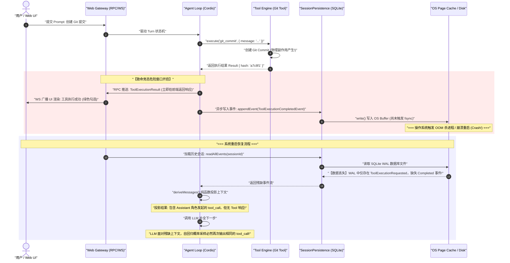
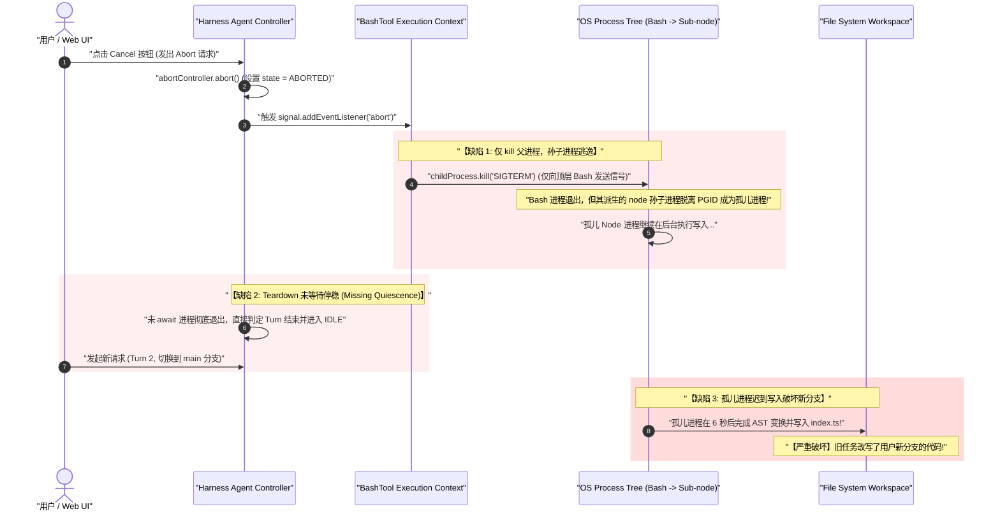
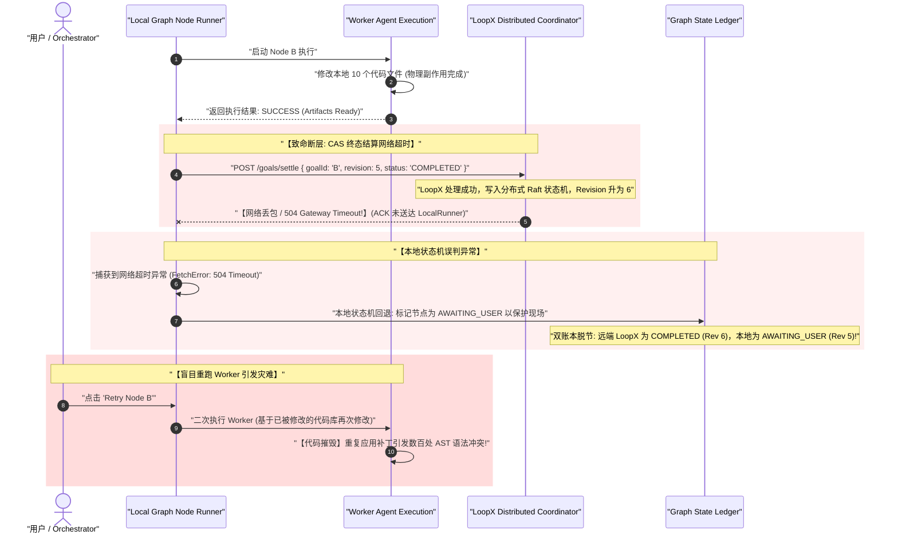
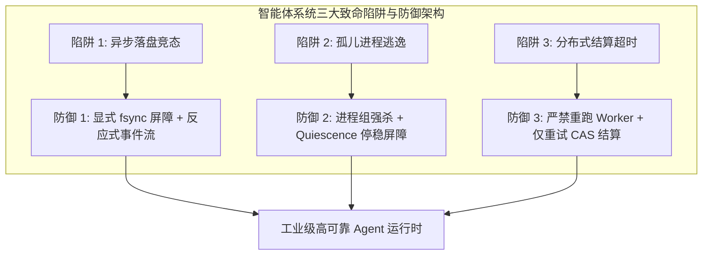

# Chapter 32: Diagnosing Three Failure Cases

English | [中文](32-diagnosing-three-failure-cases.zh.md)

Conventional debugging intuition can fail when building and evolving agent systems. In deterministic software such as relational databases, REST microservices, and compiler frontends, an explicit control-flow graph determines execution. On failure, an uncaught exception, stack trace, core dump, or failed assertion often lets an engineer trace upward through the call stack to a particular source line.

A complex agent system has a different failure profile. It combines an LLM, a plugin-based microkernel such as Cordis, an immutable event-sourced ledger, operating-system side effects such as file I/O and shell processes, and an external coordinator such as LoopX. Its symptoms may be **separated in time and location** from their physical causes: the visible failure and the triggering operation can occur at different times, in different call stacks, or across process boundaries.

This chapter examines three representative failure cases through system calls, event causality, and distributed state machines. For each, it separates symptoms from causes, derives the failure mechanism, and presents typed TypeScript defenses. It closes with a diagnostic checklist for investigating production agent runtimes without introducing dirty writes.

```
+---------------------------------------------------------------------------------------------------+
|                                 智能体系统故障诊断的五层金字塔模型                                    |
+---------------------------------------------------------------------------------------------------+
| [Layer 5: 模型认知投影层]  deriveMessages() 上下文重放、System Prompt 注入、Token 预算截断          |
| [Layer 4: 分布式结算层]    LoopX CAS 终态结算、分布式租约 Lease、双账本同步时序                     |
| [Layer 3: 运行时协调层]    Cordis Context、Turn 事务状态机、AbortSignal 级联传播、Fencing Token   |
| [Layer 2: 账本持久层]      SQLite WAL 预写日志、fsync 物理落盘屏障、Zstandard 压缩帧                |
| [Layer 1: 物理世界现实层]  OS 进程组树 (PGID)、文件系统 inode、TCP Socket 句柄、Git 工作区状态     |
+---------------------------------------------------------------------------------------------------+
```

---

## 1. A Core Mental Model: First Principles for Agent-System Failures

Start an agent-system investigation with three principles that counter the tendency to anthropomorphize an LLM.

### 1.1 Is It Model Hallucination or a Systems Defect?

When an agent makes a wrong decision or repeats an action, a new agent developer may blame insufficient model reasoning or hallucination. The next move is often to add a stern system-prompt warning—such as “Never submit the command twice”—instead of examining runtime state.

**Systems principle**: In many production failures, **the model reflects the state machine and context ledger it was given**. At its core, an LLM maps an input token sequence to a conditional probability distribution over the next token:

$$P(y_t \mid X, y_{<t}) = \text{Softmax}\left(\frac{\mathbf{z}_t}{T}\right)$$

If the event ledger loses ordering, permits dirty reads, fails to make a write durable, or tears under concurrent access, the context $X$ projected by `deriveMessages(events)` is itself incomplete or wrong. A model's apparently irrational response may be probable given that faulty context. **Do not use prompt engineering to hide state-machine races or persistence-consistency defects.**

### 1.2 State-Machine Hazard Windows

In concurrent and distributed systems, a transition is not necessarily instantaneous. Moving from state $S_A$ to $S_B$ may span a network acknowledgment, an in-memory write, a kernel page-cache write, a physical `fsync`, and signal delivery to a subprocess.

Define **hazard-window duration** $\Delta t_{\text{hazard}}$ as the interval between the externally visible effect at $t_{\text{visible}}$ and the moment state becomes durably recorded or all affected resources become quiescent at $t_{\text{durable}}$:

$$\Delta t_{\text{hazard}} = |t_{\text{durable}} - t_{\text{visible}}|$$

When $\Delta t_{\text{hazard}} > 0$, the system may appear complete or cancelled while still vulnerable. A crash, network interruption, OOM kill, or concurrent request during that window can split the state machine.

```
+---------------------------------------------------------------------------------------------------+
|                                  危险窗口 (Hazard Window) 示意图                                   |
+---------------------------------------------------------------------------------------------------+
| 时间轴 t ───►                                                                                     |
|                                                                                                   |
| [t_visible: 前端收到 RPC ACK / UI 显示已完成]                                                     |
|       │                                                                                           |
|       ├─────────────────── 危险窗口 Δt_hazard ───────────────────┤                                |
|       ▼                                                          ▼                                |
| (网络已确认，UI 已更新)                                      [t_durable: 磁盘 fsync 成功 / 进程停稳]  |
|                                                                                                   |
|                                     ▲                                                             |
|                              在此窗口发生 Crash                                                   |
|                        ===> 导致外部认知与持久事实撕裂!                                            |
+---------------------------------------------------------------------------------------------------+
```

### 1.3 The Irreversibility of External Side Effects

A relational database can `ROLLBACK` a failed transaction to its initial consistent state. An agent, however, changes the external world through tools, and many such effects **cannot be inverted**:

$$\text{Rollback}(\text{ShellCommand}(\text{"rm -rf /build"})) \equiv \bot \quad (\text{the physical data is gone})$$

$$\text{Rollback}(\text{GitCommit}(\text{"feat: login"})) \neq \text{No-Op} \quad (\text{the workspace has changed})$$

$$\text{Rollback}(\text{HTTP\_POST}(\text{"https://api.payment.com/charge"})) \neq \text{Cancel} \quad (\text{an external charge occurred})$$

An agent runtime therefore needs a strict order: **record the intended state transition before producing a physical side effect; after the effect, cross a durability barrier before exposing completion externally.**

---

## 2. Case One: The UI Reports Success, but Restart Repeats the Tool

### 2.1 Symptoms and Misleading Interpretations

```
+---------------------------------------------------------------------------------------------------+
| 生产事故现存还原:                                                                                 |
| 1. 用户向 Agent 提出指令: "请为用户登录模块创建 Git 提交并推送到远端"。                            |
| 2. Agent 思考后调用 `git_commit` 工具，传入参数 `{"message": "feat: add user login"}`。            |
| 3. Web 前端 UI 界面上，该工具执行卡片瞬间弹出并打上绿色勾号，显示 "Commit created: a7c8f1"。       |
| 4. 随后，宿主服务由于内存瞬时峰值触发了操作系统 OOM Killer，Node.js 守护进程被自动拉起重启。         |
| 5. 系统重启后，Web UI 自动重连。用户惊奇地发现，Agent 并未沿着提交成功的状态回答 "提交已完成"，反而 |
|    再次生成了一个完全相同的 `git_commit` 工具调用！                                              |
| 6. 第二次工具调用执行失败，Git 返回: "nothing to commit, working tree clean"。Agent 陷入困惑，      |
|    开始向用户道歉并尝试执行 `git status`，任务流程彻底偏离。                                      |
+---------------------------------------------------------------------------------------------------+
```

**A beginner's misleading interpretations**:
- The LLM's self-attention failed to attend to the preceding message.
- The browser lost `localStorage` or a Pinia/Zustand cache.
- A prompt warning—“Remember not to call `git_commit` again if you already committed”—will fix it. Such a warning can instead make the model incorrectly skip a commit that never happened.

---

### 2.2 Root Cause: A Race Between Optimistic RPC Feedback and Session-Log Durability

Tracing the microkernel call chain and operating-system operations reveals the execution order:



#### Cause 1: Optimistic frontend RPC response is detached from backend durability
For responsiveness, a web gateway may send a success message over WebSocket as soon as a tool function returns. But **a function returning in memory does not prove the event was ordered and flushed in the durable ledger**.

#### Cause 2: Missing `fsync` barrier and delayed kernel page-cache flush
A SQLite or JSONL engine configured for throughput may use asynchronous write-behind or `PRAGMA synchronous = NORMAL`. Node.js `fs.write()` can copy data only into the kernel **page cache**. If the process is OOM-killed or power fails before a `ToolExecutionCompletedEvent` reaches persistent media, that event is lost.

#### Cause 3: Replay follows the incomplete context
After restart, `SessionPersistence` rebuilds the event history from disk. The `deriveMessages(events)` projection sees:
1. Present: `Event(type: 'turn/started')`
2. Present: `Event(type: 'model/tool-call-requested', tool_call_id: 'call_1', name: 'git_commit')`
3. **Missing**: `Event(type: 'tool/execution-completed', tool_call_id: 'call_1')`

Under the OpenAI/DeepSeek message protocol, the projected LLM context ends with:
```json
[
  { "role": "user", "content": "请为用户登录模块创建 Git 提交..." },
  { "role": "assistant", "tool_calls": [{ "id": "call_1", "type": "function", "function": { "name": "git_commit", "arguments": "{\"message\":\"feat: add user login\"}" } }] }
]
```
Given this input, the decoder sees its own tool request without a corresponding result. It may request the same tool again. Yet the previous run already produced the Git commit in the physical workspace, so another execution fails.

---

### 2.3 Derivation: Hazard Windows and Expected State Loss

Assume abnormal crashes in $[t, t + \Delta t]$ follow a Poisson process with rate $\lambda$ per unit time.

Let $\tau_{\text{buffer}}$ be the aggregation delay of asynchronous persistence and $T_{\text{disk}}$ the physical `fdatasync` latency. The hazard window for one tool call is:

$$\Delta t_{\text{hazard}} = \tau_{\text{buffer}} + T_{\text{disk}}$$

The probability $P_{\text{hazard}}$ of a lost or torn state between non-idempotent tool completion and durable recording is:

$$P_{\text{hazard}} = 1 - e^{-\lambda \Delta t_{\text{hazard}}} \approx \lambda (\tau_{\text{buffer}} + T_{\text{disk}}) \quad (\text{when } \lambda \Delta t \ll 1)$$

For a long agent workflow with $N$ non-idempotent external tool calls, the cumulative probability of a dirty replay is $\mathbb{E}[R]$:

$$\mathbb{E}[R] = 1 - \prod_{k=1}^{N} (1 - P_{\text{hazard}}^{(k)}) \approx \sum_{k=1}^{N} \lambda (\tau_{\text{buffer}}^{(k)} + T_{\text{disk}}^{(k)})$$

**Implication**: Without an explicit barrier to close $\Delta t_{\text{hazard}}$, the probability of a dirty replay grows with the number of tool calls and approaches one as $N$ increases.

---

### 2.4 Repair: Durability Barriers and a Reactive Event Stream

The architecture needs three defenses:
1. **Explicit durability barrier**: Before a side-effecting tool such as a shell command, Git operation, file write, or network POST reports completion, its `ToolExecutionCompletedEvent` must pass an `fsync` / `fdatasync` barrier. **Block external completion until the record is durable.**
2. **One-way reactive UI**: UI state cards should be derived from persisted event broadcasts (`session/event-appended`), not optimistic assumptions based solely on an RPC return value.
3. **Idempotency key and effect registry**: Give each tool call a globally unique deterministic key. On replay, check whether the physical entity already exists and return the recorded fact rather than repeating the effect.

```
+---------------------------------------------------------------------------------------------------+
|                            正确的耐久性屏障架构 (Durability Barrier)                                 |
+---------------------------------------------------------------------------------------------------+
| Tool 执行完成 (Result)                                                                            |
|        │                                                                                          |
|        ▼                                                                                          |
| [Write Barrier] 构造 ToolExecutionCompletedEvent                                                  |
|        │                                                                                          |
|        ▼                                                                                          |
| [SQLite WAL / JSONL Append] 写入持久化存储                                                        |
|        │                                                                                          |
|        ▼                                                                                          |
| [Explicit fsync Barrier] 执行 fs.fdatasync() 穿透 OS 页缓存                                        |
|        │                                                                                          |
|        ├────────────────────────────────────────┬────────────────────────────────────────┐        |
|        ▼                                        ▼                                        ▼        |
| [更新内存 Session 投影]              [向 WebSocket 网关广播 Event]            [解除 Tool 执行屏障]  |
|                                                 │                                        │        |
|                                                 ▼                                        ▼        |
|                                      [前端 UI 卡片变为完成状态]             [继续 Agent Loop 下一步] |
+---------------------------------------------------------------------------------------------------+
```

---

### 2.5 Complete TypeScript Example: DurableSessionLedger

This Session ledger implements a physical flush barrier, monotonic ordering, and recovery from a torn tail:

```typescript
/**
 * @file durable-session-ledger.ts
 * @description 具备显式物理落盘屏障与幂等追踪的生产级 Session 账本引擎
 */

import * as fs from 'node:fs';
import * as path from 'node:path';
import { EventEmitter } from 'node:events';

export interface LedgerEvent {
  readonly id: string;
  readonly sessionId: string;
  readonly turnId: string;
  readonly stepIndex: number;
  readonly epoch: number;
  readonly type:
    | 'turn/started'
    | 'model/tool-call-requested'
    | 'tool/execution-completed'
    | 'tool/execution-failed'
    | 'turn/completed';
  readonly payload: Record<string, unknown>;
  readonly timestamp: number;
}

export interface AppendOptions {
  /**
   * 是否强制执行物理磁盘同步屏障 (fsync)
   * 对于包含非幂等外部副作用的工具事件，必须设置为 true
   */
  readonly syncBarrier?: boolean;
}

export class DurableSessionLedger extends EventEmitter {
  private readonly fd: number;
  private readonly filePath: string;
  private currentEpoch: number = 1;
  private lastSequencedIndex: number = 0;
  private isClosed: boolean = false;

  constructor(storageDir: string, public readonly sessionId: string) {
    super();
    if (!fs.existsSync(storageDir)) {
      fs.mkdirSync(storageDir, { recursive: true });
    }
    this.filePath = path.join(storageDir, `${sessionId}.events.jsonl`);
    // 以读写追加模式打开文件描述符
    this.fd = fs.openSync(this.filePath, 'a+');
    this.recoverAndVerifyIndex();
  }

  /**
   * 启动时对账与受损尾部帧修复
   */
  private recoverAndVerifyIndex(): void {
    const content = fs.readFileSync(this.filePath, 'utf-8');
    const lines = content.split('\n').filter((line) => line.trim().length > 0);
    const validLines: string[] = [];

    for (const line of lines) {
      try {
        const event = JSON.parse(line) as LedgerEvent;
        this.lastSequencedIndex++;
        if (event.epoch >= this.currentEpoch) {
          this.currentEpoch = event.epoch;
        }
        validLines.push(line);
      } catch (err) {
        // 发现损坏的尾部行（由于上次宕机时 write 截断引发），执行安全截断修复
        console.warn(`[DurableLedger] 发现受损尾部帧，执行截断自愈: ${this.filePath}`);
        this.repairTruncatedTail(validLines);
        return;
      }
    }
  }

  /**
   * 修复由于崩溃引发的不完整尾部 JSON 帧
   */
  private repairTruncatedTail(validLines: string[]): void {
    const validContent = validLines.join('\n') + (validLines.length > 0 ? '\n' : '');
    fs.closeSync(this.fd);
    fs.writeFileSync(this.filePath, validContent, { flush: true });
    (this as any).fd = fs.openSync(this.filePath, 'a+');
  }

  /**
   * 追加不可变领域事件
   * 包含严格的异常处理、写入定序与按需 fsync 物理屏障
   */
  public async append(
    eventData: Omit<LedgerEvent, 'id' | 'epoch' | 'timestamp'>,
    options: AppendOptions = {}
  ): Promise<LedgerEvent> {
    if (this.isClosed) {
      throw new Error(`[DurableLedger] 账本已关闭，拒绝写入: ${this.sessionId}`);
    }

    const event: LedgerEvent = Object.freeze({
      ...eventData,
      id: `evt_${Date.now()}_${++this.lastSequencedIndex}`,
      epoch: this.currentEpoch,
      timestamp: Date.now(),
    });

    const serialized = JSON.stringify(event) + '\n';
    const buffer = Buffer.from(serialized, 'utf-8');

    return new Promise((resolve, reject) => {
      // 1. 写入操作系统页缓存
      fs.write(this.fd, buffer, 0, buffer.length, null, (writeErr, written) => {
        if (writeErr) {
          return reject(new Error(`[DurableLedger] 写入事件失败: ${writeErr.message}`));
        }

        if (written !== buffer.length) {
          return reject(new Error('[DurableLedger] 写入字节不匹配，发生内核缓冲异常'));
        }

        // 2. 检查是否需要物理落盘屏障 (fdatasync)
        if (options.syncBarrier) {
          fs.fdatasync(this.fd, (syncErr) => {
            if (syncErr) {
              return reject(new Error(`[DurableLedger] fsync 屏障执行失败: ${syncErr.message}`));
            }
            // 物理落盘成功后，方可向外部广播事件与释放执行流
            this.emit('event-appended', event);
            resolve(event);
          });
        } else {
          // 普通中间事件，允许异步刷盘
          this.emit('event-appended', event);
          resolve(event);
        }
      });
    });
  }

  /**
   * 递增租约 Epoch
   */
  public bumpEpoch(): number {
    return ++this.currentEpoch;
  }

  /**
   * 读取全量不可变事件流（用于 deriveMessages 投影）
   */
  public async readAll(): Promise<readonly LedgerEvent[]> {
    if (this.isClosed) {
      throw new Error('[DurableLedger] 账本已关闭');
    }
    const content = await fs.promises.readFile(this.filePath, 'utf-8');
    const lines = content.split('\n').filter((l) => l.trim().length > 0);
    return Object.freeze(lines.map((l) => JSON.parse(l) as LedgerEvent));
  }

  /**
   * 安全关闭账本，确保数据全部刷盘
   */
  public async close(): Promise<void> {
    if (this.isClosed) return;
    this.isClosed = true;
    return new Promise((resolve, reject) => {
      fs.fdatasync(this.fd, (syncErr) => {
        if (syncErr) {
          fs.closeSync(this.fd);
          return reject(syncErr);
        }
        fs.close(this.fd, (closeErr) => {
          if (closeErr) return reject(closeErr);
          resolve();
        });
      });
    });
  }
}
```

---

### 2.6 Verification and Tests

```typescript
/**
 * @file durable-session-ledger.spec.ts
 * @description 验证崩溃窗口下的持久化屏障与事件投影确定性
 */

import { describe, it, expect, beforeEach, afterEach } from 'vitest';
import * as fs from 'node:fs';
import * as path from 'node:path';
import { DurableSessionLedger } from './durable-session-ledger';

const TEST_STORAGE = path.join(process.cwd(), '.tmp', 'test-ledger-case1');

describe('案例一修复验证: DurableSessionLedger 崩溃一致性', () => {
  beforeEach(() => {
    fs.rmSync(TEST_STORAGE, { recursive: true, force: true });
  });

  afterEach(() => {
    fs.rmSync(TEST_STORAGE, { recursive: true, force: true });
  });

  it('必须在 syncBarrier: true 下保证物理落盘，重启后完整恢复上下文', async () => {
    const sessionId = 'sess_test_recovery';
    const ledger = new DurableSessionLedger(TEST_STORAGE, sessionId);

    // 1. 记录 Turn 开始
    await ledger.append({
      sessionId,
      turnId: 'turn_1',
      stepIndex: 0,
      type: 'turn/started',
      payload: { userQuery: 'git commit' },
    });

    // 2. 记录工具发起
    await ledger.append({
      sessionId,
      turnId: 'turn_1',
      stepIndex: 0,
      type: 'model/tool-call-requested',
      payload: { toolName: 'git_commit', callId: 'call_abc' },
    });

    // 3. 执行工具并施加物理落盘屏障
    await ledger.append(
      {
        sessionId,
        turnId: 'turn_1',
        stepIndex: 0,
        type: 'tool/execution-completed',
        payload: { callId: 'call_abc', result: 'commit a7c8f1 created' },
      },
      { syncBarrier: true }
    );

    // 模拟进程发生猝死 (不调用 ledger.close()，直接拉起新实例进行冷启动恢复)
    const recoveredLedger = new DurableSessionLedger(TEST_STORAGE, sessionId);
    const events = await recoveredLedger.readAll();

    expect(events.length).toBe(3);
    expect(events[2].type).toBe('tool/execution-completed');
    expect((events[2].payload as any).result).toBe('commit a7c8f1 created');

    await recoveredLedger.close();
  });
});
```

---

## 3. Case Two: A Cancelled Subprocess Keeps Changing Code

### 3.1 Symptoms and Misleading Interpretations

```
+---------------------------------------------------------------------------------------------------+
| 生产事故现场还原:                                                                                 |
| 1. 用户向 Agent 提出需求: "请重构 packages/core 模块中所有导出的类型定义"。                        |
| 2. Agent 计划执行大规模重构，调用了 `bash` 工具执行命令 `node scripts/heavy-refactor.js`。        |
| 3. 用户突然意识到当前处于 `production-hotfix` 分支而非开发分支，在 1.5 秒后紧急点击了 Web UI 上的   |
|    红色 "Stop / Cancel" 按钮。                                                                    |
| 4. 前端界面瞬间响应，状态切回 IDLE，并弹出通知 "Turn cancelled by user"。                         |
| 5. 用户切换回 `main` 开发分支。然而 6 秒后，Git 工作区突然报警！VSCode 自动刷新，提示              |
|    `packages/core/src/index.ts` 被刚刚的重构脚本篡改了！                                          |
| 6. 打开终端运行 `ps -ef | grep node`，赫然发现一个孤儿 `heavy-refactor.js` 进程依然在 100% 满载运行！ |
+---------------------------------------------------------------------------------------------------+
```

**A beginner's misleading interpretations**:
- The frontend click event did not reach the backend over WebSocket.
- Node.js `childProcess.kill()` is broken, or the operating system is at fault.
- Adding options to `spawn`, specifically `{ detached: true }`, will automatically manage the child lifecycle. In isolation, that can make orphan escape worse.

---

### 3.2 Root Cause: Broken Cancellation Propagation, Orphaned Processes, and No Quiescence Barrier

Inspection of the process tree and event loop reveals four linked systems defects:



#### Cause 1: `AbortSignal` does not reach the entire process tree
In Node.js, after `child_process.spawn('bash', ['-c', command])`, a direct `child.kill('SIGTERM')` normally signals only the top-level `bash` process. When `bash` exits, its descendants—for example `node`, `cargo`, `tsc`, or `python`—can be adopted by `init` / `systemd` (PID 1) or a Windows system process and continue changing files as uncontrolled **orphans**.

#### Cause 2: Teardown releases state before resources are quiescent
After catching `AbortError`, the controller releases the turn lock, sets the state machine to `IDLE`, and accepts another user turn. **Control flow was cancelled, but external processes have not necessarily stopped.**

#### Cause 3: Tool callbacks do not check generation tokens
The tool wrapper registers an asynchronous callback when creating the subprocess:
```typescript
// 错误示范：缺乏世代校验的回调
child.on('close', async () => {
  await fs.promises.writeFile('output.json', resultBuffer); // 迟到的破坏性写入！
});
```
Without comparing the callback's generation with the active generation after cancellation, the stale callback can write dirty data seconds later.

---

### 3.3 Derivation: Process Quiescence and Shutdown Latency

Define a process tree $\mathcal{T} = \{P_{\text{root}}, P_1, P_2, \dots, P_m\}$.

When a graceful signal (`SIGTERM`) reaches its process-group leader, let $t_{\text{graceful}}^{(i)}$ be the time process $P_i$ needs to respond and release resources. Let $T_{\text{grace}}$ be the allowed grace period.

If processes remain alive at $t = T_{\text{grace}}$, so $\mathcal{T}_{\text{alive}} \neq \emptyset$, escalate to `SIGKILL` / `TerminateProcess`. Let $t_{\text{kill}}^{(i)}$ be the kernel's latency when processing `SIGKILL` for $P_i$.

Time to full process-tree quiescence, $T_{\text{quiescent}}$, is bounded by:

$$T_{\text{quiescent}} \le \begin{cases} \max_{i} t_{\text{graceful}}^{(i)}, & \text{if } \max_{i} t_{\text{graceful}}^{(i)} \le T_{\text{grace}} \\ T_{\text{grace}} + \max_{i} t_{\text{kill}}^{(i)} + \epsilon_{\text{fs}}, & \text{otherwise} \end{cases}$$

Here $\epsilon_{\text{fs}}$ covers descriptor closure and clearing pending kernel writes.

**State-machine rule**: Before entering `CANCELLED` or permitting generation $G_{k+1}$ to start, **wait explicitly for $T_{\text{quiescent}}$ to elapse**. Otherwise, writes from different generations can conflict.

---

### 3.4 Repair: Terminate the Process Tree and Guard Generations

A safe cancellation path needs three defenses:
1. **Bind a cross-platform process group and terminate the tree**:
   - On POSIX (Linux/macOS), launch with `detached: true` to create an independent process group and signal the group with `process.kill(-pid, 'SIGKILL')` when necessary.
   - On Windows, use `taskkill /F /T /PID <pid>` to reach the child tree, or bind the process to a Win32 Job Object.
2. **Two-phase graceful termination with a quiescence barrier**:
   - Phase one: Send `SIGTERM` and start a grace-period timer, such as 1500 ms.
   - Phase two: If the process remains alive, escalate to `SIGKILL` and explicitly `await` the subprocess `exit`/`close` events.
3. **Generation-token guard**:
   - Assign every turn a monotonically increasing `generationId`. Before persisting or modifying a file, check `guard.assertActive(generationId)`.

```
+---------------------------------------------------------------------------------------------------+
|                           进程组原子终止与停稳屏障时序 (Quiescence Barrier)                          |
+---------------------------------------------------------------------------------------------------+
| 收到 AbortSignal                                                                                  |
|        │                                                                                          |
|        ▼                                                                                          |
| [向进程组 PGID 发送 SIGTERM] ─── 启动 1500ms 优雅计时器 ───┐                                       |
|        │                                                   │                                      |
|        ├───────────────────────┬───────────────────────────┤                                      |
|        ▼                       ▼                           ▼                                      |
| (1500ms 内正常退出?)      (超时未退出)             (操作系统回调 exit)                             |
|        │                       │                           │                                      |
|        │                       ▼                           │                                      |
|        │             [升级为 SIGKILL 强杀进程组]           │                                      |
|        │                       │                           │                                      |
|        └───────────────────────┴───────────────────────────┘                                      |
|                                │                                                                  |
|                                ▼                                                                  |
|               [Quiescence 屏障达成: 进程彻底死亡]                                                 |
|                                │                                                                  |
|                                ▼                                                                  |
|               [释放文件句柄，递增 Generation Epoch]                                               |
|                                │                                                                  |
|                                ▼                                                                  |
|                 [状态机安全切回 IDLE，允许后续交互]                                               |
+---------------------------------------------------------------------------------------------------+
```

---

### 3.5 Complete TypeScript Example: QuiescentProcessManager

This process manager terminates process trees on POSIX and Windows and guards against stale generations:

```typescript
/**
 * @file quiescent-process-manager.ts
 * @description 具备进程树原子杀灭、Quiescence 停稳屏障与世代守卫的生产级进程管理器
 */

import * as child_process from 'node:child_process';

export interface ExecutionResult {
  readonly exitCode: number | null;
  readonly stdout: string;
  readonly stderr: string;
  readonly durationMs: number;
}

export interface ExecutionOptions {
  readonly cwd: string;
  readonly env?: Record<string, string>;
  readonly timeoutMs?: number;
  readonly gracefulTimeoutMs?: number;
  readonly signal?: AbortSignal;
  readonly generationId: number;
}

export class GenerationRevokedError extends Error {
  constructor(public readonly generationId: number) {
    super(`[QuiescentProcessManager] 操作已被作废: 世代 ${generationId} 已过期`);
    this.name = 'GenerationRevokedError';
  }
}

export class QuiescentProcessManager {
  private activeGeneration: number = 1;

  /**
   * 递增世代令牌，使所有前序世代的操作立即失效
   */
  public revokeAllAndAdvanceGeneration(): number {
    return ++this.activeGeneration;
  }

  public getActiveGeneration(): number {
    return this.activeGeneration;
  }

  /**
   * 执行外部命令，具备跨平台进程树隔离与停稳保证
   */
  public async executeCommand(
    command: string,
    args: string[],
    options: ExecutionOptions
  ): Promise<ExecutionResult> {
    const {
      cwd,
      env = {},
      timeoutMs = 60000,
      gracefulTimeoutMs = 1500,
      signal,
      generationId,
    } = options;

    if (generationId !== this.activeGeneration) {
      throw new GenerationRevokedError(generationId);
    }

    if (signal?.aborted) {
      throw new DOMException('Command aborted before execution', 'AbortError');
    }

    const isWindows = process.platform === 'win32';
    const startTime = Date.now();

    // 在 POSIX 系统上使用 detached: true 创建独立的进程组 (Process Group)
    const child = child_process.spawn(command, args, {
      cwd,
      env: { ...process.env, ...env },
      detached: !isWindows,
      stdio: ['pipe', 'pipe', 'pipe'],
    });

    const pid = child.pid;
    if (!pid) {
      throw new Error('[QuiescentProcessManager] 无法获取子进程 PID');
    }

    let stdoutAcc = '';
    let stderrAcc = '';
    let isQuiescent = false;

    child.stdout?.on('data', (chunk: Buffer) => {
      stdoutAcc += chunk.toString('utf-8');
    });

    child.stderr?.on('data', (chunk: Buffer) => {
      stderrAcc += chunk.toString('utf-8');
    });

    // 封装进程树强行杀灭与停稳逻辑
    const terminateProcessTree = async (reason: string): Promise<void> => {
      if (isQuiescent) return;

      console.warn(`[QuiescentProcessManager] 正在终止进程树 (PID: ${pid}, 原因: ${reason})`);

      if (isWindows) {
        // Windows 平台：使用 taskkill 穿透杀死进程树
        try {
          child_process.execSync(`taskkill /F /T /PID ${pid}`, { stdio: 'ignore' });
        } catch {
          // 进程可能已经自行退出
        }
      } else {
        // POSIX 平台：向负 PID (进程组) 发送 SIGTERM，随后升级为 SIGKILL
        try {
          process.kill(-pid, 'SIGTERM');
        } catch {
          // 进程组可能已不存在
        }

        const gracefulPromise = new Promise<void>((res) => {
          const checkTimer = setInterval(() => {
            try {
              process.kill(-pid, 0);
            } catch {
              clearInterval(checkTimer);
              res();
            }
          }, 50);
        });

        const timeoutPromise = new Promise<void>((res) =>
          setTimeout(res, gracefulTimeoutMs)
        );

        await Promise.race([gracefulPromise, timeoutPromise]);

        try {
          process.kill(-pid, 'SIGKILL');
        } catch {
          // 忽略已退出错误
        }
      }
    };

    return new Promise<ExecutionResult>((resolve, reject) => {
      let globalTimer: NodeJS.Timeout | null = null;

      const cleanupAndSettle = (err?: Error, result?: ExecutionResult) => {
        if (globalTimer) clearTimeout(globalTimer);
        isQuiescent = true;

        if (generationId !== this.activeGeneration) {
          return reject(new GenerationRevokedError(generationId));
        }

        if (err) {
          return reject(err);
        }
        if (result) {
          return resolve(result);
        }
      };

      if (timeoutMs > 0) {
        globalTimer = setTimeout(async () => {
          await terminateProcessTree(`超时 (${timeoutMs}ms)`);
          cleanupAndSettle(new Error(`Command timed out after ${timeoutMs}ms`));
        }, timeoutMs);
      }

      const abortHandler = async () => {
        signal?.removeEventListener('abort', abortHandler);
        await terminateProcessTree('接收到 AbortSignal 取消信号');
        cleanupAndSettle(new DOMException('Command aborted by user', 'AbortError'));
      };

      if (signal) {
        signal.addEventListener('abort', abortHandler);
      }

      child.on('close', (code) => {
        if (signal) signal.removeEventListener('abort', abortHandler);
        isQuiescent = true;

        cleanupAndSettle(undefined, {
          exitCode: code,
          stdout: stdoutAcc,
          stderr: stderrAcc,
          durationMs: Date.now() - startTime,
        });
      });

      child.on('error', async (spawnErr) => {
        if (signal) signal.removeEventListener('abort', abortHandler);
        await terminateProcessTree(`Spawn Error: ${spawnErr.message}`);
        cleanupAndSettle(spawnErr);
      });
    });
  }
}
```

---

### 3.6 Verification and Tests

```typescript
/**
 * @file quiescent-process-manager.spec.ts
 * @description 验证进程树杀灭与取消停稳屏障的有效性
 */

import { describe, it, expect } from 'vitest';
import { QuiescentProcessManager } from './quiescent-process-manager';

describe('案例二修复验证: QuiescentProcessManager 孤儿进程防御', () => {
  it('当发出 Abort 信号时，必须在宽限期内彻底停稳并拒绝后续世代覆写', async () => {
    const manager = new QuiescentProcessManager();
    const abortController = new AbortController();
    const genId = manager.getActiveGeneration();

    const isWin = process.platform === 'win32';
    const cmd = isWin ? 'powershell' : 'bash';
    const args = isWin
      ? ['-Command', 'Start-Sleep -Seconds 10']
      : ['-c', 'sleep 10'];

    const promise = manager.executeCommand(cmd, args, {
      cwd: process.cwd(),
      signal: abortController.signal,
      generationId: genId,
      gracefulTimeoutMs: 200,
    });

    setTimeout(() => {
      abortController.abort();
    }, 100);

    await expect(promise).rejects.toThrow('Command aborted by user');

    manager.revokeAllAndAdvanceGeneration();
    expect(manager.getActiveGeneration()).toBe(genId + 1);
  });
});
```

---

## 4. Case Three: A Graph Node Produces Files but Remains `awaiting_user`

### 4.1 Symptoms and Misleading Interpretations

```
+---------------------------------------------------------------------------------------------------+
| 生产事故现场还原:                                                                                 |
| 1. 在 Graph Mode 多 Agent 编排模式下，DAG 任务图包含 3 个节点:                                    |
|    [Node A: 架构设计] -> [Node B: 代码重构] -> [Node C: 单元测试校验]                              |
| 2. Node B (Worker Agent) 启动并运行，耗时 45 秒成功完成了对 10 个源码文件的重构修改并产出补丁。   |
| 3. 本地控制台显示 Node B 退出码为 0，任务已完成。                                                 |
| 4. 然而，Graph 调度 UI 界面上，Node B 的状态指示灯突然从 "RUNNING" 跳变为了 "AWAITING_USER"，     |
|    且整个 DAG 调度流程彻底假死停滞，依赖它的 Node C 永远无法被激活！                              |
| 5. 开发者感到非常困惑，点击了 UI 上的 "重试 Node B" 按钮。                                        |
| 6. 结果引发严重灾难: Worker 重新从旧起点执行，对已经修改过的文件再次应用 AST 变换，导致代码语法  |
|    全部错乱爆出数百个 Lint 错误，Git 历史被严重污染。                                             |
+---------------------------------------------------------------------------------------------------+
```

**A beginner's misleading interpretations**:
- Node B's agent code threw an uncaught runtime error.
- DAG topological sorting deadlocked on a cycle.
- Click “Retry Worker,” even though rerunning it could invalidate already changed workspace files.

---

### 4.2 Root Cause: Worker Success and LoopX CAS Settlement Diverge

Comparing local Harness logs with remote LoopX coordination logs exposes a **two-ledger settlement race**:



#### Cause 1: Distributed acknowledgment ambiguity during final settlement
The worker's refactor is a **local physical side effect**, while Graph state advances through an atomic settlement at the **remote LoopX coordinator**. A client-side network timeout does **not** prove the server failed: the server may have committed and advanced its revision while the return acknowledgment was lost.

#### Cause 2: Conservative local fallback splits two ledgers
After a 504 response, `LocalGraphRunner` cannot confirm remote state and conservatively marks the local node `AWAITING_USER`. The local persistence ledger and LoopX coordination ledger then disagree:
- **Remote LoopX state**: `status: 'COMPLETED'`, `revision: 6`
- **Local Harness state**: `status: 'AWAITING_USER'`, `revision: 5`

#### Cause 3: Rerunning the worker violates non-idempotent preconditions
The worker expected to refactor baseline code. Once files have changed, another run no longer starts from that baseline; it may append duplicate code or fail to match a replacement pattern.

---

### 4.3 Derivation: CAS Transitions and Idempotent Settlement

Represent a Goal in the distributed coordinator by this state triple:

$$\mathcal{S} = \langle \text{Status}, \text{Revision}, \text{ArtifactFingerprint} \rangle$$

Here $\text{ArtifactFingerprint} = \text{SHA256}(\text{ModifiedFiles})$.

Define a terminal CAS settlement as an atomic transition:

$$\text{CAS}(\text{goalId}, R_{\text{expected}} \to R_{\text{next}}, S_{\text{target}}, F)$$

The transition to $S_{\text{target}}$ is allowed only when the remote revision $R_{\text{remote}} = R_{\text{expected}}$; it then advances to $R_{\text{next}} = R_{\text{expected}} + 1$.

When a client times out or is asked to retry, define the **idempotent settlement reconciliation** function:

$$\text{Reconcile}(\text{goalId}, F_{\text{local}}) = \begin{cases} \text{NOOP\_ALREADY\_SETTLED}, & \text{if } S_{\text{remote}} = \text{'COMPLETED'} \land F_{\text{remote}} = F_{\text{local}} \\ \text{RETRY\_CAS}, & \text{if } S_{\text{remote}} = \text{'RUNNING'} \land R_{\text{remote}} = R_{\text{expected}} \\ \text{MANUAL\_CONFLICT}, & \text{if } R_{\text{remote}} > R_{\text{expected}} \land F_{\text{remote}} \neq F_{\text{local}} \end{cases}$$

**Worker-isolation rule**: Once local fingerprint $F_{\text{local}}$ exists and passes integrity checks, **do not rerun the worker body until the state machine establishes that this artifact is invalid**.

---

### 4.4 Repair: Two-Phase Reconciliation and Settlement-Only Retries

For distributed settlement conflicts:
1. **Never rerun worker business logic merely to resolve settlement. Retry only settlement.**
2. **Read-only probe**: On settlement error, query LoopX with `GET /goals/:id` for the latest remote revision and state.
3. **Artifact-fingerprint alignment**: Compare the local artifact SHA-256 with the remote record. If the remote state is `COMPLETED` and fingerprints match, align the local state and advance the DAG without human intervention.
4. **Exponential backoff with full jitter**: For a transient network error, retry the idempotent CAS operation until state converges.

```
+---------------------------------------------------------------------------------------------------+
|                        分布式任务节点幂等结算对账流程 (Graph Settlement)                             |
+---------------------------------------------------------------------------------------------------+
| Worker 执行完成，生成本地 Artifacts                                                                |
|        │                                                                                          |
|        ▼                                                                                          |
| [计算产物 SHA-256 指纹: localFingerprint]                                                         |
|        │                                                                                          |
|        ▼                                                                                          |
| [尝试执行 CAS 终态结算: LoopX.settleGoal(...)] ──(网络异常/超时)──┐                                |
|        │                                                        │                                 |
|        ├────────────────────────────────────────────────────────┘                                 |
|        ▼                                                                                          |
| [启动只读探针: GET /goals/:id 获取 remoteState & remoteRev]                                       |
|        │                                                                                          |
|        ├─────────────────────────────────────────────────────────────────────────┐                |
|        ▼                                                                         ▼                |
| (远端已是 COMPLETED 且 Fingerprint 一致?)                           (远端仍为 RUNNING, Rev 未变?)  |
|        │                                                                         │                |
|        ▼                                                                         ▼                |
| [直接修正本地状态为 COMPLETED，唤醒下游 Node C]                         [带退避仅重试 CAS 结算]   |
+---------------------------------------------------------------------------------------------------+
```

---

### 4.5 Complete TypeScript Example: GraphSettlementReconciler

This distributed graph-settlement reconciler illustrates the approach:

```typescript
/**
 * @file graph-settlement-reconciler.ts
 * @description 具备产物指纹校验、CAS 幂等重试与防重复执行的分布式节点结算引擎
 */

import * as crypto from 'node:crypto';
import * as fs from 'node:fs';

export type NodeStatus = 'IDLE' | 'RUNNING' | 'COMPLETED' | 'FAILED' | 'AWAITING_USER';

export interface RemoteGoalRecord {
  readonly goalId: string;
  readonly revision: number;
  readonly status: NodeStatus;
  readonly artifactFingerprint: string | null;
  readonly updatedAt: number;
}

export interface ILoopXCoordinationClient {
  getGoal(goalId: string): Promise<RemoteGoalRecord>;
  casSettleGoal(params: {
    goalId: string;
    expectedRevision: number;
    targetStatus: NodeStatus;
    artifactFingerprint: string;
  }): Promise<{ success: boolean; currentRecord: RemoteGoalRecord }>;
}

export interface SettlementOptions {
  readonly maxRetries?: number;
  readonly baseDelayMs?: number;
  readonly maxDelayMs?: number;
}

export class DistributedSettlementConflictError extends Error {
  constructor(
    public readonly goalId: string,
    public readonly localFingerprint: string,
    public readonly remoteRecord: RemoteGoalRecord
  ) {
    super(
      `[SettlementReconciler] 分布式终态结算冲突: Goal ${goalId} 远端版本 (${remoteRecord.revision}) ` +
      `与本地状态分叉，指纹不匹配。需人工介入。`
    );
    this.name = 'DistributedSettlementConflictError';
  }
}

export class GraphSettlementReconciler {
  constructor(private readonly loopxClient: ILoopXCoordinationClient) {}

  /**
   * 计算指定工作区生成产物的 SHA-256 复合指纹
   */
  public computeArtifactFingerprint(filePaths: string[]): string {
    const hash = crypto.createHash('sha256');
    for (const filePath of filePaths.sort()) {
      if (fs.existsSync(filePath)) {
        const content = fs.readFileSync(filePath);
        hash.update(filePath);
        hash.update(content);
      }
    }
    return hash.digest('hex');
  }

  /**
   * 核心方法：安全结算任务节点终态
   * 严禁重跑 Worker，仅在结算控制平面进行幂等对账与收敛
   */
  public async settleNodeExecution(
    goalId: string,
    expectedRevision: number,
    artifactFiles: string[],
    options: SettlementOptions = {}
  ): Promise<RemoteGoalRecord> {
    const { maxRetries = 5, baseDelayMs = 200, maxDelayMs = 3000 } = options;
    const localFingerprint = this.computeArtifactFingerprint(artifactFiles);

    let attempt = 0;
    while (attempt < maxRetries) {
      attempt++;
      try {
        // 1. 尝试直接执行 CAS 终态结算
        const casResult = await this.loopxClient.casSettleGoal({
          goalId,
          expectedRevision,
          targetStatus: 'COMPLETED',
          artifactFingerprint: localFingerprint,
        });

        if (casResult.success) {
          console.log(`[SettlementReconciler] Goal ${goalId} 结算成功 (Rev: ${casResult.currentRecord.revision})`);
          return casResult.currentRecord;
        }

        // 2. CAS 失败（说明远端版本发生漂移），启动只读探针进行智能对账
        console.warn(`[SettlementReconciler] CAS 返回版本冲突，启动只读对账探针 (Goal: ${goalId})`);
        const probeRecord = casResult.currentRecord;

        // 情况 A: 远端实际上已经被前次超时请求成功结算，且指纹完全一致
        if (
          probeRecord.status === 'COMPLETED' &&
          probeRecord.artifactFingerprint === localFingerprint
        ) {
          console.log(`[SettlementReconciler] 对账成功: 远端已在先前请求中完成结算，直接收敛`);
          return probeRecord;
        }

        // 情况 B: 远端版本被第三方推进但指纹不一致，发生真正的数据冲突
        if (probeRecord.revision > expectedRevision) {
          throw new DistributedSettlementConflictError(goalId, localFingerprint, probeRecord);
        }

        // 更新期望版本并准备重试
        expectedRevision = probeRecord.revision;
      } catch (err: unknown) {
        if (err instanceof DistributedSettlementConflictError) {
          throw err;
        }

        if (attempt >= maxRetries) {
          throw new Error(
            `[SettlementReconciler] 超过最大重试次数 (${maxRetries})，结算失败: ${String(err)}`
          );
        }

        const delay = Math.min(
          maxDelayMs,
          baseDelayMs * Math.pow(2, attempt) + Math.random() * 100
        );
        console.warn(`[SettlementReconciler] 结算请求异常，将在 ${delay.toFixed(0)}ms 后重试: ${String(err)}`);
        await new Promise((res) => setTimeout(res, delay));
      }
    }

    throw new Error(`[SettlementReconciler] 致命异常: 退出重试循环`);
  }
}
```

---

### 4.6 Verification and Tests

```typescript
/**
 * @file graph-settlement-reconciler.spec.ts
 * @description 验证分布式网络超时下的幂等结算收敛
 */

import { describe, it, expect } from 'vitest';
import {
  GraphSettlementReconciler,
  ILoopXCoordinationClient,
  RemoteGoalRecord,
} from './graph-settlement-reconciler';

describe('案例三修复验证: GraphSettlementReconciler 幂等结算', () => {
  it('当网络超时但远端实际已完成结算时，必须通过只读探针对账成功收敛，严禁报错', async () => {
    let callCount = 0;
    const mockLoopX: ILoopXCoordinationClient = {
      async getGoal(_goalId: string): Promise<RemoteGoalRecord> {
        return {
          goalId: 'node_b',
          revision: 6,
          status: 'COMPLETED',
          artifactFingerprint: 'mocked_hash',
          updatedAt: Date.now(),
        };
      },
      async casSettleGoal(_params) {
        callCount++;
        if (callCount === 1) {
          throw new Error('504 Gateway Timeout');
        }
        return {
          success: false,
          currentRecord: {
            goalId: 'node_b',
            revision: 6,
            status: 'COMPLETED',
            artifactFingerprint: 'mocked_hash',
            updatedAt: Date.now(),
          },
        };
      },
    };

    const reconciler = new GraphSettlementReconciler(mockLoopX);
    reconciler.computeArtifactFingerprint = () => 'mocked_hash';

    const finalRecord = await reconciler.settleNodeExecution('node_b', 5, ['file.ts'], {
      baseDelayMs: 10,
    });

    expect(finalRecord.status).toBe('COMPLETED');
    expect(finalRecord.revision).toBe(6);
  });
});
```

---

## 5. General Production Troubleshooting Matrix

The following **five diagnostic dimensions** help a team localize complex production failures:

$$\text{Diagnosis Vector} = \langle \text{Symptom}, \text{LastTrustedEvent}, \text{ActiveResources}, \text{CurrentEpoch}, \text{ReadOnlyVerification} \rangle$$

Before a destructive repair or retry, perform the read-only checks in this table:

| Failure category | Key symptom | Last trusted persisted event | Active resource checks | Current fencing token / epoch | Next read-only verification or safe recovery action |
| :--- | :--- | :--- | :--- | :--- | :--- |
| **1. Dirty replay / repeated side effect** | After restart, the model calls a Shell / Git tool that already succeeded | Ledger ends at `model/tool-call-requested`, without `completed` | Inspect the external workspace, e.g. `git log -n 1` for an existing commit | Compare the in-memory epoch with recordedEpoch in the WAL header | **Do not rerun blindly.** Verify the physical entity read-only; if present, append a synthetic `SyntheticCompletedEvent` and advance. |
| **2. Orphaned process** | CPU remains at 100% and files change after the UI cancels | Ledger records `turn/aborted` | Use `pgrep -P <pid>` or `ps -ef \| grep` to inspect descendants | Check whether the callback's `generationId` is older than the active one | Kill the process group with `kill -9 -<pgid>`; wait for quiescence and discard stale callbacks. |
| **3. Apparent distributed settlement hang** | Files exist after worker completion, but the DAG remains `AWAITING_USER` | Local `NodeFinished` exists; remote call timed out | Check local artifact size and SHA-256 | Query the current LoopX Goal `revision` | **Do not rerun the worker.** Probe `settleNodeExecution`, compare fingerprints, and set local state to `COMPLETED` on a match. |
| **4. Context overflow / OOM** | Generation fails at turn ten with `400 Invalid Context Length` | Ledger contains large `tool/execution-completed` records (>100 KB) | Estimate tokens in the current `deriveMessages()` result | Check the step's `stepIndex` and token budget | Use `CompactionPruner` to truncate intermediate tool output to head and tail 2 KB summaries; project context again. |
| **5. Prompt injection** | Agent ignores the development task and tries to read sensitive credentials | `tool/read_web_page` or `fs_read` returned a malicious payload | Inspect sandbox-denial audit logs (Landlock Access Denied count) | Check the context's `sandboxModeCap` | Confirm the sandbox is active; isolate untrusted external data with envelope XML tags and semantic escaping. |
| **6. Recursive tool loop** | Agent calls `file_search` 20 times with unchanged arguments | Identical `tool-call-requested` events are appended repeatedly | Inspect the current step counter `stepIndex === maxSteps` | Check `TurnCoordinator`'s monotonic step counter | Trip the max-step breaker and inject `Observation: No new files found` to interrupt the loop. |
| **7. Landlock sandbox denial** | Tool returns `EACCES: permission denied` although the path exists | Ledger records `tool/execution-failed: EACCES` | Inspect the Landlock root allowlist used when launching the process | Check `sandboxCap` attenuation when spawning a subagent | Check for symlink escape; canonicalize with `fs.realpathSync` before allowing a path. |
| **8. WebSocket stream gap** | UI stops streaming text; console shows `Message ordering mismatch` | Server persisted `seq: 142`; client last received `seq: 139` | Check the gateway's TCP send-buffer backlog | Check client `lastReceivedSeq` | Reconnect and request a snapshot or event catch-up from `lastReceivedSeq`. |
| **9. Prefix-cache miss spike** | TTFT jumps from 200 ms to 4,500 ms | Each step's System Prompt contains a millisecond `Date.now()` value | Inspect model-server Prefix Cache Hit Rate | Check the offset of dynamic fields in the System Prompt | Separate static instructions from changing project context and put dynamic content at the end to preserve the cacheable prefix. |
| **10. Split-brain lease writers** | Two workers edit files for the same Goal | Interleaved events from different worker IDs appear in the ledger | Inspect etcd / Redis lease TTL and heartbeat refresh | Compare request `fencingToken` with the highest shared-storage token | Enforce monotonic fencing at storage, reject older writes, and evict a worker whose heartbeat expired. |
| **11. Memory leak / heap overflow** | Long-running agent crashes with `Heap out of memory` | Ledger grows to tens of thousands of events without segmented persistence | Use `v8.getHeapSnapshot()` to find retained Context nodes | Check Cordis root `ctx.registry.size` | Find plugins missing a `ctx.effect()` disposer; periodically checkpoint and archive long sessions. |
| **12. Encoding truncation** | Non-English text triggers `URIError: URI malformed` | Tool output includes a Chinese character or emoji split across UTF-8 bytes | Check Buffer-to-string split points | Inspect `StringDecoder` state for streamed chunks | Do not use raw `chunk.toString('utf-8')`; use the `node:string_decoder` module's `StringDecoder` for streaming bytes. |

---

## 6. Chapter Summary and Architect's Checklist



### Architect's Definition of Done

Before deploying an agent system to production, verify these safeguards:

- [ ] **Gate 1 (durability barrier)**: Do completion events for tools with irreversible effects—Shell, Git, file writes, HTTP requests—set `syncBarrier: true` when recorded?
- [ ] **Gate 2 (one-way event-driven UI)**: Does UI state derive entirely from the immutable event stream (`session/event-appended`) rather than optimistic RPC-return guesses?
- [ ] **Gate 3 (process-group isolation)**: Do POSIX child processes use their own process group, or do Windows processes use a Job Object / recursive taskkill cleanup?
- [ ] **Gate 4 (quiescence barrier)**: On cancellation or timeout, does the system explicitly `await` process termination and descriptor closure before starting another generation?
- [ ] **Gate 5 (generation-token defense)**: Does each asynchronous I/O callback and file-persistence operation check `generationId === activeGeneration` before writing?
- [ ] **Gate 6 (distributed settlement isolation)**: On a network timeout or 5xx response, does the graph scheduler retry only settlement rather than rerunning worker business logic?
- [ ] **Gate 7 (reconciliation probe)**: Can an automated reconciliation compare SHA-256 artifact fingerprints and converge without repeated side effects?
