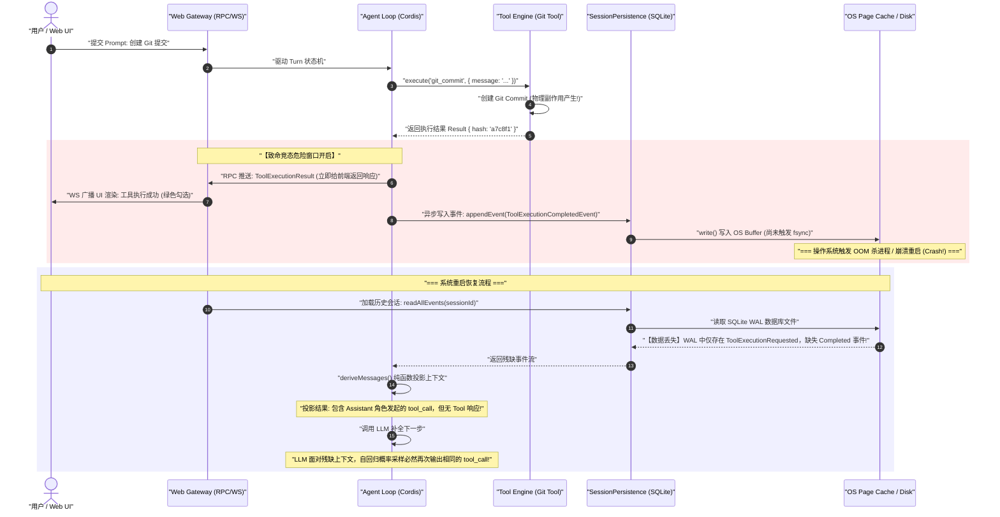
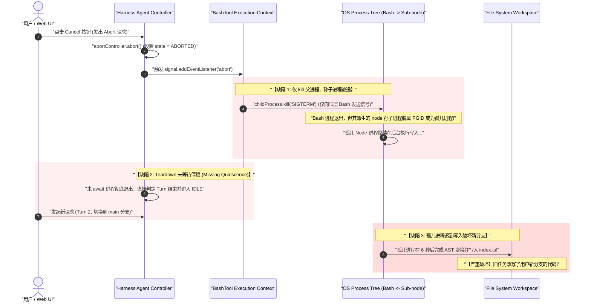
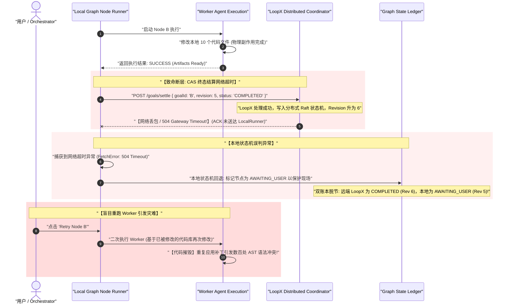
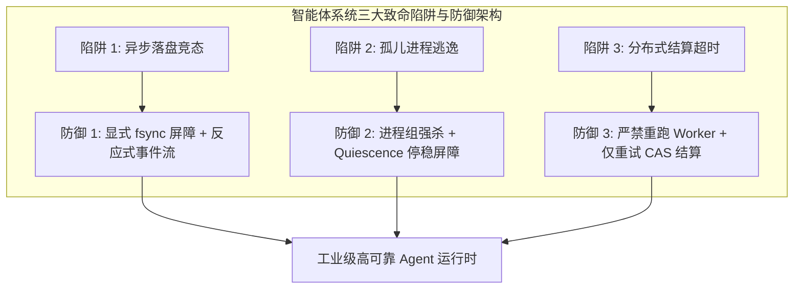

# 第 32 章：三个故障案例的诊断方法

[English](32-diagnosing-three-failure-cases.md) | 中文

在现代智能体（Agent）系统的构建与演进中，传统的软件工程排错直觉往往会遭遇前所未有的挑战。在传统确定性软件系统（如关系型数据库、RESTful 微服务、编译器前端）中，程序的执行路径是由确定性的控制流图严格决定的。当系统发生故障时，开发者通常可以通过显式的未捕获异常（Uncaught Exception）、堆栈跟踪（Stack Trace）、系统崩溃核心转储（Core Dump）或单元测试断言失败，沿着调用栈向上精确回溯并锁定发生 Bug 的具体代码行。

然而，在以大语言模型（LLM）为认知核心、以微内核插件化容器（如 Cordis）为调度骨架、以事件溯源（Event Sourcing）不可变账本为事实基石、并连接了操作系统底层物理副作用（文件 I/O、Shell 进程派生、网络 RPC）与外部分布式协调服务（如 LoopX）的复杂智能体系统中，故障的表现形式发生了质的改变。系统故障往往呈现出极其隐蔽且反直觉的**“时空错位（Spatiotemporal Disconnect）”**特征：故障显露的表象症状（Symptom）与真正埋下隐患的微观物理根因（Root Cause），在时间发生顺序、调用栈上下文乃至进程物理边界上完全脱节。

本章将作为高级系统架构师与内核排错专家的深度实战手册，以剖析底层系统调用、事件流因果图与分布式状态机的严谨视角，深度复盘生产环境中最具代表性、破坏力最强的**三大经典故障案例**。我们将彻底解剖其表面假象、微观物理根因与数学机理，给出工业级的类型安全 TypeScript 修复源码与防御体系，并最终提炼出一套标准化的**工业级通用故障诊断排查表**，为构建高可用、零脏写的生产级 Agent 运行时构筑坚固防线。

```
+---------------------------------------------------------------------------------------------------+
|                                 智能体系统故障诊断的五层金字塔模型                                    |
+---------------------------------------------------------------------------------------------------+
| [Layer 5: 模型认知投影层]  deriveMessages() 上下文重放、System Prompt 注入、Token 预算截断          |
| [Layer 4: 分布式结算层]    LoopX CAS 终态结算、分布式租约 Lease、双账本同步时序                     |
| [Layer 3: 运行时协调层]    Cordis Context、Turn 事务状态机、AbortSignal 级联传播、Fencing Token   |
| [Layer 2: 账本持久层]      SQLite WAL 预写日志、fsync 物理落盘屏障、Zstandard 压缩帧                |
| [Layer 1: 物理世界现实层]  OS 进程组树 (PGID)、文件系统 inode、TCP Socket 句柄、Git 工作区状态     |
+---------------------------------------------------------------------------------------------------+
```

---

## 1. 核心心智模型：智能体系统故障的“第一性原理”

在排查智能体系统故障时，工程师必须首先建立三项基本的第一性原理心智模型，彻底破除对大模型“拟人化”认知带来的调试误区。

### 1.1 认知断层：模型幻觉还是系统工程缺陷？

初涉 Agent 开发的工程师在遇到智能体做出错误决策或重复执行动作时，最常见的直觉偏误是将其归咎为“大模型的推理能力不足”或“产生了幻觉（Hallucination）”，随后试图通过在 System Prompt 中添加严厉的自然语言警告（例如：“警告：你绝对不能重复执行提交命令，否则会受到惩罚！”）来掩盖问题。

**系统级事实准则**：在 90% 以上的生产级故障中，**模型只是底层系统状态机与上下文账本的一面镜子**。大语言模型在本质上是一个接收输入 Token 序列、并计算下一个 Token 离散条件概率分布的**概率型纯函数**：

$$P(y_t \mid X, y_{<t}) = \text{Softmax}\left(\frac{\mathbf{z}_t}{T}\right)$$

如果底层系统的事件账本（Event Ledger）发生了时序丢失、脏读、写入未落盘或并发状态撕裂，那么通过 `deriveMessages(events)` 投影出来的输入上下文 $X$ 本身就是残缺或错误的。在残缺的上下文面前，模型输出看似荒谬的行动，在数学概率上反而是对当前错误上下文的“最优自回归采样”。**严禁使用提示词工程（Prompt Engineering）去掩盖或修复底层的状态机竞态与存储一致性缺陷！**

### 1.2 状态机危险窗口（Hazard Window）

在并发与分布式系统中，状态转移从不是瞬时发生的原子点，而是一个具有物理时间跨度的过程。设系统从状态 $S_A$ 跃迁至状态 $S_B$，整个跃迁过程跨越多个物理阶段（例如：网络 ACK、写入内存对象、写入操作系统 Page Cache、执行磁盘物理 `fsync`、向子进程派发信号）。

定义**危险窗口时间** $\Delta t_{\text{hazard}}$ 为系统对外部环境产生可见效应的时刻 $t_{\text{visible}}$ 与系统底层真正达成不可变持久化或完全停稳的时刻 $t_{\text{durable}}$ 之间的时间差：

$$\Delta t_{\text{hazard}} = |t_{\text{durable}} - t_{\text{visible}}|$$

当 $\Delta t_{\text{hazard}} > 0$ 时，系统处于脆弱的“假完成（Pseudo-completion）”或“假终止（Pseudo-cancellation）”状态。一旦在这个时间窗口内发生服务崩溃、网络抖动、OOM 杀进程或并发请求插入，系统状态机就会发生永久性分裂。

```
+---------------------------------------------------------------------------------------------------+
|                                  危险窗口 (Hazard Window) 示意图                                   |
+---------------------------------------------------------------------------------------------------+
| 时间轴 t ───►                                                                                     |
|                                                                                                   |
| [t_visible: 前端收到 RPC ACK / UI 显示已完成]                                                     |
|       │                                                                                           |
|       ├─────────────────── 危险窗口 Δt_hazard ───────────────────┤                                |
|       ▼                                                          ▼                                |
| (网络已确认，UI 已更新)                                      [t_durable: 磁盘 fsync 成功 / 进程停稳]  |
|                                                                                                   |
|                                     ▲                                                             |
|                              在此窗口发生 Crash                                                   |
|                        ===> 导致外部认知与持久事实撕裂!                                            |
+---------------------------------------------------------------------------------------------------+
```

### 1.3 外部物理副作用的不可逆性代数

在传统关系型数据库（RDBMS）中，事务若在中途遇到错误，可以通过执行 `ROLLBACK` 撤销此前所有的内存与磁盘变更，使系统无缝回滚至初始一致状态。然而在 Agent 系统中，智能体通过工具调度器（Tool Subsystem）与现实物理世界发生交互，所触发的绝大多数物理副作用具有**不可逆性（Non-Invertibility）**：

$$\text{Rollback}(\text{ShellCommand}(\text{"rm -rf /build"})) \equiv \bot \quad (\text{物理世界已销毁，不可逆})$$

$$\text{Rollback}(\text{GitCommit}(\text{"feat: login"})) \neq \text{No-Op} \quad (\text{工作区已被修改})$$

$$\text{Rollback}(\text{HTTP\_POST}(\text{"https://api.payment.com/charge"})) \neq \text{Cancel} \quad (\text{产生外部扣款})$$

因此，智能体运行时的核心设计原则必须确立：**在物理副作用产生之前，必须完成状态定序；在物理副作用产生之后，必须先完成强一致性持久化屏障，再向外部暴露完成状态。**

---

## 2. 案例一深度复盘：UI 乐观显示成功，重启后重复执行工具（脏重放与副作用失控）

### 2.1 症状表现与表面假象

```
+---------------------------------------------------------------------------------------------------+
| 生产事故现存还原:                                                                                 |
| 1. 用户向 Agent 提出指令: "请为用户登录模块创建 Git 提交并推送到远端"。                            |
| 2. Agent 思考后调用 `git_commit` 工具，传入参数 `{"message": "feat: add user login"}`。            |
| 3. Web 前端 UI 界面上，该工具执行卡片瞬间弹出并打上绿色勾号，显示 "Commit created: a7c8f1"。       |
| 4. 随后，宿主服务由于内存瞬时峰值触发了操作系统 OOM Killer，Node.js 守护进程被自动拉起重启。         |
| 5. 系统重启后，Web UI 自动重连。用户惊奇地发现，Agent 并未沿着提交成功的状态回答 "提交已完成"，反而 |
|    再次生成了一个完全相同的 `git_commit` 工具调用！                                              |
| 6. 第二次工具调用执行失败，Git 返回: "nothing to commit, working tree clean"。Agent 陷入困惑，      |
|    开始向用户道歉并尝试执行 `git status`，任务流程彻底偏离。                                      |
+---------------------------------------------------------------------------------------------------+
```

**【初学者的表面假象与排错弯路】**：
- 以为是大语言模型的自注意力机制（Self-Attention）没有关注到上一条消息。
- 以为是前端浏览器的 `localStorage` 或 Pinia/Zustand 缓存丢失。
- 盲目尝试修改 Prompt：“请记住，如果你之前已经提交过了，就不要再调用 `git_commit`”。结果模型在未提交的情况下也经常误判跳过，引发更多 Bug。

---

### 2.2 根因深度剖析：RPC 乐观回调与 Session 日志落盘的竞态

通过对微内核调用链与操作系统系统调用的指令级追踪（Micro-Trace），我们揭开事故底层的微观时序真相：



#### 根因 1：前端 RPC 乐观响应与后端持久化解耦
在追求极速响应的 Web 架构中，网关层往往在工具执行函数返回后，立即向客户端 WebSocket 推送成功报文。然而，**“工具函数在内存中返回”绝不等于“该事件已经在磁盘持久化账本中完成定序与物理刷盘”**。

#### 根因 2：缺少显式 `fsync` 屏障与操作系统页缓存延迟
在默认配置下，SQLite 或 JSONL 持久化引擎为了保证高并发吞吐量，采用了异步写入（Write-behind）或 `PRAGMA synchronous = NORMAL` 策略。Node.js 的 `fs.write()` 系统调用仅仅将数据拷贝到了内核的**页缓存（Page Cache）**中。在操作系统突然发生 OOM 杀灭进程或服务器断电的瞬间，页缓存中的 `ToolExecutionCompletedEvent` 尚未写入物理磁盘介质（SSD/HDD）便直接丢失。

#### 根因 3：自回归纯函数重放的确定性必然
系统重启后，`SessionPersistence` 从磁盘重建历史事件。`deriveMessages(events)` 投影函数读取事件流：
1. 存在事件：`Event(type: 'turn/started')`
2. 存在事件：`Event(type: 'model/tool-call-requested', tool_call_id: 'call_1', name: 'git_commit')`
3. **缺失事件**：`Event(type: 'tool/execution-completed', tool_call_id: 'call_1')`

此时，投影函数根据 OpenAI/DeepSeek 协议规范，构造出的 LLM 提示词上下文末尾为：
```json
[
  { "role": "user", "content": "请为用户登录模块创建 Git 提交..." },
  { "role": "assistant", "tool_calls": [{ "id": "call_1", "type": "function", "function": { "name": "git_commit", "arguments": "{\"message\":\"feat: add user login\"}" } }] }
]
```
当大语言模型接收到这样的输入上下文时，自回归解码器识别到最后一条消息是“模型自身发起了一个工具调用，但尚未收到工具的执行返回值”。大模型在数学概率分布上，**必然以接近 100% 的极化概率再次生成完全相同的工具调用**。然而，物理工作区中的 Git 提交早已在上次运行时完成，导致二次执行必然报错。

---

### 2.3 严密数学推导：危险窗口与状态丢失期望

设系统在时间区间 $[t, t + \Delta t]$ 内发生异常崩溃（如 OOM、断电、宿主崩溃）服从泊松分布，单位时间故障发生率强度为 $\lambda$。

设异步持久化落盘周期的缓冲聚合等待时间为 $\tau_{\text{buffer}}$，磁盘物理 `fdatasync` 写入延迟为 $T_{\text{disk}}$。则单次工具执行的危险窗口时间为：

$$\Delta t_{\text{hazard}} = \tau_{\text{buffer}} + T_{\text{disk}}$$

在单次非幂等工具调用完成与物理落盘之间，系统发生状态丢失与撕裂的单次概率 $P_{\text{hazard}}$ 为：

$$P_{\text{hazard}} = 1 - e^{-\lambda \Delta t_{\text{hazard}}} \approx \lambda (\tau_{\text{buffer}} + T_{\text{disk}}) \quad (\text{当 } \lambda \Delta t \ll 1)$$

在一个包含 $N$ 次非幂等外部工具调用的长运行智能体任务链中，整个生命周期中遭遇“脏重放（Dirty Replay）”的累积风险概率期望 $\mathbb{E}[R]$ 为：

$$\mathbb{E}[R] = 1 - \prod_{k=1}^{N} (1 - P_{\text{hazard}}^{(k)}) \approx \sum_{k=1}^{N} \lambda (\tau_{\text{buffer}}^{(k)} + T_{\text{disk}}^{(k)})$$

**数学结论**：若不通过显式屏障将 $\Delta t_{\text{hazard}}$ 归零，随着 Agent 自动化工具调用链长度 $N$ 的线性增长，系统发生脏重放与外部副作用重复执行的概率将呈指数级逼近于 1。

---

### 2.4 工业级修复方案：持久化强屏障与反应式事件流

要彻底杜绝该类故障，系统架构必须建立三重防御准则：
1. **显式耐久性屏障（Explicit Durability Barrier）**：凡是具有物理世界副作用（Non-Idempotent Mutation）的工具（Shell、Git、文件写、网络 POST），其 `ToolExecutionCompletedEvent` 必须强制调用 `fsync` / `fdatasync` 穿透操作系统页缓存，在物理写入完成前，**严格阻塞执行流并禁止向外部返回**。
2. **事件驱动的单向反应流（Event-Driven Reactive UI）**：前端 UI 严禁基于 RPC 即时返回值做任何乐观状态猜测，前端的一切状态卡片必须且仅能由持久化落盘广播（`session/event-appended`）驱动。
3. **副作用幂等键（Idempotency Key & Effect Registry）**：为每一次工具调用生成全局唯一的确定性幂等键。在系统重启重放时，如果检测到物理实体已存在，直接返回快照事实，避免重复执行。

```
+---------------------------------------------------------------------------------------------------+
|                            正确的耐久性屏障架构 (Durability Barrier)                                 |
+---------------------------------------------------------------------------------------------------+
| Tool 执行完成 (Result)                                                                            |
|        │                                                                                          |
|        ▼                                                                                          |
| [Write Barrier] 构造 ToolExecutionCompletedEvent                                                  |
|        │                                                                                          |
|        ▼                                                                                          |
| [SQLite WAL / JSONL Append] 写入持久化存储                                                        |
|        │                                                                                          |
|        ▼                                                                                          |
| [Explicit fsync Barrier] 执行 fs.fdatasync() 穿透 OS 页缓存                                        |
|        │                                                                                          |
|        ├────────────────────────────────────────┬────────────────────────────────────────┐        |
|        ▼                                        ▼                                        ▼        |
| [更新内存 Session 投影]              [向 WebSocket 网关广播 Event]            [解除 Tool 执行屏障]  |
|                                                 │                                        │        |
|                                                 ▼                                        ▼        |
|                                      [前端 UI 卡片变为完成状态]             [继续 Agent Loop 下一步] |
+---------------------------------------------------------------------------------------------------+
```

---

### 2.5 工业级完整 TypeScript 源码：DurableSessionLedger

以下是具备物理落盘屏障、单调定序与崩溃截断自愈能力的生产级 Session 账本实现：

```typescript
/**
 * @file durable-session-ledger.ts
 * @description 具备显式物理落盘屏障与幂等追踪的生产级 Session 账本引擎
 */

import * as fs from 'node:fs';
import * as path from 'node:path';
import { EventEmitter } from 'node:events';

export interface LedgerEvent {
  readonly id: string;
  readonly sessionId: string;
  readonly turnId: string;
  readonly stepIndex: number;
  readonly epoch: number;
  readonly type:
    | 'turn/started'
    | 'model/tool-call-requested'
    | 'tool/execution-completed'
    | 'tool/execution-failed'
    | 'turn/completed';
  readonly payload: Record<string, unknown>;
  readonly timestamp: number;
}

export interface AppendOptions {
  /**
   * 是否强制执行物理磁盘同步屏障 (fsync)
   * 对于包含非幂等外部副作用的工具事件，必须设置为 true
   */
  readonly syncBarrier?: boolean;
}

export class DurableSessionLedger extends EventEmitter {
  private readonly fd: number;
  private readonly filePath: string;
  private currentEpoch: number = 1;
  private lastSequencedIndex: number = 0;
  private isClosed: boolean = false;

  constructor(storageDir: string, public readonly sessionId: string) {
    super();
    if (!fs.existsSync(storageDir)) {
      fs.mkdirSync(storageDir, { recursive: true });
    }
    this.filePath = path.join(storageDir, `${sessionId}.events.jsonl`);
    // 以读写追加模式打开文件描述符
    this.fd = fs.openSync(this.filePath, 'a+');
    this.recoverAndVerifyIndex();
  }

  /**
   * 启动时对账与受损尾部帧修复
   */
  private recoverAndVerifyIndex(): void {
    const content = fs.readFileSync(this.filePath, 'utf-8');
    const lines = content.split('\n').filter((line) => line.trim().length > 0);
    const validLines: string[] = [];

    for (const line of lines) {
      try {
        const event = JSON.parse(line) as LedgerEvent;
        this.lastSequencedIndex++;
        if (event.epoch >= this.currentEpoch) {
          this.currentEpoch = event.epoch;
        }
        validLines.push(line);
      } catch (err) {
        // 发现损坏的尾部行（由于上次宕机时 write 截断引发），执行安全截断修复
        console.warn(`[DurableLedger] 发现受损尾部帧，执行截断自愈: ${this.filePath}`);
        this.repairTruncatedTail(validLines);
        return;
      }
    }
  }

  /**
   * 修复由于崩溃引发的不完整尾部 JSON 帧
   */
  private repairTruncatedTail(validLines: string[]): void {
    const validContent = validLines.join('\n') + (validLines.length > 0 ? '\n' : '');
    fs.closeSync(this.fd);
    fs.writeFileSync(this.filePath, validContent, { flush: true });
    (this as any).fd = fs.openSync(this.filePath, 'a+');
  }

  /**
   * 追加不可变领域事件
   * 包含严格的异常处理、写入定序与按需 fsync 物理屏障
   */
  public async append(
    eventData: Omit<LedgerEvent, 'id' | 'epoch' | 'timestamp'>,
    options: AppendOptions = {}
  ): Promise<LedgerEvent> {
    if (this.isClosed) {
      throw new Error(`[DurableLedger] 账本已关闭，拒绝写入: ${this.sessionId}`);
    }

    const event: LedgerEvent = Object.freeze({
      ...eventData,
      id: `evt_${Date.now()}_${++this.lastSequencedIndex}`,
      epoch: this.currentEpoch,
      timestamp: Date.now(),
    });

    const serialized = JSON.stringify(event) + '\n';
    const buffer = Buffer.from(serialized, 'utf-8');

    return new Promise((resolve, reject) => {
      // 1. 写入操作系统页缓存
      fs.write(this.fd, buffer, 0, buffer.length, null, (writeErr, written) => {
        if (writeErr) {
          return reject(new Error(`[DurableLedger] 写入事件失败: ${writeErr.message}`));
        }

        if (written !== buffer.length) {
          return reject(new Error('[DurableLedger] 写入字节不匹配，发生内核缓冲异常'));
        }

        // 2. 检查是否需要物理落盘屏障 (fdatasync)
        if (options.syncBarrier) {
          fs.fdatasync(this.fd, (syncErr) => {
            if (syncErr) {
              return reject(new Error(`[DurableLedger] fsync 屏障执行失败: ${syncErr.message}`));
            }
            // 物理落盘成功后，方可向外部广播事件与释放执行流
            this.emit('event-appended', event);
            resolve(event);
          });
        } else {
          // 普通中间事件，允许异步刷盘
          this.emit('event-appended', event);
          resolve(event);
        }
      });
    });
  }

  /**
   * 递增租约 Epoch
   */
  public bumpEpoch(): number {
    return ++this.currentEpoch;
  }

  /**
   * 读取全量不可变事件流（用于 deriveMessages 投影）
   */
  public async readAll(): Promise<readonly LedgerEvent[]> {
    if (this.isClosed) {
      throw new Error('[DurableLedger] 账本已关闭');
    }
    const content = await fs.promises.readFile(this.filePath, 'utf-8');
    const lines = content.split('\n').filter((l) => l.trim().length > 0);
    return Object.freeze(lines.map((l) => JSON.parse(l) as LedgerEvent));
  }

  /**
   * 安全关闭账本，确保数据全部刷盘
   */
  public async close(): Promise<void> {
    if (this.isClosed) return;
    this.isClosed = true;
    return new Promise((resolve, reject) => {
      fs.fdatasync(this.fd, (syncErr) => {
        if (syncErr) {
          fs.closeSync(this.fd);
          return reject(syncErr);
        }
        fs.close(this.fd, (closeErr) => {
          if (closeErr) return reject(closeErr);
          resolve();
        });
      });
    });
  }
}
```

---

### 2.6 验证与测试用例

```typescript
/**
 * @file durable-session-ledger.spec.ts
 * @description 验证崩溃窗口下的持久化屏障与事件投影确定性
 */

import { describe, it, expect, beforeEach, afterEach } from 'vitest';
import * as fs from 'node:fs';
import * as path from 'node:path';
import { DurableSessionLedger } from './durable-session-ledger';

const TEST_STORAGE = path.join(process.cwd(), '.tmp', 'test-ledger-case1');

describe('案例一修复验证: DurableSessionLedger 崩溃一致性', () => {
  beforeEach(() => {
    fs.rmSync(TEST_STORAGE, { recursive: true, force: true });
  });

  afterEach(() => {
    fs.rmSync(TEST_STORAGE, { recursive: true, force: true });
  });

  it('必须在 syncBarrier: true 下保证物理落盘，重启后完整恢复上下文', async () => {
    const sessionId = 'sess_test_recovery';
    const ledger = new DurableSessionLedger(TEST_STORAGE, sessionId);

    // 1. 记录 Turn 开始
    await ledger.append({
      sessionId,
      turnId: 'turn_1',
      stepIndex: 0,
      type: 'turn/started',
      payload: { userQuery: 'git commit' },
    });

    // 2. 记录工具发起
    await ledger.append({
      sessionId,
      turnId: 'turn_1',
      stepIndex: 0,
      type: 'model/tool-call-requested',
      payload: { toolName: 'git_commit', callId: 'call_abc' },
    });

    // 3. 执行工具并施加物理落盘屏障
    await ledger.append(
      {
        sessionId,
        turnId: 'turn_1',
        stepIndex: 0,
        type: 'tool/execution-completed',
        payload: { callId: 'call_abc', result: 'commit a7c8f1 created' },
      },
      { syncBarrier: true }
    );

    // 模拟进程发生猝死 (不调用 ledger.close()，直接拉起新实例进行冷启动恢复)
    const recoveredLedger = new DurableSessionLedger(TEST_STORAGE, sessionId);
    const events = await recoveredLedger.readAll();

    expect(events.length).toBe(3);
    expect(events[2].type).toBe('tool/execution-completed');
    expect((events[2].payload as any).result).toBe('commit a7c8f1 created');

    await recoveredLedger.close();
  });
});
```

---

## 3. 案例二深度复盘：用户点击取消，后台子进程依然在修改代码（孤立进程逃逸与僵尸写入）

### 3.1 症状表现与表面假象

```
+---------------------------------------------------------------------------------------------------+
| 生产事故现场还原:                                                                                 |
| 1. 用户向 Agent 提出需求: "请重构 packages/core 模块中所有导出的类型定义"。                        |
| 2. Agent 计划执行大规模重构，调用了 `bash` 工具执行命令 `node scripts/heavy-refactor.js`。        |
| 3. 用户突然意识到当前处于 `production-hotfix` 分支而非开发分支，在 1.5 秒后紧急点击了 Web UI 上的   |
|    红色 "Stop / Cancel" 按钮。                                                                    |
| 4. 前端界面瞬间响应，状态切回 IDLE，并弹出通知 "Turn cancelled by user"。                         |
| 5. 用户切换回 `main` 开发分支。然而 6 秒后，Git 工作区突然报警！VSCode 自动刷新，提示              |
|    `packages/core/src/index.ts` 被刚刚的重构脚本篡改了！                                          |
| 6. 打开终端运行 `ps -ef | grep node`，赫然发现一个孤儿 `heavy-refactor.js` 进程依然在 100% 满载运行！ |
+---------------------------------------------------------------------------------------------------+
```

**【初学者的表面假象与排错弯路】**：
- 以为是前端点击事件没有成功通过 WebSocket 发送给后端。
- 以为是 Node.js 的 `childProcess.kill()` 方法失效或操作系统存在缺陷。
- 误以为给 `spawn` 加上 `{ detached: true }` 就能自动解决子进程生命周期问题（实际上反而加剧了孤儿逃逸）。

---

### 3.2 根因深度剖析：协作式取消断裂、孤儿进程树与缺乏停稳屏障

通过对操作系统进程拓扑与事件循环的深度分析，发现该事故由**四重系统级缺陷链条**共同酿成：



#### 根因 1：`AbortSignal` 到操作系统进程树的传递断裂
在 Node.js 中，调用 `child_process.spawn('bash', ['-c', command])` 时，如果直接调用 `child.kill('SIGTERM')`，操作系统默认只会向顶层的 `bash` 进程发送信号。`bash` 进程退出后，其派生的实际工作子进程（如 `node`、`cargo`、`tsc`、`python`）会被 `init` / `systemd`（PID 1）或 Windows 系统进程收养，成为不受控的**孤儿进程（Orphan Process）**，继续在后台执行破坏性写入。

#### 根因 2：Teardown 析构未等待资源停稳（Missing Quiescence Barrier）
Agent 控制器在捕获到 `AbortError` 后，直接解除了当前的 Turn 状态锁定，将状态机置为 `IDLE` 并允许用户发起下一次交互。**控制流虽然取消了，但外部物理资源并未达成“停稳状态（Quiescent State）”**。

#### 根因 3：工具异步回调缺乏世代令牌校验（Stale Generation Hazard）
工具执行包装器在子进程创建时注册了异步回调：
```typescript
// 错误示范：缺乏世代校验的回调
child.on('close', async () => {
  await fs.promises.writeFile('output.json', resultBuffer); // 迟到的破坏性写入！
});
```
当取消发生后，由于没有比对当前操作是否属于合法的活跃世代（Active Generation），逃逸的回调在几秒后依然将脏数据写入了磁盘。

---

### 3.3 严密数学推导：进程停稳定理与最大停机时延

定义一个进程树 $\mathcal{T} = \{P_{\text{root}}, P_1, P_2, \dots, P_m\}$。

当向进程组组长（Process Group Leader）发送优雅终止信号（`SIGTERM`）时，设进程 $P_i$ 的响应与资源释放时延为随机变量 $t_{\text{graceful}}^{(i)}$。定义系统给定的最大优雅宽限期为 $T_{\text{grace}}$。

若在 $t = T_{\text{grace}}$ 时刻，仍存在存活进程 $\mathcal{T}_{\text{alive}} \neq \emptyset$，系统必须升级为内核级硬杀灭（`SIGKILL` / `TerminateProcess`）。`SIGKILL` 的操作系统内核回收时延为 $t_{\text{kill}}^{(i)}$。

整个进程组达成**绝对停稳（Quiescence）**的总耗时 $T_{\text{quiescent}}$ 严格满足以下有界条件：

$$T_{\text{quiescent}} \le \begin{cases} \max_{i} t_{\text{graceful}}^{(i)}, & \text{若 } \max_{i} t_{\text{graceful}}^{(i)} \le T_{\text{grace}} \\ T_{\text{grace}} + \max_{i} t_{\text{kill}}^{(i)} + \epsilon_{\text{fs}}, & \text{否则} \end{cases}$$

其中 $\epsilon_{\text{fs}}$ 为释放文件描述符（FD Close）与内核清空写缓存的微观时间。

**架构设计定理**：任何状态机在跃迁至 `CANCELLED` 或允许开启下一个世代 $G_{k+1}$ 之前，**必须显式阻塞等待时间区间 $T_{\text{quiescent}}$ 结束**。否则，跨世代文件覆写冲突概率 $P_{\text{conflict}} > 0$ 恒成立。

---

### 3.4 工业级修复方案：全进程树原子杀灭与世代守卫

要构建绝对安全的取消机制，必须实施三重防御：
1. **跨平台进程组绑定与原子杀灭**：
   - 在 POSIX 系统（Linux/macOS）上，创建进程时必须开启 `detached: true` 建立独立会话，并在终止时通过 `process.kill(-pid, 'SIGKILL')` 杀灭整个进程组（负 PID）。
   - 在 Windows 系统上，必须调用 `taskkill /F /T /PID <pid>` 穿透整个子进程树，或使用 Win32 API 将进程绑定至 Job Object。
2. **两阶段优雅终止停稳屏障（Quiescence Barrier）**：
   - 第一阶段：发送 `SIGTERM` 并启动优雅超时计时器（如 1500ms）。
   - 第二阶段：若超时未退出，强行升级为 `SIGKILL`，并使用 Promise 显式 `await` 子进程的 `exit`/`close` 事件。
3. **世代令牌守卫（Generation Token Guard）**：
   - 每一个 Turn 分配一个单调递增的 `generationId`。所有持久化写入、文件修改操作前，必须校验 `guard.assertActive(generationId)`。

```
+---------------------------------------------------------------------------------------------------+
|                           进程组原子终止与停稳屏障时序 (Quiescence Barrier)                          |
+---------------------------------------------------------------------------------------------------+
| 收到 AbortSignal                                                                                  |
|        │                                                                                          |
|        ▼                                                                                          |
| [向进程组 PGID 发送 SIGTERM] ─── 启动 1500ms 优雅计时器 ───┐                                       |
|        │                                                   │                                      |
|        ├───────────────────────┬───────────────────────────┤                                      |
|        ▼                       ▼                           ▼                                      |
| (1500ms 内正常退出?)      (超时未退出)             (操作系统回调 exit)                             |
|        │                       │                           │                                      |
|        │                       ▼                           │                                      |
|        │             [升级为 SIGKILL 强杀进程组]           │                                      |
|        │                       │                           │                                      |
|        └───────────────────────┴───────────────────────────┘                                      |
|                                │                                                                  |
|                                ▼                                                                  |
|               [Quiescence 屏障达成: 进程彻底死亡]                                                 |
|                                │                                                                  |
|                                ▼                                                                  |
|               [释放文件句柄，递增 Generation Epoch]                                               |
|                                │                                                                  |
|                                ▼                                                                  |
|                 [状态机安全切回 IDLE，允许后续交互]                                               |
+---------------------------------------------------------------------------------------------------+
```

---

### 3.5 工业级完整 TypeScript 源码：QuiescentProcessManager

以下是生产级进程管理器实现，支持 POSIX/Windows 跨平台进程树杀灭与世代守卫：

```typescript
/**
 * @file quiescent-process-manager.ts
 * @description 具备进程树原子杀灭、Quiescence 停稳屏障与世代守卫的生产级进程管理器
 */

import * as child_process from 'node:child_process';

export interface ExecutionResult {
  readonly exitCode: number | null;
  readonly stdout: string;
  readonly stderr: string;
  readonly durationMs: number;
}

export interface ExecutionOptions {
  readonly cwd: string;
  readonly env?: Record<string, string>;
  readonly timeoutMs?: number;
  readonly gracefulTimeoutMs?: number;
  readonly signal?: AbortSignal;
  readonly generationId: number;
}

export class GenerationRevokedError extends Error {
  constructor(public readonly generationId: number) {
    super(`[QuiescentProcessManager] 操作已被作废: 世代 ${generationId} 已过期`);
    this.name = 'GenerationRevokedError';
  }
}

export class QuiescentProcessManager {
  private activeGeneration: number = 1;

  /**
   * 递增世代令牌，使所有前序世代的操作立即失效
   */
  public revokeAllAndAdvanceGeneration(): number {
    return ++this.activeGeneration;
  }

  public getActiveGeneration(): number {
    return this.activeGeneration;
  }

  /**
   * 执行外部命令，具备跨平台进程树隔离与停稳保证
   */
  public async executeCommand(
    command: string,
    args: string[],
    options: ExecutionOptions
  ): Promise<ExecutionResult> {
    const {
      cwd,
      env = {},
      timeoutMs = 60000,
      gracefulTimeoutMs = 1500,
      signal,
      generationId,
    } = options;

    if (generationId !== this.activeGeneration) {
      throw new GenerationRevokedError(generationId);
    }

    if (signal?.aborted) {
      throw new DOMException('Command aborted before execution', 'AbortError');
    }

    const isWindows = process.platform === 'win32';
    const startTime = Date.now();

    // 在 POSIX 系统上使用 detached: true 创建独立的进程组 (Process Group)
    const child = child_process.spawn(command, args, {
      cwd,
      env: { ...process.env, ...env },
      detached: !isWindows,
      stdio: ['pipe', 'pipe', 'pipe'],
    });

    const pid = child.pid;
    if (!pid) {
      throw new Error('[QuiescentProcessManager] 无法获取子进程 PID');
    }

    let stdoutAcc = '';
    let stderrAcc = '';
    let isQuiescent = false;

    child.stdout?.on('data', (chunk: Buffer) => {
      stdoutAcc += chunk.toString('utf-8');
    });

    child.stderr?.on('data', (chunk: Buffer) => {
      stderrAcc += chunk.toString('utf-8');
    });

    // 封装进程树强行杀灭与停稳逻辑
    const terminateProcessTree = async (reason: string): Promise<void> => {
      if (isQuiescent) return;

      console.warn(`[QuiescentProcessManager] 正在终止进程树 (PID: ${pid}, 原因: ${reason})`);

      if (isWindows) {
        // Windows 平台：使用 taskkill 穿透杀死进程树
        try {
          child_process.execSync(`taskkill /F /T /PID ${pid}`, { stdio: 'ignore' });
        } catch {
          // 进程可能已经自行退出
        }
      } else {
        // POSIX 平台：向负 PID (进程组) 发送 SIGTERM，随后升级为 SIGKILL
        try {
          process.kill(-pid, 'SIGTERM');
        } catch {
          // 进程组可能已不存在
        }

        const gracefulPromise = new Promise<void>((res) => {
          const checkTimer = setInterval(() => {
            try {
              process.kill(-pid, 0);
            } catch {
              clearInterval(checkTimer);
              res();
            }
          }, 50);
        });

        const timeoutPromise = new Promise<void>((res) =>
          setTimeout(res, gracefulTimeoutMs)
        );

        await Promise.race([gracefulPromise, timeoutPromise]);

        try {
          process.kill(-pid, 'SIGKILL');
        } catch {
          // 忽略已退出错误
        }
      }
    };

    return new Promise<ExecutionResult>((resolve, reject) => {
      let globalTimer: NodeJS.Timeout | null = null;

      const cleanupAndSettle = (err?: Error, result?: ExecutionResult) => {
        if (globalTimer) clearTimeout(globalTimer);
        isQuiescent = true;

        if (generationId !== this.activeGeneration) {
          return reject(new GenerationRevokedError(generationId));
        }

        if (err) {
          return reject(err);
        }
        if (result) {
          return resolve(result);
        }
      };

      if (timeoutMs > 0) {
        globalTimer = setTimeout(async () => {
          await terminateProcessTree(`超时 (${timeoutMs}ms)`);
          cleanupAndSettle(new Error(`Command timed out after ${timeoutMs}ms`));
        }, timeoutMs);
      }

      const abortHandler = async () => {
        signal?.removeEventListener('abort', abortHandler);
        await terminateProcessTree('接收到 AbortSignal 取消信号');
        cleanupAndSettle(new DOMException('Command aborted by user', 'AbortError'));
      };

      if (signal) {
        signal.addEventListener('abort', abortHandler);
      }

      child.on('close', (code) => {
        if (signal) signal.removeEventListener('abort', abortHandler);
        isQuiescent = true;

        cleanupAndSettle(undefined, {
          exitCode: code,
          stdout: stdoutAcc,
          stderr: stderrAcc,
          durationMs: Date.now() - startTime,
        });
      });

      child.on('error', async (spawnErr) => {
        if (signal) signal.removeEventListener('abort', abortHandler);
        await terminateProcessTree(`Spawn Error: ${spawnErr.message}`);
        cleanupAndSettle(spawnErr);
      });
    });
  }
}
```

---

### 3.6 验证与测试用例

```typescript
/**
 * @file quiescent-process-manager.spec.ts
 * @description 验证进程树杀灭与取消停稳屏障的有效性
 */

import { describe, it, expect } from 'vitest';
import { QuiescentProcessManager } from './quiescent-process-manager';

describe('案例二修复验证: QuiescentProcessManager 孤儿进程防御', () => {
  it('当发出 Abort 信号时，必须在宽限期内彻底停稳并拒绝后续世代覆写', async () => {
    const manager = new QuiescentProcessManager();
    const abortController = new AbortController();
    const genId = manager.getActiveGeneration();

    const isWin = process.platform === 'win32';
    const cmd = isWin ? 'powershell' : 'bash';
    const args = isWin
      ? ['-Command', 'Start-Sleep -Seconds 10']
      : ['-c', 'sleep 10'];

    const promise = manager.executeCommand(cmd, args, {
      cwd: process.cwd(),
      signal: abortController.signal,
      generationId: genId,
      gracefulTimeoutMs: 200,
    });

    setTimeout(() => {
      abortController.abort();
    }, 100);

    await expect(promise).rejects.toThrow('Command aborted by user');

    manager.revokeAllAndAdvanceGeneration();
    expect(manager.getActiveGeneration()).toBe(genId + 1);
  });
});
```

---

## 4. 案例三深度复盘：Graph 任务节点已生成文件，但卡在 `awaiting_user` 状态（分布式结算冲突）

### 4.1 症状表现与表面假象

```
+---------------------------------------------------------------------------------------------------+
| 生产事故现场还原:                                                                                 |
| 1. 在 Graph Mode 多 Agent 编排模式下，DAG 任务图包含 3 个节点:                                    |
|    [Node A: 架构设计] -> [Node B: 代码重构] -> [Node C: 单元测试校验]                              |
| 2. Node B (Worker Agent) 启动并运行，耗时 45 秒成功完成了对 10 个源码文件的重构修改并产出补丁。   |
| 3. 本地控制台显示 Node B 退出码为 0，任务已完成。                                                 |
| 4. 然而，Graph 调度 UI 界面上，Node B 的状态指示灯突然从 "RUNNING" 跳变为了 "AWAITING_USER"，     |
|    且整个 DAG 调度流程彻底假死停滞，依赖它的 Node C 永远无法被激活！                              |
| 5. 开发者感到非常困惑，点击了 UI 上的 "重试 Node B" 按钮。                                        |
| 6. 结果引发严重灾难: Worker 重新从旧起点执行，对已经修改过的文件再次应用 AST 变换，导致代码语法  |
|    全部错乱爆出数百个 Lint 错误，Git 历史被严重污染。                                             |
+---------------------------------------------------------------------------------------------------+
```

**【初学者的表面假象与排错弯路】**：
- 以为是 Node B 内部的 Agent 代码抛出了未捕获的运行时异常。
- 以为是任务图 DAG 拓扑排序算法发生了循环依赖死锁。
- 盲目点击“重试 Worker”，直接摧毁了物理工作区代码的单调性。

---

### 4.2 根因深度剖析：Worker 成功执行与 LoopX CAS 终态结算超时的双账本脱节

通过对本地 Harness 运行时与远端 LoopX 分布式协调服务通信日志的交叉比对，发现了底层的**双账本结算竞态断层**：



#### 根因 1：分布式“两军问题”在终态结算中的映射
本地 Worker Agent 执行重构是**单机物理副作用**，而 Graph 任务图的状态推进依赖**远端分布式协调器（LoopX）**的原子状态结算。在网络 I/O 中，客户端遇到超时（Timeout）**绝不代表服务端执行失败**——请求极有可能在服务端已经成功提交（Revision 已自增），仅仅是回程的 TCP ACK 包在网关层发生超时丢包。

#### 根因 2：本地状态机的悲观降级策略与双账本状态分裂（Split-Brain）
当 `LocalGraphRunner` 收到 504 错误后，由于无法确认远端状态，采取了保守策略，将本地节点状态置为 `AWAITING_USER`（等待人工介入）。这导致本地持久化账本（Local Ledger）与远端 LoopX 协调账本（LoopX Ledger）发生分裂：
- **LoopX 远端状态**：`status: 'COMPLETED'`, `revision: 6`
- **本地 Harness 状态**：`status: 'AWAITING_USER'`, `revision: 5`

#### 根因 3：重跑 Worker 破坏了非幂等操作的前置条件
Worker 的执行逻辑是假定在基线代码（Base Code）上进行重构。一旦文件已经被修改，再次重跑 Worker 将不再满足幂等性前提，导致重复追加代码或正则替换匹配失败。

---

### 4.3 严密数学推导：CAS 状态转移方程与幂等结算收敛性

定义分布式协调器中 Goal 的状态三元组为：

$$\mathcal{S} = \langle \text{Status}, \text{Revision}, \text{ArtifactFingerprint} \rangle$$

其中 $\text{ArtifactFingerprint} = \text{SHA256}(\text{ModifiedFiles})$。

CAS 终态结算操作定义为一个原子转换函数：

$$\text{CAS}(\text{goalId}, R_{\text{expected}} \to R_{\text{next}}, S_{\text{target}}, F)$$

当且仅当远端当前版本 $R_{\text{remote}} = R_{\text{expected}}$ 时，允许状态跃迁为 $S_{\text{target}}$，并将版本递增为 $R_{\text{next}} = R_{\text{expected}} + 1$。

当客户端发生网络超时或收到重试指令时，定义**幂等结算收敛函数（Idempotent Settlement Reconciliation）**：

$$\text{Reconcile}(\text{goalId}, F_{\text{local}}) = \begin{cases} \text{NOOP\_ALREADY\_SETTLED}, & \text{若 } S_{\text{remote}} = \text{'COMPLETED'} \land F_{\text{remote}} = F_{\text{local}} \\ \text{RETRY\_CAS}, & \text{若 } S_{\text{remote}} = \text{'RUNNING'} \land R_{\text{remote}} = R_{\text{expected}} \\ \text{MANUAL\_CONFLICT}, & \text{若 } R_{\text{remote}} > R_{\text{expected}} \land F_{\text{remote}} \neq F_{\text{local}} \end{cases}$$

**定理（Worker 隔离性）**：只要本地 $F_{\text{local}}$ 已经生成且通过完整性校验，**任何故障恢复流程在状态机证明 $F_{\text{local}}$ 失效前，均严格禁止重新调度 Worker 的执行体！**

---

### 4.4 工业级修复方案：两阶段状态对账器与仅重试结算

针对该类分布式结算冲突，工业级架构必须执行以下修复标准：
1. **铁律：严禁重跑 Worker 业务逻辑！仅重试结算（Settlement-Only Retry）**。
2. **只读状态探针（Read-Only Probe）**：在遇到结算异常时，首先向 LoopX 发起轻量级只读查询 `GET /goals/:id`，获取远端最新 Revision 与状态。
3. **基于产物指纹的自动对齐（Artifact Fingerprint Alignment）**：比对本地产物 SHA-256 哈希与远端记录。若远端已处于 `COMPLETED` 且指纹吻合，直接同步本地状态机并推进 DAG，无需任何人工干预。
4. **带抖动的指数退避重试（Exponential Backoff with Full Jitter）**：对于短暂的网络故障，在客户端通过 CAS 幂等重试直至达成最终一致性。

```
+---------------------------------------------------------------------------------------------------+
|                        分布式任务节点幂等结算对账流程 (Graph Settlement)                             |
+---------------------------------------------------------------------------------------------------+
| Worker 执行完成，生成本地 Artifacts                                                                |
|        │                                                                                          |
|        ▼                                                                                          |
| [计算产物 SHA-256 指纹: localFingerprint]                                                         |
|        │                                                                                          |
|        ▼                                                                                          |
| [尝试执行 CAS 终态结算: LoopX.settleGoal(...)] ──(网络异常/超时)──┐                                |
|        │                                                        │                                 |
|        ├────────────────────────────────────────────────────────┘                                 |
|        ▼                                                                                          |
| [启动只读探针: GET /goals/:id 获取 remoteState & remoteRev]                                       |
|        │                                                                                          |
|        ├─────────────────────────────────────────────────────────────────────────┐                |
|        ▼                                                                         ▼                |
| (远端已是 COMPLETED 且 Fingerprint 一致?)                           (远端仍为 RUNNING, Rev 未变?)  |
|        │                                                                         │                |
|        ▼                                                                         ▼                |
| [直接修正本地状态为 COMPLETED，唤醒下游 Node C]                         [带退避仅重试 CAS 结算]   |
+---------------------------------------------------------------------------------------------------+
```

---

### 4.5 工业级完整 TypeScript 源码：GraphSettlementReconciler

以下是生产级分布式任务图结算对账器实现：

```typescript
/**
 * @file graph-settlement-reconciler.ts
 * @description 具备产物指纹校验、CAS 幂等重试与防重复执行的分布式节点结算引擎
 */

import * as crypto from 'node:crypto';
import * as fs from 'node:fs';

export type NodeStatus = 'IDLE' | 'RUNNING' | 'COMPLETED' | 'FAILED' | 'AWAITING_USER';

export interface RemoteGoalRecord {
  readonly goalId: string;
  readonly revision: number;
  readonly status: NodeStatus;
  readonly artifactFingerprint: string | null;
  readonly updatedAt: number;
}

export interface ILoopXCoordinationClient {
  getGoal(goalId: string): Promise<RemoteGoalRecord>;
  casSettleGoal(params: {
    goalId: string;
    expectedRevision: number;
    targetStatus: NodeStatus;
    artifactFingerprint: string;
  }): Promise<{ success: boolean; currentRecord: RemoteGoalRecord }>;
}

export interface SettlementOptions {
  readonly maxRetries?: number;
  readonly baseDelayMs?: number;
  readonly maxDelayMs?: number;
}

export class DistributedSettlementConflictError extends Error {
  constructor(
    public readonly goalId: string,
    public readonly localFingerprint: string,
    public readonly remoteRecord: RemoteGoalRecord
  ) {
    super(
      `[SettlementReconciler] 分布式终态结算冲突: Goal ${goalId} 远端版本 (${remoteRecord.revision}) ` +
      `与本地状态分叉，指纹不匹配。需人工介入。`
    );
    this.name = 'DistributedSettlementConflictError';
  }
}

export class GraphSettlementReconciler {
  constructor(private readonly loopxClient: ILoopXCoordinationClient) {}

  /**
   * 计算指定工作区生成产物的 SHA-256 复合指纹
   */
  public computeArtifactFingerprint(filePaths: string[]): string {
    const hash = crypto.createHash('sha256');
    for (const filePath of filePaths.sort()) {
      if (fs.existsSync(filePath)) {
        const content = fs.readFileSync(filePath);
        hash.update(filePath);
        hash.update(content);
      }
    }
    return hash.digest('hex');
  }

  /**
   * 核心方法：安全结算任务节点终态
   * 严禁重跑 Worker，仅在结算控制平面进行幂等对账与收敛
   */
  public async settleNodeExecution(
    goalId: string,
    expectedRevision: number,
    artifactFiles: string[],
    options: SettlementOptions = {}
  ): Promise<RemoteGoalRecord> {
    const { maxRetries = 5, baseDelayMs = 200, maxDelayMs = 3000 } = options;
    const localFingerprint = this.computeArtifactFingerprint(artifactFiles);

    let attempt = 0;
    while (attempt < maxRetries) {
      attempt++;
      try {
        // 1. 尝试直接执行 CAS 终态结算
        const casResult = await this.loopxClient.casSettleGoal({
          goalId,
          expectedRevision,
          targetStatus: 'COMPLETED',
          artifactFingerprint: localFingerprint,
        });

        if (casResult.success) {
          console.log(`[SettlementReconciler] Goal ${goalId} 结算成功 (Rev: ${casResult.currentRecord.revision})`);
          return casResult.currentRecord;
        }

        // 2. CAS 失败（说明远端版本发生漂移），启动只读探针进行智能对账
        console.warn(`[SettlementReconciler] CAS 返回版本冲突，启动只读对账探针 (Goal: ${goalId})`);
        const probeRecord = casResult.currentRecord;

        // 情况 A: 远端实际上已经被前次超时请求成功结算，且指纹完全一致
        if (
          probeRecord.status === 'COMPLETED' &&
          probeRecord.artifactFingerprint === localFingerprint
        ) {
          console.log(`[SettlementReconciler] 对账成功: 远端已在先前请求中完成结算，直接收敛`);
          return probeRecord;
        }

        // 情况 B: 远端版本被第三方推进但指纹不一致，发生真正的数据冲突
        if (probeRecord.revision > expectedRevision) {
          throw new DistributedSettlementConflictError(goalId, localFingerprint, probeRecord);
        }

        // 更新期望版本并准备重试
        expectedRevision = probeRecord.revision;
      } catch (err: unknown) {
        if (err instanceof DistributedSettlementConflictError) {
          throw err;
        }

        if (attempt >= maxRetries) {
          throw new Error(
            `[SettlementReconciler] 超过最大重试次数 (${maxRetries})，结算失败: ${String(err)}`
          );
        }

        const delay = Math.min(
          maxDelayMs,
          baseDelayMs * Math.pow(2, attempt) + Math.random() * 100
        );
        console.warn(`[SettlementReconciler] 结算请求异常，将在 ${delay.toFixed(0)}ms 后重试: ${String(err)}`);
        await new Promise((res) => setTimeout(res, delay));
      }
    }

    throw new Error(`[SettlementReconciler] 致命异常: 退出重试循环`);
  }
}
```

---

### 4.6 验证与测试用例

```typescript
/**
 * @file graph-settlement-reconciler.spec.ts
 * @description 验证分布式网络超时下的幂等结算收敛
 */

import { describe, it, expect } from 'vitest';
import {
  GraphSettlementReconciler,
  ILoopXCoordinationClient,
  RemoteGoalRecord,
} from './graph-settlement-reconciler';

describe('案例三修复验证: GraphSettlementReconciler 幂等结算', () => {
  it('当网络超时但远端实际已完成结算时，必须通过只读探针对账成功收敛，严禁报错', async () => {
    let callCount = 0;
    const mockLoopX: ILoopXCoordinationClient = {
      async getGoal(_goalId: string): Promise<RemoteGoalRecord> {
        return {
          goalId: 'node_b',
          revision: 6,
          status: 'COMPLETED',
          artifactFingerprint: 'mocked_hash',
          updatedAt: Date.now(),
        };
      },
      async casSettleGoal(_params) {
        callCount++;
        if (callCount === 1) {
          throw new Error('504 Gateway Timeout');
        }
        return {
          success: false,
          currentRecord: {
            goalId: 'node_b',
            revision: 6,
            status: 'COMPLETED',
            artifactFingerprint: 'mocked_hash',
            updatedAt: Date.now(),
          },
        };
      },
    };

    const reconciler = new GraphSettlementReconciler(mockLoopX);
    reconciler.computeArtifactFingerprint = () => 'mocked_hash';

    const finalRecord = await reconciler.settleNodeExecution('node_b', 5, ['file.ts'], {
      baseDelayMs: 10,
    });

    expect(finalRecord.status).toBe('COMPLETED');
    expect(finalRecord.revision).toBe(6);
  });
});
```

---

## 5. 工业级通用故障诊断排查表（Troubleshooting Matrix）

为了让全团队在面对生产环境复杂故障时能够迅速形成结构化定位思路，我们提炼出**“智能体系统五维诊断坐标系”**：

$$\text{Diagnosis Vector} = \langle \text{Symptom}, \text{LastTrustedEvent}, \text{ActiveResources}, \text{CurrentEpoch}, \text{ReadOnlyVerification} \rangle$$

在进行任何破坏性修复或重试前，必须严格遵循下表定义的只读排查流程：

| 故障场景与表象分类 | 关键症状表现 | 最后可信持久事件 (Last Trusted Event) | 活跃物理资源排查 (Active Resources) | 当前有效 Fencing Token / Epoch | 下一步只读验证与安全自愈动作 |
| :--- | :--- | :--- | :--- | :--- | :--- |
| **1. 脏重放 / 副作用重复** | 重启后模型再次调用已成功的 Shell / Git 工具 | 账本停留在 `model/tool-call-requested`，缺失 `completed` | 检查外部工作区（如 `git log -n 1` 查看 commit 是否已产生） | 比较内存当前 Epoch 与 WAL 文件头 recordedEpoch | **严禁重跑**！使用只读命令核对物理实体；若已存在，向账本补写合成的 `SyntheticCompletedEvent` 并推进。 |
| **2. 孤儿进程逃逸** | UI 点击取消后，CPU 依然 100%，文件被篡改 | 账本记录了 `turn/aborted` | `pgrep -P <pid>` 或 `ps -ef \| grep` 检查孙子进程树 | 检查触发写入的回调所持有的 `generationId` 是否小于当前值 | 执行 `kill -9 -<pgid>` 强杀进程组；设置 Quiescence 停稳屏障；丢弃过期世代回调。 |
| **3. 分布式结算假死** | Worker 执行完毕且文件已生成，但 DAG 卡在 `AWAITING_USER` | 本地记录了 `NodeFinished`，远端返回超时 | 检查本地产物文件大小与 SHA-256 哈希值 | 查询 LoopX 远端 Goal 的当前 `revision` | **严禁重跑 Worker**！调用 `settleNodeExecution` 探针比对指纹，若吻合直接将本地修正为 `COMPLETED`。 |
| **4. 上下文长度溢出 OOM** | 模型在生成第 10 轮时突然抛出 `400 Invalid Context Length` | 账本包含海量巨型 `tool/execution-completed`（>100KB） | 检查当前内存中 `deriveMessages()` 导出的 Token 预估总量 | 当前 Step 的 `stepIndex` 与 Token 预算计数器 | 启用 `CompactionPruner` 插件对中间工具输出进行有损截断，仅保留头尾 2KB 摘要；重新投影上下文。 |
| **5. 提示词注入指令劫持** | Agent 突然无视开发任务，开始尝试读取系统敏感凭据 | 账本中 `tool/read_web_page` 或 `fs_read` 返回了恶意载荷 | 检查沙箱拦截审计日志（Landlock Access Denied 计数） | 当前上下文的 `sandboxModeCap` 特权级 | 验证安全沙箱是否生效；对外部未受信数据执行 Envelope XML 标签隔离与语义转义。 |
| **6. 工具死循环递归** | Agent 连续 20 次调用相同的 `file_search`，参数无变化 | 连续追加完全相同的 `tool-call-requested` 事件 | 查看当前 Step 迭代计数器 `stepIndex === maxSteps` | 检查 `TurnCoordinator` 的单调递增步进计数 | 触发步数熔断器（Max Step Breaker）；强制注入 `Observation: No new files found` 反馈中断自回归极化。 |
| **7. Landlock 沙箱穿透拒绝** | 工具报错 `EACCES: permission denied` 但本地路径存在 | 账本记录 `tool/execution-failed: EACCES` | 检查进程启动时的 Landlock 根目录白名单配置 | 检查子智能体派生时的 `sandboxCap` 降级策略 | 检查路径是否包含软链接（Symlink 逃逸）；验证绝对路径规范化（`fs.realpathSync`）后再进行沙箱放行。 |
| **8. WebSocket 增量流脱节** | 浏览器 UI 停止打字，控制台报错 `Message ordering mismatch` | 服务端已写入 `seq: 142`，前端仅收到 `seq: 139` | 查看 WebSocket 网关底层 TCP 发送缓冲区积压情况 | 客户端持有的 `lastReceivedSeq` | 触发客户端断线重连；基于 `lastReceivedSeq` 向服务端请求全量 Snapshot 或事件补洞（Event Catch-up）。 |
| **9. 前缀缓存严重击穿** | 模型响应的首字时延（TTFT）从 200ms 突增至 4500ms | 每次 Step 的 System Prompt 中包含毫秒级 `Date.now()` | 观察大模型服务端的 Prefix Cache Hit Rate 监控指标 | System Prompt 中的动态字段偏移量 | 重构提示词装配层：将静态 System Prompt 与动态项目上下文彻底解耦，动态后缀后置以保住前缀缓存。 |
| **10. 租约脑裂并发覆写** | 两个 Worker 节点同时在修改同一个 Goal 的代码文件 | 账本中出现来自不同 Worker ID 的交错事件流 | 检查 etcd / Redis 租约 TTL 与心跳刷新线程 | 比较写入请求中的 `fencingToken` 与共享存储最高 Token | 存储层强行校验 Fencing Token 单调递增性；拒绝低版本写入；踢出失去心跳的旧 Worker。 |
| **11. 内存泄漏与堆溢出** | Agent 长时间运行后 Node.js 崩溃 `Heap out of memory` | 账本持续膨胀至数万条事件，未做分段持久化 | 执行 `v8.getHeapSnapshot()` 分析未销毁的 Context 节点 | 查看 Cordis 根容器的 `ctx.registry.size` | 检查自定义插件是否遗漏 `ctx.effect()` 析构函数；对长会话启用定期 Checkpoint 截断与归档。 |
| **12. 编码字符集截断崩溃** | 处理非英文字符串时报错 `URIError: URI malformed` | 工具输出中包含被 UTF-8 字节截断的汉字或 Emoji | 检查 Buffer 转 String 时的切分边界 | 检查流式 Chunk 拼接时的 `StringDecoder` 状态 | 严禁使用裸 `chunk.toString('utf-8')`；必须使用 `node:string_decoder` 的 `StringDecoder` 处理流式字节。 |

---

## 6. 本章总结与架构师自检清单



### 架构师交付前自检清单（Definition of Done）

在将智能体系统部署至生产环境前，架构师必须逐项核对以下防御性门禁：

- [ ] **门禁 1（耐久性屏障）**：所有对外部物理世界产生不可逆影响的 Tool（Shell、Git、写入文件、发送 HTTP 请求），其执行完成事件在写入账本时是否指定了 `syncBarrier: true`？
- [ ] **门禁 2（单向事件驱动 UI）**：前端 UI 的状态更新是否完全由不可变事件流（`session/event-appended`）驱动，杜绝一切基于 RPC 返回值的内存乐观猜测？
- [ ] **门禁 3（进程组强隔离）**：所有子进程派生是否在 POSIX 下配置了独立的进程组，或在 Windows 下绑定了 Job Object / taskkill 递归清理机制？
- [ ] **门禁 4（停稳同步屏障）**：在用户点击 Cancel 或发生超时时，系统是否显式 `await` 了外部进程的完全死亡与文件描述符释放（Quiescence Barrier），再允许进入下一个世代？
- [ ] **门禁 5（世代令牌防御）**：所有异步 I/O 回调与文件持久化操作在执行写动作前，是否校验了 `generationId === activeGeneration`？
- [ ] **门禁 6（分布式结算隔离）**：任务图调度引擎在遭遇网络超时或 5xx 错误时，是否严格遵守“仅重试结算、严禁重跑 Worker 业务逻辑”的黄金法则？
- [ ] **门禁 7（对账探针完整性）**：系统是否具备基于 SHA-256 产物指纹的自动对账修复机制，能够在不产生二次副作用的前提下自动收敛分布式状态？
