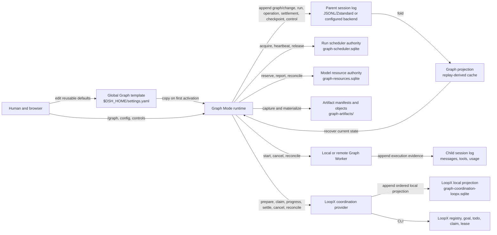
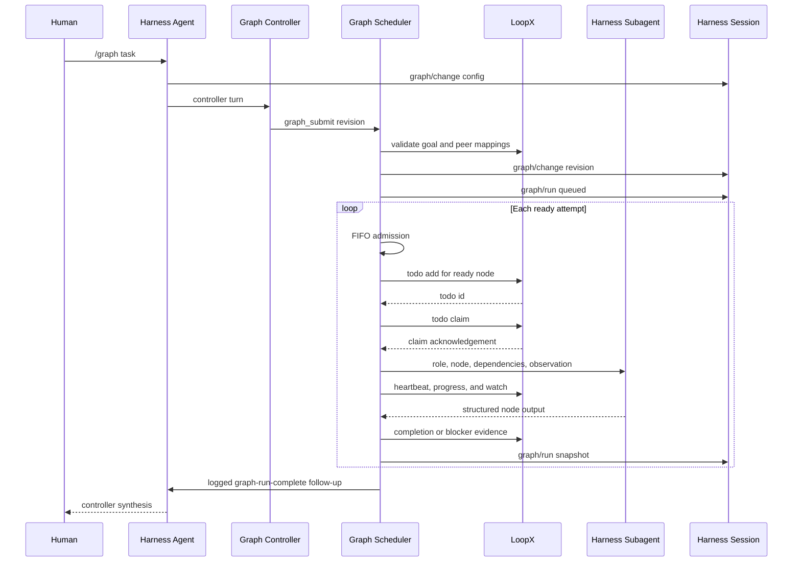
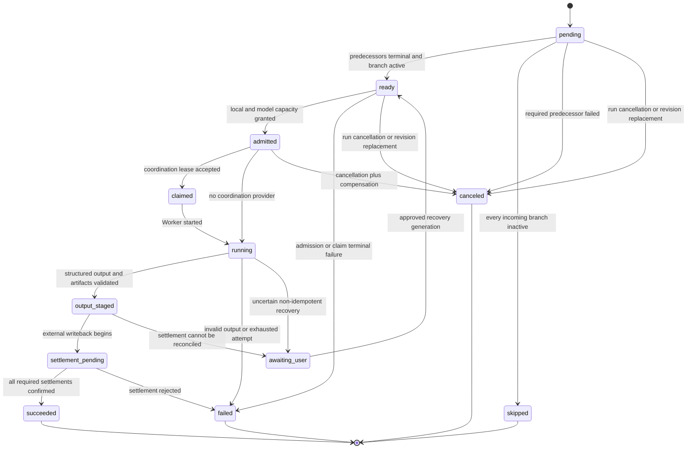
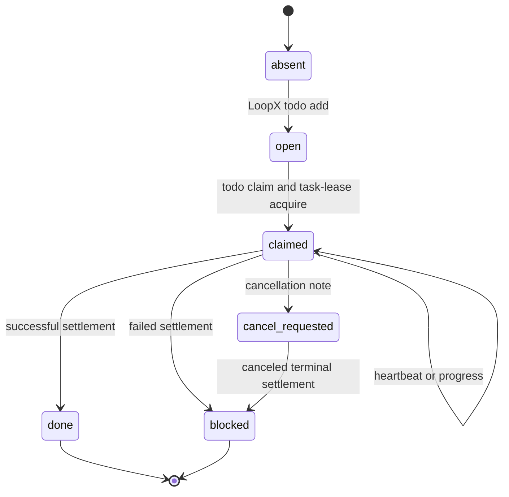
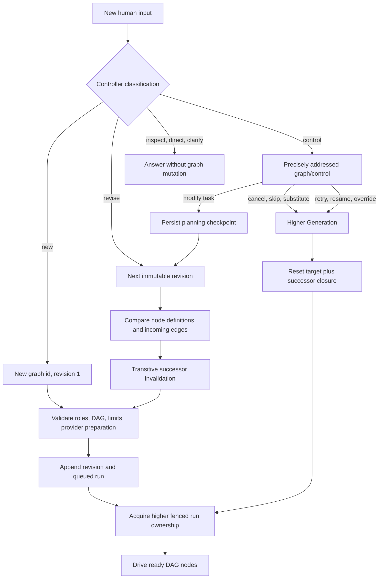
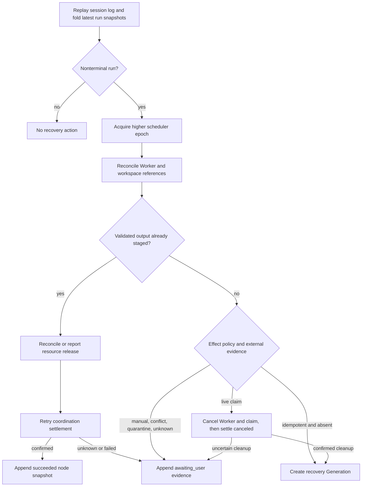

# Harness and LoopX Graph Integration

English | [中文](loopx-graph-integration.zh.md)

This reference explains how DeepSeek Harness Graph Mode uses LoopX as an optional external coordination control plane. It covers runtime ownership, durable state, scheduling, the CLI lifecycle, coupling, failure behavior, and recovery limits. The [Graph and LoopX durable project control plane](../.agents/notes/proposed/feature/2026-08-18-graph-loopx-durable-project-control-plane.md) and its linked designs are the approved formal target; this reference distinguishes the shipped foundation from the distributed guarantees that still require evidence. For the repository-wide plugin composition, agent loop, session log, and capability model, start with [the architecture map](architecture.md); package-level configuration and model-visible behavior remain in the [`dsh-graph-mode`](../packages/graph/graph-mode/README.md) and [`dsh-graph-coordination-loopx`](../packages/graph/graph-coordination-loopx/README.md) READMEs.

## System boundary

Harness owns the execution plane: model requests, tools, permissions, subagents, raw transcripts, child sessions, DAG scheduling, admission, and durable graph-run evidence. LoopX owns project-level control state: goals, todos, registered peer identities, claims, blockers, and compact public-safe evidence. Graph Mode connects the two without making either state store a replica of the other.

```text
human input
  -> Harness agent loop
  -> Graph Mode controller
  -> immutable graph revision
  -> bounded DAG scheduler
       -> optional GraphCoordination provider
             -> LoopX goal / todo / claim
       -> Harness subagent
       -> structured node output
       -> LoopX settlement
  -> durable Harness run snapshot
  -> controller synthesis
```

The ownership rule is strict: Harness session events remain authoritative for what a model saw and what an agent executed, while LoopX state remains authoritative for shared todo progress, peer claims, and blockers. Only bounded public-safe coordination summaries cross between them; raw prompts, credentials, private paths, tool output, and child transcripts stay in Harness sessions.

| Concern | Authority | Durable representation |
|---|---|---|
| Model messages and tool activity | Harness | Session events and child sessions |
| Graph definitions and revisions | Harness | `graph/change` events |
| Node and run lifecycle | Harness | Initial `graph/run` checkpoints plus incremental `graph/run-update` events |
| Goal and todo lifecycle | LoopX | Selected LoopX registry and goal state |
| Peer identity and claim | LoopX | Registered agent id and todo claim |
| Cross-agent progress sharing | LoopX | Todo status, claim, and public-safe evidence |
| Browser graph view | Harness | `graph` session projection |
| Cross-system evidence | Both, with distinct ownership | Harness output plus public-safe LoopX summary |

### Authority and persistence topology

The following diagram distinguishes authoritative records from caches and execution references. An arrow labelled `append` is a durable Harness session event; an arrow labelled `CLI` changes the independent LoopX authority. None of the SQLite databases below replaces the session log or LoopX registry.



| State or reference | Writer | Reader and recovery use | Atomicity boundary |
|---|---|---|---|
| Global `graph-mode` template | Host settings provider | First activation of a new session and Plugins settings UI | One revision-fenced settings document write |
| Session Graph configuration and immutable revisions | Graph Mode command/controller | Projection, scheduler, UI, replay | One `graph/change` append |
| Whole run and node state | Graph Mode scheduler | Projection, UI, startup recovery, controller follow-up | One `graph/run` checkpoint per generation; later `graph/run-update` events merge by run id |
| Operation, settlement, checkpoint, and control evidence | Graph Mode scheduler/control service | Recovery and audit | One session-event append per record |
| Worker transcript and tool evidence | Agent loop in the child session | Child-session UI, Graph progress monitor, replay | Child session append stream |
| Scheduler lease | Scheduler Provider | Competing Hosts and recovery | Provider transaction; referenced by `ownerEpoch` in Graph state |
| Model reservation and telemetry | Resource Provider | Admission and recovery | Provider transaction; opaque reference copied into Graph operations |
| Artifact manifest and objects | Artifact Provider | Materialization, downstream reconciliation, recovery | Provider publication; manifest reference copied into the attempt |
| LoopX todo, claim, lease, and terminal state | LoopX CLI | Peers and coordination reconciliation | One LoopX command at a time; independent of Harness persistence |
| LoopX local cursor journal | LoopX coordination provider | Process restart, cursor replay, idempotent local delivery | One local SQLite transaction after a successful external command |

The session persistence service uses bounded asynchronous write-behind. `session.append` changes the live session immediately, but durability is not established until its persistence batch completes or `ctx.sessions.flush(session)` succeeds. This distinction matters before every external claim, Worker dispatch, artifact publication, and settlement.

### Physical-store inventory

| Store | Default location in the Web composition | Durable contents | Identity and restart behavior |
|---|---|---|---|
| Parent and child session logs | `$DSH_HOME/sessions/<encoded-project>/<session>/session.jsonl.zstd` | Session header and all typed events, including six Graph event types | Session id plus append sequence; compressed complete frames survive replay and a torn tail follows the session-persistence repair rules |
| Global settings | `$DSH_HOME/settings.yaml` | Namespaced user settings, including the `graph-mode` role template | Namespace revision prevents lost concurrent updates |
| Graph Scheduler SQLite | `.sessions/graph-scheduler.sqlite` | `graph_scheduler_runs`, `graph_scheduler_leases`, provider metadata | Run id, fencing token, owner, and expiry; strict application id and schema version |
| Graph Resource SQLite | `.sessions/graph-resources.sqlite` | Reservations, outcomes, route state, provider metadata | Provider/model route, work id, fencing token, expiry, and deduplicated outcome |
| Graph Artifact filesystem | `.sessions/graph-artifacts` | Content-addressed objects and attempt-attributed manifests | Digest plus Work/Operation/Attempt/Run/Generation/Owner identities |
| LoopX coordination journal | `.sessions/graph-coordination-loopx.sqlite` | Activation state, ordered events, progress rows, Claim/owner/cancel/terminal JSON | Goal id plus physical Activation id; cursor continuity and schema version validated at open |
| Remote Worker server journal | `.sessions/graph-worker-http.sqlite` when that deployment mounts it | Logical jobs, service epochs, retained artifact mappings | Authenticated job id, provider reference, service epoch, terminal/quarantine outcome |
| LoopX authority | Deployment-selected LoopX registry and goal storage | Goal, Todo, Claim, hard task Lease, Evidence, terminal status | LoopX ids and Lease version; Harness accesses it only through CLI operations |

The Web bundle uses relative `.sessions` paths anchored to the Host working directory for Graph side stores, while session logs and global settings use the Harness home. A deployment patch can replace every Provider or path; the durable references in Graph events remain opaque and must not expose those Host paths to models.

## Harness execution foundation

Harness runs as a Cordis plugin tree. Plugins contribute services, typed events, prompt sections, tools, and reversible registrations to a shared context. Profiles and bundles assemble that tree at boot, and later patch layers can replace any configured row. The Web bundle mounts the graph domain, Graph Mode, and the graph UI, but ships the LoopX provider row disabled because a goal id and peer roster belong to a deployment rather than to the distribution.

The default agent loop treats a step as one model request plus its tool calls and a turn as zero or more steps. Input enters one inbox, `agent/pre-step` decides which claimed messages enter the next request, prompt sections and tool schemas are assembled, `agent/request` selects the model route, streamed chunks and the assistant message are logged, and tool calls pass through the guarded tools pipeline. Graph Mode uses those extension points; it does not add a DAG branch to the default loop.

```text
turn/start
  claim next-step input
  agent/pre-step
  step/start
  user/message
  system-prompt/assemble
  agent/request -> llm/stream -> assistant/*
  tool/call -> tools/* -> tool/result
  step/end
  agent/turn-stopping
turn/end
```

The session log is the source from which Harness reconstructs model history. Graph configuration, revisions, runs, completion follow-ups, worker prompts, and worker results therefore enter model-visible paths through logged events or child sessions. The graph invariant independently folds loaded and newly appended events before publication, so invalid graph state cannot become an accepted projection merely because one consumer skipped validation.

## Graph Mode components

| Package | Responsibility | Runtime dependency |
|---|---|---|
| [`dsh-graph`](../packages/graph/graph/README.md) | Branded ids, versioned configuration, immutable revisions, run snapshots, validation, invalidation, and projection | Session and optional projection registry |
| [`dsh-graph-mode`](../packages/graph/graph-mode/README.md) | `/graph`, controller policy, `graph_submit`, admission, DAG scheduling, and subagent dispatch | Tools, system prompt, commands, and subagents |
| [`dsh-graph-scheduler`](../packages/graph/graph-scheduler/README.md) | Provider-neutral exclusive ownership for one Graph run | Cordis service container |
| [`dsh-graph-scheduler-sqlite`](../packages/graph/graph-scheduler-sqlite/README.md) | Durable same-filesystem run leases, heartbeats, and fencing | SQLite database file |
| [`dsh-graph-coordination`](../packages/graph/graph-coordination/README.md) | Provider-neutral eight-operation coordination and reconciliation service definition | Cordis service container |
| [`dsh-graph-coordination-loopx`](../packages/graph/graph-coordination-loopx/README.md) | LoopX CLI implementation plus durable local event projection | Subprocess runtime, LoopX executable, and SQLite database file |
| [`dsh-graph-worker`](../packages/graph/graph-worker/README.md) | Provider-neutral fenced Worker assignment and reconciliation | Cordis service container |
| [`dsh-graph-worker-local`](../packages/graph/graph-worker-local/README.md) and [`dsh-graph-worker-remote`](../packages/graph/graph-worker-remote/README.md) | Isolated-copy local execution and remote subagent transport | Subagent service and deployment transport |
| [`dsh-graph-artifacts`](../packages/graph/graph-artifacts/README.md) and [`dsh-graph-artifacts-fs`](../packages/graph/graph-artifacts-fs/README.md) | Attempt-attributed manifests and content-addressed filesystem transport | Artifact store |
| [`dsh-graph-resources`](../packages/graph/graph-resources/README.md) | Provider-neutral model telemetry, reservations, and outcomes | Cordis service container |
| [`dsh-graph-resources-sqlite`](../packages/graph/graph-resources-sqlite/README.md) | Durable same-filesystem model-route reservations, fencing, and runtime backoff | SQLite database file |
| [`dsh-client-ui-graph`](../packages/client/ui-graph/README.md) | Browser projection, DAG canvas, evidence navigation, and settings | Client session, commands, model directory, and slots |

`dsh-graph` declares nine durable session event types. `graph/submission` records a provisional immutable Revision and queued Run before external admission; only an accepted submission publishes `graph/change` and the initial `graph/run`. Append-only `graph/run-update`, `graph/operation`, and `graph/settlement` events preserve incremental run state, execution transitions, and numbered external-write attempts, while whole-state `graph/checkpoint` and idempotent `graph/control` records preserve planning and human decisions. Folding events keeps all revisions and evidence, merges validated updates into each run, and exposes the result through the `graph` projection.

The configuration contains exactly one enabled controller, editable worker roles, per-role prompts and model selections, and scheduler limits. A graph revision contains a stable graph id, a contiguous revision number, a parent revision after revision one, nodes, and edges. A run contains every node in that revision, attempt metadata, structured outputs, reuse provenance, invalidation sources, and an optional terminal error.

The append-only operation journal uses the complete ordered stage vocabulary below. A transition also retains its stable operation and event ids, logical work id, generation, owner epoch, expected previous stage, external references, output hash, terminal outcome, and bounded detail.

| Operation stage | Durable meaning |
|---|---|
| `planned` | The logical node operation exists before external admission. |
| `admitted` | Local and optional model-resource capacity is reserved. |
| `claimed` | The coordination Provider accepted the fenced activation. |
| `started` | A Worker assignment has been dispatched. |
| `progress` | Bounded Worker or coordination progress was observed. |
| `output-staged` | Structured output is durable before external writeback. |
| `settlement-pending` | At least one numbered external settlement is outstanding. |
| `reconciled` | Recovery compared durable Harness evidence with an external Provider. |
| `terminal` | The physical operation has one retained terminal outcome. |

Settlement records use the kinds `coordination`, `resource-release`, `artifact`, `cancellation`, and `compensation`, and the outcomes `pending`, `confirmed`, `failed`, and `conflict`. External references use the kinds `coordination`, `worker`, `workspace`, `model`, `child-session`, and `artifact`. These closed vocabularies are validated at the session-log parser rather than inferred from diagnostic text.

The durable control vocabulary is `pause-run`, `modify-task`, `cancel-run`, `cancel-node`, `skip-node`, `retry-node`, `resume-from-node`, `override-node`, `supply-output`, `rollback`, `approve-checkpoint`, `reject-checkpoint`, and `reconcile-run`. Every record identifies the observed revision and generation, optionally fences one attempt or checkpoint, retains the actor and source, and records applied/no-op impact. A repeated operation id must reproduce the same fingerprint; reusing it for different input is rejected.

## Controller behavior

`/graph` appends an active configuration and registers `graph_submit` in the current agent scope. Graph Mode contributes a controller-only prompt section and wraps prompt assembly and `agent/request` so the configured controller provider, model, and reasoning selector route the parent request while the mode is active.

The controller classifies every human input as `new`, `revise`, `inspect`, `control`, `clarify`, or `direct`. `new` and `revise` submit one semantic graph draft through `graph_submit`; Graph Mode resolves session-owned defaults and persists the complete immutable revision. The other classifications must not carry a graph. A completion follow-up whose body starts with `[graph-run-complete]` is execution evidence for synthesis and does not require another graph submission.

Graph validation rejects blank or unsafe ids, duplicate roles or nodes, missing acceptance criteria, disabled or controller role assignments, invalid attempt or weight policies, missing edge endpoints, self-edges, duplicate edges, malformed conditions, and cycles. Revision one has no parent; every later revision names the immediately preceding revision. Conditions are data, not code: they inspect a predecessor's published JSON through a path and one of `exists`, `truthy`, `equals`, or `not-equals`.

For a revision, Graph Mode derives directly changed nodes from declared changes, changed node definitions, changed incoming edges, and successors of removed nodes. It then computes the complete transitive successor closure in topological order. Nodes in that closure rerun; an unaffected successful node may reuse its output only with explicit `reusedFrom` provenance. If the preceding revision still runs, the controller aborts and awaits it before starting the replacement run.

## Scheduler and worker execution

The scheduler runs outside the controller tool call, so the conversation remains interactive while nodes execute. Before publishing a new run or recovering a nonterminal one, Graph Mode asks the optional Graph Scheduler Provider for exclusive ownership. Its fencing token becomes the run `ownerEpoch`; Graph Mode renews the lease while driving the DAG, aborts execution if renewal fails, and releases the exact lease identity after the run stops. This whole-run lease prevents two local Host processes from advancing the same durable run and remains separate from the node-level LoopX claim. The Web composition uses SQLite for processes sharing one session directory; independent Hosts require an authenticated distributed Provider.

A pending node waits until all predecessors are terminal. A failed required predecessor cancels dependent work. Conditional edges are evaluated against predecessor output data; a node whose incoming edges all become inactive is skipped. Every other eligible node becomes ready.

Ready nodes enter a FIFO admission queue. Admission simultaneously enforces the worker share of the global cap, the role cap, an exact provider/model cap, an optional model weight budget, and `maxActiveSubagents`. The last limit counts live Graph Workers plus their in-process descendants under one Run-scoped capacity id. Top-level Workers wait in FIFO order, while an over-cap nested start fails with `CAPACITY_EXHAUSTED` so a limit of one cannot deadlock behind the parent holding the sole permit. The controller must respond by decomposing large work into dependency-ordered, model-sized Graph nodes instead of retrying recursive fan-out. The worker share is `globalMaxParallel - controllerReserve`; the reserve prevents worker saturation from consuming the configured controller capacity. Role model fields inherit the parent agent's provider, model, and reasoning selector before admission and child dispatch when the role omits them.

Each admitted attempt follows one lifecycle:

1. Acquire one idempotently releasable admission permit.
2. Ask the optional resource provider for a fenced reservation beneath the static role and model ceilings; persist typed wait evidence when capacity is unavailable.
3. Ask the optional coordination provider to claim the node and return a leased fresh observation.
4. Append a running attempt snapshot and start the selected Graph Worker Provider with the frozen role, model, workspace, schema, deadline, and fencing identity.
5. Record worker, workspace, child-session, continuation-session, resource, and artifact references as they become available; publish bounded progress and watch the claim cursor while the Worker runs.
6. Require a completed worker result, validate its structured output, and persist that output before any external settlement.
7. Confirm resource release and public-safe coordination settlement under stable ids and numbered retry attempts.
8. Append the terminal node snapshot and release the local permit.

Worker output contains a required summary and artifact list, optional JSON data for downstream conditions, and an optional `coordinationSummary`. The coordination summary is normalized, limited to 2,000 characters, and explicitly excludes credentials, private paths, and hidden reasoning. Detailed evidence remains in the child session named by the attempt.

When no active work remains, a run succeeds only if every node succeeded or was skipped; otherwise it fails with durable terminal evidence. A non-canceled run enqueues a logged `[graph-run-complete]` follow-up containing its identity, phase, available node summaries, and any run-level error code, message, and node id so the controller can synthesize the recorded result in a normal turn.

## LoopX control model

LoopX acts as a long-horizon project control plane. Its durable control model includes the registry, active goal state, run reports and compact history, first-screen status and attention, and compute quota. A goal provides stable project identity and authority context; todos describe bounded work; registered agents are peer identities; claims name the peer responsible for one todo; completion or blocker evidence advances shared project state.

Harness uses only the goal, todo, claim, lease, heartbeat, observation, progress, cancellation, settlement, and reconciliation lifecycle needed for Graph Worker progress sharing. It does not ask LoopX to run a model, launch a child, execute a tool, store a transcript, schedule the DAG, or admit model resources. LoopX quota, vision, scheduler, and worktree policies therefore do not gate a session-local Graph node. Graph admission remains authoritative for controller reservation and global, role, model, weighted, workspace, and live-resource limits.

The deployment binds one existing LoopX goal and maps every graph role used by a revision to a pre-registered LoopX peer id. Harness deliberately does not create goals or invent peers. This keeps external identity and authority under the selected LoopX registry and makes missing bindings fail before worker execution.

## Coordination service

The provider-neutral service has eight operations:

| Operation | Timing | Required result |
|---|---|---|
| `prepare(graph, roles, cwd, signal)` | Before the revision and initial run are appended | The configured goal is readable and every role has a peer mapping |
| `claim(request, signal)` | After admission and before worker start | Work-item id, claim id, lease id, fencing token, expiry, and one bounded fresh observation |
| `heartbeat(request, signal)` | While the worker owns the claim | Renewed expiry, unchanged fencing token, progress cursor, and cancellation state |
| `observe` / `watch` | For inspection or bounded waiting without ownership | Ordered public-safe events after the requested cursor |
| `publishProgress(request, signal)` | While a fenced claim is live | Cursor of the bounded public-safe progress event |
| `settle(request, signal)` | After durable validated output or terminal attempt failure | Idempotent completion or blocker evidence under a stable settlement id |
| `cancel(request, signal)` | For an addressed live claim | Durable cooperative cancellation request |
| `reconcile(request, signal)` | After restart or uncertain transport outcome | Confirmed running, confirmed terminal, absent, conflict, or unknown evidence |

`prepare` makes external identity availability part of graph submission when a provider is mounted. The LoopX implementation validates that every node uses an enabled role with a configured peer and reads the configured goal with `todo list`. It does not create work for nodes that may never become ready.

The LoopX Provider writes an ordered SQLite projection after each successful external claim, lease renewal, progress update, cancellation, or settlement. A cursor is an ordinal under one stable Activation id; a stable event key makes repeated delivery return the original cursor. Startup validates stored JSON, cursor continuity, and the one-to-one relation between progress records and events before exposing any state. The first observation after recovery refreshes tagged LoopX evidence, so the latest progress, cancellation, or settlement can be projected when LoopX accepted it but the process stopped before the SQLite transaction. The full SQLite audit remains queryable while the runtime keeps a bounded suffix and returns `compacted: true` to a reader whose cursor precedes it. `watch` retries LoopX read failures only within configured attempt, delay, operation-deadline, and caller-cancellation limits. LoopX remains authoritative for external coordination and reconciliation records a conflict instead of treating the projection as a distributed transaction log.

Task kinds map to LoopX action kinds as follows:

| Graph task kind | LoopX action kind |
|---|---|
| `verification` | `validate` |
| `review` | `validate` |
| `documentation` | `writeback` |
| `implementation` | `rebuild` |
| All other kinds | `run_eval` |

After local admission, `claim` lazily creates one public-safe todo for the ready node and caches its id under working directory, graph id, revision, and node id. A repeated claim in the same process reuses that mapping. Todo creation has this semantic form:

```sh
loopx --format json todo add \
  --goal-id <goal-id> \
  --role agent \
  --task-class advancement_task \
  --action-kind <action-kind> \
  --text "[dsh-activation:<activation-id>] [dsh-work:<work-id>] graph <graph-id> revision <revision> node <node-id> role <role-id>"
```

The provider then claims the todo with the configured peer:

```sh
loopx --format json todo claim \
  --goal-id <goal-id> \
  --todo-id <todo-id> \
  --claimed-by <agent-id> \
  --agent-id <agent-id>
```

The claim must confirm the requested peer or report an unchanged existing claim. The provider returns an observation encoded as `dsh-loopx-observation-v1` with only the goal id, todo id, agent id, status, claimed peer, task class, and action kind. The serialized observation is truncated to 8,000 characters before it enters the worker prompt.

The todo claim is only the public assignment. A hard task lease supplies the fencing version used by every subsequent mutation. Heartbeat renews that exact version; observation inspects it; progress and cancellation append tagged public-safe notes; failure settlement releases it after marking the todo blocked.

```sh
loopx --format json task-lease acquire --goal-id <goal-id> --todo-id <todo-id> \
  --owner <agent-id> --idempotency-key <operation-id> --ttl-seconds <seconds> \
  --write-scope <scope>
loopx --format json task-lease renew --goal-id <goal-id> --todo-id <todo-id> \
  --owner <agent-id> --idempotency-key <operation-id> --ttl-seconds <seconds> \
  --expected-version <fencing-token>
loopx --format json task-lease inspect --goal-id <goal-id> --todo-id <todo-id>
loopx --format json todo update --goal-id <goal-id> --todo-id <todo-id> \
  --agent-id <agent-id> --note "[dsh-progress:<sequence>] <evidence>"
loopx --format json evidence-log --goal-id <goal-id> --agent-id <agent-id> \
  --todo-id <todo-id> --limit 24 --thin
loopx --format json todo update --goal-id <goal-id> --todo-id <todo-id> \
  --agent-id <agent-id> --note "[dsh-cancel-request:<sequence>] <reason>"
loopx --format json task-lease release --goal-id <goal-id> --todo-id <todo-id> \
  --owner <agent-id> --idempotency-key <operation-id> \
  --expected-version <fencing-token>
```

Successful settlement completes the todo with public-safe evidence and suppresses automatic follow-up creation:

```sh
loopx --format json todo complete \
  --goal-id <goal-id> \
  --todo-id <todo-id> \
  --agent-id <agent-id> \
  --evidence <public-safe-evidence> \
  --no-follow-up \
  --task-lease-idempotency-key <operation-id> \
  --task-lease-expected-version <fencing-token>
```

Terminal failure updates the todo to a blocker:

```sh
loopx --format json todo update \
  --goal-id <goal-id> \
  --todo-id <todo-id> \
  --agent-id <agent-id> \
  --status blocked \
  --task-class blocker \
  --reason <public-safe-evidence>
```

## End-to-end sequence



### Node, operation, and external-work states

The run snapshot is the user-facing state, while the operation journal records the side-effect transition that justifies it. The normal path is shown below; dotted transitions are recovery or failure paths.





`workId` identifies stable logical lineage across Generations. Each Generation derives a distinct `activationId` for claim, lease, progress, cancellation, observation, and terminal settlement. A terminal LoopX Todo therefore remains immutable, while a retry creates and claims a separate Todo without losing the relation to the original logical work.

### Revision and operator-control flow



Historical revisions and run snapshots never change. A new global role template affects only a later session's first activation; a session-level configuration replacement affects later revisions in that session but never rewrites a run's frozen `configSnapshot`.

## Process and transport behavior

The LoopX provider supports per-operation processes and a persistent stdio broker. Persistent transport starts one launcher process for the Provider lifetime and sends versioned requests over its piped stdin and stdout. The broker serializes LoopX CLI children, applies each operation's deadline, cancellation, termination grace, and output limits independently, and stops all owned children during disposal. An unexpected broker exit rejects in-flight operations; a later call starts a fresh broker without replaying an uncertain mutation. The default limits retain at most 8 MiB of stdout and 1 MiB of stderr, and a successful response requires exit code zero plus one JSON object on stdout.

`pathStyle: wsl` converts configured Windows drive paths to `/mnt/<drive>/...` for the Registry and operation working directories. With persistent transport, `executable` and `executableArgs` start the WSL execution environment, while `brokerPythonExecutable` and `brokerCommand` name Python and LoopX inside it.

```yaml
- id: graph-coordination-loopx
  disabled: false
  config:
    goalId: my-project-goal
    roleAgents:
      analyst: analyst-peer
      architect: architect-peer
      engineer: engineer-peer
      reviewer: reviewer-peer
      verifier: verifier-peer
      writer: writer-peer
    executable: wsl.exe
    executableArgs: [-d, Ubuntu, --exec]
    transport: persistent
    brokerPythonExecutable: python3
    brokerCommand: /root/.local/bin/loopx
    pathStyle: wsl
    registry: D:\project\.loopx\registry.json
    graceMs: 10000
```

The goal and every mapped peer must already exist in that registry. A deployment can inspect the final Cordis tree with `dsh --profile web --dump-config`; enabling the provider does not by itself create or validate deployment identities until the provider is constructed and a graph is prepared.

## Failure and cancellation

| Failure point | Harness result | LoopX result |
|---|---|---|
| Missing goal id or empty peer roster | Provider construction fails | No mutation |
| Missing role-to-peer binding | Graph preparation fails | No todo is created |
| CLI resolution, exit, or JSON failure during prepare | Graph submission fails before revision append | No todo is created |
| Todo creation fails for a ready node | Claim fails and the run records terminal coordination failure | Other nodes have no speculative todo unless they were already ready and claimed |
| Claim acknowledgement names another peer | Claim fails | Existing LoopX claim remains authoritative |
| Child stops or returns invalid output | Attempt fails and may retry within `maxAttempts` | No success settlement; final exhaustion attempts blocker writeback |
| Success settlement fails | Node fails with validated output and writeback error retained | Partial CLI operations may already be durable |
| Final blocker writeback fails | Node remains failed and Harness logs the writeback error | LoopX may lack the blocker evidence |
| Revision supersedes an active run | Old run requests coordination cancellation, aborts its Worker, and is awaited before replacement execution | Claimed external work receives a durable cancellation request and later terminal settlement |
| Graph Mode plugin unloads | Background run signals are aborted | In-flight subprocess receives cancellation |
| Host restarts | A higher owner epoch reconciles staged output, settlements, and safe retry policy | Graph-tagged LoopX work is rediscovered and compared with durable claim and fencing references |

Coordination claim failure occurs before a child attempt is published. Graph Mode records a run-level error with the node id and cancels other nonterminal nodes as the run converges. A child execution failure is attempt-local until its retry ceiling is reached. Success writeback failure is terminal for that node because Harness cannot claim coordinated success when LoopX did not accept the settlement.

## Coupling analysis

The architectural coupling is low. The graph domain does not import LoopX, Graph Mode obtains `ctx.graphCoordination` optionally, the scheduler runs without a provider, the Web bundle disables the LoopX row by default, and another provider can implement the same eight operations. The default agent loop remains unaware of Graph Mode and LoopX.

The operational coupling is explicit and stronger. The LoopX provider depends on the CLI command names, argument semantics, JSON fields such as `todo_id`, `status`, `claimed_by`, `task_class`, and `action_kind`, and deployment-owned goal and peer identities. A LoopX CLI protocol change therefore requires a provider update even though no graph-domain change is necessary.

The durable graph type currently stores `loopxClaimId` directly on an attempt, and Graph Mode has provider-specific LoopX wording in some diagnostics. Those names couple provider identity into otherwise provider-neutral state. A neutral coordination reference containing provider name, work-item id, and claim id would allow another provider to retain equivalent durable evidence without adding another field.

The storage coupling is reference-based rather than transactional. Harness stores the graph, run, operation journal, child session, structured output, external references, and settlement records; LoopX stores the goal, todo, claim, lease, progress, and compact settlement evidence. There is no distributed transaction across the two event stores. Stable Graph work tags let the provider rediscover an existing todo, and reconciliation records conflicts instead of overwriting either ledger.

| Coupling dimension | Strength | Reason |
|---|---|---|
| Agent-loop coupling | Low | Graph Mode uses documented prompt, request, command, tool, session, and subagent extension points |
| Graph-domain coupling | Low to medium | Coordination is optional, but attempt state names a LoopX claim directly |
| Runtime service coupling | Low | One provider-neutral service with eight operations |
| CLI protocol coupling | High | Commands, flags, order, exit behavior, and JSON fields are provider contracts |
| Identity coupling | High and intentional | Goal and peer ids must match one external registry |
| Data coupling | Medium | Public-safe summaries and ids cross stores; raw execution data does not |
| Recovery coupling | High | Resumption requires reconciling durable Harness runs with durable LoopX todos |

## Privacy and model-visible data

The coordination service accepts only evidence safe for the external control plane. A worker receives at most one compact LoopX observation per attempt. On success, Graph Mode sends `coordinationSummary` when present; otherwise it sends a generic statement that detailed evidence remains in the child session. It never forwards the complete structured output or transcript by default.

The observation and coordination summary are model-visible and attempt-specific. The stable role prompt may form a reusable model prefix, while the node objective, predecessor outputs, and compact claim metadata vary per attempt. This makes LoopX context a variable suffix rather than durable shared prompt material.

## Browser projection and control

The graph UI appears only while the projected configuration is active. It separates a controller-authored Design canvas from the selected run's Execution canvas and record table, and displays node phase, timing, effective model and Worker, output, artifacts, attempts, terminal errors, LoopX claim ids, and links to authoritative child sessions. Precisely addressed controls cover task modification through a new controller-authored revision, cancellation, retry, resume, skip, approval/rejection, execution overrides, reconciliation, and rollback. A Graph attempt's primary and continuation child-session pages expose their effective route, parent navigation, and scheduler-owned cancellation using the exact revision, generation, and attempt identity. Its session settings panel reads the shared model directory and edits role prompts, model routes, reasoning selectors, and admission limits. The Plugins settings page exposes the same role fields as reusable `graph-mode` defaults, performs revision-fenced writes, and keeps a conflicting local draft until the user reloads.

The browser does not keep authoritative graph settings. Saving a session override executes `/graph config <JSON>` through the host command channel; the Host validates the complete replacement, appends `graph/change`, and the browser rerenders the resulting projection. A global template is copied and logged only on a session's first Graph activation. Existing sessions never consult later template revisions, so the same session event stream drives replay, recovery, API consumers, and UI state.

## Recovery and extension limits

Graph assigns stable work, operation, generation, settlement, and control ids and retains neutral external references with owner epochs and fencing tokens. Recovery acquires a higher run-owner epoch, reconciles Worker/workspace and model reservations, and attempts to finish staged-output settlements idempotently. When LoopX still reports a running claim after Worker reconciliation, Graph records a cooperative cancellation request and then a terminal canceled settlement with the original fenced lease identity. A confirmed cancellation request alone does not prove lease release. Absent idempotent work may retry, while manual, quarantined, conflicting, unknown, or failed cleanup moves to `awaiting_user`.



The recovery path keys external coordination by Generation-scoped Activation and addresses terminal settlement through the Todo id stored in the durable Claim. A reconstructed Provider can therefore settle staged output immediately, and a later Generation can claim a new Activation for the same logical work.

Recovery cannot prove arbitrary external effects that expose no idempotency key or reconciliation API. The local isolated-copy worker publishes bounded mutation evidence but does not integrate it into the source workspace. The authenticated HTTP Worker service quarantines uncertain jobs and reconciles retained Provider references, but it cannot resume a lost process or infer whether an external effect committed. Orphan cleanup across retained workspaces and artifacts remains policy-driven and must not delete untagged LoopX work or user files.

The worker, artifact, resource, and scheduler Service Definitions allow stricter Providers without changing the agent loop. The shipped HTTP Worker Client and Server authenticate bounded operations through credential references, persist logical job identity before dispatch, deduplicate retries, fence superseded service-process writes with a journal epoch, quarantine uncertain jobs on restart, and reconcile exact underlying Provider references. The same service can expose cross-Host Scheduler and Resource authorities plus bounded RPC Artifact transport with durable opaque reference mapping and end-to-end digest verification. The SQLite Resource Provider can consume expiring queue and device-memory snapshots atomically published by a trusted model runtime or sidecar. The filesystem Artifact Provider remains the content-addressed store behind the remote route or can serve processes and Hosts that share one authenticated mount. A deployment may add sandbox-backed workspaces, resumable remote processes, replicated high-availability authorities, object-store-scale transfer, model-server-specific metrics adapters, or a different coordination ledger while Graph retains the same durable identities and terminal rules.

## Flow verification and code-review matrix

This review traced each transition in three directions: forward from the user or recovery trigger to its side effect, backward from every durable record to the producer that can justify it, and across a process stop between the local append and the external operation. A flow is covered only when one test uses the real Service Definition semantics at every seam involved; a permissive fake that accepts states rejected by the production Provider does not cover that flow.

| Flow edge | Producer | Durable proof | Recovery consumer | Current evidence |
|---|---|---|---|---|
| Activate or replace session Graph configuration | Graph command and Graph Mode service | `graph/change` config | Graph projection | Package command/config tests |
| Submit immutable revision | `graph_submit` admission | `graph/change` revision | Projection and controller | Graph validation and controller tests |
| Establish whole-run ownership | Graph Mode plus Scheduler Provider | scheduler lease and run `ownerEpoch` | startup recovery | scheduler contract and SQLite tests |
| Plan a node operation | Graph Mode | `graph/operation` `planned` | operation projection | controller operation tests |
| Reserve model capacity | Graph Mode plus Resource Provider | resource reference in operation journal | resource reconciliation | resource provider contract tests |
| Claim public coordination work | Coordination Provider | LoopX todo/lease plus claim references and local journal event | observe/reconcile | coordination conformance and LoopX tests |
| Start Worker | Graph Mode plus Worker Provider | running attempt and worker/workspace references | Worker reconcile | local/remote Worker tests |
| Record model and tool execution | child agent loop | child session events | progress monitor and child UI | agent-loop and Graph Mode tests |
| Capture and stage output | Worker, Artifact Provider, Graph Mode | artifact manifest, `output-staged`, run output | staged-output recovery | artifact and controller tests |
| Release model reservation | Graph Mode plus Resource Provider | numbered `resource-release` settlement | settlement recovery | resource and controller tests |
| Settle LoopX work | Graph Mode plus Coordination Provider | LoopX terminal state, local journal event, numbered coordination settlement | coordination reconcile | provider tests; restart gap remains |
| Publish terminal node and run | Graph Mode | terminal operation and whole run snapshot | projection and UI | controller tests |
| Deliver controller synthesis input | Graph Mode | logged inbox follow-up | next parent turn | controller and snapshot tests |
| Apply retry or resume | serialized control service | `graph/control`, higher Generation, reconciled operations | scheduler | controller tests use a permissive coordination fake; real terminal seam is uncovered |

### Normal and exceptional paths

| Scenario | Expected convergence | Review result |
|---|---|---|
| No coordination, resource, artifact, or distributed scheduler Provider | Local Worker result alone drives a terminal run | Covered by Graph Mode controller tests |
| Fully configured local Web composition | Scheduler and resource leases, isolated artifacts, child sessions, and terminal snapshots converge | Package seams are covered independently; assembled restart coverage is incomplete |
| Conditional predecessor output | Active branch becomes ready; inactive-only node becomes skipped | Graph validation and branch tests cover deterministic predicates |
| Required predecessor failure | Successors cancel and run fails | Covered by controller dependency tests |
| Worker returns invalid structured output | Attempt fails; retry ceiling or planning checkpoint applies | Covered at Graph Mode output-validation seam |
| Model output or reasoning budget stops an Activation after a checkpoint | Same attempt continues from the latest checkpoint | Covered; checkpoint summaries are normalized after tail truncation |
| Host loses Scheduler heartbeat | Old Host loses write authority and leaves nonterminal state for a higher epoch | Covered at scheduler/controller seam |
| Host stops before Worker result | Recovery reconciles exact Worker/workspace references | Provider-specific tests exist; arbitrary external effects remain unprovable |
| Host stops after output staging but before coordination settlement | Recovery completes resource and coordination settlement | Covered through the durable claim's Todo reference |
| User cancels a running node | Worker and LoopX claim receive cancellation, cleanup settles, downstream nodes invalidate | Covered with bounded cleanup signals and recoverable pending settlement evidence |
| User retries a failed or completed node | New Generation reruns target and successors | Covered through a Generation-scoped coordination Activation |
| LoopX CLI hangs during settlement | Operation times out, remains retryable, and enters reconciliation | Covered by the Provider operation deadline; unrelated Activations settle independently |
| Session persistence fails or the Host stops immediately before an external effect | External state does not exist without a recoverable Harness intent record | Covered by `graph/submission`, operation/settlement intents, and explicit flush barriers |
| Timer setting exceeds the Node timer range | Configuration rejects before scheduling | Covered: millisecond fields are capped at `2_147_483_647` |

### Implemented recovery safeguards

Logical `workId` values express lineage across retry and invalidation. `activationId` values key coordination state for one physical Generation, so a terminal Activation never prevents a later Generation from claiming the same logical work. A pending `graph/submission` is flushed before Scheduler acquisition or coordination preparation; only a submission that owns the run publishes its Revision and queued Run. Resource admission, coordination claim, Worker dispatch, artifact materialization, cancellation, and settlement each follow a flushed durable intent or accepted reference. LoopX schema version 2 keys its journal by Activation, restores settlement through the durable Claim Todo id, bounds every CLI operation, and serializes terminal writes per Activation. Graph Mode tests execute retry through `MemoryGraphCoordination`, while LoopX tests cover reconstructed-provider settlement, timeout, and independent-Activation settlement.

### Completion criteria for the durable target

The durable target is met only when the following scenarios pass with process-stop injection at every numbered durable/external transition: first execution, conditional branching, worker failure, output-schema failure, retry, resume, downstream invalidation, cancellation, artifact conflict, Scheduler takeover, resource-release retry, LoopX success and blocker settlement, staged-output restart, CLI timeout, local-journal loss, and session-persistence failure. Each scenario must prove both ledgers converge, no stale Worker or lease remains executable, a repeated operation is idempotent, and the browser projection is reconstructable from durable events alone.

## Source map

- [Architecture map](architecture.md) owns repository-wide composition, turn flow, session logging, Graph Mode placement, and capability extension points.
- [Graph package README](../packages/graph/graph/README.md) owns the durable domain contract and model experience.
- [Graph Mode README](../packages/graph/graph-mode/README.md) owns controller and scheduler behavior visible to consumers.
- [Graph Scheduler README](../packages/graph/graph-scheduler/README.md) owns whole-run lease identities, heartbeat, release, and fencing rules.
- [Coordination README](../packages/graph/graph-coordination/README.md) owns the provider-neutral data and privacy contract.
- [LoopX provider README](../packages/graph/graph-coordination-loopx/README.md) owns deployment configuration, CLI provider behavior, and observation limits.
- [Graph Worker README](../packages/graph/graph-worker/README.md) owns fenced assignment, workspace, artifact, cancellation, and terminal worker outcomes.
- [Graph Artifacts README](../packages/graph/graph-artifacts/README.md) owns manifests, content addressing, capture, materialization, and reconciliation.
- [Graph Resources README](../packages/graph/graph-resources/README.md) owns expiring model telemetry, reservations, wait reasons, and resource outcomes.
- [Session persistence README](../packages/session/session-persistence/README.md) owns asynchronous append coordination, flush barriers, lifecycle, and failure reporting.
- [SQLite persistence README](../packages/session/session-persistence-sqlite/README.md) owns the default session database, bounded history reads, legacy JSONL import, and crash-tail recovery.
- [Settings README](../packages/settings/settings/README.md) owns revision-fenced global template storage.
- [Web bundle patch](../packages/bundle/web-app/cordis.patch.yml) assembles the concrete Scheduler, Resource, Artifact, Worker, Graph Mode, and optional LoopX Provider rows.
- [Graph UI README](../packages/client/ui-graph/README.md) owns Design/Execution presentation, settings, evidence navigation, and precisely addressed controls.
- [Graph types](../packages/graph/graph/src/types.ts) declare durable ids, revisions, runs, attempts, outputs, and projection fields.
- [Graph validation and projection](../packages/graph/graph/src/index.ts) implement config, DAG, run, invalidation, and replay validation.
- [Graph Mode controller](../packages/graph/graph-mode/src/index.ts) implements prompt routing, submission, admission, scheduling, worker dispatch, and settlement.
- [LoopX provider](../packages/graph/graph-coordination-loopx/src/index.ts) implements CLI invocation, path translation, JSON handling, todo mapping, claims, and settlements.
- [Session Graph Mode Agent Note](../.agents/notes/implemented/feature/2026-08-17-session-graph-mode.md) owns the decision rationale, alternatives, verification obligations, and consequences.
