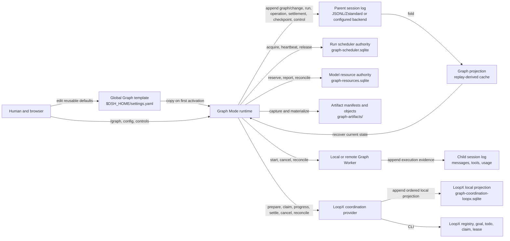
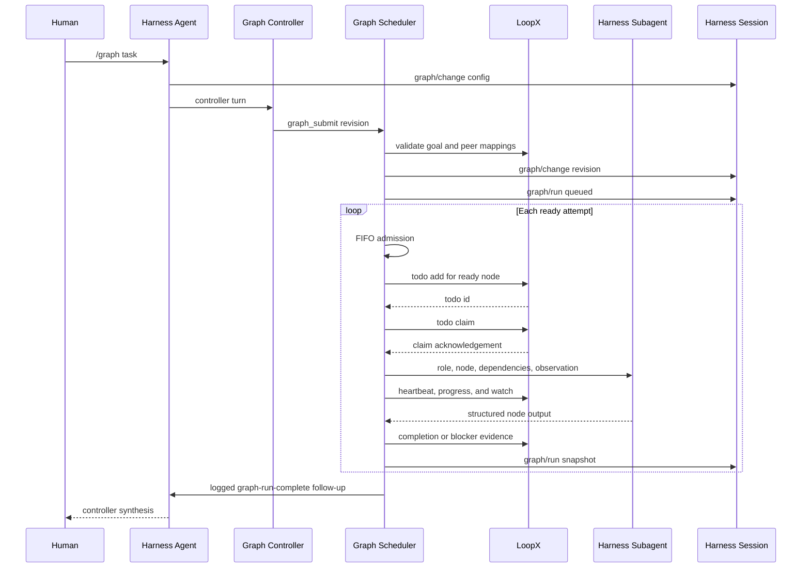
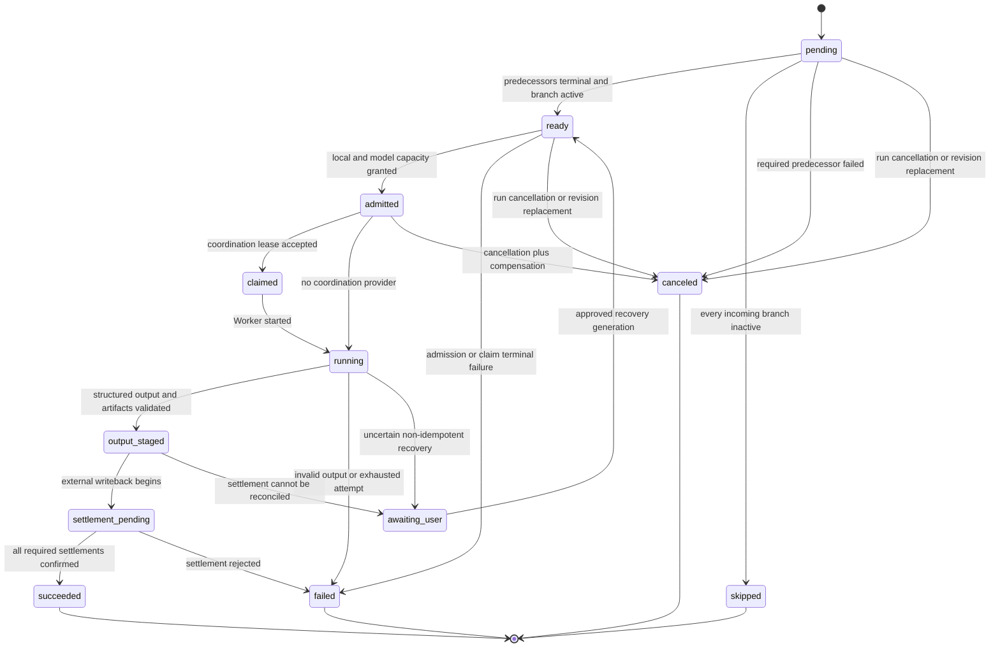
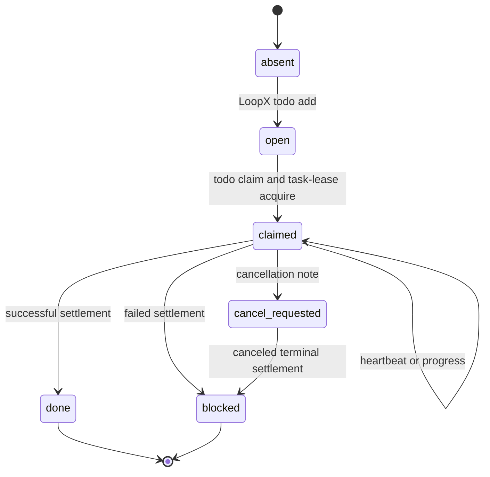
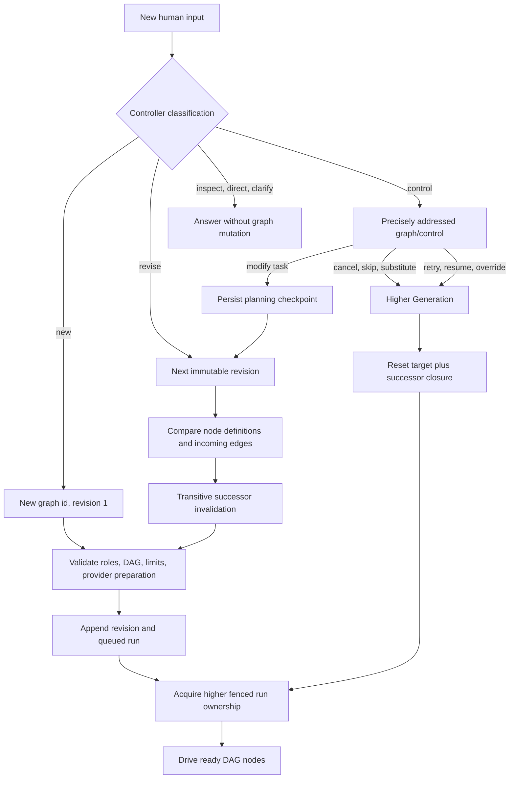
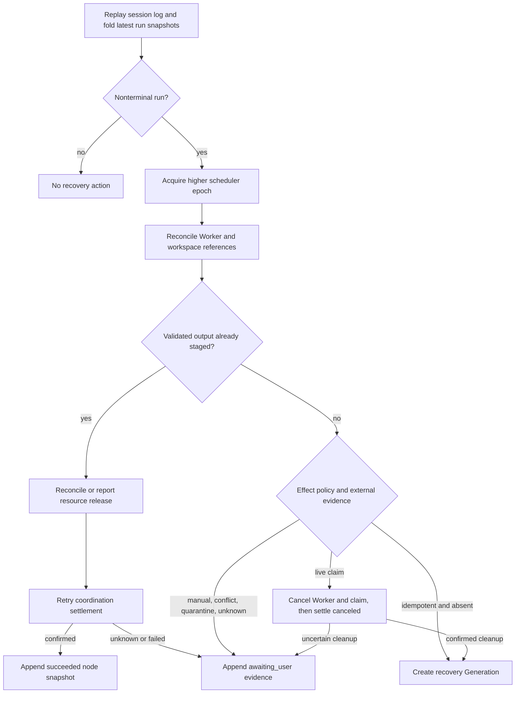

# Harness 与 LoopX Graph 集成

[English](loopx-graph-integration.md) | 中文

本文是 DeepSeek Harness Graph Mode 使用 LoopX 作为可选外部协调控制面的参考文档，说明运行时职责、持久状态、调度、CLI 生命周期、耦合、失败行为和恢复限制。[Graph 与 LoopX 持久化项目控制面](../.agents/notes/proposed/feature/2026-08-18-graph-loopx-durable-project-control-plane.zh.md)及其链接的设计是已经批准的正式目标；本文区分已经交付的基础与仍需证据的分布式保证。仓库级插件组合、agent loop、会话日志和能力模型见[架构总览](architecture.zh.md)；包级配置和模型可见行为仍由 [`dsh-graph-mode`](../packages/graph/graph-mode/README.zh.md) 与 [`dsh-graph-coordination-loopx`](../packages/graph/graph-coordination-loopx/README.zh.md) README 管理。

## 系统边界

Harness 管理执行平面：模型请求、工具、权限、子代理、原始 transcript、子会话、DAG 调度、准入和持久任务图运行证据。LoopX 管理项目级控制状态：goal、todo、已注册 peer 身份、claim、blocker 和紧凑的公开安全证据。Graph Mode 连接两者，但不会让任何一方的状态存储成为另一方的副本。

```text
human input
  -> Harness agent loop
  -> Graph Mode controller
  -> immutable graph revision
  -> bounded DAG scheduler
       -> optional GraphCoordination provider
             -> LoopX goal / todo / claim
       -> Harness subagent
       -> structured node output
       -> LoopX settlement
  -> durable Harness run snapshot
  -> controller synthesis
```

职责规则是严格的：Harness 会话事件是模型所见内容和 agent 实际执行行为的权威来源，LoopX 状态是共享 todo 进度、peer claim 和 blocker 的权威来源。双方只交换有长度限制的公开安全协调摘要；原始 prompt、凭据、私有路径、工具输出和子会话 transcript 均保留在 Harness 会话中。

| 事项 | 权威来源 | 持久表示 |
|---|---|---|
| 模型消息和工具活动 | Harness | 会话事件和子会话 |
| 任务图定义和修订 | Harness | `graph/change` 事件 |
| 节点与运行生命周期 | Harness | 完整 `graph/run` 快照 |
| Goal 与 todo 生命周期 | LoopX | 选定的 LoopX registry 和 goal 状态 |
| Peer 身份与 claim | LoopX | 已注册 agent id 和 todo claim |
| 跨 agent 进度共享 | LoopX | Todo 状态、claim 和公开安全证据 |
| 浏览器任务图 | Harness | `graph` 会话投影 |
| 跨系统证据 | 双方分别管理 | Harness 输出和公开安全 LoopX 摘要 |

### 权威状态与持久化拓扑

下图区分权威记录、缓存和执行引用。标为 `append` 的箭头表示持久 Harness 会话事件；标为 `CLI` 的箭头会修改独立的 LoopX 权威状态。下列 SQLite 数据库都不会替代会话日志或 LoopX 注册表。



| 状态或引用 | 写入者 | 读取与恢复用途 | 原子范围 |
|---|---|---|---|
| 全局 `graph-mode` 模板 | Host settings 提供方 | 新会话首次激活与插件设置 UI | 一次带 Revision 防护的 settings 文档写入 |
| 会话 Graph 配置与不可变 Revision | Graph Mode 命令／主控 | 投影、调度器、UI、重放 | 一次 `graph/change` append |
| 整体 Run 与节点状态 | Graph Mode 调度器 | 投影、UI、启动恢复、主控 follow-up | 一次 `graph/run` append；后续快照按 Run ID 替换 |
| Operation、Settlement、Checkpoint 与 Control 证据 | Graph Mode 调度器／控制服务 | 恢复与审计 | 每条记录一次会话事件 append |
| Worker 对话与工具证据 | 子会话 Agent Loop | 子会话 UI、Graph 进度监视器、重放 | 子会话 append 流 |
| Scheduler Lease | Scheduler 提供方 | 竞争 Host 与恢复 | 提供方事务；Graph 状态以 `ownerEpoch` 引用 |
| 模型预留与遥测 | Resource 提供方 | 准入与恢复 | 提供方事务；不透明引用复制进 Graph Operation |
| 产物清单与对象 | Artifact 提供方 | 物化、下游对账、恢复 | 提供方发布；清单引用复制进 Attempt |
| LoopX Todo、Claim、Lease 与终态 | LoopX CLI | Peer 与协调对账 | 每次一个 LoopX 命令；独立于 Harness 持久化 |
| LoopX 本地 Cursor 日志 | LoopX 协调提供方 | 进程重启、Cursor 重放、本地幂等投递 | 外部命令成功后的一次本地 SQLite 事务 |

会话持久化服务使用有界异步延迟写入。`session.append` 会立即修改实时会话，但只有持久化批次完成或 `ctx.sessions.flush(session)` 成功后才建立持久性。每次外部 Claim、Worker 派发、产物发布与 Settlement 之前都必须考虑这一区别。

### 物理存储清单

| 存储 | Web 组合中的默认位置 | 持久内容 | 身份与重启行为 |
|---|---|---|---|
| 父会话与子会话日志 | `$DSH_HOME/sessions/<encoded-project>/<session>/session.jsonl.zstd` | 会话 Header 与所有类型化事件，包括六类 Graph 事件 | Session ID 与 Append Sequence；完整压缩 Frame 可重放，撕裂尾部遵循 Session Persistence 修复规则 |
| 全局 Settings | `$DSH_HOME/settings.yaml` | 带 Namespace 的用户设置，包括 `graph-mode` 角色模板 | Namespace Revision 防止并发更新丢失 |
| Graph Scheduler SQLite | `.sessions/graph-scheduler.sqlite` | `graph_scheduler_runs`、`graph_scheduler_leases` 与 Provider 元数据 | Run ID、Fencing Token、Owner 与 Expiry；打开时严格校验 Application ID 与 Schema Version |
| Graph Resource SQLite | `.sessions/graph-resources.sqlite` | Reservation、Outcome、Route State 与 Provider 元数据 | Provider/Model Route、Work ID、Fencing Token、Expiry 与去重 Outcome |
| Graph Artifact 文件系统 | `.sessions/graph-artifacts` | 内容寻址对象与带 Attempt 归属的 Manifest | Digest 加 Work/Operation/Attempt/Run/Generation/Owner 身份 |
| LoopX Coordination Journal | `.sessions/graph-coordination-loopx.sqlite` | Activation State、有序 Event、Progress 行及 Claim/Owner/Cancel/Terminal JSON | Goal ID 加物理 Activation ID；打开时校验 Cursor 连续性与 Schema Version |
| Remote Worker Server Journal | 部署挂载时为 `.sessions/graph-worker-http.sqlite` | 逻辑 Job、Service Epoch 与保留 Artifact 映射 | 认证 Job ID、Provider Reference、Service Epoch 与 Terminal/Quarantine Outcome |
| LoopX 权威状态 | 部署选择的 LoopX Registry 与 Goal 存储 | Goal、Todo、Claim、Hard Task Lease、Evidence 与终态 Status | LoopX ID 与 Lease Version；Harness 只通过 CLI 操作访问 |

Web Bundle 的 Graph 侧存储使用相对于 Host 工作目录的 `.sessions` 路径，而会话日志与全局设置使用 Harness Home。部署 Patch 可以替换每个 Provider 或路径；Graph 事件中的持久引用必须保持不透明，不能向模型暴露这些 Host 路径。

## Harness 执行基础

Harness 以 Cordis 插件树运行。插件向共享上下文贡献服务、类型化事件、提示词片段、工具和可逆注册。Profile 与 bundle 在启动时组装插件树，后续 patch 层可以替换任何配置行。Web bundle 会挂载任务图领域、Graph Mode 和任务图 UI，但默认禁用 LoopX provider 行，因为 goal id 和 peer 名册属于部署环境而不是发行包。

默认 agent loop 将一个 step 定义为一次模型请求及其工具调用，将一个 turn 定义为零个或多个 step。输入进入统一 inbox，`agent/pre-step` 决定哪些已领取消息进入下一次请求，系统随后组装提示词片段和工具 schema，由 `agent/request` 选择模型路由，记录流式 chunk 与 assistant message，并让工具调用经过受保护的工具流水线。Graph Mode 使用这些扩展点，不会向默认 loop 加入一条 DAG 专用分支。

```text
turn/start
  claim next-step input
  agent/pre-step
  step/start
  user/message
  system-prompt/assemble
  agent/request -> llm/stream -> assistant/*
  tool/call -> tools/* -> tool/result
  step/end
  agent/turn-stopping
turn/end
```

Harness 从会话日志重建模型历史，因此任务图配置、修订、运行、完成 follow-up、worker prompt 和 worker 结果都通过已记录事件或子会话进入模型可见路径。任务图 invariant 会在事件发布前独立折叠已加载事件和新追加事件，因此某个消费方漏掉校验也不能让无效任务图状态成为已接受投影。

## Graph Mode 组件

| 包 | 职责 | 运行时依赖 |
|---|---|---|
| [`dsh-graph`](../packages/graph/graph/README.zh.md) | 品牌化 id、版本化配置、不可变修订、运行快照、校验、失效传播和投影 | 会话与可选投影 registry |
| [`dsh-graph-mode`](../packages/graph/graph-mode/README.zh.md) | `/graph`、主控策略、`graph_submit`、准入、DAG 调度和子代理分发 | 工具、系统提示词、命令与子代理 |
| [`dsh-graph-scheduler`](../packages/graph/graph-scheduler/README.zh.md) | 与 Provider 无关的单次 Graph 运行排他所有权 | Cordis 服务容器 |
| [`dsh-graph-scheduler-sqlite`](../packages/graph/graph-scheduler-sqlite/README.zh.md) | 同一文件系统上的持久运行租约、心跳与围栏 | SQLite 数据库文件 |
| [`dsh-graph-coordination`](../packages/graph/graph-coordination/README.zh.md) | 与 Provider 无关的八操作协调与对账 Service Definition | Cordis 服务容器 |
| [`dsh-graph-coordination-loopx`](../packages/graph/graph-coordination-loopx/README.zh.md) | LoopX CLI 实现与持久本地事件投影 | subprocess runtime、LoopX 可执行文件和 SQLite 数据库文件 |
| [`dsh-graph-worker`](../packages/graph/graph-worker/README.zh.md) | 与 Provider 无关的带围栏 Worker 分派与对账 | Cordis 服务容器 |
| [`dsh-graph-worker-local`](../packages/graph/graph-worker-local/README.zh.md) 与 [`dsh-graph-worker-remote`](../packages/graph/graph-worker-remote/README.zh.md) | 隔离副本本地执行与远程子代理传输 | 子代理服务与部署传输 |
| [`dsh-graph-artifacts`](../packages/graph/graph-artifacts/README.zh.md) 与 [`dsh-graph-artifacts-fs`](../packages/graph/graph-artifacts-fs/README.zh.md) | 带 Attempt 归属的 Manifest 与内容寻址文件系统传输 | Artifact 存储 |
| [`dsh-graph-resources`](../packages/graph/graph-resources/README.zh.md) | 与 Provider 无关的模型遥测、预留与结果 | Cordis 服务容器 |
| [`dsh-graph-resources-sqlite`](../packages/graph/graph-resources-sqlite/README.zh.md) | 同一文件系统上的持久模型路由预留、围栏和运行时退避 | SQLite 数据库文件 |
| [`dsh-client-ui-graph`](../packages/client/ui-graph/README.zh.md) | 浏览器投影、DAG 画布、证据导航和设置 | Client 会话、命令、模型目录与 slot |

`dsh-graph` 声明七种持久会话事件。`graph/submission` 在外部准入前记录临时不可变 Revision 与 Queued Run；只有 Accepted Submission 才会发布 `graph/change` 与 `graph/run`。只追加的 `graph/operation` 和 `graph/settlement` 事件保留执行转换和编号外部写入 Attempt，完整状态的 `graph/checkpoint` 与幂等 `graph/control` 记录保留规划和人工决定。事件折叠会保留全部修订和证据，为每个 Run 与 Submission 选择最新快照，并通过 `graph` 投影暴露这些状态。

配置包含恰好一个启用的主控、可编辑工作角色、每个角色的提示词与模型选择，以及调度器限制。任务图修订包含稳定 graph id、连续修订号、修订一之后的 parent revision、节点和边。一次运行包含该修订的所有节点、尝试元数据、结构化输出、复用来源、失效来源和可选终态错误。

只追加的 Operation Journal 使用下表所列的完整有序阶段词汇。一次转换还会保留稳定 Operation 与 Event ID、逻辑 Work ID、Generation、Owner Epoch、预期上一阶段、外部引用、输出哈希、终态结果和有界明细。

| Operation 阶段 | 持久语义 |
|---|---|
| `planned` | 逻辑节点 Operation 已在外部准入之前存在。 |
| `admitted` | 已预留本地容量和可选模型资源容量。 |
| `claimed` | Coordination Provider 已接受带围栏的 Activation。 |
| `started` | 已派发 Worker Assignment。 |
| `progress` | 已观察到有界 Worker 或 Coordination 进度。 |
| `output-staged` | 结构化输出已在外部写回之前持久化。 |
| `settlement-pending` | 至少一项编号外部 Settlement 尚未完成。 |
| `reconciled` | 恢复过程已比较 Harness 持久证据与外部 Provider。 |
| `terminal` | 物理 Operation 已保留一个终态结果。 |

Settlement Record 使用 `coordination`、`resource-release`、`artifact`、`cancellation` 和 `compensation` 类型，以及 `pending`、`confirmed`、`failed` 和 `conflict` 结果。外部引用使用 `coordination`、`worker`、`workspace`、`model`、`child-session` 和 `artifact` 类型。这些封闭词汇由会话日志解析器校验，不从诊断文本推断。

持久 Control 词汇为 `pause-run`、`modify-task`、`cancel-run`、`cancel-node`、`skip-node`、`retry-node`、`resume-from-node`、`override-node`、`supply-output`、`rollback`、`approve-checkpoint`、`reject-checkpoint` 和 `reconcile-run`。每条记录都会标识调用者观察到的 Revision 与 Generation，可选围栏一个 Attempt 或 Checkpoint，并保留 Actor、Source 和 applied/no-op 影响。重复 Operation ID 必须产生同一个指纹；把它复用于不同输入会被拒绝。

## 主控行为

`/graph` 会追加启用配置，并在当前 agent 作用域注册 `graph_submit`。Graph Mode 贡献仅供主控使用的提示词片段，并包装提示词组装和 `agent/request`，使模式启用期间父请求采用所配置主控的 provider、model 和 reasoning selector。

主控把每条人类输入分类为 `new`、`revise`、`inspect`、`control`、`clarify` 或 `direct`。`new` 与 `revise` 通过 `graph_submit` 提交一个语义图草稿；Graph Mode 解析会话所属的默认值并持久化完整的不可变 Revision。其他分类不得携带任务图。正文以 `[graph-run-complete]` 开头的完成 follow-up 是供主控综合的执行证据，不要求再次提交任务图。

任务图校验会拒绝空白或不安全 id、重复角色或节点、缺少验收标准、分配给禁用角色或主控角色、无效尝试或权重策略、缺失边端点、自环、重复边、格式错误的条件和环。修订一没有 parent；后续每个修订都必须指向紧邻的前一修订。条件是数据而不是代码：它通过路径和 `exists`、`truthy`、`equals` 或 `not-equals` 之一检查前置节点发布的 JSON。

对于一次修订，Graph Mode 会根据声明的变更、节点定义变化、入边变化和已删除节点的后继推导直接变更节点，然后按拓扑顺序计算完整的传递后继闭包。闭包内节点重新执行；不受影响的成功节点只能在记录明确 `reusedFrom` 来源时复用输出。如果前一修订仍在运行，主控会先取消并等待其结束，再启动替代运行。

## 调度与 worker 执行

调度器在主控工具调用之外运行，因此节点执行期间对话仍可交互。发布新运行或恢复非终态运行前，Graph Mode 会向可选 Graph Scheduler Provider 请求排他所有权。其 Fencing Token 会成为运行的 `ownerEpoch`；Graph Mode 在驱动 DAG 时续期租约，续期失败时中止执行，并在运行停止后释放完全匹配的租约身份。这个整图租约用于防止两个本地 Host 进程推进同一个持久运行，与节点级 LoopX Claim 相互独立。Web 组合使用 SQLite 协调共享同一会话目录的进程；独立 Host 需要经过认证的分布式 Provider。

Pending 节点等待所有前置节点进入终态。必需前置失败会取消依赖工作。条件边根据前置输出数据计算；入边全部变为不生效时节点会被跳过，其他具备执行资格的节点进入 ready。

Ready 节点进入 FIFO 准入队列。准入同时执行全局上限中的 worker 份额、角色上限、精确 provider/model 上限和可选模型权重预算。Worker 份额是 `globalMaxParallel - controllerReserve`；该预留可防止 worker 饱和消耗为主控配置的容量。如果角色没有指定 provider、model 或 reasoning selector，其值会在准入和子级分发前继承父 agent。

每个获准尝试遵循一个生命周期：

1. 获取一个可幂等释放的准入许可。
2. 请求可选资源 provider 在静态角色和模型上限之下提供带围栏的预留；容量不可用时持久化类型化等待证据。
3. 请求可选协调 provider 认领节点并返回带租约的最新 observation。
4. 追加 running 尝试快照，并使用冻结的角色、模型、工作区、schema、截止时间和围栏身份启动选定的 Graph Worker Provider。
5. 在可用时记录 Worker、工作区、子会话、续跑会话、资源和产物引用。
6. 要求 Worker 返回 completed 结果，校验其结构化输出，并在任何外部结算之前持久化该输出。
7. 使用稳定 id 确认资源释放和公开安全的协调结算。
8. 追加终态节点快照并释放本地许可。

Worker 输出包含必需的摘要和产物列表、供下游条件使用的可选 JSON 数据，以及可选 `coordinationSummary`。协调摘要必须规范化、最长 2,000 个字符，并明确排除凭据、私有路径和隐藏推理。详细证据保留在尝试所指向的子会话中。

没有活动工作后，只有全部节点成功或被跳过时运行才成功，否则运行会带持久终态证据失败。未取消的运行会排入一条已记录的 `[graph-run-complete]` follow-up，其中包含运行身份、phase、已有节点摘要，以及运行级错误代码、消息和节点 id，主控再在普通 turn 中综合已记录的结果。

## LoopX 控制模型

LoopX 充当长周期项目控制面。其持久控制模型包含 registry、活动 goal 状态、运行报告与紧凑历史、首屏状态与 attention，以及 compute quota。Goal 提供稳定项目身份和 authority 上下文；todo 描述有界工作；已注册 agent 是 peer 身份；claim 指明某个 todo 的责任 peer；完成或 blocker 证据推动共享项目状态变化。

Harness 只使用 Graph Worker 共享进度所需的 goal、todo、claim、租约、心跳、观察、进度、取消、结算和对账生命周期。它不会要求 LoopX 运行模型、启动子级、执行工具、保存 transcript、调度 DAG 或准入模型资源。因此 LoopX quota、vision、scheduler 和 worktree 策略不会阻断会话内 Graph 节点。Graph 准入仍负责主控预留以及全局、角色、模型、权重、工作区和实时资源限制。

部署把一个已有 LoopX goal 与每个任务图修订所使用角色映射到预注册的 LoopX peer id。Harness 不会创建 goal 或编造 peer，这使外部身份和 authority 保持在所选 LoopX registry 中，也让绑定缺失在 worker 执行前明确失败。

## 协调服务

与 provider 无关的服务包含八个操作：

| 操作 | 调用时点 | 必需结果 |
|---|---|---|
| `prepare(graph, roles, cwd, signal)` | 追加修订和初始运行之前 | 配置的 goal 可读，且每个角色都有 peer 映射 |
| `claim(request, signal)` | 准入之后、Worker 启动之前 | Work-item id、claim id、lease id、围栏 token、到期时间和一条有界最新 observation |
| `heartbeat(request, signal)` | Worker 持有 claim 时 | 更新后的到期时间、不变的围栏 token、进度 cursor 和取消状态 |
| `observe` / `watch` | 无需取得所有权的检查或有界等待 | 请求 cursor 之后按序排列的公开安全事件 |
| `publishProgress(request, signal)` | 带围栏的 claim 存活时 | 有界公开安全进度事件的 cursor |
| `settle(request, signal)` | 持久化并校验输出之后或尝试最终失败之后 | 使用稳定 settlement id 幂等完成或写入 blocker 证据 |
| `cancel(request, signal)` | 针对已寻址的活动 claim | 持久化的协作式取消请求 |
| `reconcile(request, signal)` | 重启或传输结果不确定之后 | 已确认运行、已确认终态、不存在、冲突或未知证据 |

挂载 provider 时，`prepare` 会让外部身份可用性成为任务图提交条件。LoopX 实现校验每个节点是否使用启用角色及配置的 peer，并通过 `todo list` 读取已配置 goal。它不会为可能永远无法进入 ready 的节点创建工作。

LoopX Provider 会在每次外部 Claim、租约续期、进度更新、取消或 Settlement 成功后写入有序 SQLite 投影。Cursor 是一个稳定 Work ID 下的序号；稳定 Event Key 使重复投递返回原 cursor。启动恢复会先校验已存 JSON、cursor 连续性以及进度记录与事件的一一对应关系，再暴露任何状态。恢复后的首次观察会刷新带标签的 LoopX 证据，因此 LoopX 已接受变更但进程在 SQLite 事务前停止时，Provider 可以补入最后一项进度、取消或 Settlement。完整 SQLite 审计记录保持可查询，运行时只保留有界后缀；读取方 cursor 位于该后缀之前时返回 `compacted: true`。`watch` 只会在配置的尝试次数、延迟和调用方取消限制内重试 LoopX 读取失败。LoopX 仍对外部协调负责；对账遇到冲突时会记录冲突，不会把该投影当成分布式事务日志。

任务类型按下表映射到 LoopX action kind：

| Graph task kind | LoopX action kind |
|---|---|
| `verification` | `validate` |
| `review` | `validate` |
| `documentation` | `writeback` |
| `implementation` | `rebuild` |
| 其他类型 | `run_eval` |

完成本地准入后，`claim` 为 ready 节点按需创建一条公开安全 todo，并以工作目录、graph id、revision 和 node id 为 key 缓存其 id。同一进程内重复 claim 会复用该映射。Todo 创建命令具有以下语义形式：

```sh
loopx --format json todo add \
  --goal-id <goal-id> \
  --role agent \
  --task-class advancement_task \
  --action-kind <action-kind> \
  --text "[dsh-activation:<activation-id>] [dsh-work:<work-id>] graph <graph-id> revision <revision> node <node-id> role <role-id>"
```

Provider 随后使用配置的 peer 认领 todo：

```sh
loopx --format json todo claim \
  --goal-id <goal-id> \
  --todo-id <todo-id> \
  --claimed-by <agent-id> \
  --agent-id <agent-id>
```

Claim 必须确认目标 peer，或报告已有 claim 未发生变化。Provider 返回编码为 `dsh-loopx-observation-v1` 的 observation，仅包含 goal id、todo id、agent id、状态、认领 peer、task class 和 action kind。序列化 observation 最长截取 8,000 个字符，然后进入 worker prompt。

Todo Claim 只是公开分派。Hard Task Lease 提供后续每次变更使用的 Fencing Version。Heartbeat 会续期该精确版本；Observation 会检查它；Progress 与 Cancellation 会追加带标签的公开安全 Note；失败 Settlement 会在把 Todo 标为 Blocked 后释放 Lease。

```sh
loopx --format json task-lease acquire --goal-id <goal-id> --todo-id <todo-id> \
  --owner <agent-id> --idempotency-key <operation-id> --ttl-seconds <seconds> \
  --write-scope <scope>
loopx --format json task-lease renew --goal-id <goal-id> --todo-id <todo-id> \
  --owner <agent-id> --idempotency-key <operation-id> --ttl-seconds <seconds> \
  --expected-version <fencing-token>
loopx --format json task-lease inspect --goal-id <goal-id> --todo-id <todo-id>
loopx --format json todo update --goal-id <goal-id> --todo-id <todo-id> \
  --agent-id <agent-id> --note "[dsh-progress:<sequence>] <evidence>"
loopx --format json evidence-log --goal-id <goal-id> --agent-id <agent-id> \
  --todo-id <todo-id> --limit 24 --thin
loopx --format json todo update --goal-id <goal-id> --todo-id <todo-id> \
  --agent-id <agent-id> --note "[dsh-cancel-request:<sequence>] <reason>"
loopx --format json task-lease release --goal-id <goal-id> --todo-id <todo-id> \
  --owner <agent-id> --idempotency-key <operation-id> \
  --expected-version <fencing-token>
```

成功结算使用公开安全证据完成 todo，并禁止自动创建 follow-up：

```sh
loopx --format json todo complete \
  --goal-id <goal-id> \
  --todo-id <todo-id> \
  --agent-id <agent-id> \
  --evidence <public-safe-evidence> \
  --no-follow-up \
  --task-lease-idempotency-key <operation-id> \
  --task-lease-expected-version <fencing-token>
```

最终失败会把 todo 更新为 blocker：

```sh
loopx --format json todo update \
  --goal-id <goal-id> \
  --todo-id <todo-id> \
  --agent-id <agent-id> \
  --status blocked \
  --task-class blocker \
  --reason <public-safe-evidence>
```

## 端到端时序



### 节点、Operation 与外部工作状态

Run 快照是面向用户的状态，Operation 日志则记录证明该状态的副作用转换。下图展示正常路径以及恢复与失败路径。





`workId` 表达跨 Generation 的稳定逻辑谱系。每个 Generation 会派生不同的 `activationId`，用于 Claim、Lease、Progress、Cancellation、Observation 与终态 Settlement。终态 LoopX Todo 因而保持不可变，而 Retry 会创建并认领独立 Todo，同时保留它与原逻辑工作的关系。

### Revision 与人工控制流程



历史 Revision 与 Run 快照永不修改。新的全局角色模板只影响后续会话的首次激活；会话级配置替换会影响该会话后续 Revision，但永远不会重写某个 Run 已冻结的 `configSnapshot`。

## 进程与传输行为

LoopX provider 只解析一次配置的 executable，并为每次 CLI 操作启动一个新 subprocess。`executableArgs` 插在 executable 之后、LoopX 参数之前；可选 registry 路径会传给每次调用。Subprocess 继承任务图取消信号，使用可配置终止宽限期，忽略 stdin，最多捕获 1 MiB stdout 和 128 KiB stderr，并要求退出码为零且 stdout 中包含一个 JSON object。

`pathStyle: wsl` 会把 LoopX WSL 进程所解释参数中的 Windows 盘符路径转换为 `/mnt/<drive>/...`。因此 executable 前缀可以使用 `wsl.exe`、发行版选择参数、`--` 和 WSL LoopX 路径，provider 不会改写该前缀。

```yaml
- id: graph-coordination-loopx
  disabled: false
  config:
    goalId: my-project-goal
    roleAgents:
      analyst: analyst-peer
      architect: architect-peer
      engineer: engineer-peer
      reviewer: reviewer-peer
      verifier: verifier-peer
      writer: writer-peer
    executable: wsl.exe
    executableArgs: [-d, Ubuntu, --, /root/.local/bin/loopx]
    pathStyle: wsl
    registry: D:\project\.loopx\registry.json
    graceMs: 10000
```

Goal 与每个已映射 peer 必须已存在于该 registry 中。部署可以使用 `dsh --profile web --dump-config` 检查最终 Cordis 树；启用 provider 本身不会创建部署身份，只有 provider 构造和任务图 prepare 才会校验相关身份。

## 失败与取消

| 失败点 | Harness 结果 | LoopX 结果 |
|---|---|---|
| 缺少 goal id 或 peer 名册为空 | Provider 构造失败 | 不发生变更 |
| 缺少角色到 peer 的绑定 | 任务图准备失败 | 不创建 todo |
| Prepare 期间 CLI 解析、退出或 JSON 失败 | 在修订追加前任务图提交失败 | 不创建 todo |
| Ready 节点创建 todo 失败 | Claim 失败，运行记录终态协调错误 | 除已经 ready 并被 claim 的节点外，其他节点没有推测性 todo |
| Claim 确认了另一个 peer | Claim 失败 | 现有 LoopX claim 仍具权威性 |
| 子级停止或返回无效输出 | 尝试失败，并可在 `maxAttempts` 内重试 | 不结算成功；最终耗尽时尝试写入 blocker |
| 成功结算失败 | 节点失败，同时保留已校验输出和写回错误 | 部分 CLI 操作可能已经持久化 |
| 最终 blocker 写回失败 | 节点保持失败，Harness 记录写回错误 | LoopX 可能缺少 blocker 证据 |
| 新修订替代活动运行 | 旧运行被取消并等待结束后再执行替代版本 | 已 claim 的外部工作不会自动删除 |
| Graph Mode 插件卸载 | 后台运行收到取消信号 | 进行中的 subprocess 收到取消信号 |
| Host 重启 | 更高 owner epoch 会对齐已暂存输出、结算和安全重试策略 | 重新发现带 Graph 标签的 LoopX 工作，并与持久 claim 和围栏引用比较 |

协调 claim 在子级尝试发布前失败。Graph Mode 会记录包含 node id 的运行级错误，并在运行收敛时取消其他非终态节点。子级执行失败在达到重试上限前只影响当前尝试。成功写回失败对节点而言是终态，因为 LoopX 未接受结算时 Harness 不能宣称协调成功。

## 耦合分析

架构耦合较低。任务图领域不导入 LoopX，Graph Mode 可选获取 `ctx.graphCoordination`，没有 provider 时调度器仍可运行，Web bundle 默认禁用 LoopX 行，其他 provider 也可以实现相同八个操作。默认 agent loop 不知道 Graph Mode 和 LoopX。

运行耦合更强且明确。LoopX provider 依赖 CLI 命令名、参数语义、`todo_id`、`status`、`claimed_by`、`task_class` 和 `action_kind` 等 JSON 字段，以及部署管理的 goal 与 peer 身份。因此 LoopX CLI 协议变化需要更新 provider，但不要求修改任务图领域。

持久任务图类型当前直接在尝试上保存 `loopxClaimId`，Graph Mode 的部分诊断也包含特定于 LoopX 的措辞。这些名称把 provider 身份耦合进本应与 provider 无关的状态。包含 provider 名、work-item id 和 claim id 的中性协调引用可以让其他 provider 保存等价持久证据，而无需增加新的专用字段。

存储耦合采用引用方式，不具备事务性。Harness 保存任务图、运行、操作日志、子会话、结构化输出、外部引用和结算记录；LoopX 保存 goal、todo、claim、租约、进度和紧凑结算证据。两套事件存储之间没有分布式事务。稳定 Graph 工作标签使 provider 能重新发现已有 todo，对账会记录冲突而不会覆盖任一账本。

| 耦合维度 | 强度 | 原因 |
|---|---|---|
| Agent loop 耦合 | 低 | Graph Mode 使用有文档记录的提示词、请求、命令、工具、会话与子代理扩展点 |
| 任务图领域耦合 | 低到中 | 协调可选，但尝试状态直接命名 LoopX claim |
| 运行时服务耦合 | 低 | 一个包含八个操作的 provider-neutral 服务 |
| CLI 协议耦合 | 高 | 命令、参数、顺序、退出行为和 JSON 字段均是 provider 契约 |
| 身份耦合 | 高且有意如此 | Goal 与 peer id 必须匹配同一个外部 registry |
| 数据耦合 | 中 | 公开安全摘要与 id 跨存储传递；原始执行数据不传递 |
| 恢复耦合 | 高 | 恢复需要对齐持久 Harness run 和持久 LoopX todo |

## 隐私与模型可见数据

协调服务只接受可安全写入外部控制面的证据。Worker 每次尝试最多接收一条紧凑 LoopX observation。成功时 Graph Mode 优先发送 `coordinationSummary`；如果没有，则发送一条说明详细证据保留在子会话中的通用文本。默认情况下不会转发完整结构化输出或 transcript。

Observation 和协调摘要对模型可见，并且只属于当前尝试。稳定角色提示词可以形成可复用模型前缀，而节点目标、前置输出和紧凑 claim 元数据会随尝试变化。因此 LoopX 上下文是可变后缀，而不是持久共享提示词材料。

## 浏览器投影与控制

只有投影配置启用时任务图 UI 才会出现。它把主控编写的设计画布与所选运行的执行画布和记录表分开，并展示节点 Phase、耗时、实际模型和 Worker、输出、产物、尝试、终态错误、LoopX Claim ID，以及权威子会话入口。精确寻址的控制项覆盖通过主控新 Revision 修改任务、取消、重试、恢复、跳过、批准/拒绝、执行覆盖、对账和回滚。Graph 尝试的主子会话与续跑子会话页面会展示实际路由、父任务图导航，并携带准确的修订、Generation 和 Attempt 身份发起由调度器持有的终止操作。会话设置面板读取共享模型目录，并可编辑角色提示词、模型路由、Reasoning Selector 和准入限制。插件设置页把相同角色字段作为可复用的 `graph-mode` 默认值，通过修订号保护写入，并在发生冲突时保留本地草稿直至用户重新载入。

浏览器不保存权威任务图设置。保存会话覆盖时，浏览器通过 Host 命令通道执行 `/graph config <JSON>`；Host 校验完整替换、追加 `graph/change`，浏览器再渲染所得投影。全局模板只在会话首次启用 Graph 时复制并记录。既有会话绝不会读取后续模板修订，因此回放、恢复、API 消费方和 UI 状态均由同一会话事件流驱动。

## 恢复与扩展限制

Graph 分配稳定的 Work、Operation、Generation、Settlement 和 Control ID，并使用 Owner Epoch 与 Fencing Token 保存中性外部引用。恢复会获取更高的 Run Owner Epoch，对账 Worker/工作区与模型 Reservation，并尝试幂等完成已暂存输出的 Settlement。Worker 对账后，如果 LoopX 仍报告正在运行的 Claim，Graph 会先记录协作式取消请求，再使用原始 fenced 租约身份写入终态 canceled Settlement。confirmed 的取消请求本身不能证明租约已释放。不存在的幂等工作也可以重试，而手动、隔离、冲突、未知或清理失败的结果会转为 `awaiting_user`。



恢复路径按 Generation 作用域的 Activation 为外部协调建立 Key，并通过持久 Claim 中的 Todo ID 寻址终态 Settlement。重建后的 Provider 可以立即结算已暂存输出，后续 Generation 也可以为同一逻辑工作认领新的 Activation。

恢复无法证明没有幂等 key 或对账 API 的任意外部效果。本地隔离副本 Worker 会发布有界变更证据，但不会把它集成到源工作区。认证 HTTP Worker 服务会隔离不确定作业并对账保留的 Provider 引用，但无法恢复丢失的进程，也无法推断外部效果是否已经提交。保留工作区与产物的孤儿清理仍由策略控制，并且不得删除无 Graph 标签的 LoopX 工作或用户文件。

Worker、Artifact、Resource 与 Scheduler Service Definition 允许在不修改 Agent Loop 的情况下增加更严格的 Provider。已交付的 HTTP Worker Client 与 Server 通过 Credential Reference 认证有界操作，在分派前持久化逻辑作业身份，对重试去重，使用 Journal Epoch 阻止被替代服务进程继续写入，在重启后隔离不确定作业，并对账精确的底层 Provider 引用。同一服务可以公开跨 Host Scheduler、Resource 权威源和有界 RPC Artifact 传输，并提供持久化不透明引用映射与端到端摘要校验。SQLite Resource Provider 可以消费可信模型运行时或 Sidecar 原子发布的、带过期时间的队列与设备显存 Snapshot。文件系统 Artifact Provider 可作为远程路由背后的内容寻址存储，也可以服务于共享同一个经过认证的挂载的进程或 Host。部署可以增加 Sandbox 工作区、可恢复远程进程、复制式高可用权威源、对象存储规模传输、模型服务器专用指标适配器或其他协调账本，而 Graph 保持相同的持久身份和终态规则。

## 流程核验与代码审查矩阵

本次审查从三个方向追踪每一次转换：从用户或恢复触发点正向追到副作用，从每条持久记录反向追到能够证明它的生产者，以及在本地 Append 与外部操作之间插入进程停止。只有测试真正使用所涉及各 Seam 的 Service Definition 语义时，才认为流程被覆盖；能够接受生产 Provider 会拒绝状态的宽松 Fake 不能证明该流程。

| 流程边 | 生产者 | 持久证明 | 恢复消费者 | 当前证据 |
|---|---|---|---|---|
| 激活或替换会话 Graph 配置 | Graph 命令与 Graph Mode 服务 | `graph/change` config | Graph 投影 | 包级命令与配置测试 |
| 提交不可变 Revision | `graph_submit` 准入 | `graph/change` revision | 投影与主控 | Graph 校验与主控测试 |
| 建立整体 Run 所有权 | Graph Mode 与 Scheduler Provider | Scheduler Lease 与 Run `ownerEpoch` | 启动恢复 | Scheduler 契约与 SQLite 测试 |
| 规划节点 Operation | Graph Mode | `graph/operation` `planned` | Operation 投影 | 主控 Operation 测试 |
| 预留模型容量 | Graph Mode 与 Resource Provider | Operation 日志中的 Resource 引用 | Resource 对账 | Resource Provider 契约测试 |
| Claim 公开协调工作 | Coordination Provider | LoopX Todo/Lease、Claim 引用与本地日志事件 | observe/reconcile | Coordination conformance 与 LoopX 测试 |
| 启动 Worker | Graph Mode 与 Worker Provider | Running Attempt 与 Worker/工作区引用 | Worker reconcile | 本地／远程 Worker 测试 |
| 记录模型与工具执行 | 子 Agent Loop | 子会话事件 | 进度监视器与子会话 UI | Agent Loop 与 Graph Mode 测试 |
| 捕获并暂存输出 | Worker、Artifact Provider、Graph Mode | Artifact Manifest、`output-staged`、Run Output | 暂存输出恢复 | Artifact 与主控测试 |
| 释放模型 Reservation | Graph Mode 与 Resource Provider | 编号 `resource-release` Settlement | Settlement 恢复 | Resource 与主控测试 |
| 结算 LoopX 工作 | Graph Mode 与 Coordination Provider | LoopX 终态、本地日志事件、编号 Coordination Settlement | Coordination reconcile | Provider 测试；仍有重启缺口 |
| 发布终态节点与 Run | Graph Mode | Terminal Operation 与整体 Run 快照 | 投影与 UI | 主控测试 |
| 投递主控综合输入 | Graph Mode | 已记录的 Inbox Follow-up | 下一个父会话 Turn | 主控与 Snapshot 测试 |
| 应用重试或恢复 | 串行控制服务 | `graph/control`、更高 Generation、Reconciled Operation | 调度器 | 主控测试使用宽松 Coordination Fake；真实终态 Seam 未覆盖 |

### 正常与异常路径

| 场景 | 预期收敛结果 | 审查结果 |
|---|---|---|
| 未配置 Coordination、Resource、Artifact 或分布式 Scheduler Provider | 仅由本地 Worker 结果推动 Run 终态 | Graph Mode 主控测试覆盖 |
| 完整配置的本地 Web 组合 | Scheduler 与 Resource Lease、隔离产物、子会话和终态快照收敛 | 各包 Seam 独立覆盖；组合式重启覆盖不完整 |
| 条件前置输出 | 活跃分支 Ready；只有非活跃入边的节点 Skipped | Graph 校验与分支测试覆盖确定性谓词 |
| 必需前置失败 | 后置节点 Canceled，Run Failed | 主控依赖测试覆盖 |
| Worker 返回非法结构化输出 | Attempt Failed，随后应用重试上限或规划 Checkpoint | Graph Mode 输出校验 Seam 覆盖 |
| 模型输出或推理预算在已有 Checkpoint 后停止 Activation | 同一 Attempt 从最新 Checkpoint 继续 | 已覆盖；Checkpoint 摘要会在尾部截断后规范化 |
| Host 丢失 Scheduler Heartbeat | 旧 Host 失去写权限并保留非终态状态供更高 Epoch 接管 | Scheduler／主控 Seam 覆盖 |
| Host 在 Worker 结果前停止 | 恢复对账精确 Worker／工作区引用 | 存在 Provider 专用测试；任意外部副作用仍无法证明 |
| Host 在输出暂存后、Coordination Settlement 前停止 | 恢复完成 Resource 与 Coordination Settlement | 通过持久 Claim 的 Todo 引用覆盖 |
| 用户取消运行中的节点 | Worker 与 LoopX Claim 收到取消，清理结算，下游失效 | 通过有界清理 Signal 与可恢复 Pending Settlement 证据覆盖 |
| 用户重试失败或已完成节点 | 新 Generation 重跑目标与后置节点 | 通过 Generation 作用域的 Coordination Activation 覆盖 |
| LoopX CLI 在 Settlement 时挂起 | Operation 超时、保留可重试状态并进入对账 | 由 Provider Operation Deadline 覆盖；无关 Activation 可独立结算 |
| Session 持久化失败，或 Host 在外部副作用之前立即停止 | 不得出现缺少可恢复 Harness 意图记录的外部状态 | 由 `graph/submission`、Operation／Settlement 意图与显式 Flush 屏障覆盖 |
| Timer 设置超过 Node Timer 范围 | 配置在调度前拒绝 | 已覆盖：毫秒字段上限为 `2_147_483_647` |

### 已实现的恢复保障

逻辑 `workId` 表达重试与失效传播中的谱系；`activationId` 为一个物理 Generation 的协调状态提供 Key，因此终态 Activation 不会阻止后续 Generation 认领同一逻辑工作。系统在 Scheduler 获取或 Coordination Prepare 前 Flush Pending `graph/submission`，只有取得 Run 所有权的 Submission 才会发布 Revision 与 Queued Run。Resource Admission、Coordination Claim、Worker Dispatch、Artifact Materialization、Cancellation 和 Settlement 都位于已 Flush 的持久意图或已接受引用之后。LoopX Schema Version 2 按 Activation 为日志建立 Key，通过持久 Claim 的 Todo ID 恢复 Settlement，为每个 CLI Operation 设置 Deadline，并按 Activation 串行终态写入。Graph Mode 测试通过 `MemoryGraphCoordination` 执行 Retry；LoopX 测试覆盖 Provider 重建后的 Settlement、Timeout 与不同 Activation 的独立 Settlement。

### 持久化目标完成条件

只有以下场景都能在每一个编号持久／外部转换处注入进程停止并通过，持久化目标才算完成：首次执行、条件分支、Worker 失败、输出 Schema 失败、Retry、Resume、下游失效、Cancellation、Artifact 冲突、Scheduler 接管、Resource Release 重试、LoopX 成功与 Blocker Settlement、暂存输出重启、CLI Timeout、本地日志丢失以及 Session 持久化失败。每个场景都必须证明两套账本收敛、没有陈旧 Worker 或 Lease 仍可执行、重复 Operation 幂等，并且浏览器投影能够只依靠持久事件重建。

## 源码索引

- [架构总览](architecture.zh.md)管理仓库级组合、turn flow、会话日志、Graph Mode 归属和能力扩展点。
- [Graph 包 README](../packages/graph/graph/README.zh.md)管理持久领域契约和模型体验。
- [Graph Mode README](../packages/graph/graph-mode/README.zh.md)管理消费方可见的主控与调度行为。
- [Graph Scheduler README](../packages/graph/graph-scheduler/README.zh.md)管理整图租约身份、心跳、释放与围栏规则。
- [协调 README](../packages/graph/graph-coordination/README.zh.md)管理 provider-neutral 数据与隐私契约。
- [LoopX provider README](../packages/graph/graph-coordination-loopx/README.zh.md)管理部署配置、CLI provider 行为和 observation 限制。
- [Graph Worker README](../packages/graph/graph-worker/README.zh.md)管理带围栏的分派、工作区、产物、取消和 Worker 终态结果。
- [Graph Artifacts README](../packages/graph/graph-artifacts/README.zh.md)管理 Manifest、内容寻址、捕获、物化和对账。
- [Graph Resources README](../packages/graph/graph-resources/README.zh.md)管理会过期的模型遥测、预留、等待原因和资源结果。
- [Session Persistence README](../packages/session/session-persistence/README.zh.md)管理异步 Append 协调、Flush 屏障、生命周期与失败报告。
- [JSONL Persistence README](../packages/session/session-persistence-jsonl/README.zh.md)管理默认压缩会话磁盘编码与崩溃尾部恢复。
- [Settings README](../packages/settings/settings/README.zh.md)管理带 Revision 防护的全局模板存储。
- [Web Bundle Patch](../packages/bundle/web-app/cordis.patch.yml)组合具体 Scheduler、Resource、Artifact、Worker、Graph Mode 与可选 LoopX Provider 条目。
- [Graph UI README](../packages/client/ui-graph/README.zh.md)管理 Design/Execution 呈现、设置、证据导航与精确寻址控制。
- [Graph 类型](../packages/graph/graph/src/types.ts)声明持久 id、修订、运行、尝试、输出与投影字段。
- [Graph 校验与投影](../packages/graph/graph/src/index.ts)实现配置、DAG、运行、失效传播和回放校验。
- [Graph Mode 主控](../packages/graph/graph-mode/src/index.ts)实现提示词路由、提交、准入、调度、worker 分发和结算。
- [LoopX provider](../packages/graph/graph-coordination-loopx/src/index.ts)实现 CLI 调用、路径转换、JSON 处理、todo 映射、claim 和结算。
- [Session Graph Mode Agent Note](../.agents/notes/implemented/feature/2026-08-17-session-graph-mode.zh.md)管理决策理由、替代方案、验证义务和后果。
