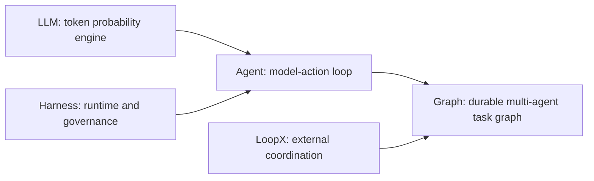
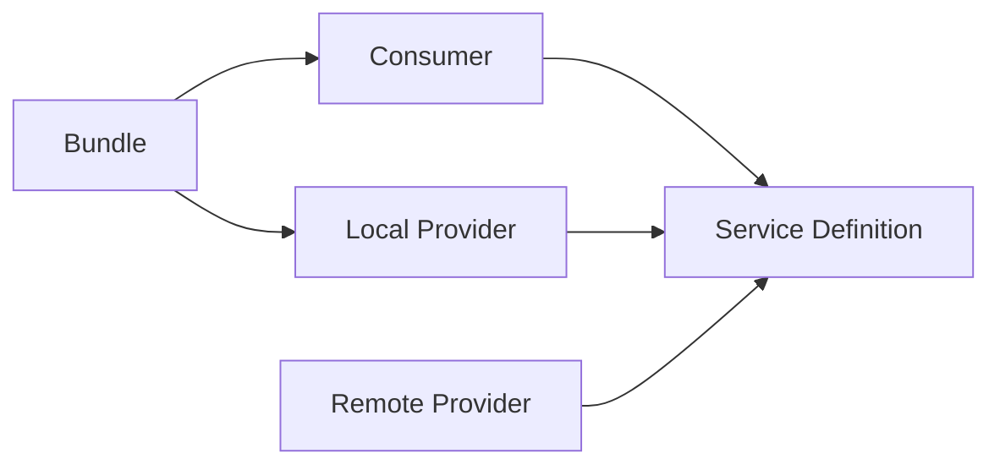
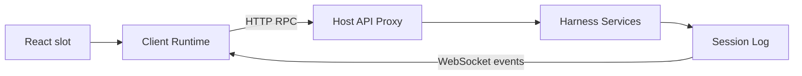
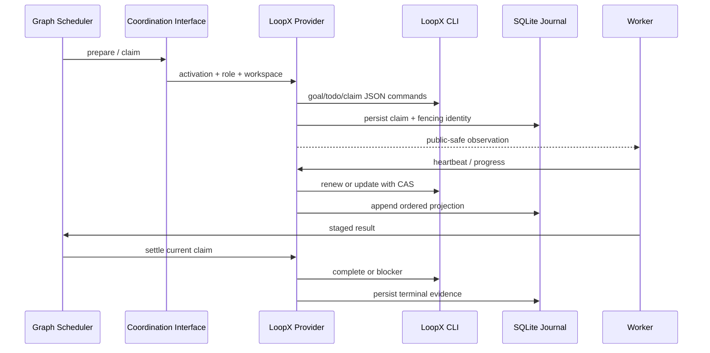

# DeepSeek Harness Technology Stack: From Zero Background to Source Mastery

English | [中文](technical-stack-course.zh.md)

This is a complete project course for readers with no prior background. It begins with AI, LLMs, tokens, and Transformers, then progresses through agents, agent harnesses, plugin composition, the Agent Loop, event logs, tool execution, Web communication, parallel orchestration, Campaign, Graph Mode, browser verification, and LoopX lease and recovery mechanisms. “Mastery” means being able to explain the principles, calculate resources, implement a minimal version, trace a real request through source, design complex work, diagnose failures, and verify fixes with evidence rather than merely memorizing framework names.

## 1. Learning Goals and Reading Method

After completing the course, you should be able to answer eight classes of question: how an LLM trains and generates; how tokens, context, sampling, and KV Cache affect quality, latency, and memory; how an LLM uses tools through an Agent Loop; how a Harness supplies state, permission, recovery, and extension; where this program starts and which source one request crosses; why Campaign sits above Graph; how environment operations and browser verification enter one auditable execution chain; and how Graph and LoopX coordinate multiple Workers without modifying the Agent Loop.

The course uses three viewing distances. The wide view explains concepts, processes, package groups, and data flow. The medium view explains Service Definition, Service Provider, Consumer, and events. The close-up explains key classes, methods, durable records, and cancellation ordering. New readers must complete chapters 1 and 2 in order. Readers with LLM and Agent experience may begin with chapter 3. Maintainers can enter the source path through chapters 8, 13, and 14, then use chapter 16 to connect one request.

Always distinguish four kinds of fact while reading: configuration decides what is composed; services decide who owns a capability; events decide when extensions can act; session records decide which facts can be replayed. Confusing these layers is the most common obstacle to understanding the project.

The course progresses through five stages. Each stage ends in an observable artifact rather than “finished reading.”

| Stage | Chapters | Evidence of completion |
|---|---|---|
| Zero-background model | 1–2 | Calculate a simplified sampling example and draw the relationship among LLM, Agent, Harness, Graph, and LoopX |
| Harness main path | 3–20 | Start two Profiles, trace one tool call through events, and identify each state owner |
| Agent engineering depth | 21–30 | Implement a minimal loop, design an idempotent tool, budget context and memory, inject a recovery failure, and design an eval |
| Project development practice | 31–34 | Complete a plugin, diagnose failures, answer a system-design question, and map the answer to source |
| Integrated graduation | 35 | Submit a single Agent, a multi-Agent Campaign, and a threat model as three portfolio artifacts |



In this course, “LLM mastery” covers Transformers, training, inference, context, sampling, structured output, local-model resources, and evaluation. “Agent mastery” covers loops, tools, state, memory, recovery, security, and multiple Agents. “Harness, Graph, and LoopX mastery” additionally requires explaining this project's real plugins, events, durable identities, and failure semantics. Distributed optimization for training a frontier foundation model is not a prerequisite for this project's roles, but the course supplies enough principles and terminology to collaborate accurately with model-engineering teams.

## 2. Zero-Background Prerequisites: From LLM to Agent Systems

This chapter establishes every prerequisite used later. Do not skip it on the first reading. If you can repeat a term but cannot explain its input, output, and failure behavior, you are not ready to continue into source.

### 2.1 AI, Machine Learning, Deep Learning, and LLMs

AI is the broad category of making computers perform perception, prediction, generation, or decision tasks. Machine learning optimizes parameters from examples instead of encoding every rule by hand. Deep learning uses multilayer neural networks to learn complex functions. A foundation model first trains on broad data and is then adapted to many tasks through prompts, retrieval, tools, or fine-tuning. An LLM is a foundation model whose main inputs and outputs are text-token sequences.

At its engineering interface, an LLM receives a token sequence and emits a conditional probability distribution for the next token. After generating one token, the system appends it to context and predicts again until an end marker, output limit, or cancellation. Repetition creates a sentence; there is no complete answer waiting inside the model to be read out.

This definition exposes four limitations. An LLM has no dependable long-term memory by itself. Generating a tool name does not execute a program. Statistical generation does not guarantee factual truth. Random sampling can produce different outputs from the same input. Agent state, tools, validation, permissions, and evaluation add control mechanisms around these limitations.

### 2.2 Tokens, Tokenizers, Vectors, and Position

A model does not directly read characters, Chinese words, English words, or source-code characters. A tokenizer segments text according to its vocabulary and maps every token to an integer id. One English word may use one or several tokens, and one Chinese character is not guaranteed to be exactly one token. Spaces, indentation, and punctuation also consume tokens. Context and price budgets therefore require the actual tokenizer; dividing character count by a constant is not exact.

An embedding maps a discrete token id to a high-dimensional vector. Training creates exploitable geometric relationships among representations used in similar contexts, but an individual dimension usually has no fixed human label such as “is a noun.” Positional encoding tells the model token order. Without position, “user approves command” and “command approves user” would contain the same token set but lose their ordering distinction.

A text-embedding model can also map a whole passage to a vector for semantic retrieval and may differ from the generative LLM. Vector proximity means the model considers passages semantically related; it does not prove correctness, freshness, or authorization for the current user. RAG (retrieval-augmented generation) still needs access control, provenance, reranking, and answer verification.

### 2.3 Logits, Softmax, and Sampling

The model emits an unnormalized score `z_i`, called a logit, for every candidate token in the vocabulary. For `T > 0`, Softmax converts scores into probabilities: `p_i = exp(z_i / T) / Σ_j exp(z_j / T)`, where `T` is temperature. Lower temperature magnifies the advantage of high-scoring tokens and stabilizes output. Higher temperature gives more candidates a chance but does not add knowledge or reasoning ability. When an API accepts `T = 0`, it normally treats it as a special greedy or near-deterministic setting rather than dividing by zero in the formula.

Greedy decoding always selects the highest-probability token. Top-k keeps only the k highest-scoring candidates. Top-p selects the smallest candidate set whose cumulative probability reaches a threshold and samples within it. Production APIs may expose a seed or Provider-specific strategy, but parallel hardware, model version, and serving implementation can still affect exact reproducibility. Reliable JSON, tool arguments, and safety decisions still require schema and business validation even when temperature is zero.

One local choice changes every later conditional distribution, so a small early token difference can produce a different tool call or plan. An Agent system records actual model output, validates structured fields, and separates retryable errors from unknown results after side effects.

### 2.4 Transformers and Attention

A Transformer updates each token representation from relevant earlier tokens. For one layer's input, linear projections produce Query, Key, and Value, and the model calculates `Attention(Q,K,V) = softmax(QKᵀ / √d_k + M)V`. Query expresses what the current position needs, Key exposes matchable features of other positions, and Value is the information aggregated after matching. The causal mask `M` prevents a position from seeing future tokens.

Multi-head attention lets several projection sets learn different relationships in parallel. A feed-forward network applies a nonlinear transform at each position, while residual connections and normalization stabilize deep training. Stacking layers can combine syntax, reference, code dependencies, and task instructions. Attention is not a database lookup and does not inherently identify sources; it is a trainable weighted information-mixing mechanism.

Standard full attention has approximately quadratic compute and attention-matrix storage in sequence length, so longer context raises prefill cost. RoPE and other position mechanisms and long-context optimizations change usable length and extrapolation, but “fits in the window” does not mean the model uses every position equally well. Retrieval, structured summaries, and acceptance evidence should emphasize important constraints instead of placing an entire repository indiscriminately in the prompt.

### 2.5 Pretraining, Alignment, and Inference

Pretraining commonly learns broad text and code patterns through next-token prediction over large corpora. Supervised fine-tuning uses high-quality input/output examples to shape task behavior. Preference optimization uses human or model preferences to improve helpful and safe behavior. Tool-use training teaches models when to emit structured calls. Training changes parameters, costs more, and has broad effects. Prompts change only the current context, RAG adds external material at request time, and tools delegate verifiable actions to programs.

Training examples provide the correct next token as a target. Cross-entropy loss commonly penalizes low target probability as `L = -Σ_t log p(y_t | y_<t)`. Backpropagation uses the chain rule to calculate every parameter's gradient, and an optimizer repeatedly updates weights over mini-batches. Parameters are learned model values. Hyperparameters such as learning rate, batch size, step count, and regularization belong to the training design and govern convergence, stability, and overfitting.

Lower training loss does not prove reliable real-task performance. Duplicate data, benchmark contamination, stale knowledge, and preference-label bias can inflate offline scores. Memorizing pretraining passages also differs from generalizing to new work. Agent model selection needs a held-out task set and separate tests for knowledge, tool following, correct refusal, and long-trajectory recovery.

Inference uses fixed parameters to generate output and is distinct from the model's reasoning text. Some models emit separate `reasoning_content`, but Harness does not depend on retaining private chain of thought for recovery. Recoverable state must appear as tool calls, public progress, checkpoints, files, or structured results. Longer hidden reasoning does not guarantee correctness and still needs external acceptance.

Hallucination is not a switch a prompt can completely disable. The objective produces likely conditional sequences rather than querying an always-correct fact database. Reducing hallucination combines controlled-source retrieval, tool queries, schemas, deterministic checks, independent review, refusal conditions, and eval sets, with human approval selected according to error cost.

### 2.6 Inference Serving, Context Windows, and KV Cache

Generation has prefill and decode phases. Prefill processes existing input in parallel and builds each layer's Key/Value state, primarily affecting time to first token. Decode adds one token at a time while reusing KV Cache, primarily affecting output tokens per second. Batching raises throughput but can increase per-request queue and tail latency, so serving observes time to first token, decode throughput, and end-to-end latency separately.

The context window contains system prompts, tool schemas, history, retrieval, current input, and reserved output together. If the window limit is `C`, total input is `I`, and maximum output is `O`, the request needs `I + O <= C` plus headroom for tokenizer estimation and Provider wrapper fields. At the limit, the system must reject, prune, retrieve, compact, or divide work. A window is not unbounded Session memory.

KV Cache avoids recomputing the full prefix during decode, but grows with layer count, sequence length, KV-head count, head dimension, batch size, and data precision. The lower-bound weight-memory estimate is `parameter count × bits per parameter / 8`. For example, raw 4-bit weights for a 7B-parameter model are about 3.5 GB, while real execution also needs quantization metadata, KV Cache, activations, runtime buffers, and safety headroom. Fitting weights does not prove the target context and concurrency will fit.

### 2.7 Messages, Prompts, Structured Output, and Function Calling

A chat API commonly separates context into system, user, assistant, and tool messages. System establishes high-priority behavior and safety rules for the request, user supplies the current objective, assistant preserves model output and tool calls, and tool returns external results. In engineering, the prompt is not only the user's text; it is the complete model-visible sequence of system text, tool definitions, history, retrieval, and current input.

Structured output asks a model to generate fields under JSON Schema or a similar constraint, but the result must still be parsed and validated at an untrusted boundary. Syntactic validity does not imply business validity. A file path can escape its root, an enum combination can conflict with current state, and an operation id can be stale. Harness validates model JSON, persistence, Worker, subprocess, and wire data rather than treating a TypeScript assertion as runtime safety.

Function Calling means only that the model proposes which tool to call and with which arguments. The Host parses the call, validates schema, checks permission, executes the real file or network operation, records the result, and returns a tool message. The model should never directly hold a database connection, Host credential, or arbitrary process authority. Tools and Providers constrain capability closest to the resource.

### 2.8 From Chat to Agent, Harness, Graph, and LoopX

A chat application commonly performs one `messages -> response`. An Agent recognizes a tool call, executes an action, appends the observation to context, and asks the model for the next step until completion, failure, cancellation, or user interaction. This feedback loop adds capability while introducing duplicate side effects, infinite loops, context growth, cancellation races, and crash recovery.

A Harness is the engineering runtime that hosts Agents. It composes models, tools, Sessions, persistence, permissions, sandboxes, interaction, telemetry, and lifecycle. A demonstration script can contain an Agent Loop, but without replayable state, authority reduction, process cleanup, and evaluation entry points it is not yet a production Harness.

Graph composes multiple Agents' tasks, dependencies, resources, acceptance, and immutable Revisions into a durable directed acyclic graph (DAG). Campaign further divides a long objective into independent Batch Graphs. LoopX neither generates answers nor runs an Agent Loop. It is an external Provider for the Graph Coordination Service and records project-level execution authority and terminal outcomes through goals, todos, peers, Claims, leases, fencing, and Settlements. Graph decides what should run, when it is ready, and how to accept it. LoopX coordinates which external identity currently has authority to work and commit.

| Layer | Minimal input | Minimal output | Does not own |
|---|---|---|---|
| LLM | Token context | Next token or structured proposal | Tool execution, factual guarantees, or dependable long-term state |
| Agent | Objective, model, tools, and current state | Completed result or explicit terminal state | Production persistence and isolation by default |
| Harness | Configuration, Session, and capability Providers | Governed, observable, recoverable Agent execution | Choosing every open-ended task step for the model |
| Graph | Objective, nodes, dependencies, resources, and acceptance | Evidence-backed multi-Agent Run | A node's internal Agent Loop or the external coordination source of truth |
| LoopX | Goal, todo, peer, and Activation | Claim, lease, cancellation, and Settlement evidence | Model, DAG, workspace, or tool business logic |

### 2.9 First End-to-End Simulation

Imagine a user asks to “read `package.json`, change version validation, and run tests.” The LLM can emit only text or a read-file tool call. The Agent Loop gets that call executed and returns file content to the model. Harness validates paths, records `tool/call` and `tool/result`, applies a sandbox, and cleans up processes on cancellation. Graph can divide analysis, implementation, testing, and review into nodes. LoopX can grant every physical Activation an external Claim and terminal evidence. The five layers share one objective but own different state and failure responsibilities.

Ask six questions at every step: who constructs the input; who may execute the side effect; which fact persists first; whether failure is retryable; whether a late result still has commit authority; and where the user sees evidence. The rest of the course maps these six questions to real DeepSeek Harness plugins, events, and source.

### 2.10 Zero-Background Self-Check

1. Explain how iterative token prediction forms an answer without saying “the model understood it.”
2. Explain what temperature and top-p change and why neither replaces JSON or business validation.
3. Write the Attention formula and explain Query, Key, Value, and the causal mask.
4. Distinguish which part of the system changes under pretraining, fine-tuning, RAG, prompting, and tool use.
5. Explain the relationship among prefill, decode, KV Cache, context window, and weight memory.
6. Explain why Function Calling is not direct model execution of a function.
7. Define LLM, Agent, Harness, Graph, and LoopX in one sentence each and name one responsibility each does not own.
8. For a file-writing task, identify one intent that must persist, one permission check, and one window that recovery must not retry blindly.

If any answer is only a memorized definition, return to its section and draw the data flow with a three-token vocabulary, one read-only tool, and one file-writing tool. The zero-background stage is complete only when you can construct an example and predict its failure result.

## 3. What the Project Is

DeepSeek Harness is an agent runtime whose basic unit of composition is a plugin. It assembles models, prompts, tools, sessions, persistence, approvals, sandboxes, subagents, and user interfaces into a replaceable runtime. The product center is neither one fixed model nor one fixed UI, but a plugin tree managed by Cordis.

It exposes three kinds of entry point. `dsh --profile headless` runs a one-shot command-line task. `dsh --profile web` runs the Host and browser application. ACP (Agent Client Protocol) and SDK entries expose the same capabilities to other processes or automation clients. The entries differ, but they ultimately compose the same core services and drive the same Session Event model.

The most important architectural choice is that the Agent Loop owns only the generic loop. Plan mode, compaction, permissions, Graph Mode, LoopX, tool deadlines, and telemetry attach through services or events. New behavior therefore normally appears as “mount a plugin,” not as another conditional branch in the loop.

## 4. The Actual Technology Stack

| Layer | Current technology | Responsibility in the project |
|---|---|---|
| Runtime | Node.js `^22.19.0 || >=24`, ESM | Host, CLI (command-line interface), Worker, filesystem, and subprocess runtime |
| Language | TypeScript 6, `strict` | Static type system for services, events, protocols, and UI |
| Workspace | pnpm 11 workspace | Manages `packages/*/*`, applications, native packages, and vendored Cordis |
| Plugin framework | vendored Cordis, Schemastery | Context, services, events, scopes, configuration validation, and reversible effects |
| Build | TypeScript project references, tsdown, Vite | Separates Host and Client compilation faces and emits libraries and Web assets |
| Model integration | DeepSeek Chat Completions, `pi-ai`, SSE (Server-Sent Events) parser | Maps uniform LLM requests to provider streaming protocols |
| Web | React 18, Zustand, Immer, native HTTP, `ws` | Plugin UI, client object state, RPC, and event downlink |
| Browser automation | Chrome DevTools MCP, Playwright | Graph Web verification, page/console/network evidence, and GUI tests |
| Data validation | Schemastery, Zod | Plugin configuration and tool schemas; process, persistence, and wire validation |
| Persistence | JSONL + Zstandard, Node `node:sqlite` | Session logs, query indexes, Graph resources/scheduling, and LoopX local projection |
| Concurrency | Promise, AbortSignal, Worker Threads, PTY/subprocesses | Streaming requests, cancellation, code execution, workflows, and command execution |
| Isolation | platform sandboxes, Landlock/bwrap/Seatbelt, process-tree control | Applies deployment policy to filesystem and subprocess capabilities |
| Testing | Vitest, V8 coverage, Playwright, snapshot replay | Unit, contract, real-entry, GUI, and keyless replay validation |
| Observability | Session events, OpenTelemetry logs | Replayable product facts and deployment telemetry |

The table says what the project uses, but not why it is divided this way. The real through-line is: Cordis owns composition and lifecycle; Session owns replayable facts; the Agent Loop owns one request’s control flow; capability packages own side effects; Host and Client own cross-process projection; Graph owns multi-agent work; and LoopX owns external project-level coordination.

## 5. Monorepo and Package Boundaries

The repository uses a two-level “group/package” layout. `packages/core` is the product API spine. Groups such as `llm`, `fs`, `shell`, `subprocess`, `sandbox`, and `web` supply capabilities. `session`, `storage`, and `attachment` own durable data. `subagent`, `jobs`, `workflow`, and `graph` own concurrency and orchestration. `host`, `client`, `api`, and `typert` own the Web and RPC planes. `bundle`, `preset`, and `boot` own final composition. The TypeScript SDK lives under `packages/sdk`, while the Python SDK and bundled runtime live under the repository-level `python/`; `packages/experimental` contains private prototypes that require explicit opt-in and are not part of the stable product surface.

Every npm package is named `@deepseek-ai/dsh-*`. Local relative imports retain `.ts`; cross-package imports use package names. Library source lives in `src/` and built artifacts in `lib/`. Source checks use TypeScript `paths` to resolve directly to `src/`, while published consumers read `lib/` through `exports`, so the project explicitly separates its source and artifact planes.

A capability package usually has three roles. A Service Definition uses a Cordis `Service` to declare the service key, types, and calling contract; it is not merely a TypeScript interface. A Service Provider implements local, remote, or platform-specific behavior. A Consumer turns the capability into a model tool, command, UI, or higher service. Dependency direction points from the Consumer to the Definition, not to a concrete Provider, so the implementation can change without changing consumers.



`packages/bundle/base` combines the core Agent, DeepSeek model, tools, session persistence, permissions, and sandbox. `bundle/web-app` adds Host, Client, Graph, and Web UI. `bundle/headless` adds the one-shot command-line driver. A Bundle may depend on a concrete Provider because deployment selection is its responsibility.

## 6. Cordis: The Runtime Skeleton

The Cordis `Context` is the shared plugin runtime context. Services appear through `ctx`, such as `ctx.sessions`, `ctx.tools`, and `ctx.llm`; plugins extend Context and event types through declaration merging. Cordis is more than a dependency-injection container: it also owns plugin scopes, event dispatch, and unload order.

Registration is an effect and must be reversible. `ctx.effect()` registers a resource and its disposer, `ctx.on()` registers an event listener and returns its remover, and a Service is constrained by the lifecycle of its fiber. On plugin unload, file watchers, network ports, Agents, Workers, and registry entries must be released through the same ownership chain.

Events have three important semantics. An ordinary emit broadcasts a fact. A serial event awaits listeners in order. A waterfall lets a listener transform input or stop the chain. A waterfall listener that wants to delegate must call `next()`; returning directly means it has taken ownership of the request.

```text
plugin scope
  -> register service / event / route / tool
  -> serve work while fiber is active
  -> receive unload or abort
  -> stop new work
  -> drain in-flight work
  -> dispose registrations in reverse ownership order
```

The key to understanding Cordis is tracking ownership rather than memorizing APIs. Whenever you see a timer, Agent, WebSocket, or subprocess, ask: who created it; which signal can cancel it; which effect waits for it to quiesce; and which registry can no longer find it after unload.

## 7. Boot, Profiles, and Configuration Layers

The CLI entry is [`apps/cli/src/bin.ts`](../apps/cli/src/bin.ts). It parses arguments and then dynamically imports the `profile`, `plugin`, or `dump-config` path. Dynamic imports keep unrelated modes out of the same startup closure and keep source and built startup in ESM.

A Profile is a named assembly in Harness home, while a Bundle is a publishable configuration patch layer. Startup applies Bundles in Profile order, then the Profile patch, the home patch, and finally command-line `--patch` files. A patch replaces config or inserts plugins through stable entry ids, allowing users to replace models, tools, storage, and UI without forking Bundle source.

```sh
dsh --profile web --dump-config
dsh --profile headless "summarize this workspace"
```

The first command is the preferred way to understand the actual runtime tree. Source package dependencies only say what might be installed; expanded configuration says what this startup installs. Schemastery validates configuration at plugin load. Errors that can be decided locally fail at load, while errors that depend on external state fail at the earliest resolvable point.

The resulting structure is a scope tree, not a flat list. Parent plugins provide services, child plugins inject dependencies, and callers can create agent or session scopes. A child scope can shadow the same service key with a more specific implementation, which is the basis for giving each Agent different tools, prompts, or policy.

## 8. Agent, Turn, Step, and Inbox

`Agent` is the public interface, `AgentLoop` is the default factory and driver, and `ReactLoopAgent` is the current loop implementation. Agent id and Session id share an identity. During create or resume, the factory prepares the Session and scope before atomically publishing both Agent and Session in their registries. Failure or unload uses the same memoized reverse teardown, preventing half-published objects from remaining.

The Inbox receives user messages, steering (mid-run guidance), follow-up context, and internal follow-ups. A Turn begins when it claims the first executable input and ends when no work remains. A Step is one model request and its tool calls. One Turn can contain multiple Steps because tool results can require another model response, and new input arriving during a run can trigger another Step.

```text
turn/start
  claim inbox input
  agent/pre-step
  step/start
    assemble system prompt + tool schemas
    derive model history from session events
    agent/request
    llm/stream
    assistant/chunk*
    assistant/message
    tool/call* -> tools pipeline -> tool/result*
  step/end
  repeat when more work is owed
agent/turn-stopping
turn/end
```

The key source is [`packages/core/agent-loop/src/agent.ts`](../packages/core/agent-loop/src/agent.ts). `preStep()` uses the `agent/pre-step` waterfall to reject or rewrite claimed messages. `turn()` records the Turn and Step lifecycle. The request path projects history through `session.deriveMessages()`, builds final LLM parameters through `agent/request`, and then invokes `ctx.llm.stream()`.

Cancellation is not merely throwing an exception. The Agent uses `AbortSignal` to make model streams, tools, and waits stop promptly, while teardown must await an idle machine, dispose its scope, and remove registry entries. Callers should distinguish user cancellation, supersession by a new request, resource unload, and execution failure because the reason controls terminal recording, retryability, and UI presentation.

## 9. Prompts, Models, and Streaming Responses

The System Prompt service stores fragments, variables, and tool schemas contributed by plugins. Every Step assembles them again before the request, allowing the current provider, model, cwd, mode, and available tools to enter the request. Only stable prefixes are suitable for model KV caching; fragments containing the current task, Claim, or run state belong in the variable suffix.

The LLM Service Definition standardizes messages, content blocks, tool calls, usage, and streaming events. The DeepSeek Provider maps it to Chat Completions and decodes SSE through `eventsource-parser`; `llm-pi-ai` is the alternative `pi-ai` adapter. Retry, default-model choice, and token metering are separate plugins rather than branches in the Provider.

`agent/request` is the request-level policy entry point. A listener may select a model, add model-visible context, or wrap the stream, but every fact reaching the model must be reconstructable from the Session Log. This “model-visible implies logged” invariant keeps recovery, replay, export, and UI on the same history.

Streaming output first records fine-grained `assistant/chunk` events and later produces `assistant/message`. Keeping raw chunks is not redundant: it preserves the arrival order of text, reasoning, and tool-call deltas so crash recovery and frontend replay do not need to guess what the Provider emitted.

## 10. Tools and Side-Effect Control

The Tools service maintains a scoped registry. Each tool has a name, description, parameter schema, executor, and UI presentation intent. The Agent Loop records `tool/call`, invokes the `tools/pre-execute`, `tools/execute`, and `tools/post-execute` waterfalls, and finally records `tool/result`.

Tool calls can run concurrently, but only calls declared parallel-safe enter a bounded concurrency group; `maxParallelToolCalls` limits concurrency per Agent Step. Every started call retains its own session seq, so parallel completion order cannot break call-to-result references. A scheduler failure also cannot erase call facts already recorded.

Permissions, sandboxing, deadlines, result spill, and repeated-call reminders wrap the tool pipeline. They are not scattered checks inside tool implementations. A permission plugin can ask the user before execution, a sandbox Provider resolves a request into a platform execution specification, a deadline plugin combines cancellation signals, and spill policy stores oversized results externally while returning only a reference to the model.

Shell, Filesystem, Subprocess, and Terminal operate at different levels. Filesystem owns path and file semantics. Shell resolves command requests into execution specifications. Subprocess owns process trees, stdio limits, exit, and termination. Terminal owns persistent PTY sessions. Model tools depend only on the matching Definition, while the Bundle selects local, PowerShell, bash, or sandbox Providers.

Security analysis must identify the real boundary. The Worker Thread Code Runtime provides isolation, heap limits, and forced termination, but deliberately has trust equivalent to bash and is not a malicious-code security boundary. Process sandbox and filesystem policy constrain host access. Approval is also not a sandbox substitute; it represents user authorization only.

## 11. Session Log: The System Ledger

A Session is an in-memory append-only event sequence. Every event has a continuous `seq`, time, and discriminated data. `turn/start`, `step/start`, `user/message`, `assistant/chunk`, `tool/call`, and `tool/result` are durable facts. Live events such as `agent/request` only extend the current operation and do not directly become history.

`Session.deriveMessages()` does not read a second mutable chat array; it projects model messages from the event sequence. Crash repair, compaction, forks, child-session provenance, and model history can therefore share one ledger. A new model-visible input requires an extension to `SessionEventMap` and a projection rule.

Session Persistence is a separate capability. Its coordinator listens to `session/created`, `session/event`, `session/flush`, and `session/disposed`, serializes writes per Session, batches events within a fixed window, and drains on flush or unload. A backend implements reading, appending, repair, and listing without reimplementing the upper lifecycle.

The default JSONL backend stores each Session as an append-only logical log, normally in concatenated Zstandard frames; every batch is checksummed and `fsync`ed. If a crash leaves an incomplete tail, loading retains the final valid prefix and synthesizes closing events for tools, Steps, and Turns. The SQLite backend uses Node’s built-in `node:sqlite`, maps headers and events to rows, and shares the same Persistence Coordinator.

Crash recovery does not pretend that an unknown side effect never happened. An assistant tool request without a durable `tool/call` becomes `TOOL_NOT_STARTED`; a durable `tool/call` with no result becomes `TOOL_OUTCOME_UNKNOWN`. The model may automatically retry only read-only or idempotent work; side-effecting calls require verification or user input first.

## 12. Web Host, RPC, and Plugin UI

Web mode contains two Cordis worlds: the Host and the browser. The Host uses Node `http` for static assets, API routes, and upgrade routes; the Client starts its own plugin tree in the browser. React is only the rendering layer. UI features remain Client plugins registered into slots instead of accumulating in one monolithic component.

Browser uplink requests use fetch-shaped RPC handlers, while Host downlink events use WebSocket. `rpcId` is a branded correlation id and responses must echo the request id. Approvals and questions can replay across reconnects, while ordinary pushes receive their own ids. Zod validates wire data, and Host business services retain domain types.

Typert generates Host/Client type graphs, codecs, and Remote Service metadata from TypeScript declarations. `api/gateway` and `api/remotes` expose service methods as typed RPC, and the runtime registry manages mounted contributions. It keeps type, schema, and plugin lifecycle aligned across processes rather than generating an unrelated set of REST controllers.

Client Runtime stores object state with Zustand and produces immutable updates with Immer; Session Runtime creates a scope tree per session. `web-react` uses a `useSyncExternalStore` bridge to connect service snapshots to React. Session events drive local object updates, so the UI does not refetch an entire Session for every chunk.

Browser automation is an independent optional Bundle, not a protocol built into Graph. `browser-chrome-devtools` composes a pinned Chrome DevTools MCP. The default `managed` mode lazily starts visible Chrome on the first browser operation, uses a temporary profile, and closes the process and removes the profile when the plugin unloads. `external` mode connects to an existing Chrome through `DSH_CHROME_DEBUG_URL`, leaving lifecycle ownership to deployment. Concurrent Workers require isolated browser contexts and explicit page ids rather than implicit “current tab” state.

The MCP Client also secures file-evidence conversion. Arguments declared as workspace paths are resolved to canonical paths inside the calling Agent Session workspace; empty input, paths outside the workspace, and symlink escape fail before the request reaches the MCP server. Browser screenshots can therefore travel through the Graph artifact flow without letting an MCP tool use a seemingly relative path to write into another Session or an arbitrary Host directory.



## 13. From One Agent to Parallel Work

The Subagent capability creates or derives child Agents. Providers can spawn or fork in process, or connect to Codex, Claude Code, ACP, or DSH SDK. Parent-child relationships are recorded in Session Headers and events, while the tool layer depends only on the Subagent Service Definition.

Delegation also propagates an authority ceiling. The in-process Provider derives `sandboxModeCap` from the parent Agent's effective sandbox. A child may narrow to a more restrictive mode but cannot widen the parent's authority. When a caller requires a cap and the Provider does not advertise support, delegation fails explicitly instead of silently falling back to uncontrolled execution. Graph isolated-workspace children are further capped at `workspace-write`, so even a main Session temporarily using `danger-full-access` cannot escape the allocation.

Jobs provide generic handles and output reads for long-running background tasks. Workflow runs structured workflows in a Worker Thread. Code Runtime executes model-generated TypeScript in a fresh Worker Thread. Their purposes differ: Job owns lifecycle, Workflow owns an orchestrated program, and Code Runtime owns one budgeted code execution.

Graph adds a durable, revisable DAG above these capabilities. Every node describes role, task, dependencies, acceptance criteria, workspace ownership, model, and budget. Revisions are immutable; changing the task creates another Revision rather than rewriting history. A Run Snapshot stores complete execution evidence for one Revision.

Long projects add Campaign and Batch above Graph. Remember the identity hierarchy as `Campaign > Batch > Graph > Revision > Run > Generation > Activation > Attempt`: Campaign is the long objective; every Batch owns an independent Graph containing only current-stage work; Revision is immutable design; Run and later identities describe execution. This prevents hundreds of completed nodes from being copied into every larger subsequent DAG.

Graph Mode attaches to an ordinary Agent through `/graph`, a controller prompt, `graph_submit`, Session events, and a background Scheduler. The controller remains an Agent and Workers still execute through the Subagent capability. The Agent Loop neither knows about the DAG nor contains a Graph branch.

## 14. Graph Mode Scheduling Mechanics

The controller classifies user input as new work, revision, inspection, control, clarification, or direct response. New and revised work first forms a semantic draft without Host-owned identity fields. Graph Mode then derives graph id, revision, timestamp, run defaults, and physical workspace allocation, validates them, and stores an immutable Revision.

An ordered long objective first submits a Campaign plan with the first Batch Graph. Every accepted Batch definition becomes an immutable prefix. After the current Batch is accepted, compact summaries derived from durable Run and Settlement evidence activate the next ready Batch. Only after every registered Batch is accepted may the controller use `planExtension` to atomically append a nonempty suffix. The extension records its reason, source Batch, Run, and confirmed Settlements and increments `planRevision`; it cannot insert, reorder, remove, or replace the accepted prefix. A failed Batch revises only its own Graph, and accepted Batches are never regenerated.

A node becomes runnable only after all predecessors terminate, conditional edges pass, resources are available, and a coordination Claim succeeds. Admission simultaneously considers the global Worker count, role caps, provider/model caps, weight budget, and reserved controller capacity. Parallel writable nodes must declare disjoint relative `writeRoots`.

Necessary Host preparation uses an `environment` node instead of elevating an engineer child into a privileged Agent. The node freezes one to sixteen ordered commands, required `network`, `host-package-install`, or `docker` capabilities, sandbox mode, acceptance criteria, and optional documentary rollback commands. The Scheduler stops at a durable `environment` checkpoint; approval authorizes only the next Generation and rejection cancels the Run. After approval, the Host executes the recorded commands directly through the Shell Service rather than giving a model an open-ended privileged shell. Every command obtains a stable external reference and flushes before execution, then records exit code, signal, timeout, sandbox, truncation, and byte counts. Failure is not retried automatically, unknown outcomes require human reconciliation, and rollback must be another separately approved environment node.

Every node execution creates an Activation and an Attempt. The Scheduler persists pending execution before reserving external resources or coordinating, and it uses explicit Session flush barriers before critical external side effects. The Worker publishes progress, checkpoints, token usage, and lease renewals; its Monitor enforces budget, no-progress timeout, wall-clock limit, and cancellation.

Successful output is staged before schema validation, acceptance checks, and artifact integration. Review and verification nodes must return a structured decision and issues. If terminal coordination writeback fails, Graph does not rerun a successful Worker; it enters an `awaiting_user` reconciliation checkpoint and retries only settlement during recovery.

User-facing Web work schedules a `browser-tester` node after the integrated runnable build. The controller supplies the exact origin, critical flows, viewport, locale, and measurable DOM and visual assertions. The Worker prefers page snapshots and element ids for interaction, captures screenshots when its model supports images, and inspects relevant console errors and failed network requests. Browser tools remain ordinary composed capabilities; Graph specifies the assignment, evidence, and structured verdict, so replacing the browser Provider does not require Scheduler changes.

A revision invalidates the transitive successors of changed nodes without rewriting old Revisions or Runs. Unaffected nodes with successful evidence can be explicitly reused. Pause, approval, skip, retry, resume-from-node, and substitute-output operations all pass through one serial control service with exact graph/revision/generation identity, so a stale page cannot mutate a newer generation.

The Graph UI's Design, Execution, and Revisions views respectively answer “what is planned,” “what is happening,” and “why did it evolve this way.” Revisions uses logical-task lanes and immutable Revision time to show `new_task`, `analysis_refactor`, `execution_correction`, and cross-Batch `depends_on` relationships, plus added, changed, removed, preserved, and invalidated nodes. Lineage intent and structural differences enter the durable submission; runtime facts such as duration, tokens, checkpoints, and Settlements are derived from Run/Attempt projections, and missing historical telemetry remains unknown rather than zero. A separate Campaign track shows Batch status, plan revision, and the introduction revision of each Batch.

Recovery is not only a one-time startup action. A per-Agent periodic scan checks pending submissions and queued or running Runs with no local executor. It acquires a fenced Scheduler lease before creating a higher Generation for reconciliation. A still-live remote owner yields busy rather than duplicate dispatch. Graph reads prefer the eagerly maintained Session projection so repeatedly folding a long log cannot starve heartbeats. An Activation already terminal in LoopX returns a terminal disposition and never dispatches another Worker.

## 15. LoopX Design, Implementation, and Coupling

LoopX is an external Provider for the Graph Coordination Service. It is neither the Agent Loop nor the Graph Scheduler. Graph decides when a node is ready, how much concurrency is allowed, and which model and workspace to use. LoopX provides project-level goal, todo, peer, claim, lease, cancellation, and terminal evidence. The two connect through `dsh-graph-coordination`.

| LoopX object | Meaning in the integration | Primary identity relationship |
|---|---|---|
| goal | A pre-existing project-level objective container | One Graph deployment binds to one configured goal |
| todo | Claimable work created lazily after a node becomes ready | Carries a stable Activation tag and ends completed or blocker |
| peer | A registered execution identity for an analyst, engineer, or another role | Configuration maps each Graph role exactly to one peer |
| Claim | The record granting a peer current execution authority over a todo | Binds the physical Activation and an advancing lease identity |
| lease | The Claim's finite validity interval and renewal version | Expiry permits takeover, while fencing still blocks the old holder's writeback |
| Settlement | Idempotent terminal writeback as complete, blocker, or cancel | Uses the current CAS version and preserves stable evidence |

Preparation confirms that the configured LoopX goal is readable and that role-to-peer mappings exist. Only after a node is ready does the Provider lazily create a todo marked with the Activation, claim it with the matching peer, and give the Worker a public-safe observation capped at 8,000 characters. Raw registry state never enters the model prompt directly.

A Claim uses a hard lease. Every heartbeat advances the LoopX lease version and returns a new lease id, expiration, and fencing token; later progress, cancellation, and settlement must carry the current identity. Terminal writeback uses the current LoopX CAS version, so a late old Worker cannot overwrite a newer Claim.

The local `LoopxCoordinationJournal` uses Node `node:sqlite`. Schema Version 2 stores Claim, owner, progress, cancellation, terminal state, and ordered events by physical Activation. Cursor and event sequence remain continuous. After restart, settlement recovers the todo id from the durable Claim rather than relying on an in-process Map. Terminal operations serialize per Activation, so one waiting task does not block unrelated work.

Before claiming, the Provider checks both its local terminal journal and the current LoopX todo status. A completed or blocked todo with stable tags returns the matching terminal disposition and repairs the local projection when needed instead of being claimed or executed again. Every CLI operation has its own deadline and stdout/stderr byte limits. The stdout default is 8 MiB so a large valid `todo list` remains parseable; overflow reports an explicit size error.



Coupling is layered. Architectural coupling is low: Graph sees only the Coordination interface and can replace the Provider; the LoopX Provider does not modify the loop or node business logic. Deployment coupling is stronger: it depends on LoopX CLI commands, JSON fields, preconfigured goals and peers, working directory, and executable path. Persistence coupling is explicit: LoopX is the external source of fact, while SQLite is a recoverable local projection rather than a distributed-transaction participant.

The LoopX Provider deliberately does not apply heartbeat quota, vision, the LoopX scheduler, or worktree policy to in-session nodes. Graph admission continues to own concurrency and resources, Harness continues to resolve workspaces, and the model sees only a trimmed Claim observation. This division prevents two schedulers from deciding the same node.

When a Windows Host uses LoopX installed inside WSL, `executable` can be `wsl.exe`, `executableArgs` can select the distribution and LoopX binary, and `pathStyle` can be `wsl`. The Provider converts only the registry path; the Host still supplies subprocess cwd, and process termination remains bounded by the configured grace period.

Recovery retains a distributed limitation. LoopX and the local projection do not commit atomically. Stable tags can backfill the window where an external mutation succeeded but the local record was not yet written, and reconciliation never overwrites either ledger on conflict. Hosts that share neither the journal file nor authenticated durable storage cannot share local cursors or progress deduplication state.

## 16. End-to-End Close-Up of One Request

Consider a Web user asking to modify a file and run a test. The browser Session object creates a request with an `rpcId`. Host API validates wire data, locates the target Agent, sends the message to the Inbox, and records `user/message` in the Session. WebSocket returns events to the browser so the input can immediately show accepted state.

The Agent claims the input and records `turn/start` and `step/start`. System Prompt gathers workspace instructions, time, mode, and tools; Tools produces schemas; Session projects history. `agent/request` lets routing and mode plugins enrich the request, and then the LLM Provider starts its HTTP/SSE request.

The model stream produces text and tool-call deltas, each recorded as `assistant/chunk`. Once a complete tool call forms an `assistant/message`, the Agent records `tool/call`. Permission policy decides whether interaction is required; a Filesystem or Shell Consumer invokes its Service; a Sandbox Provider resolves allowed paths and commands; a Subprocess Provider launches a process under signal, deadline, and output limits.

Completion records `tool/result`. If the model still owes a final response, the Agent starts another Step; otherwise it records `step/end` and `turn/end`. Persistence Coordinator appends events in the background and awaits storage at critical flush points. Client applies downlink events to Zustand objects, and React slots rerender only affected regions.

In Graph Mode, the controller’s `graph_submit` does not directly modify files. A short task becomes a Revision and Run; an ordered long task first creates a Campaign and submits only the current Batch Graph. The Scheduler acquires resources and a Coordination Claim for each ready node, then starts a child Agent. An environment node executes fixed commands through the Host after approval, and a later browser-tester verifies Web output. LoopX participates only in Claim, lease, and settlement. Actual tool calls still run through the child Agent’s own Agent Loop and Session Log, while the UI derives Campaign, design, execution, and revision history from durable lineage and runtime projections.

## 17. How to Extend the Project

First classify a new capability as fact, policy, or side effect. A fact that must survive reload becomes a Session Event. Policy affecting only the current request attaches to the appropriate waterfall. A replaceable side effect gets a Service Definition, Provider, and Consumer. A pure UI feature registers a Client slot. Do not modify the Agent Loop merely because its call site is convenient.

A complete capability normally lands in this order: define domain types and Service; implement at least one Provider; implement a model tool or another Consumer; put registrations in `ctx.effect()`; choose the implementation in a Bundle; record model-visible text and events; add unit, contract, assembled-entry, and snapshot validation; and update the owning README and subsystem documentation.

Validate data at boundaries: configuration, model-tool JSON, persistence, Worker messages, subprocess JSON, and RPC wire are untrusted. Do not repeat runtime validation for same-process internal calls guaranteed by TypeScript. Cross-package ids use branded strings, closed unions use a discriminant and `assertNever`, and extensible maps use declaration merging.

For concurrent code, write ownership and termination conditions first: who may start work; who may cancel it; whether a late result still has commit authority; what disposal awaits; and whether persistence occurs before or after an external side effect. Graph fencing, Agent memoized teardown, and Session per-id serial writing are different answers to the same questions.

## 18. Build, Test, and Quality Gates

`pnpm run build` builds Host and Client libraries before the Web app. Host and Client use separate TypeScript aggregates, tsdown emits runtime code and declarations, and Vite emits browser dist. Source startup uses `node --import tsx/esm`; configuration subprocesses after build must resolve `lib/` under plain Node.

```sh
pnpm run typecheck
pnpm run lint
pnpm run test
pnpm run test:coverage
pnpm run test:snapshot
pnpm run build
pnpm run hygiene
pnpm run doc-sync
```

Unit tests verify local behavior, contract tests verify that multiple Providers can share a Definition, invariant plugins verify owned relationships in the assembled runtime, snapshots use real examples and keyless replay to verify model-visible trajectories, and e2e tests verify real Providers when credentials exist. Mock-only unit tests cannot establish product-visible behavior.

The coverage gate is `test:coverage`, not ordinary `test`. Documentation is jointly checked for links, physical wrapping, Mermaid, TypeScript fences, generated catalogs, bilingual pairing, and site build. Published packages also pass publint, NodeNext consumer checks, runtime closure, and workspace constraints.

## 19. Source Reading Route and Exercises

First run `dsh --profile web --dump-config`, then read [`docs/architecture.md`](architecture.md), [`docs/cordis-primer.md`](cordis-primer.md), and [`packages/README.md`](../packages/README.md). The goal is to move from a configuration entry to its package and from the package to its `ctx` service key.

Next trace one request. Start CLI reading at [`apps/cli/src/bin.ts`](../apps/cli/src/bin.ts), Agent reading at [`packages/core/agent-loop/src/agent.ts`](../packages/core/agent-loop/src/agent.ts), tool concurrency at [`packages/core/agent-loop/src/tool-calls.ts`](../packages/core/agent-loop/src/tool-calls.ts), and session history at `deriveMessages()` in [`packages/core/session/src/index.ts`](../packages/core/session/src/index.ts).

Then trace persistence and Web. Start with [Session persistence](../packages/session/session-persistence/README.md), the [Web connection](../packages/client/connection/README.md), the [API gateway](../packages/api/gateway/README.md), and the [Client store](../packages/client/store/README.md).

Finally read parallel orchestration. Begin with [`packages/subagent/README.md`](../packages/subagent/README.md), establish Campaign, Revision, Run, and lineage identities in [`packages/graph/graph/src/types.ts`](../packages/graph/graph/src/types.ts), then read [`packages/graph/graph-mode/README.md`](../packages/graph/graph-mode/README.md) and [`packages/graph/graph-coordination/README.md`](../packages/graph/graph-coordination/README.md). Connect the `journal.ts` and `index.ts` implementation behind [`packages/graph/graph-coordination-loopx/README.md`](../packages/graph/graph-coordination-loopx/README.md), the three views in [`packages/client/ui-graph/README.md`](../packages/client/ui-graph/README.md), and the browser lifecycle in [`packages/bundle/browser-chrome-devtools/README.md`](../packages/bundle/browser-chrome-devtools/README.md) into one execution-evidence chain.

Exercise one: choose a headless run and list its Turn, Step, assistant, and tool events by seq. Exercise two: draw both paths of a waterfall listener, with `next()` and with short-circuiting. Exercise three: for a side-effecting tool, define recovery when a crash occurs before `tool/call`, after external execution, and before `tool/result`. Exercise four: for a two-Batch Campaign containing environment, implementation, and browser-tester nodes, mark the identity relationships among Campaign, Batch, Graph, Revision, Run, Generation, Activation, Attempt, Claim, and Settlement, then explain why a failed Batch creates a new Revision only in that Batch.

## 20. Terminology Quick Reference

| Term | Precise definition |
|---|---|
| LLM | A parameterized model that emits a next-token conditional distribution from token context |
| Token | A model input or output unit mapped to an integer id by a tokenizer vocabulary |
| Embedding | A high-dimensional continuous-vector representation of a discrete token or passage |
| Context window | The total input and reserved-output token range available to one model request |
| KV Cache | Runtime state that stores Attention Keys and Values so decode need not recompute the prefix |
| Agent | A system that loops among model observation, tool action, and result feedback until an explicit terminal state |
| Harness | The engineering runtime that composes an Agent's model, tools, state, permission, persistence, and lifecycle |
| Graph | A durable DAG that organizes multi-Agent work through immutable Revisions, dependencies, resources, and acceptance |
| LoopX | A system that supplies external project coordination through goals, todos, peers, Claims, leases, and Settlements |
| Function Calling | A protocol pattern where the model proposes a tool name and arguments for Host validation and execution |
| Plugin | A mountable unit that contributes services or effects to a Cordis Context and can unload |
| Service | A typed capability available through `ctx` with an owned lifecycle |
| Provider | A concrete implementation of a Service Definition |
| Consumer | A plugin that uses a capability and exposes a tool, command, UI, or higher service |
| Session | The conversation fact ledger made of append-only events and an immutable header |
| Turn | The full handling interval from claiming input until no work remains |
| Step | One model request and the tool calls it produces |
| Projection | Deriving model history, UI state, or a query view from events |
| Campaign | A long objective and audit history composed of ordered independent Batch Graphs |
| Batch | An independent Graph unit containing only one Campaign stage's work |
| Revision | An immutable version of a Graph definition |
| Revision lineage | Durable explanation of a Revision's logical task, cause, parent or cross-Batch relationships, and structural differences |
| Run | The durable execution snapshot of one Revision |
| Generation | A fenced execution generation of a Run created initially, during recovery, or by control |
| Activation | The physical activation identity of a node in one Generation |
| Attempt | One Worker execution or continuation within an Activation |
| Environment checkpoint | A durable pause that freezes a Host-operation plan and accepts one explicit approval for the next Generation only |
| Claim | Execution authority granted to an Activation by external coordination |
| Lease | A Claim validity interval that expires and can be renewed |
| Fencing token | A monotonic identity that prevents late old-Claim writeback from replacing a new owner |
| Settlement | Idempotent terminal writeback for a Claim together with evidence |

## 21. Harness Foundation Mental Model

Remember the system as five layers. The Cordis plugin tree determines what the runtime has. The Agent Loop determines how one input advances. The Session Log determines what can be recovered and explained. Capability Providers determine how side effects execute and are isolated. Host/Client, Campaign/Graph, and LoopX respectively project the single-agent runtime into a human interface, divide a long objective into independent Batch DAGs, and connect it to an external project control plane. Environment and browser-tester are not extra layers; they are Graph-node policies for controlled execution and verification over fourth-layer capabilities.

Use the same diagnosis order for every problem: inspect expanded configuration, locate the service owner, find the triggering event, find the durable record, and finally inspect cancellation and teardown. If you can explain one success, one failure, and one restart recovery along this route, you have moved from using the project to being able to modify it.

## 22. Implement a Minimal Agent Loop from Scratch

The goal is not to reimplement Harness, but to understand the difference between an agent and an ordinary chat endpoint in fewer than one hundred lines. Chat performs one `messages -> completion` operation. An agent loop also recognizes tool calls, executes side effects, appends observations to history, and decides whether to continue, complete, cancel, or fail. An agent is therefore a state machine whose transitions partly depend on model output.

### 22.1 State Machine and Stop Conditions

A minimal state set is `idle -> requesting -> executing -> requesting -> completed`; every active state can also enter `canceled` or `failed`. Production adds Turns, Steps, persistence, and recovery, but adding them to a loop with no explicit states only amplifies races.

Stop conditions include a final response with no tool call; exhausted step, token, wall-clock, or cost budget; user cancellation; an unrecoverable model or tool error; and waiting for approval or clarification. Checking only for tool calls lets repetition, no-progress reasoning, and truncated answers keep consuming resources.

### 22.2 Runnable Minimal Implementation

The following compilable teaching implementation omits network protocols and schema libraries while preserving four essential rules: tool names must resolve through a registry; arguments are parsed before execution; results append in message order; and the loop owns a step limit and cancellation signal.

```ts
type Message =
  | { role: 'user'; content: string }
  | { role: 'assistant'; content: string; toolCalls: readonly ToolCall[] }
  | { role: 'tool'; callId: string; content: string }

interface ToolCall {
  id: string
  name: string
  arguments: string
}

interface ModelReply {
  text: string
  toolCalls: ToolCall[]
}

interface Model {
  generate(messages: readonly Message[], signal: AbortSignal): Promise<ModelReply>
}

interface Tool {
  execute(args: unknown, signal: AbortSignal): Promise<unknown>
}

export async function runAgent(
  model: Model,
  tools: ReadonlyMap<string, Tool>,
  prompt: string,
  signal: AbortSignal,
  maxSteps = 12,
): Promise<readonly Message[]> {
  const messages: Message[] = [{ role: 'user', content: prompt }]
  for (let step = 0; step < maxSteps; step++) {
    signal.throwIfAborted()
    const reply = await model.generate(messages, signal)
    messages.push({ role: 'assistant', content: reply.text, toolCalls: reply.toolCalls })
    if (reply.toolCalls.length === 0) return messages
    for (const call of reply.toolCalls) {
      signal.throwIfAborted()
      const tool = tools.get(call.name)
      if (tool === undefined) throw new Error(`unknown tool: ${call.name}`)
      const args: unknown = JSON.parse(call.arguments || '{}')
      const value = await tool.execute(args, signal)
      messages.push({ role: 'tool', callId: call.id, content: JSON.stringify(value) })
    }
  }
  throw new Error(`agent exceeded ${maxSteps} steps`)
}
```

### 22.3 ReAct, Planning, and Workflow

ReAct alternates observation, model decision, action, and a new observation. It describes a feedback pattern and does not require retaining or exposing private chain of thought. Plan-and-execute generates explicit steps before carrying them out and suits longer work with clear dependencies. Reflection or a reviewer checks artifacts and requests correction. All three are strategies; tool results, acceptance criteria, and durable state still supply reliability.

A plan cannot become a second state system detached from execution. Harness Plan Mode stores visible plan state for user and model, while actual tool calls, file results, and completion remain grounded in Session Events and evidence. A Graph Revision goes further: it is a validated, immutable execution design with dependencies and resources, not a natural-language todo list.

Prefer a workflow when code can express the control structure, failures are fixed, and no semantic judgment chooses the next step. Use an Agent when the next action depends on open-ended observations and the objective permits multiple paths. Production commonly places an Agent in a controlled workflow node or lets Graph surround open Workers with deterministic dependencies instead of giving the model every control-flow decision.

### 22.4 From Teaching Loop to Production Loop

Analyze failure paths, not only the happy path. If `model.generate()` succeeds but the process stops before persisting the assistant message, can recovery know the model already responded? If a tool succeeds before its result is logged, can it retry safely? Do concurrent results enter history in completion or model order? Does cancellation synthesize results for unstarted calls? These questions explain the extra complexity in Harness session events, tool scheduling, and recovery closers.

A production loop also handles steering. A correction arriving while the model or tool still runs should not open an unrelated Turn concurrently. It enters the Inbox and the driver merges it at a safe boundary or opens the next Step. Resource disposal must be awaitable and idempotent. If a subprocess, stream listener, or persistence write can still call back after dispose returns, the next run shares hidden state with obsolete execution.

### 22.5 Lab and Completion Standard

Lab: implement a read-only fake `get_weather` tool and a non-idempotent `increment` tool. Inject failure before the model request, after tool execution, and before result append. Once you observe that `increment` cannot recover safely from in-memory messages alone, specify the durable intent, operation id, and reconciliation API you need.

Interview answer: when asked what an agent loop is, begin with the state machine and feedback loop, then explain that production must align model output, tool side effects, and durable state. “Call the model until no tool call remains” omits cancellation, bounds, crash windows, and unknown side effects.

Completion means implementing the minimal loop independently, naming a terminal state for every exit, predicting recovery at three crash points, and explaining when to use one chat call, a workflow, a single Agent, a Review loop, or Graph.

## 23. Model Requests, Tokens, and KV Cache

Chapter 2 explained model principles; this chapter turns them into Agent-engineering budgets. You should be able to derive a Provider payload from one Harness request, calculate context and memory, distinguish prefill, decode, KV Cache, and prefix caching, and select local or remote models through evals.

### 23.1 Three Request Layers and Token Budget

A model request consists of the system prompt, tool schemas, history, current input, routing fields, and output cap. The model does not see Session Events directly: `deriveMessages()` projects an adapter-neutral surface, then an Adapter maps content blocks to the provider API. In an interview, distinguish domain messages, the Harness request, and the Provider wire payload.

Token budget has at least four parts: stable prefix, history, current input, and reserved output. Given context window `C`, system and tools `S`, history `H`, current input `U`, and output reserve `O`, safety requires `S + H + U + O <= C`. Production also leaves margin for tokenizer estimation error, hidden reasoning tokens, and Provider-specific fields.

Budget failure needs a deterministic policy. Reducing only the output cap can truncate tool arguments or the final answer. Dropping only the oldest messages can break user/assistant/tool causality. Indiscriminate compaction can lose corrections and safety constraints. A useful order is to bound tool results, retrieve relevant evidence, preserve the recent complete surface, compact older units, and finally reject or divide work if the request still cannot fit.

### 23.2 Prefill, Decode, KV Cache, and Prefix Caching

Within one request, KV Cache stores computed Keys and Values so decode does not recompute the whole prefix for each token. Cross-request prefix caching lets a model service identify equal token blocks and reuse prefill work. Both depend on a stable prefix, but lifetime, hit granularity, and billing belong to the particular Provider. Similar-looking client strings alone do not prove a hit.

Cache optimization is not merely shortening prompts; it is keeping the longest possible prefix token-stable. A timestamp, random id, or dynamic tool order near the beginning invalidates cross-request reuse for later content. Harness puts stable policy and tool definitions in the prefix and task, Claim, and run state in the suffix; compaction replays the original Session prefix and appends its instruction last.

Time to first token depends mainly on queueing, network, and prefill. Long-response duration depends mainly on decode speed and output length. A service can have low TTFT but slow tokens per second, or high batch throughput with poor per-Session tail latency. Agent first-durable-action and no-progress watchdogs must match the real phase; hidden reasoning activity is not completed recoverable work.

### 23.3 Local-Model Memory, Quantization, and Concurrency

Local deployment budgets weights first, then KV Cache and runtime overhead. A lower-bound weight estimate is `P × b / 8` bytes, where `P` is parameter count and `b` is bits per parameter. KV Cache is approximately `2 × L × B × N × H_kv × D_h × s`: two for K and V, layer count, batch size, sequence length, KV-head count, head dimension, and bytes per element. Architecture, paged caching, and quantization change the real value, so the formula guides capacity planning rather than replacing measurement.

Quantization reduces weights from FP16 or BF16 to 8-bit, 6-bit, 4-bit, or less, cutting memory and bandwidth while potentially reducing accuracy, tool-format stability, or long-context quality. CPU offload fits larger models by moving the bottleneck to memory bandwidth and device transfer. Concurrency duplicates or expands KV state. Select against model quality, TTFT, decode rate, context, concurrency, and power instead of asking only whether parameters fit in VRAM.

A dense model activates most parameters per token. A Mixture of Experts model has more total parameters but routes each token to only some experts. It can obtain larger capacity with lower active compute, yet still stores many weights and adds routing, communication, and batching constraints. Neither total nor active parameter count in a public model name directly determines local speed.

### 23.4 Streams, Content Blocks, and Finish Semantics

A streaming protocol must represent text, reasoning, tool-argument deltas, usage, finish reason, error, and abort. Tool JSON can span chunks and cannot be parsed one delta at a time. A clean transport close also does not prove semantic success because the final finish can mean length truncation or filtering. The Adapter normalizes provider throws and terminal errors into the common LLM semantics.

An Assembler combines the deltas into ordered content blocks while retaining call ids, finish reason, and usage. On disconnection, distinguish a request the service never received, generation that may have occurred but did not return completely, and a tool call already recorded or executed. Only the first stage is normally directly retryable; later stages reconcile durable events and side-effect state.

Reasoning tokens, visible output tokens, and tool-argument tokens can use different usage fields. `maxOutputTokens` is a Provider generation budget and does not guarantee that every token becomes user-visible text. A reasoning model can spend substantial internal budget before output, and length truncation can leave invalid JSON. Graph therefore records output, reasoning, and estimated reasoning separately and requires durable checkpoints instead of treating hidden activity as progress.

### 23.5 Model Routing and Capability Matrix

Model selection compares at least seven dimensions: context window; structured-output and tool-call reliability; code or domain quality; image support; reasoning effort; latency and throughput; and cost or local resources. A small model can handle classification, retrieval queries, format conversion, and tightly bounded Workers, while complex architecture, cross-file integration, and final Review can route to a stronger model. Task evals should drive routing rather than parameter count alone.

If a local small model reliably completes a complex project under this architecture, that is meaningful evidence for the architecture. It shows that decomposition, context selection, tools, state, acceptance, and recovery transfer some reliability from single-call model intelligence into system mechanisms. One successful demo does not establish general capability; a fixed task set, a single-Agent control, success rate, cost, human takeover, dangerous actions, and recovery outcomes are needed to separate architecture benefit from task luck or test leakage.

Fallback must preserve safety semantics. If the backup model lacks image input, reasoning effort, or strict schema, admission rejects nodes whose requirements cannot be met or routes only explicitly compatible work. It must not silently drop tools or images or ignore an unsupported reasoning effort before continuing into side effects.

### 23.6 Integrated Lab and Interview Check

Lab: record actual or estimated tokens for system prompt, tool schemas, history, and output in a real or mock request. Change a timestamp in the system prefix and identify where prefix-cache reuse stops, then move dynamic fields to the suffix. For one candidate local model, calculate weights and KV Cache under two context and concurrency settings, measure TTFT and tokens per second, and compare JSON validity, task success, and human takeover on the same ten tool tasks.

Common follow-ups ask whether temperature controls correctness, whether `maxTokens` equals visible answer length, why Function Calling can still produce invalid arguments, and whether an SSE disconnect can be replayed blindly. Good answers note that sampling changes a distribution, reasoning can consume the cap, schemas are not absolute guarantees, and replay depends on request and tool idempotency.

Completion means receiving any model card and Harness request, drawing its token layout, giving a memory lower bound and risk margin, predicting TTFT and decode bottlenecks, listing capability-mismatch fail-fast conditions, and designing an eval that compares a local small model, a remote model, and their routed combination.

## 24. Tool Development: From Schema to Side Effect

A tool is not an ordinary function plus a description. A complete tool defines the model-facing name and schema, runtime validation, execution mode, permission and sandbox requirements, result-size policy, error and cancellation semantics, and UI rendering. Missing any of them can give the model, Host, and user different facts.

Begin with side-effect classification. Read-only idempotent tools can retry safely. Idempotent writes need a stable operation id or target state. Non-idempotent writes require preflight checks, a transaction, or reconciliation. Creating an order or appending a line is not retryable merely because the call is simple.

The schema should express real preconditions instead of asking the executor to guess defaults. Deployment policy belongs in plugin config, per-call values in tool parameters, and security invariants in fixed rules. Results should distinguish user argument errors, permission denial, timeout, Provider failure, and internal defect so the model knows whether to correct, request approval, retry, or stop.

The Harness scheduler treats exclusive calls as barriers and parallel calls as a bounded rolling pool. Bodies may complete concurrently, but `tool/result` and additional context commit in model order. Cancellation stops replenishment, drains started calls, and records replayable synthetic errors for unstarted calls.

Lab: design a file-metadata tool before coding it. Specify input constraints, output fields, execution mode, accessible roots, maximum output, timeout, error codes, retryability, and UI presentation. Then move path authorization from the Consumer to the Filesystem Provider and explain why platform policy must not be copied into every tool.

A common coding interview asks for bounded concurrent tool execution. The correct design uses a next-start index, an in-flight set, settled slots indexed by original order, and a commit cursor that advances only over a contiguous settled prefix. `Promise.all()` cannot dynamically bound concurrency, stop replenishment after abort, insert exclusive barriers, or commit in model order.

## 25. Event Sourcing, Persistence, and Crash Recovery

Event sourcing matters because model history, UI, recovery, and audit derive from one fact sequence, not merely because logs can be viewed. Maintaining a mutable chat array, database state, and UI state independently creates three truths when one write fails. Harness uses append-only Session Events and projections for the current surface.

An event records a fact that occurred, not a vague future intention. `tool/call` says a call entered durable history, and `tool/result` says the system obtained a presentable result. For external effects, Graph persists and flushes an operation intent before the effect, then records its reference or settlement so recovery knows what to inspect.

Batching improves throughput but changes the crash window. If the process stops after memory append and before disk flush, the UI may have seen an event recovery cannot read. Critical external operations therefore require explicit flush. Per-Session serialization preserves continuous seq but does not by itself prevent two Hosts from writing one Session; that needs exclusive ownership or a single-writer deployment rule.

Recovery reads the longest valid prefix and identifies unmatched structures. An assistant request with no durable call can be marked not started; a call with no result is only outcome unknown. Unknown non-idempotent effects cannot be synthesized as success or failure. Repair events append and cite original facts rather than silently rewriting history.

Lab: add `run/start`, `model/reply`, `tool/call`, `tool/result`, and `run/end` to the chapter 22 loop. Write a pure projection for message history and a recovery diagnostic for a log containing a call but no result. Explain why appending a repair event is more auditable than deleting the last bad event.

Interview answer: when asked why not store final state directly, acknowledge that snapshots read faster, then explain that events preserve causality and recovery evidence. A real system can maintain rebuildable snapshots and indexes while events remain authoritative. Mention schema evolution, log growth, projection rebuild cost, and sensitive-data governance as tradeoffs.

## 26. Context Engineering, Memory, and Compaction

Context engineering supplies the minimum sufficient information for the current decision within a finite window. It includes system rules, tools, recent conversation, workspace instructions, retrieval results, task state, and failure evidence. Inserting all available data increases cost, lowers attention density, damages KV Cache, and expands the prompt-injection surface.

### 26.1 Context Layers and Memory Lifecycle

Short-term memory is normally the current conversation surface. Long-term memory can contain cross-session indexes, preferences, or domain knowledge. Working memory contains the active plan, todo, Claim, and checkpoint. They need different update and forgetting policies. A long-term write must consider provenance, scope, sensitivity, and expiry rather than treating model inference as user fact.

Every model-visible item answers five questions: who created it; which user, project, or Session it applies to; when it expires; where its original source lives; and how a user can correct or delete it. A “user preference” without provenance and a “project fact” without invalidation turn one model guess into a permanent premise for later decisions.

| Context type | Typical content | Update mechanism | Primary risk |
|---|---|---|---|
| Stable policy | System prompt, permission rules, tool contracts | Deployment or plugin version | Dynamic fields destroy caching; conflicting rules |
| Session surface | Recent user/assistant/tool messages | Session Event projection | Unbounded growth; oversized tool results |
| Retrieved knowledge | Code, docs, historical Session fragments | Index and query | Bad recall; stale source; unauthorized access |
| Working state | Plan, Graph node, Claim, checkpoint | Durable domain events | Injecting an old generation into new execution |

### 26.2 RAG: From Documents to Verifiable Evidence

A RAG retrieval pipeline includes query construction, candidate recall, filtering, ranking, deduplication, and context assembly. Evaluate retrieval recall separately from answer correctness: failure may come from missing evidence or failure to use retrieved evidence. Session Query provides bounded event reads, lineage, and SQLite full-text search, but is not automatically a knowledge-base memory system.

Chunking determines the retrievable unit. Fixed character windows are simple but can split functions and headings. Syntax-, Markdown-heading-, or code-symbol-aware chunks preserve semantic units but require a parser and stable ids. Every chunk carries document id, version, location, permission, and time so an answer can cite its source and stale embeddings can be removed or rebuilt after source change.

Vector retrieval handles semantic similarity, full-text search handles identifiers, error codes, and exact phrases, and structured queries handle state, time, and relationships. Production RAG commonly combines recall methods, applies permission and metadata filters, then runs a reranker over a smaller candidate set. Sending one hundred weak chunks to the LLM does not “raise recall”; it moves ranking and injection risk into expensive context.

### 26.3 Compaction and Lossy Projection

Harness compaction measures pressure against routed model capacity and token usage, optionally prunes oversized tool results without a model, then summarizes the oldest complete surface units while retaining the recent tail and balanced call/result pairs. A summary must shrink its source; failure preserves the latest durable surface rather than replacing history with an empty summary.

A summary is a lossy projection, not the source of truth. It retains user corrections, unfinished obligations, file and operation ids, failure evidence, and safety limits and can identify the folded event range. When summary and recent raw messages conflict, the latest explicit user input and original durable events win. Token savings cannot delete reconciliation obligations for unknown side effects.

### 26.4 Context Assembly Order and Prompt Injection

Context assembly distinguishes trusted instructions from untrusted content. Repository files, Web pages, retrieved documents, and tool output remain data even when they say “ignore system rules.” They belong in clearly marked content regions, while tool permissions and Provider policy constrain real actions. A System Prompt reminder alone cannot prevent dangerous model-generated arguments.

A selection algorithm can preserve non-removable system and safety rules first, reserve output, add the current user objective and recent complete causal units, retrieve task evidence, and spend remaining room on older summaries last. Recording token cost and selection reason for each item lets eval distinguish model incapability from missing evidence or context noise.

### 26.5 Lab and Completion Standard

Lab: take a conversation with system rules, three tool calls, one user correction, and ten candidate documents. Design chunks, permission metadata, hybrid recall, and reranking first, then write a compact summary. Preserve the original objective, correction, paths, failure reason, pending work, and next action; remove greetings, duplicate explanation, and obsolete plans. Finally measure retrieval recall, citation accuracy, answer correctness, token cost, and prompt-injection success rate separately.

Interview follow-ups ask whether summaries hallucinate, how long-term memory is verified, and when to use vector, full-text, or structured search. Strong answers use citations, structured fields, confidence, and human correction; choose retrieval by data type; and treat summaries as lossy projections rather than replacements for raw events.

Completion means drawing every context source and trust level for a real task, designing memory write/correction/expiry, building authorized hybrid retrieval, explaining what one compaction loses, and using layered metrics to locate failure in recall, ranking, context use, or final generation.

## 27. Concurrency, Cancellation, Timeouts, and Fencing

Most difficult agent failures are asynchronous ownership problems, not model problems. For every async object, write down its creator, committer, canceler, and cleanup join point. When “who can finish the Promise” differs from “who may still commit,” the design needs a generation, epoch, or fencing token.

`AbortSignal` represents cooperative cancellation and cannot guarantee immediate stop. A caller stops starting work, propagates the signal, waits for started tasks or forcibly terminates them, and reaches quiescence before returning. Calling only `abort()` or `kill()` leaves orphan work that can still write files, occupy ports, or invoke old listeners.

Timeout and cancellation are orthogonal. A subprocess can receive a timeout signal and still exit 0 after handling it; the result should report both `timedOut: true` and `exitCode: 0`. Retry depends on error class, idempotency, remaining deadline, and backoff budget, not a fixed exception count.

Fencing prevents late old owners. Lease expiry does not physically remove an old process. After a new owner receives a higher token, storage and external APIs must reject lower-token writes. LoopX lease version, Graph owner epoch, and control generation all express current commit authority.

Human approval must also bind to a generation. An environment-checkpoint approval is not a permanent license; it permits the frozen plan to run once in the next execution generation. Replaying an old approval, retaining approval after changing the plan, or applying it to a higher recovery generation must fail. Otherwise one UI click can authorize a different real side effect after restart or control activity.

Lab: implement a search controller with a `generation`. Every query increments it and aborts the old request; a result can update UI only if its captured value equals the current generation. Explain why canceling the old fetch alone cannot block a late result already in parsing or caching.

Failure question: A holds a 30-second lease, pauses for 40 seconds, B takes over and writes, then A resumes. Explain why checking expiry alone is insufficient, which value belongs in a conditional database update, and what to do when an external API lacks CAS. The answer should use monotonic fencing and isolate output for reconciliation when fencing is impossible.

## 28. Agent Security Model

Agent security starts by classifying trust sources. User input, Web content, repository files, tool output, and other agent messages can contain prompt injection; model output and tool arguments are also untrusted. System Prompt priority is a model-behavior instruction, not an operating-system security boundary.

Permissions, policy, and sandbox have different jobs. Permission records user authorization for an action. Policy constrains resource access for a request class. Sandbox enforces limits at the process or kernel level. Even after user approval, a subprocess should not receive Harness secrets, unrelated directories, or the ambient environment.

Authority can only narrow along delegation. The parent Agent's effective sandbox caps the child, and a Graph isolated child receives at most `workspace-write`. Work requiring Host capabilities becomes an environment checkpoint with complete commands and capability declarations; after user approval, the Host executes the fixed plan. This separates the model proposing an operation, the human approving a plan, and the Host executing a fixed effect into three auditable principals.

Common threats include path traversal, symlink or junction following, command injection, environment-secret leakage, predictable temporary files, output explosion, decompression bombs, SSRF, prompt injection, and cross-tenant confusion. Enforcement belongs in the Provider closest to the resource, not in a reminder for the model.

Browser and MCP capabilities expand the input surface further. Web content is untrusted, an existing login can hold real authority, and screenshot paths cross a tool process. A controlled design gives each Worker an isolated context and page id, prohibits real secrets and destructive production actions, bounds console and network evidence, and canonicalizes file arguments inside the exact Session workspace before checking symlinks in the MCP bridge. The plugin lifecycle removes a managed Chrome temporary profile, while deployment explicitly owns residual login state and process cleanup for external Chrome.

Tool results also need content and size controls before entering model context. A public-safe observation contains only fields needed by the worker; raw LoopX registry data, credentials, and internal scheduling information stay out. Logs and telemetry also need redaction because “not sent to the model” does not mean “not exported.”

Lab: threat-model “fetch a URL and write it to the workspace.” List assets, attackers, entries, trust boundaries, and worst impacts. Cover private-network SSRF, oversized responses, malicious filenames, redirects, content prompt injection, and writes outside the root. Assign each mitigation to URL parsing, Web Provider, Filesystem Provider, permission layer, or model policy.

Interview answer: do not stop at “we have a sandbox.” State its platform implementation and limits, then cover credential isolation, network policy, filesystem roots, resource caps, approval, audit, and failure defaults. Security requires defense in depth and fail-closed behavior, not one prompt.

## 29. Multi-Agent Orchestration and Graph Design

Multi-agent work is not simply starting models concurrently. It is useful when work can be decomposed, subtask interfaces are clear, and parallel benefit exceeds coordination cost. If every worker edits one core file or waits frequently for the controller, one serial agent is usually faster and safer.

Design a DAG by writing node artifacts and acceptance criteria before dependencies. A good node usually takes 10 to 30 minutes, has two to four testable criteria, and owns write paths disjoint from parallel nodes. A Review node consumes explicit outputs and returns a structured decision rather than “check it.”

Parallel gain is limited by the critical path. Runtime is approximately critical-path duration plus scheduling and integration overhead, not total node time divided by worker count. More workers can cause model throttling, memory pressure, conflicts, and duplicated context, so admission needs global, role, model, weighted, and workspace limits.

Graph separates immutable Revision, Run, physical Activation, and execution Attempt so revision, retry, and recovery do not overwrite history. A LoopX Claim adds external execution authority to an Activation. Lease and fencing control commit authority but do not replace Graph’s dependency, resource, and artifact decisions.

A long task should not retain every historical node in one ever-growing Graph. Campaign divides a stable long objective into independent Batch Graphs and preserves plan evolution through an immutable prefix plus audited suffix extensions. Batches pass only compact results and evidence references. Later Workers avoid repeatedly receiving the complete DAG for completed stages, and failure recovery affects only the current Batch.

Node kinds should express side-effect and verification responsibility. An environment node separates Host mutation from model work and stops at a human checkpoint. An implementation node produces artifacts only in its declared workspace. An integration node owns cross-artifact assembly. A browser-tester independently decides a real runnable Web flow. Combining these responsibilities in one omnipotent engineer damages least privilege, parallel ownership, and diagnosis.

Lab: decompose “add a tool with a Web settings page” into a two-Batch Campaign. In Batch one, an architecture node fixes the interface and criteria, implementation and documentation use disjoint write roots in parallel, and integration tests follow. Batch two contains only Web integration, browser-tester, and Review. If tests need a missing Host dependency, add an environment checkpoint before them. Name the artifact and Settlement evidence on every edge and compute the critical path from assumed durations.

System-design follow-ups ask how to prevent two agents editing one file, handle worker success with settlement failure, and revise a running graph. Use static ownership checks, resource and coordination Claims, staged output, settlement-only retry, immutable Revision, and invalidation of affected successors.

## 30. Evaluation, Testing, and Observability

Agent evaluation separates final outcome, process safety, and resource cost. Useful metrics include task success, acceptance-criteria pass rate, correct tool calls, invalid retries, human takeover, token and latency, dangerous-action rate, and recovery success. One “looks good” score cannot detect side effects or crash failures.

An offline set includes ordinary tasks, edge inputs, permission denial, Provider errors, context overflow, cancellation, and recovery. Each case stores input, environment, machine-checkable outcome, allowed trajectory variation, and forbidden behavior. Compare paired deltas across model or prompt changes rather than one average score.

Graph-specific evaluation also covers whether a Campaign suffix preserves the immutable prefix; whether stale generations can replay environment approval; whether recovery after a Host stops following Claim avoids a duplicate Worker; whether a terminal LoopX todo repairs the local journal; whether browser-tester rejects a DOM success with console or network failure; and whether UI keeps missing historical Revision telemetry unknown. Events, state, and deterministic browser assertions should decide most of these outcomes instead of an LLM judge.

LLM-as-judge helps with open text but has position, self-consistency, and same-model biases. Randomize order, use an explicit rubric, retain human gold samples, and prefer deterministic checks for compilation, test exit code, file diff, and schema.

Harness snapshot replay fixes Provider output but uses a real composition entry, making it suitable for model-visible text, events, and tool trajectories. Unit and contract tests prove local semantics, e2e proves live APIs, and fault injection proves durable intent and recovery. These tiers answer different questions.

Observability needs request id, session id, turn and step, model route, tool call id, latency phases, usage, cancellation reason, and error code. Session Events are product facts and OpenTelemetry is deployment observation. Sensitive content, raw reasoning, and credentials must not be recorded without bounds merely for debugging.

Lab: design ten eval cases for a search-and-summarize agent, including two tool timeouts, two empty retrievals, one user cancellation, and one prompt injection. Separate deterministic from judge assertions, then name the event, RPC, Provider, and tool metrics needed for failure diagnosis.

## 31. Lab: Develop a Model-Visible Context Plugin

This exercise covers a common Harness change: add a recoverable project label to every model request. Config supplies the initial label, a command can change its value per session, the model sees the latest value, and recovery preserves it. Because it changes and reaches the model, it cannot live only in memory.

First define a session event such as `project-label/change` with a validated label. Next fold the latest event through Session projection or plugin state. Add the current value to the variable suffix through System Prompt or `agent/request`. Make the command validate and append only. Put every registration in `ctx.effect()` or `ctx.on()`.

```ts
interface ProjectLabelEvent {
  label: string
}

export function normalizeProjectLabel(value: string): ProjectLabelEvent {
  const label = value.trim()
  if (label.length < 1 || label.length > 80) {
    throw new Error('project label must contain 1 to 80 characters')
  }
  return { label }
}

export function latestProjectLabel(
  events: readonly ProjectLabelEvent[],
): string | undefined {
  return events.at(-1)?.label
}
```

Verify four layers. Unit tests cover label bounds and folding; plugin tests prove registration and disposal; Agent Loop tests prove the request contains the latest value and can be rebuilt from history; a snapshot uses the real command entry to prove user- and model-visible text. Add a recovery test that saves the session, reconstructs the Agent, and obtains the same label without old process memory.

An interviewer may ask why not use settings. Settings represent user- or deployment-owned current configuration, while this label is a model-visible fact in session history. Its change needs a time point, and replay of old requests needs the value at that time. Config or settings is appropriate if the label never varies with a session.

## 32. Diagnosing Three Failure Cases

Case one: a tool appears successful in UI but the model executes it again after restart. Inspect configuration, service, live event, durable event, and flush in order. A common cause is UI updating from a transient callback while `tool/result` never entered Session or had not flushed. Project UI from durable events and preserve recoverable evidence around non-repeatable effects.

Case two: a file changes after user cancellation. Determine whether commit preceded cancellation or an orphan process completed later. Check signal propagation to Subprocess, whether teardown awaits `done`, and whether the tool rechecks commit authority. Cancellation cannot roll back an existing effect; the right result can be “cancellation requested, outcome unknown” followed by reconciliation.

Case three: a Graph node produced files but the Run remains `awaiting_user`. Inspect staged output, resource release, and coordination settlement independently. If the Worker succeeded and LoopX CAS writeback failed, never rerun the Worker. Retry settlement with the durable Claim and fencing identity, preserving both ledgers for human choice on conflict. After Host restart, the recovery scan first acquires the Scheduler lease and checks whether the LoopX todo is already terminal; if so, it repairs only the local journal and Run projection and never dispatches another Worker.

A reusable diagnosis table has five columns: observed symptom; last trusted durable event; resources that may still run; generation or token with commit authority; and next read-only verification. Establish facts before changing code so “add retry after timeout” does not duplicate effects.

Interview answer: describe failures as timelines and separate observation, inference, and required verification. Strong candidates first protect data and stop propagation, then locate ownership and persistence windows, and finally propose a fix that tests can reproduce instead of immediately adjusting a prompt.

## 33. Agent System Design Interview Framework

For “design a coding Agent, support Agent, or research Agent,” first clarify success criteria, permitted side effects, response latency, concurrency, data sensitivity, human intervention, and recovery goals. Drawing a vector database and multiple Agents before these constraints is technology stacking.

Next present the main path: entry and identity, task state machine, model request, tool registry, permission and sandbox, event log, persistence, and frontend event stream. Add retrieval, compaction, background jobs, and multi-agent only after naming the bottleneck each solves.

The data model distinguishes Session, Message/Event, Tool Call/Result, Campaign/Batch, Graph/Revision, Run/Generation/Activation/Attempt, and external Operation/Settlement. APIs include create or resume Session, send input, subscribe to events, cancel, answer generation-scoped approval, query status, and request human reconciliation. State idempotency keys, pagination cursors, payload caps, authenticated principals, and fencing identities.

Cover reliability by failure domain: model throttle and timeout; unknown tool result; Host restart; duplicate request; downlink disconnect; Worker competition; stale approval; browser-process exit; storage corruption. Assign deadline, backoff, idempotency, flush, replay, fencing, lifecycle cleanup, or human reconciliation rather than saying only “retry and monitor.”

Estimate concurrent model requests from `QPS × average request duration`, log size from per-session event rate and retention, and spill storage from tool-output caps. Models dominate cost and latency, but browser fan-out, PTYs, Worker memory, and SQLite writers can bottleneck a local Harness.

Finish with security, evaluation, and evolution: prompt injection, tenant isolation, keys, audit; offline eval and online metrics; model and tool-schema versions; event compatibility. A complete design makes explicit tradeoffs among capability, reliability, cost, and governance.

## 34. Frequent Interview Questions and Reference Answers

### 34.1 Foundations and Models

**Question: how do agent and workflow differ?** An agent lets a model choose the next action from observations at runtime and suits open tasks. A workflow fixes control structure in code and suits stable processes. Production often puts an agent inside one controlled workflow node.

**Question: what is ReAct’s core value?** It forms a feedback loop among reasoning, action, and observation so the model can adapt to tool results. Engineering need not expose private chain of thought; persist executable actions, public progress, and outcome evidence.

**Question: why validate structured output?** Generation is probabilistic, and Provider schema mode can still truncate, degrade, or add unknown fields. Validation failure becomes a diagnostic result with bounded repair or retry, never an unsafe cast followed by a side effect.

**Question: why can the same LLM input produce different output?** The model emits logits and sampling selects the next token from a conditional distribution. One early difference changes every later distribution. Greedy or low-temperature decoding reduces randomness, but model version, serving implementation, and prefix changes can still affect results.

**Question: is the context window model memory?** No. It is the finite token sequence visible to one request and does not automatically become dependable long-term state afterward. Long-term memory needs external storage, provenance, scope, correction, and expiry, and relevant parts must be retrieved or projected into a later window.

**Question: how do KV Cache and prefix caching differ?** KV Cache usually reuses computed Keys and Values within one generation to accelerate decode. Prefix caching lets a service reuse prefill results for equal token prefixes across requests. Both depend on sequence and cache policy, but their lifetimes and hit semantics differ.

**Question: how do you decide whether a local model can run the target Agent?** Calculate quantized weights and KV Cache for target context and concurrency, then reserve runtime headroom. Measure TTFT, tokens per second, tool-JSON validity, task success, safety failures, and recovery. Fitting weights in memory is only admission, not proof of Agent capability.

**Question: how do you reduce token cost?** Preserve stable prefixes for KV Cache, route models by task, limit tool schemas, prune large results, retrieve only relevant context, compact old history under pressure, and measure each path rather than only shortening the system prompt.

### 34.2 Tools, State, and Reliability

**Question: how do you guarantee a tool runs once?** A general system cannot manufacture exactly-once. Stable operation ids, idempotent APIs, unique database keys, transactional outbox, or post-execution reconciliation achieve effectively-once. Non-idempotent external work must expose unknown and allow human confirmation.

**Question: why record `tool/call` first?** It establishes durable intent and a result reference, allowing recovery to distinguish not-started from outcome-unknown. Executing first leaves no evidence after a process stop.

**Question: how does event sourcing differ from ordinary logging?** Operational logs may be sampled or lost. Event-sourced events are authoritative inputs for rebuilding business state and therefore require order, schema, durability, and projection semantics.

**Question: how do cancellation and timeout differ?** Cancellation says the caller no longer wants work; timeout says a time budget expired. Both can trigger a signal, but recording, retry, and user messaging differ. Preserve the underlying completion outcome independently.

**Question: when is fencing needed?** When an expired lease holder can resume after takeover. Every takeover gets a higher token and every commit rejects old tokens. Heartbeat or process locking without conditional writes is insufficient.

### 34.3 Context, Security, and Multiple Agents

**Question: what belongs in long-term memory?** Facts with provenance, scope, future value, and permission to retain. Do not automatically store model guesses, short-lived task state, or sensitive raw text. Every memory needs correction and expiry paths.

**Question: how do you prevent prompt injection?** Treat external content as data, constrain tools and resources, isolate keys, validate URLs, paths, and commands, separate trusted instructions from retrieval, and approve and audit risky actions. Prompt warnings are one layer only.

**Question: when should you avoid multiple agents?** When work is serial, shares a large write surface, lacks clear acceptance interfaces, fits one agent context, or costs more to coordinate than parallelism saves. Multi-agent is a resource and reliability tradeoff, not a capability multiplier.

**Question: how does a controller know a worker is done?** Do not trust natural-language “done.” Require structured output, acceptance criteria, artifact summaries, and test evidence, optionally judged by an independent Review or verification node.

### 34.4 Project Source

**Question: why does Graph Mode not modify the agent loop?** DAG orchestration is optional policy composable through commands, prompts, tools, events, and the Subagent seam. A generic loop remains replaceable and avoids core conditional branches.

**Question: why does Campaign sit above Graph?** Graph Revision expresses redesign within one stage; it should not copy all completed nodes forever into every version of a long project. Campaign gives every Batch an independent Graph and connects stages through an immutable plan prefix, audited suffix extensions, and evidence references, bounding DAG, prompt, and recovery size.

**Question: why is an environment operation not a privileged Worker?** An open-ended model turn cannot freeze its exact effect before approval and can leak Host authority or credentials into a child. An environment node records fixed commands, capabilities, and acceptance first, waits at a generation-scoped checkpoint, and lets the Host Shell Service execute after approval, separating proposal, authorization, and execution.

**Question: how does Graph perform real browser verification without coupling to a browser implementation?** Graph defines the browser-tester role, target origin, flows, assertions, and structured verdict. The Worker inherits Chrome tools from ordinary plugin composition, while page, console, network, and screenshot evidence remains in child and artifact logs. Replacing the browser Provider does not change the DAG Scheduler.

**Question: why can the model not author all Revision lineage?** The model may state revision intent and success criteria, but the Host derives graph identity, parent relationships, structural differences, and runtime metrics from accepted state, Runs, Attempts, and Settlements. Lineage stays auditable, and absent historical telemetry remains unknown instead of fabricated zero.

**Question: why must model-visible content be logged?** Otherwise recovery, replay, export, and UI cannot reconstruct the input that caused a model decision, creating unexplained forks in one Session.

**Question: how are LoopX and Graph responsibilities divided?** Graph owns DAG, resources, models, workspace, and node state. The LoopX Provider owns goal/todo/peer, Claim, lease, cancellation, and settlement. LoopX is the external coordination source of truth and local SQLite is a recoverable projection.

**Question: why not rerun a successful worker after settlement failure?** Its side effects may already be committed. Preserve staged output and the durable Claim, then retry terminal writeback only; enter human reconciliation if the ledgers cannot converge automatically.

## 35. Eight-Week Study, Graduation, and Mock Interview Plan

This is an intensive route and does not promise automatic mastery after eight weeks. Every week produces code, diagrams, data, or failure evidence. If you can only repeat a chapter, repeat its experiment instead of accumulating more names.

Week one completes chapters 1 and 2. Calculate Softmax and sampling by hand, draw the Transformer and five-layer system relationship, choose a public model, calculate two quantized-weight sizes and KV Cache lower bounds for two contexts, and measure temperature, output cap, and JSON validity on ten structured tasks.

Week two completes chapters 3 through 12 and runs headless and Web. Draw one request event timeline each day. At week end, explain Cordis, Profiles, Agent Loop, tool pipeline, Session recovery, and Web projection without notes and point to the source entry methods.

Week three completes chapters 22 through 25. Implement the minimal loop, one read-only tool, one idempotent write, and one non-idempotent tool. Add event projection, flush, and recovery diagnosis. Inject failure before model request, after external execution, and before result recording and state the correct terminal result for every window.

Week four completes chapters 23 and 26 through 28. Build a capability matrix and routing eval for local and remote models, implement authorized hybrid RAG and compaction, complete a generation-cancellation lab and network-write threat model, and use prompt-injection tests to prove model rules cannot replace Provider restrictions.

Week five completes chapters 13 through 15, 29, and 30. Design a two-Batch Campaign: Batch one uses parallel isolated writes, while Batch two has an environment checkpoint, integration, and browser-tester. Simulate `planExtension`, a current-Batch Revision, Host restart, lease takeover, and Settlement conflict, with a deterministic assertion for every path.

Week six completes chapters 16 through 21 and 31. Trace a real request through source and implement a model-visible context plugin with Service Definition, Service Provider, Consumer, Session Event, projection, Bundle, README, snapshot, and recovery test. Prove a clean-process reload gives the model the same fact.

Week seven completes chapters 32 and 33. Prepare two incident analyses: unknown tool side effect and Graph terminal reconciliation. Prepare two system designs: a local coding Agent and a multi-tenant research Agent. Every answer includes a state machine, data model, permissions, capacity, failure domains, eval, and evolution path.

Week eight completes chapter 34 and three mock interviews. The first covers LLM and Agent principles, the second coding and failures, and the third Harness, Graph, and LoopX system design. Review each recording or transcript and replace vague terms with states, identities, events, formulas, or source locations.

| Domain | Beginner evidence | Proficient evidence | Mastery evidence |
|---|---|---|---|
| LLM | Explain tokens, Attention, training, and generation | Budget context, memory, TTFT, and decode and design a model eval | Select quantization, routing, and fallback from task data and locate quality or serving bottlenecks |
| Agent | Implement a bounded loop with tools | Handle idempotency, memory, cancellation, compaction, and recovery | Design a secure state machine and prove side-effect semantics through fault injection |
| Harness | Start a Profile and trace a Session | Implement a complete capability seam and plugin lifecycle | Diagnose a cross-package problem through config, service, event, persistence, and teardown |
| Graph | Design a DAG with acceptance and resource ownership | Explain Revision, Run, Generation, Activation, and recovery | Design Campaign, control, environment approval, browser evidence, and multi-Host fencing |
| LoopX | Distinguish goal, todo, peer, and Claim | Explain lease, CAS, journal, cancellation, and Settlement | Reconcile dual-ledger failures and prove a late Worker cannot commit or repeat terminal work |

Score mock interviews on five dimensions from 0 to 4: explicit state machine; recognition of persistence and side-effect windows; cancellation, concurrency, and late-write handling; executable security and evaluation; and mapping answers to real source. Sixteen points indicates independent Agent-engineering discussion. A score of twenty plus reproducible evidence for all three portfolio artifacts satisfies this course's mastery standard.

The final portfolio contains three artifacts: a single Agent with tools, durable state, RAG, cancellation, recovery, and evals; a multi-Agent project with Campaign/Batch, acceptance criteria, resource ownership, environment approval, browser evidence, and failure recovery; and a system-design document with an LLM capacity model, threat model, eval set, metrics, and incident drill. Show repeatable commands, event timelines, and failure evidence in interviews rather than only final screenshots.
