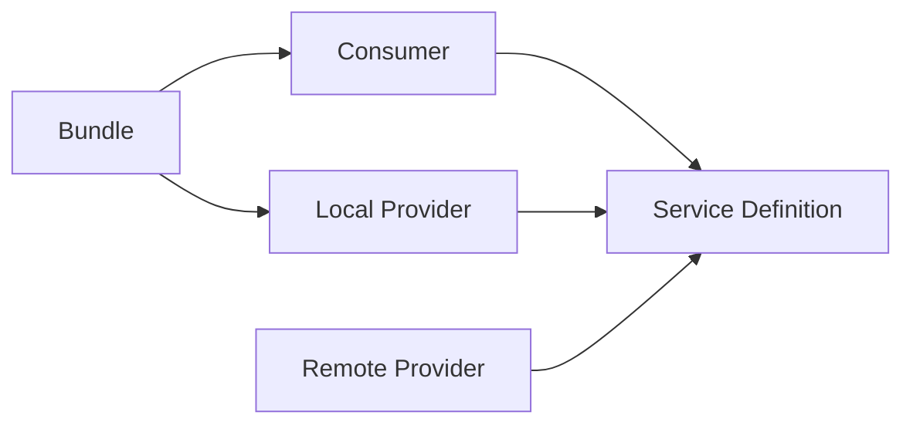
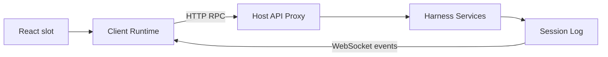
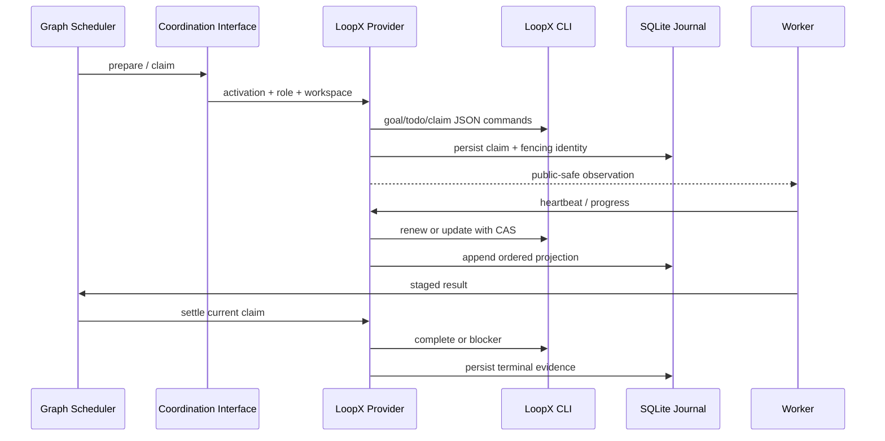

# DeepSeek Harness Technology Stack: From Beginner to Source Close-Up

English | [中文](technical-stack-course.zh.md)

This standalone course does not assume prior knowledge of agent frameworks. It starts with the problem the program solves and progressively reaches plugin composition, the Agent Loop, event logs, tool execution, Web communication, parallel orchestration, and Graph Mode and LoopX lease and recovery mechanisms. “Close-up” means being able to trace a real request to the key source, state owner, and failure-handling point without restating the entire repository line by line.

## 1. Learning Goals and Reading Method

After completing the course, you should be able to answer six questions: where the program starts; how a user message becomes a model request; how a model tool call reaches a file or subprocess; why a session can resume; how the Web page synchronizes with the Host; and how Graph and LoopX coordinate multiple workers without modifying the Agent Loop.

The course uses three viewing distances. The wide view explains processes, package groups, and data flow. The medium view explains Service Definition, Provider, Consumer, and events. The close-up explains key classes, methods, durable records, and cancellation ordering. New readers should proceed in order. Experienced readers can begin with chapters 7, 12, and 13, then use chapter 15 to trace source.

Always distinguish four kinds of fact while reading: configuration decides what is composed; services decide who owns a capability; events decide when extensions can act; session records decide which facts can be replayed. Confusing these layers is the most common obstacle to understanding the project.

## 2. What the Project Is

DeepSeek Harness is an agent runtime whose basic unit of composition is a plugin. It assembles models, prompts, tools, sessions, persistence, approvals, sandboxes, subagents, and user interfaces into a replaceable runtime. The product center is neither one fixed model nor one fixed UI, but a plugin tree managed by Cordis.

It exposes three kinds of entry point. `dsh --profile headless` runs a one-shot command-line task. `dsh --profile web` runs the Host and browser application. ACP and SDK entries expose the same capabilities to other processes or automation clients. The entries differ, but they ultimately compose the same core services and drive the same session event model.

The most important architectural choice is that the Agent Loop owns only the generic loop. Plan mode, compaction, permissions, Graph Mode, LoopX, tool deadlines, and telemetry attach through services or events. New behavior therefore normally appears as “mount a plugin,” not as another conditional branch in the loop.

## 3. The Actual Technology Stack

| Layer | Current technology | Responsibility in the project |
|---|---|---|
| Runtime | Node.js `^22.19.0 || >=24`, ESM | Host, CLI, Worker, filesystem, and subprocess runtime |
| Language | TypeScript 6, `strict` | Static type system for services, events, protocols, and UI |
| Workspace | pnpm 11 workspace | Manages `packages/*/*`, applications, native packages, and vendored Cordis |
| Plugin framework | vendored Cordis, Schemastery | Context, services, events, scopes, configuration validation, and reversible effects |
| Build | TypeScript project references, tsdown, Vite | Separates Host and Client compilation faces and emits libraries and Web assets |
| Model integration | DeepSeek Chat Completions, `pi-ai`, SSE parser | Maps uniform LLM requests to provider streaming protocols |
| Web | React 18, Zustand, Immer, native HTTP, `ws` | Plugin UI, client object state, RPC, and event downlink |
| Data validation | Schemastery, Zod | Plugin configuration and tool schemas; process, persistence, and wire validation |
| Persistence | JSONL + Zstandard, Node `node:sqlite` | Session logs, query indexes, Graph resources/scheduling, and LoopX local projection |
| Concurrency | Promise, AbortSignal, Worker Threads, PTY/subprocesses | Streaming requests, cancellation, code execution, workflows, and command execution |
| Isolation | platform sandboxes, Landlock/bwrap/Seatbelt, process-tree control | Applies deployment policy to filesystem and subprocess capabilities |
| Testing | Vitest, V8 coverage, Playwright, snapshot replay | Unit, contract, real-entry, GUI, and keyless replay validation |
| Observability | Session events, OpenTelemetry logs | Replayable product facts and deployment telemetry |

The table says what the project uses, but not why it is divided this way. The real through-line is: Cordis owns composition and lifecycle; Session owns replayable facts; the Agent Loop owns one request’s control flow; capability packages own side effects; Host and Client own cross-process projection; Graph owns multi-agent work; and LoopX owns external project-level coordination.

## 4. Monorepo and Package Boundaries

The repository uses a two-level “group/package” layout. `packages/core` is the product API spine. Groups such as `llm`, `fs`, `shell`, `subprocess`, and `sandbox` supply capabilities. `session`, `storage`, and `attachment` own data. `subagent`, `jobs`, `workflow`, and `graph` own concurrent work. `host`, `client`, `api`, and `typert` own the Web plane. `bundle` and `boot` own final composition.

Every npm package is named `@deepseek-ai/dsh-*`. Local relative imports retain `.ts`; cross-package imports use package names. Library source lives in `src/` and built artifacts in `lib/`. Source checks use TypeScript `paths` to resolve directly to `src/`, while published consumers read `lib/` through `exports`, so the project explicitly separates its source and artifact planes.

A capability package usually has three roles. A Service Definition declares the interface, types, and `ctx` key. A Service Provider implements local, remote, or platform-specific behavior. A Consumer turns the capability into a model tool, command, UI, or higher service. Dependency direction points from the Consumer to the Definition, not to a concrete Provider, so the implementation can change without changing consumers.



`packages/bundle/base` combines the core Agent, DeepSeek model, tools, session persistence, permissions, and sandbox. `bundle/web-app` adds Host, Client, Graph, and Web UI. `bundle/headless` adds the one-shot command-line driver. A Bundle may depend on a concrete Provider because deployment selection is its responsibility.

## 5. Cordis: The Runtime Skeleton

The Cordis `Context` is the shared plugin runtime context. Services appear through `ctx`, such as `ctx.sessions`, `ctx.tools`, and `ctx.llm`; plugins extend Context and event types through declaration merging. Cordis is more than a dependency-injection container: it also owns plugin scopes, event dispatch, and unload order.

Registration is an effect and must be reversible. `ctx.effect()` registers a resource and its disposer, `ctx.on()` registers an event listener and returns its remover, and a Service is constrained by the lifecycle of its fiber. On plugin unload, file watchers, network ports, Agents, Workers, and registry entries must be released through the same ownership chain.

Events have three important semantics. An ordinary emit broadcasts a fact. A serial event awaits listeners in order. A waterfall lets a listener transform input or stop the chain. A waterfall listener that wants to delegate must call `next()`; returning directly means it has taken ownership of the request.

```text
plugin scope
  -> register service / event / route / tool
  -> serve work while fiber is active
  -> receive unload or abort
  -> stop new work
  -> drain in-flight work
  -> dispose registrations in reverse ownership order
```

The key to understanding Cordis is tracking ownership rather than memorizing APIs. Whenever you see a timer, Agent, WebSocket, or subprocess, ask: who created it; which signal can cancel it; which effect waits for it to quiesce; and which registry can no longer find it after unload.

## 6. Boot, Profiles, and Configuration Layers

The CLI entry is [`apps/cli/src/bin.ts`](../apps/cli/src/bin.ts). It parses arguments and then dynamically imports the `profile`, `plugin`, or `dump-config` path. Dynamic imports keep unrelated modes out of the same startup closure and keep source and built startup in ESM.

A Profile is a named assembly in Harness home, while a Bundle is a publishable configuration patch layer. Startup applies Bundles in Profile order, then the Profile patch, the home patch, and finally command-line `--patch` files. A patch replaces config or inserts plugins through stable entry ids, allowing users to replace models, tools, storage, and UI without forking Bundle source.

```sh
dsh --profile web --dump-config
dsh --profile headless "summarize this workspace"
```

The first command is the preferred way to understand the actual runtime tree. Source package dependencies only say what might be installed; expanded configuration says what this startup installs. Schemastery validates configuration at plugin load. Errors that can be decided locally fail at load, while errors that depend on external state fail at the earliest resolvable point.

The resulting structure is a scope tree, not a flat list. Parent plugins provide services, child plugins inject dependencies, and callers can create agent or session scopes. A child scope can shadow the same service key with a more specific implementation, which is the basis for giving each Agent different tools, prompts, or policy.

## 7. Agent, Turn, Step, and Inbox

`Agent` is the public interface, `AgentLoop` is the default factory and driver, and `ReactLoopAgent` is the current loop implementation. Agent id and Session id share an identity. During create or resume, the factory prepares the Session and scope before atomically publishing both Agent and Session in their registries. Failure or unload uses the same memoized reverse teardown, preventing half-published objects from remaining.

The Inbox receives user messages, steering, follow-up context, and internal follow-ups. A Turn begins when it claims the first executable input and ends when no work remains. A Step is one model request and its tool calls. One Turn can contain multiple Steps because tool results can require another model response, and new input arriving during a run can trigger another Step.

```text
turn/start
  claim inbox input
  agent/pre-step
  step/start
    assemble system prompt + tool schemas
    derive model history from session events
    agent/request
    llm/stream
    assistant/chunk*
    assistant/message
    tool/call* -> tools pipeline -> tool/result*
  step/end
  repeat when more work is owed
agent/turn-stopping
turn/end
```

The key source is [`packages/core/agent-loop/src/agent.ts`](../packages/core/agent-loop/src/agent.ts). `preStep()` uses the `agent/pre-step` waterfall to reject or rewrite claimed messages. `turn()` records the Turn and Step lifecycle. The request path projects history through `session.deriveMessages()`, builds final LLM parameters through `agent/request`, and then invokes `ctx.llm.stream()`.

Cancellation is not merely throwing an exception. The Agent uses `AbortSignal` to make model streams, tools, and waits stop promptly, while teardown must await an idle machine, dispose its scope, and remove registry entries. Callers should distinguish user cancellation, supersession by a new request, resource unload, and execution failure because the reason controls terminal recording, retryability, and UI presentation.

## 8. Prompts, Models, and Streaming Responses

The System Prompt service stores fragments, variables, and tool schemas contributed by plugins. Every Step assembles them again before the request, allowing the current provider, model, cwd, mode, and available tools to enter the request. Only stable prefixes are suitable for model KV caching; fragments containing the current task, Claim, or run state belong in the variable suffix.

The LLM Service Definition standardizes messages, content blocks, tool calls, usage, and streaming events. The DeepSeek Provider maps it to Chat Completions and decodes SSE through `eventsource-parser`; `llm-pi-ai` is the alternative `pi-ai` adapter. Retry, default-model choice, and token metering are separate plugins rather than branches in the Provider.

`agent/request` is the request-level policy entry point. A listener may select a model, add model-visible context, or wrap the stream, but every fact reaching the model must be reconstructable from the Session Log. This “model-visible implies logged” invariant keeps recovery, replay, export, and UI on the same history.

Streaming output first records fine-grained `assistant/chunk` events and later produces `assistant/message`. Keeping raw chunks is not redundant: it preserves the arrival order of text, reasoning, and tool-call deltas so crash recovery and frontend replay do not need to guess what the Provider emitted.

## 9. Tools and Side-Effect Control

The Tools service maintains a scoped registry. Each tool has a name, description, parameter schema, executor, and UI presentation intent. The Agent Loop records `tool/call`, invokes the `tools/pre-execute`, `tools/execute`, and `tools/post-execute` waterfalls, and finally records `tool/result`.

Tool calls can run concurrently, but only calls declared parallel-safe enter a bounded concurrency group; `maxParallelToolCalls` limits concurrency per Agent Step. Every started call retains its own session seq, so parallel completion order cannot break call-to-result references. A scheduler failure also cannot erase call facts already recorded.

Permissions, sandboxing, deadlines, result spill, and repeated-call reminders wrap the tool pipeline. They are not scattered checks inside tool implementations. A permission plugin can ask the user before execution, a sandbox Provider resolves a request into a platform execution specification, a deadline plugin combines cancellation signals, and spill policy stores oversized results externally while returning only a reference to the model.

Shell, Filesystem, Subprocess, and Terminal operate at different levels. Filesystem owns path and file semantics. Shell resolves command requests into execution specifications. Subprocess owns process trees, stdio limits, exit, and termination. Terminal owns persistent PTY sessions. Model tools depend only on the matching Definition, while the Bundle selects local, PowerShell, bash, or sandbox Providers.

Security analysis must identify the real boundary. The Worker Thread Code Runtime provides isolation, heap limits, and forced termination, but deliberately has trust equivalent to bash and is not a malicious-code security boundary. Process sandbox and filesystem policy constrain host access. Approval is also not a sandbox substitute; it represents user authorization only.

## 10. Session Log: The System Ledger

A Session is an in-memory append-only event sequence. Every event has a continuous `seq`, time, and discriminated data. `turn/start`, `step/start`, `user/message`, `assistant/chunk`, `tool/call`, and `tool/result` are durable facts. Live events such as `agent/request` only extend the current operation and do not directly become history.

`Session.deriveMessages()` does not read a second mutable chat array; it projects model messages from the event sequence. Crash repair, compaction, forks, child-session provenance, and model history can therefore share one ledger. A new model-visible input requires an extension to `SessionEventMap` and a projection rule.

Session Persistence is a separate capability. Its coordinator listens to `session/created`, `session/event`, `session/flush`, and `session/disposed`, serializes writes per Session, batches events within a fixed window, and drains on flush or unload. A backend implements reading, appending, repair, and listing without reimplementing the upper lifecycle.

The default JSONL backend stores each Session as an append-only logical log, normally in concatenated Zstandard frames; every batch is checksummed and `fsync`ed. If a crash leaves an incomplete tail, loading retains the final valid prefix and synthesizes closing events for tools, Steps, and Turns. The SQLite backend uses Node’s built-in `node:sqlite`, maps headers and events to rows, and shares the same Persistence Coordinator.

Crash recovery does not pretend that an unknown side effect never happened. An assistant tool request without a durable `tool/call` becomes `TOOL_NOT_STARTED`; a durable `tool/call` with no result becomes `TOOL_OUTCOME_UNKNOWN`. The model may automatically retry only read-only or idempotent work; side-effecting calls require verification or user input first.

## 11. Web Host, RPC, and Plugin UI

Web mode contains two Cordis worlds: the Host and the browser. The Host uses Node `http` for static assets, API routes, and upgrade routes; the Client starts its own plugin tree in the browser. React is only the rendering layer. UI features remain Client plugins registered into slots instead of accumulating in one monolithic component.

Browser uplink requests use fetch-shaped RPC handlers, while Host downlink events use WebSocket. `rpcId` is a branded correlation id and responses must echo the request id. Approvals and questions can replay across reconnects, while ordinary pushes receive their own ids. Zod validates wire data, and Host business services retain domain types.

Typert generates Host/Client type graphs, codecs, and Remote Service metadata from TypeScript declarations. `api/gateway` and `api/remotes` expose service methods as typed RPC, and the runtime registry manages mounted contributions. It keeps type, schema, and plugin lifecycle aligned across processes rather than generating an unrelated set of REST controllers.

Client Runtime stores object state with Zustand and produces immutable updates with Immer; Session Runtime creates a scope tree per session. `web-react` uses a `useSyncExternalStore` bridge to connect service snapshots to React. Session events drive local object updates, so the UI does not refetch an entire Session for every chunk.



## 12. From One Agent to Parallel Work

The Subagent capability creates or derives child Agents. Providers can spawn or fork in process, or connect to Codex, Claude Code, ACP, or DSH SDK. Parent-child relationships are recorded in Session Headers and events, while the tool layer depends only on the Subagent Service Definition.

Jobs provide generic handles and output reads for long-running background tasks. Workflow runs structured workflows in a Worker Thread. Code Runtime executes model-generated TypeScript in a fresh Worker Thread. Their purposes differ: Job owns lifecycle, Workflow owns an orchestrated program, and Code Runtime owns one budgeted code execution.

Graph adds a durable, revisable DAG above these capabilities. Every node describes role, task, dependencies, acceptance criteria, workspace ownership, model, and budget. Revisions are immutable; changing the task creates another Revision rather than rewriting history. A Run Snapshot stores complete execution evidence for one Revision.

Graph Mode attaches to an ordinary Agent through `/graph`, a controller prompt, `graph_submit`, Session events, and a background Scheduler. The controller remains an Agent and Workers still execute through the Subagent capability. The Agent Loop neither knows about the DAG nor contains a Graph branch.

## 13. Graph Mode Scheduling Mechanics

The controller classifies user input as new work, revision, inspection, control, clarification, or direct response. New and revised work first forms a semantic draft without Host-owned identity fields. Graph Mode then derives graph id, revision, timestamp, run defaults, and physical workspace allocation, validates them, and stores an immutable Revision.

A node becomes runnable only after all predecessors terminate, conditional edges pass, resources are available, and a coordination Claim succeeds. Admission simultaneously considers the global Worker count, role caps, provider/model caps, weight budget, and reserved controller capacity. Parallel writable nodes must declare disjoint relative `writeRoots`.

Every node execution creates an Activation and an Attempt. The Scheduler persists pending execution before reserving external resources or coordinating, and it uses explicit Session flush barriers before critical external side effects. The Worker publishes progress, checkpoints, token usage, and lease renewals; its Monitor enforces budget, no-progress timeout, wall-clock limit, and cancellation.

Successful output is staged before schema validation, acceptance checks, and artifact integration. Review and verification nodes must return a structured decision and issues. If terminal coordination writeback fails, Graph does not rerun a successful Worker; it enters an `awaiting_user` reconciliation checkpoint and retries only settlement during recovery.

A revision invalidates the transitive successors of changed nodes without rewriting old Revisions or Runs. Unaffected nodes with successful evidence can be explicitly reused. Pause, approval, skip, retry, resume-from-node, and substitute-output operations all pass through one serial control service with exact graph/revision/generation identity, so a stale page cannot mutate a newer generation.

## 14. LoopX Design, Implementation, and Coupling

LoopX is an external Provider for the Graph Coordination Service. It is neither the Agent Loop nor the Graph Scheduler. Graph decides when a node is ready, how much concurrency is allowed, and which model and workspace to use. LoopX provides project-level goal, todo, peer, claim, lease, cancellation, and terminal evidence. The two connect through `dsh-graph-coordination`.

Preparation confirms that the configured LoopX goal is readable and that role-to-peer mappings exist. Only after a node is ready does the Provider lazily create a todo marked with the Activation, claim it with the matching peer, and give the Worker a public-safe observation capped at 8,000 characters. Raw registry state never enters the model prompt directly.

A Claim uses a hard lease. Every heartbeat advances the LoopX lease version and returns a new lease id, expiration, and fencing token; later progress, cancellation, and settlement must carry the current identity. Terminal writeback uses the current LoopX CAS version, so a late old Worker cannot overwrite a newer Claim.

The local `LoopxCoordinationJournal` uses Node `node:sqlite`. Schema Version 2 stores Claim, owner, progress, cancellation, terminal state, and ordered events by physical Activation. Cursor and event sequence remain continuous. After restart, settlement recovers the todo id from the durable Claim rather than relying on an in-process Map. Terminal operations serialize per Activation, so one waiting task does not block unrelated work.



Coupling is layered. Architectural coupling is low: Graph sees only the Coordination interface and can replace the Provider; the LoopX Provider does not modify the loop or node business logic. Deployment coupling is stronger: it depends on LoopX CLI commands, JSON fields, preconfigured goals and peers, working directory, and executable path. Persistence coupling is explicit: LoopX is the external source of fact, while SQLite is a recoverable local projection rather than a distributed-transaction participant.

The LoopX Provider deliberately does not apply heartbeat quota, vision, the LoopX scheduler, or worktree policy to in-session nodes. Graph admission continues to own concurrency and resources, Harness continues to resolve workspaces, and the model sees only a trimmed Claim observation. This division prevents two schedulers from deciding the same node.

When a Windows Host uses LoopX installed inside WSL, `executable` can be `wsl.exe`, `executableArgs` can select the distribution and LoopX binary, and `pathStyle` can be `wsl`. The Provider converts only the registry path; the Host still supplies subprocess cwd. Every CLI operation has an independent deadline, stdout/stderr byte limits, and process termination grace period.

Recovery retains a distributed limitation. LoopX and the local projection do not commit atomically. Stable tags can backfill the window where an external mutation succeeded but the local record was not yet written, and reconciliation never overwrites either ledger on conflict. Hosts that share neither the journal file nor authenticated durable storage cannot share local cursors or progress deduplication state.

## 15. End-to-End Close-Up of One Request

Consider a Web user asking to modify a file and run a test. The browser Session object creates a request with an `rpcId`. Host API validates wire data, locates the target Agent, sends the message to the Inbox, and records `user/message` in the Session. WebSocket returns events to the browser so the input can immediately show accepted state.

The Agent claims the input and records `turn/start` and `step/start`. System Prompt gathers workspace instructions, time, mode, and tools; Tools produces schemas; Session projects history. `agent/request` lets routing and mode plugins enrich the request, and then the LLM Provider starts its HTTP/SSE request.

The model stream produces text and tool-call deltas, each recorded as `assistant/chunk`. Once a complete tool call forms an `assistant/message`, the Agent records `tool/call`. Permission policy decides whether interaction is required; a Filesystem or Shell Consumer invokes its Service; a Sandbox Provider resolves allowed paths and commands; a Subprocess Provider launches a process under signal, deadline, and output limits.

Completion records `tool/result`. If the model still owes a final response, the Agent starts another Step; otherwise it records `step/end` and `turn/end`. Persistence Coordinator appends events in the background and awaits storage at critical flush points. Client applies downlink events to Zustand objects, and React slots rerender only affected regions.

In Graph Mode, the controller’s `graph_submit` does not directly modify files. It persists a Revision and Run, the Scheduler acquires resources and a Coordination Claim for each ready node, and only then starts a child Agent. LoopX participates only in Claim, lease, and settlement; actual tool calls still run through the child Agent’s own Agent Loop and session log.

## 16. How to Extend the Project

First classify a new capability as fact, policy, or side effect. A fact that must survive reload becomes a Session Event. Policy affecting only the current request attaches to the appropriate waterfall. A replaceable side effect gets a Service Definition, Provider, and Consumer. A pure UI feature registers a Client slot. Do not modify the Agent Loop merely because its call site is convenient.

A complete capability normally lands in this order: define domain types and Service; implement at least one Provider; implement a model tool or another Consumer; put registrations in `ctx.effect()`; choose the implementation in a Bundle; record model-visible text and events; add unit, contract, assembled-entry, and snapshot validation; and update the owning README and subsystem documentation.

Validate data at boundaries: configuration, model-tool JSON, persistence, Worker messages, subprocess JSON, and RPC wire are untrusted. Do not repeat runtime validation for same-process internal calls guaranteed by TypeScript. Cross-package ids use branded strings, closed unions use a discriminant and `assertNever`, and extensible maps use declaration merging.

For concurrent code, write ownership and termination conditions first: who may start work; who may cancel it; whether a late result still has commit authority; what disposal awaits; and whether persistence occurs before or after an external side effect. Graph fencing, Agent memoized teardown, and Session per-id serial writing are different answers to the same questions.

## 17. Build, Test, and Quality Gates

`pnpm run build` builds Host and Client libraries before the Web app. Host and Client use separate TypeScript aggregates, tsdown emits runtime code and declarations, and Vite emits browser dist. Source startup uses `node --import tsx/esm`; configuration subprocesses after build must resolve `lib/` under plain Node.

```sh
pnpm run typecheck
pnpm run lint
pnpm run test
pnpm run test:coverage
pnpm run test:snapshot
pnpm run build
pnpm run hygiene
pnpm run doc-sync
```

Unit tests verify local behavior, contract tests verify that multiple Providers can share a Definition, invariant plugins verify owned relationships in the assembled runtime, snapshots use real examples and keyless replay to verify model-visible trajectories, and e2e tests verify real Providers when credentials exist. Mock-only unit tests cannot establish product-visible behavior.

The coverage gate is `test:coverage`, not ordinary `test`. Documentation is jointly checked for links, physical wrapping, Mermaid, TypeScript fences, generated catalogs, bilingual pairing, and site build. Published packages also pass publint, NodeNext consumer checks, runtime closure, and workspace constraints.

## 18. Source Reading Route and Exercises

First run `dsh --profile web --dump-config`, then read [`docs/architecture.md`](architecture.md), [`docs/cordis-primer.md`](cordis-primer.md), and [`packages/README.md`](../packages/README.md). The goal is to move from a configuration entry to its package and from the package to its `ctx` service key.

Next trace one request. Start CLI reading at [`apps/cli/src/bin.ts`](../apps/cli/src/bin.ts), Agent reading at [`packages/core/agent-loop/src/agent.ts`](../packages/core/agent-loop/src/agent.ts), tool concurrency at [`packages/core/agent-loop/src/tool-calls.ts`](../packages/core/agent-loop/src/tool-calls.ts), and session history at `deriveMessages()` in [`packages/core/session/src/index.ts`](../packages/core/session/src/index.ts).

Then trace persistence and Web. Persistence starts at [`packages/session/session-persistence/src/coordinator.ts`](../packages/session/session-persistence/src/coordinator.ts), the Web carrier at [`packages/client/connection/src/index.ts`](../packages/client/connection/src/index.ts), RPC types at [`packages/host/apiproxy/src/api/rpc.ts`](../packages/host/apiproxy/src/api/rpc.ts), and Client state at [`packages/client/runtime/src`](../packages/client/runtime/src).

Finally read parallel orchestration. Begin with [`packages/subagent/README.md`](../packages/subagent/README.md), continue with [`packages/graph/graph-mode/README.md`](../packages/graph/graph-mode/README.md) and [`packages/graph/graph-coordination/README.md`](../packages/graph/graph-coordination/README.md), then read [`packages/graph/graph-coordination-loopx/README.md`](../packages/graph/graph-coordination-loopx/README.md) and its `journal.ts` and `index.ts` implementations.

Exercise one: choose a headless run and list its Turn, Step, assistant, and tool events by seq. Exercise two: draw both paths of a waterfall listener, with `next()` and with short-circuiting. Exercise three: for a side-effecting tool, define recovery when a crash occurs before `tool/call`, after external execution, and before `tool/result`. Exercise four: for a two-node Graph, mark the identity relationships among Revision, Run, Activation, Attempt, Claim, and Settlement.

## 19. Terminology Quick Reference

| Term | Precise definition |
|---|---|
| Plugin | A mountable unit that contributes services or effects to a Cordis Context and can unload |
| Service | A typed capability available through `ctx` with an owned lifecycle |
| Provider | A concrete implementation of a Service Definition |
| Consumer | A plugin that uses a capability and exposes a tool, command, UI, or higher service |
| Session | The conversation fact ledger made of append-only events and an immutable header |
| Turn | The full handling interval from claiming input until no work remains |
| Step | One model request and the tool calls it produces |
| Projection | Deriving model history, UI state, or a query view from events |
| Revision | An immutable version of a Graph definition |
| Run | The durable execution snapshot of one Revision |
| Activation | The physical activation identity of a node in one Generation |
| Attempt | One Worker execution or continuation within an Activation |
| Claim | Execution authority granted to an Activation by external coordination |
| Lease | A Claim validity interval that expires and can be renewed |
| Fencing token | A monotonic identity that prevents late old-Claim writeback from replacing a new owner |
| Settlement | Idempotent terminal writeback for a Claim together with evidence |

## 20. Foundation Mental Model

Remember the system as five layers. The Cordis plugin tree determines what the runtime has. The Agent Loop determines how one input advances. The Session Log determines what can be recovered and explained. Capability Providers determine how side effects execute and are isolated. Host/Client, Graph, and LoopX respectively project the single-agent runtime into a human interface, extend it into a multi-agent DAG, and connect it to an external project control plane.

Use the same diagnosis order for every problem: inspect expanded configuration, locate the service owner, find the triggering event, find the durable record, and finally inspect cancellation and teardown. If you can explain one success, one failure, and one restart recovery along this route, you have moved from using the project to being able to modify it.

## 21. Implement a Minimal Agent Loop from Scratch

The goal is not to reimplement Harness, but to understand the difference between an agent and an ordinary chat endpoint in fewer than one hundred lines. Chat performs one `messages -> completion` operation. An agent loop also recognizes tool calls, executes side effects, appends observations to history, and decides whether to continue, complete, cancel, or fail. An agent is therefore a state machine whose transitions partly depend on model output.

A minimal state set is `idle -> requesting -> executing -> requesting -> completed`; every active state can also enter `canceled` or `failed`. Production adds Turns, Steps, persistence, and recovery, but adding them to a loop with no explicit states only amplifies races.

The following compilable teaching implementation omits network protocols and schema libraries while preserving four essential rules: tool names must resolve through a registry; arguments are parsed before execution; results append in message order; and the loop owns a step limit and cancellation signal.

```ts
type Message =
  | { role: 'user' | 'assistant'; content: string }
  | { role: 'tool'; callId: string; content: string }

interface ToolCall {
  id: string
  name: string
  arguments: string
}

interface ModelReply {
  text: string
  toolCalls: ToolCall[]
}

interface Model {
  generate(messages: readonly Message[], signal: AbortSignal): Promise<ModelReply>
}

interface Tool {
  execute(args: unknown, signal: AbortSignal): Promise<unknown>
}

export async function runAgent(
  model: Model,
  tools: ReadonlyMap<string, Tool>,
  prompt: string,
  signal: AbortSignal,
  maxSteps = 12,
): Promise<readonly Message[]> {
  const messages: Message[] = [{ role: 'user', content: prompt }]
  for (let step = 0; step < maxSteps; step++) {
    signal.throwIfAborted()
    const reply = await model.generate(messages, signal)
    messages.push({ role: 'assistant', content: reply.text })
    if (reply.toolCalls.length === 0) return messages
    for (const call of reply.toolCalls) {
      signal.throwIfAborted()
      const tool = tools.get(call.name)
      if (tool === undefined) throw new Error(`unknown tool: ${call.name}`)
      const args: unknown = JSON.parse(call.arguments || '{}')
      const value = await tool.execute(args, signal)
      messages.push({ role: 'tool', callId: call.id, content: JSON.stringify(value) })
    }
  }
  throw new Error(`agent exceeded ${maxSteps} steps`)
}
```

Analyze failure paths, not only the happy path. If `model.generate()` succeeds but the process stops before persisting the assistant message, can recovery know the model already responded? If a tool succeeds before its result is logged, can it retry safely? Do concurrent results enter history in completion or model order? Does cancellation synthesize results for unstarted calls? These questions explain the extra complexity in Harness session events, tool scheduling, and recovery closers.

Lab: implement a read-only fake `get_weather` tool and a non-idempotent `increment` tool. Inject failure before the model request, after tool execution, and before result append. Once you observe that `increment` cannot recover safely from in-memory messages alone, specify the durable intent, operation id, and reconciliation API you need.

Interview answer: when asked what an agent loop is, begin with the state machine and feedback loop, then explain that production must align model output, tool side effects, and durable state. “Call the model until no tool call remains” omits cancellation, bounds, crash windows, and unknown side effects.

## 22. Model Requests, Tokens, and KV Cache

A model request consists of the system prompt, tool schemas, history, current input, routing fields, and output cap. The model does not see Session Events directly: `deriveMessages()` projects an adapter-neutral surface, then an Adapter maps content blocks to the provider API. In an interview, distinguish domain messages, the Harness request, and the Provider wire payload.

Token budget has at least four parts: stable prefix, history, current input, and reserved output. Given context window `C`, system and tools `S`, history `H`, current input `U`, and output reserve `O`, safety requires `S + H + U + O <= C`. Production also leaves margin for tokenizer estimation error, hidden reasoning tokens, and Provider-specific fields.

KV Cache optimization is not merely shortening prompts; it is keeping the longest possible prefix byte-stable. A timestamp, random id, or dynamic tool order near the beginning invalidates reuse for all later history. Harness puts stable policy in the prefix and task, Claim, and run state in the suffix; compaction replays the original prefix and appends its instruction last.

A streaming protocol must represent text, reasoning, tool-argument deltas, usage, finish reason, error, and abort. Tool JSON can span chunks and cannot be parsed one delta at a time. A clean transport close also does not prove semantic success because the final finish can mean length truncation or filtering. The Adapter normalizes provider throws and terminal errors into the common LLM semantics.

Lab: estimate system-prompt, tool-schema, history, and output tokens in a real or mock request. Change one timestamp in the system prefix and explain why reuse stops at that token. Redesign the request by moving dynamic values to user input or a suffix, and identify the prefix that remains reusable.

Common follow-ups ask whether temperature controls correctness, whether `maxTokens` equals visible answer length, why Function Calling can still produce invalid arguments, and whether an SSE disconnect can be replayed blindly. Good answers note that sampling changes a distribution, reasoning can consume the cap, schemas are not absolute guarantees, and replay depends on request and tool idempotency.

## 23. Tool Development: From Schema to Side Effect

A tool is not an ordinary function plus a description. A complete tool defines the model-facing name and schema, runtime validation, execution mode, permission and sandbox requirements, result-size policy, error and cancellation semantics, and UI rendering. Missing any of them can give the model, Host, and user different facts.

Begin with side-effect classification. Read-only idempotent tools can retry safely. Idempotent writes need a stable operation id or target state. Non-idempotent writes require preflight checks, a transaction, or reconciliation. Creating an order or appending a line is not retryable merely because the call is simple.

The schema should express real preconditions instead of asking the executor to guess defaults. Deployment policy belongs in plugin config, per-call values in tool parameters, and security invariants in fixed rules. Results should distinguish user argument errors, permission denial, timeout, Provider failure, and internal defect so the model knows whether to correct, request approval, retry, or stop.

The Harness scheduler treats exclusive calls as barriers and parallel calls as a bounded rolling pool. Bodies may complete concurrently, but `tool/result` and additional context commit in model order. Cancellation stops replenishment, drains started calls, and records replayable synthetic errors for unstarted calls.

Lab: design a file-metadata tool before coding it. Specify input constraints, output fields, execution mode, accessible roots, maximum output, timeout, error codes, retryability, and UI presentation. Then move path authorization from the Consumer to the Filesystem Provider and explain why platform policy must not be copied into every tool.

A common coding interview asks for bounded concurrent tool execution. The correct design uses a next-start index, an in-flight set, settled slots indexed by original order, and a commit cursor that advances only over a contiguous settled prefix. `Promise.all()` cannot dynamically bound concurrency, stop replenishment after abort, insert exclusive barriers, or commit in model order.

## 24. Event Sourcing, Persistence, and Crash Recovery

Event sourcing matters because model history, UI, recovery, and audit derive from one fact sequence, not merely because logs can be viewed. Maintaining a mutable chat array, database state, and UI state independently creates three truths when one write fails. Harness uses append-only Session Events and projections for the current surface.

An event records a fact that occurred, not a vague future intention. `tool/call` says a call entered durable history, and `tool/result` says the system obtained a presentable result. For external effects, Graph persists and flushes an operation intent before the effect, then records its reference or settlement so recovery knows what to inspect.

Batching improves throughput but changes the crash window. If the process stops after memory append and before disk flush, the UI may have seen an event recovery cannot read. Critical external operations therefore require explicit flush. Per-Session serialization preserves continuous seq but does not by itself prevent two Hosts from writing one Session; that needs exclusive ownership or a single-writer deployment rule.

Recovery reads the longest valid prefix and identifies unmatched structures. An assistant request with no durable call can be marked not started; a call with no result is only outcome unknown. Unknown non-idempotent effects cannot be synthesized as success or failure. Repair events append and cite original facts rather than silently rewriting history.

Lab: add `run/start`, `model/reply`, `tool/call`, `tool/result`, and `run/end` to the chapter 21 loop. Write a pure projection for message history and a recovery diagnostic for a log containing a call but no result. Explain why appending a repair event is more auditable than deleting the last bad event.

Interview answer: when asked why not store final state directly, acknowledge that snapshots read faster, then explain that events preserve causality and recovery evidence. A real system can maintain rebuildable snapshots and indexes while events remain authoritative. Mention schema evolution, log growth, projection rebuild cost, and sensitive-data governance as tradeoffs.

## 25. Context Engineering, Memory, and Compaction

Context engineering supplies the minimum sufficient information for the current decision within a finite window. It includes system rules, tools, recent conversation, workspace instructions, retrieval results, task state, and failure evidence. Inserting all available data increases cost, lowers attention density, damages KV Cache, and expands the prompt-injection surface.

Short-term memory is normally the current conversation surface. Long-term memory can contain cross-session indexes, preferences, or domain knowledge. Working memory contains the active plan, todo, Claim, and checkpoint. They need different update and forgetting policies. A long-term write must consider provenance, scope, sensitivity, and expiry rather than treating model inference as user fact.

A RAG retrieval pipeline includes query construction, candidate recall, filtering, ranking, deduplication, and context assembly. Evaluate retrieval recall separately from answer correctness: failure may come from missing evidence or failure to use retrieved evidence. Session Query provides bounded event reads, lineage, and SQLite full-text search, but is not automatically a knowledge-base memory system.

Harness compaction measures pressure against routed model capacity and token usage, optionally prunes oversized tool results without a model, then summarizes the oldest complete surface units while retaining the recent tail and balanced call/result pairs. A summary must shrink its source; failure preserves the latest durable surface rather than replacing history with an empty summary.

Lab: summarize a conversation containing system rules, three tool calls, and one user correction. Preserve the original objective, correction, paths, failure reason, pending work, and next action; remove greetings, duplicate explanation, and obsolete plans. Identify what should remain verbatim in the recent tail and what may enter the summary.

Interview follow-ups ask whether summaries hallucinate, how long-term memory is verified, and when to use vector, full-text, or structured search. Strong answers use citations, structured fields, confidence, and human correction; choose retrieval by data type; and treat summaries as lossy projections rather than replacements for raw events.

## 26. Concurrency, Cancellation, Timeouts, and Fencing

Most difficult agent failures are asynchronous ownership problems, not model problems. For every async object, write down its creator, committer, canceler, and cleanup join point. When “who can finish the Promise” differs from “who may still commit,” the design needs a generation, epoch, or fencing token.

`AbortSignal` represents cooperative cancellation and cannot guarantee immediate stop. A caller stops starting work, propagates the signal, waits for started tasks or forcibly terminates them, and reaches quiescence before returning. Calling only `abort()` or `kill()` leaves orphan work that can still write files, occupy ports, or invoke old listeners.

Timeout and cancellation are orthogonal. A subprocess can receive a timeout signal and still exit 0 after handling it; the result should report both `timedOut: true` and `exitCode: 0`. Retry depends on error class, idempotency, remaining deadline, and backoff budget, not a fixed exception count.

Fencing prevents late old owners. Lease expiry does not physically remove an old process. After a new owner receives a higher token, storage and external APIs must reject lower-token writes. LoopX lease version, Graph owner epoch, and control generation all express current commit authority.

Lab: implement a search controller with a `generation`. Every query increments it and aborts the old request; a result can update UI only if its captured value equals the current generation. Explain why canceling the old fetch alone cannot block a late result already in parsing or caching.

Failure question: A holds a 30-second lease, pauses for 40 seconds, B takes over and writes, then A resumes. Explain why checking expiry alone is insufficient, which value belongs in a conditional database update, and what to do when an external API lacks CAS. The answer should use monotonic fencing and isolate output for reconciliation when fencing is impossible.

## 27. Agent Security Model

Agent security starts by classifying trust sources. User input, Web content, repository files, tool output, and other agent messages can contain prompt injection; model output and tool arguments are also untrusted. System Prompt priority is a model-behavior instruction, not an operating-system security boundary.

Permissions, policy, and sandbox have different jobs. Permission records user authorization for an action. Policy constrains resource access for a request class. Sandbox enforces limits at the process or kernel level. Even after user approval, a subprocess should not receive Harness secrets, unrelated directories, or the ambient environment.

Common threats include path traversal, symlink or junction following, command injection, environment-secret leakage, predictable temporary files, output explosion, decompression bombs, SSRF, prompt injection, and cross-tenant confusion. Enforcement belongs in the Provider closest to the resource, not in a reminder for the model.

Tool results also need content and size controls before entering model context. A public-safe observation contains only fields needed by the worker; raw LoopX registry data, credentials, and internal scheduling information stay out. Logs and telemetry also need redaction because “not sent to the model” does not mean “not exported.”

Lab: threat-model “fetch a URL and write it to the workspace.” List assets, attackers, entries, trust boundaries, and worst impacts. Cover private-network SSRF, oversized responses, malicious filenames, redirects, content prompt injection, and writes outside the root. Assign each mitigation to URL parsing, Web Provider, Filesystem Provider, permission layer, or model policy.

Interview answer: do not stop at “we have a sandbox.” State its platform implementation and limits, then cover credential isolation, network policy, filesystem roots, resource caps, approval, audit, and failure defaults. Security requires defense in depth and fail-closed behavior, not one prompt.

## 28. Multi-Agent Orchestration and Graph Design

Multi-agent work is not simply starting models concurrently. It is useful when work can be decomposed, subtask interfaces are clear, and parallel benefit exceeds coordination cost. If every worker edits one core file or waits frequently for the controller, one serial agent is usually faster and safer.

Design a DAG by writing node artifacts and acceptance criteria before dependencies. A good node usually takes 10 to 30 minutes, has two to four testable criteria, and owns write paths disjoint from parallel nodes. A Review node consumes explicit outputs and returns a structured decision rather than “check it.”

Parallel gain is limited by the critical path. Runtime is approximately critical-path duration plus scheduling and integration overhead, not total node time divided by worker count. More workers can cause model throttling, memory pressure, conflicts, and duplicated context, so admission needs global, role, model, weighted, and workspace limits.

Graph separates immutable Revision, Run, physical Activation, and execution Attempt so revision, retry, and recovery do not overwrite history. A LoopX Claim adds external execution authority to an Activation. Lease and fencing control commit authority but do not replace Graph’s dependency, resource, and artifact decisions.

Lab: decompose “add implementation, docs, and tests for a new tool.” Let an architecture node establish the interface and criteria, implementation and documentation use disjoint write roots in parallel, integration tests follow, and Review finishes. Name the artifact on each edge and compute the critical path from assumed durations.

System-design follow-ups ask how to prevent two agents editing one file, handle worker success with settlement failure, and revise a running graph. Use static ownership checks, resource and coordination Claims, staged output, settlement-only retry, immutable Revision, and invalidation of affected successors.

## 29. Evaluation, Testing, and Observability

Agent evaluation separates final outcome, process safety, and resource cost. Useful metrics include task success, acceptance-criteria pass rate, correct tool calls, invalid retries, human takeover, token and latency, dangerous-action rate, and recovery success. One “looks good” score cannot detect side effects or crash failures.

An offline set includes ordinary tasks, edge inputs, permission denial, Provider errors, context overflow, cancellation, and recovery. Each case stores input, environment, machine-checkable outcome, allowed trajectory variation, and forbidden behavior. Compare paired deltas across model or prompt changes rather than one average score.

LLM-as-judge helps with open text but has position, self-consistency, and same-model biases. Randomize order, use an explicit rubric, retain human gold samples, and prefer deterministic checks for compilation, test exit code, file diff, and schema.

Harness snapshot replay fixes Provider output but uses a real composition entry, making it suitable for model-visible text, events, and tool trajectories. Unit and contract tests prove local semantics, e2e proves live APIs, and fault injection proves durable intent and recovery. These tiers answer different questions.

Observability needs request id, session id, turn and step, model route, tool call id, latency phases, usage, cancellation reason, and error code. Session Events are product facts and OpenTelemetry is deployment observation. Sensitive content, raw reasoning, and credentials must not be recorded without bounds merely for debugging.

Lab: design ten eval cases for a search-and-summarize agent, including two tool timeouts, two empty retrievals, one user cancellation, and one prompt injection. Separate deterministic from judge assertions, then name the event, RPC, Provider, and tool metrics needed for failure diagnosis.

## 30. Lab: Develop a Model-Visible Context Plugin

This exercise covers a common Harness change: add a recoverable project label to every model request. Config supplies the initial label, a command can change its value per session, the model sees the latest value, and recovery preserves it. Because it changes and reaches the model, it cannot live only in memory.

First define a session event such as `project-label/change` with a validated label. Next fold the latest event through Session projection or plugin state. Add the current value to the variable suffix through System Prompt or `agent/request`. Make the command validate and append only. Put every registration in `ctx.effect()` or `ctx.on()`.

```ts
interface ProjectLabelEvent {
  label: string
}

export function normalizeProjectLabel(value: string): ProjectLabelEvent {
  const label = value.trim()
  if (label.length < 1 || label.length > 80) {
    throw new Error('project label must contain 1 to 80 characters')
  }
  return { label }
}

export function latestProjectLabel(
  events: readonly ProjectLabelEvent[],
): string | undefined {
  return events.at(-1)?.label
}
```

Verify four layers. Unit tests cover label bounds and folding; plugin tests prove registration and disposal; Agent Loop tests prove the request contains the latest value and can be rebuilt from history; a snapshot uses the real command entry to prove user- and model-visible text. Add a recovery test that saves the session, reconstructs the Agent, and obtains the same label without old process memory.

An interviewer may ask why not use settings. Settings represent user- or deployment-owned current configuration, while this label is a model-visible fact in session history. Its change needs a time point, and replay of old requests needs the value at that time. Config or settings is appropriate if the label never varies with a session.

## 31. Diagnosing Three Failure Cases

Case one: a tool appears successful in UI but the model executes it again after restart. Inspect configuration, service, live event, durable event, and flush in order. A common cause is UI updating from a transient callback while `tool/result` never entered Session or had not flushed. Project UI from durable events and preserve recoverable evidence around non-repeatable effects.

Case two: a file changes after user cancellation. Determine whether commit preceded cancellation or an orphan process completed later. Check signal propagation to Subprocess, whether teardown awaits `done`, and whether the tool rechecks commit authority. Cancellation cannot roll back an existing effect; the right result can be “cancellation requested, outcome unknown” followed by reconciliation.

Case three: a Graph node produced files but the Run remains `awaiting_user`. Inspect staged output, resource release, and coordination settlement independently. If the Worker succeeded and LoopX CAS writeback failed, never rerun the Worker. Retry settlement with the durable Claim and fencing identity, preserving both ledgers for human choice on conflict.

A reusable diagnosis table has five columns: observed symptom; last trusted durable event; resources that may still run; generation or token with commit authority; and next read-only verification. Establish facts before changing code so “add retry after timeout” does not duplicate effects.

Interview answer: describe failures as timelines and separate observation, inference, and required verification. Strong candidates first protect data and stop propagation, then locate ownership and persistence windows, and finally propose a fix that tests can reproduce instead of immediately adjusting a prompt.

## 32. Agent System Design Interview Framework

For “design a coding, support, or research agent,” first clarify success criteria, permitted side effects, response latency, concurrency, data sensitivity, human intervention, and recovery goals. Drawing a vector database and multiple agents before these constraints is technology stacking.

Next present the main path: entry and identity, task state machine, model request, tool registry, permission and sandbox, event log, persistence, and frontend event stream. Add retrieval, compaction, background jobs, and multi-agent only after naming the bottleneck each solves.

The data model distinguishes Session, Message/Event, Tool Call/Result, Run/Attempt, and external Operation. APIs include create or resume session, send input, subscribe to events, cancel, answer approval, and query status. State idempotency keys, pagination cursors, payload caps, and authenticated principals.

Cover reliability by failure domain: model throttle and timeout; unknown tool result; Host restart; duplicate request; downlink disconnect; worker competition; storage corruption. Assign deadline, backoff, idempotency, flush, replay, fencing, or human reconciliation rather than saying only “retry and monitor.”

Estimate concurrent model requests from `QPS × average request duration`, log size from per-session event rate and retention, and spill storage from tool-output caps. Models dominate cost and latency, but browser fan-out, PTYs, Worker memory, and SQLite writers can bottleneck a local Harness.

Finish with security, evaluation, and evolution: prompt injection, tenant isolation, keys, audit; offline eval and online metrics; model and tool-schema versions; event compatibility. A complete design makes explicit tradeoffs among capability, reliability, cost, and governance.

## 33. Frequent Interview Questions and Reference Answers

### 33.1 Foundations and Models

**Question: how do agent and workflow differ?** An agent lets a model choose the next action from observations at runtime and suits open tasks. A workflow fixes control structure in code and suits stable processes. Production often puts an agent inside one controlled workflow node.

**Question: what is ReAct’s core value?** It forms a feedback loop among reasoning, action, and observation so the model can adapt to tool results. Engineering need not expose private chain of thought; persist executable actions, public progress, and outcome evidence.

**Question: why validate structured output?** Generation is probabilistic, and Provider schema mode can still truncate, degrade, or add unknown fields. Validation failure becomes a diagnostic result with bounded repair or retry, never an unsafe cast followed by a side effect.

**Question: how do you reduce token cost?** Preserve stable prefixes for KV Cache, route models by task, limit tool schemas, prune large results, retrieve only relevant context, compact old history under pressure, and measure each path rather than only shortening the system prompt.

### 33.2 Tools, State, and Reliability

**Question: how do you guarantee a tool runs once?** A general system cannot manufacture exactly-once. Stable operation ids, idempotent APIs, unique database keys, transactional outbox, or post-execution reconciliation achieve effectively-once. Non-idempotent external work must expose unknown and allow human confirmation.

**Question: why record `tool/call` first?** It establishes durable intent and a result reference, allowing recovery to distinguish not-started from outcome-unknown. Executing first leaves no evidence after a process stop.

**Question: how does event sourcing differ from ordinary logging?** Operational logs may be sampled or lost. Event-sourced events are authoritative inputs for rebuilding business state and therefore require order, schema, durability, and projection semantics.

**Question: how do cancellation and timeout differ?** Cancellation says the caller no longer wants work; timeout says a time budget expired. Both can trigger a signal, but recording, retry, and user messaging differ. Preserve the underlying completion outcome independently.

**Question: when is fencing needed?** When an expired lease holder can resume after takeover. Every takeover gets a higher token and every commit rejects old tokens. Heartbeat or process locking without conditional writes is insufficient.

### 33.3 Context, Security, and Multiple Agents

**Question: what belongs in long-term memory?** Facts with provenance, scope, future value, and permission to retain. Do not automatically store model guesses, short-lived task state, or sensitive raw text. Every memory needs correction and expiry paths.

**Question: how do you prevent prompt injection?** Treat external content as data, constrain tools and resources, isolate keys, validate URLs, paths, and commands, separate trusted instructions from retrieval, and approve and audit risky actions. Prompt warnings are one layer only.

**Question: when should you avoid multiple agents?** When work is serial, shares a large write surface, lacks clear acceptance interfaces, fits one agent context, or costs more to coordinate than parallelism saves. Multi-agent is a resource and reliability tradeoff, not a capability multiplier.

**Question: how does a controller know a worker is done?** Do not trust natural-language “done.” Require structured output, acceptance criteria, artifact summaries, and test evidence, optionally judged by an independent Review or verification node.

### 33.4 Project Source

**Question: why does Graph Mode not modify the agent loop?** DAG orchestration is optional policy composable through commands, prompts, tools, events, and the Subagent seam. A generic loop remains replaceable and avoids core conditional branches.

**Question: why must model-visible content be logged?** Otherwise recovery, replay, export, and UI cannot reconstruct the input that caused a model decision, creating unexplained forks in one Session.

**Question: how are LoopX and Graph responsibilities divided?** Graph owns DAG, resources, models, workspace, and node state. The LoopX Provider owns goal/todo/peer, Claim, lease, cancellation, and settlement. LoopX is the external coordination source of truth and local SQLite is a recoverable projection.

**Question: why not rerun a successful worker after settlement failure?** Its side effects may already be committed. Preserve staged output and the durable Claim, then retry terminal writeback only; enter human reconciliation if the ledgers cannot converge automatically.

## 34. Thirty-Day Study and Mock Interview Plan

Week one covers chapters 1 through 10 and runs headless and Web. Draw one request event timeline every day. At week end, explain Cordis, agent loop, tool pipeline, and session recovery without notes and point to the source entry methods.

Week two covers chapters 21 through 27. Implement the minimal loop, two tools, an event projection, and generation-cancellation lab; threat-model a network write tool. Finish with a 45-minute coding interview implementing bounded concurrency with input-order commit.

Week three covers chapters 12 through 14, 28, and 29. Design three DAGs for parallelism, write isolation, and human approval; write ten eval cases; explain Revision, Activation, Attempt, Claim, lease, and settlement from one Graph Run.

Week four covers chapters 30 through 33. Implement a small plugin under project rules or produce a complete design diff, prepare two incident explanations and two system-design answers. Limit each response to five minutes: define the problem, then mechanism, failure mode, tradeoff, and verification.

Score mock interviews on five dimensions from 0 to 4: explicit state machine; recognition of persistence and side-effect windows; cancellation, concurrency, and late-write handling; executable security and evaluation; and mapping answers to real source. Sixteen points indicates independent agent-engineering discussion; twenty requires clear tradeoffs and verification evidence throughout.

The final portfolio contains at least three artifacts: a single agent with tools, durable state, cancellation, and tests; a multi-agent DAG with acceptance criteria, resource ownership, and failure recovery; and a system-design document with threat model, eval set, metrics, and incident drill. These artifacts demonstrate ability more convincingly than memorized framework names.
