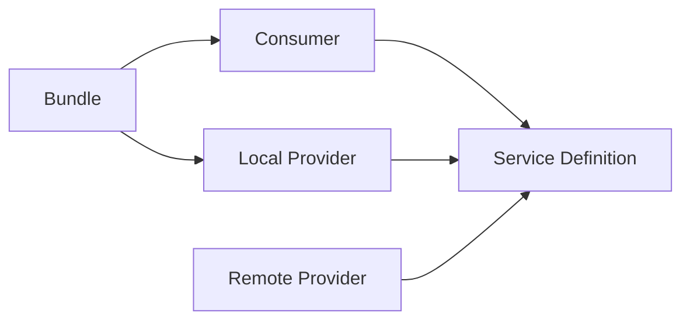
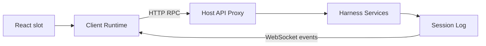
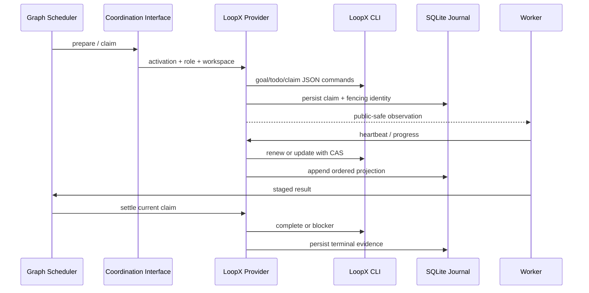

# DeepSeek Harness 技术栈：从入门到源码近景

[English](technical-stack-course.md) | 中文

本文是一份可独立阅读的项目教材。它不要求读者预先了解 agent（智能体）框架，目标是从“这个程序解决什么问题”出发，逐层讲到插件装配、agent loop（智能体循环）、事件日志、工具执行、Web 通信、并行编排，以及 Graph Mode 与 LoopX 的租约和恢复机制。文中的“近景”指能沿着一次真实请求定位到关键源码、状态所有者和失败处理点，而不是逐行复述整个仓库。

## 1. 学习目标与阅读方法

学完后，你应当能回答六个问题：程序从哪里启动；一条用户消息如何变成模型请求；模型工具调用如何落到文件或子进程；会话为什么能恢复；Web 页面如何与 Host 同步；Graph 与 LoopX 如何在不修改 agent loop 的情况下协调多个 worker。

教材使用三个观察尺度：全景用于理解进程、包组和数据流；中景用于理解 Service Definition、Provider、Consumer 与事件；近景用于理解关键类、方法、持久化记录和取消时序。初读者建议顺序阅读，高级读者可直接从第 7、12、13 章开始，再用第 15 章回查源码。

阅读时始终区分四类事实：配置决定装配什么；服务决定谁拥有能力；事件决定何时允许扩展；会话记录决定哪些事实能够重放。混淆这四层，是理解本项目最常见的障碍。

## 2. 项目是什么

DeepSeek Harness 是一个以插件为基本组成单位的智能体运行时。它负责把模型、提示词、工具、会话、持久化、审批、沙箱、子代理和用户界面组装成可替换的运行系统。产品的中心不是某个固定模型，也不是某个固定 UI，而是一棵由 Cordis 管理的插件树。

它同时提供三类使用入口：`dsh --profile headless` 运行一次性命令行任务；`dsh --profile web` 运行 Host 与浏览器应用；ACP 和 SDK 入口把相同能力交给其他进程或自动化客户端。入口不同，但最终都装配同一组核心服务并驱动同一种会话事件模型。

最重要的架构判断是：agent loop 只负责通用循环。计划模式、压缩、权限、Graph Mode、LoopX、工具超时和遥测都通过服务或事件接入。这样，新增行为通常表现为“挂载一个插件”，而不是向循环主体增加条件分支。

## 3. 实际技术栈

| 层次 | 当前技术 | 在项目中的职责 |
|---|---|---|
| 运行时 | Node.js `^22.19.0 || >=24`、ESM | Host、CLI、Worker、文件与子进程运行时 |
| 语言 | TypeScript 6、`strict` | 服务、事件、协议和 UI 的静态类型系统 |
| 工作区 | pnpm 11 workspace | 管理 `packages/*/*`、应用、原生包和 vendored Cordis |
| 插件框架 | vendored Cordis、Schemastery | 上下文、服务、事件、作用域、配置校验和可逆副作用 |
| 构建 | TypeScript project references、tsdown、Vite | 分离 Host/Client 编译面，生成库产物和 Web 静态资源 |
| 模型接入 | DeepSeek Chat Completions、`pi-ai`、SSE parser | 把统一 LLM 请求映射为提供方流式协议 |
| Web | React 18、Zustand、Immer、原生 HTTP、`ws` | 插件化 UI、客户端对象状态、RPC 与事件下行 |
| 数据校验 | Schemastery、Zod | 插件配置和工具 schema；进程、持久化与 wire 数据校验 |
| 持久化 | JSONL + Zstandard、Node `node:sqlite` | 会话日志、查询索引、Graph 资源/调度与 LoopX 本地投影 |
| 并发 | Promise、AbortSignal、Worker Threads、PTY/子进程 | 流式请求、取消、代码执行、工作流和命令运行 |
| 隔离 | 平台沙箱、Landlock/bwrap/Seatbelt、进程树控制 | 对文件和子进程能力实施部署策略 |
| 测试 | Vitest、V8 coverage、Playwright、snapshot replay | 单元、约定、真实入口、GUI 与无密钥回放验证 |
| 观测 | 会话事件、OpenTelemetry logs | 可重放产品事实与部署遥测 |

这张表只说明采用了什么，还不能说明系统为何这样拆分。真正的主线是：Cordis 管装配与生命周期，会话管理可重放事实，agent loop 管一次请求的控制流，能力包管具体副作用，Host/Client 管跨进程投影，Graph 管多 agent 工作，LoopX 管项目级外部协调。

## 4. Monorepo 与包边界

仓库使用“包组/包”的两级目录。`packages/core` 是产品 API 主干；`llm`、`fs`、`shell`、`subprocess`、`sandbox` 等包组提供能力；`session`、`storage`、`attachment` 管数据；`subagent`、`jobs`、`workflow`、`graph` 管并发工作；`host`、`client`、`api`、`typert` 管 Web；`bundle` 和 `boot` 管最终装配。

每个 npm 包名为 `@deepseek-ai/dsh-*`，本地相对导入保留 `.ts`，跨包导入使用包名。库源代码在 `src/`，构建产物在 `lib/`。源码检查通过 TypeScript `paths` 直接解析到 `src/`，发布消费者则通过 `exports` 读取 `lib/`，因此项目明确区分源码面与产物面。

能力包通常分为三个角色。Service Definition 声明接口、类型和 `ctx` 键；Service Provider 实现本地、远程或特定平台能力；Consumer 把能力变成模型工具、命令、UI 或更高层服务。依赖方向从 Consumer 指向 Definition，而不是指向某个具体 Provider，因此更换实现无需修改消费者。



`packages/bundle/base` 组合核心 agent、DeepSeek 模型、工具、会话持久化、权限和沙箱；`bundle/web-app` 在其上增加 Host、Client、Graph 与 Web UI；`bundle/headless` 增加一次性命令行驱动。Bundle 可以依赖具体 Provider，因为它的职责就是作部署选择。

## 5. Cordis：项目的运行骨架

Cordis `Context` 是插件共享的运行上下文。服务通过 `ctx` 暴露，例如 `ctx.sessions`、`ctx.tools`、`ctx.llm`；插件使用声明合并扩展 Context 和事件类型。Cordis 不是简单的依赖注入容器，它同时拥有插件作用域、事件分发和卸载顺序。

注册是一种副作用，必须能撤销。`ctx.effect()` 注册资源及其 disposer，`ctx.on()` 注册事件监听器并返回移除函数，Service 本身也受所在 fiber 生命周期约束。插件卸载时，文件监听、网络端口、Agent、Worker 和注册表条目必须沿同一所有权链释放。

事件有三种重要语义。普通 emit 广播事实；serial 依次等待监听器；waterfall（瀑布式事件）允许监听器修改输入或短路链路。waterfall 监听器若希望委托给下一层，必须调用 `next()`；直接返回意味着它已经接管请求。

```text
plugin scope
  -> register service / event / route / tool
  -> serve work while fiber is active
  -> receive unload or abort
  -> stop new work
  -> drain in-flight work
  -> dispose registrations in reverse ownership order
```

理解 Cordis 的关键不是记 API，而是追踪所有权。看到一个计时器、Agent、WebSocket 或子进程时，要问：谁创建它；哪个 signal 能取消它；哪个 effect 等待它停稳；卸载后哪个注册表不再能找到它。

## 6. 启动、Profile 与配置叠加

CLI 入口是 [`apps/cli/src/bin.ts`](../apps/cli/src/bin.ts)。它先解析参数，再按 `profile`、`plugin` 或 `dump-config` 动态导入对应路径。动态导入避免无关模式进入同一启动闭包，也让源码启动和构建后启动保持 ESM。

Profile 是 Harness home 中的具名装配，Bundle 是可发布的配置 patch 层。启动时先按 Profile 顺序应用 Bundle，再应用 Profile patch、home patch，最后应用命令行 `--patch`。Patch 通过稳定条目 id 替换 config 或插入插件，因此用户可以覆盖模型、工具、存储和 UI，而不分叉 Bundle 源码。

```sh
dsh --profile web --dump-config
dsh --profile headless "summarize this workspace"
```

第一条命令是理解实际运行树的首选方法，因为源码中的包依赖只说明“可能装什么”，展开后的配置才说明“这次启动装了什么”。配置由 Schemastery 在插件加载处校验；可独立判断的错误在加载时失败，依赖外部状态的错误在最早可解析点失败。

启动后的结构不是平铺列表，而是作用域树。父插件提供服务，子插件注入依赖，调用者还可能创建 agent 作用域或 session 作用域。相同服务键可以在子作用域被更具体的实现遮蔽，这正是每个 Agent 可拥有不同工具、提示词或策略的基础。

## 7. agent、轮次、步骤与 Inbox

`Agent` 是对外接口，`AgentLoop` 是默认工厂和驱动，`ReactLoopAgent` 是当前循环实现。Agent id 与 Session id 共享身份；创建或恢复时，工厂先准备会话和作用域，再原子地发布到 agent 与会话注册表。失败或卸载会走同一个记忆化反向 teardown，避免半发布对象残留。

Inbox 接收用户消息、steering、后续上下文和内部 follow-up。轮次在领取第一条可执行输入时开始，在没有待处理工作时结束；步骤是一次模型请求及其工具调用。一个轮次可以包含多个步骤，因为工具结果可能要求模型继续回答，运行中到达的新输入也可能触发下一步骤。

```text
turn/start
  claim inbox input
  agent/pre-step
  step/start
    assemble system prompt + tool schemas
    derive model history from session events
    agent/request
    llm/stream
    assistant/chunk*
    assistant/message
    tool/call* -> tools pipeline -> tool/result*
  step/end
  repeat when more work is owed
agent/turn-stopping
turn/end
```

关键源码位于 [`packages/core/agent-loop/src/agent.ts`](../packages/core/agent-loop/src/agent.ts)。`preStep()` 通过 `agent/pre-step` waterfall 允许插件拒绝或改写已领取消息；`turn()` 记录轮次与步骤的生命周期；请求路径从 `session.deriveMessages()` 生成历史，经 `agent/request` 构建最终 LLM 参数，再调用 `ctx.llm.stream()`。

取消不是简单抛出异常。Agent 使用 `AbortSignal` 让模型流、工具和等待点尽快退出，同时 teardown 必须等待机器进入 idle、作用域释放、注册表摘除。调用者应区分用户取消、被新请求抢占、资源卸载和执行失败，因为这些原因决定是否记录终态、是否可重试，以及 UI 应如何呈现。

## 8. 提示词、模型与流式响应

System Prompt 服务保存由插件贡献的片段、变量和工具 schema。每个步骤在请求前重新装配，因此当前 provider、model、cwd、模式和可用工具能够进入请求。只有稳定前缀适合模型 KV Cache；包含当前任务、Claim 或运行状态的片段属于可变后缀。

LLM Service Definition 统一消息、内容块、工具调用、usage 和流式事件。DeepSeek Provider 把它映射到 Chat Completions，并使用 `eventsource-parser` 解码 SSE；`llm-pi-ai` 是基于 `pi-ai` 的替代适配器。重试、默认模型和 token 计量是独立插件，不写入 Provider 主体。

`agent/request` 是请求级策略入口。监听器可以选择模型、加入模型可见上下文或包裹 stream，但任何到达模型的事实都必须能从会话日志重建。这条不变量称为“模型可见即已记录”，它保证恢复、回放、导出和 UI 不会各自得到不同历史。

流式输出先记录细粒度 `assistant/chunk`，结束后形成 `assistant/message`。保存原始 chunk 不是冗余：它保留文本、推理和工具调用增量的到达顺序，使崩溃恢复与前端流式重放不必猜测 Provider 当时发出了什么。

## 9. 工具体系与副作用控制

Tools 服务维护作用域化注册表。每个工具包含名称、描述、参数 schema、执行函数和 UI 呈现意图。Agent Loop 先记录 `tool/call`，再经 `tools/pre-execute`、`tools/execute`、`tools/post-execute` waterfall 调用，最后记录 `tool/result`。

工具调用可并行，但只有声明为并行安全的调用才进入受限并发组；`maxParallelToolCalls` 控制每个 agent 步骤的并发上限。每个已启动调用保留自己的会话 seq，使并行完成顺序不会破坏调用与结果之间的引用关系。调度失败也不能抹掉已经记录的调用事实。

权限、沙箱、超时、结果 spill 和重复调用提醒都包裹工具流水线。它们不是工具实现中的散落判断：权限插件可以在执行前询问用户，沙箱 Provider 把请求解析成平台执行规格，超时插件合并取消信号，spill 策略把过大结果保存到外部存储并只向模型返回引用。

Shell、Filesystem、Subprocess 和 Terminal 是不同层次。Filesystem 负责路径和文件语义；Shell 把命令请求解析为执行规格；Subprocess 负责进程树、stdio 上限、退出和终止；Terminal 负责可持续 PTY 会话。模型工具只依赖对应 Definition，Bundle 决定使用本地、PowerShell、bash 或沙箱 Provider。

安全分析必须识别真正的边界。Worker Thread 的 Code Runtime 提供隔离、堆上限和强制终止，但其信任级别与 bash 等价，并不是恶意代码安全边界；进程沙箱和文件策略才负责限制主机访问。审批也不是沙箱的替代品，它只表达用户授权。

## 10. 会话日志：系统的事实记录

会话是内存中的仅追加事件序列，每个事件拥有连续 `seq`、时间和带判别字段的 data。`turn/start`、`step/start`、`user/message`、`assistant/chunk`、`tool/call`、`tool/result` 等属于持久事实；`agent/request` 等实时事件只负责当次扩展，不直接成为历史。

`Session.deriveMessages()` 不直接保存一份可变聊天数组，而是把事件序列投影为模型消息。这样，崩溃修复、压缩、fork、子会话来源和模型历史都围绕同一账本工作。新增模型可见输入时，开发者必须扩展 `SessionEventMap` 并定义投影规则。

会话持久化是独立能力。协调器监听 `session/created`、`session/event`、`session/flush` 和 `session/disposed`，为每个会话串行化写入，按固定窗口批处理事件，并在 flush 或卸载时排空。后端只负责读取、追加、修复和列举，不重新实现上层生命周期。

默认 JSONL 后端把每个会话保存为仅追加逻辑日志，通常使用拼接的 Zstandard frame；每批写入带校验并 `fsync`。崩溃留下不完整尾部时，loader 保留最后一个有效前缀，并补写工具、步骤、轮次的关闭事件。SQLite 后端使用 Node 内置 `node:sqlite`，把 header 和事件映射为行，并共享同一个持久化协调器。

崩溃恢复不会假装未知副作用没有发生。已出现 assistant 工具调用但没有持久化 `tool/call` 时，修复结果为 `TOOL_NOT_STARTED`；已有 `tool/call` 但无结果时为 `TOOL_OUTCOME_UNKNOWN`。模型只能自动重试只读或幂等工作；有副作用的调用必须先验证或询问用户。

## 11. Web Host、RPC 与插件化 UI

Web 模式包含 Host 和浏览器两个 Cordis 世界。Host 使用 Node `http` 提供静态资源、API 路由和 upgrade 路由；Client 在浏览器中启动自己的插件树。React 只是渲染层，UI 功能仍以 Client 插件注册到 slot，而不是集中在一个巨型组件中。

浏览器上行请求通过 fetch 形态的 RPC handler，Host 下行事件通过 WebSocket。`rpcId` 是带品牌的关联 id，响应必须回显请求 id；审批与提问可以跨断线重放，普通事件推送拥有自己的 id。Wire 数据使用 Zod 校验，Host 业务服务仍使用领域类型。

Typert 从 TypeScript 声明生成 Host/Client 类型图、codec 和 Remote Service 元数据。`api/gateway` 与 `api/remotes` 把服务方法暴露为类型化 RPC，运行时 registry 管理已挂载贡献。它解决的是“跨进程仍保持类型、schema 和插件生命周期一致”，不是生成一套与领域服务无关的 REST 控制器。

Client Runtime 用 Zustand 保存对象级状态，用 Immer 生成不可变更新，Session Runtime 根据会话创建作用域树。`web-react` 通过 `useSyncExternalStore` 类桥接把外部服务快照接入 React。会话事件推动局部对象更新，UI 不需要每收到一个 chunk 就重新获取整份 Session。



## 12. 从单代理到并行工作

Subagent 能力负责创建或派生子 agent。Provider 可以在进程内 spawn/fork，也可以连接 Codex、Claude Code、ACP 或 DSH SDK。父子关系记录在会话 header 和事件中，工具层只依赖 Subagent Service Definition。

Jobs 为长时间后台任务提供通用句柄和输出读取；Workflow 在 Worker Thread 中运行结构化工作流；Code Runtime 在全新 Worker Thread 中执行模型生成的 TypeScript。三者目的不同：Job 管生命周期，Workflow 管可编排程序，Code Runtime 管一次受预算约束的代码执行。

Graph 在这些能力之上提供持久、可修订的 DAG。每个节点描述角色、任务、依赖、验收条件、工作区所有权、模型与预算。Revision 不可变；修改任务会创建下一 Revision，而不是改写历史。Run Snapshot 保存某个 Revision 的完整运行证据。

Graph Mode 通过 `/graph`、主控提示词、`graph_submit`、会话事件和后台 Scheduler 接入现有 agent。主控仍是普通 agent，Worker 仍通过 Subagent 能力执行；agent loop 不知道 DAG，也不包含 Graph 分支。

## 13. Graph Mode 的调度机制

主控把用户输入分类为新任务、修订、检查、控制、澄清或直接回答。新任务和修订先形成不含 Host 身份字段的语义草稿，Graph Mode 再推导 graph id、revision、时间戳、运行默认值和物理 workspace 分配，并在校验后保存不可变 Revision。

节点只有在所有前置节点终止、条件边通过、资源可获得、协调 Claim 成功后才进入运行。准入同时考虑全局 Worker 数、角色上限、provider/model 上限、权重预算和主控保留容量。并行可写节点必须声明互不重叠的相对 `writeRoots`。

每次节点运行形成 Activation 和 Attempt。Scheduler 先持久化待执行状态，再执行外部资源保留与协调操作；关键外部副作用之前使用显式 Session flush 屏障。Worker 定期发布进度、checkpoint、token 使用和租约续期，Monitor 负责预算、无进展超时、墙钟上限与取消。

成功输出先 staged，再经过 schema、验收条件和 artifact integration。Review/verification 节点必须返回结构化 decision 与 issues。协调终态写回失败时，Graph 不会重新运行已经成功的 Worker，而是进入 `awaiting_user` 对账检查点，恢复时只重试 settlement。

修订会使变更节点的传递后继失效，但不改写旧 Revision 或 Run。未受影响且已有成功证据的节点可显式复用。暂停、批准、跳过、重试、从节点恢复和替代输出都经过串行控制服务，并携带精确 graph/revision/generation 身份，陈旧页面无法修改新一代运行。

## 14. LoopX 的设计、实现与耦合

LoopX 是 Graph Coordination Service 的一个外部 Provider，不是 Agent Loop，也不是 Graph Scheduler。Graph 决定节点何时 ready、允许多少并发、使用哪个模型和工作区；LoopX 提供项目级 goal、todo、peer、claim、lease、取消和终态证据。二者通过 `dsh-graph-coordination` 接口连接。

准备阶段确认配置的 LoopX goal 可读，角色到 peer 的映射存在。节点 ready 后，Provider 才惰性创建带 Activation 标记的 todo，以对应 peer 认领，并把最长 8,000 字符的公开安全 observation 交给 Worker。原始 registry 状态不会直接进入模型提示词。

Claim 使用硬租约。每次 heartbeat 推进 LoopX lease version，返回新的 lease id、到期时间和 fencing token；后续 progress、cancel 和 settlement 必须携带当前身份。终态写回使用 LoopX 当前 CAS version，旧 Worker 即使迟到也不能覆盖新 Claim 的结果。

本地 `LoopxCoordinationJournal` 使用 Node `node:sqlite`，Schema Version 2 按物理 Activation 保存 Claim、owner、progress、cancel、terminal 和有序 events。Cursor 与事件序号连续，重启后 Settlement 从持久 Claim 恢复 todo id，不依赖进程内 Map。终态操作按 Activation 串行，不会让一个等待中的任务阻塞无关任务。



耦合是分层的。架构耦合较低：Graph 只认识 Coordination 接口，可以换 Provider；LoopX Provider 不修改循环和节点业务。部署耦合较强：它依赖 LoopX CLI 命令、JSON 字段、goal/peer 预配置、工作目录和可执行文件路径。持久化耦合明确：LoopX 是外部真源，SQLite 只是可恢复的本地投影，不是分布式事务参与者。

LoopX Provider 故意不把 heartbeat quota、vision、LoopX scheduler 或 worktree 策略套进会话内节点。并行度和资源仍由 Graph 准入控制，工作区仍由 Harness 解析，模型只看到经过裁剪的 Claim observation。这个分工避免两个调度器同时决定同一个节点。

在 Windows Host 上运行 WSL 内 LoopX 时，`executable` 可配置为 `wsl.exe`，`executableArgs` 指向发行版和 LoopX 路径，`pathStyle` 使用 `wsl`。Provider 只转换 registry 路径；子进程 cwd 仍由 Host 传递。每个 CLI 操作有独立 deadline、stdout/stderr 字节上限和进程终止宽限期。

恢复仍有分布式限制。LoopX 与本地投影之间没有原子提交；稳定标签用于补回“外部修改成功但本地记录尚未写入”的窗口，冲突时不会覆盖任一账本。多个 Host 若不共享经过认证的持久存储，就不能共享本地 cursor 与进度去重状态。

## 15. 一次请求的端到端近景

以 Web 用户发送“修改一个文件并运行测试”为例。浏览器 Session 对象生成带 `rpcId` 的请求；Host API 校验 wire 数据，找到目标 Agent，把消息送入 Inbox，并把 `user/message` 记录到 Session。WebSocket 将事件推回浏览器，输入框立即能显示已接受状态。

Agent 领取输入并记录 `turn/start`、`step/start`。System Prompt 收集 workspace 指令、时间、模式和工具；Tools 生成 schema；Session 投影历史。`agent/request` 允许模型路由和模式插件补充请求，然后 LLM Provider 发出 HTTP/SSE 请求。

模型流生成文本和工具调用增量，系统逐条记录 `assistant/chunk`。完整工具调用形成 `assistant/message` 后，Agent 记录 `tool/call`。权限插件判断是否需要交互，Filesystem 或 Shell Consumer 调用对应 Service，Sandbox Provider 解析允许路径与命令，Subprocess Provider 启动进程并受 signal、超时和输出上限约束。

工具完成后记录 `tool/result`。若模型还欠最终回答，Agent 开始下一 Step；否则记录 `step/end`、`turn/end`。Persistence Coordinator 在后台追加事件，并在关键 flush 点等待落盘。Client 根据下行事件更新 Zustand 对象，React slot 只重绘受影响区域。

若处于 Graph Mode，主控的 `graph_submit` 不直接执行文件修改。它持久化 Revision 和 Run，Scheduler 为 ready 节点取得资源与 Coordination Claim，再启动子 Agent。LoopX 只参与 Claim/lease/settlement；实际工具调用仍走子 Agent 自己的 Agent Loop 与会话日志。

## 16. 如何扩展项目

新增能力时，先判断它是事实、策略还是副作用。需要重载后存在的事实进入 Session Event；只影响当前请求的策略进入合适的 waterfall；可替换副作用建立 Service Definition/Provider/Consumer；纯 UI 功能注册 Client slot。不要因为调用点方便就直接修改 Agent Loop。

一个完整能力通常按此顺序落地：定义领域类型和 Service；实现至少一个 Provider；实现模型工具或其他 Consumer；把注册放入 `ctx.effect()`；通过 Bundle 选择实现；记录模型可见文本和事件；补单元、约定、真实装配与 snapshot 验证；更新所属 README 和 subsystem 文档。

边界数据必须校验：配置、模型工具 JSON、持久化、Worker message、子进程 JSON 和 RPC wire 都不可信。同进程且由 TypeScript 接口保证的内部调用不重复校验。跨包 id 使用 branded string，封闭联合用 discriminant 和 `assertNever`，可扩展映射使用声明合并。

并发代码先写所有权和终止条件：谁能开始工作；谁能取消；迟到结果是否仍有提交权；释放时等待什么；持久化发生在外部副作用之前还是之后。Graph 的 fencing、Agent 的记忆化 teardown、Session 的 per-id 串行写入，都是这个问题的不同答案。

## 17. 构建、测试与质量门禁

`pnpm run build` 先构建 Host 和 Client 库，再构建 Web。Host 与 Client 使用不同的 TypeScript aggregate，tsdown 生成运行时代码和声明，Vite 生成浏览器 dist。源码启动通过 `node --import tsx/esm`，构建后配置子进程必须在普通 Node 下解析 `lib/`。

```sh
pnpm run typecheck
pnpm run lint
pnpm run test
pnpm run test:coverage
pnpm run test:snapshot
pnpm run build
pnpm run hygiene
pnpm run doc-sync
```

单元测试验证局部行为，contract tests 验证 Definition 可由不同 Provider 共享，invariant 插件验证已装配运行时的所有关系，snapshot 通过真实示例和无密钥回放验证模型可见轨迹，e2e 在有密钥时验证真实 Provider。产品可见行为不能只靠 mock 单测证明。

覆盖率门禁是 `test:coverage`，不是普通 `test`。文档由链接、换行、Mermaid、TypeScript 围栏、生成目录、双语 pairing 和站点构建共同校验。发布包还要通过 publint、NodeNext consumer、runtime closure 和 workspace constraints。

## 18. 源码阅读路线与练习

第一阶段先运行 `dsh --profile web --dump-config`，再读 [`docs/architecture.md`](architecture.zh.md)、[`docs/cordis-primer.md`](cordis-primer.zh.md) 和 [`packages/README.md`](../packages/README.zh.md)。目标是能从配置条目找到包，再从包找到 `ctx` 服务键。

第二阶段沿单次请求阅读：CLI 从 [`apps/cli/src/bin.ts`](../apps/cli/src/bin.ts) 开始；Agent 从 [`packages/core/agent-loop/src/agent.ts`](../packages/core/agent-loop/src/agent.ts) 开始；工具并发从 [`packages/core/agent-loop/src/tool-calls.ts`](../packages/core/agent-loop/src/tool-calls.ts) 开始；会话从 [`packages/core/session/src/index.ts`](../packages/core/session/src/index.ts) 的 `deriveMessages()` 开始。

第三阶段沿数据落盘与 Web 阅读：Persistence 入口是 [`packages/session/session-persistence/src/coordinator.ts`](../packages/session/session-persistence/src/coordinator.ts)；Web carrier 是 [`packages/client/connection/src/index.ts`](../packages/client/connection/src/index.ts)；RPC 类型是 [`packages/host/apiproxy/src/api/rpc.ts`](../packages/host/apiproxy/src/api/rpc.ts)；Client 状态从 [`packages/client/runtime/src`](../packages/client/runtime/src) 开始。

第四阶段阅读并行编排：先读 [`packages/subagent/README.md`](../packages/subagent/README.zh.md)，再读 [`packages/graph/graph-mode/README.md`](../packages/graph/graph-mode/README.zh.md) 和 [`packages/graph/graph-coordination/README.md`](../packages/graph/graph-coordination/README.zh.md)，最后读 [`packages/graph/graph-coordination-loopx/README.md`](../packages/graph/graph-coordination-loopx/README.zh.md) 与实现中的 `journal.ts`、`index.ts`。

练习一：选择一次 headless 运行，按 seq 写出其轮次、步骤、assistant 和 tool 事件。练习二：给某个 waterfall 监听器画出调用 `next()` 与短路的两条路径。练习三：为一个有副作用工具列出崩溃发生在 `tool/call` 前、外部执行后、`tool/result` 前时的恢复策略。练习四：为一个两节点 Graph 标出 Revision、Run、Activation、Attempt、Claim 与 Settlement 的身份关系。

## 19. 术语速查

| 术语 | 精确定义 |
|---|---|
| Plugin | 挂载到 Cordis Context、贡献服务或副作用并可卸载的单元 |
| Service | 通过 `ctx` 提供的有类型能力及其生命周期 |
| Provider | Service Definition 的具体实现 |
| Consumer | 使用能力并暴露工具、命令、UI 或上层服务的插件 |
| Session | 仅追加事件及不可变 header 组成的会话事实记录 |
| Turn | 从领取输入到不再欠工作的完整轮次 |
| Step | 一次模型请求及其产生的工具调用步骤 |
| Projection | 从事件日志推导模型历史、UI 状态或查询视图的过程 |
| Revision | 不可变的 Graph 定义版本 |
| Run | 某个 Revision 的持久执行快照 |
| Activation | 节点在某一 Generation 中的一次物理激活身份 |
| Attempt | Activation 内一次 Worker 执行或继续执行 |
| Claim | 外部协调系统授予某 Activation 的执行权 |
| Lease | 有期限且可续期的 Claim 有效期 |
| Fencing token | 阻止旧 Claim 迟到写回覆盖新所有者的单调身份 |
| Settlement | 对 Claim 的幂等终态写回及其证据 |

## 20. 基础篇心智模型

把系统记成五层即可。第一层是 Cordis 插件树，决定运行时拥有什么；第二层是 agent loop，决定一条输入如何推进；第三层是会话日志，决定什么能够恢复和解释；第四层是能力 Provider，决定副作用如何执行与隔离；第五层是 Host/Client、Graph 和 LoopX，分别把单 agent 运行投影到人机界面、扩展为多 agent DAG、再接入外部项目控制面。

遇到任何问题，都按同一顺序定位：先看展开后的配置，再找服务所有者，然后找触发事件，再找持久记录，最后检查取消和 teardown。能沿这条路径解释一次成功、一次失败和一次重启恢复，就已经从“会使用项目”进入“能修改项目”的阶段。

## 21. 从零实现最小 agent loop

本章的目标不是重新造一个 Harness，而是用不足百行的实现理解 agent 与普通聊天接口的差别。普通聊天只执行一次 `messages -> completion`；agent loop 还要识别工具调用、执行副作用、把结果追加回历史，并决定继续、结束、取消还是失败。因此 agent 本质上是一个由模型参与决策的状态机。

最小状态集合可以写成 `idle -> requesting -> executing -> requesting -> completed`，任何活动状态都可以进入 `canceled` 或 `failed`。生产实现还需要 Turn、Step、持久化和恢复，但如果最小循环都没有明确状态，增加这些能力只会放大竞态。

下面的代码是一个可编译的教学实现。它故意省略网络协议和 schema 库，但保留四条关键规则：工具名必须来自注册表；参数必须在执行前解析；结果按消息顺序追加；循环拥有明确的步骤上限与取消信号。

```ts
type Message =
  | { role: 'user' | 'assistant'; content: string }
  | { role: 'tool'; callId: string; content: string }

interface ToolCall {
  id: string
  name: string
  arguments: string
}

interface ModelReply {
  text: string
  toolCalls: ToolCall[]
}

interface Model {
  generate(messages: readonly Message[], signal: AbortSignal): Promise<ModelReply>
}

interface Tool {
  execute(args: unknown, signal: AbortSignal): Promise<unknown>
}

export async function runAgent(
  model: Model,
  tools: ReadonlyMap<string, Tool>,
  prompt: string,
  signal: AbortSignal,
  maxSteps = 12,
): Promise<readonly Message[]> {
  const messages: Message[] = [{ role: 'user', content: prompt }]
  for (let step = 0; step < maxSteps; step++) {
    signal.throwIfAborted()
    const reply = await model.generate(messages, signal)
    messages.push({ role: 'assistant', content: reply.text })
    if (reply.toolCalls.length === 0) return messages
    for (const call of reply.toolCalls) {
      signal.throwIfAborted()
      const tool = tools.get(call.name)
      if (tool === undefined) throw new Error(`unknown tool: ${call.name}`)
      const args: unknown = JSON.parse(call.arguments || '{}')
      const value = await tool.execute(args, signal)
      messages.push({ role: 'tool', callId: call.id, content: JSON.stringify(value) })
    }
  }
  throw new Error(`agent exceeded ${maxSteps} steps`)
}
```

逐行分析时，不要只看正常路径。`model.generate()` 成功但进程在 assistant 消息持久化前停止，恢复后能否知道模型已经调用过；工具执行成功但 tool result 尚未记录，能否安全重试；多个工具并发时，结果按完成顺序还是模型顺序进入历史；取消到达时，未启动调用是否需要合成结果。这些问题正是 Harness 在会话事件、工具调度器和恢复 closer 中增加复杂度的原因。

动手实验：为这段代码实现一个只读 `get_weather` fake tool 和一个每次递增计数器的非幂等 `increment` tool；分别在模型请求前、工具执行后和结果追加前注入异常。观察到 `increment` 无法仅凭内存消息安全恢复后，写出你需要增加的 durable intent、operation id 和 reconciliation API。

面试表达：当面试官问“agent loop 是什么”时，先用状态机和反馈回路回答，再说明生产系统必须把模型输出、工具副作用和持久状态对齐。不要只说“循环调用大模型直到没有工具调用”，因为这句话没有覆盖取消、上限、崩溃窗口和未知副作用。

## 22. 模型请求、token 与 KV Cache

一次模型请求由系统提示词、工具 schema、历史消息、当前输入、路由参数和生成上限组成。模型并不直接看到 Session Event；`deriveMessages()` 先把事件表面投影为提供方无关消息，Adapter 再把内容块映射到具体 API。面试中应能区分领域消息、Harness 统一请求和 Provider wire payload。

Token 预算至少分为四部分：稳定前缀、历史、当前输入和预留输出。若上下文窗口为 `C`，系统与工具占 `S`，历史占 `H`，当前输入占 `U`，预留最大输出为 `O`，安全条件是 `S + H + U + O <= C`。生产系统还要为 tokenizer 估算误差、隐藏推理 token 和 Provider 特殊字段留余量。

KV Cache 优化的核心不是“提示词越短越好”，而是“尽可能保持长前缀字节稳定”。把当前时间、随机 id、动态工具顺序放进系统提示词开头，会让后面的历史全部失去缓存复用。Harness 把稳定策略放在前缀，把任务、Claim 和运行状态放在后缀；压缩请求复用原会话前缀，只在最后追加压缩指令。

流式协议要处理文本、推理、工具参数增量、usage、finish reason、错误与中止。工具 JSON 可能跨多个 chunk 到达，不能对单个增量直接 `JSON.parse`；连接正常结束也不等于模型语义成功，最终 finish 可能表示长度截断或内容过滤。Adapter 负责把提供方的抛出与终态错误规范化为统一 LLM 语义。

动手实验：记录一个真实或 mock 请求中系统提示词、工具 schema、历史和输出的估算 token；然后只改变系统前缀中的一个时间戳，解释为什么缓存命中从该 token 后全部失效。再设计一个请求布局，把动态字段移动到用户消息或后缀，并说明哪些前缀仍可复用。

面试追问通常包括：temperature 是否控制事实正确性；`maxTokens` 是否等于可见回答长度；为什么 Function Calling 仍可能生成非法参数；SSE 断线后能否盲目重放。合格回答应指出采样参数只改变分布、推理 token 可能消耗上限、schema 约束不是绝对保证、重放前必须判断请求和工具是否幂等。

## 23. 工具开发：从 schema 到副作用

工具不是一个普通函数加描述。完整工具需要同时定义模型可理解的名称与 schema、运行时参数校验、执行模式、权限和沙箱要求、结果大小策略、错误语义、取消语义，以及 UI 如何呈现调用与结果。任何一项缺失，都可能让模型、Host 和用户看到不同事实。

工具设计先从副作用分类开始。只读且幂等的工具可安全重试；幂等写入必须有稳定 operation id 或目标状态；非幂等写入只能通过预检查、事务或对账确认。网络“创建订单”和本地“追加一行”都不是因为调用简单就可重试。

参数 schema 应表达真正前置条件，而不是让执行函数猜默认值。部署可变的策略属于插件配置，调用变化的值属于工具参数，安全不变量属于固定规则。错误结果应区分用户参数错误、权限拒绝、超时、Provider 失败和内部缺陷，使模型知道是修正参数、请求授权、重试还是停止。

Harness 工具调度器把 exclusive 调用作为屏障，把 parallel 调用放入有界滚动池。执行体可以并行完成，但 `tool/result` 与 additional context 按模型调用顺序提交。取消会停止补充新任务、排空已启动调用，并为未启动调用记录可重放的合成错误结果。

动手实验：选择一个读取文件元数据的工具，写出以下设计表再编码：输入字段及约束；输出字段；执行模式；可访问路径；最大输出；超时；错误码；是否可重试；UI 呈现。然后把路径校验从 Consumer 移到 Filesystem Provider，解释为何平台策略不应复制到每个工具。

面试编码题常要求实现有界并发工具执行。正确方案需要一个待启动索引、一个 in-flight 集合、按原序号存放的 settled slots 和一个只跨连续已完成槽位推进的 commit cursor。只用 `Promise.all()` 虽然简单，却无法动态限制并发、在取消后停止补充、插入 exclusive 屏障或按模型顺序提交。

## 24. 事件溯源、持久化与崩溃恢复

事件溯源的价值不是“可以回看日志”，而是让模型历史、UI、恢复和审计从同一事实序列推导。若系统同时维护可变聊天数组、数据库状态和 UI 状态，任一写入失败都会产生三套真相。Harness 选择仅追加 Session Event，并让 projection 负责得到当前表面。

事件必须表达已经发生的事实，而不是未来意图的模糊描述。`tool/call` 表示调用已进入持久历史；`tool/result` 表示系统已经取得可呈现结果。对于外部副作用，Graph 还会先写 operation intent 并 flush，再执行外部操作，随后记录引用或 settlement，使恢复程序知道应该检查什么。

写入批处理提高吞吐，但改变崩溃窗口。内存 append 后、磁盘 flush 前停止，UI 可能见过事件但恢复看不到；因此关键外部操作前必须显式 flush。每 Session 串行 writer 保证 seq 连续，但并不自动解决多个 Host 同时写同一 Session，后者需要排他所有权或单 writer 部署约束。

恢复算法应先读取最长有效前缀，再识别未闭合结构。没有持久调用的 assistant 请求可以标记未开始；已有调用无结果只能标记结果未知；未知非幂等副作用不能合成成功或失败。修复事件必须追加并引用原事实，不能静默改写历史。

动手实验：为第 21 章最小循环设计以下事件：`run/start`、`model/reply`、`tool/call`、`tool/result`、`run/end`。写一个纯函数 projection 生成消息历史，再给定“只有 tool/call、没有 tool/result”的日志输出恢复诊断。最后说明为什么删除最后一条坏事件不如追加 repair event 可审计。

面试表达：回答“为什么不用直接存最终状态”时，先承认快照读取更快，再说明事件保留因果与恢复证据；实际系统可同时维护可重建快照或索引，但事件是权威输入。还应主动说明事件 schema 演进、日志增长、投影重建成本和敏感信息治理是代价。

## 25. 上下文工程、记忆与压缩

上下文工程的目标是在有限窗口内提供完成当前决策所需的最小充分信息。它包含系统规则、工具、最近对话、工作区指令、检索结果、任务状态和失败证据。把所有可用数据全部塞入上下文，会增加成本、降低注意力密度、破坏 KV Cache，并扩大提示注入面。

短期记忆通常就是当前会话表面；长期记忆可以是跨会话索引、用户偏好或领域知识；工作记忆是当前计划、todo、Claim 和 checkpoint。三者需要不同的更新与遗忘策略。长期记忆写入必须经过来源、作用域、敏感性和过期策略判断，不能把模型推断自动当成用户事实。

RAG 的检索阶段至少包含 query 构造、候选召回、过滤、排序、去重和上下文装配。评估时要把 retrieval recall 与 answer correctness 分开：答案错误可能是没召回，也可能是召回后模型没用。Session Query 提供有界事件读取、谱系和 SQLite 全文检索，但它不自动等于知识库式长期记忆。

Harness 压缩先根据路由模型容量和 token meter 判断压力，可选地无模型裁剪过大的 tool result，再选择最旧的完整表面单元进行总结，同时保留最近尾部和工具调用/结果配对。总结必须比来源更小；失败时保留最新持久表面，不能用空摘要覆盖历史。

动手实验：拿一段包含系统规则、三次工具调用和一次用户纠正的对话，写一个压缩摘要。摘要必须保留原始目标、用户纠正、文件路径、失败原因、未完成任务和下一步；删除寒暄、重复解释和已失效计划。然后标出哪些内容应原样保留在最近尾部，哪些可以进入摘要。

面试追问：摘要会不会制造错误；如何验证长期记忆；何时用向量检索、全文检索或结构化查询。优秀回答会提出来源引用、结构化字段、置信度与人工修正；按数据性质选择检索方式；把摘要视为有损 projection，而不是替代原始事件。

## 26. 并发、取消、超时与 fencing

Agent 系统的大多数难故障不是模型问题，而是异步所有权问题。分析任何异步对象时都写出四项：创建者、提交权、取消者和清理等待点。若“谁能完成 Promise”和“谁仍有权提交结果”不是同一个问题，就需要 generation、epoch 或 fencing token。

`AbortSignal` 表达协作式取消，不能保证底层立即停止。调用方必须停止启动新工作，传递 signal，等待已启动任务结束或强制终止，并在返回前达到 quiescence。只调用 `abort()` 或 `kill()` 就返回，会留下仍写文件、占端口或回调旧 listener 的孤立任务。

超时与取消是正交事实。子进程可能收到超时 signal 后自行退出 0；结果仍应同时报告 `timedOut: true` 和 `exitCode: 0`。重试策略要看错误类别、操作幂等性、剩余 deadline 和退避预算，不能只按异常类型重试固定次数。

Fencing 解决旧所有者迟到问题。租约过期并不让旧进程物理消失；新所有者取得更高 token 后，存储和外部 API 必须拒绝低 token 写入。LoopX 的 lease version、Graph 的 owner epoch 和控制操作的 generation 都在表达“当前谁仍有提交权”。

动手实验：实现一个带 `generation` 的搜索控制器。每次新查询递增 generation 并取消旧请求；结果返回时只有捕获值等于当前 generation 才能更新 UI。然后解释为什么仅取消旧 fetch 不足以阻止一个已经进入解析或缓存阶段的迟到结果。

面试故障题：A 获取 30 秒租约后暂停 40 秒，B 接管并写入，A 恢复后继续写。只检查租约到期时间为何不够；数据库应把何值作为条件更新；外部 API 不支持 CAS 时怎么办。回答应包括单调 fencing token、条件写入，以及无法围栏时隔离输出并人工或业务对账。

## 27. Agent 安全模型

Agent 安全从信任来源分类开始：用户输入、网页内容、仓库文件、工具输出和其他 agent 消息都可能包含提示注入；模型输出和工具参数同样不可信。System Prompt 的优先级只是模型行为约束，不是操作系统安全边界。

权限、策略和沙箱承担不同责任。权限表达用户是否授权一次动作；策略限制某类请求可访问的资源；沙箱在进程或内核层执行限制。即使用户批准命令，系统仍不应把 Harness 密钥、无关目录和宿主环境变量暴露给子进程。

常见威胁包括路径遍历、symlink/junction 跟随、命令注入、环境变量泄密、可预测临时文件、输出爆炸、压缩炸弹、SSRF、提示注入和跨租户数据混淆。防护应位于最接近真实资源的 Provider，而不是依赖模型记住“不可以”。

工具结果进入模型前还要做内容与大小控制。公开安全 observation 只包含 worker 完成任务所需字段；原始 LoopX registry、凭据和内部调度信息不应进入提示词。日志与遥测也需要脱敏，因为“没有给模型”不等于“没有写进可导出的日志”。

动手实验：为“抓取 URL 并写入 workspace”做威胁建模。列出资产、攻击者、入口、信任边界和最坏影响；至少覆盖私网 SSRF、超大响应、恶意文件名、重定向、内容提示注入和写出根目录。为每项指定由 URL parser、Web Provider、Filesystem Provider、权限层还是模型策略负责。

面试表达：不要把“我们有 sandbox”当完整回答。先说明 sandbox 的平台实现和限制，再说明凭据隔离、网络策略、文件根、资源上限、审批、审计和失败默认值。安全设计的关键是纵深防御和 fail closed，而不是单个 prompt。

## 28. 多 agent 编排与任务图设计

多 agent 不是简单地同时启动多个模型。只有任务可分解、子任务之间信息接口清晰、并行收益大于协调成本时才值得使用。若所有 worker 都要修改同一核心文件或频繁等待主控，串行单 agent 往往更快、更可靠。

设计 DAG 时先写节点产物和验收条件，再写依赖。一个好节点通常在 10 到 30 分钟内完成，拥有两到四条可测验收条件，写入范围与并行节点不重叠。Review 节点必须消费明确输出并返回结构化 decision，不能只写“检查一下”。

并行收益受关键路径限制。总耗时近似为关键路径节点耗时之和加调度与集成开销，而不是所有节点耗时之和除以 worker 数。增加 worker 可能触发模型限流、内存压力、冲突和上下文重复，因此准入需要全局、角色、模型、权重和 workspace 多维上限。

Graph 把定义 Revision、运行 Run、物理 Activation 和执行 Attempt 分开，使修订、重试和恢复不会覆盖历史。LoopX Claim 再为 Activation 增加外部执行权；lease 与 fencing 只控制提交权，不替代 Graph 对依赖、资源和产物的判断。

动手实验：把“为新工具增加实现、文档和测试”拆成 DAG。先让架构节点确定接口和验收条件，再让实现与文档节点在互不重叠的 write roots 并行，之后运行集成测试，最后 Review。为每条边写出依赖的具体产物，并计算假设耗时下的关键路径。

面试系统题：如何避免两个 agent 修改同一文件；如何处理 worker 成功但 settlement 失败；如何修订运行中的图。回答应涉及静态所有权校验、资源/协调 Claim、staged output、只重试 settlement、不可变 Revision 和受影响后继失效。

## 29. 评测、测试与可观测性

Agent 评测必须把最终结果、过程安全和资源成本分开。常见指标包括任务成功率、验收条件通过率、工具调用正确率、无效重试次数、人工接管率、token 与延迟、危险操作率和恢复成功率。单一“回答看起来不错”的分数无法发现工具副作用和崩溃问题。

离线数据集应包含正常任务、边界输入、权限拒绝、Provider 错误、上下文溢出、取消和恢复。每个案例保存输入、环境、可自动判定的结果、允许的轨迹差异和禁止行为。模型版本或 prompt 变化时比较成对差异，而不是只看一次平均分。

LLM-as-judge 适合评价开放文本，但存在位置偏差、自洽偏差和同模型偏好。应随机化顺序、使用明确 rubric、保留少量人工金标，并让确定性验证优先判断代码编译、测试退出码、文件 diff 和 schema。

Harness 的 snapshot replay 固定 Provider 输出并经过真实装配入口，适合验证模型可见文本、事件和工具轨迹；单元与 contract tests 验证局部语义；e2e 验证真实 API；故障注入验证 durable intent 与恢复。四者回答的问题不同，不能互相替代。

可观测性至少需要 request id、session id、turn/step、模型路由、工具 call id、延迟分段、usage、取消原因和错误码。Session Event 是产品事实，OpenTelemetry 是部署观测；敏感数据、原始推理和凭据不应为了调试无界记录。

动手实验：为一个“搜索并总结”agent 设计十条 eval case，其中两条工具超时、两条检索为空、一条用户取消、一条提示注入。写出确定性断言和需要 judge 的断言，再定义失败时要查看的事件、RPC、Provider 和工具指标。

## 30. 实战：开发一个模型可见上下文插件

本实验训练最常见的 Harness 开发任务：在每次模型请求中加入一个可恢复的项目标签。需求是标签来自配置，用户可通过命令改变当前会话值，模型能看到最新值，恢复后保持一致。因为值会到达模型且会变化，它不能只存在内存变量中。

第一步定义会话事件，例如 `project-label/change`，data 包含已校验 label。第二步在 Session projection 或插件自己的 fold 中读取最后一条事件。第三步通过 System Prompt 片段或 `agent/request` 把当前值加入可变后缀。第四步让命令只负责校验并 append 事件。第五步把所有注册放进 `ctx.effect()` 或 `ctx.on()`。

```ts
interface ProjectLabelEvent {
  label: string
}

export function normalizeProjectLabel(value: string): ProjectLabelEvent {
  const label = value.trim()
  if (label.length < 1 || label.length > 80) {
    throw new Error('project label must contain 1 to 80 characters')
  }
  return { label }
}

export function latestProjectLabel(
  events: readonly ProjectLabelEvent[],
): string | undefined {
  return events.at(-1)?.label
}
```

验证分四层。单元测试覆盖 label 边界与 fold；插件测试证明注册和 dispose；Agent Loop 测试证明请求包含最新值且历史可重建；snapshot 使用真实命令入口证明用户和模型看到的文本。再增加恢复测试：保存会话、重建 Agent、确认无需旧进程内存即可得到同一标签。

面试官可能追问为什么不用 settings。答案是 settings 适合用户或部署拥有的当前配置，而此标签是会话历史中的模型可见事实；改变它必须留下发生时点，旧请求回放也要看到当时值。若标签从不随会话变化，配置或 settings 才更合适。

## 31. 三个故障案例的诊断方法

案例一：工具在 UI 显示成功，但重启后模型再次执行。按配置、服务、实时事件、持久事件、flush 顺序检查。常见原因是 UI 根据临时回调更新，而 `tool/result` 未进入 Session 或 Persistence Coordinator 尚未 flush。修复方向是让 UI 投影持久事件，并在外部不可重复副作用前后保存可恢复证据。

案例二：用户取消后仍出现文件修改。先确定修改是在取消前已提交，还是取消后由孤立进程完成。检查 signal 是否传到 Subprocess、teardown 是否 await `done`、工具是否在完成后再次检查提交权。取消不能回滚已提交副作用；正确结果可能是报告“取消已请求，但操作结果未知”并执行对账。

案例三：Graph 节点已产出文件，但运行停在 `awaiting_user`。检查 staged output、resource release 和 coordination settlement 的独立状态。若 Worker 已成功而 LoopX CAS 写回失败，绝不能重跑 Worker；应使用持久 Claim 和 fencing 身份重试 settlement，冲突则保留两边证据供人工选择。

通用诊断表包含五列：观察到的症状；最后一条可信持久事件；可能仍在运行的资源；当前拥有提交权的 generation/token；下一项只读验证。先建立事实再改代码，避免“看到超时就加重试”造成重复副作用。

面试表达：使用时间线描述故障，明确哪些是观察、哪些是推断、哪些需要验证。优秀候选人会先保护数据和停止扩散，再定位所有权与持久化窗口，最后提出能被测试复现的修复，而不是首先调整 prompt。

## 32. Agent 系统设计面试框架

拿到“设计一个 coding agent、客服 agent 或研究 agent”题目时，先澄清成功标准、允许副作用、响应时延、并发量、数据敏感性、人工介入和恢复目标。没有这些约束，直接画向量数据库和多个 agent 只是技术堆砌。

第二步给出主链：入口与身份、任务状态机、模型请求、工具注册表、权限与沙箱、事件日志、持久化、前端事件流。第三步再添加上下文检索、压缩、后台任务和多 agent。每增加一层都说明它解决的具体瓶颈。

数据模型至少区分 Session、Message/Event、Tool Call/Result、Run/Attempt 和外部 Operation。API 至少需要创建或恢复会话、发送输入、订阅事件、取消、响应审批和查询状态。写接口时说明幂等 key、分页 cursor、最大 payload 和认证主体。

可靠性部分按故障域回答：模型限流与超时；工具未知结果；Host 重启；重复请求；事件下行断线；多 worker 竞争；存储损坏。为每项给出 deadline、退避、幂等、flush、replay、fencing 或人工对账，不要笼统说“加重试和监控”。

容量估算可从 `QPS × 平均请求时长` 得到并发模型请求，从每会话事件速率和保留期估算日志，从工具输出上限估算 spill 存储。模型通常是成本与延迟主项，但浏览器 fan-out、PTY、Worker 内存和 SQLite writer 也可能成为本地 Harness 瓶颈。

最后主动讨论安全、评测和演进：prompt 注入、租户隔离、密钥、审计；离线 eval 与线上指标；模型和工具 schema 版本；事件兼容性。完整答案应在功能、可靠性、成本和治理之间做明确取舍。

## 33. 高频面试问题与参考答案

### 33.1 基础与模型

**问：agent 与 workflow 的区别是什么？** agent 让模型在运行时根据观察选择下一动作，适合开放任务；workflow 由程序预先确定控制结构，适合稳定流程。生产系统常把 agent 放在 workflow 的一个受控节点中，而不是二选一。

**问：ReAct 的核心价值是什么？** 它把推理、动作和观察形成反馈回路，使模型能根据工具结果修正计划。工程实现不应依赖暴露私有思维链；系统只需保存可执行动作、公开进度和结果证据。

**问：为什么结构化输出仍需要校验？** 模型生成是概率过程，Provider 的 schema 模式也可能截断、退化或出现未知字段。校验失败应成为可诊断结果，必要时有限修复或重试，不能强制类型转换后继续副作用。

**问：如何降低 token 成本？** 保持稳定前缀以利用 KV Cache；按任务选择模型；限制工具 schema；裁剪大结果；检索最相关上下文；在压力下压缩旧历史；度量每条路径而不是只缩短系统提示词。

### 33.2 工具、状态与可靠性

**问：如何保证工具只执行一次？** 通用系统无法凭空保证 exactly-once。可用稳定 operation id、幂等业务 API、数据库唯一键、事务 outbox 或执行后对账达到 effectively-once；无法幂等的外部操作必须暴露 unknown 并请求人工确认。

**问：为什么先记录 `tool/call`？** 它建立持久 intent 与结果引用，使恢复能区分未开始和结果未知。若先执行外部动作再记调用，进程停止后系统没有证据判断是否发生过副作用。

**问：事件溯源和普通日志有什么区别？** 普通日志用于观察，可丢失或采样；事件溯源中的事件是重建业务状态的权威输入，要求顺序、schema、持久性和投影语义。

**问：取消和超时有什么区别？** 取消说明调用者不再需要工作，超时说明某个时间预算耗尽；二者都可触发 signal，但记录、重试和用户提示不同。底层任务结束状态也应独立保留。

**问：什么时候使用 fencing token？** 当租约旧持有者可能在新持有者接管后恢复并写入时。每次接管生成更高 token，所有提交点拒绝旧 token；只有心跳或进程锁而无条件写入不足以防迟到。

### 33.3 上下文、安全与多 agent

**问：长期记忆应该保存什么？** 保存有来源、可作用域化、未来仍有价值且允许保留的事实；不要自动保存模型猜测、短期任务状态或敏感原文。每条记忆需要更新、纠正和过期路径。

**问：如何防提示注入？** 把外部内容视为数据；限制工具和资源权限；隔离密钥；对 URL、路径和命令执行强校验；区分可信指令与检索内容；对高风险动作审批和审计。Prompt 告警只是其中一层。

**问：何时不该使用多 agent？** 任务强串行、共享写入面大、验收接口不清晰、单 agent 已能在上下文内完成，或协调成本高于并行收益时。多 agent 是资源与可靠性取舍，不是能力倍增器。

**问：主控如何判断 worker 完成？** 不能只信自然语言“完成了”。应要求结构化输出、验收条件、产物摘要和测试证据，必要时由独立 Review/verification 节点判断。

### 33.4 项目源码

**问：为什么 Graph Mode 不修改 agent loop？** DAG 编排是可选策略，可通过命令、提示词、工具、事件和 Subagent seam 组合；保持 loop 通用可以独立替换驱动并减少核心条件分支。

**问：为什么模型可见内容必须记录？** 否则恢复、回放、导出和 UI 无法重建产生某次模型决定的输入，同一 Session 会出现不可解释的历史分叉。

**问：LoopX 与 Graph 的职责如何划分？** Graph 管 DAG、资源、模型、workspace 和节点状态；LoopX Provider 管 goal/todo/peer、Claim、lease、取消与 settlement。LoopX 是外部协调真源，本地 SQLite 是可恢复投影。

**问：为什么 settlement 失败后不重跑成功 worker？** Worker 的副作用可能已经提交，重跑会重复修改。系统保存 staged output 和持久 Claim，只重试终态写回；无法对账时进入人工检查点。

## 34. 30 天学习与模拟面试计划

第一周完成第 1 至 10 章并运行 headless/web。每天选择一次请求画事件时间线；周末不看文档解释 Cordis、agent loop、工具流水线和会话恢复，并从源码指出入口方法。

第二周完成第 21 至 27 章。实现最小 loop、两个工具、事件 projection 和 generation 取消实验；为一个网络写入工具做威胁建模。周末进行一次 45 分钟编码面试：实现有界并发且按输入顺序提交的执行器。

第三周完成第 12 至 14、28、29 章。设计三张 DAG，分别优化并行度、隔离写入和人工审批；编写十条 eval case；用一个 Graph Run 解释 Revision、Activation、Attempt、Claim、lease 与 settlement。

第四周完成第 30 至 33 章。按项目规范实现一个小插件或写出完整设计 diff，准备两次故障复盘和两个系统设计答案。每次回答限定五分钟：先定义问题，再给机制、失败模式、取舍和验证。

模拟面试评分分为五项，每项 0 至 4 分：能否准确建立状态机；能否识别持久化与副作用窗口；能否处理取消、并发和迟到写入；能否给出可执行安全与评测方案；能否把答案映射到真实源码。总分 16 以上说明已具备独立 Agent 工程讨论能力，20 分需要同时给出清晰取舍与验证证据。

最终作品集至少包含三项：一个具有工具、持久状态、取消和测试的单 agent；一个带验收条件、资源所有权和失败恢复的多 agent DAG；一份包含威胁模型、eval 数据集、指标和事故演练的系统设计文档。面试时用这些产物证明能力，比背诵框架名更有说服力。
