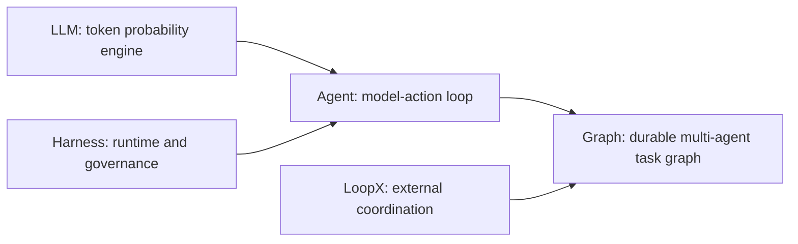
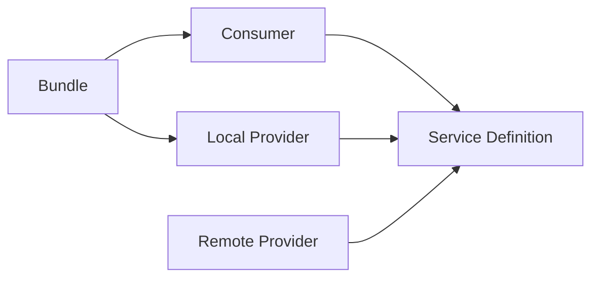
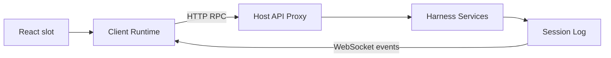
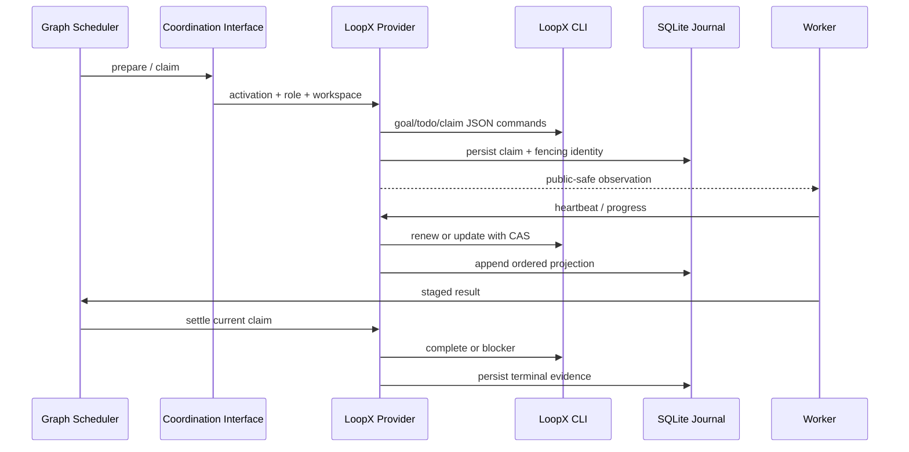

# DeepSeek Harness 技术栈：从零基础到源码精通

[English](technical-stack-course.md) | 中文

本文是一份面向零基础读者的完整项目教材。它从 AI（人工智能）、LLM（大语言模型）、token 和 Transformer 开始，逐层讲到 agent（智能体）、agent harness（智能体框架）、插件装配、agent loop（智能体循环）、事件日志、工具执行、Web 通信、并行编排，以及 Campaign、Graph Mode、浏览器验收与 LoopX 的租约和恢复机制。文中的“精通”指能够解释原理、计算资源、实现最小版本、沿真实请求定位源码、设计复杂任务、诊断失败并用证据验证修复，不是只会背诵框架名称。

## 1. 学习目标与阅读方法

学完后，你应当能回答八类问题：LLM 如何训练和生成；token、上下文、采样与 KV Cache 如何影响质量、延迟和显存；LLM 如何通过 agent loop 使用工具；Harness 如何提供状态、权限、恢复和扩展；程序从哪里启动且一次请求经过哪些源码；Campaign 为什么位于 Graph 之上；环境操作与浏览器验收如何进入同一可审计执行链；Graph 与 LoopX 如何在不修改 agent loop 的情况下协调多个 worker。

教材使用三个观察尺度：全景用于理解概念、进程、包组和数据流；中景用于理解 Service Definition、Service Provider、Consumer 与事件；近景用于理解关键类、方法、持久化记录和取消时序。零基础读者必须按顺序完成第 1、2 章；有 LLM 与 agent 开发经验的读者可从第 3 章开始；维护者可从第 8、13、14 章进入源码主线，再用第 16 章串联一次请求。

阅读时始终区分四类事实：配置决定装配什么；服务决定谁拥有能力；事件决定何时允许扩展；会话记录决定哪些事实能够重放。混淆这四层，是理解本项目最常见的障碍。

课程按五个阶段递进，每一阶段都以可观察产物结束，而不是以“看完章节”为完成标准。

| 阶段 | 章节 | 完成证据 |
|---|---|---|
| 零基础建模 | 1–2 | 能手算一个简化采样例子，并画出 LLM、agent、Harness、Graph、LoopX 的关系 |
| Harness 主链 | 3–20 | 能启动两种 Profile，沿事件追踪一次工具调用并指出状态所有者 |
| Agent 工程深化 | 21–30 | 能实现最小 loop、设计幂等工具、预算上下文与显存、注入恢复故障并设计 eval |
| 项目开发实战 | 31–34 | 能完成插件、诊断故障、回答系统设计题并映射到源码 |
| 综合毕业验证 | 35 | 能提交单 agent、多 agent Campaign 与威胁模型三项作品 |



对本教程而言，“精通 LLM”包含 Transformer、训练、推理、上下文、采样、结构化输出、本地模型资源和评测；“精通 agent”包含循环、工具、状态、记忆、恢复、安全与多 agent；“精通 Harness、Graph 与 LoopX”还要求能解释本项目的真实插件、事件、持久身份和失败语义。训练超大基础模型所需的分布式优化研究不属于本项目岗位的必要前置，但课程会给出足以和模型工程团队准确协作的原理与术语。

## 2. 零基础预备：从 LLM 到 Agent 系统

本章建立后续所有章节的前置知识。第一次阅读时不要跳过；如果某一节只能复述名词而不能解释输入、输出和失败方式，就还没有达到继续阅读源码的条件。

### 2.1 AI、机器学习、深度学习与 LLM

AI 是让计算机完成感知、预测、生成或决策任务的总称。机器学习不是把每条规则手写进程序，而是从样本中优化参数；深度学习使用多层神经网络学习复杂函数；基础模型先在大规模数据上训练，再通过提示词、检索、工具或微调适配许多任务。LLM 是以文本 token 序列为主要输入和输出的基础模型。

从工程接口看，LLM 接收一段 token 序列，输出“下一个 token 在当前上下文下的条件概率分布”。生成一个 token 后，系统把它追加到上下文，再预测下一个，直到模型给出结束标记、达到输出上限或被取消。连续重复这个过程才形成一句话；模型内部没有一个先写好的完整答案等待读取。

这个定义同时给出四个限制：LLM 本身没有可依赖的长期记忆；它不会因为生成了工具名就真的执行程序；它根据统计规律生成而不保证事实正确；相同输入在随机采样下可能得到不同输出。Agent 工程的状态、工具、校验、权限和评测正是为这些限制增加可控机制。

### 2.2 token、tokenizer、向量与位置

模型不直接读取汉字、单词或源代码字符。Tokenizer 按自己的词表把文本切成 token，再把每个 token 映射为整数 id。一个英文词可能是一个或多个 token，一个汉字也不保证恰好对应一个 token；空格、缩进和标点同样占 token。因此上下文和价格预算必须使用实际 tokenizer 计数，不能用“字数除以某个常数”作为精确值。

Embedding 把离散 token id 映射为高维向量。训练让在相似上下文中起相似作用的表示具有可利用的几何关系，但向量中的某一个维度通常没有“是否为名词”这种人类可直接命名的固定含义。位置编码再告诉模型 token 的顺序；没有位置信息，“用户批准命令”和“命令批准用户”会包含相同 token 集合却无法区分顺序。

文本 embedding 模型也把整段文本映射为向量，常用于语义检索。它与生成 LLM 可以是不同模型。向量相近只表示模型认为语义相关，不证明内容正确、最新或有权限被当前用户读取；RAG（检索增强生成）仍需要访问控制、来源记录、重排和答案验证。

### 2.3 logits、Softmax 与采样

模型为词表中的每个候选 token 产生一个未归一化分数 `z_i`，称为 logit。对 `T > 0`，Softmax 把这些分数转换为概率：`p_i = exp(z_i / T) / Σ_j exp(z_j / T)`，其中 `T` 是 temperature。较低 temperature 放大高分 token 的优势，使输出更稳定；较高 temperature 让更多候选有机会出现，但不会自动增加知识或推理能力。API 接受 `T = 0` 时通常把它作为 greedy 或近似确定性解码的特殊配置，而不是代入公式除以零。

Greedy decoding 每次选择最高概率 token；top-k 只保留分数最高的 k 个候选；top-p 选择累计概率达到阈值的最小候选集合，再从中采样。生产 API 还可能固定 seed 或使用提供方特定策略，但并行硬件、模型版本和服务实现仍可能影响完全复现。需要可靠 JSON、工具参数或安全决策时，不能把“temperature 设为 0”当成 schema 校验和业务验证的替代品。

一次局部选择会改变后续全部条件概率，所以早期看似微小的 token 差异可能生成完全不同的工具调用或计划。Agent 系统因此记录实际模型输出、校验结构化字段，并把可重试错误与已经产生副作用的未知结果分开。

### 2.4 Transformer 与 Attention

Transformer 让每个 token 表示根据前文中相关 token 更新。对某一层的输入表示，模型线性变换出 Query、Key、Value，并计算 `Attention(Q,K,V) = softmax(QKᵀ / √d_k + M)V`。Query 表示当前位置需要什么，Key 表示其他位置可按什么特征被匹配，Value 是匹配后汇聚的信息；因果掩码 `M` 阻止当前位置看到未来 token。

Multi-head attention 让多组投影并行学习不同关系，前馈网络对每个位置做非线性变换，残差连接和归一化帮助深层网络稳定训练。多层堆叠后，表示能够组合语法、指代、代码依赖和任务指令。Attention 不是数据库查询，也不会天然标出引用来源；它只是可训练的加权信息混合机制。

标准全量 Attention 对序列长度的计算和注意力矩阵存储近似按平方增长，因此更长上下文会增加预填充成本。RoPE 等位置机制和各种长上下文优化改变可用长度与外推行为，但“窗口允许放入”不等于“模型能同等准确地利用每个位置”。重要约束仍应靠检索、结构化摘要和验收证据突出，而不是把整个仓库无选择塞入提示词。

### 2.5 预训练、对齐与推理

预训练通常通过预测下一个 token 从海量文本和代码中学习通用模式。监督微调使用高质量输入输出示例塑造任务行为；偏好优化使用人类或模型偏好让输出更符合帮助性与安全目标；工具使用训练让模型学会在合适时产生结构化调用。训练改变参数，成本高且影响广；提示词只改变本次上下文，RAG 在请求时加入外部资料，工具把可验证动作交给程序执行。

训练样本把正确的下一个 token 作为目标，常用交叉熵损失 `L = -Σ_t log p(y_t | y_<t)` 惩罚目标 token 概率过低。反向传播用链式法则计算每个参数对损失的梯度，优化器在许多 mini-batch 上反复更新权重。参数是模型学到的数值；学习率、batch size、训练步数和正则化等超参数由训练方案选择，并决定收敛、稳定性与过拟合风险。

训练损失下降不等于真实任务可靠。数据重复、基准污染、时间陈旧和偏好标注偏差都会让离线分数高估能力；预训练记住某些片段也不同于在新任务上泛化。Agent 选型需要保留未泄漏的任务集，并分别测试模型知识、工具遵循、错误拒绝和长轨迹恢复。

推理（inference）是使用固定参数生成结果，不等于模型内部的推理（reasoning）文本。某些模型输出单独的 `reasoning_content`，但 Harness 不依赖保存私有思维链来恢复任务；可恢复状态必须表现为工具调用、公开进度、检查点、文件或结构化结果。更长的隐藏推理也不保证结论正确，仍需外部验收。

幻觉不是一个可由提示词彻底关闭的开关。模型优化目标是生成条件概率高的序列，不是查询一个始终正确的事实数据库。降低幻觉要组合来源受控的检索、工具查询、schema、确定性校验、独立评审、拒答条件和评测集，并根据错误代价决定是否需要人工审批。

### 2.6 推理服务、上下文窗口与 KV Cache

一次生成分为 prefill 和 decode。Prefill 并行处理已有输入并建立每层的 Key/Value 状态，主要决定首 token 延迟；decode 每次新增一个 token 并复用已有 KV Cache，主要决定每秒输出 token 数。批处理可以提高吞吐量，却可能增加单请求排队和尾延迟，因此服务要分别观察 time to first token、decode throughput 与端到端延迟。

上下文窗口同时容纳系统提示词、工具 schema、历史消息、检索内容、当前输入和预留输出。若窗口上限为 `C`，各输入合计为 `I`，最大输出为 `O`，必须满足 `I + O <= C`，并为 tokenizer 估算和提供方包装字段留余量。达到上限时只能拒绝、裁剪、检索、压缩或切分任务；窗口不是可无限增长的会话内存。

KV Cache 避免 decode 时重复计算全部前缀，但会随层数、序列长度、KV head 数、head 维度、批大小和数据精度增长。权重显存的最低估算是 `参数量 × 每参数位数 / 8`；例如 7B 参数的 4-bit 原始权重约 3.5 GB，实际运行还需要量化元数据、KV Cache、激活、运行时缓冲和安全余量。能装下权重不代表能支持目标上下文与并发。

### 2.7 消息、提示词、结构化输出与 Function Calling

聊天 API 通常把上下文分成 system、user、assistant 和 tool 消息。System 说明本次请求中的高优先级行为与安全规则，user 提供当前目标，assistant 保存模型输出与工具调用，tool 把外部执行结果送回模型。“提示词”在工程上不是用户输入这一小段，而是模型最终看到的系统文本、工具定义、历史、检索材料和当前输入的完整序列。

结构化输出要求模型按 JSON Schema 等约束生成字段，但输出仍必须在不可信边界解析和校验。语法正确不等于业务合法：文件路径可能越界，枚举组合可能与当前状态冲突，操作 id 可能陈旧。Harness 在模型 JSON、持久化、Worker、子进程和 wire 数据边界校验，避免把 TypeScript 类型断言误当运行时安全。

Function Calling（函数调用）只表示模型建议“调用哪个工具以及使用什么参数”。Host 解析调用、校验 schema、检查权限、执行真正的文件或网络操作、记录结果，再以 tool 消息返回。模型永远不应直接持有数据库连接、主机密钥或任意进程权限；能力由工具和提供方在最接近资源的位置限制。

### 2.8 从聊天到 agent、Harness、Graph 与 LoopX

聊天应用通常完成一次 `messages -> response`。Agent 在响应中识别工具调用，执行动作，把观察追加回上下文，再请求模型决定下一步，直到完成、失败、取消或等待用户。这个反馈循环带来能力，也引入重复副作用、无限循环、上下文增长、取消竞态和崩溃恢复问题。

Harness 是承载 agent 的工程运行时：它组合模型、工具、会话、持久化、权限、沙箱、交互、遥测和生命周期。一个演示脚本也可以有 agent loop，但没有可重放状态、权限收敛、进程清理和评测入口时，还不是可长期运行的生产 Harness。

Graph 把多个 agent 的任务、依赖、资源、验收和不可变 Revision 组成持久有向无环图（DAG）；Campaign 再把长期目标拆成独立 Batch Graph。LoopX 不生成答案也不运行 agent loop，它是 Graph Coordination Service 的外部提供方，用 goal、todo、peer、Claim、lease、fencing 和 Settlement 记录项目级执行权与终态。Graph 决定“该做什么、何时 ready、如何验收”，LoopX 协调“哪个外部身份当前有权做并提交”。

| 层 | 最小输入 | 最小输出 | 不负责什么 |
|---|---|---|---|
| LLM | token 上下文 | 下一个 token 或结构化建议 | 不执行工具，不保证事实，不保存可靠长期状态 |
| Agent | 目标、模型、工具、当前状态 | 完成结果或明确终态 | 不天然提供生产级持久化与隔离 |
| Harness | 配置、会话、能力提供方 | 可治理、可观察、可恢复的 agent 运行 | 不替模型决定每个开放任务步骤 |
| Graph | 目标、节点、依赖、资源与验收 | 有证据的多 agent Run | 不替代节点内部 agent loop 或外部协调真源 |
| LoopX | goal、todo、peer 与 Activation | Claim、lease、取消与 Settlement 证据 | 不决定模型、DAG、workspace 或工具业务 |

### 2.9 第一次端到端推演

设想用户要求“读取 `package.json`，修改版本校验并运行测试”。LLM 只会生成文本或一个读文件工具调用；Agent Loop 让调用被执行并把文件内容返回模型；Harness 校验路径、记录 `tool/call` 和 `tool/result`、应用沙箱并在取消时清理进程；Graph 可以把分析、实现、测试和评审拆成节点；LoopX 可以为每个物理 Activation 提供外部 Claim 和终态证据。五层共享一个目标，但拥有不同状态和失败责任。

沿这条链反问每一步：输入由谁构造；谁有权执行副作用；哪个事实先持久化；失败后能否重试；迟到结果是否仍有提交权；用户在哪里看到证据。后续章节只是把这六个问题映射到 DeepSeek Harness 的真实插件、事件和源码。

### 2.10 零基础自测

1. 不使用“模型理解了”这句话，解释一个回答如何由逐 token 预测形成。
2. 说明 temperature 与 top-p 改变什么，以及它们为什么不能代替 JSON 和业务校验。
3. 写出 Attention 公式，并解释 Query、Key、Value 与因果掩码的作用。
4. 区分预训练、微调、RAG、提示词和工具调用分别改变系统的哪一部分。
5. 解释 prefill、decode、KV Cache、上下文窗口和权重显存之间的关系。
6. 说明 Function Calling 为什么不是模型直接执行函数。
7. 用一句话分别定义 LLM、Agent、Harness、Graph 和 LoopX，并指出各自不拥有的责任。
8. 为一个会写文件的任务指出至少一个必须持久化的 intent、一个权限检查和一个恢复时不能盲目重试的窗口。

如果八题中任何一题只能背定义，回到对应小节，用一个三 token 词表、一个只读工具和一个写文件工具画出数据流。能够自己构造例子并预测失败结果，才算完成零基础阶段。

## 3. 项目是什么

DeepSeek Harness 是一个以插件为基本组成单位的智能体运行时。它负责把模型、提示词、工具、会话、持久化、审批、沙箱、子代理和用户界面组装成可替换的运行系统。产品的中心不是某个固定模型，也不是某个固定 UI，而是一棵由 Cordis 管理的插件树。

它同时提供三类使用入口：`dsh --profile headless` 运行一次性命令行任务；`dsh --profile web` 运行 Host 与浏览器应用；ACP（Agent Client Protocol）和 SDK 入口把相同能力交给其他进程或自动化客户端。入口不同，但最终都装配同一组核心服务并驱动同一种会话事件模型。

最重要的架构判断是：agent loop 只负责通用循环。计划模式、压缩、权限、Graph Mode、LoopX、工具超时和遥测都通过服务或事件接入。这样，新增行为通常表现为“挂载一个插件”，而不是向循环主体增加条件分支。

## 4. 实际技术栈

| 层次 | 当前技术 | 在项目中的职责 |
|---|---|---|
| 运行时 | Node.js `^22.19.0 || >=24`、ESM | Host、CLI（命令行界面）、Worker、文件与子进程运行时 |
| 语言 | TypeScript 6、`strict` | 服务、事件、协议和 UI 的静态类型系统 |
| 工作区 | pnpm 11 workspace | 管理 `packages/*/*`、应用、原生包和 vendored Cordis |
| 插件框架 | vendored Cordis、Schemastery | 上下文、服务、事件、作用域、配置校验和可逆副作用 |
| 构建 | TypeScript project references、tsdown、Vite | 分离 Host/Client 编译面，生成库产物和 Web 静态资源 |
| 模型接入 | DeepSeek Chat Completions、`pi-ai`、SSE（Server-Sent Events）parser | 把统一 LLM 请求映射为提供方流式协议 |
| Web | React 18、Zustand、Immer、原生 HTTP、`ws` | 插件化 UI、客户端对象状态、RPC 与事件下行 |
| 浏览器自动化 | Chrome DevTools MCP、Playwright | Graph Web 验收、页面/控制台/网络证据与 GUI 测试 |
| 数据校验 | Schemastery、Zod | 插件配置和工具 schema；进程、持久化与 wire 数据校验 |
| 持久化 | JSONL + Zstandard、Node `node:sqlite` | 会话日志、查询索引、Graph 资源/调度与 LoopX 本地投影 |
| 并发 | Promise、AbortSignal、Worker Threads、PTY/子进程 | 流式请求、取消、代码执行、工作流和命令运行 |
| 隔离 | 平台沙箱、Landlock/bwrap/Seatbelt、进程树控制 | 对文件和子进程能力实施部署策略 |
| 测试 | Vitest、V8 coverage、Playwright、snapshot replay | 单元、约定、真实入口、GUI 与无密钥回放验证 |
| 观测 | 会话事件、OpenTelemetry logs | 可重放产品事实与部署遥测 |

这张表只说明采用了什么，还不能说明系统为何这样拆分。真正的主线是：Cordis 管装配与生命周期，会话管理可重放事实，agent loop 管一次请求的控制流，能力包管具体副作用，Host/Client 管跨进程投影，Graph 管多 agent 工作，LoopX 管项目级外部协调。

## 5. Monorepo 与包边界

仓库使用“包组/包”的两级目录。`packages/core` 是产品 API 主干；`llm`、`fs`、`shell`、`subprocess`、`sandbox`、`web` 等包组提供能力；`session`、`storage`、`attachment` 管持久数据；`subagent`、`jobs`、`workflow`、`graph` 管并发与编排；`host`、`client`、`api`、`typert` 管 Web 与 RPC；`bundle`、`preset` 和 `boot` 管最终装配。TypeScript SDK 位于 `packages/sdk`，Python SDK 与自带运行时位于仓库根目录的 `python/`；`packages/experimental` 只容纳必须显式启用的私有原型，不属于稳定产品面。

每个 npm 包名为 `@deepseek-ai/dsh-*`，本地相对导入保留 `.ts`，跨包导入使用包名。库源代码在 `src/`，构建产物在 `lib/`。源码检查通过 TypeScript `paths` 直接解析到 `src/`，发布消费者则通过 `exports` 读取 `lib/`，因此项目明确区分源码面与产物面。

能力包通常分为三个角色。Service Definition 以 Cordis `Service` 声明服务键、类型和调用约定，不只是一个 TypeScript interface；Service Provider 实现本地、远程或特定平台能力；Consumer 把能力变成模型工具、命令、UI 或更高层服务。依赖方向从 Consumer 指向 Definition，而不是指向某个具体提供方，因此更换实现无需修改消费方。



`packages/bundle/base` 组合核心 agent、DeepSeek 模型、工具、会话持久化、权限和沙箱；`bundle/web-app` 在其上增加 Host、Client、Graph 与 Web UI；`bundle/headless` 增加一次性命令行驱动。Bundle 可以依赖具体 Provider，因为它的职责就是作部署选择。

## 6. Cordis：项目的运行骨架

Cordis `Context` 是插件共享的运行上下文。服务通过 `ctx` 暴露，例如 `ctx.sessions`、`ctx.tools`、`ctx.llm`；插件使用声明合并扩展 Context 和事件类型。Cordis 不是简单的依赖注入容器，它同时拥有插件作用域、事件分发和卸载顺序。

注册是一种副作用，必须能撤销。`ctx.effect()` 注册资源及其 disposer，`ctx.on()` 注册事件监听器并返回移除函数，Service 本身也受所在 fiber 生命周期约束。插件卸载时，文件监听、网络端口、Agent、Worker 和注册表条目必须沿同一所有权链释放。

事件有三种重要语义。普通 emit 广播事实；serial 依次等待监听器；waterfall（瀑布式事件）允许监听器修改输入或短路链路。waterfall 监听器若希望委托给下一层，必须调用 `next()`；直接返回意味着它已经接管请求。

```text
plugin scope
  -> register service / event / route / tool
  -> serve work while fiber is active
  -> receive unload or abort
  -> stop new work
  -> drain in-flight work
  -> dispose registrations in reverse ownership order
```

理解 Cordis 的关键不是记 API，而是追踪所有权。看到一个计时器、Agent、WebSocket 或子进程时，要问：谁创建它；哪个 signal 能取消它；哪个 effect 等待它停稳；卸载后哪个注册表不再能找到它。

## 7. 启动、Profile 与配置叠加

CLI 入口是 [`apps/cli/src/bin.ts`](../apps/cli/src/bin.ts)。它先解析参数，再按 `profile`、`plugin` 或 `dump-config` 动态导入对应路径。动态导入避免无关模式进入同一启动闭包，也让源码启动和构建后启动保持 ESM。

Profile 是 Harness home 中的具名装配，Bundle 是可发布的配置 patch 层。启动时先按 Profile 顺序应用 Bundle，再应用 Profile patch、home patch，最后应用命令行 `--patch`。Patch 通过稳定条目 id 替换 config 或插入插件，因此用户可以覆盖模型、工具、存储和 UI，而不分叉 Bundle 源码。

```sh
dsh --profile web --dump-config
dsh --profile headless "summarize this workspace"
```

第一条命令是理解实际运行树的首选方法，因为源码中的包依赖只说明“可能装什么”，展开后的配置才说明“这次启动装了什么”。配置由 Schemastery 在插件加载处校验；可独立判断的错误在加载时失败，依赖外部状态的错误在最早可解析点失败。

启动后的结构不是平铺列表，而是作用域树。父插件提供服务，子插件注入依赖，调用者还可能创建 agent 作用域或 session 作用域。相同服务键可以在子作用域被更具体的实现遮蔽，这正是每个 Agent 可拥有不同工具、提示词或策略的基础。

## 8. agent、轮次、步骤与 Inbox

`Agent` 是对外接口，`AgentLoop` 是默认工厂和驱动，`ReactLoopAgent` 是当前循环实现。Agent id 与 Session id 共享身份；创建或恢复时，工厂先准备会话和作用域，再原子地发布到 agent 与会话注册表。失败或卸载会走同一个记忆化反向 teardown，避免半发布对象残留。

Inbox 接收用户消息、steering（中途引导）、后续上下文和内部 follow-up。轮次在领取第一条可执行输入时开始，在没有待处理工作时结束；步骤是一次模型请求及其工具调用。一个轮次可以包含多个步骤，因为工具结果可能要求模型继续回答，运行中到达的新输入也可能触发下一步骤。

```text
turn/start
  claim inbox input
  agent/pre-step
  step/start
    assemble system prompt + tool schemas
    derive model history from session events
    agent/request
    llm/stream
    assistant/chunk*
    assistant/message
    tool/call* -> tools pipeline -> tool/result*
  step/end
  repeat when more work is owed
agent/turn-stopping
turn/end
```

关键源码位于 [`packages/core/agent-loop/src/agent.ts`](../packages/core/agent-loop/src/agent.ts)。`preStep()` 通过 `agent/pre-step` waterfall 允许插件拒绝或改写已领取消息；`turn()` 记录轮次与步骤的生命周期；请求路径从 `session.deriveMessages()` 生成历史，经 `agent/request` 构建最终 LLM 参数，再调用 `ctx.llm.stream()`。

取消不是简单抛出异常。Agent 使用 `AbortSignal` 让模型流、工具和等待点尽快退出，同时 teardown 必须等待机器进入 idle、作用域释放、注册表摘除。调用者应区分用户取消、被新请求抢占、资源卸载和执行失败，因为这些原因决定是否记录终态、是否可重试，以及 UI 应如何呈现。

## 9. 提示词、模型与流式响应

System Prompt 服务保存由插件贡献的片段、变量和工具 schema。每个步骤在请求前重新装配，因此当前 provider、model、cwd、模式和可用工具能够进入请求。只有稳定前缀适合模型 KV Cache；包含当前任务、Claim 或运行状态的片段属于可变后缀。

LLM Service Definition 统一消息、内容块、工具调用、usage 和流式事件。DeepSeek Provider 把它映射到 Chat Completions，并使用 `eventsource-parser` 解码 SSE；`llm-pi-ai` 是基于 `pi-ai` 的替代适配器。重试、默认模型和 token 计量是独立插件，不写入 Provider 主体。

`agent/request` 是请求级策略入口。监听器可以选择模型、加入模型可见上下文或包裹 stream，但任何到达模型的事实都必须能从会话日志重建。这条不变量称为“模型可见即已记录”，它保证恢复、回放、导出和 UI 不会各自得到不同历史。

流式输出先记录细粒度 `assistant/chunk`，结束后形成 `assistant/message`。保存原始 chunk 不是冗余：它保留文本、推理和工具调用增量的到达顺序，使崩溃恢复与前端流式重放不必猜测 Provider 当时发出了什么。

## 10. 工具体系与副作用控制

Tools 服务维护作用域化注册表。每个工具包含名称、描述、参数 schema、执行函数和 UI 呈现意图。Agent Loop 先记录 `tool/call`，再经 `tools/pre-execute`、`tools/execute`、`tools/post-execute` waterfall 调用，最后记录 `tool/result`。

工具调用可并行，但只有声明为并行安全的调用才进入受限并发组；`maxParallelToolCalls` 控制每个 agent 步骤的并发上限。每个已启动调用保留自己的会话 seq，使并行完成顺序不会破坏调用与结果之间的引用关系。调度失败也不能抹掉已经记录的调用事实。

权限、沙箱、超时、结果 spill 和重复调用提醒都包裹工具流水线。它们不是工具实现中的散落判断：权限插件可以在执行前询问用户，沙箱 Provider 把请求解析成平台执行规格，超时插件合并取消信号，spill 策略把过大结果保存到外部存储并只向模型返回引用。

Shell、Filesystem、Subprocess 和 Terminal 是不同层次。Filesystem 负责路径和文件语义；Shell 把命令请求解析为执行规格；Subprocess 负责进程树、stdio 上限、退出和终止；Terminal 负责可持续 PTY 会话。模型工具只依赖对应 Definition，Bundle 决定使用本地、PowerShell、bash 或沙箱 Provider。

安全分析必须识别真正的边界。Worker Thread 的 Code Runtime 提供隔离、堆上限和强制终止，但其信任级别与 bash 等价，并不是恶意代码安全边界；进程沙箱和文件策略才负责限制主机访问。审批也不是沙箱的替代品，它只表达用户授权。

## 11. 会话日志：系统的事实记录

会话是内存中的仅追加事件序列，每个事件拥有连续 `seq`、时间和带判别字段的 data。`turn/start`、`step/start`、`user/message`、`assistant/chunk`、`tool/call`、`tool/result` 等属于持久事实；`agent/request` 等实时事件只负责当次扩展，不直接成为历史。

`Session.deriveMessages()` 不直接保存一份可变聊天数组，而是把事件序列投影为模型消息。这样，崩溃修复、压缩、fork、父子会话关联和模型历史都围绕同一账本工作。新增模型可见输入时，开发者必须扩展 `SessionEventMap` 并定义投影规则。

会话持久化是独立能力。协调器监听 `session/created`、`session/event`、`session/flush` 和 `session/disposed`，为每个会话串行化写入，按固定窗口批处理事件，并在 flush 或卸载时排空。后端只负责读取、追加、修复和列举，不重新实现上层生命周期。

默认 JSONL 后端把每个会话保存为仅追加逻辑日志，通常使用拼接的 Zstandard frame；每批写入带校验并 `fsync`。崩溃留下不完整尾部时，loader 保留最后一个有效前缀，并补写工具、步骤、轮次的关闭事件。SQLite 后端使用 Node 内置 `node:sqlite`，把 header 和事件映射为行，并共享同一个持久化协调器。

崩溃恢复不会假装未知副作用没有发生。已出现 assistant 工具调用但没有持久化 `tool/call` 时，修复结果为 `TOOL_NOT_STARTED`；已有 `tool/call` 但无结果时为 `TOOL_OUTCOME_UNKNOWN`。模型只能自动重试只读或幂等工作；有副作用的调用必须先验证或询问用户。

## 12. Web Host、RPC 与插件化 UI

Web 模式包含 Host 和浏览器两个 Cordis 世界。Host 使用 Node `http` 提供静态资源、API 路由和 upgrade 路由；Client 在浏览器中启动自己的插件树。React 只是渲染层，UI 功能仍以 Client 插件注册到 slot，而不是集中在一个巨型组件中。

浏览器上行请求通过 fetch 形态的 RPC handler，Host 下行事件通过 WebSocket。`rpcId` 是带品牌的关联 id，响应必须回显请求 id；审批与提问可以跨断线重放，普通事件推送拥有自己的 id。Wire 数据使用 Zod 校验，Host 业务服务仍使用领域类型。

Typert 从 TypeScript 声明生成 Host/Client 类型图、codec 和 Remote Service 元数据。`api/gateway` 与 `api/remotes` 把服务方法暴露为类型化 RPC，运行时 registry 管理已挂载贡献。它解决的是“跨进程仍保持类型、schema 和插件生命周期一致”，不是生成一套与领域服务无关的 REST 控制器。

Client Runtime 用 Zustand 保存对象级状态，用 Immer 生成不可变更新，Session Runtime 根据会话创建作用域树。`web-react` 通过 `useSyncExternalStore` 类桥接把外部服务快照接入 React。会话事件推动局部对象更新，UI 不需要每收到一个 chunk 就重新获取整份 Session。

浏览器自动化是独立的可选 Bundle，而不是 Graph 的内置协议。`browser-chrome-devtools` 组合固定版本的 Chrome DevTools MCP；默认 `managed` 模式在第一次浏览器操作时惰性启动可见 Chrome，使用临时 profile，并在插件卸载时关闭进程和删除 profile。`external` 模式连接 `DSH_CHROME_DEBUG_URL` 指向的现有 Chrome，由部署方负责其生命周期。并发 worker 必须使用独立浏览器 context 和明确 page id，不能依赖“当前标签页”这种隐式全局状态。

MCP Client 还承担文件证据的安全转换。被声明为 workspace path 的参数会先解析为调用方 agent 会话工作区中的规范路径；空值、越界路径和 symlink 逃逸在请求到达 MCP server 前失败。这样，浏览器截图可以作为 Graph artifact 流转，而 MCP 工具不能借一个看似相对的路径写入别的会话或 Host 任意目录。



## 13. 从单代理到并行工作

Subagent 能力负责创建或派生子 agent。Provider 可以在进程内 spawn/fork，也可以连接 Codex、Claude Code、ACP 或 DSH SDK。父子关系记录在会话 header 和事件中，工具层只依赖 Subagent Service Definition。

委派同时传播权限上限。进程内 Provider 从父 agent 的有效 sandbox 计算 `sandboxModeCap`；子 agent 可以收窄为更受限模式，但不能把父会话的权限扩大。若调用要求上限而 Provider 不声明该能力，系统在委派前明确失败，而不是静默退回到不受控执行。Graph 的隔离工作区 child 进一步把上限固定为 `workspace-write`，即使主会话临时处于 `danger-full-access` 也不能越过分配目录。

Jobs 为长时间后台任务提供通用句柄和输出读取；Workflow 在 Worker Thread 中运行结构化工作流；Code Runtime 在全新 Worker Thread 中执行模型生成的 TypeScript。三者目的不同：Job 管生命周期，Workflow 管可编排程序，Code Runtime 管一次受预算约束的代码执行。

Graph 在这些能力之上提供持久、可修订的 DAG。每个节点描述角色、任务、依赖、验收条件、工作区所有权、模型与预算。Revision 不可变；修改任务会创建下一 Revision，而不是改写历史。Run Snapshot 保存某个 Revision 的完整运行证据。

长项目在 Graph 之上再增加 Campaign 与 Batch。可以把身份层级记为 `Campaign > Batch > Graph > Revision > Run > Generation > Activation > Attempt`：Campaign 表示一个长期目标；每个 Batch 拥有独立 Graph，只保留当前阶段工作；Revision 描述不可变设计；Run 与后续身份描述执行。这个分层避免把已经完成的几百个节点不断复制进越来越大的后续 DAG。

Graph Mode 通过 `/graph`、主控提示词、`graph_submit`、会话事件和后台 Scheduler 接入现有 agent。主控仍是普通 agent，Worker 仍通过 Subagent 能力执行；agent loop 不知道 DAG，也不包含 Graph 分支。

## 14. Graph Mode 的调度机制

主控把用户输入分类为新任务、修订、检查、控制、澄清或直接回答。新任务和修订先形成不含 Host 身份字段的语义草稿，Graph Mode 再推导 graph id、revision、时间戳、运行默认值和物理 workspace 分配，并在校验后保存不可变 Revision。

有顺序依赖的长期目标先提交 Campaign 计划与第一个 Batch Graph。每个已接受 Batch 定义构成不可变前缀；当前 Batch 被验收后，系统从持久 Run 与 Settlement 证据生成紧凑摘要并激活下一个 ready Batch。只有全部已登记 Batch 都被接受时，主控才可通过 `planExtension` 原子追加一个非空后缀；扩展记录原因、来源 Batch、Run 和已确认 Settlement，并递增 `planRevision`。它不能插入、重排、删除或替换已接受前缀。失败 Batch 只修订自己的 Graph，已经通过的 Batch 不会重新生成。

节点只有在所有前置节点终止、条件边通过、资源可获得、协调 Claim 成功后才进入运行。准入同时考虑全局 Worker 数、角色上限、provider/model 上限、权重预算和主控保留容量。并行可写节点必须声明互不重叠的相对 `writeRoots`。

仓库外的必要准备使用 `environment` 节点，而不是把 engineer child 提升为特权 agent。节点冻结一至十六条有序命令、所需 `network`、`host-package-install` 或 `docker` 能力、sandbox 模式、验收标准和可选的说明性回滚命令。Scheduler 在持久 `environment` checkpoint 停止；批准只授权下一 Generation，拒绝则取消 Run。批准后 Host 直接通过 Shell Service 执行已记录命令，不给模型开放式特权 shell；每条命令先取得稳定外部引用并 flush，再记录退出码、signal、timeout、sandbox、截断与字节数。失败不自动重试，未知结果进入人工对账，回滚也必须成为另一个单独批准的 environment 节点。

每次节点运行形成 Activation 和 Attempt。Scheduler 先持久化待执行状态，再执行外部资源保留与协调操作；关键外部副作用之前使用显式 Session flush 屏障。Worker 定期发布进度、checkpoint、token 使用和租约续期，Monitor 负责预算、无进展超时、墙钟上限与取消。

成功输出先 staged，再经过 schema、验收条件和 artifact integration。Review/verification 节点必须返回结构化 decision 与 issues。协调终态写回失败时，Graph 不会重新运行已经成功的 Worker，而是进入 `awaiting_user` 对账检查点，恢复时只重试 settlement。

面向用户的 Web 工作在集成后的可运行版本之后安排 `browser-tester` 节点。主控必须给出精确 origin、关键流程、viewport、locale 和可测量的 DOM/视觉断言；worker 优先使用页面 snapshot 和 element id 操作，按模型能力捕获截图，并检查相关 console error 与失败 network request。浏览器工具仍是普通组合能力，Graph 只规定任务、证据与结构化 verdict，因此更换浏览器 Provider 不需要修改 Scheduler。

修订会使变更节点的传递后继失效，但不改写旧 Revision 或 Run。未受影响且已有成功证据的节点可显式复用。暂停、批准、跳过、重试、从节点恢复和替代输出都经过串行控制服务，并携带精确 graph/revision/generation 身份，陈旧页面无法修改新一代运行。

Graph UI 的 Design、Execution、Revisions 三个视图分别回答“计划是什么”“正在发生什么”“为什么演化成这样”。Revisions 以逻辑任务为纵向 lane、不可变 Revision 为横向时间，显示 `new_task`、`analysis_refactor`、`execution_correction` 与跨 Batch `depends_on` 关系，并列出节点的增加、修改、移除、保留和失效。lineage 的意图与结构差异进入 durable submission；耗时、token、checkpoint 和 Settlement 等运行指标从 Run/Attempt 投影得出，缺失历史遥测显示为未知而不是零。Campaign track 另行显示 Batch 状态、计划修订和每个 Batch 的引入修订。

恢复不是只在进程启动时执行一次。每个 agent 的周期扫描会检查 pending submission，以及没有本地 executor 的 queued/running Run；它先获取带 fencing 的 Scheduler lease，再创建更高 Generation 对账。远端 owner 仍存活时扫描只报告 busy，不重复调度。Session projection 被急切维护并优先用于 Graph 读取，避免长日志反复 fold 阻塞 heartbeat；已经具有 LoopX 终态的 Activation 会直接返回终态 disposition，永远不会再次派发 Worker。

## 15. LoopX 的设计、实现与耦合

LoopX 是 Graph Coordination Service 的一个外部 Provider，不是 Agent Loop，也不是 Graph Scheduler。Graph 决定节点何时 ready、允许多少并发、使用哪个模型和工作区；LoopX 提供项目级 goal、todo、peer、claim、lease、取消和终态证据。二者通过 `dsh-graph-coordination` 接口连接。

| LoopX 对象 | 在集成中的含义 | 主要身份关系 |
|---|---|---|
| goal | 预先存在的项目级目标容器 | 一个 Graph 部署绑定一个配置的 goal |
| todo | 节点 ready 后惰性创建的可认领工作 | 带稳定 Activation 标记，终态为 completed 或 blocker |
| peer | 代表 analyst、engineer 等角色的已注册执行身份 | Graph role 通过配置精确映射到 peer |
| Claim | 某 peer 对 todo 当前执行权的记录 | 绑定物理 Activation 和递增 lease 身份 |
| lease | Claim 的有限有效期与续期版本 | 过期允许接管，但旧持有者仍需 fencing 阻止写回 |
| Settlement | complete、blocker 或 cancel 的幂等终态写回 | 使用当前 CAS 版本并保留稳定证据 |

准备阶段确认配置的 LoopX goal 可读，角色到 peer 的映射存在。节点 ready 后，Provider 才惰性创建带 Activation 标记的 todo，以对应 peer 认领，并把最长 8,000 字符的公开安全 observation 交给 Worker。原始 registry 状态不会直接进入模型提示词。

Claim 使用硬租约。每次 heartbeat 推进 LoopX lease version，返回新的 lease id、到期时间和 fencing token；后续 progress、cancel 和 settlement 必须携带当前身份。终态写回使用 LoopX 当前 CAS version，旧 Worker 即使迟到也不能覆盖新 Claim 的结果。

本地 `LoopxCoordinationJournal` 使用 Node `node:sqlite`，Schema Version 2 按物理 Activation 保存 Claim、owner、progress、cancel、terminal 和有序 events。Cursor 与事件序号连续，重启后 Settlement 从持久 Claim 恢复 todo id，不依赖进程内 Map。终态操作按 Activation 串行，不会让一个等待中的任务阻塞无关任务。

认领前，Provider 同时检查本地终态 journal 和 LoopX todo 当前状态。若 todo 已带稳定标签完成或阻塞，它会返回对应终态 disposition，并在需要时修复本地投影，而不是再次 claim 或执行。每个 CLI 操作有自己的 deadline 与 stdout/stderr 字节上限；stdout 默认上限为 8 MiB，使较大的合法 `todo list` 仍可解析，超限则报告明确的大小错误。



耦合是分层的。架构耦合较低：Graph 只认识 Coordination 接口，可以换 Provider；LoopX Provider 不修改循环和节点业务。部署耦合较强：它依赖 LoopX CLI 命令、JSON 字段、goal/peer 预配置、工作目录和可执行文件路径。持久化耦合明确：LoopX 是外部真源，SQLite 只是可恢复的本地投影，不是分布式事务参与者。

LoopX Provider 故意不把 heartbeat quota、vision、LoopX scheduler 或 worktree 策略套进会话内节点。并行度和资源仍由 Graph 准入控制，工作区仍由 Harness 解析，模型只看到经过裁剪的 Claim observation。这个分工避免两个调度器同时决定同一个节点。

在 Windows Host 上运行 WSL 内 LoopX 时，`executable` 可配置为 `wsl.exe`，`executableArgs` 指向发行版和 LoopX 路径，`pathStyle` 使用 `wsl`。Provider 只转换 registry 路径；子进程 cwd 仍由 Host 传递，进程终止仍受配置的宽限期约束。

恢复仍有分布式限制。LoopX 与本地投影之间没有原子提交；稳定标签用于补回“外部修改成功但本地记录尚未写入”的窗口，冲突时不会覆盖任一账本。多个 Host 若不共享经过认证的持久存储，就不能共享本地 cursor 与进度去重状态。

## 16. 一次请求的端到端近景

以 Web 用户发送“修改一个文件并运行测试”为例。浏览器 Session 对象生成带 `rpcId` 的请求；Host API 校验 wire 数据，找到目标 Agent，把消息送入 Inbox，并把 `user/message` 记录到 Session。WebSocket 将事件推回浏览器，输入框立即能显示已接受状态。

Agent 领取输入并记录 `turn/start`、`step/start`。System Prompt 收集 workspace 指令、时间、模式和工具；Tools 生成 schema；Session 投影历史。`agent/request` 允许模型路由和模式插件补充请求，然后 LLM Provider 发出 HTTP/SSE 请求。

模型流生成文本和工具调用增量，系统逐条记录 `assistant/chunk`。完整工具调用形成 `assistant/message` 后，Agent 记录 `tool/call`。权限插件判断是否需要交互，Filesystem 或 Shell Consumer 调用对应 Service，Sandbox Provider 解析允许路径与命令，Subprocess Provider 启动进程并受 signal、超时和输出上限约束。

工具完成后记录 `tool/result`。若模型还欠最终回答，Agent 开始下一 Step；否则记录 `step/end`、`turn/end`。Persistence Coordinator 在后台追加事件，并在关键 flush 点等待落盘。Client 根据下行事件更新 Zustand 对象，React slot 只重绘受影响区域。

若处于 Graph Mode，主控的 `graph_submit` 不直接执行文件修改。短任务直接形成 Revision 和 Run；有顺序的长任务先建立 Campaign，并只提交当前 Batch Graph。Scheduler 为 ready 节点取得资源与 Coordination Claim，再启动子 Agent；environment 节点在审批后由 Host 执行固定命令，Web 产物由后续 browser-tester 验收。LoopX 只参与 Claim/lease/settlement，实际工具调用仍走子 Agent 自己的 Agent Loop 与会话日志，UI 则从 durable lineage 和运行投影显示 Campaign、设计、执行与修订历史。

## 17. 如何扩展项目

新增能力时，先判断它是事实、策略还是副作用。需要重载后存在的事实进入 Session Event；只影响当前请求的策略进入合适的 waterfall；可替换副作用建立 Service Definition/Provider/Consumer；纯 UI 功能注册 Client slot。不要因为调用点方便就直接修改 Agent Loop。

一个完整能力通常按此顺序落地：定义领域类型和 Service；实现至少一个 Provider；实现模型工具或其他 Consumer；把注册放入 `ctx.effect()`；通过 Bundle 选择实现；记录模型可见文本和事件；补单元、约定、真实装配与 snapshot 验证；更新所属 README 和 subsystem 文档。

边界数据必须校验：配置、模型工具 JSON、持久化、Worker message、子进程 JSON 和 RPC wire 都不可信。同进程且由 TypeScript 接口保证的内部调用不重复校验。跨包 id 使用 branded string，封闭联合用 discriminant 和 `assertNever`，可扩展映射使用声明合并。

并发代码先写所有权和终止条件：谁能开始工作；谁能取消；迟到结果是否仍有提交权；释放时等待什么；持久化发生在外部副作用之前还是之后。Graph 的 fencing、Agent 的记忆化 teardown、Session 的 per-id 串行写入，都是这个问题的不同答案。

## 18. 构建、测试与质量门禁

`pnpm run build` 先构建 Host 和 Client 库，再构建 Web。Host 与 Client 使用不同的 TypeScript aggregate，tsdown 生成运行时代码和声明，Vite 生成浏览器 dist。源码启动通过 `node --import tsx/esm`，构建后配置子进程必须在普通 Node 下解析 `lib/`。

```sh
pnpm run typecheck
pnpm run lint
pnpm run test
pnpm run test:coverage
pnpm run test:snapshot
pnpm run build
pnpm run hygiene
pnpm run doc-sync
```

单元测试验证局部行为，contract tests 验证 Definition 可由不同 Provider 共享，invariant 插件验证已装配运行时的所有关系，snapshot 通过真实示例和无密钥回放验证模型可见轨迹，e2e 在有密钥时验证真实 Provider。产品可见行为不能只靠 mock 单测证明。

覆盖率门禁是 `test:coverage`，不是普通 `test`。文档由链接、换行、Mermaid、TypeScript 围栏、生成目录、双语 pairing 和站点构建共同校验。发布包还要通过 publint、NodeNext consumer、runtime closure 和 workspace constraints。

## 19. 源码阅读路线与练习

第一阶段先运行 `dsh --profile web --dump-config`，再读 [`docs/architecture.md`](architecture.zh.md)、[`docs/cordis-primer.md`](cordis-primer.zh.md) 和 [`packages/README.md`](../packages/README.zh.md)。目标是能从配置条目找到包，再从包找到 `ctx` 服务键。

第二阶段沿单次请求阅读：CLI 从 [`apps/cli/src/bin.ts`](../apps/cli/src/bin.ts) 开始；Agent 从 [`packages/core/agent-loop/src/agent.ts`](../packages/core/agent-loop/src/agent.ts) 开始；工具并发从 [`packages/core/agent-loop/src/tool-calls.ts`](../packages/core/agent-loop/src/tool-calls.ts) 开始；会话从 [`packages/core/session/src/index.ts`](../packages/core/session/src/index.ts) 的 `deriveMessages()` 开始。

第三阶段沿数据落盘与 Web 阅读：先看 [Session 持久化](../packages/session/session-persistence/README.zh.md)、[Web 连接](../packages/client/connection/README.zh.md)、[API 网关](../packages/api/gateway/README.zh.md)和[客户端状态存储](../packages/client/store/README.zh.md)。

第四阶段阅读并行编排：先读 [`packages/subagent/README.md`](../packages/subagent/README.zh.md)，再从 [`packages/graph/graph/src/types.ts`](../packages/graph/graph/src/types.ts) 建立 Campaign、Revision、Run 与 lineage 身份，随后阅读 [`packages/graph/graph-mode/README.md`](../packages/graph/graph-mode/README.zh.md) 和 [`packages/graph/graph-coordination/README.md`](../packages/graph/graph-coordination/README.zh.md)。最后把 [`packages/graph/graph-coordination-loopx/README.md`](../packages/graph/graph-coordination-loopx/README.zh.md) 的 `journal.ts`、`index.ts`，[`packages/client/ui-graph/README.md`](../packages/client/ui-graph/README.zh.md) 的三视图，以及 [`packages/bundle/browser-chrome-devtools/README.md`](../packages/bundle/browser-chrome-devtools/README.zh.md) 的浏览器生命周期串成一条执行证据链。

练习一：选择一次 headless 运行，按 seq 写出其轮次、步骤、assistant 和 tool 事件。练习二：给某个 waterfall 监听器画出调用 `next()` 与短路的两条路径。练习三：为一个有副作用工具列出崩溃发生在 `tool/call` 前、外部执行后、`tool/result` 前时的恢复策略。练习四：为一个包含 environment、implementation 与 browser-tester 的两 Batch Campaign，标出 Campaign、Batch、Graph、Revision、Run、Generation、Activation、Attempt、Claim 与 Settlement 的身份关系，并解释失败 Batch 为什么只产生本 Batch 的新 Revision。

## 20. 术语速查

| 术语 | 精确定义 |
|---|---|
| LLM | 根据 token 上下文生成下一 token 条件概率分布的参数化模型 |
| Token | Tokenizer 用词表映射到整数 id 的模型输入或输出单元 |
| Embedding | 把离散 token 或文本映射为高维连续向量的表示 |
| Context window | 一次模型请求可容纳的输入与预留输出 token 总范围 |
| KV Cache | 保存 Attention Key/Value 以避免 decode 重算前缀的运行时状态 |
| Agent | 让模型在观察、工具动作和结果反馈之间循环直至明确终态的系统 |
| Harness | 组合 agent 的模型、工具、状态、权限、持久化和生命周期的工程运行时 |
| Graph | 用不可变 Revision、依赖、资源和验收组织多 agent 工作的持久 DAG |
| LoopX | 通过 goal、todo、peer、Claim、lease 与 Settlement 提供外部项目协调的系统 |
| Function Calling | 模型生成工具名和参数建议，由 Host 校验并执行的协议模式 |
| Plugin | 挂载到 Cordis Context、贡献服务或副作用并可卸载的单元 |
| Service | 通过 `ctx` 提供的有类型能力及其生命周期 |
| Provider | Service Definition 的具体实现 |
| Consumer | 使用能力并暴露工具、命令、UI 或上层服务的插件 |
| Session | 仅追加事件及不可变 header 组成的会话事实记录 |
| Turn | 从领取输入到不再欠工作的完整轮次 |
| Step | 一次模型请求及其产生的工具调用步骤 |
| Projection | 从事件日志推导模型历史、UI 状态或查询视图的过程 |
| Campaign | 由多个有顺序依赖的独立 Batch Graph 组成的长期目标及其审计历史 |
| Batch | Campaign 中只包含当前阶段工作的独立 Graph 单元 |
| Revision | 不可变的 Graph 定义版本 |
| Revision lineage | 解释 Revision 的逻辑任务身份、产生原因、父子或跨 Batch 关系与结构差异的持久记录 |
| Run | 某个 Revision 的持久执行快照 |
| Generation | 一次初始、恢复或控制操作创建的有 fencing 所有权的 Run 执行代 |
| Activation | 节点在某一 Generation 中的一次物理激活身份 |
| Attempt | Activation 内一次 Worker 执行或继续执行 |
| Environment checkpoint | 冻结 Host 操作计划并只允许一次明确审批授权下一 Generation 的持久暂停点 |
| Claim | 外部协调系统授予某 Activation 的执行权 |
| Lease | 有期限且可续期的 Claim 有效期 |
| Fencing token | 阻止旧 Claim 迟到写回覆盖新所有者的单调身份 |
| Settlement | 对 Claim 的幂等终态写回及其证据 |

## 21. Harness 基础篇心智模型

把系统记成五层即可。第一层是 Cordis 插件树，决定运行时拥有什么；第二层是 agent loop，决定一条输入如何推进；第三层是会话日志，决定什么能够恢复和解释；第四层是能力 Provider，决定副作用如何执行与隔离；第五层是 Host/Client、Campaign/Graph 和 LoopX，分别把单 agent 运行投影到人机界面、把长期目标拆成独立 Batch DAG、再接入外部项目控制面。environment 与 browser-tester 不是额外层，它们是 Graph 节点如何在第四层能力上受控执行与验收的具体策略。

遇到任何问题，都按同一顺序定位：先看展开后的配置，再找服务所有者，然后找触发事件，再找持久记录，最后检查取消和 teardown。能沿这条路径解释一次成功、一次失败和一次重启恢复，就已经从“会使用项目”进入“能修改项目”的阶段。

## 22. 从零实现最小 agent loop

本章的目标不是重新造一个 Harness，而是用不足百行的实现理解 agent 与普通聊天接口的差别。普通聊天只执行一次 `messages -> completion`；agent loop 还要识别工具调用、执行副作用、把结果追加回历史，并决定继续、结束、取消还是失败。因此 agent 本质上是一个由模型参与决策的状态机。

### 22.1 状态机与停止条件

最小状态集合可以写成 `idle -> requesting -> executing -> requesting -> completed`，任何活动状态都可以进入 `canceled` 或 `failed`。生产实现还需要 Turn、Step、持久化和恢复，但如果最小循环都没有明确状态，增加这些能力只会放大竞态。

停止条件至少包括：模型给出无工具的最终回答；达到步骤、token、墙钟或成本上限；用户取消；工具或模型返回不可恢复错误；系统进入审批或澄清等待。只检查“有没有工具调用”会让重复调用、无进展推理和被截断回答继续消耗资源。

### 22.2 可运行的最小实现

下面的代码是一个可编译的教学实现。它故意省略网络协议和 schema 库，但保留四条关键规则：工具名必须来自注册表；参数必须在执行前解析；结果按消息顺序追加；循环拥有明确的步骤上限与取消信号。

```ts
type Message =
  | { role: 'user'; content: string }
  | { role: 'assistant'; content: string; toolCalls: readonly ToolCall[] }
  | { role: 'tool'; callId: string; content: string }

interface ToolCall {
  id: string
  name: string
  arguments: string
}

interface ModelReply {
  text: string
  toolCalls: ToolCall[]
}

interface Model {
  generate(messages: readonly Message[], signal: AbortSignal): Promise<ModelReply>
}

interface Tool {
  execute(args: unknown, signal: AbortSignal): Promise<unknown>
}

export async function runAgent(
  model: Model,
  tools: ReadonlyMap<string, Tool>,
  prompt: string,
  signal: AbortSignal,
  maxSteps = 12,
): Promise<readonly Message[]> {
  const messages: Message[] = [{ role: 'user', content: prompt }]
  for (let step = 0; step < maxSteps; step++) {
    signal.throwIfAborted()
    const reply = await model.generate(messages, signal)
    messages.push({ role: 'assistant', content: reply.text, toolCalls: reply.toolCalls })
    if (reply.toolCalls.length === 0) return messages
    for (const call of reply.toolCalls) {
      signal.throwIfAborted()
      const tool = tools.get(call.name)
      if (tool === undefined) throw new Error(`unknown tool: ${call.name}`)
      const args: unknown = JSON.parse(call.arguments || '{}')
      const value = await tool.execute(args, signal)
      messages.push({ role: 'tool', callId: call.id, content: JSON.stringify(value) })
    }
  }
  throw new Error(`agent exceeded ${maxSteps} steps`)
}
```

### 22.3 ReAct、计划与工作流

ReAct 把观察、模型决策、动作和新观察交替进行；它描述反馈模式，不要求保存或展示私有思维链。Plan-and-execute 先生成显式步骤，再逐项执行，适合依赖清晰的长任务；reflection 或 reviewer 再检查产物并提出修正。三者都只是策略，真正可靠性仍来自工具结果、验收条件和持久状态。

计划不能成为与真实执行脱节的第二套状态。Harness 的 Plan Mode 把计划作为已记录状态供用户和模型查看，但工具调用、文件结果和完成判定仍以 Session Event 与实际证据为准。Graph 的 Revision 更进一步：它是可校验、不可变且带依赖与资源的执行设计，不等同于一段自然语言 todo。

当控制流程可以由程序明确表达、失败分支固定且不需要语义判断时，优先使用 workflow；当下一步依赖开放观察、目标允许多种路径时才让 agent 决策。生产系统常把 agent 放入 workflow 的受控节点，或让 Graph 用确定性依赖包围开放式 Worker，而不是让模型拥有所有控制流。

### 22.4 从教学循环到生产循环

逐行分析时，不要只看正常路径。`model.generate()` 成功但进程在 assistant 消息持久化前停止，恢复后能否知道模型已经调用过；工具执行成功但 tool result 尚未记录，能否安全重试；多个工具并发时，结果按完成顺序还是模型顺序进入历史；取消到达时，未启动调用是否需要合成结果。这些问题正是 Harness 在会话事件、工具调度器和恢复 closer 中增加复杂度的原因。

生产循环还要处理 steering：用户在模型或工具仍运行时追加纠正，不应并发开启另一个无关 Turn，而应进入 Inbox，由 driver 在安全边界合并或开启下一 Step。资源释放必须可等待且幂等；如果 dispose 返回时子进程、流监听或持久写入仍可能回调，下一次运行会和旧执行共享不可见状态。

### 22.5 实验与完成标准

动手实验：为这段代码实现一个只读 `get_weather` fake tool 和一个每次递增计数器的非幂等 `increment` tool；分别在模型请求前、工具执行后和结果追加前注入异常。观察到 `increment` 无法仅凭内存消息安全恢复后，写出你需要增加的 durable intent、operation id 和 reconciliation API。

面试表达：当面试官问“agent loop 是什么”时，先用状态机和反馈回路回答，再说明生产系统必须把模型输出、工具副作用和持久状态对齐。不要只说“循环调用大模型直到没有工具调用”，因为这句话没有覆盖取消、上限、崩溃窗口和未知副作用。

本章完成标准是能独立实现最小循环，为每个退出路径写出明确终态，在三个崩溃点预测恢复结果，并解释何时选择一次聊天、workflow、单 agent、Review 循环或 Graph。

## 23. 模型请求、token 与 KV Cache

第 2 章解释了模型原理，本章把原理变成 Agent 工程预算。读完后应能从一条 Harness 请求推导 Provider payload，计算上下文与显存，区分 prefill、decode、KV Cache 和前缀缓存，并用 eval 选择本地或远程模型。

### 23.1 三层请求与 token 预算

一次模型请求由系统提示词、工具 schema、历史消息、当前输入、路由参数和生成上限组成。模型并不直接看到 Session Event；`deriveMessages()` 先把事件表面投影为提供方无关消息，Adapter 再把内容块映射到具体 API。面试中应能区分领域消息、Harness 统一请求和 Provider wire payload。

Token 预算至少分为四部分：稳定前缀、历史、当前输入和预留输出。若上下文窗口为 `C`，系统与工具占 `S`，历史占 `H`，当前输入占 `U`，预留最大输出为 `O`，安全条件是 `S + H + U + O <= C`。生产系统还要为 tokenizer 估算误差、隐藏推理 token 和 Provider 特殊字段留余量。

预算失败要有确定策略。若只减少输出上限，模型可能在工具参数或最终答案中被截断；若只删除最旧消息，可能破坏 user/assistant/tool 因果配对；若无选择压缩，会丢失用户纠正和安全约束。正确顺序通常是限制工具结果、检索最相关证据、保留最近完整表面、压缩较旧单元，最后在仍无法满足时拒绝或拆分任务。

### 23.2 Prefill、Decode、KV Cache 与前缀缓存

单次请求内的 KV Cache 保存已经计算的 Key/Value，使 decode 不必为每个新 token 重算整个前缀。跨请求的前缀缓存则由模型服务识别相同 token 块并复用 prefill 结果。二者都依赖前缀一致，但生命周期、命中粒度和计费由具体提供方决定；不能仅凭客户端字符串相似就假定一定命中。

缓存优化的核心不是“提示词越短越好”，而是“尽可能保持长前缀 token 稳定”。把当前时间、随机 id、动态工具顺序放进系统提示词开头，会让后面的内容失去跨请求复用。Harness 把稳定策略与稳定工具定义放在前缀，把任务、Claim 和运行状态放在后缀；压缩请求复用原会话前缀，只在最后追加压缩指令。

Time to first token 主要由排队、网络和 prefill 决定，长回答的总时长主要由 decode 速度与输出长度决定。一个服务可能 TTFT 很低却每秒 token 很慢，也可能批处理吞吐高但单会话尾延迟大。Agent 的 first durable action 与 no-progress watchdog 应根据真实阶段选择预算，不能把“模型仍在产生隐藏推理”误当成已经完成可恢复工作。

### 23.3 本地模型的内存、量化与并发

本地部署先算权重，再算 KV Cache 和运行时开销。权重最低占用约为 `P × b / 8` 字节，其中 `P` 是参数量，`b` 是每参数位数。KV Cache 可近似为 `2 × L × B × N × H_kv × D_h × s`，分别表示 K/V 两份、层数、批大小、序列长度、KV head 数、head 维度和每元素字节数。模型架构、分页缓存和量化方式会改变实际值，因此公式用于容量规划，不替代运行时测量。

量化把权重从 FP16/BF16 降到 8-bit、6-bit、4-bit 或更低，显著减少内存和带宽，但可能损失精度、工具格式稳定性或长上下文表现。CPU offload 能让更大模型运行，却把瓶颈转移到内存带宽和设备传输；增加并发会复制或扩张 KV 状态。选型要在模型质量、首 token 延迟、decode 速度、上下文、并发和功耗之间测量，不应只看“参数能否装进显存”。

稠密模型每个 token 激活大部分参数；Mixture of Experts 模型拥有更大的总参数量，但每个 token 只路由到部分 expert。它可以用较低的活跃计算获得更大容量，却仍需保存大量权重，并引入路由、通信和批处理约束。对本地 Agent，公开模型名称中的总参数和 active 参数都不能直接等同于实际速度。

### 23.4 流、内容块与结束语义

流式协议要处理文本、推理、工具参数增量、usage、finish reason、错误与中止。工具 JSON 可能跨多个 chunk 到达，不能对单个增量直接 `JSON.parse`；连接正常结束也不等于模型语义成功，最终 finish 可能表示长度截断或内容过滤。Adapter 负责把提供方的抛出与终态错误规范化为统一 LLM 语义。

Assembler 必须把多种增量组装成有序内容块，并保留 call id、结束原因和用量。网络断线时，系统要区分“服务从未接收”“模型可能已生成但未完整返回”“工具调用已记录或执行”三个阶段。只有第一个阶段通常可直接重试；后两个阶段要根据持久事件与副作用状态对账。

推理 token、可见输出 token 和工具参数 token 可能使用不同字段报告。`maxOutputTokens` 是提供方允许的生成预算，不保证全部变成用户可见文本；推理模型可能先消耗大量内部预算，长度截断也可能留下不完整 JSON。Graph 因此单独记录输出、推理与估算推理用量，并要求 durable checkpoint，而不是把隐藏活动当进度。

### 23.5 模型路由与能力矩阵

模型选择至少比较七项：上下文窗口、结构化输出与工具调用可靠性、代码或领域任务质量、是否支持图像、推理强度、延迟/吞吐、成本或本地资源。一个小模型可以承担分类、检索 query、格式转换和边界明确的 Worker；复杂架构、跨文件整合与最终 Review 可以路由到更强模型。路由依据应来自任务 eval，而不是把“参数更多”当成唯一能力指标。

如果本地小模型在这套架构下能稳定完成高复杂度项目，这对架构有实际证明力：它说明任务分解、上下文裁剪、工具、状态、验收和恢复把一部分可靠性从单次模型智力转移到了系统机制。但一次成功演示仍不足以证明普适能力；需要固定任务集、对照单 agent 基线、成功率、成本、人工接管、危险操作和恢复结果，才能区分架构收益、任务偶然性与测试泄漏。

模型降级也必须保持安全语义。备用模型若不支持图片、推理强度或严格 schema，系统应在准入时拒绝不满足要求的节点，或选择明确的兼容任务；不能静默删除工具、忽略图像或把不支持的 reasoning effort 当成默认值后继续副作用。

### 23.6 综合实验与面试检查

动手实验：记录一个真实或 mock 请求中系统提示词、工具 schema、历史和输出的实际或估算 token；改变系统前缀中的一个时间戳，说明前缀缓存从哪里失效；再把动态字段移动到后缀。随后为一个候选本地模型计算权重和两种上下文/并发下的 KV Cache，测量 TTFT 与 tokens/s，并用同一十条工具任务比较 JSON 合法率、任务成功率和人工接管率。

面试追问通常包括：temperature 是否控制事实正确性；`maxTokens` 是否等于可见回答长度；为什么 Function Calling 仍可能生成非法参数；SSE 断线后能否盲目重放。合格回答应指出采样参数只改变分布、推理 token 可能消耗上限、schema 约束不是绝对保证、重放前必须判断请求和工具是否幂等。

本章完成标准是拿到任意模型卡和 Harness 请求后，能够画出 token 布局，给出显存下界与风险余量，预测 TTFT/decode 瓶颈，列出能力不匹配的快速失败条件，并设计一个能比较本地小模型、远程模型和路由组合的 eval。

## 24. 工具开发：从 schema 到副作用

工具不是一个普通函数加描述。完整工具需要同时定义模型可理解的名称与 schema、运行时参数校验、执行模式、权限和沙箱要求、结果大小策略、错误语义、取消语义，以及 UI 如何呈现调用与结果。任何一项缺失，都可能让模型、Host 和用户看到不同事实。

工具设计先从副作用分类开始。只读且幂等的工具可安全重试；幂等写入必须有稳定 operation id 或目标状态；非幂等写入只能通过预检查、事务或对账确认。网络“创建订单”和本地“追加一行”都不是因为调用简单就可重试。

参数 schema 应表达真正前置条件，而不是让执行函数猜默认值。部署可变的策略属于插件配置，调用变化的值属于工具参数，安全不变量属于固定规则。错误结果应区分用户参数错误、权限拒绝、超时、Provider 失败和内部缺陷，使模型知道是修正参数、请求授权、重试还是停止。

Harness 工具调度器把 exclusive 调用作为屏障，把 parallel 调用放入有界滚动池。执行体可以并行完成，但 `tool/result` 与 additional context 按模型调用顺序提交。取消会停止补充新任务、排空已启动调用，并为未启动调用记录可重放的合成错误结果。

动手实验：选择一个读取文件元数据的工具，写出以下设计表再编码：输入字段及约束；输出字段；执行模式；可访问路径；最大输出；超时；错误码；是否可重试；UI 呈现。然后把路径校验从 Consumer 移到 Filesystem Provider，解释为何平台策略不应复制到每个工具。

面试编码题常要求实现有界并发工具执行。正确方案需要一个待启动索引、一个 in-flight 集合、按原序号存放的 settled slots 和一个只跨连续已完成槽位推进的 commit cursor。只用 `Promise.all()` 虽然简单，却无法动态限制并发、在取消后停止补充、插入 exclusive 屏障或按模型顺序提交。

## 25. 事件溯源、持久化与崩溃恢复

事件溯源的价值不是“可以回看日志”，而是让模型历史、UI、恢复和审计从同一事实序列推导。若系统同时维护可变聊天数组、数据库状态和 UI 状态，任一写入失败都会产生三套真相。Harness 选择仅追加 Session Event，并让 projection 负责得到当前表面。

事件必须表达已经发生的事实，而不是未来意图的模糊描述。`tool/call` 表示调用已进入持久历史；`tool/result` 表示系统已经取得可呈现结果。对于外部副作用，Graph 还会先写 operation intent 并 flush，再执行外部操作，随后记录引用或 settlement，使恢复程序知道应该检查什么。

写入批处理提高吞吐，但改变崩溃窗口。内存 append 后、磁盘 flush 前停止，UI 可能见过事件但恢复看不到；因此关键外部操作前必须显式 flush。每 Session 串行 writer 保证 seq 连续，但并不自动解决多个 Host 同时写同一 Session，后者需要排他所有权或单 writer 部署约束。

恢复算法应先读取最长有效前缀，再识别未闭合结构。没有持久调用的 assistant 请求可以标记未开始；已有调用无结果只能标记结果未知；未知非幂等副作用不能合成成功或失败。修复事件必须追加并引用原事实，不能静默改写历史。

动手实验：为第 22 章最小循环设计以下事件：`run/start`、`model/reply`、`tool/call`、`tool/result`、`run/end`。写一个纯函数 projection 生成消息历史，再给定“只有 tool/call、没有 tool/result”的日志输出恢复诊断。最后说明为什么删除最后一条坏事件不如追加 repair event 可审计。

面试表达：回答“为什么不用直接存最终状态”时，先承认快照读取更快，再说明事件保留因果与恢复证据；实际系统可同时维护可重建快照或索引，但事件是权威输入。还应主动说明事件 schema 演进、日志增长、投影重建成本和敏感信息治理是代价。

## 26. 上下文工程、记忆与压缩

上下文工程的目标是在有限窗口内提供完成当前决策所需的最小充分信息。它包含系统规则、工具、最近对话、工作区指令、检索结果、任务状态和失败证据。把所有可用数据全部塞入上下文，会增加成本、降低注意力密度、破坏 KV Cache，并扩大提示注入面。

### 26.1 上下文层次与记忆生命周期

短期记忆通常就是当前会话表面；长期记忆可以是跨会话索引、用户偏好或领域知识；工作记忆是当前计划、todo、Claim 和 checkpoint。三者需要不同的更新与遗忘策略。长期记忆写入必须检查来源记录、作用域、敏感性和过期策略，不能把模型推断自动当成用户事实。

每项模型可见信息都应回答五个问题：谁创建；对哪个用户、项目或 Session 有效；何时过期；原始来源在哪里；用户如何纠正或删除。缺少来源记录的“用户偏好”和没有失效条件的“项目事实”会把一次模型猜测永久放大为后续决策依据。

| 上下文类型 | 典型内容 | 更新方式 | 主要风险 |
|---|---|---|---|
| 稳定策略 | system prompt、权限规则、工具约定 | 部署或插件版本 | 放入动态字段破坏缓存；规则冲突 |
| 会话表面 | 最近 user/assistant/tool 消息 | Session Event projection | 无限增长；工具结果过大 |
| 检索知识 | 代码、文档、历史会话片段 | 索引与 query | 召回错误；来源陈旧；越权 |
| 工作状态 | 计划、Graph 节点、Claim、检查点 | 持久领域事件 | 把旧 generation 状态注入新执行 |

### 26.2 RAG：从文档到可验证证据

RAG 的检索阶段至少包含 query 构造、候选召回、过滤、排序、去重和上下文装配。评估时要把 retrieval recall 与 answer correctness 分开：答案错误可能是没召回，也可能是召回后模型没用。Session Query 提供有界事件读取、谱系和 SQLite 全文检索，但它不自动等于知识库式长期记忆。

切分策略决定可检索单元。固定字符窗口实现简单，却可能截断函数与标题；按语法、Markdown 标题或代码符号切分能保留语义单元，但需要解析器和稳定 id。Chunk 应携带文档 id、版本、位置、权限与时间，使答案能引用来源，并在源文件变化后删除或重建陈旧 embedding。

向量召回擅长语义近似，全文检索擅长标识符、错误码和精确短语，结构化查询擅长状态、时间与关系。生产 RAG 常组合多路召回，先做权限与 metadata 过滤，再用 reranker 对较小候选集排序。把一百个低相关 chunk 全交给 LLM 不是“提高 recall”，而是把排序责任和注入风险推入昂贵上下文。

### 26.3 压缩与有损投影

Harness 压缩先根据路由模型容量和 token meter 判断压力，可选地无模型裁剪过大的 tool result，再选择最旧的完整表面单元进行总结，同时保留最近尾部和工具调用/结果配对。总结必须比来源更小；失败时保留最新持久表面，不能用空摘要覆盖历史。

摘要是有损 projection，不是真源。它必须保留用户纠正、未完成义务、文件与 operation id、失败证据和安全限制，并能追溯被折叠的事件范围。若摘要与最近原始消息冲突，最近明确用户输入和原始持久事件优先；系统不能为了节省 token 删除未知副作用的对账责任。

### 26.4 上下文装配顺序与提示注入

上下文装配要区分可信指令和不可信内容。仓库文件、网页、检索文档与工具输出即使写着“忽略系统规则”也只是数据；它们应放入标记清楚的内容区，由工具权限和 Provider 策略限制真实动作。仅在 system prompt 中写“不要被注入”无法阻止模型产生危险参数。

选择算法可以先保留不可删除的系统与安全规则，再分配输出预算，加入当前用户目标和最近完整因果单元，按任务检索证据，最后才用剩余空间放较旧摘要。每个加入项记录 token 成本和选择原因，才能在 eval 中定位“模型不会”究竟是能力不足、证据缺失还是上下文噪声。

### 26.5 实验与完成标准

动手实验：拿一段包含系统规则、三次工具调用、一次用户纠正和十份候选文档的对话，先为文档设计 chunk、权限 metadata、混合召回与 rerank，再写压缩摘要。摘要必须保留原始目标、用户纠正、文件路径、失败原因、未完成任务和下一步；删除寒暄、重复解释和已失效计划。最后分别测 retrieval recall、引用准确率、答案正确率、token 成本和注入攻击成功率。

面试追问：摘要会不会制造错误；如何验证长期记忆；何时用向量检索、全文检索或结构化查询。优秀回答会提出来源引用、结构化字段、置信度与人工修正；按数据性质选择检索方式；把摘要视为有损 projection，而不是替代原始事件。

本章完成标准是能为一个真实任务画出所有上下文来源及信任级别，设计记忆的写入/纠正/过期流程，构造有权限的混合检索，解释一次压缩会丢失什么，并用分层指标判断错误发生在召回、排序、上下文利用还是最终生成。

## 27. 并发、取消、超时与 fencing

Agent 系统的大多数难故障不是模型问题，而是异步所有权问题。分析任何异步对象时都写出四项：创建者、提交权、取消者和清理等待点。若“谁能完成 Promise”和“谁仍有权提交结果”不是同一个问题，就需要 generation、epoch 或 fencing token。

`AbortSignal` 表达协作式取消，不能保证底层立即停止。调用方必须停止启动新工作，传递 signal，等待已启动任务结束或强制终止，并在返回前达到 quiescence。只调用 `abort()` 或 `kill()` 就返回，会留下仍写文件、占端口或回调旧 listener 的孤立任务。

超时与取消是正交事实。子进程可能收到超时 signal 后自行退出 0；结果仍应同时报告 `timedOut: true` 和 `exitCode: 0`。重试策略要看错误类别、操作幂等性、剩余 deadline 和退避预算，不能只按异常类型重试固定次数。

Fencing 解决旧所有者迟到问题。租约过期并不让旧进程物理消失；新所有者取得更高 token 后，存储和外部 API 必须拒绝低 token 写入。LoopX 的 lease version、Graph 的 owner epoch 和控制操作的 generation 都在表达“当前谁仍有提交权”。

人工审批也必须绑定 generation。environment checkpoint 的批准不是永久许可证，而是只允许冻结计划在下一执行代运行一次；重放旧 approval、修改计划后沿用批准，或在恢复时把批准应用到更高 generation 都应被拒绝。否则 UI 上的一次点击会在进程重启或控制操作后意外授权不同的真实副作用。

动手实验：实现一个带 `generation` 的搜索控制器。每次新查询递增 generation 并取消旧请求；结果返回时只有捕获值等于当前 generation 才能更新 UI。然后解释为什么仅取消旧 fetch 不足以阻止一个已经进入解析或缓存阶段的迟到结果。

面试故障题：A 获取 30 秒租约后暂停 40 秒，B 接管并写入，A 恢复后继续写。只检查租约到期时间为何不够；数据库应把何值作为条件更新；外部 API 不支持 CAS 时怎么办。回答应包括单调 fencing token、条件写入，以及无法围栏时隔离输出并人工或业务对账。

## 28. Agent 安全模型

Agent 安全从信任来源分类开始：用户输入、网页内容、仓库文件、工具输出和其他 agent 消息都可能包含提示注入；模型输出和工具参数同样不可信。System Prompt 的优先级只是模型行为约束，不是操作系统安全边界。

权限、策略和沙箱承担不同责任。权限表达用户是否授权一次动作；策略限制某类请求可访问的资源；沙箱在进程或内核层执行限制。即使用户批准命令，系统仍不应把 Harness 密钥、无关目录和宿主环境变量暴露给子进程。

权限沿委派链只能缩小。父 agent 的有效 sandbox 是子 agent 的上限，Graph 隔离 child 最多获得 `workspace-write`；需要 Host 级能力的操作必须转换为带完整命令和能力声明的 environment checkpoint，由用户批准后让 Host 执行。这个设计把“模型提出操作”“人批准计划”“Host 执行固定效果”分成三个可审计主体。

常见威胁包括路径遍历、symlink/junction 跟随、命令注入、环境变量泄密、可预测临时文件、输出爆炸、压缩炸弹、SSRF、提示注入和跨租户数据混淆。防护应位于最接近真实资源的 Provider，而不是依赖模型记住“不可以”。

浏览器与 MCP 进一步扩大输入面：网页内容不可信，现有登录态可能拥有真实权限，截图路径又跨越工具进程。受控方案为每个 worker 分配独立 context 与 page id，禁止真实密钥和破坏性生产操作，对 console/network 证据做大小限制，并在 MCP bridge 中把文件参数规范化到精确会话 workspace 后检查 symlink。managed Chrome 的临时 profile 由插件生命周期回收，external Chrome 则明确由部署方承担残留登录态和进程清理责任。

工具结果进入模型前还要做内容与大小控制。公开安全 observation 只包含 worker 完成任务所需字段；原始 LoopX registry、凭据和内部调度信息不应进入提示词。日志与遥测也需要脱敏，因为“没有给模型”不等于“没有写进可导出的日志”。

动手实验：为“抓取 URL 并写入 workspace”做威胁建模。列出资产、攻击者、入口、信任边界和最坏影响；至少覆盖私网 SSRF、超大响应、恶意文件名、重定向、内容提示注入和写出根目录。为每项指定由 URL parser、Web Provider、Filesystem Provider、权限层还是模型策略负责。

面试表达：不要把“我们有 sandbox”当完整回答。先说明 sandbox 的平台实现和限制，再说明凭据隔离、网络策略、文件根、资源上限、审批、审计和失败默认值。安全设计的关键是纵深防御和 fail closed，而不是单个 prompt。

## 29. 多 agent 编排与任务图设计

多 agent 不是简单地同时启动多个模型。只有任务可分解、子任务之间信息接口清晰、并行收益大于协调成本时才值得使用。若所有 worker 都要修改同一核心文件或频繁等待主控，串行单 agent 往往更快、更可靠。

设计 DAG 时先写节点产物和验收条件，再写依赖。一个好节点通常在 10 到 30 分钟内完成，拥有两到四条可测验收条件，写入范围与并行节点不重叠。Review 节点必须消费明确输出并返回结构化 decision，不能只写“检查一下”。

并行收益受关键路径限制。总耗时近似为关键路径节点耗时之和加调度与集成开销，而不是所有节点耗时之和除以 worker 数。增加 worker 可能触发模型限流、内存压力、冲突和上下文重复，因此准入需要全局、角色、模型、权重和 workspace 多维上限。

Graph 把定义 Revision、运行 Run、物理 Activation 和执行 Attempt 分开，使修订、重试和恢复不会覆盖历史。LoopX Claim 再为 Activation 增加外部执行权；lease 与 fencing 只控制提交权，不替代 Graph 对依赖、资源和产物的判断。

长任务不能简单地把所有历史节点保留在一个不断扩大的 Graph 中。Campaign 将稳定的长期目标拆成独立 Batch Graph，并以不可修改前缀和可审计尾部扩展保留计划演化；Batch 之间只传递紧凑结果与证据引用。这样，后续 worker 不必反复接收已完成阶段的完整 DAG，失败恢复也只影响当前 Batch。

节点类型应表达副作用与验收责任。environment 节点把主机变更从模型工作中分离并停在人工 checkpoint；implementation 节点只在声明的 workspace 中产出 artifact；integration 节点负责跨产物合并；browser-tester 对真实可运行 Web 流程给出独立 verdict。把这些责任压进一个“全能 engineer”会同时破坏最小权限、并行所有权和可诊断性。

动手实验：把“新增一个带 Web 设置页的工具”拆成两 Batch Campaign。第一个 Batch 由 architecture 节点冻结接口和验收条件，implementation 与 documentation 使用不同 write root 并行，integration test 随后运行；第二个 Batch 只包含 Web integration、browser-tester 与 Review。若测试需要未安装的 Host 依赖，在其前增加 environment checkpoint。为每条边写出传递的 artifact 和 Settlement 证据，并用假设时长计算 critical path。

面试系统题：如何避免两个 agent 修改同一文件；如何处理 worker 成功但 settlement 失败；如何修订运行中的图。回答应涉及静态所有权校验、资源/协调 Claim、staged output、只重试 settlement、不可变 Revision 和受影响后继失效。

## 30. 评测、测试与可观测性

Agent 评测必须把最终结果、过程安全和资源成本分开。常见指标包括任务成功率、验收条件通过率、工具调用正确率、无效重试次数、人工接管率、token 与延迟、危险操作率和恢复成功率。单一“回答看起来不错”的分数无法发现工具副作用和崩溃问题。

离线数据集应包含正常任务、边界输入、权限拒绝、Provider 错误、上下文溢出、取消和恢复。每个案例保存输入、环境、可自动判定的结果、允许的轨迹差异和禁止行为。模型版本或 prompt 变化时比较成对差异，而不是只看一次平均分。

Graph 专项评测还应覆盖：Campaign 尾部扩展是否保持不可变前缀；environment 批准能否被陈旧 generation 重放；Host 在 Claim 后停止时恢复是否避免重复 Worker；已有 LoopX 终态时本地 journal 是否修复；browser-tester 是否在 DOM 通过但 console/network 失败时拒绝；历史 Revision 缺少遥测时 UI 是否保持 unknown。这里多数结论应由事件、状态和确定性的浏览器断言判定，而不是交给 LLM judge。

LLM-as-judge 适合评价开放文本，但存在位置偏差、自洽偏差和同模型偏好。应随机化顺序、使用明确 rubric、保留少量人工金标，并让确定性验证优先判断代码编译、测试退出码、文件 diff 和 schema。

Harness 的 snapshot replay 固定 Provider 输出并经过真实装配入口，适合验证模型可见文本、事件和工具轨迹；单元与 contract tests 验证局部语义；e2e 验证真实 API；故障注入验证 durable intent 与恢复。四者回答的问题不同，不能互相替代。

可观测性至少需要 request id、session id、turn/step、模型路由、工具 call id、延迟分段、usage、取消原因和错误码。Session Event 是产品事实，OpenTelemetry 是部署观测；敏感数据、原始推理和凭据不应为了调试无界记录。

动手实验：为一个“搜索并总结”agent 设计十条 eval case，其中两条工具超时、两条检索为空、一条用户取消、一条提示注入。写出确定性断言和需要 judge 的断言，再定义失败时要查看的事件、RPC、Provider 和工具指标。

## 31. 实战：开发一个模型可见上下文插件

本实验训练最常见的 Harness 开发任务：在每次模型请求中加入一个可恢复的项目标签。需求是标签来自配置，用户可通过命令改变当前会话值，模型能看到最新值，恢复后保持一致。因为值会到达模型且会变化，它不能只存在内存变量中。

第一步定义会话事件，例如 `project-label/change`，data 包含已校验 label。第二步在 Session projection 或插件自己的 fold 中读取最后一条事件。第三步通过 System Prompt 片段或 `agent/request` 把当前值加入可变后缀。第四步让命令只负责校验并 append 事件。第五步把所有注册放进 `ctx.effect()` 或 `ctx.on()`。

```ts
interface ProjectLabelEvent {
  label: string
}

export function normalizeProjectLabel(value: string): ProjectLabelEvent {
  const label = value.trim()
  if (label.length < 1 || label.length > 80) {
    throw new Error('project label must contain 1 to 80 characters')
  }
  return { label }
}

export function latestProjectLabel(
  events: readonly ProjectLabelEvent[],
): string | undefined {
  return events.at(-1)?.label
}
```

验证分四层。单元测试覆盖 label 边界与 fold；插件测试证明注册和 dispose；Agent Loop 测试证明请求包含最新值且历史可重建；snapshot 使用真实命令入口证明用户和模型看到的文本。再增加恢复测试：保存会话、重建 Agent、确认无需旧进程内存即可得到同一标签。

面试官可能追问为什么不用 settings。答案是 settings 适合用户或部署拥有的当前配置，而此标签是会话历史中的模型可见事实；改变它必须留下发生时点，旧请求回放也要看到当时值。若标签从不随会话变化，配置或 settings 才更合适。

## 32. 三个故障案例的诊断方法

案例一：工具在 UI 显示成功，但重启后模型再次执行。按配置、服务、实时事件、持久事件、flush 顺序检查。常见原因是 UI 根据临时回调更新，而 `tool/result` 未进入 Session 或 Persistence Coordinator 尚未 flush。修复方向是让 UI 投影持久事件，并在外部不可重复副作用前后保存可恢复证据。

案例二：用户取消后仍出现文件修改。先确定修改是在取消前已提交，还是取消后由孤立进程完成。检查 signal 是否传到 Subprocess、teardown 是否 await `done`、工具是否在完成后再次检查提交权。取消不能回滚已提交副作用；正确结果可能是报告“取消已请求，但操作结果未知”并执行对账。

案例三：Graph 节点已产出文件，但运行停在 `awaiting_user`。检查 staged output、resource release 和 coordination settlement 的独立状态。若 Worker 已成功而 LoopX CAS 写回失败，绝不能重跑 Worker；应使用持久 Claim 和 fencing 身份重试 settlement，冲突则保留两边证据供人工选择。Host 重启后，恢复扫描先取得 Scheduler lease，再检查 LoopX todo 是否已经终态；若是，只修复本地 journal 和 Run 投影，不能再次派发 Worker。

通用诊断表包含五列：观察到的症状；最后一条可信持久事件；可能仍在运行的资源；当前拥有提交权的 generation/token；下一项只读验证。先建立事实再改代码，避免“看到超时就加重试”造成重复副作用。

面试表达：使用时间线描述故障，明确哪些是观察、哪些是推断、哪些需要验证。优秀候选人会先保护数据和停止扩散，再定位所有权与持久化窗口，最后提出能被测试复现的修复，而不是首先调整 prompt。

## 33. Agent 系统设计面试框架

拿到“设计一个 coding agent（编程智能体）、客服 agent 或研究 agent”题目时，先澄清成功标准、允许副作用、响应时延、并发量、数据敏感性、人工介入和恢复目标。没有这些约束，直接画向量数据库和多个 agent 只是技术堆砌。

第二步给出主链：入口与身份、任务状态机、模型请求、工具注册表、权限与沙箱、事件日志、持久化、前端事件流。第三步再添加上下文检索、压缩、后台任务和多 agent。每增加一层都说明它解决的具体瓶颈。

数据模型至少区分 Session、Message/Event、Tool Call/Result、Campaign/Batch、Graph/Revision、Run/Generation/Activation/Attempt 和外部 Operation/Settlement。API 至少需要创建或恢复会话、发送输入、订阅事件、取消、响应 generation-scoped 审批、查询状态和触发人工对账。写接口时说明幂等 key、分页 cursor、最大 payload、认证主体与 fencing 身份。

可靠性部分按故障域回答：模型限流与超时；工具未知结果；Host 重启；重复请求；事件下行断线；多 worker 竞争；陈旧审批；浏览器进程退出；存储损坏。为每项给出 deadline、退避、幂等、flush、replay、fencing、生命周期回收或人工对账，不要笼统说“加重试和监控”。

容量估算可从 `QPS × 平均请求时长` 得到并发模型请求，从每会话事件速率和保留期估算日志，从工具输出上限估算 spill 存储。模型通常是成本与延迟主项，但浏览器 fan-out、PTY、Worker 内存和 SQLite writer 也可能成为本地 Harness 瓶颈。

最后主动讨论安全、评测和演进：prompt 注入、租户隔离、密钥、审计；离线 eval 与线上指标；模型和工具 schema 版本；事件兼容性。完整答案应在功能、可靠性、成本和治理之间做明确取舍。

## 34. 高频面试问题与参考答案

### 34.1 基础与模型

**问：agent 与 workflow 的区别是什么？** agent 让模型在运行时根据观察选择下一动作，适合开放任务；workflow 由程序预先确定控制结构，适合稳定流程。生产系统常把 agent 放在 workflow 的一个受控节点中，而不是二选一。

**问：ReAct 的核心价值是什么？** 它把推理、动作和观察形成反馈回路，使模型能根据工具结果修正计划。工程实现不应依赖暴露私有思维链；系统只需保存可执行动作、公开进度和结果证据。

**问：为什么结构化输出仍需要校验？** 模型生成是概率过程，Provider 的 schema 模式也可能截断、退化或出现未知字段。校验失败应成为可诊断结果，必要时有限修复或重试，不能强制类型转换后继续副作用。

**问：为什么 LLM 会出现相同输入不同输出？** 模型输出 logits，采样策略从条件概率分布选择下一个 token；一次早期差异会改变后续全部分布。Greedy 或低 temperature 可以减少随机性，但模型版本、服务实现和输入前缀变化仍会影响结果。

**问：上下文窗口等于模型记忆吗？** 不等于。窗口是一次请求能看到的有限 token 序列，结束后不会自动成为可靠长期状态。长期记忆需要外部存储、来源记录、作用域、纠正路径和过期策略；当前请求还要通过检索或 projection 把相关部分重新放回窗口。

**问：KV Cache 与前缀缓存有什么区别？** KV Cache 通常指一次生成内复用已计算的 Key/Value 以加速 decode；前缀缓存指服务跨请求复用相同 token 前缀的 prefill 结果。二者都受序列长度与缓存策略影响，但生命周期和命中语义不同。

**问：如何判断本地模型能否运行目标 Agent？** 先计算量化权重、目标上下文和并发下的 KV Cache，再留运行时余量；随后测 TTFT、tokens/s、工具 JSON 合法率、任务成功率、安全失败和恢复。显存能装下权重只是准入条件，不是 Agent 能力证明。

**问：如何降低 token 成本？** 保持稳定前缀以利用 KV Cache；按任务选择模型；限制工具 schema；裁剪大结果；检索最相关上下文；在压力下压缩旧历史；度量每条路径而不是只缩短系统提示词。

### 34.2 工具、状态与可靠性

**问：如何保证工具只执行一次？** 通用系统无法凭空保证 exactly-once。可用稳定 operation id、幂等业务 API、数据库唯一键、事务 outbox 或执行后对账达到 effectively-once；无法幂等的外部操作必须暴露 unknown 并请求人工确认。

**问：为什么先记录 `tool/call`？** 它建立持久 intent 与结果引用，使恢复能区分未开始和结果未知。若先执行外部动作再记调用，进程停止后系统没有证据判断是否发生过副作用。

**问：事件溯源和普通日志有什么区别？** 普通日志用于观察，可丢失或采样；事件溯源中的事件是重建业务状态的权威输入，要求顺序、schema、持久性和投影语义。

**问：取消和超时有什么区别？** 取消说明调用者不再需要工作，超时说明某个时间预算耗尽；二者都可触发 signal，但记录、重试和用户提示不同。底层任务结束状态也应独立保留。

**问：什么时候使用 fencing token？** 当租约旧持有者可能在新持有者接管后恢复并写入时。每次接管生成更高 token，所有提交点拒绝旧 token；只有心跳或进程锁而无条件写入不足以防迟到。

### 34.3 上下文、安全与多 agent

**问：长期记忆应该保存什么？** 保存有明确来源记录、适用范围、未来价值且允许保留的事实；不要自动保存模型猜测、短期任务状态或敏感原文。每条记忆需要更新、纠正和过期路径。

**问：如何防提示注入？** 把外部内容视为数据；限制工具和资源权限；隔离密钥；对 URL、路径和命令执行强校验；区分可信指令与检索内容；对高风险动作审批和审计。Prompt 告警只是其中一层。

**问：何时不该使用多 agent？** 任务强串行、共享写入面大、验收接口不清晰、单 agent 已能在上下文内完成，或协调成本高于并行收益时。多 agent 是资源与可靠性取舍，不是能力倍增器。

**问：主控如何判断 worker 完成？** 不能只信自然语言“完成了”。应要求结构化输出、验收条件、产物摘要和测试证据，必要时由独立 Review/verification 节点判断。

### 34.4 项目源码

**问：为什么 Graph Mode 不修改 agent loop？** DAG 编排是可选策略，可通过命令、提示词、工具、事件和 Subagent seam 组合；保持 loop 通用可以独立替换驱动并减少核心条件分支。

**问：为什么 Campaign 要位于 Graph 之上？** Graph 的 Revision 适合表达同一阶段设计的修订，不适合让长期项目把所有完成节点永久复制到下一版。Campaign 让每个 Batch 拥有独立 Graph，以不可变计划前缀、可审计尾部扩展和证据引用连接阶段，从而控制 DAG、提示词和恢复半径。

**问：为什么 environment 操作不是一个高权限 Worker？** 开放式模型回合无法在审批前冻结精确效果，也容易把 Host 权限和密钥传给 child。environment 节点先记录固定命令、能力和验收，再以 generation-scoped checkpoint 等待批准，最后由 Host Shell Service 执行，因此提议、授权和执行彼此分离。

**问：Graph 如何做真实浏览器验收而不耦合浏览器实现？** Graph 只定义 browser-tester 角色、目标 origin、流程、断言和结构化 verdict；worker 从普通插件组合继承 Chrome 工具，页面、console、network 和 screenshot 证据留在 child/artifact 日志。替换浏览器 Provider 不改变 DAG Scheduler。

**问：Revision lineage 为什么不能全部由模型填写？** 模型可以说明修订意图和成功标准，但 graph id、父关系、结构差异和运行指标必须由 Host 根据已接受状态、Run、Attempt 与 Settlement 推导。这样 lineage 可审计，历史缺失遥测也不会被伪造为零。

**问：为什么模型可见内容必须记录？** 否则恢复、回放、导出和 UI 无法重建产生某次模型决定的输入，同一 Session 会出现不可解释的历史分叉。

**问：LoopX 与 Graph 的职责如何划分？** Graph 管 DAG、资源、模型、workspace 和节点状态；LoopX Provider 管 goal/todo/peer、Claim、lease、取消与 settlement。LoopX 是外部协调真源，本地 SQLite 是可恢复投影。

**问：为什么 settlement 失败后不重跑成功 worker？** Worker 的副作用可能已经提交，重跑会重复修改。系统保存 staged output 和持久 Claim，只重试终态写回；无法对账时进入人工检查点。

## 35. 八周学习、毕业验证与模拟面试

这是一条高强度路线，不承诺“读八周自动精通”。每周必须产出代码、图、数据或故障证据；如果只能复述章节，应重复实验而不是继续累积名词。

第一周完成第 1、2 章。手算 Softmax 与采样，画 Transformer 和五层系统关系；选择一个公开模型，计算两种量化权重和两种上下文下的 KV Cache 下界；用十个结构化任务测 temperature、输出上限和 JSON 合法率。

第二周完成第 3 至 12 章并运行 headless/web。每天选择一次请求画事件时间线；周末不看文档解释 Cordis、Profile、agent loop、工具流水线、Session 恢复和 Web 投影，并从源码指出入口方法。

第三周完成第 22 至 25 章。实现最小 loop、一个只读工具、一个幂等写工具和一个非幂等工具；增加事件 projection、flush 与恢复诊断；在模型请求前、外部执行后和结果记录前注入故障，记录每个窗口的正确终态。

第四周完成第 23、26 至 28 章。为本地和远程模型制作能力矩阵与路由 eval；实现带权限 metadata 的混合 RAG 和压缩；完成 generation 取消实验与网络写入威胁模型；用 prompt injection 测试证明模型规则不能替代 Provider 限制。

第五周完成第 13 至 15、29、30 章。设计一个两 Batch Campaign：第一 Batch 含并行隔离写入，第二 Batch 含 environment checkpoint、集成与 browser-tester；模拟 `planExtension`、当前 Batch 修订、Host 重启、lease 接管和 Settlement 冲突，并为每条路径写确定性断言。

第六周完成第 16 至 21、31 章。沿真实请求阅读源码，实现一个模型可见上下文插件，补齐 Service Definition、Service Provider、Consumer、Session Event、projection、Bundle、README、snapshot 和恢复测试；从干净进程重载后证明模型仍看到相同事实。

第七周完成第 32、33 章。准备两个故障复盘：未知工具副作用与 Graph 终态对账；准备两个系统设计：本地 coding agent 与多租户研究 agent。每个答案都给出状态机、数据模型、权限、容量、失败域、eval 和演进路径。

第八周完成第 34 章与三次模拟面试。第一次只考 LLM/Agent 原理，第二次考编码与故障，第三次考 Harness/Graph/LoopX 系统设计；每次回看录音或文字记录，把模糊词替换为状态、身份、事件、公式或源码位置。

| 领域 | 入门证据 | 熟练证据 | 精通证据 |
|---|---|---|---|
| LLM | 解释 token、Attention、训练与生成 | 预算上下文、显存、TTFT、decode 并设计模型 eval | 用任务数据选择量化、路由和降级，并定位质量/服务瓶颈 |
| Agent | 实现带工具和上限的 loop | 处理幂等、记忆、取消、压缩与恢复 | 设计安全状态机并通过故障注入证明副作用语义 |
| Harness | 启动 Profile 并追踪 Session | 编写完整能力 seam 与插件生命周期 | 沿配置、服务、事件、持久化和 teardown 诊断跨包问题 |
| Graph | 设计带验收与资源所有权的 DAG | 解释 Revision、Run、Generation、Activation 与恢复 | 设计 Campaign、控制、环境审批、浏览器证据和多 Host fencing |
| LoopX | 区分 goal、todo、peer 与 Claim | 解释 lease、CAS、journal、取消与 Settlement | 对账双账本故障，证明迟到 Worker 无提交权且终态不重复执行 |

模拟面试评分分为五项，每项 0 至 4 分：能否准确建立状态机；能否识别持久化与副作用窗口；能否处理取消、并发和迟到写入；能否给出可执行安全与评测方案；能否把答案映射到真实源码。总分 16 以上说明已具备独立 Agent 工程讨论能力；达到 20 分且三项作品均有可复现实验，才满足本教程的精通标准。

最终作品集包含三项：一个具有工具、持久状态、RAG、取消、恢复和 eval 的单 agent；一个带 Campaign/Batch、验收条件、资源所有权、environment 审批、浏览器证据和失败恢复的多 agent 项目；一份包含 LLM 容量模型、威胁模型、eval 数据集、指标和事故演练的系统设计文档。面试时展示可重复命令、事件时间线和失败证据，而不是只展示最终截图。
